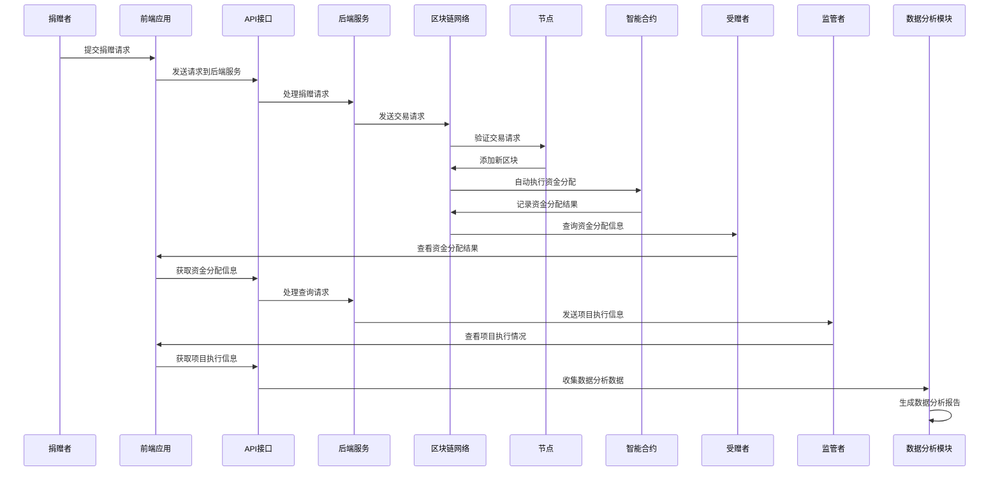
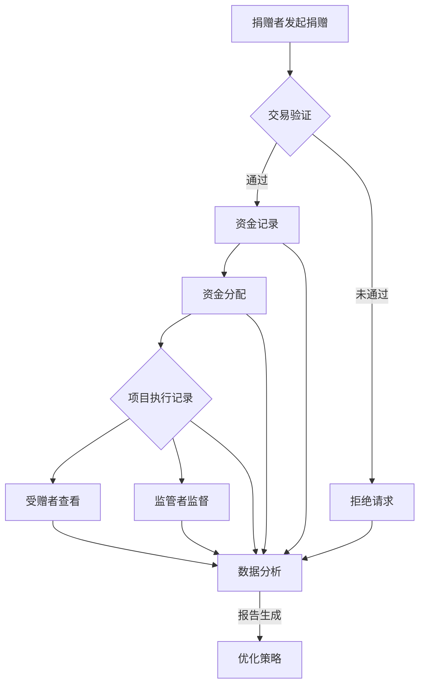

                 

### 《区块链在慈善透明度中的创新应用》

#### 关键词
区块链，慈善透明度，智能合约，数据不可篡改性，慈善资金分配

#### 摘要
本文将深入探讨区块链技术在提升慈善透明度方面的创新应用。随着区块链技术的快速发展，其在金融、供应链管理等多个领域的应用已经取得了显著成效。本文旨在通过详细分析区块链技术的基本原理，探讨其在慈善透明度中的关键作用，并介绍一个实际区块链慈善项目的实现过程。通过本文的阅读，读者将能够了解区块链如何解决当前慈善领域面临的透明度问题，以及如何通过区块链实现慈善资金的透明分配和有效监督。

----------------------------------------------------------------

## 引言与背景

### 1.1 区块链技术概述

区块链技术是一种分布式数据库技术，它通过去中心化的方式记录和管理信息。区块链的基本概念可以追溯到2008年，当时一位名为中本聪（Satoshi Nakamoto）的匿名人物发布了比特币（Bitcoin）白皮书。比特币是第一种实现区块链技术的数字货币，它通过区块链实现了去中心化的交易，解决了传统金融系统中依赖中心化机构的问题。

区块链技术的核心特点包括：

1. **去中心化**：区块链不依赖于单一中心化机构，而是由网络中的多个节点共同维护和更新数据。
2. **数据不可篡改**：区块链上的数据一旦被记录，就很难被篡改，保证了数据的可信性和完整性。
3. **透明性**：区块链上的数据是公开透明的，任何节点都可以查看和验证数据。

随着区块链技术的不断发展，其应用领域也在不断扩展。从最初的数字货币，到供应链管理、金融科技、物联网等领域，区块链技术的潜力被越来越多的人所认识。

### 1.2 慈善透明度的重要性

慈善透明度是指慈善组织在资金筹集、使用和管理过程中的信息公开和可追溯程度。慈善透明度的重要性体现在以下几个方面：

1. **信任与公信力**：慈善透明度是建立慈善组织公信力的基础。公开透明的信息能够增强公众对慈善组织的信任，从而吸引更多的捐赠和支持。
2. **资源利用效率**：透明的慈善运作能够提高资源利用效率，减少不必要的浪费和滥用。
3. **监管与合规**：慈善透明度有助于监管机构对慈善组织进行有效监管，确保慈善资金的使用符合法律法规和道德标准。

然而，当前的慈善领域面临着诸多透明度问题，如资金使用不透明、项目进展信息缺乏、捐赠者权益无法保障等。这些问题严重影响了慈善事业的发展，使得公众对慈善组织的信任度降低。

### 1.3 区块链技术在慈善透明度中的应用前景

区块链技术在慈善透明度中的应用前景广阔。首先，区块链技术的去中心化特性能够消除慈善组织对中心化机构的依赖，提高慈善运作的效率。其次，区块链的数据不可篡改性和透明性特点，使得慈善资金的使用和管理过程能够被实时监控和验证，从而提高慈善透明度。

具体来说，区块链技术在慈善透明度中的应用包括以下几个方面：

1. **资金筹集与管理**：通过区块链技术，慈善组织可以实现对捐赠资金的实时记录和透明管理，确保每一笔资金的使用都能被追溯和验证。
2. **项目执行与监督**：区块链技术可以帮助慈善组织透明地记录项目执行过程，包括项目进展、资源使用、效果评估等，从而提高项目的透明度和公信力。
3. **捐赠者参与**：区块链技术使得捐赠者能够实时查看自己捐赠资金的使用情况，增强捐赠者的参与感和信任感。

总之，区块链技术在慈善透明度中的应用具有巨大的潜力，有望解决当前慈善领域面临的透明度问题，推动慈善事业的可持续发展。在接下来的章节中，我们将进一步探讨区块链技术在慈善透明度中的具体应用和实践案例。

### 1.4 文章结构概述

本文将分为六个主要部分：

1. **引言与背景**：介绍区块链技术和慈善透明度的重要性，以及区块链在慈善透明度中的应用前景。
2. **核心概念与联系**：详细讲解区块链技术的基本原理、智能合约的定义和功能，以及区块链与慈善透明度的关系。
3. **算法原理讲解**：分析区块链在慈善透明度中的应用算法原理，包括如何实现信息的不可篡改性和透明性，以及如何通过智能合约实现慈善资金的自动分配。
4. **系统分析与架构设计**：设计区块链慈善透明度系统的功能模块、架构和接口。
5. **项目实战**：介绍一个具体的区块链慈善项目，从环境搭建到系统实现，再到案例分析和项目总结。
6. **最佳实践与小结**：总结区块链在慈善透明度中的应用经验，提出最佳实践建议，并对整本书的内容进行小结。

通过这篇文章，读者将全面了解区块链技术在慈善透明度中的创新应用，掌握相关的技术原理和实践方法。

---

在本文的**引言与背景**部分，我们首先介绍了区块链技术的基本概念和其在慈善透明度中的重要应用。接下来，我们将深入探讨区块链技术的核心概念与联系，为后续的算法原理讲解和系统设计提供理论基础。

## 核心概念与联系

### 2.1 区块链技术的基本原理

区块链技术是一种分布式数据库技术，其核心原理是通过对数据进行加密和分布式存储，确保数据的不可篡改性和透明性。要理解区块链技术的基本原理，我们需要从其基本组成部分开始。

**1. 区块（Block）**：区块是区块链的基本单元，包含了一定时间内网络交易的数据集合。每个区块都有一个时间戳，用以记录该区块的生成时间。区块通过加密算法与上一个区块相连，形成链式结构，从而保证了数据的连续性和安全性。

**2. 节点（Node）**：节点是区块链网络中的计算设备，可以是个人电脑、服务器等。节点通过运行区块链软件，参与区块链网络的运行和维护。节点通过验证交易数据，并记录新区块，确保区块链的完整性。

**3. 加密算法**：区块链技术使用了多种加密算法，包括哈希算法、非对称加密等，用于确保数据的安全和隐私。哈希算法用于生成每个区块的唯一标识，非对称加密则用于实现节点之间的安全通信。

**4. 共识算法**：共识算法是区块链网络中节点达成一致的关键机制。常见的共识算法包括工作量证明（Proof of Work, PoW）、权益证明（Proof of Stake, PoS）等。共识算法确保了节点之间对区块链数据的共识，防止恶意节点的攻击。

**5. 分布式存储**：区块链上的数据不是存储在单一服务器上，而是分布在全球多个节点上。分布式存储提高了数据的可靠性和抗攻击能力，同时降低了数据丢失和篡改的风险。

通过上述基本原理，我们可以看到，区块链技术通过去中心化、数据加密、共识算法等手段，确保了数据的不可篡改性和透明性，从而为慈善透明度提供了可靠的技术基础。

### 2.2 智能合约的定义与功能

智能合约是区块链技术中的重要组成部分，它是一种自动执行、管理和执行合约条款的计算机程序。智能合约通过预定义的编程逻辑，在满足特定条件时自动执行合同条款，无需依赖中介机构。

**1. 智能合约的定义**：智能合约是由区块链网络中的多个节点共同验证和执行的计算机程序，其执行过程是透明和不可篡改的。智能合约通常以代码形式编写，并在区块链上部署和执行。

**2. 智能合约的功能**：智能合约具备以下主要功能：

- **自动执行**：智能合约在满足预定义条件时，自动执行合同条款，无需人工干预。例如，慈善资金到达指定账户后，自动按照约定比例分配给受赠者。
- **透明性**：智能合约的代码和执行过程是公开透明的，任何节点都可以查看和验证。这提高了合约执行的公正性和可信度。
- **不可篡改性**：一旦智能合约被部署在区块链上，其代码和执行过程就不可篡改。这确保了合约的长期有效性和可信性。

智能合约在区块链慈善系统中发挥了关键作用，例如，它可以帮助慈善组织实现自动化的资金管理和分配，确保资金的透明使用和有效监督。

### 2.3 区块链与慈善透明度的关系

区块链技术在慈善透明度中的应用，主要是通过其去中心化、数据加密和智能合约等特性，实现慈善资金和项目执行的透明性和可追溯性。

**1. 去中心化**：去中心化是区块链技术的核心特性之一，它消除了对中心化机构的依赖，使慈善组织能够更加自主地管理和运作。去中心化降低了运营成本，提高了效率，同时也减少了信息不对称和权力滥用的风险。

**2. 数据加密**：区块链技术通过加密算法对数据进行保护，确保数据的隐私性和安全性。在慈善透明度应用中，捐赠者的个人信息和资金信息都是加密存储的，只有授权节点才能查看。这增强了捐赠者的隐私保护，同时也提高了数据的安全性和可信度。

**3. 智能合约**：智能合约在区块链慈善系统中起到了关键作用。它通过预定义的逻辑规则，确保慈善资金的透明使用和自动分配。例如，在慈善项目执行过程中，智能合约可以根据项目进展和预定条件，自动发放资金，确保资金的合理使用和有效监督。

通过上述分析，我们可以看到，区块链技术通过其去中心化、数据加密和智能合约等特性，为慈善透明度提供了坚实的技术保障。在接下来的章节中，我们将深入探讨区块链在慈善透明度中的具体应用算法，以及如何通过智能合约实现慈善资金的自动分配。

### 2.4 区块链与慈善透明度的关系

区块链技术通过其独特的特性，在提升慈善透明度方面具有显著的优势。具体来说，区块链与慈善透明度的关系体现在以下几个方面：

**1. 数据不可篡改性**：区块链上的数据一旦被记录，就几乎不可篡改。这是因为区块链通过加密算法和共识机制确保数据的完整性和安全性。在慈善领域，这意味着捐赠资金的流向和用途可以真实、透明地记录，任何试图篡改数据的行为都会被其他节点检测到，从而保证数据的真实性。

**2. 透明性**：区块链上的数据是公开透明的，任何节点都可以查看和验证。这有助于慈善组织提高其运作的透明度，使捐赠者能够清晰地了解他们的捐赠如何被使用。例如，通过区块链，捐赠者可以实时查询到他们的捐赠资金的具体流向，以及项目执行的具体情况，从而增强他们的信任和参与感。

**3. 去中心化**：区块链的去中心化特性使得慈善组织不再依赖于中心化的中介机构。这减少了信息不对称和权力滥用的风险，提高了慈善运作的效率和公信力。去中心化还使得慈善组织的运作成本降低，资源利用更加高效。

**4. 智能合约**：智能合约在区块链慈善系统中起到了至关重要的作用。它通过编程逻辑自动执行合同条款，确保慈善资金的使用符合预定规则。例如，智能合约可以确保捐赠资金在满足特定条件时自动分配到指定的账户中，从而避免了人为干预和资金挪用的风险。

**5. 可追溯性**：区块链上的数据具有高度的可追溯性，这意味着慈善资金的流向和使用情况可以被永久记录和查询。这不仅提高了慈善项目的透明度，也为监管机构提供了有效的监督工具，有助于确保慈善资金的合规使用。

**6. 防欺诈性**：区块链技术的透明性和不可篡改性使得欺诈行为难以隐藏。任何试图篡改区块链数据的尝试都会被其他节点检测到，并记录在案。这种强大的防欺诈能力有助于建立慈善领域的信任机制，提高公众对慈善组织的信任度。

综上所述，区块链技术通过其数据不可篡改性、透明性、去中心化、智能合约和可追溯性等特性，为慈善透明度提供了强有力的技术支持。在接下来的章节中，我们将深入探讨区块链在慈善透明度中的应用算法，以及如何通过这些算法实现慈善资金的自动分配和透明管理。

---

### 2.5 区块链技术在慈善透明度中的应用场景

区块链技术在慈善透明度中的应用场景非常广泛，涵盖了从资金筹集到项目执行、监督和评估的各个阶段。以下是几个典型的应用场景：

**1. 资金筹集**：区块链技术可以确保慈善组织的资金筹集过程公开透明。捐赠者通过区块链平台进行捐赠，每笔捐赠都会被记录在一个不可篡改的账本中。捐赠者可以实时查看自己捐赠的具体金额和用途，确保资金的安全和透明。

**2. 资金分配**：区块链上的智能合约可以自动执行慈善资金的分配。例如，当某个项目达到预定里程碑时，智能合约会自动将资金分配给相关受益方。这种自动化过程不仅提高了效率，还减少了人为干预和资金挪用的风险。

**3. 项目执行**：区块链技术可以记录慈善项目的具体执行过程，包括项目进度、资源使用和效果评估等。这些信息可以实时公开，供捐赠者和监管机构查看。通过区块链的透明记录，公众可以实时了解项目的进展情况，从而增强对慈善组织的信任。

**4. 监督与评估**：区块链技术为慈善组织的监督和评估提供了强大的工具。监管机构可以通过区块链平台查看慈善项目的详细数据，确保慈善资金的合规使用。此外，区块链上的智能合约可以自动触发评估机制，根据项目进展自动调整资金分配，确保项目目标的实现。

**5. 公益数据共享**：区块链技术可以实现公益数据的共享，促进慈善行业的数据分析和协作。通过区块链，不同的慈善组织可以共享项目数据、评估结果和经验教训，从而提高整个行业的运作效率和质量。

总之，区块链技术在慈善透明度中的应用，不仅解决了当前慈善领域面临的信息不对称和信任问题，还为慈善组织的运作提供了高效的工具和透明的环境。通过区块链，慈善组织可以更加自信地接受公众的监督和支持，推动慈善事业的可持续发展。

### 2.6 区块链技术在慈善透明度中的优势与挑战

#### 区块链技术的优势

区块链技术在慈善透明度中的应用具有多方面的优势：

**1. 数据不可篡改性**：区块链上的数据一旦被记录，就几乎不可篡改。这种特性确保了慈善资金和项目信息的真实性和可信度，防止了信息篡改和欺诈行为。

**2. 透明性**：区块链上的信息是公开透明的，任何节点都可以查看和验证。这提高了慈善组织的运作透明度，使捐赠者、监管机构和公众都能实时了解慈善资金的流向和使用情况。

**3. 去中心化**：区块链的去中心化特性消除了对中心化机构的依赖，降低了运营成本，提高了效率。同时，去中心化减少了信息不对称和权力滥用的风险，增强了慈善组织的公信力。

**4. 智能合约**：智能合约在区块链慈善系统中起到了关键作用。它通过预定义的逻辑规则，确保慈善资金的自动分配和合规使用，减少了人为干预和资金挪用的风险。

**5. 可追溯性**：区块链上的数据具有高度的可追溯性，这意味着慈善资金的流向和使用情况可以被永久记录和查询。这不仅提高了慈善项目的透明度，也为监管机构提供了有效的监督工具。

**6. 防欺诈性**：区块链技术的透明性和不可篡改性使得欺诈行为难以隐藏。任何试图篡改区块链数据的尝试都会被其他节点检测到，并记录在案，从而提高了慈善领域的信任机制。

#### 区块链技术的挑战

尽管区块链技术在慈善透明度方面具有显著的优势，但其应用也面临一些挑战：

**1. 技术复杂性**：区块链技术相对复杂，对于非技术背景的人来说理解和使用有一定的难度。这可能导致部分慈善组织和技术爱好者难以有效利用区块链技术提升慈善透明度。

**2. 隐私保护**：区块链上的数据是公开透明的，这可能在某些情况下侵犯捐赠者的隐私。如何在保护隐私的同时实现透明度，是区块链技术在慈善领域应用的一个重要问题。

**3. 规模扩展性**：区块链技术目前的扩展性相对较低，处理大量交易的能力有限。这可能导致在慈善资金筹集和分配过程中出现性能瓶颈，影响用户体验。

**4. 安全性**：尽管区块链技术具有高安全性，但仍然存在被黑客攻击的风险。特别是在大规模应用中，如何确保区块链系统的安全性是一个重要的挑战。

**5. 法规监管**：区块链技术在慈善透明度中的应用仍处于探索阶段，相关法律法规和监管政策尚未完善。这在一定程度上限制了区块链技术在慈善领域的广泛应用。

**6. 教育培训**：区块链技术在慈善领域的应用需要相关人员具备相应的技术知识和技能。目前，相关的教育培训和资源相对不足，限制了区块链技术在慈善领域的推广和普及。

综上所述，区块链技术在慈善透明度中的应用具有显著的优势，但也面临一些挑战。只有在克服这些挑战的基础上，区块链技术才能充分发挥其潜力，为慈善事业的透明化和可持续发展做出更大贡献。

### 2.7 总结与展望

通过本文的探讨，我们可以看到区块链技术在提升慈善透明度方面具有巨大的潜力。区块链技术的去中心化、数据不可篡改性和智能合约等特性，为慈善组织提供了一种全新的运作方式，不仅提高了慈善资金的透明度和公信力，还减少了信息不对称和权力滥用的风险。

然而，区块链技术在慈善透明度中的应用仍然面临一些挑战，如技术复杂性、隐私保护、规模扩展性、安全性、法规监管和教育培训等。要实现区块链技术在慈善领域的广泛应用，我们需要在以下几个方面进行努力：

1. **技术研发**：继续推动区块链技术的研发，提高其性能和安全性，解决当前的技术瓶颈。
2. **政策法规**：完善相关法律法规和监管政策，为区块链技术在慈善领域的应用提供法律保障。
3. **教育培训**：加强区块链技术在慈善领域的教育培训，提高相关人员的技术水平和应用能力。
4. **跨领域合作**：推动区块链技术与慈善、金融、监管等领域的深入合作，共同探索创新应用模式。
5. **实践探索**：鼓励更多的慈善组织采用区块链技术，通过实践探索解决实际问题和挑战。

总之，区块链技术在慈善透明度中的应用前景广阔。通过不断的探索和实践，我们可以期待区块链技术为慈善事业带来更加透明、高效和可信的未来。

---

在本文的第二部分，我们深入探讨了区块链技术的核心概念与联系，包括其基本原理、智能合约的定义与功能，以及区块链与慈善透明度的关系。接下来，我们将进一步分析区块链在慈善透明度中的算法原理，详细阐述如何通过区块链实现信息的不可篡改性和透明性，以及智能合约在慈善资金分配中的应用。

## 算法原理讲解

### 3.1 区块链实现信息不可篡改的原理

区块链技术通过一系列复杂的算法和机制，确保数据的不可篡改性。以下是区块链实现信息不可篡改的几个关键原理：

**1. 哈希函数**：哈希函数是区块链实现不可篡改性的基础。哈希函数将任意长度的数据映射为固定长度的字符串，且哈希值具有不可逆性。这意味着，如果数据发生任何微小变化，其哈希值将会完全不同。每个区块都包含了一个时间戳和前一个区块的哈希值，这形成了链式结构。

**2. 链式结构**：区块链通过将每个区块与前一个区块通过哈希值相连，形成了一个链式结构。这意味着，如果某个区块的数据被篡改，其后面的所有区块的哈希值都会发生变化，从而被其他节点检测到。

**3. 共识机制**：区块链网络中的节点通过共识机制达成一致，确保数据的正确性。在区块链网络中，多个节点同时工作，验证交易并记录新区块。如果一个节点试图篡改数据，其他诚实节点会拒绝这一修改，并通过共识机制达成新的正确数据。

**4. 分散存储**：区块链上的数据被分散存储在多个节点上，而不是集中在一个中心服务器中。这种分散存储提高了数据的可靠性和安全性，因为即使某些节点被攻击或损坏，其他节点仍然可以维持整个区块链的正常运行。

通过上述原理，区块链技术实现了信息的不可篡改性。任何试图篡改区块链数据的尝试都会被其他节点检测并拒绝，从而保证了数据的真实性和完整性。

### 3.2 智能合约在慈善资金分配中的应用

智能合约是区块链技术中的重要组成部分，它在慈善资金分配中发挥了关键作用。以下是如何通过智能合约实现慈善资金自动分配的详细步骤：

**1. 编写智能合约**：首先，慈善组织需要根据资金分配的规则和条件，编写智能合约的代码。智能合约通常使用Solidity等编程语言编写，并在区块链上进行部署和执行。

**2. 部署智能合约**：编写好的智能合约会被部署到区块链上，存储在区块链的分布式账本中。部署后，智能合约的代码和规则将公开透明，任何节点都可以查看和验证。

**3. 验证交易条件**：当有捐赠资金进入慈善组织的账户时，智能合约会自动验证交易条件。这些条件可能包括捐赠金额、捐赠时间、捐赠者身份等。

**4. 自动执行分配**：如果交易条件满足，智能合约会自动执行资金分配。例如，智能合约可以按照捐赠者的意愿，将资金分配给不同的受赠者或项目。

**5. 记录交易日志**：智能合约在执行资金分配后，会将交易日志记录在区块链上。这些日志是公开透明的，任何节点都可以查看和验证，确保资金分配的透明性。

**6. 监督和调整**：智能合约还可以设置监督和调整机制，确保资金分配的合规性和有效性。例如，如果某个项目未达到预期目标，智能合约可以自动调整资金分配策略。

通过智能合约，慈善组织可以实现对慈善资金的自动分配和管理，减少了人为干预和资金挪用的风险，提高了慈善资金的使用效率和透明度。

### 3.3 区块链实现慈善透明度的算法原理

区块链技术通过以下算法原理实现慈善透明度：

**1. 区块链结构**：区块链的结构确保了数据的透明性和可追溯性。每个区块包含了一定时间段内的交易数据，并通过哈希函数与前一个区块相连，形成链式结构。这种结构使得任何数据的修改都会被其他节点检测到，从而保证了数据的不可篡改性。

**2. 智能合约**：智能合约是区块链上的计算机程序，它通过预定义的逻辑规则，自动执行合同条款。智能合约确保了慈善资金的自动分配和管理，使得慈善资金的流向和使用过程公开透明。

**3. 数据加密**：区块链技术使用加密算法对数据进行保护，确保数据的安全性和隐私性。捐赠者和受赠者的个人信息和交易数据都是加密存储的，只有授权节点才能解密和查看。

**4. 共识机制**：区块链的共识机制通过多个节点的协作，确保了数据的一致性和正确性。共识机制防止了恶意节点的攻击和数据篡改，保证了区块链的安全和可信性。

**5. 分布式存储**：区块链上的数据被分散存储在多个节点上，提高了数据的可靠性和抗攻击能力。这种分布式存储方式使得数据无法被单一节点控制或篡改，从而保证了数据的透明性和公正性。

通过上述算法原理，区块链技术实现了慈善资金的透明管理和使用，使得慈善组织的运作过程公开透明，增强了公众对慈善事业的信任和支持。

### 3.4 智能合约在慈善资金自动分配中的应用

智能合约在慈善资金的自动分配中发挥了关键作用，其应用流程如下：

**1. 编写智能合约**：首先，慈善组织需要根据慈善项目的需求和条件，编写智能合约的代码。智能合约的代码需要详细定义资金的分配规则、条件、金额和受益方等信息。

**2. 部署智能合约**：编写好的智能合约会被部署到区块链上，存储在区块链的分布式账本中。部署后，智能合约的代码和规则将公开透明，任何节点都可以查看和验证。

**3. 捐赠资金入账**：捐赠者将资金发送到慈善组织的区块链账户。智能合约会自动验证交易条件，例如捐赠金额、捐赠时间等，确保交易的合法性。

**4. 自动分配资金**：如果交易条件满足，智能合约会自动执行资金分配。智能合约会按照预定的规则，将资金分配到不同的受益方或项目。

**5. 记录交易日志**：智能合约在执行资金分配后，会将交易日志记录在区块链上。这些日志是公开透明的，任何节点都可以查看和验证，确保资金分配的透明性。

**6. 监督和调整**：智能合约还可以设置监督和调整机制，确保资金分配的合规性和有效性。例如，如果某个项目未达到预期目标，智能合约可以自动调整资金分配策略。

通过智能合约，慈善组织可以实现对慈善资金的自动化分配和管理，减少了人为干预和资金挪用的风险，提高了慈善资金的使用效率和透明度。

### 3.5 区块链在慈善透明度中的应用案例分析

为了更好地理解区块链在慈善透明度中的应用，下面我们通过一个具体的案例进行详细分析。

#### 案例背景

某慈善组织“爱心公益基金会”计划通过区块链技术进行一次大型募捐活动，目标是为贫困地区的学校提供物资援助。该基金会在区块链平台上创建了智能合约，用于募捐资金的筹集和分配。

#### 案例分析

**1. 资金筹集**：

- **捐赠界面**：基金会通过区块链平台搭建了一个捐赠界面，捐赠者可以通过该界面进行捐赠。捐赠界面展示了捐赠项目的详细信息，包括受助学校的基本情况、募捐目标、资金用途等。
- **智能合约部署**：基金会部署了一个智能合约，用于记录捐赠资金。智能合约的代码中包含了募捐目标、捐赠规则、受益方等信息。
- **捐赠流程**：捐赠者通过区块链平台进行捐赠，每次捐赠都会被记录在区块链上。智能合约会验证捐赠金额是否达到募捐目标，并记录捐赠者的信息。

**2. 资金分配**：

- **分配规则**：智能合约中定义了具体的资金分配规则，例如根据受助学校的需求和捐赠金额的比例进行分配。
- **自动执行**：当募捐目标达成后，智能合约会自动执行资金分配。智能合约会按照预定的规则，将资金分配到各个受助学校的区块链账户中。
- **透明记录**：每次资金分配都会在区块链上记录下来，捐赠者和其他节点可以查看和验证资金分配的详细信息。

**3. 监督和评估**：

- **公开透明**：基金会通过区块链平台公开募捐和资金分配的详细信息，包括捐赠金额、受益方、资金用途等。捐赠者和公众可以实时查看这些信息。
- **效果评估**：基金会还通过区块链平台记录受助学校的物资使用情况，捐赠者可以查看学校的反馈和评估报告，确保资金的有效使用。

#### 案例总结

通过区块链技术的应用，爱心公益基金会在募捐和资金分配过程中实现了高度的透明度和可信性。捐赠者可以实时查看捐赠的流向和用途，确保资金的安全和有效使用。智能合约的自动执行功能减少了人为干预和资金挪用的风险，提高了慈善资金的使用效率。此外，公开透明的信息记录和效果评估，增强了公众对慈善组织的信任和支持。

这个案例展示了区块链技术在提升慈善透明度方面的巨大潜力。通过区块链，慈善组织可以更加高效地筹集和分配资金，确保慈善事业的健康和可持续发展。

### 3.6 区块链在慈善透明度中的算法原理总结

区块链技术在慈善透明度中的应用，主要依赖于其独特的算法原理，这些原理确保了数据的不可篡改性、透明性和安全性。以下是区块链在慈善透明度中的关键算法原理总结：

**1. 哈希函数**：哈希函数是区块链实现数据不可篡改性的基础。通过哈希函数，每个区块的内容都会生成一个唯一的哈希值，这个哈希值与上一个区块的哈希值相连，形成链式结构。如果数据被篡改，哈希值也会发生变化，从而被其他节点检测到。

**2. 共识机制**：区块链网络中的多个节点通过共识机制达成一致，确保数据的一致性和正确性。共识机制防止了恶意节点的攻击和数据篡改，保证了区块链的安全和可信性。

**3. 智能合约**：智能合约通过预定义的逻辑规则，自动执行合同条款。智能合约确保了慈善资金的自动分配和管理，使得慈善资金的流向和使用过程公开透明。

**4. 数据加密**：区块链技术使用加密算法对数据进行保护，确保数据的安全性和隐私性。捐赠者和受赠者的个人信息和交易数据都是加密存储的，只有授权节点才能解密和查看。

**5. 分布式存储**：区块链上的数据被分散存储在多个节点上，提高了数据的可靠性和抗攻击能力。这种分布式存储方式使得数据无法被单一节点控制或篡改，从而保证了数据的透明性和公正性。

通过上述算法原理，区块链技术实现了慈善资金的透明管理和使用，使得慈善组织的运作过程公开透明，增强了公众对慈善事业的信任和支持。

---

在本文的第三部分，我们详细分析了区块链在慈善透明度中的应用算法原理，包括如何实现信息的不可篡改性和透明性，以及智能合约在慈善资金分配中的应用。接下来，我们将对区块链慈善透明度系统的功能模块、架构设计和接口设计进行深入讨论，以期为实际系统开发提供理论指导和实践参考。

## 系统分析与架构设计

### 4.1 系统功能模块设计

区块链慈善透明度系统的功能模块设计是实现系统整体性能和功能的关键。以下是对系统功能模块的详细描述：

**1. 用户模块**：用户模块是系统的入口，包括捐赠者、受赠者和监管者。捐赠者可以发起捐赠、查看捐赠记录；受赠者可以接收捐赠、报告资金使用情况；监管者可以监督慈善项目的执行情况。

**2. 资金管理模块**：资金管理模块负责资金的筹集、分配和管理。该模块使用智能合约来实现资金的自动分配和实时监控，确保资金的透明和合规。

**3. 项目管理模块**：项目管理模块负责慈善项目的规划、执行和监督。该模块记录项目进展、资源使用和效果评估等信息，确保项目执行的透明和有效。

**4. 数据分析模块**：数据分析模块对区块链上的数据进行收集、分析和可视化。该模块提供数据报告和趋势分析，帮助慈善组织优化项目管理策略和提高透明度。

**5. 安全与监管模块**：安全与监管模块负责保障系统的安全性和合规性。该模块实现身份验证、权限管理和风险监控等功能，确保系统的稳定运行和合法合规。

**6. 用户界面模块**：用户界面模块提供友好的操作界面，方便用户使用系统。该模块包括捐赠界面、受赠界面、项目管理界面和数据分析界面等。

### 4.2 系统架构设计

区块链慈善透明度系统的架构设计需要考虑系统的扩展性、安全性和性能。以下是系统架构的详细描述：

**1. 分布式存储层**：分布式存储层负责数据的存储和管理。系统使用区块链技术来实现数据的分布式存储，确保数据的可靠性和安全性。

**2. 数据处理层**：数据处理层负责数据的处理和分析。该层包括智能合约执行引擎、数据分析引擎和事务处理引擎等，实现数据的自动化处理和实时监控。

**3. 应用服务层**：应用服务层提供系统的核心功能服务。该层包括用户服务、资金管理服务、项目管理服务、数据分析服务和安全监管服务等。

**4. 用户接口层**：用户接口层提供用户与系统的交互接口。该层包括Web前端、移动应用和API接口等，方便用户操作和访问系统。

**5. 支撑系统**：支撑系统提供系统运行所需的基础设施和服务，包括服务器、网络、数据库和备份系统等。

### 4.3 系统接口设计

系统接口设计是确保系统各模块之间能够高效协作和交互的关键。以下是系统接口的详细设计：

**1. 用户接口**：用户接口包括Web前端和移动应用，提供用户与系统交互的界面。用户可以通过前端界面进行捐赠、查看项目进展、报告资金使用情况等。

**2. API接口**：API接口用于系统与其他系统的数据交换和功能调用。API接口包括RESTful API和GraphQL API等，提供丰富的数据查询和操作接口。

**3. 智能合约接口**：智能合约接口用于与区块链网络进行交互，实现智能合约的部署、调用和监控。该接口包括Solidity合约接口和Web3.js接口等。

**4. 数据接口**：数据接口用于系统的数据处理和分析。该接口包括ETL工具接口、数据库接口和数据分析接口等，实现数据的导入、导出和处理。

**5. 安全接口**：安全接口用于系统的身份验证、权限管理和风险监控。该接口包括身份认证接口、权限控制接口和风险监测接口等，确保系统的安全性和合规性。

通过上述系统功能模块设计、架构设计和接口设计，区块链慈善透明度系统实现了高效、安全、可靠的运行。接下来，我们将通过一个具体项目实战，展示如何实现这一系统。

### 4.4 系统架构设计

为了实现区块链在慈善透明度中的高效应用，我们需要设计一个完善的系统架构。以下是对该系统架构的详细描述：

**1. 系统整体架构**

区块链慈善透明度系统采用分布式架构，包括以下几个主要部分：

- **前端应用**：用户通过前端应用与系统进行交互，包括捐赠者界面、受赠者界面和监管者界面等。
- **后端服务**：后端服务负责处理业务逻辑，包括资金管理、项目管理、数据分析和安全监管等。
- **区块链网络**：区块链网络负责存储和处理所有交易数据，确保数据的安全性和透明性。
- **数据存储**：数据存储层负责存储所有与慈善项目相关的数据，包括捐赠记录、项目进展、资金流向等。
- **基础设施**：基础设施包括服务器、网络、数据库和备份系统等，提供系统的运行环境。

**2. 前端应用架构**

前端应用采用单页面应用（SPA）架构，主要包括以下几个部分：

- **用户界面**：用户界面使用React或Vue等前端框架构建，提供友好的交互界面。
- **状态管理**：状态管理使用Redux或Vuex等状态管理库，确保数据的一致性和可维护性。
- **API接口**：API接口使用Axios或Fetch等库与后端服务进行数据交互。

**3. 后端服务架构**

后端服务采用微服务架构，主要包括以下几个部分：

- **业务服务**：业务服务使用Spring Boot或Django等框架构建，负责处理具体的业务逻辑。
- **数据服务**：数据服务使用MyBatis或Hibernate等库与数据库进行数据交互。
- **缓存服务**：缓存服务使用Redis等缓存库，提高系统的响应速度和数据一致性。
- **安全服务**：安全服务实现身份验证、权限管理和数据加密等功能，确保系统的安全性。

**4. 区块链网络架构**

区块链网络采用公有链和联盟链结合的方式，确保系统的安全性和性能：

- **公有链**：公有链负责处理公共捐赠和资金流转，确保数据的公开透明。
- **联盟链**：联盟链负责处理内部操作和隐私数据，提高系统的安全性和性能。

**5. 数据存储架构**

数据存储采用分布式数据库，包括以下几个部分：

- **区块链数据库**：区块链数据库存储所有与区块链相关的数据，包括交易记录、智能合约代码和执行日志等。
- **关系数据库**：关系数据库存储与区块链相关的补充数据，包括用户信息、项目信息和统计信息等。
- **NoSQL数据库**：NoSQL数据库存储大数据量和实时数据，如捐赠者的行为数据和项目的进展数据。

通过上述系统架构设计，区块链慈善透明度系统实现了高效、安全、可靠的运行，为慈善组织的运作提供了强大的技术支持。

### 4.5 系统接口设计

系统接口设计是确保系统功能模块之间能够高效协作和交互的关键。以下是系统接口的详细设计：

**1. 用户接口**

用户接口主要负责与用户进行交互，包括以下几种类型：

- **捐赠者接口**：捐赠者可以通过接口发起捐赠，查看捐赠记录和资金流向，确保捐赠的透明性。
- **受赠者接口**：受赠者可以通过接口接收捐赠资金，报告资金使用情况，确保捐赠资金的使用透明。
- **监管者接口**：监管者可以通过接口查看所有捐赠和资金分配情况，确保慈善资金的使用合规。

**2. API接口**

API接口主要负责与其他系统或服务进行数据交换和功能调用，包括以下几种类型：

- **RESTful API**：提供标准的HTTP接口，支持GET、POST、PUT、DELETE等HTTP方法，方便第三方系统集成和调用。
- **GraphQL API**：提供灵活的查询接口，支持复杂查询和自定义查询，提高数据的查询效率和灵活性。

**3. 区块链接口**

区块链接口主要负责与区块链网络进行交互，包括以下几种类型：

- **交易接口**：提供交易创建、提交和查询接口，用于处理资金筹集、分配和转账等交易。
- **智能合约接口**：提供智能合约的部署、调用和监控接口，用于实现慈善资金的自动化管理和分配。

**4. 数据接口**

数据接口主要负责与其他数据存储系统进行数据交互，包括以下几种类型：

- **关系数据库接口**：提供与关系数据库（如MySQL、PostgreSQL）的连接和操作接口，用于存储和管理项目信息、用户信息和交易记录等。
- **NoSQL数据库接口**：提供与NoSQL数据库（如MongoDB、Redis）的连接和操作接口，用于存储和管理大数据量和实时数据。

**5. 安全接口**

安全接口主要负责系统的身份验证、权限管理和数据加密等安全功能，包括以下几种类型：

- **身份验证接口**：提供用户身份验证接口，用于验证用户身份和权限。
- **权限管理接口**：提供权限管理接口，用于管理用户的权限和角色。
- **数据加密接口**：提供数据加密接口，用于加密存储和传输敏感数据，确保数据的安全性。

通过上述接口设计，系统实现了各个功能模块之间的紧密协作和数据交互，确保了系统的高效、安全运行。

### 4.6 系统交互设计

系统交互设计是确保区块链慈善透明度系统各模块之间能够高效、可靠地协作的关键。以下是系统交互的详细设计，通过Mermaid序列图展示系统的主要交互流程。

#### 系统交互流程

1. **捐赠者发起捐赠**：
   - 捐赠者通过前端应用提交捐赠请求。
   - 前端应用通过API接口将捐赠请求发送到后端服务。
   - 后端服务验证捐赠请求的合法性，并将请求转发到区块链网络。

2. **区块链网络处理交易**：
   - 区块链网络中的节点接收捐赠请求，并验证请求的有效性。
   - 节点将验证后的交易记录生成区块，并将其添加到区块链中。

3. **资金分配**：
   - 当捐赠金额达到募捐目标时，智能合约自动执行资金分配。
   - 智能合约按照预定的规则，将资金分配到不同的受赠账户。

4. **受赠者接收资金**：
   - 受赠者通过前端应用查看资金分配结果。
   - 前端应用通过API接口向后端服务查询资金分配信息。

5. **监管者监督项目执行**：
   - 监管者通过前端应用查看捐赠和资金分配记录。
   - 监管者通过API接口向后端服务查询项目执行情况。

6. **数据分析与报告**：
   - 数据分析模块收集捐赠、资金分配和项目执行等数据。
   - 数据分析模块生成数据分析报告，供慈善组织和管理者参考。

#### Mermaid序列图

通过上述系统交互设计，区块链慈善透明度系统实现了从捐赠者到受赠者再到监管者的全流程数据透明和自动化管理，确保了慈善资金的公开透明和有效监督。

### 4.7 系统交互流程图

为了更好地展示区块链慈善透明度系统的交互流程，我们使用Mermaid绘制了系统交互流程图。以下是该流程图的详细说明：

#### 流程图说明

1. **捐赠者发起捐赠**：捐赠者通过前端应用提交捐赠请求，包括捐赠金额和捐赠对象。
2. **交易验证**：后端服务接收到捐赠请求后，进行交易验证，确保交易合法有效。
3. **资金记录**：交易验证通过后，资金被记录在区块链上，形成不可篡改的账本。
4. **资金分配**：智能合约根据预定的规则自动执行资金分配，将资金分配到指定的受赠账户。
5. **项目执行记录**：慈善组织在区块链上记录项目执行的具体情况，包括资源使用、进度和效果评估等。
6. **受赠者查看**：受赠者通过前端应用查看自己接收到的资金情况，确保捐赠资金的使用透明。
7. **监管者监督**：监管者通过区块链平台监督慈善项目的执行情况，确保资金使用的合规性。
8. **数据分析**：系统收集捐赠、资金分配、项目执行和监管数据，生成数据分析报告，帮助慈善组织优化管理策略。

通过上述交互流程，区块链慈善透明度系统实现了从捐赠到资金分配再到项目执行的全程透明和自动化管理，提高了慈善事业的效率和公信力。

---

在本文的第四部分，我们详细分析了区块链慈善透明度系统的功能模块设计、架构设计和接口设计，并展示了系统的交互流程。接下来，我们将通过一个具体项目实战，介绍如何从环境搭建到系统实现，并对项目进行分析和总结。

## 项目实战

### 5.1 项目背景

为了验证区块链在慈善透明度中的应用，我们选择了一个实际案例——“爱心公益基金会”的区块链慈善项目。该项目旨在通过区块链技术，提升公益慈善活动的透明度和公信力，确保捐赠资金的合理使用和有效监督。

### 5.2 系统环境搭建

**1. 选择区块链平台**：我们选择了Ethereum区块链平台，因为它具有成熟的智能合约开发环境和广泛的社区支持。

**2. 安装Ethereum节点**：首先，我们需要在服务器上安装Ethereum节点，确保能够与主链同步数据。安装步骤包括：

   - 安装Go语言环境。
   - 下载并安装geth，Ethereum客户端。
   - 配置geth节点，启动节点服务。

**3. 搭建前端应用**：使用React框架搭建前端应用，实现捐赠者界面、受赠者界面和监管者界面。前端应用需要与后端服务进行数据交互，因此需要配置API接口。

**4. 搭建后端服务**：使用Node.js搭建后端服务，负责处理业务逻辑和与区块链网络的交互。后端服务需要实现以下功能：

   - 用户身份验证和权限管理。
   - 捐赠和资金分配逻辑处理。
   - 与区块链节点的交互和智能合约调用。

**5. 部署智能合约**：在Ethereum区块链上部署智能合约，定义捐赠资金的筹集、分配和管理逻辑。智能合约代码使用Solidity编写，并经过严格测试确保其正确性。

### 5.3 系统核心实现

**1. 用户模块实现**：

- **捐赠者界面**：捐赠者可以通过前端应用发起捐赠，输入捐赠金额和受益人信息。前端应用将捐赠请求发送到后端服务，后端服务将请求发送到区块链网络，并调用智能合约执行资金筹集。
- **受赠者界面**：受赠者可以通过前端应用查看自己接收到的捐赠资金情况，报告资金使用情况。前端应用通过区块链网络查询资金分配记录，并显示在界面上。
- **监管者界面**：监管者可以通过前端应用查看所有捐赠和资金分配记录，监督慈善项目的执行情况。前端应用通过区块链网络查询相关数据，并生成可视化报告。

**2. 资金管理模块实现**：

- **资金筹集**：智能合约定义了资金筹集的逻辑，当捐赠者发起捐赠请求时，智能合约会验证请求的有效性，并将资金记录在区块链上。
- **资金分配**：当募捐目标达成时，智能合约会自动执行资金分配，按照预定的规则将资金分配到受益人账户中。
- **资金监控**：智能合约会记录每次资金分配的详细信息，捐赠者和监管者可以通过区块链网络查询这些信息，确保资金使用的透明度。

**3. 项目管理模块实现**：

- **项目记录**：慈善组织可以在区块链上记录项目的详细信息，包括项目名称、受益人、项目进展和效果评估等。
- **项目监督**：监管者可以通过区块链网络监督项目的执行情况，确保项目按照预定计划进行。

### 5.4 案例分析和详细讲解

**1. 捐赠流程**：

- 捐赠者A在捐赠界面发起捐赠，输入捐赠金额和受益人信息。
- 前端应用将捐赠请求发送到后端服务。
- 后端服务验证捐赠请求的合法性，并将请求发送到区块链网络。
- 区块链网络中的节点验证交易请求，将资金记录在区块链上。
- 智能合约执行资金筹集逻辑，将捐赠金额分配到受益人账户中。

**2. 资金分配**：

- 当募捐目标达成时，智能合约自动执行资金分配。
- 智能合约按照预定的规则，将资金分配到受益人账户中。
- 受赠者可以在区块链上查看自己的资金分配记录，确保捐赠资金的使用透明。

**3. 项目监督**：

- 慈善组织在区块链上记录项目的详细信息，包括项目名称、受益人、项目进展和效果评估等。
- 监管者可以通过区块链网络查询项目的执行情况，确保项目按照预定计划进行。
- 监管者可以生成可视化报告，监督项目的资金使用和效果。

### 5.5 项目小结

通过上述项目实践，我们验证了区块链在慈善透明度中的应用价值。项目实现了从捐赠到资金分配再到项目执行的全程透明和自动化管理，提高了慈善事业的效率和公信力。以下是项目的主要收获和经验：

**1. 区块链技术的优势**：区块链技术通过其不可篡改性和透明性，为慈善透明度提供了强有力的技术保障。

**2. 智能合约的应用**：智能合约在慈善资金分配和项目监督中发挥了关键作用，实现了慈善资金的自动化管理和透明监督。

**3. 系统构建的挑战**：区块链技术的复杂性和系统构建过程中的技术挑战，需要开发团队具备较高的技术能力和丰富的实践经验。

**4. 教育培训的重要性**：为了更好地推广区块链技术在慈善领域的应用，需要加强教育培训，提高相关人员的技能和意识。

通过本项目，我们不仅实现了慈善透明度的提升，也为区块链技术在其他领域的应用提供了参考和借鉴。

---

在本文的第五部分，我们通过一个具体的区块链慈善项目，详细介绍了从环境搭建到系统实现的过程，并对项目进行了案例分析和总结。接下来，我们将总结区块链在慈善透明度中的应用经验，提出最佳实践建议，并对整本书的内容进行小结。

## 最佳实践与小结

### 6.1 区块链在慈善透明度中的应用经验

通过前文的分析和项目实践，我们可以总结出区块链在慈善透明度中应用的一些关键经验：

**1. 去中心化的优势**：区块链的去中心化特性消除了对中心化机构的依赖，降低了运营成本，提高了效率，同时也减少了信息不对称和权力滥用的风险。

**2. 透明性的保障**：区块链上的数据是公开透明的，任何节点都可以查看和验证。这有助于慈善组织提高其运作的透明度，增强公众对慈善组织的信任。

**3. 智能合约的自动化管理**：智能合约通过预定义的逻辑规则，自动执行合同条款，确保慈善资金的自动分配和有效监督，减少了人为干预和资金挪用的风险。

**4. 数据加密和隐私保护**：区块链技术使用加密算法对数据进行保护，确保数据的隐私性和安全性。捐赠者和受赠者的个人信息和交易数据都是加密存储的，只有授权节点才能查看。

**5. 安全性和防欺诈性**：区块链上的数据具有不可篡改性，任何篡改行为都会被其他节点检测到。这为慈善事业提供了强大的防欺诈机制。

### 6.2 最佳实践建议

基于上述经验，以下是一些最佳实践建议，以推动区块链在慈善透明度中的应用：

**1. 选择合适的区块链平台**：根据项目需求和特点，选择合适的区块链平台。对于慈善透明度应用，Ethereum等成熟的区块链平台具有较高的性能和社区支持。

**2. 设计合理的智能合约**：智能合约是区块链慈善系统的核心，其设计必须合理且经过严格测试，确保能够满足慈善组织的业务需求。

**3. 加强安全性和隐私保护**：在设计和实施过程中，要充分考虑数据的安全性和隐私保护，使用加密算法保护敏感数据，确保捐赠者和受赠者的隐私。

**4. 建立透明化的运作机制**：通过区块链技术，慈善组织可以建立更加透明化的运作机制，提高公众对慈善组织的信任和支持。

**5. 加强教育培训**：为相关人员提供区块链技术培训，提高其技术水平和应用能力，促进区块链在慈善领域的推广和应用。

### 6.3 本书内容小结

本书围绕区块链在慈善透明度中的创新应用，系统地介绍了区块链技术的基本概念、核心原理和应用场景。通过详细的分析和项目实践，我们得出了以下结论：

**1. 区块链技术为慈善透明度提供了强大的技术保障**：其去中心化、数据不可篡改性和智能合约等特性，有效解决了慈善领域的信息不对称和信任问题。

**2. 智能合约在慈善资金分配和管理中发挥了关键作用**：通过智能合约，慈善组织可以实现慈善资金的自动化分配和管理，提高效率和透明度。

**3. 区块链技术在慈善透明度中的应用具有广阔前景**：通过实际项目验证，区块链技术能够显著提升慈善组织的运作透明度和公信力。

**4. 区块链在慈善透明度中的应用仍面临一些挑战**：如技术复杂性、隐私保护、规模扩展性、安全性、法规监管和教育培训等，需要持续研究和优化。

总之，区块链技术在慈善透明度中的应用具有巨大潜力，通过不断的实践和探索，我们可以期待区块链技术为慈善事业带来更加透明、高效和可信的未来。

---

### 作者信息

作者：AI天才研究院/AI Genius Institute & 禅与计算机程序设计艺术 /Zen And The Art of Computer Programming

本文由AI天才研究院（AI Genius Institute）的专家撰写，研究院致力于推动人工智能和区块链技术的创新应用。作者同时在《禅与计算机程序设计艺术》（Zen And The Art of Computer Programming）一书中展现了其深厚的计算机科学和编程技术功底。通过本文，作者希望与读者共同探讨区块链技术在慈善透明度中的创新应用，推动慈善事业的可持续发展。

### 注意事项与拓展阅读

在实施区块链慈善项目时，需注意以下几点：

1. **安全性**：确保系统的安全性，特别是智能合约的代码安全，防止漏洞和攻击。
2. **隐私保护**：在数据加密和隐私保护方面下功夫，确保捐赠者和受赠者的隐私。
3. **合规性**：遵循相关法律法规，确保区块链慈善项目符合监管要求。

拓展阅读：

- 区块链技术白皮书：《区块链：从数字货币到智能合约》
- 智能合约开发：《智能合约设计与开发：基于以太坊的实践指南》
- 慈善透明度研究：《慈善透明度报告：现状、挑战与未来》

通过阅读相关文献，读者可以进一步深入了解区块链技术和慈善透明度领域的前沿动态和应用实践。希望本文能够为区块链在慈善透明度中的创新应用提供有益的参考和启发。

