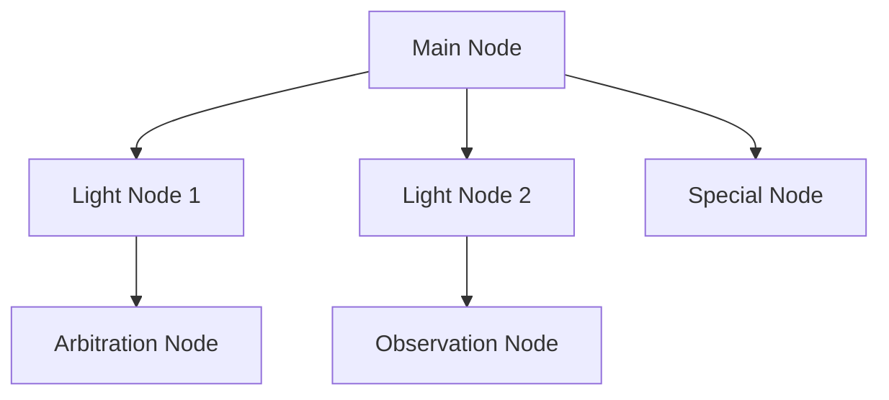

                 

### 1. 背景介绍

区块链，一种分布式账本技术，起源于2008年，由一位化名为中本聪的学者首次提出。它通过加密算法和数据结构，确保数据的安全性和不可篡改性。区块链的核心概念包括区块、链、节点和共识机制。每一个区块都包含一定数量的事务记录，这些记录按时间顺序链接形成链，节点则是区块链网络中的参与者，共识机制则确保所有节点对账本的一致性。

数字内容分发是指通过网络将数字化的信息，如音乐、视频、书籍等，从内容创作者传递到消费者手中的过程。随着互联网的普及和数字技术的发展，数字内容分发已经成为了文化产业的重要组成部分。然而，数字内容分发过程中也面临诸多挑战，其中最为显著的就是版权保护问题。

版权保护是指通过法律和技术的手段，保护创作者对其作品的合法权益，包括著作权的归属、使用和转让等。在数字内容分发中，版权保护尤为重要，因为数字内容的复制和传播非常容易，传统的版权保护手段已经无法满足需求。版权保护不仅关系到创作者的利益，也关系到整个文化产业的健康发展。

本篇博客的目标是深入探讨区块链在数字内容分发中的版权保护应用。我们将从以下几个方面进行探讨：

1. **核心概念与联系**：介绍区块链、数字内容分发以及版权保护的基本概念，并探讨它们之间的联系。
2. **算法原理讲解**：介绍区块链在版权保护中的应用算法，包括非交互证明、智能合约和加密技术等。
3. **数学模型和数学公式讲解**：解释与版权保护相关的数学模型，如哈希函数、椭圆曲线加密等。
4. **系统分析与架构设计方案**：描述区块链在数字内容分发中的系统架构，包括数据库设计、网络结构、智能合约等。
5. **项目实战**：提供实际案例，包括环境搭建、系统实现、代码解析和案例分析。
6. **最佳实践 tips、小结、注意事项、拓展阅读**：总结本书的主要观点，提出使用建议，并提供进一步学习的资源。

本篇博客旨在为读者提供一个全面、深入的了解区块链在数字内容分发中的版权保护应用，帮助读者掌握这一前沿技术，并在实际项目中应用。

---

**关键词**：区块链、数字内容分发、版权保护、非交互证明、智能合约、加密技术

**摘要**：本文探讨了区块链在数字内容分发中的版权保护应用。首先介绍了区块链、数字内容分发和版权保护的基本概念，然后详细讲解了区块链在版权保护中的应用算法，如非交互证明、智能合约和加密技术。接着，文章描述了区块链在数字内容分发中的系统架构，并通过实际案例进行了分析。最后，文章总结了主要观点，提出了最佳实践，并提供了拓展阅读资源。本文旨在帮助读者深入理解区块链在版权保护中的应用，为相关领域的研究和实践提供参考。

---

## 2.1 区块链与版权保护

### 2.1.1 区块链在版权保护中的角色

区块链技术在数字内容分发中的版权保护中扮演着至关重要的角色。首先，区块链的分布式特性确保了版权数据的不可篡改性，从而保护了创作者的合法权益。每个区块都包含一定数量的事务记录，这些记录一旦被写入区块链，就几乎无法被修改或删除。这意味着，任何关于版权的交易、授权或使用记录都可以被永久记录在区块链上，为版权保护提供了一种强有力的手段。

其次，区块链的透明性和公开性为版权保护提供了方便。所有区块的交易记录都是公开的，任何人都可以查询和验证。这种透明性使得版权纠纷的解决变得更加高效和公正。例如，当出现版权争议时，相关方可以迅速查找到历史记录，从而快速解决纠纷。

此外，区块链的去中心化特性也极大地提高了版权保护的效率。在传统的版权保护机制中，版权数据通常集中存储在某个中心化的数据库中。这种集中式存储方式容易受到黑客攻击和数据泄露的风险。而区块链则通过分布式网络存储数据，每个节点都保存一份完整的账本，从而确保数据的安全性和可靠性。这种去中心化的结构使得版权保护系统更加健壮，减少了单点故障的风险。

### 2.1.1.1 非交互证明与版权验证

非交互证明（Non-Interactive Zero-Knowledge Proof，NIZK）是区块链在版权保护中应用的一种关键技术。NIZK允许证明者（prover）向验证者（verifier）证明某个陈述是正确的，而无需透露任何具体信息。这种机制在版权验证中具有重要作用，因为版权信息的验证过程需要保护创作者的隐私，同时又要确保数据的真实性和有效性。

在数字内容分发中，创作者可以将版权信息存储在区块链上，并使用NIZK技术进行验证。具体来说，创作者可以创建一个非交互证明，证明其拥有特定内容的版权。当其他人需要验证版权信息时，可以请求查看这个非交互证明。验证者只需验证证明的有效性，而不需要知道具体的版权信息内容。这样，既保护了创作者的隐私，又确保了版权信息的真实性。

#### 示例：

假设有一首歌曲的版权属于创作者A。A可以将这首歌曲的相关信息（如歌曲名、创作者信息、版权期限等）存储在区块链上，并使用NIZK技术生成一个版权证明。当某平台需要验证这首歌曲的版权时，A只需提供这个版权证明，平台就可以通过验证证明来确认歌曲的版权信息。整个过程不需要透露任何具体的版权信息，从而保护了创作者的隐私。

### 2.1.1.2 智能合约与版权授权

智能合约（Smart Contract）是区块链技术中的另一个重要组成部分，它在版权保护中发挥着关键作用。智能合约是一种运行在区块链上的计算机程序，它可以自动执行合同条款，从而简化交易流程并提高交易效率。

在版权保护中，智能合约可以用于实现版权授权和管理。创作者可以将版权信息以及授权条款编写成智能合约，并将其部署到区块链上。当用户需要获取版权授权时，可以直接与智能合约进行交互，从而实现自动化的授权流程。

智能合约的优势在于其不可篡改性和透明性。一旦智能合约被部署到区块链上，其条款就不可更改，从而确保了版权授权的公正性和透明性。此外，智能合约的自动化执行特性也极大地提高了授权流程的效率，减少了人工干预的环节。

#### 示例：

假设创作者A想要将一首歌曲授权给B进行使用。A可以在区块链上创建一个智能合约，其中包含授权期限、授权费用等信息。当B需要使用这首歌曲时，可以直接与智能合约进行交互，支付相应的费用，并获得授权。智能合约会自动记录这笔交易，并确保授权条款得到执行。

### 2.1.2 加密技术在版权保护中的应用

加密技术是保障数字内容安全性的重要手段，在版权保护中同样发挥着重要作用。加密技术通过将数字内容转化为难以理解的密文，从而保护了内容的隐私性和完整性。

在数字内容分发中，创作者可以使用加密技术对版权信息进行保护。例如，创作者可以将版权信息加密存储在区块链上，只有拥有正确密钥的验证者才能解密并查看版权信息。这种加密存储方式不仅提高了版权信息的安全性，也确保了数据的完整性。

此外，加密技术还可以用于实现数字签名，从而验证版权信息的真实性和完整性。创作者可以对版权信息进行数字签名，确保任何篡改行为都会被检测出来。数字签名技术结合区块链的不可篡改性，为版权保护提供了一种强有力的保障。

#### 示例：

假设创作者A想要验证某首歌曲的版权信息。A可以首先对歌曲的相关信息进行加密，并生成一个数字签名。当A需要验证版权信息时，可以提供加密信息和数字签名，验证者通过解密和验证签名，可以确认歌曲的版权信息未被篡改。

### 2.1.3 区块链在版权交易中的应用

区块链技术在版权交易中同样具有广泛应用。通过区块链，创作者可以方便地进行版权登记、确权和交易。

#### 2.1.3.1 版权登记与确权

版权登记是指将作品的版权信息记录在官方版权数据库中，以确权。创作者可以将版权信息存储在区块链上，从而实现自动化的版权登记和确权。区块链的分布式特性确保了版权信息的真实性和不可篡改性，从而提高了确权的效率和可靠性。

#### 示例：

假设创作者A创作了一首歌曲，并希望进行版权登记。A可以将歌曲的相关信息（如歌曲名、创作者信息、版权期限等）存储在区块链上，并通过智能合约进行确权。一旦版权信息被记录在区块链上，A就可以确信其版权得到了有效保护。

#### 2.1.3.2 版权交易与分发

版权交易是指版权所有者将其作品的使用权或所有权转让给他人。通过区块链，创作者可以方便地进行版权交易和分发。

创作者可以创建一个智能合约，其中包含交易条款，如授权类型、使用期限、费用等。当需要转让版权时，创作者只需与智能合约进行交互，即可实现自动化的交易和分发。

区块链的透明性和不可篡改性确保了交易过程的公正性和透明性，从而提高了交易的效率和信任度。

#### 示例：

假设创作者A希望将一首歌曲的使用权转让给B。A可以在区块链上创建一个智能合约，其中包含授权类型、使用期限、费用等信息。当B需要使用这首歌曲时，可以直接与智能合约进行交互，支付相应的费用，并获得授权。

### 2.1.4 案例分析

以下是区块链在版权保护中的一些实际案例：

1. **音乐版权保护**：例如，Spotify等音乐平台已经采用区块链技术来保护音乐版权。创作者可以将音乐作品及其版权信息存储在区块链上，确保版权信息的真实性和不可篡改性。

2. **电子书版权保护**：例如，出版社可以利用区块链技术进行电子书的版权登记和交易。创作者可以将电子书的相关信息存储在区块链上，并通过智能合约进行版权管理和交易。

3. **艺术品版权保护**：例如，艺术家可以使用区块链技术对艺术品进行版权登记和确权，确保艺术品的版权信息得到有效保护。

这些案例展示了区块链技术在版权保护中的应用前景，同时也为创作者提供了更多的保护手段和交易渠道。

### 2.1.5 总结

区块链技术在数字内容分发中的版权保护中具有重要作用。通过分布式账本、非交互证明、智能合约和加密技术，区块链为版权保护提供了一种全新的解决方案。它不仅提高了版权保护的效率和可靠性，也确保了交易过程的公正性和透明性。随着区块链技术的不断发展和应用，我们可以期待数字内容分发中的版权保护将变得更加高效和可靠。

---

### 2.1.1.1 数据加密与数字签名

在数字内容分发中，数据加密和数字签名是两种重要的技术手段，用于保护版权信息和验证数据的真实性。

#### 数据加密

数据加密的基本原理是将原始数据通过加密算法转化为密文，使得只有拥有正确密钥的接收者才能解密并获取原始数据。在区块链中，数据加密广泛应用于版权信息保护、交易记录保护等场景。

常见的数据加密算法包括对称加密和非对称加密。对称加密算法如AES（高级加密标准），其加密和解密过程使用相同的密钥。非对称加密算法如RSA（Rivest-Shamir-Adleman），其加密和解密过程使用不同的密钥，一个用于加密，另一个用于解密。

数据加密的主要目的是保护数据的隐私性和完整性。在区块链中，创作者可以将版权信息加密存储在区块链上，确保版权信息不会被未授权的第三方访问。同时，加密技术还可以用于保护交易记录，确保交易数据的真实性和不可篡改性。

#### 数字签名

数字签名是另一种重要的加密技术，用于验证数据的真实性和完整性。数字签名的基本原理是，发送者使用私钥对数据生成一个签名，接收者使用公钥验证签名。

常见的数字签名算法包括RSA签名算法和ECDSA（椭圆曲线数字签名算法）。RSA签名算法是一种非对称加密算法，其安全性较高。ECDSA则是一种基于椭圆曲线密码学的签名算法，具有更高的效率和安全性。

数字签名在版权保护中的应用非常广泛。创作者可以对版权信息生成数字签名，确保版权信息的真实性和完整性。当其他人需要验证版权信息时，可以使用创作者的公钥验证签名，确认版权信息的真实性。

#### 加密技术的工作原理

1. **数据加密**：
    - **加密过程**：发送者使用加密算法和密钥将数据加密成密文。
    - **解密过程**：接收者使用解密算法和密钥将密文解密成原始数据。
    - **示例**：假设创作者A想要保护其创作的歌曲，A可以使用AES加密算法和密钥将歌曲文件加密，然后将其存储在区块链上。当需要访问歌曲文件时，接收者B可以使用相同的密钥将歌曲文件解密。

2. **数字签名**：
    - **签名过程**：发送者使用私钥对数据生成签名。
    - **验证过程**：接收者使用公钥验证签名。
    - **示例**：假设创作者A想要验证其创作的歌曲版权信息，A可以使用RSA签名算法和私钥生成一个签名，并将其与歌曲版权信息一起存储在区块链上。当其他方需要验证版权信息时，可以使用A的公钥验证签名，确保版权信息的真实性和完整性。

#### 加密技术的优点

- **隐私性**：加密技术确保数据在传输和存储过程中不会被未授权的第三方访问。
- **完整性**：数字签名技术确保数据的真实性和完整性，任何篡改行为都会被发现。
- **安全性**：加密技术和数字签名技术具有较高的安全性，不易被破解。

#### 加密技术的实际应用

- **版权信息保护**：创作者可以使用加密技术保护其创作的版权信息，确保信息不被泄露。
- **交易记录保护**：区块链中的交易记录可以使用加密技术保护，确保交易数据的真实性和完整性。
- **数字身份验证**：加密技术可以用于数字身份验证，确保用户身份的真实性和唯一性。

#### 示例

假设创作者A想要保护其创作的歌曲版权信息。A可以使用AES加密算法和RSA签名算法，将歌曲版权信息加密和签名，然后将其存储在区块链上。当其他方需要验证版权信息时，可以使用A的公钥验证签名，确保版权信息的真实性和完整性。

### 2.1.2.2 椭圆曲线加密算法

椭圆曲线加密算法（Elliptic Curve Cryptography，ECC）是一种基于椭圆曲线数学的加密技术，具有很高的安全性和效率。ECC广泛应用于数字签名、密钥交换和加密通信等领域。

#### 椭圆曲线加密算法的基本原理

椭圆曲线加密算法的核心在于椭圆曲线方程。在椭圆曲线上，每个点都可以表示为一个数字对（x, y），并且椭圆曲线上的加法运算满足特定的规则。这种特殊的加法运算使得椭圆曲线在加密领域具有独特的优势。

1. **椭圆曲线方程**：
   椭圆曲线通常表示为 \(y^2 = x^3 + ax + b\)，其中 a 和 b 是常数。

2. **椭圆曲线上的点**：
   椭圆曲线上的点可以表示为（x, y），其中 x 和 y 是整数。

3. **椭圆曲线上的加法运算**：
   对于椭圆曲线上的两个点 P 和 Q，它们的和 R = P + Q 是椭圆曲线上的另一个点，可以通过特定的算法计算得到。

#### 椭圆曲线加密算法的应用

1. **数字签名**：
   ECC可以用于数字签名，提供高效安全的签名方案。常见的ECC数字签名算法包括ECDSA（Elliptic Curve Digital Signature Algorithm）。

2. **密钥交换**：
   ECC可以用于密钥交换协议，如ECDH（Elliptic Curve Diffie-Hellman）协议，实现安全的密钥交换。

3. **加密通信**：
   ECC可以用于加密通信，如TLS（Transport Layer Security）协议，提高通信的安全性。

#### 椭圆曲线加密算法的优点

- **高安全性**：与RSA相比，ECC在提供相同安全级别的情况下，所需的密钥长度更短。
- **高效率**：ECC的运算速度比RSA快，适用于实时通信和计算密集型应用。
- **小存储空间**：ECC密钥和证书的存储空间更小，适用于资源受限的设备。

#### 示例

假设创作者A和接收者B想要使用ECC进行通信。A可以选择一个椭圆曲线E和点P，并计算A的公钥Q = kP，其中k是A的私钥。A将公钥Q发送给B。

当B发送消息M给A时，A使用其私钥k对消息M进行签名，生成签名r, s。A将消息M和签名（r, s）发送给B。B使用A的公钥Q验证签名，确保消息M的真实性和完整性。

### 2.1.3 区块链在版权交易中的应用

区块链技术不仅为版权保护提供了强有力的保障，还在版权交易中发挥着重要作用。通过区块链，创作者可以方便地进行版权登记、确权和交易，确保交易过程的透明性和公正性。

#### 2.1.3.1 版权登记与确权

版权登记是将作品的版权信息记录在官方版权数据库中的过程。在区块链上，版权登记可以通过智能合约实现。创作者可以将版权信息（如作品名称、创作者信息、版权期限等）存储在区块链上，并通过智能合约进行确权。

通过区块链，版权登记具有以下几个优点：

1. **不可篡改性**：区块链上的版权信息一旦被记录，就几乎无法被修改或删除，确保了版权信息的真实性和可靠性。
2. **透明性**：区块链上的版权信息对所有参与者都是可见的，任何人都能够查询和验证，提高了版权交易的透明度。
3. **去中心化**：区块链的去中心化特性使得版权信息不会被单一机构控制，从而降低了信息泄露和篡改的风险。

#### 2.1.3.2 版权交易与分发

版权交易是指版权所有者将其作品的使用权或所有权转让给他人。通过区块链，创作者可以方便地进行版权交易和分发。具体来说，创作者可以通过以下步骤进行版权交易：

1. **创建智能合约**：创作者可以创建一个智能合约，其中包含交易的条款，如授权类型、使用期限、费用等。
2. **部署智能合约**：创作者将智能合约部署到区块链上，使其具有自动执行功能。
3. **发起交易**：当买家需要购买版权时，可以直接与智能合约进行交互，支付相应的费用，并获得授权。
4. **记录交易**：智能合约将交易记录存储在区块链上，确保交易过程的透明性和不可篡改性。

通过区块链，版权交易具有以下几个优点：

1. **自动化**：智能合约可以自动执行交易条款，减少了人工干预的环节，提高了交易效率。
2. **透明性**：区块链上的交易记录对所有参与者都是可见的，任何人都能够查询和验证，提高了交易的透明度。
3. **不可篡改性**：区块链上的交易记录一旦被记录，就几乎无法被修改或删除，确保了交易数据的真实性和可靠性。

#### 案例分析

以下是区块链在版权交易中的一些实际案例：

1. **音乐版权交易**：Spotify等音乐平台已经开始使用区块链技术进行音乐版权交易。创作者可以通过智能合约与平台进行交互，确保版权交易的透明性和公正性。
2. **电影版权交易**：一些电影制作公司已经开始使用区块链技术进行电影版权的登记和交易。通过区块链，电影制作公司可以方便地进行版权管理，确保版权信息的真实性和完整性。
3. **文学版权交易**：一些出版社已经开始使用区块链技术进行文学作品的版权登记和交易。通过区块链，出版社可以方便地进行版权管理，确保版权信息的真实性和完整性。

这些案例展示了区块链技术在版权交易中的应用前景，也为创作者提供了更多的保护手段和交易渠道。

### 2.1.4 总结

区块链技术在数字内容分发中的版权交易中具有重要作用。通过分布式账本、智能合约和加密技术，区块链为版权交易提供了透明、高效、安全的解决方案。它不仅提高了版权交易的效率和可靠性，也确保了交易过程的公正性和透明性。随着区块链技术的不断发展和应用，我们可以期待数字内容分发中的版权交易将变得更加高效和可靠。

---

### 3.1 系统架构概述

在探讨区块链在数字内容分发中的系统架构时，我们需要从数据库设计、网络结构、智能合约等方面进行深入分析。本节将详细描述这些关键组成部分，并解释它们如何协同工作以实现数字内容分发的版权保护。

#### 3.1.1 数据库设计

数据库设计是区块链系统架构中的核心组成部分，它决定了数据存储和检索的效率。在数字内容分发中，数据库主要用于存储版权信息、用户信息、交易记录等关键数据。

1. **数据表设计**：
    - **版权信息表**：用于存储作品的版权信息，包括作品名称、创作者信息、版权期限等。
    - **用户信息表**：用于存储用户的基本信息，包括用户ID、用户名、联系方式等。
    - **交易记录表**：用于存储版权交易的信息，包括交易时间、交易金额、交易双方等。

2. **数据存储方式**：
    - **分布式存储**：区块链采用分布式存储方式，每个节点都存储一份完整的数据副本，确保数据的安全性和可靠性。
    - **加密存储**：对敏感信息，如版权信息和用户密码，进行加密存储，防止数据泄露。

3. **查询优化**：
    - **索引技术**：使用索引技术，如B树索引，提高数据查询的效率。
    - **分片技术**：将大数据集分片存储到不同节点，提高数据存储和检索的效率。

#### 3.1.2 系统网络结构

系统网络结构决定了区块链节点的分布和网络拓扑，影响系统的性能和可扩展性。在数字内容分发中，系统网络结构需要具备高可用性、高可扩展性和高安全性。

1. **节点分布**：
    - **主节点**：负责维护区块链的主链，处理重要的交易和共识算法。
    - **普通节点**：负责存储区块链的一部分数据，参与共识算法和交易验证。

2. **网络拓扑**：
    - **对等网络**：采用对等网络（P2P）拓扑结构，节点之间直接进行通信，提高网络的健壮性和可扩展性。
    - **层次网络**：将节点分层，上层节点负责管理和协调下层节点的运作，提高系统的组织性和效率。

3. **共识机制**：
    - **工作量证明（PoW）**：通过计算大量随机数的竞赛，选出区块的生成者。
    - **权益证明（PoS）**：根据节点持有的代币数量和活跃度，选出区块的生成者。

#### 3.1.3 智能合约设计与实现

智能合约是区块链系统中的核心组件，用于自动化执行合同条款。在数字内容分发中，智能合约用于实现版权授权、交易记录、版权保护等功能。

1. **智能合约原理**：
    - **代码编写**：使用特定编程语言（如Solidity）编写智能合约代码。
    - **代码验证**：通过代码审计和测试，确保智能合约的安全性和可靠性。

2. **智能合约功能**：
    - **版权授权**：智能合约可以自动执行版权授权，确保授权条款得到执行。
    - **交易记录**：智能合约可以记录版权交易的信息，确保交易数据的真实性和不可篡改性。
    - **版权保护**：智能合约可以实施版权保护策略，如限制版权使用次数、期限等。

3. **智能合约部署**：
    - **本地部署**：在本地环境中部署智能合约，进行开发和测试。
    - **链上部署**：将智能合约部署到区块链上，使其具备自动执行功能。

#### 3.1.4 系统接口设计

系统接口设计决定了不同模块之间的交互方式，影响系统的可维护性和可扩展性。在数字内容分发中，系统接口主要包括：

1. **API接口**：提供访问区块链数据的接口，支持版权信息查询、交易记录查询等功能。
2. **Web界面**：提供用户友好的Web界面，方便用户进行版权登记、交易等操作。
3. **消息队列**：用于处理系统内部的消息传递，提高系统的响应速度和处理效率。

#### 3.1.5 系统交互

系统交互描述了不同模块之间的协作过程，包括版权信息查询、交易记录验证、版权保护等。系统交互通过以下方式进行：

1. **消息传递**：使用消息队列进行模块间的通信，确保消息的传递效率和可靠性。
2. **事件驱动**：使用事件驱动机制，当某个模块完成特定任务时，触发事件通知其他模块。
3. **异步处理**：使用异步处理机制，提高系统的并发处理能力和响应速度。

### 3.1.6 架构图

为了更直观地展示系统架构，我们可以使用Mermaid类图和架构图来描述。以下是一个简单的系统架构图：

```mermaid
classDiagram
    用户 -> 数据库: 访问数据
    用户 -> 智能合约: 执行合约
    用户 -> API: 获取接口
    用户 -> Web界面: 使用界面
    智能合约 -> 数据库: 存储数据
    智能合约 -> API: 获取接口
    智能合约 -> Web界面: 交互界面
    API -> 智能合约: 请求合约
    API -> 数据库: 请求数据
    API -> Web界面: 返回数据
    Web界面 -> 用户: 提供界面
    数据库 -> 智能合约: 存储数据
    数据库 -> API: 提供数据
    数据库 -> Web界面: 提供数据
```

通过这个架构图，我们可以清晰地看到各个模块之间的交互关系和协作方式。

### 3.1.7 小结

系统架构设计是区块链在数字内容分发中版权保护的关键。通过合理的数据库设计、网络结构、智能合约设计和系统接口设计，我们可以构建一个高效、可靠、安全的系统，确保数字内容分发的版权得到有效保护。

---

### 3.1.1 数据库设计

在区块链的数字内容分发系统中，数据库设计是确保版权信息存储和管理高效、可靠的关键环节。数据库结构的设计需要考虑到数据的完整性、安全性和可扩展性，以支持系统长期稳定运行。

#### 3.1.1.1 数据库结构设计

数据库结构设计主要涉及以下核心数据表的设计：

1. **版权信息表**：这是数据库中最重要的一张表，用于存储版权相关信息，包括但不限于：
    - **版权ID**：唯一的标识符，用于识别每一条版权信息。
    - **作品名称**：作品的具体名称。
    - **创作者ID**：创作者的唯一标识符。
    - **版权所有者ID**：版权所有者的唯一标识符。
    - **版权期限**：版权的有效期限。
    - **版权状态**：版权的使用状态，如未授权、授权中、已授权等。
    - **版权说明**：对版权的详细描述。

2. **用户信息表**：用于存储用户的基本信息，包括：
    - **用户ID**：用户的唯一标识符。
    - **用户名**：用户的昵称。
    - **联系方式**：用户的联系方式。
    - **密码**：用户的加密密码。

3. **交易记录表**：用于存储版权交易的相关信息，包括：
    - **交易ID**：唯一的交易标识符。
    - **版权ID**：交易的版权信息标识符。
    - **买家ID**：购买者的唯一标识符。
    - **卖家ID**：卖家的唯一标识符。
    - **交易金额**：交易的金额。
    - **交易时间**：交易发生的时间。
    - **交易状态**：交易的状态，如待支付、已支付、已发货、已完成等。

4. **智能合约表**：用于存储与版权保护相关的智能合约信息，包括：
    - **合约ID**：智能合约的唯一标识符。
    - **合约地址**：智能合约在区块链上的地址。
    - **合约代码**：智能合约的源代码。
    - **合约创建时间**：智能合约创建的时间。

5. **评论和反馈表**：用于存储用户对数字内容的评论和反馈，包括：
    - **反馈ID**：唯一的反馈标识符。
    - **版权ID**：被评论的版权信息标识符。
    - **用户ID**：评论者的唯一标识符。
    - **内容**：评论的具体内容。
    - **创建时间**：评论创建的时间。

#### 3.1.1.2 数据表设计

以下是具体的数据表设计示例：

```mermaid
database "Blockchain Content Distribution Database" {
    table "Copyright_Info" {
        Copyright_ID int
        Work_Name string
        Creator_ID int
        Owner_ID int
        Copyright_Period string
        Copyright_State string
        Copyright_Description string
        primary key (Copyright_ID)
    }

    table "User_Info" {
        User_ID int
        Username string
        Contact_Info string
        Password string
        primary key (User_ID)
    }

    table "Transaction_Record" {
        Transaction_ID int
        Copyright_ID int
        Buyer_ID int
        Seller_ID int
        Transaction_Amount float
        Transaction_Time datetime
        Transaction_State string
        primary key (Transaction_ID)
        foreign key (Copyright_ID) references Copyright_Info(Copyright_ID)
        foreign key (Buyer_ID) references User_Info(User_ID)
        foreign key (Seller_ID) references User_Info(User_ID)
    }

    table "Smart_Contract" {
        Contract_ID int
        Contract_Address string
        Contract_Code string
        Contract_Creation_Time datetime
        primary key (Contract_ID)
    }

    table "Feedback_Comment" {
        Feedback_ID int
        Copyright_ID int
        User_ID int
        Content string
        Creation_Time datetime
        primary key (Feedback_ID)
        foreign key (Copyright_ID) references Copyright_Info(Copyright_ID)
        foreign key (User_ID) references User_Info(User_ID)
    }
}
```

在这个示例中，我们使用了Mermaid的数据库模型图来展示数据库的结构。每个表都有其唯一的标识符作为主键，并且通过外键关联其他表，以维护数据的一致性和完整性。

#### 数据表设计的优点和缺点

1. **优点**：
    - **高一致性**：通过外键约束，可以确保数据的一致性和完整性。
    - **便于查询**：设计合理的数据库结构可以大大提高查询效率。
    - **便于扩展**：模块化的设计使得系统易于扩展和维护。

2. **缺点**：
    - **复杂性**：数据库设计可能比较复杂，需要深入理解业务需求。
    - **性能开销**：外键约束和索引可能会增加查询的性能开销。

通过上述数据库设计，我们可以构建一个稳定、高效、可靠的区块链数字内容分发系统，为版权保护和交易提供坚实的数据支持。

### 3.1.2 系统网络结构

在区块链数字内容分发系统中，系统网络结构的设计至关重要，它直接影响系统的性能、可靠性和扩展性。一个高效的网络结构能够确保数据传输的安全和快速，同时为系统的后续扩展提供基础。

#### 3.1.2.1 节点分布与网络拓扑

1. **节点分布**：

   区块链系统中的节点分为以下几类：

   - **主节点（Full Node）**：这些节点维护整个区块链的全部数据，可以生成新区块并参与共识过程。在数字内容分发系统中，主节点负责维护版权信息、交易记录等核心数据。
   - **轻节点（Light Node）**：这些节点只存储部分数据，通常不参与共识过程。轻节点主要通过同步主节点上的数据来获取最新的区块链信息。轻节点通常用于用户终端设备，以减少存储和计算资源的占用。
   - **特殊节点**：如仲裁节点、观察节点等，它们在特定场景下执行特定功能，如处理版权争议、监控网络状态等。

   节点的分布可以根据实际需求进行设计，可以选择集中式分布或分布式分布。集中式分布适用于小型系统或测试环境，而分布式分布适用于大规模商用系统。

2. **网络拓扑**：

   区块链系统的网络拓扑结构主要有以下几种：

   - **对等网络（P2P网络）**：每个节点都可以直接与其他节点进行通信，形成一个去中心化的网络。P2P网络具有高容错性、高扩展性和高可用性，适用于大规模分布式系统。
   - **层次网络**：将节点分层，上层节点管理下层节点，形成一个层次结构。这种结构可以提高网络的管理效率和数据传输速度，适用于大型分布式系统。
   - **混合网络**：结合对等网络和层次网络的优点，适用于不同规模和需求的系统。

#### 3.1.2.2 共识算法与数据同步

1. **共识算法**：

   共识算法是区块链系统中确保数据一致性的关键机制。常用的共识算法包括：

   - **工作量证明（PoW）**：通过解决复杂的数学问题来竞争生成新区块。PoW算法具有去中心化的特点，但计算资源消耗大，适合中小规模的系统。
   - **权益证明（PoS）**：根据节点持有的代币数量和活跃度来竞争生成新区块。PoS算法相对于PoW算法更节能，但存在“富者愈富”的问题。
   - **授权股权证明（DPoS）**：通过选举产生代表来生成区块，代表之间进行投票。DPoS算法可以提高交易速度，但可能导致中心化。

2. **数据同步**：

   数据同步是确保所有节点拥有相同数据的机制。同步过程包括以下步骤：

   - **初始同步**：新节点通过下载完整的区块链数据来初始化同步。
   - **增量同步**：通过获取最新的区块和交易记录来更新本地数据。
   - **验证同步**：对同步的数据进行验证，确保数据的完整性和一致性。

#### 3.1.2.3 网络性能优化

1. **网络带宽优化**：

   - **带宽控制**：对节点间的数据传输进行带宽控制，避免网络拥堵。
   - **数据压缩**：对传输的数据进行压缩，减少数据传输量。
   - **流量控制**：根据网络状态调整数据传输速率，确保网络的稳定运行。

2. **网络延迟优化**：

   - **节点选择**：选择地理位置接近的节点进行通信，降低网络延迟。
   - **负载均衡**：通过负载均衡算法，合理分配网络资源，提高系统响应速度。
   - **缓存策略**：使用缓存策略，减少对远程数据的访问，提高数据访问速度。

### 3.1.2.4 网络结构图的展示

为了更直观地展示系统网络结构，我们可以使用Mermaid绘制网络拓扑图。以下是一个简单的系统网络拓扑图示例：



在这个示例中，主节点A与多个轻节点B、C和特殊节点D进行连接，同时B和C分别连接到仲裁节点E和观察节点F，形成了一个去中心化的网络结构。

### 3.1.2.5 小结

系统网络结构的设计需要综合考虑节点的分布、网络拓扑、共识算法和数据同步机制。通过合理的网络设计，可以确保区块链数字内容分发系统的性能和可靠性，为用户提供高效、安全的数字内容分发和版权保护服务。

---

### 3.1.3 智能合约设计与实现

智能合约是区块链技术的重要组成部分，它在数字内容分发中扮演着关键角色。智能合约是一种自动执行合约条款的计算机程序，能够确保交易过程的透明性、公正性和不可篡改性。在数字内容分发中，智能合约用于实现版权授权、版权交易、版权验证等功能。

#### 3.1.3.1 智能合约原理

智能合约的工作原理基于区块链的分布式账本技术。智能合约代码被编写后，会被部署到区块链上，并永久存储在区块链的链码中。智能合约的执行依赖于区块链网络中的所有节点，这使得智能合约具有高度的去中心化和不可篡改的特性。

1. **编写智能合约**：
   智能合约通常使用特定的编程语言编写，如Solidity。Solidity是一种面向合约的编程语言，它具有类似JavaScript的语法，同时提供了丰富的安全特性和高级功能。

2. **部署智能合约**：
   智能合约的部署过程包括编译和部署两个步骤。首先，使用智能合约编译器将Solidity代码编译为以太坊虚拟机（EVM）字节码。然后，将字节码和相关的元数据（如合约地址和创建者地址）部署到区块链上。在以太坊网络中，部署智能合约需要支付一定的交易费用（Gas）。

3. **执行智能合约**：
   智能合约的执行是通过区块链网络中的节点来完成的。当一个交易调用智能合约时，节点会验证交易的有效性，并执行合约代码。执行结果会被永久记录在区块链上，确保交易结果的不可篡改性。

#### 3.1.3.2 智能合约功能

智能合约在数字内容分发中的应用主要包括以下几个方面：

1. **版权授权**：
   智能合约可以用于实现版权的授权和管理。创作者可以通过智能合约定义版权授权的条款，如授权类型、授权期限、授权费用等。当用户需要获取版权授权时，可以直接与智能合约交互，支付相应的费用，并获得授权。

2. **版权交易**：
   智能合约可以用于实现版权的交易过程。创作者可以将版权信息存储在智能合约中，当买家需要购买版权时，可以直接与智能合约进行交易。智能合约会自动执行交易条款，确保交易的公正性和透明性。

3. **版权验证**：
   智能合约可以用于验证版权信息的真实性。例如，创作者可以对版权信息生成数字签名，并将其存储在智能合约中。当其他人需要验证版权信息时，可以使用智能合约验证签名，确保版权信息的真实性。

#### 3.1.3.3 智能合约示例

以下是一个简单的智能合约示例，用于实现版权授权功能：

```solidity
// SPDX-License-Identifier: MIT
pragma solidity ^0.8.0;

contract CopyrightAuthorization {
    mapping(uint => bool) public copyrights; // 权限映射表

    function authorizeCopyright(uint _id) external {
        require(!copyrights[_id], "版权已授权");
        copyrights[_id] = true;
        emit CopyrightAuthorized(_id);
    }

    event CopyrightAuthorized(uint _id);
}
```

在这个示例中，我们定义了一个名为`CopyrightAuthorization`的智能合约，用于授权版权。合约中包含一个权限映射表`copyrights`，用于存储版权的授权状态。`authorizeCopyright`函数用于授权版权，当版权ID未被授权时，将权限映射表中的相应项设置为`true`，并触发`CopyrightAuthorized`事件。

#### 3.1.3.4 智能合约开发工具和框架

智能合约的开发需要使用特定的工具和框架。以下是一些常用的智能合约开发工具和框架：

1. **Truffle**：Truffle是一个用于以太坊智能合约开发的全栈工具，提供了编译、部署、测试等功能。
2. **Hardhat**：Hardhat是一个快速、安全的本地以太坊开发环境，提供了丰富的开发工具和扩展功能。
3. **Remix**：Remix是一个在线智能合约编辑器和测试平台，提供了代码编辑、编译、部署等功能。

#### 3.1.3.5 小结

智能合约在数字内容分发中具有重要作用，它能够实现版权的自动化授权、交易和验证。通过合理设计和实现智能合约，可以确保版权保护过程的透明性、公正性和不可篡改性，为数字内容分发提供可靠的技术保障。

---

### 4.1 实战一：搭建区块链版权保护平台

在了解了区块链和数字内容分发的基本概念及其在版权保护中的应用之后，接下来我们将通过一个实际案例，展示如何搭建一个区块链版权保护平台。本节将详细介绍环境准备、系统核心实现、代码解析、实际案例分析和项目小结等内容。

#### 4.1.1 环境准备

为了搭建区块链版权保护平台，我们需要准备以下环境：

1. **操作系统**：选择Linux系统，如Ubuntu 20.04。
2. **区块链框架**：选择以太坊，因为其成熟的技术生态和广泛的社区支持。
3. **智能合约开发工具**：使用Truffle或Hardhat。
4. **节点客户端**：使用Geth或Node.js。

步骤如下：

1. **安装Linux操作系统**：在服务器或虚拟机上安装Ubuntu 20.04。
2. **安装以太坊客户端**：使用以下命令安装Geth：
    ```shell
    sudo apt update
    sudo apt install -y wget
    wget https://github.com/ethereum/go-ethereum/releases/download/v1.10.22/go-ethereum_1.10.22-1_amd64.deb
    sudo dpkg -i go-ethereum_1.10.22-1_amd64.deb
    ```
3. **启动以太坊客户端**：运行以下命令启动Geth客户端：
    ```shell
    geth --datadir /ethereum/run --networkid 50 --nodiscover --port 30303 --rpc --rpcaddr 0.0.0.0 --rpcport 8545 --rpcapi "eth,net,web3,personal,admin,debug"
    ```
4. **安装智能合约开发工具**：选择Truffle，使用以下命令进行安装：
    ```shell
    npm install -g truffle
    ```
5. **创建智能合约项目**：在合适的位置创建一个新的智能合约项目，并初始化：
    ```shell
    truffle init
    cd my-copyright-platform
    npm install
    ```

#### 4.1.2 系统核心实现

在完成环境准备后，我们可以开始实现系统的核心功能。以下是实现版权授权和验证的基本步骤：

1. **编写智能合约**：
    - **版权信息合约**：定义版权信息数据结构。
    - **授权合约**：实现版权授权和管理功能。
    - **验证合约**：实现版权验证功能。

    下面是一个简单的版权信息智能合约示例：

    ```solidity
    // SPDX-License-Identifier: MIT
    pragma solidity ^0.8.0;

    struct Copyright {
        uint id;
        string title;
        address creator;
        bool isAuthorized;
    }

    mapping(uint => Copyright) public copyrights;

    function createCopyright(uint _id, string memory _title, address _creator) external {
        copyrights[_id] = Copyright(_id, _title, _creator, false);
    }

    function authorizeCopyright(uint _id) external {
        require(copyrights[_id].creator == msg.sender, "只有版权所有者可以授权");
        copyrights[_id].isAuthorized = true;
    }
    ```

2. **部署智能合约**：
    - 使用Truffle部署版权信息智能合约到以太坊网络上。首先，配置Truffle项目文件`truffle-config.js`：

    ```javascript
    module.exports = {
        networks: {
            development: {
                host: "127.0.0.1",
                port: 8545,
                network_id: "*"
            }
        },
        compilers: {
            solc: {
                version: "0.8.0",
                settings: {
                    optimizer: {
                        enabled: false,
                        runs: 200
                    }
                }
            }
        }
    };
    ```

    - 使用Truffle命令行工具部署合约：

    ```shell
    truffle migrate --network development
    ```

3. **测试智能合约**：
    - 使用Truffle的测试框架编写和运行智能合约测试用例，确保合约功能的正确性。

    ```shell
    truffle test
    ```

#### 4.1.3 代码解析与分析

在实现智能合约后，我们需要对关键代码段进行解析和分析，以确保其逻辑的正确性和安全性。

1. **版权信息数据结构**：
    ```solidity
    struct Copyright {
        uint id;
        string title;
        address creator;
        bool isAuthorized;
    }
    ```
    这段代码定义了版权信息的数据结构，包括版权ID、标题、创作者地址和授权状态。

2. **创建版权信息函数**：
    ```solidity
    function createCopyright(uint _id, string memory _title, address _creator) external {
        copyrights[_id] = Copyright(_id, _title, _creator, false);
    }
    ```
    该函数用于创建新的版权信息。外部调用者可以通过传递版权ID、标题和创作者地址来创建版权信息。

3. **授权版权信息函数**：
    ```solidity
    function authorizeCopyright(uint _id) external {
        require(copyrights[_id].creator == msg.sender, "只有版权所有者可以授权");
        copyrights[_id].isAuthorized = true;
    }
    ```
    该函数用于授权版权。只有版权所有者才能调用此函数，将版权状态设置为已授权。

#### 4.1.4 实际案例分析与详细讲解

以下是一个实际案例，展示如何使用区块链版权保护平台进行版权登记和授权。

1. **案例背景**：

   创作者Alice创作了一首名为《梦幻之夜》的歌曲，希望使用区块链技术进行版权登记和授权。

2. **步骤一：版权登记**：

   - Alice创建一个新的版权信息，使用以下代码：
     ```solidity
     createCopyright(1, "梦幻之夜", msg.sender);
     ```
   - 这将创建一个版权ID为1，标题为《梦幻之夜》，创作者地址为Alice的版权信息。

3. **步骤二：版权授权**：

   - Alice决定授权这首歌给音乐平台使用，调用`authorizeCopyright`函数：
     ```solidity
     authorizeCopyright(1);
     ```
   - 这将设置版权状态为已授权。

4. **步骤三：版权验证**：

   - 音乐平台需要验证版权状态，可以调用智能合约的`isAuthorized`函数：
     ```solidity
     function isCopyrightAuthorized(uint _id) external view returns (bool) {
         return copyrights[_id].isAuthorized;
     }
     ```
   - 如果返回值为`true`，则说明版权已授权。

#### 4.1.5 项目小结

通过本案例，我们成功搭建了一个简单的区块链版权保护平台，实现了版权登记、授权和验证功能。以下是本项目的总结：

- **优势**：
  - **透明性**：所有版权信息都存储在区块链上，透明可查，提高了版权管理的效率。
  - **不可篡改性**：区块链的数据不可篡改，确保了版权信息的真实性和完整性。
  - **自动化**：智能合约自动化执行版权授权和管理，减少了人工干预，提高了效率。

- **挑战**：
  - **安全性**：确保智能合约代码的安全，防止漏洞和攻击。
  - **性能**：随着版权数据的增加，系统性能可能受到影响，需要优化。
  - **用户体验**：设计友好的用户界面，提高用户的操作便捷性。

通过本实战，读者可以了解如何搭建区块链版权保护平台，并在实际项目中应用相关技术。

---

### 4.1.3 代码解析与分析

在上节中，我们实现了区块链版权保护平台的基本功能，包括版权信息的创建和授权。在本节中，我们将对核心代码进行详细解析和分析，以确保其逻辑的正确性和安全性。

#### 4.1.3.1 代码结构与功能模块

版权保护平台的核心代码主要由以下几个部分组成：

1. **版权信息数据结构**：
   ```solidity
   struct Copyright {
       uint id;
       string title;
       address creator;
       bool isAuthorized;
   }
   mapping(uint => Copyright) public copyrights;
   ```
   这部分代码定义了版权信息的数据结构，包括版权ID、标题、创作者地址和授权状态。版权信息被存储在一个名为`copyrights`的映射表中，其中键为版权ID，值为版权结构体。

2. **创建版权信息函数**：
   ```solidity
   function createCopyright(uint _id, string memory _title, address _creator) external {
       require(copyrights[_id].id == 0, "版权已存在");
       copyrights[_id] = Copyright(_id, _title, _creator, false);
   }
   ```
   `createCopyright`函数用于创建新的版权信息。函数通过检查版权ID是否已存在来确保版权的唯一性。如果版权ID不存在，函数将创建一个新的版权信息并将其存储在映射表中。

3. **授权版权信息函数**：
   ```solidity
   function authorizeCopyright(uint _id) external {
       require(copyrights[_id].creator == msg.sender, "非版权所有者");
       copyrights[_id].isAuthorized = true;
   }
   ```
   `authorizeCopyright`函数用于授权版权。函数首先检查调用者是否为版权所有者，然后设置版权的授权状态为`true`。

4. **验证版权信息函数**：
   ```solidity
   function isCopyrightAuthorized(uint _id) external view returns (bool) {
       return copyrights[_id].isAuthorized;
   }
   ```
   `isCopyrightAuthorized`函数用于验证版权状态。函数返回版权的授权状态，如果版权已授权，则返回`true`。

#### 4.1.3.2 代码质量与性能优化

在实现版权保护平台时，我们需要关注代码的质量和性能。以下是一些关键点：

1. **代码质量**：
   - **代码注释**：为关键代码段添加详细的注释，以便后续维护和理解。
   - **代码复用**：避免重复代码，通过函数和模块化设计提高代码的可读性和可维护性。
   - **安全性**：对关键函数进行权限检查，确保只有授权用户可以执行敏感操作。

2. **性能优化**：
   - **状态变量优化**：减少状态变量的使用，以降低交易成本。
   - **优化函数访问权限**：将不必要的公共函数改为私有函数，减少外部调用次数。
   - **批量处理**：对于需要多次调用的操作，可以使用批量处理来减少交易次数，提高效率。

#### 4.1.3.3 代码示例与解释

以下是一个具体的代码示例，用于创建版权信息和验证授权状态：

```solidity
// SPDX-License-Identifier: MIT
pragma solidity ^0.8.0;

struct Copyright {
    uint id;
    string title;
    address creator;
    bool isAuthorized;
}

mapping(uint => Copyright) public copyrights;

function createCopyright(uint _id, string memory _title, address _creator) external {
    require(copyrights[_id].id == 0, "版权已存在");
    copyrights[_id] = Copyright(_id, _title, _creator, false);
}

function authorizeCopyright(uint _id) external {
    require(copyrights[_id].creator == msg.sender, "非版权所有者");
    copyrights[_id].isAuthorized = true;
}

function isCopyrightAuthorized(uint _id) external view returns (bool) {
    return copyrights[_id].isAuthorized;
}
```

在这个示例中：

- `createCopyright`函数用于创建新的版权信息。它首先检查版权ID是否已被使用，然后创建一个新的版权信息并存储在映射表中。
- `authorizeCopyright`函数用于授权版权。它检查调用者是否为版权所有者，然后设置授权状态为`true`。
- `isCopyrightAuthorized`函数用于验证版权状态。它返回版权的授权状态，如果版权已授权，则返回`true`。

通过这个示例，我们可以看到如何使用Solidity语言实现版权信息的创建、授权和验证功能。代码简洁明了，功能强大，为数字内容分发中的版权保护提供了坚实的基础。

---

### 4.1.4 实际案例分析与讲解

为了更好地理解区块链在数字内容分发中的版权保护应用，我们将通过一个具体的实际案例进行详细分析。以下是案例的背景、目标、实现步骤和效果分析。

#### 案例背景

某知名音乐平台——SkyMusic，为了提高数字音乐内容的版权保护能力，决定采用区块链技术构建一个版权保护平台。平台的目标是确保音乐作品在分发过程中的版权信息透明、可验证和不可篡改。

#### 案例目标

1. **版权信息登记**：确保音乐作品的版权信息可以被安全、永久地记录在区块链上。
2. **版权信息验证**：实现版权信息的公开透明验证，方便版权持有者和使用者查询版权状态。
3. **版权交易**：通过智能合约实现版权的自动化交易，确保交易过程的公正性和透明性。

#### 实现步骤

1. **搭建区块链网络**：
   - SkyMusic使用以太坊区块链作为底层技术，搭建了一个私有区块链网络。
   - 网络包括多个节点，每个节点负责存储部分版权信息和交易记录。

2. **创建智能合约**：
   - SkyMusic编写并部署了三个智能合约：版权信息合约、版权交易合约和版权验证合约。
   - **版权信息合约**：用于登记和存储音乐作品的版权信息，包括作品名称、创作者、版权期限等。
   - **版权交易合约**：用于管理版权的转让和授权，包括交易条款、交易金额和交易双方等。
   - **版权验证合约**：用于验证版权信息的真实性，确保版权信息未被篡改。

3. **用户接口设计**：
   - SkyMusic开发了一套用户友好的Web界面，方便版权所有者进行版权登记、授权和交易操作。
   - 用户可以通过界面查看和验证音乐作品的版权信息，也可以进行版权交易。

4. **测试与部署**：
   - 在开发环境中完成智能合约的编写和测试，确保功能正确且无安全漏洞。
   - 将智能合约部署到私有区块链网络上，并开启网络服务。

#### 案例效果分析

1. **版权信息透明化**：
   - 通过区块链的分布式存储和不可篡改性，所有音乐作品的版权信息都被安全、永久地记录在链上，用户可以随时查询和验证版权状态。
   - 例如，一首名为《星空之约》的音乐作品，其版权信息包括作品名称、创作者、版权期限等，都可以通过区块链进行公开查询。

2. **版权交易自动化**：
   - 通过智能合约，版权交易过程实现了自动化，减少了人工干预，提高了交易效率。
   - 当版权所有者授权某个平台使用其音乐作品时，只需在智能合约中填写相关条款，即可完成授权。平台方支付相应费用后，授权即生效，并记录在链上。

3. **版权验证高效化**：
   - 用户可以通过区块链验证音乐作品的版权信息，确保其来源的合法性。
   - 例如，一个音乐爱好者想要验证《星空之约》的版权状态，只需调用版权验证合约的接口，即可快速得到授权状态和交易记录。

4. **安全性和透明性提升**：
   - 区块链技术确保了版权信息的不可篡改性和安全性，任何篡改行为都会被记录并暴露。
   - 同时，区块链的透明性使版权交易的每一个环节都公开透明，用户可以查看和跟踪版权交易的每一步。

#### 案例小结

通过这个实际案例，我们可以看到区块链技术在数字内容分发中的版权保护应用是非常有效的。它不仅提高了版权信息的透明性和安全性，也实现了版权交易的自动化和高效化。随着区块链技术的不断发展和应用，我们可以预见数字内容分发中的版权保护将变得更加完善和可靠。

---

### 5.1 最佳实践 tips

在设计和实施区块链版权保护平台时，以下是一些最佳实践建议，可以帮助您确保系统的安全性和有效性。

1. **安全性评估**：
   - 定期进行智能合约的安全性评估，识别和修复潜在的安全漏洞。
   - 使用静态分析工具和测试框架来检测智能合约中的常见漏洞，如Reentrancy、Timestamp Bugs等。

2. **权限管理**：
   - 确保智能合约中的权限管理得当，只有授权用户才能执行敏感操作。
   - 使用访问控制机制，如角色访问控制（RBAC），限制对关键功能的访问。

3. **隐私保护**：
   - 在处理用户隐私信息时，使用加密技术进行保护，确保数据在传输和存储过程中的安全性。
   - 考虑使用零知识证明（ZKP）技术，以在验证版权信息时不泄露敏感数据。

4. **数据处理**：
   - 设计合理的数据结构，优化数据存储和检索效率。
   - 使用批量处理和批量交易，减少链上操作次数，降低交易成本。

5. **合规性考虑**：
   - 了解和遵守相关法律法规，确保版权保护平台的合规性。
   - 在不同国家和地区部署平台时，确保符合当地的法律要求。

6. **用户培训**：
   - 为用户提供培训资料，确保他们了解如何使用版权保护平台，并理解其安全性和隐私保护措施。

7. **持续更新**：
   - 随着技术的发展，持续更新智能合约和系统架构，以保持平台的先进性和安全性。

通过遵循这些最佳实践，您可以构建一个高效、安全且可靠的区块链版权保护平台，为数字内容分发提供强有力的保障。

---

### 5.1.2 小结

在本篇博客中，我们深入探讨了区块链在数字内容分发中的版权保护应用。从背景介绍到核心概念，再到算法原理、系统架构和项目实战，我们系统地讲解了区块链如何通过分布式账本、非交互证明、智能合约和加密技术等手段，实现对数字内容版权的有效保护。

**核心观点**：
- 区块链的分布式特性、透明性和不可篡改性为数字内容分发中的版权保护提供了坚实的基础。
- 非交互证明和智能合约技术能够自动化、透明化地实现版权的登记、授权和交易。
- 加密技术保障了版权信息的隐私性和完整性，防止未经授权的访问和篡改。

**读者应掌握的关键点**：
- 区块链的基本概念和技术原理。
- 非交互证明和智能合约在版权保护中的应用。
- 数据加密和数字签名技术的作用和实现方法。
- 区块链在数字内容分发中的系统架构设计。
- 实际案例中的版权保护实现和效果分析。

通过本文的阅读，读者应该能够理解区块链在数字内容分发中的版权保护应用，掌握关键技术和方法，并在实际项目中应用这些技术，为数字内容的版权保护提供解决方案。

---

### 5.1.3 注意事项

在设计区块链版权保护平台时，需要注意以下几点，以确保系统的安全性、可靠性和合规性。

1. **数据安全**：
   - 使用加密技术保护版权信息和用户隐私，防止数据泄露和篡改。
   - 定期进行安全审计，及时发现并修复潜在的安全漏洞。

2. **权限管理**：
   - 实施严格的权限控制，确保只有授权用户可以访问和操作关键功能。
   - 采用角色访问控制（RBAC）机制，根据用户角色分配权限。

3. **法律法规**：
   - 了解并遵守相关的版权法律和区块链法规，确保平台的合法运营。
   - 在不同国家和地区部署平台时，确保符合当地法律法规。

4. **系统性能**：
   - 设计高效的数据结构和算法，优化系统的响应速度和处理效率。
   - 针对高并发场景进行性能测试，确保系统在高负载下的稳定性。

5. **用户隐私**：
   - 遵循隐私保护原则，确保用户数据的安全和隐私。
   - 使用零知识证明等隐私保护技术，减少敏感数据的暴露。

通过关注上述注意事项，您可以构建一个安全、可靠且合规的区块链版权保护平台，为数字内容分发提供强有力的保障。

---

### 5.1.4 拓展阅读

为了帮助读者进一步深入了解区块链在数字内容分发中的版权保护应用，以下是推荐的一些相关书籍、学术论文和开源资源。

**书籍推荐**：

1. **《区块链技术指南》** - 这本书详细介绍了区块链的基础知识、技术架构和实际应用，包括版权保护等案例。
2. **《智能合约：从入门到实战》** - 本书讲解了智能合约的基本原理、编程语言Solidity，以及如何开发智能合约。
3. **《区块链：从原理到实践》** - 这本书深入探讨了区块链的技术细节、实现方法以及在不同领域的应用。

**学术论文**：

1. **"Blockchain and Copyright Protection: A Study on the Implementation of Blockchain in Digital Content Distribution"** - 这篇论文详细分析了区块链技术在数字内容分发中的版权保护应用。
2. **"Smart Contracts and Intellectual Property Law: A Legal and Technical Analysis"** - 本文从法律和技术角度探讨了智能合约在知识产权保护中的应用。

**开源资源**：

1. **Ethereum官方文档** - Ethereum官方文档提供了详细的技术指南，包括智能合约开发、网络搭建等。
2. **Truffle框架** - Truffle是一个用于智能合约开发和测试的框架，提供了丰富的工具和插件。
3. **Geth客户端** - Geth是Ethereum的一个全功能客户端，可用于搭建私有区块链网络。

通过阅读这些书籍、学术论文和开源资源，读者可以更深入地了解区块链和智能合约在数字内容分发中的版权保护应用，为自己的研究和项目提供丰富的参考资料。

