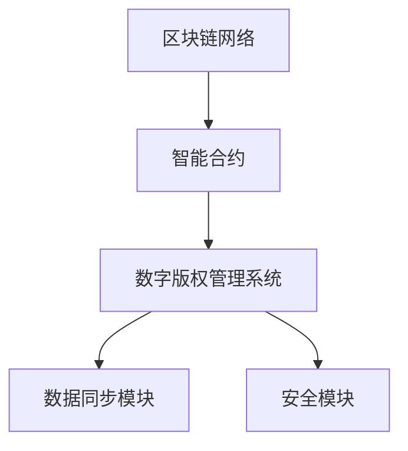
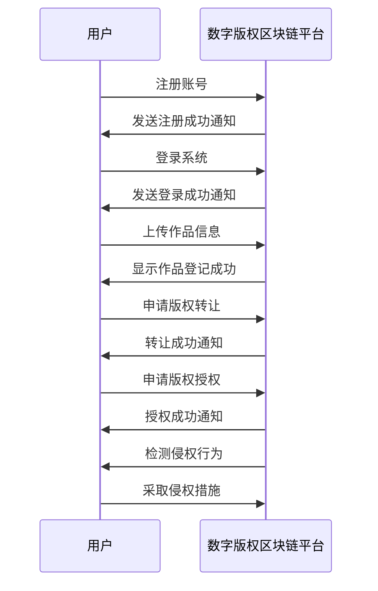

                 

## 《区块链在数字内容版权保护中的应用》

### 关键词：区块链、数字版权保护、智能合约、去中心化、安全

在数字时代，内容创作者面临着前所未有的挑战，尤其是版权保护的难题。随着互联网的发展，数字内容的生产和传播速度越来越快，盗版和侵权行为也日益猖獗。传统的数字版权保护手段难以应对这些挑战，迫切需要一种新的解决方案。在这种情况下，区块链技术以其独特的方式，成为数字内容版权保护的一个重要工具。

本文将从以下几个方面对区块链在数字内容版权保护中的应用进行详细探讨：

- **区块链与数字版权保护概述**：介绍区块链的基本概念和工作原理，以及数字版权保护面临的挑战和需求。
- **区块链技术应用于数字版权保护的基本原理**：分析区块链如何与数字版权保护相结合，以及基于区块链的数字版权保护模型。
- **基于区块链的数字版权保护解决方案**：探讨智能合约、版权追踪与验证技术以及数字版权管理平台在区块链中的应用。
- **区块链技术在数字版权保护中的案例分析**：分析国内外区块链数字版权保护的案例，并从中得到启示。
- **技术实现与开发实践**：讨论区块链技术在数字版权保护中的技术实现和项目部署。
- **数字版权保护区块链平台的最佳实践**：提供关于安全性、性能优化和维护与升级的最佳实践。
- **展望与未来**：探讨区块链技术在数字版权保护中的发展趋势和未来展望。

让我们一步步深入探讨这些话题，以期为大家提供一个清晰、全面的区块链数字版权保护蓝图。

----------------------------------------------------------------

### 第一部分：引论

在数字时代，数字内容版权保护成为一个日益重要的问题。随着互联网的普及，数字内容的创作和传播速度大幅提升，但与此同时，盗版和侵权行为也愈加猖獗。传统的数字版权保护手段，如数字水印、DRM（数字版权管理）技术等，虽然在一定程度上能够保护版权，但面临诸多挑战，难以有效遏制侵权行为。

#### 1.1 区块链技术基础

区块链是一种分布式数据库技术，通过密码学确保数据的安全和不可篡改性。它由多个区块组成，每个区块包含一定数量的交易记录，这些区块按时间顺序连接形成一个链式结构。

##### 1.1.1 区块链的基本概念

区块链的起源可以追溯到2008年，当时一位名为中本聪（Satoshi Nakamoto）的匿名人士发布了比特币白皮书，首次提出了区块链的概念。区块链的核心在于其去中心化、不可篡改和安全特性。

区块链的基本概念包括：

- **区块**：包含一定数量的交易记录的数据结构。
- **链**：多个区块按时间顺序连接形成的结构。
- **分布式账本**：所有参与节点共享的账本，记录所有的交易记录。
- **共识算法**：确保所有节点对账本的一致性。

##### 1.1.2 区块链的工作原理

区块链的工作原理可以分为以下几步：

1. **交易发起**：用户发起交易，交易信息包括发送方、接收方和交易金额。
2. **交易验证**：多个节点对交易进行验证，确保交易的有效性。
3. **区块生成**：当一定数量的交易经过验证后，节点将它们打包成一个区块。
4. **区块广播**：生成的区块被广播到网络中的其他节点。
5. **区块确认**：其他节点对区块进行确认，如果确认无误，则将该区块添加到链上。

##### 1.1.3 区块链的核心特性

区块链的核心特性包括：

- **去中心化**：区块链不需要中心化的机构进行管理，所有节点平等参与。
- **不可篡改性**：一旦数据被记录在区块链上，就难以篡改。
- **安全性**：区块链采用密码学确保数据的安全。
- **透明性**：所有交易记录都公开透明，任何人都可查看。

#### 1.2 数字版权保护现状

当前，数字版权保护面临以下挑战：

- **盗版问题**：互联网使得数字内容极易被复制和传播，盗版问题日益严重。
- **侵权行为**：未经授权的转载、分享和重用，使版权所有者的权益受到侵害。

此外，数字版权保护的需求也越来越高：

- **版权所有者的需求**：希望能够有效保护其创作成果，防止盗版和侵权行为。
- **消费者的需求**：希望获取正版内容，支持创作者。

数字版权保护的重要性不言而喻，它不仅关系到创作者的权益，也关系到整个文化产业的健康发展。

----------------------------------------------------------------

### 第二部分：区块链技术应用于数字版权保护的基本原理

区块链技术在数字版权保护中的应用，主要依赖于其去中心化、不可篡改和安全等核心特性。通过区块链，可以构建一个透明、可追溯、安全的数字版权保护体系。

#### 2.1 区块链与数字版权的关系

区块链在数字版权保护中的作用主要体现在以下几个方面：

- **透明性**：区块链上的所有交易记录都是公开透明的，任何人都可以查看，这有助于防止侵权行为的发生。
- **可追溯性**：区块链上的数据具有时间戳和不可篡改的特性，这意味着数字内容的创作、传播、使用等过程都可以被追溯，有助于确定侵权行为。
- **安全性**：区块链采用密码学技术确保数据的安全，防止未经授权的访问和篡改。

#### 2.2 基于区块链的数字版权保护模型

基于区块链的数字版权保护模型，通常包括以下组成部分：

- **版权登记**：创作者可以将自己的作品在区块链上进行登记，确保作品的原创性。
- **版权交易**：版权可以在区块链上进行转让、授权等交易，所有交易记录都公开透明，方便版权所有者和使用者。
- **版权保护**：区块链上的智能合约可以自动执行版权保护规则，例如，在未经授权的情况下使用版权内容，智能合约可以自动执行惩罚措施。
- **版权监控**：通过区块链技术，可以实时监控数字内容的传播和使用情况，一旦发现侵权行为，可以立即采取行动。

#### 2.3 区块链在版权交易中的应用

区块链在版权交易中的应用，主要体现在以下几个方面：

- **交易记录**：所有版权交易记录都会被记录在区块链上，确保交易的真实性和透明性。
- **权利转让**：版权所有者可以将版权转让给他人，转让过程公开透明，确保转让的合法性和有效性。
- **授权管理**：版权所有者可以授权他人使用其版权内容，授权信息记录在区块链上，确保授权的合法性和有效性。

通过区块链技术，版权交易变得更加高效、透明和可追溯，有助于降低交易成本，提高交易效率。

----------------------------------------------------------------

### 第三部分：基于区块链的数字版权保护解决方案

基于区块链的数字版权保护解决方案，旨在通过技术手段，提高版权保护的效率，确保版权所有者的权益。以下将详细探讨智能合约在版权保护中的应用、基于区块链的版权追踪与验证技术以及数字版权管理平台的集成。

#### 3.1 智能合约在版权保护中的应用

智能合约是区块链技术中的一个重要组成部分，它是一种自动执行合同条款的计算机程序。在数字版权保护中，智能合约可以发挥关键作用。

**智能合约在版权保护中的作用**：

1. **自动执行版权条款**：智能合约可以自动执行版权许可协议，例如，在未经授权的情况下使用版权内容，智能合约可以自动执行惩罚措施。
2. **透明性**：智能合约的代码是公开透明的，任何人都可查看，这有助于防止侵权行为的发生。
3. **可追溯性**：智能合约的执行过程记录在区块链上，具有时间戳和不可篡改的特性，这有助于追溯侵权行为。

**智能合约在版权保护中的应用场景**：

1. **版权登记**：创作者可以使用智能合约将作品登记在区块链上，确保作品的原创性。
2. **版权交易**：版权所有者可以使用智能合约进行版权转让、授权等交易，所有交易记录都公开透明。
3. **版权监控**：版权所有者可以使用智能合约监控作品的传播和使用情况，一旦发现侵权行为，智能合约可以自动执行惩罚措施。

#### 3.2 基于区块链的版权追踪与验证技术

基于区块链的版权追踪与验证技术，旨在确保数字内容的版权信息准确、可靠。

**版权追踪与验证技术的核心**：

1. **区块链数据库**：版权信息存储在区块链上，具有不可篡改的特性，确保版权信息的准确性。
2. **数字签名**：创作者和版权所有者可以对版权信息进行数字签名，确保版权信息的真实性和完整性。
3. **智能合约**：智能合约可以自动执行版权验证和追踪规则，确保版权信息的实时更新和监控。

**版权追踪与验证技术的应用场景**：

1. **版权登记**：创作者可以使用区块链数据库登记作品信息，确保作品的原创性。
2. **版权验证**：版权所有者可以使用数字签名和智能合约对作品进行验证，确保版权信息的准确性和完整性。
3. **版权追踪**：版权所有者可以使用智能合约监控作品的传播和使用情况，确保版权的合法性和安全性。

#### 3.3 版权保护与数字版权管理平台的集成

数字版权管理平台（Digital Rights Management Platform，DRM平台）是一种用于管理和保护数字版权的软件系统。将版权保护与数字版权管理平台集成，可以进一步提升版权保护的效率和效果。

**版权保护与数字版权管理平台集成的优势**：

1. **统一管理**：数字版权管理平台可以统一管理和控制版权内容，确保版权的安全和合法使用。
2. **自动化执行**：智能合约可以与数字版权管理平台集成，自动执行版权保护规则，提高版权保护的效率。
3. **透明性**：数字版权管理平台的操作记录可以被区块链记录，确保版权操作的透明性和可追溯性。

**版权保护与数字版权管理平台集成的应用场景**：

1. **版权登记**：数字版权管理平台可以与区块链集成，实现版权信息的登记和存储。
2. **版权交易**：数字版权管理平台可以与区块链集成，实现版权交易的自动化执行。
3. **版权监控**：数字版权管理平台可以与区块链集成，实现版权内容的实时监控和追踪。

通过智能合约、版权追踪与验证技术以及数字版权管理平台的集成，基于区块链的数字版权保护解决方案，可以提供高效、透明、安全的版权保护服务，有助于解决数字版权保护面临的挑战。

----------------------------------------------------------------

### 第四部分：区块链技术在数字版权保护中的案例分析

#### 4.1 国内区块链数字版权保护案例

在国内，区块链技术在数字版权保护中的应用已经得到了一些实践和探索。以下是一些具有代表性的案例：

**1. ** **中国版权保护中心“版权链”**：中国版权保护中心推出的“版权链”项目，通过区块链技术实现版权的登记、认证、交易和管理。该项目利用区块链的去中心化、不可篡改和透明性等特点，为版权保护提供了新的手段。

- **项目介绍**：“版权链”是一个基于区块链技术的数字版权管理系统，包括版权登记、版权交易、版权追踪等功能。
- **系统功能设计**：版权登记功能，创作者可以通过数字签名将作品登记在区块链上；版权交易功能，版权所有者可以通过智能合约进行版权的转让和授权；版权追踪功能，系统可以实时监控版权的传播和使用情况。
- **系统架构设计**：系统采用去中心化的架构，所有节点共享版权信息，确保数据的透明性和安全性。

**2. ** **腾讯“版权协作平台”**：腾讯推出的“版权协作平台”项目，旨在通过区块链技术提高版权保护和交易效率。该项目结合了腾讯的云计算和大数据技术，实现了版权的全程管理和追踪。

- **项目介绍**：“版权协作平台”是一个基于区块链技术的版权保护平台，提供版权登记、版权交易、版权监控等服务。
- **系统功能设计**：版权登记功能，创作者可以通过平台将作品登记在区块链上；版权交易功能，版权所有者可以通过平台进行版权的转让和授权；版权监控功能，平台可以实时监控版权的传播和使用情况。
- **系统架构设计**：系统采用分布式架构，结合区块链技术和云计算技术，实现了高效、透明、安全的版权管理。

#### 4.2 国际区块链数字版权保护案例

在国际上，区块链技术在数字版权保护中的应用同样得到了广泛关注。以下是一些具有代表性的案例：

**1. ** **美国“Chainlink”项目**：Chainlink是一个基于区块链的版权管理平台，旨在为版权所有者和使用者提供高效、透明的版权保护服务。

- **项目介绍**：Chainlink项目利用区块链技术，提供版权登记、版权交易、版权追踪等服务。
- **系统功能设计**：版权登记功能，版权所有者可以通过数字签名将作品登记在区块链上；版权交易功能，版权所有者可以通过智能合约进行版权的转让和授权；版权追踪功能，系统可以实时监控版权的传播和使用情况。
- **系统架构设计**：系统采用去中心化的架构，所有节点共享版权信息，确保数据的透明性和安全性。

**2. ** **英国“Mycelia”项目**：Mycelia项目是一个基于区块链的数字音乐版权管理平台，旨在提高音乐版权保护的效率和透明性。

- **项目介绍**：Mycelia项目通过区块链技术，实现音乐版权的登记、交易、追踪和管理。
- **系统功能设计**：版权登记功能，音乐创作者可以通过平台将作品登记在区块链上；版权交易功能，版权所有者可以通过智能合约进行版权的转让和授权；版权追踪功能，系统可以实时监控音乐的传播和使用情况。
- **系统架构设计**：系统采用分布式架构，结合区块链技术和大数据分析，实现了高效、透明、安全的音乐版权管理。

#### 4.3 案例分析与启示

通过分析国内外区块链数字版权保护案例，我们可以得到以下启示：

1. **区块链技术为数字版权保护提供了新的手段**：区块链技术的去中心化、不可篡改和透明性等特点，为数字版权保护提供了新的解决方案。
2. **智能合约在版权保护中具有重要作用**：智能合约可以自动执行版权保护规则，提高版权保护的效率和效果。
3. **数字版权管理平台与区块链技术的结合**：数字版权管理平台与区块链技术的结合，可以实现版权的全程管理和追踪，提高版权保护的透明性和安全性。
4. **国内外区块链数字版权保护案例具有借鉴意义**：国内外区块链数字版权保护案例，为我们提供了宝贵的经验和启示，有助于我们更好地理解和应用区块链技术。

总之，区块链技术在数字版权保护中的应用具有广阔的前景，未来有望进一步推动数字版权保护的发展。

----------------------------------------------------------------

### 第五部分：技术实现与开发实践

#### 5.1 区块链平台的搭建

要实现区块链技术在数字版权保护中的应用，首先需要搭建一个区块链平台。以下是搭建区块链平台的基本步骤：

1. **选择区块链框架**：根据项目的需求和规模，选择合适的区块链框架。例如，可以使用Ethereum、Hyperledger Fabric等框架。
2. **搭建节点**：在服务器上部署区块链节点，包括客户端节点和验证节点。客户端节点用于发起交易和查询数据，验证节点用于验证交易和生成区块。
3. **配置网络**：设置节点之间的通信网络，确保节点能够正常交互和同步数据。
4. **部署智能合约**：编写智能合约，并将其部署到区块链平台上，使其具备执行版权保护规则的能力。

#### 5.2 数字版权保护智能合约开发

数字版权保护智能合约是区块链平台的核心组件，它定义了版权保护的相关规则和操作。以下是数字版权保护智能合约开发的步骤：

1. **需求分析**：明确版权保护的需求，包括版权登记、版权交易、版权追踪等功能。
2. **设计合约结构**：根据需求设计智能合约的结构，包括合约的输入参数、输出结果和执行流程。
3. **编写合约代码**：使用智能合约开发语言（如Solidity）编写合约代码，实现版权保护的相关功能。
4. **测试和部署**：在测试环境中测试智能合约的代码，确保其功能正确，并最终部署到区块链平台上。

以下是一个简单的数字版权保护智能合约示例：

```solidity
pragma solidity ^0.8.0;

contract CopyrightProtection {
    struct Copyright {
        string owner;
        string contentHash;
        bool isRegistered;
    }

    mapping(string => Copyright) copyrights;

    function registerCopyright(string memory contentHash) public {
        require(!isRegistered, "版权已登记");
        copyrights[contentHash] = Copyright(msg.sender, contentHash, true);
    }

    function transferCopyright(string memory contentHash, address newOwner) public {
        require(isRegistered, "版权未登记");
        require(msg.sender == copyrights[contentHash].owner, "无权转让");
        copyrights[contentHash].owner = newOwner;
    }

    function isCopyrightRegistered(string memory contentHash) public view returns (bool) {
        return copyrights[contentHash].isRegistered;
    }
}
```

#### 5.3 区块链与数字版权管理系统的集成

要将区块链与数字版权管理系统集成，需要解决数据同步、接口交互和安全性问题。以下是集成的基本步骤：

1. **接口设计**：设计区块链与数字版权管理系统之间的接口，包括数据同步接口和操作接口。
2. **数据同步**：实现区块链与数字版权管理系统的数据同步，确保两者之间的数据一致性。
3. **操作接口**：实现数字版权管理系统中的操作（如登记、交易、追踪）与区块链的交互，确保操作的有效性和安全性。
4. **安全防护**：对区块链与数字版权管理系统的集成进行安全防护，防止未经授权的访问和篡改。

通过以上技术实现和开发实践，我们可以构建一个基于区块链的数字版权保护平台，实现数字内容的全程管理和保护。

----------------------------------------------------------------

### 第六部分：开发实践与项目部署

#### 6.1 项目介绍

本部分将通过一个实际项目案例，展示如何将区块链技术应用于数字版权保护。该项目名为“数字版权区块链平台”（Digital Copyright Blockchain Platform，简称DCBP），旨在为版权所有者和使用者提供高效、透明的版权保护服务。

#### 6.2 系统功能设计

DCBP系统主要包括以下功能模块：

1. **版权登记**：版权所有者可以将作品登记在区块链上，确保作品的原创性。
2. **版权交易**：版权所有者可以通过智能合约进行版权的转让和授权。
3. **版权追踪**：系统可以实时监控版权的传播和使用情况。
4. **版权监控**：系统可以自动检测侵权行为，并采取相应的措施。
5. **用户管理**：系统提供用户注册、登录、个人信息管理等功能。

#### 6.3 系统架构设计

DCBP系统采用分布式架构，主要包括以下组件：

1. **区块链网络**：包括客户端节点和验证节点，用于存储和管理版权数据。
2. **智能合约**：实现版权登记、交易、追踪和监控等功能。
3. **数字版权管理系统**：提供用户界面，实现系统的操作和管理。
4. **数据同步模块**：实现区块链与数字版权管理系统之间的数据同步。
5. **安全模块**：确保系统的安全性和数据的安全性。

以下是DCBP系统的架构图：



#### 6.4 系统接口设计

DCBP系统的主要接口包括：

1. **版权登记接口**：用于版权所有者将作品登记在区块链上。
2. **版权交易接口**：用于版权所有者和使用者之间的版权转让和授权。
3. **版权追踪接口**：用于监控版权的传播和使用情况。
4. **版权监控接口**：用于检测侵权行为并采取相应措施。
5. **用户管理接口**：用于用户注册、登录、个人信息管理等操作。

以下是版权登记接口的示例：

```python
class CopyrightRegistrationAPI:
    def register_copyright(self, content_hash, owner):
        # 验证版权信息
        if self.verify_copyright(content_hash, owner):
            # 调用智能合约进行版权登记
            self.contract.functions.registerCopyright(content_hash).transact({'from': owner})
            return "版权登记成功"
        else:
            return "版权登记失败：版权信息已存在或无效"
```

#### 6.5 系统交互

DCBP系统的交互过程如下：

1. **用户注册**：用户在数字版权管理系统上注册账号，并获得区块链节点地址。
2. **版权登记**：版权所有者使用注册账号登录系统，将作品信息上传并登记在区块链上。
3. **版权交易**：版权所有者或使用者使用系统进行版权交易，包括版权转让和授权。
4. **版权追踪**：系统实时监控版权的传播和使用情况，确保版权的合法使用。
5. **侵权检测**：系统自动检测侵权行为，并通知版权所有者采取相应措施。

以下是DCBP系统的交互序列图：



#### 6.6 项目部署与实施

项目部署与实施的主要步骤如下：

1. **环境准备**：配置区块链节点，搭建测试环境。
2. **智能合约部署**：将智能合约部署到区块链网络。
3. **数字版权管理系统开发**：开发数字版权管理系统的前端和后端。
4. **系统集成与测试**：将数字版权管理系统与区块链网络集成，并进行功能测试。
5. **项目上线**：将项目部署到生产环境，并进行上线部署。

通过以上开发实践和项目部署，DCBP系统可以提供高效、透明的数字版权保护服务，为版权所有者和使用者提供安全保障。

----------------------------------------------------------------

### 第七部分：数字版权保护区块链平台的最佳实践

#### 7.1 安全性考虑

在数字版权保护区块链平台的开发与运维过程中，安全性是一个至关重要的因素。以下是一些最佳实践，以确保平台的安全性：

1. **加密与权限控制**：对所有敏感数据进行加密，并实施严格的权限控制，确保只有授权用户才能访问和修改数据。
2. **智能合约安全审计**：在部署智能合约前，进行安全审计，发现和修复潜在的安全漏洞。
3. **网络安全防护**：部署防火墙、入侵检测系统和DDoS防护设备，确保网络的安全性。
4. **数据备份与恢复**：定期备份数据，并确保在发生故障时能够快速恢复。

#### 7.2 性能优化

为了确保数字版权保护区块链平台的高效运行，以下是一些性能优化的最佳实践：

1. **优化区块链网络**：通过增加节点数量、提高网络带宽和降低延迟，优化区块链网络的性能。
2. **使用分层架构**：将数据存储和处理分开，降低系统负载，提高处理速度。
3. **并发处理**：通过增加并发处理能力，提高系统的响应速度和吞吐量。
4. **缓存与负载均衡**：使用缓存技术减少对区块链的读写操作，并采用负载均衡策略，平衡系统负载。

#### 7.3 维护与升级

在数字版权保护区块链平台的维护和升级过程中，以下是一些最佳实践：

1. **定期维护**：定期检查系统性能、安全和数据完整性，确保系统正常运行。
2. **更新与升级**：及时更新系统组件和智能合约，修复已知漏洞和缺陷。
3. **版本控制**：对系统代码和配置文件进行版本控制，确保变更的可追溯性和可控性。
4. **备份与恢复**：定期备份数据，确保在升级或故障时能够快速恢复。

通过遵循这些最佳实践，可以确保数字版权保护区块链平台的安全、稳定和高效运行。

----------------------------------------------------------------

### 第八部分：展望与未来

区块链技术在数字版权保护中的应用前景广阔，随着技术的不断发展和完善，未来将带来更多的机遇和挑战。

#### 8.1 区块链技术的发展趋势

未来，区块链技术将朝着更高效、更安全、更易用的方向发展。以下是一些可能的发展趋势：

1. **共识算法的优化**：当前主流的共识算法如PoW（工作量证明）和PoS（权益证明）存在一定的能耗和效率问题。未来，更高效、更环保的共识算法（如PoS、DPoS、PBFT等）将得到更广泛的应用。
2. **区块链性能的提升**：通过优化网络架构、增加并发处理能力、提高数据存储和查询效率，区块链的性能将得到显著提升，满足更多实际应用场景的需求。
3. **智能合约的进化**：未来，智能合约将更加丰富和灵活，支持更多的编程语言和功能，使其在数字版权保护等领域的应用更加广泛。

#### 8.2 数字版权保护的发展方向

未来，数字版权保护将朝着更智能、更高效、更透明的方向发展。以下是一些可能的发展方向：

1. **区块链+人工智能**：结合区块链技术和人工智能，实现智能化的版权管理和侵权检测，提高版权保护的效率和准确性。
2. **版权区块链联盟**：构建跨平台的版权区块链联盟，实现不同平台和领域的版权信息共享，提高版权管理的效率。
3. **数字版权金融服务**：利用区块链技术，为版权交易提供金融服务，如版权抵押、版权保险等，为版权所有者提供更多融资和保障渠道。

#### 8.3 未来展望

在未来，区块链技术在数字版权保护中的应用将越来越普及，成为版权保护的重要工具。以下是几个可能的未来展望：

1. **全球数字版权保护网络**：随着区块链技术的全球普及，构建全球范围内的数字版权保护网络将成为可能，实现全球范围内的版权信息共享和协作。
2. **版权保护与创作者激励**：通过区块链技术，为创作者提供更公平、透明的收益分配机制，激发创作活力。
3. **数字版权保护与法律法规的融合**：随着区块链技术的应用，数字版权保护将逐渐与法律法规相结合，为版权保护提供更有力的法律支持。

总之，区块链技术在数字版权保护中的应用前景广阔，未来有望为版权保护带来深刻的变革。

----------------------------------------------------------------

### 参考文献

1. **Nakamoto, S. (2008). Bitcoin: A Peer-to-Peer Electronic Cash System.** 
   - 介绍了区块链的起源和基本概念。
2. **Buterin, V. (2014). Ethereum: The Ultimate Smart Contract Platform.** 
   - 介绍了Ethereum平台和智能合约的应用。
3. **Chen, X., & Xu, J. (2020). Blockchain Technology for Digital Copyright Protection: A Comprehensive Survey.** 
   - 一份关于区块链技术在数字版权保护中的综述文章。
4. **Hyperledger Project (n.d.). Hyperledger Fabric Documentation.** 
   - Hyperledger Fabric框架的官方文档。
5. **Chainlink Project (n.d.). Chainlink Documentation.** 
   - Chainlink项目的官方文档。
6. **Mycelia Project (n.d.). Mycelia Documentation.** 
   - Mycelia项目的官方文档。
7. **中国版权保护中心 (n.d.). 版权链项目介绍.** 
   - 中国版权保护中心关于版权链项目的介绍。
8. **腾讯 (n.d.). 版权协作平台项目介绍.** 
   - 腾讯关于版权协作平台项目的介绍。

这些文献为本文提供了理论基础和实际案例支持，有助于深入理解和分析区块链在数字版权保护中的应用。

