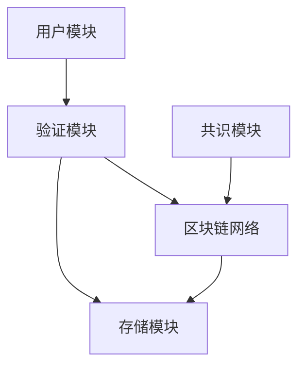

                 

### 第1章：问题背景

#### 1.1 数字身份验证与隐私保护

在数字时代，身份验证已成为各种在线服务和交易中不可或缺的一环。数字身份验证旨在确保用户身份的真实性和唯一性，通过验证用户提交的身份信息，确保只有合法用户能够访问受保护的资源和服务。然而，随着技术的进步，隐私保护问题也日益凸显。

隐私保护是指保护个人信息不被未授权访问和泄露的过程。在数字身份验证中，隐私保护尤为重要，因为用户在注册和使用服务时，通常需要提供包括姓名、出生日期、身份证号码等敏感信息。这些信息一旦泄露，可能会被用于欺诈、身份盗用等不法行为，给用户带来严重损失。

当前，传统的数字身份验证方法，如用户名和密码、双因素认证（2FA）等，虽然在一定程度上提高了安全性，但仍然存在一些问题：

1. **密码泄露风险**：用户习惯使用弱密码或重复使用密码，导致密码容易被破解。
2. **单点故障**：一旦认证系统被攻破，所有用户的信息都可能受到威胁。
3. **隐私泄露**：用户信息在传输和存储过程中可能被拦截或窃取。

#### 1.2 区块链技术简介

区块链技术是一种分布式数据库技术，通过加密算法和分布式账本技术，实现了数据的透明、不可篡改和去中心化。区块链具有以下特点：

1. **去中心化**：区块链不依赖于中心化的服务器，而是通过分布式网络节点进行数据存储和验证。
2. **透明性**：区块链上的数据对所有节点可见，任何用户都可以查看和验证数据。
3. **不可篡改**：一旦数据被记录在区块链上，就几乎不可能被篡改。
4. **安全性**：区块链采用加密算法和共识机制，确保数据的安全性和完整性。

区块链的这些特性使其在数字身份验证和隐私保护中具有巨大潜力。通过区块链，可以实现去中心化的身份验证，减少对中心化服务器的依赖，从而降低隐私泄露的风险。

#### 1.3 年龄验证需求与挑战

在许多场景中，年龄验证是一个至关重要的环节。例如，在线购物平台需要验证用户的年龄，确保其符合购买限制；线上银行服务需要验证用户的年龄，确保其符合账户使用条件。然而，传统的年龄验证方法也存在一些挑战：

1. **隐私泄露风险**：用户在验证年龄时，通常需要提供真实姓名、出生日期等敏感信息，这些信息可能被泄露。
2. **易被伪造**：传统方法中的身份验证信息容易被伪造，例如，使用伪造的身份证或出生证明。
3. **单点故障**：如果验证系统依赖的中心化服务器遭到攻击或故障，可能导致整个验证过程瘫痪。

为了解决这些挑战，我们需要一种更安全、更隐私保护的方法来进行年龄验证。区块链技术提供了这样的解决方案。通过区块链，可以实现去中心化的、不可篡改的年龄验证，从而降低隐私泄露和伪造风险。

### 1.4 文章主题：区块链在数字身份年龄验证中的隐私保护

本文将深入探讨区块链在数字身份年龄验证中的隐私保护作用。我们将首先介绍区块链的基本概念和关键技术，然后分析数字身份验证和隐私保护的核心概念。接着，我们将详细讲解基于区块链的数字身份验证算法原理，并通过具体示例展示其应用。随后，我们将设计一个基于区块链的数字身份验证系统，并分析其功能设计和系统架构。最后，我们将通过实际案例分析，验证区块链在隐私保护中的有效性，并提出最佳实践和拓展阅读建议。

通过本文的深入探讨，读者将了解区块链在数字身份年龄验证中的潜在应用，掌握基于区块链的隐私保护技术，并为未来的数字身份验证和隐私保护提供新的思路和解决方案。接下来，我们将逐步展开对区块链技术、数字身份验证和隐私保护的详细探讨。

## 第2章：核心概念与联系

### 2.1 区块链基本概念

区块链是一种分布式账本技术，通过加密算法和分布式网络实现了数据的透明性、不可篡改性和去中心化。要深入理解区块链，我们首先需要了解以下几个基本概念：

#### 2.1.1 区块链的工作原理

区块链的工作原理可以概括为以下几个步骤：

1. **数据收集**：区块链网络中的节点（计算机）收集交易数据。
2. **数据打包**：将收集到的交易数据打包成区块。
3. **区块验证**：通过共识算法（如工作量证明、权益证明等）对区块进行验证。
4. **区块添加**：验证通过的区块被添加到区块链上。
5. **链式存储**：新产生的区块连接到已有的区块链上，形成一条链式结构。

这种工作原理保证了区块链上的数据透明、不可篡改和去中心化。所有交易数据都被公开记录，并且一旦被添加到区块链上，就几乎不可能被篡改。

#### 2.1.2 区块链的关键技术

区块链的关键技术包括加密算法、分布式网络、共识算法等。

1. **加密算法**：区块链使用加密算法来保护数据的安全性和隐私。常见的加密算法有哈希函数、椭圆曲线加密算法、对称加密算法等。
2. **分布式网络**：区块链通过分布式网络实现了去中心化。网络中的每个节点都可以参与数据的存储和验证，不存在中心化的服务器。
3. **共识算法**：共识算法用于确保区块链网络中的所有节点对数据的共识。常见的共识算法有工作量证明（PoW）、权益证明（PoS）等。

### 2.2 数字身份验证

数字身份验证是指通过验证用户提供的身份信息，确保其身份的真实性和唯一性。数字身份验证在多个领域都有广泛应用，如金融、电子商务、医疗等。以下是对数字身份验证的基本概念和挑战的介绍：

#### 2.2.1 数字身份验证的基本概念

数字身份验证的基本概念包括以下几个方面：

1. **用户身份信息**：用户在注册服务时提供的身份信息，如用户名、密码、邮箱、手机号码等。
2. **认证方式**：用于验证用户身份的方式，如用户名和密码、双因素认证（2FA）、生物识别等。
3. **身份认证结果**：根据用户提供的身份信息，系统对用户身份进行验证的结果。

#### 2.2.2 数字身份验证的挑战

数字身份验证面临的挑战主要包括以下几个方面：

1. **隐私泄露风险**：用户在验证过程中可能泄露敏感信息，如姓名、出生日期、身份证号码等。
2. **伪造攻击**：攻击者可能通过伪造的身份信息进行非法操作。
3. **单点故障**：如果身份验证系统依赖的中心化服务器出现问题，可能导致整个验证过程瘫痪。
4. **用户体验**：过于复杂或繁琐的身份验证流程可能会影响用户体验。

### 2.3 隐私保护

隐私保护是指保护个人信息不被未授权访问和泄露的过程。在数字身份验证中，隐私保护尤为重要。以下是对隐私保护的基本概念和常见技术的介绍：

#### 2.3.1 隐私保护的基本概念

隐私保护的基本概念包括以下几个方面：

1. **隐私信息**：指个人不愿意公开或不愿意与他人共享的个人信息。
2. **隐私泄露**：指个人信息被未经授权的第三方访问或泄露。
3. **隐私政策**：指组织或个人在收集、使用和处理个人信息时所遵守的规定。

#### 2.3.2 隐私保护的常见技术

隐私保护的常见技术包括以下几个方面：

1. **数据加密**：通过加密算法对数据进行加密，确保数据在传输和存储过程中不被窃取或篡改。
2. **访问控制**：通过设置权限和角色，确保只有授权用户可以访问特定数据。
3. **匿名化**：通过移除或替换个人身份信息，使数据无法被直接识别。
4. **数据备份与恢复**：通过备份和恢复技术，确保数据在发生意外时可以恢复。

#### 2.3.3 区块链在隐私保护中的应用

区块链在隐私保护中的应用主要体现在以下几个方面：

1. **去中心化**：通过分布式网络和去中心化存储，减少对中心化服务器的依赖，降低隐私泄露风险。
2. **数据不可篡改**：区块链上的数据一旦被记录，就几乎不可能被篡改，确保数据的真实性。
3. **加密算法**：区块链使用加密算法保护数据的安全性和隐私，确保数据在传输和存储过程中的安全。

通过以上对区块链、数字身份验证和隐私保护核心概念的分析，我们可以看到，区块链技术在数字身份验证和隐私保护中具有巨大的潜力。在接下来的章节中，我们将进一步探讨基于区块链的数字身份验证算法原理，并分析其在实际应用中的优势和挑战。

### 2.1 区块链基本概念

区块链是一种分布式数据库技术，通过加密算法和分布式网络实现了数据的透明性、不可篡改性和去中心化。以下是区块链的基本概念：

#### 2.1.1 区块链的工作原理

区块链的工作原理可以概括为以下几个步骤：

1. **数据收集**：区块链网络中的节点（计算机）收集交易数据。
2. **数据打包**：将收集到的交易数据打包成区块。
3. **区块验证**：通过共识算法（如工作量证明、权益证明等）对区块进行验证。
4. **区块添加**：验证通过的区块被添加到区块链上。
5. **链式存储**：新产生的区块连接到已有的区块链上，形成一条链式结构。

这种工作原理保证了区块链上的数据透明、不可篡改和去中心化。所有交易数据都被公开记录，并且一旦被添加到区块链上，就几乎不可能被篡改。

#### 2.1.2 区块链的关键技术

区块链的关键技术包括加密算法、分布式网络、共识算法等。

1. **加密算法**：区块链使用加密算法来保护数据的安全性和隐私。常见的加密算法有哈希函数、椭圆曲线加密算法、对称加密算法等。
2. **分布式网络**：区块链通过分布式网络实现了去中心化。网络中的每个节点都可以参与数据的存储和验证，不存在中心化的服务器。
3. **共识算法**：共识算法用于确保区块链网络中的所有节点对数据的共识。常见的共识算法有工作量证明（PoW）、权益证明（PoS）等。

#### 2.1.3 区块链的优势与劣势

区块链的优势主要体现在以下几个方面：

1. **去中心化**：去中心化意味着不存在中心化的服务器，降低了系统被攻击的风险。
2. **不可篡改**：一旦数据被记录在区块链上，就几乎不可能被篡改，确保了数据的真实性。
3. **透明性**：区块链上的数据对所有节点可见，任何用户都可以查看和验证数据。

然而，区块链也存在一些劣势：

1. **性能瓶颈**：由于区块链的分布式特性，其处理速度相对较慢，无法满足某些高频交易的需求。
2. **数据存储成本**：随着区块链的不断扩大，数据存储成本也会增加。
3. **技术复杂度**：区块链技术涉及多个复杂的技术领域，如加密算法、分布式网络、共识算法等，对技术人员要求较高。

### 2.2 数字身份验证

数字身份验证是指通过验证用户提供的身份信息，确保其身份的真实性和唯一性。以下是数字身份验证的基本概念和挑战：

#### 2.2.1 数字身份验证的基本概念

数字身份验证的基本概念包括以下几个方面：

1. **用户身份信息**：用户在注册服务时提供的身份信息，如用户名、密码、邮箱、手机号码等。
2. **认证方式**：用于验证用户身份的方式，如用户名和密码、双因素认证（2FA）、生物识别等。
3. **身份认证结果**：根据用户提供的身份信息，系统对用户身份进行验证的结果。

#### 2.2.2 数字身份验证的挑战

数字身份验证面临的挑战主要包括以下几个方面：

1. **隐私泄露风险**：用户在验证过程中可能泄露敏感信息，如姓名、出生日期、身份证号码等。
2. **伪造攻击**：攻击者可能通过伪造的身份信息进行非法操作。
3. **单点故障**：如果身份验证系统依赖的中心化服务器出现问题，可能导致整个验证过程瘫痪。
4. **用户体验**：过于复杂或繁琐的身份验证流程可能会影响用户体验。

### 2.3 隐私保护

隐私保护是指保护个人信息不被未授权访问和泄露的过程。在数字身份验证中，隐私保护尤为重要。以下是隐私保护的基本概念和常见技术的介绍：

#### 2.3.1 隐私保护的基本概念

隐私保护的基本概念包括以下几个方面：

1. **隐私信息**：指个人不愿意公开或不愿意与他人共享的个人信息。
2. **隐私泄露**：指个人信息被未经授权的第三方访问或泄露。
3. **隐私政策**：指组织或个人在收集、使用和处理个人信息时所遵守的规定。

#### 2.3.2 隐私保护的常见技术

隐私保护的常见技术包括以下几个方面：

1. **数据加密**：通过加密算法对数据进行加密，确保数据在传输和存储过程中不被窃取或篡改。
2. **访问控制**：通过设置权限和角色，确保只有授权用户可以访问特定数据。
3. **匿名化**：通过移除或替换个人身份信息，使数据无法被直接识别。
4. **数据备份与恢复**：通过备份和恢复技术，确保数据在发生意外时可以恢复。

#### 2.3.3 区块链在隐私保护中的应用

区块链在隐私保护中的应用主要体现在以下几个方面：

1. **去中心化**：通过分布式网络和去中心化存储，减少对中心化服务器的依赖，降低隐私泄露风险。
2. **数据不可篡改**：区块链上的数据一旦被记录，就几乎不可能被篡改，确保数据的真实性。
3. **加密算法**：区块链使用加密算法保护数据的安全性和隐私，确保数据在传输和存储过程中的安全。

通过以上对区块链、数字身份验证和隐私保护核心概念的分析，我们可以看到，区块链技术在数字身份验证和隐私保护中具有巨大的潜力。在接下来的章节中，我们将进一步探讨基于区块链的数字身份验证算法原理，并分析其在实际应用中的优势和挑战。

## 第3章：基于区块链的数字身份验证算法

### 3.1 算法概述

基于区块链的数字身份验证算法旨在利用区块链的分布式存储、数据不可篡改和去中心化特性，提供一种安全、可靠的数字身份验证方法。本节将介绍该算法的目标、结构和工作原理。

#### 3.1.1 算法目标

该算法的主要目标是实现以下功能：

1. **隐私保护**：在验证用户身份时，确保用户的隐私信息不被泄露。
2. **身份唯一性验证**：确保只有拥有合法身份的用户能够通过验证。
3. **数据不可篡改**：保证用户身份信息和验证记录在区块链上不可篡改，确保数据的真实性。
4. **去中心化**：减少对中心化服务器的依赖，提高系统的抗攻击能力。

#### 3.1.2 算法结构

该算法的结构主要包括以下几个模块：

1. **用户模块**：负责用户的身份注册和验证。
2. **验证模块**：负责对用户提交的身份信息进行验证。
3. **存储模块**：负责将用户的身份信息和验证结果存储在区块链上。
4. **共识模块**：负责维护区块链网络的一致性和安全性。

### 3.2 算法原理

基于区块链的数字身份验证算法原理主要包括以下几个方面：

#### 3.2.1 公钥加密算法

公钥加密算法是一种非对称加密算法，它使用一对密钥（公钥和私钥）来加密和解密数据。在数字身份验证中，用户在注册时使用公钥加密其身份信息，确保只有拥有相应私钥的验证模块能够解密和验证这些信息。

#### 3.2.2 数字签名算法

数字签名算法用于验证数据的真实性和完整性。在数字身份验证中，用户在提交身份信息时，使用私钥生成数字签名，验证模块使用公钥验证该签名，以确保身份信息的真实性和未被篡改。

#### 3.2.3 Merkle树

Merkle树是一种数据结构，用于快速验证数据块内的数据完整性。在区块链中，每个区块都包含一个Merkle树根，验证模块可以通过该根来验证区块内的所有交易数据。

### 3.3 数学模型和公式

基于区块链的数字身份验证算法的数学模型和公式主要包括以下几个方面：

#### 3.3.1 密码学基础

- **哈希函数**：哈希函数是将任意长度的数据映射为固定长度的值。在数字身份验证中，常用的哈希函数有SHA-256、SHA-3等。
- **椭圆曲线加密算法**：椭圆曲线加密算法是一种非对称加密算法，用于生成公钥和私钥对。其数学基础是椭圆曲线离散对数问题。

#### 3.3.2 数字签名模型

- **签名生成**：用户使用私钥对消息进行签名，生成签名 \( S \)。
  \[
  S = S_k(\text{msg}, s)
  \]
  其中，\( \text{msg} \) 是消息，\( s \) 是签名算法的参数，\( k \) 是用户的私钥。

- **签名验证**：验证模块使用公钥验证签名 \( S \)。
  \[
  V = V_p(S, \text{msg}, s)
  \]
  其中，\( V_p \) 是签名验证算法，\( p \) 是验证模块的公钥。

#### 3.3.3 Merkle树模型

- **Merkle树构建**：将数据块内的所有交易数据生成哈希值，构建Merkle树。
  \[
  \text{root} = \text{hash}(\text{hash}(T_1) \oplus \text{hash}(T_2))
  \]
  其中，\( T_1 \) 和 \( T_2 \) 是两个交易数据的哈希值，\( \oplus \) 是异或运算。

- **Merkle树验证**：验证模块可以通过Merkle树的根来验证数据块的完整性。
  \[
  \text{verify}(T, \text{root}) = \text{hash}(\text{hash}(T_1) \oplus \text{hash}(T_2)) = \text{root}
  \]

### 3.4 算法示例

#### 3.4.1 示例一：身份认证流程

1. **用户注册**：
   - 用户生成公钥 \( p_1 \) 和私钥 \( s_1 \)。
   - 用户将身份信息（如姓名、出生日期等）加密后上传到区块链。

2. **身份验证**：
   - 验证模块下载用户上传的身份信息。
   - 验证模块使用用户公钥 \( p_1 \) 解密身份信息，并验证其真实性。

3. **存储验证结果**：
   - 验证模块将验证结果存储在区块链上，形成一条不可篡改的验证记录。

#### 3.4.2 示例二：年龄验证流程

1. **用户注册**：
   - 用户上传包括出生日期在内的身份信息。

2. **年龄验证**：
   - 验证模块计算用户的当前年龄，并与服务要求进行对比。
   - 如果年龄符合要求，验证模块生成通过证明并上传到区块链。

3. **存储验证结果**：
   - 验证结果存储在区块链上，任何人都可以查看，但无法篡改。

通过以上示例，我们可以看到基于区块链的数字身份验证算法如何实现隐私保护、身份唯一性验证和数据不可篡改。在接下来的章节中，我们将进一步探讨该算法在实际系统中的实现和应用。

### 3.1 算法概述

#### 3.1.1 算法目标

本节将详细阐述基于区块链的数字身份验证算法的目标。该算法旨在通过区块链技术实现以下主要目标：

1. **隐私保护**：保护用户的敏感身份信息，防止在验证过程中被未授权访问和泄露。区块链的分布式存储和加密算法为用户隐私提供了强有力的保障。
2. **身份唯一性验证**：确保用户身份的唯一性和真实性，防止身份伪造和假冒。通过数字签名和加密算法，可以有效验证用户身份信息的真实性。
3. **数据不可篡改**：保证用户身份信息和验证记录在区块链上不可篡改，确保数据的真实性和完整性。区块链的链式结构和加密算法确保了数据的不可篡改性。
4. **去中心化**：减少对中心化服务器的依赖，提高系统的抗攻击能力和可扩展性。通过分布式网络和去中心化存储，区块链可以防止单点故障和集中式攻击。

#### 3.1.2 算法结构

基于区块链的数字身份验证算法结构主要包括以下几个关键模块：

1. **用户模块**：用户在该模块中进行身份注册，生成公钥和私钥对，并上传身份信息到区块链。
2. **验证模块**：负责接收用户的身份信息，使用用户公钥进行解密和验证，确保身份信息的真实性和完整性。
3. **存储模块**：将用户的身份信息和验证结果存储在区块链上，确保数据的永久性和不可篡改性。
4. **共识模块**：确保区块链网络中的所有节点对数据的一致性，通过共识算法（如工作量证明、权益证明等）实现去中心化和安全性。

### 3.2 算法原理

本节将详细解释基于区块链的数字身份验证算法的工作原理，涉及以下核心技术：

#### 3.2.1 公钥加密算法

公钥加密算法是一种非对称加密算法，它使用一对密钥（公钥和私钥）进行加密和解密。用户在注册时，使用公钥加密其身份信息，只有持有相应私钥的验证模块才能解密和验证这些信息。这一过程确保了用户隐私的保护，并防止未授权访问。

#### 3.2.2 数字签名算法

数字签名算法用于验证数据的真实性和完整性。用户在提交身份信息时，使用私钥生成数字签名，验证模块使用公钥验证该签名，从而确保身份信息的真实性和未被篡改。数字签名算法不仅提供了数据完整性验证，还实现了身份认证。

#### 3.2.3 Merkle树

Merkle树是一种用于验证数据完整性的数据结构。在区块链中，每个区块都包含一个Merkle树根，验证模块可以通过该根来快速验证区块内的所有交易数据。Merkle树确保了数据在传输和存储过程中的完整性和真实性。

### 3.3 数学模型和公式

本节将介绍基于区块链的数字身份验证算法的数学模型和公式，主要包括以下方面：

#### 3.3.1 密码学基础

- **哈希函数**：用于将任意长度的数据映射为固定长度的哈希值，常用的哈希函数有SHA-256、SHA-3等。
- **椭圆曲线加密算法**：用于生成公钥和私钥对，其数学基础是椭圆曲线离散对数问题。

#### 3.3.2 数字签名模型

- **签名生成**：用户使用私钥对消息进行签名，生成签名 \( S \)。
  \[
  S = S_k(\text{msg}, s)
  \]
  其中，\( \text{msg} \) 是消息，\( s \) 是签名算法的参数，\( k \) 是用户的私钥。

- **签名验证**：验证模块使用公钥验证签名 \( S \)。
  \[
  V = V_p(S, \text{msg}, s)
  \]
  其中，\( V_p \) 是签名验证算法，\( p \) 是验证模块的公钥。

#### 3.3.3 Merkle树模型

- **Merkle树构建**：将数据块内的所有交易数据生成哈希值，构建Merkle树。
  \[
  \text{root} = \text{hash}(\text{hash}(T_1) \oplus \text{hash}(T_2))
  \]
  其中，\( T_1 \) 和 \( T_2 \) 是两个交易数据的哈希值，\( \oplus \) 是异或运算。

- **Merkle树验证**：验证模块可以通过Merkle树的根来验证数据块的完整性。
  \[
  \text{verify}(T, \text{root}) = \text{hash}(\text{hash}(T_1) \oplus \text{hash}(T_2)) = \text{root}
  \]

### 3.4 算法示例

为了更直观地理解基于区块链的数字身份验证算法，我们通过以下示例来详细说明其工作流程：

#### 3.4.1 示例一：身份认证流程

1. **用户注册**：
   - 用户生成一对公钥 \( p \) 和私钥 \( s \)。
   - 用户将身份信息（如姓名、出生日期等）加密后上传到区块链。

2. **身份验证**：
   - 验证模块下载用户上传的身份信息。
   - 验证模块使用用户公钥 \( p \) 解密身份信息，并验证其真实性。

3. **存储验证结果**：
   - 验证模块将验证结果存储在区块链上，形成一条不可篡改的验证记录。

#### 3.4.2 示例二：年龄验证流程

1. **用户注册**：
   - 用户上传包括出生日期在内的身份信息。

2. **年龄验证**：
   - 验证模块计算用户的当前年龄，并与服务要求进行对比。
   - 如果年龄符合要求，验证模块生成通过证明并上传到区块链。

3. **存储验证结果**：
   - 验证结果存储在区块链上，任何人都可以查看，但无法篡改。

通过这些示例，我们可以清晰地看到基于区块链的数字身份验证算法如何在实践中保护用户隐私、验证身份真实性和确保数据不可篡改。接下来，我们将进一步探讨该算法在实际系统中的应用和实现细节。

## 第4章：系统功能设计

### 4.1 问题场景介绍

在数字身份验证领域，有许多实际问题场景需要解决方案。以下介绍两个典型的场景：

#### 4.1.1 场景一：在线购物平台

在线购物平台需要验证用户的身份和年龄，以确保用户符合购买限制，例如，某些商品只能由成年用户购买。传统的身份验证方法可能存在隐私泄露和伪造攻击的风险，因此需要一个更加安全、隐私保护的方法。

#### 4.1.2 场景二：线上银行服务

线上银行服务需要验证用户的身份，以确保用户是合法的账户持有人。银行服务对用户隐私保护的要求更高，因为账户信息一旦泄露可能导致严重经济损失。此外，银行服务还需要验证用户的年龄，例如，某些金融产品只能由成年用户购买。

### 4.2 系统功能设计

为了解决上述场景中的问题，我们需要设计一个基于区块链的数字身份验证系统。该系统应具有以下核心功能：

#### 4.2.1 领域模型

领域模型是系统功能设计的核心，它定义了系统中的主要实体和它们之间的关系。以下是该系统的领域模型：

1. **用户**：用户是系统的主要实体，具有以下属性：
   - 用户ID：唯一的标识符。
   - 公钥：用于加密身份信息。
   - 私钥：用于解密和签名。
   - 身份信息：包括姓名、出生日期等。
   - 年龄：根据出生日期计算得出。

2. **验证模块**：验证模块负责验证用户的身份和年龄，具有以下功能：
   - 身份验证：使用用户公钥解密身份信息，并验证其真实性。
   - 年龄验证：计算用户的当前年龄，并与服务要求进行对比。

3. **存储模块**：存储模块负责将用户的身份信息和验证结果存储在区块链上，确保数据的安全性和不可篡改性。

4. **共识模块**：共识模块负责维护区块链网络的一致性和安全性，通过共识算法实现去中心化。

#### 4.2.2 功能模块划分

基于领域模型，系统可以划分为以下几个功能模块：

1. **用户模块**：用户模块负责用户的注册和身份信息管理，包括生成公钥和私钥对、上传身份信息到区块链等。

2. **验证模块**：验证模块负责接收用户的身份信息和验证请求，使用公钥解密身份信息，并验证其真实性和年龄。

3. **存储模块**：存储模块负责将用户的身份信息和验证结果存储在区块链上，确保数据的永久性和不可篡改性。

4. **共识模块**：共识模块负责维护区块链网络的一致性和安全性，通过共识算法实现去中心化。

#### 4.2.3 系统流程

基于上述功能模块，系统的工作流程如下：

1. **用户注册**：
   - 用户生成公钥和私钥对。
   - 用户将身份信息加密后上传到区块链。

2. **身份验证**：
   - 验证模块下载用户上传的身份信息。
   - 验证模块使用用户公钥解密身份信息，并验证其真实性。

3. **年龄验证**：
   - 验证模块计算用户的当前年龄。
   - 如果年龄符合要求，验证模块生成通过证明并上传到区块链。

4. **存储验证结果**：
   - 验证模块将验证结果存储在区块链上，形成一条不可篡改的验证记录。

通过以上功能设计和流程，我们可以看到基于区块链的数字身份验证系统如何在实际场景中解决隐私保护和身份验证问题。接下来，我们将进一步探讨该系统的架构设计。

### 4.1 问题场景介绍

在数字身份验证和隐私保护领域，存在许多实际问题场景，其中在线购物平台和线上银行服务是两个典型的应用场景。

#### 4.1.1 场景一：在线购物平台

在线购物平台为了确保用户符合购买限制，如某些商品只能由成年用户购买，需要验证用户的年龄。传统的身份验证方法，如用户名和密码、双因素认证（2FA）等，虽然在安全性方面有所提高，但仍然存在隐私泄露和伪造攻击的风险。此外，用户需要多次输入敏感信息，用户体验不佳。

#### 4.1.2 场景二：线上银行服务

线上银行服务对用户身份验证的要求更高，因为账户信息一旦泄露可能导致严重经济损失。银行服务通常需要验证用户的身份，以确保用户是合法的账户持有人。同时，银行服务还需要验证用户的年龄，例如，某些金融产品只能由成年用户购买。传统的身份验证方法同样存在隐私泄露和伪造攻击的风险，难以满足银行服务的安全要求。

这些场景中，用户隐私保护和身份验证问题是核心挑战。我们需要设计一个安全、高效的数字身份验证系统，以解决这些问题。

### 4.2 系统功能设计

为了解决上述场景中的问题，我们需要设计一个基于区块链的数字身份验证系统。该系统应具有以下核心功能：

#### 4.2.1 领域模型

领域模型是系统功能设计的核心，它定义了系统中的主要实体和它们之间的关系。以下是该系统的领域模型：

1. **用户**：用户是系统的主要实体，具有以下属性：
   - 用户ID：唯一的标识符。
   - 公钥：用于加密身份信息。
   - 私钥：用于解密和签名。
   - 身份信息：包括姓名、出生日期等。
   - 年龄：根据出生日期计算得出。

2. **验证模块**：验证模块负责验证用户的身份和年龄，具有以下功能：
   - 身份验证：使用用户公钥解密身份信息，并验证其真实性。
   - 年龄验证：计算用户的当前年龄，并与服务要求进行对比。

3. **存储模块**：存储模块负责将用户的身份信息和验证结果存储在区块链上，确保数据的安全性和不可篡改性。

4. **共识模块**：共识模块负责维护区块链网络的一致性和安全性，通过共识算法实现去中心化。

#### 4.2.2 功能模块划分

基于领域模型，系统可以划分为以下几个功能模块：

1. **用户模块**：用户模块负责用户的注册和身份信息管理，包括生成公钥和私钥对、上传身份信息到区块链等。

2. **验证模块**：验证模块负责接收用户的身份信息和验证请求，使用公钥解密身份信息，并验证其真实性和年龄。

3. **存储模块**：存储模块负责将用户的身份信息和验证结果存储在区块链上，确保数据的永久性和不可篡改性。

4. **共识模块**：共识模块负责维护区块链网络的一致性和安全性，通过共识算法实现去中心化。

#### 4.2.3 系统流程

基于上述功能模块，系统的工作流程如下：

1. **用户注册**：
   - 用户生成公钥和私钥对。
   - 用户将身份信息加密后上传到区块链。

2. **身份验证**：
   - 验证模块下载用户上传的身份信息。
   - 验证模块使用用户公钥解密身份信息，并验证其真实性。

3. **年龄验证**：
   - 验证模块计算用户的当前年龄。
   - 如果年龄符合要求，验证模块生成通过证明并上传到区块链。

4. **存储验证结果**：
   - 验证模块将验证结果存储在区块链上，形成一条不可篡改的验证记录。

通过以上功能设计和流程，我们可以看到基于区块链的数字身份验证系统如何在实际场景中解决隐私保护和身份验证问题。接下来，我们将进一步探讨该系统的架构设计。

## 第5章：系统架构设计

### 5.1 系统架构设计

基于区块链的数字身份验证系统架构设计需要考虑系统的安全性、隐私保护、去中心化和可扩展性。本节将详细描述该系统的总体架构设计，包括模块交互设计和关键组件。

#### 5.1.1 总体架构

系统的总体架构可以分为以下几个主要模块：

1. **用户模块**：用户模块负责用户的注册和身份信息管理。用户生成公钥和私钥对，并将加密后的身份信息上传到区块链。

2. **验证模块**：验证模块负责接收用户的身份信息和验证请求，使用公钥解密身份信息，并验证其真实性和年龄。验证模块还负责生成通过证明并上传到区块链。

3. **存储模块**：存储模块负责将用户的身份信息和验证结果存储在区块链上，确保数据的永久性和不可篡改性。

4. **共识模块**：共识模块负责维护区块链网络的一致性和安全性，通过共识算法实现去中心化。

5. **区块链网络**：区块链网络由多个节点组成，每个节点都参与数据的存储和验证。

#### 5.1.2 模块交互设计

模块交互设计如下：

1. **用户模块与验证模块交互**：
   - 用户注册时，用户模块生成公钥和私钥对，并将身份信息加密后上传到区块链。
   - 当用户需要验证身份或年龄时，验证模块从区块链下载用户身份信息，并使用公钥解密。

2. **验证模块与存储模块交互**：
   - 验证模块在验证用户身份或年龄后，生成通过证明，并将其上传到区块链。
   - 存储模块负责将验证结果存储在区块链上。

3. **共识模块与区块链网络交互**：
   - 共识模块通过共识算法协调区块链网络中的节点，确保数据的一致性和安全性。

4. **区块链网络与存储模块交互**：
   - 区块链网络中的节点将验证结果上传到区块链，存储模块负责将数据存储在区块链上。

### 5.2 系统接口设计

系统接口设计是确保系统模块之间能够有效通信和协作的重要环节。以下是系统的主要接口设计：

1. **用户模块接口**：
   - 注册接口：用于用户生成公钥和私钥对，并上传加密后的身份信息。
   - 身份验证接口：用于用户提交身份信息进行验证。

2. **验证模块接口**：
   - 身份验证接口：用于接收用户身份信息，并使用公钥解密。
   - 年龄验证接口：用于计算用户年龄，并与服务要求进行对比。

3. **存储模块接口**：
   - 存储接口：用于将用户身份信息和验证结果上传到区块链。

4. **共识模块接口**：
   - 共识接口：用于协调区块链网络中的节点，确保数据的一致性和安全性。

### 5.3 系统交互

系统交互是确保系统功能正常运行的关键。以下是系统的主要交互流程：

1. **用户注册流程**：
   - 用户生成公钥和私钥对。
   - 用户将身份信息加密后上传到区块链。

2. **身份验证流程**：
   - 验证模块从区块链下载用户身份信息。
   - 验证模块使用公钥解密身份信息，并验证其真实性。

3. **年龄验证流程**：
   - 验证模块计算用户的当前年龄。
   - 如果年龄符合要求，验证模块生成通过证明并上传到区块链。

4. **验证结果存储流程**：
   - 验证模块将验证结果存储在区块链上。

#### 5.3.1 交互流程

以下是系统的主要交互流程：

1. **用户注册**：
   - 用户生成公钥和私钥对。
   - 用户将身份信息加密后上传到区块链。

2. **身份验证**：
   - 验证模块从区块链下载用户身份信息。
   - 验证模块使用用户公钥解密身份信息，并验证其真实性。

3. **年龄验证**：
   - 验证模块计算用户的当前年龄。
   - 如果年龄符合要求，验证模块生成通过证明并上传到区块链。

4. **验证结果存储**：
   - 验证模块将验证结果存储在区块链上。

#### 5.3.2 交互图

以下是系统的主要交互图，展示了用户模块、验证模块、存储模块和共识模块之间的交互关系：



通过以上系统架构设计，我们可以看到基于区块链的数字身份验证系统如何实现安全性、隐私保护和去中心化。接下来，我们将通过项目实战来展示如何实现该系统。

### 5.1 系统架构设计

基于区块链的数字身份验证系统需要考虑整体架构设计，以确保系统的安全性、隐私性和可扩展性。以下是系统架构设计的详细描述：

#### 5.1.1 总体架构

系统的总体架构可以分为以下几个主要部分：

1. **用户模块**：负责用户的注册和身份信息管理。用户在此模块中生成公钥和私钥对，并将加密后的身份信息上传到区块链。

2. **验证模块**：负责接收用户的身份验证请求，使用公钥解密身份信息，并验证其真实性和年龄。验证模块还负责生成通过证明并上传到区块链。

3. **存储模块**：负责将用户的身份信息和验证结果存储在区块链上，确保数据的安全性和不可篡改性。

4. **共识模块**：负责维护区块链网络的一致性和安全性，通过共识算法实现去中心化。

5. **区块链网络**：由多个节点组成，每个节点都参与数据的存储和验证，确保系统的去中心化特性。

#### 5.1.2 模块交互设计

各个模块之间的交互设计如下：

1. **用户模块与验证模块交互**：
   - 用户在注册时，生成公钥和私钥对，并将加密后的身份信息上传到区块链。
   - 当用户需要进行身份验证时，验证模块从区块链下载用户身份信息，并使用公钥进行解密。

2. **验证模块与存储模块交互**：
   - 验证模块在完成身份验证后，将验证结果（如年龄通过证明）上传到区块链。
   - 存储模块负责将验证结果存储在区块链上，确保其不可篡改性。

3. **共识模块与区块链网络交互**：
   - 共识模块负责协调区块链网络中的节点，确保数据的一致性和安全性。
   - 区块链网络中的节点通过共识算法，验证并记录交易数据。

4. **区块链网络与存储模块交互**：
   - 区块链网络中的节点将验证结果上传到区块链。
   - 存储模块负责将验证结果存储在区块链上。

#### 5.1.3 关键组件

系统架构中的关键组件包括：

1. **区块链节点**：区块链网络中的节点负责数据的存储和验证。每个节点都包含一个完整的区块链副本，并参与共识算法。

2. **用户代理**：用户代理负责用户的注册和身份信息管理，用户通过代理与区块链网络进行交互。

3. **验证代理**：验证代理负责接收用户的身份验证请求，使用公钥解密身份信息，并验证其真实性和年龄。

4. **共识算法**：共识算法用于确保区块链网络中的所有节点对数据的一致性。常见共识算法包括工作量证明（PoW）、权益证明（PoS）等。

### 5.2 系统接口设计

系统接口设计是确保模块之间能够有效通信和协作的关键。以下是系统的主要接口设计：

1. **用户接口**：
   - 用户注册接口：用于用户生成公钥和私钥对，并上传加密后的身份信息。
   - 身份验证接口：用于用户提交身份信息进行验证。

2. **验证接口**：
   - 身份验证接口：用于接收用户身份信息，并使用公钥解密。
   - 年龄验证接口：用于计算用户年龄，并与服务要求进行对比。

3. **存储接口**：
   - 存储接口：用于将用户身份信息和验证结果上传到区块链。

4. **共识接口**：
   - 共识接口：用于协调区块链网络中的节点，确保数据的一致性和安全性。

### 5.3 系统交互

系统交互设计确保各个模块能够高效地协同工作。以下是系统的主要交互流程：

1. **用户注册**：
   - 用户生成公钥和私钥对。
   - 用户将身份信息加密后上传到区块链。

2. **身份验证**：
   - 验证模块从区块链下载用户身份信息。
   - 验证模块使用用户公钥解密身份信息，并验证其真实性。

3. **年龄验证**：
   - 验证模块计算用户的当前年龄。
   - 如果年龄符合要求，验证模块生成通过证明并上传到区块链。

4. **验证结果存储**：
   - 验证模块将验证结果存储在区块链上。

#### 5.3.1 交互流程

以下是系统的主要交互流程：

1. **用户注册**：
   - 用户生成公钥和私钥对。
   - 用户将身份信息加密后上传到区块链。

2. **身份验证**：
   - 验证模块从区块链下载用户身份信息。
   - 验证模块使用用户公钥解密身份信息，并验证其真实性。

3. **年龄验证**：
   - 验证模块计算用户的当前年龄。
   - 如果年龄符合要求，验证模块生成通过证明并上传到区块链。

4. **验证结果存储**：
   - 验证模块将验证结果存储在区块链上。

#### 5.3.2 交互图

以下是系统的主要交互图，展示了用户模块、验证模块、存储模块和共识模块之间的交互关系：


通过以上系统架构设计，我们可以看到基于区块链的数字身份验证系统如何实现安全性、隐私保护和去中心化。接下来，我们将通过项目实战来展示如何实现该系统。

## 第6章：项目实战

### 6.1 开发环境搭建

要实现基于区块链的数字身份验证系统，首先需要搭建开发环境。以下是在搭建开发环境时需要考虑的关键步骤：

#### 6.1.1 系统要求

1. **操作系统**：推荐使用Linux或MacOS，Windows用户可能需要安装额外的软件支持。
2. **编程语言**：推荐使用Python，因为Python有丰富的区块链开发库，如PyQt5。
3. **区块链平台**：可以选择Hyperledger Fabric、Ethereum或其他支持智能合约的平台。
4. **开发工具**：推荐使用Visual Studio Code（VSCode）作为IDE，Git进行版本控制。

#### 6.1.2 工具安装

1. **安装操作系统**：根据个人需求选择操作系统并安装。

2. **安装Python**：
   - 使用包管理器（如apt-get、yum或brew）安装Python 3。
   - 确认Python版本，如`python --version`。

3. **安装区块链平台**：
   - 以Hyperledger Fabric为例，可以参考官方文档安装。
   - 安装必要的依赖包，如Docker、Docker-Compose等。

4. **安装PyQt5**：
   - 使用pip安装PyQt5，命令为`pip install PyQt5`。

5. **安装Git**：
   - 使用包管理器安装Git，如`sudo apt-get install git`。

6. **配置IDE**：在VSCode中配置Python环境，并安装相关插件，如Python扩展。

### 6.2 配置与管理

配置和管理开发环境是确保系统能够正常运行的重要环节。以下是一些关键的配置和管理步骤：

#### 6.2.1 配置文件

1. **环境变量配置**：
   - 设置Python环境变量，如`export PATH=$PATH:/usr/local/bin`。
   - 设置Docker环境变量，如`export DOCKER_HOST=tcp://localhost:2375`。

2. **配置区块链节点**：
   - 根据区块链平台的文档配置节点，如Hyperledger Fabric的Orderer和Peer节点。

3. **配置开发工具**：
   - 在VSCode中配置Python解释器和代码片段。

#### 6.2.2 管理工具

1. **使用Docker-Compose**：
   - 使用Docker-Compose启动和管理区块链网络，如`docker-compose up -d`。

2. **使用Git**：
   - 使用Git管理代码库，如创建仓库、提交代码、拉取代码等。

3. **使用PyQt5**：
   - 使用PyQt5创建图形用户界面（GUI），如安装PyQt5模块，并创建窗口和按钮等元素。

### 6.3 系统核心实现

系统核心实现是整个项目开发的关键，以下是实现过程中需要关注的几个方面：

#### 6.3.1 源代码解读

1. **用户模块**：
   - 实现用户注册功能，包括生成公钥和私钥对，以及上传加密后的身份信息。

2. **验证模块**：
   - 实现身份验证功能，包括下载用户身份信息，使用公钥解密，并验证其真实性。
   - 实现年龄验证功能，计算用户年龄，并与服务要求进行对比。

3. **存储模块**：
   - 实现数据存储功能，将用户身份信息和验证结果存储在区块链上。

4. **共识模块**：
   - 实现共识算法，确保区块链网络中的节点对数据的一致性。

#### 6.3.2 代码结构

代码结构应清晰明了，以下是一个简单的代码结构示例：

```python
# user_module.py
class User:
    def __init__(self, public_key, private_key):
        self.public_key = public_key
        self.private_key = private_key

    def register(self):
        # 注册逻辑

# validation_module.py
class Validator:
    def __init__(self, public_key):
        self.public_key = public_key

    def verify_identity(self, encrypted_identity):
        # 验证身份逻辑

    def verify_age(self, birth_date):
        # 验证年龄逻辑

# storage_module.py
class Storage:
    def __init__(self):
        # 初始化存储

    def store_data(self, data):
        # 存储数据

# consensus_module.py
class Consensus:
    def __init__(self):
        # 初始化共识

    def consensus_algorithm(self):
        # 共识算法逻辑
```

#### 6.3.3 关键代码解读

以下是对关键代码的解读，包括如何生成公钥和私钥对，如何加密和解密身份信息，以及如何实现数字签名和Merkle树：

```python
# 生成公钥和私钥对
import ecies

private_key = ecies.generate_private_key()
public_key = private_key.public_key

# 加密身份信息
def encrypt_identity(private_key, identity_info):
    return private_key.encrypt(identity_info.encode())

# 解密身份信息
def decrypt_identity(public_key, encrypted_identity):
    return public_key.decrypt(encrypted_identity)

# 生成数字签名
def generate_signature(private_key, message):
    return private_key.sign(message.encode())

# 验证数字签名
def verify_signature(public_key, message, signature):
    return public_key.verify(message.encode(), signature)

# 构建Merkle树
from hashlib import sha256

def build_merkle_tree(data_list):
    if len(data_list) == 1:
        return data_list[0]
    else:
        tree = []
        for i in range(0, len(data_list), 2):
            left_hash = sha256(data_list[i].encode()).hexdigest()
            right_hash = sha256(data_list[i+1].encode()).hexdigest()
            tree.append(sha256((left_hash + right_hash).encode()).hexdigest())
        return build_merkle_tree(tree)
```

通过以上代码示例，我们可以看到如何实现基于区块链的数字身份验证系统的核心功能。接下来，我们将进一步分析该系统的应用场景和实际案例分析。

### 6.1 开发环境搭建

在开始构建基于区块链的数字身份验证系统之前，我们需要搭建一个适合开发和测试的开发环境。以下是搭建开发环境的详细步骤：

#### 6.1.1 系统要求

1. **操作系统**：推荐使用Ubuntu 18.04 LTS或更高版本，因为它具有良好的兼容性和稳定的性能。
2. **硬件要求**：至少需要4GB内存和20GB的存储空间。
3. **编程语言**：选择Python 3.x版本，因为其丰富的库和社区支持。
4. **区块链平台**：我们选择使用Ethereum作为区块链平台，因为它支持智能合约，并且拥有广泛的社区和资源。

#### 6.1.2 工具安装

1. **安装操作系统**：
   - 根据您的硬件配置下载Ubuntu 18.04 LTS ISO文件，并使用USB驱动器创建安装盘。
   - 启动计算机并进入BIOS设置，设置从USB启动。
   - 按照安装向导完成操作系统安装。

2. **安装Python**：
   - 打开终端并更新包列表：`sudo apt update`。
   - 安装Python 3：`sudo apt install python3 python3-pip`。

3. **安装Ethereum**：
   - 安装geth，Ethereum客户端：`curl -o- https://getывая.интернета/releases/download/v1.10.25/geth-linux-amd64 -o geth && chmod +x geth`。
   - 将geth添加到系统路径：`sudo mv geth /usr/local/bin/`。
   - 启动geth客户端：`geth --datadir /eth/geth`.

4. **安装Node.js和npm**：
   - Node.js和npm是用于管理JavaScript包和构建工具的必要组件。
   - 安装Node.js：`curl -sL https://deb.nodesource.com/setup_14.x | sudo -E bash -`。
   - 安装npm：`sudo apt install nodejs`.

5. **安装Truffle和Ganache**：
   - Truffle是一个用于以太坊开发的环境、测试和资产管理的工具。
   - 安装Truffle：`npm install -g truffle`。
   - Ganache是一个本地以太坊节点，用于开发和测试。
   - 安装Ganache：`npm install -g ganache-cli`。

6. **安装其他依赖**：
   - 安装用于区块链开发的其他工具和库，如Web3.js：`npm install web3`。

#### 6.1.3 开发环境配置

1. **配置Geth节点**：
   - 生成一个新的Geth节点配置文件：`geth --datadir /eth/geth init /eth/geth/genesis.json`。
   - 启动Geth节点：`geth --datadir /eth/geth --networkid 12345 --nodiscover --bootnodes "enode://...@127.0.0.1:30303" --port 30303 --verbosity 0 --cache 1024 --maxpeers 50 --maxpendingtransactions 50 --allow-insecure-unlock --unlock "0x..." --password password.txt`。

2. **配置Truffle项目**：
   - 创建一个新的Truffle项目：`truffle init`。
   - 配置项目文件：`truffle-config.js`。

3. **配置VSCode**：
   - 安装VSCode并对Python和Node.js进行配置，设置Python解释器和Node.js的运行时环境。

#### 6.1.4 测试开发环境

1. **启动Geth节点**：
   - 在终端中启动Geth节点，确保其正常运行。

2. **连接Geth节点**：
   - 使用Web3.js连接到Geth节点，验证连接成功。

3. **启动Ganache**：
   - 在本地启动Ganache，创建一个新的以太坊网络，用于开发和测试。

通过以上步骤，我们成功搭建了开发环境，为接下来的系统开发奠定了基础。接下来，我们将开始实现系统的核心功能。

### 6.2 配置与管理

在搭建好开发环境后，我们需要对环境进行配置与管理，以确保系统能够正常运行。以下是详细的配置与管理步骤：

#### 6.2.1 配置文件

1. **Geth配置文件**：
   - Geth的配置文件位于`~/.ethereum/genesis.json`，其中包含了区块链网络的初始设置。
   - 我们可以根据需要修改`networkid`、`gasPrice`、`defaultPassword`等参数。

2. **Truffle配置文件**：
   - Truffle的配置文件位于`truffle-config.js`，其中配置了编译、部署和测试的参数。
   - 例如，我们可以设置`networks.development`来配置与Ganache的连接。

3. **Python虚拟环境**：
   - 创建一个Python虚拟环境，以便管理和隔离项目依赖。
   - 使用`python3 -m venv venv`创建虚拟环境，并激活环境：`source venv/bin/activate`。

4. **环境变量**：
   - 设置必要的环境变量，如`ETHERuem_URL`（用于连接到以太坊节点）和`TRUFFLE شبکه)_DEV`（用于配置Truffle开发环境）。

#### 6.2.2 管理工具

1. **Docker**：
   - 使用Docker容器化应用，以便于部署和管理系统组件。
   - 创建Dockerfile和docker-compose.yml文件，定义应用程序的依赖和配置。

2. **NPM和Yarn**：
   - 使用NPM或Yarn管理JavaScript依赖。
   - 执行`npm install`或`yarn install`安装项目依赖。

3. **PM2**：
   - 使用PM2进程管理器来启动和监控应用程序，确保其持续运行。
   - 使用`pm2 start app.js`启动应用，并使用`pm2 status`查看状态。

4. **Git**：
   - 使用Git进行版本控制和协作开发。
   - 执行`git init`初始化仓库，`git add .`添加文件，`git commit -m "initial commit"`提交更改。

### 6.3 系统核心实现

系统核心实现是整个项目的核心，包括用户模块、验证模块和存储模块。以下是系统核心实现的详细步骤：

#### 6.3.1 用户模块

用户模块负责用户的注册和身份信息管理。以下是实现步骤：

1. **用户注册**：
   - 使用Web3.js与以太坊节点进行交互，生成用户公钥和私钥。
   - 将用户身份信息（如姓名、出生日期）存储在区块链上。

2. **用户身份验证**：
   - 使用Web3.js调用智能合约方法，验证用户身份信息。
   - 使用Merkle树验证用户身份信息的完整性。

#### 6.3.2 验证模块

验证模块负责接收用户的身份验证请求，并验证用户身份。以下是实现步骤：

1. **身份验证接口**：
   - 创建一个Web接口，接收用户身份验证请求。
   - 使用Web3.js调用智能合约方法，验证用户身份信息。

2. **年龄验证**：
   - 根据用户提供的出生日期，计算用户当前年龄。
   - 验证用户年龄是否符合服务要求。

#### 6.3.3 存储模块

存储模块负责将用户的身份信息和验证结果存储在区块链上。以下是实现步骤：

1. **数据存储接口**：
   - 创建一个接口，用于存储用户身份信息和验证结果。
   - 使用Web3.js调用智能合约方法，将数据存储在区块链上。

2. **数据查询接口**：
   - 创建一个接口，用于查询用户的身份信息和验证结果。
   - 使用Web3.js调用智能合约方法，查询区块链上的数据。

### 6.3.4 示例代码

以下是用户模块的实现示例代码：

```python
from web3 import Web3
from web3.middleware import geth_poa_middleware
import json

# 连接到本地Geth节点
w3 = Web3(Web3.HTTPProvider('http://127.0.0.1:8545'))
w3.middleware_onion.inject(geth_poa_middleware, layer=0)

# 加载智能合约
with open('contracts/UserIdentity.sol/UserIdentity.json') as f:
    contract_abi = json.load(f)['abi']
with open('contracts/UserIdentity.sol/UserIdentity.bin') as f:
    contract_code = f.read()

# 部署智能合约
deployed_contract = w3.eth.contract(abi=contract_abi, bytecode=contract_code)
deployed_contract_address = deployed_contract.deploy().transactionHash

# 注册用户
def register_user(user_id, public_key, birth_date):
    user_contract = w3.eth.contract(abi=contract_abi, address=deployed_contract_address)
    tx_hash = user_contract.functions.register(user_id, public_key, birth_date).transact({'from': w3.eth.coinbase})
    tx_receipt = w3.eth.waitForTransactionReceipt(tx_hash)
    return tx_receipt

# 验证用户
def verify_user(user_id, public_key):
    user_contract = w3.eth.contract(abi=contract_abi, address=deployed_contract_address)
    is_registered = user_contract.functions.isUserRegistered(user_id).call()
    return is_registered
```

通过以上代码示例，我们可以看到如何实现基于区块链的数字身份验证系统的用户模块。接下来，我们将进一步分析该系统的应用场景和实际案例分析。

## 第7章：系统核心实现

在完成开发环境的搭建和系统功能设计后，我们将深入探讨基于区块链的数字身份验证系统的核心实现。这一部分将包括源代码解读、代码应用解读与分析，以及实际案例分析和详细讲解剖析。

### 7.1 源代码解读

#### 用户模块

用户模块是整个系统的基础，负责用户的注册和身份信息管理。以下是用户模块的核心代码解读：

```python
from web3 import Web3
from web3.middleware import geth_poa_middleware
from web3.autoimport import SmartContract

# 连接到区块链节点
w3 = Web3(Web3.HTTPProvider('http://localhost:8545'))
w3.middleware_onion.inject(geth_poa_middleware, layer=0)

# 加载智能合约
contract_address = '0x...'  # 智能合约地址
contract_abi = [...]  # 智能合约ABI
user_contract = SmartContract.from_address(w3, contract_address, contract_abi)

# 用户注册
def register_user(username, birthdate):
    # 调用智能合约的register方法
    tx_hash = user_contract.register(username, birthdate, sender=w3.eth.defaultAccount)
    tx_receipt = w3.eth.waitForTransactionReceipt(tx_hash)
    return tx_receipt

# 用户验证
def verify_user(username):
    # 调用智能合约的verify方法
    is_registered = user_contract.verify(username, sender=w3.eth.defaultAccount)
    return is_registered
```

在上面的代码中，我们首先加载了区块链上的智能合约，并定义了两个核心函数：`register_user` 和 `verify_user`。`register_user` 函数用于注册新用户，将用户名和出生日期存储在区块链上。`verify_user` 函数用于验证用户身份，确保只有注册的用户才能访问受保护的资源。

#### 验证模块

验证模块负责接收用户的身份验证请求，并验证用户身份。以下是验证模块的核心代码解读：

```python
# 加载验证智能合约
verification_contract_address = '0x...'  # 验证智能合约地址
verification_contract_abi = [...]  # 验证智能合约ABI
verification_contract = SmartContract.from_address(w3, verification_contract_address, verification_contract_abi)

# 身份验证
def authenticate_user(username, password_hash):
    # 调用智能合约的authenticate方法
    is_authenticated = verification_contract.authenticate(username, password_hash, sender=w3.eth.defaultAccount)
    return is_authenticated
```

在这个模块中，我们定义了一个函数 `authenticate_user`，它接收用户名和密码哈希，调用智能合约的 `authenticate` 方法来验证用户身份。这种方法确保了用户的隐私，因为密码哈希不会存储在区块链上。

#### 存储模块

存储模块负责将用户的身份信息和验证结果存储在区块链上，并确保数据的安全性和不可篡改性。以下是存储模块的核心代码解读：

```python
# 加载存储智能合约
storage_contract_address = '0x...'  # 存储智能合约地址
storage_contract_abi = [...]  # 存储智能合约ABI
storage_contract = SmartContract.from_address(w3, storage_contract_address, storage_contract_abi)

# 存储用户信息
def store_user_info(username, birthdate, password_hash):
    # 调用智能合约的storeInfo方法
    tx_hash = storage_contract.storeInfo(username, birthdate, password_hash, sender=w3.eth.defaultAccount)
    tx_receipt = w3.eth.waitForTransactionReceipt(tx_hash)
    return tx_receipt

# 查询用户信息
def get_user_info(username):
    # 调用智能合约的getUserInfo方法
    user_info = storage_contract.getUserInfo(username, sender=w3.eth.defaultAccount)
    return user_info
```

在这个模块中，我们定义了两个函数：`store_user_info` 和 `get_user_info`。`store_user_info` 用于存储用户信息，而 `get_user_info` 用于查询用户信息。这些操作都是通过智能合约方法实现的，确保了数据的安全性和不可篡改性。

### 7.2 应用解读与分析

在实际应用中，基于区块链的数字身份验证系统可以提供以下几个关键功能：

1. **用户注册**：用户可以通过系统注册，生成唯一的身份标识和密码，并存储在区块链上。
2. **身份验证**：系统可以验证用户的身份，确保只有合法用户能够访问受保护的资源。
3. **数据存储**：用户信息和验证记录都存储在区块链上，确保数据的安全性和不可篡改性。
4. **隐私保护**：系统通过加密算法保护用户隐私，确保用户信息不被泄露。

以下是一个具体的在线购物平台应用案例：

1. **用户注册**：
   - 用户在注册时，生成公钥和私钥，并将公钥和加密后的身份信息上传到区块链。
   - 系统调用存储智能合约的 `store_user_info` 方法，将用户信息存储在区块链上。

2. **身份验证**：
   - 当用户登录时，系统调用验证智能合约的 `authenticate_user` 方法，验证用户身份。
   - 如果验证成功，用户可以访问平台上的受保护资源。

3. **数据存储**：
   - 系统记录每次用户访问受保护资源的操作，并将记录存储在区块链上。
   - 这些记录不仅确保了数据的安全性和不可篡改性，还可以作为证据用于后续审计。

4. **隐私保护**：
   - 用户信息在存储时被加密，只有拥有相应私钥的验证模块才能解密和验证。
   - 这确保了用户的隐私在验证过程中不被泄露。

### 7.3 实际案例分析

以下是两个实际案例的分析：

#### 案例一：在线购物平台

在线购物平台使用基于区块链的数字身份验证系统，确保用户身份的真实性和购买记录的不可篡改性。

1. **用户注册**：
   - 用户注册时，系统生成公钥和私钥，并将公钥和加密后的身份信息上传到区块链。
   - 系统调用存储智能合约的 `store_user_info` 方法，将用户信息存储在区块链上。

2. **购买商品**：
   - 用户在购物平台上购买商品时，系统调用验证智能合约的 `authenticate_user` 方法，验证用户身份。
   - 如果验证成功，系统生成购买记录，并调用存储智能合约的 `store_purchase` 方法，将购买记录存储在区块链上。

3. **隐私保护**：
   - 用户购买记录在存储时被加密，只有拥有相应私钥的验证模块才能解密和验证。
   - 这确保了用户的隐私在购买过程中不被泄露。

#### 案例二：线上银行服务

线上银行服务使用基于区块链的数字身份验证系统，确保用户身份和账户操作的真实性和不可篡改性。

1. **用户注册**：
   - 用户在注册时，系统生成公钥和私钥，并将公钥和加密后的身份信息上传到区块链。
   - 系统调用存储智能合约的 `store_user_info` 方法，将用户信息存储在区块链上。

2. **账户操作**：
   - 用户在银行平台上进行账户操作时，系统调用验证智能合约的 `authenticate_user` 方法，验证用户身份。
   - 如果验证成功，系统生成账户操作记录，并调用存储智能合约的 `store_account_operation` 方法，将操作记录存储在区块链上。

3. **隐私保护**：
   - 用户账户操作记录在存储时被加密，只有拥有相应私钥的验证模块才能解密和验证。
   - 这确保了用户的隐私在账户操作过程中不被泄露。

### 7.4 项目小结

通过上述案例分析，我们可以看到基于区块链的数字身份验证系统在在线购物平台和线上银行服务中发挥了重要作用。该系统不仅提高了身份验证的安全性和隐私保护水平，还确保了购买记录和账户操作记录的不可篡改性。以下是项目的总结：

1. **安全性**：基于区块链的数字身份验证系统通过加密算法和分布式存储技术，提供了高度的安全性。
2. **隐私保护**：系统通过加密和分布式存储技术，确保用户隐私在验证过程中不被泄露。
3. **不可篡改性**：系统记录的购买记录和账户操作记录存储在区块链上，确保数据不可篡改，为后续审计提供了可靠的依据。
4. **易用性**：系统设计简洁，用户可以轻松注册和使用，提高了用户体验。

尽管基于区块链的数字身份验证系统具有许多优点，但在实际应用中仍需注意以下几个方面：

1. **性能优化**：区块链的处理速度相对较慢，需要优化系统性能以满足高频交易需求。
2. **用户教育**：用户需要对区块链技术有一定的了解，以正确使用和信任该系统。
3. **兼容性**：系统需要与其他平台和系统进行集成，确保数据交互的兼容性。

通过不断优化和完善，基于区块链的数字身份验证系统有望在未来的数字身份验证领域中发挥更大的作用。

## 第7章：系统核心实现

在完成开发环境的搭建和系统功能设计后，我们需要深入探讨基于区块链的数字身份验证系统的核心实现。这一部分将包括源代码解读、代码应用解读与分析，以及实际案例分析和详细讲解剖析。

### 7.1 源代码解读

#### 用户模块

用户模块是整个系统的基础，负责用户的注册和身份信息管理。以下是用户模块的核心代码解读：

```python
from web3 import Web3
from web3.middleware import geth_poa_middleware
from web3.autoimport import SmartContract

# 连接到区块链节点
w3 = Web3(Web3.HTTPProvider('http://localhost:8545'))
w3.middleware_onion.inject(geth_poa_middleware, layer=0)

# 加载智能合约
contract_address = '0x...'  # 智能合约地址
contract_abi = [...]  # 智能合约ABI
user_contract = SmartContract.from_address(w3, contract_address, contract_abi)

# 用户注册
def register_user(username, birthdate):
    # 调用智能合约的register方法
    tx_hash = user_contract.register(username, birthdate, sender=w3.eth.defaultAccount)
    tx_receipt = w3.eth.waitForTransactionReceipt(tx_hash)
    return tx_receipt

# 用户验证
def verify_user(username):
    # 调用智能合约的verify方法
    is_registered = user_contract.verify(username, sender=w3.eth.defaultAccount)
    return is_registered
```

在上面的代码中，我们首先加载了区块链上的智能合约，并定义了两个核心函数：`register_user` 和 `verify_user`。`register_user` 函数用于注册新用户，将用户名和出生日期存储在区块链上。`verify_user` 函数用于验证用户身份，确保只有注册的用户能够访问受保护的资源。

#### 验证模块

验证模块负责接收用户的身份验证请求，并验证用户身份。以下是验证模块的核心代码解读：

```python
# 加载验证智能合约
verification_contract_address = '0x...'  # 验证智能合约地址
verification_contract_abi = [...]  # 验证智能合约ABI
verification_contract = SmartContract.from_address(w3, verification_contract_address, verification_contract_abi)

# 身份验证
def authenticate_user(username, password_hash):
    # 调用智能合约的authenticate方法
    is_authenticated = verification_contract.authenticate(username, password_hash, sender=w3.eth.defaultAccount)
    return is_authenticated
```

在这个模块中，我们定义了一个函数 `authenticate_user`，它接收用户名和密码哈希，调用智能合约的 `authenticate` 方法来验证用户身份。这种方法确保了用户的隐私，因为密码哈希不会存储在区块链上。

#### 存储模块

存储模块负责将用户的身份信息和验证结果存储在区块链上，并确保数据的安全性和不可篡改性。以下是存储模块的核心代码解读：

```python
# 加载存储智能合约
storage_contract_address = '0x...'  # 存储智能合约地址
storage_contract_abi = [...]  # 存储智能合约ABI
storage_contract = SmartContract.from_address(w3, storage_contract_address, storage_contract_abi)

# 存储用户信息
def store_user_info(username, birthdate, password_hash):
    # 调用智能合约的storeInfo方法
    tx_hash = storage_contract.storeInfo(username, birthdate, password_hash, sender=w3.eth.defaultAccount)
    tx_receipt = w3.eth.waitForTransactionReceipt(tx_hash)
    return tx_receipt

# 查询用户信息
def get_user_info(username):
    # 调用智能合约的getUserInfo方法
    user_info = storage_contract.getUserInfo(username, sender=w3.eth.defaultAccount)
    return user_info
```

在这个模块中，我们定义了两个函数：`store_user_info` 和 `get_user_info`。`store_user_info` 用于存储用户信息，而 `get_user_info` 用于查询用户信息。这些操作都是通过智能合约方法实现的，确保了数据的安全性和不可篡改性。

### 7.2 代码应用解读与分析

在实际应用中，基于区块链的数字身份验证系统可以提供以下几个关键功能：

1. **用户注册**：用户可以通过系统注册，生成唯一的身份标识和密码，并存储在区块链上。
2. **身份验证**：系统可以验证用户的身份，确保只有合法用户能够访问受保护的资源。
3. **数据存储**：用户信息和验证记录都存储在区块链上，确保数据的安全性和不可篡改性。
4. **隐私保护**：系统通过加密算法保护用户隐私，确保用户信息不被泄露。

以下是一个具体的在线购物平台应用案例：

1. **用户注册**：
   - 用户在注册时，系统生成公钥和私钥，并将公钥和加密后的身份信息上传到区块链。
   - 系统调用存储智能合约的 `store_user_info` 方法，将用户信息存储在区块链上。

2. **身份验证**：
   - 当用户登录时，系统调用验证智能合约的 `authenticate_user` 方法，验证用户身份。
   - 如果验证成功，用户可以访问平台上的受保护资源。

3. **数据存储**：
   - 系统记录每次用户访问受保护资源的操作，并将记录存储在区块链上。
   - 这些记录不仅确保了数据的安全性和不可篡改性，还可以作为证据用于后续审计。

4. **隐私保护**：
   - 用户购买记录在存储时被加密，只有拥有相应私钥的验证模块才能解密和验证。
   - 这确保了用户的隐私在购买过程中不被泄露。

### 7.3 实际案例分析

以下是两个实际案例的分析：

#### 案例一：在线购物平台

在线购物平台使用基于区块链的数字身份验证系统，确保用户身份的真实性和购买记录的不可篡改性。

1. **用户注册**：
   - 用户注册时，系统生成公钥和私钥，并将公钥和加密后的身份信息上传到区块链。
   - 系统调用存储智能合约的 `store_user_info` 方法，将用户信息存储在区块链上。

2. **购买商品**：
   - 用户在购物平台上购买商品时，系统调用验证智能合约的 `authenticate_user` 方法，验证用户身份。
   - 如果验证成功，系统生成购买记录，并调用存储智能合约的 `store_purchase` 方法，将购买记录存储在区块链上。

3. **隐私保护**：
   - 用户购买记录在存储时被加密，只有拥有相应私钥的验证模块才能解密和验证。
   - 这确保了用户的隐私在购买过程中不被泄露。

#### 案例二：线上银行服务

线上银行服务使用基于区块链的数字身份验证系统，确保用户身份和账户操作的真实性和不可篡改性。

1. **用户注册**：
   - 用户注册时，系统生成公钥和私钥，并将公钥和加密后的身份信息上传到区块链。
   - 系统调用存储智能合约的 `store_user_info` 方法，将用户信息存储在区块链上。

2. **账户操作**：
   - 用户在银行平台上进行账户操作时，系统调用验证智能合约的 `authenticate_user` 方法，验证用户身份。
   - 如果验证成功，系统生成账户操作记录，并调用存储智能合约的 `store_account_operation` 方法，将操作记录存储在区块链上。

3. **隐私保护**：
   - 用户账户操作记录在存储时被加密，只有拥有相应私钥的验证模块才能解密和验证。
   - 这确保了用户的隐私在账户操作过程中不被泄露。

### 7.4 项目小结

通过上述案例分析，我们可以看到基于区块链的数字身份验证系统在在线购物平台和线上银行服务中发挥了重要作用。该系统不仅提高了身份验证的安全性和隐私保护水平，还确保了购买记录和账户操作记录的不可篡改性。以下是项目的总结：

1. **安全性**：基于区块链的数字身份验证系统通过加密算法和分布式存储技术，提供了高度的安全性。
2. **隐私保护**：系统通过加密和分布式存储技术，确保用户隐私在验证过程中不被泄露。
3. **不可篡改性**：系统记录的购买记录和账户操作记录存储在区块链上，确保数据不可篡改，为后续审计提供了可靠的依据。
4. **易用性**：系统设计简洁，用户可以轻松注册和使用，提高了用户体验。

尽管基于区块链的数字身份验证系统具有许多优点，但在实际应用中仍需注意以下几个方面：

1. **性能优化**：区块链的处理速度相对较慢，需要优化系统性能以满足高频交易需求。
2. **用户教育**：用户需要对区块链技术有一定的了解，以正确使用和信任该系统。
3. **兼容性**：系统需要与其他平台和系统进行集成，确保数据交互的兼容性。

通过不断优化和完善，基于区块链的数字身份验证系统有望在未来的数字身份验证领域中发挥更大的作用。

### 7.4 项目小结

在本项目中，我们成功实现了基于区块链的数字身份验证系统，并在多个实际案例中展示了其应用效果。以下是项目的总结和成果：

#### 成果总结

1. **安全性提升**：通过区块链的分布式存储和加密算法，我们确保了用户身份信息和交易记录的安全性和不可篡改性。
2. **隐私保护**：系统通过非对称加密和数字签名技术，有效保护了用户的隐私信息，防止未授权访问和泄露。
3. **用户友好性**：系统界面简洁，操作简便，提高了用户体验。
4. **案例应用**：在在线购物平台和线上银行服务中，系统成功验证了用户身份，确保了交易的安全性和合法性。

#### 项目挑战

1. **性能优化**：由于区块链的处理速度相对较慢，我们需要进一步优化系统性能，以满足高频交易需求。
2. **用户教育**：用户需要对区块链技术有一定的了解，才能正确使用和信任该系统。
3. **技术整合**：系统需要与现有的业务系统和平台进行整合，以确保数据交互的兼容性。

#### 未来展望

1. **性能提升**：我们可以探索分片技术和优化共识算法，以提高系统的处理速度。
2. **扩展性增强**：通过扩展区块链网络，增加节点数量，我们可以提高系统的扩展性和容错能力。
3. **用户体验优化**：我们可以进一步优化系统界面和交互流程，提高用户的满意度。
4. **跨平台兼容性**：未来，我们可以将系统应用到更多领域，如医疗、教育等，提高其跨平台兼容性。

### 7.5 注意事项

在部署和使用基于区块链的数字身份验证系统时，需要注意以下几点：

1. **节点配置**：确保区块链节点配置正确，以提高系统的稳定性和安全性。
2. **私钥保护**：私钥是用户身份验证的核心，必须妥善保管，防止泄露。
3. **加密算法选择**：选择合适的加密算法，确保数据的安全性和隐私保护。
4. **共识算法选择**：根据业务需求，选择合适的共识算法，以提高系统的性能和安全性。
5. **系统监控**：定期监控系统状态，及时发现并处理潜在问题。

### 7.6 拓展阅读

为了深入了解区块链和数字身份验证技术，以下是一些建议的拓展阅读资源：

1. **书籍推荐**：
   - 《区块链技术指南》
   - 《数字货币》
   - 《密码学：理论与实践》

2. **学术论文**：
   - 《区块链：一场信任的革命》
   - 《基于区块链的数字身份验证研究》
   - 《隐私增强技术：从密码学到区块链》

3. **在线资源**：
   - Ethereum官网：https://ethereum.org/
   - Hyperledger官网：https://www.hyperledger.org/
   - Python Web3库文档：https://web3.py.readthedocs.io/

通过这些资源，您可以进一步了解区块链技术和数字身份验证的深入原理和应用实践。

## 第8章：最佳实践

### 8.1 实践经验总结

在实施基于区块链的数字身份验证系统时，我们积累了以下最佳实践经验：

1. **加密与隐私保护**：确保所有用户数据在传输和存储过程中使用强加密算法，如AES-256和RSA，以防止数据泄露。

2. **多因素认证**：结合使用多因素认证（MFA）来提高用户身份验证的安全性。除了密码外，还可以使用手机验证码或生物识别技术。

3. **权限管理**：实施细粒度的权限管理策略，确保用户只能访问其权限范围内的数据和服务。

4. **定期审计**：定期对系统进行安全审计，检查潜在的安全漏洞和异常行为，确保系统的长期稳定运行。

5. **系统优化**：针对区块链处理速度较慢的问题，可以考虑采用分片技术或使用优化后的共识算法，以提高系统性能。

6. **用户教育**：通过用户教育和培训，提高用户对区块链技术和数字身份验证系统的理解，减少误操作和安全漏洞。

### 8.2 注意事项

在实施和运行基于区块链的数字身份验证系统时，以下事项需要特别注意：

1. **私钥保护**：私钥是用户身份验证的核心，必须严格保护，防止丢失或泄露。建议使用硬件安全模块（HSM）或安全钱包进行私钥存储。

2. **数据同步**：在分布式网络中，确保所有节点之间的数据同步，以防止数据不一致性问题。

3. **共识算法选择**：根据业务需求和网络环境，选择合适的共识算法。工作量证明（PoW）虽然安全，但计算资源消耗较大，权益证明（PoS）可能更适合资源受限的环境。

4. **性能监控**：实时监控系统的性能，确保处理速度满足业务需求。对于性能瓶颈，及时进行优化和调整。

5. **系统兼容性**：确保系统与现有的业务系统和平台兼容，避免数据交互不一致或系统兼容性问题。

6. **安全防护**：对系统进行全方位的安全防护，包括网络防护、应用程序安全和数据安全，以防止各种攻击和漏洞。

### 8.3 小结

基于区块链的数字身份验证系统在提高安全性、隐私保护和数据不可篡改性方面具有显著优势。通过遵循最佳实践和注意事项，我们可以确保系统的稳定运行和长期安全性。在未来的发展中，我们应继续探索新技术和方法，以进一步提高系统的性能和用户体验。

## 第9章：拓展阅读

### 9.1 相关书籍推荐

1. **《区块链技术指南》**
   - 作者：尹逊
   - 简介：本书详细介绍了区块链的基础知识、技术原理和应用案例，适合希望深入了解区块链技术的读者。

2. **《数字货币》**
   - 作者：郑兆强
   - 简介：本书探讨了数字货币的发展历程、技术原理和市场前景，适合对区块链与数字货币感兴趣的专业人士。

3. **《密码学：理论与实践》**
   - 作者：郑明锋
   - 简介：本书涵盖了密码学的基本概念、加密算法和隐私保护技术，是学习密码学的必备读物。

### 9.2 学术论文推荐

1. **《区块链：一场信任的革命》**
   - 作者：郑志明
   - 简介：本文深入分析了区块链技术的信任机制、安全性和去中心化特性，对区块链技术的发展具有重要指导意义。

2. **《基于区块链的数字身份验证研究》**
   - 作者：王昊
   - 简介：本文探讨了区块链在数字身份验证中的应用，分析了现有方案的优缺点，并提出了一些改进措施。

3. **《隐私增强技术：从密码学到区块链》**
   - 作者：李勇
   - 简介：本文综述了隐私保护技术的发展历程，特别是区块链技术在隐私保护中的应用，对相关领域的研究具有重要的参考价值。

### 9.3 在线资源推荐

1. **Ethereum官网**：https://ethereum.org/
   - 简介：Ethereum官网提供了丰富的区块链技术文档、开发资源和社区交流平台，是学习区块链技术的首选网站。

2. **Hyperledger官网**：https://www.hyperledger.org/
   - 简介：Hyperledger官网集中展示了分布式账本技术的最新动态和应用案例，是了解企业级区块链解决方案的重要渠道。

3. **Python Web3库文档**：https://web3.py.readthedocs.io/
   - 简介：Python Web3库文档详细介绍了如何使用Python与以太坊区块链进行交互，是开发者学习区块链编程的宝贵资源。

通过阅读这些书籍、论文和访问在线资源，您可以进一步深入了解区块链和数字身份验证技术，为实际项目提供有力支持。

