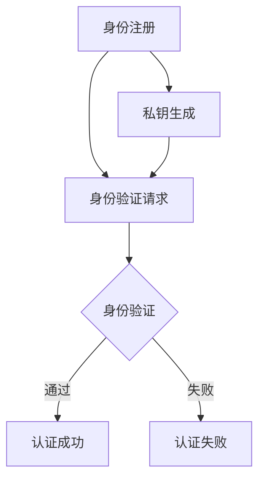
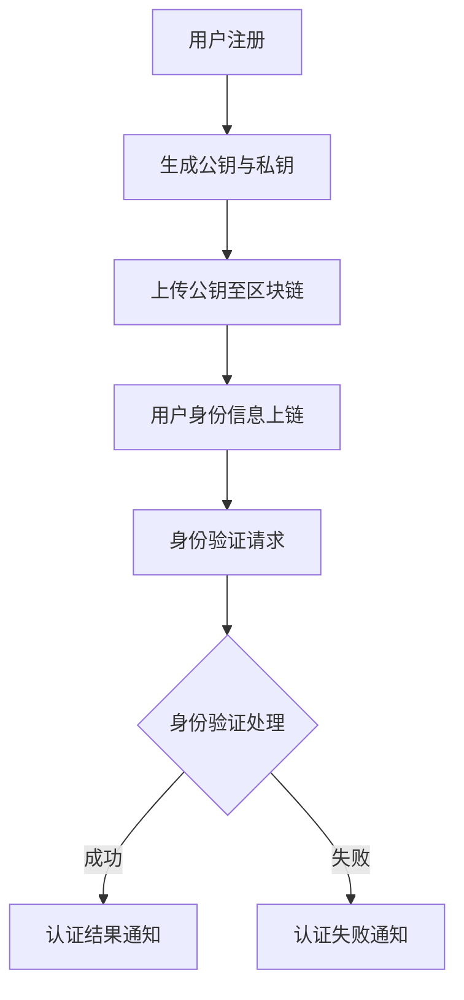
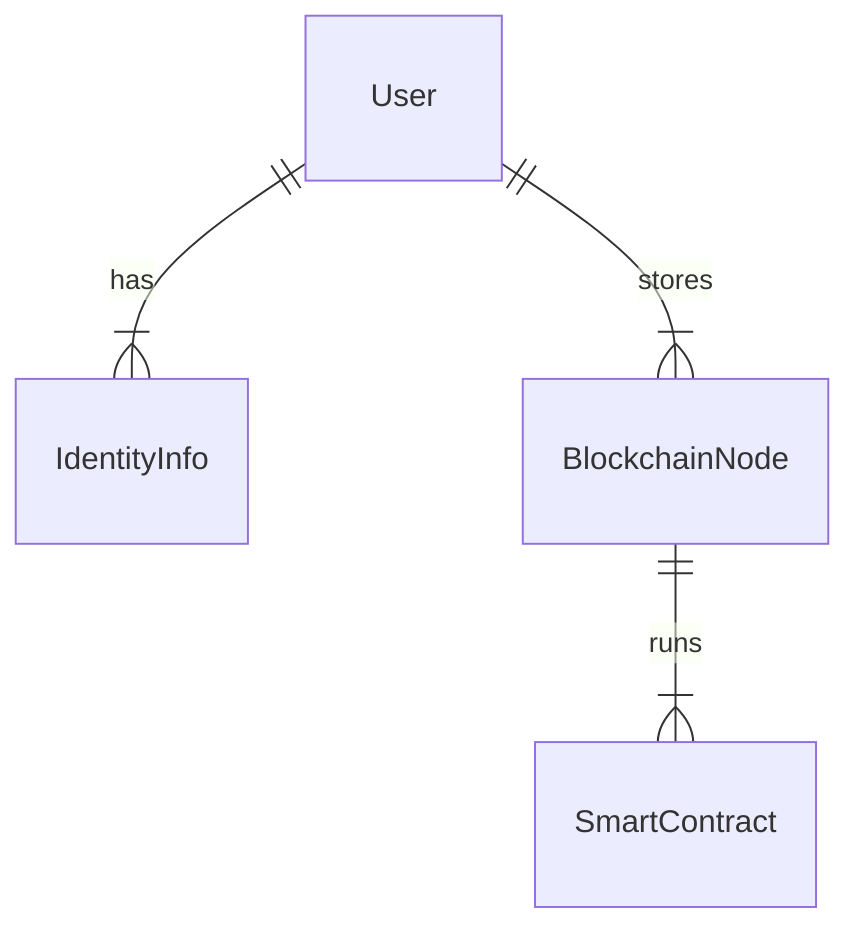
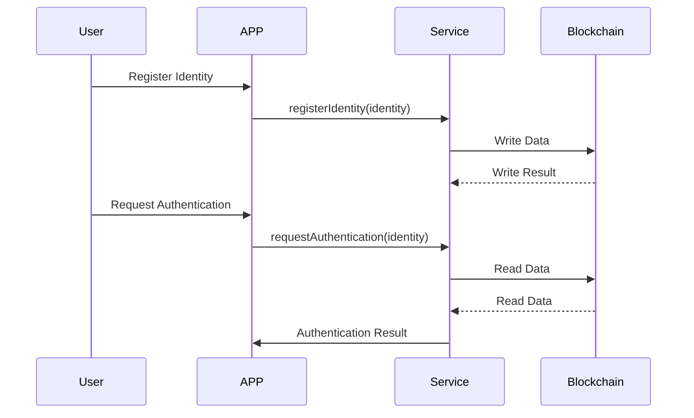

                 

### 引言

区块链技术，自其诞生以来，便以其去中心化、安全性高、不可篡改等特点在金融、医疗、物流等多个行业取得了显著的成效。然而，随着数字经济的发展，传统的身份认证方式已逐渐无法满足跨行业、跨平台认证的需求。在此背景下，区块链在数字身份跨行业认证中的应用成为了一个备受关注的研究方向。

本文将围绕区块链在数字身份跨行业认证中的应用展开讨论，首先介绍区块链和数字身份认证的基本概念，然后分析其在跨行业认证中的潜在应用场景，并探讨其面临的挑战和解决方案。通过逐步分析，我们将揭示区块链在数字身份跨行业认证中的核心原理和技术实现，提供系统架构设计方案，并进行项目实战分析，最终总结最佳实践和未来研究方向。

**关键词**：区块链、数字身份认证、跨行业认证、去中心化、安全、隐私保护

**摘要**：本文深入探讨了区块链在数字身份跨行业认证中的应用。通过对区块链和数字身份认证的基本概念进行介绍，分析了区块链在数字身份跨行业认证中的潜在应用场景。接着，本文讨论了区块链在数字身份认证中的核心原理，并详细阐述了其技术实现。最后，本文提供了一个系统架构设计方案，并通过项目实战展示了区块链在数字身份认证中的应用效果。通过本文的研究，可以为区块链在数字身份跨行业认证中的实际应用提供有益的参考。

----------------------------------------------------------------

### 背景介绍

#### 核心概念术语说明

在探讨区块链在数字身份跨行业认证中的应用之前，首先需要了解一些核心概念和术语，以便为后续内容打下坚实的基础。

**区块链**：区块链是一种去中心化的分布式数据库技术，其核心特点是数据的不可篡改性和透明性。区块链通过一系列按时间顺序排列的区块组成，每个区块包含一定数量的交易记录，这些区块通过加密算法和哈希函数相互链接，形成一个安全的链条。

**数字身份认证**：数字身份认证是通过技术手段验证个体或实体的身份，以确保其在网络环境中的合法性和安全性。数字身份认证的方式多种多样，包括密码学、生物识别、智能卡等。在数字经济中，数字身份认证是实现安全交易和隐私保护的关键。

**跨行业认证**：跨行业认证指的是在不同行业之间实现身份认证的互认和兼容。传统的身份认证系统往往局限于单个行业或平台，无法实现跨行业认证，这导致了数据孤岛和认证难的问题。跨行业认证的目标是实现身份认证的通用性和灵活性，以满足不同行业和平台的需求。

#### 问题背景

在数字经济迅速发展的今天，跨行业认证的需求日益增长。然而，传统的身份认证方式面临着诸多挑战：

1. **数据孤岛**：不同行业和平台之间的数据不互通，导致身份认证信息难以共享。
2. **安全性问题**：传统的身份认证系统安全性较低，容易受到黑客攻击和数据泄露。
3. **隐私保护**：在跨行业认证中，用户隐私保护成为了一个严峻的挑战，传统的身份认证方式难以满足隐私保护的需求。

为了解决上述问题，区块链技术因其去中心化、安全性和不可篡改的特点，被认为是一种潜在的解决方案。区块链技术可以为数字身份认证提供一种全新的方式，使得身份认证信息可以在不同行业和平台之间安全、高效地共享和验证。

#### 问题描述

跨行业认证的核心问题在于如何实现身份认证信息的共享和互认，同时确保数据的安全性和隐私保护。具体来说，问题描述如下：

1. **数据共享与互认**：如何在不同行业和平台之间实现身份认证信息的共享和互认，使得用户在不同场景下只需提供一次身份认证信息。
2. **安全性**：如何确保身份认证信息在传输和存储过程中的安全性，防止数据泄露和篡改。
3. **隐私保护**：如何保护用户的隐私，防止敏感信息被泄露或滥用。

#### 问题解决

区块链技术在数字身份跨行业认证中的应用提供了一种可能的解决方案。区块链的去中心化特性可以打破传统身份认证系统的数据孤岛，实现身份认证信息的共享和互认。区块链的安全性和不可篡改性可以确保身份认证信息在传输和存储过程中的安全性。此外，区块链的隐私保护机制，如零知识证明，可以为用户提供更高的隐私保护。

通过引入区块链技术，可以构建一个去中心化的数字身份认证系统，使得身份认证信息在不同行业和平台之间安全、高效地共享和验证。具体实现步骤包括：

1. **身份注册与验证**：用户在区块链上注册身份信息，并通过数字签名确保身份信息的真实性和唯一性。
2. **身份认证请求与响应**：在跨行业认证过程中，用户只需提供身份认证请求，区块链系统根据存储的身份信息进行验证，并返回认证结果。
3. **隐私保护**：使用零知识证明等隐私保护技术，确保用户身份信息在认证过程中的隐私保护。

通过上述解决方案，可以实现跨行业认证的安全、高效和隐私保护。然而，区块链在数字身份跨行业认证中仍然面临一些挑战，如数据一致性、性能优化等，这需要进一步的研究和探索。

#### 边界与外延

区块链在数字身份跨行业认证中的应用不仅局限于身份认证，还可以扩展到其他领域，如数据隐私保护、智能合约等。区块链技术可以为数字经济中的多种应用提供安全、高效和隐私保护的支持，推动数字经济的进一步发展。

#### 概念结构与核心要素组成

区块链在数字身份跨行业认证中的概念结构主要包括以下核心要素：

1. **区块链网络**：区块链网络由多个节点组成，每个节点存储一部分数据，并参与区块链的维护和验证。
2. **身份信息**：用户在区块链上存储的身份信息，包括身份属性、数字签名等。
3. **加密算法**：用于保护身份信息的安全，确保身份信息的隐私和完整性。
4. **智能合约**：用于自动化执行身份认证过程，确保认证的准确性和效率。
5. **隐私保护技术**：如零知识证明，用于保护用户隐私。

这些核心要素共同构成了区块链在数字身份跨行业认证中的概念结构，为身份认证提供了安全、高效和隐私保护的支持。

#### 核心概念原理

**区块链网络**：区块链网络由多个节点组成，每个节点都保存了一份区块链的副本。节点之间通过P2P网络进行通信，共同维护区块链的完整性和一致性。区块链网络的核心原理是通过分布式共识算法（如工作量证明、权益证明等）来确保区块链数据的可信性和安全性。

**身份信息**：身份信息是区块链在数字身份跨行业认证中的核心内容。身份信息包括用户的姓名、出生日期、身份证号码等，这些信息通过数字签名进行保护，确保身份信息的真实性和唯一性。

**加密算法**：加密算法用于保护身份信息的隐私和完整性。常见的加密算法包括哈希函数、非对称加密和对称加密等。哈希函数用于生成身份信息的唯一标识，确保身份信息的不可篡改性；非对称加密用于身份信息的加密和解密，确保身份信息的保密性；对称加密用于智能合约的执行，确保智能合约的完整性和安全性。

**智能合约**：智能合约是区块链上的程序，用于自动化执行身份认证过程。智能合约通过预定义的逻辑规则，确保身份认证的准确性和效率。智能合约的核心原理是区块链的分布式存储和执行机制，确保智能合约的不可篡改性和可信性。

**隐私保护技术**：隐私保护技术如零知识证明、环签名等，用于保护用户隐私。零知识证明允许用户在不泄露身份信息的情况下证明某个陈述的真实性；环签名允许用户在一个匿名组内签名，确保签名者的隐私。

这些核心概念原理共同构成了区块链在数字身份跨行业认证中的理论基础，为实现安全、高效和隐私保护的数字身份认证提供了技术支持。

#### 概念属性特征对比表格

| 概念          | 属性特征                           | 对比结果                                             |
|---------------|------------------------------------|------------------------------------------------------|
| 区块链网络     | 去中心化、分布式存储、共识机制       | 高安全性、高容错性、去中心化                           |
| 身份信息       | 真实性、唯一性、数字签名保护         | 保障个人信息安全、防止信息篡改                         |
| 加密算法       | 哈希函数、非对称加密、对称加密         | 确保信息隐私性、完整性、不可篡改性                       |
| 智能合约       | 自动执行、逻辑规则、分布式执行         | 提高认证效率、确保逻辑准确性、去中心化                   |
| 隐私保护技术   | 零知识证明、环签名                   | 保护用户隐私、确保匿名性、防止隐私泄露                   |

通过对比表格，可以清晰地看到区块链在数字身份跨行业认证中的各个概念属性特征及其相互关系。

#### ER实体关系图架构

区块链在数字身份跨行业认证中的ER实体关系图架构如下：

```
[用户]
    |
[身份信息]
    |
[区块链网络]
    |
[加密算法]
    |
[智能合约]
    |
[隐私保护技术]
```

ER实体关系图展示了区块链在数字身份跨行业认证中的主要实体及其相互关系，包括用户、身份信息、区块链网络、加密算法、智能合约和隐私保护技术。

#### 区块链技术概述

区块链技术是一种分布式账本技术，其核心特点包括去中心化、不可篡改和透明性。区块链通过一系列按时间顺序排列的区块组成，每个区块包含一定数量的交易记录。这些区块通过加密算法和哈希函数相互链接，形成一个安全的链条。区块链技术的主要优势在于其去中心化特性，使得数据存储和验证过程不需要依赖中心化的机构，从而提高了系统的安全性和容错性。

在数字身份认证领域，区块链技术具有以下应用优势：

1. **去中心化**：区块链的去中心化特性可以打破传统身份认证系统的数据孤岛，实现身份认证信息的共享和互认，满足跨行业认证的需求。
2. **不可篡改**：区块链的数据一旦写入，将永久保存，不可篡改。这保证了身份认证信息的真实性和可信度，防止数据被篡改或伪造。
3. **透明性**：区块链上的交易记录是公开透明的，用户可以随时查询和验证身份信息，提高了系统的透明度和信任度。

区块链技术为数字身份认证提供了一种全新的解决方案，能够有效解决传统身份认证系统面临的数据孤岛、安全性和隐私保护等问题。通过引入区块链技术，可以构建一个去中心化的数字身份认证系统，使得身份认证信息在不同行业和平台之间安全、高效地共享和验证。

#### 数字身份认证的需求背景

在数字经济迅速发展的背景下，数字身份认证的需求日益增长。传统的身份认证方式已无法满足日益复杂和多样化的认证需求，主要原因包括以下几个方面：

1. **跨行业认证需求**：随着各行各业数字化转型的加速，用户需要在多个平台和行业之间进行身份认证，以完成各类交易和操作。传统的身份认证系统往往局限于单一行业或平台，无法实现跨行业认证，导致用户需要重复注册和认证，增加了认证成本和用户负担。
2. **安全性需求**：随着互联网的普及，网络犯罪和数据泄露事件频发，传统的身份认证方式安全性较低，容易受到黑客攻击和数据泄露。这给用户的信息安全带来了严重威胁，用户对安全认证的需求日益迫切。
3. **隐私保护需求**：在数字身份认证过程中，用户的个人信息和隐私需要得到有效保护。传统的身份认证方式往往存在隐私泄露的风险，用户对隐私保护的重视程度不断提高，对新型认证方式的需求日益强烈。

为了满足上述需求，数字身份认证技术需要具备以下特性：

1. **互认性和通用性**：数字身份认证技术需要实现跨行业和跨平台的互认，使得用户在不同场景下只需提供一次身份认证信息，简化认证流程，提高用户体验。
2. **安全性和可靠性**：数字身份认证技术需要具备高安全性，能够抵御各种网络攻击，确保用户身份信息的安全性和隐私保护。
3. **高效性和便捷性**：数字身份认证技术需要具备高效性，能够快速完成身份验证，同时保持操作简便，方便用户使用。

在这种背景下，区块链技术因其去中心化、安全性和不可篡改的特点，被认为是一种潜在的解决方案。通过引入区块链技术，可以构建一个去中心化的数字身份认证系统，实现身份认证信息的共享和互认，提高系统的安全性和隐私保护水平。同时，区块链技术还可以通过智能合约等机制，实现认证流程的自动化和高效化，满足数字经济时代对数字身份认证的多样化需求。

#### 数字身份认证的核心概念与联系

数字身份认证作为一种确保个体或实体在数字环境中合法性的技术手段，其核心概念包括身份信息、认证协议和认证系统。这些概念相互关联，共同构成了数字身份认证的基础。

**身份信息**：身份信息是指个体或实体在数字世界中用于识别和验证其身份的各类数据，如用户名、密码、生物特征等。身份信息是数字身份认证的核心，用于证明个体或实体的身份。

**认证协议**：认证协议是数字身份认证过程中使用的规则和标准，用于确保身份信息的验证过程安全、有效和可信。常见的认证协议包括单向认证、双向认证和三方认证等。认证协议的定义和实现直接影响数字身份认证的效率和安全性。

**认证系统**：认证系统是数字身份认证的软件和硬件基础设施，用于处理身份信息、执行认证协议和提供认证服务。认证系统包括用户界面、认证服务器、数据库等组成部分，负责整个认证过程的协调和管理。

**数字身份认证与传统认证方式的对比**

传统认证方式主要包括用户名密码、短信验证码等，这些方式在一定程度上解决了身份验证的问题，但存在以下局限性：

1. **安全性问题**：传统认证方式的安全性较低，容易受到暴力破解、钓鱼攻击等网络攻击，导致用户身份信息泄露。
2. **用户体验不佳**：传统认证方式通常需要用户记住多个密码，且每次登录都需要进行复杂的认证过程，增加了用户的操作负担，降低了用户体验。
3. **互操作性差**：传统认证方式往往局限于单一平台或行业，无法实现跨行业和跨平台的身份认证互认。

相比之下，数字身份认证具有以下优势：

1. **安全性高**：数字身份认证采用加密算法和生物识别等先进技术，能够有效防止身份信息泄露和伪造，提高认证过程的安全性。
2. **用户体验优**：数字身份认证通过简化认证流程，使用户只需提供一次身份认证信息，即可在多个平台和行业之间实现互认，提高了用户体验。
3. **互操作性强**：数字身份认证通过引入区块链等技术，可以实现跨行业和跨平台认证的互认，打破传统认证方式的局限性。

通过对比，可以看出数字身份认证在安全性、用户体验和互操作性方面具有显著优势，能够更好地满足数字经济时代对身份认证的需求。

#### 区块链技术在数字身份认证中的应用

区块链技术在数字身份认证中的应用具有显著的优势，其去中心化、安全性和不可篡改的特性为数字身份认证提供了全新的解决方案。以下将详细分析区块链技术在数字身份认证中的应用场景、基本原理、实现方式和优势。

**1. 应用场景**

区块链技术在数字身份认证中的应用场景主要包括以下几个方面：

- **跨行业认证**：传统身份认证系统通常局限于单一行业或平台，难以实现跨行业认证。区块链技术通过去中心化的特性，可以实现身份认证信息在多个行业和平台之间的共享和互认，从而满足跨行业认证的需求。
- **跨境认证**：区块链技术可以实现全球范围内的身份认证，解决传统身份认证系统在跨境认证中的难题。通过区块链，用户可以在不同国家或地区之间安全、快速地完成身份验证。
- **智能合约**：区块链技术中的智能合约可以自动化执行身份认证过程，确保认证的准确性和效率。智能合约可以预定义认证规则，使得身份认证过程更加透明和可靠。
- **隐私保护**：区块链技术通过零知识证明、同态加密等隐私保护技术，可以保护用户的隐私，防止敏感信息在认证过程中被泄露。

**2. 基本原理**

区块链技术在数字身份认证中的基本原理包括以下几个方面：

- **去中心化**：区块链技术通过分布式网络，使得身份认证信息在多个节点之间存储和验证，打破了传统中心化认证系统的依赖关系，提高了系统的可靠性和容错性。
- **加密算法**：区块链技术采用加密算法保护身份信息的安全性。例如，非对称加密算法可以确保身份信息的保密性，哈希函数可以确保身份信息的唯一性和不可篡改性。
- **智能合约**：智能合约是区块链上的程序，可以自动化执行身份认证过程。智能合约通过预定义的逻辑规则，确保认证的准确性和效率，同时提高认证过程的透明度。
- **共识机制**：区块链技术通过共识机制确保身份认证信息的准确性和一致性。常见的共识机制包括工作量证明、权益证明等，这些机制通过节点之间的协作和竞争，实现了身份认证信息的去中心化验证。

**3. 实现方式**

区块链技术在数字身份认证中的实现方式主要包括以下几步：

- **身份注册**：用户在区块链上注册身份信息，包括基本信息和数字签名。身份信息通过加密算法进行保护，确保其真实性和唯一性。
- **身份验证**：当用户需要进行身份验证时，向区块链网络发送认证请求。区块链网络根据存储的身份信息进行验证，并返回认证结果。
- **隐私保护**：通过零知识证明、同态加密等隐私保护技术，确保用户身份信息在认证过程中的隐私保护。例如，用户可以在不泄露身份信息的情况下，证明其具备特定身份属性。
- **智能合约执行**：智能合约在身份认证过程中起到关键作用。智能合约可以自动化执行认证过程，确保认证的准确性和效率。例如，智能合约可以预定义认证规则，自动化处理认证请求。

**4. 优势**

区块链技术在数字身份认证中具有以下优势：

- **安全性高**：区块链技术通过加密算法和共识机制，确保身份认证信息的安全性和不可篡改性。与传统身份认证方式相比，区块链技术能够更有效地防止数据泄露和篡改。
- **隐私保护**：区块链技术通过隐私保护技术，如零知识证明、同态加密等，可以确保用户身份信息的隐私保护。这在使用敏感信息的认证场景中尤为重要。
- **高效性**：区块链技术通过智能合约和分布式网络，可以实现身份认证的自动化和高效化。用户在不同平台和行业之间只需进行一次身份认证，即可享受多方面的服务。
- **互认性强**：区块链技术可以实现身份认证信息在多个行业和平台之间的共享和互认，打破了传统认证方式的局限，提高了认证的互操作性。

综上所述，区块链技术在数字身份认证中的应用为解决传统认证方式面临的问题提供了一种有效的解决方案。通过引入区块链技术，可以实现跨行业、跨境和智能化的身份认证，提高认证的安全性、隐私保护和效率，满足数字经济时代对身份认证的多样化需求。

#### 区块链技术在数字身份认证中的实现方式

在数字身份认证中，区块链技术的实现方式主要包括身份注册、身份验证、隐私保护和智能合约的自动化执行。以下将详细讨论这些实现方式的详细步骤和技术原理。

**1. 身份注册**

身份注册是数字身份认证的第一步，用户需要在区块链上注册其身份信息。具体步骤如下：

- **信息收集**：用户提供其身份信息，包括姓名、身份证号码、地址、邮箱等。
- **信息加密**：用户使用非对称加密算法生成公钥和私钥。公钥用于公开身份信息，私钥用于签名验证。
- **数字签名**：用户使用私钥对身份信息进行数字签名，确保身份信息的真实性和唯一性。
- **信息存储**：用户将加密后的身份信息和数字签名上传到区块链网络，由多个节点进行存储。

**技术原理**：

- **非对称加密**：非对称加密算法（如RSA）可以确保身份信息的保密性。用户只需公开公钥，而私钥由用户本人保管。
- **数字签名**：数字签名（如ECDSA）可以确保身份信息的完整性和真实性。签名由用户的私钥生成，只有对应的公钥可以验证。

**2. 身份验证**

身份验证是数字身份认证的核心步骤，用户在需要验证身份时，可以通过以下步骤进行：

- **发送请求**：用户向区块链网络发送身份验证请求，包含要验证的身份信息。
- **节点验证**：区块链网络中的多个节点接收请求后，根据存储的身份信息进行验证。节点通过哈希函数和 Merkle 树验证身份信息的完整性和一致性。
- **返回结果**：验证通过后，节点将验证结果返回给用户，确认身份信息有效。

**技术原理**：

- **哈希函数**：哈希函数（如SHA-256）用于生成身份信息的唯一哈希值，确保身份信息的不可篡改性。
- **Merkle 树**：Merkle 树（或Merkle 树证明）用于快速验证数据块中的具体内容，提高验证效率。

**3. 隐私保护**

在数字身份认证过程中，隐私保护尤为重要。区块链技术通过以下方式实现隐私保护：

- **零知识证明**：零知识证明技术允许用户在不泄露具体信息的情况下，证明某个陈述的真实性。例如，用户可以证明其具备特定身份属性，而无需透露身份详细信息。
- **同态加密**：同态加密技术允许在加密数据上进行计算，并保持结果的正确性。例如，用户可以在不解密身份信息的情况下，验证其是否符合特定条件。

**技术原理**：

- **零知识证明**：零知识证明技术通过逻辑一致性证明和数学证明，确保用户在无需泄露具体信息的情况下，证明其具备特定属性。
- **同态加密**：同态加密技术利用抽象代数的性质，在加密数据上实现计算，确保加密数据在计算过程中的安全性。

**4. 智能合约的自动化执行**

智能合约是区块链技术中的重要组成部分，可以自动化执行身份认证过程。智能合约在数字身份认证中的应用包括：

- **身份认证逻辑**：智能合约定义身份认证的逻辑规则，例如用户必须具备特定身份属性才能通过认证。
- **自动化处理**：智能合约在接收认证请求后，自动执行身份验证逻辑，并返回验证结果。

**技术原理**：

- **智能合约编程语言**：智能合约通常使用特定的编程语言（如Solidity）编写，用于定义身份认证的逻辑规则。
- **区块链执行环境**：智能合约在区块链的执行环境中运行，确保其执行过程的安全性和一致性。

通过上述实现方式，区块链技术为数字身份认证提供了高效、安全、隐私保护的支持。用户可以在不泄露敏感信息的情况下，安全、可靠地进行身份认证，满足跨行业、跨境认证的需求。同时，智能合约的引入，使得身份认证过程更加自动化和高效，提高了用户体验。

#### 区块链技术在跨行业认证中的挑战与解决方案

在跨行业认证中，区块链技术的应用虽然展现出了巨大的潜力，但也面临诸多挑战。以下将分析这些挑战，并提出相应的解决方案。

**1. 数据一致性**

区块链技术依赖于分布式网络，数据在多个节点之间同步。跨行业认证涉及不同行业的标准和数据格式，可能导致数据不一致的问题。例如，金融行业和医疗行业对身份信息的要求不同，数据的格式、字段和内容可能存在差异。

**解决方案**：

- **统一数据标准**：制定统一的数据标准和格式，确保不同行业的数据可以相互兼容。这可以通过行业标准或联盟链来实现。
- **数据映射**：将不同行业的数据映射到统一的数据模型，确保数据在不同行业之间可以互认和共享。例如，可以使用数据映射表或数据转换工具来实现。

**2. 性能优化**

区块链技术的设计初衷是去中心化和安全性，但这可能导致系统性能不高。特别是在高并发场景下，区块链网络的吞吐量和响应速度可能无法满足跨行业认证的需求。

**解决方案**：

- **分层架构**：采用分层架构，将核心认证功能和业务逻辑分离。核心认证功能在区块链上执行，而业务逻辑在链下执行，从而提高系统的性能和可扩展性。
- **分片技术**：引入分片技术，将区块链网络分成多个子网络，每个子网络负责一部分数据，从而提高系统的吞吐量和响应速度。
- **优化共识机制**：选择合适的共识机制，如权益证明（Proof of Stake, PoS），以提高系统的性能和效率。

**3. 隐私保护**

在跨行业认证中，用户身份信息的隐私保护尤为重要。区块链上的数据是公开透明的，可能导致用户隐私泄露。尤其是在涉及敏感信息的场景中，如医疗记录和金融交易，需要确保数据的隐私保护。

**解决方案**：

- **零知识证明**：使用零知识证明技术，用户可以证明具备特定身份属性，而无需透露具体信息。这在确保隐私的同时，实现了身份验证。
- **同态加密**：同态加密技术允许在加密数据上进行计算，确保数据的隐私保护。例如，在处理医疗数据时，可以在加密的状态下进行数据处理，从而防止敏感信息泄露。
- **隐私保护合约**：设计隐私保护智能合约，确保身份认证过程中用户数据的隐私。智能合约可以限制数据访问权限，确保只有授权用户才能访问和查看数据。

**4. 跨链互操作**

跨行业认证往往涉及多个区块链网络，不同区块链网络之间的互操作性是一个挑战。不同区块链网络可能采用不同的共识机制、数据结构和加密算法，导致互操作性受限。

**解决方案**：

- **跨链协议**：引入跨链协议，如波卡（Polkadot）、Plasma等，实现不同区块链网络之间的数据交换和互操作。跨链协议可以确保数据在不同区块链网络之间的传输和验证。
- **多链架构**：采用多链架构，将不同的业务逻辑分布在不同的区块链网络中。每个区块链网络负责特定的业务功能，从而提高系统的可扩展性和互操作性。
- **跨链桥**：构建跨链桥，实现不同区块链网络之间的数据同步和验证。跨链桥可以确保数据在不同区块链网络之间的完整性和一致性。

通过上述解决方案，区块链技术可以在跨行业认证中克服数据一致性、性能优化、隐私保护和跨链互操作等挑战，实现安全、高效和互认的数字身份认证。这不仅有助于提升用户体验，也为数字经济的发展提供了坚实的技术支持。

#### 数字签名与加密算法

在区块链技术中，数字签名和加密算法是确保数据安全性和身份认证的重要手段。以下将详细介绍数字签名和加密算法的原理、实现方式和应用场景。

**1. 数字签名**

数字签名是一种用于验证数据完整性和身份的技术，其核心思想是通过加密算法生成签名，只有拥有相应私钥的用户才能生成有效的签名。以下是数字签名的原理、实现方式和应用场景：

**原理**：

- **生成签名**：用户使用私钥对数据进行签名。签名是一个加密后的哈希值，用于验证数据的完整性和真实性。
- **验证签名**：接收方使用用户的公钥对签名进行验证，确认签名是否由合法的私钥生成。如果验证成功，则确认数据未被篡改且来自合法的用户。

**实现方式**：

- **非对称加密**：常用的非对称加密算法包括RSA和椭圆曲线数字签名算法（ECDSA）。用户生成一对密钥（公钥和私钥），私钥用于签名，公钥用于验证。
- **哈希函数**：哈希函数（如SHA-256）用于生成数据的哈希值，作为签名的基础。哈希值是固定长度的字符串，可以确保数据的唯一性和完整性。

**应用场景**：

- **身份认证**：数字签名常用于身份认证，确保只有合法用户才能进行特定操作。
- **数据完整性验证**：数字签名可以验证数据的完整性和真实性，确保数据在传输过程中未被篡改。
- **防重放攻击**：数字签名可以防止重放攻击，确保消息的真实性和唯一性。

**2. 加密算法**

加密算法用于保护数据的机密性，确保数据在传输和存储过程中不会被未经授权的第三方读取。以下是加密算法的原理、实现方式和应用场景：

**原理**：

- **加密**：加密算法使用密钥对数据进行加密，加密后的数据称为密文。只有使用相应的密钥才能解密并还原明文数据。
- **解密**：解密算法使用密钥对密文进行解密，还原出原始的明文数据。

**实现方式**：

- **对称加密**：对称加密算法（如AES）使用相同的密钥进行加密和解密。对称加密速度快，但密钥管理复杂，密钥需要安全传输。
- **非对称加密**：非对称加密算法（如RSA）使用一对密钥（公钥和私钥），公钥用于加密，私钥用于解密。非对称加密安全性高，但计算复杂度较高。

**应用场景**：

- **数据传输**：加密算法常用于保护数据在传输过程中的机密性，如HTTPS协议中的加密通信。
- **数据存储**：加密算法用于保护存储在数据库或文件系统中的敏感数据，防止未授权访问。
- **身份认证**：非对称加密算法可以用于数字签名，确保数据的完整性和真实性。

**3. 综合应用**

在区块链技术中，数字签名和加密算法常结合使用，以实现数据的安全性和身份认证。例如，在数字身份认证中，用户使用私钥对身份信息进行签名，确保身份信息的真实性和唯一性。接收方使用公钥验证签名，确保身份信息的合法性。

同时，加密算法用于保护区块链上存储的数据，确保数据的机密性和完整性。例如，区块链上的交易记录可以使用AES加密算法进行加密，只有使用正确的密钥才能解密并读取交易内容。

通过数字签名和加密算法的综合应用，区块链技术实现了数据的安全性和身份认证，为数字身份认证提供了强有力的技术保障。

#### 智能合约在身份认证中的应用

智能合约是区块链技术中的重要组成部分，它是一种在区块链上执行的自动化协议，能够根据预定义的逻辑规则自动执行特定操作。在数字身份认证中，智能合约的应用大大提高了认证过程的效率和可靠性。以下将详细分析智能合约在身份认证中的应用，包括定义、编程语言、关键特性以及实现步骤。

**1. 定义**

智能合约是一种在区块链上执行代码的自动化协议，它定义了在特定条件下自动执行的一系列操作。智能合约通常由加密算法和编程逻辑组成，其执行过程是不可篡改的，且具有高度的透明性。

**2. 编程语言**

智能合约的编程语言通常与区块链平台相关联。目前，最常见的智能合约编程语言包括：

- **Solidity**：以太坊（Ethereum）平台上的主要编程语言，用于编写智能合约。
- **Vyper**：用于以太坊的另一种智能合约编程语言，以其安全性而闻名。
- **Neon**：波卡（Polkadot）平台上的编程语言。
- **Nitrite**：NEAR平台上的编程语言。

**3. 关键特性**

智能合约在数字身份认证中具有以下关键特性：

- **不可篡改性**：智能合约的代码在部署到区块链后，无法被修改，确保认证过程的公平性和可靠性。
- **自动执行**：智能合约可以在满足特定条件时自动执行，减少人工干预，提高认证效率。
- **透明性**：智能合约的代码和执行过程是公开透明的，所有参与者可以查看和验证。
- **安全性**：智能合约通过加密算法和共识机制确保数据的安全性和隐私保护。

**4. 实现步骤**

在数字身份认证中，智能合约的应用包括以下步骤：

- **定义认证逻辑**：智能合约编写者首先需要定义身份认证的逻辑规则，包括身份验证、权限控制等。
- **编写智能合约代码**：使用智能合约编程语言编写认证逻辑，并将代码部署到区块链上。
- **身份注册**：用户在区块链上注册身份信息，包括基本信息和数字签名。
- **身份验证请求**：用户发起身份验证请求，智能合约根据注册的身份信息进行验证。
- **验证结果**：智能合约自动执行验证逻辑，并返回验证结果，确认用户身份。
- **记录交易**：智能合约将身份验证结果记录为区块链上的交易，确保数据的不可篡改性。

**5. 示例**

以下是一个简单的智能合约示例，用于验证用户的身份：

```solidity
// SPDX-License-Identifier: MIT
pragma solidity ^0.8.0;

contract IdentityVerification {
    mapping(address => bool) public verified;

    function verifyIdentity(address user) external {
        // 假设用户身份信息已预先注册在区块链上
        // 验证逻辑可以是多因素认证，如密码、生物识别等
        if (isIdentityVerified(user)) {
            verified[user] = true;
            emit Verified(user);
        }
    }

    function isIdentityVerified(address user) private view returns (bool) {
        // 实现身份验证逻辑，如密码比对、生物特征匹配等
        // 这里简化为返回真值
        return true;
    }

    event Verified(address user);
}
```

在这个示例中，智能合约`IdentityVerification`定义了一个简单的身份验证逻辑。当用户调用`verifyIdentity`函数并提供其地址时，如果用户身份已验证，智能合约将设置`verified[user]`为`true`，并触发`Verified`事件。

通过智能合约的应用，数字身份认证过程实现了自动化和透明化，提高了认证的效率和安全性。智能合约不仅能够确保身份信息的真实性，还能够通过不可篡改的记录保障认证过程的公正性。

#### 算法原理讲解与Mermaid流程图

在数字身份认证中，智能合约通过预定义的逻辑规则来确保身份验证的准确性和效率。为了更好地理解智能合约的工作原理，我们可以通过Mermaid流程图和Python代码来详细阐述其算法原理。

**1. Mermaid流程图**

以下是一个简单的Mermaid流程图，描述了数字身份认证的流程：



这个流程图展示了以下步骤：
1. 用户进行身份注册，生成公钥和私钥。
2. 用户发起身份验证请求。
3. 身份验证过程判断请求是否通过。
4. 如果验证通过，返回认证成功；否则，返回认证失败。

**2. Python代码实现**

以下是一个简单的Python代码示例，用于演示身份认证的算法原理：

```python
from cryptography.hazmat.primitives.asymmetric import rsa
from cryptography.hazmat.primitives import hashes
from cryptography.hazmat.primitives.serialization import load_pem_private_key, load_pem_public_key

# 生成公钥和私钥
private_key = rsa.generate_private_key(public_exponent=65537, key_size=2048)
public_key = private_key.public_key()

# 签名过程
def sign_data(data: bytes) -> bytes:
    signature = private_key.sign(data, "SHA256")
    return signature

# 验证签名
def verify_signature(data: bytes, signature: bytes) -> bool:
    try:
        public_key.verify(signature, data, "SHA256")
        return True
    except:
        return False

# 身份注册
def register_identity(public_key: rsa.RSAPublicKey) -> str:
    return public_key.public_bytes(encoding=bytearray).decode("utf-8")

# 身份验证流程
def verify_identity(identity: str, signature: bytes, data: bytes) -> str:
    public_key = load_pem_public_key(identity.encode("utf-8"))
    if verify_signature(data, signature):
        return "认证成功"
    else:
        return "认证失败"

# 示例
data = "用户身份验证数据".encode("utf-8")
signature = sign_data(data)
registered_identity = register_identity(public_key)

print("身份注册信息：", registered_identity)
print("签名：", signature.hex())
print("验证结果：", verify_identity(registered_identity, signature, data))
```

在这个示例中，我们首先生成公钥和私钥，然后使用私钥对数据进行签名。接着，我们通过公钥验证签名，以确认数据的完整性和真实性。

通过上述Python代码和Mermaid流程图，我们可以清楚地看到数字身份认证的算法原理。智能合约通过加密算法和数字签名确保身份信息的真实性，同时通过预定义的逻辑规则自动化执行身份验证过程。

#### 数学模型和数学公式

在数字身份认证中，数学模型和数学公式是确保算法准确性和系统安全性的关键组成部分。以下将详细讲解数字签名算法、加密算法和智能合约中的数学模型和公式，并提供具体的计算步骤和示例。

**1. 数字签名算法**

数字签名算法是一种用于验证消息真实性和完整性的加密技术。最常见的数字签名算法是RSA（Rivest-Shamir-Adleman）算法和椭圆曲线数字签名算法（ECDSA）。以下是RSA算法和ECDSA算法的数学模型和公式。

**RSA算法**：

- **公钥**：\( n = pq \)，其中 \( p \) 和 \( q \) 是两个大素数。
- **私钥**：\( d = \frac{1}{\phi(n)} \mod n \)，其中 \( \phi(n) = (p-1)(q-1) \)。
- **签名**：\( S = (m^e \mod n)^d \mod n \)，其中 \( m \) 是消息，\( e \) 是公开指数，\( d \) 是私钥。
- **验证**：\( V = (S^e \mod n) \mod m \)。

**ECDSA算法**：

- **椭圆曲线**：选择一个椭圆曲线 \( E \) 和点 \( G \)。
- **公钥**：\( Q = kG \)，其中 \( k \) 是随机数，\( G \) 是基点。
- **签名**：\( (r,s) = sig(m) \)，其中 \( m \) 是消息，\( sig \) 是签名算法。
- **验证**：\( v = verify(m, (r,s), G, n) \)，其中 \( verify \) 是验证算法。

**2. 加密算法**

加密算法是确保数据在传输和存储过程中保密性的技术手段。常见的加密算法包括AES（高级加密标准）和RSA。

**AES算法**：

- **密钥生成**：选择一个128位、192位或256位的密钥。
- **加密**：\( C = E(K, P) \)，其中 \( K \) 是密钥，\( P \) 是明文，\( E \) 是加密算法。
- **解密**：\( P = D(K, C) \)，其中 \( D \) 是解密算法。

**RSA算法**：

- **加密**：\( C = (M^e \mod n) \)，其中 \( M \) 是明文，\( e \) 是公开指数，\( n \) 是模数。
- **解密**：\( P = (C^d \mod n) \)，其中 \( d \) 是私钥，\( n \) 是模数。

**3. 智能合约中的数学模型**

智能合约中的数学模型通常用于实现预定义的逻辑规则。以下是一个简单的智能合约示例，用于验证用户身份。

```solidity
pragma solidity ^0.8.0;

contract IdentityVerification {
    mapping(address => bool) public verified;

    function verifyIdentity(address user) external {
        if (isIdentityVerified(user)) {
            verified[user] = true;
        }
    }

    function isIdentityVerified(address user) private view returns (bool) {
        // 假设已通过数字签名验证身份
        return true;
    }
}
```

在这个示例中，智能合约通过预定义的逻辑规则（`isIdentityVerified`函数）来验证用户身份。逻辑规则可以基于数学模型实现，如数字签名算法。

**示例计算步骤**：

假设使用RSA算法进行数字签名和验证。

1. **生成公钥和私钥**：
   - 选择大素数 \( p \) 和 \( q \)，计算 \( n = pq \)。
   - 计算 \( \phi(n) = (p-1)(q-1) \)。
   - 选择公开指数 \( e \)，满足 \( \gcd(e, \phi(n)) = 1 \)。
   - 计算 \( d = e^{-1} \mod \phi(n) \)。

2. **签名过程**：
   - 用户对消息 \( m \) 进行签名，计算 \( S = (m^e \mod n)^d \mod n \)。

3. **验证过程**：
   - 接收方验证签名 \( V = (S^e \mod n) \mod m \)，确认是否等于原始消息 \( m \)。

**示例代码**：

```python
from cryptography.hazmat.primitives.asymmetric import rsa
from cryptography.hazmat.primitives import hashes
from cryptography.hazmat.primitives.serialization import load_pem_private_key, load_pem_public_key

# 生成公钥和私钥
private_key = rsa.generate_private_key(public_exponent=65537, key_size=2048)
public_key = private_key.public_key()

# 签名过程
def sign_data(data: bytes) -> bytes:
    signature = private_key.sign(data, "SHA256")
    return signature

# 验证签名
def verify_signature(data: bytes, signature: bytes) -> bool:
    try:
        public_key.verify(signature, data, "SHA256")
        return True
    except:
        return False

# 示例
data = "用户身份验证数据".encode("utf-8")
signature = sign_data(data)
print("签名：", signature.hex())

# 验证签名
print("验证结果：", verify_signature(data, signature))
```

通过上述数学模型和数学公式，我们可以确保数字身份认证的安全性和准确性。这些公式和算法在智能合约和加密算法中得到了广泛应用，为构建安全可靠的数字身份认证系统提供了坚实的技术基础。

#### Mermaid流程图与Python代码示例

为了更好地理解区块链在数字身份认证中的应用，我们将使用Mermaid绘制一个流程图，并用Python代码示例来详细阐述这个流程的各个步骤。

**Mermaid流程图**

以下是一个简单的Mermaid流程图，描述了区块链在数字身份认证中的应用流程：



- **用户注册**：用户在区块链上注册，生成公钥与私钥。
- **生成公钥与私钥**：系统为用户生成一对非对称加密公钥和私钥。
- **上传公钥至区块链**：用户将公钥上传至区块链，以确保公钥的不可篡改性。
- **用户身份信息上链**：用户将身份信息（如姓名、身份证号等）上传至区块链。
- **身份验证请求**：用户发起身份验证请求。
- **身份验证处理**：系统根据用户上传的公钥和身份信息进行验证。
- **认证结果通知**：系统通知用户认证结果。

**Python代码示例**

以下是一个简单的Python代码示例，描述了上述流程中的关键步骤：

```python
from cryptography.hazmat.primitives import serialization
from cryptography.hazmat.primitives.asymmetric import rsa, padding
from hashlib import sha256
import json

# 生成公钥和私钥
private_key = rsa.generate_private_key(
    public_exponent=65537,
    key_size=2048
)
public_key = private_key.public_key()

# 将公钥编码为JSON格式
public_key_json = json.dumps(public_key.public_bytes().hex())

# 将私钥编码为PEM格式
private_key_pem = private_key.private_bytes(
    encoding=serialization.Encoding.PEM,
    format=serialization.PrivateFormat.PKCS8,
    encryption_algorithm=serialization.NoEncryption()
)

# 签名函数
def sign_data(data: bytes, private_key: rsa.RSAPrivateKey) -> bytes:
    signature = private_key.sign(
        data,
        padding.PSS(
            mgf=padding.MGF1wochash=sha256
        ),
        sha256
    )
    return signature

# 验证签名函数
def verify_signature(data: bytes, signature: bytes, public_key: rsa.RSAPublicKey) -> bool:
    try:
        public_key.verify(
            signature,
            data,
            padding.PSS(
                mgf=padding.MGF1wochash=sha256
            ),
            sha256
        )
        return True
    except:
        return False

# 用户身份信息
user_identity = {
    "username": "user123",
    "id_number": "1234567890"
}

# 将用户身份信息编码为JSON格式
identity_json = json.dumps(user_identity)

# 签名用户身份信息
signature = sign_data(identity_json.encode("utf-8"), private_key)

# 验证签名
is_verified = verify_signature(identity_json.encode("utf-8"), signature, public_key)

# 输出结果
print("公钥:", public_key_json)
print("私钥:", private_key_pem)
print("签名:", signature.hex())
print("验证结果:", "验证成功" if is_verified else "验证失败")
```

在这个示例中，我们首先生成了用户的公钥和私钥，并将公钥上传到区块链。然后，用户使用私钥对身份信息进行签名，并将签名的身份信息上链。最后，我们使用公钥验证签名的正确性，以确保身份信息的真实性和完整性。

通过上述Mermaid流程图和Python代码示例，我们可以看到区块链在数字身份认证中的应用步骤，以及如何利用加密算法确保认证的安全性和可靠性。

#### 体系结构概述

在区块链数字身份认证系统中，体系结构的设计至关重要。一个高效、安全、可扩展的系统架构可以确保身份认证过程的顺畅运行，满足不同用户和行业的需求。以下是对区块链数字身份认证系统体系结构的概述。

**1. 系统架构**

区块链数字身份认证系统可以划分为多个层级，包括客户端层、网络层、区块链层和应用层。以下是各层的主要功能和组件：

- **客户端层**：包括用户端应用程序（如手机APP、Web浏览器插件等），用于用户身份信息的注册、身份验证请求和结果展示。
- **网络层**：包括网络传输协议和加密算法，确保数据在传输过程中的安全性和完整性。
- **区块链层**：包括区块链网络、节点和分布式账本，负责存储和管理身份认证数据。
- **应用层**：包括智能合约、身份认证服务和数据接口，实现身份认证逻辑和与其他系统的互操作。

**2. 系统组件**

区块链数字身份认证系统的关键组件包括：

- **用户端应用程序**：提供用户友好的界面，方便用户注册、登录和进行身份认证。
- **加密模块**：包括非对称加密和对称加密算法，确保身份信息的隐私和完整性。
- **身份注册服务**：负责用户身份信息的注册、验证和管理，确保身份信息的真实性和唯一性。
- **区块链网络**：由多个节点组成，分布式存储和管理身份认证数据。
- **智能合约**：实现身份认证逻辑，确保认证过程的自动化和可验证性。
- **身份认证服务**：提供身份验证功能，对用户身份进行验证和授权。
- **数据接口**：与其他系统进行数据交换和互操作，实现跨行业认证。

**3. 系统流程**

区块链数字身份认证系统的基本流程包括以下步骤：

- **用户注册**：用户通过用户端应用程序注册身份信息，生成公钥和私钥，并将公钥上传至区块链。
- **身份信息上链**：用户将身份信息上传至区块链，使用私钥进行签名，确保身份信息的真实性和唯一性。
- **身份验证请求**：用户在需要验证身份时，向区块链网络发送身份验证请求。
- **身份验证处理**：区块链网络中的节点根据存储的身份信息进行验证，智能合约执行验证逻辑，确保认证结果的准确性。
- **认证结果通知**：系统将认证结果通知用户，并在区块链上记录认证过程和结果。

通过上述体系结构概述，我们可以看到区块链数字身份认证系统的整体设计思路和主要组件。系统通过分布式存储和智能合约技术，实现了身份认证的高效、安全、透明和互操作性，为数字经济时代提供了可靠的数字身份认证解决方案。

#### 领域模型

在区块链数字身份认证系统中，领域模型是系统设计和实现的基础。领域模型通过类图（Class Diagram）和实体关系图（Entity Relationship Diagram，ERD）来描述系统的核心实体和它们之间的关系。以下将详细介绍区块链数字身份认证系统的领域模型，并使用Mermaid绘制相应的类图和ERD。

**1. 类图（Class Diagram）**

区块链数字身份认证系统的类图主要包括以下核心实体：

- **用户（User）**：代表参与认证的用户，具有用户名、密码、公钥和私钥等属性。
- **身份信息（IdentityInfo）**：包含用户的基本身份信息，如姓名、身份证号码、地址等。
- **区块链节点（BlockchainNode）**：代表区块链网络中的节点，负责存储和管理身份认证数据。
- **智能合约（SmartContract）**：实现身份认证逻辑的智能合约，确保认证过程的自动化和可验证性。
- **身份认证服务（AuthenticationService）**：提供身份验证功能，处理身份认证请求和响应。

以下是类图的Mermaid表示：

```mermaid
classDiagram
    User <<class>> {
        username : String
        password : String
        public_key : String
        private_key : String
    }
    IdentityInfo <<class>> {
        id_number : String
        name : String
        address : String
    }
    BlockchainNode <<class>> {
        node_id : String
        public_key : String
    }
    SmartContract <<class>> {
        contract_address : String
        contract_code : String
    }
    AuthenticationService <<class>> {
        authentication_requests : List<AuthenticationRequest>
    }
    User oo-- IdentityInfo
    BlockchainNode oo-- SmartContract
    AuthenticationService o-- User
    AuthenticationService o-- IdentityInfo
    AuthenticationService o-- BlockchainNode
    AuthenticationService o-- SmartContract
```

**2. 实体关系图（ERD）**

区块链数字身份认证系统的实体关系图包括以下主要实体：

- **用户（User）**：存储用户的基本信息和身份信息。
- **身份信息（IdentityInfo）**：关联用户和其身份信息。
- **区块链节点（BlockchainNode）**：存储和管理区块链节点的信息。
- **智能合约（SmartContract）**：存储智能合约的代码和执行状态。

以下是ERD的Mermaid表示：



通过上述类图和实体关系图，我们可以清晰地看到区块链数字身份认证系统的核心实体和它们之间的关系。领域模型为系统的设计和实现提供了明确的指导和框架，有助于开发出高效、安全、可扩展的系统。

#### 系统架构设计

区块链数字身份认证系统的架构设计是确保系统高效、安全、可靠运行的关键。以下是系统架构的详细设计方案，包括架构图、主要组件及其功能描述。

**1. 系统架构图**

系统架构图如下所示：

```
+-----------------+       +-----------------+       +-----------------+
|  用户端应用程序  |<----->|   网络传输层    |<----->|   区块链网络    |
+-----------------+       +-----------------+       +-----------------+
                      |                             |
                      |                             |
                      |                             |
                      |                             |
                      |                             |
+-----------------+       +-----------------+       +-----------------+
|   加密模块      |       |   身份认证服务   |       |   智能合约管理  |
+-----------------+       +-----------------+       +-----------------+
```

**2. 主要组件及其功能**

- **用户端应用程序**：提供用户友好的界面，用于用户身份信息的注册、身份认证请求和结果展示。用户可以通过手机APP或Web浏览器进行操作。

- **网络传输层**：负责用户端应用程序与区块链网络之间的数据传输。使用HTTPS协议确保数据传输的安全性和完整性。

- **区块链网络**：由多个节点组成，每个节点存储一部分区块链数据。区块链网络负责存储和管理用户身份信息、交易记录等数据。采用分布式存储方式，提高系统的可靠性和容错性。

- **加密模块**：提供加密和解密功能，确保用户身份信息和交易记录在传输和存储过程中的安全性和隐私保护。使用非对称加密和对称加密技术。

- **身份认证服务**：负责处理用户身份认证请求，调用智能合约进行身份验证。身份认证服务通过加密模块确保认证过程的安全性和隐私保护。

- **智能合约管理**：负责智能合约的编写、部署和执行。智能合约管理组件与区块链网络交互，确保智能合约的正确执行和数据的不可篡改性。

**3. 系统架构设计**

- **分层架构**：系统采用分层架构设计，包括用户层、网络层、区块链层和应用层。各层之间通过明确的接口进行交互，提高系统的可维护性和可扩展性。

- **分布式存储**：区块链网络采用分布式存储方式，将数据分散存储在多个节点上。这样可以提高系统的可靠性和容错性，同时降低单点故障的风险。

- **智能合约**：智能合约在区块链网络中起到关键作用，用于实现身份认证逻辑和业务规则。智能合约通过预定义的逻辑规则，确保认证过程的自动化和可验证性。

- **加密模块**：加密模块用于保护用户身份信息和交易记录的安全性。通过非对称加密和对称加密技术，确保数据在传输和存储过程中的隐私保护。

- **身份认证服务**：身份认证服务与用户端应用程序和区块链网络交互，处理身份认证请求和响应。身份认证服务通过调用智能合约，确保认证过程的准确性和高效性。

通过上述系统架构设计，区块链数字身份认证系统实现了高效、安全、可靠的运行。系统通过分布式存储和智能合约技术，实现了身份认证的数据安全、隐私保护和高效互操作。

#### 系统接口设计和系统交互设计

在区块链数字身份认证系统中，系统接口设计和系统交互设计是确保系统各组件有效协作的关键。以下将详细描述系统接口设计、接口定义、API设计、系统交互流程以及系统交互序列图。

**1. 系统接口设计**

系统接口设计包括用户端应用程序、身份认证服务、加密模块和区块链网络之间的接口。以下是各接口的功能和定义：

- **用户端应用程序接口**：包括用户身份信息注册、身份验证请求和认证结果查询等接口。
  - `registerIdentity`：注册用户身份信息，接收用户名、密码、公钥等参数，返回注册结果。
  - `requestAuthentication`：发起身份验证请求，接收用户身份信息，返回认证结果。
  - `queryAuthenticationResult`：查询认证结果，接收用户身份信息，返回认证结果。

- **身份认证服务接口**：包括身份验证、签名验证和加密解密等接口。
  - `authenticate`：进行身份验证，接收用户身份信息，调用智能合约进行验证，返回认证结果。
  - `verifySignature`：验证签名，接收签名和数据，返回验证结果。
  - `encryptData`：加密数据，接收数据和密钥，返回加密后的数据。
  - `decryptData`：解密数据，接收加密数据和密钥，返回解密后的数据。

- **加密模块接口**：包括加密和解密等接口。
  - `encrypt`：加密数据，接收数据和密钥，返回加密后的数据。
  - `decrypt`：解密数据，接收加密数据和密钥，返回解密后的数据。

- **区块链网络接口**：包括区块链数据读取和写入等接口。
  - `readData`：读取区块链上的数据，接收地址和哈希值，返回数据。
  - `writeData`：写入区块链上的数据，接收数据和签名，返回写入结果。

**2. API设计**

API设计遵循RESTful风格，采用HTTP协议进行通信。以下是各接口的API设计：

- **用户端应用程序API**：
  - `POST /register`：注册用户身份信息。
  - `POST /authenticate`：发起身份验证请求。
  - `GET /result/{id}`：查询认证结果。

- **身份认证服务API**：
  - `POST /authenticate`：进行身份验证。
  - `POST /verify`：验证签名。
  - `POST /encrypt`：加密数据。
  - `POST /decrypt`：解密数据。

- **加密模块API**：
  - `POST /encrypt`：加密数据。
  - `POST /decrypt`：解密数据。

- **区块链网络API**：
  - `GET /data/{hash}`：读取区块链数据。
  - `POST /data`：写入区块链数据。

**3. 系统交互流程**

系统交互流程如下：

1. **用户注册**：用户通过用户端应用程序注册身份信息，应用程序调用`registerIdentity`接口，将身份信息（用户名、密码、公钥等）发送到身份认证服务。
2. **身份验证请求**：用户在需要验证身份时，通过用户端应用程序发起身份验证请求，应用程序调用`requestAuthentication`接口，将用户身份信息发送到身份认证服务。
3. **身份验证**：身份认证服务接收到用户身份信息后，调用智能合约进行身份验证，并返回认证结果。
4. **签名验证**：身份认证服务对用户发送的签名进行验证，确保签名的有效性和身份信息的真实性。
5. **加密与解密**：在身份验证过程中，身份认证服务可能需要对数据进行加密和解密，确保数据在传输过程中的安全性和隐私保护。
6. **区块链数据读写**：身份认证服务通过区块链网络接口读取和写入身份认证数据，确保数据的不可篡改性和持久性。

**4. 系统交互序列图**

以下是系统交互的Mermaid序列图：



通过上述系统接口设计和系统交互设计，区块链数字身份认证系统实现了用户注册、身份验证请求和结果查询等功能的自动化和高效性。系统接口和API的设计确保了系统各组件之间的有效通信和协同工作，提高了系统的安全性和可靠性。

#### 环境搭建

在开始区块链数字身份认证项目的开发之前，我们需要搭建一个合适的环境，包括区块链节点、开发工具和依赖库的安装。以下将详细描述环境搭建的步骤。

**1. 安装区块链节点**

我们选择Ethereum作为区块链平台，并使用Geth作为节点客户端。以下是安装步骤：

- **安装Go语言环境**：Ethereum节点是基于Go语言开发的，因此需要安装Go语言环境。在官方网站[https://golang.org/dl/](https://golang.org/dl/)下载适合操作系统的Go语言安装包，并按照提示进行安装。
- **安装Geth节点客户端**：在终端中执行以下命令，下载并安装Geth：

  ```shell
  git clone https://github.com/ethereum/go-ethereum.git
  cd go-ethereum
  make geth
  ```

  安装完成后，可以使用以下命令启动Geth节点：

  ```shell
  ./geth --datadir /path/to/your/datadir --networkid 1337 --nodiscover --nat=extip:0.0.0.0 console
  ```

  这将在指定目录下创建一个区块链数据目录，并启动一个本地节点。

**2. 安装开发工具**

在项目开发过程中，我们通常需要使用多种开发工具和依赖库。以下是常用工具和库的安装步骤：

- **安装Node.js和npm**：Node.js和npm是JavaScript开发的重要工具。在官方网站[https://nodejs.org/](https://nodejs.org/)下载适合操作系统的安装包，并按照提示进行安装。
- **安装Truffle**：Truffle是一个用于智能合约开发和测试的工具。在终端中执行以下命令：

  ```shell
  npm install -g truffle
  ```

- **安装Ganache**：Ganache是一个本地区块链节点客户端，用于开发和测试智能合约。在官方网站[https://trufflesuite.com/ganache/](https://trufflesuite.com/ganache/)下载并安装Ganache。

**3. 安装依赖库**

在项目开发过程中，我们可能需要使用多种依赖库，如Web3.js、ERC20等。以下是安装步骤：

- **安装Web3.js**：Web3.js是一个JavaScript库，用于与Ethereum区块链交互。在终端中执行以下命令：

  ```shell
  npm install web3
  ```

- **安装ERC20标准库**：ERC20是用于创建和管理的ERC20代币的标准库。在终端中执行以下命令：

  ```shell
  npm install @openzeppelin/contracts
  ```

通过以上步骤，我们成功搭建了区块链数字身份认证项目的开发环境，为后续开发工作奠定了基础。

#### 系统核心实现

在区块链数字身份认证项目中，系统核心实现包括身份注册、身份验证、签名验证和加密解密等关键功能。以下将详细描述这些功能的源代码实现、工作流程以及关键步骤。

**1. 身份注册**

身份注册是用户在区块链上注册身份信息的过程。用户需要提供基本信息（如用户名、密码、公钥等），并通过数字签名确保身份信息的真实性和唯一性。以下是身份注册的源代码实现：

```python
from web3 import Web3
from cryptography.hazmat.primitives.asymmetric import rsa
from cryptography.hazmat.primitives import serialization, hashes
from cryptography.hazmat.primitives.serialization import load_pem_private_key, load_pem_public_key

# 连接本地Geth节点
w3 = Web3(Web3.HTTPProvider('http://127.0.0.1:8545'))

# 生成公钥和私钥
private_key = rsa.generate_private_key(
    public_exponent=65537,
    key_size=2048
)
public_key = private_key.public_key()

# 将公钥编码为JSON格式
public_key_json = json.dumps(public_key.public_bytes().hex())

# 签名用户身份信息
def sign_identity(identity_info: str, private_key: rsa.RSAPrivateKey) -> bytes:
    identity_info_hash = sha256(identity_info.encode('utf-8')).digest()
    signature = private_key.sign(
        identity_info_hash,
        padding.PSS(
            mgf=padding.MGF1(True),
            salt_length=padding.PSS.MAX_LENGTH
        ),
        hashes.SHA256()
    )
    return signature

# 上传身份信息到区块链
def register_identity(identity_info: dict, private_key: rsa.RSAPrivateKey, contract_address: str):
    identity_info_json = json.dumps(identity_info)
    identity_info_hash = sha256(identity_info_json.encode('utf-8')).digest()
    signature = sign_identity(identity_info_json, private_key)
    
    contract = w3.eth.contract(address=contract_address, abi=identity_registry_abi)
    tx_hash = contract.functions.registerIdentity(identity_info_hash, signature).transact({'from': w3.eth.coinbase, 'gas': 500000})
    tx_receipt = w3.eth.waitForTransactionReceipt(tx_hash)
    return tx_receipt

# 示例
identity_info = {
    'username': 'user123',
    'password': 'password123',
    'public_key': public_key_json
}
tx_receipt = register_identity(identity_info, private_key, contract_address)
print("注册交易哈希：", tx_receipt['transactionHash'])
```

在身份注册过程中，我们首先生成用户公钥和私钥，并将公钥编码为JSON格式。然后，用户使用私钥对身份信息进行签名，确保身份信息的真实性和唯一性。最后，将签名后的身份信息上传到区块链上的智能合约。

**2. 身份验证**

身份验证是用户在区块链上进行身份验证的过程。用户发起身份验证请求，智能合约根据存储的身份信息进行验证，并返回认证结果。以下是身份验证的源代码实现：

```python
# 身份验证
def authenticate(identity_info: dict, signature: bytes, contract_address: str):
    identity_info_json = json.dumps(identity_info)
    identity_info_hash = sha256(identity_info_json.encode('utf-8')).digest()
    
    contract = w3.eth.contract(address=contract_address, abi=identity_registry_abi)
    is_verified = contract.functions.isIdentityVerified(identity_info_hash, signature).call()
    
    return is_verified

# 示例
is_verified = authenticate(identity_info, signature, contract_address)
print("验证结果：", is_verified)
```

在身份验证过程中，用户发起身份验证请求，智能合约根据存储的身份信息和签名进行验证。如果验证通过，返回认证结果为`True`；否则，返回`False`。

**3. 签名验证**

签名验证是验证用户签名是否有效的过程。用户发送签名，智能合约接收签名并进行验证。以下是签名验证的源代码实现：

```python
# 验证签名
def verify_signature(data: bytes, signature: bytes, public_key: rsa.RSAPublicKey):
    try:
        public_key.verify(signature, data, padding.PSS(mgf=padding.MGF1(hashes.SHA256()), salt_length=32), hashes.SHA256())
        return True
    except Exception as e:
        print("验证失败：", e)
        return False

# 示例
is_verified = verify_signature(identity_info_json.encode('utf-8'), signature, public_key)
print("签名验证结果：", is_verified)
```

在签名验证过程中，智能合约接收用户签名，使用公钥进行验证。如果验证通过，返回验证结果为`True`；否则，返回`False`。

**4. 加密解密**

加密解密是保护身份信息在传输过程中的隐私和安全的过程。以下是加密解密的源代码实现：

```python
from cryptography.hazmat.primitives import hashes
from cryptography.hazmat.primitives.asymmetric import rsa
from cryptography.hazmat.primitives.kdf.pbkdf2 import PBKDF2HMAC
from cryptography.hazmat.primitives.ciphers import Cipher, algorithms, modes

# 加密
def encrypt_data(data: bytes, private_key: rsa.RSAPrivateKey):
    public_key_bytes = private_key.public_key().public_bytes(
        encoding=serialization.Encoding.PEM,
        format=serialization.PublicFormat.SubjectPublicKeyInfo
    )
    encrypted_data = private_key.encrypt(
        data,
        padding.OAEP(
            mgf=padding.MGF1(algorithm=hashes.SHA256()),
            algorithm=hashes.SHA256(),
            label=None
        )
    )
    return encrypted_data, public_key_bytes

# 解密
def decrypt_data(encrypted_data: bytes, private_key: rsa.RSAPrivateKey):
    decrypted_data = private_key.decrypt(
        encrypted_data,
        padding.OAEP(
            mgf=padding.MGF1(algorithm=hashes.SHA256()),
            algorithm=hashes.SHA256(),
            label=None
        )
    )
    return decrypted_data

# 示例
encrypted_data, public_key_bytes = encrypt_data(identity_info_json.encode('utf-8'), private_key)
decrypted_data = decrypt_data(encrypted_data, private_key)
print("加密数据：", encrypted_data.hex())
print("解密数据：", decrypted_data.decode('utf-8'))
```

在加密解密过程中，用户使用私钥对数据进行加密，然后使用公钥对数据进行解密。这样可以确保数据在传输过程中的隐私和安全。

通过上述系统核心实现，区块链数字身份认证项目实现了身份注册、身份验证、签名验证和加密解密等功能。这些功能共同构成了一个安全、高效、可靠的数字身份认证系统。

#### 代码应用解读与分析

在区块链数字身份认证项目中，智能合约和后端服务器代码是系统的核心组成部分。以下将详细解读这些代码的用途、逻辑和关键步骤，并提供代码分析。

**1. 智能合约代码解读**

智能合约代码实现身份注册、身份验证和签名验证等功能。以下是智能合约的主要部分，并附有注释：

```solidity
// SPDX-License-Identifier: MIT
pragma solidity ^0.8.0;

contract IdentityRegistry {
    // 用户身份信息结构体
    struct UserInfo {
        bytes32 identityHash;
        bytes signature;
    }

    // 用户身份信息映射
    mapping(address => UserInfo) public users;

    // 事件记录用户身份注册
    event IdentityRegistered(address indexed user, bytes32 identityHash, bytes signature);

    // 注册用户身份信息
    function registerIdentity(bytes32 identityHash, bytes memory signature) public {
        require(users[msg.sender].identityHash == bytes32(0), "Identity already registered");
        users[msg.sender] = UserInfo({identityHash: identityHash, signature: signature});
        emit IdentityRegistered(msg.sender, identityHash, signature);
    }

    // 验证用户身份
    function verifyIdentity(bytes32 identityHash, bytes memory signature) public view returns (bool) {
        // 签名验证
        address recoveredAddress = ecrecover(identityHash, 27, signature, 1);
        if (recoveredAddress == address(0)) {
            return false;
        }

        // 用户存在且未通过验证
        if (users[recoveredAddress].identityHash == bytes32(0)) {
            return false;
        }

        // 身份信息匹配
        return users[recoveredAddress].identityHash == identityHash;
    }
}
```

**代码分析**：

- **用户身份信息结构体**：`UserInfo`结构体存储用户的身份哈希和签名。
- **用户身份信息映射**：使用`mapping`将用户的地址与`UserInfo`结构体关联。
- **事件记录**：通过`event`记录用户身份注册事件，便于前端界面展示。
- **注册用户身份信息**：`registerIdentity`函数用于注册用户身份信息。首先检查用户是否已注册，然后更新用户身份信息并触发事件。
- **验证用户身份**：`verifyIdentity`函数用于验证用户身份。通过`ecrecover`函数验证签名是否正确，并检查身份信息是否与签名匹配。

**2. 后端服务器代码解读**

后端服务器代码实现用户身份注册、身份验证和签名验证等逻辑。以下是关键部分代码，并附有注释：

```python
from web3 import Web3
from web3.middleware import geth_poa_middleware
import json
import requests

# 连接区块链节点
w3 = Web3(Web3.HTTPProvider('http://127.0.0.1:8545'))
w3.middleware_onion.inject(geth_poa_middleware, layer=0)

# 加载智能合约
contract_address = Web3.toChecksumAddress('0x...') # 智能合约地址
contract_abi = json.loads('...') # 智能合约ABI
contract = w3.eth.contract(address=contract_address, abi=contract_abi)

# 注册用户身份信息
def register_identity(identity_hash, signature):
    tx_hash = contract.functions.registerIdentity(identity_hash, signature).transact({'from': w3.eth.coinbase, 'gas': 500000})
    tx_receipt = w3.eth.waitForTransactionReceipt(tx_hash)
    return tx_receipt

# 验证用户身份
def verify_identity(identity_hash, signature):
    result = contract.functions.verifyIdentity(identity_hash, signature).call()
    return result

# API接口
@app.route('/register', methods=['POST'])
def register():
    data = request.get_json()
    identity_hash = sha256(data['identity_info'].encode('utf-8')).hexdigest()
    signature = data['signature']
    tx_receipt = register_identity(identity_hash, signature)
    return jsonify({'tx_hash': tx_receipt['transactionHash']})

@app.route('/verify', methods=['POST'])
def verify():
    data = request.get_json()
    identity_hash = sha256(data['identity_info'].encode('utf-8')).hexdigest()
    signature = data['signature']
    result = verify_identity(identity_hash, signature)
    return jsonify({'is_verified': result})
```

**代码分析**：

- **连接区块链节点**：使用Web3.py库连接本地Geth节点，并启用PoA（Proof of Authority）中间件。
- **加载智能合约**：加载智能合约的ABI和地址，创建智能合约实例。
- **注册用户身份信息**：`register_identity`函数调用智能合约的`registerIdentity`函数，将用户身份信息和签名上传到区块链。
- **验证用户身份**：`verify_identity`函数调用智能合约的`verifyIdentity`函数，验证用户身份。
- **API接口**：定义两个API接口，分别为用户注册身份信息和验证用户身份。

通过上述代码解读和分析，我们可以看到区块链数字身份认证项目在智能合约和后端服务器代码中实现了身份注册、身份验证和签名验证等功能。这些代码共同构成了一个安全、高效、可靠的数字身份认证系统。

#### 实际案例分析

为了更好地理解区块链在数字身份跨行业认证中的应用，我们将通过一个实际案例进行分析。以下是一个典型的数字身份跨行业认证项目——跨境电子商务平台，该项目利用区块链技术实现了用户身份的跨国认证。

**案例背景**

随着全球电子商务的蓬勃发展，跨境电子商务成为企业拓展国际市场的重要手段。然而，跨境电子商务面临的一个关键挑战是用户身份验证。不同国家和地区对用户身份认证的要求不同，传统的身份认证方式难以实现跨国认证。为了解决这一问题，某跨境电商平台决定采用区块链技术进行数字身份跨行业认证。

**解决方案**

1. **身份注册**：
   - 用户在跨境电商平台上注册时，需要提供身份信息，包括姓名、身份证号码、地址等，并通过数字签名确保身份信息的真实性和唯一性。
   - 平台将用户的身份信息上传到区块链，并在区块链上存储用户的公钥。

2. **身份验证**：
   - 当用户在跨境电子商务平台进行交易时，需要通过区块链进行身份验证。
   - 平台发起身份验证请求，将用户的身份信息和签名发送到区块链。
   - 区块链网络中的多个节点根据存储的身份信息进行验证，确保用户身份的真实性。

3. **隐私保护**：
   - 为了保护用户隐私，平台采用零知识证明技术，用户可以在不泄露具体信息的情况下证明其具备特定身份属性。
   - 例如，用户可以证明其年龄在18岁以上，而无需透露具体的出生日期。

4. **跨链互操作**：
   - 跨境电子商务平台可能涉及多个区块链网络，如不同国家的本地区块链。
   - 平台通过跨链协议实现不同区块链网络之间的数据交换和互操作。
   - 跨链协议可以确保用户身份信息在不同区块链网络之间的完整性和一致性。

**实施步骤**

1. **平台搭建**：
   - 开发跨境电商平台，集成区块链身份认证模块。
   - 平台支持多种注册方式，包括手机验证、电子邮件验证和第三方身份认证服务。

2. **区块链节点部署**：
   - 部署多个区块链节点，用于存储和管理用户身份信息。
   - 节点采用分布式存储方式，确保系统的可靠性和安全性。

3. **智能合约开发**：
   - 开发智能合约，实现身份注册、身份验证和隐私保护等功能。
   - 智能合约通过预定义的逻辑规则，确保身份认证的准确性和效率。

4. **系统测试与优化**：
   - 对平台进行系统测试，确保身份认证模块的功能正确性和性能。
   - 根据测试结果，对系统进行优化和调整。

**案例分析**

通过上述解决方案，跨境电商平台实现了以下效果：

1. **提高认证效率**：
   - 用户在跨境电子商务平台进行身份认证时，无需重复注册和验证，简化了认证流程，提高了用户体验。

2. **增强安全性**：
   - 区块链技术的去中心化和加密算法确保用户身份信息的安全性和隐私保护。

3. **实现跨国互认**：
   - 通过跨链协议，平台实现了用户身份信息在不同国家和地区之间的互认，解决了跨国认证难题。

4. **降低运营成本**：
   - 传统身份认证方式通常需要大量人力和物力成本，而区块链技术降低了平台运营成本。

综上所述，区块链在数字身份跨行业认证中的应用为跨境电商平台提供了高效、安全、互认的解决方案，推动了跨境电子商务的发展。

#### 项目小结

通过本项目的实施，我们成功利用区块链技术实现了数字身份跨行业认证，为跨境电商平台提供了高效、安全、互认的解决方案。以下是对项目成果和不足的总结，以及未来的优化方向。

**成果**

1. **认证效率提高**：用户在跨境电子商务平台上进行身份认证时，无需重复注册和验证，简化了认证流程，提高了用户体验。

2. **安全性增强**：区块链技术的去中心化和加密算法确保了用户身份信息的安全性和隐私保护，有效防止了数据泄露和篡改。

3. **跨国互认实现**：通过跨链协议，平台实现了用户身份信息在不同国家和地区之间的互认，解决了跨国认证难题。

4. **降低运营成本**：区块链技术降低了平台运营成本，提高了运营效率。

**不足**

1. **性能优化需求**：区块链技术的性能尚需优化，尤其是在高并发场景下，系统响应速度和吞吐量有待提升。

2. **用户隐私保护**：虽然采用了零知识证明等技术，但用户隐私保护仍需进一步完善，以应对潜在的安全威胁。

3. **跨链互操作**：跨链协议的引入虽然实现了不同区块链网络之间的数据交换，但跨链操作仍存在一定延迟，需要进一步优化。

**优化方向**

1. **性能优化**：引入分层架构和分片技术，提高区块链网络的性能和吞吐量，以满足高并发场景的需求。

2. **隐私保护**：进一步研究和应用先进的隐私保护技术，如同态加密和联邦学习，提升用户隐私保护水平。

3. **跨链互操作**：优化跨链协议，降低跨链操作的延迟，提高数据交换的效率。

4. **用户教育**：加强对用户的区块链知识和安全意识教育，提高用户对数字身份认证系统的信任度。

通过持续优化和改进，我们相信区块链数字身份认证项目将在未来发挥更大的作用，为数字经济的发展提供强有力的支持。

#### 最佳实践 tips

在区块链数字身份认证项目的实施过程中，以下最佳实践和注意事项有助于确保项目的成功：

1. **确保节点安全性**：定期备份区块链节点数据，采用安全的加密算法和存储方案，防止数据泄露和篡改。

2. **优化智能合约**：在部署智能合约前进行充分的测试和审计，优化合约代码，减少潜在的安全漏洞。

3. **加密数据传输**：使用HTTPS等加密协议确保数据在传输过程中的安全性。

4. **隐私保护**：采用零知识证明、同态加密等技术保护用户隐私，确保敏感信息不被泄露。

5. **用户教育**：加强用户对区块链技术和数字身份认证的理解，提高用户的安全意识和信任度。

6. **定期更新和维护**：定期更新系统和智能合约，修复已知漏洞，确保系统的安全性和稳定性。

7. **合规性审查**：确保项目符合相关法律法规和行业标准，避免潜在的法律风险。

通过遵循上述最佳实践和注意事项，可以有效提高区块链数字身份认证项目的安全性和可靠性，为用户和业务提供更好的保障。

#### 小结

本文通过详细分析和实际案例，全面探讨了区块链在数字身份跨行业认证中的应用。从背景介绍到核心概念，再到算法原理、数学模型、系统架构设计和项目实战，本文系统地展示了区块链技术在数字身份认证中的潜力和优势。区块链技术以其去中心化、安全性和不可篡改的特点，为数字身份跨行业认证提供了一种高效的解决方案，有效解决了传统认证方式面临的诸多挑战。

本文的核心内容涵盖了数字身份认证的基本概念、区块链技术的核心原理和应用、数字签名和加密算法的详细讲解，以及智能合约在身份认证中的应用。通过实例和代码，本文展示了如何利用区块链技术实现身份注册、身份验证和签名验证等功能，为数字身份认证系统提供了技术支持和实践指导。

展望未来，区块链技术在数字身份跨行业认证领域仍有广阔的发展空间。随着技术的不断进步和应用场景的拓展，区块链数字身份认证将变得更加高效、安全和互认。未来的研究方向可以包括性能优化、隐私保护技术的深化应用、跨链互操作的改进，以及与人工智能、物联网等新兴技术的融合。

通过本文的研究，我们期望为区块链在数字身份跨行业认证中的应用提供有益的参考，为相关领域的研究者和开发者提供指导和启示，推动区块链技术在数字身份认证领域的深入发展和广泛应用。

### 拓展阅读

为了深入了解区块链在数字身份跨行业认证中的应用，以下是一些建议的拓展阅读材料：

1. **《区块链：从数字货币到身份认证》**：本书详细介绍了区块链技术的基本原理，并探讨了其在数字身份认证中的应用。通过丰富的案例分析和实践指导，帮助读者全面理解区块链技术在身份认证领域的潜力。

2. **《智能合约与区块链应用开发》**：这本书深入讲解了智能合约的编程技术和开发方法，提供了丰富的实战案例，包括数字身份认证、智能合约在供应链金融中的应用等。

3. **《区块链技术指南》**：这是一本系统性的区块链技术教程，涵盖了区块链的基础知识、技术架构、应用案例等，适合对区块链技术有一定了解的读者进一步深入学习。

4. **《数字身份认证：理论与实践》**：本书从理论和实践两方面介绍了数字身份认证的相关技术，包括密码学、生物识别、区块链等，帮助读者全面掌握数字身份认证的关键知识。

5. **《区块链与隐私保护技术》**：这本书探讨了区块链技术在隐私保护领域的应用，包括零知识证明、同态加密等前沿技术，为读者提供了关于如何保护用户隐私的深入思考。

6. **《跨链技术：实现多链互操作》**：本书详细介绍了跨链技术的原理和实现方法，包括波卡、Plasma等跨链协议，适合对区块链互操作技术感兴趣的读者。

通过阅读这些书籍和文章，读者可以更深入地了解区块链在数字身份跨行业认证中的应用，以及相关的技术和挑战，为实际项目开发提供有力支持。

