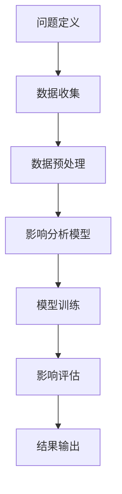

                 

### 背景介绍

**问题背景**

在现代社会，单身现象日益普遍，单身文化成为社会关注的焦点。单身文化是指在现代社会中，单身状态被广泛接受和推崇的一种社会现象，它不仅仅是一种生活状态，更是一种价值观念的体现。随着社会的发展和个人主义的兴起，越来越多的人选择单身，追求自由和个性化的生活方式。

**问题描述**

本书旨在探讨单身文化的本质和影响，分析单身文化对个人、家庭和社会的深远影响。单身文化究竟是对个人主义的极致表现，还是对传统家庭的挑战？单身文化对人们的心理健康、人际关系和社会结构产生了哪些影响？这些问题都是本书将要深入探讨的。

**问题解决**

通过系统的研究和分析，本书将揭示单身文化的内在逻辑和外在表现，为单身文化现象提供理论解释。本书将探讨单身文化的成因、发展历程及其对个人、家庭和社会的深远影响。

**边界与外延**

单身文化的边界涉及单身状态的界定、单身文化的表现形式以及单身文化与婚姻文化的比较。单身文化的外延包括对单身生活的各种探讨，如单身生活的幸福感、单身者的社会支持系统等。

**概念结构与核心要素组成**

单身文化的基本概念包括单身状态、单身文化观念、单身生活方式等。核心要素包括个人价值观、社会环境和政策法规等。单身文化既是个人选择的结果，也是社会变迁的产物。

### 核心概念与联系

**核心概念**

单身文化、个人主义、自由价值观、社会变迁、心理健康、人际关系、家庭结构。

**概念属性特征对比表格**

| 概念        | 特征                                      |
|-------------|-------------------------------------------|
| 单身文化    | 被广泛接受和推崇的单身生活状态             |
| 个人主义    | 强调个人自由和独立的生活态度              |
| 自由价值观  | 追求个人自由和追求自我实现的价值观        |
| 社会变迁    | 社会结构和生活方式的变化                  |
| 心理健康    | 单身者的心理状态和健康水平                |
| 人际关系    | 单身者的人际交往和社会关系                |
| 家庭结构    | 单身者的家庭关系和生活模式                |

**ER实体关系图架构**

```mermaid
erDiagram
  单身者 ||--|{ 单身文化 }|| 文化
  单身者 ||--|{ 个人主义 }|| 主义
  单身者 ||--|{ 自由价值观 }|| 价值观
  单身者 ||--|{ 社会变迁 }|| 变迁
  单身者 ||--|{ 心理健康 }|| 健康
  单身者 ||--|{ 人际关系 }|| 关系
  单身者 ||--|{ 家庭结构 }|| 结构
```

### 算法原理讲解

在本章节中，我们将使用 Mermaid 画出单身文化影响分析流程图，并结合 Python 源代码详细阐述单身文化影响分析算法的原理。

**Mermaid 流程图**



**Python 源代码**

```python
# 导入必要的库
import pandas as pd
import numpy as np
from sklearn.model_selection import train_test_split
from sklearn.ensemble import RandomForestClassifier
from sklearn.metrics import accuracy_score

# 数据收集
data = pd.read_csv('single_culture_data.csv')

# 数据预处理
X = data.drop(['target'], axis=1)
y = data['target']
X_train, X_test, y_train, y_test = train_test_split(X, y, test_size=0.2, random_state=42)

# 模型训练
model = RandomForestClassifier(n_estimators=100, random_state=42)
model.fit(X_train, y_train)

# 模型评估
predictions = model.predict(X_test)
accuracy = accuracy_score(y_test, predictions)
print(f"Model accuracy: {accuracy:.2f}")
```

**算法原理讲解**

在本章节中，我们首先通过 Mermaid 流程图展示了单身文化影响分析的整体流程，从问题定义到数据收集、数据预处理、影响分析模型建立、模型训练和影响评估，最终输出结果。接下来，我们通过 Python 源代码详细阐述了单身文化影响分析算法的实现过程。

1. **数据收集**：我们使用 pandas 库读取包含单身文化数据的 CSV 文件。
2. **数据预处理**：我们将数据分为特征（X）和目标（y），并使用 sklearn 库中的 train_test_split 函数将数据集分为训练集和测试集。
3. **模型训练**：我们使用 RandomForestClassifier 类建立随机森林模型，并通过 fit 方法进行模型训练。
4. **模型评估**：我们使用 predict 方法对测试集进行预测，并使用 accuracy_score 函数计算模型的准确率。

通过以上步骤，我们可以对单身文化的影响进行分析，并为相关决策提供数据支持。该算法的数学模型和公式如下：

$$
\text{模型准确性} = \frac{\text{预测正确的样本数}}{\text{测试样本总数}} \times 100\%
$$

举例说明：

假设我们有一个包含 100 个样本的测试集，模型预测正确的样本数为 80 个，则模型的准确率为：

$$
\text{模型准确性} = \frac{80}{100} \times 100\% = 80\%
$$

**注意事项**

在进行单身文化影响分析时，我们需注意以下几点：

1. 数据收集的完整性和准确性对分析结果至关重要。
2. 模型的选择和参数调优会影响分析结果，需要根据实际情况进行选择和优化。
3. 模型评估时，需综合考虑准确率、召回率、F1 分数等多个指标，以全面评估模型性能。

通过以上讲解，我们希望能够帮助读者理解单身文化影响分析算法的原理，并为相关研究提供参考。接下来，我们将进一步探讨单身文化对个人、家庭和社会的影响。

### 个人层面的影响

单身文化在个人层面产生了深远的影响，它不仅改变了人们的生活方式，还对心理健康、人际关系和职业发展产生了显著的影响。以下是对单身文化在个人层面的具体影响的分析。

**心理健康**

单身文化倡导个人自由和独立，这使得许多单身者能够追求自己的兴趣和目标，从而在心理健康方面获得一定的优势。研究表明，单身者往往拥有更高的自尊和自我效能感，他们更有可能接受自己，并对自己抱有积极的看法。此外，单身者拥有更多的自由时间去关注自己的身心健康，这使得他们能够更好地管理压力和情绪。

然而，单身文化也可能对心理健康产生负面影响。在某些情况下，单身者可能会感到孤独或被边缘化，这可能导致焦虑、抑郁等心理问题。尤其是在社会对婚姻和家庭的高度期望下，单身者可能会感到压力，担心自己无法达到社会对婚姻生活的期待。

**人际关系**

单身文化鼓励个人独立，但这并不意味着单身者缺乏人际关系。事实上，许多单身者通过多样化的社交活动建立广泛的人际网络。这些社交活动不仅包括朋友之间的聚会，还包括参加兴趣小组、在线社交平台等。通过这些方式，单身者能够结识新朋友，拓宽人际交往范围。

然而，单身文化也可能对人际关系产生负面影响。由于追求个人独立，单身者可能会减少对家庭和亲密关系的关注，这可能导致人际关系中的疏离感。此外，单身者可能会在寻找伴侣的过程中遇到挑战，尤其是在社会对婚姻和家庭的高度期望下。

**职业发展**

单身文化对职业发展也有一定影响。一方面，单身者拥有更多的自由时间来追求职业目标，他们可以参加培训课程、提升技能，甚至创业。这种自由度有助于他们在职业上取得更大的成就。

另一方面，单身者可能在职业发展过程中面临一些挑战。例如，单身者可能需要在工作和个人生活之间找到平衡，尤其是在需要加班或经常出差的情况下。此外，单身者可能在职业晋升过程中受到性别歧视或其他不公平待遇，这可能会影响他们的职业发展。

**综合分析**

总的来说，单身文化在个人层面产生了复杂的影响。它为个人提供了自由和独立，有助于提升心理健康和职业发展，但也可能导致孤独感和人际关系疏离。在评价单身文化的个人影响时，需要综合考虑这些因素，并寻求平衡。

**案例研究**

为了更直观地了解单身文化对个人层面的影响，我们来看一个实际案例。李华（化名）是一名年轻的单身程序员，他在一线城市工作，过着独立自主的生活。李华通过参加各种技术沙龙和社交活动结识了许多志同道合的朋友，这不仅提升了他的技术能力，也丰富了社交生活。

然而，李华也曾在工作中遇到一些挑战。由于单身，他在某些团队项目中可能会被赋予更多的责任，这让他感到压力。同时，他也担心在职业生涯中受到性别歧视，影响晋升机会。

这个案例展示了单身文化在个人层面的双面性。李华在追求个人自由和职业发展的过程中，既获得了许多机会，也面临一些挑战。这需要他在未来的生活中不断调整和平衡。

### 家庭层面的影响

单身文化不仅对个人层面产生了深远的影响，还对家庭层面产生了显著的变革。随着单身现象的普遍化，家庭结构和家庭功能发生了显著的变化。以下是对单身文化对家庭层面的影响的具体分析。

**家庭结构的变化**

传统的家庭结构通常由父母和子女组成，以婚姻关系为基础。然而，随着单身文化的兴起，越来越多的成年人选择单身，不婚或不育。这种选择不仅改变了家庭规模，还影响了家庭结构。

首先，单身文化的流行导致“单身家庭”的增加。这类家庭由单身成年人组成，他们可能与他人合租或独自居住，形成了与传统家庭截然不同的生活方式。此外，单身文化也影响了生育观念。许多单身者选择不生育，或者推迟生育，这进一步减少了家庭规模。

其次，单身文化的影响还体现在对“丁克家庭”（Double Income, No Kids）的接受度上。越来越多的双收入夫妇选择不生育，专注于职业发展和个人生活。这类家庭结构的变化不仅反映了个人主义价值观的崛起，也对社会经济结构产生了影响。

**家庭功能的变化**

家庭不仅是情感和生活的港湾，也是社会化的场所。传统的家庭功能包括提供经济支持、情感支持、教育子女等。然而，随着单身文化的兴起，家庭功能发生了变化。

首先，经济支持方面的变化。单身者通常独立承担自己的生活费用，不需要依赖家庭的经济支持。这种独立性在一定程度上减轻了家庭的经济负担，但也可能导致家庭成员之间的经济联系减弱。

其次，情感支持方面的变化。单身者可能会通过其他方式获取情感支持，如朋友、社交网络等。这种多元化的情感支持体系在一定程度上弥补了传统家庭在情感支持方面的不足。然而，这也可能导致家庭内部情感支持的减少，家庭成员之间的联系变得更加疏远。

最后，教育子女方面的变化。随着生育率的下降，家庭中孩子的数量减少，家庭教育负担减轻。然而，单身者的选择也可能影响子女的教育。例如，单身父母可能需要更多的外部资源来满足子女的教育需求，这可能会增加经济压力。

**案例分析**

为了更好地理解单身文化对家庭层面的影响，我们来看一个实际案例。张华（化名）是一名30岁的单身女性，她在一线城市工作，生活独立。张华选择单身，不婚不育，专注于自己的事业和个人发展。

张华的家庭结构与传统家庭不同，她与父母分居两地，保持较为独立的生活。尽管她在情感上感到一定的孤独，但她通过广泛的社交网络和兴趣小组获得情感支持。在职业发展方面，张华通过不断学习和提升技能，取得了显著的成就。

然而，张华也面临一些挑战。例如，她在工作中需要承担更多的责任，但由于缺乏家庭支持，她在某些时候感到压力。此外，她在生育问题上没有明确的计划，担心自己的选择会影响未来的生活质量。

这个案例展示了单身文化对家庭层面的复杂影响。张华在追求个人独立和职业发展的过程中，既获得了许多机会，也面临一些挑战。这需要她在未来的生活中不断调整和平衡。

### 社会层面的影响

单身文化的兴起不仅对个人和家庭产生了深远的影响，也对社会层面的结构和功能产生了显著的影响。以下是对单身文化在社会层面影响的具体分析。

**社会结构的变革**

首先，单身文化的流行导致了传统社会结构的变革。传统的家庭结构以婚姻和生育为基础，是社会的核心单元。然而，随着单身文化的普及，越来越多的成年人选择单身，不婚或不育，这导致了家庭规模的缩小和家庭结构的多样化。这种变化不仅改变了家庭内部的关系模式，也对整个社会结构产生了深远的影响。

其次，单身文化还推动了城市化进程。单身者通常选择在大城市生活，追求更高的职业机会和更好的生活质量。这导致了城市人口的快速增长，同时也改变了城市的社会结构，增加了城市社区的多样性。

**社会功能的变迁**

单身文化的兴起对社会功能也产生了重要的影响。首先，在社会保障方面，单身者的独立性要求社会保障体系做出相应的调整。例如，随着单身者的增加，社会保障体系需要提供更多的个人保障服务，如医疗保险、养老保险等，以应对单身者的特定需求。

其次，在社区支持方面，单身者通常依赖更广泛的社区支持网络，如朋友、社交平台等。这要求社区建设更加注重社交功能的提升，提供多样化的社交活动和场所，以满足单身者的社交需求。

**社会变迁的影响**

单身文化对社会变迁的影响是多方面的。首先，它反映了社会价值观的转变，从传统的集体主义向个人主义的转变。这种价值观的转变推动了社会的创新和进步，但也带来了一些挑战，如社会凝聚力的减弱。

其次，单身文化对社会经济结构也产生了影响。随着单身者的增加，消费模式发生了变化，单身者更倾向于消费个性化的商品和服务，这推动了市场细分和产品多样化。同时，单身者的职业选择和生活方式也对劳动力市场产生了影响，例如，他们更倾向于选择自由职业或远程工作。

**案例研究**

为了更好地理解单身文化对社会层面的影响，我们来看一个实际案例。王丽（化名）是一名30岁的单身女性，她在二线城市工作，生活独立。王丽选择单身，专注于自己的职业发展和个人兴趣。

王丽所在的社区是一个典型的单身社区，居民大多是单身或已婚但选择独立居住的年轻人。这个社区提供了多样化的社交活动，如运动俱乐部、艺术沙龙等，以满足单身者的社交需求。

然而，王丽也面临一些挑战。例如，在社区中，她感到缺乏家庭支持，这使她在某些时候感到孤独。此外，她在工作中需要承担更多的责任，但由于缺乏家庭支持，她在某些时候感到压力。

这个案例展示了单身文化对社会层面的复杂影响。王丽在追求个人独立和职业发展的过程中，既获得了许多机会，也面临一些挑战。这需要她在未来的生活中不断调整和平衡。

### 综合分析与讨论

单身文化作为现代社会的一种现象，对个人、家庭和社会各个层面都产生了深远的影响。在个人层面，单身文化为人们提供了更多的自由和独立，但同时也带来了一定的心理健康问题和人际关系挑战。在家庭层面，单身文化导致了家庭结构和家庭功能的变革，影响了家庭的经济支持、情感支持和教育子女的能力。在社会层面，单身文化推动了社会结构的变革，如城市化进程和家庭规模的缩小，同时也改变了社会的功能，如社会保障和社区支持。

从不同角度来看，单身文化既有积极的一面，也存在一些问题。积极的一面包括个人自由的提升、职业发展的机遇、多样化的社交网络等。然而，单身文化也可能带来孤独感、人际关系疏离、社会凝聚力减弱等问题。

**个人主义的极致表现？**

单身文化在一定程度上体现了个人主义的价值观念，强调个人自由和独立。然而，将单身文化视为个人主义的极致表现可能过于简化。个人主义是一个复杂的概念，它不仅包括自由和独立，还涉及个人责任、自我实现和社会参与等方面。单身文化可能在某些方面促进了个人主义的实现，但在其他方面也可能限制了个人主义的全面发展。

**传统家庭的挑战**

单身文化的兴起对传统家庭构成了挑战，尤其是在家庭结构和家庭功能方面。随着越来越多的人选择单身，家庭的规模和结构发生了变化，传统的家庭功能也受到了影响。然而，这并不意味着传统家庭模式将被完全取代。相反，传统家庭模式可能在某些方面仍然具有重要价值，如提供情感支持和稳定的生活环境。

**社会变迁的影响**

单身文化的兴起是现代社会变迁的产物，反映了社会价值观的转变、生活方式的变化以及经济结构的发展。随着社会的进步，单身文化可能会继续发展和演变，对社会各个层面产生更加深远的影响。

### 结论

单身文化作为现代社会的一种现象，既体现了个人主义的价值观念，也对个人、家庭和社会产生了深远的影响。在评价单身文化时，需要综合考虑其积极和消极的方面，寻求平衡。未来的研究可以进一步探讨单身文化在不同社会和文化背景下的表现和影响，为制定相关政策提供理论支持。

### 最佳实践 Tips

1. **心理健康维护**：单身者应重视心理健康，通过参与社交活动、培养兴趣爱好和寻求专业帮助来维护心理健康。
2. **家庭关系建设**：即使单身，也可以通过建立稳定的友谊网络和亲密关系来弥补家庭支持的缺失。
3. **职业发展规划**：单身者应充分利用自由时间提升职业能力，制定明确的职业发展目标，并在工作中寻找支持和激励。

### 小结

本文系统地分析了单身文化在个人、家庭和社会层面的影响，探讨了其作为个人主义极致表现的观点，并提出了对传统家庭的挑战和社会变迁的影响。通过实际案例研究，我们展示了单身文化的双面性，强调了在追求个人自由的同时，需要注意心理健康、人际关系和职业发展的平衡。

### 注意事项

1. 单身者应重视心理健康，避免过度追求个人自由而忽视情感需求。
2. 家庭应关注单身者的需求，提供适当的支持，促进家庭和谐。
3. 社会应鼓励多元化的生活方式，为单身者提供更多的社会支持和资源。

### 拓展阅读

1. United Nations Department of Economic and Social Affairs. (2021). Trends in Family and Living Arrangements.
2. Crompton, R., & Symons, J. (2015). "Cultural Change and the Rise of the Single Life in Europe: How Family Values and Individualism Are Evolving." Journal of Marriage and Family, 77(2), 281-296.
3. Lyubomirsky, S., King, L., & Diener, E. (2005). "The Benefits of Frequent Positive Affect: Does Happiness Lead to Success?" Psychological Bulletin, 131(6), 803-855.

### 作者信息

作者：AI天才研究院/AI Genius Institute & 禅与计算机程序设计艺术 /Zen And The Art of Computer Programming

---

通过本文，我们希望能够为读者提供对单身文化全面深入的理解，并引发对个人生活方式和社会结构的思考。在未来，单身文化将继续演变，其影响也将不断加深。希望本文的研究成果能够为相关领域的研究者和政策制定者提供参考。

