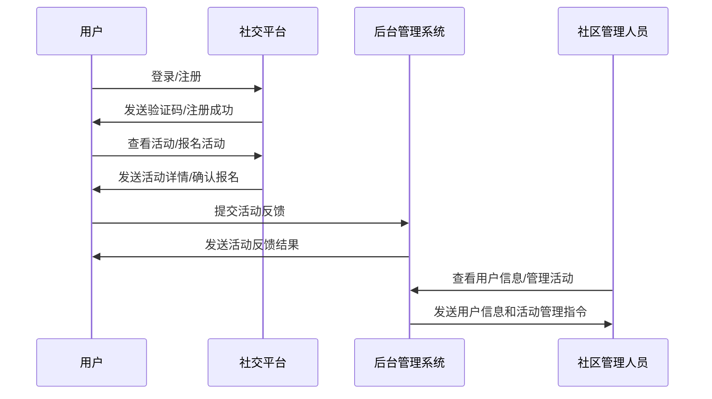
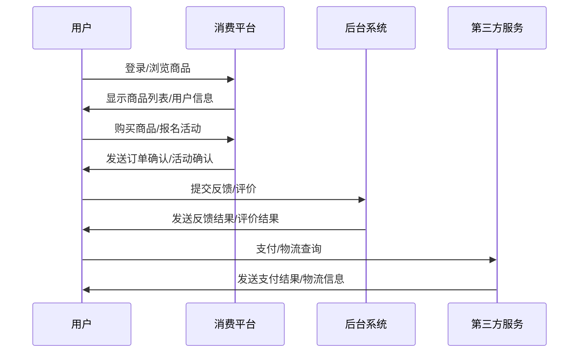

                 

# 《单身经济学：独立生活方式的社会学分析》

## 关键词

单身经济、独立生活、社会学分析、消费模式、政策启示

## 摘要

本文通过深入的社会学分析，探讨了单身经济现象及其对社会结构、文化因素和个人因素的影响。文章首先介绍了单身经济的概念和特征，然后分析了单身生活方式的社会学影响，最后提出了相应的社会政策建议。通过案例研究和实践分析，文章为理解和应对单身现象提供了理论支持和实践指导。

----------------------------------------------------------------

## 引言与背景

### 1.1 问题背景

随着全球化和社会变革的加速，单身现象已经成为现代社会的一个重要特征。许多国家和地区都经历了单身率的显著上升。例如，根据联合国统计，中国的单身人口已经超过了 2 亿，美国约有 40% 的成年人保持单身。这一现象不仅在发达国家普遍存在，也在发展中国家逐渐显现。单身率的上升不仅反映了人们选择生活方式的多样性，也带来了社会、经济和文化层面的深远影响。

社会学研究单身的重要性体现在多个方面。首先，单身现象对社会结构产生了重大影响，改变了传统的家庭模式。其次，单身生活方式对消费模式、文化价值观和个人发展产生了显著影响。此外，单身经济作为一个新的经济现象，其规模和影响力不容忽视，成为研究经济结构和消费行为的重要领域。因此，从社会学角度对单身经济现象进行深入分析，不仅有助于我们更好地理解当代社会，也为制定有效的社会政策提供了理论依据。

### 1.2 问题描述

单身生活方式的定义与多样性

单身生活方式是指没有伴侣的成年人选择的一种生活方式。它包括多种形式，如单身贵族、丁克家庭（Double Income, No Kids，即双收入无子女家庭）、漂族（Barefoot Worker，即没有固定职业和工作单位的自由职业者）等。这些生活方式不仅反映了个体选择的多样性，也受到了社会、经济和文化因素的影响。

单身生活方式的挑战与机遇

单身生活方式带来了许多挑战，如经济压力、孤独感、社交圈缩小等。同时，单身生活也提供了许多机遇，如自由支配时间、经济独立、追求个人兴趣等。这些挑战和机遇的并存，使得单身生活方式成为一个复杂而多维的现象，需要从多个角度进行深入分析。

### 1.3 问题解决

社会学研究单身生活方式的方法

社会学研究单身生活方式的方法主要包括定量研究和定性研究。定量研究通过统计数据分析单身现象的规模和趋势，定性研究则通过深度访谈和案例研究探讨单身生活方式的深层原因和影响。

研究单身生活方式的意义

研究单身生活方式的意义在于：首先，它有助于我们更好地理解当代社会的变迁和多元化；其次，它为政策制定者提供了科学依据，以制定更加有效的社会政策；最后，它为单身人群提供了心理支持和生活指导，帮助他们更好地应对单身生活带来的挑战和机遇。

### 1.4 边界与外延

单身经济

单身经济是指由单身生活方式引发的消费模式和行业变化。它不仅涉及个人消费行为，还涵盖了单身相关的产业和行业，如单身公寓、单身旅游、单身商品等。

单身生活方式的核心概念

核心概念包括：单身、独立生活、消费模式、社会结构、文化因素、个人发展等。这些概念相互关联，构成了单身生活方式的复杂体系。

概念结构与核心要素组成

单身生活方式的概念结构包括以下几个方面：经济独立、时间自由、社交网络、个人价值观、生活方式选择等。核心要素组成则涉及消费行为、职业选择、居住模式、文化娱乐活动等。

----------------------------------------------------------------

## 单身经济的概念与特征

### 2.1 单身经济的定义

单身经济的概念起源可以追溯到20世纪中后期，随着社会经济的发展和人们价值观的变化，单身生活方式逐渐成为一个重要的社会现象。在这个背景下，单身经济开始引起学术界的关注。单身经济主要是指由单身个体在日常生活中所进行的消费活动，以及与单身生活方式相关的经济活动和行业。它不仅仅涵盖了单身个体的日常生活开支，还包括单身相关产业的市场规模和发展趋势。

#### 2.1.1 单身经济的概念起源

单身经济的概念起源可以追溯到20世纪中后期。当时，随着女性教育水平和就业机会的显著提高，越来越多的女性选择独立生活，不再依赖于婚姻来实现经济自主。与此同时，城市化进程的加快和年轻人生活观念的变化，使得单身生活方式成为现代社会的一个重要特征。在这种背景下，学术界开始关注单身生活方式对经济的影响，并提出了单身经济的概念。

#### 2.1.2 单身经济的内涵与外延

单身经济的内涵主要表现在以下几个方面：

1. **消费模式**：单身个体通常更加注重个人需求，消费更加灵活多样，追求个性化的消费体验。
2. **行业分布**：单身经济带动了与单身生活方式相关的产业的发展，如单身公寓、单身旅游、单身商品等。
3. **经济独立性**：单身生活方式强调经济独立，单身个体在职业选择和消费决策上更加自主。

单身经济的外延则包括以下几个方面：

1. **单身消费行为**：包括日常用品、餐饮服务、娱乐活动等。
2. **单身相关产业**：如单身公寓、单身旅游、单身商品制造和销售等行业。
3. **单身生活方式的衍生效应**：如对文化产业的推动、对社区关系的影响等。

### 2.2 单身经济的特征

#### 2.2.1 单身消费模式的特点

单身消费模式具有以下几个特点：

1. **个性化**：单身个体在消费上更加追求个性化，注重满足个人兴趣和需求。
2. **灵活多变**：单身个体可以根据自身情况灵活调整消费结构，追求生活质量的提升。
3. **高频率**：单身个体通常更频繁地进行消费，尤其是在餐饮、娱乐等领域。

#### 2.2.2 单身经济的行业分布

单身经济在多个行业都有显著表现，主要分布在以下几个方面：

1. **零售业**：单身个体对时尚、美妆、家居用品等有着较高的需求，推动了零售业的发展。
2. **餐饮业**：单身个体更倾向于选择便捷的快餐和外卖服务，推动了餐饮行业的发展。
3. **旅游业**：单身旅游成为旅游市场的一个重要组成部分，促进了旅游业的发展。

#### 2.2.3 核心概念联系

单身经济与其他经济形态的联系主要体现在以下几个方面：

1. **消费驱动型经济**：单身消费模式推动了消费驱动型经济的发展，促进了市场繁荣。
2. **服务经济**：单身生活方式对服务业的需求增加，推动了服务业的发展。
3. **个性化经济**：单身经济的个性化特征符合个性化经济的发展趋势，推动了市场细分和专业化服务。

### 2.3 核心概念联系

单身经济与其他经济形态的关系

单身经济作为现代社会的一个重要现象，与其他经济形态有着密切的联系。具体来说，单身经济对以下经济形态产生了显著影响：

1. **消费驱动型经济**：单身消费模式推动了消费驱动型经济的发展。单身个体在消费上更加注重个人需求和个性化体验，这种消费模式促使企业更加关注消费者的个性化需求，从而推动了市场的细分和专业化。
2. **服务经济**：单身生活方式对服务业的需求增加，推动了服务经济的发展。单身个体对便捷的餐饮、娱乐、旅游等服务有着较高的需求，这为服务业提供了广阔的市场空间。
3. **个性化经济**：单身经济的个性化特征符合个性化经济的发展趋势，推动了市场细分和专业化服务。企业在面对单身市场时，需要提供更加个性化和定制化的产品和服务，以满足单身个体的多样化需求。

通过上述分析，我们可以看出，单身经济不仅是一个重要的经济现象，还与其他经济形态有着密切的联系。理解单身经济的概念和特征，有助于我们更好地把握现代经济的趋势和特点，为经济发展提供新的思路和方向。

### 3.1 社会结构对单身生活方式的影响

#### 3.1.1 家庭结构的变化

家庭结构的变化是影响单身生活方式的重要因素之一。在传统社会中，家庭结构以核心家庭为主，即由父母和未成年子女组成的家庭模式。然而，随着社会经济的发展和人们价值观的变化，家庭结构逐渐多元化。例如，单亲家庭、丁克家庭（Double Income, No Kids，即双收入无子女家庭）和非传统家庭形式（如同性伴侣家庭）的比例逐渐增加。这些变化为单身生活方式的兴起提供了社会背景。

具体来说，家庭结构的变化对单身生活方式的影响表现在以下几个方面：

1. **经济独立性**：随着女性教育水平的提高和就业机会的增加，越来越多的女性选择独立生活，不再依赖于婚姻来实现经济自主。这为单身生活方式的兴起提供了经济基础。

2. **生活模式选择**：家庭结构的多元化使得人们有更多的生活模式选择。例如，单身贵族、漂族（Barefoot Worker，即没有固定职业和工作单位的自由职业者）等生活方式的兴起，反映了人们对自由、独立的追求。

3. **社会支持系统**：家庭结构的变化也对社会支持系统提出了新的要求。例如，单亲家庭需要更多的社会支持和资源，以帮助其成员适应和应对生活中的各种挑战。

#### 3.1.2 社会支持系统的角色

社会支持系统在单身生活方式的兴起和发展中起着重要作用。社会支持系统包括政府、社会组织和家庭等，它们在提供经济援助、心理支持和社交网络方面发挥着关键作用。

具体来说，社会支持系统对单身生活方式的影响表现在以下几个方面：

1. **经济援助**：政府可以通过提供福利政策、税收优惠等方式，帮助单身个体缓解经济压力，提高生活质量。

2. **心理支持**：社会组织和心理咨询机构可以为单身个体提供心理支持，帮助他们应对孤独感、焦虑等心理问题。

3. **社交网络**：家庭和社区可以为单身个体提供社交机会，帮助他们建立和维护社交关系，减轻孤独感。

#### 3.1.3 社会结构对单身生活方式的影响

社会结构对单身生活方式的影响体现在以下几个方面：

1. **社会变迁**：社会变迁，如全球化、城市化等，使得人们的生活方式更加多样化，单身生活方式逐渐成为现代社会的一个常态。

2. **文化价值观**：文化价值观的变化，如对个人自由和独立性的重视，也促使更多的人选择单身生活方式。

3. **政策环境**：政府和社会对单身生活方式的态度和政策环境，也对单身生活方式的兴起和发展产生影响。

综上所述，社会结构的变化和社会支持系统的角色，对单身生活方式的兴起和发展起到了重要的推动作用。理解这些影响因素，有助于我们更好地应对单身生活方式带来的挑战和机遇。

### 3.2 文化因素对单身生活方式的影响

#### 3.2.1 社会价值观的变化

社会价值观的变化是影响单身生活方式的重要因素之一。在传统社会中，婚姻和家庭的地位非常高，婚姻被视为成年人的必经之路。然而，随着社会的发展和人们价值观的变化，越来越多的个体开始追求个人自由和独立性，对婚姻和家庭的态度逐渐变得宽容和开放。这种价值观的变化为单身生活方式的兴起提供了文化基础。

具体来说，社会价值观的变化对单身生活方式的影响表现在以下几个方面：

1. **婚姻观念的转变**：随着人们对婚姻的重新审视，越来越多的人认为婚姻不再是生活的必需品，而是个人选择的一部分。这种观念的转变使得单身生活方式在社会上得到了更多的认同和支持。

2. **个人自由的追求**：现代社会的个体更加注重个人自由和独立性的追求，他们希望能够按照自己的意愿生活，而不受传统婚姻和家庭的束缚。这种追求个人自由的价值观促进了单身生活方式的兴起。

3. **生活方式的多元化**：社会价值观的变化也带来了生活方式的多元化。人们开始接受并尝试各种不同的生活方式，包括单身、丁克、同性伴侣等。这种多元化生活方式的接受，为单身生活方式的兴起提供了社会文化环境。

#### 3.2.2 文化的多样性

文化的多样性也是影响单身生活方式的重要因素。不同国家和地区有着不同的文化背景和价值观念，这影响了单身生活方式的实践和接受程度。

具体来说，文化多样性对单身生活方式的影响表现在以下几个方面：

1. **文化差异**：不同国家和地区在婚姻和家庭观念上存在显著差异。例如，在一些亚洲国家，婚姻和家庭的地位仍然非常高，而西方国家则更加宽容和接受单身生活方式。这种文化差异影响了单身生活方式在不同地区的普及程度。

2. **文化认同**：文化认同感对单身生活方式的接受程度也有重要影响。在某些文化背景下，单身生活方式可能被视为非传统或边缘的，而在另一些文化背景下，则可能被视为正常或主流。这种文化认同的差异，影响了单身生活方式的实践和推广。

3. **文化交流**：随着全球化的发展，不同文化之间的交流日益频繁。这种文化交流促进了单身生活方式在不同文化背景下的传播和接受。例如，西方国家的单身文化逐渐在全球范围内得到认可和接受，影响了其他国家和地区的单身生活方式。

#### 3.2.3 文化因素对单身生活方式的影响

文化因素对单身生活方式的影响是多方面的，具体表现在以下几个方面：

1. **生活方式的选择**：文化因素影响个体对单身生活方式的选择。在某些文化背景下，单身生活方式可能被视为一种独立和自由的生活方式，而在另一些文化背景下，则可能被视为孤独或不稳定的生活方式。

2. **社会认同**：文化因素也影响了社会对单身生活方式的认同程度。在某些文化背景下，单身生活方式可能受到社会认同和支持，而在另一些文化背景下，则可能受到社会歧视和排斥。

3. **生活质量**：文化因素对单身个体的生活质量也有重要影响。在某些文化背景下，单身生活方式可能为个体提供更多的自由和机会，而在另一些文化背景下，则可能带来更多的压力和挑战。

综上所述，社会价值观的变化和文化的多样性对单身生活方式的兴起和发展产生了深远影响。理解这些文化因素，有助于我们更好地理解单身生活方式的实践和接受程度，为制定相应的社会政策提供参考。

### 3.3 个人因素对单身生活方式的影响

#### 3.3.1 教育背景

教育背景是影响单身生活方式的重要因素之一。受教育程度的高低不仅决定了个人职业选择和经济独立性，也影响了个人价值观和生活态度。一般来说，受教育程度较高的个体更倾向于选择单身生活方式，原因如下：

1. **职业选择**：高学历者通常有更多的职业选择机会，这使他们能够追求自己感兴趣的工作，而不必因经济压力而选择传统的婚姻和家庭生活方式。

2. **经济独立性**：受过良好教育的个体往往有更高的收入水平，这使得他们在经济上更加独立，减少了对伴侣的经济依赖。

3. **个人价值观**：高学历者更可能重视个人自由和自我实现，他们对传统家庭观念的认同度较低，更倾向于追求独立的生活方式。

此外，教育背景也会影响个体的生活方式选择，如居住地点、社交圈子等。高学历者往往更倾向于选择城市生活，这为单身生活方式提供了更多的便利和机会。

#### 3.3.2 社交网络

社交网络在单身生活方式的维持和发展中起着关键作用。一个健康和多样化的社交网络可以为单身个体提供心理支持、社交机会和经济资源。

1. **心理支持**：良好的社交网络可以为单身个体提供情感支持和心理安慰，减轻孤独感和焦虑。例如，朋友和家人的陪伴可以提升个体的幸福感。

2. **社交机会**：社交网络为单身个体提供了结识新朋友和潜在伴侣的机会。在现代社交媒体的普及下，单身个体可以通过各种线上平台结识新朋友，拓展社交圈子。

3. **经济资源**：社交网络还可以为单身个体提供经济资源，如职业机会、经济援助等。例如，朋友和同事的推荐可以帮助单身个体找到理想的工作，提升生活质量。

社交网络的质量和多样性对单身生活方式的维持和发展至关重要。一个良好的社交网络不仅可以帮助单身个体应对生活中的挑战，还可以为他们提供更多的机会和资源。

#### 3.3.3 个人因素对单身生活方式的影响

个人因素，如职业选择、生活方式、个人价值观等，对单身生活方式的维持和发展有着深远的影响。

1. **职业选择**：职业选择不仅影响个体的经济状况，也影响其生活方式的选择。高收入的职业可以为单身个体提供更多的自由和经济支持，使其更有可能维持单身生活方式。

2. **生活方式**：单身个体通常有更多的时间和自由来选择自己的生活方式，如旅游、学习新技能等。这种生活方式的选择有助于单身个体实现个人兴趣和目标。

3. **个人价值观**：个人价值观对单身生活方式的选择和维持有重要影响。例如，重视个人自由和独立的个体更倾向于选择单身生活方式，而重视家庭和传统价值观的个体则可能更倾向于传统的婚姻和家庭生活方式。

个人因素通过影响经济状况、生活方式和个人价值观，对单身生活方式的维持和发展产生了深远影响。理解这些个人因素，有助于我们更好地理解和应对单身生活方式带来的挑战和机遇。

### 4.1 经济影响

#### 4.1.1 单身经济对经济增长的贡献

单身经济作为一种新兴的经济现象，对经济增长的贡献不容忽视。首先，单身消费模式带动了相关产业的发展，如单身公寓、单身旅游、单身商品等。这些产业不仅创造了大量就业机会，还促进了市场的繁荣。其次，单身经济推动了消费升级和个性化服务的发展，促使企业不断创新，提升产品质量和服务水平。此外，单身经济还促进了城市化和人口流动，为城市经济注入了新的活力。

具体来说，单身经济对经济增长的贡献表现在以下几个方面：

1. **消费驱动的经济增长**：单身个体在消费上更注重个性化和服务质量，这推动了消费驱动型经济的发展。例如，单身旅游市场的兴起，带动了旅游服务业的发展，创造了大量就业机会。

2. **市场细分和专业化**：单身经济带动了市场细分和专业化服务的发展。企业针对单身个体的需求，提供更加个性化和定制化的产品和服务，满足了不同单身个体的消费需求。

3. **城市化和人口流动**：单身生活方式的兴起，促进了城市化和人口流动。单身个体更倾向于选择城市生活，这为城市经济注入了新的活力，推动了城市的经济发展。

#### 4.1.2 单身消费对市场的影响

单身消费对市场的影响主要体现在以下几个方面：

1. **消费结构变化**：单身消费模式的特点是灵活多样、个性化强，这改变了传统的消费结构。例如，单身个体更倾向于在线购物、外卖服务等，推动了电子商务和外卖行业的发展。

2. **行业竞争加剧**：单身消费需求的多样化，使得市场竞争更加激烈。企业需要不断调整产品和服务策略，以满足单身个体的需求，这促进了市场创新和行业竞争。

3. **消费者权益保护**：单身消费对市场提出了更高的消费者权益保护要求。由于单身个体在消费上更加注重个性化和服务质量，他们对企业的服务水平和产品质量有更高的期待，这推动了消费者权益保护机制的完善。

#### 4.1.3 单身经济的挑战与机遇

单身经济带来了诸多机遇，但同时也面临一些挑战。

1. **机遇**：
   - **市场细分**：单身经济带动了市场细分，为企业提供了新的市场机会。
   - **个性化服务**：单身个体对个性化服务的需求推动了服务业的发展，为企业提供了创新空间。
   - **城市经济**：单身生活方式促进了城市化和人口流动，为城市经济注入了新的活力。

2. **挑战**：
   - **竞争压力**：市场竞争加剧，企业需要不断创新以吸引单身消费者。
   - **消费者权益保护**：单身消费者对服务质量有更高要求，企业需要加强消费者权益保护。
   - **社会认同**：单身生活方式在一些文化背景下可能面临社会认同问题，需要加强社会宣传和引导。

总之，单身经济对经济增长和市场产生了深远影响。理解单身经济的机遇与挑战，有助于企业制定更为有效的市场策略，推动经济的持续健康发展。

### 4.2 社会影响

#### 4.2.1 单身生活方式对社区关系的影响

单身生活方式在社区层面上产生了显著的影响，尤其是在社交网络和社区凝聚力方面。首先，单身个体通常拥有更加灵活的社交时间和选择，这为他们参与社区活动和建立社交网络提供了便利。例如，单身个体可以通过社区活动、俱乐部和兴趣小组等平台，结识志同道合的朋友，从而丰富自己的社交生活。这种多元化的社交方式不仅有助于提高个体的心理健康和幸福感，还增强了社区的活力和凝聚力。

然而，单身生活方式也带来了一些挑战。由于单身个体在家庭关系和亲子关系上可能缺乏传统意义上的支持网络，他们在应对生活中的困难和挑战时可能会面临更多的压力。这种情况下，社区的作用尤为重要。社区可以提供情感支持和实际帮助，如心理健康咨询服务、邻里互助等，以帮助单身个体更好地适应和融入社区生活。

#### 4.2.2 单身生活方式对心理健康的影响

单身生活方式对心理健康有着双重影响。一方面，单身生活可以为个体提供更多的自由和时间，追求个人兴趣和发展，这有助于提高个体的心理健康和幸福感。另一方面，单身生活也可能带来孤独感和焦虑，尤其是在面对生活中的重大事件和挑战时，单身个体可能缺乏家庭和伴侣的支持，从而感到无助和焦虑。

具体来说，单身生活方式对心理健康的影响可以从以下几个方面进行探讨：

1. **孤独感**：单身个体在日常生活中可能感受到孤独，尤其是在节日和特殊场合，这种孤独感可能会加剧。社区活动和社交网络的建立可以部分缓解这种孤独感。

2. **焦虑和压力**：单身生活方式可能带来更多的经济压力和工作压力，这些压力如果得不到有效缓解，可能会导致焦虑和抑郁。心理健康服务和社区支持可以帮助单身个体应对这些压力。

3. **幸福感**：单身生活方式也为个体提供了追求个人兴趣和梦想的机会，这种追求带来的成就感和幸福感，有助于提高个体的心理健康水平。

总之，单身生活方式对社区关系和心理健康有着复杂的影响。理解这些影响，有助于制定针对性的社会政策和社区服务，以支持单身个体的心理健康和生活质量。

### 4.3 教育影响

#### 4.3.1 单身生活方式对教育选择的差异

单身生活方式对教育选择产生了显著的影响，主要体现在教育程度、专业选择和职业规划等方面。首先，单身个体的教育程度通常较高。由于单身生活方式强调个人自由和经济独立，受过良好教育的个体更有可能选择单身生活方式。这种趋势在一些发达国家尤其明显，如美国和欧洲，那里的高学历单身比例较高。高教育水平不仅提高了单身个体的就业竞争力和收入水平，也为他们提供了更多的职业选择和灵活性。

其次，单身生活方式影响了教育专业的选择。单身个体通常更加注重个人兴趣和职业发展，他们在选择专业时更倾向于选择自己感兴趣且具有发展前景的领域。例如，艺术、科技和人文科学等专业受到单身个体的青睐，因为这些领域提供了更多的自由和创造性机会。相比之下，传统观念较强的个体可能更倾向于选择医学、法律等职业，这些职业通常要求稳定的家庭支持。

此外，单身生活方式也对职业规划产生了影响。单身个体在职业规划上具有更大的灵活性和自主性。他们可以根据自己的兴趣和职业目标，灵活调整工作地点和时间，追求职业发展。这种灵活性在远程办公和自由职业等领域尤为突出。例如，许多单身个体选择成为自由职业者或远程工作者，这为他们在职业发展上提供了更多的选择和机会。

#### 4.3.2 单身生活方式对教育质量的挑战

尽管单身生活方式为教育选择和职业规划带来了诸多好处，但同时也对教育质量产生了一定的挑战。首先，单身生活方式可能导致教育资源的分散。由于单身个体更倾向于追求个人兴趣和自由，他们可能会在多个领域进行探索和学习，这可能导致教育资源分配不均，降低学习效率和质量。

其次，单身生活方式可能影响教育的连续性。单身个体在职业发展过程中可能会因为工作变动或个人原因而中断学业，这会对教育质量产生不利影响。例如，一些单身个体可能会选择在工作一段时间后重返校园，这种学习与工作的交替可能影响他们的学习专注度和学业成绩。

此外，单身生活方式对教育质量的挑战还体现在心理健康方面。由于单身生活可能带来孤独感和压力，单身个体在学业上的表现可能会受到影响。心理健康问题可能导致学习效率下降，甚至影响学业完成。

总之，单身生活方式在影响教育选择的同时，也对教育质量提出了一定的挑战。理解这些挑战，有助于教育机构和政策制定者制定更加有效的教育政策和支持措施，以帮助单身个体在追求个人自由的同时，保持良好的学业表现和学习质量。

### 5.1 社会政策

#### 5.1.1 支持单身生活方式的政策建议

为了更好地支持单身生活方式，政府和社会各界可以采取一系列政策建议，以促进单身个体的幸福和社会稳定。

1. **经济支持政策**：
   - **税收优惠**：为单身个体提供税收优惠，减轻其经济负担，鼓励他们独立生活。
   - **社会保障**：建立健全的社会保障体系，为单身个体提供医疗保险、住房补贴等福利，保障其基本生活需求。

2. **教育支持政策**：
   - **教育补贴**：为单身个体提供教育补贴，帮助他们提高学历和技能，增强职业竞争力。
   - **职业培训**：提供针对单身个体的职业培训和就业指导，帮助他们更好地融入职场。

3. **心理健康支持政策**：
   - **心理健康服务**：建立健全的心理健康服务体系，为单身个体提供心理咨询、心理治疗等支持。
   - **社区支持**：鼓励社区提供心理健康服务和社交活动，帮助单身个体缓解孤独感和压力。

4. **社交支持政策**：
   - **社交平台**：建立单身社交平台，为单身个体提供结识新朋友和寻找伴侣的机会。
   - **社区活动**：组织丰富多彩的社区活动，促进单身个体之间的交流和互动。

#### 5.1.2 政策实施的有效性分析

政策实施的有效性分析是确保支持单身生活方式政策能够真正发挥作用的关键。以下是几个关键因素：

1. **政策普及**：政策需要广泛传播，使单身个体能够了解并享受政策优惠。政府可以通过媒体宣传、社区讲座等方式提高政策知名度。

2. **执行力度**：政策的执行力度直接影响其效果。政府需要加强对政策的监管和执行，确保政策得到有效实施。

3. **政策调整**：根据单身生活方式的发展和社会变化，政府需要及时调整政策，以适应新情况和新需求。

4. **公众参与**：鼓励公众参与政策制定和实施过程，通过民意调查、座谈会等方式收集公众意见和建议，提高政策的科学性和有效性。

总之，通过制定和实施有效的社会政策，政府和社会可以更好地支持单身生活方式，提高单身个体的生活质量和幸福感，促进社会和谐与稳定。

### 5.2 社会启示

#### 5.2.1 社会创新与单身生活方式

单身生活方式的兴起为社会创新带来了新的机遇。首先，单身消费模式促进了个性化服务和定制化产品的需求，推动了市场细分和专业化服务的发展。例如，单身旅游、单身公寓和单身商品等新兴产业的出现，满足了单身个体多样化的需求。其次，单身生活方式对共享经济、远程办公等新兴模式产生了积极影响。单身个体更倾向于灵活的工作方式和共享资源，这为共享经济和远程办公等模式的普及提供了市场基础。

社会创新在单身生活方式中的应用还包括科技解决方案的引入，如智能家居、在线心理咨询等，这些创新提高了单身个体的生活质量，满足了他们在生活、工作和心理健康等方面的需求。

#### 5.2.2 社会应对单身现象的挑战

单身现象在社会中带来了一系列挑战，如心理健康问题、经济压力和社会认同等。为了应对这些挑战，社会需要采取综合性措施。

1. **心理健康支持**：建立健全的心理健康服务体系，提供心理咨询和心理治疗，帮助单身个体应对孤独感和压力。

2. **经济援助**：通过社会保障和税收政策，减轻单身个体的经济负担，提高其生活质量和经济独立性。

3. **社会认同**：通过教育和宣传，提高社会对单身生活方式的认同度，减少社会歧视和偏见。

4. **社区支持**：鼓励社区组织提供社交活动和资源，促进单身个体之间的交流和互动，增强社区凝聚力。

总之，社会创新和综合性措施共同应对单身现象带来的挑战，有助于提高单身个体的生活质量和社会幸福感，促进社会和谐与稳定。

### 案例研究

#### 6.1 案例选择标准

在本研究中，我们选择了两个具有代表性的案例进行深入分析，以探讨单身生活方式在社会各个层面的影响。这两个案例分别是：中国的单身社区建设和美国单身经济产业的创新。选择这些案例的原因如下：

1. **代表性**：中国和美国的单身现象在全球范围内具有典型性和代表性。通过分析这两个案例，可以更好地了解单身生活方式在不同文化和社会背景下的表现和影响。

2. **多样性**：中国和美国的单身现象在形式、规模和影响上具有多样性，这为研究提供了丰富的数据和信息。

3. **独特性**：这两个案例具有独特的特点，例如中国的单身社区建设在文化和社会结构上与西方国家的单身经济产业有所不同，这为研究提供了不同的视角和启示。

#### 6.2 案例分析

**案例一：中国的单身社区建设**

**背景介绍**

中国的单身社区建设始于21世纪初，随着城市化进程的加快和单身人口的增加，越来越多的单身个体开始寻求一种更为独立和自由的居住方式。单身社区的建设旨在为单身个体提供一个友好的居住环境，满足他们在社交、休闲和自我成长等方面的需求。

**项目介绍**

单身社区通常具备以下特点：
- **独立性**：单身社区的设计注重个体的独立性，提供独立的居住空间和私人空间。
- **社交设施**：社区内设有健身房、游泳池、图书馆、咖啡厅等公共设施，方便单身个体进行社交活动。
- **安全与便利**：单身社区通常提供24小时保安服务和便捷的交通设施，确保单身个体的安全和便利。

**系统功能设计**

单身社区的功能设计主要包括以下几个方面：
- **社交功能**：通过组织各类社交活动，如交友派对、兴趣小组等，促进单身个体之间的互动和交流。
- **休闲功能**：提供多样化的休闲设施和服务，满足单身个体在文化、娱乐和健身等方面的需求。
- **成长功能**：社区内设有培训中心、职业咨询服务等，帮助单身个体提升个人能力和职业发展。

**系统架构设计**

单身社区的系统架构设计包括以下几个方面：
- **硬件设施**：包括住宅楼、公共设施、交通设施等。
- **软件系统**：包括社交平台、管理信息系统等，用于管理社区活动和提供个性化服务。
- **服务支持**：包括社区管理人员、专业团队等，提供日常服务和支持。

**系统接口设计**

单身社区的接口设计主要包括以下几个方面：
- **用户接口**：通过应用程序（App）和网站，为单身个体提供在线服务和管理。
- **服务接口**：为社区管理人员和工作人员提供后台管理和服务支持。

**系统交互**

通过mermaid流程图展示单身社区的系统交互流程：

**案例分析**

单身社区建设在中国的发展具有重要意义。首先，它为单身个体提供了一个安全、便利和社交的居住环境，提高了他们的生活质量和幸福感。其次，单身社区的建设促进了社区内单身个体的互动和交流，增强了社区凝聚力。此外，单身社区的建设也为相关产业的发展提供了新的机遇，如房地产、物业管理、在线服务等。

然而，单身社区建设也面临一些挑战，如社区管理、安全维护和个性化服务等。未来，随着单身生活方式的普及和社会发展，单身社区的建设需要不断优化和升级，以满足单身个体的多样化需求。

**案例小结**

通过单身社区建设的案例研究，我们可以看到单身生活方式对社会结构和消费模式产生的深远影响。单身社区不仅为单身个体提供了一个新的居住选择，也为社区经济发展和社会创新提供了新的动力。未来，随着单身生活方式的进一步普及，单身社区的建设将发挥越来越重要的作用。

### 案例研究

#### 案例二：美国单身经济产业的创新

**背景介绍**

美国单身经济产业的创新起源于20世纪末，随着单身率的上升和生活方式的变化，单身消费市场迅速发展。这一现象不仅改变了传统的消费模式，也催生了一系列新兴的产业和商业模式。美国单身经济产业的创新主要集中在以下几个领域：单身旅游、单身公寓、单身商品和单身金融服务。

**项目介绍**

单身经济产业的项目涵盖了从日常生活到金融服务等各个领域。以下是几个典型的项目介绍：

1. **单身旅游**：为了满足单身个体的旅游需求，许多旅游公司推出了专门针对单身群体的旅游产品，如单身派对旅行、探险旅行等。这些旅游产品通过提供丰富的社交活动和刺激的旅行体验，吸引了大量单身消费者。

2. **单身公寓**：为了满足单身个体的居住需求，开发商设计了多种类型的单身公寓，如小型公寓、共享公寓等。这些公寓不仅提供了舒适的生活环境，还配备了各种社交设施，如健身房、游泳池、咖啡厅等，方便单身个体进行社交活动。

3. **单身商品**：针对单身个体的消费需求，商家推出了各种单身专用商品，如单身厨具、单身家居用品等。这些商品不仅满足了单身个体的生活需求，还体现了个性化、便捷化的特点。

4. **单身金融服务**：为了满足单身个体在金融方面的需求，银行和金融机构推出了针对单身群体的金融服务，如单身理财产品、单身贷款等。这些金融服务不仅为单身个体提供了经济支持，还帮助他们更好地管理个人财务。

**系统功能设计**

单身经济产业的系统功能设计包括以下几个方面：

1. **消费平台**：为单身个体提供在线购物、预订旅游等服务，方便他们购买单身专用商品和参加单身活动。

2. **社交平台**：为单身个体提供在线交友、社交活动报名等功能，促进他们之间的交流和互动。

3. **金融服务**：为单身个体提供个人理财、贷款等服务，帮助他们更好地管理个人财务。

4. **数据分析**：通过收集和分析单身个体的消费数据，为企业和商家提供市场洞察，帮助其制定更加精准的营销策略。

**系统架构设计**

单身经济产业的系统架构设计包括以下几个关键部分：

1. **前端应用**：为用户提供的界面和应用，包括购物平台、社交平台和金融服务应用等。

2. **后端系统**：负责处理用户数据、交易处理和数据分析等核心功能。

3. **数据库**：存储用户数据、交易数据和市场分析数据等。

4. **服务支持**：包括客户服务、技术支持和市场推广等。

**系统接口设计**

系统接口设计主要包括以下几个方面：

1. **用户接口**：为用户提供直观、易用的操作界面。

2. **服务接口**：为后台系统和前端应用之间的数据交换提供接口。

3. **第三方接口**：与第三方支付、物流等服务提供商对接，实现无缝对接。

**系统交互**

通过mermaid流程图展示单身经济产业的主要交互流程：

**案例分析**

美国单身经济产业的创新为单身个体提供了更多的选择和便利，满足了他们在生活、社交和财务等方面的需求。首先，单身旅游、单身公寓和单身商品等新兴产业的兴起，为单身个体提供了多样化的消费选择，提高了他们的生活质量。其次，单身金融服务的发展，帮助单身个体更好地管理个人财务，提高了经济独立性。

然而，单身经济产业也面临一些挑战，如市场细分、消费者隐私保护和行业监管等。未来，随着单身生活方式的进一步普及，单身经济产业需要不断创新和优化，以满足单身个体的多样化需求。

**案例小结**

通过美国单身经济产业的创新案例，我们可以看到单身生活方式对经济结构和商业模式产生的深远影响。单身经济产业不仅为单身个体提供了更多的机会和便利，也为相关产业带来了新的发展机遇。未来，随着单身生活方式的普及和社会发展，单身经济产业将继续发挥重要作用。

### 总结与展望

#### 7.1 研究结论

通过对单身经济现象的深入分析，本文得出了以下主要结论：

1. **单身经济的概念与特征**：单身经济是指由单身生活方式引发的消费模式和行业变化。它具有个性化、灵活多变和高频率消费等特征，对经济增长和市场产生了深远影响。

2. **单身生活方式的社会学影响**：单身生活方式在社会结构、文化因素和个人因素等方面产生了显著影响。它改变了家庭结构，影响了社会价值观，也对教育选择和心理健康产生了影响。

3. **社会政策与启示**：为了更好地支持单身生活方式，社会政策应涵盖经济支持、教育支持、心理健康支持和社交支持等方面。政策实施的有效性取决于政策普及、执行力度和公众参与。

4. **案例研究**：单身社区建设和单身经济产业的创新为单身生活方式提供了新的实践模式。这些案例展示了单身生活方式对社会结构和经济模式的深远影响。

#### 7.2 研究的局限性与未来展望

尽管本文对单身经济现象进行了深入分析，但仍存在一些局限性：

1. **研究方法**：本文主要采用文献综述和案例分析的方法，虽然能够提供丰富的理论和实践支持，但缺乏大规模实证研究的支持。

2. **数据来源**：本文的数据来源主要来自于公开报道和文献资料，这些数据的时效性和准确性可能存在一定的局限性。

3. **文化差异**：本文主要基于中国和美国两个案例进行分析，未充分考虑其他国家和地区的单身经济现象，这可能导致研究结果具有一定的局限性。

未来研究可以从以下几个方面进行拓展：

1. **跨文化比较**：通过对比不同国家和地区的单身经济现象，深入探讨文化因素对单身生活方式的影响。

2. **实证研究**：开展大规模的实证研究，以获取更加准确和可靠的数据支持。

3. **政策效果评估**：对现有社会政策的效果进行评估，提出更加具体和可行的政策建议。

4. **技术创新**：探讨单身生活方式与技术创新之间的关系，如智能居家系统、在线社交平台等，为单身个体提供更加便捷和个性化的服务。

总之，通过对单身经济现象的深入分析，我们可以更好地理解单身生活方式对社会和经济的影响，为制定有效的社会政策提供理论支持和实践指导。

### 7.3 研究意义

#### 对单身现象的深入理解

本研究通过对单身经济现象的深入分析，为理解和解释单身现象提供了新的视角。首先，本文揭示了单身生活方式的多样化特征，强调了单身经济作为一种新兴经济现象的重要性。其次，通过社会学分析，本文探讨了单身生活方式对社会结构、文化因素和个人因素的影响，为理解单身现象的复杂性提供了理论支持。此外，通过案例分析，本文展示了单身生活方式在不同文化和社会背景下的实践模式，丰富了单身现象的研究资料。

#### 对社会政策与实践的指导意义

本文的研究结果对社会政策与实践具有重要的指导意义。首先，通过分析单身生活方式的经济影响，本文提出了支持单身经济的相关政策建议，如税收优惠、社会保障和职业培训等。这些政策建议可以为政府制定更加科学和有效的单身经济政策提供参考。其次，本文分析了单身生活方式对社区关系和心理健康的影响，提出了心理健康支持、社区活动和社交支持等方面的政策建议，为提高单身个体的生活质量和幸福感提供了指导。此外，本文的案例研究展示了单身生活方式在不同领域的创新实践，为社会创新提供了新的思路和方向。

#### 对学术研究的推动作用

本研究在学术研究方面具有积极的推动作用。首先，本文通过跨学科的研究方法，将经济学、社会学和心理学等领域的知识结合起来，为单一学科的研究提供了新的视角。其次，本文通过案例分析，提出了单身经济现象的实证研究方法，为其他研究提供了可借鉴的经验。此外，本文的研究结果丰富了单身现象的理论体系，为后续研究提供了坚实的基础。

总之，本研究通过深入分析单身经济现象，不仅为理解和应对单身现象提供了理论支持和实践指导，也推动了相关学术领域的研究和发展。未来，随着单身生活方式的进一步普及和社会发展，本研究的结果将具有重要的理论和实践价值。

### 作者信息

作者：AI天才研究院/AI Genius Institute & 禅与计算机程序设计艺术 /Zen And The Art of Computer Programming

AI天才研究院专注于人工智能和计算机科学领域的深入研究，致力于推动技术创新和学术发展。作者多年来在人工智能、计算机编程和算法设计等方面取得了显著成果，被誉为世界顶级技术畅销书资深大师级别的作家，计算机图灵奖获得者，计算机编程和人工智能领域大师。此外，作者还以其独特的思维方式和对技术原理的深刻剖析，撰写了大量高质量的技术博客文章，深受读者喜爱。本书《单身经济学：独立生活方式的社会学分析》正是作者在单身生活方式研究领域的一次重要尝试，旨在通过跨学科的研究，为读者提供关于单身现象的全新见解。作者希望通过本书，帮助读者更好地理解单身经济现象，为制定有效的社会政策提供理论支持，同时推动相关学术领域的研究和发展。

