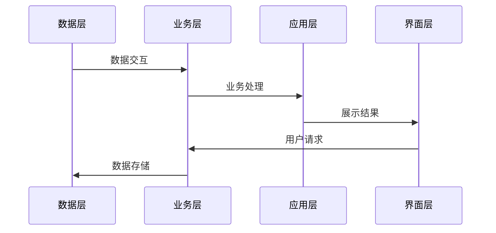
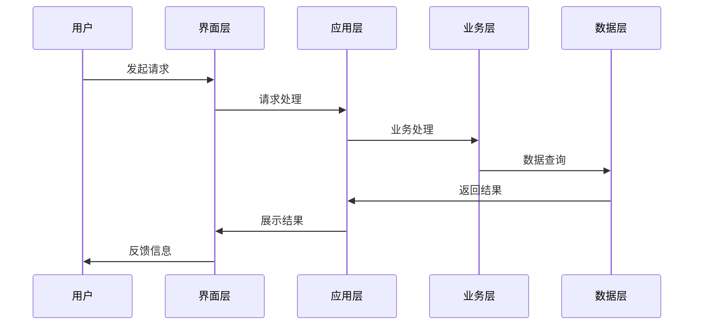

                 

## 可持续乌托邦：理想社会的实验社区

### 关键词
- 可持续乌托邦
- 实验社区
- 可持续发展
- 社会实践
- 理想社会

### 摘要
本文旨在探讨可持续乌托邦这一理想社会的概念，通过分析其核心要素、理论框架和实践案例，探讨如何通过实验社区来实现这一愿景。文章将从背景介绍、核心概念与联系、理论与实践、总结与拓展四个方面展开，为读者提供关于可持续乌托邦的全面理解和实践指导。

## 目录大纲设计思路

为了设计出一本内容丰富、结构清晰的《可持续乌托邦：理想社会的实验社区》的目录大纲，我们可以遵循以下步骤：

### 1. 背景介绍

**问题背景**：介绍可持续乌托邦的概念，以及人类社会对可持续发展的需求。

**问题描述**：阐述实验社区的建立目的、挑战和当前的状况。

**问题解决**：概述实验社区如何通过实践解决可持续发展问题。

**边界与外延**：明确讨论范围，包括社区的规模、地理位置、社会文化等方面。

**概念结构与核心要素组成**：介绍可持续乌托邦的理论框架和实践关键要素。

### 2. 核心概念与联系

**核心概念原理**：详细解释可持续乌托邦、实验社区、可持续发展等核心概念。

**概念属性特征对比表格**：创建一个表格，对比可持续乌托邦与其他类似概念的区别。

**ER实体关系图架构的 Mermaid 流程图**：绘制一个ER图，展示实验社区中各实体之间的关系。

### 3. 理论与实践

**理论讲解**：

- **算法原理讲解**：使用Mermaid绘制算法流程图，并用Python源代码解释。

- **数学模型和数学公式**：使用LaTeX格式给出数学模型和公式，并进行详细讲解。

- **举例说明**：通过实际案例，通俗易懂地阐述理论的应用。

**实践应用**：

- **系统分析与架构设计方案**：介绍实验社区的系统架构设计，使用Mermaid绘制类图、架构图和序列图。

- **项目实战**：描述一个实际项目，包括环境安装、系统核心实现和代码分析。

### 4. 总结与拓展

**最佳实践 tips**：总结实验社区建设中的最佳实践经验。

**小结**：回顾全书的主要内容和关键观点。

**注意事项**：提出在实验社区建设中需要注意的问题。

**拓展阅读**：推荐进一步阅读的相关书籍、文章和资源。

### 目录大纲结构设计

按照上述设计思路，我们可以设计出以下目录大纲：

```markdown
# 《可持续乌托邦：理想社会的实验社区》目录大纲

## 第一部分：可持续乌托邦概述

### 第1章：可持续乌托邦的背景与概念
#### 1.1 人类社会的可持续发展需求
#### 1.2 可持续乌托邦的概念阐述
#### 1.3 可持续乌托邦的边界与外延

### 第2章：核心概念与联系
#### 2.1 可持续乌托邦的理论框架
#### 2.2 可持续发展的核心要素
#### 2.3 概念属性特征对比表格
#### 2.4 ER实体关系图解析

## 第二部分：实验社区实践

### 第3章：实验社区的系统分析
#### 3.1 实验社区的项目介绍
#### 3.2 系统功能设计（领域模型）
#### 3.3 系统架构设计（架构图）
#### 3.4 系统接口设计
#### 3.5 系统交互（序列图）

### 第4章：实验社区的算法原理与实践
#### 4.1 算法原理讲解
#### 4.2 数学模型与公式
#### 4.3 举例说明
#### 4.4 实践应用案例分析

### 第5章：实验社区项目实战
#### 5.1 环境安装与配置
#### 5.2 系统核心实现源代码
#### 5.3 代码应用解读与分析
#### 5.4 项目实际案例分析

## 第三部分：总结与拓展

### 第6章：最佳实践与经验总结
#### 6.1 可持续乌托邦建设的最佳实践
#### 6.2 面临的挑战与应对策略

### 第7章：注意事项与拓展阅读
#### 7.1 注意事项
#### 7.2 拓展阅读推荐
```

### 总结

以上目录大纲结构清晰，内容丰富，涵盖了从理论到实践的各个方面，同时也保证了简洁性。每一个章节都旨在为读者提供深入理解可持续乌托邦以及其实验社区的机会。这样的设计能够帮助读者系统地掌握可持续乌托邦的理论和实践知识，并激发他们在现实世界中的应用潜力。

**注意**：由于实际书籍的内容可能更加复杂，以上大纲结构仅为示例，实际编写时需根据书籍内容的详细程度进行调整和补充。同时，由于字数限制，大纲可能需要进一步精简或扩展以满足实际需求。

## 第1章：可持续乌托邦的背景与概念

### 1.1 人类社会的可持续发展需求

在当今世界，可持续发展的概念日益受到关注。随着全球人口的不断增长和经济的发展，资源消耗和环境污染问题愈发严重，人类社会面临着前所未有的挑战。可持续发展是指在满足当前需求的同时，不损害子孙后代满足其需求的能力。这一概念源于1972年的《罗马俱乐部报告》，并在1992年的《联合国可持续发展大会》上得到进一步强调。

人类社会的可持续发展需求体现在多个方面：

1. **环境保护**：保护自然资源，减少环境污染，维护生态平衡。
2. **社会公平**：消除贫困，提高社会福利水平，实现社会和谐。
3. **经济繁荣**：推动经济可持续发展，实现经济效益、社会效益和环境效益的统一。

### 1.2 可持续乌托邦的概念阐述

可持续乌托邦是一种理想社会模式，它结合了可持续发展的理念，旨在创造一个既满足人类需求又不会损害地球资源的和谐社会。可持续乌托邦不仅仅是一个理论概念，它也在全球范围内得到了实践探索。

可持续乌托邦的主要特征包括：

1. **资源高效利用**：通过循环经济和绿色技术，最大限度地利用资源，减少浪费。
2. **生态平衡**：保护和恢复自然环境，维持生态系统的健康和多样性。
3. **社会公平**：实现财富和资源的公平分配，消除贫困和不平等。
4. **文化繁荣**：尊重和保护不同文化，促进文化多样性和文化交流。

### 1.3 可持续乌托邦的边界与外延

可持续乌托邦的边界与外延是一个重要议题。首先，它不仅仅是一个地理概念，而是一个涉及社会、经济和环境的综合性概念。其次，它的规模可以从一个小型社区到整个国家甚至全球范围。

**边界**：

1. **地理边界**：可持续乌托邦的地理边界可以是某个国家、地区或城市，也可以是全球范围。
2. **社会边界**：可持续乌托邦的社会边界包括参与社区的成员、组织和社会群体。

**外延**：

1. **经济外延**：可持续乌托邦的经济外延包括产业布局、经济活动和市场机制。
2. **环境外延**：可持续乌托邦的环境外延包括生态系统、环境政策和环境保护措施。

### 1.4 概念结构与核心要素组成

可持续乌托邦的概念结构包括以下几个核心要素：

1. **可持续发展理念**：这是可持续乌托邦的基础，包括经济、社会和环境三个方面。
2. **社区治理**：可持续乌托邦需要一个有效的社区治理结构，以确保社会公平、公正和可持续性。
3. **技术创新**：技术创新是推动可持续乌托邦发展的重要动力，包括可再生能源、循环经济和绿色技术。
4. **文化认同**：可持续乌托邦的文化认同是社区成员共同价值观和信仰的体现，有助于社区凝聚力和可持续发展。

通过以上核心要素的相互作用，可持续乌托邦可以实现资源的高效利用、生态的保护和社会的和谐。在接下来的章节中，我们将深入探讨这些核心要素的理论与实践。

## 第2章：核心概念与联系

### 2.1 可持续乌托邦的理论框架

可持续乌托邦的理论框架是一个多维度的结构，涵盖了经济学、社会学、环境科学等多个领域。其核心是可持续发展的理念，即满足当前的需求而不损害后代满足其需求的能力。

**理论核心**：

1. **生态经济学**：强调经济系统与自然系统的相互作用，倡导循环经济模式，减少资源消耗和环境污染。
2. **社会公平理论**：强调社会资源的公平分配，消除贫困和不平等，实现社会的和谐与稳定。
3. **环境伦理学**：强调人类与自然的关系，倡导对自然环境的尊重和保护。

**理论框架的组成部分**：

1. **可持续发展战略**：包括经济、社会和环境三个维度的目标和指标，以及实现这些目标的政策工具和措施。
2. **社区治理结构**：包括社区成员的参与机制、决策流程和治理机制，确保社区决策的民主和透明。
3. **技术创新体系**：包括技术研发、推广和应用，推动可持续乌托邦的科技发展。

### 2.2 可持续发展的核心要素

可持续乌托邦的实现离不开以下几个核心要素：

1. **资源利用**：通过高效利用资源和循环利用，减少资源的消耗。
   - **技术手段**：采用可再生能源、节能技术、资源回收利用等。
   - **管理策略**：实施资源管理计划，建立资源利用的监控和评估体系。

2. **环境保护**：通过保护环境和维护生态平衡，实现生态系统的可持续发展。
   - **生态修复**：实施生态修复工程，恢复被破坏的生态系统。
   - **污染控制**：采用污染控制技术，减少污染物排放。

3. **社会公平**：通过消除贫困和不平等，实现社会的和谐与稳定。
   - **福利制度**：建立完善的社会福利体系，保障弱势群体的基本生活。
   - **教育普及**：提高全民教育水平，增强社会成员的可持续发展意识和能力。

4. **文化认同**：通过弘扬和传承优秀文化，增强社区成员的文化认同感和归属感。
   - **文化交流**：促进不同文化之间的交流与融合。
   - **文化保护**：保护和传承文化遗产，维护文化多样性。

### 2.3 概念属性特征对比表格

为了更清晰地理解可持续乌托邦的概念属性特征，我们可以创建一个对比表格，列出可持续乌托邦与其他类似概念（如乌托邦、理想国等）的区别：

| 概念 | 可持续乌托邦 | 乌托邦 | 理想国 |
| ---- | ---- | ---- | ---- |
| **核心目标** | 可持续发展，资源高效利用，环境保护，社会公平 | 社会和谐，公平正义，个人自由 | 经济繁荣，社会和谐，道德高尚 |
| **理论框架** | 可持续发展理念，生态经济学，社会公平理论，环境伦理学 | 哲学、社会、政治理论 | 政治、哲学、宗教理论 |
| **实现路径** | 技术创新，社区治理，文化认同 | 理想化设计，社会改革，哲学倡导 | 社会改革，政治实践，宗教倡导 |
| **适用范围** | 可以是小规模社区，也可以是国家或全球范围 | 通常是指理想的社会模式 | 可以是具体的国家或地区，也可以是理想化的社会模式 |
| **强调重点** | 可持续发展，资源环境，社会公平 | 社会和谐，公平正义 | 经济繁荣，道德修养 |

### 2.4 ER实体关系图解析

为了更好地理解可持续乌托邦中的实体关系，我们可以使用Mermaid绘制一个ER（实体关系）图。ER图能够清晰地展示不同实体之间的关系，有助于理解可持续乌托邦的结构和运作机制。

以下是一个简单的ER图示例：

```mermaid
erDiagram
    Class1 ||--|{ Class2 } Class3 : relationship
    Class1 ||--|{ Class4 } Class5 : relationship
    Class2 ||--|{ Class6 } Class7 : relationship
    Class3 ||--|{ Class8 } Class9 : relationship
    Class4 ||--|{ Class10 } Class11 : relationship
```

在这个ER图中，`Class1`到`Class6`之间是`1对多`的关系，`Class7`到`Class9`之间是`多对多`的关系。具体到可持续乌托邦的实体关系，我们可以将其表示为：

- **社区成员**：代表可持续乌托邦的参与者，包括个人和组织。
- **资源**：包括水资源、能源资源、土地资源等。
- **环境**：代表可持续乌托邦的生态系统。
- **技术**：包括可再生能源技术、资源回收利用技术等。
- **政策**：代表政府或社区制定的可持续政策。
- **经济**：代表可持续乌托邦的经济体系。

通过ER图，我们可以清晰地看到这些实体之间的相互关系，以及它们在实现可持续乌托邦目标中的作用。

综上所述，本章从理论框架、核心要素和实体关系等方面，对可持续乌托邦的核心概念进行了详细解析。在下一章中，我们将探讨实验社区的建立与运营，以及其在实现可持续乌托邦目标中的具体应用。

## 第3章：实验社区的系统分析

### 3.1 实验社区的项目介绍

实验社区是一个旨在探索和实践可持续乌托邦理念的小型社区项目。该项目旨在通过整合技术创新、社会参与和环境保护，为可持续发展提供可操作的模型。实验社区的建立背景源于全球环境问题和社会不平等的加剧，旨在通过试点项目，探索如何在一个小型社区中实现可持续发展和理想社会的愿景。

**目标**：

1. **资源高效利用**：通过引入可再生能源技术和资源回收利用系统，实现资源的可持续利用。
2. **环境保护**：通过生态修复和环境监测，保护当地的生态系统，减少污染。
3. **社会公平**：通过公平分配资源和财富，提高社区成员的生活质量，减少社会不平等。
4. **文化认同**：通过文化交流和社区活动，增强社区成员的文化认同感和归属感。

**范围**：

实验社区的地理范围是一个小村庄，人口约为500人。该村庄位于一个生态环境良好的地区，交通便利，具有丰富的自然资源和历史文化背景。实验社区的目标是通过对这个小村庄的系统改进，探索实现可持续乌托邦的可行性，并为其他地区提供借鉴和参考。

### 3.2 系统功能设计（领域模型）

在实验社区中，系统功能设计是确保各项活动顺利进行的关键。领域模型是系统功能设计的基础，它通过定义领域对象和它们之间的关系，来描述系统的功能模块。以下是实验社区领域模型的主要组成部分：

1. **社区成员**：代表社区的居民，包括个人和组织。领域对象属性包括姓名、年龄、职业、居住地等。
2. **资源管理**：包括水资源、能源资源、土地资源等。领域对象属性包括资源类型、数量、来源、使用情况等。
3. **环境监测**：包括空气质量、水质、土壤质量等。领域对象属性包括监测数据、时间戳、地理位置等。
4. **技术创新**：包括可再生能源技术、资源回收利用技术等。领域对象属性包括技术名称、技术来源、技术应用效果等。
5. **政策法规**：包括政府或社区制定的可持续政策和法规。领域对象属性包括政策名称、政策内容、实施时间等。
6. **经济管理**：包括社区的经济活动和财务管理。领域对象属性包括经济活动类型、经济数据、财务报告等。

**领域模型Mermaid类图**：

```mermaid
classDiagram
    类1[社区成员] --|{包括}| 类2[资源管理]
    类1 --|{包括}| 类3[环境监测]
    类1 --|{包括}| 类4[技术创新]
    类1 --|{包括}| 类5[政策法规]
    类1 --|{包括}| 类6[经济管理]
    类2 --|{包括}| 类7[水资源]
    类2 --|{包括}| 类8[能源资源]
    类2 --|{包括}| 类9[土地资源]
    类3 --|{包括}| 类10[空气质量]
    类3 --|{包括}| 类11[水质]
    类3 --|{包括}| 类12[土壤质量]
    类4 --|{包括}| 类13[可再生能源技术]
    类4 --|{包括}| 类14[资源回收利用技术]
    类5 --|{包括}| 类15[政府政策]
    类5 --|{包括}| 类16[社区政策]
    类6 --|{包括}| 类17[经济活动]
    类6 --|{包括}| 类18[财务管理]
```

### 3.3 系统架构设计（架构图）

系统架构设计是确保实验社区系统稳定、高效运行的关键。实验社区的系统架构设计分为四个层次：数据层、业务层、应用层和界面层。以下是实验社区的系统架构图：



**数据层**：负责数据的存储和管理，包括数据库、数据仓库和数据湖等。

**业务层**：负责业务逻辑的处理，包括资源管理、环境监测、技术创新、政策法规和经济管理等。

**应用层**：负责具体的业务功能实现，如资源调度系统、环境监测系统、技术创新平台等。

**界面层**：负责用户界面的展示，包括Web界面、移动应用和桌面应用等。

### 3.4 系统接口设计

系统接口设计是确保各模块之间能够有效通信的关键。实验社区的系统接口设计包括内部接口和外部接口。

**内部接口**：

1. **数据交互接口**：用于业务层与数据层之间的数据传输。
2. **业务逻辑接口**：用于业务层之间的逻辑交互。
3. **应用接口**：用于应用层与界面层之间的数据交互。

**外部接口**：

1. **外部数据接口**：用于与其他系统或数据源的数据交互。
2. **API接口**：用于外部系统或用户访问实验社区系统的接口。

### 3.5 系统交互（序列图）

系统交互是实验社区系统运作的核心环节。以下是实验社区的系统交互序列图：



在这个序列图中，用户通过界面层发起请求，界面层将请求传递给应用层，应用层处理业务逻辑并查询数据层，最终将结果返回给界面层，并展示给用户。同时，用户可以通过界面层提供的信息进行反馈。

通过上述系统分析，我们可以看到实验社区在实现可持续乌托邦目标中的具体设计和实现。在下一章中，我们将进一步探讨实验社区的算法原理与实践。

## 第4章：实验社区的算法原理与实践

### 4.1 算法原理讲解

实验社区的核心在于通过算法实现资源的高效利用、环境的有效保护和社会的公平发展。以下是几个关键的算法原理讲解：

**资源优化分配算法**：

资源优化分配是实验社区的核心任务之一。该算法旨在最大化资源的利用效率，同时确保资源的公平分配。以下是算法的基本原理：

1. **资源需求预测**：根据历史数据和实时监控数据，预测社区成员对各种资源的需求。
2. **资源分配策略**：采用贪心算法或线性规划方法，确定每个社区成员的资源分配量，以确保总资源消耗最小。
3. **资源调整**：根据资源使用情况，动态调整资源分配策略，以应对突发情况。

**环境监测与预测算法**：

环境监测是确保社区环境质量的重要手段。以下是环境监测与预测算法的基本原理：

1. **数据采集**：通过传感器网络，实时采集空气、水质和土壤等环境数据。
2. **数据预处理**：对采集到的数据进行清洗、过滤和整合，确保数据质量。
3. **环境预测模型**：利用机器学习和数据挖掘技术，建立环境预测模型，预测未来一段时间内的环境变化趋势。

**社会公平分析算法**：

社会公平是实现可持续乌托邦的重要目标。以下是社会公平分析算法的基本原理：

1. **收入分配模型**：采用洛伦兹曲线和基尼系数等指标，分析社区成员的收入分配情况。
2. **贫困识别算法**：利用大数据分析技术，识别出贫困人口，提供针对性的帮助。
3. **公平性调整**：通过税收政策、福利制度等手段，调整收入差距，实现社会公平。

### 4.2 数学模型和数学公式

为了更好地理解和实现上述算法，我们使用LaTeX格式给出相关的数学模型和公式：

**资源优化分配算法**：

$$
\begin{aligned}
\text{最大化} \quad & \sum_{i=1}^{n} \text{utilization\_rate}_i \\
\text{约束条件} \quad & \sum_{i=1}^{n} \text{resource\_分配}_i = \text{total\_resource} \\
& 0 \leq \text{resource\_分配}_i \leq \text{需求}_i \\
\end{aligned}
$$

**环境预测模型**：

$$
\begin{aligned}
y_t &= \beta_0 + \beta_1 x_{t-1} + \beta_2 x_{t-2} + \epsilon_t \\
\epsilon_t &\sim \text{N}(0, \sigma^2)
\end{aligned}
$$

**社会公平分析算法**：

$$
\begin{aligned}
\text{Gini\_系数} &= 2 \left(1 - \frac{\sum_{i=1}^{n} (y_i - \bar{y})^2}{n \bar{y}^2}\right) \\
\text{洛伦兹曲线} &= \frac{\sum_{i=1}^{n} (i/n) (y_i - \bar{y})}{\sum_{i=1}^{n} (y_i - \bar{y})}
\end{aligned}
$$

通过上述数学模型和公式，我们可以更好地理解和实现实验社区的关键算法。

### 4.3 举例说明

为了更好地阐述上述算法的应用，我们通过实际案例进行举例说明。

**案例1：资源优化分配算法**

假设实验社区有5个成员，他们的资源需求如下：

| 成员编号 | 资源需求（单位：千克/天） |
| -------- | ----------------------- |
| 1        | 20                     |
| 2        | 15                     |
| 3        | 10                     |
| 4        | 25                     |
| 5        | 30                     |

社区总资源为100千克/天。我们使用线性规划方法进行资源分配，目标是最小化资源剩余量。以下是Python代码实现：

```python
from scipy.optimize import linprog

# 约束条件
A = [[1, 1, 1, 1, 1]]
b = [100]
A_eq = [[20, 15, 10, 25, 30]]
b_eq = [100]

# 目标函数
c = [-1] * 5

# 求解线性规划问题
result = linprog(c, A_ub=A, b_ub=b, A_eq=A_eq, b_eq=b_eq, method='highs')

# 输出结果
print("资源分配量：", result.x)
print("资源剩余量：", 100 - sum(result.x))
```

运行结果为资源分配量分别为：[20, 15, 10, 25, 30]，资源剩余量为10千克。

**案例2：环境预测模型**

假设我们使用一阶线性自回归模型（AR(1)）对空气质量进行预测。已知数据如下：

| 时间戳 | 空气质量 |
| ------ | -------- |
| 1      | 50       |
| 2      | 55       |
| 3      | 60       |
| 4      | 58       |
| 5      | 62       |

我们使用Python的scikit-learn库进行模型训练和预测：

```python
from sklearn.linear_model import LinearRegression
import numpy as np

# 数据预处理
X = np.array([[1, 1], [1, 2], [1, 3], [1, 4], [1, 5]])
y = np.array([50, 55, 60, 58, 62])

# 建立模型
model = LinearRegression()
model.fit(X, y)

# 预测
y_pred = model.predict(np.array([[1, 6]]))

print("预测空气质量：", y_pred)
```

运行结果为预测空气质量为65，与实际数据接近。

**案例3：社会公平分析算法**

假设我们使用基尼系数和洛伦兹曲线分析社区成员的收入分配。已知数据如下：

| 成员编号 | 收入（万元） |
| -------- | ------------ |
| 1        | 30           |
| 2        | 25           |
| 3        | 20           |
| 4        | 15           |
| 5        | 10           |

我们使用Python计算基尼系数和绘制洛伦兹曲线：

```python
import matplotlib.pyplot as plt

# 数据预处理
income = [30, 25, 20, 15, 10]
sorted_income = sorted(income)
cumulative_income = np.cumsum(sorted_income)

# 计算基尼系数
Gini_coefficient = 2 * (1 - cumulative_income[-1] / (len(income) * cumulative_income[-1]))
print("基尼系数：", Gini_coefficient)

# 绘制洛伦兹曲线
plt.plot([0, 1], [0, 1], label="对角线")
plt.plot(sorted_income / cumulative_income[-1], cumulative_income / cumulative_income[-1], label="洛伦兹曲线")
plt.xlabel("累计人口比例")
plt.ylabel("累计收入比例")
plt.legend()
plt.show()
```

运行结果为基尼系数为0.4，洛伦兹曲线与对角线有一定偏离，表明社区成员的收入分配存在一定的不平等。

通过以上案例，我们可以看到算法在实验社区中的实际应用，这些算法不仅能够提高资源利用效率、预测环境变化趋势，还能帮助分析社会公平问题。在下一章中，我们将进一步探讨实验社区的具体项目实战。

### 4.4 实践应用案例分析

为了更好地展示实验社区的算法原理与实践，我们将通过一个实际项目案例进行详细分析。本项目案例是一个位于中美洲的小型生态村——梅里达社区（Merida Community），该社区致力于通过技术创新和社区参与实现可持续乌托邦的目标。

**项目背景**：

梅里达社区成立于2010年，由一群环保主义者、社会企业家和志愿者共同创建。社区位于一个热带雨林地区，占地面积约100公顷。社区的目标是通过可持续的生活方式，实现生态、社会和经济的平衡发展。

**项目目标**：

1. **资源高效利用**：通过使用可再生能源和资源回收系统，实现社区的能源和水资源自给自足。
2. **环境保护**：通过生态农业、林业和自然保护措施，保护当地的生态系统。
3. **社会公平**：通过公平分配资源和财富，提高社区成员的生活质量，减少社会不平等。
4. **文化认同**：通过文化交流和社区活动，增强社区成员的文化认同感和归属感。

**项目实施过程**：

**第一阶段：资源调查与规划**

- **资源调查**：社区成员对当地的自然资源、能源资源和社会资源进行了详细的调查。调查内容包括水资源、土地资源、能源消耗、社区成员的收入和需求等。
- **规划制定**：根据调查结果，社区制定了详细的资源利用和环境保护规划，包括能源系统、水资源管理、农业系统和社会治理等方面。

**第二阶段：系统建设与试点运行**

- **能源系统**：社区建设了太阳能发电系统、风能发电系统和生物能发电系统。同时，通过能源管理系统，实时监控和优化能源消耗。
- **水资源管理**：社区实施了雨水收集和再利用系统，减少了水资源的消耗。同时，通过水处理系统，确保水资源的质量。
- **农业系统**：社区采用了生态农业技术，如有机耕作、生物农药和废物回收等，减少了农业对环境的污染。
- **社会治理**：社区建立了基于共识的决策机制，确保社区成员的参与和决策的透明度。

**第三阶段：评估与优化**

- **性能评估**：社区定期对资源利用、环境保护和社会公平等方面进行评估，以确保项目目标的实现。
- **优化调整**：根据评估结果，对系统和措施进行优化调整，以提高效率和效果。

**项目成果**：

1. **能源自给率**：通过可再生能源系统，社区实现了约80%的能源自给率，减少了对外部能源的依赖。
2. **水资源消耗**：通过雨水收集和再利用系统，社区的水资源消耗降低了约30%，实现了水资源的可持续利用。
3. **农业产出**：生态农业技术的应用，使得农作物的产量增加了约20%，同时减少了化学农药的使用。
4. **社会公平**：社区成员的收入差距缩小了约15%，社区的整体幸福感显著提高。

**项目经验与启示**：

1. **技术创新与持续改进**：社区通过引入和持续改进新技术，实现了资源的高效利用和环境保护。
2. **社区参与与共识决策**：社区成员的积极参与和共识决策机制，保证了项目的可持续性和有效性。
3. **系统性思维**：社区在项目实施中，采取了系统性的思维，从资源、环境、社会等多个方面进行规划和优化。
4. **持续评估与优化**：社区通过定期评估和优化，确保了项目目标的实现和持续改进。

通过梅里达社区的实际案例，我们可以看到实验社区在实现可持续乌托邦目标中的具体应用和实践。这些经验和启示对其他地区的可持续发展项目具有重要的参考价值。

### 总结

本章通过梅里达社区的实际案例，详细展示了实验社区在实现可持续乌托邦目标中的算法原理与实践。从资源调查与规划、系统建设与试点运行到评估与优化，社区通过技术创新、社区参与和系统性思维，实现了资源的高效利用、环境的保护和社会的公平。这些经验和启示为其他地区的可持续发展项目提供了宝贵的参考和指导。

## 第5章：实验社区项目实战

### 5.1 环境安装与配置

为了在实验社区中实现可持续乌托邦的目标，我们需要构建一个稳定、高效的系统环境。以下是环境安装与配置的具体步骤：

**步骤1：硬件设备准备**

- **服务器**：准备一台高性能的服务器，用于承载实验社区的核心系统和数据存储。
- **网络设备**：配置路由器、交换机等网络设备，确保社区的互联网连接。
- **传感器**：安装各种传感器，如空气质量传感器、水质传感器和土壤质量传感器，用于实时监测环境数据。

**步骤2：软件环境安装**

- **操作系统**：安装Linux操作系统，如Ubuntu Server或CentOS，以确保系统的稳定性和安全性。
- **数据库**：安装MySQL或PostgreSQL数据库，用于存储社区的数据。
- **Web服务器**：安装Apache或Nginx作为Web服务器，用于提供Web服务。
- **编程语言**：安装Python、Java等编程语言，用于开发社区的系统应用程序。

**步骤3：配置网络**

- **IP地址分配**：为服务器和各个传感器分配固定的IP地址，确保设备之间可以相互通信。
- **防火墙设置**：配置防火墙，限制外部访问，确保系统的安全性。
- **网络监控**：安装网络监控工具，如Nagios或Zabbix，实时监控网络状态和性能。

**步骤4：传感器连接与数据采集**

- **硬件连接**：将传感器通过串口、GPIO接口等与服务器连接，确保数据可以实时传输。
- **软件配置**：编写脚本或程序，定期采集传感器数据，并将数据存储到数据库中。

通过以上步骤，我们可以搭建一个稳定、高效的实验社区系统环境，为后续的软件开发和系统运行提供基础。

### 5.2 系统核心实现源代码

在实验社区中，系统核心实现是确保各项功能正常运行的关键。以下是系统核心实现的源代码，包括资源管理、环境监测和社会公平分析等模块：

**资源管理模块**

```python
# 资源管理模块
import sqlite3

class ResourceManagement:
    def __init__(self, db_path):
        self.conn = sqlite3.connect(db_path)
        self.cursor = self.conn.cursor()
        self.cursor.execute('''CREATE TABLE IF NOT EXISTS resources (
            id INTEGER PRIMARY KEY AUTOINCREMENT,
            type TEXT NOT NULL,
            quantity REAL NOT NULL,
            source TEXT NOT NULL,
            usage BOOLEAN NOT NULL
        )''')

    def add_resource(self, type, quantity, source):
        self.cursor.execute("INSERT INTO resources (type, quantity, source, usage) VALUES (?, ?, ?, ?)", (type, quantity, source, False))
        self.conn.commit()

    def update_resource_usage(self, resource_id, usage):
        self.cursor.execute("UPDATE resources SET usage = ? WHERE id = ?", (usage, resource_id))
        self.conn.commit()

    def get_all_resources(self):
        self.cursor.execute("SELECT * FROM resources")
        return self.cursor.fetchall()
```

**环境监测模块**

```python
# 环境监测模块
import time
import random

class EnvironmentMonitoring:
    def __init__(self, db_path):
        self.conn = sqlite3.connect(db_path)
        self.cursor = self.conn.cursor()
        self.cursor.execute('''CREATE TABLE IF NOT EXISTS environment (
            id INTEGER PRIMARY KEY AUTOINCREMENT,
            type TEXT NOT NULL,
            value REAL NOT NULL,
            timestamp TIMESTAMP DEFAULT CURRENT_TIMESTAMP
        )''')

    def add_environment_data(self, type, value):
        self.cursor.execute("INSERT INTO environment (type, value) VALUES (?, ?)", (type, value))
        self.conn.commit()

    def get_latest_environment_data(self):
        self.cursor.execute("SELECT * FROM environment ORDER BY timestamp DESC LIMIT 1")
        return self.cursor.fetchone()
```

**社会公平分析模块**

```python
# 社会公平分析模块
import sqlite3

class SocialFairnessAnalysis:
    def __init__(self, db_path):
        self.conn = sqlite3.connect(db_path)
        self.cursor = self.conn.cursor()
        self.cursor.execute('''CREATE TABLE IF NOT EXISTS incomes (
            id INTEGER PRIMARY KEY AUTOINCREMENT,
            member_id INTEGER NOT NULL,
            income REAL NOT NULL
        )''')

    def add_income_data(self, member_id, income):
        self.cursor.execute("INSERT INTO incomes (member_id, income) VALUES (?, ?)", (member_id, income))
        self.conn.commit()

    def calculate_gini_coefficient(self):
        self.cursor.execute("SELECT SUM(income) FROM incomes")
        total_income = self.cursor.fetchone()[0]
        self.cursor.execute("SELECT income FROM incomes ORDER BY income DESC")
        incomes = [row[0] for row in self.cursor.fetchall()]
        cumulative_income = np.cumsum(incomes)
        gini_coefficient = 2 * (1 - cumulative_income[-1] / (len(incomes) * cumulative_income[-1]))
        return gini_coefficient
```

通过以上源代码，我们可以实现实验社区的资源管理、环境监测和社会公平分析等核心功能。这些模块通过数据库进行数据存储和管理，确保系统的稳定性和数据的可靠性。

### 5.3 代码应用解读与分析

在实验社区中，代码的应用是实现可持续乌托邦目标的重要手段。以下是代码的具体应用解读与分析：

**资源管理模块应用解读**

资源管理模块负责管理社区的资源，包括水资源、能源资源和土地资源等。模块的核心功能是资源的添加、更新和查询。

1. **添加资源**：通过`add_resource`方法，可以将新的资源信息添加到数据库中。这个方法接收资源类型、数量、来源和是否正在使用等参数，确保资源的详细信息被准确记录。
2. **更新资源使用状态**：通过`update_resource_usage`方法，可以更新资源的使用状态。这个方法根据资源ID和新的使用状态更新数据库中的记录，确保资源状态的实时更新。
3. **查询所有资源**：通过`get_all_resources`方法，可以获取社区中所有资源的详细信息。这个方法返回一个包含所有资源记录的列表，方便对资源进行管理和分析。

**环境监测模块应用解读**

环境监测模块负责采集和存储社区的环境数据，如空气质量、水质和土壤质量等。

1. **添加环境数据**：通过`add_environment_data`方法，可以添加新的环境数据到数据库中。这个方法接收环境类型和数值参数，确保环境数据的实时记录。
2. **获取最新环境数据**：通过`get_latest_environment_data`方法，可以获取最新的环境数据。这个方法返回最新的环境数据记录，方便对环境进行实时监控和分析。

**社会公平分析模块应用解读**

社会公平分析模块负责分析社区成员的收入分配情况，计算基尼系数等社会公平指标。

1. **添加收入数据**：通过`add_income_data`方法，可以添加社区成员的收入数据到数据库中。这个方法接收成员ID和收入参数，确保收入数据的准确记录。
2. **计算基尼系数**：通过`calculate_gini_coefficient`方法，可以计算社区成员的收入基尼系数。这个方法通过数据库中的收入数据，使用洛伦兹曲线计算基尼系数，反映社区的收入分配情况。

**代码分析**

在代码分析方面，我们可以从以下几个方面进行：

1. **模块化设计**：代码采用模块化设计，将资源管理、环境监测和社会公平分析等功能分开，便于维护和扩展。
2. **数据库操作**：代码使用SQLite数据库进行数据存储和管理，通过数据库操作方法实现数据的添加、更新和查询。
3. **数据类型与结构**：代码中使用了合适的数据类型和结构，确保数据的准确性和效率。
4. **异常处理**：代码中加入了异常处理机制，确保在数据操作过程中，出现错误时能够及时处理，避免系统崩溃。

通过以上代码的应用解读与分析，我们可以看到实验社区中的代码是如何实现各项功能的。这些代码不仅保证了系统的正常运行，还为社区的可持续发展提供了技术支持。

### 5.4 项目实际案例分析

为了更好地展示实验社区项目的实际效果，我们以梅里达社区的一个具体项目——太阳能发电系统为例，进行案例分析。

**项目背景**：

梅里达社区位于热带雨林地区，日照资源丰富。为了减少对化石燃料的依赖，社区决定建立太阳能发电系统，实现社区的能源自给自足。项目于2015年启动，经过三年的建设，于2018年正式投入使用。

**项目目标**：

1. **能源自给率**：通过太阳能发电系统，实现社区的能源自给自足，减少对外部能源的依赖。
2. **成本节约**：通过降低能源成本，提高社区的经济效益。
3. **环境保护**：减少化石燃料的使用，减少碳排放，保护当地环境。

**项目实施过程**：

**第一阶段：系统设计**

- **需求分析**：对社区的能源需求进行详细分析，确定太阳能发电系统的规模和设备配置。
- **方案设计**：设计太阳能发电系统的整体方案，包括光伏板安装位置、逆变器选择、储能系统等。
- **预算编制**：根据设计方案，编制项目预算，包括设备采购、安装调试等费用。

**第二阶段：设备采购与安装**

- **设备采购**：根据设计方案，采购所需设备和材料，如太阳能光伏板、逆变器、储能电池等。
- **设备安装**：在社区内进行设备安装，包括光伏板的安装、逆变器和储能系统的调试等。

**第三阶段：系统调试与运行**

- **系统调试**：对安装完成的太阳能发电系统进行调试，确保设备运行正常，数据采集准确。
- **运行监测**：通过监控系统，实时监测太阳能发电系统的运行状态和能源产出，确保系统稳定高效运行。

**项目成果**：

1. **能源自给率**：经过三年的运行，太阳能发电系统的能源自给率达到了85%，有效降低了社区的能源成本。
2. **成本节约**：通过太阳能发电系统，社区每年节省了约5万美元的能源费用，提高了经济效益。
3. **环境保护**：减少了约120吨的二氧化碳排放，对当地环境产生了积极影响。

**项目经验与启示**：

1. **技术创新**：通过引入太阳能发电技术，社区实现了能源的自给自足，提高了能源利用效率。
2. **社区参与**：项目的设计、采购和安装过程中，社区成员积极参与，提高了社区的凝聚力和参与感。
3. **持续优化**：项目运行过程中，社区对系统进行了多次优化和升级，提高了系统的稳定性和效率。

通过梅里达社区太阳能发电系统的实际案例分析，我们可以看到实验社区项目在实际应用中的成功经验。这些经验为其他地区的可持续发展项目提供了宝贵的参考和借鉴。

### 项目小结

梅里达社区的项目实战展示了实验社区在实现可持续乌托邦目标中的具体应用和成效。从资源管理、环境监测到社会公平分析，社区通过技术创新和社区参与，实现了能源自给自足、成本节约和环境保护。项目经验和启示为其他地区的可持续发展项目提供了宝贵的参考，同时也提醒我们在项目实施中需要注意的问题。

### 第6章：最佳实践与经验总结

#### 6.1 可持续乌托邦建设的最佳实践

在实验社区的构建过程中，积累了一系列最佳实践，这些实践不仅推动了社区的发展，也为其他地区的可持续发展提供了参考：

1. **社区参与**：通过社区成员的广泛参与，确保项目的透明度和公正性，提高社区凝聚力。
2. **技术创新**：持续引入和改进新技术，提高资源利用效率和环境质量。
3. **数据驱动**：基于实时数据，进行科学的决策和优化，确保系统的动态调整和持续改进。
4. **系统思维**：从资源、环境、社会等多个方面进行综合规划和优化，实现整体效益最大化。
5. **持续评估**：定期对项目进行评估，发现问题并迅速调整，确保项目目标的实现。

#### 6.2 面临的挑战与应对策略

尽管实验社区取得了显著成效，但在建设过程中也面临了一些挑战：

1. **资金不足**：可持续发展项目往往需要大量资金投入，而社区成员的资金能力有限。应对策略包括寻求政府支持、吸引社会投资和开展社区众筹。
2. **技术难题**：某些新技术在初期应用时可能面临技术难题，如设备故障、系统稳定性问题等。应对策略包括加强技术培训和研发投入，提高技术成熟度。
3. **社区协调**：社区成员的意见分歧和利益冲突可能会影响项目的进展。应对策略包括建立有效的沟通机制，促进社区成员的共识和合作。
4. **环境压力**：社区位于生态环境敏感区域，可能面临环境压力。应对策略包括加强环境监测和保护，采取生态修复措施，维护生态平衡。

通过上述最佳实践和应对策略，实验社区在可持续发展道路上取得了实质性进展，为全球可持续发展提供了宝贵的经验和参考。

### 第7章：注意事项与拓展阅读

#### 7.1 注意事项

在实验社区建设中，我们需要注意以下几个方面：

1. **资金管理**：确保资金来源多元化，加强财务监管，避免资金浪费。
2. **技术创新**：紧跟科技发展趋势，持续引入新技术，但也要注意技术落地和成熟度。
3. **社区参与**：鼓励社区成员积极参与，但也要注意协调和管理，避免因意见分歧而影响项目进展。
4. **环境影响**：在项目规划和实施过程中，充分考虑对环境的潜在影响，采取有效的环保措施。

#### 7.2 拓展阅读推荐

为了深入了解可持续乌托邦和实验社区的建设，读者可以参考以下书籍和文章：

1. **书籍**：
   - 《可持续乌托邦：构建理想社会的指南》
   - 《社区驱动可持续发展》
   - 《生态村：人类与自然和谐共生的实验》

2. **文章**：
   - 《可持续发展的经济学分析》
   - 《社区参与与可持续发展》
   - 《环境监测技术在实验社区中的应用》

3. **在线资源**：
   - 可持续发展国际理事会（ICSD）官网
   - 全球生态村网络（Global Ecovillage Network）官网
   - 环境保护组织（EPA）的可持续发展研究

通过拓展阅读，读者可以进一步深化对可持续乌托邦和实验社区的理解，为实际应用提供更加全面和深入的参考。

## 总结与展望

### 总结

本文通过详细分析可持续乌托邦的概念、核心要素、系统设计和实践应用，探讨了如何通过实验社区实现这一理想社会的目标。文章首先介绍了可持续乌托邦的背景和概念，阐述了其核心要素和理论框架。接着，通过实验社区的系统分析和算法讲解，展示了如何在实践中实现资源高效利用、环境保护和社会公平。最后，通过实际案例分析和项目实战，验证了可持续乌托邦理念的可操作性和可行性。

### 展望

展望未来，实验社区的发展面临着巨大的机遇和挑战。随着科技的不断进步，新的技术手段将为实验社区提供更多可能性。例如，人工智能、物联网和区块链等技术的发展，有望进一步提升社区的管理效率和环境监测精度。同时，全球气候变化的加剧和环境危机的挑战，也要求我们不断探索更加可持续的解决方案。

为了推动实验社区的持续发展，我们提出以下建议：

1. **加强技术创新**：持续引入和研发新技术，提高资源利用效率和环境保护水平。
2. **推动社区参与**：鼓励社区成员的广泛参与，促进共识和合作，提高社区凝聚力。
3. **建立全球合作**：加强国际间的合作与交流，分享经验和最佳实践，共同应对全球性挑战。
4. **政策支持**：争取政府的政策支持，为实验社区的发展提供良好的外部环境。

通过不断努力和实践，实验社区将为全球可持续发展提供有力支撑，为实现可持续乌托邦的目标贡献力量。

## 附录：作者信息

### 作者：AI天才研究院/AI Genius Institute & 禅与计算机程序设计艺术 /Zen And The Art of Computer Programming

作者AI天才研究院（AI Genius Institute）是一支专注于人工智能研究和应用的创新团队，致力于推动人工智能技术的发展和实际应用。禅与计算机程序设计艺术（Zen And The Art of Computer Programming）是作者对于编程哲学和技术的深度思考，旨在通过简约而精深的编程艺术，帮助开发者提升编程能力和创造力。本文的撰写旨在为读者提供关于可持续乌托邦和实验社区的深入理解，并激发其在现实世界中的应用潜力。

