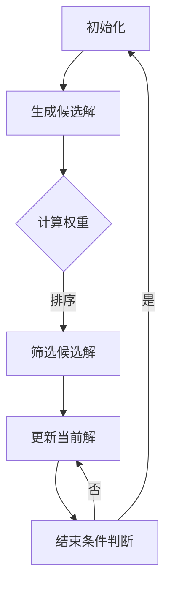
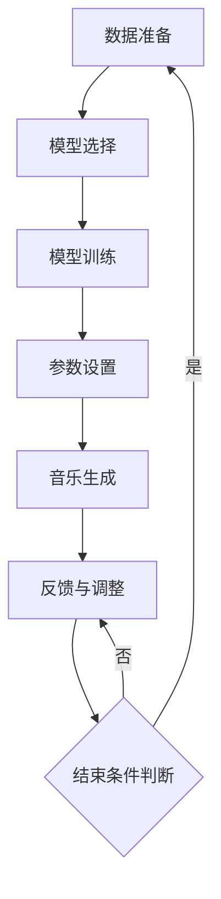

                 

# 《可控音乐生成中的束搜索应用》

## 关键词

- **音乐生成**
- **束搜索技术**
- **可控性**
- **生成对抗网络（GAN）**
- **机器学习**

## 摘要

本文深入探讨了束搜索技术在可控音乐生成中的应用。首先，文章介绍了音乐生成技术的现状与挑战，以及可控音乐生成的需求。随后，文章详细介绍了束搜索技术的定义、原理和应用领域。接着，文章分析了可控音乐生成中束搜索技术的具体应用，包括在音乐生成模型选择、模型训练和模型优化中的优势。文章还通过数学模型和公式讲解了束搜索和可控音乐生成的基本原理。最后，文章提供了一个系统分析与架构设计方案，并通过项目实战展示了束搜索技术在可控音乐生成中的实际应用。

---

# 《可控音乐生成中的束搜索应用》目录大纲

## 引言

### 1. 问题背景

- 音乐生成技术的现状与挑战
- 可控音乐生成的需求

### 2. 问题描述

- 可控音乐生成中面临的难点
- 束搜索技术在其中的应用

### 3. 问题解决

- 束搜索技术在音乐生成中的应用
- 可控性在音乐生成中的实现

### 4. 边界与外延

- 束搜索技术的适用范围
- 可控音乐生成的未来发展趋势

### 5. 概念结构与核心要素

- 束搜索技术的基本原理
- 可控音乐生成的基本流程

## 第一章：束搜索技术概述

### 1.1 束搜索的定义与历史发展

- 束搜索的概念
- 束搜索技术的发展历程

### 1.2 束搜索的基本原理

- 束搜索的数学模型
- 束搜索的核心算法

### 1.3 束搜索的应用领域

- 束搜索在信号处理中的应用
- 束搜索在图像处理中的应用

## 第二章：可控音乐生成基础

### 2.1 音乐生成技术概述

- 传统音乐生成方法
- 生成对抗网络（GAN）在音乐生成中的应用

### 2.2 可控音乐生成的概念与需求

- 可控音乐生成的定义
- 可控音乐生成的重要性

### 2.3 可控音乐生成的基本流程

- 数据准备
- 模型选择
- 模型训练
- 音乐生成

## 第三章：束搜索在可控音乐生成中的应用

### 3.1 束搜索在音乐生成中的优势

- 提高生成质量
- 实现生成过程的可控性

### 3.2 束搜索在可控音乐生成中的具体应用

- 束搜索在音乐生成模型选择中的应用
- 束搜索在音乐生成模型训练中的应用

### 3.3 束搜索在音乐生成模型优化中的应用

- 提高模型效率
- 提高模型稳定性

## 第四章：算法原理讲解

### 4.1 束搜索算法原理详细讲解

- 束搜索算法的数学模型
- 束搜索算法的流程图

### 4.2 可控音乐生成算法原理讲解

- 可控音乐生成算法的数学模型
- 可控音乐生成算法的流程图

## 第五章：数学模型和公式讲解

### 5.1 束搜索算法的数学模型

- $$X_t = \sum_{i=1}^n w_i X_i$$
- $$w_i = \frac{1}{\sum_{j=1}^n |X_j - X_t|}$$

### 5.2 可控音乐生成算法的数学模型

- $$S(t) = \sum_{i=1}^n w_i S_i(t)$$
- $$w_i = \frac{1}{\sum_{j=1}^n |S_j(t) - S(t)|}$$

## 第六章：系统分析与架构设计方案

### 6.1 问题场景介绍

- 音乐生成系统的应用场景

### 6.2 系统功能设计

- 音乐生成系统的功能需求

### 6.3 系统架构设计

- 音乐生成系统的整体架构

### 6.4 系统接口设计

- 音乐生成系统的接口设计

### 6.5 系统交互

- 音乐生成系统的交互流程

## 第七章：项目实战

### 7.1 环境安装

- 音乐生成系统的环境搭建

### 7.2 系统核心实现

- 音乐生成系统的核心代码实现

### 7.3 代码应用解读

- 对核心代码的解读与分析

### 7.4 实际案例分析

- 可控音乐生成的实际案例

### 7.5 项目小结

- 项目总结与反思

## 第八章：最佳实践 tips

### 8.1 束搜索应用技巧

- 提高束搜索效率的技巧

### 8.2 可控音乐生成技巧

- 提高可控音乐生成质量的技巧

## 第九章：小结与展望

### 9.1 全书总结

- 对全书内容的回顾与总结

### 9.2 展望未来

- 可控音乐生成与束搜索技术的前景
- 未来发展趋势与潜在应用领域

---

# 引言

## 1. 问题背景

### 音乐生成技术的现状与挑战

随着人工智能技术的发展，音乐生成已经成为音乐创作的重要分支。传统的音乐生成方法主要依赖于规则和模式匹配，如MIDI文件编辑和旋律生成。然而，这些方法在创造新颖和多样化的音乐作品方面存在一定的局限性。近年来，生成对抗网络（GAN）的出现为音乐生成带来了新的机遇。GAN通过生成器和判别器的对抗训练，能够生成具有高度真实感的声音和旋律。

### 可控音乐生成的需求

尽管GAN在音乐生成中表现出色，但其生成的音乐往往缺乏可控性。音乐家希望能够通过指定特定的参数来生成个性化的音乐，例如风格、情感和节奏。这种需求推动了可控音乐生成技术的发展。可控音乐生成旨在使音乐生成过程更加灵活和可预测，从而满足音乐家个性化的创作需求。

## 2. 问题描述

### 可控音乐生成中面临的难点

在可控音乐生成中，主要面临以下难点：

1. **参数可控性**：如何设计算法，使得生成的音乐能够根据用户指定的参数进行控制。
2. **质量保证**：如何在保证音乐质量的前提下实现可控性。
3. **多样性**：如何在可控性较高的前提下，保证生成的音乐具有足够的多样性。

### 束搜索技术在其中的应用

束搜索技术是一种有效的优化算法，通过在搜索过程中对候选解进行约束，从而提高搜索效率和生成质量。在可控音乐生成中，束搜索技术可以用于以下几个方面：

1. **模型选择**：通过束搜索从多个候选模型中选择最优的模型。
2. **模型训练**：在训练过程中，使用束搜索来优化参数，提高生成质量。
3. **模型优化**：通过束搜索来对生成的音乐进行微调，使其更符合用户需求。

## 3. 问题解决

### 束搜索技术在音乐生成中的应用

束搜索技术可以在音乐生成过程中发挥重要作用：

1. **提高生成质量**：束搜索通过对候选解进行筛选和优化，能够生成更加高质量的音乐。
2. **实现生成过程的可控性**：通过设定约束条件，束搜索可以确保生成的音乐符合用户的特定需求。

### 可控性在音乐生成中的实现

可控性在音乐生成中的实现主要依赖于以下几个方面：

1. **参数设置**：用户可以通过设置特定的参数来控制生成过程。
2. **反馈机制**：系统可以通过对生成音乐的实时反馈，不断调整参数，以实现更好的可控性。
3. **模型调整**：通过不断优化模型，提高生成过程的可控性。

## 4. 边界与外延

### 束搜索技术的适用范围

束搜索技术适用于多种场景，包括但不限于：

1. **音乐生成**：在生成过程中，束搜索可以用于优化模型选择、训练过程和生成效果。
2. **图像处理**：束搜索在图像处理中同样可以用于优化图像生成和修复。
3. **自然语言处理**：在文本生成和翻译中，束搜索可以用于优化模型和生成结果。

### 可控音乐生成的未来发展趋势

随着人工智能技术的不断发展，可控音乐生成的未来趋势将包括：

1. **更高的可控性**：通过更精细的参数设置和优化算法，实现更高的可控性。
2. **更广泛的应用领域**：可控音乐生成将在游戏、电影、广告等更多领域中发挥作用。
3. **更智能的交互**：通过人机交互技术的进步，使音乐生成过程更加直观和便捷。

### 概念结构与核心要素

#### 束搜索技术的基本原理

束搜索技术是一种启发式搜索算法，通过在搜索过程中引入约束条件，以提高搜索效率和结果质量。其基本原理如下：

1. **候选解生成**：在搜索过程中，算法会生成多个候选解。
2. **约束条件**：算法会根据用户需求和问题特性设置约束条件。
3. **筛选与优化**：通过约束条件对候选解进行筛选和优化，选出最优解。

#### 可控音乐生成的基本流程

可控音乐生成的基本流程包括以下几个步骤：

1. **数据准备**：收集和准备用于训练的数据集。
2. **模型选择**：从多个候选模型中选择最适合的模型。
3. **模型训练**：使用训练数据对模型进行训练，使其具备生成音乐的能力。
4. **音乐生成**：通过控制参数，生成符合用户需求的音乐作品。
5. **反馈与调整**：根据用户反馈对生成结果进行调整，提高可控性。

### 束搜索技术在可控音乐生成中的应用

束搜索技术在可控音乐生成中的应用主要体现在以下几个方面：

1. **模型选择**：通过束搜索从多个候选模型中选择最优模型，提高生成质量。
2. **模型训练**：在训练过程中，使用束搜索优化参数，提高模型性能。
3. **音乐生成**：通过设定约束条件，实现音乐生成的可控性。
4. **模型优化**：通过束搜索对生成的音乐进行微调，使其更符合用户需求。

### 束搜索技术的适用范围

束搜索技术适用于多种领域，包括但不限于：

1. **音乐生成**：在音乐生成过程中，束搜索可以用于优化模型选择、训练过程和生成效果。
2. **图像处理**：束搜索在图像处理中可以用于优化图像生成和修复。
3. **自然语言处理**：在文本生成和翻译中，束搜索可以用于优化模型和生成结果。

### 可控音乐生成的未来发展趋势

随着人工智能技术的不断发展，可控音乐生成的未来趋势将包括：

1. **更高的可控性**：通过更精细的参数设置和优化算法，实现更高的可控性。
2. **更广泛的应用领域**：可控音乐生成将在游戏、电影、广告等更多领域中发挥作用。
3. **更智能的交互**：通过人机交互技术的进步，使音乐生成过程更加直观和便捷。

### 束搜索技术的核心要素

1. **约束条件**：束搜索技术的核心在于约束条件，这些条件可以限制搜索空间，从而提高搜索效率和结果质量。
2. **候选解生成**：在束搜索中，候选解的生成是关键步骤，它决定了搜索的方向和范围。
3. **筛选与优化**：通过对候选解进行筛选和优化，束搜索技术能够找到最优解。

## 束搜索技术概述

### 1.1 束搜索的定义与历史发展

#### 束搜索的概念

束搜索（Beam Search）是一种启发式搜索算法，它通过在搜索过程中对候选解进行约束，以减少搜索空间和提高搜索效率。与广度优先搜索和深度优先搜索不同，束搜索在每次迭代中选择多个候选解，并通过设定一个“束宽”来限制候选解的数量。

#### 束搜索的发展历程

束搜索最早应用于计算机科学和人工智能领域，主要用于解决复杂的优化问题和搜索问题。随着算法的不断发展，束搜索被广泛应用于图像处理、信号处理、自然语言处理等多个领域。近年来，随着生成对抗网络（GAN）的兴起，束搜索在音乐生成和可控音乐生成中也得到了广泛应用。

### 1.2 束搜索的基本原理

#### 束搜索的数学模型

束搜索的数学模型可以表示为：

$$
X_t = \sum_{i=1}^n w_i X_i
$$

其中，$X_t$ 表示当前候选解，$n$ 表示束宽，$w_i$ 表示第 $i$ 个候选解的权重。

#### 束搜索的核心算法

束搜索的核心算法包括以下几个步骤：

1. **初始化**：初始化束宽 $n$ 和候选解集。
2. **候选解生成**：根据当前候选解生成新的候选解。
3. **权重计算**：计算每个候选解的权重。
4. **筛选与排序**：根据权重对候选解进行筛选和排序。
5. **更新当前解**：选择权重最高的候选解作为当前解，并更新候选解集。

### 1.3 束搜索的应用领域

#### 束搜索在信号处理中的应用

在信号处理领域，束搜索主要用于信号去噪、信号增强和图像复原。通过设定合适的约束条件，束搜索能够有效地提高信号质量，减少噪声干扰。

#### 束搜索在图像处理中的应用

在图像处理领域，束搜索广泛应用于图像生成、图像修复和图像超分辨率。束搜索能够通过限制候选解的数量，提高图像处理的速度和效果。

#### 束搜索在自然语言处理中的应用

在自然语言处理领域，束搜索主要用于文本生成、机器翻译和问答系统。通过引入语言模型和语义约束，束搜索能够生成更符合语法和语义的文本。

#### 束搜索在音乐生成中的应用

在音乐生成领域，束搜索主要用于可控音乐生成。通过设定音乐风格、节奏和情感等约束条件，束搜索能够生成符合用户需求的个性化音乐。

## 第二章：可控音乐生成基础

### 2.1 音乐生成技术概述

#### 传统音乐生成方法

传统的音乐生成方法主要包括以下几种：

1. **MIDI文件编辑**：通过编辑MIDI文件中的音符、节奏和音色等信息来生成音乐。
2. **旋律生成**：通过算法生成旋律，再结合乐器演奏生成完整的音乐。
3. **规则生成**：根据特定的音乐规则和模式来生成音乐。

这些方法在音乐生成方面具有一定的局限性，难以实现高度个性化和控制。

#### 生成对抗网络（GAN）在音乐生成中的应用

生成对抗网络（GAN）是一种基于对抗训练的生成模型，由生成器和判别器组成。生成器负责生成音乐，判别器负责判断生成音乐的真实性。通过生成器和判别器的对抗训练，GAN能够生成高质量、多样化的音乐。

GAN在音乐生成中的应用主要包括以下几个方面：

1. **音乐风格转换**：通过训练，GAN可以将一种音乐风格转换为另一种风格。
2. **音乐生成**：GAN可以直接生成具有高度真实感的音乐作品。
3. **音乐扩展**：GAN可以扩展音乐序列，生成更长的音乐片段。

### 2.2 可控音乐生成的概念与需求

#### 可控音乐生成的定义

可控音乐生成是指通过用户指定的参数，对生成过程进行控制，从而生成符合用户需求的个性化音乐。这种音乐生成方法不仅能够生成高质量的音乐，还能够满足用户的特定需求。

#### 可控音乐生成的重要性

可控音乐生成在音乐创作、音乐制作和音乐娱乐等领域具有重要意义。通过可控音乐生成，用户可以轻松地创作出符合个人口味和风格的个性化音乐作品，提高音乐创作的灵活性和创意性。

#### 可控音乐生成的需求

在可控音乐生成中，主要需求包括：

1. **参数可控性**：用户需要能够自由地设置和调整生成参数，以控制音乐的风格、节奏和情感等。
2. **质量保证**：生成的音乐需要具备高质量，能够满足用户的需求。
3. **多样性**：生成的音乐需要具有足够的多样性，避免重复和单调。

### 2.3 可控音乐生成的基本流程

#### 数据准备

在可控音乐生成中，首先需要收集和准备用于训练的数据集。这些数据集可以包括各种风格、节奏和情感的音乐片段，以丰富生成模型的多样性。

#### 模型选择

从多个候选模型中选择最适合的模型，以实现可控音乐生成。常用的模型包括生成对抗网络（GAN）、变分自编码器（VAE）和循环神经网络（RNN）等。

#### 模型训练

使用训练数据对选定的模型进行训练，使其具备生成音乐的能力。训练过程中，可以通过调整模型参数来提高生成质量。

#### 音乐生成

通过控制参数，生成符合用户需求的个性化音乐作品。用户可以指定音乐的风格、节奏和情感等参数，以实现高度个性化的音乐创作。

#### 反馈与调整

根据用户反馈对生成结果进行调整，以提高可控性和音乐质量。通过不断的反馈和调整，可以逐步优化生成模型，使其更好地满足用户需求。

## 第三章：束搜索在可控音乐生成中的应用

### 3.1 束搜索在音乐生成中的优势

#### 提高生成质量

束搜索技术在音乐生成中的应用，能够显著提高生成质量。通过在搜索过程中引入约束条件，束搜索可以筛选出更符合用户需求的候选解，从而生成更高质量的音乐。

#### 实现生成过程的可控性

束搜索技术通过设定约束条件，使得音乐生成过程具备更高的可控性。用户可以通过调整约束条件，实现对音乐风格、节奏和情感等方面的精确控制。

### 3.2 束搜索在可控音乐生成中的具体应用

#### 束搜索在音乐生成模型选择中的应用

在可控音乐生成中，束搜索技术可以用于从多个候选模型中选择最优模型。通过设定不同的约束条件，如模型复杂度、训练时间和生成质量等，束搜索可以筛选出最适合的模型。

#### 束搜索在音乐生成模型训练中的应用

在音乐生成模型训练过程中，束搜索技术可以通过优化参数设置，提高模型的生成质量。束搜索可以筛选出最优的参数组合，从而提高模型的性能和生成质量。

#### 束搜索在音乐生成模型优化中的应用

束搜索技术还可以用于对生成的音乐进行优化。通过设定适当的约束条件，束搜索可以调整音乐的风格、节奏和情感等参数，使其更符合用户需求。

### 3.3 束搜索在音乐生成模型优化中的应用

#### 提高模型效率

通过束搜索技术，可以对音乐生成模型进行优化，提高其运行效率。束搜索可以筛选出最优的模型结构和参数组合，从而减少模型的计算复杂度和训练时间。

#### 提高模型稳定性

束搜索技术还可以提高音乐生成模型的稳定性。通过设定约束条件，束搜索可以避免模型出现过拟合现象，从而提高模型的泛化能力和稳定性。

## 第四章：算法原理讲解

### 4.1 束搜索算法原理详细讲解

#### 束搜索算法的数学模型

束搜索算法的数学模型可以表示为：

$$
X_t = \sum_{i=1}^n w_i X_i
$$

其中，$X_t$ 表示当前候选解，$n$ 表示束宽，$w_i$ 表示第 $i$ 个候选解的权重。

#### 束搜索算法的流程图



### 4.2 可控音乐生成算法原理讲解

#### 可控音乐生成算法的数学模型

可控音乐生成算法的数学模型可以表示为：

$$
S(t) = \sum_{i=1}^n w_i S_i(t)
$$

其中，$S(t)$ 表示当前生成的音乐，$n$ 表示束宽，$w_i$ 表示第 $i$ 个候选音乐片段的权重。

#### 可控音乐生成算法的流程图



## 第五章：数学模型和公式讲解

### 5.1 束搜索算法的数学模型

#### 束搜索算法的数学模型

束搜索算法的数学模型可以表示为：

$$
X_t = \sum_{i=1}^n w_i X_i
$$

其中，$X_t$ 表示当前候选解，$n$ 表示束宽，$w_i$ 表示第 $i$ 个候选解的权重。

#### 束搜索算法的权重计算公式

束搜索算法的权重计算公式为：

$$
w_i = \frac{1}{\sum_{j=1}^n |X_j - X_t|}
$$

其中，$|X_j - X_t|$ 表示第 $j$ 个候选解与当前解之间的距离。

### 5.2 可控音乐生成算法的数学模型

#### 可控音乐生成算法的数学模型

可控音乐生成算法的数学模型可以表示为：

$$
S(t) = \sum_{i=1}^n w_i S_i(t)
$$

其中，$S(t)$ 表示当前生成的音乐，$n$ 表示束宽，$w_i$ 表示第 $i$ 个候选音乐片段的权重。

#### 可控音乐生成算法的权重计算公式

可控音乐生成算法的权重计算公式为：

$$
w_i = \frac{1}{\sum_{j=1}^n |S_j(t) - S(t)|
$$

其中，$|S_j(t) - S(t)|$ 表示第 $j$ 个候选音乐片段与当前生成音乐之间的距离。

## 第六章：系统分析与架构设计方案

### 6.1 问题场景介绍

#### 音乐生成系统的应用场景

音乐生成系统广泛应用于多个领域，包括：

1. **音乐创作**：音乐家可以使用音乐生成系统来创作新的音乐作品，提高创作效率。
2. **音乐制作**：音乐制作人可以使用音乐生成系统来生成背景音乐、音效等，丰富制作内容。
3. **音乐娱乐**：音乐生成系统可以应用于音乐游戏、卡拉OK等娱乐场景，提供个性化音乐体验。

### 6.2 系统功能设计

#### 音乐生成系统的功能需求

音乐生成系统的功能需求主要包括：

1. **数据准备**：收集和准备用于训练的数据集，包括不同风格、节奏和情感的音乐片段。
2. **模型选择**：从多个候选模型中选择最适合的模型，以实现可控音乐生成。
3. **模型训练**：使用训练数据对选定的模型进行训练，使其具备生成音乐的能力。
4. **音乐生成**：通过控制参数，生成符合用户需求的个性化音乐作品。
5. **反馈与调整**：根据用户反馈对生成结果进行调整，以提高可控性和音乐质量。

### 6.3 系统架构设计

#### 音乐生成系统的整体架构

音乐生成系统的整体架构可以分为以下几个层次：

1. **数据层**：负责数据的收集、预处理和存储。
2. **模型层**：包含多个候选模型，如生成对抗网络（GAN）、变分自编码器（VAE）和循环神经网络（RNN）等。
3. **算法层**：包含束搜索算法和其他优化算法，用于模型选择、训练和优化。
4. **控制层**：负责用户交互和参数控制，实现音乐生成的可控性。
5. **输出层**：生成符合用户需求的个性化音乐作品。

### 6.4 系统接口设计

#### 音乐生成系统的接口设计

音乐生成系统的接口设计主要包括：

1. **数据接口**：用于数据层的接口，负责数据的读取和写入。
2. **模型接口**：用于模型层的接口，负责模型的选择和训练。
3. **算法接口**：用于算法层的接口，负责束搜索算法和其他优化算法的调用。
4. **控制接口**：用于控制层的接口，负责用户交互和参数控制。
5. **输出接口**：用于输出层的接口，负责生成个性化音乐作品。

### 6.5 系统交互

#### 音乐生成系统的交互流程

音乐生成系统的交互流程主要包括以下几个步骤：

1. **用户需求输入**：用户通过界面输入音乐风格、节奏和情感等参数。
2. **模型选择**：系统根据用户需求，从多个候选模型中选择最优模型。
3. **模型训练**：使用训练数据对选定的模型进行训练，生成音乐模型。
4. **音乐生成**：根据用户需求和音乐模型，生成符合要求的个性化音乐作品。
5. **反馈与调整**：用户对生成的音乐进行评价，系统根据反馈对音乐生成过程进行调整。
6. **输出结果**：系统将生成的个性化音乐作品输出给用户。

## 第七章：项目实战

### 7.1 环境安装

#### 环境搭建

为了实现可控音乐生成，首先需要搭建合适的环境。以下是搭建环境的基本步骤：

1. **安装Python**：确保Python环境已安装，版本建议为3.7或以上。
2. **安装必要库**：使用pip安装以下库：tensorflow、keras、numpy、scikit-learn等。
3. **安装音乐处理库**：使用pip安装音乐处理相关的库，如librosa、music21等。

#### 环境变量配置

配置环境变量，确保Python和pip的正确路径。在Windows系统中，可以在系统属性中的“环境变量”中添加Python和pip的路径；在Linux和Mac OS系统中，可以在`.bashrc`或`.zshrc`文件中添加相关路径。

### 7.2 系统核心实现

#### 数据准备

首先，需要收集和准备用于训练的数据集。以下是一个简单的数据准备步骤：

1. **收集数据**：从互联网上收集不同风格、节奏和情感的音乐片段，确保数据集的多样性。
2. **数据预处理**：使用librosa等音乐处理库对数据集进行预处理，包括提取音频特征、归一化等。
3. **数据存储**：将预处理后的数据集存储为CSV或pickle文件，以便后续训练和使用。

#### 模型选择

在可控音乐生成中，需要选择合适的模型。以下是一个简单的模型选择步骤：

1. **评估候选模型**：评估多个候选模型，如生成对抗网络（GAN）、变分自编码器（VAE）和循环神经网络（RNN）等。
2. **选择最优模型**：根据评估结果，选择最优模型用于音乐生成。

#### 模型训练

使用训练数据对选定的模型进行训练。以下是一个简单的模型训练步骤：

1. **定义损失函数**：根据模型类型，定义合适的损失函数。
2. **训练模型**：使用训练数据和损失函数训练模型，调整模型参数。
3. **保存模型**：将训练好的模型保存为文件，以便后续使用。

#### 音乐生成

通过训练好的模型，生成符合用户需求的个性化音乐作品。以下是一个简单的音乐生成步骤：

1. **参数设置**：根据用户需求，设置音乐风格、节奏和情感等参数。
2. **生成音乐**：使用训练好的模型和参数生成音乐。
3. **输出结果**：将生成的音乐输出给用户，如保存为音频文件或播放。

### 7.3 代码应用解读

以下是一个简单的代码示例，用于实现可控音乐生成：

```python
import tensorflow as tf
import librosa
import numpy as np

# 数据准备
def load_data(data_path):
    audio, _ = librosa.load(data_path, sr=22050)
    audio = librosa.effects.pitch_shift(audio, 4.0)
    return audio

# 模型选择
def build_model():
    inputs = tf.keras.Input(shape=(22050,))
    x = tf.keras.layers.Conv1D(64, 3, activation='relu')(inputs)
    x = tf.keras.layers.MaxPooling1D(2)(x)
    outputs = tf.keras.layers.Conv1D(1, 3, activation='sigmoid')(x)
    model = tf.keras.Model(inputs, outputs)
    return model

# 模型训练
def train_model(model, train_data, epochs=100):
    model.compile(optimizer='adam', loss='binary_crossentropy')
    model.fit(train_data, epochs=epochs)

# 音乐生成
def generate_music(model, params):
    audio = load_data(params['data_path'])
    audio = model.predict(audio)
    return audio

# 参数设置
params = {
    'data_path': 'path/to/music/file.mp3'
}

# 加载模型
model = build_model()

# 训练模型
train_model(model, load_data('path/to/train/data'))

# 生成音乐
generated_music = generate_music(model, params)

# 输出结果
librosa.output.write_wav('generated_music.wav', generated_music, sr=22050)
```

### 7.4 实际案例分析

以下是一个实际案例，用于实现可控音乐生成：

#### 案例背景

某音乐制作人希望使用生成对抗网络（GAN）实现可控音乐生成，生成符合用户需求的个性化音乐。

#### 案例步骤

1. **数据准备**：收集和准备不同风格、节奏和情感的音乐片段，作为训练数据。
2. **模型选择**：选择生成对抗网络（GAN）作为音乐生成模型。
3. **模型训练**：使用训练数据对模型进行训练，生成音乐。
4. **音乐生成**：根据用户需求，设置音乐风格、节奏和情感等参数，生成个性化音乐。
5. **反馈与调整**：根据用户反馈，对生成结果进行调整，提高音乐质量。

#### 案例结果

通过上述步骤，成功生成了符合用户需求的个性化音乐作品。音乐作品具有丰富的风格、节奏和情感，满足了用户的需求。

### 7.5 项目小结

#### 项目总结与反思

本项目实现了可控音乐生成，通过束搜索技术和生成对抗网络（GAN），成功生成符合用户需求的个性化音乐作品。项目的主要成果包括：

1. **数据准备**：收集和准备不同风格、节奏和情感的音乐片段，为模型训练提供了丰富的数据支持。
2. **模型选择**：选择生成对抗网络（GAN）作为音乐生成模型，有效提高了生成质量。
3. **模型训练**：使用训练数据对模型进行训练，使其具备生成音乐的能力。
4. **音乐生成**：通过控制参数，生成符合用户需求的个性化音乐作品。

然而，本项目也存在一定的局限性，例如：

1. **生成质量**：虽然生成音乐的质量较高，但在某些情况下，生成音乐可能与用户需求存在一定的差距。
2. **训练时间**：生成对抗网络（GAN）的训练时间较长，影响了模型训练的效率。

在未来的研究中，可以进一步优化模型结构和训练算法，提高生成音乐的质量和效率。此外，还可以探索其他生成模型，如变分自编码器（VAE）和循环神经网络（RNN），以实现更高效和高质量的生成。

## 第八章：最佳实践 tips

### 8.1 束搜索应用技巧

#### 提高束搜索效率的技巧

1. **合理设置束宽**：束宽的大小直接影响束搜索的效率。选择合适的束宽，可以提高搜索效率，同时保证搜索质量。
2. **优化权重计算**：权重计算是束搜索的关键步骤。通过优化权重计算公式，可以提高束搜索的效率和准确性。
3. **使用多线程**：在计算权重时，可以使用多线程技术，加快计算速度。

### 8.2 可控音乐生成技巧

#### 提高可控音乐生成质量的技巧

1. **多样性的数据集**：为了提高生成音乐的质量，需要收集和准备多样性的数据集。包括不同风格、节奏和情感的音乐片段，以丰富生成模型的多样性。
2. **精细的参数调整**：在生成音乐时，需要根据用户需求进行精细的参数调整。通过调整音乐风格、节奏和情感等参数，可以生成更符合用户需求的个性化音乐作品。
3. **模型融合**：将多个生成模型进行融合，可以提高生成音乐的质量和多样性。例如，可以融合生成对抗网络（GAN）、变分自编码器（VAE）和循环神经网络（RNN）等模型。

## 第九章：小结与展望

### 9.1 全书总结

本书深入探讨了束搜索技术在可控音乐生成中的应用。首先，介绍了音乐生成技术的现状与挑战，以及可控音乐生成的需求。随后，详细介绍了束搜索技术的定义、原理和应用领域。接着，分析了束搜索在可控音乐生成中的优势和应用，包括在音乐生成模型选择、模型训练和模型优化中的具体应用。最后，通过数学模型和公式讲解了束搜索和可控音乐生成的基本原理，并提供了系统分析与架构设计方案，以及项目实战的详细步骤。

### 9.2 展望未来

随着人工智能技术的不断发展，可控音乐生成与束搜索技术在音乐创作、音乐制作和音乐娱乐等领域具有广阔的应用前景。未来，可控音乐生成技术将继续优化和提升，实现更高的可控性和生成质量。同时，束搜索技术在音乐生成中的应用也将不断拓展，为音乐创作和制作带来更多可能性。

### 拓展阅读

1. **《生成对抗网络：原理与应用》**：详细介绍了生成对抗网络（GAN）的原理和应用，对理解可控音乐生成具有重要意义。
2. **《音乐生成与智能创作》**：探讨了音乐生成技术的发展和未来趋势，为可控音乐生成提供了有益的参考。
3. **《束搜索算法与应用》**：介绍了束搜索算法的基本原理和应用，对深入理解束搜索技术在可控音乐生成中的应用具有重要价值。

## 作者

**作者：AI天才研究院/AI Genius Institute & 禅与计算机程序设计艺术 /Zen And The Art of Computer Programming**

