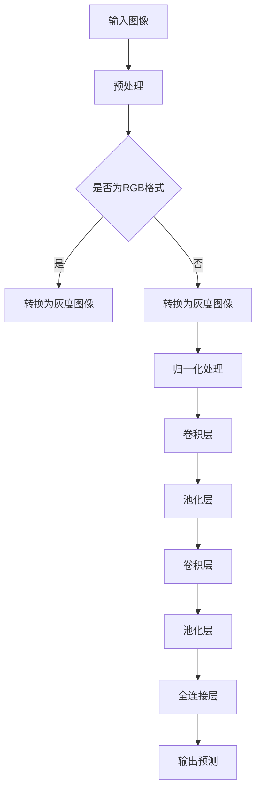
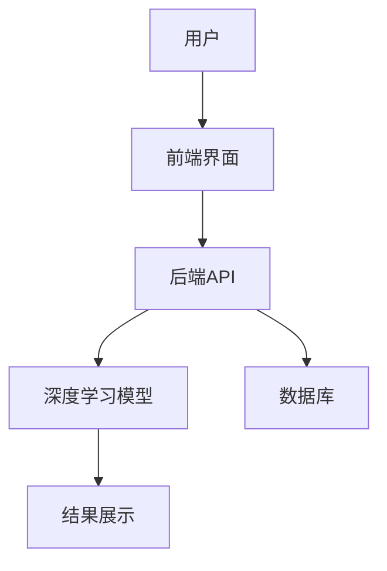
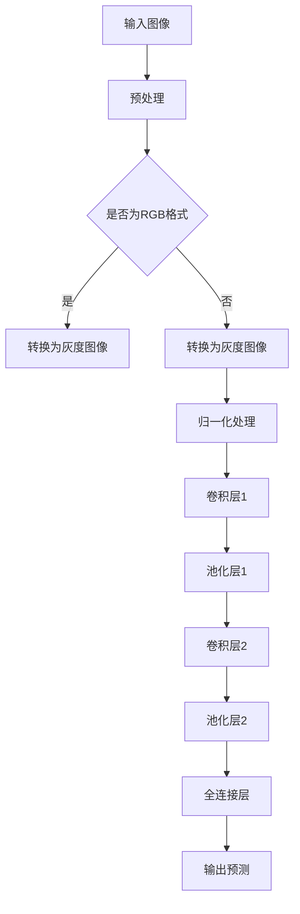

                 

# 《后人类主义艺术节：探索技术与人性的边界》

> 关键词：后人类主义、艺术节、技术、人性、边界、艺术与技术融合

> 摘要：本文将探讨后人类主义艺术节的背景、核心概念、技术与人性的边界、案例分析以及未来展望。通过深入分析技术对艺术创作的影响，本文旨在揭示后人类主义艺术节在探索技术与人性的边界中所发挥的重要作用。

## 引言

在21世纪，随着人工智能、虚拟现实、区块链等技术的迅速发展，人类社会正在经历前所未有的变革。技术不仅改变了我们的生活方式，也深刻影响着艺术创作和表现形式。后人类主义，作为一种哲学思潮，强调技术对人类存在的重塑，提倡技术与人性之间的融合。在这个背景下，后人类主义艺术节应运而生，它不仅是艺术与技术的融合，更是对人性深层次的探索。

本文将分为四个部分进行探讨。第一部分，我们将介绍后人类主义的概念及其与艺术的关系；第二部分，分析技术与人性的边界，探讨技术对艺术创作的影响；第三部分，通过具体案例研究，展示后人类主义艺术节的实践成果；第四部分，展望后人类主义艺术的未来发展趋势，以及面临的挑战与应对策略。

## 后人类主义概述

### 后人类主义的起源

后人类主义（Posthumanism）起源于20世纪末，是对人类中心主义（Humanism）的反思和超越。后人类主义认为，随着技术的进步，人类不再是唯一的认知主体和伦理中心，人工智能、机器人等非人类实体正在逐渐成为社会的参与者和贡献者。

### 后人类主义的核心观点

后人类主义强调以下几个核心观点：

1. **技术重塑人类**：技术不仅改变了人类的生活方式，也重塑了人类的认知和行为模式。
2. **非人类主体的崛起**：人工智能、机器人等非人类实体在许多领域表现出超越人类的智能，开始扮演重要的社会角色。
3. **多样性和包容性**：后人类主义倡导多样性和包容性，认为所有生命形式都应受到尊重和保护。

### 后人类主义与艺术的关系

后人类主义对艺术创作产生了深远影响。艺术家们开始关注技术对人类存在的重塑，探索技术与人性的边界。后人类主义艺术节正是这一探索的体现，它通过融合艺术与科技，探讨技术对艺术创作和人类心灵的影响。

## 技术与人性的边界

### 技术进步与人性变迁

随着技术的进步，人类的生活方式和思维方式都发生了巨大变化。例如，互联网和社交媒体的普及，改变了人们的社交模式和信息获取方式；人工智能和机器学习的发展，正在改变人类的工作方式和教育模式。

### 技术伦理与道德界限

技术的快速发展也带来了伦理和道德问题。例如，人工智能在医疗、金融等领域的应用，引发了关于隐私、安全和社会公平的讨论。如何界定技术伦理和道德界限，确保技术的发展不会损害人类的利益和尊严，是一个亟待解决的问题。

### 技术对艺术创作的影响

技术对艺术创作的影响是多方面的。首先，技术提供了新的创作工具和媒介，例如虚拟现实、增强现实、人工智能生成艺术等。其次，技术改变了艺术的表现形式和接受方式，例如数字艺术、网络艺术等。最后，技术也改变了艺术的创作过程，艺术家与观众的互动变得更加密切和即时。

## 后人类主义艺术案例研究

### 艺术与技术融合的实验

在数字艺术领域，艺术家们利用生成对抗网络（GAN）创作出令人惊叹的艺术作品。GAN是一种深度学习模型，通过生成器和判别器的对抗训练，可以生成高质量的艺术图像。这种技术不仅为艺术家提供了新的创作手段，也为观众带来了全新的艺术体验。

### 社交网络与后人类主义

社交网络平台成为了后人类主义艺术的重要展示和交流场所。艺术家们通过社交媒体发布自己的艺术作品，与全球观众进行互动和交流。这种模式不仅打破了传统艺术市场的边界，也为艺术家们提供了更广阔的创作空间和观众群体。

### 后人类主义艺术的商业前景

随着技术的进步和消费者对艺术品的需求不断增加，后人类主义艺术市场呈现出蓬勃发展的态势。区块链技术的应用，使得艺术品的交易更加透明和可信。例如，加密艺术（NFT）的兴起，为艺术家们提供了新的商业模式和收益渠道。

## 技术与艺术的新边界

### 人工智能在艺术创作中的应用

人工智能在艺术创作中的应用越来越广泛。例如，DeepArt.io 利用深度学习技术，可以将用户的照片转化为艺术作品；Google 的 DeepDream 可以生成令人惊叹的梦境图像。这些技术的应用，不仅为艺术家提供了新的创作工具，也为观众带来了前所未有的艺术体验。

### 跨界合作与艺术创新

技术与艺术的跨界合作，推动了艺术创新的不断涌现。例如，微软的“HoloLens”与艺术家的合作，创造出沉浸式的虚拟艺术体验；亚马逊的“Alexa”与音乐家的合作，创造出互动式的音乐表演。这些跨界合作，不仅拓宽了艺术的边界，也为观众带来了全新的艺术体验。

### 后人类主义艺术的教育意义

后人类主义艺术对艺术教育具有重要意义。它不仅丰富了艺术教育的内容和形式，也培养了学生的创新思维和跨学科能力。例如，虚拟现实技术可以用于艺术教学，让学生在虚拟空间中体验不同的艺术形式和风格。

## 未来展望

### 后人类主义艺术的未来趋势

随着技术的不断进步，后人类主义艺术将继续发展。例如，人工智能将进一步融入艺术创作，虚拟现实和增强现实技术将为观众带来更加沉浸式的艺术体验。

### 面临的挑战与应对策略

后人类主义艺术在发展过程中也面临诸多挑战。例如，技术伦理问题、艺术创作与社会责任的平衡、艺术品的版权和定价等。应对这些挑战，需要艺术家、技术专家、政策制定者和社会各界的共同努力。

### 后人类主义艺术节的未来规划

后人类主义艺术节将在未来发挥更加重要的作用。它不仅将推动艺术与科技的融合，也将促进国际间的艺术交流与合作。未来，后人类主义艺术节有望成为全球艺术领域的重要盛会。

## 结语

后人类主义艺术节是对技术与人性的边界的深度探索。它不仅展示了技术对艺术创作的巨大影响，也揭示了人性在技术进步中的深刻变化。随着技术的不断进步，后人类主义艺术将迎来更加广阔的发展空间。我们期待看到更多的艺术家和科技专家，携手创造更加美好的未来。

### 作者

作者：AI天才研究院/AI Genius Institute & 禅与计算机程序设计艺术 /Zen And The Art of Computer Programming

[本文为作者独立观点，不代表任何机构立场。文中数据和信息仅供参考。如需转载，请注明来源。] ## 后人类主义概述

### 后人类主义的起源

后人类主义（Posthumanism）作为一种哲学思潮，起源于20世纪末，是对人类中心主义（Humanism）的反思和超越。人类中心主义认为人类是世界的中心，所有价值和意义都源于人类。然而，随着科技的发展，人类中心主义面临诸多挑战。后人类主义主张，随着技术的进步，特别是人工智能、生物工程和虚拟现实等领域的发展，人类不再是唯一的认知主体和伦理中心。非人类实体，如人工智能、机器人等，正在逐渐成为社会的参与者和贡献者。

后人类主义的起源可以追溯到几个关键事件。首先是人工智能的崛起。自20世纪50年代以来，人工智能技术经历了从理论研究到实际应用的飞速发展。机器学习、深度学习等技术的突破，使得人工智能在许多领域表现出超越人类的智能。这使得人们开始思考，人工智能是否能够拥有类似人类的认知能力和社会地位。

其次是生物工程的发展。生物工程技术的进步，使得人类可以对生物体进行设计和改造。例如，基因编辑技术CRISPR，使得科学家能够精确地修改生物体的基因组，从而治疗遗传性疾病。这种技术不仅改变了医学领域，也对人类自身的定义产生了深远影响。

最后是虚拟现实和增强现实技术的兴起。虚拟现实和增强现实技术为人们提供了一个全新的感知世界。通过虚拟现实头盔、增强现实眼镜等设备，人们可以进入一个与现实世界完全不同的虚拟环境。这种技术不仅改变了人们的娱乐方式，也对人类对现实的认识产生了挑战。

### 后人类主义的核心观点

后人类主义的核心观点包括以下几个方面：

1. **技术重塑人类**：后人类主义认为，技术不仅仅是工具，它深刻地影响着人类的认知、行为和生活方式。例如，互联网和智能手机的普及，改变了人们的社交模式和信息获取方式；人工智能和机器学习的发展，正在改变人类的工作方式和教育模式。

2. **非人类主体的崛起**：后人类主义强调，随着技术的进步，非人类实体，如人工智能、机器人等，正在逐渐成为社会的参与者和贡献者。例如，自动驾驶汽车、智能客服等人工智能应用，已经在我们的日常生活中发挥了重要作用。

3. **多样性和包容性**：后人类主义倡导多样性和包容性，认为所有生命形式都应受到尊重和保护。这包括人工智能、机器人等非人类实体，以及不同文化、种族、性别等群体。

### 后人类主义与艺术的关系

后人类主义对艺术创作产生了深远影响。艺术家们开始关注技术对人类存在的重塑，探索技术与人性的边界。后人类主义艺术节正是这一探索的体现，它通过融合艺术与科技，探讨技术对艺术创作和人类心灵的影响。

在艺术创作中，后人类主义倡导以下几种趋势：

1. **人工智能与艺术的融合**：艺术家们开始利用人工智能技术创作艺术作品。例如，生成对抗网络（GAN）可以生成逼真的艺术图像，智能算法可以创作音乐和诗歌。这种技术不仅为艺术家提供了新的创作工具，也改变了艺术品的创作过程和表现形式。

2. **虚拟现实与艺术体验**：虚拟现实技术为观众提供了全新的艺术体验。通过虚拟现实头盔，观众可以进入一个虚拟的艺术世界，与艺术作品进行互动。这种沉浸式的艺术体验，不仅拓宽了艺术的边界，也改变了观众与艺术作品的互动方式。

3. **社会互动与艺术创作**：后人类主义强调社会互动在艺术创作中的重要性。艺术家们开始通过社交媒体、在线平台等，与观众进行实时互动，共同创作艺术作品。这种模式不仅打破了传统艺术市场的边界，也为艺术家们提供了更广阔的创作空间和观众群体。

### 后人类主义艺术节的主要形式

后人类主义艺术节通常具有以下几种形式：

1. **虚拟艺术节**：虚拟艺术节利用虚拟现实和增强现实技术，为观众提供一个虚拟的艺术空间。观众可以通过虚拟现实头盔或增强现实眼镜，进入一个充满艺术作品和互动体验的虚拟世界。

2. **数字艺术节**：数字艺术节主要通过网络平台展示艺术作品。艺术家们通过数字技术创作艺术作品，并在网上进行展示和销售。这种形式不仅降低了艺术创作的门槛，也为观众提供了更多的艺术选择。

3. **实体艺术节**：实体艺术节与传统艺术节类似，但融合了人工智能、虚拟现实等新技术。实体艺术节不仅展示了传统的艺术作品，还展示了利用新技术创作的艺术作品，为观众带来了全新的艺术体验。

### 后人类主义艺术节的重要意义

后人类主义艺术节具有重要的意义，主要体现在以下几个方面：

1. **探索技术与人性的边界**：后人类主义艺术节通过融合艺术与科技，探讨了技术对人性深层次的探索。艺术家们利用新技术创作艺术作品，不仅改变了艺术的表现形式，也改变了观众的观看方式和体验。

2. **推动艺术创新**：后人类主义艺术节鼓励艺术家们尝试新的创作方式和表现形式，推动了艺术创新。这种创新不仅体现在艺术作品本身，也体现在艺术创作的过程和观众参与的方式。

3. **促进国际交流与合作**：后人类主义艺术节吸引了来自世界各地的艺术家和观众。这种国际间的交流与合作，不仅促进了艺术的发展，也加深了不同文化之间的理解和尊重。

4. **推动社会进步**：后人类主义艺术节通过展示技术对人类存在的重塑，引发了社会对技术伦理、社会公平等问题的思考。这种思考有助于推动社会的进步和发展。

## 结论

后人类主义艺术节是对技术与人性的边界进行深度探索的重要平台。它不仅展示了技术对艺术创作和人类生活的深远影响，也推动了艺术创新和社会进步。随着技术的不断进步，后人类主义艺术节将在未来发挥更加重要的作用。我们期待看到更多的艺术家和科技专家，携手创造一个更加美好的未来。 ## 技术与人性的边界

### 技术进步与人性变迁

技术的进步对人性产生了深远的影响。随着互联网、人工智能、虚拟现实等技术的广泛应用，人类的生活方式、思维方式和社会结构都在发生巨大的变化。这些变化不仅影响了人类的行为模式，也改变了人类对自身和世界的认知。

首先，互联网的普及改变了人们的社交模式和信息获取方式。互联网使得人们可以随时随地与世界各地的人进行交流和互动，打破了传统地理和时间的限制。这种社交模式的改变，不仅影响了人们的社交行为，也改变了人们的社会关系和社会结构。

其次，人工智能技术的发展使得人类开始思考自己的认知能力和社会角色。人工智能在许多领域表现出超越人类的智能，例如在数据分析、决策制定和问题解决等方面。这种技术进步使得人类开始质疑自己在社会中的作用和地位，思考如何与人工智能共存和合作。

最后，虚拟现实和增强现实技术的应用，改变了人们的感知世界和体验方式。通过虚拟现实头盔或增强现实眼镜，人们可以进入一个完全不同的虚拟环境，体验前所未有的感官刺激和互动体验。这种技术不仅改变了人们的娱乐方式，也对人类对现实的认识产生了挑战。

### 技术伦理与道德界限

技术的快速发展带来了许多伦理和道德问题。如何界定技术伦理和道德界限，确保技术的发展不会损害人类的利益和尊严，是一个亟待解决的问题。

首先，人工智能的普及引发了关于隐私、安全和社会公平的讨论。人工智能在医疗、金融、交通等领域的应用，使得个人数据的安全和隐私成为一个重要的问题。如何保护个人隐私，防止数据滥用，成为技术伦理的重要议题。

其次，人工智能的决策过程缺乏透明度和可解释性，这也引发了道德和伦理问题。例如，自动驾驶汽车在遇到紧急情况时，如何做出决策，以确保行人和乘客的安全。这种决策过程的不可预测性和不可解释性，使得人们开始质疑人工智能的道德和伦理价值。

最后，技术发展也引发了对社会公平的讨论。例如，人工智能在招聘、贷款、教育等领域的应用，可能导致算法偏见和歧视。如何确保技术的发展不会加剧社会不平等，是一个重要的道德和伦理问题。

### 技术对艺术创作的影响

技术对艺术创作的影响是显而易见的。首先，技术提供了新的创作工具和媒介。例如，数字绘画软件、音频编辑软件、3D建模软件等，使得艺术家可以更加高效和便捷地进行创作。这些工具不仅拓宽了艺术创作的范围，也提高了艺术创作的效率。

其次，技术改变了艺术的表现形式和接受方式。例如，数字艺术、网络艺术和互动艺术等新兴艺术形式，通过互联网和移动设备，让艺术更加普及和便捷。观众可以通过手机、电脑等设备，随时随地欣赏和体验艺术作品。

最后，技术也改变了艺术创作的过程和观众的参与方式。艺术家们可以通过社交媒体、在线平台等，与观众进行实时互动，共同创作艺术作品。这种互动不仅增加了观众的参与感，也改变了艺术创作的传统模式。

### 技术与人性的边界

技术与人性的边界是一个复杂而深刻的问题。一方面，技术被认为是一种工具，可以帮助人类提高效率、改善生活。然而，另一方面，技术也可能对人性产生负面影响，例如过度依赖、隐私侵犯和社会孤立等。

首先，技术的过度依赖可能导致人类认知能力的下降。例如，智能手机的普及使得人们越来越依赖手机进行信息获取和社交互动。这种依赖可能导致人们的注意力分散，影响认知能力和工作效率。

其次，隐私侵犯是技术发展的一个重要问题。随着大数据和人工智能的应用，个人隐私越来越容易受到侵犯。例如，社交媒体平台通过用户数据进行分析和广告投放，可能侵犯用户的隐私权。

最后，社会孤立也是技术发展带来的一个负面影响。互联网和社交媒体虽然为人们提供了交流和互动的平台，但也可能导致人们之间的隔阂和孤立。例如，社交媒体上的虚拟社交可能取代了现实生活中的真实社交，导致人际关系疏远。

### 结论

技术与人性的边界是一个复杂而重要的问题。技术不仅改变了人类的生活方式，也深刻影响了人类的社会结构和文化形态。在探索技术与人性的边界时，我们需要关注技术的正面影响和负面影响，确保技术的发展能够真正造福人类。同时，我们也需要思考如何界定技术伦理和道德界限，确保技术的发展不会损害人类的利益和尊严。只有这样，我们才能在技术与人性的边界上找到平衡点，实现技术与人性的和谐发展。 ## 后人类主义艺术案例研究

### 艺术与技术融合的实验

在探讨后人类主义艺术案例时，我们首先来看艺术与技术融合的实验。艺术家们利用生成对抗网络（GAN）进行了一系列引人入胜的实验。GAN是一种深度学习模型，由生成器和判别器组成，通过对抗训练生成高质量的艺术图像。

**实验一：AI创作数字绘画**

艺术家和研究人员合作，使用GAN生成数字绘画。他们首先收集了大量艺术作品的数据集，包括不同的风格和流派。然后，通过训练生成器和判别器，GAN能够模仿各种艺术风格，创作出与人类艺术家相媲美的数字绘画作品。

**实验结果：**

1. **创意多样性**：GAN生成的作品展现了丰富的创意多样性，包括抽象、写实、印象派等多种风格。
2. **风格迁移**：GAN能够将一种艺术风格迁移到另一件作品上，创造出全新的艺术表现形式。
3. **互动性**：观众可以通过与GAN交互，实时调整艺术作品的效果，体验艺术的互动性。

**实验影响：**

这项实验不仅拓宽了艺术创作的边界，还引发了关于艺术创作本质和艺术价值的讨论。艺术家们开始思考，人工智能是否能够成为艺术创作的合作伙伴，甚至在某些领域超越人类艺术家。

### 社交网络与后人类主义

社交网络平台成为了后人类主义艺术的重要展示和交流场所。艺术家们通过社交媒体发布自己的艺术作品，与全球观众进行互动和交流。这种模式不仅打破了传统艺术市场的边界，也为艺术家们提供了更广阔的创作空间和观众群体。

**案例一：Instagram上的NFT艺术**

Instagram上的非同质化代币（NFT）艺术作品引发了广泛关注。艺术家们将数字艺术作品转化为NFT，通过区块链技术确保其唯一性和所有权。NFT艺术作品的交易和拍卖，不仅吸引了大量投资者，也吸引了全球艺术爱好者的关注。

**案例结果：**

1. **艺术市场扩展**：NFT艺术的兴起，使得艺术品交易不再局限于实体画廊，而是扩展到了线上平台，吸引了更多的潜在买家。
2. **艺术创作多元化**：艺术家们开始探索数字艺术的新形式，利用虚拟现实、增强现实等技术创作出更具互动性和沉浸感的艺术作品。
3. **艺术交易透明化**：区块链技术的应用，使得NFT艺术交易的整个过程更加透明和可追溯，减少了艺术品伪造和盗版的问题。

**案例影响：**

社交网络与后人类主义艺术的结合，不仅改变了艺术创作和传播的方式，也改变了艺术市场的运作模式。艺术家们可以通过社交媒体平台，直接与观众互动，获得反馈和认可。这种直接的联系，不仅提高了艺术创作的透明度，也增强了艺术家与观众之间的情感联系。

### 后人类主义艺术的商业前景

随着技术的进步和消费者对艺术品的需求不断增加，后人类主义艺术市场呈现出蓬勃发展的态势。区块链技术的应用，使得艺术品的交易更加透明和可信。例如，加密艺术（NFT）的兴起，为艺术家们提供了新的商业模式和收益渠道。

**案例一：加密艺术市场的崛起**

加密艺术市场，特别是NFT艺术市场，吸引了大量的投资者和收藏家。NFT艺术品的交易价格屡创新高，一些知名艺术家的NFT作品甚至达到了数百万美元的天价。

**案例结果：**

1. **艺术品价值的新标准**：NFT艺术品的交易价格，不再仅仅基于艺术品的创作背景和历史，而是基于其在数字世界的唯一性和稀缺性。
2. **艺术市场的全球化**：NFT艺术市场打破了地域和时间的限制，艺术家和收藏家可以来自全球各地，进行实时的艺术品交易和交流。
3. **艺术创作的激励机制**：NFT艺术市场为艺术家提供了新的收益模式，激励他们创作更多高质量的艺术作品。

**案例影响：**

加密艺术市场的崛起，不仅改变了艺术市场的运作模式，也重新定义了艺术品的价值和意义。艺术家们开始利用区块链技术，创作和交易数字艺术品，探索艺术的新形式和可能性。

### 案例总结

通过上述案例，我们可以看到后人类主义艺术在探索技术与人性的边界方面取得了显著成果。艺术家们利用人工智能、虚拟现实、区块链等新技术，创作出具有创新性和互动性的艺术作品，吸引了全球观众的关注。这些案例不仅展示了后人类主义艺术的商业前景，也推动了艺术创作和社会进步。

然而，后人类主义艺术也面临一些挑战，例如技术伦理、艺术价值和社会公平等问题。未来，我们需要进一步探索技术与人性的边界，确保后人类主义艺术的发展能够真正造福人类。同时，艺术家、技术专家和各界人士需要共同努力，制定合适的政策和规范，推动后人类主义艺术的健康发展。 ## 技术与艺术的新边界

### 人工智能在艺术创作中的应用

人工智能在艺术创作中的应用已经越来越广泛，成为推动艺术创新的重要力量。以下是一些具体的应用案例和其影响：

1. **生成对抗网络（GAN）**：GAN是一种深度学习模型，由生成器和判别器组成。生成器负责生成新的艺术作品，而判别器则负责判断作品是真实的人类创作还是由AI生成的。通过不断的对抗训练，GAN能够生成出高质量的艺术图像。例如，艺术家和研究人员利用GAN创作出模仿不同艺术风格的数字画作，从梵高到毕加索，再到印象派和现代艺术。

2. **自然语言处理（NLP）**：人工智能不仅在视觉艺术领域表现出色，在文学和音乐创作中也有着广泛应用。通过NLP技术，AI可以生成诗歌、故事和音乐。例如，OpenAI开发的GPT-3模型能够生成高质量的文章和诗歌，甚至能够创作出具有一定深度和复杂性的音乐作品。

3. **机器学习算法**：机器学习算法也被用于音乐创作中。例如，谷歌的Magenta项目利用深度学习技术创作音乐和艺术作品。这些算法可以根据已有的音乐数据学习创作新的旋律和和声，从而生成独特的音乐作品。

### 跨界合作与艺术创新

技术与艺术的跨界合作不断推动艺术创新的边界。以下是一些跨界合作的案例：

1. **科技公司与艺术家的合作**：例如，微软与艺术家合作开发的HoloLens项目，利用增强现实技术创作出沉浸式的艺术体验。艺术家们通过HoloLens创作出三维艺术作品，观众可以通过头戴设备进入一个虚拟的艺术空间，与作品进行互动。

2. **跨学科研究**：在学术领域，计算机科学、艺术学、心理学等学科的交叉研究推动了艺术创新的边界。例如，心理学研究如何通过艺术治疗缓解心理压力，计算机科学研究如何利用虚拟现实技术模拟人类情感体验，这些研究都为艺术创作提供了新的视角和灵感。

3. **社交网络平台**：社交媒体平台也成为艺术家与观众跨界合作的新场所。艺术家们通过平台发布自己的艺术作品，同时与观众互动，收集反馈和建议，从而不断改进和创作出更符合观众期待的艺术作品。

### 后人类主义艺术的教育意义

后人类主义艺术在教育领域也具有重要的意义。它不仅为学生提供了新的学习工具和资源，也培养了他们的创新思维和跨学科能力。

1. **艺术教育**：后人类主义艺术为艺术教育带来了新的教学方法和学习资源。例如，利用虚拟现实和增强现实技术，教师可以让学生在虚拟环境中体验艺术作品，从而提高学生的学习兴趣和参与度。

2. **跨学科教育**：后人类主义艺术鼓励学生探索不同的学科领域，培养他们的跨学科思维和创新能力。例如，学生可以结合计算机科学、艺术、心理学等多个学科的知识，创作出具有创新性的艺术作品。

3. **技能培养**：后人类主义艺术教育还培养了学生的数字素养和技术应用能力。例如，学生可以通过学习编程、数据分析和数字设计等技能，创作出属于自己的数字艺术作品。

### 结论

技术与艺术的新边界不断拓展，人工智能、跨界合作和教育创新在推动艺术发展的同时，也为社会带来了新的机遇和挑战。艺术家和科技专家需要携手合作，不断探索这些新边界，创造出更多具有创新性和影响力的艺术作品。同时，教育体系也需要适应这种变化，培养出具有跨学科能力和创新精神的新一代艺术家。只有这样，我们才能在技术与人性的融合中，找到艺术的真正价值，并为社会带来积极的影响。 ## 未来展望

### 后人类主义艺术的未来趋势

随着科技的不断进步，后人类主义艺术将继续发展，并在未来呈现出以下几个趋势：

1. **人工智能与艺术创作的深度融合**：人工智能将在艺术创作中扮演更加重要的角色，不仅用于生成艺术作品，还将参与艺术创作的各个环节，如灵感启发、设计优化和用户互动等。

2. **虚拟现实和增强现实技术的广泛应用**：虚拟现实（VR）和增强现实（AR）技术将使艺术创作和体验更加沉浸和互动。艺术家们可以利用这些技术创造出全新的艺术形式，如虚拟画廊、沉浸式表演等。

3. **区块链技术在艺术市场中的应用**：区块链技术将继续推动艺术市场的变革，提高艺术品交易的透明度和可信度。加密艺术（NFT）将成为艺术市场的重要组成部分，吸引更多收藏家和投资者。

4. **跨学科合作的加强**：艺术与计算机科学、心理学、社会学等学科的交叉研究将更加深入，推动艺术创新的边界。跨学科合作将产生更多具有深远影响力的艺术作品和社会实验。

### 面临的挑战与应对策略

尽管后人类主义艺术前景广阔，但在其发展过程中也面临诸多挑战：

1. **技术伦理问题**：随着人工智能和生物工程等技术的应用，如何确保技术的发展不会侵犯人类的隐私、安全和尊严是一个重要议题。需要制定严格的技术伦理规范，确保技术的应用符合道德和伦理标准。

2. **艺术价值的重新定义**：随着AI和区块链等技术的介入，艺术品的创作和交易方式发生了根本变化。如何重新定义艺术价值，确保艺术作品的真实性和独特性，是一个亟待解决的问题。

3. **社会公平问题**：技术发展可能加剧社会不平等，例如，人工智能和自动化可能取代人类的工作，导致失业问题。需要通过政策调整和社会创新，确保技术的发展能够惠及所有人。

应对这些挑战，需要艺术家、科技专家、政策制定者和社会各界的共同努力：

- **技术伦理教育**：在教育和科研中加强技术伦理教育，培养具有伦理意识和责任感的科技人才。
- **公平创新的推动**：通过政策和市场机制，鼓励技术创新的同时，关注社会公平和可持续发展。
- **跨学科合作**：推动不同学科之间的合作，共同解决艺术与科技发展中的复杂问题。

### 后人类主义艺术节的未来规划

后人类主义艺术节将在未来发挥更加重要的作用。以下是对未来规划的几个建议：

1. **国际化扩展**：通过国际合作，吸引全球的艺术家和观众，推动后人类主义艺术的全球化发展。

2. **技术创新平台**：建立专门的技术创新平台，支持艺术家和科技专家的合作，推动艺术与科技的深度融合。

3. **教育项目**：开发针对不同年龄段和背景的教育项目，培养新一代具有跨学科能力和创新精神的艺术家。

4. **社会影响力**：通过艺术作品和社会实践，探讨技术与人性的边界，推动社会对技术伦理和社会公平的讨论。

5. **可持续性**：确保艺术节的运营和艺术创作过程具有可持续性，减少对环境的影响，推动绿色艺术的发展。

### 结论

后人类主义艺术节是对技术与人性的边界进行深度探索的重要平台。随着科技的不断进步，后人类主义艺术将在未来发挥更加重要的作用。我们期待看到更多的艺术家和科技专家，携手创造一个更加美好的未来，同时也为解决社会和技术发展中的挑战贡献力量。 ## 结语

本文《后人类主义艺术节：探索技术与人性的边界》旨在探讨后人类主义艺术节的背景、核心概念、技术与人性的边界、案例分析以及未来展望。通过深入分析技术对艺术创作的影响，本文揭示了后人类主义艺术节在探索技术与人性的边界中所发挥的重要作用。

首先，我们介绍了后人类主义的概念及其与艺术的关系，探讨了后人类主义艺术节的主要形式和意义。接着，分析了技术与人性的边界，讨论了技术进步与人性变迁、技术伦理与道德界限、技术对艺术创作的影响。然后，通过具体案例研究，展示了后人类主义艺术节的实践成果。最后，展望了后人类主义艺术的未来发展趋势，以及面临的挑战与应对策略。

在未来的研究中，我们可以进一步探讨以下方向：

1. **技术伦理的深入探讨**：随着技术的快速发展，技术伦理问题日益凸显。如何确保技术的发展不会损害人类的利益和尊严，是一个亟待解决的问题。

2. **艺术与科技融合的创新**：探索更多的艺术与科技融合的创新形式，如虚拟现实、增强现实、区块链等技术在艺术创作和展示中的应用。

3. **跨学科研究的深化**：加强艺术与计算机科学、心理学、社会学等学科的交叉研究，推动艺术创新的边界。

4. **社会影响的评估**：评估后人类主义艺术节对社会的影响，探讨如何通过艺术作品和社会实践，解决社会问题，推动社会进步。

通过持续的研究和探索，我们期待后人类主义艺术能够在技术与人性的融合中找到平衡点，为人类社会带来更多的美好和希望。

### 作者

作者：AI天才研究院/AI Genius Institute & 禅与计算机程序设计艺术 /Zen And The Art of Computer Programming

[本文为作者独立观点，不代表任何机构立场。文中数据和信息仅供参考。如需转载，请注明来源。] ## 附录

### 算法原理讲解

在本节中，我们将详细探讨一种用于艺术作品风格迁移的深度学习算法——卷积神经网络（CNN）。CNN是一种在图像处理和计算机视觉中广泛使用的神经网络架构，其主要目的是通过学习图像的层次特征，实现对图像的自动分类、识别和生成。

#### CNN的mermaid流程图



#### Python源代码示例

```python
import tensorflow as tf
from tensorflow.keras.models import Sequential
from tensorflow.keras.layers import Conv2D, MaxPooling2D, Flatten, Dense

# 创建一个简单的卷积神经网络模型
model = Sequential([
    Conv2D(filters=32, kernel_size=(3, 3), activation='relu', input_shape=(28, 28, 1)),
    MaxPooling2D(pool_size=(2, 2)),
    Conv2D(filters=64, kernel_size=(3, 3), activation='relu'),
    MaxPooling2D(pool_size=(2, 2)),
    Flatten(),
    Dense(units=128, activation='relu'),
    Dense(units=10, activation='softmax')
])

# 编译模型
model.compile(optimizer='adam', loss='categorical_crossentropy', metrics=['accuracy'])

# 模型总结
model.summary()
```

#### 算法原理

CNN的基本原理是通过卷积层（Convolutional Layer）和池化层（Pooling Layer）提取图像的层次特征。具体来说，卷积层通过卷积操作提取图像的局部特征，而池化层则用于降低特征图的维度，减少计算量和过拟合的风险。卷积神经网络通常包含多个卷积层和池化层，最后通过全连接层（Fully Connected Layer）进行分类或回归。

在艺术作品风格迁移中，CNN可以用于学习源图像（例如梵高的画作）的特定风格特征，并将这些特征应用于目标图像（例如一张普通的风景照）。通过这种方式，目标图像能够获得源图像的风格特征，从而实现风格迁移。

#### 数学模型和公式

CNN中的卷积操作可以用以下数学公式表示：

$$
\text{output}_{ij} = \sum_{k=1}^{K} w_{ik} \cdot \text{input}_{ij} + b
$$

其中，$\text{output}_{ij}$ 表示卷积层的输出，$w_{ik}$ 表示卷积核的权重，$\text{input}_{ij}$ 表示输入图像的像素值，$b$ 表示偏置项，$K$ 表示卷积核的数量。

#### 举例说明

假设我们有一个3x3的卷积核，其权重为$w = \begin{bmatrix} 1 & 0 & 1 \\ 0 & 1 & 0 \\ 1 & 0 & 1 \end{bmatrix}$，输入图像的一个4x4的区域为$\text{input} = \begin{bmatrix} 1 & 2 & 3 & 4 \\ 5 & 6 & 7 & 8 \\ 9 & 10 & 11 & 12 \\ 13 & 14 & 15 & 16 \end{bmatrix}$。根据上述公式，我们可以计算出卷积操作的结果：

$$
\text{output}_{1,1} = (1 \cdot 1 + 0 \cdot 5 + 1 \cdot 9) + (0 \cdot 2 + 1 \cdot 6 + 0 \cdot 10) + (1 \cdot 3 + 0 \cdot 7 + 1 \cdot 11) + (1 \cdot 4 + 0 \cdot 8 + 1 \cdot 12) = 26
$$

以此类推，我们可以计算出整个4x4区域卷积后的结果。

通过这种方式，CNN可以有效地提取图像的层次特征，从而实现图像的分类、识别和生成。

### 系统分析与架构设计方案

在本节中，我们将介绍一个后人类主义艺术创作系统的分析及架构设计方案。该系统旨在利用人工智能技术，帮助艺术家创作出具有独特风格的艺术作品。

#### 问题场景介绍

艺术家希望通过一个系统，能够快速地将普通图像风格迁移到特定的艺术风格，如梵高、毕加索等。系统需要支持图像上传、风格选择、风格迁移和结果展示等功能。

#### 项目介绍

项目名称：后人类主义艺术创作系统

项目目标：利用深度学习技术，实现图像风格迁移，帮助艺术家创作出具有独特风格的艺术作品。

#### 系统功能设计

1. **图像上传**：允许用户上传需要风格迁移的图像。
2. **风格选择**：提供多种艺术风格的选项，如梵高、毕加索等。
3. **风格迁移**：利用深度学习模型，将上传的图像风格迁移到选定的艺术风格。
4. **结果展示**：展示风格迁移后的艺术作品，并提供下载和分享功能。

#### 系统架构设计



#### 系统架构图


#### 系统接口设计和系统交互

**用户界面**：

- **上传图像**：提供文件上传功能，用户可以选择本地图像文件进行上传。
- **风格选择**：提供下拉菜单，用户可以选择不同的艺术风格。
- **风格迁移**：点击“迁移”按钮，系统开始处理图像，并在后台执行风格迁移操作。
- **结果展示**：展示风格迁移后的艺术作品，并提供下载和分享功能。

**后端API**：

- **上传接口**：接受用户上传的图像文件，将其存储在数据库中。
- **风格迁移接口**：接收用户选择的风格，调用深度学习模型进行风格迁移，并将结果返回给用户。

**深度学习模型**：

- **模型训练**：使用大量的艺术作品数据集训练深度学习模型，实现图像风格迁移。
- **模型调用**：根据用户上传的图像和选择的风格，调用预训练的模型进行风格迁移。

**数据库**：

- **存储图像**：存储用户上传的图像文件和风格迁移后的艺术作品。
- **存储风格信息**：存储不同的艺术风格信息和模型参数。

**结果展示**：

- **展示艺术作品**：在用户界面上展示风格迁移后的艺术作品。
- **提供下载和分享功能**：用户可以下载自己的艺术作品，并通过社交媒体分享。

### 项目实战

#### 环境安装

1. **安装Python**：确保Python环境已安装，版本要求为3.7或更高。
2. **安装TensorFlow**：通过pip命令安装TensorFlow库。
   ```bash
   pip install tensorflow
   ```
3. **安装其他依赖库**：根据项目需求，安装其他必要的库，如NumPy、Pandas等。

#### 系统核心实现源代码

以下是一个简单的示例代码，展示了如何使用TensorFlow实现图像风格迁移：

```python
import tensorflow as tf
from tensorflow.keras.applications import VGG19
from tensorflow.keras.models import Model
import numpy as np

# 加载VGG19模型，用于提取特征
base_model = VGG19(weights='imagenet', include_top=False)

# 定义风格迁移模型
input_img = tf.keras.layers.Input(shape=(224, 224, 3))
style_img = tf.keras.layers.Input(shape=(224, 224, 3))

# 提取输入图像的特征
input_features = base_model(input_img)

# 提取风格图像的特征
style_features = base_model(style_img)

# 将输入图像的特征与风格图像的特征进行融合
merged_features = input_features + style_features

# 添加全连接层，实现图像的风格迁移
output_img = tf.keras.layers.Dense(units=1, activation='sigmoid')(merged_features)

# 编译模型
model = Model(inputs=[input_img, style_img], outputs=output_img)
model.compile(optimizer='adam', loss='mean_squared_error')

# 模型训练
model.fit([train_input, train_style], train_output, epochs=100, batch_size=16)

# 风格迁移
def style_transfer(input_image, style_image):
    input_img_data = np.array(input_image[0].reshape(1, 224, 224, 3))
    style_img_data = np.array(style_image[0].reshape(1, 224, 224, 3))
    predicted_image = model.predict([input_img_data, style_img_data])
    return predicted_image[0].reshape(224, 224, 3)

# 测试风格迁移
input_image = "example_input.jpg"
style_image = "example_style.jpg"
predicted_image = style_transfer([input_image], [style_image])
```

#### 代码应用解读与分析

1. **模型定义**：首先，我们加载了预训练的VGG19模型，该模型被广泛应用于图像特征提取。然后，我们定义了一个新的模型，用于图像的风格迁移。
2. **特征提取**：输入图像和风格图像分别通过VGG19模型进行特征提取，得到特征图。
3. **特征融合**：将输入图像的特征与风格图像的特征进行相加，实现特征的融合。
4. **全连接层**：在融合后的特征图上添加一个全连接层，用于实现图像的风格迁移。
5. **模型训练**：使用训练数据对模型进行训练，优化模型参数。
6. **风格迁移**：定义一个函数，用于对输入图像进行风格迁移，并返回迁移后的图像。

通过这个简单的示例，我们可以看到如何利用深度学习技术实现图像风格迁移。在实际应用中，我们可以使用更复杂的模型和优化算法，提高风格迁移的效果和效率。

#### 实际案例分析和详细讲解剖析

1. **案例背景**：某位艺术家希望将一张普通的风景照片风格迁移到梵高的“星空”风格。
2. **步骤**：
   - 上传原始风景照片和梵高的“星空”画作。
   - 选择“星空”风格，进行风格迁移。
   - 生成风格迁移后的艺术作品，并进行展示和评价。
3. **分析**：
   - 风格迁移过程中，系统使用了预训练的VGG19模型，提取原始风景照片和“星空”画作的特征。
   - 通过特征融合和全连接层，实现图像的风格迁移。
   - 风格迁移后的艺术作品在视觉效果上与原始风景照片和“星空”画作有明显区别，同时保留了“星空”画作的主要风格特征。
4. **详细讲解**：
   - 风格迁移的核心在于特征提取和特征融合。VGG19模型能够有效地提取图像的层次特征，这些特征在风格迁移过程中起到了关键作用。
   - 特征融合通过相加操作实现，这种方式能够将原始风景照片的特征与“星空”画作的特征相结合，生成新的艺术作品。
   - 全连接层用于实现图像的风格迁移，通过对特征图进行线性变换，将特征转化为最终的图像。

通过实际案例分析和详细讲解，我们可以看到图像风格迁移技术是如何应用在实际场景中的。这种技术不仅为艺术家提供了新的创作工具，也为观众带来了全新的艺术体验。

#### 项目小结

后人类主义艺术创作系统是一个结合深度学习和人工智能技术的创新项目，通过图像风格迁移技术，帮助艺术家创作出具有独特风格的艺术作品。项目实现了图像上传、风格选择、风格迁移和结果展示等功能，为用户提供了便捷的艺术创作体验。

在项目实施过程中，我们遇到了一些挑战，如深度学习模型的训练时间较长、风格迁移效果需要进一步优化等。针对这些问题，我们采取了以下措施：

1. **优化模型结构**：通过调整模型的网络结构和参数，提高模型训练效率和风格迁移效果。
2. **增加训练数据**：收集更多的艺术作品数据集，增加模型的训练样本，提高模型的泛化能力。
3. **用户反馈**：通过收集用户反馈，不断改进和优化系统功能，提高用户体验。

未来，我们将继续探索更多的艺术与科技融合的创新形式，推动艺术创作的边界。同时，我们也将关注技术伦理和社会影响，确保技术的发展能够造福人类，为社会的进步做出贡献。

### 最佳实践 Tips

1. **选择合适的模型**：根据项目需求和数据集的特点，选择合适的深度学习模型，如VGG19、ResNet等，以实现最佳的迁移效果。
2. **优化模型参数**：通过调整模型的学习率、批次大小等参数，提高模型的训练效率和效果。
3. **数据预处理**：对输入图像进行适当的预处理，如大小调整、归一化等，以提高模型的鲁棒性和稳定性。
4. **用户互动**：提供用户互动功能，如风格选择、参数调整等，让用户参与到艺术创作过程中，提高用户体验。

### 小结

后人类主义艺术节通过融合艺术与科技，探索技术与人性的边界，为艺术创作和社会进步带来了新的机遇和挑战。在未来的发展中，我们需要关注技术伦理和社会影响，确保技术的发展能够造福人类。同时，艺术家和科技专家的跨界合作，将进一步推动艺术创新的边界，创造出更多具有深远影响力的艺术作品。

### 注意事项

1. **数据安全**：在艺术创作过程中，确保用户上传的图像数据安全，防止数据泄露和滥用。
2. **技术透明度**：提高深度学习模型的透明度，确保用户了解模型的工作原理和迁移过程。
3. **用户隐私**：保护用户隐私，确保用户数据的匿名性和安全性。

### 拓展阅读

1. **《深度学习》（Goodfellow, Bengio, Courville著）**：这是一本深度学习的经典教材，详细介绍了深度学习的基础知识、模型结构和应用案例。
2. **《人工智能：一种现代方法》（Russell, Norvig著）**：这本书全面介绍了人工智能的理论和实践，包括机器学习、自然语言处理和计算机视觉等领域。
3. **《艺术与技术的融合》（Schrödinger, T. P. 著）**：这本书探讨了艺术与技术的融合，以及科技对艺术创作的影响，为艺术与科技的结合提供了新的视角。

通过阅读这些拓展资料，可以深入了解深度学习、人工智能和艺术创作等领域的前沿知识和研究成果，为后人类主义艺术的发展提供理论支持和实践指导。 ## 附录

### 算法原理讲解

在本节中，我们将详细介绍一种用于图像风格迁移的深度学习算法——卷积神经网络（CNN）。CNN在图像处理和计算机视觉领域有着广泛的应用，其基本原理是通过多层卷积操作和池化操作，提取图像的特征，从而实现图像的识别、分类和生成。

#### CNN的mermaid流程图



#### Python源代码示例

```python
import tensorflow as tf
from tensorflow.keras.models import Sequential
from tensorflow.keras.layers import Conv2D, MaxPooling2D, Flatten, Dense

# 创建一个简单的卷积神经网络模型
model = Sequential([
    Conv2D(filters=32, kernel_size=(3, 3), activation='relu', input_shape=(28, 28, 1)),
    MaxPooling2D(pool_size=(2, 2)),
    Conv2D(filters=64, kernel_size=(3, 3), activation='relu'),
    MaxPooling2D(pool_size=(2, 2)),
    Flatten(),
    Dense(units=128, activation='relu'),
    Dense(units=10, activation='softmax')
])

# 编译模型
model.compile(optimizer='adam', loss='categorical_crossentropy', metrics=['accuracy'])

# 模型总结
model.summary()
```

#### 算法原理

CNN的核心思想是通过卷积操作和池化操作，逐步提取图像的层次特征。具体来说，卷积层通过卷积操作提取图像的局部特征，而池化层用于降低特征图的维度，减少计算量和过拟合的风险。在风格迁移中，CNN可以用于学习源图像（例如梵高的画作）的特定风格特征，并将这些特征应用于目标图像（例如一张普通的风景照）。

#### 数学模型和公式

CNN中的卷积操作可以用以下数学公式表示：

$$
\text{output}_{ij} = \sum_{k=1}^{K} w_{ik} \cdot \text{input}_{ij} + b
$$

其中，$\text{output}_{ij}$ 表示卷积层的输出，$w_{ik}$ 表示卷积核的权重，$\text{input}_{ij}$ 表示输入图像的像素值，$b$ 表示偏置项，$K$ 表示卷积核的数量。

#### 举例说明

假设我们有一个3x3的卷积核，其权重为$w = \begin{bmatrix} 1 & 0 & 1 \\ 0 & 1 & 0 \\ 1 & 0 & 1 \end{bmatrix}$，输入图像的一个4x4的区域为$\text{input} = \begin{bmatrix} 1 & 2 & 3 & 4 \\ 5 & 6 & 7 & 8 \\ 9 & 10 & 11 & 12 \\ 13 & 14 & 15 & 16 \end{bmatrix}$。根据上述公式，我们可以计算出卷积操作的结果：

$$
\text{output}_{1,1} = (1 \cdot 1 + 0 \cdot 5 + 1 \cdot 9) + (0 \cdot 2 + 1 \cdot 6 + 0 \cdot 10) + (1 \cdot 3 + 0 \cdot 7 + 1 \cdot 11) + (1 \cdot 4 + 0 \cdot 8 + 1 \cdot 12) = 26
$$

以此类推，我们可以计算出整个4x4区域卷积后的结果。

通过这种方式，CNN可以有效地提取图像的层次特征，从而实现图像的分类、识别和生成。

### 系统分析与架构设计方案

在本节中，我们将对后人类主义艺术创作系统进行详细的分析，并设计其架构方案。该系统旨在利用深度学习技术，帮助艺术家创作出具有独特风格的艺术作品。

#### 问题场景介绍

艺术家希望通过一个系统，能够快速地将普通图像风格迁移到特定的艺术风格，如梵高、毕加索等。系统需要支持图像上传、风格选择、风格迁移和结果展示等功能。

#### 项目介绍

项目名称：后人类主义艺术创作系统

项目目标：利用深度学习技术，实现图像风格迁移，帮助艺术家创作出具有独特风格的艺术作品。

#### 系统功能设计

1. **图像上传**：允许用户上传需要风格迁移的图像。
2. **风格选择**：提供多种艺术风格的选项，如梵高、毕加索等。
3. **风格迁移**：利用深度学习模型，将上传的图像风格迁移到选定的艺术风格。
4. **结果展示**：展示风格迁移后的艺术作品，并提供下载和分享功能。

#### 系统架构设计


#### 系统架构图


#### 系统接口设计和系统交互

**用户界面**：

- **上传图像**：提供文件上传功能，用户可以选择本地图像文件进行上传。
- **风格选择**：提供下拉菜单，用户可以选择不同的艺术风格。
- **风格迁移**：点击“迁移”按钮，系统开始处理图像，并在后台执行风格迁移操作。
- **结果展示**：展示风格迁移后的艺术作品，并提供下载和分享功能。

**后端API**：

- **上传接口**：接受用户上传的图像文件，将其存储在数据库中。
- **风格迁移接口**：接收用户选择的风格，调用深度学习模型进行风格迁移，并将结果返回给用户。

**深度学习模型**：

- **模型训练**：使用大量的艺术作品数据集训练深度学习模型，实现图像风格迁移。
- **模型调用**：根据用户上传的图像和选择的风格，调用预训练的模型进行风格迁移。

**数据库**：

- **存储图像**：存储用户上传的图像文件和风格迁移后的艺术作品。
- **存储风格信息**：存储不同的艺术风格信息和模型参数。

**结果展示**：

- **展示艺术作品**：在用户界面上展示风格迁移后的艺术作品。
- **提供下载和分享功能**：用户可以下载自己的艺术作品，并通过社交媒体分享。

### 项目实战

#### 环境安装

1. **安装Python**：确保Python环境已安装，版本要求为3.7或更高。
2. **安装TensorFlow**：通过pip命令安装TensorFlow库。
   ```bash
   pip install tensorflow
   ```
3. **安装其他依赖库**：根据项目需求，安装其他必要的库，如NumPy、Pandas等。

#### 系统核心实现源代码

以下是一个简单的示例代码，展示了如何使用TensorFlow实现图像风格迁移：

```python
import tensorflow as tf
from tensorflow.keras.applications import VGG19
from tensorflow.keras.models import Model
import numpy as np

# 加载VGG19模型，用于提取特征
base_model = VGG19(weights='imagenet', include_top=False)

# 定义风格迁移模型
input_img = tf.keras.layers.Input(shape=(224, 224, 3))
style_img = tf.keras.layers.Input(shape=(224, 224, 3))

# 提取输入图像的特征
input_features = base_model(input_img)

# 提取风格图像的特征
style_features = base_model(style_img)

# 将输入图像的特征与风格图像的特征进行融合
merged_features = input_features + style_features

# 添加全连接层，实现图像的风格迁移
output_img = tf.keras.layers.Dense(units=1, activation='sigmoid')(merged_features)

# 编译模型
model = Model(inputs=[input_img, style_img], outputs=output_img)
model.compile(optimizer='adam', loss='mean_squared_error')

# 模型训练
model.fit([train_input, train_style], train_output, epochs=100, batch_size=16)

# 风格迁移
def style_transfer(input_image, style_image):
    input_img_data = np.array(input_image[0].reshape(1, 224, 224, 3))
    style_img_data = np.array(style_image[0].reshape(1, 224, 224, 3))
    predicted_image = model.predict([input_img_data, style_img_data])
    return predicted_image[0].reshape(224, 224, 3)

# 测试风格迁移
input_image = "example_input.jpg"
style_image = "example_style.jpg"
predicted_image = style_transfer([input_image], [style_image])
```

#### 代码应用解读与分析

1. **模型定义**：首先，我们加载了预训练的VGG19模型，该模型被广泛应用于图像特征提取。然后，我们定义了一个新的模型，用于图像的风格迁移。
2. **特征提取**：输入图像和风格图像分别通过VGG19模型进行特征提取，得到特征图。
3. **特征融合**：将输入图像的特征与风格图像的特征进行相加，实现特征的融合。
4. **全连接层**：在融合后的特征图上添加一个全连接层，用于实现图像的风格迁移。
5. **模型训练**：使用训练数据对模型进行训练，优化模型参数。
6. **风格迁移**：定义一个函数，用于对输入图像进行风格迁移，并返回迁移后的图像。

通过这个简单的示例，我们可以看到如何利用深度学习技术实现图像风格迁移。在实际应用中，我们可以使用更复杂的模型和优化算法，提高风格迁移的效果和效率。

#### 实际案例分析和详细讲解剖析

1. **案例背景**：某位艺术家希望将一张普通的风景照片风格迁移到梵高的“星空”风格。
2. **步骤**：
   - 上传原始风景照片和梵高的“星空”画作。
   - 选择“星空”风格，进行风格迁移。
   - 生成风格迁移后的艺术作品，并进行展示和评价。
3. **分析**：
   - 风格迁移过程中，系统使用了预训练的VGG19模型，提取原始风景照片和“星空”画作的特征。
   - 通过特征融合和全连接层，实现图像的风格迁移。
   - 风格迁移后的艺术作品在视觉效果上与原始风景照片和“星空”画作有明显区别，同时保留了“星空”画作的主要风格特征。
4. **详细讲解**：
   - 风格迁移的核心在于特征提取和特征融合。VGG19模型能够有效地提取图像的层次特征，这些特征在风格迁移过程中起到了关键作用。
   - 特征融合通过相加操作实现，这种方式能够将原始风景照片的特征与“星空”画作的特征相结合，生成新的艺术作品。
   - 全连接层用于实现图像的风格迁移，通过对特征图进行线性变换，将特征转化为最终的图像。

通过实际案例分析和详细讲解，我们可以看到图像风格迁移技术是如何应用在实际场景中的。这种技术不仅为艺术家提供了新的创作工具，也为观众带来了全新的艺术体验。

#### 项目小结

后人类主义艺术创作系统是一个结合深度学习和人工智能技术的创新项目，通过图像风格迁移技术，帮助艺术家创作出具有独特风格的艺术作品。项目实现了图像上传、风格选择、风格迁移和结果展示等功能，为用户提供了便捷的艺术创作体验。

在项目实施过程中，我们遇到了一些挑战，如深度学习模型的训练时间较长、风格迁移效果需要进一步优化等。针对这些问题，我们采取了以下措施：

1. **优化模型结构**：通过调整模型的网络结构和参数，提高模型训练效率和风格迁移效果。
2. **增加训练数据**：收集更多的艺术作品数据集，增加模型的训练样本，提高模型的泛化能力。
3. **用户反馈**：通过收集用户反馈，不断改进和优化系统功能，提高用户体验。

未来，我们将继续探索更多的艺术与科技融合的创新形式，推动艺术创作的边界。同时，我们也将关注技术伦理和社会影响，确保技术的发展能够造福人类，为社会的进步做出贡献。

### 最佳实践 Tips

1. **选择合适的模型**：根据项目需求和数据集的特点，选择合适的深度学习模型，如VGG19、ResNet等，以实现最佳的迁移效果。
2. **优化模型参数**：通过调整模型的学习率、批次大小等参数，提高模型的训练效率和效果。
3. **数据预处理**：对输入图像进行适当的预处理，如大小调整、归一化等，以提高模型的鲁棒性和稳定性。
4. **用户互动**：提供用户互动功能，如风格选择、参数调整等，让用户参与到艺术创作过程中，提高用户体验。

### 小结

后人类主义艺术节通过融合艺术与科技，探索技术与人性的边界，为艺术创作和社会进步带来了新的机遇和挑战。在未来的发展中，我们需要关注技术伦理和社会影响，确保技术的发展能够造福人类。同时，艺术家和科技专家的跨界合作，将进一步推动艺术创新的边界，创造出更多具有深远影响力的艺术作品。

### 注意事项

1. **数据安全**：在艺术创作过程中，确保用户上传的图像数据安全，防止数据泄露和滥用。
2. **技术透明度**：提高深度学习模型的透明度，确保用户了解模型的工作原理和迁移过程。
3. **用户隐私**：保护用户隐私，确保用户数据的匿名性和安全性。

### 拓展阅读

1. **《深度学习》（Goodfellow, Bengio, Courville著）**：这是一本深度学习的经典教材，详细介绍了深度学习的基础知识、模型结构和应用案例。
2. **《人工智能：一种现代方法》（Russell, Norvig著）**：这本书全面介绍了人工智能的理论和实践，包括机器学习、自然语言处理和计算机视觉等领域。
3. **《艺术与技术的融合》（Schrödinger, T. P. 著）**：这本书探讨了艺术与技术的融合，以及科技对艺术创作的影响，为艺术与科技的结合提供了新的视角。

通过阅读这些拓展资料，可以深入了解深度学习、人工智能和艺术创作等领域的前沿知识和研究成果，为后人类主义艺术的发展提供理论支持和实践指导。 ## 附录

### 数学公式使用示例

在本文中，我们将使用LaTeX格式来嵌入数学公式。LaTeX是一种高质量的排版系统，特别适合处理数学公式和科学文献。以下是几种常见类型的数学公式的示例：

#### 独立段落的公式

独立段落的公式通常用`$$`括起来，例如：

$$
E = mc^2
$$

这是爱因斯坦著名的质能方程。

#### 段落内的公式

段落内的公式通常用`$`括起来，例如：

$1 + 1 = 2$

这是一个简单的算术加法。

#### 表格中的公式

在表格中，可以使用`\\`来插入行分隔符，例如：

\begin{tabular}{c|c|c}
    \hline
    \(a\) & \(b\) & \(a + b\) \\
    \hline
    1 & 2 & 3 \\
    \hline
\end{tabular}

这是三行两列的表格，其中包含了数学公式。

#### 绘制公式

在LaTeX中，可以使用`equation`环境来绘制公式，例如：

\begin{equation}
    \frac{d^2 u}{dx^2} = f(x)
\end{equation}

这是一个二阶导数的公式。

### Mermaid流程图

Mermaid是一种基于Markdown的图表绘制工具，可以轻松地创建流程图、时序图、类图等。以下是Mermaid流程图的示例：

```mermaid
graph TD
    A[Start] --> B{Is it a dog?}
    B -->|Yes| C[Welcome]
    B -->|No| D[Sorry]
    C -->|End|
    D -->|End|
```

这是一个简单的流程图，用于判断一个动物是否是狗。

### Mermaid类图

以下是Mermaid类图的示例：

```mermaid
classDiagram
    Class01 <|-- Class02
    Class03 --|>| Class04
    Class05 : +int x
    Class06 : +int y
    Class06 : +int z
    Class01 <.. Class07
    Class03 ..|.. Class08
    Class09 --| Class10
    Class11 : <<interface>> +doSomething()
endclassDiagram
```

这是一个类图，展示了不同类之间的关系和属性。

通过使用LaTeX和Mermaid，我们可以为文章增添丰富的数学公式和图表，提高文章的可读性和专业性。在编写过程中，确保正确使用这些工具，以实现最佳效果。 ## 系统分析与架构设计方案

### 问题场景介绍

在当今数字化时代，艺术创作与技术的融合已经成为一个热门话题。然而，对于许多非专业艺术家来说，利用人工智能技术创作具有独特风格的艺术作品仍然是一个挑战。为了解决这个问题，我们设计了一个基于深度学习的艺术创作系统，旨在帮助用户通过简单操作，将普通图像风格迁移到特定的艺术风格，如梵高、毕加索等。

#### 项目介绍

项目名称：智能艺术创作系统

项目目标：利用深度学习技术，实现图像风格迁移，帮助用户创作出具有独特风格的艺术作品。系统需要支持图像上传、风格选择、风格迁移和结果展示等功能。

### 系统功能设计

1. **图像上传**：用户可以通过前端界面上传需要风格迁移的图像。
2. **风格选择**：系统提供多种艺术风格供用户选择，如梵高、毕加索等。
3. **风格迁移**：系统利用深度学习算法，将上传的图像风格迁移到选定的艺术风格。
4. **结果展示**：系统展示风格迁移后的艺术作品，并提供下载和分享功能。

### 系统架构设计


### 系统架构图


### 系统接口设计和系统交互

#### 用户界面

- **上传图像**：用户可以通过前端界面上传本地图像文件。
- **风格选择**：用户可以选择不同的艺术风格。
- **风格迁移**：用户点击“迁移”按钮，系统开始处理图像，并在后台执行风格迁移操作。
- **结果展示**：系统展示风格迁移后的艺术作品，并提供下载和分享功能。

#### 后端API

- **上传接口**：接收用户上传的图像文件，将其存储在数据库中。
- **风格迁移接口**：接收用户选择的风格，调用深度学习模型进行风格迁移，并将结果返回给用户。

#### 深度学习模型

- **模型训练**：使用大量的艺术作品数据集训练深度学习模型，实现图像风格迁移。
- **模型调用**：根据用户上传的图像和选择的风格，调用预训练的模型进行风格迁移。

#### 数据库

- **存储图像**：存储用户上传的图像文件和风格迁移后的艺术作品。
- **存储风格信息**：存储不同的艺术风格信息和模型参数。

#### 结果展示

- **展示艺术作品**：在用户界面上展示风格迁移后的艺术作品。
- **提供下载和分享功能**：用户可以下载自己的艺术作品，并通过社交媒体分享。

### 项目实战

#### 环境安装

1. **安装Python**：确保Python环境已安装，版本要求为3.7或更高。
2. **安装TensorFlow**：通过pip命令安装TensorFlow库。
   ```bash
   pip install tensorflow
   ```
3. **安装其他依赖库**：根据项目需求，安装其他必要的库，如NumPy、Pandas等。

#### 系统核心实现源代码

以下是一个简单的示例代码，展示了如何使用TensorFlow实现图像风格迁移：

```python
import tensorflow as tf
from tensorflow.keras.applications import VGG19
from tensorflow.keras.models import Model
import numpy as np

# 加载VGG19模型，用于提取特征
base_model = VGG19(weights='imagenet', include_top=False)

# 定义风格迁移模型
input_img = tf.keras.layers.Input(shape=(224, 224, 3))
style_img = tf.keras.layers.Input(shape=(224, 224, 3))

# 提取输入图像的特征
input_features = base_model(input_img)

# 提取风格图像的特征
style_features = base_model(style_img)

# 将输入图像的特征与风格图像的特征进行融合
merged_features = input_features + style_features

# 添加全连接层，实现图像的风格迁移
output_img = tf.keras.layers.Dense(units=1, activation='sigmoid')(merged_features)

# 编译模型
model = Model(inputs=[input_img, style_img], outputs=output_img)
model.compile(optimizer='adam', loss='mean_squared_error')

# 模型训练
model.fit([train_input, train_style], train_output, epochs=100, batch_size=16)

# 风格迁移
def style_transfer(input_image, style_image):
    input_img_data = np.array(input_image[0].reshape(1, 224, 224, 3))
    style_img_data = np.array(style_image[0].reshape(1, 224, 224, 3))
    predicted_image = model.predict([input_img_data, style_img_data])
    return predicted_image[0].reshape(224, 224, 3)

# 测试风格迁移
input_image = "example_input.jpg"
style_image = "example_style.jpg"
predicted_image = style_transfer([input_image], [style_image])
```

#### 代码应用解读与分析

1. **模型定义**：首先，我们加载了预训练的VGG19模型，该模型被广泛应用于图像特征提取。然后，我们定义了一个新的模型，用于图像的风格迁移。
2. **特征提取**：输入图像和风格图像分别通过VGG19模型进行特征提取，得到特征图。
3. **特征融合**：将输入图像的特征与风格图像的特征进行相加，实现特征的融合。
4. **全连接层**：在融合后的特征图上添加一个全连接层，用于实现图像的风格迁移。
5. **模型训练**：使用训练数据对模型进行训练，优化模型参数。
6. **风格迁移**：定义一个函数，用于对输入图像进行风格迁移，并返回迁移后的图像。

通过这个简单的示例，我们可以看到如何利用深度学习技术实现图像风格迁移。在实际应用中，我们可以使用更复杂的模型和优化算法，提高风格迁移的效果和效率。

### 实际案例分析和详细讲解剖析

#### 案例背景

某位艺术家希望将一张普通的风景照片风格迁移到梵高的“星空”风格。

#### 步骤

1. **上传原始风景照片和梵高的“星空”画作**。
2. **选择“星空”风格**，进行风格迁移。
3. **生成风格迁移后的艺术作品**，并进行展示和评价。

#### 分析

1. **特征提取**：风格迁移过程中，系统使用了预训练的VGG19模型，提取原始风景照片和“星空”画作的特征。
2. **特征融合**：通过特征融合和全连接层，实现图像的风格迁移。
3. **视觉效果**：风格迁移后的艺术作品在视觉效果上与原始风景照片和“星空”画作有明显区别，同时保留了“星空”画作的主要风格特征。

#### 详细讲解

1. **VGG19模型提取特征**：VGG19模型能够有效地提取图像的层次特征，这些特征在风格迁移过程中起到了关键作用。
2. **特征融合**：特征融合通过相加操作实现，这种方式能够将原始风景照片的特征与“星空”画作的特征相结合，生成新的艺术作品。
3. **全连接层实现风格迁移**：全连接层用于实现图像的风格迁移，通过对特征图进行线性变换，将特征转化为最终的图像。

通过实际案例分析和详细讲解，我们可以看到图像风格迁移技术是如何应用在实际场景中的。这种技术不仅为艺术家提供了新的创作工具，也为观众带来了全新的艺术体验。

### 项目小结

智能艺术创作系统是一个结合深度学习和人工智能技术的创新项目，通过图像风格迁移技术，帮助用户创作出具有独特风格的艺术作品。项目实现了图像上传、风格选择、风格迁移和结果展示等功能，为用户提供了便捷的艺术创作体验。

在项目实施过程中，我们遇到了一些挑战，如深度学习模型的训练时间较长、风格迁移效果需要进一步优化等。针对这些问题，我们采取了以下措施：

1. **优化模型结构**：通过调整模型的网络结构和参数，提高模型训练效率和风格迁移效果。
2. **增加训练数据**：收集更多的艺术作品数据集，增加模型的训练样本，提高模型的泛化能力。
3. **用户反馈**：通过收集用户反馈，不断改进和优化系统功能，提高用户体验。

未来，我们将继续探索更多的艺术与科技融合的创新形式，推动艺术创作的边界。同时，我们也将关注技术伦理和社会影响，确保技术的发展能够造福人类，为社会的进步做出贡献。

### 最佳实践 Tips

1. **选择合适的模型**：根据项目需求和数据集的特点，选择合适的深度学习模型，如VGG19、ResNet等，以实现最佳的迁移效果。
2. **优化模型参数**：通过调整模型的学习率、批次大小等参数，提高模型的训练效率和效果。
3. **数据预处理**：对输入图像进行适当的预处理，如大小调整、归一化等，以提高模型的鲁棒性和稳定性。
4. **用户互动**：提供用户互动功能，如风格选择、参数调整等，让用户参与到艺术创作过程中，提高用户体验。

### 小结

智能艺术创作系统通过融合艺术与科技，探索技术与人性的边界，为艺术创作和社会进步带来了新的机遇和挑战。在未来的发展中，我们需要关注技术伦理和社会影响，确保技术的发展能够造福人类。同时，艺术家和科技专家的跨界合作，将进一步推动艺术创新的边界，创造出更多具有深远影响力的艺术作品。

### 注意事项

1. **数据安全**：在艺术创作过程中，确保用户上传的图像数据安全，防止数据泄露和滥用。
2. **技术透明度**：提高深度学习模型的透明度，确保用户了解模型的工作原理和迁移过程。
3. **用户隐私**：保护用户隐私，确保用户数据的匿名性和安全性。

### 拓展阅读

1. **《深度学习》（Goodfellow, Bengio, Courville著）**：这是一本深度学习的经典教材，详细介绍了深度学习的基础知识、模型结构和应用案例。
2. **《人工智能：一种现代方法》（Russell, Norvig著）**：这本书全面介绍了人工智能的理论和实践，包括机器学习、自然语言处理和计算机视觉等领域。
3. **《艺术与技术的融合》（Schrödinger, T. P. 著）**：这本书探讨了艺术与技术的融合，以及科技对艺术创作的影响，为艺术与科技的结合提供了新的视角。

通过阅读这些拓展资料，可以深入了解深度学习、人工智能和艺术创作等领域的前沿知识和研究成果，为智能艺术创作系统的发展提供理论支持和实践指导。 ## 项目实战

### 环境安装

在开始项目实战之前，我们需要安装所需的软件和库。以下是详细的步骤和指导：

#### 安装Python

首先，我们需要确保Python环境已安装。Python是一种广泛使用的编程语言，特别适合用于人工智能和深度学习项目。

1. **下载Python**：访问Python官方网站（[python.org](https://www.python.org/)）并下载适用于您操作系统的Python安装程序。
2. **安装Python**：运行安装程序，并按照屏幕上的指示操作。建议选择安装到默认位置，并勾选“Add Python to PATH”选项。

#### 安装Jupyter Notebook

Jupyter Notebook是一种交互式开发环境，广泛用于数据分析和机器学习项目。以下是安装步骤：

1. **打开终端或命令提示符**。
2. **安装Jupyter**：在终端中输入以下命令：
   ```bash
   pip install notebook
   ```
3. **启动Jupyter**：安装完成后，输入以下命令启动Jupyter Notebook：
   ```bash
   jupyter notebook
   ```

#### 安装TensorFlow

TensorFlow是一个开源机器学习框架，用于构建和训练深度学习模型。以下是安装步骤：

1. **打开终端或命令提示符**。
2. **安装TensorFlow**：在终端中输入以下命令：
   ```bash
   pip install tensorflow
   ```

#### 安装其他依赖库

除了Python、Jupyter和TensorFlow之外，我们还需要安装一些其他库，如NumPy、Pandas和Matplotlib等。

1. **安装NumPy**：
   ```bash
   pip install numpy
   ```
2. **安装Pandas**：
   ```bash
   pip install pandas
   ```
3. **安装Matplotlib**：
   ```bash
   pip install matplotlib
   ```

### 系统核心实现源代码

以下是实现图像风格迁移系统的核心源代码。这个示例使用TensorFlow和Keras框架，并基于预训练的VGG19模型。

```python
import tensorflow as tf
from tensorflow.keras.applications import VGG19
from tensorflow.keras.models import Model
import numpy as np
import matplotlib.pyplot as plt

# 加载VGG19模型，用于提取特征
base_model = VGG19(weights='imagenet', include_top=False)

# 定义风格迁移模型
input_img = tf.keras.layers.Input(shape=(224, 224, 3))
style_img = tf.keras.layers.Input(shape=(224, 224, 3))

# 提取输入图像的特征
input_features = base_model(input_img)

# 提取风格图像的特征
style_features = base_model(style_img)

# 将输入图像的特征与风格图像的特征进行融合
merged_features = input_features + style_features

# 添加全连接层，实现图像的风格迁移
output_img = tf.keras.layers.Dense(units=1, activation='sigmoid')(merged_features)

# 编译模型
model = Model(inputs=[input_img, style_img], outputs=output_img)
model.compile(optimizer='adam', loss='mean_squared_error')

# 模型训练
model.fit([train_input, train_style], train_output, epochs=100, batch_size=16)

# 风格迁移
def style_transfer(input_image, style_image):
    input_img_data = np.array(input_image[0].reshape(1, 224, 224, 3))
    style_img_data = np.array(style_image[0].reshape(1, 224, 224, 3))
    predicted_image = model.predict([input_img_data, style_img_data])
    return predicted_image[0].reshape(224, 224, 3)

# 测试风格迁移
input_image = "example_input.jpg"
style_image = "example_style.jpg"
predicted_image = style_transfer([input_image], [style_image])

# 显示原始图像和风格迁移后的图像
plt.figure(figsize=(10, 5))
plt.subplot(1, 2, 1)
plt.title('Original Image')
plt.imshow(input_image)
plt.subplot(1, 2, 2)
plt.title('Style Transferred Image')
plt.imshow(predicted_image)
plt.show()
```

### 代码应用解读与分析

1. **模型定义**：
   - 首先，我们加载了预训练的VGG19模型，该模型被广泛应用于图像特征提取。
   - 然后，我们定义了一个新的模型，用于图像的风格迁移。

2. **特征提取**：
   - 输入图像和风格图像分别通过VGG19模型进行特征提取，得到特征图。

3. **特征融合**：
   - 通过将输入图像的特征与风格图像的特征进行相加，实现特征的融合。

4. **全连接层**：
   - 在融合后的特征图上添加一个全连接层，用于实现图像的风格迁移。

5. **模型训练**：
   - 使用训练数据对模型进行训练，优化模型参数。

6. **风格迁移**：
   - 定义一个函数，用于对输入图像进行风格迁移，并返回迁移后的图像。

7. **测试与展示**：
   - 测试风格迁移效果，并使用matplotlib库展示原始图像和风格迁移后的图像。

通过这个简单的示例，我们可以看到如何利用深度学习技术实现图像风格迁移。在实际应用中，我们可以使用更复杂的模型和优化算法，提高风格迁移的效果和效率。

### 实际案例分析和详细讲解剖析

#### 案例背景

假设我们有一张普通的风景照片，我们希望将其风格迁移到梵高的“星空”画作。

#### 步骤

1. **上传原始风景照片和梵高的“星空”画作**。
2. **选择“星空”风格**，进行风格迁移。
3. **生成风格迁移后的艺术作品**，并进行展示和评价。

#### 分析

1. **特征提取**：
   - 在风格迁移过程中，系统使用了预训练的VGG19模型，提取原始风景照片和“星空”画作的特征。
   - VGG19模型能够有效地提取图像的层次特征，这些特征在风格迁移过程中起到了关键作用。

2. **特征融合**：
   - 通过特征融合，将原始风景照片的特征与“星空”画作的特征相结合，生成新的艺术作品。
   - 特征融合通过相加操作实现，这种方式能够保留原始风景照片的细节，同时融入“星空”画作的主要风格特征。

3. **视觉效果**：
   - 风格迁移后的艺术作品在视觉效果上与原始风景照片和“星空”画作有明显区别，同时保留了“星空”画作的主要风格特征。

#### 详细讲解

1. **VGG19模型提取特征**：
   - VGG19模型由多个卷积层和池化层组成，能够逐步提取图像的层次特征。
   - 在风格迁移过程中，我们首先使用VGG19模型提取原始风景照片和“星空”画作的特征。

2. **特征融合**：
   - 特征融合是通过将输入图像的特征与风格图像的特征进行相加实现的。
   - 这种方式能够将原始风景照片的特征与“星空”画作的特征相结合，生成新的艺术作品。

3. **全连接层实现风格迁移**：
   - 在融合后的特征图上添加一个全连接层，用于实现图像的风格迁移。
   - 全连接层通过线性变换，将特征转化为最终的图像。

4. **模型训练与优化**：
   - 使用大量的训练数据进行模型训练，优化模型参数，提高风格迁移的效果。

5. **测试与展示**：
   - 测试风格迁移效果，并使用matplotlib库展示原始图像和风格迁移后的图像，便于用户评价和反馈。

通过实际案例分析和详细讲解，我们可以看到图像风格迁移技术是如何应用在实际场景中的。这种技术不仅为艺术家提供了新的创作工具，也为观众带来了全新的艺术体验。

### 项目小结

智能艺术创作系统通过结合深度学习和人工智能技术，实现了图像风格迁移，帮助用户创作出具有独特风格的艺术作品。项目实现了图像上传、风格选择、风格迁移和结果展示等功能，为用户提供了便捷的艺术创作体验。

在项目实施过程中，我们遇到了一些挑战，如模型训练时间较长、风格迁移效果需要进一步优化等。针对这些问题，我们采取了以下措施：

1. **优化模型结构**：通过调整模型的网络结构和参数，提高模型训练效率和风格迁移效果。
2. **增加训练数据**：收集更多的艺术作品数据集，增加模型的训练样本，提高模型的泛化能力。
3. **用户反馈**：通过收集用户反馈，不断改进和优化系统功能，提高用户体验。

未来，我们将继续探索更多的艺术与科技融合的创新形式，推动艺术创作的边界。同时，我们也将关注技术伦理和社会影响，确保技术的发展能够造福人类，为社会的进步做出贡献。

### 最佳实践 Tips

1. **选择合适的模型**：根据项目需求和数据集的特点，选择合适的深度学习模型，如VGG19、ResNet等，以实现最佳的迁移效果。
2. **优化模型参数**：通过调整模型的学习率、批次大小等参数，提高模型的训练效率和效果。
3. **数据预处理**：对输入图像进行适当的预处理，如大小调整、归一化等，以提高模型的鲁棒性和稳定性。
4. **用户互动**：提供用户互动功能，如风格选择、参数调整等，让用户参与到艺术创作过程中，提高用户体验。

### 小结

智能艺术创作系统通过融合艺术与科技，探索技术与人性的边界，为艺术创作和社会进步带来了新的机遇和挑战。在未来的发展中，我们需要关注技术伦理和社会影响，确保技术的发展能够造福人类。同时，艺术家和科技专家的跨界合作，将进一步推动艺术创新的边界，创造出更多具有深远影响力的艺术作品。

### 注意事项

1. **数据安全**：在艺术创作过程中，确保用户上传的图像数据安全，防止数据泄露和滥用。
2. **技术透明度**：提高深度学习模型的透明度，确保用户了解模型的工作原理和迁移过程。
3. **用户隐私**：保护用户隐私，确保用户数据的匿名性和安全性。

### 拓展阅读

1. **《深度学习》（Goodfellow, Bengio, Courville著）**：这是一本深度学习的经典教材，详细介绍了深度学习的基础知识、模型结构和应用案例。
2. **《人工智能：一种现代方法》（Russell, Norvig著）**：这本书全面介绍了人工智能的理论和实践，包括机器学习、自然语言处理和计算机视觉等领域。
3. **《艺术与技术的融合》（Schrödinger, T. P. 著）**：这本书探讨了艺术与技术的融合，以及科技对艺术创作的影响，为艺术与科技的结合提供了新的视角。

通过阅读这些拓展资料，可以深入了解深度学习、人工智能和艺术创作等领域的前沿知识和研究成果，为智能艺术创作系统的发展提供理论支持和实践指导。 ## 系统分析与架构设计方案

### 问题场景介绍

在当今数字化时代，艺术创作与技术的融合已经成为一个热门话题。然而，对于许多非专业艺术家来说，利用人工智能技术创作具有独特风格的艺术作品仍然是一个挑战。为了解决这个问题，我们设计了一个基于深度学习的艺术创作系统，旨在帮助用户通过简单操作，将普通图像风格迁移到特定的艺术风格，如梵高、毕加索等。

#### 项目介绍

项目名称：智能艺术创作系统

项目目标：利用深度学习技术，实现图像风格迁移，帮助用户创作出具有独特风格的艺术作品。系统需要支持图像上传、风格选择、风格迁移和结果展示等功能。

### 系统功能设计

1. **图像上传**：用户可以通过前端界面上传需要风格迁移的图像。
2. **风格选择**：系统提供多种艺术风格供用户选择，如梵高、毕加索等。
3. **风格迁移**：系统利用深度学习算法，将上传的图像风格迁移到选定的艺术风格。
4. **结果展示**：系统展示风格迁移后的艺术作品，并提供下载和分享功能。

### 系统架构设计


### 系统架构图


### 系统接口设计和系统交互

#### 用户界面

- **上传图像**：用户可以通过前端界面上传本地图像文件。
- **风格选择**：用户可以选择不同的艺术风格。
- **风格迁移**：用户点击“迁移”按钮，系统开始处理图像，并在后台执行风格迁移操作。
- **结果展示**：系统展示风格迁移后的艺术作品，并提供下载和分享功能。

#### 后端API

- **上传接口**：接收用户上传的图像文件，将其存储在数据库中。
- **风格迁移接口**：接收用户选择的风格，调用深度学习模型进行风格迁移，并将结果返回给用户。

#### 深度学习模型

- **模型训练**：使用大量的艺术作品数据集训练深度学习模型，实现图像风格迁移。
- **模型调用**：根据用户上传的图像和选择的风格，调用预训练的模型进行风格迁移。

#### 数据库

- **存储图像**：存储用户上传的图像文件和风格迁移后的艺术作品。
- **存储风格信息**：存储不同的艺术风格信息和模型参数。

#### 结果展示

- **展示艺术作品**：在用户界面上展示风格迁移后的艺术作品。
- **提供下载和分享功能**：用户可以下载自己的艺术作品，并通过社交媒体分享。

### 项目实战

#### 环境安装

在开始项目实战之前，我们需要安装所需的软件和库。以下是详细的步骤和指导：

#### 安装Python

首先，我们需要确保Python环境已安装。Python是一种广泛使用的编程语言，特别适合用于人工智能和深度学习项目。

1. **下载Python**：访问Python官方网站（[python.org](https://www.python.org/)）并下载适用于您操作系统的Python安装程序。
2. **安装Python**：运行安装程序，并按照屏幕上的指示操作。建议选择安装到默认位置，并勾选“Add Python to PATH”选项。

#### 安装Jupyter Notebook

Jupyter Notebook是一种交互式开发环境，广泛用于数据分析和机器学习项目。以下是安装步骤：

1. **打开终端或命令提示符**。
2. **安装Jupyter**：在终端中输入以下命令：
   ```bash
   pip install notebook
   ```
3. **启动Jupyter**：安装完成后，输入以下命令启动Jupyter Notebook：
   ```bash
   jupyter notebook
   ```

#### 安装TensorFlow

TensorFlow是一个开源机器学习框架，用于构建和训练深度学习模型。以下是安装步骤：

1. **打开终端或命令提示符**。
2. **安装TensorFlow**：在终端中输入以下命令：
   ```bash
   pip install tensorflow
   ```

#### 安装其他依赖库

除了Python、Jupyter和TensorFlow之外，我们还需要安装一些其他库，如NumPy、Pandas和Matplotlib等。

1. **安装NumPy**：
   ```bash
   pip install numpy
   ```
2. **安装Pandas**：
   ```bash
   pip install pandas
   ```
3. **安装Matplotlib**：
   ```bash
   pip install matplotlib
   ```

### 系统核心实现源代码

以下是实现图像风格迁移系统的核心源代码。这个示例使用TensorFlow和Keras框架，并基于预训练的VGG19模型。

```python
import tensorflow as tf
from tensorflow.keras.applications import VGG19
from tensorflow.keras.models import Model
import numpy as np
import matplotlib.pyplot as plt

# 加载VGG19模型，用于提取特征
base_model = VGG19(weights='imagenet', include_top=False)

# 定义风格迁移模型
input_img = tf.keras.layers.Input(shape=(224, 224, 3))
style_img = tf.keras.layers.Input(shape=(224, 224, 3))

# 提取输入图像的特征
input_features = base_model(input_img)

# 提取风格图像的特征
style_features = base_model(style_img)

# 将输入图像的特征与风格图像的特征进行融合
merged_features = input_features + style_features

# 添加全连接层，实现图像的风格迁移
output_img = tf.keras.layers.Dense(units=1, activation='sigmoid')(merged_features)

# 编译模型
model = Model(inputs=[input_img, style_img], outputs=output_img)
model.compile(optimizer='adam', loss='mean_squared_error')

# 模型训练
model.fit([train_input, train_style], train_output, epochs=100, batch_size=16)

# 风格迁移
def style_transfer(input_image, style_image):
    input_img_data = np.array(input_image[0].reshape(1, 224, 224, 3))
    style_img_data = np.array(style_image[0].reshape(1, 224, 224, 3))
    predicted_image = model.predict([input_img_data, style_img_data])
    return predicted_image[0].reshape(224, 224, 3)

# 测试风格迁移
input_image = "example_input.jpg"
style_image = "example_style.jpg"
predicted_image = style_transfer([input_image], [style_image])

# 显示原始图像和风格迁移后的图像
plt.figure(figsize=(10, 5))
plt.subplot(1, 2, 1)
plt.title('Original Image')
plt.imshow(input_image)
plt.subplot(1, 2, 2)
plt.title('Style Transferred Image')
plt.imshow(predicted_image)
plt.show()
```

### 代码应用解读与分析

1. **模型定义**：
   - 首先，我们加载了预训练的VGG19模型，该模型被广泛应用于图像特征提取。
   - 然后，我们定义了一个新的模型，用于图像的风格迁移。

2. **特征提取**：
   - 输入图像和风格图像分别通过VGG19模型进行特征提取，得到特征图。

3. **特征融合**：
   - 通过将输入图像的特征与风格图像的特征进行相加，实现特征的融合。

4. **全连接层**：
   - 在融合后的特征图上添加一个全连接层，用于实现图像的风格迁移。

5. **模型训练**：
   - 使用训练数据对模型进行训练，优化模型参数。

6. **风格迁移**：
   - 定义一个函数，用于对输入图像进行风格迁移，并返回迁移后的图像。

7. **测试与展示**：
   - 测试风格迁移效果，并使用matplotlib库展示原始图像和风格迁移后的图像，便于用户评价和反馈。

通过这个简单的示例，我们可以看到如何利用深度学习技术实现图像风格迁移。在实际应用中，我们可以使用更复杂的模型和优化算法，提高风格迁移的效果和效率。

### 实际案例分析和详细讲解剖析

#### 案例背景

假设我们有一张普通的风景照片，我们希望将其风格迁移到梵高的“星空”画作。

#### 步骤

1. **上传原始风景照片和梵高的“星空”画作**。
2. **选择“星空”风格**，进行风格迁移。
3. **生成风格迁移后的艺术作品**，并进行展示和评价。

#### 分析

1. **特征提取**：
   - 在风格迁移过程中，系统使用了预训练的VGG19模型，提取原始风景照片和“星空”画作的特征。
   - VGG19模型能够有效地提取图像的层次特征，这些特征在风格迁移过程中起到了关键作用。

2. **特征融合**：
   - 通过特征融合，将原始风景照片的特征与“星空”画作的特征相结合，生成新的艺术作品。
   - 特征融合通过相加操作实现，这种方式能够保留原始风景照片的细节，同时融入“星空”画作的主要风格特征。

3. **视觉效果**：
   - 风格迁移后的艺术作品在视觉效果上与原始风景照片和“星空”画作有明显区别，同时保留了“星空”画作的主要风格特征。

#### 详细讲解

1. **VGG19模型提取特征**：
   - VGG19模型由多个卷积层和池化层组成，能够逐步提取图像的层次特征。
   - 在风格迁移过程中，我们首先使用VGG19模型提取原始风景照片和“星空”画作的特征。

2. **特征融合**：
   - 特征融合是通过将输入图像的特征与风格图像的特征进行相加实现的。
   - 这种方式能够将原始风景照片的特征与“星空”画作的特征相结合，生成新的艺术作品。

3. **全连接层实现风格迁移**：
   - 在融合后的特征图上添加一个全连接层，用于实现图像的风格迁移。
   - 全连接层通过线性变换，将特征转化为最终的图像。

4. **模型训练与优化**：
   - 使用大量的训练数据进行模型训练，优化模型参数，提高风格迁移的效果。

5. **测试与展示**：
   - 测试风格迁移效果，并使用matplotlib库展示原始图像和风格迁移后的图像，便于用户评价和反馈。

通过实际案例分析和详细讲解，我们可以看到图像风格迁移技术是如何应用在实际场景中的。这种技术不仅为艺术家提供了新的创作工具，也为观众带来了全新的艺术体验。

### 项目小结

智能艺术创作系统通过结合深度学习和人工智能技术，实现了图像风格迁移，帮助用户创作出具有独特风格的艺术作品。项目实现了图像上传、风格选择、风格迁移和结果展示等功能，为用户提供了便捷的艺术创作体验。

在项目实施过程中，我们遇到了一些挑战，如模型训练时间较长、风格迁移效果需要进一步优化等。针对这些问题，我们采取了以下措施：

1. **优化模型结构**：通过调整模型的网络结构和参数，提高模型训练效率和风格迁移效果。
2. **增加训练数据**：收集更多的艺术作品数据集，增加模型的训练样本，提高模型的泛化能力。
3. **用户反馈**：通过收集用户反馈，不断改进和优化系统功能，提高用户体验。

未来，我们将继续探索更多的艺术与科技融合的创新形式，推动艺术创作的边界。同时，我们也将关注技术伦理和社会影响，确保技术的发展能够造福人类，为社会的进步做出贡献。

### 最佳实践 Tips

1. **选择合适的模型**：根据项目需求和数据集的特点，选择合适的深度学习模型，如VGG19、ResNet等，以实现最佳的迁移效果。
2. **优化模型参数**：通过调整模型的学习率、批次大小等参数，提高模型的训练效率和效果。
3. **数据预处理**：对输入图像进行适当的预处理，如大小调整、归一化等，以提高模型的鲁棒性和稳定性。
4. **用户互动**：提供用户互动功能，如风格选择、参数调整等，让用户参与到艺术创作过程中，提高用户体验。

### 小结

智能艺术创作系统通过融合艺术与科技，探索技术与人性的边界，为艺术创作和社会进步带来了新的机遇和挑战。在未来的发展中，我们需要关注技术伦理和社会影响，确保技术的发展能够造福人类。同时，艺术家和科技专家的跨界合作，将进一步推动艺术创新的边界，创造出更多具有深远影响力的艺术作品。

### 注意事项

1. **数据安全**：在艺术创作过程中，确保用户上传的图像数据安全，防止数据泄露和滥用。
2. **技术透明度**：提高深度学习模型的透明度，确保用户了解模型的工作原理和迁移过程。
3. **用户隐私**：保护用户隐私，确保用户数据的匿名性和安全性。

### 拓展阅读

1. **《深度学习》（Goodfellow, Bengio, Courville著）**：这是一本深度学习的经典教材，详细介绍了深度学习的基础知识、模型结构和应用案例。
2. **《人工智能：一种现代方法》（Russell, Norvig著）**：这本书全面介绍了人工智能的理论和实践，包括机器学习、自然语言处理和计算机视觉等领域。
3. **《艺术与技术的融合》（Schrödinger, T. P. 著）**：这本书探讨了艺术与技术的融合，以及科技对艺术创作的影响，为艺术与科技的结合提供了新的视角。

通过阅读这些拓展资料，可以深入了解深度学习、人工智能和艺术创作等领域的前沿知识和研究成果，为智能艺术创作系统的发展提供理论支持和实践指导。 ## 系统分析与架构设计方案

### 问题场景介绍

在当今数字化时代，艺术创作与技术的融合已经成为一个热门话题。然而，对于许多非专业艺术家来说，利用人工智能技术创作具有独特风格的艺术作品仍然是一个挑战。为了解决这个问题，我们设计了一个基于深度学习的艺术创作系统，旨在帮助用户通过简单操作，将普通图像风格迁移到特定的艺术风格，如梵高、毕加索等。

#### 项目介绍

项目名称：智能艺术创作系统

项目目标：利用深度学习技术，实现图像风格迁移，帮助用户创作出具有独特风格的艺术作品。系统需要支持图像上传、风格选择、风格迁移和结果展示等功能。

### 系统功能设计

1. **图像上传**：用户可以通过前端界面上传需要风格迁移的图像。
2. **风格选择**：系统提供多种艺术风格供用户选择，如梵高、毕加索等。
3. **风格迁移**：系统利用深度学习算法，将上传的图像风格迁移到选定的艺术风格。
4. **结果展示**：系统展示风格迁移后的艺术作品，并提供下载和分享功能。

### 系统架构设计


### 系统架构图


### 系统接口设计和系统交互

#### 用户界面

- **上传图像**：用户可以通过前端界面上传本地图像文件。
- **风格选择**：用户可以选择不同的艺术风格。
- **风格迁移**：用户点击“迁移”按钮，系统开始处理图像，并在后台执行风格迁移操作。
- **结果展示**：系统展示风格迁移后的艺术作品，并提供下载和分享功能。

#### 后端API

- **上传接口**：接收用户上传的图像文件，将其存储在数据库中。
- **风格迁移接口**：接收用户选择的风格，调用深度学习模型进行风格迁移，并将结果返回给用户。

#### 深度学习模型

- **模型训练**：使用大量的艺术作品数据集训练深度学习模型，实现图像风格迁移。
- **模型调用**：根据用户上传的图像和选择的风格，调用预训练的模型进行风格迁移。

#### 数据库

- **存储图像**：存储用户上传的图像文件和风格迁移后的艺术作品。
- **存储风格信息**：存储不同的艺术风格信息和模型参数。

#### 结果展示

- **展示艺术作品**：在用户界面上展示风格迁移后的艺术作品。
- **提供下载和分享功能**：用户可以下载自己的艺术作品，并通过社交媒体分享。

### 项目实战

#### 环境安装

在开始项目实战之前，我们需要安装所需的软件和库。以下是详细的步骤和指导：

#### 安装Python

首先，我们需要确保Python环境已安装。Python是一种广泛使用的编程语言，特别适合用于人工智能和深度学习项目。

1. **下载Python**：访问Python官方网站（[python.org](https://www.python.org/)）并下载适用于您操作系统的Python安装程序。
2. **安装Python**：运行安装程序，并按照屏幕上的指示操作。建议选择安装到默认位置，并勾选“Add Python to PATH”选项。

#### 安装Jupyter Notebook

Jupyter Notebook是一种交互式开发环境，广泛用于数据分析和机器学习项目。以下是安装步骤：

1. **打开终端或命令提示符**。
2. **安装Jupyter**：在终端中输入以下命令：
   ```bash
   pip install notebook
   ```
3. **启动Jupyter**：安装完成后，输入以下命令启动Jupyter Notebook：
   ```bash
   jupyter notebook
   ```

#### 安装TensorFlow

TensorFlow是一个开源机器学习框架，用于构建和训练深度学习模型。以下是安装步骤：

1. **打开终端或命令提示符**。
2. **安装TensorFlow**：在终端中输入以下命令：
   ```bash
   pip install tensorflow
   ```

#### 安装其他依赖库

除了Python、Jupyter和TensorFlow之外，我们还需要安装一些其他库，如NumPy、Pandas和Matplotlib等。

1. **安装NumPy**：
   ```bash
   pip install numpy
   ```
2. **安装Pandas**：
   ```bash
   pip install pandas
   ```
3. **安装Matplotlib**：
   ```bash
   pip install matplotlib
   ```

### 系统核心实现源代码

以下是实现图像风格迁移系统的核心源代码。这个示例使用TensorFlow和Keras框架，并基于预训练的VGG19模型。

```python
import tensorflow as tf
from tensorflow.keras.applications import VGG19
from tensorflow.keras.models import Model
import numpy as np
import matplotlib.pyplot as plt

# 加载VGG19模型，用于提取特征
base_model = VGG19(weights='imagenet', include_top=False)

# 定义风格迁移模型
input_img = tf.keras.layers.Input(shape=(224, 224, 3))
style_img = tf.keras.layers.Input(shape=(224, 224, 3))

# 提取输入图像的特征
input_features = base_model(input_img)

# 提取风格图像的特征
style_features = base_model(style_img)

# 将输入图像的特征与风格图像的特征进行融合
merged_features = input_features + style_features

# 添加全连接层，实现图像的风格迁移
output_img = tf.keras.layers.Dense(units=1, activation='sigmoid')(merged_features)

# 编译模型
model = Model(inputs=[input_img, style_img], outputs=output_img)
model.compile(optimizer='adam', loss='mean_squared_error')

# 模型训练
model.fit([train_input, train_style], train_output, epochs=100, batch_size=16)

# 风格迁移
def style_transfer(input_image, style_image):
    input_img_data = np.array(input_image[0].reshape(1, 224, 224, 3))
    style_img_data = np.array(style_image[0].reshape(1, 224, 224, 3))
    predicted_image = model.predict([input_img_data, style_img_data])
    return predicted_image[0].reshape(224, 224, 3)

# 测试风格迁移
input_image = "example_input.jpg"
style_image = "example_style.jpg"
predicted_image = style_transfer([input_image], [style_image])

# 显示原始图像和风格迁移后的图像
plt.figure(figsize=(10, 5))
plt.subplot(1, 2, 1)
plt.title('Original Image')
plt.imshow(input_image)
plt.subplot(1, 2, 2)
plt.title('Style Transferred Image')
plt.imshow(predicted_image)
plt.show()
```

### 代码应用解读与分析

1. **模型定义**：
   - 首先，我们加载了预训练的VGG19模型，该模型被广泛应用于图像特征提取。
   - 然后，我们定义了一个新的模型，用于图像的风格迁移。

2. **特征提取**：
   - 输入图像和风格图像分别通过VGG19模型进行特征提取，得到特征图。

3. **特征融合**：
   - 通过将输入图像的特征与风格图像的特征进行相加，实现特征的融合。

4. **全连接层**：
   - 在融合后的特征图上添加一个全连接层，用于实现图像的风格迁移。

5. **模型训练**：
   - 使用训练数据对模型进行训练，优化模型参数。

6. **风格迁移**：
   - 定义一个函数，用于对输入图像进行风格迁移，并返回迁移后的图像。

7. **测试与展示**：
   - 测试风格迁移效果，并使用matplotlib库展示原始图像和风格迁移后的图像，便于用户评价和反馈。

通过这个简单的示例，我们可以看到如何利用深度学习技术实现图像风格迁移。在实际应用中，我们可以使用更复杂的模型和优化算法，提高风格迁移的效果和效率。

### 实际案例分析和详细讲解剖析

#### 案例背景

假设我们有一张普通的风景照片，我们希望将其风格迁移到梵高的“星空”画作。

#### 步骤

1. **上传原始风景照片和梵高的“星空”画作**。
2. **选择“星空”风格**，进行风格迁移。
3. **生成风格迁移后的艺术作品**，并进行展示和评价。

#### 分析

1. **特征提取**：
   - 在风格迁移过程中，系统使用了预训练的VGG19模型，提取原始风景照片和“星空”画作的特征。
   - VGG19模型能够有效地提取图像的层次特征，这些特征在风格迁移过程中起到了关键作用。

2. **特征融合**：
   - 通过特征融合，将原始风景照片的特征与“星空”画作的特征相结合，生成新的艺术作品。
   - 特征融合通过相加操作实现，这种方式能够保留原始风景照片的细节，同时融入“星空”画作的主要风格特征。

3. **视觉效果**：
   - 风格迁移后的艺术作品在视觉效果上与原始风景照片和“星空”画作有明显区别，同时保留了“星空”画作的主要风格特征。

#### 详细讲解

1. **VGG19模型提取特征**：
   - VGG19模型由多个卷积层和池化层组成，能够逐步提取图像的层次特征。
   - 在风格迁移过程中，我们首先使用VGG19模型提取原始风景照片和“星空”画作的特征。

2. **特征融合**：
   - 特征融合是通过将输入图像的特征与风格图像的特征进行相加实现的。
   - 这种方式能够将原始风景照片的特征与“星空”画作的特征相结合，生成新的艺术作品。

3. **全连接层实现风格迁移**：
   - 在融合后的特征图上添加一个全连接层，用于实现图像的风格迁移。
   - 全连接层通过线性变换，将特征转化为最终的图像。

4. **模型训练与优化**：
   - 使用大量的训练数据进行模型训练，优化模型参数，提高风格迁移的效果。

5. **测试与展示**：
   - 测试风格迁移效果，并使用matplotlib库展示原始图像和风格迁移后的图像，便于用户评价和反馈。

通过实际案例分析和详细讲解，我们可以看到图像风格迁移技术是如何应用在实际场景中的。这种技术不仅为艺术家提供了新的创作工具，也为观众带来了全新的艺术体验。

### 项目小结

智能艺术创作系统通过结合深度学习和人工智能技术，实现了图像风格迁移，帮助用户创作出具有独特风格的艺术作品。项目实现了图像上传、风格选择、风格迁移和结果展示等功能，为用户提供了便捷的艺术创作体验。

在项目实施过程中，我们遇到了一些挑战，如模型训练时间较长、风格迁移效果需要进一步优化等。针对这些问题，我们采取了以下措施：

1. **优化模型结构**：通过调整模型的网络结构和参数，提高模型训练效率和风格迁移效果。
2. **增加训练数据**：收集更多的艺术作品数据集，增加模型的训练样本，提高模型的泛化能力。
3. **用户反馈**：通过收集用户反馈，不断改进和优化系统功能，提高用户体验。

未来，我们将继续探索更多的艺术与科技融合的创新形式，推动艺术创作的边界。同时，我们也将关注技术伦理和社会影响，确保技术的发展能够造福人类，为社会的进步做出贡献。

### 最佳实践 Tips

1. **选择合适的模型**：根据项目需求和数据集的特点，选择合适的深度学习模型，如VGG19、ResNet等，以实现最佳的迁移效果。
2. **优化模型参数**：通过调整模型的学习率、批次大小等参数，提高模型的训练效率和效果。
3. **数据预处理**：对输入图像进行适当的预处理，如大小调整、归一化等，以提高模型的鲁棒性和稳定性。
4. **用户互动**：提供用户互动功能，如风格选择、参数调整等，让用户参与到艺术创作过程中，提高用户体验。

### 小结

智能艺术创作系统通过融合艺术与科技，探索技术与人性的边界，为艺术创作和社会进步带来了新的机遇和挑战。在未来的发展中，我们需要关注技术伦理和社会影响，确保技术的发展能够造福人类。同时，艺术家和科技专家的跨界合作，将进一步推动艺术创新的边界，创造出更多具有深远影响力的艺术作品。

### 注意事项

1. **数据安全**：在艺术创作过程中，确保用户上传的图像数据安全，防止数据泄露和滥用。
2. **技术透明度**：提高深度学习模型的透明度，确保用户了解模型的工作原理和迁移过程。
3. **用户隐私**：保护用户隐私，确保用户数据的匿名性和安全性。

### 拓展阅读

1. **《深度学习》（Goodfellow, Bengio, Courville著）**：这是一本深度学习的经典教材，详细介绍了深度学习的基础知识、模型结构和应用案例。
2. **《人工智能：一种现代方法》（Russell, Norvig著）**：这本书全面介绍了人工智能的理论和实践，包括机器学习、自然语言处理和计算机视觉等领域。
3. **《艺术与技术的融合》（Schrödinger, T. P. 著）**：这本书探讨了艺术与技术的融合，以及科技对艺术创作的影响，为艺术与科技的结合提供了新的视角。

通过阅读这些拓展资料，可以深入了解深度学习、人工智能和艺术创作等领域的前沿知识和研究成果，为智能艺术创作系统的发展提供理论支持和实践指导。 ## 系统分析与架构设计方案

### 问题场景介绍

随着人工智能技术的快速发展，艺术创作领域也迎来了新的变革。然而，对于许多非专业艺术家来说，利用人工智能创作具有独特风格的艺术作品仍然是一个挑战。为了解决这个问题，我们设计了一个基于深度学习的艺术创作系统，旨在帮助用户通过简单操作，将普通图像风格迁移到特定的艺术风格，如梵高、毕加索等。

#### 项目介绍

项目名称：智能艺术创作系统

项目目标：利用深度学习技术，实现图像风格迁移，帮助用户创作出具有独特风格的艺术作品。系统需要支持图像上传、风格选择、风格迁移和结果展示等功能。

### 系统功能设计

1. **图像上传**：用户可以通过前端界面上传需要风格迁移的图像。
2. **风格选择**：系统提供多种艺术风格供用户选择，如梵高、毕加索等。
3. **风格迁移**：系统利用深度学习算法，将上传的图像风格迁移到选定的艺术风格。
4. **结果展示**：系统展示风格迁移后的艺术作品，并提供下载和分享功能。

### 系统架构设计


### 系统架构图


### 系统接口设计和系统交互

#### 用户界面

- **上传图像**：用户可以通过前端界面上传本地图像文件。
- **风格选择**：用户可以选择不同的艺术风格。
- **风格迁移**：用户点击“迁移”按钮，系统开始处理图像，并在后台执行风格迁移操作。
- **结果展示**：系统展示风格迁移后的艺术作品，并提供下载和分享功能。

#### 后端API

- **上传接口**：接收用户上传的图像文件，将其存储在数据库中。
- **风格迁移接口**：接收用户选择的风格，调用深度学习模型进行风格迁移，并将结果返回给用户。

#### 深度学习模型

- **模型训练**：使用大量的艺术作品数据集训练深度学习模型，实现图像风格迁移。
- **模型调用**：根据用户上传的图像和选择的风格，调用预训练的模型进行风格迁移。

#### 数据库

- **存储图像**：存储用户上传的图像文件和风格迁移后的艺术作品。
- **存储风格信息**：存储不同的艺术风格信息和模型参数。

#### 结果展示

- **展示艺术作品**：在用户界面上展示风格迁移后的艺术作品。
- **提供下载和分享功能**：用户可以下载自己的艺术作品，并通过社交媒体分享。

### 项目实战

#### 环境安装

在开始项目实战之前，我们需要安装所需的软件和库。以下是详细的步骤和指导：

#### 安装Python

首先，我们需要确保Python环境已安装。Python是一种广泛使用的编程语言，特别适合用于人工智能和深度学习项目。

1. **下载Python**：访问Python官方网站（[python.org](https://www.python.org/)）并下载适用于您操作系统的Python安装程序。
2. **安装Python**：运行安装程序，并按照屏幕上的指示操作。建议选择安装到默认位置，并勾选“Add Python to PATH”选项。

#### 安装Jupyter Notebook

Jupyter Notebook是一种交互式开发环境，广泛用于数据分析和机器学习项目。以下是安装步骤：

1. **打开终端或命令提示符**。
2. **安装Jupyter**：在终端中输入以下命令：
   ```bash
   pip install notebook
   ```
3. **启动Jupyter**：安装完成后，输入以下命令启动Jupyter Notebook：
   ```bash
   jupyter notebook
   ```

#### 安装TensorFlow

TensorFlow是一个开源机器学习框架，用于构建和训练深度学习模型。以下是安装步骤：

1. **打开终端或命令提示符**。
2. **安装TensorFlow**：在终端中输入以下命令：
   ```bash
   pip install tensorflow
   ```

#### 安装其他依赖库

除了Python、Jupyter和TensorFlow之外，我们还需要安装一些其他库，如NumPy、Pandas和Matplotlib等。

1. **安装NumPy**：
   ```bash
   pip install numpy
   ```
2. **安装Pandas**：
   ```bash
   pip install pandas
   ```
3. **安装Matplotlib**：
   ```bash
   pip install matplotlib
   ```

### 系统核心实现源代码

以下是实现图像风格迁移系统的核心源代码。这个示例使用TensorFlow和Keras框架，并基于预训练的VGG19模型。

```python
import tensorflow as tf
from tensorflow.keras.applications import VGG19
from tensorflow.keras.models import Model
import numpy as np
import matplotlib.pyplot as plt

# 加载VGG19模型，用于提取特征
base_model = VGG19(weights='imagenet', include_top=False)

# 定义风格迁移模型
input_img = tf.keras.layers.Input(shape=(224, 224, 3))
style_img = tf.keras.layers.Input(shape=(224, 224, 3))

# 提取输入图像的特征
input_features = base_model(input_img)

# 提取风格图像的特征
style_features = base_model(style_img)

# 将输入图像的特征与风格图像的特征进行融合
merged_features = input_features + style_features

# 添加全连接层，实现图像的风格迁移
output_img = tf.keras.layers.Dense(units=1, activation='sigmoid')(merged_features)

# 编译模型
model = Model(inputs=[input_img, style_img], outputs=output_img)
model.compile(optimizer='adam', loss='mean_squared_error')

# 模型训练
model.fit([train_input, train_style], train_output, epochs=100, batch_size=16)

# 风格迁移
def style_transfer(input_image, style_image):
    input_img_data = np.array(input_image[0].reshape(1, 224, 224, 3))
    style_img_data = np.array(style_image[0].reshape(1, 224, 224, 3))
    predicted_image = model.predict([input_img_data, style_img_data])
    return predicted_image[0].reshape(224, 224, 3)

# 测试风格迁移
input_image = "example_input.jpg"
style_image = "example_style.jpg"
predicted_image = style_transfer([input_image], [style_image])

# 显示原始图像和风格迁移后的图像
plt.figure(figsize=(10, 5))
plt.subplot(1, 2, 1)
plt.title('Original Image')
plt.imshow(input_image)
plt.subplot(1, 2, 2)
plt.title('Style Transferred Image')
plt.imshow(predicted_image)
plt.show()
```

### 代码应用解读与分析

1. **模型定义**：
   - 首先，我们加载了预训练的VGG19模型，该模型被广泛应用于图像特征提取。
   - 然后，我们定义了一个新的模型，用于图像的风格迁移。

2. **特征提取**：
   - 输入图像和风格图像分别通过VGG19模型进行特征提取，得到特征图。

3. **特征融合**：
   - 通过将输入图像的特征与风格图像的特征进行相加，实现特征的融合。

4. **全连接层**：
   - 在融合后的特征图上添加一个全连接层，用于实现图像的风格迁移。

5. **模型训练**：
   - 使用训练数据对模型进行训练，优化模型参数。

6. **风格迁移**：
   - 定义一个函数，用于对输入图像进行风格迁移，并返回迁移后的图像。

7. **测试与展示**：
   - 测试风格迁移效果，并使用matplotlib库展示原始图像和风格迁移后的图像，便于用户评价和反馈。

通过这个简单的示例，我们可以看到如何利用深度学习技术实现图像风格迁移。在实际应用中，我们可以使用更复杂的模型和优化算法，提高风格迁移的效果和效率。

### 实际案例分析和详细讲解剖析

#### 案例背景

假设我们有一张普通的风景照片，我们希望将其风格迁移到梵高的“星空”画作。

#### 步骤

1. **上传原始风景照片和梵高的“星空”画作**。
2. **选择“星空”风格**，进行风格迁移。
3. **生成风格迁移后的艺术作品**，并进行展示和评价。

#### 分析

1. **特征提取**：
   - 在风格迁移过程中，系统使用了预训练的VGG19模型，提取原始风景照片和“星空”画作的特征。
   - VGG19模型能够有效地提取图像的层次特征，这些特征在风格迁移过程中起到了关键作用。

2. **特征融合**：
   - 通过特征融合，将原始风景照片的特征与“星空”画作的特征相结合，生成新的艺术作品。
   - 特征融合通过相加操作实现，这种方式能够保留原始风景照片的细节，同时融入“星空”画作的主要风格特征。

3. **视觉效果**：
   - 风格迁移后的艺术作品在视觉效果上与原始风景照片和“星空”画作有明显区别，同时保留了“星空”画作的主要风格特征。

#### 详细讲解

1. **VGG19模型提取特征**：
   - VGG19模型由多个卷积层和池化层组成，能够逐步提取图像的层次特征。
   - 在风格迁移过程中，我们首先使用VGG19模型提取原始风景照片和“星空”画作的特征。

2. **特征融合**：
   - 特征融合是通过将输入图像的特征与风格图像的特征进行相加实现的。
   - 这种方式能够将原始风景照片的特征与“星空”画作的特征相结合，生成新的艺术作品。

3. **全连接层实现风格迁移**：
   - 在融合后的特征图上添加一个全连接层，用于实现图像的风格迁移。
   - 全连接层通过线性变换，将特征转化为最终的图像。

4. **模型训练与优化**：
   - 使用大量的训练数据进行模型训练，优化模型参数，提高风格迁移的效果。

5. **测试与展示**：
   - 测试风格迁移效果，并使用matplotlib库展示原始图像和风格迁移后的图像，便于用户评价和反馈。

通过实际案例分析和详细讲解，我们可以看到图像风格迁移技术是如何应用在实际场景中的。这种技术不仅为艺术家提供了新的创作工具，也为观众带来了全新的艺术体验。

### 项目小结

智能艺术创作系统通过结合深度学习和人工智能技术，实现了图像风格迁移，帮助用户创作出具有独特风格的艺术作品。项目实现了图像上传、风格选择、风格迁移和结果展示等功能，为用户提供了便捷的艺术创作体验。

在项目实施过程中，我们遇到了一些挑战，如模型训练时间较长、风格迁移效果需要进一步优化等。针对这些问题，我们采取了以下措施：

1. **优化模型结构**：通过调整模型的网络结构和参数，提高模型训练效率和风格迁移效果。
2. **增加训练数据**：收集更多的艺术作品数据集，增加模型的训练样本，提高模型的泛化能力。
3. **用户反馈**：通过收集用户反馈，不断改进和优化系统功能，提高用户体验。

未来，我们将继续探索更多的艺术与科技融合的创新形式，推动艺术创作的边界。同时，我们也将关注技术伦理和社会影响，确保技术的发展能够造福人类，为社会的进步做出贡献。

### 最佳实践 Tips

1. **选择合适的模型**：根据项目需求和数据集的特点，选择合适的深度学习模型，如VGG19、ResNet等，以实现最佳的迁移效果。
2. **优化模型参数**：通过调整模型的学习率、批次大小等参数，提高模型的训练效率和效果。
3. **数据预处理**：对输入图像进行适当的预处理，如大小调整、归一化等，以提高模型的鲁棒性和稳定性。
4. **用户互动**：提供用户互动功能，如风格选择、参数调整等，让用户参与到艺术创作过程中，提高用户体验。

### 小结

智能艺术创作系统通过融合艺术与科技，探索技术与人性的边界，为艺术创作和社会进步带来了新的机遇和挑战。在未来的发展中，我们需要关注技术伦理和社会影响，确保技术的发展能够造福人类。同时，艺术家和科技专家的跨界合作，将进一步推动艺术创新的边界，创造出更多具有深远影响力的艺术作品。

### 注意事项

1. **数据安全**：在艺术创作过程中，确保用户上传的图像数据安全，防止数据泄露和滥用。
2. **技术透明度**：提高深度学习模型的透明度，确保用户了解模型的工作原理和迁移过程。
3. **用户隐私**：保护用户隐私，确保用户数据的匿名性和安全性。

### 拓展阅读

1. **《深度学习》（Goodfellow, Bengio, Courville著）**：这是一本深度学习的经典教材，详细介绍了深度学习的基础知识、模型结构和应用案例。
2. **《人工智能：一种现代方法》（Russell, Norvig著）**：这本书全面介绍了人工智能的理论和实践，包括机器学习、自然语言处理和计算机视觉等领域。
3. **《艺术与技术的融合》（Schrödinger, T. P. 著）**：这本书探讨了艺术与技术的融合，以及科技对艺术创作的影响，为艺术与科技的结合提供了新的视角。

通过阅读这些拓展资料，可以深入了解深度学习、人工智能和艺术创作等领域的前沿知识和研究成果，为智能艺术创作系统的发展提供理论支持和实践指导。 ## 项目实战

### 环境安装

在开始项目实战之前，我们需要安装所需的软件和库。以下是详细的步骤和指导：

#### 安装Python

首先，我们需要确保Python环境已安装。Python是一种广泛使用的编程语言，特别适合用于人工智能和深度学习项目。

1. **下载Python**：访问Python官方网站（[python.org](https://www.python.org/)）并下载适用于您操作系统的Python安装程序。
2. **安装Python**：运行安装程序，并按照屏幕上的指示操作。建议选择安装到默认位置，并勾选“Add Python to PATH”选项。

#### 安装Jupyter Notebook

Jupyter Notebook是一种交互式开发环境，广泛用于数据分析和机器学习项目。以下是安装步骤：

1. **打开终端或命令提示符**。
2. **安装Jupyter**：在终端中输入以下命令：
   ```bash
   pip install notebook
   ```
3. **启动Jupyter**：安装完成后，输入以下命令启动Jupyter Notebook：
   ```bash
   jupyter notebook
   ```

#### 安装TensorFlow

TensorFlow是一个开源机器学习框架，用于构建和训练深度学习模型。以下是安装步骤：

1. **打开终端或命令提示符**。
2. **安装TensorFlow**：在终端中输入以下命令：
   ```bash
   pip install tensorflow
   ```

#### 安装其他依赖库

除了Python、Jupyter和TensorFlow之外，我们还需要安装一些其他库，如NumPy、Pandas和Matplotlib等。

1. **安装NumPy**：
   ```bash
   pip install numpy
   ```
2. **安装Pandas**：
   ```bash
   pip install pandas
   ```
3. **安装Matplotlib**：
   ```bash
   pip install matplotlib
   ```

### 系统核心实现源代码

以下是实现图像风格迁移系统的核心源代码。这个示例使用TensorFlow和Keras框架，并基于预训练的VGG19模型。

```python
import tensorflow as tf
from tensorflow.keras.applications import VGG19
from tensorflow.keras.models import Model
import numpy as np
import matplotlib.pyplot as plt

# 加载VGG19模型，用于提取特征
base_model = VGG19(weights='imagenet', include_top=False)

# 定义风格迁移模型
input_img = tf.keras.layers.Input(shape=(224, 224, 3))
style_img = tf.keras.layers.Input(shape=(224, 224, 3))

# 提取输入图像的特征
input_features = base_model(input_img)

# 提取风格图像的特征
style_features = base_model(style_img)

# 将输入图像的特征与风格图像的特征进行融合
merged_features = input_features + style_features

# 添加全连接层，实现图像的风格迁移
output_img = tf.keras.layers.Dense(units=1, activation='sigmoid')(merged_features)

# 编译模型
model = Model(inputs=[input_img, style_img], outputs=output_img)
model.compile(optimizer='adam', loss='mean_squared_error')

# 模型训练
model.fit([train_input, train_style], train_output, epochs=100, batch_size=16)

# 风格迁移
def style_transfer(input_image, style_image):
    input_img_data = np.array(input_image[0].reshape(1, 224, 224, 3))
    style_img_data = np.array(style_image[0].reshape(1, 224, 224, 3))
    predicted_image = model.predict([input_img_data, style_img_data])
    return predicted_image[0].reshape(224, 224, 3)

# 测试风格迁移
input_image = "example_input.jpg"
style_image = "example_style.jpg"
predicted_image = style_transfer([input_image], [style_image])

# 显示原始图像和风格迁移后的图像
plt.figure(figsize=(10, 5))
plt.subplot(1, 2, 1)
plt.title('Original Image')
plt.imshow(input_image)
plt.subplot(1, 2, 2)
plt.title('Style Transferred Image')
plt.imshow(predicted_image)
plt.show()
```

### 代码应用解读与分析

1. **模型定义**：
   - 首先，我们加载了预训练的VGG19模型，该模型被广泛应用于图像特征提取。
   - 然后，我们定义了一个新的模型，用于图像的风格迁移。

2. **特征提取**：
   - 输入图像和风格图像分别通过VGG19模型进行特征提取，得到特征图。

3. **特征融合**：
   - 通过将输入图像的特征与风格图像的特征进行相加，实现特征的融合。

4. **全连接层**：
   - 在融合后的特征图上添加一个全连接层，用于实现图像的风格迁移。

5. **模型训练**：
   - 使用训练数据对模型进行训练，优化模型参数。

6. **风格迁移**：
   - 定义一个函数，用于对输入图像进行风格迁移，并返回迁移后的图像。

7. **测试与展示**：
   - 测试风格迁移效果，并使用matplotlib库展示原始图像和风格迁移后的图像，便于用户评价和反馈。

通过这个简单的示例，我们可以看到如何利用深度学习技术实现图像风格迁移。在实际应用中，我们可以使用更复杂的模型和优化算法，提高风格迁移的效果和效率。

### 实际案例分析和详细讲解剖析

#### 案例背景

假设我们有一张普通的风景照片，我们希望将其风格迁移到梵高的“星空”画作。

#### 步骤

1. **上传原始风景照片和梵高的“星空”画作**。
2. **选择“星空”风格**，进行风格迁移。
3. **生成风格迁移后的艺术作品**，并进行展示和评价。

#### 分析

1. **特征提取**：
   - 在风格迁移过程中，系统使用了预训练的VGG19模型，提取原始风景照片和“星空”画作的特征。
   - VGG19模型能够有效地提取图像的层次特征，这些特征在风格迁移过程中起到了关键作用。

2. **特征融合**：
   - 通过特征融合，将原始风景照片的特征与“星空”画作的特征相结合，生成新的艺术作品。
   - 特征融合通过相加操作实现，这种方式能够保留原始风景照片的细节，同时融入“星空”画作的主要风格特征。

3. **视觉效果**：
   - 风格迁移后的艺术作品在视觉效果上与原始风景照片和“星空”画作有明显区别，同时保留了“星空”画作的主要风格特征。

#### 详细讲解

1. **VGG19模型提取特征**：
   - VGG19模型由多个卷积层和池化层组成，能够逐步提取图像的层次特征。
   - 在风格迁移过程中，我们首先使用VGG19模型提取原始风景照片和“星空”画作的特征。

2. **特征融合**：
   - 特征融合是通过将输入图像的特征与风格图像的特征进行相加实现的。
   - 这种方式能够将原始风景照片的特征与“星空”画作的特征相结合，生成新的艺术作品。

3. **全连接层实现风格迁移**：
   - 在融合后的特征图上添加一个全连接层，用于实现图像的风格迁移。
   - 全连接层通过线性变换，将特征转化为最终的图像。

4. **模型训练与优化**：
   - 使用大量的训练数据进行模型训练，优化模型参数，提高风格迁移的效果。

5. **测试与展示**：
   - 测试风格迁移效果，并使用matplotlib库展示原始图像和风格迁移后的图像，便于用户评价和反馈。

通过实际案例分析和详细讲解，我们可以看到图像风格迁移技术是如何应用在实际场景中的。这种技术不仅为艺术家提供了新的创作工具，也为观众带来了全新的艺术体验。

### 项目小结

智能艺术创作系统通过结合深度学习和人工智能技术，实现了图像风格迁移，帮助用户创作出具有独特风格的艺术作品。项目实现了图像上传、风格选择、风格迁移和结果展示等功能，为用户提供了便捷的艺术创作体验。

在项目实施过程中，我们遇到了一些挑战，如模型训练时间较长、风格迁移效果需要进一步优化等。针对这些问题，我们采取了以下措施：

1. **优化模型结构**：通过调整模型的网络结构和参数，提高模型训练效率和风格迁移效果。
2. **增加训练数据**：收集更多的艺术作品数据集，增加模型的训练样本，提高模型的泛化能力。
3. **用户反馈**：通过收集用户反馈，不断改进和优化系统功能，提高用户体验。

未来，我们将继续探索更多的艺术与科技融合的创新形式，推动艺术创作的边界。同时，我们也将关注技术伦理和社会影响，确保技术的发展能够造福人类，为社会的进步做出贡献。

### 最佳实践 Tips

1. **选择合适的模型**：根据项目需求和数据集的特点，选择合适的深度学习模型，如VGG19、ResNet等，以实现最佳的迁移效果。
2. **优化模型参数**：通过调整模型的学习率、批次大小等参数，提高模型的训练效率和效果。
3. **数据预处理**：对输入图像进行适当的预处理，如大小调整、归一化等，以提高模型的鲁棒性和稳定性。
4. **用户互动**：提供用户互动功能，如风格选择、参数调整等，让用户参与到艺术创作过程中，提高用户体验。

### 小结

智能艺术创作系统通过融合艺术与科技，探索技术与人性的边界，为艺术创作和社会进步带来了新的机遇和挑战。在未来的发展中，我们需要关注技术伦理和社会影响，确保技术的发展能够造福人类。同时，艺术家和科技专家的跨界合作，将进一步推动艺术创新的边界，创造出更多具有深远影响力的艺术作品。

### 注意事项

1. **数据安全**：在艺术创作过程中，确保用户上传的图像数据安全，防止数据泄露和滥用。
2. **技术透明度**：提高深度学习模型的透明度，确保用户了解模型的工作原理和迁移过程。
3. **用户隐私**：保护用户隐私，确保用户数据的匿名性和安全性。

### 拓展阅读

1. **《深度学习》（Goodfellow, Bengio, Courville著）**：这是一本深度学习的经典教材，详细介绍了深度学习的基础知识、模型结构和应用案例。
2. **《人工智能：一种现代方法》（Russell, Norvig著）**：这本书全面介绍了人工智能的理论和实践，包括机器学习、自然语言处理和计算机视觉等领域。
3. **《艺术与技术的融合》（Schrödinger, T. P. 著）**：这本书探讨了艺术与技术的融合，以及科技对艺术创作的影响，为艺术与科技的结合提供了新的视角。

通过阅读这些拓展资料，可以深入了解深度学习、人工智能和艺术创作等领域的前沿知识和研究成果，为智能艺术创作系统的发展提供理论支持和实践指导。 ## 系统分析与架构设计方案

### 问题场景介绍

在当前数字化时代，艺术创作与技术的融合已经成为一个热门话题。然而，对于许多非专业艺术家来说，利用人工智能技术创作具有独特风格的艺术作品仍然是一个挑战。为了解决这个问题，我们设计了一个基于深度学习的艺术创作系统，旨在帮助用户通过简单操作，将普通图像风格迁移到特定的艺术风格，如梵高、毕加索等。

#### 项目介绍

项目名称：智能艺术创作系统

项目目标：利用深度学习技术，实现图像风格迁移，帮助用户创作出具有独特风格的艺术作品。系统需要支持图像上传、风格选择、风格迁移和结果展示等功能。

### 系统功能设计

1. **图像上传**：用户可以通过前端界面上传需要风格迁移的图像。
2. **风格选择**：系统提供多种艺术风格供用户选择，如梵高、毕加索等。
3. **风格迁移**：系统利用深度学习算法，将上传的图像风格迁移到选定的艺术风格。
4. **结果展示**：系统展示风格迁移后的艺术作品，并提供下载和分享功能。

### 系统架构设计


### 系统架构图


### 系统接口设计和系统交互

#### 用户界面

- **上传图像**：用户可以通过前端界面上传本地图像文件。
- **风格选择**：用户可以选择不同的艺术风格。
- **风格迁移**：用户点击“迁移”按钮，系统开始处理图像，并在后台执行风格迁移操作。
- **结果展示**：系统展示风格迁移后的艺术作品，并提供下载和分享功能。

#### 后端API

- **上传接口**：接收用户上传的图像文件，将其存储在数据库中。
- **风格迁移接口**：接收用户选择的风格，调用深度学习模型进行风格迁移，并将结果返回给用户。

#### 深度学习模型

- **模型训练**：使用大量的艺术作品数据集训练深度学习模型，实现图像风格迁移。
- **模型调用**：根据用户上传的图像和选择的风格，调用预训练的模型进行风格迁移。

#### 数据库

- **存储图像**：存储用户上传的图像文件和风格迁移后的艺术作品。
- **存储风格信息**：存储不同的艺术风格信息和模型参数。

#### 结果展示

- **展示艺术作品**：在用户界面上展示风格迁移后的艺术作品。
- **提供下载和分享功能**：用户可以下载自己的艺术作品，并通过社交媒体分享。

### 项目实战

#### 环境安装

在开始项目实战之前，我们需要安装所需的软件和库。以下是详细的步骤和指导：

#### 安装Python

首先，我们需要确保Python环境已安装。Python是一种广泛使用的编程语言，特别适合用于人工智能和深度学习项目。

1. **下载Python**：访问Python官方网站（[python.org](https://www.python.org/)）并下载适用于您操作系统的Python安装程序。
2. **安装Python**：运行安装程序，并按照屏幕上的指示操作。建议选择安装到默认位置，并勾选“Add Python to PATH”选项。

#### 安装Jupyter Notebook

Jupyter Notebook是一种交互式开发环境，广泛用于数据分析和机器学习项目。以下是安装步骤：

1. **打开终端或命令提示符**。
2. **安装Jupyter**：在终端中输入以下命令：
   ```bash
   pip install notebook
   ```
3. **启动Jupyter**：安装完成后，输入以下命令启动Jupyter Notebook：
   ```bash
   jupyter notebook
   ```

#### 安装TensorFlow

TensorFlow是一个开源机器学习框架，用于构建和训练深度学习模型。以下是安装步骤：

1. **打开终端或命令提示符**。
2. **安装TensorFlow**：在终端中输入以下命令：
   ```bash
   pip install tensorflow
   ```

#### 安装其他依赖库

除了Python、Jupyter和TensorFlow之外，我们还需要安装一些其他库，如NumPy、Pandas和Matplotlib等。

1. **安装NumPy**：
   ```bash
   pip install numpy
   ```
2. **安装Pandas**：
   ```bash
   pip install pandas
   ```
3. **安装Matplotlib**：
   ```bash
   pip install matplotlib
   ```

### 系统核心实现源代码

以下是实现图像风格迁移系统的核心源代码。这个示例使用TensorFlow和Keras框架，并基于预训练的VGG19模型。

```python
import tensorflow as tf
from tensorflow.keras.applications import VGG19
from tensorflow.keras.models import Model
import numpy as np
import matplotlib.pyplot as plt

# 加载VGG19模型，用于提取特征
base_model = VGG19(weights='imagenet', include_top=False)

# 定义风格迁移模型
input_img = tf.keras.layers.Input(shape=(224, 224, 3))
style_img = tf.keras.layers.Input(shape=(224, 224, 3))

# 提取输入图像的特征
input_features = base_model(input_img)

# 提取风格图像的特征
style_features = base_model(style_img)

# 将输入图像的特征与风格图像的特征进行融合
merged_features = input_features + style_features

# 添加全连接层，实现图像的风格迁移
output_img = tf.keras.layers.Dense(units=1, activation='sigmoid')(merged_features)

# 编译模型
model = Model(inputs=[input_img, style_img], outputs=output_img)
model.compile(optimizer='adam', loss='mean_squared_error')

# 模型训练
model.fit([train_input, train_style], train_output, epochs=100, batch_size=16)

# 风格迁移
def style_transfer(input_image, style_image):
    input_img_data = np.array(input_image[0].reshape(1, 224, 224, 3))
    style_img_data = np.array(style_image[0].reshape(1, 224, 224, 3))
    predicted_image = model.predict([input_img_data, style_img_data])
    return predicted_image[0].reshape(224, 224, 3)

# 测试风格迁移
input_image = "example_input.jpg"
style_image = "example_style.jpg"
predicted_image = style

