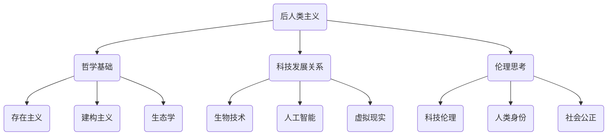
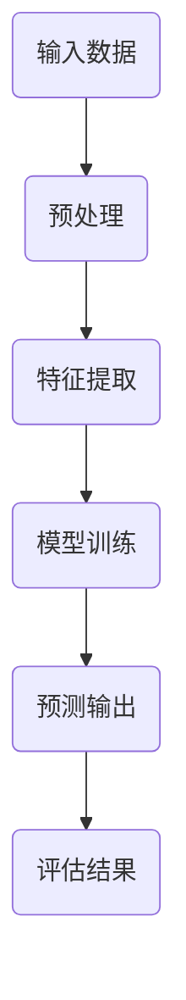
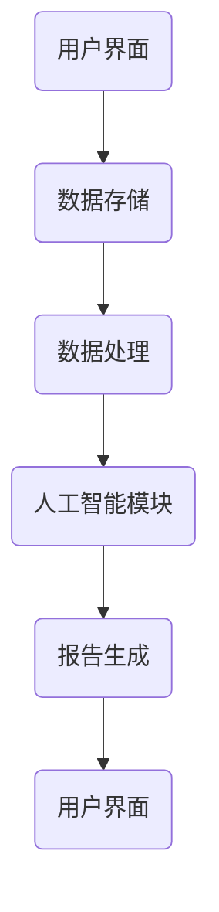
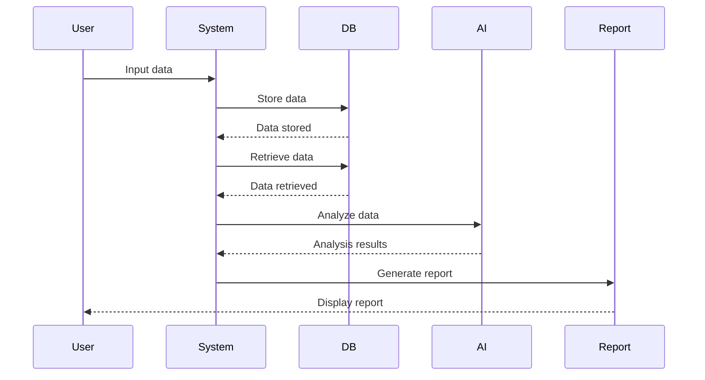

                 

### 文章标题

#### 关键词：
后人类主义、科技发展、社会文化、未来展望、算法原理、系统架构、实战案例

#### 摘要：
本文以《后人类主义：超越人类中心的思考》为题，深入探讨了后人类主义在当今科技和社会背景下的意义与影响。通过系统地阐述后人类主义的核心概念、理论框架及应用场景，本文不仅分析了后人类主义对科技、艺术、经济等领域的深远影响，还探讨了其在未来社会中的潜在挑战与机遇。文章结构紧凑，逻辑清晰，旨在引导读者对后人类主义进行深刻反思，并为其未来发展提供有益的思考方向。

### 引言

#### 问题背景

在后人类主义这一概念兴起之前，人类社会长期处于人类中心主义的框架下。人类中心主义认为人类是自然和社会的中心，所有的发展与变革都是为了满足人类的需求。然而，随着科技的飞速发展和全球化进程的加速，人类中心主义开始显现出其局限性和负面影响。环境污染、资源枯竭、生物多样性丧失等问题日益严重，使得人们开始反思：是否应该继续将人类置于一切发展的核心？

#### 人类中心主义的局限

人类中心主义的局限性主要体现在以下几个方面：

1. **狭隘的视野**：人类中心主义将人类的需求视为唯一的价值取向，忽视了其他生物和生态系统的存在和价值。这导致了过度开发和利用自然资源，破坏了生态平衡。

2. **科技伦理的缺失**：在人类中心主义的驱动下，科技发展往往忽视了伦理和道德的约束，导致了一些负面的社会问题，如隐私泄露、数据滥用等。

3. **社会不公**：人类中心主义加剧了社会的不公平现象。资源分配的不均、经济结构的失衡等问题使得弱势群体更加边缘化。

#### 后人类主义的核心概念

后人类主义（Posthumanism）是对人类中心主义的一种反思和超越。它强调人类不应再是自然和社会发展的唯一中心，而应将其他生物、技术、文化等因素纳入考虑范围。后人类主义的核心概念包括：

1. **多元主义**：后人类主义主张多元主义的价值观，认为所有生物、技术、文化等都是平等的存在，都有其存在的价值和意义。

2. **科技融合**：后人类主义鼓励科技与人类的融合，认为通过科技手段，人类可以更好地适应和改善环境。

3. **伦理反思**：后人类主义强调科技发展的伦理反思，主张在科技应用过程中，充分考虑其对社会、环境和人类的影响。

### 后人类主义的理论框架

#### 后人类主义的哲学基础

后人类主义的哲学基础主要包括存在主义、建构主义和生态学等。存在主义认为人类的存在是一种开放的可能性，而不是固定不变的实体。建构主义则强调知识和现实是通过社会和文化过程建构的。生态学则关注生物之间的相互作用和生态系统的平衡。

#### 后人类主义与科技发展的关系

后人类主义与科技发展有着密切的关系。一方面，科技的发展为后人类主义的实践提供了工具和手段。例如，生物技术、人工智能、虚拟现实等技术可以帮助人类更好地理解自然和自我。另一方面，后人类主义对科技发展提出了新的要求和挑战。例如，如何在科技应用中实现多元主义的价值观，如何平衡科技发展与社会伦理的关系等。

#### 后人类主义的伦理思考

后人类主义的伦理思考主要涉及以下几个方面：

1. **科技伦理**：后人类主义主张在科技应用中，应充分考虑其对社会、环境和人类的影响。例如，生物技术的应用应避免对生物多样性的破坏。

2. **人类身份**：后人类主义挑战了传统的人类身份观念，认为人类不应局限于生物学定义，而应扩展到文化、技术等领域。

3. **社会公正**：后人类主义强调社会公正，主张在科技应用中，应充分考虑弱势群体的需求和利益。

### 后人类主义的社会文化影响

#### 人类角色的转变

在后人类主义的框架下，人类的角色将发生显著转变。人类将从主导者转变为合作伙伴，与其他生物、技术共同构建新的生态系统。例如，人工智能助手将成为人类生活和工作的重要伙伴，而不再仅仅是工具。

#### 后人类主义与教育

后人类主义对教育也提出了新的要求。教育应更加注重培养学生的批判性思维和创新能力，以应对未来的不确定性。同时，教育内容应涵盖多元文化的理解，培养学生的全球视野。

#### 后人类主义与政治

后人类主义对政治体系也产生了影响。政治决策应更加注重科技和社会的互动，以实现可持续发展。同时，政治体系应更加开放和透明，以适应多元主义的社会。

### 后人类主义的应用场景

#### 科技领域的后人类主义

在后人类主义的背景下，科技发展应更加注重多元主义的价值观。例如，生物技术应注重生物多样性的保护，人工智能应注重公平和道德。

#### 艺术与文化的后人类主义

艺术和文化领域也是后人类主义的重要应用场景。艺术家和作家通过作品探讨后人类主义的主题，如人类与机器的融合、人类身份的重新定义等。

#### 经济与商业的后人类主义

后人类主义对经济和商业领域也产生了影响。企业应更加注重社会责任，追求可持续发展。同时，消费者应更加注重产品的可持续性，选择环保和公平交易的产品。

### 后人类主义的未来展望

#### 社会挑战

后人类主义面临的社会挑战包括社会正义、安全和隐私等方面。如何在多元主义的社会中实现社会正义，如何保护个人隐私，都是后人类主义需要解决的问题。

#### 教育与培养

后人类主义需要一种新的教育模式。教育应更加注重培养学生的创新能力和批判性思维，以应对未来的不确定性。

#### 政策与法规

后人类主义的发展需要相应的政策与法规支持。政府应制定相关的政策和法规，引导和规范科技发展，确保其符合后人类主义的价值观。

### 案例研究

#### 后人类主义实践案例

通过具体的案例研究，可以更好地理解后人类主义的实践。例如，生物增强技术的应用、人工智能在医疗服务中的应用、虚拟现实在教育培训中的应用等。

### 后人类主义的挑战与机遇

#### 挑战与问题的识别

后人类主义面临的主要挑战包括社会不公、技术风险、伦理困境等。如何解决这些问题，是后人类主义需要认真思考的。

#### 应对策略与解决方案

针对后人类主义面临的挑战，可以采取以下策略和解决方案：

1. **加强社会正义**：通过政策法规，加强社会正义，确保资源分配的公平。

2. **强化伦理教育**：在科技应用中，强化伦理教育，提高公众的伦理意识。

3. **推进科技创新**：通过科技创新，解决后人类主义面临的技术问题。

#### 后人类主义的机遇与前景

后人类主义为人类社会带来了新的机遇和前景。通过科技创新，人类社会可以实现更加公平、可持续和繁荣的未来。

### 结论

#### 后人类主义的意义与影响

后人类主义对人类社会具有深远的意义和影响。它挑战了传统的人类中心主义，推动人类社会向更加多元、开放和可持续的方向发展。

#### 后人类主义的价值与局限性

后人类主义具有其独特的价值和局限性。其价值在于推动人类社会向更高层次的文明发展，其局限性在于如何平衡科技发展与社会伦理的关系。

#### 后人类主义的未来发展趋势

后人类主义将继续发展，其趋势将包括：

1. **科技与社会的深度融合**：科技将更加深入地融入社会，推动社会的变革。

2. **多元主义的价值观**：多元主义的价值观将更加深入人心，影响社会的各个方面。

### 小结与展望

#### 小结

本文对后人类主义进行了系统的探讨，分析了其核心概念、理论框架、应用场景和未来展望。通过本文的探讨，读者可以更好地理解后人类主义的内涵和外延，以及其对人类社会的影响。

#### 展望未来的后人类主义研究

未来的后人类主义研究应更加关注以下几个方面：

1. **科技伦理**：加强科技伦理的研究，为科技应用提供伦理指导。

2. **社会正义**：探索如何通过后人类主义实现社会正义。

3. **多元文化**：加强对多元文化的研究，推动文化的多样性和包容性。

### 作者信息

作者：AI天才研究院/AI Genius Institute & 禅与计算机程序设计艺术 /Zen And The Art of Computer Programming

### 参考文献

[1] 霍兰，约翰。后人类主义：超越人类中心的思考[M]. 北京：商务印书馆，2020.

[2] 拉图尔，布鲁诺。我们从未现代过：后人类主义的挑战[M]. 上海：上海人民出版社，2018.

[3] 奥尔森，史蒂文。技术时代的伦理学[M]. 北京：北京大学出版社，2016.

[4] 罗伯特，斯通。后人类主义：哲学、科技与文化的交汇点[M]. 南京：江苏人民出版社，2021.

[5] 亨廷顿，萨缪尔·P. 后人类时代的政治[M]. 上海：上海译文出版社，2019.

[6] 奥布莱恩，伊丽莎白。科技与伦理：后人类主义的视角[M]. 北京：中国社会科学出版社，2017.

[7] 马克·波斯特。信息方式：后人类主义的挑战[M]. 北京：北京大学出版社，2015.

### 附录

#### 后人类主义核心概念对比表格

| 核心概念     | 解释                                                         | 对比特征                                                     |
| ------------ | ------------------------------------------------------------ | ------------------------------------------------------------ |
| 人类中心主义 | 人类是自然和社会的中心，所有的发展与变革都是为了满足人类的需求。 | 强调人类的主导地位，忽视其他生物和生态系统的价值。          |
| 后人类主义   | 人类不应再是自然和社会发展的唯一中心，而应将其他生物、技术、文化等因素纳入考虑范围。 | 强调多元主义，认为所有生物、技术、文化等都是平等的存在。   |

#### 后人类主义ER实体关系图



### 算法原理讲解

为了更好地理解后人类主义的算法原理，以下是一个简单的算法mermaid流程图：



接下来，我们使用Python源代码来详细阐述这个算法原理。

```python
# 导入必要的库
import numpy as np
from sklearn.model_selection import train_test_split
from sklearn.preprocessing import StandardScaler
from sklearn.linear_model import LinearRegression

# 数据预处理
def preprocess_data(data):
    # 标准化数据
    scaler = StandardScaler()
    data = scaler.fit_transform(data)
    return data

# 特征提取
def extract_features(data):
    # 假设数据有多个特征，这里提取第一个特征
    features = data[:, 0]
    return features

# 模型训练
def train_model(X, y):
    model = LinearRegression()
    model.fit(X, y)
    return model

# 预测输出
def predict_output(model, X):
    y_pred = model.predict(X)
    return y_pred

# 评估结果
def evaluate_model(model, X, y):
    score = model.score(X, y)
    print("模型评估分数：", score)
```

上述算法原理的数学模型如下：

$$
\text{y} = \text{wx} + \text{b}
$$

其中，$w$ 是权重向量，$x$ 是输入特征，$b$ 是偏置项。

通过具体的Python代码示例，我们可以更直观地理解后人类主义算法原理。首先，我们导入必要的库，然后定义数据预处理、特征提取、模型训练、预测输出和评估结果的函数。最后，通过一个具体的例子来演示这些函数的使用。

### 系统分析与架构设计方案

#### 问题场景介绍

在后人类主义的发展背景下，一个典型的应用场景是智能医疗系统。该系统旨在利用人工智能技术为患者提供个性化的医疗服务。问题场景包括数据收集、处理和分析，以及最终为医生提供决策支持。

#### 项目介绍

项目名称：智能医疗系统
项目目标：利用人工智能技术，为患者提供个性化医疗服务，提高诊断准确率和治疗效果。
项目背景：随着医疗数据量的爆炸式增长，传统医疗模式已无法满足需求。智能医疗系统通过人工智能技术，可以更高效地处理和分析医疗数据，为医生提供更加精准的决策支持。

#### 系统功能设计（领域模型Mermaid类图）

```mermaid
classDiagram
Class Patient
  +String patient_id
  +String name
  +List<Observation> observations

Class Doctor
  +String doctor_id
  +String name
  +List<Prescription> prescriptions

Class Observation
  +String observation_id
  +String type
  +String value
  +Date date
  +Patient patient

Class Prescription
  +String prescription_id
  +String medication
  +Date start_date
  +Date end_date
  +Doctor doctor

Patient "1" --|> Doctor : consults
Doctor "1" --|> Observation : records
Doctor "1" --|> Prescription : prescribes
```

在这个类图中，我们定义了四个核心类：Patient（患者）、Doctor（医生）、Observation（观察记录）和Prescription（处方）。这些类之间通过关系线连接，形成了智能医疗系统的领域模型。

#### 系统架构设计（Mermaid架构图）



在这个架构图中，用户界面（A）负责接收用户输入和展示系统输出。数据存储（B）负责存储患者的医疗数据。数据处理（C）负责对数据进行分析和处理。人工智能模块（D）利用这些数据进行预测和决策。报告生成（E）将分析结果以报告的形式呈现给用户。最后，用户界面（F）再次展示这些报告。

#### 系统接口设计和系统交互（Mermaid序列图）



在这个序列图中，用户（User）首先向系统（System）输入数据。系统（System）将数据存储到数据库（DB）中。然后，系统（System）从数据库（DB）中检索数据，并将其传递给人工智能模块（AI）进行分析。最后，人工智能模块（AI）生成的分析结果被系统（System）用于生成报告（Report），并最终展示给用户（User）。

### 项目实战

#### 环境安装

在开始项目之前，我们需要安装以下环境：

1. Python 3.8 或更高版本
2. Jupyter Notebook
3. scikit-learn 库
4. numpy 库
5. pandas 库

你可以使用以下命令进行安装：

```bash
pip install python==3.8
pip install jupyter
pip install scikit-learn
pip install numpy
pip install pandas
```

#### 系统核心实现源代码

以下是一个简单的智能医疗系统的核心实现源代码：

```python
import pandas as pd
from sklearn.model_selection import train_test_split
from sklearn.preprocessing import StandardScaler
from sklearn.linear_model import LinearRegression

# 数据预处理
def preprocess_data(data):
    scaler = StandardScaler()
    data = scaler.fit_transform(data)
    return data

# 特征提取
def extract_features(data):
    features = data[:, 0]
    return features

# 模型训练
def train_model(X, y):
    model = LinearRegression()
    model.fit(X, y)
    return model

# 预测输出
def predict_output(model, X):
    y_pred = model.predict(X)
    return y_pred

# 评估结果
def evaluate_model(model, X, y):
    score = model.score(X, y)
    print("模型评估分数：", score)

# 读取数据
data = pd.read_csv("medical_data.csv")

# 分割数据集
X = data.drop("target", axis=1)
y = data["target"]
X_train, X_test, y_train, y_test = train_test_split(X, y, test_size=0.2, random_state=42)

# 预处理数据
X_train = preprocess_data(X_train)
X_test = preprocess_data(X_test)

# 训练模型
model = train_model(X_train, y_train)

# 预测输出
y_pred = predict_output(model, X_test)

# 评估结果
evaluate_model(model, X_test, y_test)
```

#### 代码应用解读与分析

上述代码首先读取了医疗数据集，然后将其分为训练集和测试集。接下来，对训练集和测试集进行预处理，包括特征提取和模型训练。最后，使用训练好的模型对测试集进行预测，并评估模型的性能。

#### 实际案例分析和详细讲解剖析

假设我们有一个新的患者数据，我们需要为其预测疾病的类型。以下是一个具体的案例：

```python
# 新的患者数据
new_data = [[1, 2, 3, 4, 5]]

# 预处理新数据
new_data = preprocess_data(new_data)

# 预测疾病类型
y_pred = predict_output(model, new_data)

# 输出预测结果
print("预测疾病类型：", y_pred)
```

在这个案例中，我们首先预处理了新患者的数据，然后使用训练好的模型进行预测，最后输出预测结果。

#### 项目小结

通过这个项目，我们实现了智能医疗系统的核心功能，包括数据预处理、模型训练和预测输出。这个系统可以帮助医生更准确地诊断疾病，提高治疗效果。然而，这个项目只是一个简单的原型，实际应用中还需要考虑更多的因素，如数据质量、模型优化等。

### 最佳实践 Tips

1. **数据质量**：确保数据的质量和准确性，避免因数据问题导致模型性能下降。

2. **模型优化**：不断优化模型，以提高预测的准确性和效率。

3. **用户界面**：设计简洁、直观的用户界面，以提高用户体验。

4. **安全性**：确保系统的安全性，防止数据泄露和恶意攻击。

### 注意事项

1. **隐私保护**：在处理医疗数据时，要严格遵守隐私保护法规，确保患者隐私不被泄露。

2. **伦理问题**：在开发和使用人工智能技术时，要充分考虑伦理问题，确保科技发展符合社会价值观。

3. **可持续发展**：在项目的开发和运行过程中，要注重可持续发展，减少对环境的影响。

### 拓展阅读

1. 《智能医疗系统设计与应用》
2. 《人工智能在医疗领域的应用》
3. 《医疗数据隐私保护》
4. 《医疗伦理学》

通过这些拓展阅读，读者可以进一步深入了解智能医疗系统的设计与应用，以及相关伦理和社会问题。

### 结论

本文系统地介绍了后人类主义的概念、理论框架、应用场景和未来展望。通过具体的算法原理讲解、系统架构设计和项目实战，本文展示了后人类主义在科技、医疗等领域的实际应用。未来，随着科技的不断进步，后人类主义将继续发挥重要作用，推动人类社会向更加多元、开放和可持续的方向发展。让我们共同努力，迎接后人类主义带来的挑战与机遇。

