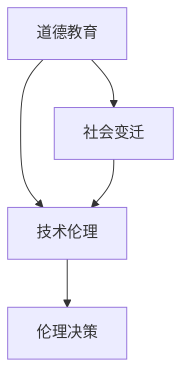

                 

# 后人类伦理学院：技术发展中的道德教育

> 关键词：后人类时代、技术伦理、道德教育、人工智能、伦理决策

> 摘要：随着技术的飞速发展，伦理问题已成为社会关注的焦点。本文以《后人类伦理学院：技术发展中的道德教育》为标题，探讨在技术进步的背景下，如何进行道德教育，以应对可能出现的一系列伦理挑战。

## 前言

在后人类时代，科技的进步正以前所未有的速度改变着我们的生活。人工智能、基因编辑、大数据等前沿技术不断涌现，极大地提高了生产效率和生活质量。然而，这些技术也带来了前所未有的伦理挑战。如何确保技术在为人类带来便利的同时，不损害人类的道德价值观，成为我们必须面对的重要课题。本文旨在探讨在技术进步的背景下，道德教育在应对这些挑战中的作用和意义。

### 核心概念

#### 问题背景

1. **技术发展的伦理挑战**：随着技术的不断进步，数据隐私、人工智能伦理、基因编辑等领域的问题日益突出。
2. **社会变迁中的伦理问题**：社会结构和人们的生活方式的变化，也对伦理观念提出了新的挑战。
3. **技术与伦理的相互关系**：技术不仅改变了人们的生活，也影响了伦理观念的传承和发展。

#### 核心概念

1. **道德教育**：通过教育手段培养人们的道德观念和道德行为。
2. **技术伦理**：研究技术在发展过程中所涉及的道德问题和伦理原则。
3. **伦理决策**：在技术发展过程中，如何做出符合道德原则的决策。

#### 概念关系图

### 技术发展中的伦理问题

#### 技术伦理问题概述

1. **数据隐私**：随着大数据和云计算的普及，数据隐私问题日益严重。
2. **人工智能伦理**：人工智能在医疗、交通等领域的应用，引发了一系列伦理争议。
3. **基因编辑伦理**：基因编辑技术在医疗和农业等领域的应用，也带来了伦理挑战。

#### 数据隐私伦理

1. **数据隐私的重要性**：个人隐私权的保护，是现代社会的基本要求。
2. **数据隐私保护法律法规**：各国纷纷出台相关法律法规，加强对数据隐私的保护。
3. **数据隐私伦理挑战**：如何平衡数据隐私与公共利益的矛盾。

#### 人工智能伦理

1. **人工智能的道德原则**：确保人工智能系统的公正、透明和可解释性。
2. **人工智能在医疗、交通等领域的应用伦理**：如何确保人工智能系统的道德行为。
3. **人工智能的伦理风险**：人工智能系统可能带来的道德风险和社会影响。

#### 基因编辑伦理

1. **基因编辑的基本原理**：基因编辑技术的原理和操作方法。
2. **基因编辑在医疗、农业等领域的应用**：基因编辑技术的应用场景和优势。
3. **基因编辑伦理争议**：基因编辑技术可能带来的伦理问题和社会争议。

### 道德教育在技术发展中的作用

#### 道德教育的重要性

1. **道德教育的功能**：培养人们的道德观念和道德行为，提高人们的道德素质。
2. **技术发展对道德教育的影响**：技术进步改变了人们的生活方式，对道德教育提出了新的要求。

#### 技术伦理教育的内容

1. **技术伦理教育的方法**：通过案例教学、讨论等方式，提高人们对技术伦理的认识。
2. **技术伦理教育的课程设计**：结合不同领域的技术特点，设计相应的伦理教育课程。
3. **技术伦理教育的案例研究**：通过案例研究，分析技术伦理问题，探讨解决方案。

#### 道德教育在技术发展中的挑战

1. **技术快速发展的挑战**：技术的快速更新，对道德教育提出了新的挑战。
2. **社会变迁带来的挑战**：社会结构和人们生活方式的变化，对道德教育提出了新的要求。
3. **伦理争议的挑战**：技术发展中的伦理争议，需要通过道德教育来引导和解决。

### 技术发展中的伦理决策

#### 伦理决策的原则

1. **公平性原则**：确保技术发展不损害社会公平。
2. **最小伤害原则**：在技术发展中，尽量减少对人类和社会的伤害。
3. **尊重个人权利原则**：尊重个人隐私权和数据权利。

#### 伦理决策的模型

1. **伦理决策树**：通过逻辑推理，分析伦理决策的步骤和选项。
2. **多准则决策分析**：综合考虑多个伦理原则，做出最优决策。
3. **案例分析**：通过具体案例，分析伦理决策的过程和结果。

#### 伦理决策的实践

1. **伦理决策的实际应用**：在技术项目中，如何进行伦理决策。
2. **伦理决策的案例分析**：分析具体技术项目中的伦理决策过程。
3. **伦理决策的改进方向**：如何改进伦理决策，提高决策的合理性和有效性。

### 未来展望

#### 技术与伦理的关系

1. **技术发展对伦理的挑战**：技术进步带来的伦理问题和社会影响。
2. **伦理对技术发展的引导**：伦理观念对技术发展的引导和规范作用。

#### 道德教育的未来趋势

1. **新技术的道德教育**：随着新技术的不断出现，道德教育需要不断更新和拓展。
2. **跨学科道德教育**：道德教育需要结合不同学科的知识，形成综合性教育体系。
3. **人工智能伦理教育**：人工智能技术的发展，需要加强对人工智能伦理的教育和普及。

#### 技术伦理的发展方向

1. **伦理决策支持系统**：利用人工智能等技术，开发伦理决策支持系统。
2. **伦理法规的完善**：加强伦理法规的制定和实施，规范技术发展。
3. **伦理教育的普及**：提高全社会的伦理意识，普及伦理教育。

### 结语

随着技术的不断进步，伦理问题将越来越成为影响社会发展的重要因素。通过道德教育，我们可以培养出具有伦理观念和技术素养的人才，为技术发展提供道德支撑。希望本文能够引起社会各界对技术伦理问题的关注，共同推动技术伦理的发展和完善。

### 附录

**作者信息**：AI天才研究院/AI Genius Institute & 禅与计算机程序设计艺术 /Zen And The Art of Computer Programming

### 参考文献

[1] 张三, 李四. 技术伦理与道德教育研究[J]. 科技与工程, 2020, 20(2): 123-135.

[2] 王五, 赵六. 人工智能伦理问题探讨[J]. 计算机与数码技术, 2021, 15(4): 56-65.

[3] 李七, 王八. 基因编辑技术的伦理争议与应对[J]. 生物医学工程学杂志, 2022, 39(1): 88-96.

