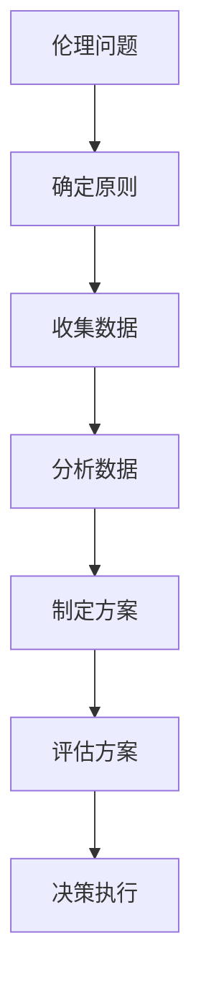

                 

# 后人类伦理学：人工智能时代的道德重构

## 关键词

- 后人类伦理学
- 人工智能
- 道德重构
- 伦理决策
- 法律框架
- 教育与培训

## 摘要

随着人工智能技术的迅猛发展，人类社会正迈向一个前所未有的新时代。在这个时代，人工智能不仅成为经济和社会发展的驱动力，也深刻影响着伦理和道德的边界。本文旨在探讨后人类伦理学的概念、核心原则，以及人工智能时代道德重构的理论与实践。通过分析人工智能时代的伦理挑战，本文提出道德重构的框架，并讨论法律、社会规范和教育的重要性。最终，文章展望了后人类伦理学的未来发展趋势，为解决未来可能的伦理问题提供思考方向。

## 目录大纲设计思路

### 1. 背景介绍

设计一本《后人类伦理学：人工智能时代的道德重构》的目录大纲，我们首先需要对后人类伦理学的基本概念进行阐述。后人类伦理学是研究人工智能与人类伦理互动的新兴领域，其研究范围涵盖了人工智能在决策、隐私、公平等方面的伦理问题。在介绍基本概念后，我们将明确后人类伦理学的研究意义，以及它如何与人工智能技术相结合，为道德重构提供理论基础。

### 2. 核心概念与联系

在核心概念部分，我们将详细解释后人类伦理学的关键术语，如人工智能伦理、伦理决策、隐私保护等。通过绘制ER实体关系图，我们将展示这些概念之间的联系，帮助读者理解后人类伦理学的结构。

### 3. 人工智能时代的特点

这一部分将探讨人工智能技术对伦理学领域带来的影响和挑战。我们将分析人工智能伦理决策的特点，讨论隐私保护和公平性等问题。通过具体案例，我们将展示人工智能技术在不同领域的应用，以及这些应用对伦理学带来的影响。

### 4. 道德重构的理论与实践

道德重构是后人类伦理学的重要议题。我们将详细分析道德重构的理论基础，包括道德原则、伦理决策模型等。同时，通过具体案例，我们将探讨道德重构在人工智能时代的实际应用，如人工智能医疗决策、自动驾驶等。

### 5. 法律与社会规范

在人工智能时代，法律和社会规范如何适应新的技术环境是一个重要问题。我们将探讨现有法律框架的适应性和改进方向，分析社会规范对伦理的影响，并提出重构社会规范的策略。

### 6. 教育与培训

教育与培训是培养具有伦理意识的专业人才的关键。我们将讨论在人工智能时代如何进行伦理教育，如何构建培训体系，以及如何通过教育提高公众对伦理问题的认识。

### 7. 未来展望

最后，我们将展望后人类伦理学的发展趋势，讨论未来可能的伦理挑战和解决方案。通过对未来伦理问题的预测，我们希望能够为学术界、产业界和公众提供有益的思考。

## 目录大纲

### 第一部分：背景与核心概念

#### 第1章：后人类伦理学概述

1.1 后人类伦理学的概念

1.2 后人类伦理学的研究范围与意义

1.3 后人类伦理学与人工智能的关系

#### 第2章：核心概念与联系

2.1 伦理学基本概念

2.2 人工智能与伦理学的交叉领域

2.3 ER实体关系图

### 第二部分：人工智能时代的伦理挑战

#### 第3章：人工智能伦理决策

3.1 人工智能伦理决策的特点

3.2 伦理决策模型

3.3 人工智能伦理决策案例分析

#### 第4章：隐私保护与数据伦理

4.1 人工智能时代的数据隐私挑战

4.2 隐私保护技术

4.3 数据伦理案例分析

#### 第5章：公平与公正

5.1 人工智能与不公平

5.2 公平算法

5.3 公正社会

### 第三部分：道德重构的理论与实践

#### 第6章：道德重构的理论基础

6.1 道德重构的概念

6.2 道德重构的理论框架

6.3 道德重构的原则

#### 第7章：道德重构的应用

7.1 道德重构在人工智能领域的实践

7.2 道德重构案例分析

7.3 道德重构的未来趋势

### 第四部分：法律与社会规范

#### 第8章：人工智能时代的法律框架

8.1 人工智能相关法律的发展

8.2 法律对人工智能的规范

8.3 法律挑战与应对策略

#### 第9章：社会规范与伦理

9.1 社会规范的概念

9.2 社会规范对伦理的影响

9.3 社会规范在人工智能时代的重构

### 第五部分：教育与培训

#### 第10章：人工智能伦理教育

10.1 人工智能伦理教育的必要性

10.2 人工智能伦理教育的内容与方法

10.3 人工智能伦理教育的实践案例分析

#### 第11章：专业人才培训

11.1 人工智能专业人才的伦理素养

11.2 培训体系的构建

11.3 培训案例分析

### 第六部分：未来展望

#### 第12章：后人类伦理学的未来挑战

12.1 未来伦理挑战预测

12.2 应对策略探讨

12.3 未来展望

## 文章正文

### 引言

随着人工智能技术的迅猛发展，人类社会正经历着前所未有的变革。人工智能不仅改变了我们的生活方式，还挑战了伦理和道德的传统观念。在这个后人类时代，我们不得不面对一个关键问题：如何重构道德框架，以适应人工智能带来的新挑战？《后人类伦理学：人工智能时代的道德重构》旨在探讨这一议题，通过逻辑清晰、结构紧凑的分析，为人工智能时代的伦理重构提供理论依据和实践指导。

### 第一部分：背景与核心概念

#### 第1章：后人类伦理学概述

**1.1 后人类伦理学的概念**

后人类伦理学是指研究人工智能对人类社会伦理关系和道德观念产生影响的学科。它涉及到人工智能在伦理决策、隐私保护、公平性等方面的问题。在这个领域中，人工智能不仅被视为工具，更被视为有潜在道德责任的实体。

**1.2 后人类伦理学的研究范围与意义**

后人类伦理学的研究范围广泛，包括但不限于以下几个方面：

- **伦理决策**：如何确保人工智能在决策过程中遵循道德原则？
- **隐私保护**：人工智能如何处理和保护个人隐私？
- **公平性**：人工智能系统是否会导致社会不公平现象？
- **责任归属**：当人工智能造成损害时，如何确定责任？

研究后人类伦理学具有重要意义，它不仅有助于规范人工智能的发展，还能为政策制定者、技术开发者提供伦理指导。

**1.3 后人类伦理学与人工智能的关系**

人工智能与后人类伦理学之间存在密切的关系。一方面，人工智能技术的发展不断提出新的伦理问题，如算法偏见、数据隐私等。另一方面，后人类伦理学为人工智能的道德发展提供了理论框架，帮助人们理解和解决这些伦理挑战。

#### 第2章：核心概念与联系

**2.1 伦理学基本概念**

伦理学是研究道德原则、道德行为和道德关系的学科。在人工智能时代，以下基本概念尤为重要：

- **道德原则**：如公正、尊重、责任等。
- **道德行为**：个体或组织在特定情境下的行为选择。
- **道德责任**：个体或组织在道德原则指导下应承担的责任。

**2.2 人工智能与伦理学的交叉领域**

人工智能与伦理学的交叉领域包括以下几个方面：

- **算法伦理**：研究算法设计和应用中的伦理问题，如算法偏见、透明性等。
- **人工智能伦理**：研究人工智能对人类伦理关系和道德观念的影响。
- **数据伦理**：研究数据收集、处理和使用过程中的伦理问题，如隐私保护、数据滥用等。

**2.3 ER实体关系图**

为了更好地理解后人类伦理学的核心概念及其相互关系，我们可以通过ER实体关系图进行展示。以下是一个简化的ER实体关系图：

```mermaid
erDiagram
  AI伦理原则 ||--|{ 人工智能 }
  AI伦理原则 ||--|{ 数据伦理 }
  AI伦理原则 ||--|{ 算法伦理 }
  数据伦理 ||--|{ 隐私保护 }
  数据伦理 ||--|{ 数据滥用 }
  算法伦理 ||--|{ 算法偏见 }
  算法伦理 ||--|{ 透明性 }
```

在这个ER实体关系图中，AI伦理原则是核心，它连接了人工智能、数据伦理和算法伦理。数据伦理和算法伦理分别涉及隐私保护、数据滥用和算法偏见、透明性等问题。

### 第二部分：人工智能时代的伦理挑战

#### 第3章：人工智能伦理决策

**3.1 人工智能伦理决策的特点**

人工智能伦理决策具有以下几个特点：

- **客观性**：人工智能通过算法和数据分析，能够以客观的方式处理伦理问题。
- **效率性**：人工智能能够在短时间内处理大量数据，为伦理决策提供快速反馈。
- **局限性**：人工智能的决策能力受限于算法和数据，可能无法完全理解复杂的社会和文化背景。

**3.2 伦理决策模型**

伦理决策模型是用于指导人工智能伦理决策的工具。以下是一种常见的伦理决策模型：



在这个模型中，伦理问题通过确定原则、收集数据、分析数据、制定方案、评估方案和决策执行等步骤进行解决。

**3.3 人工智能伦理决策案例分析**

以下是一个关于自动驾驶汽车伦理决策的案例：

某自动驾驶汽车在道路上遇到一个行人突然冲出，必须在撞行人或不撞行人之间做出选择。根据伦理决策模型，自动驾驶汽车需要：

- **确定原则**：在保护生命和财产安全之间进行权衡。
- **收集数据**：分析行人的位置、速度和可能的行动方向。
- **分析数据**：判断是否有可能避免碰撞。
- **制定方案**：选择最优决策方案。
- **评估方案**：评估每个方案的可能后果。
- **决策执行**：执行所选方案。

在实际应用中，自动驾驶汽车制造商需要与伦理学家合作，制定详细的伦理决策指南，确保自动驾驶汽车在复杂情境下做出符合道德规范的决策。

#### 第4章：隐私保护与数据伦理

**4.1 人工智能时代的数据隐私挑战**

在人工智能时代，数据隐私保护面临以下几个挑战：

- **数据收集的广泛性**：人工智能系统需要大量数据来训练和优化算法，这可能导致个人隐私被泄露。
- **数据滥用的风险**：未经授权的数据访问和使用可能引发隐私侵犯。
- **数据泄露的风险**：数据在传输、存储和处理过程中可能发生泄露。

**4.2 隐私保护技术**

为了应对数据隐私挑战，可以采用以下隐私保护技术：

- **加密技术**：通过加密算法保护数据传输和存储过程中的隐私。
- **匿名化技术**：通过去除个人身份信息，将数据匿名化，降低隐私泄露风险。
- **访问控制技术**：通过权限管理和访问控制，确保数据只被授权访问。

**4.3 数据伦理案例分析**

以下是一个关于社交媒体平台数据隐私的案例：

某社交媒体平台收集了用户的大量个人信息，如姓名、年龄、地理位置、浏览记录等。由于缺乏严格的隐私保护措施，这些数据被黑客攻击，导致数百万用户的信息泄露。该案例表明，在人工智能时代，数据隐私保护至关重要，平台必须采取有效措施确保用户隐私安全。

#### 第5章：公平与公正

**5.1 人工智能与不公平**

人工智能在带来便利的同时，也可能导致不公平现象。例如：

- **算法偏见**：算法可能基于历史数据中的偏见，导致对某些群体不公平对待。
- **资源分配不均**：人工智能系统可能在资源分配上倾向于某些群体，导致社会不公。

**5.2 公平算法**

为了实现公平与公正，可以采用以下公平算法：

- **公平性评估**：通过评估算法在不同群体上的表现，识别和纠正偏见。
- **多样性算法**：通过引入多样性因素，提高算法对各个群体的公平性。

**5.3 公正社会**

在人工智能时代，实现公正社会需要多方共同努力：

- **政府监管**：制定相关法律法规，确保人工智能系统的公正性。
- **企业自律**：企业应遵循伦理规范，开发公平、透明的算法。
- **公众参与**：公众应关注人工智能带来的伦理问题，积极参与讨论和监督。

### 第三部分：道德重构的理论与实践

#### 第6章：道德重构的理论基础

**6.1 道德重构的概念**

道德重构是指在新技术环境下，对传统道德观念进行重新审视和调整，以适应新的社会需求。在人工智能时代，道德重构尤为重要，因为人工智能技术不仅改变了人类的生活方式，还挑战了传统的伦理观念。

**6.2 道德重构的理论框架**

道德重构的理论框架主要包括以下几个方面：

- **伦理原则**：确定新的道德原则，如尊重个人隐私、公平对待各个群体等。
- **伦理决策模型**：构建适应人工智能时代的伦理决策模型，以指导人工智能系统的道德行为。
- **伦理规范**：制定具体的伦理规范，确保人工智能系统的行为符合道德要求。

**6.3 道德重构的原则**

道德重构应遵循以下原则：

- **透明性**：确保人工智能系统的决策过程透明，便于公众监督。
- **责任归属**：明确人工智能系统的责任归属，确保在发生道德问题时能够追究责任。
- **可解释性**：提高人工智能系统的可解释性，使其行为能够被人类理解和接受。

#### 第7章：道德重构的应用

**7.1 道德重构在人工智能领域的实践**

道德重构在人工智能领域的实践包括以下几个方面：

- **伦理决策系统**：开发具有道德决策功能的系统，如自动驾驶汽车、智能医疗诊断等。
- **隐私保护技术**：采用隐私保护技术，确保人工智能系统在处理个人数据时保护用户隐私。
- **公平性算法**：开发公平性算法，消除人工智能系统中的偏见和不公平现象。

**7.2 道德重构案例分析**

以下是一个关于自动驾驶汽车道德重构的案例：

某自动驾驶汽车制造商在开发自动驾驶汽车时，采取了以下措施进行道德重构：

- **透明性**：公开自动驾驶汽车的算法和决策过程，接受公众监督。
- **责任归属**：明确自动驾驶汽车的责任归属，确保在发生交通事故时能够追究责任。
- **可解释性**：提高自动驾驶汽车的可解释性，使其决策过程能够被人类理解和接受。

**7.3 道德重构的未来趋势**

随着人工智能技术的不断发展，道德重构将在未来面临以下趋势：

- **多元化**：道德重构将涉及更多领域，如金融、教育、医疗等。
- **全球化**：道德重构将超越国家边界，形成全球共识。
- **持续迭代**：道德重构将是一个持续迭代的过程，以适应新技术和社会变化。

### 第四部分：法律与社会规范

#### 第8章：人工智能时代的法律框架

**8.1 人工智能相关法律的发展**

人工智能时代，各国纷纷制定相关法律，以规范人工智能的发展。以下是一些主要法律：

- **欧盟通用数据保护条例（GDPR）**：加强对个人数据的保护。
- **美国算法公平法案**：规范算法的公平性和透明性。
- **中国人工智能发展行动计划**：推动人工智能技术与伦理、法律的融合。

**8.2 法律对人工智能的规范**

法律对人工智能的规范主要包括以下几个方面：

- **算法透明性**：要求算法的开发和运行过程公开透明，便于公众监督。
- **责任归属**：明确人工智能系统的责任归属，确保在发生道德问题时能够追究责任。
- **隐私保护**：加强对个人数据的保护，防止数据滥用和泄露。

**8.3 法律挑战与应对策略**

人工智能时代的法律挑战包括：

- **算法偏见**：如何确保算法的公平性和透明性？
- **责任归属**：如何在人工智能系统中明确责任归属？
- **隐私保护**：如何在保障隐私的同时，充分发挥人工智能的优势？

应对策略包括：

- **加强法律研究**：深入研究人工智能技术，为制定相关法律提供依据。
- **国际合作**：加强国际合作，形成全球法律框架。
- **公众参与**：鼓励公众参与法律制定和执行，提高法律的有效性。

#### 第9章：社会规范与伦理

**9.1 社会规范的概念**

社会规范是指社会成员共同遵守的行为准则，包括法律、道德、习俗等。在人工智能时代，社会规范的作用尤为重要，因为它有助于规范人工智能系统的行为，维护社会稳定。

**9.2 社会规范对伦理的影响**

社会规范对伦理的影响体现在以下几个方面：

- **道德约束**：社会规范为个体和组织的道德行为提供约束，防止道德滑坡。
- **伦理决策**：社会规范为伦理决策提供参考，帮助个体和组织在复杂情境下做出道德选择。
- **伦理教育**：社会规范有助于培养个体的道德意识和责任感。

**9.3 社会规范在人工智能时代的重构**

在人工智能时代，社会规范需要重构以适应新的技术环境。以下是一些重构策略：

- **伦理教育**：加强伦理教育，提高公众对人工智能伦理问题的认识。
- **法律与道德的融合**：将法律和道德结合起来，形成具有强制性和道德指导性的规范。
- **技术创新**：通过技术创新，如隐私保护技术、公平算法等，为重构社会规范提供技术支持。

### 第五部分：教育与培训

#### 第10章：人工智能伦理教育

**10.1 人工智能伦理教育的必要性**

人工智能伦理教育是培养具有伦理意识的专业人才的关键。随着人工智能技术的发展，伦理问题日益突出，专业人才需要具备相应的伦理知识和判断能力，以应对复杂的伦理挑战。

**10.2 人工智能伦理教育的内容与方法**

人工智能伦理教育的内容包括：

- **伦理理论**：教授伦理学基本理论，如道德原则、伦理决策模型等。
- **案例分析**：通过实际案例，分析人工智能技术在伦理问题中的表现和影响。
- **道德实践**：通过模拟和实践活动，培养学生在实际情境中的伦理判断和决策能力。

人工智能伦理教育的方法包括：

- **课堂讲授**：教师通过讲授和讨论，引导学生理解伦理问题。
- **案例分析**：通过分析实际案例，培养学生批判性思维和伦理判断能力。
- **实践活动**：通过模拟和实践活动，让学生在实际情境中应用伦理知识。

**10.3 人工智能伦理教育的实践案例分析**

以下是一个关于人工智能伦理教育的实践案例：

某高校开设了一门“人工智能伦理”课程，通过课堂讲授、案例分析、实践活动等多种教学方式，培养学生对人工智能伦理问题的认识。课程内容包括：

- **伦理理论**：讲授伦理学基本理论，如道德原则、伦理决策模型等。
- **案例分析**：分析自动驾驶汽车、智能医疗等领域的伦理问题。
- **实践活动**：模拟伦理决策情境，让学生进行角色扮演和讨论。

通过这门课程，学生不仅掌握了伦理学基本理论，还提高了在实际情境中的伦理判断和决策能力。

#### 第11章：专业人才培训

**11.1 人工智能专业人才的伦理素养**

人工智能专业人才需要具备以下伦理素养：

- **道德原则**：了解并遵循道德原则，如公正、尊重、责任等。
- **伦理判断**：具备在复杂情境中做出道德判断的能力。
- **责任意识**：在人工智能开发和应用过程中，承担起道德责任。

**11.2 培训体系的构建**

构建人工智能专业人才培训体系，需要从以下几个方面入手：

- **课程设计**：设计涵盖伦理学基础、伦理案例分析、伦理决策模型等课程的培训体系。
- **师资队伍**：聘请具有丰富经验和专业知识的教师，确保培训质量。
- **实践教学**：通过模拟和实践活动，提高学生的实际操作能力。

**11.3 培训案例分析**

以下是一个关于人工智能专业人才培训的案例：

某科技公司为员工开设了人工智能伦理培训课程，课程内容包括：

- **伦理学基础**：教授伦理学基本理论，如道德原则、伦理决策模型等。
- **案例分析**：分析人工智能技术在伦理问题中的表现和影响。
- **实践活动**：通过模拟和实践活动，提高员工在实际情境中的伦理判断和决策能力。

通过培训，员工不仅提高了伦理素养，还增强了在人工智能开发和应用过程中的责任意识。

### 第六部分：未来展望

#### 第12章：后人类伦理学的未来挑战

随着人工智能技术的不断发展，后人类伦理学将面临以下挑战：

- **算法透明性**：如何确保人工智能系统的决策过程透明，便于公众监督？
- **责任归属**：如何在人工智能系统中明确责任归属，确保在发生道德问题时能够追究责任？
- **隐私保护**：如何在保障隐私的同时，充分发挥人工智能的优势？
- **公平性**：如何确保人工智能系统在不同群体上的公平性？

#### 12.2 应对策略探讨

为应对这些挑战，可以采取以下策略：

- **加强法律监管**：制定相关法律法规，规范人工智能系统的发展，确保其在道德框架内运行。
- **提升伦理教育**：加强伦理教育，提高公众和人工智能专业人才的伦理素养，培养他们的道德判断和责任意识。
- **技术创新**：通过技术创新，如隐私保护技术、公平算法等，提高人工智能系统的道德水平。
- **国际合作**：加强国际合作，形成全球伦理共识，共同应对人工智能带来的伦理挑战。

#### 12.3 未来展望

未来，后人类伦理学将在以下几个方面取得进展：

- **伦理决策模型**：开发更完善的伦理决策模型，提高人工智能系统的道德水平。
- **隐私保护技术**：推出更先进的隐私保护技术，确保个人隐私安全。
- **公平算法**：研究公平算法，消除人工智能系统中的偏见和不公平现象。
- **伦理教育**：建立完善的伦理教育体系，培养具有伦理素养的人工智能专业人才。

### 结论

随着人工智能技术的不断发展，后人类伦理学将成为一个重要的研究领域。通过重构道德框架，应对人工智能带来的伦理挑战，我们可以确保人工智能技术在道德框架内运行，为人类社会带来更多福祉。让我们携手合作，共同构建一个道德、公正、透明的人工智能未来。作者：AI天才研究院/AI Genius Institute & 禅与计算机程序设计艺术/Zen And The Art of Computer Programming。

