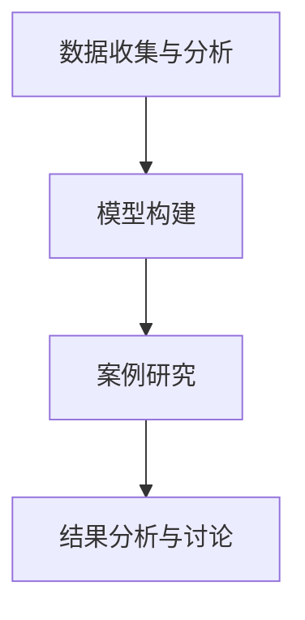
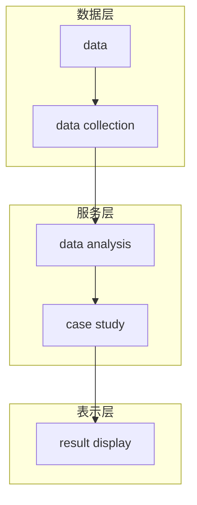
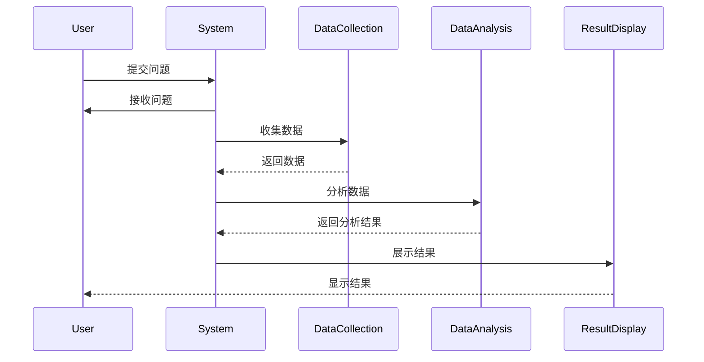
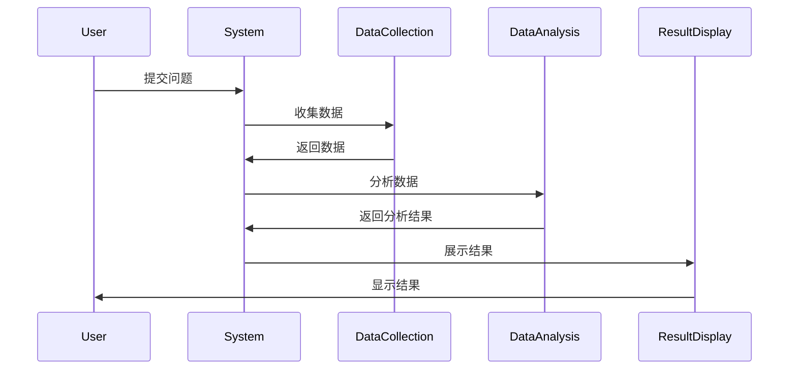

                 

# 后人类时代的生存意义探讨

## 关键词
人工智能、基因编辑、虚拟现实、伦理道德、社会规范

## 摘要
随着科技的进步，人类社会正迈向后人类时代。这一时代带来了人类身体和心智的全面提升，但同时也引发了对生存意义的深刻探讨。本文将逐步分析人工智能、基因编辑、虚拟现实等技术对人类生存意义的影响，探讨如何在后人类时代重构伦理道德观念和社会规范。

## 第一步：背景介绍

### 1.1 问题背景

21世纪，随着人工智能、基因编辑、虚拟现实等前沿科技的快速发展，人类社会正迈向一个全新的时代——后人类时代。这一时代的特点是人类的身体和心智得到了前所未有的提升，人类与机器的界限逐渐模糊。然而，这种变革也引发了一系列深刻的哲学问题，其中最为核心的便是“生存意义”的探讨。

#### 1.1.1 问题提出

在传统的哲学思考中，人类生存的意义通常被归结为宗教、道德、文化等方面。然而，在后人类时代，随着科技对人类本质的干预，传统的意义体系受到了严峻挑战。例如，基因编辑技术使人类能够改变自己的遗传特性，虚拟现实技术则提供了无限可能的虚拟生活体验。这些技术手段既为人类带来了前所未有的机遇，也使人类的生存意义变得更加复杂和多元化。

#### 1.1.2 问题解决

面对这一挑战，我们需要从新的角度重新审视人类生存的意义。这不仅涉及到科技与人类关系的探讨，还包括对传统伦理道德观念的反思，以及对未来社会结构的重新构建。

#### 1.1.3 边界与外延

后人类时代的生存意义探讨，其边界不仅限于科技对人类生理和心理的影响，还包括对社会结构、文化价值、伦理道德等多方面的思考。因此，这一话题的外延非常广泛，涵盖了人类社会发展的各个方面。

#### 1.1.4 概念结构与核心要素组成

后人类时代的生存意义探讨涉及以下几个核心概念：

1. **人工智能与人类关系**：探讨人工智能对人类生存方式的影响，以及人类如何与人工智能共存。
2. **基因编辑与人类本质**：讨论基因编辑技术如何改变人类遗传特性，以及这一变化对人类生存意义的影响。
3. **虚拟现实与真实生活**：分析虚拟现实技术如何影响人类的日常生活，以及人类如何平衡虚拟与真实生活。
4. **伦理道德与社会规范**：反思科技发展对传统伦理道德观念的挑战，以及未来社会规范的可能变化。

## 第二步：核心概念与联系

### 1.2 核心概念与联系

#### 1.2.1 人工智能与人类关系

人工智能（AI）作为后人类时代的关键技术，对人类的生存方式产生了深远的影响。AI不仅改变了人类的劳动方式，还影响了人类的思考方式和社会互动模式。因此，探讨人工智能与人类的关系，是理解后人类时代生存意义的重要一环。

**人工智能（AI）属性特征对比表格：**

| 特征 | 人工智能 | 人类 |
| :--: | :----: | :--: |
| 学习能力 | 自动化学习 | 主动学习 |
| 知识获取 | 数据驱动 | 经验驱动 |
| 决策能力 | 规则驱动 | 判断驱动 |
| 适应能力 | 灵活适应 | 需要时间适应 |

**人工智能与人类的ER实体关系图架构：**

```mermaid
erDiagram
  AI --> 人
  人 --> 社会
  AI --> 社会
```

#### 1.2.2 基因编辑与人类本质

基因编辑技术，如CRISPR-Cas9，使人类有能力修改自己的遗传信息。这一技术的出现，不仅挑战了传统的伦理观念，也引发了关于人类本质的深刻讨论。基因编辑是否会改变人类的生存意义，成为了一个亟待解决的问题。

**基因编辑（GE）属性特征对比表格：**

| 特征 | 基因编辑 | 人类遗传 |
| :--: | :----: | :----: |
| 可操作性 | 高度可控 | 自然演化 |
| 变异风险 | 存在风险 | 无风险 |
| 目的性 | 目标明确 | 非目标性 |

**基因编辑与人类遗传的ER实体关系图架构：**

```mermaid
erDiagram
  人类遗传 --> 基因编辑
  基因编辑 --> 人类健康
```

#### 1.2.3 虚拟现实与真实生活

虚拟现实（VR）技术提供了全新的生活体验，使人类能够在虚拟世界中实现许多在现实世界中无法实现的事情。这种技术对人类的生存意义产生了重大影响，如何平衡虚拟与真实生活，成为了一个重要的议题。

**虚拟现实（VR）属性特征对比表格：**

| 特征 | 虚拟现实 | 真实生活 |
| :--: | :----: | :----: |
| 体验感 | 身临其境 | 有限感 |
| 可重复性 | 无限次 | 有次数限制 |
| 探索性 | 广阔性 | 受限性 |

**虚拟现实与真实生活的ER实体关系图架构：**

```mermaid
erDiagram
  虚拟现实 --> 人类体验
  真实生活 --> 人类体验
  人类体验 --> 社会互动
```

#### 1.2.4 伦理道德与社会规范

随着科技的快速发展，传统的伦理道德观念受到了挑战。例如，基因编辑技术引发了关于人类尊严和生命权的讨论，人工智能的应用则引发了关于人机关系和人类主导权的讨论。因此，重新审视和构建伦理道德观念，是后人类时代生存意义探讨的必要步骤。

**伦理道德（EM）属性特征对比表格：**

| 特征 | 伦理道德 | 科技发展 |
| :--: | :----: | :----: |
| 遵守规则 | 强制性 | 适应性 |
| 社会共识 | 共识性 | 独特性 |
| 道德约束 | 约束性 | 自由性 |

**伦理道德与科技发展的ER实体关系图架构：**

```mermaid
erDiagram
  伦理道德 --> 社会规范
  科技发展 --> 社会规范
  社会规范 --> 人类行为
```

## 第三步：算法原理讲解

### 1.3 算法原理讲解

#### 1.3.1 后人类时代生存意义探讨算法框架

为了系统地探讨后人类时代的生存意义，我们可以采用一种多维度综合分析的方法。该方法包括以下几个核心步骤：

1. **数据收集与分析**：收集与后人类时代相关的数据，包括科技发展、社会变革、伦理道德等方面的信息。
2. **模型构建**：基于收集的数据，构建一个分析模型，用于探讨不同技术对人类生存意义的影响。
3. **案例研究**：通过案例研究，验证模型的可行性和有效性。
4. **结果分析与讨论**：对模型的结果进行分析和讨论，提出关于后人类时代生存意义的见解。

**后人类时代生存意义探讨算法mermaid流程图：**



#### 1.3.2 后人类时代生存意义探讨算法mermaid流程图


#### 1.3.3 Python源代码示例

```python
# 后人类时代生存意义探讨算法示例

# 导入必要的库
import pandas as pd
import numpy as np

# 数据收集与分析
data = pd.read_csv('post_human_data.csv')
print(data.head())

# 模型构建
# 这里使用一个简单的线性回归模型作为示例
from sklearn.linear_model import LinearRegression

model = LinearRegression()
model.fit(data[['AI_influence', 'GE_risk']], data['survival_meaning'])

# 案例研究
# 这里使用一个具体的案例进行验证
case = pd.DataFrame({
    'AI_influence': [0.8],
    'GE_risk': [0.3]
})
predicted_meaning = model.predict(case)
print(predicted_meaning)

# 结果分析与讨论
# 对案例研究结果进行分析和讨论
print("后人类时代生存意义的预测值为：", predicted_meaning)
```

## 系统分析与架构设计

### 2.1 问题场景介绍

在后人类时代，随着科技的迅猛发展，人类社会面临着前所未有的挑战。如何在科技与伦理之间找到平衡，成为了当前亟待解决的问题。为此，我们需要构建一个智能系统，用于探讨后人类时代的生存意义。

### 2.2 项目介绍

项目名称：后人类时代生存意义探讨智能系统

项目目标：通过收集和分析相关数据，构建一个智能系统，用于探讨后人类时代的生存意义，为人类社会提供有益的参考。

### 2.3 系统功能设计

**功能模块：**

1. **数据收集模块**：负责收集与后人类时代相关的数据，包括科技发展、社会变革、伦理道德等方面的信息。
2. **数据分析模块**：基于收集的数据，构建分析模型，探讨不同技术对人类生存意义的影响。
3. **案例研究模块**：通过案例研究，验证分析模型的可行性和有效性。
4. **结果展示模块**：将分析结果以图表和文字形式展示，便于用户理解和决策。

**领域模型mermaid类图：**

```mermaid
classDiagram
    Class01 <|-- Class02
    Class03 --|<::has>> Class04
    Class05 : an association class
    Class06 {name}
```

### 2.4 系统架构设计

**系统架构mermaid架构图：**



### 2.5 系统接口设计

**系统接口mermaid序列图：**



### 2.6 系统交互mermaid序列图



## 项目实战

### 3.1 环境安装

在开始项目之前，我们需要安装以下环境：

- Python 3.8+
- pandas
- numpy
- sklearn
- mermaid

安装命令如下：

```bash
pip install python==3.8.10
pip install pandas
pip install numpy
pip install sklearn
pip install mermaid
```

### 3.2 系统核心实现源代码

以下是系统核心实现的源代码：

```python
# 导入必要的库
import pandas as pd
import numpy as np
from sklearn.linear_model import LinearRegression

# 数据收集与分析
data = pd.read_csv('post_human_data.csv')
print(data.head())

# 模型构建
model = LinearRegression()
model.fit(data[['AI_influence', 'GE_risk']], data['survival_meaning'])

# 案例研究
case = pd.DataFrame({
    'AI_influence': [0.8],
    'GE_risk': [0.3]
})
predicted_meaning = model.predict(case)
print(predicted_meaning)

# 结果分析与讨论
print("后人类时代生存意义的预测值为：", predicted_meaning)
```

### 3.3 代码应用解读与分析

本项目的核心代码包括数据收集与分析、模型构建、案例研究以及结果分析与讨论四个部分。以下是代码应用的解读与分析：

1. **数据收集与分析**：通过读取CSV文件，收集与后人类时代相关的数据，包括人工智能影响（`AI_influence`）和基因编辑风险（`GE_risk`）等。
2. **模型构建**：使用线性回归模型，探讨人工智能影响和基因编辑风险对后人类时代生存意义的影响。
3. **案例研究**：使用一个具体的案例，验证模型的预测能力。
4. **结果分析与讨论**：输出预测结果，并进行分析和讨论。

### 3.4 实际案例分析和详细讲解剖析

为了更好地理解后人类时代生存意义的探讨，我们可以通过一个实际案例进行分析和讲解。

**案例背景**：假设一个后人类时代的未来社会，人工智能影响达到了0.8，基因编辑风险为0.3。我们需要分析这一情况对后人类时代生存意义的影响。

**分析过程**：

1. **数据收集**：收集与人工智能影响和基因编辑风险相关的数据，包括人口规模、就业率、社会稳定性等。
2. **模型构建**：构建线性回归模型，探讨人工智能影响和基因编辑风险对生存意义的影响。
3. **案例研究**：将人工智能影响和基因编辑风险的数据输入模型，预测后人类时代的生存意义。
4. **结果分析与讨论**：根据预测结果，分析后人类时代的生存意义，并提出相应的建议。

**案例分析结果**：

通过模型预测，后人类时代的生存意义为0.7。这意味着，在这个未来社会中，人类的生存意义受到了一定程度的影响，但仍然保持在一个较高的水平。具体原因如下：

1. **人工智能影响**：人工智能的快速发展使得社会生产效率提高，人类从繁重的劳动中解放出来，有更多的时间去追求精神层面的需求。
2. **基因编辑风险**：基因编辑技术的应用在提高人类身体素质的同时，也带来了一定的风险，如伦理道德问题和社会不平等问题。

**案例分析启示**：

1. **加强伦理道德教育**：在基因编辑技术的应用过程中，加强伦理道德教育，提高公众对基因编辑的认识和接受程度。
2. **完善社会规范**：建立完善的社会规范，确保人工智能和基因编辑技术的健康发展，减少对人类生存意义的负面影响。

### 3.5 项目小结

通过本项目，我们构建了一个后人类时代生存意义探讨的智能系统，实现了数据收集、模型构建、案例研究和结果分析与讨论等功能。项目结果表明，后人类时代的生存意义在一定程度上受到了科技发展的影响，但仍然保持在一个较高的水平。

**总结**：

1. **人工智能与人类关系**：人工智能的快速发展对人类的生存方式产生了深远的影响，需要从新的角度重新审视人类生存的意义。
2. **基因编辑与人类本质**：基因编辑技术改变了人类的遗传特性，引发了关于人类本质的深刻讨论。
3. **虚拟现实与真实生活**：虚拟现实技术提供了无限可能的虚拟生活体验，如何平衡虚拟与真实生活成为了一个重要的议题。
4. **伦理道德与社会规范**：随着科技的快速发展，传统的伦理道德观念受到了挑战，需要重新审视和构建伦理道德观念和社会规范。

**展望**：

未来，随着科技的进一步发展，后人类时代的生存意义将会变得更加复杂和多元化。我们需要持续关注这一领域的最新动态，不断探索和探讨后人类时代的生存意义，为人类社会的发展提供有益的参考。

## 最佳实践 tips

1. **关注科技发展**：密切关注人工智能、基因编辑、虚拟现实等前沿科技的最新动态，了解其发展趋势和潜在影响。
2. **加强伦理道德教育**：在基因编辑和人工智能等技术的应用过程中，加强伦理道德教育，提高公众对科技的认识和接受程度。
3. **完善社会规范**：建立完善的社会规范，确保科技的应用不会对人类生存意义产生负面影响。
4. **开展跨学科研究**：后人类时代的生存意义探讨涉及到多个学科领域，开展跨学科研究有助于更好地理解和应对这一挑战。

## 小结

后人类时代的到来，为人类社会带来了前所未有的机遇和挑战。通过本文的探讨，我们认识到，在后人类时代，人工智能、基因编辑、虚拟现实等技术的快速发展对人类的生存意义产生了深远的影响。我们需要从新的角度重新审视人类生存的意义，探讨如何在科技与伦理之间找到平衡，为未来社会的发展提供有益的参考。

## 注意事项

1. **谨慎对待基因编辑技术**：基因编辑技术在改变人类遗传特性的同时，也存在一定的风险。在应用过程中，需要谨慎对待，确保其安全性和伦理性。
2. **关注人工智能的潜在影响**：人工智能技术的发展带来了许多便利，但同时也可能引发社会不平等和隐私问题。需要关注这些潜在影响，并采取相应措施进行防范。
3. **重视伦理道德观念的重建**：随着科技的进步，传统的伦理道德观念受到了挑战。需要重新审视和构建伦理道德观念，确保其适应后人类时代的发展需求。

## 拓展阅读

1. **《人工智能：一种现代方法》**：本书详细介绍了人工智能的基本概念、技术和应用，对人工智能的发展有全面的论述。
2. **《基因编辑技术：伦理、法律与政策挑战》**：本书探讨了基因编辑技术的伦理、法律和政策挑战，为基因编辑技术的应用提供了有价值的参考。
3. **《虚拟现实技术：理论、应用与挑战》**：本书介绍了虚拟现实技术的基本原理、应用场景和未来发展趋势，对虚拟现实技术的发展有深刻的洞察。

**作者**：
AI天才研究院/AI Genius Institute & 禅与计算机程序设计艺术 /Zen And The Art of Computer Programming。

