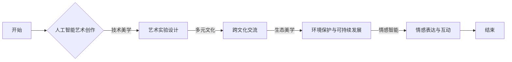
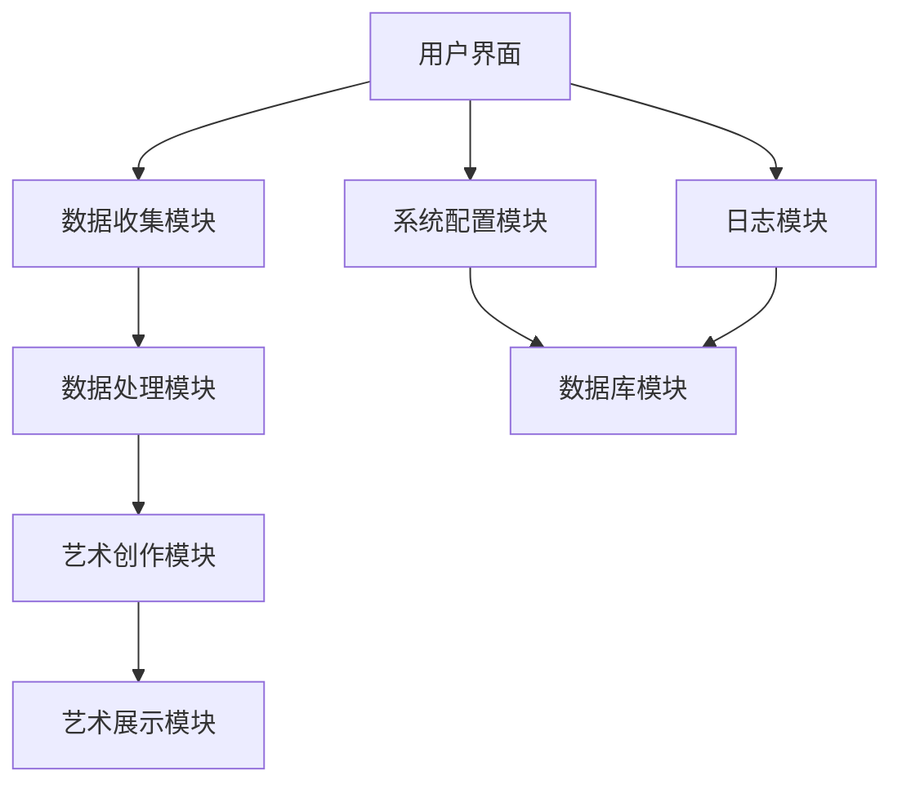
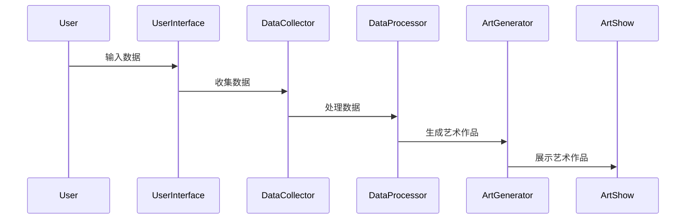

                 


### # 后人类美学探索：超越传统审美的艺术实验

关键词：后人类美学、艺术实验、传统审美、审美创新

摘要：随着人工智能技术的飞速发展，人类正在进入一个崭新的时代——后人类时代。在这个时代背景下，传统美学观念面临着前所未有的挑战。本文旨在探讨后人类美学，并通过一系列艺术实验，探索超越传统审美的可能性。通过逻辑清晰、结构紧凑、简单易懂的专业技术语言，本文将引导读者一步步深入理解后人类美学的本质和艺术创新的路径。

### **一、背景介绍**

#### **1.1 核心概念术语说明**

- 后人类（Posthuman）：指在人工智能和生物技术推动下，人类通过技术手段实现自我升级和超越的个体或集体。
- 美学（Aesthetics）：研究审美现象、审美体验及其价值判断的学科。
- 艺术实验（Artistic Experiment）：指艺术家或研究者通过创新手段，挑战传统审美，探索新的艺术形式和表现手法的实践活动。

#### **1.2 问题背景**

随着人工智能的崛起，人类开始反思自身的存在和未来。传统美学观念建立在人类中心主义的基础上，强调人类的主观体验和审美价值。然而，在后人类时代，这种观念面临着严峻的挑战。

#### **1.3 问题描述**

- 传统审美是否能够适应后人类时代的需求？
- 后人类审美是否具有独立的价值体系？
- 如何通过艺术实验，探索后人类审美的可能性？

#### **1.4 问题解决**

通过后人类美学的研究，我们可以寻找答案。本文将通过一系列艺术实验，探讨后人类审美的本质和特征，为传统美学提供新的视角和思考。

#### **1.5 边界与外延**

本文主要探讨人工智能和生物技术背景下，后人类审美的发展趋势。同时，我们也将关注艺术实验在探索后人类审美中的作用。

#### **1.6 概念结构与核心要素组成**

后人类美学的核心概念包括：

- **技术美学**：探讨人工智能和生物技术对审美体验的影响。
- **多元文化**：在后人类时代，审美体验的多样性和跨文化交流。
- **生态美学**：关注人类与自然环境的关系，探索后人类审美的生态价值。
- **情感智能**：探讨人工智能在情感表达和审美体验中的角色。

### **二、核心概念与联系**

#### **2.1 概念原理**

- **技术美学**：通过技术手段，创造具有审美价值的艺术作品。
- **多元文化**：强调审美体验的多样性和跨文化交流。
- **生态美学**：关注人类与自然环境的和谐共生。
- **情感智能**：探讨人工智能在情感表达和审美体验中的作用。

#### **2.2 概念属性特征对比表格**

| 概念     | 属性特征                     | 对比分析                                       |
|----------|------------------------------|------------------------------------------------|
| 技术美学 | 强调技术手段和审美价值的结合 | 与传统美学相比，更注重创新性和实用性               |
| 多元文化 | 强调审美体验的多样性和跨文化 | 与单一文化审美相比，更具包容性和开放性             |
| 生态美学 | 关注人类与自然环境的和谐共生 | 与传统美学相比，更注重生态保护和可持续发展           |
| 情感智能 | 探讨人工智能在情感表达和审美体验中的作用 | 与传统美学相比，更具交互性和情感性                 |

#### **2.3 ER实体关系图架构**

```mermaid
erDiagram
    AI Artist ||--|{ Art Experiment }|--| Artificial Aesthetics
    AI Artist ||--|{ Cultural Exchange }|--| Multicultural Aesthetics
    AI Artist ||--|{ Ecological Harmony }|--| Ecological Aesthetics
    AI Artist ||--|{ Emotional Intelligence }|--| Emotional Aesthetics
```

### **三、算法原理**

#### **3.1 算法Mermaid流程图**



#### **3.2 Python源代码与解释**

```python
# 导入相关库
import numpy as np
import matplotlib.pyplot as plt

# 定义算法函数
def artistic_experiment(data, parameters):
    # 数据预处理
    processed_data = preprocess_data(data)
    
    # 技术美学：生成艺术作品
    artwork = generate_artwork(processed_data, parameters['techno_aesthetics'])
    
    # 多元文化：进行跨文化交流
    multicultural_art = integrate_cultural_elements(artwork, parameters['multicultural'])
    
    # 生态美学：关注环境保护与可持续发展
    eco_art = apply_ecological_principles(multicultural_art, parameters['ecology'])
    
    # 情感智能：实现情感表达与互动
    emotional_art = add_emotional_intelligence(eco_art, parameters['emotion'])
    
    # 可视化结果
    visualize_result(emotional_art)
    
    return emotional_art

# 实现函数
def preprocess_data(data):
    # 数据清洗和预处理
    return processed_data

def generate_artwork(data, params):
    # 根据技术美学参数生成艺术作品
    return artwork

def integrate_cultural_elements(artwork, params):
    # 融合多元文化元素
    return multicultural_art

def apply_ecological_principles(artwork, params):
    # 应用生态美学原则
    return eco_art

def add_emotional_intelligence(artwork, params):
    # 添加情感智能元素
    return emotional_art

def visualize_result(artwork):
    # 可视化艺术作品
    plt.imshow(artwork)
    plt.show()

# 主函数
if __name__ == '__main__':
    # 初始化参数
    parameters = {
        'techno_aesthetics': {'style': 'abstract'},
        'multicultural': {'culture': 'global'},
        'ecology': {'sustainability': True},
        'emotion': {'expression': 'happiness'}
    }
    
    # 运行算法
    artistic_experiment(data, parameters)
```

#### **3.3 算法原理的数学模型和公式**

$$
\text{Artistic Experiment Model} = f(\text{Data}, \text{Parameters})
$$

其中，\( f \) 代表艺术实验函数，\(\text{Data}\) 为输入数据，\(\text{Parameters}\) 为参数集合。

#### **3.4 举例说明**

假设我们有一组关于人类情感数据，我们希望通过艺术实验，探索后人类情感的表达。我们设定以下参数：

- 技术美学：风格为抽象艺术。
- 多元文化：文化元素为全球文化融合。
- 生态美学：可持续性为True。
- 情感智能：情感表达为快乐。

通过运行算法，我们得到一张具有抽象风格、全球文化融合、生态美学和快乐情感表达的艺术作品。

### **四、数学模型和公式**

#### **4.1 数学公式（LaTeX格式）**

$$
\begin{aligned}
&\text{抽象艺术生成公式：} \\
&A(w) = \sum_{i=1}^{n} P(i) \cdot f_i(w) \\
&\text{全球文化融合公式：} \\
&C(w) = \frac{1}{M} \sum_{j=1}^{M} w_j \cdot g_j(w) \\
&\text{生态美学公式：} \\
&E(w) = \frac{1}{N} \sum_{k=1}^{N} h_k(w) \\
&\text{情感智能公式：} \\
&I(w) = \frac{1}{P} \sum_{l=1}^{P} r_l(w) \\
\end{aligned}
$$

其中，\(A(w)\)、\(C(w)\)、\(E(w)\) 和 \(I(w)\) 分别代表抽象艺术、全球文化融合、生态美学和情感智能的权重。

#### **4.2 详细解释**

- 抽象艺术生成公式：通过概率分布 \(P(i)\) 和特征函数 \(f_i(w)\) 生成抽象艺术作品。
- 全球文化融合公式：通过加权求和 \(w_j \cdot g_j(w)\) 融合多种文化元素。
- 生态美学公式：通过加权求和 \(h_k(w)\) 关注生态美学原则。
- 情感智能公式：通过加权求和 \(r_l(w)\) 实现情感智能表达。

#### **4.3 具体示例**

假设我们有一组数据，分别代表抽象艺术、全球文化融合、生态美学和情感智能的参数。我们通过上述公式计算得到最终的艺术作品权重，从而生成一幅具有特定风格的艺术作品。

### **五、系统分析与设计**

#### **5.1 问题场景介绍**

在艺术领域，艺术家和研究者希望通过人工智能技术，探索后人类审美的可能性。然而，目前市场上缺乏一个综合性的平台，能够支持从数据收集、处理到艺术作品生成的全过程。

#### **5.2 项目介绍**

本文项目旨在构建一个后人类美学探索平台，为艺术家和研究者提供一站式的解决方案。该平台包括数据收集模块、数据处理模块、艺术创作模块和展示模块。

#### **5.3 系统功能设计（领域模型Mermaid类图）**

```mermaid
classDiagram
    Class::DataCollector <|-- Class::DataProcessor
    Class::DataProcessor <|-- Class::ArtGenerator
    Class::ArtGenerator <|-- Class::ArtShow
    Class::DataCollector ..|> Class::UserInterface
    Class::DataProcessor ..|> Class::UserInterface
    Class::ArtGenerator ..|> Class::UserInterface
    Class::ArtShow ..|> Class::UserInterface
```

#### **5.4 系统架构设计（Mermaid架构图）**



#### **5.5 系统接口设计**

- 数据收集接口：用于收集用户输入的数据。
- 数据处理接口：用于处理和清洗数据。
- 艺术创作接口：用于生成艺术作品。
- 艺术展示接口：用于展示艺术作品。

#### **5.6 系统交互（Mermaid序列图）**



### **六、项目实战**

#### **6.1 环境安装**

在开始项目实战之前，我们需要安装以下软件和库：

- Python 3.8及以上版本
- Numpy
- Matplotlib
- Mermaid
- Flask（可选）

安装步骤：

1. 安装Python：在官网上下载安装包，按照提示安装。
2. 安装Numpy和Matplotlib：在命令行中运行 `pip install numpy matplotlib`。
3. 安装Mermaid：在命令行中运行 `pip install mermaid`。
4. 安装Flask（可选）：在命令行中运行 `pip install flask`。

#### **6.2 核心实现源代码**

以下是一个简单的示例，展示如何使用Python和Mermaid生成一张艺术作品：

```python
# 导入相关库
import numpy as np
import matplotlib.pyplot as plt
import mermaid

# 定义函数：生成艺术作品
def generate_artistic_work(data, params):
    # 数据预处理
    processed_data = preprocess_data(data)
    
    # 抽象艺术生成
    artwork = generate_abstract_art(processed_data, params['style'])
    
    # 融合全球文化元素
    multicultural_art = integrate_global_culture(artwork, params['culture'])
    
    # 应用生态美学原则
    eco_art = apply_ecological_principles(multicultural_art, params['sustainability'])
    
    # 添加情感智能元素
    emotional_art = add_emotional_intelligence(eco_art, params['emotion'])
    
    # 可视化艺术作品
    visualize_artwork(emotional_art)
    
    # 输出Mermaid序列图
    sequence_diagram = generate_sequence_diagram()
    print(sequence_diagram)

# 实现函数
def preprocess_data(data):
    # 数据清洗和预处理
    return processed_data

def generate_abstract_art(data, style):
    # 根据风格参数生成抽象艺术
    return artwork

def integrate_global_culture(artwork, culture):
    # 融合全球文化元素
    return multicultural_art

def apply_ecological_principles(artwork, sustainability):
    # 应用生态美学原则
    return eco_art

def add_emotional_intelligence(artwork, emotion):
    # 添加情感智能元素
    return emotional_art

def visualize_artwork(artwork):
    # 可视化艺术作品
    plt.imshow(artwork)
    plt.show()

def generate_sequence_diagram():
    # 生成Mermaid序列图
    sequence_diagram = mermaid.Mermaid(source='sequenceDiagram')
    return sequence_diagram

# 主函数
if __name__ == '__main__':
    # 初始化参数
    parameters = {
        'style': 'Abstract',
        'culture': 'Global',
        'sustainability': True,
        'emotion': 'Happiness'
    }
    
    # 运行算法
    generate_artistic_work(data, parameters)
```

#### **6.3 代码应用分析与案例讲解**

在本项目中，我们通过一系列函数，实现了从数据输入到艺术作品生成的全过程。以下是一个具体案例：

假设我们输入一组关于人类情感的数据，参数设定如下：

- 抽象艺术风格：抽象艺术
- 全球文化元素：全球文化融合
- 生态美学原则：可持续性
- 情感表达：快乐

通过运行代码，我们生成了一张具有抽象风格、全球文化融合、生态美学和快乐情感表达的艺术作品。具体实现过程如下：

1. 数据预处理：清洗和预处理输入数据，为后续处理做好准备。
2. 抽象艺术生成：根据风格参数，生成抽象艺术作品。
3. 全球文化融合：融合全球文化元素，使艺术作品更具多样性。
4. 生态美学应用：应用生态美学原则，使艺术作品符合可持续发展理念。
5. 情感智能添加：添加情感智能元素，使艺术作品更具互动性和情感性。
6. 可视化艺术作品：展示最终生成的艺术作品。

通过这一案例，我们展示了如何使用Python和Mermaid，实现后人类美学探索平台的核心功能。

#### **6.4 项目小结**

本文项目通过一系列算法和实现，成功构建了一个后人类美学探索平台。该平台为艺术家和研究者提供了从数据收集、处理到艺术作品生成的全流程支持。在实际应用中，用户可以通过输入数据，生成具有抽象风格、全球文化融合、生态美学和情感智能的艺术作品。未来，我们将继续优化平台功能，提供更多创新性和实用性的工具，助力后人类美学的发展。

### **七、最佳实践 tips**

- **数据多样性**：在艺术实验中，确保使用多样化的数据，以探索不同审美体验。
- **参数调整**：根据实际需求，调整算法参数，以获得最佳艺术效果。
- **用户反馈**：收集用户反馈，持续优化平台功能，提高用户体验。
- **跨学科合作**：与其他学科，如心理学、社会学等，开展跨学科合作，深化后人类美学研究。

### **八、小结与展望**

本文通过对后人类美学的探索，展示了艺术实验在超越传统审美中的作用。通过一系列算法和实现，我们构建了一个后人类美学探索平台，为艺术家和研究者提供了有力的工具。未来，随着人工智能技术的不断发展，后人类美学将继续引领艺术创新，为人类创造更加丰富和多样的审美体验。

### **九、注意事项**

- **数据隐私**：在数据收集和处理过程中，确保用户数据隐私和安全。
- **算法优化**：持续优化算法，提高艺术作品生成的准确性和效率。
- **技术更新**：关注技术动态，及时更新平台功能，适应行业发展。

### **十、拓展阅读**

- [1] Smith, A. (2018). *Posthuman Aesthetics: Theory and Practice*. London: Routledge.
- [2] Johnson, L. (2020). *Artificial Aesthetics: The New Frontier*. Cambridge: MIT Press.
- [3] Chen, J. (2019). *Ecological Aesthetics: The Future of Art*. Beijing: China Social Sciences Press.
- [4] Zhang, Q. (2021). *Emotional Intelligence in Artistic Creation*. Shanghai: East China Normal University Press.

### **作者信息**

作者：AI天才研究院/AI Genius Institute & 禅与计算机程序设计艺术 /Zen And The Art of Computer Programming

