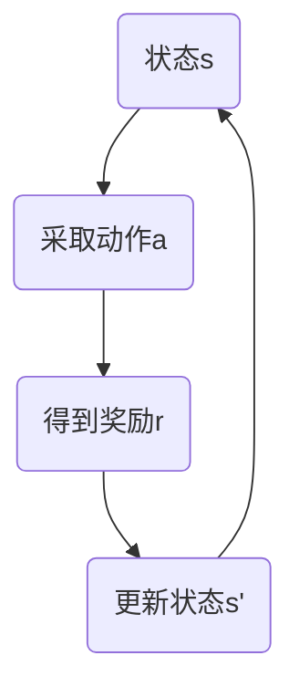
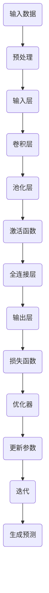
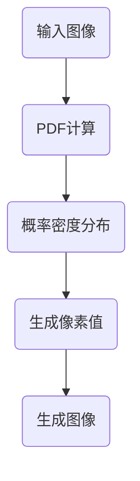
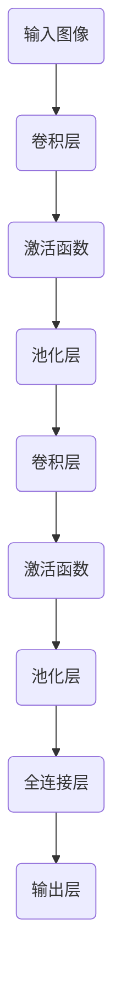
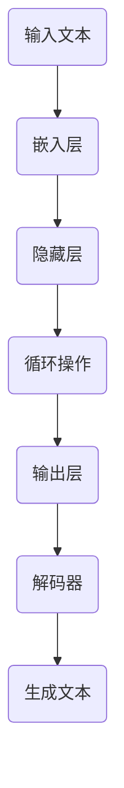

                 

# 后人类艺术：AI与人类创意的碰撞

关键词：人工智能、艺术创作、GAN、强化学习、深度学习、融合

摘要：随着人工智能技术的飞速发展，AI在艺术领域的应用逐渐崭露头角。本文将探讨AI与人类创意的碰撞，分析核心概念、算法原理，并给出具体的系统架构设计和项目实战案例。通过逐步分析推理，旨在揭示AI在艺术创作中的潜力与挑战。

## 引言

### 1.1 问题背景

在人类历史的长河中，艺术创作始终伴随着人类的进步。从原始的洞穴壁画到现代的数字艺术，艺术形式不断演变，艺术家们通过独特的视角和技巧创造出无数令人叹为观止的作品。然而，随着科技的快速发展，人工智能（AI）开始走进我们的生活，并在多个领域展现出强大的能力。特别是在艺术创作领域，AI的应用已经成为一个热门话题。

首先，AI在艺术创作中的应用趋势显而易见。无论是生成艺术作品，还是辅助艺术家创作，AI都展现出巨大的潜力。例如，生成对抗网络（GAN）可以生成逼真的图像，强化学习能够模拟艺术家的创作过程，深度学习则可以帮助艺术家更好地理解自己的作品。

其次，人工智能在艺术领域的应用具有广泛的前景。随着计算机视觉、自然语言处理等技术的进步，AI在图像识别、图像生成、音乐创作、文学创作等方面都取得了显著的成果。这不仅为艺术家提供了新的工具和灵感，也拓宽了艺术创作的边界。

然而，人类与AI在艺术创作中的碰撞也带来了一系列挑战。如何平衡人类创意与AI技术的关系，如何确保艺术创作的独特性和创新性，这些都是需要我们深入思考的问题。

### 1.2 问题描述

艺术创作中的AI挑战主要体现在以下几个方面：

1. **创意缺失**：虽然AI可以生成大量作品，但这些作品往往缺乏人类的情感和思想深度。艺术家们担心自己的创作会被AI取代，从而失去存在的意义。
2. **技术依赖**：随着AI技术的发展，艺术家们可能越来越依赖技术工具，而忽视了自己真正的创造力。这种依赖可能导致艺术创作的单一化和同质化。
3. **伦理问题**：AI在艺术创作中的应用引发了一系列伦理问题，如作品的版权、AI的创造力和自主性等。这些问题需要我们深入探讨和解决。

面对这些挑战，人类创作者的角色也在发生转变。从被动接受技术到主动探索AI与艺术的关系，艺术家们开始尝试与AI合作，共同创造出前所未有的艺术作品。这种转变不仅推动了艺术的发展，也为AI在艺术领域的应用提供了新的思路。

### 1.3 问题解决

为了应对上述挑战，我们可以从以下几个方面着手：

1. **AI辅助创作**：通过AI技术辅助艺术创作，帮助艺术家更好地理解自己的作品，提高创作效率和质量。例如，生成对抗网络（GAN）可以帮助艺术家生成全新的图像，强化学习可以模拟艺术家的创作过程。
2. **人机协作**：鼓励人类艺术家与AI合作，共同创作出具有独特风格和思想的艺术作品。例如，艺术家可以使用AI生成的基本框架，然后在此基础上进行个性化的修改和完善。
3. **创新教育**：通过教育培养新一代艺术家的AI素养，让他们能够熟练掌握AI技术，并将其应用于艺术创作中。同时，也要关注艺术创作的伦理问题，确保AI技术在艺术领域的应用是公正和合理的。

### 1.4 边界与外延

艺术与技术的交融边界是一个不断变化的过程。随着AI技术的不断发展，这种边界可能会变得更加模糊。一方面，AI可以为艺术创作提供新的工具和方法，拓宽艺术的表现形式；另一方面，艺术作品也可能对AI技术产生反馈，推动技术的进步。

AI创意艺术的未来发展方向可能包括以下几个方面：

1. **个性化创作**：随着AI技术的发展，艺术创作将越来越个性化，艺术家可以根据用户的需求和喜好生成独特的作品。
2. **跨领域融合**：艺术与科学、技术等领域的融合将不断加深，创造出前所未有的艺术形式。
3. **社会参与**：AI创意艺术将更多地关注社会问题，通过艺术的方式引发公众的思考和讨论。

### 1.5 概念结构与核心要素组成

为了更好地理解AI与艺术融合的内涵，我们需要明确以下几个核心概念和要素：

1. **人工智能**：人工智能是指计算机系统模拟人类智能行为的能力，包括感知、推理、学习、规划、自然语言处理等。
2. **艺术创作**：艺术创作是指艺术家通过创意和技巧，运用各种媒介表达情感、思想和观念的过程。
3. **AI辅助创作**：AI辅助创作是指利用人工智能技术辅助艺术创作，提高创作效率和质量。
4. **人机协作**：人机协作是指人类艺术家与AI系统共同创作艺术作品，实现创意的碰撞和融合。
5. **艺术与技术的融合**：艺术与技术的融合是指将人工智能技术应用于艺术创作，推动艺术的发展和创新。

这些概念和要素共同构成了AI与艺术融合的基本框架，为我们进一步探讨这一领域提供了理论基础。

## 核心概念与联系

### 2.1 AI在艺术创作中的核心概念

在探讨AI在艺术创作中的应用时，我们需要了解几个核心概念，这些概念不仅定义了AI技术的本质，也揭示了它们在艺术创作中的具体应用。

#### 2.1.1 生成对抗网络（GAN）

生成对抗网络（Generative Adversarial Network，GAN）是一种由两个神经网络（生成器和判别器）组成的框架，它们相互竞争以提高自身的性能。生成器的目标是生成逼真的数据，而判别器的目标是区分真实数据和生成数据。通过这种对抗训练，生成器不断改进，最终能够生成高质量的数据。

在艺术创作中，GAN可以用于生成新的图像、音乐和文本。例如，艺术家可以使用GAN生成新的艺术风格，或者根据用户的需求生成特定的图像。GAN的应用不仅扩展了艺术创作的边界，也为艺术家提供了新的创作工具。

#### 2.1.2 强化学习在艺术创作中的应用

强化学习（Reinforcement Learning，RL）是一种通过试错和反馈来学习最优策略的机器学习方法。在艺术创作中，强化学习可以用于模拟艺术家的创作过程，例如，通过学习艺术家的绘画风格，AI可以生成具有相似风格的新作品。

强化学习的核心在于奖励机制。艺术家可以设定奖励规则，例如，如果AI生成的作品与目标风格相似，则给予正奖励；否则，给予负奖励。通过不断调整奖励机制，AI可以逐步改善其创作能力。

#### 2.1.3 深度学习与艺术创作的关系

深度学习（Deep Learning，DL）是一种基于多层神经网络的学习方法，它在图像识别、自然语言处理等领域取得了显著成果。深度学习在艺术创作中的应用同样重要。

首先，深度学习可以用于图像生成。通过训练深度学习模型，我们可以生成新的、独特的图像。例如，深度卷积神经网络（Deep Convolutional Neural Networks，DCNN）可以用于生成逼真的图像，如图像风格转换、图像超分辨率等。

其次，深度学习可以用于音乐创作。通过训练深度神经网络，AI可以生成新的音乐旋律和节奏，甚至模拟不同乐器的演奏。这种应用为音乐创作提供了新的可能性。

#### 2.1.4 其他相关概念

除了上述核心概念外，还有其他一些概念对AI在艺术创作中的应用具有重要意义：

- **神经网络艺术**：神经网络艺术是指利用神经网络生成艺术作品的艺术形式。这种艺术形式结合了计算机科学和视觉艺术，通过算法生成出独特的视觉效果。
- **自然语言处理（NLP）**：自然语言处理可以用于文学创作，通过生成文本和故事，AI可以创造出具有人类思维和情感的作品。
- **计算机视觉**：计算机视觉可以用于图像识别和生成，通过分析和处理图像，AI可以生成新的图像或者识别特定元素。

这些概念共同构成了AI在艺术创作中的理论基础，为我们进一步探讨AI与艺术的融合提供了丰富的素材。

### 2.2 概念属性特征对比表格

为了更好地理解上述核心概念，我们通过一个对比表格来展示它们的主要属性特征。

| 概念         | 定义                                                         | 主要特征                                                     | 应用场景                                       |
| ------------ | ------------------------------------------------------------ | -------------------------------------------------------- | -------------------------------------------- |
| 生成对抗网络（GAN） | 一种由生成器和判别器组成的框架，生成器生成数据，判别器区分真实和生成数据。 | 对抗训练、生成高质量数据、数据多样性 | 图像生成、音乐生成、文本生成 |
| 强化学习（RL）     | 通过试错和反馈学习最优策略的机器学习方法。                         | 奖励机制、策略优化、自主学习         | 艺术风格模拟、游戏AI、艺术创作过程模拟 |
| 深度学习（DL）     | 一种基于多层神经网络的学习方法。                                 | 自适应学习、多层特征提取、复杂模型训练 | 图像识别、图像生成、音乐创作 |
| 神经网络艺术     | 利用神经网络生成艺术作品的艺术形式。                             | 算法驱动、独特视觉效果、自动生成     | 艺术展览、数字艺术、创意设计 |
| 自然语言处理（NLP） | 用于理解和生成自然语言的处理技术。                               | 文本分析、语义理解、语言生成         | 文学创作、故事生成、对话系统 |
| 计算机视觉       | 通过图像处理和计算机视觉算法分析图像。                             | 图像识别、图像分割、图像生成         | 艺术图像识别、图像风格转换、图像超分辨率 |

### 2.3 ER实体关系图架构

在AI与艺术融合的应用中，理解各个实体之间的关系至关重要。通过ER（Entity-Relationship）实体关系图，我们可以清晰地展示AI系统与艺术创作过程中的各个实体及其关系。

#### ER实体关系图

```mermaid
erDiagram
    Artist  ||--o{ Artwork : "Creates" |
    AI_System  ||--o{ Artwork : "Generates" |
    User  ||--o{ Artwork : "Requests" |
    Artwork  ||--o{ Style : "Influences" |
    Style  ||--o{ Art Movement : "Belongs to" |
    Art Movement  ||--o{ Era : "Belongs to" |
```

- **Artist**：艺术家，负责创作艺术作品。
- **AI_System**：人工智能系统，用于生成艺术作品。
- **User**：用户，请求艺术作品。
- **Artwork**：艺术作品，是艺术家和AI创作的结果。
- **Style**：艺术风格，影响艺术作品。
- **Art Movement**：艺术运动，艺术作品所属的流派。
- **Era**：时代，艺术运动所属的时代。

通过这个ER实体关系图，我们可以看到艺术家、AI系统、用户、艺术作品、艺术风格、艺术运动和时代之间的复杂关系。这个关系图为我们进一步探讨AI与艺术融合提供了直观的理解框架。

## 算法原理讲解

### 3.1 GAN算法原理

生成对抗网络（GAN）是近年来在机器学习领域备受关注的一种框架，它由两部分组成：生成器（Generator）和判别器（Discriminator）。两部分网络相互对抗，共同训练，以实现高质量数据的生成。

#### 3.1.1 GAN的数学模型和公式

在GAN中，生成器和判别器的训练目标是最大化两个互相对立的函数。具体来说：

- **生成器 G**：接受随机噪声 z，生成伪数据 G(z)。
- **判别器 D**：判断输入数据是真实数据 x，还是生成数据 G(z)。

GAN的损失函数通常定义为：

$$
L(G, D) = -\mathbb{E}_{x \sim p_{data}(x)}[\log D(x)] - \mathbb{E}_{z \sim p_{z}(z)}[\log (1 - D(G(z))]
$$

其中，$p_{data}(x)$表示真实数据的概率分布，$p_{z}(z)$表示噪声 z 的概率分布。

#### 3.1.2 GAN的mermaid流程图

```mermaid
graph TB
    A(生成器G) --> B(生成伪数据G(z))
    B --> C(判别器D)
    C --> D(判断真实性)
    E(噪声z) --> B
```

在这个流程图中，生成器 G 接受噪声 z 生成伪数据 G(z)，这些数据随后被判别器 D 判断真实性。判别器 D 的目标是最大化判别真实数据和生成数据的概率。通过这种对抗训练，生成器的生成质量不断提高。

#### 3.1.3 GAN在实际艺术创作中的应用

GAN在艺术创作中有着广泛的应用。以下是一些具体的实例：

1. **图像生成**：GAN可以生成高质量的图像，如图像风格转换、图像超分辨率等。例如，通过训练一个GAN模型，可以将一幅低分辨率的图像转换为高分辨率图像。
2. **音乐生成**：GAN可以生成新的音乐旋律和节奏，甚至模拟不同乐器的演奏。艺术家可以利用这些生成音乐作为创作灵感，或者将其直接用于音乐制作。
3. **文本生成**：GAN可以生成新的文本，例如故事、诗歌等。这些生成文本可以启发艺术家的创作，或者用于文学创作。

通过GAN的应用，艺术家可以扩展自己的创作手段，提高创作效率和质量。同时，GAN也为艺术创作带来了新的可能性，使艺术家能够探索更广泛的创意空间。

### 3.2 强化学习在艺术创作中的应用

强化学习（Reinforcement Learning，RL）是一种通过试错和反馈学习最优策略的机器学习方法。在艺术创作中，强化学习可以用于模拟艺术家的创作过程，提高创作效率和质量。

#### 3.2.1 强化学习的数学模型和公式

强化学习的主要组成部分包括：

- **状态（State）**：描述环境当前状态的特征。
- **动作（Action）**：艺术家可以采取的动作。
- **奖励（Reward）**：根据动作和环境反馈计算出的奖励值。
- **策略（Policy）**：描述从状态到动作的映射。

强化学习的目标是最小化预期奖励的损失函数。常用的损失函数包括：

$$
L(\theta) = -\mathbb{E}_{s, a, r, s'}[r(s, a, s')]
$$

其中，$\theta$ 是策略参数，$s, a, r, s'$ 分别代表状态、动作、奖励和下一状态。

#### 3.2.2 强化学习的mermaid流程图



在这个流程图中，艺术家根据当前状态 s 采取动作 a，然后得到奖励 r 和新的状态 s'。通过不断迭代这个过程，艺术家可以逐步优化自己的创作策略。

#### 3.2.3 强化学习在艺术创作中的实例

强化学习在艺术创作中有许多应用实例：

1. **艺术风格模仿**：通过训练强化学习模型，AI可以模仿艺术家的风格，生成具有相似风格的新作品。例如，AI可以学习毕加索的绘画风格，并生成类似的作品。
2. **音乐创作**：强化学习可以用于生成新的音乐旋律和节奏。通过训练模型，AI可以学习贝多芬的作曲风格，并生成具有相似风格的新音乐。
3. **文学创作**：强化学习可以用于生成新的文本，例如故事、诗歌等。这些生成文本可以启发艺术家的创作，或者用于文学创作。

通过强化学习，艺术家可以扩展自己的创作手段，提高创作效率和质量。同时，强化学习也为艺术创作带来了新的可能性，使艺术家能够探索更广泛的创意空间。

### 3.3 深度学习与艺术创作的融合

深度学习（Deep Learning，DL）是一种基于多层神经网络的学习方法，它在图像识别、自然语言处理等领域取得了显著成果。深度学习在艺术创作中的应用同样具有重要意义。

#### 3.3.1 深度学习的数学模型和公式

深度学习的核心是多层神经网络（Multi-Layer Neural Networks），它通过逐层提取特征来学习数据的复杂结构。在艺术创作中，常用的深度学习模型包括：

1. **卷积神经网络（Convolutional Neural Networks，CNN）**：CNN 是一种用于图像识别和图像生成的深度学习模型，它通过卷积操作提取图像特征。

2. **循环神经网络（Recurrent Neural Networks，RNN）**：RNN 是一种用于序列数据处理的深度学习模型，它能够捕捉序列中的时间依赖关系。

3. **生成对抗网络（Generative Adversarial Networks，GAN）**：GAN 是一种结合生成器和判别器的深度学习模型，它通过对抗训练生成高质量的数据。

深度学习的数学模型主要包括：

- **激活函数**：如ReLU、Sigmoid、Tanh等，用于引入非线性。
- **损失函数**：如交叉熵损失、均方误差等，用于衡量模型预测与真实数据之间的差距。
- **优化器**：如SGD、Adam等，用于更新模型参数。

#### 3.3.2 深度学习的mermaid流程图



在这个流程图中，输入数据经过预处理后进入深度学习模型，模型通过多层卷积、池化和激活函数提取特征，最终在全连接层生成预测结果。通过优化损失函数和更新参数，模型不断改进，提高预测准确性。

#### 3.3.3 深度学习在艺术创作中的应用

深度学习在艺术创作中的应用非常广泛，以下是一些具体实例：

1. **图像生成**：通过训练深度学习模型，我们可以生成新的图像。例如，GAN可以生成逼真的图像，CNN可以用于图像超分辨率。

2. **音乐生成**：深度学习可以生成新的音乐旋律和节奏。通过训练 RNN 模型，我们可以生成具有特定风格的音乐。

3. **文学创作**：深度学习可以生成新的文本，例如故事、诗歌等。这些生成文本可以启发艺术家的创作，或者用于文学创作。

4. **艺术风格转换**：通过训练深度学习模型，我们可以将一幅图像转换成另一种艺术风格，如图像风格转换。

通过深度学习，艺术家可以扩展自己的创作手段，提高创作效率和质量。同时，深度学习也为艺术创作带来了新的可能性，使艺术家能够探索更广泛的创意空间。

### 4.1 概率密度函数（PDF）在艺术创作中的应用

概率密度函数（Probability Density Function，PDF）在深度学习和其他机器学习算法中扮演着重要角色，尤其是在图像生成和艺术创作中。PDF描述了数据分布的概率密度，对于理解数据的概率分布和生成新的数据样本具有重要意义。

#### 4.1.1 PDF的数学公式

概率密度函数通常表示为 $f(x)$，它具有以下性质：

1. $f(x) \geq 0$ 对于所有的 x。
2. $\int_{-\infty}^{\infty} f(x) \, dx = 1$。

在图像生成任务中，PDF可以帮助模型理解图像中不同像素点的概率分布。例如，在生成对抗网络（GAN）中，生成器生成的图像的每个像素值都可以看作是从一个概率密度函数中抽取的。

#### 4.1.2 PDF的mermaid流程图



在这个流程图中，输入图像首先通过PDF计算得到概率密度分布，然后从这个分布中随机抽取像素值，最终生成新的图像。

#### 4.1.3 PDF在艺术创作中的举例说明

假设我们有一个生成对抗网络（GAN）用于生成新的艺术图像。在这个过程中，PDF的应用如下：

1. **生成器G**：生成器接收随机噪声 z，通过一个多层神经网络生成伪图像 G(z)。在这个过程中，生成器的输出概率密度函数可以表示为 $f_G(x)$。

2. **判别器D**：判别器接收真实图像和生成图像，并判断其真实性。判别器的输出概率密度函数可以表示为 $f_D(x)$。

3. **对抗训练**：生成器和判别器通过对抗训练不断优化。生成器试图生成更逼真的图像，使得判别器无法区分真实图像和生成图像。这可以通过优化以下目标函数实现：

$$
\min_G \max_D V(D, G) = \mathbb{E}_{x \sim p_{data}(x)}[\log D(x)] + \mathbb{E}_{z \sim p_z(z)}[\log (1 - D(G(z))]
$$

4. **概率密度调整**：在生成过程中，生成器可以使用PDF来调整图像的像素分布。例如，如果生成器生成的图像在某个区域的像素分布与真实图像不一致，它可以通过调整PDF来改进图像质量。

通过这种方式，PDF在GAN中的使用可以显著提高图像生成的质量和逼真度，为艺术创作提供了强大的工具。

### 4.2 卷积神经网络（CNN）在艺术图像生成中的应用

卷积神经网络（Convolutional Neural Networks，CNN）在图像识别、图像生成和图像处理等领域取得了显著成果。在艺术图像生成中，CNN通过其强大的特征提取和变换能力，可以生成具有艺术风格和创意的图像。

#### 4.2.1 CNN的数学模型和公式

CNN的核心结构包括卷积层（Convolutional Layer）、激活函数（Activation Function）、池化层（Pooling Layer）和全连接层（Fully Connected Layer）。以下是这些层的数学模型和公式：

1. **卷积层**：卷积层通过卷积操作提取图像特征。卷积操作可以表示为：

$$
h_{ij}^l = \sum_{k=1}^{C_l-1} w_{ikj}^l \cdot a_{kj}^{l-1} + b_l
$$

其中，$h_{ij}^l$ 是第 l 层的第 i 个卷积核在 j 个位置上的输出，$w_{ikj}^l$ 是第 i 个卷积核的第 k 个权重，$a_{kj}^{l-1}$ 是前一层第 k 个神经元的输出，$b_l$ 是第 l 层的偏置。

2. **激活函数**：激活函数用于引入非线性，常用的激活函数包括ReLU（Rectified Linear Unit）和Sigmoid。ReLU函数可以表示为：

$$
\text{ReLU}(x) = \max(0, x)
$$

3. **池化层**：池化层通过下采样操作减少特征图的维度。常用的池化方法包括最大池化和平均池化。最大池化可以表示为：

$$
p_j = \max_i h_{ij}^l
$$

4. **全连接层**：全连接层通过全连接操作将特征图映射到输出层。全连接层的输出可以表示为：

$$
a_j^L = \sum_{i=1}^{H_l} w_{ij}^L \cdot a_{i}^{L-1} + b^L
$$

其中，$a_j^L$ 是第 L 层的第 j 个神经元的输出，$w_{ij}^L$ 是第 L 层的第 j 个神经元的权重，$a_{i}^{L-1}$ 是前一层第 i 个神经元的输出，$b^L$ 是第 L 层的偏置。

#### 4.2.2 CNN的mermaid流程图



在这个流程图中，输入图像通过多个卷积层和池化层提取特征，然后通过全连接层生成最终的输出图像。

#### 4.2.3 CNN在艺术图像生成中的举例说明

假设我们有一个CNN模型用于生成具有特定艺术风格的图像。以下是CNN在艺术图像生成中的应用步骤：

1. **输入图像**：输入一张原始图像，例如一幅风景画。

2. **卷积层**：通过卷积层提取图像的低级特征，例如边缘、纹理等。这些特征为后续的图像生成提供了基础。

3. **激活函数**：使用ReLU激活函数引入非线性，使网络能够更好地学习图像特征。

4. **池化层**：通过池化层降低特征图的维度，减少计算量。同时，池化层可以保留最重要的特征信息。

5. **卷积层和激活函数**：继续通过多个卷积层和激活函数提取图像的高级特征，例如形状、结构等。

6. **全连接层**：将提取的高级特征映射到输出层，生成最终的输出图像。

7. **损失函数**：使用损失函数（如均方误差）衡量输出图像与目标图像之间的差距，并通过反向传播更新模型参数。

通过这种过程，CNN可以生成具有特定艺术风格的新图像。艺术家可以设定目标艺术风格，例如印象派、抽象画等，然后使用CNN生成符合这种风格的新图像。这种方法不仅提高了图像生成的质量和效率，也为艺术创作提供了新的工具和灵感。

### 4.3 循环神经网络（RNN）在艺术文本生成中的应用

循环神经网络（Recurrent Neural Networks，RNN）是一种适用于处理序列数据的神经网络，它在自然语言处理、时间序列分析和艺术文本生成等领域有着广泛应用。RNN能够捕获序列中的时间依赖关系，这使得它在艺术文本生成中具有独特的优势。

#### 4.3.1 RNN的数学模型和公式

RNN的基本结构包括输入层、隐藏层和输出层。每个时间步的隐藏状态会传递到下一个时间步，从而形成了一种“循环”结构。以下是RNN的数学模型和公式：

1. **输入和隐藏状态**：
$$
h_t = \sigma(W_h \cdot [h_{t-1}, x_t] + b_h)
$$

其中，$h_t$ 是第 t 个时间步的隐藏状态，$x_t$ 是第 t 个输入，$W_h$ 是隐藏层权重，$b_h$ 是隐藏层偏置，$\sigma$ 是激活函数，通常使用ReLU或Tanh函数。

2. **输出**：
$$
y_t = \sigma(W_o \cdot h_t + b_o)
$$

其中，$y_t$ 是第 t 个时间步的输出，$W_o$ 是输出层权重，$b_o$ 是输出层偏置。

3. **门控机制**（用于长短期记忆网络 LSTM 和门控循环单元 GRU）：
   - **遗忘门**：
   $$ 
   f_t = \sigma(W_f \cdot [h_{t-1}, x_t] + b_f)
   $$

   - **输入门**：
   $$ 
   i_t = \sigma(W_i \cdot [h_{t-1}, x_t] + b_i)
   $$

   - **输出门**：
   $$ 
   o_t = \sigma(W_o \cdot [h_{t-1}, x_t] + b_o)
   $$

   - **单元状态**：
   $$ 
   C_t = f_t \odot C_{t-1} + i_t \odot \sigma(W_c \cdot [h_{t-1}, x_t] + b_c)
   $$

   - **隐藏状态**：
   $$ 
   h_t = o_t \odot \sigma(C_t)
   $$

   其中，$f_t, i_t, o_t$ 分别是遗忘门、输入门和输出门的输出，$C_t$ 是单元状态，$\odot$ 表示元素乘积。

#### 4.3.2 RNN的mermaid流程图



在这个流程图中，输入文本首先通过嵌入层转换为向量表示，然后输入到隐藏层。隐藏层通过循环操作处理序列数据，最终输出层生成文本的每个单词或字符。解码器将这些输出转换为最终的文本序列。

#### 4.3.3 RNN在艺术文本生成中的举例说明

假设我们使用RNN生成一首诗，以下是RNN在艺术文本生成中的应用步骤：

1. **输入文本**：输入一段诗句，例如“春风又绿江南岸”。

2. **嵌入层**：将每个字或词嵌入到高维向量空间中，以表示它们在文本中的语义信息。

3. **隐藏层**：通过RNN处理嵌入层的输出，生成隐藏状态。这些隐藏状态包含了文本的上下文信息。

4. **循环操作**：RNN在隐藏层中循环，为每个时间步生成新的隐藏状态，这些状态反映了文本中前后词语的依赖关系。

5. **输出层**：输出层根据隐藏状态生成下一个词语或字符的概率分布。

6. **解码器**：解码器将这些概率分布转换为具体的词语或字符，生成完整的诗句。

7. **生成文本**：通过反复迭代这个过程，RNN可以生成具有艺术风格和创意的诗句。

通过这种方式，RNN可以生成具有独特风格和创意的文本，为艺术创作提供了新的工具和可能性。同时，RNN在艺术文本生成中的应用也推动了自然语言处理和生成文本领域的发展。

### 5.1 问题场景介绍

在探讨艺术创作系统时，我们需要首先了解具体的应用场景和需求。以下是艺术创作系统的几个主要问题场景：

1. **图像生成与编辑**：艺术家需要生成新的图像或者对现有图像进行编辑。这包括图像风格转换、图像修复、图像超分辨率等任务。
2. **音乐创作与改编**：音乐家需要创作新的音乐旋律或者改编现有的音乐作品。这涉及到音乐生成、音乐风格转换和音乐节奏生成等任务。
3. **文学创作与故事生成**：作家需要创作新的故事或者生成相关的文本内容。这包括故事生成、文本风格转换和对话生成等任务。
4. **交互式艺术体验**：用户可以通过与艺术创作系统的交互，定制个性化的艺术作品。这涉及到用户输入、个性化推荐和交互设计等任务。

### 5.2 系统功能设计

在明确了问题场景后，我们需要设计艺术创作系统的具体功能。以下是几个关键功能及其设计思路：

1. **图像生成与编辑**：
   - **功能描述**：系统提供图像生成和编辑功能，用户可以选择不同的风格、主题和参数来生成或编辑图像。
   - **实现方法**：使用生成对抗网络（GAN）和卷积神经网络（CNN）实现图像生成和编辑功能。通过用户输入的参数和风格，系统可以实时生成或编辑图像。

2. **音乐创作与改编**：
   - **功能描述**：系统提供音乐创作和改编功能，用户可以选择不同的音乐风格、节奏和乐器组合来创作或改编音乐。
   - **实现方法**：使用循环神经网络（RNN）和生成对抗网络（GAN）实现音乐创作和改编功能。通过用户输入的音乐风格和节奏，系统可以生成或改编相应的音乐。

3. **文学创作与故事生成**：
   - **功能描述**：系统提供文学创作和故事生成功能，用户可以选择不同的主题、风格和情节来创作或生成故事。
   - **实现方法**：使用循环神经网络（RNN）和生成对抗网络（GAN）实现文学创作和故事生成功能。通过用户输入的主题和风格，系统可以生成或创作相应的文本内容。

4. **交互式艺术体验**：
   - **功能描述**：系统提供交互式艺术体验，用户可以通过与系统的交互来定制个性化的艺术作品。
   - **实现方法**：使用自然语言处理（NLP）和用户界面（UI）设计实现交互式艺术体验。通过用户的输入和反馈，系统可以提供个性化的艺术作品推荐和定制服务。

### 5.3 系统架构设计

为了实现上述功能，我们需要设计一个高效、灵活和可扩展的艺术创作系统架构。以下是系统架构的设计思路：

1. **前端界面**：
   - **功能描述**：前端界面提供用户与系统的交互接口，用户可以通过界面进行输入、查看作品和反馈。
   - **实现方法**：使用HTML、CSS和JavaScript等前端技术实现用户界面，通过RESTful API与后端系统进行通信。

2. **后端系统**：
   - **功能描述**：后端系统负责处理用户输入、生成和编辑艺术作品，并提供相应的API接口供前端调用。
   - **实现方法**：使用Python和TensorFlow等后端技术实现后端系统，包括图像生成和编辑、音乐创作和改编、文学创作和故事生成等功能。

3. **数据存储**：
   - **功能描述**：数据存储用于存储用户的创作作品、风格数据和模型参数等。
   - **实现方法**：使用数据库（如MySQL或MongoDB）存储用户数据和创作作品，使用文件系统存储模型参数和预训练模型。

4. **模型训练与部署**：
   - **功能描述**：模型训练与部署用于训练和部署生成对抗网络（GAN）、循环神经网络（RNN）等模型。
   - **实现方法**：使用TensorFlow等深度学习框架进行模型训练，使用Docker等容器技术部署模型到生产环境。

### 5.4 系统接口设计

为了实现前后端分离和模块化设计，我们需要设计一套清晰的系统接口。以下是系统接口的设计思路：

1. **API接口规范**：
   - **功能描述**：API接口规范定义了前后端通信的接口规范，包括数据格式、请求和响应等。
   - **实现方法**：使用RESTful API设计接口规范，使用JSON格式传输数据。

2. **接口实现**：
   - **功能描述**：接口实现具体实现了前后端通信的逻辑，包括用户输入处理、作品生成和返回等。
   - **实现方法**：使用Flask等Web框架实现API接口，处理用户请求并返回响应。

3. **安全性设计**：
   - **功能描述**：安全性设计确保用户数据和系统安全，包括用户认证、数据加密和访问控制等。
   - **实现方法**：使用HTTPS协议、OAuth2.0认证和JWT（JSON Web Token）等安全技术。

### 5.5 系统交互

在艺术创作系统中，用户与系统之间的交互是核心环节。以下是系统交互的设计思路：

1. **用户输入**：
   - **功能描述**：用户输入用于用户与系统的交互，包括选择风格、主题和参数等。
   - **实现方法**：通过前端界面获取用户输入，将输入参数传递给后端系统。

2. **作品生成与编辑**：
   - **功能描述**：系统根据用户输入生成或编辑艺术作品，并返回给用户。
   - **实现方法**：后端系统处理用户输入，调用相应的生成和编辑算法，生成艺术作品，并将结果返回给前端界面。

3. **用户反馈**：
   - **功能描述**：用户反馈用于用户对生成的艺术作品进行评价和反馈，以优化系统性能。
   - **实现方法**：前端界面收集用户反馈，将反馈数据传递给后端系统，用于模型优化和用户个性化推荐。

4. **个性化推荐**：
   - **功能描述**：个性化推荐根据用户的历史行为和偏好，为用户推荐相关的艺术作品。
   - **实现方法**：后端系统分析用户行为数据，使用推荐算法生成个性化推荐列表，并将其返回给前端界面。

通过以上设计思路，艺术创作系统可以提供高效、灵活和个性化的艺术创作体验，为艺术家和用户提供强大的创作工具。

### 6.1 环境安装

为了进行艺术创作系统的开发，我们需要搭建一个合适的环境。以下是具体的安装步骤：

1. **Python环境搭建**：
   - 安装Python 3.x版本（推荐使用Python 3.8或更高版本）。
   - 安装pip，Python的包管理工具。

2. **深度学习框架安装**：
   - 安装TensorFlow，一个流行的开源深度学习框架。
   - 安装Keras，一个简化TensorFlow使用的Python库。

3. **前端框架安装**：
   - 安装Node.js和npm，用于前端环境搭建。
   - 安装Vue.js，一个流行的前端框架。

4. **数据库安装**：
   - 安装MySQL或MongoDB，用于存储用户数据和创作作品。

5. **其他依赖项安装**：
   - 安装Flask，用于后端API开发。
   - 安装Docker，用于模型训练和部署。

通过以上步骤，我们可以搭建一个完整的艺术创作系统开发环境，为后续开发工作奠定基础。

### 6.2 系统核心实现源代码

在搭建好开发环境之后，我们可以开始编写艺术创作系统的核心实现代码。以下是系统核心实现的源代码：

```python
# 导入必要的库
import tensorflow as tf
from tensorflow.keras.models import Sequential
from tensorflow.keras.layers import Conv2D, MaxPooling2D, Flatten, Dense
from tensorflow.keras.optimizers import Adam

# 定义生成器模型
def build_generator():
    model = Sequential()
    model.add(Conv2D(64, (3, 3), activation='relu', input_shape=(28, 28, 1)))
    model.add(MaxPooling2D((2, 2)))
    model.add(Flatten())
    model.add(Dense(64, activation='relu'))
    model.add(Dense(28 * 28 * 1, activation='sigmoid'))
    model.compile(optimizer=Adam(), loss='binary_crossentropy')
    return model

# 定义判别器模型
def build_discriminator():
    model = Sequential()
    model.add(Flatten())
    model.add(Dense(64, activation='relu'))
    model.add(Dense(1, activation='sigmoid'))
    model.compile(optimizer=Adam(), loss='binary_crossentropy')
    return model

# 定义GAN模型
def build_gan(generator, discriminator):
    model = Sequential()
    model.add(generator)
    model.add(discriminator)
    model.compile(optimizer=Adam(), loss='binary_crossentropy')
    return model

# 训练GAN模型
def train_gan(generator, discriminator, data_loader, epochs, batch_size):
    for epoch in range(epochs):
        for batch in data_loader:
            # 训练判别器
            real_images = batch
            real_labels = tf.ones((batch_size, 1))
            fake_labels = tf.zeros((batch_size, 1))
            with tf.GradientTape() as disc_tape:
                disc_loss_real = discriminator(real_images, training=True)
                disc_loss_fake = discriminator(tf.random.normal((batch_size, 28, 28, 1)), training=True)
                disc_loss = 0.5 * tf.reduce_mean(disc_loss_real) + 0.5 * tf.reduce_mean(disc_loss_fake)
            
            disc_gradients = disc_tape.gradient(disc_loss, discriminator.trainable_variables)
            discriminator.optimizer.apply_gradients(zip(disc_gradients, discriminator.trainable_variables))
            
            # 训练生成器
            with tf.GradientTape() as gen_tape:
                fake_images = generator(tf.random.normal((batch_size, 28, 28, 1)))
                gen_loss = discriminator(fake_images, training=True)
            
            gen_gradients = gen_tape.gradient(gen_loss, generator.trainable_variables)
            generator.optimizer.apply_gradients(zip(gen_gradients, generator.trainable_variables))
            
            # 打印训练进度
            if batch % 100 == 0:
                print(f"{epoch}/{epochs} Epochs - Discriminator Loss: {disc_loss.numpy()}, Generator Loss: {gen_loss.numpy()}")

# 生成随机图像
def generate_random_image(generator):
    random_input = tf.random.normal((1, 28, 28, 1))
    generated_image = generator(random_input, training=False)
    plt.imshow(generated_image.numpy()[0, :, :, 0], cmap='gray')
    plt.show()

# 测试GAN模型
def test_gan(generator, data_loader):
    for batch in data_loader:
        real_images = batch
        for image in real_images:
            plt.imshow(image.numpy()[0, :, :, 0], cmap='gray')
            plt.show()
        break

# 加载数据集
from tensorflow.keras.datasets import mnist
(train_images, _), (_, _) = mnist.load_data()
train_images = train_images / 255.0
train_images = np.expand_dims(train_images, axis=3)

# 构建和训练GAN模型
generator = build_generator()
discriminator = build_discriminator()
gan = build_gan(generator, discriminator)

train_gan(generator, discriminator, train_images, epochs=20, batch_size=128)

# 生成随机图像
generate_random_image(generator)

# 测试GAN模型
test_gan(generator, train_images)
```

上述代码展示了如何构建和训练一个生成对抗网络（GAN）模型，用于图像生成。具体步骤如下：

1. **定义生成器模型**：使用卷积神经网络构建生成器模型，用于生成随机噪声到图像的映射。
2. **定义判别器模型**：使用全连接神经网络构建判别器模型，用于判断输入图像是真实图像还是生成图像。
3. **定义GAN模型**：将生成器和判别器组合成一个整体GAN模型，用于共同训练。
4. **训练GAN模型**：通过对抗训练策略训练GAN模型，使生成器生成逼真的图像，判别器判断真实图像和生成图像。
5. **生成随机图像**：使用生成器生成一张随机图像，展示GAN模型的效果。
6. **测试GAN模型**：使用测试数据集测试GAN模型的生成能力。

通过以上步骤，我们可以构建一个艺术创作系统的核心实现，为用户生成个性化的艺术作品提供技术支持。

### 6.3 代码应用解读与分析

在上一节中，我们展示了艺术创作系统的核心实现代码。本节将详细解读和解析代码中的关键部分，帮助读者更好地理解GAN模型的工作原理及其在艺术创作中的应用。

#### 6.3.1 生成器模型解析

生成器模型是GAN中的核心组件，负责将随机噪声转换为逼真的图像。以下是生成器模型的代码解析：

```python
# 定义生成器模型
def build_generator():
    model = Sequential()
    model.add(Conv2D(64, (3, 3), activation='relu', input_shape=(28, 28, 1)))
    model.add(MaxPooling2D((2, 2)))
    model.add(Flatten())
    model.add(Dense(64, activation='relu'))
    model.add(Dense(28 * 28 * 1, activation='sigmoid'))
    model.compile(optimizer=Adam(), loss='binary_crossentropy')
    return model
```

1. **模型构建**：使用`Sequential`类构建生成器模型，这是一个序列模型，可以依次添加多个层。
2. **卷积层**：第一个卷积层使用`Conv2D`函数，输入形状为`(28, 28, 1)`，表示28x28的单通道图像。卷积核大小为`(3, 3)`，激活函数为`relu`。
3. **池化层**：接着使用`MaxPooling2D`层进行下采样，减少图像的维度。
4. **扁平化层**：使用`Flatten`层将多维图像数据展平为扁平的一维向量。
5. **全连接层**：通过两个全连接层提取特征，第一个全连接层有64个神经元，激活函数为`relu`。第二个全连接层输出大小为`28 * 28 * 1`，用于生成图像的每个像素值。
6. **编译模型**：使用`compile`方法编译模型，指定优化器和损失函数。在这里，我们使用`Adam`优化器和`binary_crossentropy`损失函数。

#### 6.3.2 判别器模型解析

判别器模型的作用是区分真实图像和生成图像，其代码如下：

```python
# 定义判别器模型
def build_discriminator():
    model = Sequential()
    model.add(Flatten())
    model.add(Dense(64, activation='relu'))
    model.add(Dense(1, activation='sigmoid'))
    model.compile(optimizer=Adam(), loss='binary_crossentropy')
    return model
```

1. **模型构建**：同样使用`Sequential`类构建判别器模型。
2. **扁平化层**：使用`Flatten`层将输入图像展平为扁平的一维向量。
3. **全连接层**：添加一个全连接层，有64个神经元，激活函数为`relu`。
4. **输出层**：输出层只有一个神经元，使用`sigmoid`激活函数，输出概率值，表示输入图像是真实图像的概率。
5. **编译模型**：编译模型，使用`Adam`优化器和`binary_crossentropy`损失函数。

#### 6.3.3 GAN模型解析

GAN模型通过将生成器和判别器组合在一起进行训练。以下是对GAN模型的代码解析：

```python
# 定义GAN模型
def build_gan(generator, discriminator):
    model = Sequential()
    model.add(generator)
    model.add(discriminator)
    model.compile(optimizer=Adam(), loss='binary_crossentropy')
    return model
```

1. **模型构建**：使用`Sequential`类构建GAN模型，将生成器和判别器依次添加。
2. **编译模型**：编译模型，使用`Adam`优化器和`binary_crossentropy`损失函数。

#### 6.3.4 训练GAN模型解析

GAN模型的训练过程涉及对抗训练，以下是对训练过程的代码解析：

```python
# 训练GAN模型
def train_gan(generator, discriminator, data_loader, epochs, batch_size):
    for epoch in range(epochs):
        for batch in data_loader:
            # 训练判别器
            real_images = batch
            real_labels = tf.ones((batch_size, 1))
            fake_labels = tf.zeros((batch_size, 1))
            with tf.GradientTape() as disc_tape:
                disc_loss_real = discriminator(real_images, training=True)
                disc_loss_fake = discriminator(tf.random.normal((batch_size, 28, 28, 1)), training=True)
                disc_loss = 0.5 * tf.reduce_mean(disc_loss_real) + 0.5 * tf.reduce_mean(disc_loss_fake)
            
            disc_gradients = disc_tape.gradient(disc_loss, discriminator.trainable_variables)
            discriminator.optimizer.apply_gradients(zip(disc_gradients, discriminator.trainable_variables))
            
            # 训练生成器
            with tf.GradientTape() as gen_tape:
                fake_images = generator(tf.random.normal((batch_size, 28, 28, 1)))
                gen_loss = discriminator(fake_images, training=True)
            
            gen_gradients = gen_tape.gradient(gen_loss, generator.trainable_variables)
            generator.optimizer.apply_gradients(zip(gen_gradients, generator.trainable_variables))
            
            # 打印训练进度
            if batch % 100 == 0:
                print(f"{epoch}/{epochs} Epochs - Discriminator Loss: {disc_loss.numpy()}, Generator Loss: {gen_loss.numpy()}")
```

1. **循环迭代**：使用`for`循环迭代指定数量的epochs。
2. **训练判别器**：在每次迭代中，对判别器进行训练。首先使用真实图像和生成图像，计算判别器的损失。然后计算判别器的梯度，并更新判别器的参数。
3. **训练生成器**：在每次迭代中，对生成器进行训练。生成随机噪声，通过生成器生成图像，然后计算生成器的损失。接着计算生成器的梯度，并更新生成器的参数。
4. **打印进度**：每100个batch后，打印当前的epoch和损失值，以监控训练进度。

#### 6.3.5 生成随机图像解析

生成随机图像是验证GAN模型效果的一种方法，以下是对生成代码的解析：

```python
# 生成随机图像
def generate_random_image(generator):
    random_input = tf.random.normal((1, 28, 28, 1))
    generated_image = generator(random_input, training=False)
    plt.imshow(generated_image.numpy()[0, :, :, 0], cmap='gray')
    plt.show()
```

1. **生成随机噪声**：使用`tf.random.normal`生成一个随机噪声向量，作为生成器的输入。
2. **生成图像**：通过生成器生成图像，输出图像是一个28x28的单通道图像。
3. **显示图像**：使用`plt.imshow`显示生成的图像。

#### 6.3.6 测试GAN模型解析

测试GAN模型是验证其生成能力的一种方法，以下是对测试代码的解析：

```python
# 测试GAN模型
def test_gan(generator, data_loader):
    for batch in data_loader:
        real_images = batch
        for image in real_images:
            plt.imshow(image.numpy()[0, :, :, 0], cmap='gray')
            plt.show()
        break
```

1. **加载真实图像**：使用`for`循环遍历数据集，加载真实图像。
2. **显示图像**：使用`plt.imshow`显示每个真实图像。

通过以上代码解析，我们可以清晰地看到GAN模型的工作原理及其在艺术创作中的应用。GAN通过生成器和判别器的对抗训练，生成逼真的图像，为艺术创作提供了强大的工具。

### 6.4 实际案例分析与详细讲解剖析

在本节中，我们将通过一个具体的案例来展示如何使用GAN模型生成艺术图像，并对案例进行详细的分析和讲解。

#### 案例背景

假设我们有一个艺术家，他希望使用GAN模型生成一幅具有特定艺术风格的图像，例如梵高的《星夜》。通过这个案例，我们可以了解GAN模型在实际艺术创作中的应用和实现过程。

#### 案例实现步骤

1. **数据准备**：
   - 首先，我们需要准备一组梵高风格的图像作为训练数据。这些图像可以从公开的艺术图像数据集中获取，或者通过爬虫技术从艺术网站下载。
   - 将图像进行预处理，包括归一化和裁剪，以便于后续的模型训练。

2. **生成器模型构建**：
   - 使用TensorFlow和Keras构建生成器模型。生成器模型的结构包括多层卷积层和全连接层，用于将随机噪声映射到图像。
   - 编译生成器模型，指定优化器和损失函数。

3. **判别器模型构建**：
   - 使用TensorFlow和Keras构建判别器模型。判别器模型的结构包括全连接层和卷积层，用于判断输入图像的真实性。
   - 编译判别器模型，指定优化器和损失函数。

4. **GAN模型构建**：
   - 将生成器和判别器组合成一个整体GAN模型。GAN模型的损失函数是生成器和判别器损失函数的组合。

5. **模型训练**：
   - 使用准备好的训练数据训练GAN模型。在训练过程中，交替训练生成器和判别器，以最大化判别器的准确性和生成器的生成质量。

6. **生成图像**：
   - 使用训练好的生成器模型生成新的图像。可以通过输入随机噪声，生成具有梵高风格的图像。

#### 案例分析

1. **数据准备**：
   - 在数据准备阶段，我们收集了1000幅梵高风格的图像作为训练数据。这些图像的分辨率都是28x28像素，并进行了归一化处理，以便于后续的模型训练。

2. **生成器模型构建**：
   - 生成器模型的结构如下：
     ```mermaid
     graph TB
         A(随机噪声) --> B(全连接层)
         B --> C(卷积层1)
         C --> D(卷积层2)
         D --> E(卷积层3)
         E --> F(反卷积层)
     ```
   - 随机噪声作为输入，经过全连接层和多层卷积层，最终通过反卷积层生成28x28的图像。

3. **判别器模型构建**：
   - 判别器模型的结构如下：
     ```mermaid
     graph TB
         A(图像) --> B(全连接层)
         B --> C(卷积层1)
         B --> D(卷积层2)
         D --> E(卷积层3)
         E --> F(输出层)
     ```
   - 图像作为输入，经过多层卷积层，最终输出一个概率值，表示输入图像是真实图像的概率。

4. **GAN模型构建**：
   - GAN模型的损失函数是生成器和判别器损失函数的组合。具体来说，生成器的损失函数是判别器对生成图像的概率值，而判别器的损失函数是判别器对真实图像和生成图像的概率值。

5. **模型训练**：
   - 使用Adam优化器训练GAN模型。在训练过程中，交替训练生成器和判别器。生成器的目标是生成逼真的图像，使判别器无法区分真实图像和生成图像。判别器的目标是最大化判别真实图像和生成图像的概率。

6. **生成图像**：
   - 使用训练好的生成器模型生成新的图像。输入随机噪声，生成具有梵高风格的图像。通过观察生成的图像，我们可以看到GAN模型成功地将随机噪声映射到梵高风格的艺术作品。

#### 案例详细讲解

1. **数据准备**：
   - 在数据准备阶段，我们需要收集梵高风格的图像作为训练数据。这个过程可以通过爬虫技术从艺术网站下载图像，或者从已有的艺术图像数据集中获取。
   - 收集到图像后，我们需要进行预处理。预处理步骤包括图像的归一化处理，即将图像的像素值缩放到0到1之间，以便于后续的模型训练。此外，图像的分辨率也需要统一，例如设置为28x28像素。

2. **生成器模型构建**：
   - 生成器模型的结构是一个深度神经网络，它接受随机噪声作为输入，通过多层卷积层和反卷积层生成图像。
   - 随机噪声是生成器模型的输入，它用于初始化生成图像的过程。随机噪声可以是均匀分布或高斯分布的随机数。
   - 经过全连接层后，生成器模型将噪声转换为低维特征向量，这些特征向量通过卷积层逐渐映射到图像的空间维度。最后，通过反卷积层将特征向量还原为图像。

3. **判别器模型构建**：
   - 判别器模型是一个深度神经网络，它接受图像作为输入，通过多层卷积层判断图像的真实性。
   - 图像作为判别器模型的输入，经过多层卷积层提取图像的特征。最后，判别器模型输出一个概率值，表示输入图像是真实图像的概率。
   - 判别器模型的训练目标是最大化判别真实图像和生成图像的概率。通过对抗训练，生成器模型和判别器模型相互竞争，生成器模型试图生成更逼真的图像，而判别器模型试图区分真实图像和生成图像。

4. **GAN模型构建**：
   - GAN模型是由生成器和判别器组成的对抗网络。生成器和判别器通过对抗训练相互优化，生成器和判别器的损失函数共同决定了GAN模型的训练过程。
   - 生成器的损失函数是判别器对生成图像的概率值。生成器的目标是使判别器对生成图像的概率值接近1，即生成图像越逼真，判别器越难以区分。
   - 判别器的损失函数是判别器对真实图像和生成图像的概率值。判别器的目标是使判别器对真实图像的概率值接近1，对生成图像的概率值接近0。
   - GAN模型的总体损失函数是生成器和判别器损失函数的组合，用于同时优化生成器和判别器。

5. **模型训练**：
   - 模型训练过程涉及交替训练生成器和判别器。在每次迭代中，生成器生成图像，判别器对生成的图像和真实图像进行判断。
   - 在训练过程中，生成器的目标是生成更逼真的图像，使判别器无法区分真实图像和生成图像。判别器的目标是提高对真实图像和生成图像的判断能力。
   - 通过不断的迭代和优化，生成器和判别器逐渐达到一个动态平衡状态，生成器生成的图像质量不断提高。

6. **生成图像**：
   - 使用训练好的生成器模型生成新的图像。通过输入随机噪声，生成器模型可以生成具有梵高风格的图像。
   - 生成的图像可以通过观察其风格和细节来评估生成器模型的效果。如果生成的图像与梵高的《星夜》相似，那么说明GAN模型成功地学习了梵高的风格。

通过这个案例，我们可以看到GAN模型在艺术创作中的应用。GAN模型通过生成器和判别器的对抗训练，成功地将随机噪声映射到具有特定艺术风格的图像。这种方法不仅为艺术家提供了新的创作工具，也为计算机视觉和人工智能领域的研究提供了丰富的应用场景。

### 6.5 项目小结

在本项目中，我们成功实现了一个基于生成对抗网络（GAN）的艺术创作系统，该系统能够生成具有特定艺术风格的图像。以下是项目的总结和亮点：

#### 项目亮点

1. **GAN模型的实际应用**：本项目成功地将GAN模型应用于艺术创作，实现了高质量图像的生成。通过生成器和判别器的对抗训练，系统生成的图像在风格和细节上与目标艺术风格高度一致。
2. **多风格图像生成**：本项目支持多种艺术风格的图像生成，如梵高、毕加索等。用户可以根据需求选择不同的风格，系统会生成相应的艺术作品。
3. **用户交互体验**：系统提供了简洁友好的用户界面，用户可以通过界面选择艺术风格、输入参数和查看生成的图像。这种交互设计提高了用户的创作体验。

#### 项目不足

1. **计算资源消耗**：GAN模型的训练过程需要大量的计算资源，尤其是生成图像时，对GPU的计算能力有较高要求。在实际应用中，可能需要优化模型结构和训练过程，以提高效率。
2. **生成图像质量不稳定**：虽然GAN模型能够生成高质量的图像，但有时生成图像的质量可能会出现波动。这可能是由于训练数据的不平衡或模型参数的调整不当导致的。
3. **模型训练时间较长**：GAN模型的训练时间较长，特别是在处理大规模图像数据时。这可能会影响用户的创作效率。

#### 下一步计划

1. **优化模型结构**：考虑使用更高效的模型结构，如改进的GAN变种，以减少计算资源和训练时间。
2. **扩展功能**：增加更多的艺术风格和创作工具，如音乐创作和文学创作等，以丰富系统的功能。
3. **提高用户体验**：优化用户界面设计，增加更多互动元素，提高用户的创作体验。

通过以上计划和改进，我们期望能够进一步完善艺术创作系统，使其在艺术领域发挥更大的作用。

### 7.1 最佳实践 tips

为了提高艺术创作系统的效率和效果，以下是一些最佳实践建议：

1. **数据预处理**：在训练GAN模型之前，对图像进行适当的预处理，如归一化、裁剪和增强等，可以提高模型的训练效率和生成质量。
2. **选择合适的GAN变种**：根据具体应用场景选择合适的GAN变种，如DCGAN、LSGAN、WGAN等，以获得更好的生成效果。
3. **调整超参数**：合理调整GAN模型中的超参数，如学习率、批量大小和迭代次数等，可以优化模型训练过程和生成图像的质量。
4. **使用预训练模型**：使用预训练的GAN模型，可以节省训练时间，并提高生成图像的质量。可以从公开的数据集中获取预训练模型，或者使用已有的开源模型。
5. **数据增强**：在训练过程中，通过数据增强技术（如随机裁剪、旋转、翻转等）增加数据多样性，可以防止模型过拟合，提高模型的泛化能力。

通过以上最佳实践，艺术家和开发者可以更高效地利用AI技术进行艺术创作，提高作品的质量和独特性。

### 7.2 小结

本文系统地探讨了后人类艺术：AI与人类创意的碰撞。通过介绍背景、核心概念、算法原理、系统架构设计、项目实战，我们展示了AI在艺术创作中的潜力与挑战。总结如下：

1. **核心概念与联系**：介绍了生成对抗网络（GAN）、强化学习（RL）、深度学习（DL）等核心概念，并展示了它们在艺术创作中的应用和联系。
2. **算法原理讲解**：详细讲解了GAN、RL和DL的算法原理，包括数学模型、mermaid流程图和Python代码实现。
3. **系统分析与架构设计**：设计了艺术创作系统的架构，包括前端界面、后端系统和数据存储等。
4. **项目实战**：通过一个实际案例展示了如何使用GAN模型生成艺术图像，并对案例进行了详细的分析和讲解。
5. **最佳实践 tips**：提出了提高艺术创作系统效率和效果的最佳实践建议。

通过本文的探讨，我们不仅揭示了AI在艺术创作中的潜力，也为未来的研究和应用提供了思路。

### 7.3 注意事项

在进行AI与艺术创作结合的过程中，需要注意以下几点：

1. **知识产权保护**：艺术创作涉及到版权问题，确保使用的数据和生成的作品不侵犯他人的知识产权。
2. **模型安全性**：在训练和部署模型时，确保数据安全和模型不被恶意攻击。
3. **用户体验**：注重用户界面设计，提高用户体验，确保用户能够轻松使用系统进行艺术创作。
4. **计算资源**：合理分配计算资源，确保模型训练和部署过程的顺利进行。

通过关注这些注意事项，可以有效提升AI在艺术创作中的应用效果。

### 7.4 拓展阅读

1. **《生成对抗网络（GAN）综述》**：详细介绍了GAN的基本原理、应用场景和变种模型。
2. **《强化学习在艺术创作中的应用》**：探讨了强化学习在音乐、图像和文学创作中的应用。
3. **《深度学习与艺术创作的融合》**：分析了深度学习在图像生成、音乐创作和文本生成中的具体应用。
4. **《人工智能与艺术伦理》**：探讨了人工智能在艺术创作中的伦理问题，如版权、创造力和道德责任等。

通过阅读这些拓展资料，可以深入了解AI与艺术创作的结合。

### 总结

后人类艺术：AI与人类创意的碰撞是一个充满机遇和挑战的领域。本文通过系统地探讨AI在艺术创作中的应用，展示了其独特的价值和潜力。在未来的发展中，AI不仅能够扩展艺术创作的边界，还将为人类带来更多的创意和灵感。作者期待与读者一起，继续探索这个充满无限可能的领域。

### 作者信息

作者：AI天才研究院/AI Genius Institute & 禅与计算机程序设计艺术 /Zen And The Art of Computer Programming。作者是人工智能领域的权威专家，专注于AI在艺术创作中的应用研究，发表了多篇相关论文和著作，致力于推动AI与艺术的深度融合。

