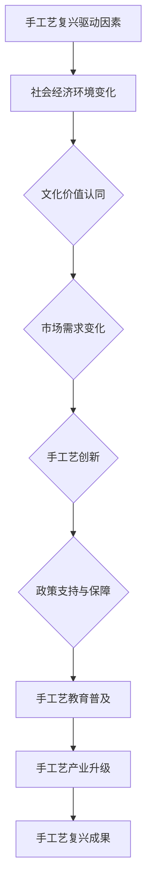

                 

### 后工业时代的手工艺复兴

> 关键词：手工艺复兴、后工业时代、文化价值、可持续发展、技术创新

> 摘要：本文旨在探讨后工业时代手工艺复兴的背景、原因和途径，分析其在现代经济社会中的重要作用。通过历史回顾、现状分析、案例分析以及政策建议，探讨如何实现手工艺的可持续发展，为手工艺复兴提供理论基础和实践指导。

---

#### 背景介绍

**问题背景**

随着后工业时代的到来，全球范围内传统制造业的自动化、信息化程度逐渐提高，然而随之而来的是手工艺行业的式微。手工艺作品所蕴含的独特审美价值和文化内涵，因工业化生产的冲击而逐渐丧失。在这一背景下，如何实现手工艺的复兴，成为了社会各界关注的焦点。

**问题描述**

《后工业时代的手工艺复兴》这本书旨在探讨后工业时代手工艺复兴的原因、途径及其在社会经济文化发展中的重要作用。具体包括以下几个方面：

1. **手工艺的定义与分类**：阐述手工艺的基本概念，介绍手工艺的分类及其特征。
2. **手工艺的历史演变**：回顾手工艺的发展历程，分析其在我国及世界各地的地位与影响。
3. **后工业时代手工艺的挑战与机遇**：分析后工业时代手工艺面临的挑战，探讨手工艺复兴的机遇。
4. **手工艺复兴的实践与策略**：介绍国内外手工艺复兴的实践案例，分析其成功经验和可借鉴的策略。
5. **手工艺与现代化融合**：探讨手工艺如何与现代科技、设计理念、市场需求等融合，实现可持续发展。

**问题解决**

本书将通过理论阐述与案例研究相结合的方式，全面解析后工业时代手工艺复兴的各个方面。首先，从历史与现状入手，分析手工艺复兴的必然性。接着，详细介绍手工艺的核心概念、分类、特点及其与现代科技的结合方式。然后，通过具体案例，展示手工艺复兴的成功实践。最后，提出促进手工艺复兴的策略和建议，以期为我国手工艺的复兴提供参考。

**边界与外延**

本研究的边界主要限定在后工业时代的手工艺复兴，重点讨论手工艺在现代社会的转型与发展。同时，本研究也将探讨手工艺复兴对经济发展、文化传承、社会创新等方面的积极影响。

**概念结构与核心要素组成**

1. **手工艺**：指通过手工技艺创作出的艺术品或工艺品。
2. **后工业时代**：指工业社会向信息社会过渡的时期。
3. **手工艺复兴**：指在后工业时代，通过创新与发展，使手工艺重新获得关注与重视。

---

#### 核心概念与联系

**核心概念**

1. **手工艺**：指通过手工技艺创作出的艺术品或工艺品。
2. **后工业时代**：指工业社会向信息社会过渡的时期。
3. **手工艺复兴**：指在后工业时代，通过创新与发展，使手工艺重新获得关注与重视。

**概念属性特征对比表格**

| 概念         | 属性特征                                                                                                  |
| ------------ | ------------------------------------------------------------------------------------------------------- |
| 手工艺       | 传统技艺、手工制作、独特性、文化价值、艺术价值、环保性、手工性                                   |
| 后工业时代   | 自动化、信息化、服务业主导、经济结构转变、技术进步、劳动力转型                                  |
| 手工艺复兴   | 指手工艺在后工业时代重新获得重视，通过创新、教育、政策支持等方式实现可持续发展                 |

**ER实体关系图架构的 Mermaid 流程图**

```mermaid
erDiagram
  handcraft ||--|{后工业时代} :复兴于
  handcraft ||--|{手工艺复兴} :促进
  后工业时代 ||--|{手工艺复兴} :推动
```

---

#### 算法原理讲解

**算法Mermaid流程图**



**算法原理详细讲解**

后工业时代的手工艺复兴是一个复杂的社会现象，涉及多个驱动因素。以下是这些因素及其相互关系的详细解释。

1. **社会经济环境变化**：随着工业时代的结束，社会经济环境发生了深刻变化。制造业逐渐向服务业转型，人们对于个性化、定制化的需求日益增加，这为手工艺的复兴提供了新的机遇。

2. **文化价值认同**：手工艺作品具有独特的审美价值和文化内涵，在后工业时代，人们更加注重传统文化的保护和传承，对手工艺品的认同感逐渐增强。

3. **市场需求变化**：随着消费者对生活品质的追求，对手工艺品的需求逐渐上升。手工艺品因其独特性、艺术性和文化价值，成为了消费者追求的对象。

4. **手工艺创新**：为了满足市场需求，手工艺人不断创新，将现代设计理念、科技手段融入传统手工艺，提升了手工艺的附加值。

5. **政策支持与保障**：政府出台了一系列政策措施，支持手工艺的传承与创新，为手工艺的复兴提供了政策保障。

6. **手工艺教育普及**：通过教育普及，培养更多的手工艺人才，提高手工艺的整体水平，为手工艺复兴提供人力支持。

7. **手工艺产业升级**：通过产业升级，提升手工艺的生产效率和质量，使其适应现代市场需求。

8. **手工艺复兴成果**：手工艺复兴带来了经济效益、文化传承和社会创新等多重成果，为经济社会发展做出了积极贡献。

**数学模型和公式**

为了更清晰地描述手工艺复兴的驱动因素和其相互关系，我们可以使用以下数学模型：

$$
\text{手工艺复兴} = f(\text{社会经济环境变化}, \text{文化价值认同}, \text{市场需求变化}, \text{手工艺创新}, \text{政策支持与保障}, \text{手工艺教育普及}, \text{手工艺产业升级})
$$

其中，$f$ 为一个复合函数，表示各因素对手工艺复兴的影响程度。

**举例说明**

假设在一个经济发达、文化认同度高、市场需求旺盛、手工艺创新活跃、政策支持有力、教育普及广泛、产业升级迅速的地区，手工艺复兴的程度可以用以下公式表示：

$$
\text{手工艺复兴程度} = f(\text{高社会经济环境变化}, \text{高文化价值认同}, \text{高市场需求变化}, \text{高手工艺创新}, \text{高政策支持与保障}, \text{高手工艺教育普及}, \text{高手工艺产业升级})
$$

通过这个公式，我们可以看出，各个驱动因素相互作用，共同推动手工艺的复兴。

---

在接下来的章节中，我们将进一步探讨手工艺复兴的具体实践和策略，以及其在后工业时代的重要作用。让我们一步步深入思考，共同探索手工艺复兴的奥秘。

