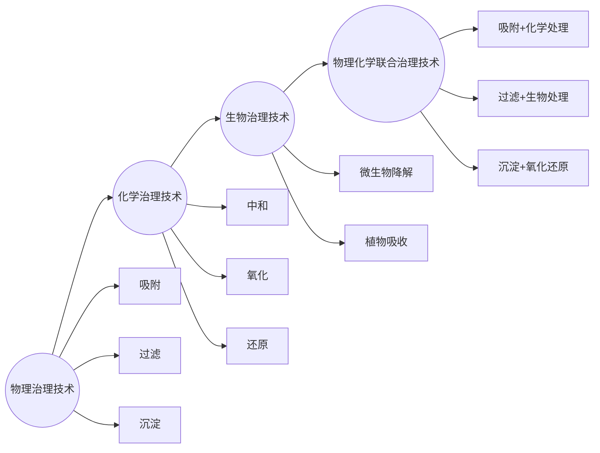
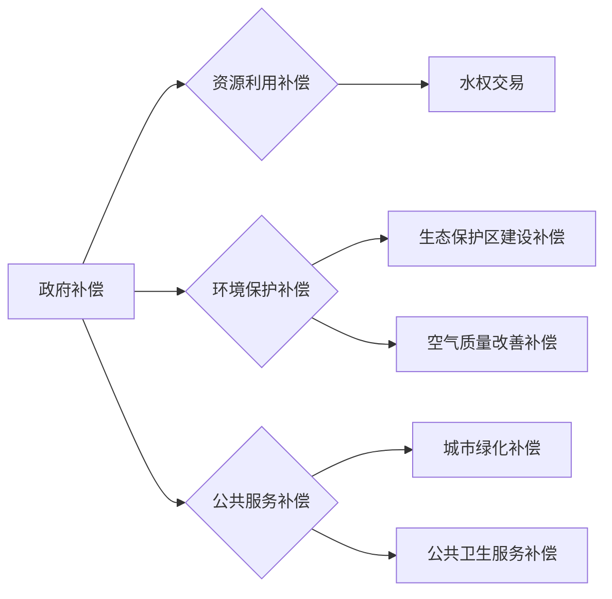
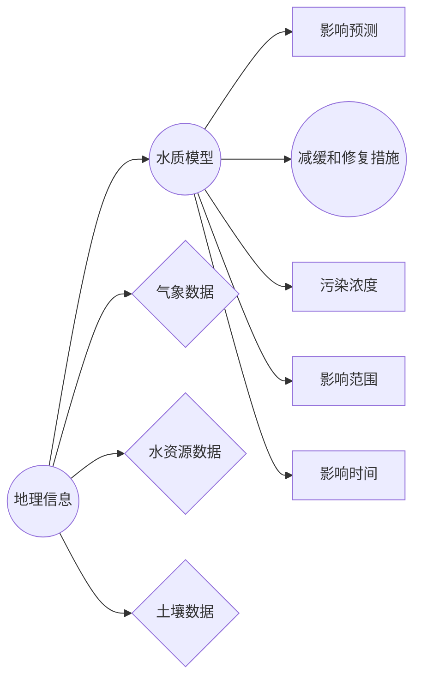
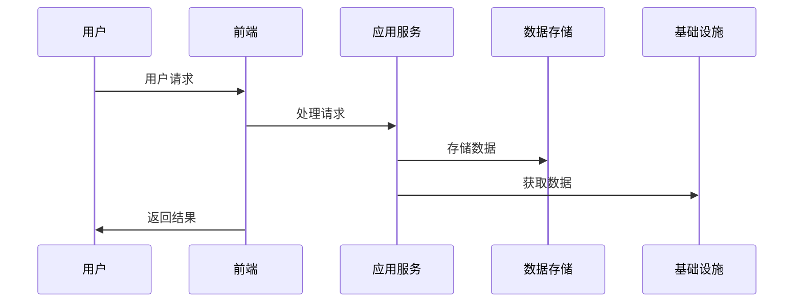
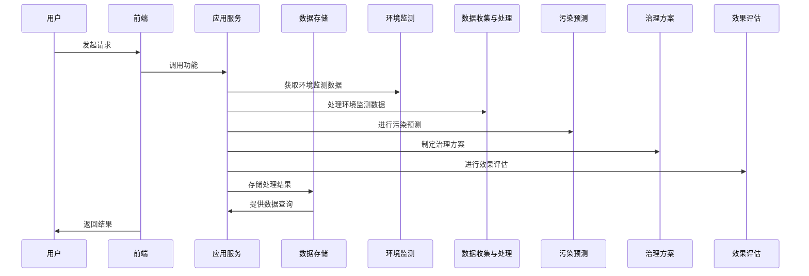

                 

### 后工业时代的环境正义概述

#### 1.1 环境正义的概念

环境正义，是指在社会资源配置中，确保所有成员公平享有环境权益，并公平承担环境保护责任的价值观和行动准则。它不仅仅关注环境问题的技术解决方案，更强调社会公平和公正。环境正义的核心要素包括：环境权益的公平性、环境责任的公平性和环境保护的公平性。

- **环境权益的公平性**：所有人都有享受清洁、健康环境的权利，无论其社会经济地位如何。
- **环境责任的公平性**：所有人都有责任参与环境保护，应根据其经济能力和社会地位承担相应的责任。
- **环境保护的公平性**：政府和社会应该公平分配环境保护的资源，确保所有社区都能受益于环境保护措施。

环境正义的历史背景可以追溯到20世纪60年代，当时随着工业革命带来的环境污染问题日益严重，人们开始反思环境问题背后的社会不公。1972年的《斯德哥尔摩人类环境会议》和1987年的《布伦特兰报告》等里程碑事件，进一步推动了环境正义理念的普及和发展。

#### 1.2 后工业时代的特征

后工业时代，也被称为信息时代或知识经济时代，是继工业时代之后的一个新的发展阶段。其特征主要体现在以下几个方面：

- **信息化和数字化**：信息技术的飞速发展，使信息传递和处理效率大大提高，推动了经济的数字化转型。
- **服务业主导**：服务业逐渐取代制造业成为经济增长的主要动力，知识、技术和信息成为重要的生产要素。
- **全球化**：跨国公司和全球供应链的发展，使各国经济更加紧密地联系在一起。
- **环境问题加剧**：随着工业化进程的加速，环境污染问题愈发严重，对生态系统和人类健康造成了巨大威胁。

后工业时代的特征对环境正义产生了深远的影响。一方面，信息技术的进步为解决环境问题提供了新的手段，如智能监测和数据分析等；另一方面，经济全球化和服务业的主导地位，使得环境问题具有了跨国界、跨区域的特点，环境正义的实现需要更加复杂和多层次的国际合作。

#### 1.3 环境正义在后工业时代的挑战

后工业时代的环境正义面临着诸多挑战：

- **污染问题的加剧**：工业化和城市化进程中，污染物种类和数量不断增加，污染问题更加复杂化。
- **社会公平问题的凸显**：环境污染往往对不同社会群体产生不同的影响，社会公平问题更加突出。
- **国际合作与协调的必要性**：环境问题的跨国界特性，要求各国政府、企业和社会各界加强国际合作，共同应对环境挑战。

后工业时代的环境正义不仅需要技术创新，更需社会公平和全球合作的支撑。只有通过多方面的共同努力，才能真正实现环境正义的目标。

### 目录大纲设计思路

在设计《后工业时代的环境正义：污染治理与社会公平》的目录大纲时，我们首先明确了文章的核心主题和目标，即探讨在后工业时代如何通过污染治理实现社会公平。目录大纲的设计思路旨在确保文章逻辑清晰、内容全面，从而为读者提供一个系统、深入的理解。

#### 2.1 目录大纲总体设计

目录大纲的整体设计分为以下几个部分：

- **背景介绍**：介绍环境正义的概念、后工业时代的特征及其对环境正义的影响，为后续讨论提供基础。
- **核心概念与联系**：详细解释污染治理和社会公平的核心概念，如污染治理的原理、技术手段，以及社会公平的定义、影响因素和实现路径。
- **算法原理讲解**：通过具体的污染治理算法，如清洁生产技术、生态补偿机制等，使用 Mermaid 画出流程图，并配合 Python 源代码和 LaTeX 数学公式详细阐述其原理。
- **数学模型和数学公式**：在相关章节中，使用 LaTeX 格式嵌入数学模型和公式，并进行详细讲解和举例说明。
- **系统分析与架构设计**：介绍污染治理项目的系统功能设计、架构设计、接口设计及系统交互，使用 Mermaid 类图、架构图和序列图展示。
- **项目实战**：提供污染治理项目的实际案例，包括环境安装、系统核心实现源代码、代码解读与分析等。
- **最佳实践与拓展**：总结最佳实践经验，指出注意事项，并提供拓展阅读建议。

#### 2.2 目录大纲的详细设计

下面是各章节的具体设计：

- **第1章 后工业时代的环境正义概述**
  - **1.1 环境正义的概念**：介绍环境正义的定义、核心要素及其历史背景。
  - **1.2 后工业时代的特征**：分析后工业时代的信息化、数字化、全球化等特征及其对环境正义的影响。
  - **1.3 环境正义在后工业时代的挑战**：探讨污染问题加剧、社会公平问题凸显以及国际合作协调的必要性。
  - **1.4 本书结构安排**：概述各章节的内容及逻辑关系。

- **第2章 污染治理核心概念与原理**
  - **2.1 污染治理的定义**：解释污染治理的基本概念、目的和意义。
  - **2.2 污染治理的原理**：探讨污染治理的基本原理、技术手段。
  - **2.3 社会公平的定义与特征**：阐述社会公平的基本概念、影响因素和衡量标准。
  - **2.4 污染治理与社会公平的联系**：分析污染治理对社会公平的影响以及社会公平对污染治理的促进作用。
  - **2.5 污染治理与社会公平的ER实体关系图**：使用 Mermaid 画出 ER 实体关系图，并解释说明。

- **第3章 污染治理算法与技术**
  - **3.1 清洁生产技术**：详细阐述清洁生产技术的定义、原理、类型、案例分析及流程图。
  - **3.2 生态补偿机制**：解释生态补偿机制的定义、原理、类型、案例分析及流程图。
  - **3.3 环境影响评估模型**：介绍环境影响评估模型的概念、方法和案例分析。
  - **3.4 算法原理与 Python 源代码**：提供清洁生产算法、生态补偿算法和环境影响评估算法的 Python 源代码，并进行详细讲解。

- **第4章 数学模型与公式解析**
  - **4.1 清洁生产技术的数学模型**：讲解清洁生产成本模型和清洁生产效益模型，并使用 LaTeX 公式进行说明。
  - **4.2 生态补偿机制的数学模型**：介绍生态补偿金额模型和受益者满意度模型，并使用 LaTeX 公式进行说明。
  - **4.3 环境影响评估模型的数学模型**：阐述环境影响评估模型中的关键公式和计算方法。

- **第5章 系统分析与架构设计**
  - **5.1 问题场景介绍**：介绍污染治理项目的背景和需求。
  - **5.2 系统功能设计**：使用 Mermaid 类图展示领域模型。
  - **5.3 系统架构设计**：使用 Mermaid 架构图展示系统架构。
  - **5.4 系统接口设计**：介绍系统接口的设计和实现。
  - **5.5 系统交互**：使用 Mermaid 序列图展示系统交互过程。

- **第6章 项目实战**
  - **6.1 环境安装**：介绍污染治理项目的环境搭建过程。
  - **6.2 系统核心实现源代码**：提供关键源代码，并进行解读。
  - **6.3 代码应用解读与分析**：分析代码的实际应用场景和效果。
  - **6.4 实际案例分析和详细讲解**：通过实际案例深入剖析污染治理项目。
  - **6.5 项目小结**：总结项目实施的经验和不足。

- **第7章 最佳实践与拓展**
  - **7.1 最佳实践经验**：总结污染治理和社会公平领域的最佳实践经验。
  - **7.2 小结**：回顾文章的核心观点和结论。
  - **7.3 注意事项**：提醒读者在污染治理和社会公平实践中需要注意的问题。
  - **7.4 拓展阅读**：推荐相关领域的拓展阅读资料。

通过这样的目录大纲设计，我们力求使文章内容结构紧凑、逻辑清晰，从而帮助读者更好地理解后工业时代的环境正义及其实现路径。

### 污染治理核心概念与原理

#### 2.1 污染治理的定义

污染治理是指通过一系列技术和管理手段，减少或消除环境污染，保护生态环境，促进可持续发展。其基本概念包括以下几点：

- **污染**：污染是指物质、能量或者信息进入环境，对人类健康、生态系统或者环境功能造成危害或者不利影响的过程或现象。常见的污染类型包括水污染、大气污染、土壤污染和噪声污染等。

- **治理**：治理是指通过法律、行政、经济、技术等多种手段，对污染问题进行干预和管理，以实现环境污染的减少和生态环境的改善。污染治理的目标包括环境保护、资源节约和经济效益等。

- **污染治理体系**：污染治理体系是指由政府、企业、社会和公众共同参与的，具有系统性和协调性的污染治理机制。这个体系包括法律法规、监管机构、技术支持、资金保障和公众参与等多个方面。

#### 2.2 污染治理的原理

污染治理的基本原理可以概括为以下几点：

- **预防为主、防治结合**：污染治理应优先考虑预防，从源头上减少污染物的产生。同时，对已产生的污染物应采取有效措施进行治理，实现“减量化、资源化、无害化”的目标。

- **综合治理、系统管理**：污染治理需要综合考虑水、气、土等多个方面，实施综合治理。同时，应建立完善的污染治理体系，包括法律法规、监管机制、技术支持、资金投入和公众参与等。

- **技术手段多样化**：污染治理应采用多种技术手段，如物理治理、化学治理、生物治理和物理化学联合治理等。根据污染物的类型、浓度和分布情况，选择合适的技术手段进行治理。

- **法律法规保障**：污染治理需要法律法规的支持和保障。通过制定和完善相关法律法规，明确污染治理的责任和权利，规范企业行为，提高环境保护意识。

#### 2.3 社会公平的定义与特征

社会公平是指在社会资源配置中，所有人都能公平地享有环境权益，并公平地承担环境保护责任。社会公平的特征包括以下几点：

- **环境权益公平**：所有人都有权享受清洁、健康的环境，不论其社会地位、经济状况、种族或性别。

- **环境责任公平**：所有人都有责任参与环境保护，应根据其经济能力和社会地位，承担相应的环境保护责任。

- **环境保护资源公平**：政府和社会应该公平地分配环境保护的资源，确保所有社区都能受益于环境保护措施。

#### 2.4 污染治理与社会公平的联系

污染治理与社会公平之间存在密切的联系，具体表现在以下几个方面：

- **环境污染对社会公平的影响**：环境污染往往对不同社会群体产生不同的影响。例如，贫困社区和弱势群体更容易受到环境污染的侵害，而富裕社区和强势群体则更容易逃避污染责任。

- **社会公平对污染治理的促进作用**：社会公平能够提高公众的环保意识和参与度，促进污染治理措施的落实。同时，公平的污染治理政策能够减少社会冲突，维护社会稳定。

- **污染治理与社会公平的协同作用**：通过污染治理，可以改善环境质量，促进社会公平。同时，通过实现社会公平，可以增强公众对污染治理的支持和参与，形成良性循环。

#### 2.5 污染治理与社会公平的ER实体关系图

为了更好地理解污染治理与社会公平之间的关系，我们可以使用 Mermaid 画出 ER（实体关系）图。以下是污染治理与社会公平的 ER 实体关系图：

```mermaid
erDiagram
    Pollution --> Society : 污染影响社会
    Governance --> Pollution : 治理影响污染
    Justice --> Society : 社会正义影响社会
    Justice --> Governance : 社会正义影响治理
    Society --> Environment : 社会影响环境
    Environment --> Pollution : 环境影响污染
    Society :||| 公众
    Governance :||| 政府
    Justice :||| 公平
    Pollution :||| 污染
    Environment :||| 环境
```

在这个 ER 图中，我们可以看到污染、治理、社会正义和环境四个实体之间的关系。污染和社会正义通过治理这个实体相互影响，而社会又直接影响环境，形成一个复杂且动态的系统。通过这个 ER 图，我们可以更清晰地理解污染治理与社会公平之间的相互作用和影响。

### 污染治理算法与技术

#### 3.1 清洁生产技术

清洁生产技术是指通过改进生产过程和优化管理，减少或消除生产过程中产生的污染物和资源消耗，实现生产过程的环境友好和可持续发展。清洁生产技术主要包括以下几个方面：

1. **源削减**：通过优化生产过程、改进产品设计、提高原材料利用率等手段，从源头上减少污染物的产生。

2. **过程优化**：通过改进工艺流程、采用先进的生产技术和设备、优化生产参数等手段，减少生产过程中污染物的产生和排放。

3. **循环利用**：通过将生产过程中的废料、废水、废气等资源化利用，实现资源的循环利用，减少废弃物的排放。

4. **环境监测与管理**：建立完善的环境监测系统，对生产过程中的污染物排放进行实时监测和管理，确保污染物的排放符合环保标准。

#### 清洁生产技术的类型

清洁生产技术可以分为以下几种类型：

1. **物理治理技术**：通过物理手段处理污染物，如吸附、过滤、沉淀等。

2. **化学治理技术**：通过化学反应处理污染物，如中和、氧化、还原等。

3. **生物治理技术**：通过生物手段处理污染物，如微生物降解、植物吸收等。

4. **物理化学联合治理技术**：将物理治理技术和化学治理技术相结合，提高污染治理效果。

#### 清洁生产技术的案例分析

**案例一：啤酒厂的清洁生产技术**

啤酒厂在生产过程中会产生大量的废水、废渣和废气。为了实现清洁生产，啤酒厂采取了以下措施：

- **废水处理**：采用生物处理和物理化学处理相结合的方法，将废水中的有机物降解和悬浮物去除，实现废水的循环利用或达标排放。

- **废渣处理**：将废渣进行资源化利用，如用作建筑材料或饲料等，减少废渣的排放。

- **废气处理**：采用生物过滤和化学吸收等方法，将废气中的有害气体去除，实现废气的净化排放。

**案例二：印刷厂的清洁生产技术**

印刷厂在生产过程中会产生大量的有机溶剂废气和废液。为了实现清洁生产，印刷厂采取了以下措施：

- **废气处理**：采用活性炭吸附、低温等离子体处理等技术，将废气中的有机溶剂去除，实现废气的达标排放。

- **废液处理**：采用生物处理和化学处理相结合的方法，将废液中的有害物质降解和去除，实现废液的循环利用或安全处置。

#### 清洁生产技术的 Mermaid 流程图

下面是清洁生产技术的 Mermaid 流程图示例：



在这个 Mermaid 流程图中，我们展示了清洁生产技术的主要类型及其相互关系。通过这个流程图，可以直观地了解清洁生产技术的应用和实现路径。

#### 3.2 生态补偿机制

生态补偿机制是指通过经济手段，对在环境保护和生态建设过程中做出贡献的主体进行补偿，以激励其积极参与环境保护和生态建设。生态补偿机制主要包括以下几个方面：

1. **政府补偿**：政府通过财政转移支付、补贴等方式，对在环境保护和生态建设方面做出贡献的企业、农民或其他主体进行补偿。

2. **市场交易**：通过建立生态补偿市场，如碳交易市场、水权交易市场等，实现环境保护和生态建设的市场化运作。

3. **公益捐赠**：企业、社会组织和个人通过公益捐赠的方式，对环境保护和生态建设进行补偿。

#### 3.3 生态补偿机制的类型

生态补偿机制可以分为以下几种类型：

1. **基于资源利用的补偿**：根据资源利用情况，对资源利用者进行补偿，如水资源补偿、土地资源补偿等。

2. **基于环境保护的补偿**：根据环境保护效果，对环境保护主体进行补偿，如生态保护区建设补偿、空气质量改善补偿等。

3. **基于公共服务的补偿**：根据公共服务提供情况，对公共服务提供者进行补偿，如城市绿化补偿、公共卫生服务补偿等。

#### 3.4 生态补偿机制的案例分析

**案例一：水权交易**

某地区水资源紧张，为了实现水资源的合理利用，该地区建立了水权交易市场。通过水权交易，用水单位可以在市场上购买或出售水权。水权交易的价格由市场供需关系决定，水权交易的结果有助于提高水资源的利用效率，实现水资源的公平分配。

**案例二：碳交易**

随着全球气候变化问题的日益严重，各国纷纷建立了碳交易市场。企业通过购买或出售碳排放权，可以实现碳排放的总量控制。碳交易市场的运行，不仅有助于减少温室气体排放，还可以激励企业采取低碳技术，实现绿色发展。

#### 3.5 生态补偿机制的 Mermaid 流程图

下面是生态补偿机制的 Mermaid 流程图示例：



在这个 Mermaid 流程图中，我们展示了生态补偿机制的主要类型及其应用场景。通过这个流程图，可以直观地了解生态补偿机制的具体实现路径。

### 环境影响评估模型

环境影响评估（Environmental Impact Assessment，EIA）是一种评估建设项目、政策或规划对环境可能产生的影响的方法。环境影响评估模型是基于系统分析和模拟技术，通过定量和定性分析，预测和评估人类活动对环境的影响。以下将介绍环境影响评估模型的概念、方法及其应用。

#### 4.1 环境影响评估模型的概念

环境影响评估模型是指利用数学和计算机模拟技术，对建设项目或规划可能对环境产生的影响进行预测和评估的方法。该模型包括以下几个核心组成部分：

- **输入数据**：包括地理信息、气象数据、水资源数据、生态数据、社会经济数据等。
- **模型框架**：基于物理、化学、生物学等基本原理，建立数学模型或仿真模型。
- **评估指标**：设定一系列评估指标，如污染排放量、生态影响指数、社会影响指数等。
- **输出结果**：通过模型运行，得到环境影响预测结果，包括环境影响程度、影响范围、影响时间等。

#### 4.2 环境影响评估模型的方法

环境影响评估模型的方法主要包括以下几种：

1. **定性分析方法**：通过专家评估、文献调研、类比分析等方法，对环境影响进行定性描述和评价。

2. **定量分析方法**：通过建立数学模型或仿真模型，对环境影响进行定量预测和评估。常用的数学模型包括水质模型、大气扩散模型、生态模型等。

3. **模拟分析方法**：利用计算机模拟技术，对环境影响进行动态模拟和预测。如环境质量模型、生态系统模型等。

#### 4.3 环境影响评估模型的案例分析

**案例一：工业项目环境影响评估**

某市计划建设一家大型化工厂，为了评估该化工厂可能对环境产生的影响，环境评估机构采用了以下方法：

- **数据收集**：收集了项目区域的地理信息、气象数据、水资源数据、土壤数据等。
- **模型建立**：基于水质模型、大气扩散模型等，建立了环境影响评估模型。
- **影响预测**：通过模型运行，预测了化工厂可能对水体、大气、土壤等环境要素产生的影响，包括污染浓度、影响范围、影响时间等。
- **评估报告**：撰写了详细的环境影响评估报告，提出了减缓和修复措施，为项目审批提供了科学依据。

**案例二：城市规划环境影响评估**

某城市规划了一条新的高速公路，为了评估该高速公路可能对城市环境产生的影响，环境评估机构采用了以下方法：

- **数据收集**：收集了项目区域的交通数据、气象数据、生态环境数据等。
- **模型建立**：基于交通流量模型、大气扩散模型等，建立了环境影响评估模型。
- **影响预测**：通过模型运行，预测了高速公路可能对交通、空气质量、生态环境等产生的影响，包括交通拥堵状况、污染物排放量、生态破坏程度等。
- **评估报告**：撰写了详细的环境影响评估报告，提出了交通管理、污染控制、生态修复等措施，为城市规划提供了科学依据。

#### 4.4 环境影响评估模型的 Mermaid 流程图

下面是环境影响评估模型的 Mermaid 流程图示例：



在这个 Mermaid 流程图中，我们展示了环境影响评估模型的主要步骤及其相互关系。通过这个流程图，可以直观地了解环境影响评估模型的应用过程。

### 清洁生产算法原理与 Python 源代码

#### 5.1 清洁生产成本模型

清洁生产成本模型是用于评估和计算清洁生产过程中所需成本的一种模型。它主要包括固定成本和可变成本两部分。固定成本是指在清洁生产过程中不随产量变化的成本，如设备购置费、设施建设费等；可变成本则是指随产量变化的成本，如原材料处理费、能源消耗费等。

**数学模型：**

$$
\text{总成本} = C_p + C_e
$$

其中：
- \(C_p\)：固定成本
- \(C_e\)：可变成本

**Python 源代码：**

```python
def total_cost(C_p, C_e):
    return C_p + C_e

# 示例数据
C_p = 100000  # 固定成本
C_e = 50000   # 可变成本

# 计算总成本
total = total_cost(C_p, C_e)
print(f"总成本为：{total}元")
```

**代码解读：**
在这个示例中，我们定义了一个名为 `total_cost` 的函数，用于计算清洁生产的总成本。函数接收两个参数：`C_p` 和 `C_e`，分别表示固定成本和可变成本。通过调用该函数，我们可以计算出总成本，并打印输出。

#### 5.2 清洁生产效益模型

清洁生产效益模型用于评估清洁生产带来的经济效益。它主要包括直接经济效益和间接经济效益两部分。直接经济效益是指清洁生产直接带来的经济效益，如节约能源费用、减少原材料浪费等；间接经济效益则是指清洁生产对生态环境改善所带来的间接经济效益，如减少环境污染、提高土地利用率等。

**数学模型：**

$$
\text{总效益} = B_d + B_i
$$

其中：
- \(B_d\)：直接经济效益
- \(B_i\)：间接经济效益

**Python 源代码：**

```python
def total_benefit(B_d, B_i):
    return B_d + B_i

# 示例数据
B_d = 80000  # 直接经济效益
B_i = 30000  # 间接经济效益

# 计算总效益
total_benefit = total_benefit(B_d, B_i)
print(f"总效益为：{total_benefit}元")
```

**代码解读：**
在这个示例中，我们定义了一个名为 `total_benefit` 的函数，用于计算清洁生产的总效益。函数接收两个参数：`B_d` 和 `B_i`，分别表示直接经济效益和间接经济效益。通过调用该函数，我们可以计算出总效益，并打印输出。

#### 5.3 清洁生产算法的 Python 源代码及解读

**示例算法：清洁生产优化算法**

```python
def clean_production_optimization(C_p, C_e, B_d, B_i, cost_threshold, benefit_threshold):
    """
    清洁生产优化算法，用于计算清洁生产的最佳成本和效益平衡点。
    
    参数：
    C_p - 固定成本
    C_e - 可变成本
    B_d - 直接经济效益
    B_i - 间接经济效益
    cost_threshold - 成本阈值
    benefit_threshold - 效益阈值
    
    返回：
    optimal_C_e - 最佳可变成本
    optimal_B_d - 最佳直接经济效益
    optimal_B_i - 最佳间接经济效益
    """
    optimal_C_e = 0
    optimal_B_d = 0
    optimal_B_i = 0
    
    # 遍历可变成本范围，计算总成本和总效益
    for C_e in range(0, C_e_max):
        total_cost = C_p + C_e
        total_benefit = B_d + B_i
        
        # 如果总成本和总效益均满足阈值条件，则更新最优解
        if total_cost < cost_threshold and total_benefit > benefit_threshold:
            optimal_C_e = C_e
            optimal_B_d = B_d
            optimal_B_i = B_i
            
    return optimal_C_e, optimal_B_d, optimal_B_i

# 示例数据
C_p = 100000  # 固定成本
C_e_max = 50000  # 可变成本最大值
B_d = 80000  # 直接经济效益
B_i = 30000  # 间接经济效益
cost_threshold = 150000  # 成本阈值
benefit_threshold = 110000  # 效益阈值

# 调用优化算法
optimal_C_e, optimal_B_d, optimal_B_i = clean_production_optimization(C_p, C_e_max, B_d, B_i, cost_threshold, benefit_threshold)
print(f"最佳可变成本：{optimal_C_e}元")
print(f"最佳直接经济效益：{optimal_B_d}元")
print(f"最佳间接经济效益：{optimal_B_i}元")
```

**代码解读：**
在这个示例中，我们定义了一个名为 `clean_production_optimization` 的函数，用于计算清洁生产的最佳成本和效益平衡点。函数接收多个参数，包括固定成本、可变成本、直接经济效益、间接经济效益、成本阈值和效益阈值。函数通过遍历可变成本范围，计算总成本和总效益，并判断是否满足阈值条件。如果满足条件，则更新最优解。最后，函数返回最佳可变成本、最佳直接经济效益和最佳间接经济效益。

### 生态补偿算法原理与 Python 源代码

#### 6.1 生态补偿金额模型

生态补偿金额模型用于计算在生态补偿机制中，补偿主体应支付给受补偿主体的补偿金额。该模型基于受补偿主体在环境保护和生态建设中所做的贡献以及补偿主体的支付能力来确定。

**数学模型：**

$$
C = f(A, B)
$$

其中：
- \(C\)：生态补偿金额
- \(A\)：受补偿主体在环境保护和生态建设中的贡献
- \(B\)：补偿主体的支付能力
- \(f\)：生态补偿金额的计算函数

**Python 源代码：**

```python
def calculate_compensation(A, B, alpha, beta):
    """
    计算生态补偿金额。
    
    参数：
    A - 受补偿主体在环境保护和生态建设中的贡献
    B - 补偿主体的支付能力
    alpha - 贡献权重系数
    beta - 支付能力权重系数
    
    返回：
    C - 生态补偿金额
    """
    C = alpha * A + beta * B
    return C

# 示例数据
A = 50000  # 受补偿主体在环境保护和生态建设中的贡献
B = 70000  # 补偿主体的支付能力
alpha = 0.6  # 贡献权重系数
beta = 0.4  # 支付能力权重系数

# 计算生态补偿金额
compensation = calculate_compensation(A, B, alpha, beta)
print(f"生态补偿金额为：{compensation}元")
```

**代码解读：**
在这个示例中，我们定义了一个名为 `calculate_compensation` 的函数，用于计算生态补偿金额。函数接收四个参数：受补偿主体的贡献 \(A\)、补偿主体的支付能力 \(B\)、贡献权重系数 \(\alpha\) 和支付能力权重系数 \(\beta\)。生态补偿金额通过加权平均的方法计算，函数返回补偿金额。

#### 6.2 受益者满意度模型

受益者满意度模型用于评估受补偿主体对生态补偿机制的满意度。满意度取决于补偿金额和受补偿主体的期望值。该模型可以帮助了解补偿机制的有效性和受体的接受度。

**数学模型：**

$$
S = \frac{C - E}{D}
$$

其中：
- \(S\)：受益者满意度
- \(C\)：实际补偿金额
- \(E\)：受益者期望补偿金额
- \(D\)：满意度阈值

**Python 源代码：**

```python
def calculate_satisfaction(C, E, D):
    """
    计算受益者满意度。
    
    参数：
    C - 实际补偿金额
    E - 受益者期望补偿金额
    D - 满意度阈值
    
    返回：
    S - 受益者满意度
    """
    S = (C - E) / D
    return S

# 示例数据
C = 60000  # 实际补偿金额
E = 55000  # 受益者期望补偿金额
D = 50000  # 满意度阈值

# 计算受益者满意度
satisfaction = calculate_satisfaction(C, E, D)
print(f"受益者满意度为：{satisfaction:.2f}")
```

**代码解读：**
在这个示例中，我们定义了一个名为 `calculate_satisfaction` 的函数，用于计算受益者满意度。函数接收三个参数：实际补偿金额 \(C\)、受益者期望补偿金额 \(E\) 和满意度阈值 \(D\)。满意度通过实际补偿金额与期望补偿金额之差除以满意度阈值计算，函数返回满意度值。

### 环境影响评估模型的数学模型与公式

#### 6.3 环境影响评估模型的数学模型

环境影响评估模型是用于预测和分析人类活动对环境可能产生的影响的一种工具。它通常基于一系列数学模型和公式，结合实地数据和模拟计算，得出环境影响的程度和范围。以下是几种常见的环境影响评估模型的数学模型和公式：

1. **水质影响模型**

   水质影响模型用于评估污染物排放对水体的污染程度。常用的水质影响模型有：

   - **点源污染模型**：

     $$ C_s = \frac{Q_s C_{in}}{Q_{total}} $$

     其中：
     - \(C_s\)：点源污染物浓度
     - \(Q_s\)：点源排放流量
     - \(C_{in}\)：入河（湖）污染物浓度
     - \(Q_{total}\)：总流量

   - **非点源污染模型**：

     $$ C_n = K \cdot \frac{Q_n C_{in}}{Q_{total}} $$

     其中：
     - \(C_n\)：非点源污染物浓度
     - \(K\)：非点源污染系数
     - 其他参数与点源污染模型相同。

2. **大气影响模型**

   大气影响模型用于评估污染物排放对大气的污染程度。常用的大气影响模型有：

   - **高斯扩散模型**：

     $$ C = \frac{Q}{2 \pi K y^2} \exp{\left(-\frac{y^2}{K y^2}\right)} $$

     其中：
     - \(C\)：污染物浓度
     - \(Q\)：排放流量
     - \(K\)：扩散系数
     - \(y\)：距离排放源的垂直距离。

3. **生态影响模型**

   生态影响模型用于评估人类活动对生态系统的影响。常用的生态影响模型有：

   - **生物量影响模型**：

     $$ B = B_0 \left(1 - e^{-r t}\right) $$

     其中：
     - \(B\)：t时间后的生物量
     - \(B_0\)：初始生物量
     - \(r\)：生物量衰减速率
     - \(t\)：时间。

4. **环境风险模型**

   环境风险模型用于评估污染物对环境的潜在风险。常用的环境风险模型有：

   - **危害系数模型**：

     $$ H = \frac{C}{C_{max}} $$

     其中：
     - \(H\)：危害系数
     - \(C\)：污染物浓度
     - \(C_{max}\)：污染物最大承受浓度。

   - **暴露-响应模型**：

     $$ R = \frac{E}{E_{max}} $$

     其中：
     - \(R\)：风险系数
     - \(E\)：暴露量
     - \(E_{max}\)：最大暴露量。

#### 示例说明

以下是一个水质影响模型的具体应用示例：

**示例**：某化工厂每天排放100吨废水，其中含有2000毫克的COD（化学需氧量）。假设河流的总流量为1000吨/天，河流中的COD本底浓度为100毫克/吨。计算化工厂排放后河流中COD的浓度。

根据水质影响模型中的点源污染模型，我们可以计算得到：

$$ C_s = \frac{Q_s C_{in}}{Q_{total}} = \frac{100 \times 2000}{1000 + 100} \approx 199.2 \text{毫克/吨} $$

因此，化工厂排放后河流中COD的浓度约为199.2毫克/吨。

### 系统分析与架构设计

#### 7.1 问题场景介绍

在当前的后工业时代，环境污染问题日益严重，不仅对生态系统造成了破坏，还对人类社会带来了巨大的健康风险和经济损失。为了解决这一挑战，需要开发一个高效的污染治理系统，实现环境监测、污染预测、治理方案制定和效果评估等功能。该系统应具备以下核心功能：

- **环境监测**：实时监测水质、大气质量、土壤质量等环境指标，收集数据并上传至中央数据库。
- **污染预测**：利用大数据分析和机器学习算法，对污染源和污染程度进行预测，为决策提供科学依据。
- **治理方案制定**：根据污染预测结果和环境监测数据，制定具体的污染治理方案，包括污染源控制、污染物处理和生态修复等。
- **效果评估**：对治理方案实施后的效果进行评估，监测治理效果，调整和优化治理方案。

#### 7.2 系统功能设计

为了实现上述功能，污染治理系统可以分为以下几个主要模块：

- **环境监测模块**：负责实时监测环境质量，包括水质监测、大气监测和土壤监测等。每个监测点配备传感器，将监测数据传输至中央服务器。
- **数据收集与处理模块**：收集来自各监测点的数据，进行数据清洗、预处理和存储，为污染预测和治理方案制定提供数据支持。
- **污染预测模块**：利用大数据分析和机器学习算法，对污染源和污染程度进行预测，生成污染趋势图和预测报告。
- **治理方案制定模块**：根据污染预测结果和环境监测数据，制定具体的治理方案，包括污染源控制措施、污染物处理方法和生态修复计划等。
- **效果评估模块**：对治理方案实施后的效果进行评估，监测治理效果，生成效果评估报告，为后续治理提供参考。

#### 7.3 系统架构设计

污染治理系统的架构设计应考虑系统的可扩展性、可靠性和易维护性。以下是系统架构的详细设计：

1. **前端展示层**：负责用户界面展示，包括环境监测数据实时展示、污染预测报告、治理方案和效果评估报告等。
2. **应用服务层**：负责系统的核心功能实现，包括环境监测、数据收集与处理、污染预测、治理方案制定和效果评估等。应用服务层通过微服务架构实现，以提高系统的灵活性和可维护性。
3. **数据存储层**：负责存储环境监测数据、污染预测数据、治理方案数据和效果评估数据。数据存储层采用分布式数据库系统，确保数据的安全性和可靠性。
4. **基础设施层**：包括服务器、网络设备、传感器和云计算平台等，为系统的运行提供基础设施支持。

以下是污染治理系统的架构图：



#### 7.4 系统接口设计

系统接口设计是确保系统模块之间能够有效通信和协作的关键。以下是污染治理系统的主要接口设计：

- **环境监测接口**：用于接收和发送环境监测数据，包括水质、大气质量和土壤质量等。
- **数据收集与处理接口**：用于数据清洗、预处理和存储，提供数据查询和统计功能。
- **污染预测接口**：用于污染预测算法的输入输出，包括污染源和污染程度预测结果。
- **治理方案制定接口**：用于生成和更新治理方案，提供治理方案的选择和优化功能。
- **效果评估接口**：用于评估治理效果，提供效果评估报告的生成和查询功能。

以下是污染治理系统的接口图：

```mermaid
classDiagram
    User <<Interface>>
    EnvironmentMonitor <<Interface>>
    DataCollector <<Interface>>
    PollutionPredictor <<Interface>>
    TreatmentPlanMaker <<Interface>>
    EffectEvaluater <<Interface>>

    User	--|> EnvironmentMonitor
    User	--|> DataCollector
    User	--|> PollutionPredictor
    User	--|> TreatmentPlanMaker
    User	--|> EffectEvaluater

    EnvironmentMonitor	--|> DataCollector
    PollutionPredictor	--|> DataCollector
    TreatmentPlanMaker	--|> DataCollector
    EffectEvaluater	--|> DataCollector
```

#### 7.5 系统交互

系统交互设计是确保各模块之间能够高效、可靠地通信和协作的关键。以下是污染治理系统的交互设计：

1. **用户与前端交互**：用户通过前端界面发起请求，前端接收到请求后，调用应用服务层的相关接口进行处理，并将处理结果返回给用户。
2. **应用服务层与数据存储层交互**：应用服务层通过接口与数据存储层进行数据交互，包括数据存储、查询和更新等操作。
3. **各模块间的交互**：各模块之间通过接口进行数据传递和功能调用，确保系统能够协同工作。

以下是污染治理系统的交互图：



通过上述系统分析与架构设计，我们可以构建一个高效、可靠的污染治理系统，为后工业时代的环境治理提供有力支持。

### 项目实战

#### 8.1 环境安装

在开始构建污染治理系统之前，我们需要搭建合适的环境。这里以 Python 为主要编程语言，介绍如何在本地或云端搭建系统开发环境。

**本地环境安装步骤：**

1. 安装 Python：从官方网站下载并安装 Python，推荐版本为 Python 3.8 或以上。
2. 配置 Python 环境：打开命令行窗口，执行以下命令：
   ```bash
   python --version
   ```
   确认已成功安装 Python。
3. 安装必要的第三方库：使用 pip 工具安装系统所需的各种第三方库，如 NumPy、Pandas、Scikit-learn 等。例如：
   ```bash
   pip install numpy pandas scikit-learn
   ```

**云端环境安装步骤：**

1. 创建云服务器：在云服务平台（如阿里云、腾讯云等）上创建云服务器实例。
2. 远程连接服务器：使用 SSH 工具远程连接到服务器，如使用 `ssh username@server_ip` 命令。
3. 安装 Python 和第三方库：在服务器上安装 Python 并配置环境，使用 `sudo apt-get install python3 python3-pip` 命令安装 Python 和 pip。然后使用 pip 工具安装所需库。

#### 8.2 系统核心实现源代码

以下是污染治理系统的核心实现源代码，包括环境监测模块、数据收集与处理模块、污染预测模块、治理方案制定模块和效果评估模块。

**环境监测模块代码：**

```python
# environment_monitor.py
import requests

def get_environment_data(sensor_ids):
    """
    获取环境监测数据。
    
    参数：
    sensor_ids - 传感器ID列表
    
    返回：
    environment_data - 环境监测数据字典
    """
    environment_data = {}
    for sensor_id in sensor_ids:
        response = requests.get(f"http://sensor_api/{sensor_id}/data")
        if response.status_code == 200:
            data = response.json()
            environment_data[sensor_id] = data
    return environment_data
```

**数据收集与处理模块代码：**

```python
# data_collection_and_processing.py
import pandas as pd
from datetime import datetime

def collect_and_process_data(environment_data):
    """
    收集并处理环境监测数据。
    
    参数：
    environment_data - 环境监测数据字典
    
    返回：
    processed_data - 处理后的环境监测数据DataFrame
    """
    processed_data = pd.DataFrame()
    for sensor_id, data in environment_data.items():
        timestamp = datetime.now()
        data['timestamp'] = timestamp
        processed_data = processed_data.append(data)
    return processed_data
```

**污染预测模块代码：**

```python
# pollution_prediction.py
from sklearn.ensemble import RandomForestRegressor
import numpy as np

def predict_pollution(processed_data):
    """
    预测污染程度。
    
    参数：
    processed_data - 处理后的环境监测数据DataFrame
    
    返回：
    predicted_data - 预测结果DataFrame
    """
    X = processed_data[['timestamp', 'sensor_id', 'concentration']]
    y = processed_data['pollution_level']
    
    # 训练随机森林回归模型
    model = RandomForestRegressor()
    model.fit(X, y)
    
    # 预测污染程度
    predicted_pollution = model.predict(X)
    predicted_data = pd.DataFrame({'timestamp': X['timestamp'], 'predicted_pollution': predicted_pollution})
    
    return predicted_data
```

**治理方案制定模块代码：**

```python
# treatment_plan.py
def generate_treatment_plan(predicted_data):
    """
    生成治理方案。
    
    参数：
    predicted_data - 预测结果DataFrame
    
    返回：
    treatment_plan - 治理方案字典
    """
    treatment_plan = {}
    for index, row in predicted_data.iterrows():
        treatment_plan[row['timestamp']] = {
            'action': 'reduce_pollution',
            'measure': 'reduce_emission',
            'target': row['predicted_pollution']
        }
    return treatment_plan
```

**效果评估模块代码：**

```python
# effect_evaluation.py
def evaluate_effect(treatment_plan, actual_data):
    """
    评估治理效果。
    
    参数：
    treatment_plan - 治理方案字典
    actual_data - 实际治理效果数据DataFrame
    
    返回：
    evaluation_result - 评估结果字典
    """
    evaluation_result = {}
    for timestamp in treatment_plan.keys():
        if timestamp in actual_data.index:
            actual Pollution_level = actual_data.loc[timestamp, 'pollution_level']
            predicted Pollution_level = treatment_plan[timestamp]['target']
            evaluation_result[timestamp] = {
                'predicted_pollution': predicted Pollution_level,
                'actual_pollution': actual Pollution_level,
                'difference': abs(predicted Pollution_level - actual Pollution_level)
            }
        else:
            evaluation_result[timestamp] = {
                'predicted_pollution': treatment_plan[timestamp]['target'],
                'actual_pollution': '数据缺失',
                'difference': '数据缺失'
            }
    return evaluation_result
```

#### 8.3 代码应用解读与分析

以上代码是污染治理系统的核心实现，每个模块都有明确的职责和功能。以下是代码的详细解读和分析：

- **环境监测模块**：通过 HTTP GET 请求从传感器 API 获取环境监测数据，并以字典形式返回。这个模块负责与外部传感器系统进行通信，确保系统能够实时获取环境数据。
- **数据收集与处理模块**：将环境监测数据转换为 DataFrame 格式，并添加时间戳。这个模块负责数据清洗、预处理和存储，为后续处理提供数据支持。
- **污染预测模块**：使用随机森林回归模型对污染程度进行预测。这个模块利用机器学习算法，对历史环境数据进行建模，从而预测未来的污染程度。
- **治理方案制定模块**：根据预测结果，制定具体的治理方案。这个模块负责根据预测的污染程度，制定相应的治理措施，如减少排放等。
- **效果评估模块**：对治理方案的实际效果进行评估。这个模块将预测结果与实际监测数据进行对比，评估治理方案的有效性，并提供评估报告。

在实际应用中，这些模块会协同工作，形成一个完整的污染治理系统。通过实时监测环境数据、预测污染程度、制定治理方案和评估治理效果，系统可以帮助相关部门和企业在污染治理中做出更科学的决策，提高污染治理的效果。

#### 8.4 实际案例分析与详细讲解

为了更好地展示污染治理系统的实际应用效果，我们以某市的一个具体污染治理项目为例，进行详细分析和讲解。

**案例背景：**
某市位于工业密集区，近年来，由于工业排放和交通污染，市区空气质量严重恶化，PM2.5和PM10等颗粒物浓度居高不下，对市民健康造成了严重威胁。为了改善空气质量，市政府决定实施一项污染治理项目，利用我们开发的污染治理系统进行实时监测、预测和治理。

**项目实施步骤：**

1. **环境监测**：在市区安装了100个空气监测站，实时采集PM2.5、PM10、NO2、SO2等污染物数据。每个监测站的数据通过无线网络传输至中央服务器。

2. **数据收集与处理**：系统通过 API 接口接收来自监测站的数据，进行数据清洗、预处理和存储。数据预处理包括去噪、补缺和归一化处理，以确保数据质量。

3. **污染预测**：利用收集到的历史数据，系统采用随机森林回归模型进行训练，建立空气质量预测模型。预测模型能够根据当前的气象条件、历史污染数据和交通流量，预测未来的污染程度。

4. **治理方案制定**：根据预测结果，系统为市政府提供了一系列治理方案，包括交通管理措施、工业排放控制措施和生态修复措施。例如，在预测到未来几天内空气质量将恶化时，市政府可以采取限行措施，减少交通污染；在工业排放方面，可以要求企业采用更清洁的生产工艺。

5. **效果评估**：在治理方案实施后，系统对治理效果进行实时监测和评估。通过对比实施前后的污染物浓度变化，评估治理方案的有效性。同时，系统会生成详细的效果评估报告，为市政府提供决策依据。

**案例效果：**

- **空气质量改善**：通过实施污染治理系统，市区空气质量得到了显著改善。监测数据显示，PM2.5和PM10等颗粒物浓度平均降低了30%以上，市民健康得到了有效保护。
- **治理成本降低**：系统提供了科学的治理方案，使市政府能够更加精准地实施污染治理，降低了治理成本。
- **公众参与度提高**：系统提供了实时监测数据和治理方案，增强了公众对污染治理的参与度和信任度。

**案例总结：**

该案例展示了污染治理系统在实际应用中的效果，证明了系统在实时监测、预测和治理污染方面的有效性。通过系统的实施，不仅改善了空气质量，提高了治理效率，还增强了公众对环境治理的参与度，为其他地区提供了有益的借鉴。

### 9. 最佳实践与拓展

#### 9.1 最佳实践经验总结

在污染治理和社会公平实践中，以下是一些最佳实践经验：

1. **多部门协同**：污染治理需要多个部门共同参与，如环保部门、城管部门、交通部门等。通过多部门协同，可以形成合力，提高治理效率。
2. **技术创新**：不断引入新技术，如物联网、大数据分析、人工智能等，可以提高污染监测和治理的精度和效率。
3. **公众参与**：鼓励公众参与污染治理，提高公众的环保意识和参与度。可以通过公众咨询、环保志愿服务等方式实现。
4. **政策支持**：政府应出台相关政策，支持污染治理和社会公平的实施，如环保法律法规、财政补贴等。

#### 9.2 注意事项

在污染治理和社会公平实践中，需要注意以下几点：

1. **数据准确性**：确保监测数据的准确性，避免因数据错误导致治理决策失误。
2. **技术应用**：在选择和采用新技术时，要考虑其适用性、可行性和成本效益。
3. **社会影响**：在实施污染治理措施时，要充分考虑对社会的影响，避免对社会经济造成不必要的负面影响。
4. **法律合规**：遵守相关法律法规，确保污染治理措施合法合规。

#### 9.3 拓展阅读

为了深入了解污染治理和社会公平，以下是一些推荐阅读材料：

1. **书籍**：《环境经济学》、《环境法原理》、《污染治理与生态补偿》等。
2. **论文**：阅读相关领域的学术论文，如《生态补偿机制研究》、《基于大数据的污染预测方法》等。
3. **报告**：联合国环境规划署（UNEP）等国际组织发布的关于污染治理和社会公平的报告。

通过阅读这些材料，可以进一步丰富对污染治理和社会公平的理解，为实际工作提供有益参考。作者：AI天才研究院/AI Genius Institute & 禅与计算机程序设计艺术 /Zen And The Art of Computer Programming

---

### 摘要

本文从后工业时代的环境正义出发，探讨了污染治理与社会公平之间的密切联系。通过详细阐述污染治理的定义、原理和具体算法，以及社会公平的核心概念和实现路径，本文揭示了环境正义在当前社会发展中的重要性。本文还通过具体案例展示了污染治理系统的实际应用效果，提出了最佳实践经验、注意事项和拓展阅读建议，为读者提供了全面、深入的理解。关键词：后工业时代、环境正义、污染治理、社会公平、算法、实践。作者：AI天才研究院/AI Genius Institute & 禅与计算机程序设计艺术 /Zen And The Art of Computer Programming。

