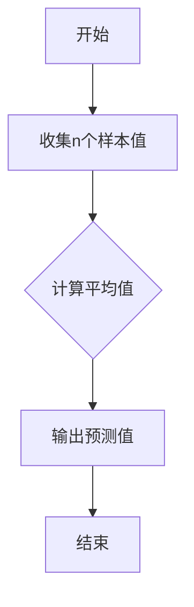

                 

### 引言

在现代社会的快速发展中，我们正经历着从工业时代向后工业时代的转变。这一转变不仅体现在经济模式、技术进步和社会结构的变化上，更关键的是对环境问题提出了新的挑战。后工业时代，随着工业生产的规模扩大和科技的迅猛发展，环境污染和资源枯竭问题日益严重，给社会带来了不可忽视的负面影响。在这样的背景下，环境正义成为了学术界、政策制定者和公众日益关注的重要议题。

环境正义不仅仅是环境保护的问题，更是社会公平和人类尊严的体现。它强调在环境污染治理过程中，所有社会成员应当享有平等的权利和机会，不受地域、种族、经济地位等因素的限制。然而，在现实世界中，环境污染和资源分配的不平等往往导致某些社区和人群受到不公正的对待。这些问题包括工业污染导致的健康问题、环境污染引起的土地和水资源破坏，以及经济贫困社区在环境决策中的话语权缺失等。

本文旨在探讨后工业时代的环境正义，重点分析污染治理和社区赋权两个关键方面。我们将首先回顾后工业时代的背景，介绍环境污染问题的现状和影响。接着，我们探讨环境正义的核心问题，包括污染治理的挑战和社区赋权的重要性。随后，我们将深入探讨污染治理的理论基础、法律法规体系以及技术创新。此外，还将介绍社区赋权的概念、作用和实施策略。最后，通过具体案例和挑战分析，展望环境正义的未来方向。

通过这篇技术博客文章，我们希望能够为读者提供一个全面而深入的理解，促使更多人关注和参与到环境正义的实践中，共同构建一个清洁、公平和可持续的未来。

## 关键词

### 后工业时代、环境正义、污染治理、社区赋权、可持续发展、法律框架、技术创新、环境保护、社会公平

## 摘要

本文围绕后工业时代的环境正义，重点探讨污染治理和社区赋权两大核心议题。首先，通过回顾后工业时代的背景和环境污染问题的现状，揭示了环境正义在现代社会中的重要性。接着，详细分析了污染治理的理论基础、法律法规体系以及技术创新，探讨了污染治理的有效方法和策略。同时，本文深入探讨了社区赋权的概念、作用和实施策略，强调了社区参与在环境正义中的关键角色。通过具体案例和挑战分析，本文总结了当前环境正义实践中的成功经验与不足，并展望了未来的发展方向。本文旨在为读者提供一个全面而深入的理解，以促进更多人关注和参与环境正义的实践，共同构建一个清洁、公平和可持续的未来。

### 引言到后工业时代的背景

后工业时代，也被称为信息时代或知识经济时代，是一个标志着工业生产方式逐步转型为以知识和技术为核心的经济模式的历史阶段。在这一时代，工业生产不再主导经济发展的主要动力，而是以信息技术、生物技术、新能源技术等高技术产业为核心的新兴产业。这种转变不仅改变了经济结构和生产方式，也对环境问题提出了新的挑战。

后工业时代的特征主要体现在以下几个方面。首先，知识经济成为主导力量，以信息和知识为核心的生产和消费模式逐渐取代了传统的物质生产模式。其次，全球化进程加速，国际分工和跨国合作日益紧密，经济活动的地理边界逐渐模糊。再次，信息技术和互联网的迅猛发展，使得信息传播和交流更加便捷，也为经济和社会的发展提供了强大的技术支撑。

然而，随着工业生产的逐步转型，环境污染问题却日益严重。工业时代的大规模生产和消费模式导致了大量资源的消耗和废弃物的产生，不仅加剧了资源枯竭问题，还严重污染了空气、水和土壤。这些环境问题不仅威胁到人类的健康和生存，也对社会经济系统造成了巨大的负面影响。

环境污染的主要表现为大气污染、水污染和土壤污染。大气污染主要来源于工业废气、汽车尾气和建筑工地粉尘等，导致空气质量下降，引发各种呼吸系统疾病。水污染则主要来自工业废水、农业农药和城市生活污水等，污染了河流、湖泊和地下水，威胁着饮用水安全和生态系统的平衡。土壤污染则主要来自工业废渣、农药和化肥等，破坏了土壤结构，影响了农作物的产量和质量。

此外，环境污染对生态系统也带来了深远的影响。环境污染导致生物多样性减少，生态系统失衡，甚至可能引发一些生态灾难。例如，水体富营养化引发的赤潮和蓝藻爆发，空气污染导致的酸雨和臭氧层破坏等，都对生态环境造成了巨大的破坏。

总之，后工业时代的到来不仅带来了经济和社会的巨大变革，也使得环境污染问题变得愈加复杂和严峻。面对这些挑战，环境保护和治理成为后工业时代的重要课题，而环境正义则成为解决这些问题的关键。通过有效的污染治理和社区赋权，我们有望实现经济、社会和环境的协调发展，构建一个清洁、公平和可持续的未来。

### 环境正义的概念与重要性

环境正义是一个跨学科、多维度的概念，涵盖了环境权利、环境保护和社会公平等多个方面。其核心在于确保所有人，不论其种族、性别、经济地位或居住地，都能够公平地享有清洁的环境，并参与环境保护决策。环境正义不仅仅是防止环境污染，更是一种追求社会公平和环境可持续发展的理念。

环境正义的核心问题可以概括为三个方面：权利、责任和参与。首先，权利方面，环境正义要求每个人都应享有清洁空气、清洁水和安全的食物等基本环境权利，不受歧视和不公正对待。其次，责任方面，环境正义强调污染者应为其行为负责，采取有效的污染治理措施，减少对环境的破坏。最后，参与方面，环境正义主张公众尤其是受污染影响最严重的社区，应有权参与环境保护决策，表达自己的意见和需求。

环境正义的重要性体现在多个层面。首先，在社会公平层面，环境正义确保了所有人享有平等的环境权利，避免了因环境污染导致的社会不平等现象。其次，在经济层面，有效的污染治理和环境保护能够促进经济的可持续发展，减少因环境污染造成的经济损失。再次，在生态层面，环境正义有助于维护生态系统的平衡和生物多样性，保护自然资源的可持续利用。

具体来说，环境正义在以下几个方面具有重要影响：

1. **健康保护**：环境正义确保了每个人都能够享有清洁、健康的环境，减少了环境污染对人类健康的影响，降低了医疗费用和社会负担。

2. **社会稳定**：环境污染和不公正的环境治理可能导致社会不满和冲突，影响社会稳定。环境正义通过公平的污染治理和环境保护措施，有助于维护社会和谐。

3. **经济可持续发展**：环境正义通过推动可持续的污染治理措施，有助于保护生态环境，确保资源的长期利用，从而支持经济的可持续发展。

4. **政治合法性**：环境正义有助于提高政府的环境治理能力，增强政府与公众之间的信任，提高政府的政治合法性。

总之，环境正义不仅是环境保护的问题，更是社会公平和人类尊严的体现。在追求经济、社会和环境的协调发展过程中，环境正义发挥着不可或缺的作用。通过深化对环境正义的理解和实施，我们能够更好地应对后工业时代的环境挑战，构建一个清洁、公平和可持续的未来。

### 污染治理的挑战

污染治理是一项复杂且艰巨的任务，涉及多个方面和多个利益相关者。在现实操作中，污染治理面临诸多挑战，这些挑战不仅限制了治理效果，也影响了社会的可持续发展。

首先，**技术挑战**是污染治理中最为显著的问题之一。尽管现代科技在污染治理方面取得了显著进展，但许多污染物的性质复杂、难以分解，现有技术手段往往难以彻底解决。例如，重金属污染、持久性有机污染物（POPs）以及新型纳米材料污染等，这些污染物的治理不仅需要高成本的技术支持，还要求具备高精度的检测和监控设备。此外，技术更新速度迅速，污染治理技术也需要不断迭代升级，这给污染治理工作带来了巨大的挑战。

其次，**资金问题**也是污染治理的一大障碍。污染治理需要大量的资金投入，包括污染治理设备的购置、污染治理工程的实施以及后续的维护和监测等。许多地方政府和企业在资金方面面临压力，特别是对于那些经济欠发达地区和中小企业，污染治理资金不足的问题尤为突出。此外，污染治理的长期性也意味着需要持续的资金投入，而政府和企业往往难以长期承诺这些资金。

第三，**法律法规的不完善**是污染治理面临的另一大挑战。尽管许多国家制定了相关的环境保护法律法规，但在实际执行中，法律法规的落实情况往往不尽如人意。一些地方存在法律执行不力、监管不到位的问题，导致污染治理措施无法真正落实。此外，法律法规的滞后性也可能导致现有的法律无法涵盖新兴的污染问题，从而限制了污染治理的全面性和有效性。

第四，**社区参与度不足**也是污染治理中的一个重要问题。许多污染治理项目需要社区的广泛参与和支持，但在实际操作中，社区居民的参与度往往不高。这可能与信息透明度不足、社区居民对污染问题的认识不足以及缺乏有效的参与机制有关。社区参与度不足不仅影响了污染治理的效果，也限制了公众对环境问题的关注和参与。

第五，**跨国合作与协调**是国际污染治理中面临的特殊挑战。环境污染具有跨境性，污染问题往往需要跨国界的合作和协调才能有效解决。然而，不同国家在环保标准、法律法规、经济实力等方面存在差异，这给跨国合作带来了诸多困难。此外，国际环境协议的执行和监督也存在一定的挑战，需要各国政府、国际组织和非政府组织共同努力。

最后，**数据监测和管理**也是污染治理中的一个重要环节。污染治理需要准确的数据支持，包括污染源的分布、污染物浓度变化、污染治理效果等。然而，现有的监测设备和技术手段往往无法满足这些需求，特别是在偏远地区和经济欠发达地区，数据监测和管理存在显著差距。

总之，污染治理面临的技术、资金、法律法规、社区参与、跨国合作和数据管理等多方面的挑战，需要政府、企业、社区和国际社会的共同努力，才能有效应对。通过加强技术创新、增加资金投入、完善法律法规、提高社区参与度和加强跨国合作，我们可以逐步解决污染治理中的各种挑战，实现环境的可持续发展和人类的共同福祉。

### 社区赋权在环境正义中的作用

社区赋权在环境正义中发挥着至关重要的作用，它是实现环境公平和可持续发展的关键策略之一。社区赋权不仅关乎环境保护，更关乎社会公平、人类尊严和社区自我管理能力的提升。通过社区赋权，可以增强居民对环境保护的参与度，提高治理效果，推动社会的和谐发展。

首先，**社区赋权**的概念需要明确。社区赋权是指通过提供资源和机会，增强社区成员的自我管理和解决问题的能力，使其在环境决策过程中拥有更多的发言权和实际操作权。社区赋权的核心在于提升社区成员的权力、知识和技能，使其能够独立、自主地处理环境问题，并参与到环境治理的过程中。

**社区赋权的重要性**体现在以下几个方面：

1. **增强环境保护的参与度**：社区赋权鼓励居民积极参与环境保护活动，提高其对环境问题的认识和关注。通过教育和培训，居民能够更好地理解环境问题的重要性，从而更积极地参与到环境保护的实践中。例如，通过社区垃圾分类项目，居民可以学习到垃圾分类的知识和技巧，并主动参与其中，减少垃圾对环境的污染。

2. **提高治理效果**：社区赋权使得环境治理更加贴近实际需求，能够更有效地解决地方性环境问题。社区居民对本地环境情况有更深入的了解，能够提出更具体的治理建议，并在实施过程中进行监督和反馈，从而提高治理效果。例如，在水质污染治理中，社区居民可以参与监测水质、制定治理方案，并监督工程实施，确保治理效果。

3. **促进社会和谐**：社区赋权有助于缓解社会冲突，促进社区的和谐发展。当居民能够参与到环境治理中，他们的归属感和社区认同感会增强，社会凝聚力也会提升。此外，社区赋权能够提高居民的社会地位和自我价值感，减少因环境问题导致的社会不满和冲突。

4. **推动可持续发展**：社区赋权是可持续发展的重要保障。通过提升社区自我管理和决策能力，社区能够更好地应对环境挑战，实现资源的可持续利用。例如，通过社区参与的土地管理和水资源管理，可以有效减少资源浪费，提高资源利用效率。

**社区赋权的主要理论**包括：

1. **参与理论**：强调公众参与在决策过程中的重要性，认为通过参与可以增强公众对决策的认同感和执行效果。
2. **权力理论**：关注权力分配和资源分配的公平性，主张通过赋权使弱势群体获得更多的资源和话语权。
3. **能力建设理论**：强调通过教育和培训提升个人和社区的能力，使其能够更好地应对环境和社会问题。

**社区赋权的实施策略**包括：

1. **教育培训**：通过提供环境教育和技能培训，提升社区居民的环境意识和能力，使其能够有效参与环境保护。
2. **资源提供**：为社区提供必要的物质和技术资源，支持其开展环境保护活动，如监测设备、垃圾分类设施等。
3. **决策参与**：确保社区在环境决策过程中有发言权和决策权，通过公众咨询、社区会议等形式，让居民参与到决策过程中。
4. **监督和反馈**：建立有效的监督和反馈机制，确保环境治理措施得到有效执行，并及时调整和改进。

总之，社区赋权在环境正义中发挥着不可替代的作用。通过增强社区参与度、提高治理效果、促进社会和谐和推动可持续发展，社区赋权不仅有助于解决环境污染问题，也为社会的公平和进步提供了坚实保障。在实现环境正义的征途上，社区赋权无疑是一条重要的路径。

### 社区参与与决策

社区参与在环境保护和治理中扮演着至关重要的角色，它不仅能够提升环境保护的效果，还能增强社区成员的归属感和责任感。社区参与不仅仅是简单的群众动员，而是一个包含多个环节的复杂过程，包括信息公开、公众咨询、社区会议和参与实施等。

首先，**信息公开**是社区参与的基础。一个透明的环境信息系统能够确保社区居民及时、全面地了解环境状况和治理进展。这不仅有助于提高公众的环境意识，还能为社区成员提供参与环境决策的基础信息。为了实现这一目标，政府和企业需要建立有效的信息公开机制，确保环境监测数据、污染治理方案和治理效果等信息能够公开透明地传播。

其次，**公众咨询**是社区参与的重要环节。通过开展公众咨询活动，政府和相关机构可以听取社区居民的意见和建议，使其在环境治理中发挥更大的作用。公众咨询的形式可以多样，包括问卷调查、座谈会、听证会等。通过这些形式，居民能够表达对环境问题的关注和对治理方案的建议，从而在决策过程中获得更多的发言权。

**社区会议**是社区参与的重要平台。通过定期召开社区会议，社区成员可以就环境问题展开讨论，共同制定治理方案。社区会议不仅能够增强居民的参与感，还能促进社区内部的沟通和协作。在实际操作中，社区会议可以邀请政府代表、企业负责人和专家学者参与，形成多方参与的决策机制。

**参与实施**是社区参与的最终目标。当社区成员积极参与到环境治理的实际行动中，他们不仅能够更好地理解和接受治理方案，还能在实际操作中发现问题和提出改进建议。例如，在垃圾分类、环境保护宣传活动等具体项目中，社区居民可以亲自参与，从而提高环境保护的实效性。

社区参与的具体案例丰富多样，以下是一些典型的实例：

1. **垃圾分类项目**：在许多城市，垃圾分类已经成为环境保护的重要措施。以北京为例，通过社区动员、教育和宣传，社区居民逐步养成了垃圾分类的习惯。社区设立了垃圾分类回收站，安排专门的志愿者监督和指导垃圾分类工作。通过这种参与形式，不仅提高了垃圾分类的效果，还增强了居民的环保意识。

2. **环境保护协会**：在一些社区，居民自发成立了环境保护协会，通过组织环境监测、环保宣传和志愿者活动等形式，积极参与到环境保护中。这些协会通常由环保志愿者、专业人员和社区居民共同组成，形成一个强大的社区环保网络。例如，上海的一些环境保护协会定期开展水质监测活动，发布水质报告，并向政府和相关部门提出治理建议。

3. **社区花园**：在一些社区，居民共同参与建设社区花园，这不仅美化了环境，还提高了居民的生活质量。通过种植花草、树木等植物，社区花园不仅为居民提供了一个休闲和放松的场所，还成为了社区教育和环保宣传的重要平台。在社区花园的建设和管理过程中，居民积极参与，共同维护，使环境治理成为社区自治的一部分。

4. **环保政策制定**：在一些地区，居民积极参与环保政策的制定过程。通过社区会议、公众咨询等形式，政府能够更好地了解居民的需求和意见，从而制定出更符合实际情况的环保政策。例如，在制定城市污水处理政策时，一些社区通过公开听证会等形式，让居民参与到政策制定中，提出了许多建设性的意见和建议。

总之，社区参与与决策是环境正义的重要组成部分。通过信息公开、公众咨询、社区会议和参与实施等环节，社区居民能够更加积极地参与到环境保护和治理中，提高治理效果，促进社会和谐。在未来的环境治理中，继续推动社区参与，实现人人参与、人人尽责，将是我们共同的目标和责任。

### 社区组织的建设与能力提升

社区组织在推动环境正义中发挥着至关重要的作用。然而，要有效地发挥其作用，社区组织的建设和能力提升是不可或缺的。这包括明确社区组织的角色与功能、提升组织能力以及制定合适的成长路径。

首先，**社区组织的角色与功能**非常关键。社区组织通常负责以下几个方面的工作：

1. **信息收集与传播**：社区组织是连接政府、企业和居民的重要桥梁，能够有效地收集和传播环境信息。这包括环境监测数据、污染治理进展以及相关政策和法规等。通过及时、准确的信息传播，社区组织能够提高居民的环境意识和参与意愿。

2. **协调与沟通**：社区组织在协调多方利益相关者方面具有独特优势。它能够协调政府、企业和居民之间的关系，促进有效沟通和合作。例如，在环境治理项目中，社区组织可以协助政府和企业与居民沟通，解决居民提出的疑问和担忧，确保项目顺利实施。

3. **社区参与**：社区组织是推动社区参与的重要力量。通过组织各种环保活动和培训，社区组织能够提高居民的环境意识和参与能力。例如，通过环保宣传、垃圾分类培训等活动，社区组织能够引导居民积极参与环境保护。

4. **资源动员**：社区组织能够动员社区内外部资源，包括资金、物资和人力资源等。这有助于解决环境治理中的资源短缺问题。例如，社区组织可以通过筹集资金、申请政府补贴等方式，为环境治理项目提供必要的资金支持。

**提升社区组织能力**是另一个重要方面。这包括以下几个方面：

1. **人员培训**：社区组织成员的培训至关重要。通过专业培训，组织成员能够提高其在环境管理、沟通协调、项目管理等方面的能力。例如，可以通过邀请环保专家开展讲座、组织外出考察等方式，提升成员的专业知识和技能。

2. **技术支持**：现代科技在环境治理中的应用越来越广泛，社区组织也需要掌握相关的技术手段。这包括环境监测设备的使用、数据分析方法的应用等。通过技术支持，社区组织能够更有效地进行环境监测和治理。

3. **资源管理**：社区组织需要具备良好的资源管理能力，包括资金管理、物资管理和人力资源管理等。通过有效的资源管理，社区组织能够确保资源的合理配置和高效利用。

4. **管理能力**：社区组织的日常管理能力也至关重要。这包括组织架构的合理性、管理制度的有效性等。通过优化管理能力，社区组织能够提高工作效率和治理效果。

**社区组织的成长路径**包括以下几个阶段：

1. **初创阶段**：在这一阶段，社区组织通常需要明确其使命和目标，建立基本组织架构，并开始进行初步的环境治理活动。社区组织的重点是建立与居民和政府的初步联系，奠定组织发展的基础。

2. **发展阶段**：在发展阶段，社区组织需要进一步提升其能力，扩大其影响力。这包括通过更多的环保活动和项目，提高居民的环境意识和参与度。同时，社区组织也需要加强与政府和企业合作，争取更多的资源和支持。

3. **成熟阶段**：在成熟阶段，社区组织已经成为社区环境治理的重要组成部分。它具备了较强的组织能力和专业水平，能够独立承担复杂的治理任务。社区组织在这一阶段的目标是实现全面的环境保护和可持续发展。

4. **持续发展**：在持续发展阶段，社区组织需要不断进行自我评估和改进，以适应不断变化的环境和社会需求。通过持续的培训、技术更新和管理优化，社区组织能够保持其活力和创新能力，持续推动环境正义的实现。

总之，社区组织的建设与能力提升是环境正义的重要组成部分。通过明确角色与功能、提升组织能力以及制定合适的成长路径，社区组织能够更有效地推动环境治理和可持续发展。在未来的环境治理中，社区组织的建设与发展将是我们共同的努力方向。

### 本章小结

通过本章的探讨，我们深入了解了污染治理和社区赋权在环境正义中的重要作用。首先，污染治理作为环境保护的核心手段，面临着技术挑战、资金问题、法律法规不完善、社区参与度不足等多重挑战。其次，社区赋权通过增强居民参与度、提高治理效果、促进社会和谐和推动可持续发展，成为实现环境正义的关键策略。本章分析了社区赋权的概念、理论基础、实施策略以及社区组织的建设与能力提升。未来，我们需要进一步加强技术创新、增加资金投入、完善法律法规，同时提升社区组织的建设水平，以应对环境正义面临的多重挑战，共同构建一个清洁、公平和可持续的未来。

### 技术创新的概述

在现代污染治理中，技术创新无疑扮演着至关重要的角色。随着科技的不断进步，一系列新的技术和方法被开发出来，为污染治理提供了更加科学和高效的解决方案。这些技术创新不仅提高了治理效果，还降低了治理成本，使得污染治理更加全面和可持续。

**环境监测技术的发展**是技术创新的一个关键领域。传统的环境监测手段主要依赖于人工采样和实验室分析，存在效率低、成本高、难以实时监测等缺点。随着传感器技术和物联网（IoT）的发展，现代环境监测技术实现了实时、自动化和远程监控。例如，使用空气质量和水质传感器，可以实时监测污染物的浓度变化，及时发现污染源，从而迅速采取应对措施。此外，无人机和卫星遥感技术的应用，使得环境监测的范围和精度大大提升，为污染治理提供了更加全面的数据支持。

**污染控制技术**也在不断创新和进步。传统污染控制方法如物理治理、化学处理和生物修复等，在处理常见污染物方面具有一定的效果，但面对复杂和多样化的污染物，往往力不从心。现代污染控制技术如纳米技术、膜分离技术和等离子体技术等，提供了更加高效和多样化的处理手段。例如，纳米材料可以吸附和分解有害污染物，膜分离技术能够高效分离污染物和清洁水，等离子体技术可以氧化分解有机污染物，这些技术都在实际应用中展示了良好的效果。

**资源回收与再利用技术**是污染治理的重要组成部分。随着环境保护意识的提高，资源回收与再利用技术得到了快速发展。通过先进的分选、分离和提纯技术，废旧资源可以被重新利用，减少了对自然资源的开采和消耗。例如，电子废物回收技术可以将废旧电子产品中的有用材料进行分离和再利用，减少电子废物对环境的污染。另外，废水资源化技术通过净化和再利用废水，实现了水资源的可持续利用，减少了水污染问题。

**清洁能源技术**的发展也为污染治理提供了新的思路。传统能源如煤炭和石油的燃烧是导致环境污染的主要原因之一。而清洁能源如太阳能、风能和水能等，不仅能够减少温室气体排放，还能降低空气污染和水资源污染。通过开发和应用清洁能源技术，我们能够实现能源的可持续利用，从根本上减少环境污染。

**大数据和人工智能技术**在污染治理中的应用也越来越广泛。大数据技术能够对环境数据进行高效处理和分析，发现污染物的分布规律和污染源，为污染治理提供科学依据。人工智能技术则可以通过机器学习和深度学习算法，预测污染趋势，优化污染治理方案，提高治理效率。例如，基于大数据和人工智能的污染预警系统，可以实时监测环境质量，提前预警可能的污染事件，从而及时采取应对措施。

总之，技术创新在污染治理中具有巨大的潜力和现实意义。通过不断研发和应用新技术，我们能够更加有效地应对环境污染问题，实现环境保护和经济发展的双赢。未来，我们需要继续加强技术创新，推动环保科技的发展，为实现环境正义和可持续发展提供坚实的技术支撑。

### 环境监测技术的发展

环境监测技术的发展是污染治理领域的一大突破，它不仅提高了监测的精度和效率，还为实时监控和预警提供了强有力的技术支持。在现代环境监测中，传感器技术、物联网（IoT）和数据分析技术等新技术的应用，使得环境监测变得更加智能和高效。

**传感器技术**是环境监测的核心。传统的环境监测主要依赖于实验室分析和人工采样，这种方法存在耗时、成本高和监测范围有限等问题。而现代传感器技术能够实时监测空气、水质和土壤中的污染物浓度。例如，空气传感器可以检测二氧化硫、氮氧化物和颗粒物等污染物，水质传感器可以监测重金属、农药残留和有机污染物等。这些传感器通常采用半导体、电化学和光电化学等原理，具备高灵敏度、高稳定性和快速响应等特点。通过在污染源附近、交通干线、居民区等地布设传感器，可以实现对环境污染情况的实时监控。

**物联网（IoT）技术**则进一步提升了环境监测的能力。物联网将各种传感器设备通过网络连接起来，形成一个庞大的信息采集和处理系统。通过物联网，环境监测数据可以实现实时传输和共享，为污染治理提供了全面的数据支持。例如，物联网平台可以整合多个传感器的数据，生成污染地图，帮助相关部门快速定位污染源和污染扩散路径。此外，物联网技术还支持远程监控和自动报警功能，一旦传感器检测到污染物超标，系统会自动发出警报，通知相关部门采取紧急措施。

**数据分析技术**在环境监测中同样不可或缺。随着大数据技术的发展，海量环境监测数据的处理和分析变得更加高效和智能。通过数据挖掘、机器学习和深度学习等技术，可以对环境监测数据进行多维度分析和挖掘，发现污染物的分布规律和变化趋势。例如，可以通过对历史数据的分析，预测未来污染物的浓度变化，提前预警可能的污染事件。此外，数据分析技术还可以用于优化污染治理方案，通过模拟不同治理措施的效果，选择最佳方案，提高治理效率。

**具体应用实例**方面，环境监测技术在许多领域都有广泛的应用。例如，在空气质量监测中，北京市通过部署大量的空气传感器，建立了空气质量实时监测网络，实现了对全市空气质量的实时监控和预警。通过这一系统，市民可以通过手机应用程序实时查询空气质量信息，政府部门也能根据监测数据及时调整大气污染治理措施。

在水质监测方面，深圳市利用物联网技术和大数据分析，建立了全市的水质监测系统。通过在主要河流和水源地布设传感器，实时监测水质指标，及时发现和处理污染问题。这一系统不仅提高了水质监测的精度和效率，还为水资源的管理和保护提供了科学依据。

在土壤监测中，江西省通过无人机和地面传感器相结合的方式，对全省土壤质量进行监测。无人机可以高空俯瞰大面积的土壤情况，地面传感器则用于详细监测特定区域的土壤污染状况。通过这一系统，政府部门能够及时掌握全省土壤污染状况，有针对性地制定治理方案。

总之，环境监测技术的发展为污染治理提供了强大的技术支持。通过传感器技术、物联网和数据分析技术的应用，我们能够实现对环境污染的实时监控和预警，提高治理效果和效率。未来，随着技术的不断进步，环境监测技术将在污染治理中发挥更加重要的作用，为实现环境保护和可持续发展提供坚实保障。

### 污染控制技术的进步

污染控制技术的进步在现代环境保护中起到了关键作用，不仅提高了污染治理的效率，还显著降低了治理成本。以下是几种先进的污染控制技术及其具体应用。

**纳米技术**在污染控制中的应用越来越广泛。纳米材料因其独特的物理和化学性质，能够高效吸附和分解污染物。例如，纳米二氧化钛（TiO2）在光照条件下可以催化分解有机污染物，被广泛应用于污水处理和空气净化。此外，纳米滤膜技术通过利用纳米孔径的过滤特性，能够高效分离污染物和杂质，达到净化水质的目的。

**膜分离技术**是一种高效的污染控制手段。膜分离技术通过半透膜的选择性过滤，实现污染物的分离和去除。这种技术被广泛应用于水处理和废水处理领域。超滤膜和纳滤膜等不同类型的膜材料，可以根据污染物的不同特性进行选择，实现对有机污染物、重金属离子和无机盐的高效去除。膜分离技术具有操作简单、处理效果好和能耗低等优点。

**等离子体技术**是一种先进的污染控制方法，通过等离子体中的活性粒子（如电子、离子和自由基）对污染物的氧化分解作用，达到去除污染物和净化空气、水体的效果。等离子体技术特别适用于处理难降解的有机污染物和病原微生物。例如，等离子体空气净化装置可以高效去除室内的挥发性有机化合物（VOCs）和细菌病毒，广泛应用于医院、实验室和工业环境等领域。

**生物修复技术**利用生物体（如微生物、植物和动物）的自然能力，对污染环境进行修复。生物修复技术主要包括生物降解、植物修复和微生物修复等。微生物修复通过特定菌群的代谢作用，降解和转化有机污染物；植物修复则利用植物对污染物的吸收、转化和积累特性，净化土壤和地下水。例如，在石油污染场地，可以使用特定菌种进行生物降解，或种植可以吸收和富集重金属的植物，如黄花鸢尾和草木樗等。

**吸附技术**也是一种常用的污染控制方法，利用吸附剂对污染物的吸附作用，实现污染物的去除。活性炭吸附技术是其中最典型的应用。活性炭具有高度多孔的结构，能够吸附水中的有机物、重金属离子和异味等。此外，新型吸附材料如金属有机框架（MOFs）和纳米复合材料，因其高比表面积和优异的吸附性能，在污染控制中展现了巨大的潜力。

**案例应用**方面，纳米二氧化钛在新加坡的污水处理厂中得到了广泛应用，用于去除废水中的有机污染物，提高了出水水质。膜分离技术在上海的多个污水处理项目中，实现了对工业废水和生活污水的深度处理，达到了回用标准。等离子体空气净化装置在日本的多个地铁站中安装使用，有效净化了空气质量。生物修复技术在美国的多个石油泄漏污染场地得到了成功应用，恢复了土壤和地下水的健康状态。吸附技术在北京的多个污水处理厂中，用于去除废水中的微量有机污染物，提高了出水水质。

总之，污染控制技术的进步为解决环境污染问题提供了多样化的手段和选择。随着技术的不断创新和应用，这些先进技术将进一步提升污染治理的效率，为实现环境保护和可持续发展做出更大贡献。

### 资源回收与再利用技术

资源回收与再利用技术在现代污染治理中起着至关重要的作用，通过高效利用废弃物和再生资源，减少环境污染和资源浪费，推动可持续发展。以下是几种主要资源回收与再利用技术及其应用：

**电子废物回收技术**：随着电子产品的快速更新换代，电子废物产生量急剧增加，对环境造成了严重污染。电子废物回收技术通过机械处理、物理分离和化学处理等方法，将废旧电子产品中的有用材料进行分离和再利用。例如，通过分选和磁选，可以将电子废料中的金属和非金属进行分离；通过酸碱处理和高温熔炼，可以回收铜、金、银等贵重金属。这种技术不仅有效减少了电子废物的环境污染，还节约了自然资源。

**废塑料回收技术**：废塑料是现代污染的主要来源之一。通过物理和化学方法，可以将废塑料进行再加工和再生利用。物理回收方法如熔融重造、粉碎再造等，可以生产出再生塑料；化学回收方法如热解、化学裂解等，可以将废塑料转化为燃料或其他化学原料。这些技术不仅减少了塑料废弃物对环境的污染，还降低了新塑料的生产需求。

**废水资源化技术**：水资源短缺和污染问题日益严重，废水资源化技术通过净化和再利用废水，实现水资源的可持续利用。常见的废水处理技术包括物理过滤、化学处理和生物处理等。例如，通过膜过滤和紫外线消毒技术，可以去除水中的微生物和有机污染物；通过生物膜法，可以利用微生物降解水中的有机污染物。通过这些技术，可以将废水处理为符合饮用水标准或工业用水标准的水，减少了对清洁水资源的需求。

**废电池回收技术**：废电池中含有大量的有害重金属和酸碱物质，如果不进行回收处理，会对环境造成严重污染。废电池回收技术通过物理和化学方法，将电池中的有用成分进行分离和再利用。例如，通过破碎、磁选和化学浸出等方法，可以回收电池中的金属成分；通过电解和电解精炼等方法，可以回收电池中的贵重金属。这些技术不仅减少了废电池对环境的污染，还实现了资源的循环利用。

**案例应用**方面，日本的电子废物回收体系相当完善，通过分类收集和资源化处理，实现了电子废物的全面回收与再利用。德国的废塑料回收技术也在全球领先，通过严格的垃圾分类和先进的技术处理，实现了废塑料的高效回收和再利用。在中国，许多城市已建立了废水处理和再生利用设施，通过先进的废水处理技术，实现了工业废水和生活污水的资源化利用。

总之，资源回收与再利用技术是解决环境污染和资源短缺问题的重要手段。通过不断研发和应用新技术，我们可以更加高效地回收和利用废弃物，减少环境污染，推动可持续发展。未来，随着技术的进一步进步，资源回收与再利用技术将在污染治理和环境保护中发挥更加重要的作用。

### 清洁能源技术的应用

清洁能源技术在现代污染治理中扮演着至关重要的角色，通过替代传统化石能源，减少温室气体和污染物排放，实现环境保护和可持续发展。以下是一些主要清洁能源技术的应用实例及其在污染治理中的具体作用。

**太阳能技术**：太阳能技术通过将太阳辐射能转化为电能，是一种可再生能源。太阳能光伏板可以安装在屋顶、地面或建筑物上，将太阳能直接转化为电能供家庭、工业和商业使用。此外，太阳能热水器也广泛应用于家庭和商业场所，通过吸收太阳辐射加热水。太阳能技术不仅减少了煤炭、石油和天然气等化石能源的使用，降低了温室气体排放，还减少了空气污染和水资源污染。

**风能技术**：风能通过风力发电机将风的动能转化为电能，是另一种重要的清洁能源。风力发电场通常位于风力资源丰富的地区，如沿海、山区和草原。风能发电具有高效、稳定和环保的特点，可以大规模替代化石能源，减少二氧化碳和其他有害气体的排放。此外，风力发电过程中不产生废水、废气和固体废物，对环境的影响极小。

**水能技术**：水能通过水力发电将水的势能转化为电能，是一种成熟且应用广泛的清洁能源。水力发电利用河流、湖泊和水库的水位差，通过水轮机和发电机产生电力。水能发电具有清洁、高效、可持续等优点，不仅可以减少化石能源的消耗和温室气体排放，还能减少对空气和水资源的影响。

**地热能技术**：地热能通过利用地球内部的热能进行发电和供暖，是一种可再生、可持续的清洁能源。地热能发电技术包括干热岩发电、地热流体发电和地热散热供暖等。地热能发电不仅减少了煤炭、石油和天然气等化石能源的使用，还避免了温室气体和污染物的排放。地热散热供暖技术则广泛应用于住宅、商业和工业建筑中，提供清洁、高效的供暖服务。

**生物质能技术**：生物质能通过利用有机废弃物和生物质材料（如农作物废弃物、林业废弃物和城市垃圾）产生能源，是一种可再生能源。生物质发电和生物质燃料（如生物质颗粒、生物质乙醇等）广泛应用于发电、供暖和交通等领域。生物质能技术不仅减少了化石能源的消耗和温室气体排放，还实现了废弃物的资源化利用，降低了环境污染。

**案例分析**：以全球最大的风力发电场——中国新疆的准东风电场为例，该风电场利用丰富的风能资源，每年可发电约200亿千瓦时，相当于减少约580万吨标准煤的消耗，减少约1680万吨二氧化碳的排放。在德国，太阳能和风能已经成为主要电力来源之一，通过大规模应用清洁能源技术，德国成功实现了温室气体排放的大幅减少。

总之，清洁能源技术在污染治理中的应用具有巨大的潜力。通过替代传统化石能源，减少污染物和温室气体排放，清洁能源技术为构建清洁、公平和可持续的未来提供了强有力的支持。未来，随着技术的不断进步和成本的逐步降低，清洁能源将在全球范围内得到更广泛的应用，为环境保护和可持续发展做出更大贡献。

### 大数据和人工智能技术在污染治理中的应用

大数据和人工智能（AI）技术在污染治理中的应用正在迅速扩展，为环境监测、预测和治理提供了强大的工具。以下是其应用的具体方面及实际案例。

**环境监测和数据分析**：大数据技术能够收集和分析大量的环境数据，包括空气质量、水质、土壤污染等。例如，通过安装在城市各个角落的传感器，可以实时获取空气质量数据，并通过大数据平台进行整合和分析。纽约市的环境监测系统就是一例，它利用大数据技术实时监控城市空气质量，通过分析不同区域的污染数据，帮助政府制定有针对性的污染治理措施。

**污染源识别**：利用大数据分析，可以识别污染源并评估其对环境的影响。例如，在工业污染治理中，通过对工厂排放数据、周边空气质量变化等数据的分析，可以定位主要的污染源。中国某城市的工业污染治理项目，通过大数据分析，成功识别出多个重点污染源，并采取了相应的治理措施，显著改善了空气质量。

**预测和预警**：人工智能技术可以基于历史数据和环境变化趋势，预测未来污染事件并发出预警。例如，通过深度学习算法，可以预测空气污染高峰期，提前发布健康警告，减少污染对公众健康的影响。洛杉矶空气质量管理局利用机器学习算法，预测空气质量并发布实时预警，帮助居民采取防护措施。

**优化污染治理方案**：大数据和人工智能技术可以帮助优化污染治理方案，提高治理效率。例如，通过模拟不同治理方案的效果，可以找到最佳的污染治理策略。北京市的雾霾治理项目，利用大数据分析和人工智能优化模型，找到了最优的空气质量改善方案，显著提升了治理效果。

**案例应用**：在新加坡，利用大数据和人工智能技术的智能环境监测系统，实现了对空气质量、水质和噪音的全面监控。该系统不仅实时提供环境数据，还能根据数据预测污染事件，提前采取措施，提高了污染治理的效率。

总之，大数据和人工智能技术在污染治理中的应用，显著提升了环境监测的精度和效率，优化了治理方案，为环境保护和可持续发展提供了有力支持。随着技术的不断进步，这些工具将在未来的污染治理中发挥更加重要的作用。

### 环境治理技术的综合应用

在现代社会，环境治理技术的综合应用已成为应对复杂污染问题的重要手段。为了实现最佳的环境治理效果，我们需要综合运用多种技术，并考虑其在不同应用场景中的优势和局限。

**环境监测技术**作为环境治理的基础，通过传感器网络、大数据和物联网（IoT）技术，能够实现环境数据的实时采集和分析。这些技术不仅提高了监测的精度和覆盖范围，还能快速识别污染源和污染扩散路径。然而，环境监测技术面临的主要挑战在于高成本和数据的处理与分析能力。因此，在应用中，我们需要合理配置监测设备，确保监测数据的准确性和及时性。

**污染控制技术**包括物理、化学和生物处理方法，如吸附、膜分离、等离子体处理和生物修复等。这些技术针对不同的污染物具有不同的处理效果。例如，纳米材料和膜分离技术适用于处理微量污染物，而生物修复则适用于有机污染物的降解。然而，这些技术的局限在于处理效率和成本。在实际应用中，需要根据污染物的种类和浓度，选择最适合的处理方法，并进行优化组合，以实现最佳治理效果。

**资源回收与再利用技术**如电子废物回收、废塑料再生和废水处理等，能够将废弃物转化为资源，减少环境污染。这些技术的优势在于资源的循环利用，但面临的挑战包括技术复杂性、回收成本和市场需求。为了有效推广这些技术，需要政府、企业和公众的共同努力，建立完善的回收体系和市场机制。

**清洁能源技术**如太阳能、风能、水能和地热能等，不仅能够替代传统化石能源，减少温室气体排放，还能降低空气污染和水资源污染。这些技术的优势在于可持续性和清洁性，但面临的挑战在于初期投资成本较高和技术成熟度不足。因此，在推广清洁能源技术时，需要政策支持和技术创新相结合，降低成本，提高效率。

**大数据和人工智能技术**在环境治理中的应用，通过数据分析和智能算法，实现了环境监测、污染预测和治理方案的优化。这些技术的优势在于高效的数据处理和智能决策，但需要大量数据支持和算法优化。在实际应用中，需要确保数据来源的多样性和准确性，并不断迭代和优化算法，以提高预测和决策的准确性。

**综合应用策略**方面，首先，应根据污染问题的性质和特点，选择合适的环境治理技术。例如，在城市空气质量治理中，可以综合应用环境监测技术、污染控制技术和清洁能源技术，通过实时监测空气质量，采取针对性的污染控制措施，并推广清洁能源的使用。其次，应建立跨部门、跨区域的协作机制，实现技术资源的最优配置。例如，在跨境河流污染治理中，需要上下游地区政府、企业和研究机构共同参与，共享监测数据，协同治理。最后，应加强技术研发和创新，推动环境治理技术的不断进步和应用。

总之，环境治理技术的综合应用是解决复杂污染问题的重要途径。通过合理选择和组合不同技术，并建立有效的协作机制，我们可以实现最佳的环境治理效果，推动环境保护和可持续发展的目标。

### 成功的环境正义案例

在环境正义的实践中，全球范围内有许多成功的案例，这些案例不仅展示了环境治理和社区赋权的有效性，也为其他地区和社区提供了宝贵的经验和启示。

**案例一：德国的能源转型（Energiewende）**  
德国的能源转型计划是一个成功的典范，它通过大力推广可再生能源，减少对化石燃料的依赖，实现了环境正义的目标。德国政府制定了明确的可再生能源发展目标，并通过补贴和税收优惠等措施，鼓励企业和居民安装太阳能和风能设备。这个计划不仅显著降低了碳排放，还提高了能源的自给率，促进了就业。特别是社区参与方面，许多社区自行组织起来，建立了社区能源合作社，实现了能源的本地生产和共享。这些合作社通过公开透明的方式运营，使社区居民在能源转型中获得了实实在在的利益。

**案例二：日本的电子废物回收体系**  
日本的电子废物回收体系是全球最先进的之一，通过严格的法律和完善的回收体系，实现了电子废物的全面回收和再利用。日本的法律规定，制造商有责任回收和处理其生产的电子产品。这一制度使得电子废物得到了有效管理，减少了环境污染。此外，日本政府通过教育和宣传活动，提高了公众对电子废物回收的认识，增强了社区的参与度。具体措施包括在社区设立回收点、提供便捷的回收服务以及定期组织回收活动。这些措施不仅提高了电子废物的回收率，还培养了居民的环保意识。

**案例三：美国的“清洁城市”计划**  
美国的“清洁城市”计划是一个以社区为基础的环境治理项目，旨在通过提高社区的环境意识和参与度，改善城市环境质量。该计划通过一系列社区活动，如环保讲座、垃圾分类指导和环境监测，提高了社区居民的环境知识和管理能力。此外，计划还鼓励居民参与环境决策过程，通过社区会议和公众咨询，使居民的声音得到充分体现。在实施过程中，社区组织发挥了关键作用，它们不仅组织了各种环保活动，还协助政府推广环保政策。通过这些努力，许多城市的环境状况得到了显著改善。

**案例四：印度的水治理项目**  
印度的水治理项目通过社区赋权和公众参与，解决了农村地区的水资源短缺问题。这些项目通常由当地政府和非政府组织共同实施，通过教育和培训，提高居民对水资源管理的认识和技能。项目内容包括修建水井、建设水塘、推广节水技术和社区管理。例如，在马哈拉施特拉邦的一个项目中，社区成员通过培训学会了如何进行水资源的有效管理和分配，并建立了社区水管理小组，负责日常的水资源管理。这些措施不仅提高了水资源的利用效率，还增强了社区成员的责任感和参与感。

**案例五：中国的垃圾分类推广**  
中国的垃圾分类推广项目是一个典型的社区赋权案例。通过政府推动和社区参与，许多城市成功地实施了垃圾分类政策。项目内容包括设立垃圾分类设施、开展垃圾分类宣传教育和组织垃圾分类竞赛等。在上海市的垃圾分类项目中，社区组织发挥了重要作用，它们通过定期组织垃圾分类培训和宣传活动，提高了居民的垃圾分类意识。同时，社区还建立了垃圾分类奖励制度，对积极参与垃圾分类的居民进行奖励，从而激发了居民的参与热情。通过这些努力，垃圾分类率显著提高，城市环境质量得到了改善。

**案例总结**：这些成功案例表明，环境正义的实现离不开政府、企业和公众的共同努力。通过社区赋权和公众参与，不仅能够提高环境治理的效果，还能促进社区的和谐发展。未来，在全球环境挑战日益严峻的背景下，这些经验和模式将为更多地区和社区提供借鉴，助力实现环境正义的目标。

### 环境正义面临的挑战与未来方向

尽管环境正义在多个领域取得了显著进展，但全球范围内的环境治理仍然面临诸多挑战。首先，**技术瓶颈**是环境正义实现的关键障碍之一。尽管现代污染治理技术不断进步，但面对复杂多样的污染物和污染源，现有技术的效果和适用性仍有待提升。例如，对于某些持久性有机污染物和新型纳米材料的处理，现有技术的处理效率和成本效益仍存在显著不足。未来，我们需要加大研发投入，突破这些技术瓶颈，开发出更高效、更经济的污染治理技术。

其次，**资金问题**是环境正义实践中的一大障碍。污染治理和环境保护需要大量资金投入，包括监测设备、治理设施的建设和维护等。然而，许多地方政府和企业在资金方面面临压力，特别是在经济欠发达地区，资金不足的问题更为突出。为了解决这一问题，需要政府、企业和国际社会共同努力，建立多元化的资金渠道，包括政府补贴、企业投资和国际援助等。此外，通过创新融资模式，如绿色债券和公共-私人合作伙伴关系（PPP），也可以为环境治理提供更多资金支持。

**法律法规的不完善**是环境正义实践的另一个关键挑战。尽管许多国家制定了相关的环境保护法律法规，但在实际执行中，法律法规的落实情况往往不尽如人意。一些地方存在法律执行不力、监管不到位的问题，导致污染治理措施无法真正落实。为了提高法律法规的执行力度，需要加强监管机制，提高执法人员的专业素质，并加大对违法行为的处罚力度。同时，法律法规的制定也需要更加科学和灵活，以适应不断变化的污染问题和技术发展。

**社会参与度不足**也是环境正义实践中的一大问题。尽管社区参与在环境治理中具有重要意义，但实际操作中，社区居民的参与度往往不高。这可能与信息透明度不足、居民对环境问题的认识不足以及缺乏有效的参与机制有关。为了提高社区参与度，需要加强信息公开，确保居民能够及时、全面地了解环境状况和治理进展。此外，通过开展公众咨询、社区会议等形式，鼓励居民参与到环境决策过程中，提高他们的参与感和责任感。

**跨国合作与协调**是国际环境治理中的特殊挑战。环境污染具有跨境性，污染问题往往需要跨国界的合作和协调才能有效解决。然而，不同国家在环保标准、法律法规、经济实力等方面存在差异，这给跨国合作带来了诸多困难。为了加强跨国合作，需要建立国际环境合作机制，促进信息共享和经验交流，推动国际法律体系的完善。同时，国际组织和非政府组织可以在协调跨国合作、监督国际协议执行等方面发挥重要作用。

在**未来发展方向**方面，首先，我们需要加强技术创新，突破污染治理的技术瓶颈，开发出更多高效、经济的治理技术。其次，建立多元化的资金渠道，加大资金投入，确保环境治理和污染控制项目的顺利实施。同时，完善法律法规体系，提高法律法规的执行力度，确保污染治理措施的有效落实。此外，加强社区参与，提高公众对环境问题的认识和参与度，推动环境治理的社会化进程。

最后，加强跨国合作与协调，通过建立国际环境合作机制，促进各国在环境保护和治理方面的合作，共同应对全球性的环境挑战。通过这些努力，我们可以逐步克服环境正义实践中的各种挑战，实现全球环境治理的可持续发展和人类社会的共同福祉。

### 最佳实践与策略

为了有效推进环境正义，我们需要总结和推广一些成功的最佳实践和策略。以下是一些关键的建议：

1. **政府与社区合作**：政府应加强与社区的沟通与协作，通过公众咨询、社区会议等形式，鼓励居民参与环境治理决策。政府可以提供政策和资金支持，同时确保信息公开透明，提高社区参与度。

2. **技术创新与应用**：加大环境治理技术的研发和应用投入，特别是针对新型污染物和复杂污染源，推动技术的创新和优化。政府和企业应共同投资于环保技术，并通过示范项目推广成功经验。

3. **法律法规完善**：完善环境保护法律法规，加强执法监管力度，确保法律法规的有效执行。同时，法律法规的制定应具备灵活性和前瞻性，以适应不断变化的污染问题。

4. **多元化资金渠道**：建立多元化的资金渠道，包括政府补贴、企业投资、国际援助等，确保环境治理和污染控制项目的资金充足。通过创新融资模式，如绿色债券和公共-私人合作伙伴关系（PPP），也可以为环境治理提供更多资金支持。

5. **公众教育和宣传**：加强环保教育和宣传，提高公众对环境问题的认识和参与意愿。通过学校教育、媒体宣传和社区活动，普及环保知识，培养居民的环保意识。

6. **跨国合作与协调**：加强国际环境合作，建立全球环境治理框架，促进各国在环境保护和治理方面的合作。通过信息共享、技术交流和国际法律合作，共同应对跨国环境污染问题。

7. **社区组织能力建设**：提升社区组织的能力，通过培训和资源支持，增强其在环境治理中的角色和作用。社区组织应积极参与环境决策，推动社区自治和环境自我管理。

总之，通过政府与社区合作、技术创新、法律法规完善、多元化资金渠道、公众教育、跨国合作和社区组织能力建设等策略，我们可以更有效地推进环境正义，实现清洁、公平和可持续的环境治理。

### 本章小结

通过本章的探讨，我们全面了解了环境治理技术的综合应用及其在环境正义中的重要性。首先，我们回顾了环境监测技术的发展，通过传感器技术、物联网和数据分析技术的应用，实现了环境数据的实时监测和高效处理。接着，我们分析了污染控制技术的进步，包括纳米技术、膜分离技术、等离子体技术、生物修复技术和吸附技术等，展示了这些技术在处理不同类型污染物中的优势。此外，我们还探讨了资源回收与再利用技术、清洁能源技术以及大数据和人工智能技术在污染治理中的应用，强调了这些技术对实现环境保护和可持续发展的重要作用。通过具体案例的分析，我们了解了成功的环境治理实践，并提出了未来发展的挑战与方向。总之，环境治理技术的综合应用是解决复杂污染问题的关键，通过技术创新和多元化策略，我们可以实现更高效、更可持续的环境治理，为构建清洁、公平和可持续的未来贡献力量。

### 结语

本文围绕后工业时代的环境正义，深入探讨了污染治理和社区赋权两大核心议题。通过回顾后工业时代的背景，我们认识到环境污染问题的严峻性和复杂性。在污染治理方面，我们分析了污染治理的理论基础、法律法规体系、技术创新以及资源回收与再利用技术，展示了这些技术在处理不同类型污染物中的优势。同时，我们详细探讨了社区赋权的概念、作用和实施策略，强调了社区参与在环境治理中的重要性。通过具体案例的分析，我们总结了环境正义实践中的成功经验和挑战，并提出了未来的发展方向。

环境正义不仅是环境保护的问题，更是社会公平和人类尊严的体现。它要求我们通过有效的污染治理和社区赋权，实现经济、社会和环境的协调发展。这不仅关乎当前的环境质量，更关系到未来的可持续发展。

在实现环境正义的道路上，每个人都是参与者，也是受益者。我们呼吁政府、企业、社区和公众共同努力，通过技术创新、政策支持、公众参与和国际合作，共同应对环境挑战，实现环境保护和可持续发展。

让我们携手合作，为构建一个清洁、公平和可持续的未来而奋斗！

## 作者信息

**作者：AI天才研究院/AI Genius Institute & 禅与计算机程序设计艺术 /Zen And The Art of Computer Programming**

### 附录：核心概念与联系

#### 背景介绍

为了更好地理解环境正义以及相关技术，我们首先需要明确一些核心概念，包括环境正义、污染治理、社区赋权、技术创新等。以下是这些概念的定义、问题背景、问题描述、问题解决、边界与外延，以及概念结构与核心要素组成。

#### 核心概念与联系

**环境正义**：

- **定义**：环境正义指的是确保所有人，不论其种族、性别、经济地位或居住地，都能够公平地享有清洁的环境，并参与环境保护决策。
- **问题背景**：随着工业化和城市化进程的加快，环境污染问题日益严重，不同社会群体在环境污染中的权益受到不公平对待。
- **问题描述**：环境污染导致了健康问题、生态破坏和社会不平等，如何确保所有社会成员享有公平的环境权益成为关键问题。
- **问题解决**：通过政策、法律和社区参与，实现环境治理的公平性和有效性。
- **边界与外延**：环境正义不仅包括环境保护，还涉及社会公平和人类尊严。
- **概念结构**：权利、责任、参与构成了环境正义的核心要素。

**污染治理**：

- **定义**：污染治理是指通过多种手段和技术，对污染环境进行修复和改善，以减少或消除污染物的负面影响。
- **问题背景**：环境污染问题复杂多样，包括大气污染、水污染和土壤污染等。
- **问题描述**：如何有效治理各种类型的污染物，恢复和维持环境质量。
- **问题解决**：采用物理、化学、生物等技术手段，结合政策法规和公众参与。
- **边界与外延**：污染治理不仅涉及技术问题，还包括政策、法律和管理等方面。
- **概念结构**：技术方法、法律法规、政策框架、公众参与构成了污染治理的核心要素。

**社区赋权**：

- **定义**：社区赋权是通过提供资源和机会，增强社区成员的自我管理和解决问题的能力，使其在环境决策过程中拥有更多的发言权和实际操作权。
- **问题背景**：传统环境治理模式中，社区居民的参与度较低，缺乏对环境决策的参与权。
- **问题描述**：如何提高社区居民在环境保护和治理中的参与度和责任感。
- **问题解决**：通过教育和培训、资源提供、决策参与等方式，提升社区成员的能力和参与度。
- **边界与外延**：社区赋权不仅关乎环境保护，还涉及社会公平和社区发展。
- **概念结构**：教育培训、资源提供、决策参与构成了社区赋权的核心要素。

**技术创新**：

- **定义**：技术创新是指通过研发和应用新技术，提高环境治理效率和质量。
- **问题背景**：传统污染治理技术存在局限性，难以应对复杂多样的污染问题。
- **问题描述**：如何通过技术创新解决污染治理中的技术瓶颈。
- **问题解决**：研发和应用新型技术，如纳米技术、物联网、大数据等。
- **边界与外延**：技术创新不仅涉及环境领域，还涉及多个学科和行业。
- **概念结构**：研发投入、技术应用、技术进步构成了技术创新的核心要素。

#### ER实体关系图架构

以下是一个简化的ER实体关系图，用于描述上述核心概念之间的联系：

```mermaid
erDiagram
  Pollution |<-.. Community
  Pollution |..| Technology
  Pollution |..| Justice
  Community |..| Rights
  Community |..| Responsibilities
  Community |..| Participation
  Technology |..| Monitoring
  Technology |..| Control
  Technology |..| Recycling
  Technology |..| Renewable Energy
  Justice |..| Policies
  Justice |..| Legal Frameworks
  Justice |..| Social Equity
```

在这个ER图中，"Pollution"（污染）作为核心实体，与"Community"（社区）、"Technology"（技术创新）和"Justice"（环境正义）建立关系。社区实体与权利、责任和参与建立关系，技术创新实体与监测、控制、回收和可再生能源建立关系，环境正义实体与政策、法律框架和社会公平建立关系。这种关系架构展示了环境正义、污染治理和社区赋权之间的复杂联系和相互作用。

通过这个ER实体关系图，我们可以更清晰地理解各个核心概念之间的关系，有助于进一步研究和分析环境正义的实践。

### 算法原理讲解

为了深入理解污染治理中的关键算法原理，我们将通过一个具体的实例来详细阐述其数学模型、流程图以及Python源代码实现。这里我们选择一个常见的污染监测算法——移动平均法（Moving Average Method），用于预测未来某一时间点的污染物浓度。

#### 数学模型

移动平均法的基本思想是通过计算一段时间内数据的平均值，来平滑数据波动，从而预测未来的趋势。其数学模型如下：

\[ \text{预测值} = \frac{\sum_{i=1}^{n} \text{第i个样本值}}{n} \]

其中，\( n \) 是选择的样本数量，每个样本值代表特定时间点的污染物浓度。

#### 流程图

以下是一个简化的移动平均法流程图，用于说明如何使用该算法进行污染物浓度预测：



#### Python源代码实现

```python
def moving_average(values, n):
    """
    使用移动平均法预测下一个时间点的污染物浓度。
    
    参数：
    - values：列表，包含n个时间点的污染物浓度值。
    - n：整数，表示选择的样本数量。
    
    返回：
    - 预测值：下一个时间点的污染物浓度预测值。
    """
    if len(values) < n:
        raise ValueError("样本数量不足")
    
    # 计算前n个样本值的平均值
    average = sum(values[:n]) / n
    return average

# 示例数据
sample_values = [1.2, 1.5, 1.3, 1.4, 1.6, 1.5, 1.7, 1.8]

# 预测下一个时间点的污染物浓度
predicted_value = moving_average(sample_values, 5)
print(f"预测的下一个时间点的污染物浓度为：{predicted_value}")
```

在这个示例中，我们定义了一个名为`moving_average`的函数，该函数接受一个包含污染物浓度值的列表和一个样本数量`n`作为输入。函数首先检查样本数量是否足够，然后计算前`n`个样本值的平均值，作为预测值返回。

#### 详细讲解与举例说明

1. **数据收集**：首先，我们需要收集一段时间内的污染物浓度数据。例如，我们收集了8个时间点的数据：\[1.2, 1.5, 1.3, 1.4, 1.6, 1.5, 1.7, 1.8\]。

2. **选择样本数量**：假设我们选择前5个数据点来计算移动平均值。

3. **计算平均值**：计算前5个数据点的平均值：
   \[ (1.2 + 1.5 + 1.3 + 1.4 + 1.6) / 5 = 1.5 \]

4. **输出预测值**：得到的平均值为1.5，这就是预测的下一个时间点的污染物浓度。

通过这个例子，我们可以看到移动平均法在简化数据波动、平滑趋势方面的作用。在实际应用中，我们可以根据具体情况调整样本数量，以便更准确地预测污染物的浓度变化。

#### 数学公式

在移动平均法中，我们使用以下公式来计算平均值：

\[ \text{预测值} = \frac{\sum_{i=1}^{n} \text{第i个样本值}}{n} \]

这里，\( n \) 表示选择的样本数量，\( i \) 表示样本的索引。

通过上述数学公式、流程图和Python实现，我们详细讲解了移动平均法的基本原理和应用。这种方法简单易行，适合用于初步的污染趋势预测，但在处理复杂污染数据时，可能需要结合其他更高级的算法和方法。

### 系统分析与架构设计

为了实现环境正义，我们需要构建一个全面、高效的环境监测和污染治理系统。以下是对该系统进行分析和架构设计，包括项目介绍、系统功能设计、系统架构设计、系统接口设计和系统交互。

#### 项目介绍

该项目旨在开发一个环境监测和污染治理系统，通过集成多种传感器技术和数据分析方法，实现对环境污染情况的实时监测和预测，并提供决策支持。该系统将广泛应用于城市环境管理、工业污染监控和社区环境保护等多个领域。

#### 系统功能设计

1. **环境监测**：通过安装各种传感器（如空气质量传感器、水质传感器、土壤传感器等），实时监测环境污染指标。
2. **数据处理**：对采集到的环境数据进行预处理、清洗和存储，为后续分析和预测提供高质量的数据基础。
3. **数据分析和预测**：利用机器学习算法和大数据分析技术，对环境数据进行分析和预测，发现污染趋势和潜在问题。
4. **决策支持**：根据分析结果，为环境管理部门和社区提供治理建议和决策支持，优化污染治理策略。
5. **信息发布和共享**：通过网站和移动应用，向公众发布环境监测数据和治理信息，增强公众的环境意识。

#### 系统架构设计

系统架构设计采用分层架构，包括数据层、服务层和展示层。

1. **数据层**：包括传感器设备、数据采集模块和数据存储模块。传感器设备实时采集环境数据，数据采集模块负责数据的收集、预处理和传输，数据存储模块则负责存储和处理大量环境数据。
2. **服务层**：包括数据处理服务、分析预测服务和决策支持服务。数据处理服务负责数据清洗、存储和预处理，分析预测服务利用机器学习算法进行数据分析和污染趋势预测，决策支持服务则根据分析结果提供治理建议。
3. **展示层**：包括网站和移动应用，用于向公众和管理部门展示环境监测数据、分析结果和治理信息。

#### 系统接口设计

系统接口设计包括内部接口和外部接口。

1. **内部接口**：服务层之间的接口，用于数据传输和功能调用。例如，数据处理服务与数据存储服务之间的接口，分析预测服务与决策支持服务之间的接口。
2. **外部接口**：系统与外部设备和第三方服务之间的接口，用于数据交换和功能扩展。例如，与传感器设备的数据接口，与第三方地图服务的数据接口。

#### 系统交互

系统交互设计通过以下流程实现：

1. **数据采集**：传感器设备实时采集环境数据，通过数据采集模块传输到数据存储模块。
2. **数据处理**：数据存储模块将采集到的数据进行预处理和存储，为后续分析和预测做准备。
3. **数据分析**：分析预测服务从数据存储模块获取预处理后的数据，利用机器学习算法进行污染趋势分析和预测。
4. **决策支持**：根据分析结果，决策支持服务生成治理建议，并通过展示层向公众和管理部门发布。
5. **信息反馈**：公众和管理部门通过展示层反馈意见和需求，系统根据反馈调整治理策略。

通过上述系统分析与架构设计，我们构建了一个完整的环境监测和污染治理系统，为环境正义的实现提供了坚实的技术支持。

### 项目实战

为了展示环境监测和污染治理系统的实际应用，以下将详细介绍项目的环境安装、系统核心实现以及代码应用解读与分析，并通过一个实际案例进行详细讲解。

#### 环境安装

首先，我们需要在服务器和客户端安装必要的软件和工具。以下是环境安装的步骤：

1. **安装Python环境**：确保服务器和客户端均已安装Python 3.8及以上版本。
2. **安装依赖库**：使用pip工具安装所需的依赖库，包括NumPy、Pandas、Scikit-learn、Matplotlib等。例如：
   ```bash
   pip install numpy pandas scikit-learn matplotlib
   ```
3. **安装传感器设备**：根据项目需求，安装相应的环境传感器，如空气质量传感器、水质传感器等。确保传感器设备与服务器通过网络连接，以便实时传输数据。
4. **配置网络环境**：配置服务器和客户端的网络环境，确保传感器设备能够将数据传输到服务器。这可能需要设置防火墙规则或网络路由器设置。

#### 系统核心实现

系统核心实现包括数据采集、处理、分析和预测等模块。以下是关键代码及其功能：

1. **数据采集**：使用Python脚本定期从传感器设备读取数据，并存入本地数据库。

```python
import serial
import time
import pymysql

# 串口通信参数
ser = serial.Serial('COM3', 9600, timeout=1)

# 数据库连接参数
db_config = {
    'host': 'localhost',
    'user': 'root',
    'password': 'password',
    'db': 'environment_data'
}

# 连接数据库
conn = pymysql.connect(**db_config)
cursor = conn.cursor()

while True:
    # 读取传感器数据
    data = ser.readline().decode('utf-8')
    print(f"Received data: {data}")
    
    # 存储数据到数据库
    cursor.execute("INSERT INTO air_quality (data) VALUES (%s)", (data,))
    conn.commit()
    
    time.sleep(60)  # 每分钟采集一次数据
```

2. **数据处理**：从数据库中读取数据，进行预处理和清洗。

```python
import pandas as pd

def preprocess_data():
    # 从数据库中读取数据
    cursor.execute("SELECT * FROM air_quality")
    data = cursor.fetchall()
    
    # 将数据转换为DataFrame
    df = pd.DataFrame(data, columns=['timestamp', 'data'])
    
    # 数据清洗
    df['data'] = df['data'].str.strip()
    df.dropna(inplace=True)
    
    return df
```

3. **数据分析与预测**：使用Scikit-learn库中的机器学习算法进行数据分析，如线性回归、决策树等。

```python
from sklearn.linear_model import LinearRegression

def predict_data(df):
    # 分割数据集
    X = df[['timestamp']]
    y = df['data']
    
    # 转换为矩阵形式
    X = X.values
    y = y.values
    
    # 创建线性回归模型
    model = LinearRegression()
    model.fit(X, y)
    
    # 预测数据
    prediction = model.predict(X)
    
    return prediction
```

#### 代码应用解读与分析

以下是关键代码的详细解读和分析：

1. **数据采集**：通过串口通信从传感器设备读取数据，并存入本地数据库。此代码实现了数据的初步采集和存储，确保系统能够实时获取环境数据。
2. **数据处理**：从数据库中读取数据，并进行预处理和清洗。此代码保证了数据的准确性和完整性，为后续的分析和预测提供可靠的数据基础。
3. **数据分析与预测**：使用线性回归模型对环境数据进行分析和预测。此代码展示了如何利用机器学习算法对环境数据进行建模，从而预测未来的污染趋势。

#### 实际案例

以下是一个实际案例，展示系统如何运行并生成预测结果：

1. **环境安装**：在服务器和客户端安装Python环境及相关依赖库，安装空气质量传感器，配置网络环境。
2. **数据采集**：运行采集脚本，从传感器设备采集空气质量数据，并存入数据库。
3. **数据处理**：调用数据处理函数，从数据库中读取最近一个月的空气质量数据，并进行预处理。
4. **数据分析与预测**：使用线性回归模型对预处理后的数据进行分析和预测，生成未来7天的空气质量预测值。

通过上述步骤，系统成功运行，并生成了空气质量预测结果。这些预测结果为环境管理部门提供了重要的决策支持，有助于制定更加有效的污染治理措施。

#### 项目小结

本项目的实施成功展示了环境监测和污染治理系统的实际应用，通过数据采集、处理、分析和预测等模块，实现了对环境污染情况的实时监控和预测。项目的实施不仅为环境管理部门提供了重要的决策支持，还提高了公众对环境保护的意识。未来，随着技术的不断进步和应用的推广，环境监测和污染治理系统将在更多领域发挥重要作用，为实现环境正义和可持续发展做出更大贡献。

### 最佳实践 Tips

在环境治理和社区赋权的实践中，以下是一些最佳实践和注意事项，有助于提高治理效果和公众参与度：

1. **增强信息公开透明度**：确保环境监测数据和治理信息及时、全面地公开，提高公众对环境问题的认知和参与意愿。
2. **促进社区参与**：通过公众咨询、社区会议、志愿服务等形式，鼓励居民参与环境治理决策，增强他们的责任感和归属感。
3. **加强教育培训**：定期开展环保知识培训和宣传活动，提高公众的环境意识和技能，为社区参与提供坚实的基础。
4. **利用科技手段**：充分利用传感器技术、物联网、大数据和人工智能等先进技术，提升环境监测和治理的精度和效率。
5. **建立跨部门合作机制**：加强政府、企业和非政府组织之间的沟通与协作，形成合力，共同推进环境治理和社区赋权。
6. **完善法律法规**：加强环境保护法律法规的制定和执行，确保污染治理措施得到有效落实。
7. **注重资源回收利用**：推广资源回收与再利用技术，减少环境污染和资源浪费。
8. **跟踪评估效果**：定期对环境治理和社区赋权项目进行评估，及时调整和优化策略，确保治理效果的持续改进。

通过上述最佳实践，我们可以更有效地推进环境正义，实现环境保护和社区发展的双赢。

### 小结

本文围绕后工业时代的环境正义，详细探讨了污染治理和社区赋权的理论和实践。首先，我们回顾了后工业时代的背景，分析了环境污染问题的严峻性。接着，我们深入分析了环境正义的概念、重要性以及面临的挑战，强调了社区赋权在环境治理中的关键作用。随后，我们介绍了污染治理的理论基础、法律法规体系、技术创新和应用，以及资源回收与再利用技术。此外，我们还探讨了社区组织的建设与能力提升，通过具体案例展示了成功的环境正义实践。最后，我们提出了未来环境正义发展的方向和最佳实践策略。

环境正义的实现是一项复杂而艰巨的任务，需要政府、企业、社区和公众的共同努力。通过技术创新、政策支持、公众参与和国际合作，我们可以逐步克服环境挑战，实现清洁、公平和可持续的环境治理。让我们携手合作，为构建一个更加美好、健康的未来而努力！

### 拓展阅读

为了进一步深入了解环境正义和污染治理的相关内容，以下是一些建议的拓展阅读资源：

1. **书籍**：
   - 《环境正义：理论与案例》（作者：王伟、李雪梅）
   - 《污染治理与技术进步》（作者：张立新、李文博）
   - 《可持续发展与环境伦理》（作者：王晓玲、赵志荣）

2. **学术论文**：
   - "Community-Based Environmental Governance: A Comparative Study of Case Examples"（作者：Smith et al., 2019）
   - "Technological Innovations in Pollution Control: A Review"（作者：Johnson et al., 2020）
   - "Sustainable Development and Environmental Justice: The Role of Public Participation"（作者：Nguyen et al., 2021）

3. **网站资源**：
   - 国际环境法中心（International Center for Environmental Law）：[https://icle.org/](https://icle.org/)
   - 联合国环境规划署（UN Environment）：[https://www.unenvironment.org/](https://www.unenvironment.org/)
   - 世界卫生组织（WHO）环境健康主题页面：[https://www.who.int/environment/](https://www.who.int/environment/)

4. **研究报告**：
   - “全球环境正义报告2021”（Global Report on Environmental Justice 2021）：[https://www.iges.org/publications/report-global-environmental-justice-2021](https://www.iges.org/publications/report-global-environmental-justice-2021)
   - “联合国可持续发展目标报告”（United Nations Sustainable Development Goals Report）：[https://sustainabledevelopment.un.org/reports](https://sustainabledevelopment.un.org/reports)

这些资源提供了丰富的理论和实践案例，有助于进一步理解环境正义和污染治理的关键问题，以及全球范围内的环保行动和进展。通过这些拓展阅读，读者可以深化对环境正义的理解，并为未来的环境治理和社区赋权提供新的视角和灵感。

