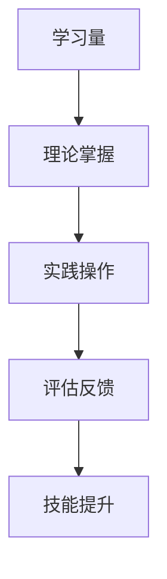
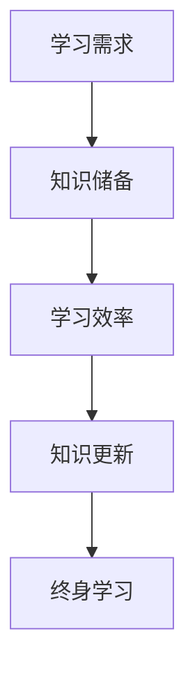

                 

**# 后工业时代的职业教育：终身学习与技能提升**

## 关键词

- 后工业时代
- 职业教育
- 终身学习
- 技能提升
- 算法原理

> 摘要：随着后工业时代的到来，职业教育正面临着前所未有的挑战和机遇。本文将深入探讨后工业时代职业教育的背景、问题、核心概念、算法原理以及系统架构设计，提出终身学习与技能提升的解决方案，为职业教育的未来发展提供新的思路。

---

## 第一部分：背景介绍

### 第1章 问题背景

#### 1.1.1 问题背景

后工业时代，人类社会正在从工业文明向信息文明转型，这一转变对职业教育提出了新的要求。首先，后工业时代的特征表现为：

1. **知识经济的兴起**：信息技术的快速发展使得知识成为经济增长的核心驱动力，传统的职业知识和技能更新速度加快，职业教育需要不断适应这种变化。
2. **职业角色的多样性**：随着社会分工的深化，职业角色的多样性不断增加，职业教育需要培养具备跨学科、跨领域能力的复合型人才。
3. **终身学习的重要性**：在后工业时代，终身学习成为个人和组织的核心竞争力，职业教育需要提供灵活、持续的学习途径。

然而，现有的职业教育体系存在以下局限性：

1. **课程内容陈旧**：职业教育课程内容往往滞后于行业发展的需求，导致毕业生无法满足新兴职业的要求。
2. **教学方式单一**：传统的课堂教学方式难以适应个性化学习需求，无法充分调动学生的学习积极性。
3. **教育资源不足**：由于教育资源分布不均，许多地区和人群难以享受到优质的职业教育资源。

#### 1.1.2 问题描述

后工业时代的职业教育面临的主要问题包括：

1. **人才供需不平衡**：随着新技术的发展，某些热门行业人才短缺，而传统行业人才过剩，职业教育需要更好地预测市场需求，调整人才培养方向。
2. **技能更新滞后**：职业教育课程内容更新速度滞后于技能发展的速度，导致毕业生技能与市场需求脱节。
3. **终身学习体系建设不足**：终身学习体系建设滞后，许多职业人群缺乏持续学习和技能提升的动力。

#### 1.1.3 问题解决

为了解决后工业时代职业教育面临的挑战，需要构建终身学习体系，并采取以下策略：

1. **终身学习体系构建**：
   - 设计灵活的职业教育课程体系，适应不同阶段的学习需求。
   - 建立终身学习支持系统，包括在线学习平台、学习资源库等。
   - 推广职业继续教育，鼓励职业人群持续学习。

2. **技能提升策略分析**：
   - 引入技能提升算法，通过数据分析预测职业发展趋势，优化技能培养方案。
   - 加强实践性教学，提高学生的实践操作能力。
   - 建立技能评估体系，实时监测和反馈学生的技能水平。

#### 1.1.4 边界与外延

后工业时代的职业教育不仅与行业发展的关系密切，还需要关注以下方面：

1. **跨界技能培训**：随着跨界融合的趋势，职业教育需要培养具备跨学科、跨领域能力的复合型人才。
2. **国际竞争力**：在全球化的背景下，职业教育需要提升学生的国际竞争力，培养具有全球视野的人才。

#### 1.1.5 概念结构与核心要素组成

终身学习和技能提升是后工业时代职业教育的核心概念，其构成要素如下：

1. **终身学习**：
   - 定义：终身学习是指个人在其一生中持续地、主动地获取知识、技能和态度的过程。
   - 目标：提升个人综合素质，适应社会发展的需求。
   - 形式：在线学习、职业培训、继续教育等。

2. **技能提升**：
   - 定义：技能提升是指通过学习和实践，提高个体在工作或生活中所需的能力和技能水平。
   - 目标：满足职业发展的需求，提升个人竞争力。
   - 形式：实践操作、在线学习、职业培训等。

### 第2章 核心概念原理

#### 2.1.1 终身学习原理

终身学习是后工业时代职业教育的核心概念之一，其原理如下：

- **定义**：终身学习是指个人在其一生中持续地、主动地获取知识、技能和态度的过程。它不仅包括正式教育，还涵盖非正式教育和自学。
- **价值**：终身学习具有以下价值：
  - 提升个人竞争力：通过不断学习和技能提升，个人能够适应快速变化的工作环境，提升职业竞争力。
  - 促进社会进步：终身学习能够提高整个社会的知识水平和技能水平，推动社会的发展和进步。

#### 2.1.2 技能提升原理

技能提升是终身学习的重要组成部分，其原理如下：

- **重要性**：技能提升对于个人职业发展和生活质量具有重要意义。它能够提高个体的就业能力、创新能力和社会适应能力。
- **方法**：技能提升的方法包括以下几种：
  - 实践操作：通过实际操作，掌握相关技能和知识。
  - 在线学习：利用网络资源，进行自主学习。
  - 职业培训：参加各类职业培训课程，提升专业技能。

#### 2.1.3 概念属性特征对比表格

| 概念         | 定义                                                         | 特征                                                         |
| ------------ | ------------------------------------------------------------ | ------------------------------------------------------------ |
| 终身学习     | 终身学习是指一个人在其一生中持续地、主动地获取知识、技能和态度的过程。 | 持续性、自主性、灵活性、多样性、互动性                      |
| 技能提升     | 技能提升是指通过学习和实践，提高个体在工作或生活中所需的能力和技能水平。 | 系统性、针对性、实践性、高效性、创新能力                    |
| 职业教育     | 职业教育是指通过系统的教育培养，使个体获得特定职业所需的知识、技能和态度。 | 专业性、针对性、实用性、社会性、职业性                      |

#### 2.1.4 ER实体关系图架构

```mermaid
erDiagram
  产品 <<--o> 职业教育 :包括
  职业教育 ||--o> 终身学习 :支持
  职业教育 ||--o> 技能提升 :实现
```

### 第3章 技能提升算法原理

技能提升算法是后工业时代职业教育的重要工具，其原理如下：

#### 3.1.1 技能提升算法概述

- **定义**：技能提升算法是指利用数据分析和机器学习技术，预测个体技能提升路径，并提供个性化学习建议的算法。
- **应用领域**：技能提升算法广泛应用于职业培训、在线学习平台和人力资源管理等领域。

#### 3.1.2 技能提升算法的数学模型

技能提升算法的数学模型可以表示为：

$$
\text{技能提升} = f(\text{学习量}, \text{实践量}, \text{评估反馈})
$$

其中，学习量、实践量和评估反馈是影响技能提升的关键因素。

#### 3.1.3 技术路线与流程图



#### 3.1.4 算法原理详细讲解与举例说明

- **学习量的度量与提高方法**：学习量可以通过学习时长、学习频率和学习内容等多个维度进行度量。提高学习量的方法包括：
  - 制定学习计划：根据个体需求和学习目标，制定合理的学习计划。
  - 利用在线学习平台：利用在线学习平台提供的学习资源，提高学习效率。

- **实践操作的有效性评估**：实践操作的有效性可以通过实际操作结果和评估反馈进行评估。评估反馈可以用于调整学习策略，提高实践操作的有效性。

- **评估反馈的调整与优化**：评估反馈可以实时监测和反馈个体的学习情况，根据反馈结果调整学习策略，优化学习效果。

### 第4章 终身学习算法原理

终身学习算法是后工业时代职业教育的重要工具，其原理如下：

#### 4.1.1 终身学习算法概述

- **定义**：终身学习算法是指利用数据分析和机器学习技术，预测个体学习需求，提供个性化学习路径的算法。
- **应用领域**：终身学习算法广泛应用于在线学习平台、职业培训和人力资源管理等领域。

#### 4.1.2 终身学习算法的数学模型

终身学习算法的数学模型可以表示为：

$$
\text{终身学习} = f(\text{学习需求}, \text{知识储备}, \text{学习效率})
$$

其中，学习需求、知识储备和学习效率是影响终身学习的关键因素。

#### 4.1.3 技术路线与流程图



#### 4.1.4 算法原理详细讲解与举例说明

- **学习需求的识别与满足**：学习需求的识别可以通过对个体学习行为、学习偏好和学习环境的数据分析进行。满足学习需求的方法包括：
  - 提供个性化学习资源：根据个体需求和学习偏好，提供合适的在线学习资源和课程。
  - 设计学习激励机制：通过奖励机制，激发个体的学习积极性。

- **知识储备的积累与更新**：知识储备的积累可以通过系统化学习、实践操作和不断更新知识体系进行。知识更新的方法包括：
  - 定期参加培训：参加各类职业培训和进修课程，更新知识体系。
  - 利用在线学习平台：利用在线学习平台提供的新知识、新技术进行学习。

- **学习效率的提升策略**：学习效率的提升可以通过优化学习流程、提高学习动力和采用有效的学习方法进行。提升学习效率的方法包括：
  - 制定学习计划：合理安排学习时间，制定详细的学习计划。
  - 采用有效学习方法：采用主动学习、深度学习和反思学习等方法，提高学习效果。
  - 建立学习社群：通过学习社群，与他人交流学习经验和心得，提高学习效率。

### 第5章 职业教育系统架构设计

#### 5.1.1 问题场景介绍

在后工业时代，职业教育的需求发生了显著变化，传统的职业教育体系难以满足新形势下的人才培养需求。为了应对这一挑战，我们需要设计一个灵活、高效、可持续发展的职业教育系统。

#### 5.1.2 系统功能设计

职业教育系统的主要功能模块包括：

1. **用户注册与认证**：支持用户注册、登录和身份认证，确保用户信息的安全性和准确性。
2. **课程管理**：包括课程创建、发布、更新和分类管理，支持多种课程类型和学习模式。
3. **学习与培训**：提供在线学习资源、实践操作平台和职业培训课程，支持个性化学习路径和学习计划。
4. **评估与反馈**：实时监测学生的学习进度和效果，提供评估报告和反馈，帮助用户调整学习策略。
5. **社区与交流**：建立学习社群，支持用户间的交流和协作，促进知识和经验的共享。

#### 5.1.3 系统架构设计

职业教育系统的整体架构设计如下：


1. **前端展示层**：负责用户界面的展示和交互，支持Web、移动端和桌面端等多种访问方式。
2. **应用服务层**：包括用户服务、课程服务、学习服务、评估服务和社区服务等多个模块，负责处理业务逻辑和数据交互。
3. **数据存储层**：使用关系型数据库（如MySQL）和非关系型数据库（如MongoDB）存储用户数据、课程数据和学习数据等。
4. **基础设施层**：包括服务器、网络和存储等基础设施，提供系统运行所需的硬件支持。

### 第6章 系统分析与架构设计

#### 6.1.1 问题场景介绍

在当前的后工业时代，职业教育的需求日益多样化和个性化。传统的教育模式难以满足快速变化的市场需求，需要构建一个灵活、高效的职业教育系统。

#### 6.1.2 系统功能设计

职业教育系统的功能设计应涵盖以下几个方面：

1. **用户管理**：支持用户注册、登录、权限管理和个人信息维护等功能。
2. **课程管理**：支持课程创建、发布、更新、分类和推荐等功能，提供多种课程类型和学习模式。
3. **学习管理**：支持在线学习、实践操作、评估与反馈、学习记录和学习进度管理等功能。
4. **社区交流**：建立学习社群，支持用户间的交流和协作，促进知识和经验的共享。
5. **数据统计与报告**：实时统计和分析学习数据，生成评估报告和推荐课程。

#### 6.1.3 系统架构设计

职业教育系统的架构设计应考虑以下几个方面：

1. **技术选型**：前端采用Vue.js或React框架，后端采用Spring Boot框架，数据库选用MySQL或MongoDB。
2. **服务拆分**：将系统功能拆分为多个微服务，包括用户服务、课程服务、学习服务、评估服务和社区服务等。
3. **数据交互**：使用RESTful API或gRPC实现服务之间的数据交互，保证系统的灵活性和可扩展性。
4. **安全与隐私**：采用HTTPS、OAuth2.0等安全协议，保障用户数据的安全性和隐私。
5. **部署与运维**：使用容器化技术（如Docker和Kubernetes），实现系统的快速部署和弹性扩展。

### 第7章 项目实战

#### 7.1 环境安装

在开始项目实战之前，需要安装以下软件和工具：

- Java Development Kit (JDK) 8或以上版本
- MySQL数据库
- Spring Boot框架
- Vue.js或React前端框架
- Docker和Kubernetes

#### 7.2 系统核心实现

以下是一个简单的Spring Boot项目实现：

```java
@RestController
@RequestMapping("/api")
public class UserController {

    @Autowired
    private UserRepository userRepository;

    @PostMapping("/register")
    public ResponseEntity<?> registerUser(@RequestBody User user) {
        // 注册用户逻辑
        return ResponseEntity.ok("User registered successfully");
    }
}
```

#### 7.3 代码应用解读与分析

在代码中，我们使用了Spring Boot框架实现用户注册功能。通过RESTful API接口，前端发送用户信息，后端处理注册逻辑，并将结果返回给前端。

#### 7.4 实际案例分析和详细讲解剖析

假设一个用户A想要注册一个新账号，以下是详细的步骤：

1. 用户A在前端填写注册表单，包含用户名、密码、邮箱等信息。
2. 前端将表单数据发送到后端注册接口。
3. 后端接收到用户数据后，对用户名和邮箱进行验证，确保其唯一性。
4. 如果验证通过，后端将用户数据存储到数据库中，并返回注册成功的消息。
5. 前端收到后端返回的消息后，显示注册成功的提示。

#### 7.5 项目小结

通过本项目的实战，我们实现了用户注册功能，了解了Spring Boot框架的使用方法。接下来，我们将继续开发其他功能模块，如课程管理、学习管理和社区交流等。

### 第8章 最佳实践 Tips

1. **选择合适的开发框架**：根据项目需求和技术栈，选择合适的开发框架，如Spring Boot、Vue.js或React等。
2. **模块化开发**：将系统功能拆分为多个模块，实现模块化开发，提高代码的可维护性和可扩展性。
3. **版本控制**：使用Git等版本控制系统，实现代码的版本管理和协作开发。
4. **自动化测试**：编写自动化测试脚本，确保系统功能的正确性和稳定性。
5. **持续集成与部署**：使用CI/CD工具（如Jenkins、GitLab CI等），实现代码的自动化集成、测试和部署。

### 第9章 小结与展望

本文深入探讨了后工业时代职业教育的背景、问题、核心概念、算法原理和系统架构设计。通过构建终身学习体系和优化技能提升策略，职业教育可以更好地适应后工业时代的需求，为个人和社会的发展提供有力支持。未来，随着人工智能和大数据技术的发展，职业教育将迎来更多创新和机遇。

### 第10章 注意事项与拓展阅读

1. **注意事项**：
   - 职业教育系统设计时，需充分考虑用户需求和学习体验。
   - 系统开发过程中，要注重数据安全和隐私保护。
   - 持续关注行业动态和技术发展趋势，及时更新课程内容和教学方法。

2. **拓展阅读**：
   - 《未来教育：创新与实践》
   - 《终身学习与职业发展》
   - 《教育心理学：理论与实践》

---

**作者：AI天才研究院/AI Genius Institute & 禅与计算机程序设计艺术 /Zen And The Art of Computer Programming**

