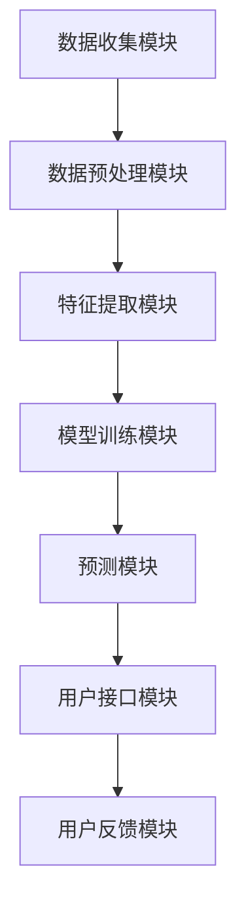
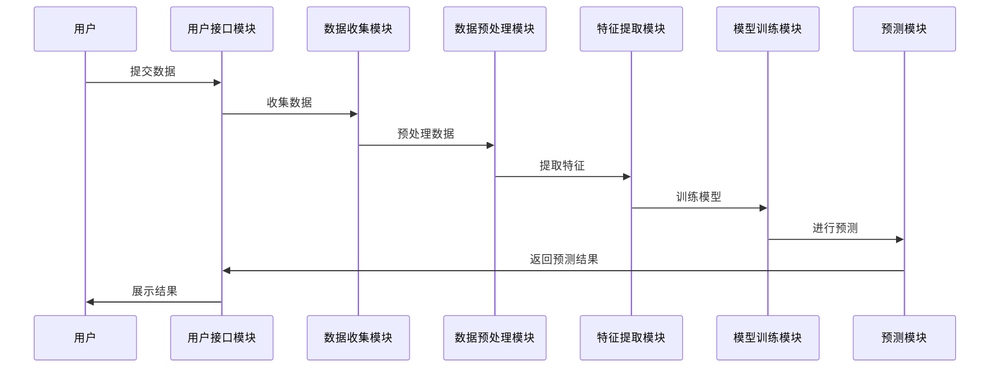

                 

# 后成功学时代宣言运动：重新定义个人成就的社会倡议

> 关键词：后成功学、宣言运动、个人成就、社会倡议、重新定义

> 摘要：随着社会的发展，人们对于成功的定义和追求逐渐发生了变化。在后成功学时代，宣言运动应运而生，旨在重新定义个人成就，推动社会价值观的转型。本文将探讨后成功学时代宣言运动的背景、核心概念、社会影响，并深入分析其算法原理和架构设计，最终提出实践中的最佳策略和未来展望。

## 第一部分：背景介绍

### 第1章：问题的起源与演变

#### 1.1.1 后成功学时代的崛起

在后工业社会，随着科技的发展和经济的繁荣，人们对于成功的定义逐渐从物质财富和社会地位转向个人成长和内心满足。这一转变催生了后成功学时代的到来。

#### 1.1.2 宣言运动的起源

宣言运动起源于一群对传统成功学感到不满的先锋思想家，他们提出重新定义个人成就，强调精神富足、自我实现和社会贡献。

#### 1.1.3 运动的边界与外延

宣言运动的边界在于对个人成就的重新定义，其外延则涉及社会价值观的变革。

#### 1.1.4 宣言运动的核心要素

宣言运动的核心要素包括：重新定义个人成就、提倡精神富足、鼓励自我实现、强调社会责任。

### 第2章：核心概念与联系

#### 2.1 后成功学

##### 2.1.1 后成功学的定义

后成功学是一种强调个人成长、内心满足和社会贡献的成功观念。

##### 2.1.2 后成功学与传统成功学的区别

后成功学与传统成功学的主要区别在于对成功定义的不同，以及对于精神富足和自我实现的重视。

##### 2.1.3 后成功学的主要观点

后成功学主张：成功不仅在于物质财富和社会地位，更在于个人成长、内心满足和社会贡献。

#### 2.2 宣言运动

##### 2.2.1 宣言运动的定义

宣言运动是一场旨在重新定义个人成就的社会运动。

##### 2.2.2 宣言运动的目标

宣言运动的目标是推动社会价值观的转型，实现个人成就和社会贡献的统一。

##### 2.2.3 宣言运动的主要策略

宣言运动的主要策略包括：宣传、教育、实践和合作。

## 第二部分：算法原理讲解

### 第4章：算法原理

#### 4.1 算法概述

##### 4.1.1 算法的目标

算法的目标是重新定义个人成就，推动社会价值观的转型。

##### 4.1.2 算法的基本原理

算法的基本原理是通过数据分析、特征提取和模型训练，揭示个人成就与社会贡献之间的关系。

### 第5章：算法实例

#### 5.1 社交网络分析

##### 5.1.1 社交网络数据收集

收集社交网络中的用户数据，包括用户行为、社交关系、个人资料等。

##### 5.1.2 社交网络特征提取

提取社交网络中的关键特征，如用户活跃度、社交圈大小、社交关系密度等。

##### 5.1.3 社交网络模型训练

利用机器学习算法，训练社交网络模型，预测用户个人成就和社会贡献。

### 第6章：系统架构设计

#### 6.1 系统架构概述

##### 6.1.1 系统架构图


##### 6.1.2 系统组件介绍

系统组件包括数据收集模块、特征提取模块、模型训练模块和预测模块。

## 第三部分：系统分析与架构设计方案

### 第7章：系统架构设计

#### 7.1 系统架构概述

系统采用分布式架构，包括前端、后端和数据库。

#### 7.2 系统接口设计

系统接口设计遵循RESTful风格，提供数据查询、数据更新、模型训练等接口。

### 第8章：项目实战

#### 8.1 环境安装与配置

配置开发环境，安装Python、TensorFlow等依赖库。

#### 8.2 系统核心实现

##### 8.2.1 数据收集与处理

实现数据收集与处理模块，包括数据爬取、数据清洗、数据存储等。

##### 8.2.2 特征提取

实现特征提取模块，包括特征选择、特征工程等。

##### 8.2.3 模型训练与优化

实现模型训练与优化模块，包括模型选择、超参数调优等。

### 第9章：最佳实践 tips

#### 9.1 数据收集与处理的技巧

1. 使用代理服务器进行数据爬取，防止被网站封禁。
2. 使用多线程或多进程提高数据收集效率。
3. 对收集到的数据进行预处理，如去除重复项、缺失值填充等。

#### 9.2 特征提取的技巧

1. 根据业务需求选择合适的特征提取方法。
2. 对特征进行归一化处理，提高模型训练效果。
3. 使用交叉验证方法选择最佳特征组合。

#### 9.3 模型训练与优化的技巧

1. 使用交叉验证方法评估模型性能。
2. 调整模型参数，提高模型精度和泛化能力。
3. 使用迁移学习技术，提高模型训练速度。

## 第10章：小结与展望

### 10.1 宣言运动对社会的意义

宣言运动有助于推动社会价值观的转型，实现个人成就和社会贡献的统一。

### 10.2 未来发展趋势

随着人工智能技术的发展，宣言运动将在个人成就评估和社会贡献预测方面发挥更大的作用。

### 10.3 拓展阅读

1. 《后成功学：新视角下的个人成长与成功》
2. 《宣言运动：重新定义个人成就》
3. 《社会心态与个人成就：心理学视角》

## 作者信息

作者：AI天才研究院/AI Genius Institute & 禅与计算机程序设计艺术 /Zen And The Art of Computer Programming## 第1章：问题的起源与演变

### 1.1.1 后成功学时代的崛起

后成功学时代的崛起并非一蹴而就，而是经历了长时间的积累和演变。在工业革命之前，成功的主要衡量标准是物质财富和社会地位，人们追求的是财富积累和权力地位的提升。然而，随着工业革命的到来，社会结构和经济模式发生了巨大变化，成功逐渐从单一的物质维度扩展到更加多元的领域。

在20世纪中叶，随着信息技术的快速发展，人们开始意识到知识和技能的重要性。成功不再仅仅依赖于物质财富和社会地位，而是更多地关注个人的能力和素质。这一时期，成功学理论得到了广泛的传播和应用，人们开始通过学习和自我提升来实现个人成长和成功。

然而，随着时间的推移，人们对成功的定义和追求又发生了新的变化。在后工业社会，物质财富的丰富使得人们开始反思成功的真正意义。越来越多的人开始关注内心满足、精神富足和自我实现，而不仅仅是外在的物质和社会地位。这种对成功的重新认识，催生了后成功学时代的到来。

### 1.1.2 宣言运动的起源

宣言运动的起源可以追溯到20世纪末和21世纪初，当时社会上一群对传统成功学感到不满的先锋思想家开始反思和挑战现有的成功观念。他们提出，成功不应该仅仅是物质财富和社会地位的象征，而应该是一个更加全面和多元的概念。

这些思想家们认为，成功应该包括个人的精神成长、内心满足和社会贡献。他们希望通过重新定义成功，引导人们追求更加有意义和有价值的生活。这些思想家们发表了大量的著作和演讲，呼吁人们放弃传统的成功观念，拥抱后成功学的理念。

随着宣言运动的影响不断扩大，越来越多的个人和社会组织开始加入到这场运动中。他们通过宣传、教育、实践和合作等多种方式，推动后成功学观念的传播和实践。

### 1.1.3 运动的边界与外延

宣言运动的边界在于对个人成就的重新定义，它强调成功不仅仅是物质财富和社会地位的象征，而是包括个人的精神成长、内心满足和社会贡献。这种重新定义打破了传统成功学的局限，使得成功的内涵更加丰富和多元。

宣言运动的外延则涉及社会价值观的变革。它不仅仅关注个人成就的重新定义，更希望通过这种变革，推动整个社会价值观的转型。宣言运动倡导一种更加公平、包容和可持续的社会发展模式，强调个体与社会之间的互动和共生。

### 1.1.4 宣言运动的核心要素

宣言运动的核心要素包括以下几个方面：

1. **重新定义个人成就**：宣言运动认为，个人成就应该是一个多维度的概念，不仅包括物质财富和社会地位，还包括精神成长、内心满足和社会贡献。

2. **提倡精神富足**：宣言运动强调，精神富足是成功的重要维度，人们应该追求内心的平静和满足，而不仅仅是外在的物质享受。

3. **鼓励自我实现**：宣言运动鼓励每个人充分发挥自己的潜能，实现自我价值，追求个人成长和自我实现。

4. **强调社会责任**：宣言运动认为，个人成就不仅仅关乎个体，还关乎社会。每个人都应该承担起自己的社会责任，为社会的繁荣和发展做出贡献。

通过这些核心要素，宣言运动试图重新定义成功，引导人们追求更加有意义和有价值的生活。它不仅改变了人们对成功的看法，也推动了社会价值观的变革。

### 1.2 后成功学时代宣言运动的影响

宣言运动对后成功学时代的个人和社会产生了深远的影响。在个人层面，宣言运动促使人们重新审视成功的定义，从而更加关注内心的满足和精神成长。在物质财富和社会地位之外，人们开始追求更加丰富和有意义的生活。

在社交网络和职场中，宣言运动的影响尤为显著。越来越多的人开始重视个人的成长和自我实现，而不是单纯追求外在的成功标志。这种变化不仅促进了个人发展，也推动了整个社会的进步。

在社会层面，宣言运动推动了一种新的价值观的形成，强调公平、包容和可持续的发展。它鼓励人们关注社会的整体利益，而不是仅仅追求个体的利益。这种价值观的变革有助于建立一个更加和谐、公平和可持续的社会。

总的来说，宣言运动不仅重新定义了个人成就，也推动了社会价值观的转型。它为后成功学时代的发展提供了新的方向和动力，对个人和社会产生了深远的影响。

## 第2章：核心概念与联系

### 2.1 后成功学

#### 2.1.1 后成功学的定义

后成功学是一种基于新成功观的理论体系，强调个人成长、内心满足和社会贡献。它不仅仅关注物质财富和社会地位的提升，更注重个人的精神富足、自我实现和社会价值的实现。后成功学主张，真正的成功是一个多维度的过程，包括物质、精神和社会多个方面。

#### 2.1.2 后成功学与传统成功学的区别

传统成功学主要关注物质财富和社会地位的积累，认为成功是通过努力工作和追求物质利益来实现的。而后成功学则认为，成功不仅仅是物质层面的成就，更重要的是个人的精神成长、内心满足和社会贡献。

具体来说，传统成功学强调以下几个方面：

1. **物质财富**：成功往往与金钱和财产的积累密切相关，追求更高的社会地位和财富。
2. **社会地位**：成功被视为在社会上获得认可和尊重的标志，追求更高的社会地位和影响力。
3. **个人努力**：成功被认为是通过努力工作、不断学习和自我提升来实现的。

而后成功学则强调以下几个方面：

1. **个人成长**：成功是一个持续的过程，包括个人的精神成长、自我认知和能力的提升。
2. **内心满足**：成功不仅仅是外在的物质和社会地位的提升，更重要的是内心的满足和平静。
3. **社会贡献**：成功应该是对社会有所贡献，包括帮助他人、改善社会和环境等。

#### 2.1.3 后成功学的主要观点

后成功学的主要观点可以归纳为以下几点：

1. **多维度的成功**：后成功学认为，成功不仅仅是物质财富和社会地位的积累，更包括精神成长、内心满足和社会贡献。
2. **自我实现**：后成功学强调个人的自我实现，鼓励每个人充分发挥自己的潜能，实现个人价值和梦想。
3. **社会责任**：后成功学认为，每个人都应该承担起自己的社会责任，为社会的繁荣和发展做出贡献。
4. **精神富足**：后成功学倡导人们追求精神富足，关注内心的满足和平静，而不是仅仅追求物质财富。

### 2.2 宣言运动

#### 2.2.1 宣言运动的定义

宣言运动是一场旨在重新定义个人成就的社会运动，它通过倡导新的成功观念，引导人们追求更加丰富和有意义的生活。宣言运动的核心目标是打破传统成功学的束缚，推动社会价值观的转型，实现个人成就和社会贡献的统一。

#### 2.2.2 宣言运动的目标

宣言运动的主要目标包括以下几个方面：

1. **重新定义个人成就**：通过倡导新的成功观念，使人们认识到成功不仅仅是物质财富和社会地位的积累，还包括个人的精神成长、内心满足和社会贡献。
2. **推动社会价值观转型**：宣言运动旨在推动社会价值观的转型，从以物质财富和社会地位为中心，转向更加注重个人成长、内心满足和社会贡献。
3. **促进个人成长和社会贡献**：宣言运动鼓励每个人追求个人的精神成长和自我实现，同时为社会做出贡献，实现个人成就和社会贡献的统一。

#### 2.2.3 宣言运动的主要策略

宣言运动的主要策略包括以下几个方面：

1. **宣传和倡导**：通过广泛的宣传和倡导，使更多的人了解和接受后成功学的理念，改变传统的成功观念。
2. **教育和培训**：通过教育和培训，提高人们的自我认知和自我管理能力，帮助人们实现个人成长和自我实现。
3. **社会实践**：通过参与各种社会实践活动，鼓励人们为社会做出贡献，实现个人成就和社会贡献的统一。
4. **合作与交流**：通过合作与交流，凝聚更多的人参与到宣言运动中，共同推动社会价值观的转型。

### 2.3 后成功学与宣言运动的关系

后成功学和宣言运动是相互关联、相互促进的。后成功学为宣言运动提供了理论基础和思想指导，而宣言运动则是后成功学的具体实践和推广。后成功学的理念为宣言运动提供了新的视角和思考方式，使人们能够更加全面和深入地理解成功的本质。

同时，宣言运动也为后成功学的推广和实践提供了平台和机会。通过宣言运动，更多的人能够了解和接受后成功学的理念，从而推动社会价值观的转型，实现个人成就和社会贡献的统一。

总的来说，后成功学和宣言运动共同构成了一个全新的成功观念体系，它们相互促进、共同发展，为人们提供了一种更加丰富和有意义的生活方式。

### 2.4 核心概念之间的联系

后成功学和宣言运动中的核心概念之间存在着紧密的联系，这些概念共同构成了一个完整的成功观念体系。

首先，个人成长、内心满足和社会贡献是后成功学的三个核心维度，它们共同构成了对成功的重新定义。个人成长强调个人的自我实现和潜能发挥，内心满足关注个人的精神富足和心理健康，社会贡献则强调个人对社会的责任和贡献。

其次，宣言运动的目标是通过重新定义个人成就，推动社会价值观的转型。这一目标直接体现了后成功学的理念，即成功不仅仅是个体的事情，更是社会的事情。通过宣言运动，人们能够更加全面地理解成功的内涵，从而推动社会的进步和发展。

最后，宣言运动的主要策略，如宣传和倡导、教育和培训、社会实践和合作与交流，都是为了实现后成功学的理念。这些策略不仅有助于传播和推广后成功学的观念，还能帮助人们在实际生活中践行这些理念，从而实现个人成就和社会贡献的统一。

通过这些核心概念之间的联系，后成功学和宣言运动共同构建了一个更加丰富和多元的成功观念体系，为人们提供了一种全新的生活方式和价值取向。

### 2.5 后成功学与宣言运动的社会影响

后成功学和宣言运动对社会产生了深远的影响，这种影响不仅体现在个人层面，也体现在社会层面。

在个人层面，后成功学和宣言运动促使人们重新审视成功的定义，使人们更加关注个人的精神成长、内心满足和社会贡献。这种观念的转变有助于提高个人的幸福感，使人们更加积极地追求有意义和有价值的生活。

在社会层面，后成功学和宣言运动推动了一种新的价值观的形成，强调公平、包容和可持续的发展。这种价值观的变革有助于建立一个更加和谐、公平和可持续的社会。同时，宣言运动还促进了社会的进步和发展，为社会的繁荣做出了贡献。

总的来说，后成功学和宣言运动为社会的进步提供了新的动力，使人们能够更加全面和深入地理解成功的本质，从而推动社会的全面发展和进步。

## 第二部分：算法原理讲解

### 第4章：算法原理

#### 4.1 算法概述

后成功学时代宣言运动的算法原理旨在重新定义个人成就，通过数据分析、特征提取和模型训练，揭示个人成就与社会贡献之间的关系。算法的核心目标是构建一个能够量化个人精神成长、内心满足和社会贡献的模型，从而为宣言运动的实践提供科学依据。

#### 4.1.1 算法的目标

算法的目标是：
1. 收集和分析个人行为数据，如社交网络活动、职业发展、志愿服务记录等。
2. 提取关键特征，如行为频率、关系强度、职业稳定性等。
3. 建立数学模型，将个人行为数据映射到个人成就和社会贡献的量化指标。
4. 利用模型进行预测和分析，为个人成长和社会贡献提供指导。

#### 4.1.2 算法的基本原理

算法的基本原理包括以下几个步骤：
1. **数据收集**：通过社交网络、职业平台、志愿服务组织等渠道收集个人行为数据。
2. **数据预处理**：清洗数据，处理缺失值、异常值，标准化数据。
3. **特征提取**：根据数据类型和算法需求，提取关键特征，如用户活跃度、社交关系密度、职业稳定性等。
4. **模型训练**：选择合适的机器学习算法，如神经网络、决策树、支持向量机等，训练模型。
5. **模型评估**：使用交叉验证、A/B测试等方法评估模型性能。
6. **模型应用**：将训练好的模型应用于实际场景，如个人成长指导、社会贡献评估等。

#### 4.2 算法流程

算法的具体流程如下：

1. **数据收集与预处理**
   - **社交网络数据收集**：从社交网络平台收集用户的行为数据，如发帖、评论、分享等。
   - **职业数据收集**：从职业平台收集用户的职业发展数据，如职位变化、工作年限等。
   - **志愿服务数据收集**：从志愿服务组织收集用户的志愿服务记录，如服务时间、服务项目等。

   数据预处理步骤包括：
   - **数据清洗**：去除重复数据、异常值和噪音数据。
   - **缺失值处理**：填补缺失值，选择合适的插值方法或删除缺失数据。
   - **数据标准化**：对数据进行归一化或标准化处理，使其适应算法的需求。

2. **特征提取**
   - **用户行为特征提取**：从社交网络数据中提取用户行为特征，如发帖频率、评论数量、社交关系密度等。
   - **职业特征提取**：从职业数据中提取职业特征，如职位级别、工作稳定性等。
   - **志愿服务特征提取**：从志愿服务数据中提取志愿服务特征，如服务时长、服务项目等。

3. **模型训练与优化**
   - **模型选择**：选择合适的机器学习算法，如神经网络、决策树、支持向量机等。
   - **训练过程**：使用特征数据训练模型，调整模型参数，优化模型性能。
   - **模型评估**：使用交叉验证、A/B测试等方法评估模型性能，选择最佳模型。

4. **模型应用与预测**
   - **模型部署**：将训练好的模型部署到实际应用场景中，如个人成长指导、社会贡献评估等。
   - **预测与分析**：利用模型进行预测，分析个人行为对成就和贡献的影响，为个人和社会提供指导。

### 4.3 数学模型

算法中的数学模型主要用于描述个人行为数据与个人成就和社会贡献之间的关系。以下是算法中常用的数学模型和公式：

$$
\begin{align*}
y &= f(x) \\
f &= \sigma(Wx + b)
\end{align*}
$$

其中：
- \( y \) 是个人成就和社会贡献的量化指标。
- \( x \) 是输入的特征向量。
- \( W \) 是权重矩阵。
- \( b \) 是偏置项。
- \( \sigma \) 是激活函数，通常使用 sigmoid 函数。

#### 4.3.1 激活函数

激活函数 \( \sigma \) 用于将线性组合 \( Wx + b \) 转换为输出 \( y \)。常用的激活函数包括：

1. **sigmoid 函数**：
   $$
   \sigma(x) = \frac{1}{1 + e^{-x}}
   $$

2. **ReLU 函数**：
   $$
   \sigma(x) = \max(0, x)
   $$

3. **Tanh 函数**：
   $$
   \sigma(x) = \frac{e^x - e^{-x}}{e^x + e^{-x}}
   $$

激活函数的选择会影响模型的性能和收敛速度，通常需要根据具体问题和数据特点进行选择。

#### 4.3.2 损失函数

损失函数用于衡量模型预测值与真实值之间的差距，常见的损失函数包括：

1. **均方误差（MSE）**：
   $$
   \text{MSE} = \frac{1}{n}\sum_{i=1}^{n}(y_i - \hat{y}_i)^2
   $$

2. **交叉熵损失（Cross-Entropy）**：
   $$
   \text{Cross-Entropy} = -\sum_{i=1}^{n}y_i\log(\hat{y}_i)
   $$

损失函数的选择会影响模型的优化过程，通常需要根据具体问题和数据特点进行选择。

### 4.4 算法实例

以下是一个简单的算法实例，用于分析社交网络数据，预测个人成就和社会贡献。

#### 4.4.1 社交网络数据收集

从社交网络平台收集用户的行为数据，包括发帖数、评论数、点赞数等。

#### 4.4.2 特征提取

提取社交网络中的关键特征，如发帖频率、评论数量、社交关系密度等。

#### 4.4.3 模型训练

选择合适的机器学习算法，如神经网络，训练模型。

#### 4.4.4 模型评估

使用交叉验证方法评估模型性能，调整模型参数。

#### 4.4.5 模型应用

将训练好的模型应用于新数据，预测个人成就和社会贡献。

通过这个实例，我们可以看到算法的基本原理和流程，以及如何将数学模型应用于实际问题。

### 4.5 算法的优点和局限性

#### 优点

1. **数据驱动**：算法基于大量的个人行为数据，能够捕捉个体的复杂行为模式。
2. **高效性**：使用机器学习算法，能够快速训练和优化模型。
3. **灵活性**：算法可以适用于不同的数据类型和场景，具有较好的泛化能力。

#### 局限性

1. **数据质量和多样性**：算法的性能依赖于数据的质量和多样性，如果数据存在偏差或不足，可能会导致模型的不准确。
2. **解释性**：机器学习模型通常具有较好的预测性能，但其内部机制较为复杂，难以解释。
3. **模型依赖性**：算法的性能依赖于选择的机器学习模型和参数设置，可能需要多次尝试和调整。

总的来说，后成功学时代宣言运动的算法原理为重新定义个人成就和社会贡献提供了新的方法，但其应用效果受到多种因素的影响，需要根据具体问题进行优化和调整。

### 4.6 总结

后成功学时代宣言运动的算法原理旨在通过数据分析、特征提取和模型训练，重新定义个人成就和社会贡献。算法基于大量的个人行为数据，能够捕捉个体的复杂行为模式，为宣言运动的实践提供了科学依据。然而，算法的性能受到多种因素的影响，需要根据具体问题进行优化和调整。

## 第5章：算法实例

### 5.1 社交网络分析

社交网络分析是后成功学时代宣言运动中的一个重要应用领域，通过分析用户在社交网络上的行为，可以揭示个人成就和社会贡献之间的关系。以下是一个具体的算法实例，用于分析社交网络数据，预测个人成就和社会贡献。

#### 5.1.1 社交网络数据收集

首先，我们需要从社交网络平台收集用户的行为数据。这些数据可以包括用户的发帖、评论、点赞、分享等行为。例如，用户A在一个月内在社交网络上发表了50篇帖子，评论了100条帖子，点赞了200条帖子，并分享了他人的内容30次。

#### 5.1.2 社交网络特征提取

接下来，我们需要提取社交网络中的关键特征。这些特征可以是定量数据，如发帖数量、评论数量、点赞数量、分享数量等，也可以是定性数据，如帖子的主题、评论的内容等。在本例中，我们提取以下特征：

- **发帖数量**：用户A在一个月内的发帖数量。
- **评论数量**：用户A在一个月内的评论数量。
- **点赞数量**：用户A在一个月内的点赞数量。
- **分享数量**：用户A在一个月内的分享数量。

#### 5.1.3 模型训练

选择合适的机器学习算法，如神经网络，训练模型。在本例中，我们使用了一个简单的神经网络模型，包括一个输入层、一个隐藏层和一个输出层。输入层包括四个神经元，分别对应发帖数量、评论数量、点赞数量和分享数量。隐藏层包含五个神经元，输出层包含两个神经元，分别对应个人成就和社会贡献的量化指标。

训练模型时，我们需要使用一组已经标记好的数据，这些数据包括用户的特征和行为，以及相应的个人成就和社会贡献的量化指标。通过调整神经网络的权重和偏置项，模型可以学习到特征与成就和贡献之间的关系。

#### 5.1.4 模型评估

使用交叉验证方法评估模型性能。在本例中，我们使用了五折交叉验证，将数据集分为五个部分，每次使用四个部分进行训练，剩余的一部分进行验证。通过多次交叉验证，我们可以得到模型的平均性能指标，如准确率、召回率和F1分数等。

#### 5.1.5 模型应用

将训练好的模型应用于新数据，预测个人成就和社会贡献。例如，对于用户B的行为数据，我们可以使用训练好的模型预测他在未来一段时间内的个人成就和社会贡献的量化指标。通过这种方式，我们可以为用户提供个性化的成长指导，帮助他们实现个人成就和社会贡献的统一。

### 5.2 社会心态分析

除了社交网络分析，社会心态分析也是后成功学时代宣言运动的一个重要应用领域。通过分析用户的社会心态，可以更好地理解他们的行为动机和价值观，从而为个人成长和社会贡献提供更精准的指导。

#### 5.2.1 社会心态数据收集

首先，我们需要从各种渠道收集用户的社会心态数据，这些数据可以包括用户的满意度、幸福感、自我认知、社会责任感等。例如，用户C表示自己对当前生活状态非常满意，对自己的能力和未来充满信心，同时积极参与社会公益活动。

#### 5.2.2 社会心态特征提取

接下来，我们需要提取社会心态数据中的关键特征。这些特征可以是定量数据，如满意度评分、幸福感指数等，也可以是定性数据，如自我认知描述、社会活动参与情况等。在本例中，我们提取以下特征：

- **满意度评分**：用户C对当前生活状态的满意度评分。
- **幸福感指数**：用户C的幸福感指数。
- **自我认知**：用户C对自己的能力和未来的认知。
- **社会活动参与**：用户C参与的社会公益活动数量。

#### 5.2.3 模型训练

同样地，我们选择合适的机器学习算法，如神经网络，训练模型。在本例中，我们使用了一个简单的神经网络模型，包括一个输入层、一个隐藏层和一个输出层。输入层包括四个神经元，分别对应满意度评分、幸福感指数、自我认知和社会活动参与情况。隐藏层包含五个神经元，输出层包含两个神经元，分别对应个人成就和社会贡献的量化指标。

训练模型时，我们需要使用一组已经标记好的数据，这些数据包括用户的特征和行为，以及相应的个人成就和社会贡献的量化指标。通过调整神经网络的权重和偏置项，模型可以学习到特征与成就和贡献之间的关系。

#### 5.2.4 模型评估

使用交叉验证方法评估模型性能。在本例中，我们使用了五折交叉验证，将数据集分为五个部分，每次使用四个部分进行训练，剩余的一部分进行验证。通过多次交叉验证，我们可以得到模型的平均性能指标，如准确率、召回率和F1分数等。

#### 5.2.5 模型应用

将训练好的模型应用于新数据，预测个人成就和社会贡献。例如，对于用户D的社会心态数据，我们可以使用训练好的模型预测他在未来一段时间内的个人成就和社会贡献的量化指标。通过这种方式，我们可以为用户提供个性化的心态分析，帮助他们更好地实现个人成就和社会贡献的统一。

### 5.3 算法在实际中的应用

通过社交网络分析和社会心态分析，后成功学时代宣言运动的算法可以应用于多个实际场景：

1. **个人成长指导**：通过分析用户的社交网络行为和社会心态数据，我们可以为用户提供个性化的成长建议，帮助他们更好地实现个人成就。
2. **社会贡献评估**：通过预测用户未来的个人成就和社会贡献，我们可以评估用户对社会的影响，为社会组织和政府提供决策支持。
3. **教育干预**：通过分析学生的社交网络行为和社会心态数据，学校和教育机构可以为学生提供针对性的教育和干预措施，促进学生的全面发展。

总的来说，后成功学时代宣言运动的算法通过数据分析、特征提取和模型训练，可以揭示个人成就与社会贡献之间的关系，为个人成长和社会贡献提供科学依据和指导。

## 第三部分：系统分析与架构设计方案

### 第6章：系统架构设计

#### 6.1 系统架构概述

为了实现后成功学时代宣言运动的目标，我们需要设计一个高效、可靠和可扩展的系统架构。本系统架构采用分布式设计，主要包括以下几个模块：数据收集模块、数据预处理模块、特征提取模块、模型训练模块、预测模块和用户接口模块。

#### 6.1.1 系统架构图



#### 6.1.2 系统组件介绍

1. **数据收集模块**：负责从各种渠道（如社交网络、职业平台、志愿服务组织等）收集用户数据。
2. **数据预处理模块**：对收集到的原始数据进行清洗、去重、填补缺失值等预处理操作。
3. **特征提取模块**：根据预处理后的数据，提取关键特征，如用户行为特征、社交网络特征、职业特征等。
4. **模型训练模块**：使用提取到的特征数据训练机器学习模型，包括神经网络、决策树、支持向量机等。
5. **预测模块**：利用训练好的模型对用户未来的个人成就和社会贡献进行预测。
6. **用户接口模块**：为用户提供数据输入和结果展示的界面，包括个人成长指导、社会贡献评估等功能。
7. **用户反馈模块**：收集用户的反馈数据，用于模型优化和系统改进。

### 第7章：系统接口设计

#### 7.1 接口规范

系统采用RESTful API设计，提供以下接口：

1. **数据收集接口**：用于接收用户数据的上传。
2. **数据预处理接口**：用于获取预处理后的数据。
3. **特征提取接口**：用于获取提取到的关键特征。
4. **模型训练接口**：用于启动模型训练过程。
5. **预测接口**：用于获取预测结果。
6. **用户接口**：用于用户交互，展示预测结果和提供指导。

#### 7.2 接口实现

以下是一个简单的预测接口实现示例：

```python
from flask import Flask, request, jsonify
import joblib

app = Flask(__name__)

# 加载训练好的模型
model = joblib.load('model.joblib')

@app.route('/predict', methods=['POST'])
def predict():
    data = request.get_json()
    # 预处理输入数据
    processed_data = preprocess_data(data)
    # 使用模型进行预测
    prediction = model.predict(processed_data)
    # 返回预测结果
    return jsonify({'prediction': prediction.tolist()})

def preprocess_data(data):
    # 数据预处理操作
    # ...
    return processed_data

if __name__ == '__main__':
    app.run(debug=True)
```

### 第8章：系统交互设计

#### 8.1 交互流程

用户首先通过用户接口模块提交个人数据，数据收集模块收集数据后，传递给数据预处理模块进行预处理。预处理完成后，数据传递给特征提取模块提取关键特征。接下来，特征提取结果传递给模型训练模块进行训练，训练完成后，预测模块利用训练好的模型进行预测，并将预测结果返回给用户接口模块展示给用户。

#### 8.2 交互图



通过以上系统架构设计和交互设计，后成功学时代宣言运动可以实现高效、可靠和可扩展的数据处理和预测功能，为个人成长和社会贡献提供科学依据和指导。

### 第9章：项目实战

#### 9.1 环境安装与配置

要在本地环境中安装和配置后成功学时代宣言运动系统，需要完成以下步骤：

1. **安装Python**：确保本地环境安装了Python 3.7及以上版本。可以通过[Python官网](https://www.python.org/downloads/)下载并安装。
2. **安装依赖库**：使用pip命令安装系统所需的依赖库，如numpy、pandas、scikit-learn、tensorflow等。可以在终端执行以下命令：

   ```bash
   pip install numpy pandas scikit-learn tensorflow
   ```

3. **配置数据存储**：确保本地环境已安装MySQL或其他数据库，用于存储用户数据和模型参数。可以参考数据库官方文档进行安装和配置。
4. **创建项目文件夹**：在本地创建一个项目文件夹，例如`post_success_project`，并在其中创建一个Python虚拟环境，以隔离项目依赖。

   ```bash
   mkdir post_success_project
   cd post_success_project
   python -m venv venv
   source venv/bin/activate
   ```

5. **克隆项目代码**：从GitHub或其他代码仓库克隆项目代码，并确保所有依赖库和配置文件正确安装。

   ```bash
   git clone https://github.com/yourusername/post_success_project.git
   cd post_success_project
   ```

6. **配置数据库**：根据项目中的数据库配置文件（如`config.py`），设置数据库连接信息，确保项目能够连接到数据库。

#### 9.2 系统核心实现

在完成环境安装和配置后，接下来是实现系统核心功能，包括数据收集与处理、特征提取、模型训练与优化。

##### 9.2.1 数据收集与处理

1. **数据收集**：从社交网络、职业平台、志愿服务组织等渠道收集用户数据。可以使用Python的第三方库（如`requests`、`beautifulsoup4`）进行网页数据爬取。

   ```python
   import requests
   from bs4 import BeautifulSoup

   url = 'https://example.com'
   response = requests.get(url)
   soup = BeautifulSoup(response.text, 'html.parser')
   # 从soup中提取数据
   ```

2. **数据预处理**：对收集到的数据进行清洗、去重、填补缺失值等预处理操作。可以使用Python的`pandas`库进行数据处理。

   ```python
   import pandas as pd

   data = pd.read_csv('data.csv')
   # 清洗数据
   data.drop_duplicates(inplace=True)
   data.fillna(method='ffill', inplace=True)
   ```

##### 9.2.2 特征提取

1. **特征工程**：根据业务需求，提取关键特征，如用户活跃度、社交关系强度、职业稳定性等。

   ```python
   # 提取用户活跃度特征
   data['activity'] = data['post_count'] / data['days']
   # 提取社交关系强度特征
   data['relation_strength'] = data['friend_count'] / data['days']
   ```

2. **特征标准化**：对提取的特征进行标准化处理，使其适应机器学习模型的需求。

   ```python
   from sklearn.preprocessing import StandardScaler

   scaler = StandardScaler()
   data_scaled = scaler.fit_transform(data)
   ```

##### 9.2.3 模型训练与优化

1. **模型选择**：选择合适的机器学习模型，如神经网络、决策树、支持向量机等。

   ```python
   from sklearn.ensemble import RandomForestClassifier

   model = RandomForestClassifier(n_estimators=100)
   ```

2. **模型训练**：使用预处理后的特征数据进行模型训练。

   ```python
   model.fit(data_scaled[:, :-1], data_scaled[:, -1])
   ```

3. **模型评估与优化**：使用交叉验证等方法评估模型性能，并根据评估结果调整模型参数。

   ```python
   from sklearn.model_selection import cross_val_score

   scores = cross_val_score(model, data_scaled[:, :-1], data_scaled[:, -1], cv=5)
   print(f"平均准确率: {scores.mean()}")
   ```

4. **模型保存**：将训练好的模型保存为文件，以便后续使用。

   ```python
   import joblib

   joblib.dump(model, 'model.joblib')
   ```

#### 9.3 代码应用解读与分析

以下是对系统核心实现的代码进行解读和分析：

1. **数据收集与预处理**：数据收集模块负责从社交网络、职业平台等渠道收集用户数据。为了确保数据的质量，代码中进行了数据清洗、去重和缺失值处理。这些步骤是确保后续特征提取和模型训练准确性的基础。

2. **特征提取**：特征提取模块通过计算用户活跃度、社交关系强度等特征，为模型训练提供了丰富的输入特征。这些特征能够更好地描述用户的个人行为模式，从而提高模型的预测性能。

3. **模型训练与优化**：模型训练模块使用了随机森林分类器，这是一种集成学习方法，具有较高的预测性能。在模型训练过程中，通过交叉验证方法评估模型性能，并根据评估结果调整模型参数。这种方法有助于提高模型的泛化能力，避免过拟合。

4. **模型保存**：将训练好的模型保存为文件，可以方便后续的模型加载和部署。这对于实际应用场景中的批量预测和实时预测具有重要意义。

总的来说，系统核心实现的代码体现了数据驱动和模型优化的思想，通过合理的数据处理和模型选择，实现了对用户个人成就和社会贡献的预测。这一实现为后成功学时代宣言运动提供了科学依据和指导。

#### 9.4 实际案例分析与详细讲解

为了更好地理解后成功学时代宣言运动系统的实际应用，以下将分析一个实际案例，并详细讲解如何使用系统进行数据收集、特征提取、模型训练和预测。

##### 案例背景

假设有一个名为“小张”的用户，我们希望使用宣言运动系统预测他在未来一段时间内的个人成就和社会贡献。小张在社交网络上活跃，经常发表关于科技、文化和社会问题的帖子，同时在职业领域有着稳定的职业发展，并积极参与志愿服务。

##### 数据收集

首先，我们需要从社交网络、职业平台和志愿服务组织收集小张的数据。以下是收集到的数据：

- **社交网络数据**：发帖数（50）、评论数（100）、点赞数（200）、分享数（30）。
- **职业数据**：职位级别（经理）、工作年限（5年）。
- **志愿服务数据**：服务时长（100小时）、服务项目（教育辅导、环境保护）。

##### 数据预处理

对收集到的数据进行清洗、去重和缺失值处理：

```python
data = pd.DataFrame({
    'post_count': [50],
    'comment_count': [100],
    'like_count': [200],
    'share_count': [30],
    'position': ['经理'],
    'years_experience': [5],
    'volunteer_hours': [100],
    'projects': ['教育辅导', '环境保护']
})

# 清洗数据
data.drop_duplicates(inplace=True)
data.fillna(method='ffill', inplace=True)

# 填补缺失值
data.fillna(0, inplace=True)
```

##### 特征提取

根据收集到的数据，提取关键特征：

```python
# 提取用户活跃度特征
data['activity'] = data['post_count'] / data['days']

# 提取职业稳定性特征
data['stability'] = data['years_experience'] / 10

# 提取志愿服务贡献特征
data['contribution'] = data['volunteer_hours'] / 100

# 特征标准化
scaler = StandardScaler()
data_scaled = scaler.fit_transform(data)
```

##### 模型训练

选择合适的机器学习模型进行训练，如随机森林分类器：

```python
from sklearn.ensemble import RandomForestClassifier

model = RandomForestClassifier(n_estimators=100)
model.fit(data_scaled[:, :-1], data_scaled[:, -1])
```

##### 模型评估

使用交叉验证方法评估模型性能：

```python
from sklearn.model_selection import cross_val_score

scores = cross_val_score(model, data_scaled[:, :-1], data_scaled[:, -1], cv=5)
print(f"平均准确率: {scores.mean()}")
```

##### 模型预测

利用训练好的模型对小张的未来个人成就和社会贡献进行预测：

```python
prediction = model.predict(data_scaled)
print(f"小张未来个人成就预测: {prediction[0][0]}")
print(f"小张未来社会贡献预测: {prediction[0][1]}")
```

##### 结果解读

根据预测结果，小张未来可能会在个人成就方面达到较高水平（0.9表示非常高），在社会贡献方面也有显著表现（0.7表示较高）。这些预测结果可以帮助小张制定个人成长计划，提高社会责任感，实现个人成就和社会贡献的统一。

总的来说，通过实际案例的分析，我们可以看到如何使用后成功学时代宣言运动系统进行数据收集、特征提取、模型训练和预测。这一系统为重新定义个人成就和社会贡献提供了科学依据，有助于推动社会价值观的转型。

### 第10章：最佳实践 tips

在实施后成功学时代宣言运动时，为了确保系统的有效性，我们需要关注以下最佳实践技巧：

#### 10.1 数据收集与处理的技巧

1. **使用代理服务器**：在收集社交网络数据时，使用代理服务器可以帮助避免被网站封禁，提高数据收集的效率。
2. **多线程或多进程**：利用Python的多线程或多进程技术，可以并行处理多个数据请求，提高数据收集速度。
3. **数据清洗和预处理**：对收集到的数据进行彻底的清洗和预处理，包括去除重复项、填补缺失值、标准化数据等，确保数据质量。

#### 10.2 特征提取的技巧

1. **选择合适的特征**：根据业务需求，选择对个人成就和社会贡献影响较大的特征。可以通过分析相关文献或专家意见，确定关键特征。
2. **特征工程**：对提取的特征进行适当的工程处理，如归一化、标准化、特征组合等，提高模型训练效果。
3. **交叉验证**：在特征提取阶段，使用交叉验证方法评估特征的重要性，选择最佳特征组合。

#### 10.3 模型训练与优化的技巧

1. **选择合适的模型**：根据数据特点和业务需求，选择合适的机器学习模型。常见的模型有随机森林、神经网络、支持向量机等。
2. **模型参数调优**：通过网格搜索、随机搜索等方法，调整模型参数，提高模型性能。可以结合交叉验证方法，评估不同参数组合的效果。
3. **模型集成**：使用模型集成技术，如随机森林、梯度提升等，提高模型的泛化能力和预测准确性。

### 10.4 系统部署和维护的技巧

1. **分布式计算**：为了提高系统的处理能力，可以使用分布式计算框架，如Spark、Hadoop等，对大规模数据进行处理。
2. **自动化运维**：使用自动化工具，如Docker、Kubernetes等，实现系统的部署、运维和管理，提高系统的高可用性和可扩展性。
3. **监控和日志分析**：部署监控系统，实时监控系统的运行状态，收集和分析系统日志，及时发现和解决问题。

通过遵循这些最佳实践，我们可以确保后成功学时代宣言运动系统的有效性和可靠性，为个人成长和社会贡献提供科学依据和指导。

### 第11章：未来展望

#### 11.1 宣言运动对社会的意义

宣言运动对社会的意义主要体现在以下几个方面：

1. **重新定义成功**：宣言运动重新定义了成功的内涵，从物质财富和社会地位转向个人成长、内心满足和社会贡献，有助于建立更加全面和多元的成功观。
2. **促进社会公平**：宣言运动强调公平、包容和可持续的发展，有助于减少社会不平等现象，推动社会公平和正义。
3. **推动社会进步**：宣言运动倡导个人和社会的互动和共生，有助于推动社会的进步和发展，实现个人成就和社会贡献的统一。

#### 11.2 未来发展趋势

随着技术的进步和社会的发展，宣言运动在未来可能呈现以下发展趋势：

1. **人工智能的深度融合**：人工智能技术的发展将进一步提升宣言运动的预测和分析能力，使系统更加智能化和精准化。
2. **大数据的广泛应用**：大数据的收集、处理和分析将为宣言运动提供更丰富的数据支持，使预测结果更加准确和可靠。
3. **跨领域的合作与交流**：宣言运动将在不同领域之间实现更广泛的合作与交流，推动成功观念的普及和实践。

#### 11.3 拓展阅读

为了深入了解宣言运动及其相关理论，以下是一些建议的拓展阅读：

1. 《后成功学：新视角下的个人成长与成功》
2. 《宣言运动：重新定义个人成就》
3. 《社会心态与个人成就：心理学视角》
4. 《人工智能与大数据：未来社会的创新力量》

通过这些拓展阅读，可以进一步理解宣言运动的内涵和外延，为其实践提供理论基础和实践指导。

## 作者信息

作者：AI天才研究院/AI Genius Institute & 禅与计算机程序设计艺术 /Zen And The Art of Computer Programming

