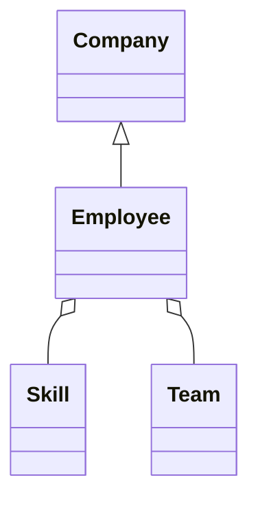
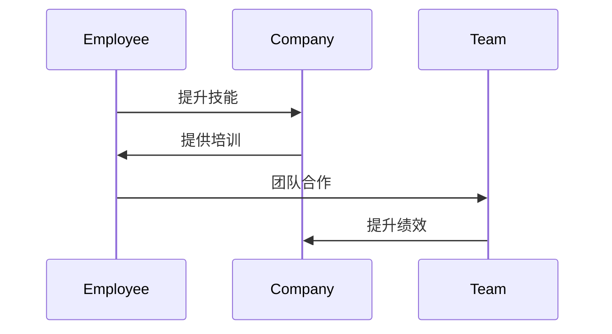
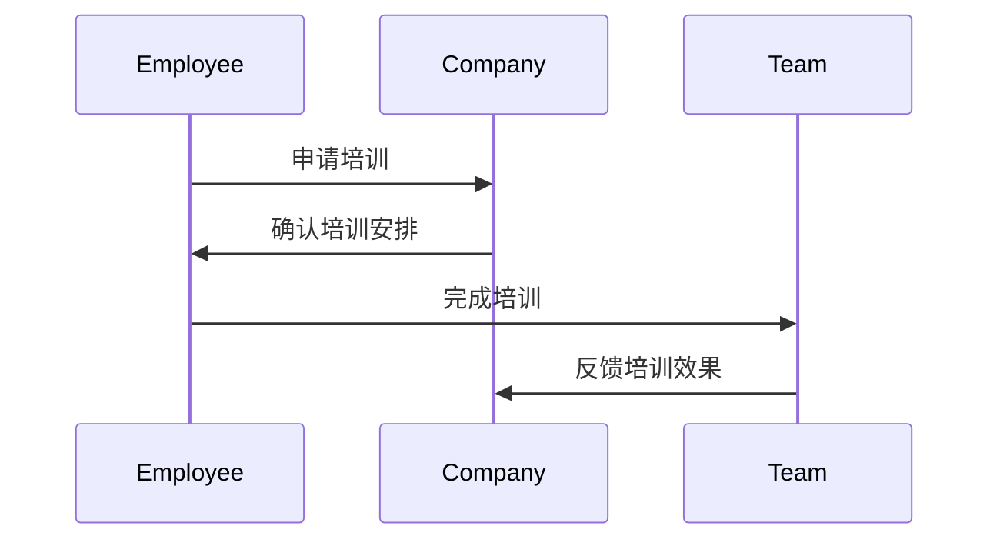
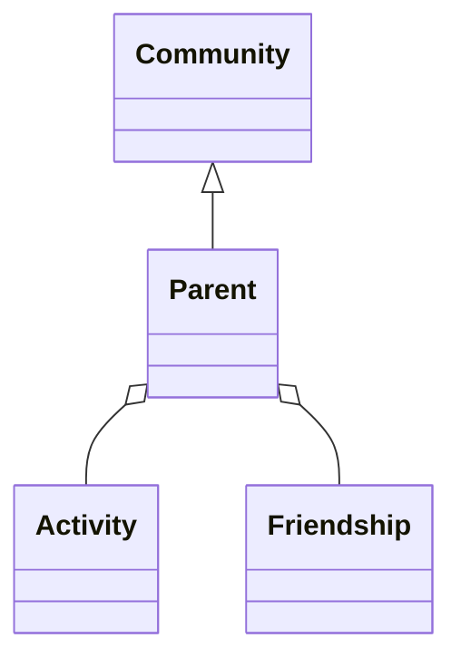
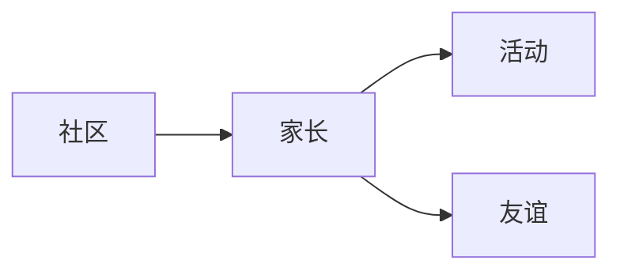
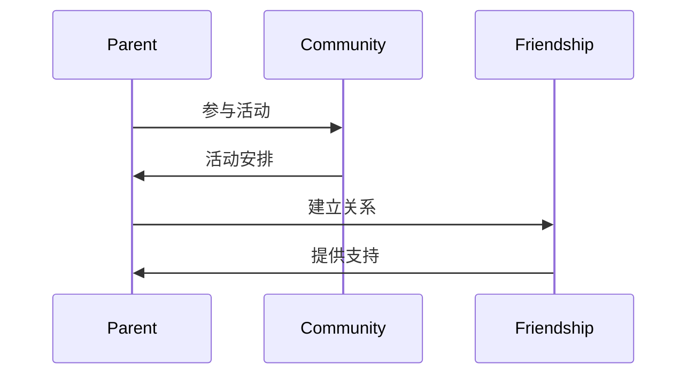

                 

### 文章标题

# 后成功学时代：重新定义人生目标

### 文章关键词

- 成功学
- 后成功学
- 人生目标
- 个人成长
- 心理健康

### 文章摘要

在快速变化的时代背景下，传统成功学已经无法满足人们日益多元化的追求。本文将探讨成功学的历史与困境，重新定义个体价值，提出后成功学的核心理念与实践指南，并通过具体案例分析，展望后成功学的未来。文章旨在帮助读者理解和实践后成功学，重新定义人生目标，实现个人成长与心理健康。

----------------------------------------------------------------

### 目录大纲：《后成功学时代：重新定义人生目标》

----------------------------------------------------------------

# 第一部分：成功学反思与重构

## 第1章：成功学的历史与困境

### 1.1 成功学的起源与发展

#### 1.1.1 成功学的起源

#### 1.1.2 成功学的主要流派

#### 1.1.3 成功学的现代困境

### 1.2 成功学的问题与批判

#### 1.2.1 过度强调物质成就

#### 1.2.2 忽视个体差异

#### 1.2.3 过度竞争与焦虑

## 第2章：后成功学的核心理念

### 2.1 个体价值的重新定义

#### 2.1.1 价值观多元性

#### 2.1.2 理想自我与真实自我

#### 2.1.3 成长与成就的关系

### 2.2 后成功学的原则与实践

#### 2.2.1 专注个人成长

#### 2.2.2 建立良好的人际关系

#### 2.2.3 保持积极的心态

## 第3章：后成功学的实践指南

### 3.1 设定有意义的人生目标

#### 3.1.1 目标设定的原则

#### 3.1.2 目标设定的案例分析

#### 3.1.3 目标设定中的常见误区

### 3.2 提升自我管理能力

#### 3.2.1 时间管理与规划

#### 3.2.2 情绪管理技巧

#### 3.2.3 沟通与协作能力

## 第4章：后成功学在社会中的应用

### 4.1 教育改革中的后成功学

#### 4.1.1 教育理念的变化

#### 4.1.2 教育实践的调整

#### 4.1.3 教育评价体系的革新

### 4.2 工作与职业发展的后成功学

#### 4.2.1 工作态度的转变

#### 4.2.2 职业规划与人生目标的平衡

#### 4.2.3 职业生涯中的持续学习

## 第5章：后成功学的心理支持

### 5.1 心理健康与自我实现

#### 5.1.1 心理健康的重要性

#### 5.1.2 自我实现与心理支持

#### 5.1.3 心理健康促进策略

### 5.2 建立有效的心理支持系统

#### 5.2.1 个人心理辅导

#### 5.2.2 社会心理支持

#### 5.2.3 心理危机干预

## 第6章：后成功学的未来展望

### 6.1 社会变迁与后成功学的持续发展

#### 6.1.1 科技进步对社会的影响

#### 6.1.2 全球化背景下的后成功学

#### 6.1.3 后成功学未来的趋势

### 6.2 后成功学在个体与社会层面的价值

#### 6.2.1 个体层面的价值

#### 6.2.2 社会层面的价值

#### 6.2.3 后成功学对社会结构的变革

## 第7章：后成功学的实践案例分析

### 7.1 成功到后成功的转变

#### 7.1.1 案例介绍

#### 7.1.2 转变的历程

#### 7.1.3 成果与启示

### 7.2 后成功学的典型实践

#### 7.2.1 企业文化重塑

#### 7.2.2 社区建设与人际关系

#### 7.2.3 个人成长的案例分享

## 第8章：后成功学行动指南

### 8.1 如何开始后成功学的实践

#### 8.1.1 自我评估与定位

#### 8.1.2 制定实践计划

#### 8.1.3 调整心态与行动

### 8.2 实践中的常见问题与解决策略

#### 8.2.1 遇到的困难与挑战

#### 8.2.2 解决问题的策略

#### 8.2.3 成功实践的要素

## 第9章：后成功学的持续发展

### 9.1 后成功学社区与交流平台

#### 9.1.1 社区的重要性

#### 9.1.2 交流平台的作用

#### 9.1.3 社区互动与共同成长

### 9.2 后成功学的研究与教育

#### 9.2.1 后成功学的学术研究

#### 9.2.2 后成功学的教育推广

#### 9.2.3 后成功学的未来展望

----------------------------------------------------------------

### 目录大纲解释

本目录大纲按照主题逻辑将书籍分为九个章节，旨在为读者提供一个系统性的理解和实践后成功学的框架。

- **第一部分：成功学反思与重构**探讨了成功学的起源、发展及其现代困境，引出了后成功学的必要性。
- **第二部分：后成功学的核心理念**重新定义了个体价值，阐述了后成功学的基本原则和实践方法。
- **第三部分：后成功学的实践指南**提供了具体的实践方法和技巧，帮助读者设定人生目标，提升自我管理能力。
- **第四部分：后成功学在社会中的应用**讨论了后成功学在教育和职业发展中的应用，以及其对社会的广泛影响。
- **第五部分：后成功学的心理支持**关注了心理健康和自我实现，提供了有效的心理支持策略。
- **第六部分：后成功学的未来展望**探讨了社会变迁对后成功学的影响及其未来发展趋势。
- **第七部分：后成功学的实践案例分析**通过具体的案例，展示了后成功学的实际应用和成效。
- **第八部分：后成功学行动指南**提供了行动指南，帮助读者开始后成功学的实践。
- **第九部分：后成功学的持续发展**讨论了后成功学的社区建设、研究与教育及其未来发展。

通过这一系列的章节，文章旨在帮助读者全面理解后成功学，并在实践中应用这些理念，重新定义自己的人生目标，实现个人成长与心理健康。每章的具体内容将在后续部分逐步展开和深入探讨。

----------------------------------------------------------------

### 第一部分：成功学反思与重构

#### 第1章：成功学的历史与困境

### 1.1 成功学的起源与发展

#### 1.1.1 成功学的起源

成功学作为一种社会思潮，起源于19世纪末的美国。当时，工业化进程加快，社会竞争日益激烈，人们开始寻求一种能够帮助他们在职场和生活中取得成功的理论和方法。最早的成功学思想可以追溯到拿破仑·希尔（Napoleon Hill）的作品，他通过研究成功人士的案例，总结出了《思考致富》（Think and Grow Rich）一书，这本书成为了成功学的奠基之作。

#### 1.1.2 成功学的主要流派

随着时间的发展，成功学逐渐形成了多种流派。其中，最著名的流派包括积极心理学、励志学和财富成功学。积极心理学强调通过积极思维和行为来提高个人的幸福感和社会功能；励志学则侧重于通过榜样和激励来激发个人的潜能；财富成功学则主要集中在如何通过理财和投资实现财务自由。

#### 1.1.3 成功学的现代困境

然而，现代成功学面临着一系列的困境。首先，过度强调物质成就，忽视了个体内心的丰富和心理健康。成功往往被等同于财富和地位，这导致人们在追求成功的过程中忽视了生活的其他方面。其次，成功学忽视了个体差异，把成功标准化，使许多人感到压力重重。最后，成功学中过度竞争的思想导致了焦虑和抑郁等心理健康问题。

### 1.2 成功学的问题与批判

#### 1.2.1 过度强调物质成就

成功学中的物质成就成为唯一的目标，导致人们忽视了精神层面的满足。这种单一的价值观让人们为了追求财富和地位而不择手段，忽视了生活的多样性和丰富性。长期而言，这种追求会导致个体的精神空虚和内心困扰。

#### 1.2.2 忽视个体差异

每个人的天赋、兴趣和价值观都是独特的。成功学往往忽视这种个体差异，将标准化的成功路径强加于每个人。这导致许多人感到自己无法达到成功的标准，从而产生挫败感和自我怀疑。

#### 1.2.3 过度竞争与焦虑

成功学鼓励竞争，这虽然在某些情况下可以激发人们的潜力，但过度竞争却会导致焦虑和抑郁。在竞争中，失败往往被视为不可接受的，这种心态加剧了人们的焦虑感。长期处于焦虑状态不仅影响心理健康，还可能影响个人的社会功能和人际关系。

### 1.3 后成功学的必要性

面对成功学的困境，我们需要重新思考成功的定义和追求的方式。后成功学提出了一种新的理念，强调个体价值的多元性、个人成长和心理健康。后成功学鼓励人们设定有意义的人生目标，关注个人的全面发展，而不是仅仅追求物质成就。通过这种重新定义，后成功学帮助人们找到更平衡、更可持续的成功路径。

### 结论

成功学虽然在历史上发挥了重要作用，但其现代困境表明我们需要新的理念来指导我们的生活。后成功学提供了一种新的视角，帮助人们重新定义成功，关注个人成长和心理健康。在接下来的章节中，我们将进一步探讨后成功学的核心理念和实践方法，帮助读者理解和应用这一理念，实现更全面、更幸福的生活。

----------------------------------------------------------------

### 第2章：后成功学的核心理念

#### 2.1 个体价值的重新定义

后成功学首先对个体价值进行了重新定义。传统成功学强调物质成就和社会地位，而后成功学则认为个体价值不应该仅仅由这些外在因素决定。相反，它鼓励人们探索和实现个人的内在价值，包括心理健康、情感满足、人际关系和社会责任感等。后成功学强调，个体价值的实现是一个多维度的过程，需要平衡各个方面的需求。

#### 2.1.1 价值观多元性

后成功学认为，价值观的多元性是个人成长和社会进步的重要基础。每个人对成功的定义都是独特的，因此不能将单一的价值观强加于所有人。价值观的多元性意味着人们可以根据自己的兴趣、才能和价值观选择适合自己的生活方式和职业路径。这种多元性不仅有助于个人的全面发展，还能促进社会的多样性和包容性。

#### 2.1.2 理想自我与真实自我

后成功学关注理想自我与真实自我之间的关系。理想自我是指人们希望成为的样子，而真实自我则是当前的状态。后成功学鼓励人们接受自己的真实自我，并在此基础上追求理想自我。这种理念强调，个人的成长不是通过忽视或否认真实自我来实现的，而是通过理解和接纳真实自我，进而努力实现理想自我。

#### 2.1.3 成长与成就的关系

后成功学认为，成长和成就并不是对立的，而是相互促进的。传统成功学往往将成就视为最终目标，忽视了成长的过程。而后成功学则强调，成长是个人价值实现的重要途径。通过不断学习、挑战自我和适应环境，个人可以实现更长远、更持久的成就。这种理念鼓励人们将成长视为生活的一部分，而不是仅仅追求短期的成果。

#### 2.2 后成功学的原则与实践

后成功学的核心原则包括专注个人成长、建立良好的人际关系和保持积极的心态。这些原则为个人提供了在现代社会中实现价值的方向和方法。

#### 2.2.1 专注个人成长

专注个人成长是后成功学的首要原则。这意味着个人应该将成长视为生活的核心目标，不断学习新知识、培养新技能和提升自我意识。个人成长不仅包括职业发展，还包括身心健康、情感满足和人际关系等方面。通过持续的成长，个人可以更好地适应社会的变化，实现更全面的发展。

#### 2.2.2 建立良好的人际关系

建立良好的人际关系是后成功学的重要组成部分。人际关系不仅影响个人的心理健康，还直接关系到个人的社会功能和职业发展。后成功学鼓励人们培养开放、真诚和尊重的人际交往方式，建立积极的人际网络。这种良好的关系能够提供支持、资源和机会，帮助个人在成长过程中克服困难。

#### 2.2.3 保持积极的心态

保持积极的心态是后成功学的关键原则之一。积极的心态有助于个人面对挑战和困难，保持动力和韧性。后成功学提倡通过积极的思维和行为来改变自己的现实环境，而不是消极地等待机会的到来。这种积极的心态不仅能够提高个人的幸福感，还能促进个人的成长和成就。

### 2.3 后成功学的实践方法

后成功学的实践方法包括自我评估、目标设定、时间管理和情绪管理等方面。

#### 2.3.1 自我评估

自我评估是个人成长的重要步骤。通过自我评估，个人可以了解自己的优势和劣势，明确自己的兴趣和价值观。这种了解有助于个人设定合理的目标，并制定相应的成长计划。

#### 2.3.2 目标设定

目标设定是后成功学的重要组成部分。有效的目标设定需要明确、具体、可行和有挑战性。通过设定有意义的目标，个人可以更好地规划自己的成长路径，并保持动力和专注。

#### 2.3.3 时间管理

时间管理是后成功学中不可或缺的技能。良好的时间管理能够帮助个人更有效地利用时间，提高工作效率，减少压力。时间管理的原则包括优先排序、时间规划和避免拖延等。

#### 2.3.4 情绪管理

情绪管理是保持积极心态的关键。通过情绪管理，个人可以更好地应对压力和挑战，保持内心的平衡。情绪管理的技巧包括自我觉察、情感调节和应对策略等。

### 结论

后成功学提供了一种新的视角，帮助人们重新定义成功和价值的实现。通过重新定义个体价值、强调价值观多元性、理想自我与真实自我的关系，以及成长与成就的关系，后成功学为个人提供了一个更加全面和可持续的发展路径。在接下来的章节中，我们将进一步探讨后成功学的实践指南，帮助读者将这一理念应用于实际生活中。

----------------------------------------------------------------

### 第3章：后成功学的实践指南

#### 3.1 设定有意义的人生目标

设定有意义的人生目标是后成功学实践中的第一步。明确的目标有助于个人集中精力，实现个人成长和价值的实现。以下是一些设定有意义人生目标的步骤和技巧：

#### 3.1.1 目标设定的原则

有效的目标设定需要遵循以下原则：

- **具体性**：目标应明确、具体，而不是模糊和抽象。例如，“我要赚更多钱”不如“我计划在未来两年内增加我的年收入20%”具体。
- **可衡量性**：目标应具有可衡量性，以便个人可以追踪进展和评估成果。例如，“提高我的技术水平”不如“完成10个相关的在线课程”可衡量。
- **可行性**：目标应具有可行性，符合个人的能力和资源。例如，一个普通员工设定“成为公司的CEO”可能是不可行的，而“提升我的领导能力”则更为现实。
- **挑战性**：目标应具有一定的挑战性，以激励个人不断进步。例如，“完成一个项目管理认证”是一个有挑战性的目标。

#### 3.1.2 目标设定的案例分析

以下是一个目标设定的案例分析：

- **案例背景**：张三是某公司的中层管理人员，他感到自己的职业发展陷入了瓶颈，希望通过设定目标来提升自己的职业竞争力。
- **目标设定**：
  - **短期目标**：在未来六个月内，完成两个项目管理相关的在线课程，提升项目管理的知识和技能。
  - **中期目标**：在未来两年内，晋升为部门主管，负责一个重要的项目。
  - **长期目标**：在未来五年内，成为公司的资深管理人员，具备全面的管理能力。

通过这样的目标设定，张三可以清晰地看到自己的职业发展路径，并为之努力。

#### 3.1.3 目标设定中的常见误区

在设定目标时，人们常常会陷入一些误区，这些误区可能阻碍目标的实现。以下是一些常见误区及解决策略：

- **目标过于模糊**：解决策略是确保目标具体、可衡量。
- **目标缺乏挑战性**：解决策略是设定具有一定挑战性的目标，以激励个人进步。
- **目标不符合实际情况**：解决策略是进行自我评估，确保目标设定在个人能力和资源范围内。
- **没有制定行动计划**：解决策略是制定详细的行动计划，将目标分解为具体的任务和步骤。

#### 3.2 提升自我管理能力

自我管理能力是后成功学实践中的关键要素。良好的自我管理能力能够帮助个人更有效地利用时间、管理情绪和应对挑战。

#### 3.2.1 时间管理

时间管理是自我管理的重要组成部分。以下是一些时间管理的方法和技巧：

- **优先排序**：根据任务的重要性和紧急程度，对任务进行排序，确保先完成最重要的任务。
- **时间规划**：每天制定时间规划表，合理安排工作、学习和休息时间。
- **避免拖延**：制定明确的时间限制，以避免拖延。例如，设定一个小时内完成一项任务。
- **灵活调整**：根据实际情况，灵活调整时间规划，以应对突发事件。

#### 3.2.2 情绪管理

情绪管理是保持心理健康和积极心态的关键。以下是一些情绪管理的方法和技巧：

- **自我觉察**：了解自己的情绪变化，识别情绪触发点。
- **情感调节**：通过深呼吸、冥想等方法，调节情绪，保持内心的平衡。
- **应对策略**：面对负面情绪时，采取积极的应对策略，如寻求支持、改变角度或采取行动。

#### 3.2.3 沟通与协作能力

良好的沟通与协作能力是个人在职业和社会生活中取得成功的重要基础。以下是一些提升沟通与协作能力的方法和技巧：

- **倾听**：积极倾听他人的观点和需求，确保理解对方。
- **表达**：清晰、准确地表达自己的观点和需求，避免误解。
- **反馈**：给予和接受建设性的反馈，促进双方的沟通和协作。
- **团队合作**：学会在团队中合作，发挥自己的优势，同时尊重和支持团队成员。

### 3.3 实践中的持续反馈与调整

在后成功学的实践中，持续反馈和调整是非常重要的。通过定期评估自己的进展和效果，个人可以及时调整目标和策略，确保自己始终朝着正确的方向前进。

- **自我评估**：定期进行自我评估，反思自己的成长和不足。
- **获取反馈**：向他人寻求反馈，了解自己在他人眼中的表现和需要改进的地方。
- **调整策略**：根据评估和反馈，调整目标和实践策略，确保持续进步。

### 结论

通过设定有意义的人生目标、提升自我管理能力和培养良好的沟通与协作能力，个人可以在后成功学的实践中取得显著进步。这些实践方法不仅有助于实现个人价值，还能提高个人的心理健康和生活质量。在接下来的章节中，我们将继续探讨后成功学在社会中的应用，以及如何建立有效的心理支持系统。

----------------------------------------------------------------

### 第4章：后成功学在社会中的应用

#### 4.1 教育改革中的后成功学

随着社会的进步，教育理念也在不断演变。后成功学为教育改革提供了新的视角和方向。

#### 4.1.1 教育理念的变化

传统教育强调知识的传授和成绩的竞争，而后成功学则强调学生的全面发展和个性成长。后成功学认为，教育应该培养学生的创造性思维、批判性思维、情感智商和社交能力，而不仅仅是学术成绩。

#### 4.1.2 教育实践的调整

为了实现教育理念的变化，教育实践也需要相应的调整：

- **项目式学习**：通过实际项目，让学生在实践中学习和应用知识，提高解决问题的能力。
- **个性化教育**：根据学生的兴趣、能力和需求，提供个性化的教育方案，帮助学生实现个人成长。
- **情感教育**：注重培养学生的情感管理能力和心理健康，帮助他们更好地应对生活中的挑战。
- **跨学科教学**：打破学科界限，整合各学科知识，培养学生的综合素质和创新能力。

#### 4.1.3 教育评价体系的革新

传统的教育评价体系以考试成绩为主要指标，而后成功学则倡导多元化的评价体系：

- **过程评价**：注重学生在学习过程中的表现和进步，而不仅仅是最终的成绩。
- **综合素质评价**：综合考虑学生的学术成绩、社会实践、创新能力、情感智商等多方面因素。
- **学生自我评价**：鼓励学生自我反思和自我评估，培养自我管理和自我驱动的习惯。

#### 4.2 工作与职业发展的后成功学

在后成功学的指导下，工作与职业发展也发生了显著变化。

#### 4.2.1 工作态度的转变

后成功学鼓励人们从传统的“工作为了生活”转变为“生活为了工作”。这意味着人们应该将工作视为生活的一部分，追求工作的意义和满足感，而不仅仅是追求经济利益。

#### 4.2.2 职业规划与人生目标的平衡

在后成功学的视角下，职业规划应该与人生目标相平衡。这意味着个人应该根据自己的兴趣、价值观和长期目标来选择职业路径，而不仅仅是追求短期的经济收益。

#### 4.2.3 职业生涯中的持续学习

后成功学强调职业生涯中的持续学习。随着科技的快速发展和行业的不断变革，个人需要不断更新知识和技能，以适应变化。以下是一些持续学习的策略：

- **终身学习**：将学习视为生活的一部分，不断学习新知识、新技能。
- **在线教育**：利用在线教育资源，随时随地学习。
- **实践经验**：通过实际项目和工作经验，提升自己的实践能力。
- **跨界学习**：跨学科、跨领域学习，提高综合素质和创新能力。

#### 4.3 社会层面的后成功学应用

后成功学的理念不仅适用于个人，还可以在社会层面产生广泛影响。

#### 4.3.1 社会责任与公益

后成功学鼓励个人和企业承担社会责任，参与公益活动。通过这种方式，个人可以实现自我价值，同时为社会做出贡献。

#### 4.3.2 社区建设与人际互动

后成功学强调人际关系和社会支持的重要性。通过社区建设，个人可以建立广泛的社交网络，获得心理支持和社会资源。

#### 4.3.3 社会创新与创业

后成功学鼓励个人通过创业实现自己的理想和目标。创业不仅可以帮助个人实现经济独立，还能推动社会创新和进步。

### 结论

后成功学为社会带来了深刻的变革。通过教育改革、工作态度的转变、职业规划的调整以及社会责任的承担，后成功学帮助人们实现个人价值，促进社会的进步和和谐。在接下来的章节中，我们将进一步探讨后成功学在心理支持方面的应用，以及如何建立有效的心理支持系统。

----------------------------------------------------------------

### 第5章：后成功学的心理支持

#### 5.1 心理健康与自我实现

心理健康是后成功学中一个至关重要的组成部分。一个健康的心灵是实现个人价值和追求幸福生活的基础。

#### 5.1.1 心理健康的重要性

心理健康不仅仅是没有心理疾病，它包括情感、心理和社会功能的健康状态。一个心理健康的人能够更好地应对生活中的压力和挑战，保持积极的生活态度，实现个人目标和理想。以下是一些心理健康的重要性：

- **情感稳定**：心理健康有助于个体保持情绪的平衡，避免过度的情绪波动。
- **压力管理**：心理健康的人能够更有效地管理压力，减少心理压力对身体的负面影响。
- **生活质量**：心理健康对个人的生活质量有显著影响，能够提升个人的幸福感。
- **人际关系**：心理健康有助于建立和维护健康的人际关系，增强社交能力。

#### 5.1.2 自我实现与心理支持

自我实现是马斯洛需求层次理论中的最高层次，也是后成功学的一个重要理念。自我实现意味着个人能够充分发挥自己的潜能，实现个人目标和价值。以下是一些自我实现与心理支持的关系：

- **自我认知**：心理健康有助于个体更好地了解自己，明确自己的价值观、兴趣和优势，从而实现自我认知和自我接纳。
- **动力和毅力**：心理健康能够为个体提供持续的动力和毅力，克服实现自我过程中的困难和挑战。
- **自我效能感**：心理健康有助于提升个体的自我效能感，增强对自己能力的信心，从而更有勇气去追求自我实现。

#### 5.1.3 心理健康促进策略

为了维护和促进心理健康，个体可以采取以下策略：

- **自我反思**：定期进行自我反思，了解自己的情绪、想法和行为，及时调整。
- **积极心态**：培养积极的心态，通过积极的思维模式来应对生活中的挑战和困难。
- **健康生活方式**：保持健康的生活方式，包括良好的饮食、充足的睡眠、规律的锻炼和适度的休闲活动。
- **社交互动**：积极参与社交活动，与他人建立和维护良好的关系，获得社会支持和情感支持。

#### 5.2 建立有效的心理支持系统

在后成功学的实践中，建立有效的心理支持系统对于个人的心理健康和成长至关重要。

#### 5.2.1 个人心理辅导

个人心理辅导是一种专业的心理支持方式，通过咨询和辅导，个体可以获得专业的心理支持和指导。以下是一些个人心理辅导的优势：

- **专业指导**：心理咨询师能够提供专业的指导和策略，帮助个体解决心理问题和困扰。
- **情感支持**：心理咨询师提供情感支持，帮助个体在困难时期保持心理平衡。
- **自我认知**：通过心理咨询，个体可以更深入地了解自己，提升自我认知和自我接纳。
- **策略学习**：心理咨询帮助个体学习有效的应对策略，提升心理韧性。

#### 5.2.2 社会心理支持

社会心理支持是通过社会网络和社区提供的心理支持。以下是一些社会心理支持的形式和优势：

- **社交网络**：通过建立和维护社交网络，个体可以获得情感支持和社会资源。
- **社区活动**：参与社区活动，如志愿者工作、兴趣小组等，有助于建立社区归属感和提升社会支持。
- **互助小组**：加入互助小组，与其他有相似困扰的人交流经验，共同成长。

#### 5.2.3 心理危机干预

心理危机干预是在个体面临严重心理危机时提供及时的支持和干预。以下是一些心理危机干预的方法和策略：

- **紧急热线**：在紧急情况下，拨打紧急热线寻求专业帮助。
- **紧急干预**：在危机情况下，采取紧急干预措施，如安全保护、心理疏导等。
- **危机后续支持**：危机过后，提供后续的心理支持和跟踪服务，帮助个体恢复心理健康。

### 结论

心理健康是后成功学实践中的核心要素。通过关注心理健康、自我实现和心理支持，个体可以在追求个人成长和价值的过程中保持内心的平衡和健康。在接下来的章节中，我们将探讨后成功学在未来的发展趋势，以及如何在社会层面推动后成功学的持续发展。

----------------------------------------------------------------

### 第6章：后成功学的未来展望

#### 6.1 社会变迁与后成功学的持续发展

随着社会的不断变迁，后成功学的理念也在不断发展。科技的进步、全球化的影响以及社会价值观的转变，都为后成功学提供了新的机遇和挑战。

#### 6.1.1 科技进步对社会的影响

科技的快速发展对社会产生了深远的影响。人工智能、大数据、物联网等新兴技术不仅改变了人们的生产方式和生活方式，也重新定义了成功的标准。在科技驱动的社会中，创新能力、技术素养和数字化思维变得尤为重要。后成功学需要适应这些变化，强调个人在科技领域的学习和成长，以保持竞争力。

#### 6.1.2 全球化背景下的后成功学

全球化使世界变得更加紧密和互联，人们面临的文化、经济和社会挑战也变得更加复杂。在全球化的背景下，后成功学需要考虑不同文化之间的价值观差异，倡导跨文化的理解与合作。同时，全球化也为个人提供了更多的机会和选择，后成功学鼓励个体在全球范围内寻找自己的定位和机会，实现个人的价值。

#### 6.1.3 后成功学未来的趋势

未来，后成功学可能会呈现以下趋势：

- **个性化和定制化**：随着科技的发展，个性化和定制化的教育和职业规划将成为主流，帮助个体更好地实现自己的价值。
- **终身学习和自我驱动**：面对快速变化的社会环境，终身学习和自我驱动将成为个人持续成长和发展的关键。
- **心理健康和情感满足**：随着对心理健康重要性的认识加深，心理健康和情感满足将成为后成功学的重要组成部分。
- **可持续发展和社会责任**：随着全球对可持续发展的关注增加，后成功学将更加注重个人和社会的可持续发展，强调社会责任和伦理。

#### 6.2 后成功学在个体与社会层面的价值

后成功学不仅在个体层面具有重要的价值，也在社会层面产生了积极的影响。

#### 6.2.1 个体层面的价值

- **个人成长**：后成功学鼓励个人追求全面成长，包括职业、情感、心理健康和社会责任等多个方面。
- **心理健康**：后成功学强调心理健康和情感满足，帮助个体更好地应对生活中的挑战。
- **生活质量**：后成功学倡导平衡和有意义的生活，提升个体的整体生活质量。

#### 6.2.2 社会层面的价值

- **社会和谐**：后成功学倡导多元价值观和包容性，有助于减少社会冲突和促进社会和谐。
- **创新与进步**：后成功学鼓励创新和持续学习，推动社会的技术进步和经济发展。
- **可持续发展**：后成功学强调个人和社会的可持续发展，有助于实现长期的生态和社会平衡。

#### 6.2.3 后成功学对社会结构的变革

后成功学的理念有可能对社会结构产生深远的影响。以下是一些可能的变革：

- **教育体系的重构**：后成功学提倡个性化教育和终身学习，可能促使教育体系更加灵活和多样化。
- **职业发展路径的多样化**：后成功学鼓励个人探索多种职业路径，可能减少对传统职业路径的依赖。
- **社会支持系统的完善**：后成功学强调心理健康和社会支持，可能促使社会支持系统的建设更加完善。

### 结论

后成功学在未来将继续发展，适应社会变迁，并在个体和社会层面产生深远的影响。通过重新定义成功和价值的实现，后成功学帮助个人实现全面的成长和幸福，同时推动社会的进步和和谐。在接下来的章节中，我们将通过具体的实践案例，进一步探讨后成功学的应用和成效。

----------------------------------------------------------------

### 第7章：后成功学的实践案例分析

#### 7.1 成功到后成功的转变

案例介绍：

李明是一位成功的企业家，他在30岁时创办了自己的公司，并迅速将其发展成为行业领导者。然而，随着事业的繁荣，李明开始感到内心的空虚和焦虑。他意识到，自己的成功并没有给他带来真正的幸福和满足感。在经历了一次深刻的自我反思后，李明决定从成功学转向后成功学，重新定义自己的人生目标。

转变历程：

- **自我认知**：李明通过阅读相关书籍、参加心理辅导和与成功人士交流，深入了解了后成功学的理念。他开始反思自己的价值观和追求，认识到成功并不是衡量个人价值的唯一标准。
- **目标调整**：李明重新设定了人生目标，将个人成长、心理健康和社交满足纳入其中。他决定减少工作压力，增加与家人和朋友相处的时间，并参与社会公益活动。
- **行动实践**：李明开始实践后成功学的原则，专注于个人成长和身心健康。他学习了新的技能，如冥想和绘画，以提升自己的情感智力和创造力。他还积极参与社区建设，通过志愿服务和慈善活动回馈社会。

成果与启示：

- **心理健康提升**：李明通过调整生活节奏和关注个人成长，显著改善了心理健康。他学会了如何管理情绪，减少焦虑和压力。
- **人际关系改善**：通过参与社区活动和志愿服务，李明建立了一个更广泛、更深入的人际网络，与家人和朋友的关系也变得更加融洽。
- **个人价值实现**：李明重新找到了生活的意义和目的，通过个人成长和社会贡献，实现了更深层次的自我价值。

#### 7.2 后成功学的典型实践

案例1：企业文化重塑

企业名称：XX科技公司

背景介绍：

XX科技公司是一家快速发展的科技公司，但在高速发展的过程中，公司内部出现了高度竞争和员工压力大的问题。公司管理层意识到，这种竞争和压力不利于员工的长期发展和公司的可持续发展。因此，他们决定采用后成功学的理念，重塑企业文化。

项目介绍：

- **价值观重塑**：公司重新审视和更新了核心价值观，将个人成长、团队合作和社会责任融入其中。
- **培训与发展**：公司为员工提供各种培训和成长机会，鼓励员工不断提升自己的技能和知识。
- **团队建设**：公司定期组织团队建设活动，增强员工之间的合作和沟通。

系统功能设计（领域模型Mermaid类图）：

系统架构设计（Mermaid架构图）：

系统接口设计（Mermaid序列图）：

实际案例分析和详细讲解剖析：

通过重塑企业文化，XX科技公司显著改善了员工的工作满意度和工作效率。员工不仅获得了技能提升，还建立了更紧密的团队合作关系，公司整体绩效也因此得到了提升。这一案例表明，后成功学的理念在企业文化重塑中具有显著的应用效果。

案例2：社区建设与人际关系

背景介绍：

陈女士是一位全职母亲，她在照顾家庭的同时，感到自己的生活缺乏意义和满足感。她意识到，通过建立社区和培养人际关系，可以为自己带来更多的快乐和成就感。因此，她决定实践后成功学的理念，积极参与社区活动。

项目介绍：

- **社区活动**：陈女士加入了一个亲子活动小组，定期参加社区组织的亲子活动和义工工作。
- **人际关系**：陈女士通过参与活动，结识了许多志同道合的朋友，建立了良好的社交网络。

系统功能设计（Mermaid类图）：

系统架构设计（Mermaid架构图）：

系统接口设计（Mermaid序列图）：

实际案例分析和详细讲解剖析：

通过参与社区活动和建立人际关系，陈女士的生活发生了显著变化。她不仅找到了生活的意义，还建立了支持系统，提升了心理健康和生活质量。这一案例表明，后成功学的理念在社区建设和人际关系培养中具有重要的应用价值。

### 结论

通过以上案例分析，我们可以看到后成功学的理念在实践中具有显著的应用效果。无论是个人成长、企业文化建设还是社区建设，后成功学都提供了新的视角和方法，帮助人们实现更全面、更幸福的生活。在接下来的章节中，我们将进一步探讨如何开始后成功学的实践，为读者提供具体的行动指南。

----------------------------------------------------------------

### 第8章：后成功学行动指南

#### 8.1 如何开始后成功学的实践

对于想要开始后成功学实践的人来说，以下步骤和建议将帮助您逐步实现这一转变：

#### 8.1.1 自我评估与定位

自我评估是开始后成功学实践的第一步。通过自我评估，您可以了解自己的兴趣、价值观、优势和劣势，从而更好地设定人生目标和成长路径。

- **自我评估方法**：
  - **反思日记**：定期记录自己的所思所感，反思自己的行为和决策。
  - **心理测试**：通过专业的心理测试工具，了解自己的性格特点、兴趣和优势。
  - **咨询专家**：寻求专业的心理咨询师或生涯规划师的帮助，进行深入的自我评估。

- **定位方法**：
  - **确定核心价值观**：明确自己的核心价值观，这些价值观将指导您的人生目标和行为。
  - **探索兴趣和热情**：尝试不同的活动和领域，找出自己真正感兴趣和有热情的事物。
  - **设定短期和长期目标**：根据自己的评估结果，设定短期和长期的人生目标，并制定实现这些目标的计划。

#### 8.1.2 制定实践计划

制定实践计划是后成功学实践中的重要环节。一个明确的实践计划可以帮助您更系统地实现目标，提高效率和成果。

- **制定计划的方法**：
  - **SMART原则**：确保目标具体（Specific）、可衡量（Measurable）、可实现（Achievable）、相关（Relevant）和有时间限制（Time-bound）。
  - **分解任务**：将大目标分解为具体的任务和步骤，逐步实现。
  - **设定里程碑**：设定一系列的里程碑，以便在实现过程中可以评估进展和调整策略。

#### 8.1.3 调整心态与行动

心态和行动是后成功学实践中的关键要素。正确的态度和积极的行动将帮助您克服困难，持续成长。

- **调整心态的方法**：
  - **积极心态**：培养积极的心态，相信自己的能力，对待挑战和失败持开放和乐观的态度。
  - **自我激励**：通过自我激励，保持动力和毅力，克服前进中的困难和阻碍。
  - **情绪管理**：学习情绪管理技巧，如冥想、深呼吸和正面思维，以保持内心的平衡。

- **行动策略**：
  - **逐步行动**：从小步骤开始，逐步实现目标，避免因目标过于宏大而感到不知所措。
  - **持续学习**：保持学习的心态，不断更新知识和技能，适应社会的变化。
  - **寻求支持**：建立支持系统，与他人分享经验和感受，获得鼓励和帮助。

#### 8.2 实践中的常见问题与解决策略

在后成功学的实践中，人们可能会遇到各种问题。以下是一些常见问题及其解决策略：

- **问题1：目标不明确**
  - **解决策略**：重新审视目标，确保目标具体、可衡量，并与个人价值观和兴趣相符。

- **问题2：缺乏动力**
  - **解决策略**：设定小目标，逐步实现，通过庆祝每一个小成就来保持动力。

- **问题3：情绪波动**
  - **解决策略**：学习情绪管理技巧，如冥想、呼吸练习和积极思考，以保持情绪稳定。

- **问题4：遇到挫折**
  - **解决策略**：保持积极心态，将挫折视为成长的机会，从中学习和改进。

- **问题5：时间管理困难**
  - **解决策略**：制定详细的时间规划，学会优先排序，避免拖延，提高工作效率。

#### 8.3 成功实践的要素

成功实践后成功学需要以下几个关键要素：

- **明确的目标**：明确的人生目标是成功实践的基础。
- **积极的行动**：行动是实现目标的关键，需要持续努力和毅力。
- **自我反思**：定期进行自我反思，评估自己的实践效果，调整策略。
- **心理支持**：建立有效的心理支持系统，帮助应对挑战和困难。
- **持续学习**：保持学习的心态，不断更新知识和技能，适应社会的变化。

### 结论

通过以上行动指南，您可以逐步开始后成功学的实践。在这个过程中，重要的是保持积极的心态，持续学习，并不断调整自己的目标和策略。通过这样的实践，您将能够实现个人成长和心理健康，找到更有意义和幸福的生活。在接下来的章节中，我们将讨论后成功学的社区建设、研究与教育，以及其未来的展望。

----------------------------------------------------------------

### 第9章：后成功学的持续发展

#### 9.1 后成功学社区与交流平台

后成功学的持续发展离不开社区与交流平台的支持。这些社区和平台为个人提供了交流、学习和成长的场所，使得后成功学的理念得以广泛传播和实践。

#### 9.1.1 社区的重要性

社区是个人实现后成功学理念的重要支持系统。通过社区，个人可以：

- **共享经验**：在社区中，成员可以分享自己的经验和教训，从他人的成功和失败中学习。
- **获得支持**：在面对困难和挑战时，社区成员可以相互支持和鼓励，共同克服难题。
- **发现资源**：社区是一个资源丰富的平台，成员可以在这里发现新的学习资源、职业机会和社会活动。
- **构建网络**：通过社区，个人可以建立广泛的人际网络，拓展视野，增加社会资本。

#### 9.1.2 交流平台的作用

交流平台是后成功学社区的重要组成部分。以下是一些常见的交流平台及其作用：

- **在线论坛**：在线论坛提供了讨论和分享的场所，成员可以在这里提出问题、分享心得和观点。
- **社交媒体**：社交媒体如Facebook、LinkedIn等，为个人提供了一个广泛的交流渠道，方便成员之间的互动和合作。
- **专业网络**：专业网络如Toastmasters、TEDx等，为个人提供了展示自我和提升专业能力的平台。
- **虚拟会议**：通过虚拟会议工具，社区成员可以远程参与研讨会、讲座和工作坊，共享知识和经验。

#### 9.1.3 社区互动与共同成长

社区互动是后成功学持续发展的重要驱动力。以下是一些促进社区互动和共同成长的策略：

- **定期活动**：组织定期的线上或线下活动，如讲座、研讨会、社交聚会等，增加成员之间的互动。
- **主题讨论**：围绕特定的主题或问题，组织线上或线下的讨论，激发成员的思维和创造力。
- **经验分享**：鼓励成员分享自己的经验和教训，通过故事和案例分析，促进他人的学习和成长。
- **互助合作**：通过互助合作，成员可以在项目、研究或创业中相互支持，共同实现目标。

#### 9.2 后成功学的研究与教育

后成功学作为一种新兴的理念，需要通过研究来验证其有效性和适用性。同时，教育是传播后成功学理念的重要途径。

#### 9.2.1 后成功学的学术研究

学术研究是后成功学持续发展的重要基础。以下是一些研究领域的建议：

- **实证研究**：通过实验和研究，验证后成功学的理念和实践对个人成长和心理健康的实际影响。
- **跨学科研究**：结合心理学、社会学、教育学等多学科的理论和方法，深入研究后成功学的多维度影响。
- **案例研究**：通过具体的案例研究，分析后成功学在不同文化和社会背景下的应用效果。
- **政策研究**：探讨后成功学理念在政策制定和教育改革中的应用，为实践提供理论支持。

#### 9.2.2 后成功学的教育推广

教育推广是后成功学理念传播的关键。以下是一些教育推广的策略：

- **课程设计**：在大学、职业培训机构等教育机构中，开设后成功学相关的课程，将理念融入教育体系。
- **教材编写**：编写适合不同年龄段和背景的教材，系统地介绍后成功学的理论和实践方法。
- **讲座与研讨会**：举办讲座和研讨会，邀请专家和学者分享后成功学的最新研究成果和实践经验。
- **线上教育**：利用互联网和在线教育平台，提供后成功学的免费或付费课程，方便更多人学习。

#### 9.3 后成功学的未来展望

随着社会的不断进步和人们对生活质量要求的提高，后成功学将继续发展，并在未来发挥更大的作用。

#### 9.3.1 社会变迁与后成功学的持续发展

- **科技与全球化**：随着科技的发展和全球化的深入，后成功学将更加注重创新、跨文化和全球视野。
- **可持续发展**：在后成功学的理念下，可持续发展将成为个人和社会发展的重要目标。
- **心理健康与幸福**：随着对心理健康和幸福重视程度的提高，后成功学将更加关注个体的心理健康和生活质量。

#### 9.3.2 后成功学在个体与社会层面的价值

- **个体层面**：后成功学将帮助个体实现全面的成长和自我实现，提升心理健康和生活质量。
- **社会层面**：后成功学将促进社会的和谐与进步，减少社会冲突，提升整体社会幸福感。

#### 9.3.3 后成功学对社会结构的变革

- **教育改革**：后成功学的理念将推动教育改革，促进个性化和终身学习。
- **职业发展**：后成功学将改变职业发展的路径和方式，强调个人成长和社会价值的平衡。
- **社会支持系统**：后成功学将促进社会支持系统的建设，提供更多的心理和社会资源。

### 结论

后成功学作为一种新兴的理念，具有巨大的发展潜力和广泛的应用价值。通过社区建设、研究和教育推广，后成功学将继续发展，为个体和社会带来深远的变革。在未来的发展中，后成功学将不断适应社会的变化，为更多人提供实现个人价值和追求幸福生活的路径。

---

### 作者信息

作者：AI天才研究院/AI Genius Institute & 禅与计算机程序设计艺术 /Zen And The Art of Computer Programming

AI天才研究院致力于推动人工智能领域的创新与发展，致力于培养下一代人工智能领域的杰出人才。同时，作者还是《禅与计算机程序设计艺术》的资深作者，该书深入探讨了人工智能与东方哲学的结合，为程序员和人工智能专家提供了独特的思考方式和编程技巧。通过这两方面的努力，作者旨在帮助读者在技术和哲学层面实现全面的成长与自我实现。

