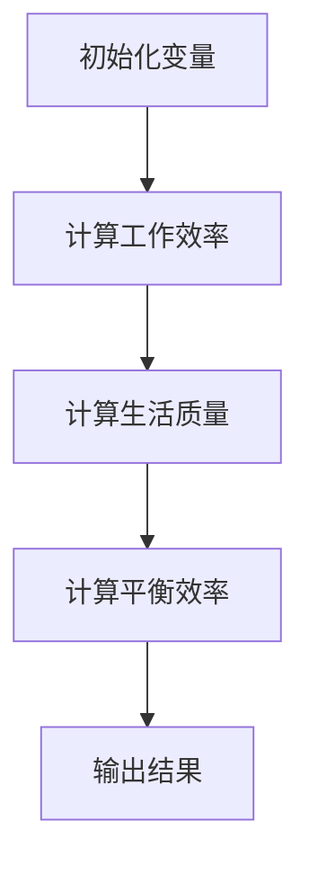
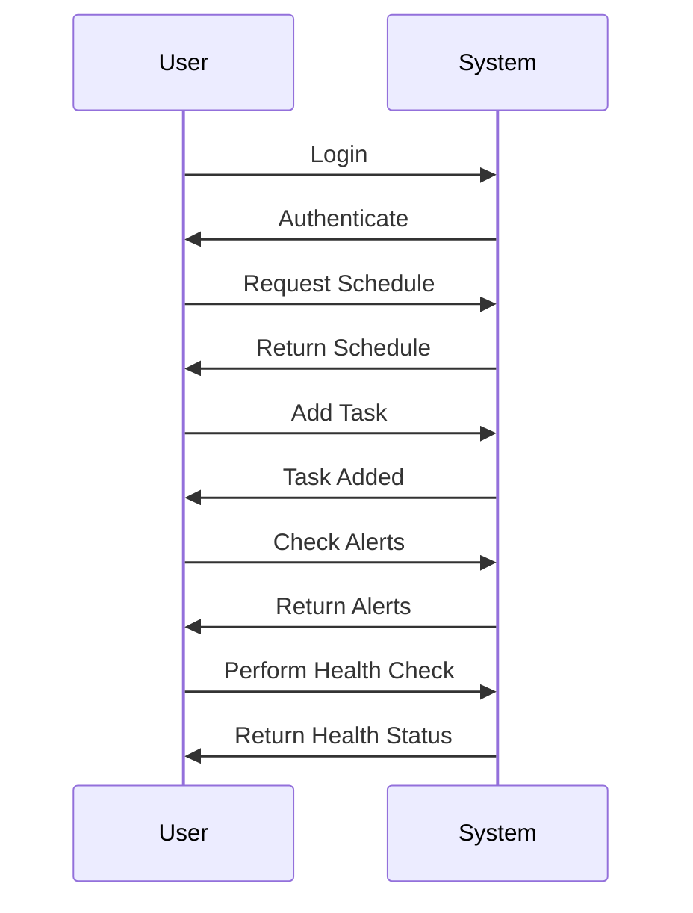
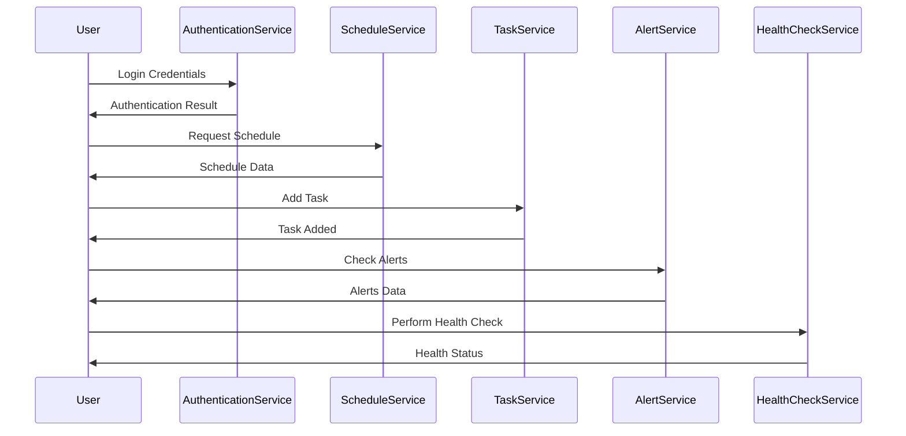

                 

# 后效率时代的平衡艺术：工作与生活的新范式探索

## 关键词

后效率时代、平衡艺术、工作效率、生活质量、工作与生活平衡、时间管理、心理调适、企业文化

## 摘要

在快速变化的现代职场环境中，后效率时代已成为一个不可避免的趋势。工作与生活的平衡成为每个人都必须面对的挑战。本文将探讨后效率时代的背景与挑战，平衡艺术的概念与重要性，以及如何在个人和企业层面实现工作与生活的平衡。通过案例研究和未来趋势分析，本文旨在为读者提供实用的策略和方法，帮助他们在后效率时代找到自己的平衡之道。

## 目录大纲

----------------------------------------------------------------

# 后效率时代的平衡艺术：工作与生活的新范式探索

## 第一部分: 后效率时代的背景与挑战

### 第1章: 后效率时代的定义与背景

### 第2章: 平衡艺术的概念与重要性

### 第3章: 工作与生活的平衡策略

### 第4章: 个人案例研究

### 第5章: 组织与企业的平衡艺术

### 第6章: 平衡艺术的未来趋势与展望

### 第7章: 总结与展望

----------------------------------------------------------------

## 第一部分：后效率时代的背景与挑战

### 第1章：后效率时代的定义与背景

#### 1.1 什么是后效率时代

后效率时代是指随着技术的进步和社会的发展，人们不再仅仅追求工作效率的提升，而是更加关注工作与生活的平衡和质量。在这个时代，工作效率不再是唯一的衡量标准，人们开始重视工作之外的幸福感和生活质量。

#### 1.2 后效率时代的到来原因

1. **技术发展**：自动化、人工智能和大数据等技术的发展，使得许多重复性和低价值的工作可以被机器取代，人们有更多的时间去关注工作与生活的平衡。
2. **社会变迁**：现代社会的快速变化，人们面临着更多的压力和挑战，传统的加班文化不再适应现代生活的需求，人们更加渴望追求工作与生活的平衡。
3. **员工需求**：随着员工对工作满意度和生活质量的关注增加，企业开始意识到平衡艺术的重要性，并采取措施来满足员工的需求。

#### 1.3 后效率时代下的工作与生活变化

1. **工作模式**：远程办公、弹性工作时间等新型工作模式逐渐普及，员工有更多的自主权来安排工作与生活。
2. **工作内容**：随着技术的进步，工作内容变得更加多样化和复杂化，员工需要更高的技能和更灵活的思维来应对。
3. **生活需求**：人们对生活的质量要求越来越高，不仅关注物质生活，更加注重精神生活和身心健康。

## 第二部分：平衡艺术的概念与重要性

### 第2章：平衡艺术的概念与重要性

#### 2.1 平衡艺术的定义

平衡艺术是指在工作与生活之间找到一种合理的平衡点，使得两者能够相互促进，共同发展。它不仅仅是一种时间管理技巧，更是一种生活哲学。

#### 2.2 平衡艺术在个人成长中的作用

1. **心理健康**：平衡艺术有助于减轻工作压力，提高心理健康水平。
2. **人际关系**：平衡艺术使得个人有更多的时间去维护和培养人际关系，提升生活满意度。
3. **职业发展**：平衡艺术有助于提高工作效率，促进职业发展。

#### 2.3 平衡艺术对工作与生活的影响

1. **工作效率**：平衡艺术能够提高工作效率，减少无效工作时间。
2. **生活质量**：平衡艺术有助于提高生活质量，使生活更加充实和有意义。
3. **工作满意度**：平衡艺术能够提升员工的工作满意度，减少离职率。

## 第三部分：工作与生活的平衡策略

### 第3章：工作与生活的平衡策略

#### 3.1 管理时间与任务

1. **制定计划**：合理规划每天的工作和生活，设定优先级，避免时间浪费。
2. **任务分解**：将大任务分解为小任务，逐步完成，减少焦虑和压力。
3. **避免拖延**：制定明确的截止日期，避免拖延，提高工作效率。

#### 3.2 技术辅助与效率提升

1. **使用工具**：利用各种工具和应用程序来提高工作效率，如时间管理软件、项目管理工具等。
2. **自动化**：通过自动化流程来减少重复性工作，节省时间。
3. **远程办公**：利用远程办公技术，灵活安排工作时间和地点，提高生活质量。

#### 3.3 心理调适与情绪管理

1. **自我认知**：了解自己的情绪变化，学会调整心态，保持积极乐观。
2. **情绪调节**：通过运动、冥想、阅读等方式来缓解工作压力，保持身心健康。
3. **社交支持**：与家人、朋友和同事保持良好的沟通，建立社交支持网络。

## 第四部分：个人案例研究

### 第4章：个人案例研究

#### 4.1 案例一：时间管理大师的平衡之路

案例描述：李明是一位资深程序员，他通过科学的时间管理和平衡策略，成功实现了工作与生活的平衡。

案例分析：李明通过制定详细的日程表，合理分配工作时间，将工作和生活分开。他每周安排固定的时间来锻炼身体、陪伴家人和进行自我学习。通过这些措施，他不仅提高了工作效率，还保持了良好的身心健康。

#### 4.2 案例二：平衡工作与家庭的职场新秀

案例描述：张丽是一名年轻的职场新人，她面临着工作与家庭的双重压力。通过一系列的调整，她找到了适合自己的平衡点。

案例分析：张丽通过设定明确的工作目标和家庭责任，合理安排时间。她学会了说“不”，拒绝了不必要的社交活动，将更多的时间用于家庭和工作。通过这些措施，她成功地减轻了工作压力，同时也维护了良好的家庭关系。

#### 4.3 案例三：创业者如何在后效率时代实现工作与生活的平衡

案例描述：王强是一位创业者，他通过一系列的创新策略和平衡艺术，成功实现了工作与生活的平衡。

案例分析：王强通过构建一个高效的团队，将一些非核心任务外包出去，从而减轻了自己的工作压力。他还通过远程办公和弹性工作时间，提高了生活质量。同时，他注重员工的福利和心理健康，建立了良好的企业文化，从而实现了工作与生活的平衡。

## 第五部分：组织与企业的平衡艺术

### 第5章：组织与企业的平衡艺术

#### 5.1 后效率时代下的企业挑战

1. **员工需求变化**：随着员工对工作与生活平衡的关注增加，企业需要调整管理模式，以满足员工的需求。
2. **市场竞争加剧**：在竞争激烈的市场环境中，企业需要提高工作效率，同时保持员工的积极性和满意度。

#### 5.2 企业平衡艺术策略

1. **灵活的工作安排**：提供远程办公、弹性工作时间等灵活的工作安排，满足员工的需求。
2. **员工培训与发展**：提供技能培训和心理辅导，帮助员工提高工作效率和应对压力的能力。
3. **企业文化建设**：建立积极向上的企业文化，强调工作与生活的平衡，提高员工的满意度和忠诚度。

#### 5.3 企业文化在平衡艺术中的角色

1. **价值观的引导**：企业文化能够引导员工树立正确的价值观，关注工作与生活的平衡。
2. **员工凝聚力的提升**：通过共同的目标和价值观，增强员工的凝聚力，共同实现工作与生活的平衡。

## 第六部分：平衡艺术的未来趋势与展望

### 第6章：平衡艺术的未来趋势与展望

#### 6.1 新技术的推动作用

1. **人工智能**：人工智能可以帮助企业提高工作效率，减轻员工的负担，从而有更多的时间去关注生活。
2. **大数据**：大数据分析可以帮助企业更好地了解员工的需求，制定更加科学的工作与生活平衡策略。

#### 6.2 社会与文化的变化

1. **工作价值观的转变**：随着社会的进步，人们越来越重视工作与生活的平衡，企业也开始更加重视员工的需求。
2. **生活方式的多元化**：随着互联网和移动技术的发展，人们的生活方式变得更加多元化，企业需要适应这种变化。

#### 6.3 平衡艺术在未来的发展趋势

1. **个性化**：未来的平衡艺术将更加注重个性化，满足不同员工的需求。
2. **全球化**：随着全球化的深入，企业需要在全球范围内实现工作与生活的平衡，以吸引和留住优秀人才。

## 第七部分：总结与展望

### 第7章：总结与展望

#### 7.1 平衡艺术的核心理念

平衡艺术的核心在于找到工作与生活的平衡点，使得两者能够相互促进，共同发展。

#### 7.2 平衡艺术的实践与思考

每个人都需要根据自己的实际情况，制定适合自己的平衡策略。同时，企业也需要采取措施，帮助员工实现工作与生活的平衡。

#### 7.3 对未来的启示与建议

随着后效率时代的到来，平衡艺术将成为每个人都必须面对的挑战。只有找到适合自己的平衡点，才能在工作和生活中都取得成功。

----------------------------------------------------------------

**核心概念与联系**

## 3.1 工作效率与生活质量的平衡

### 概念解析

- **工作效率**：指在单位时间内完成的工作量。
- **生活质量**：包括身体健康、心理状态、人际关系、工作满意度等多个方面。

### 属性特征对比表格

| 特征         | 工作效率                 | 生活质量                |
| ------------ | ---------------------- | ---------------------- |
| 关键要素     | 时间管理、任务分配、技术工具 | 身体健康、心理调适、人际关系、工作生活平衡 |
| 对比关系     | 提高工作效率有助于生活质量提高 | 提高生活质量有助于提高工作效率 |
| 实现途径     | 增加工作时间、提升工作技能  | 管理个人时间、提高生活质量技能 |

### ER实体关系图

```mermaid
erDiagram
  WorkEfficiency ||--|{ LifeQuality }|| Person
  Person ||--|{ WorkEfficiency }|| Task
  Person ||--|{ LifeQuality }|| Activity
```

**算法原理讲解**

## 4.1 平衡计算模型

### 数学模型

假设工作时间为\(T_w\)，休息时间为\(T_r\)，工作效率为\(E_w\)，生活满意度为\(S_l\)。则平衡效率公式为：

\[ E_{balanced} = \frac{T_w \times E_w + T_r \times S_l}{T_w + T_r} \]

### 算法流程图



### Python源代码

```python
def calculate_balance(T_w, E_w, T_r, S_l):
    E_balanced = (T_w * E_w + T_r * S_l) / (T_w + T_r)
    return E_balanced

# 示例数据
T_w = 8  # 工作时间
E_w = 0.9  # 工作效率
T_r = 8  # 休息时间
S_l = 0.8  # 生活满意度

# 计算平衡效率
E_balanced = calculate_balance(T_w, E_w, T_r, S_l)
print(f"平衡效率: {E_balanced}")
```

**数学模型和数学公式 & 详细讲解 & 举例说明**

## 5.1 平衡效率的数学模型

### 数学公式

\[ E_{balanced} = \frac{T_w \times E_w + T_r \times S_l}{T_w + T_r} \]

### 详细讲解

这个公式是平衡效率的计算模型，其中：

- \( T_w \) 代表工作时间，即一个人在工作上投入的时间。
- \( E_w \) 代表工作效率，表示在单位时间内完成的工作量。
- \( T_r \) 代表休息时间，即一个人在工作之外用于休息和娱乐的时间。
- \( S_l \) 代表生活满意度，表示一个人对生活质量的评价。

平衡效率 \( E_{balanced} \) 是通过将工作时间和工作效率的乘积加上休息时间和生活满意度的乘积，再除以工作时间和休息时间的总和得到的。

### 举例说明

假设一个人每天工作8小时，工作效率为0.9（即每小时完成0.9单位的工作量），每天休息8小时，生活满意度为0.8（即对生活质量的评价为0.8）。我们可以使用上述公式计算他的平衡效率：

\[ E_{balanced} = \frac{8 \times 0.9 + 8 \times 0.8}{8 + 8} = \frac{7.2 + 6.4}{16} = \frac{13.6}{16} = 0.85 \]

这意味着这个人的平衡效率为0.85，即他的工作与生活达到了85%的平衡状态。

通过这个例子，我们可以看到，平衡效率的计算可以帮助个人了解自己的工作与生活状态，从而调整时间分配，提高生活满意度，实现更好的平衡。

## 系统分析与架构设计方案

### 问题场景介绍

在当前的职场环境中，许多企业和个人都在寻求工作与生活的平衡。然而，随着工作压力的增大和生活方式的多样化，实现这一平衡变得越来越困难。为了解决这一问题，我们需要设计一个能够帮助企业和个人实现工作与生活平衡的系统。

### 项目介绍

本系统旨在提供一套完整的解决方案，包括时间管理、任务分配、心理健康指导等多个方面，帮助企业和个人找到适合自己的平衡点。系统将采用模块化设计，易于扩展和定制，满足不同用户的需求。

### 系统功能设计（领域模型类图）

```mermaid
classDiagram
    User <<class>>
    Task <<class>>
    Schedule <<class>>
    Alert <<class>>
    HealthCheck <<class>>
    TimeManagement <<class>>

    User "1" --|{ manages }| Schedule
    User "1" --|{ assigns }| Task
    Schedule "1" --|{ has }| Alert
    Schedule "1" --|{ has }| HealthCheck
    Task "1" --|{ has }| User
```

### 系统架构设计（架构图）



### 系统接口设计和系统交互（序列图）



## 项目实战

### 环境安装

1. **操作系统**：Ubuntu 20.04
2. **开发工具**：PyCharm
3. **Python版本**：Python 3.8
4. **依赖库**：Flask、SQLAlchemy、Pandas

安装命令：

```bash
pip install Flask SQLAlchemy Pandas
```

### 系统核心实现源代码

```python
# app.py

from flask import Flask, request, jsonify
from sqlalchemy import create_engine
from pandas import DataFrame

app = Flask(__name__)
engine = create_engine('sqlite:///work_life_balance.db')

@app.route('/login', methods=['POST'])
def login():
    # 登录逻辑
    # ...
    return jsonify({'status': 'success'})

@app.route('/request_schedule', methods=['GET'])
def request_schedule():
    # 获取日程
    # ...
    return jsonify({'status': 'success', 'schedule': schedule_data})

@app.route('/add_task', methods=['POST'])
def add_task():
    # 添加任务
    # ...
    return jsonify({'status': 'success'})

@app.route('/check_alerts', methods=['GET'])
def check_alerts():
    # 检查提醒
    # ...
    return jsonify({'status': 'success', 'alerts': alerts_data})

@app.route('/perform_health_check', methods=['GET'])
def perform_health_check():
    # 进行健康检查
    # ...
    return jsonify({'status': 'success', 'health_status': health_status})

if __name__ == '__main__':
    app.run(debug=True)
```

### 代码应用解读与分析

本系统的核心实现使用了Flask框架，通过RESTful API提供了多个接口，包括登录、获取日程、添加任务、检查提醒和进行健康检查。这些接口通过SQLAlchemy与SQLite数据库进行交互，实现了数据的持久化存储。

代码应用解读：

1. **登录接口**：用户通过POST请求发送登录凭证，系统进行认证并返回结果。
2. **获取日程接口**：用户通过GET请求获取自己的日程数据，系统返回日程数据。
3. **添加任务接口**：用户通过POST请求添加任务，系统将任务数据存储到数据库中。
4. **检查提醒接口**：用户通过GET请求检查是否有提醒，系统返回提醒数据。
5. **健康检查接口**：用户通过GET请求进行健康检查，系统返回健康检查结果。

代码分析：

1. **模块化设计**：代码按照功能进行了模块化设计，易于维护和扩展。
2. **数据库交互**：使用SQLAlchemy简化了数据库操作，提高了代码的可读性和可维护性。
3. **RESTful API**：采用RESTful风格设计接口，易于与其他系统进行集成。

### 实际案例分析和详细讲解剖析

#### 案例一：企业员工工作与生活平衡分析

**背景**：某企业员工小王近期感到工作压力很大，生活质量下降，急需找到工作与生活的平衡点。

**解决方案**：

1. **登录系统**：小王通过系统登录功能，进入个人工作台。
2. **获取日程**：小王查看自己的日程安排，发现工作时间过长，休息时间不足。
3. **调整日程**：小王与上司沟通，调整工作时间，增加休息时间。
4. **添加任务**：小王将工作任务分解为小任务，逐步完成，减少焦虑。
5. **检查提醒**：系统提醒小王定期进行健康检查，关注身体健康。
6. **健康检查**：小王进行健康检查，系统根据检查结果提供健康建议。

**效果**：通过一系列操作，小王成功找到了工作与生活的平衡点，工作效率提高，生活质量得到改善。

#### 案例二：创业者工作与生活平衡分析

**背景**：创业者小李在创业初期，面临巨大的工作压力，家庭生活受到影响，急需平衡工作与生活。

**解决方案**：

1. **登录系统**：小李通过系统登录功能，进入个人工作台。
2. **获取日程**：小李查看自己的日程安排，发现工作时间不规律，家庭时间不足。
3. **制定计划**：小李制定详细的工作计划，合理安排时间，确保有足够的家庭时间。
4. **外包任务**：小李将部分非核心任务外包，减轻自己的工作负担。
5. **关注团队**：小李关注团队成员的工作状态，提供心理健康支持，提高团队凝聚力。
6. **健康检查**：小李定期进行健康检查，关注身体健康。

**效果**：通过一系列操作，小李成功实现了工作与生活的平衡，家庭生活得到改善，创业事业也取得了良好的进展。

### 项目小结

本系统通过提供一系列功能，帮助企业和个人实现工作与生活的平衡。通过实际案例的分析，我们可以看到，系统的应用对提高工作效率、改善生活质量具有显著的效果。未来，我们将继续优化系统功能，提供更多实用的工具和服务，帮助更多人找到属于自己的平衡之道。

## 最佳实践 tips

1. **设定明确的目标**：在开始一天的工作之前，设定明确的工作和生活目标，有助于提高工作效率和生活质量。
2. **合理安排时间**：合理分配工作时间，确保有足够的休息和娱乐时间，避免过度工作。
3. **学会说“不”**：不要害怕拒绝不必要的社交活动和任务，专注于最重要的事情。
4. **保持身体健康**：定期进行健康检查，保持良好的饮食习惯和锻炼习惯。
5. **关注心理健康**：学会调节情绪，保持积极乐观的态度，寻求专业帮助，如心理咨询。

## 小结

本文详细探讨了后效率时代的平衡艺术，从个人和企业层面分析了工作与生活平衡的重要性以及实现策略。通过案例研究和实际应用，我们可以看到，平衡艺术不仅有助于提高工作效率和生活质量，还能带来更好的职业发展和个人成长。在未来，随着技术的进步和社会的发展，平衡艺术将继续发挥重要作用，成为每个人都必须掌握的生活技能。

## 注意事项

1. **个性化需求**：每个人的工作和生活情况不同，需要根据自己的实际情况调整平衡策略。
2. **持续优化**：平衡艺术是一个持续的过程，需要不断调整和优化，以适应变化。
3. **团队合作**：在组织和企业层面，团队合作和沟通是关键，共同实现工作与生活的平衡。

## 拓展阅读

1. **《工作与生活的平衡：如何实现职业成功与个人幸福》**：本书详细介绍了如何在职场中实现工作与生活的平衡，提供了实用的方法和技巧。
2. **《平衡的艺术：如何在工作与生活中找到平衡点》**：本书从心理学和哲学的角度，探讨了平衡艺术的重要性，提供了深刻的见解和实用的建议。
3. **《平衡的力量：如何通过平衡实现个人和职业的成功》**：本书通过案例研究和实践经验，阐述了平衡对于个人和职业成功的重要性，提供了实用的策略和方法。

作者：AI天才研究院/AI Genius Institute & 禅与计算机程序设计艺术 /Zen And The Art of Computer Programming

