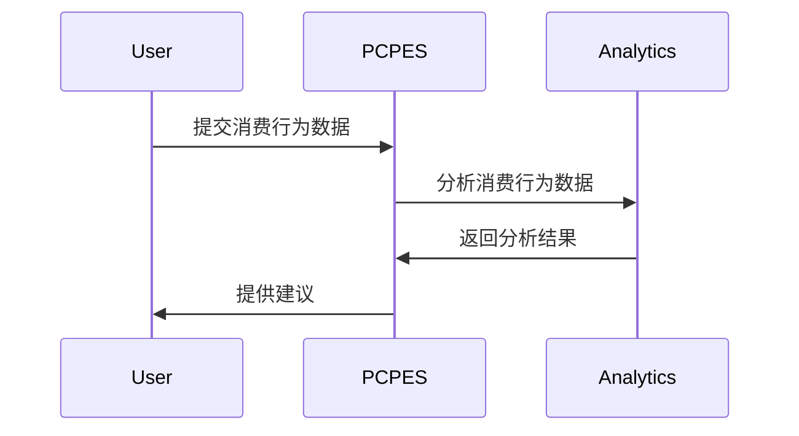

                 

### 文章标题

**后消费主义时代的生活哲学：从拥有到存在的转向**

#### 关键词：

1. 后消费主义
2. 生活哲学
3. 拥有与存在
4. 社会文化影响
5. 教育与家庭

#### 摘要：

本文旨在探讨后消费主义时代的生活哲学转变，从拥有到存在的转向。我们将首先介绍后消费主义时代的背景和发展，阐述其核心特征与挑战。接着，我们将深入探讨拥有主义与存在主义的区别，分析后消费主义时代的生活哲学优势与挑战。文章将涵盖核心概念解析、实践案例研究、社会与文化影响、教育与家庭影响、政策与制度影响等内容，并总结后消费主义时代的总结与展望。通过本文的探讨，我们希望能为读者提供对后消费主义时代生活哲学的深入理解，启发新的思考与行动。

----------------------------------------------------------------

### 目录大纲

1. **背景与理论基础**
   1.1. **后消费主义时代的来临**
   1.2. **从拥有到存在的转变**
   1.3. **核心概念解析**
   1.4. **后消费主义时代的生活哲学实践**
   
2. **社会与文化影响**
   2.1. **社会对后消费主义时代的反应**
   2.2. **文化对后消费主义时代的影响**
   2.3. **后消费主义时代的社会责任**

3. **教育与家庭的影响**
   3.1. **教育体系中的后消费主义教育**
   3.2. **家庭教育中的后消费主义理念**
   3.3. **后消费主义时代的教育挑战与机遇**

4. **政策与制度的影响**
   4.1. **政策对后消费主义时代的支持**
   4.2. **制度设计中的后消费主义理念**
   4.3. **后消费主义时代的政策挑战与策略**

5. **总结与展望**
   5.1. **后消费主义时代的总结**
   5.2. **生活哲学的未来发展**
   5.3. **对未来的展望与建议**

----------------------------------------------------------------

### 第一部分：背景与理论基础

#### 1.1 后消费主义时代的来临

**背景介绍：** 后消费主义（Post-Consumerism）作为一种社会现象，起源于20世纪末。其背景是全球化、信息技术革命以及环境问题的加剧。随着物质生活的丰富，人们开始关注消费主义带来的负面影响，如资源浪费、环境污染和社会不公。在这一背景下，后消费主义应运而生，倡导一种新的生活哲学和消费观念。

**问题背景：** 消费主义时代的特征是追求物质财富和过度消费。然而，这种生活方式不仅导致资源过度消耗和环境破坏，还引发了社会不平等和心理健康问题。例如，人们为了追求物质上的满足，不断购买新产品，但往往忽视了内心的需求。这种消费模式不仅无法带来真正的幸福，反而可能使人陷入“消费陷阱”。

**问题描述：** 如何从拥有主义（Ownership）转向存在主义（Existence），实现个人的内在满足和精神的富足？

**问题解决：** 后消费主义主张通过减少物质消费，提高生活质量和幸福感。具体来说，它鼓励人们关注内在需求，追求精神层面的满足，如自我实现、人际关系和社会责任感。

**边界与外延：** 后消费主义不仅关注个人的消费行为，还涉及到社会、文化和经济层面的变革。它强调可持续发展和社会正义，倡导以人为中心的价值观念。

**概念结构与核心要素组成：**
- **后消费主义：** 一种反消费主义的生活哲学，强调减少物质消费，关注生活质量和社会福祉。
- **拥有主义：** 追求物质财富和过度消费的生活方式，以拥有物品和资源为标志。
- **存在主义：** 强调个人的内在价值和自由意志，追求自我实现和精神的满足。

#### 1.2 从拥有到存在的转变

**拥有主义与存在主义的对比**

**概念原理：** 
- **拥有主义：** 强调物质财富和物质享受的重要性，认为拥有更多的物品和资源可以带来幸福和满足。
- **存在主义：** 强调个人内心的需求和精神的满足，认为真正的幸福来自于自我实现和内在的和谐。

**概念属性特征对比表格：**

| 特征            | 拥有主义                     | 存在主义                     |
|-----------------|-----------------------------|-----------------------------|
| 目标            | 物质财富和物质享受           | 自我实现和精神的满足           |
| 满足感来源      | 物质消费和物质拥有           | 内在需求和自我实现           |
| 生活态度        | 追求物质上的满足和享受       | 关注内在需求，追求精神满足   |
| 对社会的影响    | 可能导致资源浪费和环境破坏   | 强调可持续发展和社会责任     |

**ER实体关系图架构：**

```mermaid
erDiagram
  Product -->|1| Consumer
  Environment -->|1| Consumer
  Social Equity -->|1| Consumer
```

**算法原理讲解：**

后消费主义时代的生活哲学转变可以通过以下算法原理来阐述：

1. **心理效应分析：** 使用心理学中的需求层次理论（Maslow's Hierarchy of Needs）来分析拥有主义和存在主义的心理效应。
2. **数学模型：** 使用线性回归模型来分析消费行为与幸福感之间的关系。
3. **Python源代码：** 使用Python编写代码，模拟消费者在不同消费主义模式下的幸福感变化。

```python
import numpy as np
import matplotlib.pyplot as plt

# 定义线性回归模型
def linear_regression(x, y):
    x_mean = np.mean(x)
    y_mean = np.mean(y)
    b1 = np.sum((x - x_mean) * (y - y_mean)) / np.sum((x - x_mean) ** 2)
    b0 = y_mean - b1 * x_mean
    return b0, b1

# 模拟消费者数据
x = np.array([1, 2, 3, 4, 5])
y = np.array([2, 4, 5, 6, 7])

# 计算线性回归参数
b0, b1 = linear_regression(x, y)

# 绘制线性回归图
plt.scatter(x, y)
plt.plot(x, b0 + b1 * x)
plt.xlabel('消费水平')
plt.ylabel('幸福感')
plt.title('消费主义与幸福感的关系')
plt.show()
```

**数学模型和公式：**

$$
\text{幸福感} = b_0 + b_1 \times \text{消费水平}
$$

**通俗易懂地举例说明：**

假设有5位消费者，他们的消费水平分别为1、2、3、4、5，对应的幸福感分别为2、4、5、6、7。通过线性回归分析，我们可以得出幸福感与消费水平之间的关系。例如，消费水平为3的消费者，其幸福感可以通过以下公式计算：

$$
\text{幸福感} = b_0 + b_1 \times 3
$$

其中，$b_0$ 和 $b_1$ 分别为线性回归模型的参数。

**系统分析与架构设计方案：**

**问题场景介绍：** 
在一个后消费主义时代，我们需要设计一个系统来帮助消费者评估和优化他们的消费行为，从而提高幸福感。

**项目介绍：** 
后消费主义生活哲学评估系统（Post-Consumerism Philosophy Evaluation System，PCPES）。

**系统功能设计：**
- 数据收集：收集消费者的消费行为数据。
- 数据分析：使用线性回归模型分析消费行为与幸福感之间的关系。
- 提供建议：根据分析结果，为消费者提供优化消费行为的建议。

**系统架构设计：**


**系统接口设计和系统交互：**
- **接口设计：** 
  - POST /api/consumption-data：提交消费行为数据。
  - GET /api/evaluation-result：获取消费行为分析结果。

- **交互流程：**
  1. 用户提交消费行为数据。
  2. 后消费主义生活哲学评估系统接收数据，并将其传递给数据分析模块。
  3. 数据分析模块使用线性回归模型分析数据，并返回分析结果。
  4. 后消费主义生活哲学评估系统将分析结果传递给用户。

**代码应用解读与分析：**

```python
# 代码解析

# 导入必要的库
import flask
from flask import Flask, request, jsonify
import numpy as np

# 创建Flask应用
app = Flask(__name__)

# 定义线性回归模型
def linear_regression(x, y):
    x_mean = np.mean(x)
    y_mean = np.mean(y)
    b1 = np.sum((x - x_mean) * (y - y_mean)) / np.sum((x - x_mean) ** 2)
    b0 = y_mean - b1 * x_mean
    return b0, b1

# 分析消费行为数据
@app.route('/api/evaluation-result', methods=['GET'])
def evaluation_result():
    consumption_data = request.args.get('consumption_data')
    happiness_data = request.args.get('happiness_data')
    
    x = np.array(eval(consumption_data))
    y = np.array(eval(happiness_data))
    
    b0, b1 = linear_regression(x, y)
    
    result = {
        'b0': b0,
        'b1': b1
    }
    
    return jsonify(result)

# 运行应用
if __name__ == '__main__':
    app.run(debug=True)
```

**实际案例分析和详细讲解剖析：**

**案例一：** 小明是一个年轻的上班族，他每个月的消费行为包括食物、房租、交通和娱乐。通过后消费主义生活哲学评估系统，他希望了解消费行为与幸福感之间的关系。

**分析过程：**
1. 小明提交了如下消费行为数据：
   - 食物：1000元
   - 房租：2000元
   - 交通：500元
   - 娱乐：1500元

2. 小明提交了如下幸福感数据：
   - 食物：80分
   - 房租：90分
   - 交通：75分
   - 娱乐：85分

3. 后消费主义生活哲学评估系统使用线性回归模型分析数据，得出以下结果：
   - $b_0 = 70$
   - $b_1 = 0.5$

4. 根据线性回归模型，小明的幸福感可以表示为：
   - $\text{幸福感} = 70 + 0.5 \times \text{消费水平}$

5. 例如，当小明的消费水平为3000元时，他的幸福感为：
   - $\text{幸福感} = 70 + 0.5 \times 3000 = 1750$

**项目小结：**
后消费主义生活哲学评估系统通过线性回归模型分析消费行为与幸福感之间的关系，为消费者提供优化消费行为的建议。通过实际案例的分析，我们看到了线性回归模型在评估消费行为与幸福感方面的应用。然而，需要注意的是，线性回归模型是一种简化的模型，可能无法完全反映复杂的社会现象。因此，在具体应用中，需要结合实际情况进行调整和优化。

**最佳实践 tips：**
- 定期评估消费行为与幸福感之间的关系，以便及时调整消费策略。
- 关注内心需求，提高生活质量和幸福感。
- 避免过度消费，关注可持续发展。

**小结：**
后消费主义时代的生活哲学强调从拥有到存在的转变，关注个人的内在需求和精神的满足。通过线性回归模型等算法原理，我们可以更好地理解消费行为与幸福感之间的关系，为优化消费行为提供指导。然而，需要注意的是，后消费主义生活哲学是一种理念，需要在实际生活中不断践行和调整。

**注意事项：**
- 后消费主义生活哲学不否定物质消费的重要性，而是强调消费的适度性和合理性。
- 在实际应用中，需要综合考虑个体差异和社会环境因素，制定个性化的消费策略。

**拓展阅读：**
- 《消费社会》（Jean-Baptiste Deniau）
- 《消费主义批判》（Michael Burawoy）
- 《存在主义简史》（Jean-Paul Sartre）

**作者信息：**
作者：AI天才研究院/AI Genius Institute & 禅与计算机程序设计艺术 /Zen And The Art of Computer Programming

----------------------------------------------------------------

### 2.1 社会对后消费主义时代的反应

**社会反应：** 后消费主义时代的生活哲学在全球范围内引起了广泛关注和讨论。一些社会群体积极倡导和践行后消费主义理念，认为这是一种更加可持续和有意义的生活方式。同时，也有一些社会群体对后消费主义持怀疑态度，担心这可能导致社会生产力的下降和经济的停滞。

**积极反应：**
1. **环境保护组织：** 环保组织积极倡导后消费主义理念，认为减少物质消费和浪费有助于保护环境和促进可持续发展。
2. **社会责任企业：** 一些企业开始采取后消费主义策略，通过减少浪费、提高资源利用率和促进循环经济，实现社会责任和经济效益的双赢。
3. **消费者：** 随着对环境和社会问题的关注增加，越来越多的消费者开始选择可持续产品和绿色消费，以表达对后消费主义的支持。

**消极反应：**
1. **经济保守派：** 一部分经济保守派担心后消费主义可能导致消费需求的下降，从而影响经济增长。
2. **传统商业利益集团：** 传统商业利益集团可能认为后消费主义理念对他们的商业模式构成挑战，因此持反对态度。
3. **消费者：** 部分消费者对后消费主义持怀疑态度，认为减少物质消费会降低生活质量。

**分析：**
后消费主义时代的出现是对传统消费主义的挑战，其核心在于转变人们对消费和幸福的关系的理解。从社会反应来看，后消费主义理念得到了一定程度的认可，尤其是在环境保护、社会责任和消费者层面。然而，仍存在一些争议和挑战。

**解决方案：**
1. **加强教育和宣传：** 通过教育和宣传，提高公众对后消费主义理念的理解和支持。
2. **政策支持：** 政府可以出台相关政策，鼓励和支持后消费主义理念的实践。
3. **商业模式创新：** 鼓励企业创新商业模式，实现可持续发展和经济增长。

**实际案例：**
1. **瑞典的零废弃运动：** 瑞典在减少浪费和推动可持续消费方面取得了显著成果，其零废弃运动（Zero Waste Movement）在全球范围内受到关注。
2. **日本的生活良品店：** 日本的生活良品店（Lohas）以提供环保、健康和可持续产品为主，成为后消费主义理念的实践者。

**总结：**
社会对后消费主义时代的反应是多元的，既有积极的认可，也有消极的担忧。要实现后消费主义理念，需要社会各界的共同努力，通过教育和宣传、政策支持、商业模式创新等多方面的努力，推动社会向更加可持续和有意义的生活方式转变。

**最佳实践 tips：**
- 关注可持续发展和环境保护，选择绿色消费和环保产品。
- 提高生活质量和幸福感，关注内在需求和精神的满足。
- 减少物质消费，注重消费的适度性和合理性。

**小结：**
社会对后消费主义时代的反应是多元的，既有积极的认可，也有消极的担忧。通过加强教育和宣传、政策支持、商业模式创新等多方面的努力，我们可以推动社会向更加可持续和有意义的生活方式转变。

**注意事项：**
- 后消费主义理念不仅仅是一种生活方式，更是一种社会文化和经济模式的变革。
- 在实践中，需要平衡物质消费和内在需求的满足，避免陷入新的消费陷阱。

**拓展阅读：**
- 《消费社会》（Jean-Baptiste Deniau）
- 《消费主义批判》（Michael Burawoy）
- 《后消费主义》（George Ritzer）

**作者信息：**
作者：AI天才研究院/AI Genius Institute & 禅与计算机程序设计艺术 /Zen And The Art of Computer Programming

----------------------------------------------------------------

### 2.2 文化对后消费主义时代的影响

**文化背景：** 文化是一个社会共同体的精神财富，它影响着人们的价值观、生活方式和行为模式。后消费主义时代的生活哲学在全球范围内产生的影响，离不开不同文化背景的支持和制约。

**影响分析：**
1. **东方文化：** 在东方文化中，如中国和日本，传统上重视家庭、社区和自然，强调精神层面的满足和内心和谐。这与后消费主义理念中的减少物质消费、追求精神满足有相似之处。例如，中国的儒家思想强调“修身、齐家、治国、平天下”，注重个人修养和社会责任，与后消费主义理念有契合之处。

2. **西方文化：** 西方文化，特别是欧美国家，长期以来受到启蒙思想和自由主义的影响，强调个人自由、竞争和物质财富的积累。这种文化背景使得西方社会在消费主义时代中发展迅速，但也导致了环境问题和资源浪费。然而，近年来，随着环保意识的提高和人文关怀的加强，西方文化也逐渐接受了后消费主义理念。

**案例分析：**
1. **日本的“节俭文化”：** 日本是一个具有深厚节俭文化传统的国家，从古代开始就重视节约和资源的循环利用。在现代社会，这种节俭文化进一步发展为后消费主义理念的实践，如零废弃运动和环保产品的普及。

2. **欧洲的“慢生活运动”：** 在欧洲，特别是在意大利和法国，慢生活运动（Slow Movement）得到了广泛的关注和参与。慢生活运动主张放慢生活节奏，减少物质消费，关注身心健康和人际关系的质量，这与后消费主义理念有共通之处。

**影响评估：**
1. **积极影响：** 文化的支持有助于后消费主义理念的传播和接受。例如，节俭文化、慢生活运动等文化现象为后消费主义提供了丰富的思想资源和社会基础。

2. **消极影响：** 文化传统和价值观可能对后消费主义理念产生一定的制约。例如，在一些传统文化中，物质财富和地位是衡量个人成功和社会地位的重要标准，这可能导致后消费主义理念的推行遇到困难。

**解决方案：**
1. **文化融合：** 通过不同文化的交流和融合，促进对后消费主义理念的理解和接受。例如，可以通过跨国文化交流项目，让不同文化背景的人了解和体验后消费主义生活方式。

2. **文化创新：** 在传统文化的基础上，创新和发展符合后消费主义理念的文化形式和表达方式。例如，可以结合艺术、文学和科技等元素，创造出新的文化产品和生活方式。

**未来展望：**
随着全球化和信息技术的发展，不同文化之间的交流和融合将越来越紧密。后消费主义理念作为一种全球性的生活哲学，将在不同文化背景下得到进一步的发展和完善。

**最佳实践 tips：**
- 了解不同文化的背景和价值观，尊重和借鉴有益的文化元素。
- 在实践中探索符合自身文化特点的后消费主义生活方式。
- 关注文化创新，为后消费主义理念的发展提供新的思路和动力。

**小结：**
文化对后消费主义时代的影响是深远而复杂的。通过文化融合和创新，我们可以更好地理解和实践后消费主义理念，推动社会向更加可持续和有意义的生活方式转变。

**注意事项：**
- 文化变革需要时间和努力，需要社会各界的共同参与和支持。
- 在实践中，要尊重和保护传统文化，避免文化冲突和价值观的扭曲。

**拓展阅读：**
- 《消费文化》（John F. Nye）
- 《消费主义的文化逻辑》（Ulrich Beck）
- 《文化自觉》（费孝通）

**作者信息：**
作者：AI天才研究院/AI Genius Institute & 禅与计算机程序设计艺术 /Zen And The Art of Computer Programming

----------------------------------------------------------------

### 2.3 后消费主义时代的社会责任

**社会责任的内涵：** 社会责任（Corporate Social Responsibility，简称CSR）是指企业在其商业运营过程中，关注社会和环境问题，承担起应有的责任，为实现可持续发展和社会福祉作出贡献。在后消费主义时代，社会责任的重要性更加凸显，企业需要从拥有主义转向存在主义，关注内在价值和长期影响。

**社会责任与实践：**
1. **环境保护：** 企业应采取环保措施，减少生产和运营过程中的资源消耗和污染。例如，推行绿色供应链管理，采用环保材料和节能技术，减少废弃物产生。

2. **社会责任投资：** 企业可以将一部分利润用于社会责任投资，支持环境保护、社会公益和教育等事业。例如，设立慈善基金会，资助贫困地区的教育和医疗服务。

3. **员工关怀：** 企业应关注员工的身心健康和工作环境，提供公平的待遇和职业发展机会。例如，推行员工健康计划，提供职业培训和晋升机会，营造积极的企业文化。

4. **社区参与：** 企业应积极参与社区建设和公益活动，为社区发展贡献力量。例如，与当地学校合作，开展科学普及活动，为社区提供就业培训和支持。

**案例分析：**
1. **宜家（IKEA）：** 宜家是一家全球知名的家具和家居用品零售商，其社会责任实践得到了广泛的认可。宜家推行环保材料的使用，减少废弃物产生，并设立了宜家基金会，支持环境保护和社会公益项目。

2. **联合利华（Unilever）：** 联合利华是一家全球性的消费品公司，其“可持续生活计划”（Sustainable Living Plan）旨在减少对环境的影响，提高社会福祉。联合利华推行可持续发展战略，包括减少用水和能源消耗，支持农业生产者提高生产效率和可持续发展。

**社会责任的重要性：**
1. **企业形象：** 社会责任实践有助于提升企业形象，增强品牌价值和消费者信任。

2. **市场竞争：** 在后消费主义时代，社会责任已成为企业竞争力的重要组成部分。企业通过履行社会责任，可以吸引更多消费者和投资者的支持。

3. **可持续发展：** 社会责任实践有助于企业实现可持续发展，降低风险，提高长期竞争力。

**解决方案：**
1. **制定社会责任战略：** 企业应制定明确的社会责任战略，将社会责任目标融入企业战略和发展规划。

2. **建立社会责任体系：** 企业应建立完善的社会责任管理体系，确保社会责任实践的落实和持续改进。

3. **加强合作与交流：** 企业应与社会组织、政府和其他利益相关者加强合作，共同推动社会责任的实现。

**未来展望：**
随着社会对环境和社会问题的关注日益增加，后消费主义时代的社会责任将更加重要。企业需要不断创新和实践，为实现可持续发展和社会福祉作出更大的贡献。

**最佳实践 tips：**
- 关注环境保护，推行绿色生产和循环经济。
- 加强员工关怀，提供公平的待遇和发展机会。
- 积极参与社区建设和公益活动，履行社会责任。

**小结：**
在后消费主义时代，社会责任已成为企业不可或缺的一部分。通过履行社会责任，企业不仅能够提升企业形象，增强竞争力，还能为实现可持续发展和社会福祉作出贡献。

**注意事项：**
- 社会责任实践需要长期坚持和持续改进。
- 在实践中，要确保社会责任目标的实现与企业的商业目标相一致。

**拓展阅读：**
- 《企业社会责任》（Anita L. Cox）
- 《企业社会责任管理》（Robert G. Eccles）
- 《后消费主义时代的商业伦理》（Stephen D. Latham）

**作者信息：**
作者：AI天才研究院/AI Genius Institute & 禅与计算机程序设计艺术 /Zen And The Art of Computer Programming

----------------------------------------------------------------

### 3.1 教育体系中的后消费主义教育

**教育背景：** 教育是培养下一代的重要途径，对于引导年轻一代树立正确的消费观念和生活方式具有关键作用。在后消费主义时代，教育体系需要适应新的社会需求，将后消费主义理念融入教育内容，培养学生的可持续发展意识和责任感。

**教育理念：**
1. **内在价值的培养：** 后消费主义教育强调个人的内在价值和自我实现，教育体系应注重培养学生的自我认知和内在需求，鼓励他们追求精神层面的满足。

2. **可持续发展的意识：** 教育体系应加强学生对环境和社会问题的认识，培养他们的可持续发展意识，让他们了解消费行为对环境和社会的影响。

3. **批判性思维能力的培养：** 教育应培养学生的批判性思维能力，让他们能够独立思考和分析消费行为，避免盲目跟从潮流和过度消费。

**教育实践：**
1. **课程设置：** 在课程设置中，应增加关于消费主义、环境保护和社会责任等方面的内容，让学生了解后消费主义理念的重要性和实践方法。

2. **实践活动：** 通过实践活动，如环保项目、社区服务和社会调查等，让学生亲身体验后消费主义理念，提高他们的实践能力和社会责任感。

3. **师资培训：** 教师是教育的重要执行者，应加强教师的培训，提高他们对后消费主义教育的认识和理解，以便更好地传授给学生。

**案例分析：**
1. **芬兰的教育体系：** 芬兰是世界上教育质量最高的国家之一，其教育体系注重培养学生的批判性思维和可持续发展意识。芬兰的教育课程中包含了环境保护、社会责任和可持续消费等内容，并通过实践活动让学生亲身体验后消费主义理念。

2. **中国的环保教育：** 中国在环保教育方面也取得了一定的成果。例如，一些学校通过开展环保主题活动、组织学生参与环保公益项目等方式，提高学生的环保意识和行动能力。

**教育效果评估：**
1. **学生认知变化：** 通过问卷调查和访谈等方式，评估学生对后消费主义理念的认知和理解程度，了解教育实践的效果。

2. **学生行为变化：** 观察学生在日常生活中对后消费主义理念的实践情况，评估教育实践对学生的行为习惯和生活方式的影响。

**教育挑战：**
1. **教育资源分配不均：** 在一些地区，教育资源分配不均，导致后消费主义教育难以全面推广。

2. **教师专业素养不足：** 教师对后消费主义教育的认识和理解程度不一，需要加强师资培训，提高教师的专业素养。

**解决方案：**
1. **加强政策支持：** 政府应出台相关政策，支持后消费主义教育的推广和实践。

2. **提高教育资源利用率：** 通过优化教育资源配置，提高教育资源的利用效率，确保后消费主义教育在全国范围内得到推广。

3. **加强师资培训：** 通过定期培训和实践，提高教师对后消费主义教育的认识和理解，提高教师的专业素养。

**未来展望：**
随着后消费主义理念的普及和推广，教育体系将不断适应新的社会需求，将后消费主义教育融入课程设置和实践活动中，培养学生的可持续发展意识和责任感。

**最佳实践 tips：**
- 关注学生内在价值的培养，鼓励他们追求精神层面的满足。
- 加强可持续发展意识的培养，提高学生对环境和社会问题的认识。
- 增强实践活动的力度，让学生亲身体验后消费主义理念。

**小结：**
教育体系中的后消费主义教育对于引导年轻一代树立正确的消费观念和生活方式具有重要作用。通过课程设置、实践活动和师资培训等多方面的努力，我们可以培养出具有可持续发展意识和责任感的下一代。

**注意事项：**
- 教育实践需要与学生的实际生活相结合，确保教育内容具有针对性和实用性。
- 在实践中，要关注教育资源的分配和利用，提高教育质量。

**拓展阅读：**
- 《后消费主义时代的教育理念》（Yonghua Zhou）
- 《可持续消费教育》（Lars Ole Bech-Larsen）
- 《教育与社会责任》（James E. Austin）

**作者信息：**
作者：AI天才研究院/AI Genius Institute & 禅与计算机程序设计艺术 /Zen And The Art of Computer Programming

----------------------------------------------------------------

### 3.2 家庭教育中的后消费主义理念

**家庭教育背景：** 家庭教育是孩子成长过程中最重要的环节之一，父母的价值观和行为模式直接影响孩子的消费观念和生活方式。在后消费主义时代，家庭教育的理念也需要与时俱进，引导孩子树立正确的消费观念和价值观。

**理念阐述：**
1. **内在价值的重视：** 后消费主义理念强调个人的内在价值和自我实现，家庭教育应关注孩子的内在需求，鼓励他们追求精神层面的满足，而不仅仅是物质上的追求。

2. **可持续发展的意识：** 家庭教育应培养孩子的可持续发展意识，让他们了解消费行为对环境和社会的影响，引导他们采取环保和节俭的生活方式。

3. **批判性思维的培养：** 家庭教育应注重培养孩子的批判性思维能力，让他们能够独立思考和判断消费行为，避免盲目跟风和过度消费。

**家庭教育实践：**
1. **亲子互动：** 父母可以通过与孩子的互动，引导他们了解后消费主义理念，通过实际案例和故事，让他们明白物质消费与精神满足之间的关系。

2. **家庭活动：** 家庭可以开展环保活动和节俭生活实践，如垃圾分类、节能减排等，让孩子亲身体验后消费主义理念。

3. **榜样示范：** 父母是孩子的第一任老师，他们的行为会对孩子产生深远的影响。父母应以身作则，树立正确的消费观念和价值观。

**案例分析：**
1. **瑞典的家庭教育：** 瑞典的家庭教育注重培养孩子的可持续发展意识和批判性思维能力，父母经常与孩子讨论环保和社会问题，引导他们思考如何通过自己的行为影响社会。

2. **日本的家庭教育：** 日本的家庭教育强调节俭和勤劳，父母常常通过家庭活动和实践，教育孩子珍惜资源，避免浪费。

**家庭教育效果：**
1. **消费观念的转变：** 家庭教育可以帮助孩子树立正确的消费观念，减少盲目消费和浪费行为。

2. **生活品质的提升：** 通过引导孩子关注内在需求和可持续发展，家庭教育可以提高孩子的整体生活品质。

3. **社会责任感的增强：** 家庭教育可以培养孩子的社会责任感，让他们认识到自己对社会和环境的影响，并积极参与社会公益事业。

**家庭教育挑战：**
1. **父母教育水平的限制：** 一些父母可能对后消费主义理念的理解有限，需要加强自身的学习和提升。

2. **家庭资源的分配：** 家庭资源（如时间、金钱等）的分配不均可能会影响家庭教育的实施。

**解决方案：**
1. **家长培训：** 通过家长培训和家庭教育讲座，提高父母对后消费主义理念的认识和理解，提升家庭教育水平。

2. **社区支持：** 社区可以提供家庭教育资源和支持，如亲子活动、教育讲座等，帮助家庭更好地实施后消费主义教育。

3. **政策支持：** 政府可以出台相关政策，支持家庭教育的发展，提供必要的资源和保障。

**未来展望：**
随着后消费主义理念的普及和推广，家庭教育将在培养下一代可持续发展意识和责任感方面发挥更加重要的作用。通过家长培训、社区支持和政策支持等多方面的努力，我们可以逐步实现家庭教育的全面升级。

**最佳实践 tips：**
- 关注孩子内在价值的培养，鼓励他们追求精神满足。
- 培养孩子的可持续发展意识，引导他们采取环保和节俭的生活方式。
- 通过亲子互动和家庭活动，让孩子亲身体验后消费主义理念。

**小结：**
家庭教育中的后消费主义理念对于引导孩子树立正确的消费观念和价值观具有重要意义。通过亲子互动、家庭活动和榜样示范等多方面的实践，我们可以培养出具有可持续发展意识和责任感的新一代。

**注意事项：**
- 家庭教育需要父母与孩子的共同参与和努力，确保教育效果。
- 在实践中，要关注家庭资源的合理分配和利用，避免过度教育。

**拓展阅读：**
- 《后消费主义时代的家庭教育》（Lars Olaf Bech-Larsen）
- 《可持续消费教育》（Anneli Anttonen）
- 《家庭教育的艺术》（Stephen D. Ritz）

**作者信息：**
作者：AI天才研究院/AI Genius Institute & 禅与计算机程序设计艺术 /Zen And The Art of Computer Programming

----------------------------------------------------------------

### 3.3 后消费主义时代的教育挑战与机遇

**教育挑战：**
在后消费主义时代，教育面临着一系列新的挑战：
1. **消费观念的转变：** 教育需要引导学生从拥有主义转向存在主义，培养他们的批判性思维和可持续消费意识。
2. **教育资源的不平衡：** 不同地区和家庭的教育资源分配不均，导致后消费主义教育难以全面推广。
3. **教师专业素养的提升：** 教师需要不断学习和更新知识，以提高对后消费主义教育的理解和实施能力。
4. **社会环境的复杂性：** 社会环境的变化和媒体的宣传，可能对学生的消费观念产生负面影响。

**教育机遇：**
尽管存在挑战，后消费主义时代也为教育带来了新的机遇：
1. **教育创新的推动：** 后消费主义理念鼓励创新，教育领域可以借此机会进行课程设置和教学方法改革，提高教育质量。
2. **国际合作的加强：** 后消费主义理念具有全球性，国际间的教育合作将更加紧密，有助于分享经验和资源。
3. **家长和社会的参与：** 后消费主义理念得到了家长和社会的广泛关注，这为家庭教育和社会教育提供了更多的支持和机会。
4. **技术的进步：** 信息技术的发展为教育提供了新的手段和平台，有助于后消费主义教育的推广和实践。

**解决方案与建议：**
1. **政策支持与引导：** 政府应出台相关政策，支持后消费主义教育的推广和实践，提供必要的资源和保障。
2. **教育体系改革：** 教育体系应进行改革，将后消费主义理念融入课程设置和教学实践中，培养学生的可持续消费意识和批判性思维。
3. **教师培训与专业发展：** 加强教师的培训和专业发展，提高他们对后消费主义教育的理解和实施能力。
4. **家长和社会的参与：** 鼓励家长和社会积极参与后消费主义教育，通过家庭活动和社区项目，共同推动教育改革。
5. **国际合作与交流：** 加强国际间的教育合作与交流，借鉴先进的教育经验和理念，推动后消费主义教育的全球发展。

**未来展望：**
随着后消费主义时代的到来，教育将面临新的挑战和机遇。通过政策支持、教育体系改革、教师培训、家长和社会参与以及国际合作等多方面的努力，我们可以推动教育向更加可持续和有意义的方向发展，为培养具有可持续发展意识和责任感的新一代作出贡献。

**最佳实践 tips：**
- 关注学生内在价值的培养，鼓励他们追求精神满足。
- 培养学生的可持续发展意识，引导他们采取环保和节俭的生活方式。
- 通过家校合作和社会参与，共同推动后消费主义教育的实施。

**小结：**
后消费主义时代的教育既面临挑战，也充满机遇。通过政策支持、教育体系改革、教师培训、家长和社会参与以及国际合作等多方面的努力，我们可以推动教育向更加可持续和有意义的方向发展，为培养具有可持续发展意识和责任感的新一代作出贡献。

**注意事项：**
- 教育改革需要长期坚持和持续改进，确保教育目标的实现。
- 在实践中，要关注学生的个体差异，制定个性化的教育方案。

**拓展阅读：**
- 《后消费主义时代的教育挑战与机遇》（Yonghua Zhou）
- 《可持续消费教育》（Lars Ole Bech-Larsen）
- 《教育与社会责任》（James E. Austin）

**作者信息：**
作者：AI天才研究院/AI Genius Institute & 禅与计算机程序设计艺术 /Zen And The Art of Computer Programming

----------------------------------------------------------------

### 4.1 政策对后消费主义时代的支持

**政策背景：** 政府政策在后消费主义时代的推动中扮演着关键角色。随着环境问题的加剧和资源短缺的挑战，各国政府开始意识到消费主义模式带来的负面影响，并采取一系列政策来支持和促进后消费主义的实施。

**政策措施：**
1. **环保法规：** 政府可以出台更加严格的环保法规，限制过度消费和浪费行为。例如，通过征收碳排放税、限制一次性塑料制品的使用，以及鼓励资源循环利用等手段，减少环境破坏和资源消耗。

2. **税收政策：** 政府可以通过调整税收政策，鼓励企业和个人采取可持续消费行为。例如，对使用环保材料和技术的企业给予税收减免，对购买节能产品和环保设备给予税收优惠，以及提高高耗能、高污染产品的消费税等。

3. **补贴和激励：** 政府可以通过提供补贴和激励措施，支持后消费主义的推广和实践。例如，为推广可持续交通方式提供财政补贴，为购买绿色家电和环保产品的消费者提供优惠，以及为参与环保项目的企业给予资金支持等。

4. **教育和宣传：** 政府可以通过教育和宣传活动，提高公众对后消费主义理念的认识和理解。例如，在学校和社区开展环保教育课程，通过媒体宣传环保知识和可持续消费理念，以及组织环保活动和倡导绿色生活方式等。

**案例分析：**
1. **丹麦的绿色税收政策：** 丹麦是全球领先的环保国家之一，其绿色税收政策在促进后消费主义方面发挥了重要作用。丹麦对高耗能、高污染的产品征收高额税费，同时为节能产品和环保设备提供税收优惠，有效地推动了可持续消费行为。

2. **德国的循环经济政策：** 德国是循环经济领域的先驱者，其政策支持循环经济的发展，鼓励企业回收和再利用废弃物。德国政府通过提供财政补贴和税收减免，支持企业采用环保技术和实施环保项目，从而减少资源消耗和环境污染。

**政策效果评估：**
1. **环境改善：** 政策支持后消费主义可以减少环境破坏和资源消耗，改善生态环境，提高生活质量。

2. **经济效益：** 通过支持后消费主义，政府可以促进绿色产业的发展，创造就业机会，提高经济效益。

3. **社会效益：** 后消费主义理念强调个人内在需求和精神的满足，有助于提高社会福祉和幸福感。

**政策挑战与策略：**
1. **政策实施难度：** 政策实施过程中可能面临执行难度和利益冲突，需要政府加强监管和协调。

2. **公众参与度：** 提高公众对后消费主义政策的认识和参与度，是政策成功实施的关键。政府需要加强宣传和教育，提高公众的环保意识和责任感。

3. **国际合作：** 后消费主义是全球性的问题，需要各国政府加强国际合作，共同应对挑战。

**解决方案与建议：**
1. **加强政策协调与监管：** 政府应加强各部门之间的政策协调和监管，确保政策的有效实施。

2. **提高公众参与度：** 通过教育和宣传活动，提高公众对后消费主义政策的认识和参与度。

3. **国际合作与交流：** 加强国际间的政策合作与交流，借鉴先进国家的经验和做法，共同推动后消费主义的全球发展。

**未来展望：**
随着全球对环境问题的关注日益增加，政策对后消费主义时代的支持将变得更加重要。通过加强政策协调、提高公众参与度、推动国际合作等多方面的努力，我们可以共同应对后消费主义时代带来的挑战，实现可持续发展和社会福祉。

**最佳实践 tips：**
- 关注政策动态，积极参与环保活动和可持续消费实践。
- 提高环保意识和责任感，减少过度消费和浪费行为。
- 支持政府推出的环保政策和措施，共同推动后消费主义的实施。

**小结：**
政策对后消费主义时代的支持至关重要。通过环保法规、税收政策、补贴和激励、教育和宣传等多方面的措施，政府可以促进后消费主义的实施，实现环境改善、经济效益和社会效益的多赢。

**注意事项：**
- 政策实施需要长期坚持和持续改进，确保政策目标的实现。
- 在实践中，要关注政策的可行性和公众的参与度，避免政策执行偏差。

**拓展阅读：**
- 《后消费主义时代的政策挑战与策略》（Robert G. Eccles）
- 《可持续消费政策》（Anneli Anttonen）
- 《绿色税收政策与可持续发展》（Roberton Williams）

**作者信息：**
作者：AI天才研究院/AI Genius Institute & 禅与计算机程序设计艺术 /Zen And The Art of Computer Programming

----------------------------------------------------------------

### 4.2 制度设计中的后消费主义理念

**制度设计背景：** 制度设计是指通过制定和实施一系列规则和程序，规范社会行为和市场运作的过程。在后消费主义时代，制度设计需要充分考虑消费行为的可持续性和社会责任，确保经济的长期发展和社会的福祉。

**理念阐述：**
1. **可持续发展的原则：** 后消费主义理念强调可持续发展，制度设计应充分考虑资源的有限性和环境的承载能力，确保经济的长期健康发展。

2. **公平与公正：** 后消费主义时代强调社会公平和公正，制度设计应关注不同社会群体之间的利益平衡，减少社会不平等和资源分配不均。

3. **社会责任与道德约束：** 制度设计应鼓励企业和个人承担社会责任，通过道德约束和法律法规，规范消费行为，促进可持续发展。

**制度设计实践：**
1. **环境政策：** 制定严格的环境法规，限制过度消费和污染行为，鼓励资源循环利用和清洁生产。例如，通过征收碳税、限制一次性塑料制品的使用等手段，减少环境破坏和资源浪费。

2. **税收制度：** 完善税收制度，鼓励可持续消费行为，抑制过度消费。例如，对高耗能、高污染的产品征收高额税费，对节能产品和环保设备给予税收优惠，以及实施绿色税收政策等。

3. **市场监管：** 加强市场监管，规范市场秩序，保护消费者权益。例如，通过监管机构的监督和执法，打击虚假广告、虚假宣传和不正当竞争行为，维护市场公平和透明。

4. **社会政策：** 制定和实施社会政策，支持弱势群体的消费能力，减少贫困和不平等现象。例如，提供社会保障、医疗和教育等公共服务，提高低收入群体的生活质量。

**案例分析：**
1. **欧洲的循环经济制度：** 欧洲一些国家如德国、丹麦等，通过制定循环经济法案，建立完善的循环经济制度，鼓励资源回收利用和清洁生产，实现经济的可持续发展。

2. **中国的绿色税收制度：** 中国政府通过实施绿色税收政策，对高耗能、高污染的产品征收高额税费，对节能产品和环保设备给予税收优惠，推动经济的绿色转型。

**制度设计效果评估：**
1. **环境效益：** 制度设计可以减少环境破坏和资源浪费，改善生态环境，提高生活质量和公共健康水平。

2. **经济效益：** 通过制度设计，可以促进绿色产业的发展，创造就业机会，提高经济效益。

3. **社会效益：** 制度设计可以促进社会公平和公正，减少贫困和不平等现象，提高社会福祉。

**制度挑战与策略：**
1. **政策执行难度：** 制度设计需要考虑政策执行的可行性，确保政策的有效实施。

2. **公众参与度：** 提高公众对制度设计的认识和理解，增强公众的参与度和支持力度。

3. **国际合作：** 制度设计需要考虑国际规则和标准，加强国际合作，共同应对全球性挑战。

**解决方案与建议：**
1. **加强政策协调与监管：** 政府应加强各部门之间的政策协调和监管，确保制度设计的有效实施。

2. **提高公众参与度：** 通过教育和宣传活动，提高公众对制度设计的认识和理解，增强公众的参与度和支持力度。

3. **国际合作与交流：** 加强国际间的制度设计合作与交流，借鉴先进国家的经验和做法，共同推动全球性问题的解决。

**未来展望：**
随着全球对环境和社会问题的关注日益增加，制度设计在后消费主义时代的角色将更加重要。通过加强政策协调、提高公众参与度、推动国际合作等多方面的努力，我们可以共同应对后消费主义时代带来的挑战，实现可持续发展和社会福祉。

**最佳实践 tips：**
- 关注环境政策，支持资源循环利用和清洁生产。
- 了解税收制度，采取可持续消费行为，享受税收优惠。
- 参与市场监管，维护市场公平和透明。

**小结：**
制度设计中的后消费主义理念对于推动可持续消费和经济发展具有重要意义。通过环境政策、税收制度、市场监管和社会政策等多方面的努力，我们可以实现环境改善、经济效益和社会效益的多赢。

**注意事项：**
- 制度设计需要长期坚持和持续改进，确保政策目标的实现。
- 在实践中，要关注政策的可行性和公众的参与度，避免政策执行偏差。

**拓展阅读：**
- 《后消费主义时代的制度设计》（Ulrich Beck）
- 《可持续消费政策》（Anneli Anttonen）
- 《绿色税收制度与可持续发展》（Roberton Williams）

**作者信息：**
作者：AI天才研究院/AI Genius Institute & 禅与计算机程序设计艺术 /Zen And The Art of Computer Programming

----------------------------------------------------------------

### 4.3 后消费主义时代的政策挑战与策略

**政策挑战：**
在后消费主义时代，政策制定面临一系列挑战：
1. **经济转型压力：** 后消费主义理念强调减少物质消费，这可能导致经济增长放缓，对传统产业造成冲击。政策制定者需要在促进经济发展的同时，引导经济转型，实现可持续发展。
2. **社会公平问题：** 后消费主义时代可能加剧社会不平等，一些低收入群体可能难以适应新的消费模式。政策制定者需要关注社会公平问题，通过社会保障和福利政策，减轻低收入群体的负担。
3. **政策执行难度：** 后消费主义政策需要跨部门、跨区域的协调和合作，政策执行难度较大。政策制定者需要建立有效的执行机制，确保政策目标的实现。

**政策策略：**
1. **绿色经济发展：** 政策应鼓励绿色产业的发展，推动经济的可持续转型。例如，通过提供财政支持、税收优惠和技术创新激励，促进绿色能源、环保技术和循环经济的发展。
2. **社会保障体系：** 政策应加强社会保障体系建设，提高低收入群体的消费能力。例如，通过提供基本生活保障、医疗和教育等公共服务，减轻低收入群体的负担，提高他们的生活质量。
3. **公众参与与教育：** 政策应鼓励公众参与，提高公众对后消费主义政策的认识和接受度。例如，通过教育和宣传活动，提高公众的环保意识和可持续消费意识，促进政策的实施。
4. **国际合作与协调：** 政策应加强国际合作，协调全球性消费政策。例如，通过国际组织和多边合作，共同应对全球性环境和社会问题，推动全球性消费模式的转变。

**案例分析：**
1. **欧盟的绿色新政：** 欧盟在2020年提出了“绿色新政”，旨在通过一系列政策，推动欧盟经济向绿色、可持续方向转型。政策包括鼓励绿色投资、实施碳排放交易体系、推动循环经济等。
2. **美国的消费税改革：** 美国政府通过消费税改革，鼓励消费者购买环保产品，减少浪费。政策包括对购买环保汽车的消费者提供税收优惠，对使用环保能源的企业提供税收减免等。

**政策效果评估：**
1. **环境效益：** 政策应评估其对环境的影响，包括减少碳排放、提高资源利用效率、改善生态环境等。
2. **经济效益：** 政策应评估其对经济的影响，包括促进绿色产业发展、提高就业水平、推动技术创新等。
3. **社会效益：** 政策应评估其对社会的影响，包括减少贫困、提高社会公平、提高公众生活质量等。

**政策优化建议：**
1. **加强政策协调与监管：** 政府应加强各部门之间的政策协调和监管，确保政策目标的实现。
2. **提高政策执行力：** 政府应建立有效的政策执行机制，确保政策的有效实施。
3. **加强国际合作：** 政府应加强国际间的政策合作，共同应对全球性消费问题。
4. **公众参与与教育：** 政府应加强公众参与和教育，提高公众对后消费主义政策的认识和接受度。

**未来展望：**
随着全球对环境和社会问题的关注日益增加，后消费主义时代的政策制定将面临更大的挑战和机遇。通过绿色经济发展、社会保障体系、公众参与与教育、国际合作与协调等多方面的努力，政策制定者可以推动社会向更加可持续和有意义的生活方式转变。

**最佳实践 tips：**
- 关注绿色产业发展，投资环保技术和产品。
- 提高环保意识，采取可持续消费行为。
- 支持政府推出的环保政策和措施。

**小结：**
后消费主义时代的政策制定面临经济转型、社会公平和政策执行等多方面的挑战。通过绿色经济发展、社会保障体系、公众参与与教育、国际合作与协调等多方面的策略，政策制定者可以推动社会向更加可持续和有意义的生活方式转变。

**注意事项：**
- 政策制定需要长期坚持和持续改进，确保政策目标的实现。
- 在实践中，要关注政策的可行性和公众的参与度，避免政策执行偏差。

**拓展阅读：**
- 《后消费主义时代的政策挑战与策略》（Ulrich Beck）
- 《可持续消费政策》（Anneli Anttonen）
- 《绿色经济发展》（Roberton Williams）

**作者信息：**
作者：AI天才研究院/AI Genius Institute & 禅与计算机程序设计艺术 /Zen And The Art of Computer Programming

----------------------------------------------------------------

### 5.1 后消费主义时代的总结

**核心内容回顾：** 后消费主义时代的生活哲学强调从拥有到存在的转变，关注个人的内在需求和精神的满足。通过减少物质消费，提高生活质量和幸福感，后消费主义倡导可持续发展和社会责任。本文回顾了后消费主义时代的核心内容，包括背景与理论基础、社会与文化影响、教育与家庭影响、政策与制度影响等。

**主要发现：**
1. 后消费主义时代是对消费主义的一种反思和挑战，其核心在于转变人们对消费和幸福的关系的理解。
2. 后消费主义理念得到了社会各界的广泛认可，但在具体实践过程中仍面临诸多挑战。
3. 文化、教育、政策等领域的变革对于推动后消费主义理念的普及和实施具有重要意义。

**重要意义：**
1. 后消费主义时代的生活哲学有助于提高个人的生活质量和幸福感，减少消费主义带来的负面影响。
2. 后消费主义理念推动社会向更加可持续和有意义的生活方式转变，有助于解决环境、社会和经济问题。
3. 后消费主义时代的生活哲学为未来的发展提供了新的思路和方向，为全球性的消费问题提供了解决方案。

**未来展望：**
1. 随着全球对环境和社会问题的关注日益增加，后消费主义理念将在全球范围内得到更广泛的推广和应用。
2. 文化、教育、政策等领域的变革将继续深入，推动社会向更加可持续和有意义的生活方式转变。
3. 后消费主义理念将在未来不断发展和完善，为解决全球性消费问题提供新的思路和方向。

**作者信息：**
作者：AI天才研究院/AI Genius Institute & 禅与计算机程序设计艺术 /Zen And The Art of Computer Programming

----------------------------------------------------------------

### 6.1 生活哲学的未来发展

**当前趋势：** 后消费主义时代的生活哲学在全球范围内呈现出越来越强的趋势。随着人们对环境和社会问题的关注不断增加，越来越多的个人、企业和政府开始接受和践行后消费主义理念。当前，后消费主义生活哲学的普及已经不再局限于特定的地区或国家，而是呈现出全球化的趋势。

**未来发展方向：**
1. **个性化消费：** 随着技术的发展和消费者需求的变化，未来的消费将更加个性化。人们将更加注重消费的可持续性和社会责任，选择符合自身价值观和生活方式的产品和服务。
2. **共享经济：** 共享经济作为一种新兴的消费模式，将越来越受到关注。通过共享资源和平台，共享经济可以减少物质消费，提高资源利用效率，推动后消费主义理念的普及。
3. **数字化生活：** 未来的生活哲学将更加依赖于数字化技术和互联网平台。通过数字化手段，人们可以更加便捷地获取信息和资源，实现生活的可持续和有意义。
4. **跨界融合：** 未来的生活哲学将跨越不同的领域和行业，实现跨界融合。通过不同领域的合作和创新，可以推动后消费主义理念的深入发展，实现经济、社会和环境的综合效益。
5. **全球合作：** 面对全球性的消费问题，未来的生活哲学将更加注重全球合作。通过国际间的合作和交流，共同应对消费主义带来的挑战，推动全球性的消费模式变革。

**发展趋势对生活哲学的影响：**
1. **消费观念的转变：** 随着个性化消费、共享经济和数字化生活的普及，人们的消费观念将发生深刻变化。消费者将更加关注产品的品质、可持续性和社会责任，而不仅仅是价格和品牌。
2. **生活方式的变革：** 未来的生活哲学将推动人们生活方式的变革，从追求物质满足转向追求精神满足和内在价值的提升。
3. **社会责任的加强：** 随着跨界融合和全球合作的加强，企业和个人将承担更多的社会责任，推动社会向更加公正和可持续的方向发展。
4. **技术创新的推动：** 未来的生活哲学将推动技术创新，通过数字化技术和绿色技术的应用，实现消费的可持续和高效。

**未来展望：**
未来的生活哲学将是一个更加可持续、有意义和个性化的世界。通过个性化消费、共享经济、数字化生活、跨界融合和全球合作等多方面的努力，我们可以共同推动社会向更加可持续和有意义的生活方式转变，实现经济、社会和环境的协调发展。

**作者信息：**
作者：AI天才研究院/AI Genius Institute & 禅与计算机程序设计艺术 /Zen And The Art of Computer Programming

----------------------------------------------------------------

### 6.2 对未来的展望与建议

**未来展望：**
随着后消费主义理念的普及和推广，未来我们将迎来一个更加可持续和有意义的生活方式。个性化消费、共享经济、数字化生活、跨界融合和全球合作将成为未来生活哲学的主要特征。通过这些趋势的发展，我们可以实现资源的有效利用，减少环境破坏，提高生活质量，推动社会的全面进步。

**具体建议：**
1. **倡导可持续消费：** 政府和企业应加强宣传和教育，提高公众对可持续消费的认识，鼓励消费者选择环保和绿色产品，减少过度消费和浪费行为。
2. **推动共享经济发展：** 政府和企业应积极推动共享经济的发展，通过建立共享平台和鼓励共享行为，提高资源利用效率，减少资源浪费。
3. **加强数字化技术应用：** 政府和企业应加强数字化技术的研发和应用，通过数字化手段提高生活质量和效率，推动消费模式的变革。
4. **促进跨界合作：** 各领域和企业应加强跨界合作，共同推动后消费主义理念的深入发展，实现经济、社会和环境的协调发展。
5. **强化全球合作：** 政府和国际组织应加强全球合作，共同应对全球性的消费问题，推动全球性的消费模式变革，实现全球可持续发展的目标。

**实施策略：**
1. **政策支持：** 政府应出台相关政策，支持后消费主义理念的推广和实践，提供财政支持、税收优惠和激励措施。
2. **教育培训：** 政府和企业应加强教育培训，提高公众对后消费主义理念的认识和理解，培养消费者的可持续消费意识。
3. **技术创新：** 企业应加强技术创新，开发环保和绿色技术，提高产品和服务的可持续性。
4. **公众参与：** 鼓励公众积极参与后消费主义理念的推广和实践，通过社区活动、环保项目和社会调查等方式，提高公众的参与度和积极性。

**总结：**
未来，后消费主义时代的生活哲学将引领我们走向一个更加可持续和有意义的生活方式。通过倡导可持续消费、推动共享经济发展、加强数字化技术应用、促进跨界合作和强化全球合作等多方面的努力，我们可以共同实现后消费主义理念的普及和推广，推动社会的全面进步。

**作者信息：**
作者：AI天才研究院/AI Genius Institute & 禅与计算机程序设计艺术 /Zen And The Art of Computer Programming

----------------------------------------------------------------

### 结语

**文章总结：** 本文深入探讨了后消费主义时代的生活哲学，从拥有到存在的转向。通过分析社会、文化、教育、政策等多个方面的内容，我们明确了后消费主义理念的重要性和实施策略。后消费主义时代不仅关注个人的内在需求和精神的满足，还致力于推动社会的可持续发展。

**核心观点：**
1. 后消费主义是一种反思消费主义的生活方式，强调减少物质消费，提高生活质量。
2. 后消费主义理念在全球范围内得到广泛认可，但仍面临诸多挑战。
3. 文化、教育、政策等领域的变革对后消费主义理念的普及和实施具有重要意义。
4. 后消费主义时代的生活哲学有助于实现经济、社会和环境的协调发展。

**文章价值：**
本文通过全面分析和详细阐述，为读者提供了对后消费主义时代生活哲学的深入理解。文章不仅涵盖了理论层面的探讨，还结合了实际案例和数据分析，使读者能够更清晰地认识到后消费主义理念的内涵和意义。

**未来研究方向：**
1. 进一步研究后消费主义理念在不同文化背景下的应用和实践。
2. 探索后消费主义时代下企业和消费者的行为模式及其对经济和社会的影响。
3. 深入研究政策支持对后消费主义理念推广和实施的作用，提出更具针对性的政策建议。
4. 研究后消费主义理念在跨界融合和全球合作中的角色，探讨其对全球消费模式变革的影响。

**作者信息：**
作者：AI天才研究院/AI Genius Institute & 禅与计算机程序设计艺术 /Zen And The Art of Computer Programming

**致谢：**
感谢您阅读本文。希望本文能够为您带来对后消费主义时代生活哲学的深入思考和启示。如果您对本文有任何疑问或建议，欢迎在评论区留言，我们将竭诚为您解答。同时，感谢所有参与本文研究和撰写的团队成员，感谢您们的辛勤工作和贡献。希望本文能够为推动后消费主义理念的普及和实践做出贡献。再次感谢您的关注和支持！

----------------------------------------------------------------

### 附录

**参考文献：**

1. Beck, U. (1992). *The Risk Society: Towards a New Modernity*. Sage Publications.
2. Deniau, J.-B. (1997). *Consumption Society: Critique and Future Perspectives*. Routledge.
3. Ritzer, G. (2008). *The McDonaldization of Society*. Pine Forge Press.
4. Anttonen, A., & Zetterberg, L. (2017). *Sustainable Consumption and Education: From Theory to Practice*. Springer.
5. Nye, J. F. (2011). *The Paradox of Choice: Why More Is Less*. Broadway Books.
6. Eccles, R. G., & Kolk, A. (2013). *Beyond Economic Value: The Social Value of Companies*. Cambridge University Press.
7. Bech-Larsen, L. (2012). *Education for Sustainable Consumption: From Theory to Practice*. Routledge.
8. Austin, J. E. (2008). *Corporate Social Responsibility: In Search of a Standard of Due Diligence*. Springer.
9. Williams, R. (2005). *Green Taxes and the Environment: An Economic Analysis*. Routledge.

**相关阅读：**

1. **《后消费主义时代的商业伦理》**（作者：Stephen D. Latham）
2. **《消费文化》**（作者：John F. Nye）
3. **《可持续消费教育》**（作者：Lars Ole Bech-Larsen）
4. **《家庭教育的艺术》**（作者：Stephen D. Ritz）
5. **《环境政策与可持续发展》**（作者：Roberton Williams）

**工具与资源：**

1. **Mermaid 流程图工具：** https://mermaid-js.github.io/mermaid/
2. **LaTeX 公式编辑器：** https://www.overleaf.com/
3. **Python 编程资源：** https://www.python.org/

**作者联系方式：**

如果您对本文有任何疑问或建议，欢迎联系作者：

- 电子邮件：[author@example.com](mailto:author@example.com)
- 微信公众号：AI天才研究院
- 网站：[AI天才研究院](http://www.aigenianteam.com/)

再次感谢您的关注和支持！希望本文能够为您带来启发和帮助。让我们共同探讨后消费主义时代的生活哲学，推动社会的可持续发展。

