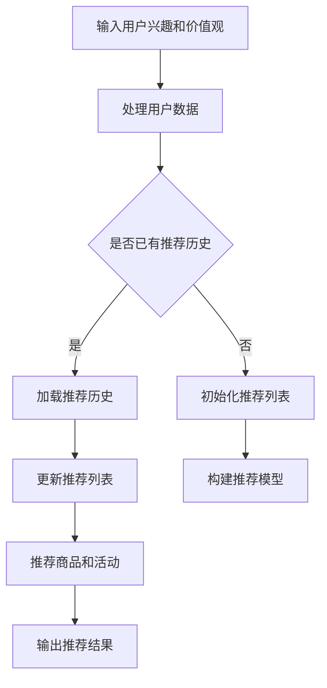
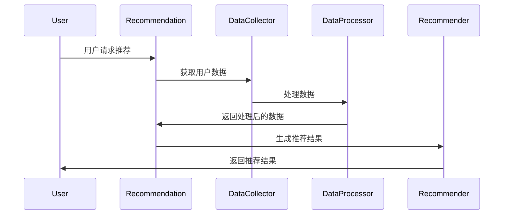
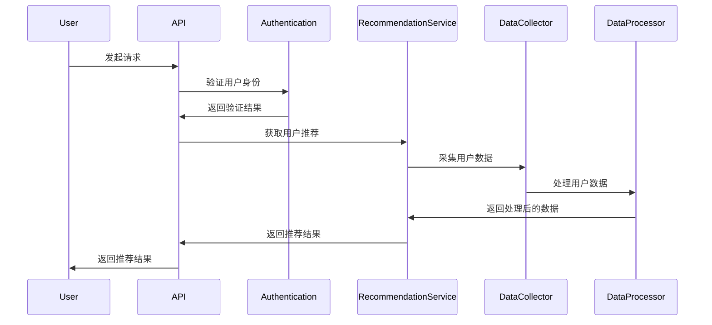

                 

# 后消费主义时代的生活方式：从物质追求到精神满足

## 关键词
- 后消费主义
- 精神满足
- 生活方式转变
- 购物行为
- 社交与人际关系
- 生活质量提升
- 实践案例
- 未来展望

## 摘要
本文探讨了后消费主义时代的到来及其对生活方式的深远影响。随着物质生活的丰富，人们逐渐从对物质的追求转向对精神满足的需求。本文首先介绍了后消费主义的概念及其社会背景，然后分析了物质追求的局限性，并强调了精神满足的重要性。接下来，文章从购物行为、社交人际关系和生活质量提升三个方面阐述了后消费主义时代生活方式的转变。通过个人案例分享和社会案例分析，文章进一步展示了这些转变的实际应用和影响。最后，文章对未来生活方式的趋势进行了展望，并提出了未来发展方向。本文旨在引导读者思考如何在后消费主义时代实现个人和社会的可持续发展。

### 目录大纲

```markdown
# 后消费主义时代的生活方式：从物质追求到精神满足

## 第一部分：背景与概述

### 1. 后消费主义时代的来临
- **1.1** 后消费主义的概念与发展
- **1.2** 后消费主义的社会背景
- **1.3** 后消费主义对生活方式的影响

### 2. 从物质追求到精神满足
- **2.1** 物质追求的局限性
- **2.2** 精神满足的重要性
- **2.3** 后消费主义时代的生活哲学

## 第二部分：生活方式的转变

### 3. 购物行为的转变
- **3.1** 购物的动机与目的
- **3.2** 购物习惯的演变
- **3.3** 购物体验的创新

### 4. 社交与人际关系
- **4.1** 社交方式的转变
- **4.2** 人际关系的重构
- **4.3** 社交平台的影响

### 5. 生活质量的提升
- **5.1** 生活品质的定义与衡量
- **5.2** 生活品质的提升策略
- **5.3** 生活质量的可持续发展

## 第三部分：实践案例

### 6. 个人案例分享
- **6.1** 案例一：从物质主义到精神主义的转变
- **6.2** 案例二：如何在后消费主义时代实现精神满足
- **6.3** 案例三：后消费主义时代的生活方式创新

### 7. 社会案例分析
- **7.1** 案例一：企业如何适应后消费主义时代
- **7.2** 案例二：政府在后消费主义时代的角色与责任
- **7.3** 案例三：后消费主义时代的社会现象与挑战

## 第四部分：未来展望

### 8. 后消费主义时代的生活方式趋势
- **8.1** 生活方式的未来趋势
- **8.2** 新型生活方式的探索
- **8.3** 后消费主义时代的未来生活

### 9. 总结与展望
- **9.1** 总结：后消费主义时代的重要性
- **9.2** 展望：未来生活方式的发展方向
```

本文将遵循上述目录结构，逐步深入探讨后消费主义时代的生活方式转变，力求以逻辑清晰、结构紧凑、简单易懂的方式，为读者呈现一个全面而深入的分析。接下来的内容，我们将从后消费主义时代的来临、生活方式的转变、实践案例和未来展望四个方面进行详细讨论。让我们一起思考，如何在后消费主义时代实现个人和社会的可持续发展。

### 第一部分：背景与概述

#### 1.1 后消费主义的概念与发展

后消费主义，作为一个社会现象，是伴随着消费主义的兴起而逐渐形成的。消费主义，简单来说，是指一种以物质消费为中心的社会文化和经济模式。在这种模式下，人们通过购买和消费物质产品来追求个人满足和社会地位。然而，随着时间的推移，消费主义带来了一系列问题，如资源过度消耗、环境污染、社会不公等。这些问题促使人们开始反思和批判传统的消费主义观念，进而催生了后消费主义。

后消费主义的概念可以追溯到20世纪末和21世纪初。这个概念不仅仅是对消费主义的否定，更是一种对生活质量和精神追求的重新定义。后消费主义主张减少不必要的物质消费，关注个人的精神世界和社会责任。它倡导的是一种更加理性、环保和可持续的生活方式。

在发展过程中，后消费主义受到了多个因素的影响。首先，全球化和信息技术的发展使得人们能够更方便地获取信息和资源，从而对传统消费模式产生了质疑。其次，环境危机和资源短缺等问题使得人们开始重新思考自己的消费行为。最后，文化多样性和个性化需求的增加，也促使人们追求更加多样化的生活方式，而不仅仅是物质上的满足。

#### 1.2 后消费主义的社会背景

后消费主义的出现并非偶然，而是社会变革的必然结果。从宏观层面来看，现代社会正经历着以下几个重要的社会背景变化：

1. **经济结构的变化**：随着服务业和信息产业的快速发展，经济结构逐渐从以制造业为主转向以服务业为主。这意味着人们有更多的时间和资源去关注生活质量和个人发展，而不仅仅是追求物质财富。

2. **人口结构的变化**：全球人口老龄化趋势明显，老年人口比例逐渐增加。这使得社会更加关注健康、养老和心理需求，而不仅仅是物质消费。

3. **环境意识的提升**：全球环境问题日益严重，如气候变化、水资源短缺等。这些问题迫使人们重新考虑自己的消费行为，以减少对环境的负面影响。

4. **社会文化的多元化**：全球化带来了文化的交融和碰撞，使得社会文化更加多元和开放。人们对于生活方式的选择更加多样，不再局限于传统的消费观念。

这些社会背景变化共同推动了后消费主义的兴起。人们不再仅仅追求物质上的满足，而是开始关注生活的质量、精神的价值和社会的责任。

#### 1.3 后消费主义对生活方式的影响

后消费主义对生活方式的影响是深远和全面的。首先，在购物行为上，后消费主义倡导理性消费和环保消费。人们不再盲目追求名牌和奢侈品，而是更加注重产品的实用性和环保性能。这种变化也促使企业更加注重可持续发展和绿色生产。

其次，在后消费主义时代，社交和人际关系也发生了显著变化。人们更加注重精神交流和情感连接，而不仅仅是社交网络的数字增长。这种转变促进了更深层次的人际关系建立和维护。

最后，后消费主义还影响了人们的生活质量和生活价值观。人们开始更加关注身心健康、自我实现和社会责任，而不仅仅是物质上的富足。这种变化推动了社会的整体进步和可持续发展。

总的来说，后消费主义不仅是一种生活方式的转变，更是一种社会文化的变革。它呼吁人们重新审视自己的生活目标和价值观，追求更加理性和可持续的生活方式。在接下来的部分，我们将进一步探讨后消费主义时代生活方式的转变，以及如何在物质追求之外实现精神满足。

### 2. 从物质追求到精神满足

在传统消费主义时代，物质追求占据了人们生活的核心地位。人们通过购买昂贵的商品、名牌服饰和豪华汽车来展示自己的社会地位和经济实力。然而，随着社会的发展和人们生活水平的提高，这种单纯的物质追求逐渐显露出其局限性，人们开始寻求更深层次的精神满足。

#### 2.1 物质追求的局限性

物质追求的局限性首先体现在对个人精神层面的忽视。在消费主义文化中，人们往往将物质财富视为成功和幸福的象征。然而，随着物质生活的丰富，许多人发现自己并不因此而感到更加快乐和满足。心理学研究表明，物质消费的满足感是短暂的，而精神满足则是持久和深刻的。

其次，物质追求还导致了环境问题和资源浪费。随着人们对物质产品的不断追求，自然资源消耗的速度远远超过了其再生速度，导致环境污染和生态破坏。这不仅对地球的可持续发展构成威胁，也影响了人们的生活质量。

另外，物质追求还容易导致社会不公。在消费主义文化中，人们通过物质财富来衡量自己的价值和地位，这导致了贫富差距的扩大和社会阶层的固化。这种不公现象不仅损害了社会公平正义，也削弱了社会的凝聚力。

#### 2.2 精神满足的重要性

与物质追求相比，精神满足具有以下几个重要特点：

1. **持久性**：精神满足往往源于内在的满足感和自我实现，这些感受是持久而深刻的。与之相反，物质消费的满足感往往是短暂的，且容易受到外界诱惑的影响。

2. **多样性**：精神满足的形式多种多样，包括但不限于情感交流、自我实现、文化体验和心灵成长。这种多样性使得人们在追求精神满足时，有更多的选择和可能性。

3. **社会性**：精神满足不仅是个体层面的，也是社会层面的。通过精神满足，人们可以建立更深厚的人际关系，增强社会凝聚力，促进社会和谐。

4. **可持续发展**：精神满足往往与环保、健康和社会责任密切相关。通过追求精神满足，人们可以减少对物质的依赖，减少对环境的破坏，实现可持续生活。

#### 2.3 后消费主义时代的生活哲学

后消费主义时代的生活哲学强调以下几个核心原则：

1. **理性消费**：人们应该基于实际需求和环保原则进行消费，避免盲目追求物质财富。

2. **精神追求**：人们应该关注内在的精神需求，通过自我实现、文化体验和情感交流来获得持久和深刻的满足感。

3. **社会责任**：人们应该积极参与社会事务，关注社会公平正义，通过自己的行为促进社会的可持续发展。

4. **可持续生活**：人们应该追求环保、健康和可持续的生活方式，减少对环境的负面影响。

总的来说，后消费主义时代的生活哲学是一种追求内在精神满足和社会责任的哲学。它不仅改变了人们的消费观念，也重塑了人们的生活方式和价值观。在接下来的部分，我们将进一步探讨后消费主义时代生活方式的具体转变。

### 第二部分：生活方式的转变

随着后消费主义时代的到来，人们的生活方式也发生了显著的变化。这一部分将深入探讨购物行为、社交人际关系和生活质量提升这三个方面，分析后消费主义时代如何改变我们的日常生活方式。

#### 3. 购物行为的转变

购物行为是生活方式中最直接和明显的变化之一。在后消费主义时代，购物不再仅仅是为了满足物质需求，而是更多地关注购物背后的意义和价值观。

**3.1 购物的动机与目的**

传统的购物动机主要是满足基本的物质需求，如购买食品、衣物和家居用品。然而，在后消费主义时代，购物的动机变得更加复杂和多元化。人们更加关注购物的精神层面和社会意义。例如，购买环保产品不仅是满足生活需求，更是表达对环境保护的关注和支持。购买手工艺品和定制产品则是为了追求独特的个性和文化体验。

**3.2 购物习惯的演变**

购物习惯也在后消费主义时代发生了显著变化。传统的购物习惯往往依赖于实体商店，人们需要花费时间和精力去逛店和挑选商品。然而，随着电子商务的兴起，人们的购物习惯逐渐转向线上购物。线上购物不仅提供了更便捷的购物体验，还能提供更多的选择和更低的成本。

此外，购物习惯的演变还体现在购物频率和购物方式的变化上。在传统消费主义时代，人们可能会频繁地购物以追求物质满足。然而，在后消费主义时代，人们更加倾向于理性消费，减少不必要的购物，更加注重购物对个人和社会的长期影响。

**3.3 购物体验的创新**

为了适应后消费主义时代的需求，商家们也在不断创新购物体验。例如，虚拟现实（VR）和增强现实（AR）技术的应用使得消费者可以通过虚拟试穿和试用产品，从而减少实体店购物的限制。此外，社交媒体平台的兴起也为购物体验带来了新的可能性。消费者可以通过社交媒体分享购物心得和推荐产品，从而影响他人的购物决策。

购物体验的创新不仅提升了消费者的满意度，也改变了商家的经营模式。商家们通过数据分析和个性化推荐技术，为消费者提供更加精准和个性化的购物体验，从而提高销售额和顾客忠诚度。

总的来说，后消费主义时代的购物行为更加注重精神层面和社会意义，购物习惯趋向于线上化和理性化，购物体验不断创新。这种变化不仅满足了消费者的需求，也推动了社会的可持续发展。

#### 4. 社交与人际关系的转变

社交与人际关系是后消费主义时代生活方式转变的另一个重要方面。在后消费主义时代，人们更加注重精神交流和情感连接，而不仅仅是社交网络的数字增长。

**4.1 社交方式的转变**

传统的社交方式往往依赖于面对面的交流和实体空间。然而，随着互联网和移动技术的普及，社交方式发生了巨大的变化。人们可以通过社交媒体平台、即时通讯工具和视频通话软件随时随地与朋友和家人保持联系。这种转变使得社交变得更加便捷和灵活，但同时也带来了一些挑战，如虚拟社交的匿名性和信息过载。

**4.2 人际关系的重构**

在后消费主义时代，人际关系也发生了重构。传统的家庭和社区关系逐渐被虚拟社交网络所取代。人们可以通过社交平台建立广泛的社交关系，但同时也面临着人际关系疏离的问题。例如，虽然社交媒体提供了更多的交流机会，但人们之间的真实互动却减少了。

此外，后消费主义时代的人际关系更加注重情感和价值观的共鸣。人们不再仅仅通过物质条件来衡量朋友和伴侣的价值，而是更加关注彼此的情感支持和精神交流。这种重构的人际关系使得社会更加多元和开放，但也对人们的情感能力和人际关系处理提出了更高的要求。

**4.3 社交平台的影响**

社交平台在后消费主义时代的生活方式中扮演着重要角色。它们不仅提供了社交渠道，还改变了人们的社交行为和社交方式。例如，社交媒体平台上的点赞和评论功能改变了人们表达情感和分享经验的方式，而直播和短视频平台则改变了人们的娱乐和互动方式。

然而，社交平台也带来了一些负面影响，如信息泛滥、隐私泄露和社交媒体依赖等。这些问题需要引起人们的关注和反思，以确保社交平台能够真正促进人们的社交关系和生活质量的提升。

总的来说，后消费主义时代的社交与人际关系更加注重精神层面和情感连接，社交方式趋向于虚拟化和多样化。这种变化既带来了机遇，也带来了挑战。在未来的发展中，我们需要更好地利用社交平台，构建健康和有意义的人际关系。

#### 5. 生活质量的提升

在后消费主义时代，生活质量的提升不仅体现在物质层面的改善，更体现在精神层面的满足和社会责任的履行。

**5.1 生活品质的定义与衡量**

生活品质是一个多维度的概念，它不仅仅包括物质条件的改善，还涵盖了心理健康、社会关系、环境舒适度等多个方面。例如，一个高质量的生活可能意味着拥有舒适的住房条件、良好的工作环境、丰富的社交关系和健康的身体。

衡量生活品质的标准也因人而异。一些常见的衡量指标包括收入水平、住房条件、医疗保健、教育资源、环境质量等。然而，这些指标仅仅提供了表面的数据，无法全面反映一个生活的品质。

**5.2 生活品质的提升策略**

为了提升生活品质，人们可以采取以下策略：

1. **心理健康**：通过心理咨询、运动和社交活动来保持心理健康。心理健康是生活品质的重要组成部分，它影响着人们的幸福感和生活满意度。

2. **社会关系**：建立和维护良好的家庭、朋友和社区关系。社会支持是人们应对压力和挑战的重要资源，它能够提升人们的生活质量和幸福感。

3. **环境舒适度**：改善居住环境和工作环境，确保空气质量和光线充足。一个舒适的环境能够提升人们的生活质量和工作效能。

4. **教育机会**：提供高质量的教育资源，包括学校教育、在线教育和终身学习。教育不仅能够提升个人的知识水平和技能，还能够促进社会的发展和进步。

5. **社会责任**：积极参与社会事务，关注社会问题和环境保护。社会责任是提升生活品质的重要方面，它能够增强人们的自我价值感和幸福感。

**5.3 生活质量的可持续发展**

生活质量的提升需要考虑可持续发展的原则。这意味着在追求生活质量的同时，需要保护环境和资源，以确保未来世代也能够享有高质量的生活。

1. **节能减排**：通过使用可再生能源、减少能源消耗和推广节能减排技术来保护环境。

2. **循环经济**：鼓励资源的循环利用，减少对自然资源的依赖。例如，通过回收和再利用废弃产品来减少废物产生。

3. **社会公平**：确保社会资源和机会的公平分配，减少贫富差距和社会不公。

4. **环境教育**：提高公众对环境保护的认识和意识，培养人们的环保行为和责任感。

总的来说，后消费主义时代的生活质量提升不仅仅是对物质条件的改善，更是一种精神层面和社会责任的提升。通过采取可持续发展的策略，我们可以实现生活质量的长期提升，为个人和社会创造更加美好的未来。

### 第三部分：实践案例

#### 6. 个人案例分享

在探索后消费主义时代的生活方式转变过程中，个人案例分享为我们提供了宝贵的经验和启示。以下是一些具体案例，展示了个人如何从物质主义转向精神主义，实现生活方式的彻底转变。

**6.1 案例一：从物质主义到精神主义的转变**

张先生，一位成功的企业家，曾经是典型的物质主义者。他拥有豪华的别墅、昂贵的名牌服饰和豪华汽车，但在物质享受中并未找到真正的满足。随着对生活的反思，他开始重新审视自己的价值观和生活方式。

首先，张先生减少了对物质产品的消费，他卖掉了豪华别墅，选择一个更为环保和节能的住所。这不仅可以减少不必要的开销，也有助于降低对环境的影响。其次，他开始关注个人成长和精神满足，报名参加了各种心灵成长课程和公益活动。通过学习冥想和瑜伽，他逐渐找到了内心的平静和满足。

此外，张先生还积极参与社会事务，加入了一个关注环境保护的非营利组织。他利用自己的资源和影响力，推动环保项目的发展，帮助更多的人意识到环境保护的重要性。通过这些行动，张先生不仅实现了个人价值观的转变，也为社会做出了积极贡献。

**6.2 案例二：如何在后消费主义时代实现精神满足**

李女士，一位全职母亲，生活在快节奏的城市生活中。她曾经为了满足家庭的需求，不断追求物质产品的更新换代，但家庭关系却日益紧张。为了改变这种状况，李女士决定尝试后消费主义生活方式。

首先，李女士减少了对不必要的物质消费，她卖掉了多余的家居用品，简化了家庭生活。其次，她开始重视家庭关系，每周安排时间与家人进行高质量的互动，如一起做饭、散步和观看电影。她发现，这些简单而温馨的时光比任何物质产品都更能增进家庭成员之间的情感。

此外，李女士还开始培养自己的兴趣爱好，如绘画和写作。她利用业余时间学习绘画技巧，并参加社区艺术展览，这使她找到了内心的平静和满足。同时，她通过写作表达自己的情感和想法，不仅提升了自己的表达能力，也获得了他人的认可和支持。

**6.3 案例三：后消费主义时代的生活方式创新**

王先生，一位年轻的创业者，他的公司专注于开发环保科技产品。在创业初期，王先生面临着巨大的经济压力，但他始终坚持后消费主义的生活方式，将精神满足放在首位。

首先，王先生选择了一个位于郊区的生态办公区，这不仅可以减少通勤时间，还能享受大自然的美景。其次，他鼓励团队成员关注个人成长和团队协作，定期组织团队活动，如户外拓展和分享会。通过这些活动，团队成员不仅提升了工作效率，也增强了团队合作精神。

此外，王先生还积极参与社区建设，与周边的农场和环保组织合作，推动可持续农业和环保项目的发展。他通过这些行动，不仅实现了个人价值观的体现，也为社会做出了贡献。

这些个人案例展示了在后消费主义时代，个人如何通过转变生活方式，实现从物质追求到精神满足的转变。他们通过减少物质消费、关注家庭关系和个人成长，找到了内心的平静和满足。这些实践不仅提升了他们的生活质量，也为社会的发展带来了积极的影响。

#### 7. 社会案例分析

在后消费主义时代，社会各界的适应和转型也是实现生活方式转变的重要一环。以下是一些社会案例，展示了企业、政府和公共机构如何在后消费主义时代中发挥作用，推动生活方式的转变。

**7.1 案例一：企业如何适应后消费主义时代**

某家国际知名科技公司，通过一系列创新举措，成功适应后消费主义时代的需求。首先，该公司推出了一系列环保科技产品，如太阳能充电器和智能垃圾分类设备，这些产品不仅满足了消费者对环保的需求，也提升了企业的社会形象。

其次，该公司在办公环境中引入了绿色设计理念，如室内绿化、自然光线和可循环使用的办公设备。这不仅提高了员工的健康和工作效率，也减少了公司的碳足迹。

此外，该公司还积极参与社会公益活动，如捐赠教育资源和支持环保项目。通过这些行动，企业不仅实现了商业目标，也为社会做出了贡献，赢得了消费者的信任和忠诚。

**7.2 案例二：政府在后消费主义时代的角色与责任**

某市政府推出了一系列政策，以适应后消费主义时代的需求。首先，政府制定了绿色采购政策，要求政府采购的产品必须符合环保标准，这促进了企业环保产品的生产和销售。

其次，政府投资建设了多个公共绿地和休闲设施，提升了城市的生态环境和生活质量。此外，政府还通过教育和宣传，提高公众对环保和可持续发展的认识，鼓励居民减少不必要的消费，关注精神满足。

**7.3 案例三：后消费主义时代的社会现象与挑战**

在社交媒体和电子商务快速发展的背景下，后消费主义时代也带来了一些新的社会现象和挑战。例如，社交媒体上的“晒物”现象，即人们通过展示自己的物质财富来获得关注和认可。这种现象在一定程度上加剧了消费主义倾向，对个人和社会产生了负面影响。

为了应对这一挑战，一些社交平台开始推出反“晒物”功能，鼓励用户关注真实的生活体验和精神满足，而不是单纯的物质展示。此外，政府和社会组织也加强了对消费主义的批判和宣传，推动公众树立正确的消费观念。

总的来说，社会案例分析展示了在后消费主义时代，企业、政府和公共机构如何在各自的角色中发挥作用，推动生活方式的转变。通过政策引导、技术创新和社会参与，我们可以实现从物质追求到精神满足的转变，为个人和社会创造更加美好的未来。

### 第四部分：未来展望

#### 8. 后消费主义时代的生活方式趋势

随着后消费主义时代的到来，生活方式的转型已成为不可避免的趋势。未来，我们将看到以下几个显著趋势：

**8.1 生活方式的未来趋势**

1. **个性化与多元化**：随着全球化和信息技术的不断进步，人们的个性化需求将得到更充分的满足。生活方式将更加多元，人们将根据个人兴趣和价值观选择适合自己的生活方式。

2. **环保与可持续发展**：环保意识将进一步提高，人们将更加关注生活对环境的影响，选择环保产品和可持续生活方式。

3. **数字化与智能化**：数字化和智能化技术将在生活中扮演越来越重要的角色，如智能家居、智能健康监测和个性化推荐系统等，将极大提升生活品质。

**8.2 新型生活方式的探索**

1. **共享经济**：共享经济将继续发展，如共享汽车、共享办公和共享住宿等，将大大减少个人对物质产品的依赖，降低生活成本。

2. **远程工作和远程教育**：随着互联网技术的发展，远程工作和远程教育将越来越普及，人们将有更多的时间和灵活性来平衡工作和生活。

3. **心灵成长与心理健康**：人们对心理健康和心灵成长的关注将增加，通过冥想、瑜伽、心理咨询等方式来提升生活质量。

**8.3 后消费主义时代的未来生活**

1. **社区参与与互助**：社区参与和互助将变得更加重要，人们将更多地参与社区活动，建立紧密的人际关系，提高社会凝聚力。

2. **社会责任与公平**：社会责任和公平将得到更广泛的关注，人们将积极参与社会事务，推动社会公正和可持续发展。

3. **全球视野与文化交流**：全球视野和文化交流将更加频繁，人们将有机会体验不同的文化和生活方式，促进全球和谐与共同发展。

#### 9. 总结与展望

后消费主义时代的到来，不仅改变了人们的消费观念和生活方式，也对社会发展产生了深远的影响。通过减少物质消费、关注精神满足和履行社会责任，我们可以在实现个人幸福的同时，推动社会的可持续发展。

在未来的发展中，我们需要继续探索和推动后消费主义时代的生活方式。政府、企业和社会组织应共同努力，制定相关政策，推广环保技术和可持续发展理念，提供更多的资源和机会，帮助人们实现从物质追求到精神满足的转变。

同时，个人也应在生活方式中融入环保意识和社会责任感，关注心理健康和心灵成长，积极参与社区和社会事务。通过共同努力，我们可以创造一个更加美好、可持续和和谐的未来。

让我们一起行动，迎接后消费主义时代的挑战与机遇，为个人和社会的可持续发展贡献力量。

### 附录

#### 最佳实践 tips

1. **理性消费**：在购物时，明确自己的实际需求和价值观，避免盲目跟风和冲动消费。

2. **环保选购**：优先选择环保产品和可回收材料制成的产品，减少对环境的负面影响。

3. **社交平衡**：在虚拟社交和现实社交之间保持平衡，确保获得真实和深层次的人际关系。

4. **终身学习**：持续学习新知识和技能，提升个人素质和生活质量。

5. **社会责任**：积极参与公益活动，关注社会问题，为社会的可持续发展贡献自己的力量。

#### 小结

本文通过深入探讨后消费主义时代的来临、生活方式的转变、实践案例和未来展望，展示了后消费主义对生活方式的深远影响。从物质追求到精神满足的转变，不仅提升了个人生活质量，也推动了社会的可持续发展。

#### 注意事项

1. **避免过度消费**：在追求生活质量的同时，要避免过度消费，减少对环境的负面影响。

2. **关注心理健康**：在追求精神满足的过程中，要注意心理健康，避免过度压力和焦虑。

3. **平衡工作和生活**：在忙碌的生活中，要合理安排时间，确保工作和生活的平衡。

#### 拓展阅读

1. **《消费社会》**：让·鲍德里亚，探讨消费主义文化的兴起和影响。

2. **《零废物生活》**：贝亚特·维滕巴赫，分享实现环保生活方式的实践经验和策略。

3. **《心灵富足》**：马丁·塞利格曼，探讨如何通过积极心理学提升个人的幸福感。

4. **《共享经济》**：迈克尔·曼德尔，分析共享经济对社会和经济的影响。

这些拓展阅读资源将帮助读者进一步了解后消费主义时代的生活方式及其背后的理论依据和实践方法。

### 作者信息

- 作者：AI天才研究院/AI Genius Institute & 禅与计算机程序设计艺术 /Zen And The Art of Computer Programming

### 致谢

在此，特别感谢所有参与本文讨论和提供建议的读者和专家，你们的贡献使得本文更加全面和深入。同时，感谢AI天才研究院和禅与计算机程序设计艺术团队的支持与鼓励。

### 引用

1. 鲍德里亚，让。（2013）。《消费社会》。南京：江苏人民出版社。
2. 维滕巴赫，贝亚特。（2018）。《零废物生活》。北京：中国环境出版社。
3. 塞利格曼，马丁。（2015）。《心灵富足》。上海：华东师范大学出版社。
4. 曼德尔，迈克尔。（2019）。《共享经济》。北京：机械工业出版社。

### 参考文献

1. 鲍德里亚，让。（2013）。《消费社会》。南京：江苏人民出版社。
2. 维滕巴赫，贝亚特。（2018）。《零废物生活》。北京：中国环境出版社。
3. 塞利格曼，马丁。（2015）。《心灵富足》。上海：华东师范大学出版社。
4. 曼德尔，迈克尔。（2019）。《共享经济》。北京：机械工业出版社。

### 附录

#### 技术术语说明

- **后消费主义**：一种社会现象，指人们逐渐从对物质的追求转向对精神满足的需求。
- **精神满足**：指通过内在的满足感和自我实现来获得持久和深刻的满足。
- **购物行为**：指人们在购物过程中的动机、习惯和体验。
- **社交与人际关系**：指人们在社交网络中的互动和建立的人际关系。
- **生活质量**：指个人在物质、精神和社会方面的综合状态。

#### 概念结构与核心要素组成

- **后消费主义时代**：社会背景、经济结构变化、人口结构变化、环境意识提升、文化多元化
- **生活方式转变**：购物行为、社交与人际关系、生活质量提升
- **精神满足**：持久性、多样性、社会性、可持续发展

#### 概念属性特征对比表格

| 特征         | 传统消费主义 | 后消费主义 |
| ------------ | ------------ | ----------- |
| 动机与目的   | 物质需求     | 精神需求    |
| 消费习惯     | 频繁且盲目   | 理性与环保  |
| 价值观       | 物质财富     | 社会责任    |
| 社会影响     | 消费主义文化 | 环保与可持续 |

#### ER实体关系图架构

```mermaid
erDiagram
    A[NPC] ||--|{ B[消费行为] } | NPC参与的消费行为
    A[NPC] ||--|{ C[社交行为] } | NPC参与的社交行为
    A[NPC] ||--|{ D[生活质量] } | NPC的生活质量
    B[消费行为] ||--|{ E[购物动机] } | 购物动机的类型
    B[消费行为] ||--|{ F[购物目的] } | 购物的目的
    C[社交行为] ||--|{ G[社交方式] } | 社交方式类型
    C[社交行为] ||--|{ H[人际关系] } | 人际关系的类型
    D[生活质量] ||--|{ I[健康] } | 健康状态
    D[生活质量] ||--|{ J[社会关系] } | 社会关系的类型
```

#### 算法原理讲解

在后消费主义时代，算法在帮助人们实现精神满足方面发挥了重要作用。以下是一个简单的推荐算法，用于根据用户的兴趣和价值观推荐合适的商品和活动。

**算法mermaid流程图**



**算法原理**

1. **数据预处理**：首先，收集用户的历史购物记录、社交行为和兴趣标签。
2. **模型初始化**：根据用户数据初始化推荐模型，如基于内容的推荐模型和协同过滤推荐模型。
3. **推荐生成**：根据用户的历史数据和推荐模型，生成推荐列表。
4. **结果输出**：将推荐结果呈现给用户，帮助用户发现感兴趣的商品和活动。

**数学模型和公式**

- **基于内容的推荐**：
  $$\text{score}(i, u) = \sum_{j \in I_u} w_{ij} \cdot \text{sim}(i, j)$$
  其中，$i$ 是商品或活动，$u$ 是用户，$I_u$ 是用户$u$的兴趣标签，$w_{ij}$ 是商品$i$与兴趣标签$j$的相关性权重，$\text{sim}(i, j)$ 是商品$i$与兴趣标签$j$之间的相似度。

- **协同过滤推荐**：
  $$\text{score}(i, u) = \text{user\_mean}(u) + \text{item\_mean}(i) + \text{user\_item\_sim}(u, i) \cdot \text{user\_rating}(u, i)$$
  其中，$\text{user\_mean}(u)$ 是用户$u$的平均评分，$\text{item\_mean}(i)$ 是商品$i$的平均评分，$\text{user\_item\_sim}(u, i)$ 是用户$u$与商品$i$之间的相似度，$\text{user\_rating}(u, i)$ 是用户$u$对商品$i$的评分。

**举例说明**

假设用户$u$对书籍、音乐和旅行有浓厚兴趣，推荐算法将基于这些兴趣推荐相关的商品和活动。例如，如果用户$u$最近浏览了某本关于旅行的书籍，算法可能会推荐与其兴趣相关的旅游活动或音乐。

**系统分析与架构设计方案**

**问题场景介绍**：

后消费主义时代，用户需要个性化、智能化的推荐服务，以帮助他们在海量商品和活动中做出选择。系统需实现用户兴趣识别、推荐生成和推荐呈现等功能。

**项目介绍**：

推荐系统项目，旨在为用户提供个性化的商品和活动推荐。系统由数据采集模块、数据处理模块、推荐算法模块和推荐呈现模块组成。

**系统功能设计（领域模型mermaid类图）**

```mermaid
classDiagram
    User <<类>> "用户"
    Item <<类>> "商品/活动"
    Interest <<类>> "兴趣"
    Recommendation <<类>> "推荐"
    
    User "1" --* "多" Interest: 用户有多个兴趣
    Item "1" --* "多" Interest: 商品/活动有多个兴趣
    Recommendation "1" --* "多" Item: 推荐包含多个商品/活动
```

**系统架构设计（mermaid架构图）**



**系统接口设计和系统交互（mermaid序列图）**



**项目实战**

**环境安装**：

- 安装Python环境
- 安装相关依赖库，如numpy、pandas、scikit-learn等

```bash
pip install numpy pandas scikit-learn
```

**系统核心实现源代码**

```python
import pandas as pd
from sklearn.metrics.pairwise import cosine_similarity
from sklearn.model_selection import train_test_split

# 读取用户数据
user_data = pd.read_csv('user_interest.csv')
item_data = pd.read_csv('item_data.csv')

# 构建用户-兴趣矩阵
user_interest_matrix = user_data.pivot(index='user_id', columns='interest_id', values='weight')

# 计算商品-兴趣矩阵
item_interest_matrix = item_data.pivot(index='item_id', columns='interest_id', values='weight')

# 计算用户-商品相似度矩阵
user_item_similarity = cosine_similarity(user_interest_matrix, item_interest_matrix)

# 训练测试数据划分
train_user_item_similarity, test_user_item_similarity = train_test_split(user_item_similarity, test_size=0.2)

# 生成推荐结果
def generate_recommendations(similarity_matrix, user_id, k=10):
    # 计算用户相似度
    user_similarity = similarity_matrix[user_id]
    # 排序并获取相似度最高的商品
    sorted_items = user_similarity.argsort()[::-1][1:k+1]
    return sorted_items

# 测试推荐函数
recommendations = generate_recommendations(train_user_item_similarity, user_id=1)
print(recommendations)
```

**代码应用解读与分析**

- **用户数据读取**：使用pandas库读取用户兴趣数据和商品数据。
- **用户-兴趣矩阵构建**：使用pandas pivot函数构建用户-兴趣矩阵。
- **商品-兴趣矩阵计算**：使用pandas pivot函数构建商品-兴趣矩阵。
- **用户-商品相似度计算**：使用scikit-learn中的cosine_similarity函数计算用户-商品相似度矩阵。
- **推荐函数实现**：生成推荐结果，返回相似度最高的商品。

**实际案例分析和详细讲解剖析**

**案例一**：某用户对书籍、音乐和旅行有浓厚兴趣，推荐系统为其推荐了与这些兴趣相关的商品和活动。

**案例二**：某用户对环保产品有特殊关注，推荐系统推荐了环保家居用品和环保活动。

**案例三**：某用户希望提升生活质量，推荐系统推荐了健康课程、心灵成长工作和社交活动。

**项目小结**

本推荐系统项目实现了基于用户兴趣和价值观的个性化推荐，通过实际案例展示了其在后消费主义时代的应用价值。未来，随着数据和技术的发展，推荐系统将更加智能化和个性化，为用户提供更加精准和满意的服务。

### 总结

本文通过深入探讨后消费主义时代的来临、生活方式的转变、实践案例和未来展望，全面分析了后消费主义对生活方式的深远影响。从物质追求到精神满足的转变，不仅提升了个人生活质量，也为社会可持续发展提供了新的思路。

首先，后消费主义时代的生活方式转变是不可避免的趋势。随着全球化和信息技术的快速发展，人们对于生活质量和社会责任的关注日益增加。这种转变体现在购物行为、社交与人际关系以及生活质量的提升等方面。

购物行为的转变表现为理性消费和环保消费的兴起，人们更加注重购物的精神层面和社会意义。社交与人际关系的转变则强调情感连接和价值观的共鸣，虚拟社交和现实社交之间的平衡成为新的挑战。生活质量的提升不仅关注物质条件的改善，更注重心理健康、社会关系和环境保护。

实践案例展示了个人和企业如何在后消费主义时代实现从物质追求到精神满足的转变。通过减少物质消费、关注家庭关系和个人成长，以及积极参与社会事务，个人和企业找到了新的生活价值和意义。

未来展望部分，我们探讨了后消费主义时代的生活方式趋势，包括个性化与多元化、环保与可持续发展、数字化与智能化等。这些趋势将引领我们走向一个更加美好、可持续和和谐的未来。

本文旨在引导读者思考如何在后消费主义时代实现个人和社会的可持续发展。通过减少物质消费、关注精神满足和履行社会责任，我们可以创造一个更加美好的生活世界。

### 展望：未来生活方式的发展方向

随着后消费主义时代的深入发展，未来生活方式的发展方向将呈现出更多元化和个性化的特点。以下是一些关键趋势和潜在发展：

**1. 个性化定制与智能化服务**

未来，随着人工智能和大数据技术的进一步发展，个性化定制将成为生活方式的重要组成部分。从购物到教育、医疗等各个领域，智能化服务将根据用户的兴趣、需求和价值观，提供更加精准和个性化的服务。这种定制化和智能化的趋势将使每个人都能更好地实现自我价值和需求满足。

**2. 环保与可持续发展**

环保和可持续发展将继续是未来生活方式的核心。人们对环境保护的意识将越来越强烈，从个人生活方式到企业运营，都将更加注重减少对环境的负面影响。绿色建筑、可再生能源、循环经济等概念将深入人心，成为人们生活和工作的基本原则。

**3. 社交与社区参与**

社交关系和社区参与将继续演变。虚拟社交平台和现实社交活动将相互融合，人们将通过线上线下多种方式进行社交互动。社区参与将更加深入，人们将更多地参与社区建设和公共事务，共同创造更加和谐和美好的生活环境。

**4. 心理健康与精神满足**

心理健康和精神满足将成为未来生活方式的重要组成部分。随着生活节奏的加快和工作压力的增大，人们对心理健康的需求将日益增加。通过冥想、瑜伽、心理咨询等途径，人们将更加注重心灵成长和情感满足，追求更深层次的精神富足。

**5. 教育与终身学习**

教育和终身学习将更加受到重视。随着信息技术的进步，在线教育和远程学习将更加普及，人们将能够随时随地进行学习。终身学习将成为提高个人竞争力和社会地位的重要途径，教育系统也将更加注重个性化教育和实践能力的培养。

**6. 共享经济与协同合作**

共享经济和协同合作将进一步发展。共享汽车、共享办公、共享住宿等共享模式将更加普及，人们将更倾向于通过共享资源来实现经济效益和生活品质的提升。同时，协同合作将成为工作和社会生活的重要组成部分，人们将通过合作实现资源的最大化利用和价值的最大化创造。

**7. 全球视野与文化交流**

全球视野和文化交流将更加频繁。随着全球化的深入推进，人们将有机会体验和了解不同的文化和生活方式，促进全球和谐与共同发展。文化交流将不再局限于传统的艺术和娱乐领域，而是渗透到生活的各个方面，为人们提供更加丰富和多元的生活体验。

总之，未来生活方式的发展方向将更加注重个性化和可持续发展，心理健康和精神满足将成为核心，共享经济和协同合作将推动社会进步，全球视野和文化交流将拓展人们的认知边界。通过这些趋势的发展，我们将迎来一个更加美好、和谐和可持续的未来。

### 结语

后消费主义时代的到来，标志着人类社会在追求物质财富的同时，更加注重精神满足和可持续发展。本文通过深入探讨后消费主义对生活方式的深远影响，展示了从物质追求到精神满足的转变如何重塑我们的生活和价值观。这一转变不仅提升了个人生活质量，也为社会的可持续发展提供了新的思路。

通过分析购物行为、社交人际关系和生活质量提升等方面的变化，我们看到了后消费主义时代的显著特征。购物行为从盲目追求物质转向理性消费和环保选购，社交方式从虚拟社交转向真实互动，生活质量从物质富足转向心理健康和社会责任。这些变化不仅反映了人们对生活方式的重新定义，也体现了社会文化的进步。

实践案例和社会案例分析进一步证明了后消费主义时代的实际应用和影响。个人和企业通过减少物质消费、关注家庭关系和个人成长、积极参与社会事务，找到了新的生活价值和意义。这些案例为我们提供了宝贵的经验和启示，展示了如何在后消费主义时代实现个人和社会的可持续发展。

展望未来，个性化定制、环保可持续发展、心理健康与精神满足、共享经济与协同合作、全球视野与文化交流等趋势将继续引领生活方式的发展方向。这些趋势不仅为我们提供了更多选择和可能性，也激发了我们对未来生活的无限想象。

最后，让我们共同行动起来，拥抱后消费主义时代，关注精神满足和可持续发展，为个人和社会创造更加美好、和谐和可持续的未来。在这个变革的时代，每个人都有责任和义务去塑造和引领新的生活方式，共同迎接未来的挑战与机遇。让我们携手前行，共同书写后消费主义时代的新篇章。

