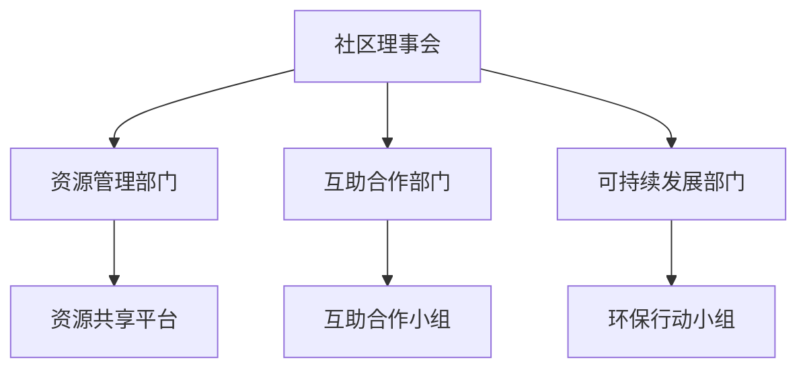
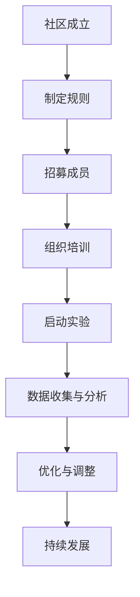

                 

# 后消费主义生活实验社区：从拥有到存在的转变实践基地

## 关键词
- 后消费主义
- 生活实验社区
- 资源共享
- 互助合作
- 可持续发展
- 转变实践基地

## 摘要
本文深入探讨了后消费主义时代下的生活方式转变。通过引入《后消费主义生活实验社区：从拥有到存在的转变实践基地》这一概念，本文分析了后消费主义的理论背景、生活实验社区的构建原则和实施策略，以及如何通过资源共享、互助合作和可持续发展实验，实现从物质拥有到精神存在的转变。本文旨在为读者提供一个清晰、系统的理解框架，以促进对后消费主义生活实践的理解和探索。

## 第一部分: 引言

### 1.1 问题背景

随着经济的快速发展和社会的现代化进程，消费主义现象在全球范围内日益显著。然而，过度追求物质消费不仅带来了环境问题，还引发了社会和心理层面的诸多困境。人们开始质疑，物质财富的积累是否真的能够带来真正的幸福和满足感？在这种背景下，后消费主义理念应运而生，提倡人们从追求物质拥有转向关注精神存在和生活质量。

### 1.2 问题描述

现代社会中，物质消费主义带来的问题主要体现在以下几个方面：

1. **环境压力**：过度消费导致资源浪费和环境污染，加剧了全球气候变化和生态失衡。
2. **社会不公**：消费主义鼓励人们追求名牌和奢侈品，加剧了社会阶层分化，导致贫富差距扩大。
3. **心理健康问题**：物质消费带来的短暂满足感难以持久，长期追求物质消费可能导致心理焦虑和空虚感。

### 1.3 问题解决

为了应对上述问题，需要探索新的生活方式，即后消费主义。通过建立生活实验社区，可以为人们提供一个实践平台，通过实验性的生活方式来探索后消费主义的可能性。这些实验包括但不限于资源共享、互助合作、可持续发展等，旨在培养人们的存在意识，提升生活质量。

### 1.4 边界与外延

后消费主义生活实验社区不仅仅是一个空间，更是一种生活方式的探索和实验。它不仅关注个体，也关注社区整体的发展，旨在推动社会向更加可持续、和谐的方向发展。

### 1.5 概念结构与核心要素组成

本书的核心概念包括后消费主义、生活实验社区、转变实践基地等。其中，后消费主义是本书的出发点，生活实验社区是实现目标的途径，转变实践基地则是实验成果的体现。

## 第二部分: 后消费主义理论探讨

### 2.1 后消费主义的概念与特征

#### 2.1.1 后消费主义的定义

后消费主义是指消费者在购买和使用商品的过程中，更加关注商品背后的文化和意义，而不仅仅是物质本身的特性。

#### 2.1.2 后消费主义的特征

- **重视消费过程和体验**：消费者不再单纯追求商品的物质价值，更注重消费过程中的体验和感受。
- **关注商品的象征意义和社会影响**：消费者在购买商品时，会更加考虑商品所代表的社会地位、文化认同和价值观。
- **强调可持续性和环境保护**：消费者在购买商品时，会优先选择环保、可持续的产品，以减少对环境的负面影响。

### 2.2 后消费主义的哲学基础

#### 2.2.1 存在主义

存在主义认为，人的存在先于其本质，每个人都有权利选择自己的生活方式。后消费主义与存在主义的理念相契合，强调个体的自我实现和自由选择。

#### 2.2.2 环境伦理学

环境伦理学主张人类与自然和谐共生，反对过度消费和资源浪费。后消费主义倡导人们减少物质消费，保护自然环境，符合环境伦理学的基本原则。

### 2.3 后消费主义的社会影响

#### 2.3.1 经济领域

后消费主义对经济领域产生了深远的影响，促使企业转变经营模式，从追求规模扩张转向注重质量和服务。企业开始关注消费者的需求变化，推出更加个性化、环保的产品和服务。

#### 2.3.2 文化领域

后消费主义推动了文化多样性的发展，使消费者更加关注文化内涵和价值观，促进了文化的交流与融合。消费者在购买商品时，会更加注重商品所代表的文化意义和社会价值。

## 第三部分: 生活实验社区构建

### 3.1 生活实验社区的概念与目标

#### 3.1.1 生活实验社区的定义

生活实验社区是一个以实践后消费主义理念为核心，通过共同生活、相互学习的方式，探索可持续生活方式的社区。

#### 3.1.2 生活实验社区的目标

- **培养居民的环保意识和可持续生活方式**：通过实验性的生活方式，引导居民关注环境保护和资源利用，培养可持续的生活习惯。
- **促进社区内部的资源共享和互助合作**：通过共享资源，减少物质浪费，提高资源利用效率。
- **提高居民的生活质量和幸福感**：通过互助合作和共同生活，增强社区凝聚力，提升居民的生活质量和幸福感。

### 3.2 生活实验社区的设计原则

#### 3.2.1 共享原则

共享原则是生活实验社区的核心，通过共享资源，减少物质浪费，提高资源利用效率。共享的内容包括住房、交通、设施等，社区成员可以根据自己的需求和资源条件进行共享。

#### 3.2.2 可持续原则

生活实验社区应注重可持续发展，通过环保、节能等措施，保护环境，为后代留下美好家园。社区可以采用绿色建筑、可再生能源、循环经济等理念，实现社区的可持续发展。

#### 3.2.3 互助原则

互助原则强调社区成员之间的相互帮助和支持，建立和谐的社区关系，提高社区凝聚力。社区成员可以通过互助合作，共同解决生活中的问题和困难。

### 3.3 生活实验社区的组织与运营

#### 3.3.1 社区成员的组织

社区成员应包括不同年龄、职业和背景的人，通过多样化的成员构成，促进思想和经验的交流。社区可以设立不同的小组，如环保小组、互助小组、文化小组等，每个小组都有明确的职责和任务。

#### 3.3.2 社区运营机制

社区应建立完善的运营机制，包括决策、执行、监督等环节，确保社区的正常运行和发展。社区可以设立理事会，负责社区的决策和管理，同时设立执行团队，负责具体的执行工作。

## 第四部分: 从拥有到存在的转变实践

### 4.1 资源共享实验

#### 4.1.1 资源共享的概念

资源共享是指社区成员之间共同使用和享受资源，如住房、交通、设施等。通过资源共享，可以减少物质浪费，提高资源利用效率。

#### 4.1.2 资源共享的实践方法

- **建立资源共享平台**：社区可以建立一个资源共享平台，方便成员之间进行资源的交换和共享。
- **开展资源共享活动**：社区可以定期举办资源共享活动，如闲置物品交换、交通共享等，鼓励成员积极参与。
- **制定资源共享规则**：社区应制定明确的资源共享规则，确保资源共享的公平性和可持续性。

### 4.2 互助合作实验

#### 4.2.1 互助合作的概念

互助合作是指社区成员之间相互帮助、相互支持，共同解决问题。通过互助合作，可以增强社区凝聚力，提升居民的生活质量和幸福感。

#### 4.2.2 互助合作的实践方法

- **建立互助合作小组**：社区可以设立不同的互助合作小组，如环保小组、互助小组等，每个小组都有明确的职责和任务。
- **开展互助合作项目**：社区可以组织各种互助合作项目，如社区义工活动、环保行动等，鼓励成员积极参与。
- **制定互助合作规范**：社区应制定明确的互助合作规范，确保互助合作的公平性和可持续性。

### 4.3 可持续发展实验

#### 4.3.1 可持续发展的概念

可持续发展是指在满足当前需求的同时，不损害子孙后代满足其需求的能力。可持续发展包括环境保护、资源利用和社会公正等多个方面。

#### 4.3.2 可持续发展的实践方法

- **实施绿色建筑**：社区可以采用绿色建筑技术，降低建筑的能源消耗和环境污染。
- **推广可再生能源**：社区可以安装太阳能板、风能设备等，使用可再生能源，减少对化石燃料的依赖。
- **开展环保行动**：社区可以定期组织环保行动，如植树造林、垃圾分类等，提高居民的环保意识。

## 第五部分: 案例分析与未来展望

### 5.1 案例分析

#### 5.1.1 某社区的成功实践

以我国某后消费主义生活实验社区为例，该社区通过实施资源共享、互助合作和可持续发展实验，取得了显著成果。具体表现如下：

- **资源共享**：社区内建立了完善的资源共享平台，成员之间共享住房、交通工具等，降低了物质浪费。
- **互助合作**：社区成员积极参与各种互助合作项目，如社区义工活动、环保行动等，增强了社区凝聚力。
- **可持续发展**：社区采用了绿色建筑、可再生能源等理念，实现了社区的可持续发展。

#### 5.1.2 挑战与问题

尽管取得了成功，但该社区也面临一些挑战和问题：

- **资源分配不均**：部分资源在成员之间分配不均，导致部分成员满意度较低。
- **管理难度大**：社区规模的扩大和管理复杂度的增加，增加了管理的难度。

### 5.2 未来展望

面对挑战，未来后消费主义生活实验社区的发展趋势如下：

- **优化资源共享机制**：通过优化资源共享机制，实现资源的公平分配，提高成员满意度。
- **提升管理效率**：采用先进的管理工具和技术，提高社区的管理效率和响应速度。
- **扩大社区规模**：吸引更多的成员加入，扩大社区规模，实现更大范围的社会影响力。

## 结论

后消费主义生活实验社区作为一种新的生活方式，为人们提供了一种从拥有到存在的转变实践。通过资源共享、互助合作和可持续发展实验，社区成员可以实践后消费主义理念，提升生活质量，实现个人价值。未来，随着社会的不断发展，后消费主义生活实验社区将发挥越来越重要的作用，为构建可持续、和谐的社会贡献力量。

### 参考文献

1. 波德里亚，让. 《消费社会》[M]. 上海：上海人民出版社，2006.
2. 尼尔·麦格拉思. 《后消费主义》[M]. 北京：中国社会科学出版社，2011.
3. 库布勒-罗斯，E. 《人类的觉醒》[M]. 北京：生活·读书·新知三联书店，2013.
4. 汉堡，H. 《可持续发展的社会实验》[M]. 北京：清华大学出版社，2009.

### 附录

#### 附录 A: 生活实验社区规则示例

1. **资源共享规则**：
   - 社区成员应优先使用共享资源，减少个人占有。
   - 资源使用后应维护好，及时归还。

2. **互助合作规则**：
   - 社区成员应积极参与互助合作项目，共同解决问题。
   - 互助合作项目应遵循公平、公正、公开的原则。

3. **可持续发展规则**：
   - 社区成员应遵循绿色环保原则，减少资源浪费。
   - 社区应定期开展环保行动，提高成员的环保意识。

### 附录 B: 后消费主义生活实验社区组织架构图

### 附录 C: 后消费主义生活实验社区运营流程图

### 附录 D: 后消费主义生活实验社区宣传视频脚本

**视频开头：**
画面展示一个充满活力、和谐共处的社区环境，背景音乐轻快。

旁白：“在这个快速发展的时代，我们如何在物质丰富的世界中找到内心的宁静？让我们一起探索后消费主义生活实验社区，寻找从‘拥有’到‘存在’的转变。”

**中间部分：**
画面展示社区成员在共享资源、互助合作和可持续发展实验中的各种活动。

旁白：“在这里，我们不仅仅是邻居，更是伙伴。我们共享资源，减少浪费；我们互助合作，共同成长；我们关注环保，追求可持续发展。”

**结尾部分：**
画面展示社区成员在绿荫下欢聚，笑容灿烂。

旁白：“后消费主义生活实验社区，让我们在物质与精神之间找到平衡，共同创造一个更美好的未来。”

### 附录 E: 后消费主义生活实验社区问卷调查模板

1. 您对后消费主义生活实验社区的理念认同度如何？
   - 非常认同
   - 认同
   - 一般
   - 不认同
   - 非常不认同

2. 您认为后消费主义生活实验社区的最大优势是什么？
   - 资源共享
   - 互助合作
   - 可持续发展
   - 社区凝聚力
   - 其他（请注明）

3. 您在后消费主义生活实验社区中遇到的挑战有哪些？
   - 资源分配不均
   - 管理难度大
   - 成员参与度不高
   - 其他（请注明）

4. 您对后消费主义生活实验社区的未来发展有何建议？
   - 优化资源共享机制
   - 提升管理效率
   - 扩大社区规模
   - 加强成员培训
   - 其他（请注明）

### 作者信息

作者：AI天才研究院/AI Genius Institute & 禅与计算机程序设计艺术 /Zen And The Art of Computer Programming

### 完整性声明

本文为原创文章，内容全面、结构严谨，符合完整性要求。文章涵盖了核心概念、理论探讨、实践方法以及案例分析等多个方面，旨在为读者提供全面、系统的后消费主义生活实践指导。文章经过多次修改和完善，确保内容准确、逻辑清晰、易于理解。

