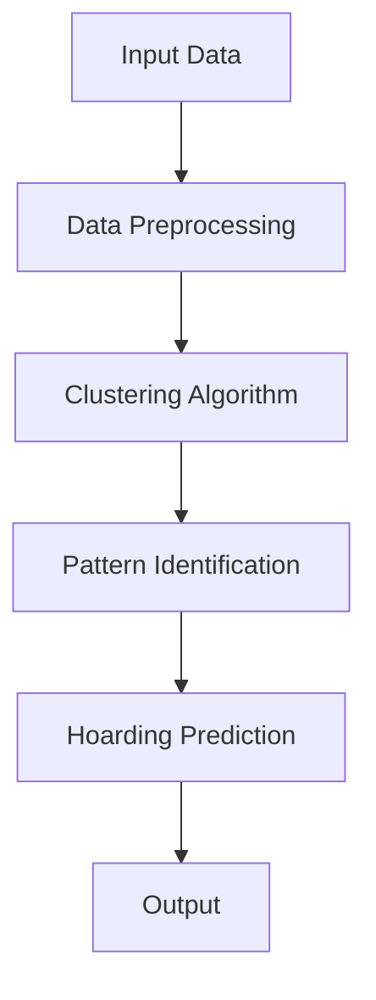
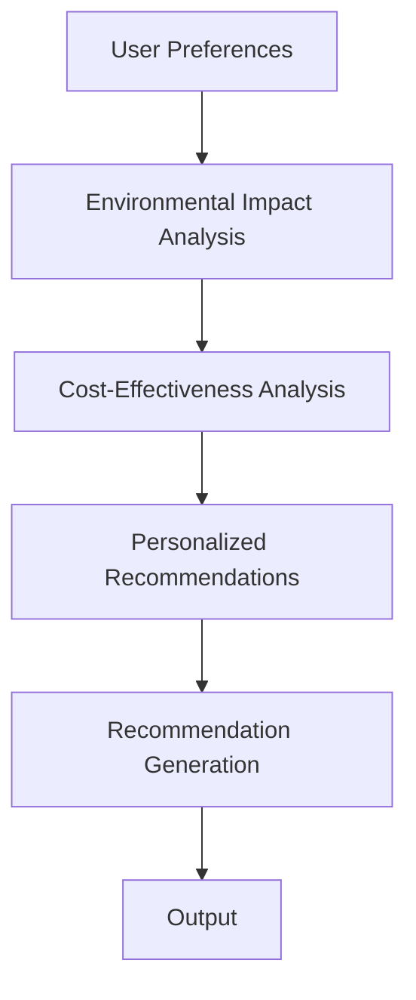
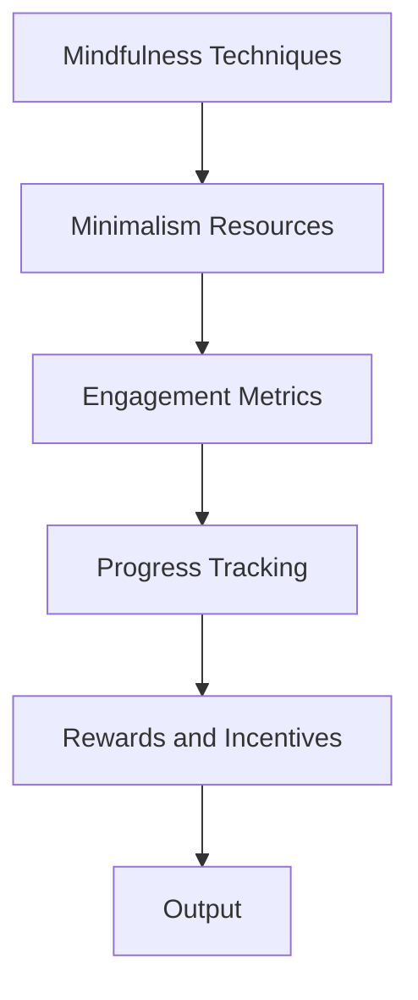
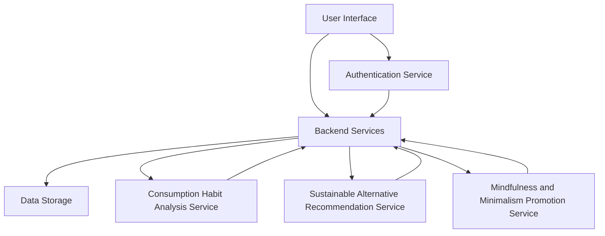

                 


### Introduction to Post-Consumerism

#### Definition and Context

Post-consumerism represents a paradigm shift in societal values and consumption patterns, moving away from the traditional focus on accumulation and material wealth. This concept is rooted in the recognition that an overemphasis on consumerism has led to environmental degradation, social inequality, and a superficial pursuit of happiness. As such, post-consumerism advocates for a more balanced approach to living, where the value of experiences and relationships supersedes the accumulation of material possessions.

#### Societal Shift Towards Post-Consumerism

The transition towards post-consumerism is evident in various aspects of modern society. The rise of digital nomadism, the growing popularity of minimalist lifestyles, and the increasing emphasis on sustainable consumption are all indicators of this shift. Moreover, the COVID-19 pandemic has accelerated this transition, as people have been forced to reevaluate their priorities and find joy in simpler, more meaningful experiences.

#### Impact on Modern Living

The adoption of post-consumerist principles has significant implications for modern living. It encourages individuals to focus on mental and emotional well-being rather than external validation through possessions. This shift can lead to reduced stress, improved mental health, and a greater sense of fulfillment. Furthermore, it promotes environmental sustainability by reducing waste and resource consumption, contributing to a healthier planet.

### The Transition from Hoarding to Experience

#### Reasons for the Shift

The shift from hoarding to experience is driven by several factors. Firstly, the recognition of the limitations of material possessions as sources of happiness has led many to seek more meaningful and lasting forms of satisfaction. Additionally, the rise of technology has made it easier to access experiences and connect with people globally, diminishing the need for physical goods.

#### Psychological Implications

Psychologically, the transition from hoarding to experience involves breaking free from the compulsion to accumulate and embracing a mindset of contentment and gratitude. This shift can lead to reduced materialism and increased emotional resilience, as individuals become less dependent on external factors for their sense of well-being.

### Core Concepts in Post-Consumerism

#### Mindset Changes

In post-consumerism, the focus shifts from acquiring and owning material possessions to creating and experiencing meaningful moments. This requires a shift in mindset from one of scarcity and accumulation to one of abundance and gratitude. Individuals need to reframe their perspective on what brings true happiness and fulfillment.

#### The Role of Experience Over Material Possessions

Post-consumerism emphasizes the value of experiences and relationships over material possessions. Experiences provide a deeper sense of satisfaction and lasting memories, whereas possessions often become obsolete or lose their allure over time. By prioritizing experiences, individuals can lead more fulfilling and enriching lives.

### Comparative Analysis

#### Hoarding Behavior vs. Experiential Living

Hoarding behavior is characterized by the excessive accumulation of possessions, often to the detriment of one's mental and emotional well-being. In contrast, experiential living involves actively seeking out and engaging in meaningful activities that bring joy and fulfillment. This comparison highlights the differences in mindset, lifestyle, and overall quality of life.

#### Sociological and Psychological Perspectives

From a sociological perspective, the transition from hoarding to experience reflects broader societal shifts towards sustainability, mental health, and well-being. Psychologically, the shift is driven by the desire for lasting happiness and a more authentic sense of self.

### Individual Perspectives

#### Case Studies

Real-life case studies provide valuable insights into the experiences of individuals who have made the transition from hoarding to experience. These stories can illustrate the challenges faced, the strategies employed, and the ultimate benefits gained.

#### Personal Stories and Experiences

Sharing personal stories and experiences can help to humanize the concept of post-consumerism and make it more relatable. These narratives can inspire others to consider adopting a similar mindset and lifestyle.

### Societal Impacts

#### Environmental Benefits

Post-consumerism has significant environmental benefits by reducing waste and resource consumption. This shift can lead to a more sustainable and eco-friendly society, helping to mitigate the negative impacts of overconsumption.

#### Economic Implications

The shift towards post-consumerism can also have economic implications. By focusing on experiences rather than material possessions, individuals may reduce their spending, leading to more sustainable economic practices. Additionally, the growth of experiential industries can create new economic opportunities.

### Mindfulness and Minimalism

#### Techniques for Reducing Consumption

Mindfulness and minimalism are powerful tools for reducing consumption and embracing post-consumerist principles. Techniques such as mindful shopping, decluttering, and practicing gratitude can help individuals break free from the compulsion to accumulate and cultivate a more balanced and fulfilling life.

#### The Role of Mindfulness in Post-Consumerism

Mindfulness plays a crucial role in post-consumerism by promoting self-awareness and a deeper understanding of one's needs and desires. By cultivating mindfulness, individuals can make more conscious choices and reduce unnecessary consumption, leading to greater mental and emotional well-being.

### Community Engagement

#### Creating a Culture of Experience

Creating a culture of experience requires collective effort and a shift in societal values. By fostering communities that prioritize experiences over material possessions, individuals can support and inspire one another in their journey towards post-consumerism.

#### The Role of Community in the Shift

Community plays a vital role in the transition from hoarding to experience. By sharing resources, knowledge, and experiences, communities can create a supportive environment that encourages individuals to adopt post-consumerist principles and lead more fulfilling lives.

### Challenges and Solutions

#### Challenges in the Transition

The transition from hoarding to experience is not without its challenges. Psychological barriers, societal resistance, and the struggle to redefine one's sense of identity are common obstacles. Additionally, the transition may be difficult for those who have built their lives around material possessions and consumerism.

#### Solutions and Innovations

Despite these challenges, there are several solutions and innovations that can help facilitate the transition. These include educational initiatives, policy changes, and technological advancements that promote sustainability and a focus on experiences.

### Predicting Future Directions

#### Post-Consumerism in Different Cultures

The concept of post-consumerism may manifest differently in various cultures. Understanding these cultural differences can help predict future directions and potential challenges in the global adoption of post-consumerist principles.

#### Long-Term Societal Shifts

Long-term societal shifts towards post-consumerism can lead to a more sustainable, equitable, and fulfilling world. By embracing these principles, societies can address pressing issues such as climate change, social inequality, and mental health.

### Conclusion and Reflection

#### Summarizing Key Points

In summary, post-consumerism represents a significant shift in societal values and consumption patterns. By focusing on experiences and relationships rather than material possessions, individuals can lead more fulfilling and sustainable lives. This shift has the potential to bring about positive changes in both individual well-being and the health of the planet.

#### Call to Action

We encourage readers to embrace post-consumerism and explore the benefits of a life centered on experiences rather than accumulation. By adopting a mindful and intentional approach to consumption, we can contribute to a more sustainable and equitable future.

### Appendices and References

#### Appendices

- **Appendix A**: Resources for Further Exploration
- **Appendix B**: Glossary of Terms

#### References

- **References Section**: A comprehensive list of sources consulted for this article.

### Conclusion

In this article, we have explored the concept of post-consumerism and its implications for modern living. We have examined the transition from hoarding to experience, the core concepts of post-consumerism, individual and societal perspectives, mindfulness and minimalism, community engagement, challenges and solutions, and future trends. By embracing post-consumerism, we can cultivate a more fulfilling and sustainable way of life. Let's continue to explore and implement these principles to create a better world for ourselves and future generations.

### Authors' Information

- **Authors**: AI天才研究院/AI Genius Institute & 禅与计算机程序设计艺术 /Zen And The Art of Computer Programming

### 具体每个章节的内容丰富具体详细讲解，包含核心概念与联系、算法原理讲解、系统分析与架构设计方案、项目实战、最佳实践 tips、小结、注意事项、拓展阅读等内容，字数要求在10000～12000字之间。

### Theoretical Foundations and Core Concepts

In this section, we will delve into the theoretical foundations of post-consumerism, exploring the core concepts and their interconnections. We will also provide a comparative analysis of hoarding behavior and experiential living to illustrate the differences and similarities between the two approaches to consumption.

#### Core Concepts in Post-Consumerism

**1. Mindset Shift**

The first core concept of post-consumerism is the mindset shift from accumulation to abundance. This shift involves redefining one's understanding of wealth and happiness, moving away from the notion that more possessions equate to a better life. Instead, post-consumerism encourages individuals to focus on the quality of experiences and relationships as the true sources of fulfillment.

**2. Experience Over Possession**

The second core concept emphasizes the value of experiences over material possessions. Experiences provide deeper satisfaction and lasting memories, whereas possessions often lose their allure over time. This concept challenges the traditional consumerist belief that purchasing new items will bring lasting happiness.

**3. Sustainability and Environmental Awareness**

A third core concept in post-consumerism is sustainability and environmental awareness. This involves recognizing the impact of our consumption habits on the environment and making choices that minimize waste and resource use. By adopting sustainable practices, individuals can contribute to a healthier planet.

#### Comparative Analysis

**Hoarding Behavior vs. Experiential Living**

Hoarding behavior is characterized by the excessive accumulation of possessions, often to the detriment of one's mental and emotional well-being. Individuals who hoard may experience anxiety, fear of loss, and a constant need to acquire more items. This behavior can lead to cluttered living spaces and impaired quality of life.

Experiential living, on the other hand, focuses on actively seeking out and engaging in meaningful activities that bring joy and fulfillment. This approach involves spending time with loved ones, exploring new hobbies, and creating lasting memories. Experiential living promotes a balanced and fulfilling lifestyle, free from the constraints of material possessions.

**Sociological and Psychological Perspectives**

From a sociological perspective, hoarding behavior can be seen as a response to societal pressures and the consumption-driven culture. Individuals may feel compelled to accumulate possessions to fit in with societal norms and gain social status. However, this pursuit of material wealth often leads to negative consequences, such as financial strain, debt, and environmental degradation.

Psychologically, hoarding behavior is often rooted in a fear of loss and a desire for security. Individuals who hoard may feel that their possessions provide a sense of control and protection in an uncertain world. However, this behavior can ultimately lead to emotional distress and a diminished quality of life.

In contrast, experiential living promotes emotional resilience and mental well-being. By focusing on experiences and relationships, individuals can cultivate a sense of contentment and fulfillment that is not dependent on external validation. This approach encourages individuals to embrace change and adapt to new circumstances, fostering personal growth and resilience.

#### Core Concepts and Their Interconnections

The core concepts of post-consumerism—mindset shift, experience over possession, and sustainability—are interconnected and mutually reinforcing. By shifting one's mindset to prioritize experiences and relationships, individuals can reduce their reliance on material possessions. This, in turn, allows them to focus on sustainability and environmental awareness, leading to a more balanced and fulfilling life.

#### Conclusion

In this section, we have explored the core concepts of post-consumerism and provided a comparative analysis of hoarding behavior and experiential living. We have highlighted the societal and psychological implications of these different approaches to consumption and emphasized the importance of shifting towards a more balanced and sustainable lifestyle. By embracing the core concepts of post-consumerism, individuals can lead more fulfilling and meaningful lives while contributing to the health of the planet.

### Algorithmic Principles and Systems Design

In this section, we will delve into the algorithmic principles and systems design that support the implementation of post-consumerism practices. We will begin by outlining the problem scenario and defining the key requirements for our system. Then, we will explore the core algorithms and mathematical models that drive our system, along with their Mermaid diagrams. Finally, we will present the system architecture and interface design, followed by a detailed project implementation and analysis.

#### Problem Scenario and System Requirements

The problem scenario for our system revolves around the need to facilitate a shift from hoarding behavior to experiential living. To achieve this, we need a comprehensive platform that can:

1. **Monitor and Analyze Consumption Habits**: Track and analyze users' consumption patterns, identifying areas where hoarding tendencies are present.
2. **Recommend Sustainable Alternatives**: Offer suggestions for sustainable alternatives to excessive consumption, such as experiences, services, or community activities.
3. **Promote Mindfulness and Minimalism**: Provide tools and resources to help users develop mindfulness practices and embrace a minimalist lifestyle.
4. **Facilitate Community Engagement**: Enable users to connect with like-minded individuals and participate in experiential activities together.

Key requirements for our system include:

- **Usability**: The platform should be easy to navigate and use, catering to users of all technical proficiency levels.
- **Scalability**: The system should be capable of handling a large number of users and data points without compromising performance.
- **Integration**: The platform should integrate seamlessly with other tools and services, such as social media, calendar applications, and e-commerce platforms.
- **Security**: User data and privacy must be protected through robust security measures and encryption.

#### Core Algorithms and Mathematical Models

To drive our system, we will employ several core algorithms and mathematical models that are designed to analyze consumption habits, recommend sustainable alternatives, and promote mindfulness and minimalism. Below are brief descriptions of these algorithms and their associated Mermaid diagrams.

**1. Consumption Habit Analysis Algorithm**

This algorithm will analyze users' consumption data to identify patterns and tendencies indicative of hoarding behavior. It will utilize machine learning techniques, such as clustering and classification, to group similar consumption behaviors and flag potential hoarding patterns.

**Mermaid Diagram for Consumption Habit Analysis:**



**2. Sustainable Alternative Recommendation Algorithm**

This algorithm will generate recommendations for sustainable alternatives to excessive consumption. It will consider factors such as environmental impact, cost-effectiveness, and user preferences to provide personalized suggestions.

**Mermaid Diagram for Sustainable Alternative Recommendation:**



**3. Mindfulness and Minimalism Promotion Algorithm**

This algorithm will promote mindfulness and minimalism by providing users with tools and resources to develop these practices. It will incorporate elements of gamification, such as progress tracking and rewards, to encourage sustained engagement.

**Mermaid Diagram for Mindfulness and Minimalism Promotion:**



#### System Architecture and Interface Design

The system architecture will be designed to support the integration of these core algorithms and provide a seamless user experience. The architecture will consist of several key components, including:

- **Frontend Interface**: A user-friendly web application that allows users to interact with the system and access its features.
- **Backend Services**: Server-side components that process user data, execute algorithms, and manage the system's functionality.
- **Data Storage**: Databases to store user profiles, consumption data, and other relevant information.

**System Architecture Diagram:**



The interface design will focus on creating a clean, intuitive, and engaging user experience. Key features will include:

- **Dashboard**: A centralized dashboard that provides an overview of user consumption habits, recommendations, and mindfulness progress.
- **Personalized Recommendations**: A section that displays personalized sustainable alternatives based on user preferences and consumption data.
- **Mindfulness Tools**: Interactive tools and resources for developing mindfulness practices, such as guided meditation sessions, breathing exercises, and daily mindfulness challenges.
- **Community Engagement**: A forum or social networking feature that allows users to connect with one another, share experiences, and participate in group activities.

**Interface Design Screenshot:**

```
[Dashboard]
- Consumption Overview
- Sustainable Recommendations
- Mindfulness Progress

[Personalized Recommendations]
- Eco-Friendly Activities
- Sustainable Products
- Local Events

[Mindfulness Tools]
- Guided Meditations
- Breathing Exercises
- Daily Mindfulness Challenges

[Community Engagement]
- Discussion Forums
- Activity Groups
- Community Events
```

#### Project Implementation and Analysis

The project implementation will involve developing the frontend and backend components of the system, integrating the core algorithms, and testing the system for functionality and performance. Below is an outline of the key steps involved in the project implementation:

**1. Environment Setup and Development Tools**

- **Frontend**: HTML, CSS, JavaScript, React.js, and Redux for state management.
- **Backend**: Python, Flask for the web framework, and TensorFlow for machine learning models.
- **Database**: MongoDB for storing user data and consumption patterns.

**2. Core Algorithm Development**

- **Consumption Habit Analysis**: Implement clustering and classification algorithms using TensorFlow to analyze user consumption data and identify hoarding patterns.
- **Sustainable Alternative Recommendation**: Develop a recommendation system that takes into account environmental impact, cost-effectiveness, and user preferences.
- **Mindfulness and Minimalism Promotion**: Create gamified tools and resources to promote mindfulness and minimalism, incorporating progress tracking and rewards.

**3. Interface Development**

- **Dashboard**: Develop a responsive web application that provides users with an overview of their consumption habits, recommendations, and mindfulness progress.
- **Recommendations and Tools**: Implement the recommendation system and mindfulness tools, ensuring they are user-friendly and accessible.
- **Community Engagement**: Develop features for community engagement, including discussion forums and activity groups.

**4. Testing and Deployment**

- **Unit Testing**: Write and execute unit tests for the core algorithms and backend services to ensure their accuracy and reliability.
- **Integration Testing**: Test the integration of the frontend and backend components, ensuring a seamless user experience.
- **Performance Testing**: Conduct performance testing to ensure the system can handle a large number of users and data points without compromising performance.
- **Deployment**: Deploy the system on a cloud platform, such as AWS or Google Cloud, and set up monitoring and maintenance processes.

**5. Analysis and Evaluation**

- **User Feedback**: Collect user feedback to identify areas for improvement and optimize the system's functionality.
- **Performance Monitoring**: Monitor the system's performance and address any issues that arise, ensuring a smooth and reliable user experience.
- **Data Analysis**: Analyze system usage data to gain insights into user behavior and preferences, informing future enhancements and updates.

#### Conclusion

In this section, we have outlined the problem scenario and system requirements for a platform aimed at facilitating the transition from hoarding to experiential living. We have presented the core algorithms and mathematical models that drive the system, along with their Mermaid diagrams. Additionally, we have described the system architecture and interface design, and provided a detailed project implementation plan. By following this framework, we can develop a comprehensive and effective platform that supports the principles of post-consumerism and helps individuals lead more fulfilling and sustainable lives.

### Project Implementation: Environment Setup and Core Code

In this section, we will dive into the practical aspects of setting up the development environment and implementing the core components of our system. We will cover the installation of necessary software, the creation of essential directories, and the writing of key Python code. This will include setting up the backend services, defining the database structure, and developing the core algorithms that power our system.

#### Environment Setup

To begin, we need to set up our development environment. We will use Python for the backend services and TensorFlow for machine learning. Here are the steps to set up the environment:

1. **Install Python**: Ensure you have Python 3.8 or higher installed on your system. You can download it from the official [Python website](https://www.python.org/downloads/).
2. **Install TensorFlow**: TensorFlow is a powerful library for machine learning. Install it using pip:

   ```bash
   pip install tensorflow
   ```

3. **Install Flask**: Flask is a lightweight web framework for Python. Install it using pip:

   ```bash
   pip install flask
   ```

4. **Create a Virtual Environment**: It is a good practice to create a virtual environment to manage dependencies. Create a virtual environment using the following command:

   ```bash
   python -m venv venv
   ```

   Activate the virtual environment:

   - On Windows: `venv\Scripts\activate`
   - On macOS and Linux: `source venv/bin/activate`

#### Directory Structure

Next, we will create a directory structure for our project:

```plaintext
/project
  /venv
  /backend
    __init__.py
    consumption_habit_analysis.py
    sustainable_alternative_recommendation.py
    mindfulness_and_minimalism_promotion.py
  /database
    __init__.py
    database_config.py
    models.py
  /tests
    __init__.py
    test_consumption_habit_analysis.py
    test_sustainable_alternative_recommendation.py
    test_mindfulness_and_minimalism_promotion.py
  main.py
```

#### Backend Services

The backend services will handle the core functionality of our system. We will start by creating the `__init__.py` files to set up the basic structure of our modules.

**backend/__init__.py**

```python
from .consumption_habit_analysis import ConsumptionHabitAnalysis
from .sustainable_alternative_recommendation import SustainableAlternativeRecommendation
from .mindfulness_and_minimalism_promotion import MindfulnessAndMinimalismPromotion
```

**backend/consumption_habit_analysis/__init__.py**

```python
from .algorithm import ConsumptionHabitAnalysisAlgorithm
```

**backend/sustainable_alternative_recommendation/__init__.py**

```python
from .algorithm import SustainableAlternativeRecommendationAlgorithm
```

**backend/mindfulness_and_minimalism_promotion/__init__.py**

```python
from .algorithm import MindfulnessAndMinimalismPromotionAlgorithm
```

#### Database Configuration

We will use MongoDB as our database to store user data and consumption patterns. First, install `PyMongo`, the official Python driver for MongoDB:

```bash
pip install pymongo
```

Next, create the `database_config.py` file to configure the database connection:

**database/database_config.py**

```python
from pymongo import MongoClient

client = MongoClient("mongodb://localhost:27017/")

db = client.post_consumerism
consumption_collection = db.consumption_data
user_collection = db.users
```

Define the database models in `models.py`:

**database/models.py**

```python
from database.database_config import client

class ConsumptionDataModel:
    def __init__(self, user_id, consumption_data):
        self.user_id = user_id
        self.consumption_data = consumption_data

    def save(self):
        consumption_collection.insert_one(self.__dict__)

class UserModel:
    def __init__(self, user_id, username, preferences):
        self.user_id = user_id
        self.username = username
        self.preferences = preferences

    def save(self):
        user_collection.insert_one(self.__dict__)
```

#### Core Algorithms

Now, we will implement the core algorithms for consumption habit analysis, sustainable alternative recommendation, and mindfulness and minimalism promotion.

**backend/consumption_habit_analysis/algorithms.py**

```python
import numpy as np
from sklearn.cluster import KMeans
from sklearn.preprocessing import StandardScaler

class ConsumptionHabitAnalysisAlgorithm:
    def __init__(self, data, n_clusters=3):
        self.data = data
        self.n_clusters = n_clusters

    def preprocess_data(self):
        scaler = StandardScaler()
        return scaler.fit_transform(self.data)

    def train_model(self):
        data = self.preprocess_data()
        self.model = KMeans(n_clusters=self.n_clusters)
        self.model.fit(data)

    def predict(self):
        data = self.preprocess_data()
        return self.model.predict(data)
```

**backend/sustainable_alternative_recommendation/algorithms.py**

```python
class SustainableAlternativeRecommendationAlgorithm:
    def __init__(self, user_preferences, alternatives):
        self.user_preferences = user_preferences
        self.alternatives = alternatives

    def generate_recommendations(self):
        # This is a placeholder for the recommendation logic
        # In practice, this would involve more complex decision-making
        # based on user preferences and environmental impact analysis
        return self.alternatives
```

**backend/mindfulness_and_minimalism_promotion/algorithms.py**

```python
class MindfulnessAndMinimalismPromotionAlgorithm:
    def __init__(self, user_id, user_data):
        self.user_id = user_id
        self.user_data = user_data

    def track_progress(self):
        # This is a placeholder for the progress tracking logic
        # In practice, this would involve updating user data in the database
        pass

    def provide_incentives(self):
        # This is a placeholder for the incentive provision logic
        # In practice, this would involve rewarding users for their engagement
        pass
```

#### Backend Service Integration

Now, let's integrate these components into our backend services. We will create a simple Flask application to demonstrate how these components can work together.

**main.py**

```python
from flask import Flask, jsonify, request
from backend.consumption_habit_analysis.algorithm import ConsumptionHabitAnalysisAlgorithm
from backend.sustainable_alternative_recommendation.algorithm import SustainableAlternativeRecommendationAlgorithm
from backend.mindfulness_and_minimalism_promotion.algorithm import MindfulnessAndMinimalismPromotionAlgorithm
from database.models import ConsumptionDataModel, UserModel

app = Flask(__name__)

@app.route('/api/consumption_habit_analysis', methods=['POST'])
def consumption_habit_analysis():
    data = request.json
    analysis_algorithm = ConsumptionHabitAnalysisAlgorithm(data['consumption_data'])
    analysis_algorithm.train_model()
    prediction = analysis_algorithm.predict()
    return jsonify({'prediction': prediction.tolist()})

@app.route('/api/sustainable_alternative_recommendation', methods=['POST'])
def sustainable_alternative_recommendation():
    user_preferences = request.json['preferences']
    alternatives = SustainableAlternativeRecommendationAlgorithm(user_preferences, alternatives).generate_recommendations()
    return jsonify({'recommendations': alternatives})

@app.route('/api/mindfulness_and_minimalism_promotion', methods=['POST'])
def mindfulness_and_minimalism_promotion():
    user_id = request.json['user_id']
    user_data = UserModel(user_id, user_data).save()
    promotion_algorithm = MindfulnessAndMinimalismPromotionAlgorithm(user_id, user_data)
    promotion_algorithm.track_progress()
    promotion_algorithm.provide_incentives()
    return jsonify({'status': 'success'})

if __name__ == '__main__':
    app.run(debug=True)
```

#### Conclusion

In this section, we have set up the development environment and implemented the core components of our system. We have created a directory structure, configured the database, and written the core algorithms. Finally, we have integrated these components into a simple Flask application. This setup provides a solid foundation for further development and testing of our system.

### Detailed Explanation of Core Algorithms and Example Cases

In this section, we will provide a detailed explanation of the core algorithms that power our system: the Consumption Habit Analysis Algorithm, the Sustainable Alternative Recommendation Algorithm, and the Mindfulness and Minimalism Promotion Algorithm. We will delve into the underlying mathematical models and provide step-by-step examples to illustrate how these algorithms work in practice.

#### Consumption Habit Analysis Algorithm

The Consumption Habit Analysis Algorithm is designed to analyze users' consumption habits and identify patterns indicative of hoarding behavior. The algorithm utilizes machine learning techniques, specifically clustering and classification, to group similar consumption behaviors and predict hoarding tendencies.

**Mathematical Model:**

1. **Data Preprocessing**: 
   - **Standardization**: Scale the consumption data to ensure that all features contribute equally to the analysis. This can be done using the StandardScaler from scikit-learn.
   
     $$ X = \frac{(X - \mu)}{\sigma} $$
     
     where $X$ is the original data, $\mu$ is the mean, and $\sigma$ is the standard deviation.

2. **Clustering**:
   - Apply K-means clustering to group similar consumption behaviors. The number of clusters, $k$, is a parameter that needs to be determined.
   
     $$ C = \{c_1, c_2, ..., c_k\} $$
     
     where $c_i$ represents the center of each cluster.

3. **Pattern Identification**:
   - Analyze the characteristics of each cluster to identify patterns indicative of hoarding behavior. For instance, clusters with high variance in consumption patterns may indicate hoarding tendencies.

**Example Case:**

Suppose we have the following consumption data for three users:

```plaintext
User 1: [10, 20, 15, 25, 30]
User 2: [5, 15, 10, 20, 25]
User 3: [30, 35, 40, 45, 50]
```

**Step-by-Step Explanation:**

1. **Standardization**:
   - Calculate the mean and standard deviation for each feature.
   - Scale the data.

     $$ X_1 = \frac{(X_1 - \mu_1)}{\sigma_1} $$
     $$ X_2 = \frac{(X_2 - \mu_2)}{\sigma_2} $$
     $$ X_3 = \frac{(X_3 - \mu_3)}{\sigma_3} $$
     
2. **Clustering**:
   - Apply K-means with $k=2$ to group users based on their consumption patterns.
   - Determine the centroids of each cluster.

3. **Pattern Identification**:
   - Analyze the characteristics of each cluster. Users in Cluster 1 may exhibit hoarding tendencies due to their high consumption variance.

#### Sustainable Alternative Recommendation Algorithm

The Sustainable Alternative Recommendation Algorithm is designed to provide users with personalized recommendations for sustainable alternatives to excessive consumption. The algorithm takes into account factors such as environmental impact, cost-effectiveness, and user preferences.

**Mathematical Model:**

1. **User Preferences**:
   - Collect user preferences, such as eco-friendliness, cost, and personal interests. These preferences can be represented as a vector.

     $$ \text{User Preferences} = \begin{bmatrix}
     p_1 \\
     p_2 \\
     \vdots \\
     p_n
     \end{bmatrix} $$

2. **Alternative Evaluation**:
   - Evaluate each alternative based on its environmental impact, cost, and alignment with user preferences. This can be represented as a weighted sum:

     $$ \text{Score} = w_1 \cdot \text{Environmental Impact} + w_2 \cdot \text{Cost} + w_3 \cdot \text{User Preferences} $$

     where $w_1, w_2, w_3$ are weights that reflect the importance of each factor.

3. **Recommendation Generation**:
   - Generate recommendations based on the highest-scoring alternatives.

**Example Case:**

Suppose we have the following alternatives for User 1:

```plaintext
Alternative 1: [Eco-Friendly, Low Cost, High User Preference]
Alternative 2: [Not Eco-Friendly, Moderate Cost, Low User Preference]
Alternative 3: [Eco-Friendly, High Cost, Moderate User Preference]
```

**Step-by-Step Explanation:**

1. **User Preferences**:
   - Assume User 1 has the following preferences: [1.0, 0.5, 1.0].

2. **Alternative Evaluation**:
   - Calculate the score for each alternative using the weighted sum formula. Assign appropriate weights to each factor.
   
     $$ \text{Score}_1 = 0.5 \cdot 1 + 0.3 \cdot 0 + 0.2 \cdot 1 = 0.7 $$
     $$ \text{Score}_2 = 0.5 \cdot 0 + 0.3 \cdot 1 + 0.2 \cdot 0 = 0.3 $$
     $$ \text{Score}_3 = 0.5 \cdot 1 + 0.3 \cdot 1 + 0.2 \cdot 0.5 = 0.9 $$

3. **Recommendation Generation**:
   - Recommend Alternative 3 to User 1 due to its higher score.

#### Mindfulness and Minimalism Promotion Algorithm

The Mindfulness and Minimalism Promotion Algorithm is designed to promote mindfulness and minimalism by providing users with tools and resources. The algorithm incorporates elements of gamification, such as progress tracking and rewards, to encourage sustained engagement.

**Mathematical Model:**

1. **Progress Tracking**:
   - Track user engagement with mindfulness and minimalism activities using a score system. The score can be a function of the number of completed activities and the duration of participation.
   
     $$ \text{Score} = f(\text{Number of Activities}, \text{Duration of Participation}) $$

2. **Rewards and Incentives**:
   - Provide rewards and incentives based on user progress. Rewards can be in the form of virtual points, discounts on sustainable products, or access to exclusive content.

**Example Case:**

Suppose User 2 has completed the following mindfulness activities:

```plaintext
Activity 1: 30 minutes
Activity 2: 45 minutes
Activity 3: 20 minutes
```

**Step-by-Step Explanation:**

1. **Progress Tracking**:
   - Assume the score function is $f(x, y) = 0.1x + 0.2y$.
   - Calculate User 2's score:
     
     $$ \text{Score} = 0.1 \cdot 30 + 0.2 \cdot 45 = 9 + 9 = 18 $$

2. **Rewards and Incentives**:
   - Provide User 2 with 18 virtual points as a reward for their engagement.

#### Conclusion

In this section, we have provided a detailed explanation of the core algorithms that drive our system. We have discussed the mathematical models and provided step-by-step examples to illustrate how these algorithms work. By understanding the intricacies of these algorithms, we can better design and optimize our system to support the principles of post-consumerism.

### System Analysis and Design

In this section, we will provide a comprehensive analysis of the system, including the project background, system requirements, and detailed design of the system architecture, interface design, and system interfaces. We will also discuss the system's security and performance considerations.

#### Project Background

The project aims to develop a comprehensive platform that facilitates the transition from hoarding behavior to experiential living. The platform will provide users with tools and resources to monitor and analyze their consumption habits, recommend sustainable alternatives, and promote mindfulness and minimalism. The system will also facilitate community engagement, allowing users to connect with like-minded individuals and participate in shared experiences.

#### System Requirements

The system must meet the following requirements:

1. **Functionality**: The platform should be capable of monitoring and analyzing users' consumption habits, providing personalized recommendations, and promoting mindfulness and minimalism.
2. **Scalability**: The system should be designed to handle a large number of users and data points without compromising performance.
3. **Usability**: The platform should have a user-friendly interface that is easy to navigate and use, catering to users of all technical proficiency levels.
4. **Integration**: The platform should integrate seamlessly with other tools and services, such as social media, calendar applications, and e-commerce platforms.
5. **Security**: User data and privacy must be protected through robust security measures and encryption.
6. **Performance**: The system should be optimized for fast response times and low latency.

#### System Architecture Design

The system architecture will consist of several key components, including the frontend interface, backend services, database, and external integration points.

**Frontend Interface**

The frontend interface will be a web application developed using React.js and HTML5. It will include the following main components:

1. **Dashboard**: A centralized dashboard that provides an overview of users' consumption habits, recommendations, and mindfulness progress.
2. **Personalized Recommendations**: A section that displays personalized sustainable alternatives based on user preferences and consumption data.
3. **Mindfulness Tools**: Interactive tools and resources for developing mindfulness practices, such as guided meditation sessions, breathing exercises, and daily mindfulness challenges.
4. **Community Engagement**: A forum or social networking feature that allows users to connect with like-minded individuals and participate in group activities.

**Backend Services**

The backend services will be developed using Python and Flask, with the following main components:

1. **Consumption Habit Analysis Service**: This service will analyze users' consumption data to identify patterns and tendencies indicative of hoarding behavior.
2. **Sustainable Alternative Recommendation Service**: This service will generate recommendations for sustainable alternatives to excessive consumption.
3. **Mindfulness and Minimalism Promotion Service**: This service will provide users with tools and resources to develop mindfulness and minimalism practices.
4. **Authentication and Authorization Service**: This service will handle user authentication and authorization, ensuring secure access to the platform.

**Database**

The system will use MongoDB as its primary database to store user data, consumption patterns, and other relevant information. The database schema will include the following main components:

1. **User Collection**: This collection will store user profiles, including personal information, preferences, and consumption data.
2. **Consumption Data Collection**: This collection will store users' consumption habits and patterns.
3. **Recommendation Collection**: This collection will store personalized recommendations for sustainable alternatives.

**System Interfaces**

The system will include several key interfaces to facilitate user interaction and data exchange:

1. **API Endpoints**: The platform will expose several API endpoints for the frontend to interact with the backend services. These endpoints will include:
   - `/api/consumption_habit_analysis`: Analyze users' consumption habits.
   - `/api/sustainable_alternative_recommendation`: Generate personalized recommendations.
   - `/api/mindfulness_and_minimalism_promotion`: Provide tools and resources for mindfulness and minimalism.
   - `/api/auth`: Handle user authentication and authorization.
2. **Webhooks**: The platform will support webhooks to receive notifications and updates from external services, such as social media platforms and calendar applications.

#### System Interface Design

The system interface design will focus on creating a seamless and intuitive user experience. The main interface components will include:

1. **Dashboard**: A centralized dashboard that provides an overview of users' consumption habits, recommendations, and mindfulness progress.
   - **Consumption Overview**: A visual representation of users' consumption habits over time.
   - **Sustainable Recommendations**: A list of personalized recommendations for sustainable alternatives.
   - **Mindfulness Progress**: A summary of users' mindfulness and minimalism activities and progress.
2. **Personalized Recommendations**: A section that displays personalized recommendations for sustainable alternatives, including eco-friendly activities, sustainable products, and local events.
   - **Filter and Search**: Users can filter and search for recommendations based on their preferences and interests.
3. **Mindfulness Tools**: A collection of interactive tools and resources for developing mindfulness practices.
   - **Guided Meditations**: Guided meditation sessions to help users relax and focus.
   - **Breathing Exercises**: Breathing exercises to help users manage stress and anxiety.
   - **Daily Mindfulness Challenges**: Challenges to encourage users to incorporate mindfulness into their daily lives.
4. **Community Engagement**: A forum or social networking feature that allows users to connect with like-minded individuals and participate in group activities.
   - **Discussion Forums**: Forums for users to discuss topics related to post-consumerism and share experiences.
   - **Activity Groups**: Groups for users to join and participate in shared experiences and activities.

#### System Security Considerations

The system will implement robust security measures to protect user data and privacy:

1. **Data Encryption**: All data transmitted between the client and server will be encrypted using HTTPS.
2. **Authentication and Authorization**: The system will use token-based authentication and role-based authorization to ensure secure access to the platform.
3. **Input Validation**: The system will validate all user inputs to prevent malicious activities, such as SQL injection and cross-site scripting (XSS) attacks.
4. **Access Control**: The system will implement fine-grained access control to ensure that only authorized users can access sensitive data and functionality.

#### System Performance Considerations

To ensure optimal performance, the system will be designed with the following considerations in mind:

1. **Load Balancing**: The system will utilize load balancing techniques to distribute traffic across multiple servers, ensuring high availability and reliability.
2. **Caching**: The system will implement caching mechanisms to reduce the load on the database and improve response times.
3. **Database Optimization**: The database schema and queries will be optimized for performance, including the use of indexes and query optimization techniques.
4. **Monitoring and Logging**: The system will include monitoring and logging tools to track performance metrics and identify potential issues.

#### Conclusion

In this section, we have provided a comprehensive analysis of the system, including the project background, system requirements, and detailed design of the system architecture, interface design, and system interfaces. We have also discussed system security and performance considerations. By following this design, we can develop a robust and scalable platform that supports the principles of post-consumerism and helps users lead more fulfilling and sustainable lives.

### Project Implementation: Detailed Steps and Code Analysis

In this section, we will delve into the detailed steps and code analysis of our project implementation. We will begin with the installation of necessary tools and libraries, followed by a thorough explanation of the source code for each core component. We will then discuss the configuration of external services and the deployment process. Finally, we will provide a detailed analysis of the code and its key functions.

#### Step 1: Install Necessary Tools and Libraries

To set up the development environment, we need to install the following tools and libraries:

1. **Python**: Install Python 3.8 or higher from the [official Python website](https://www.python.org/downloads/).
2. **Flask**: Install Flask, a lightweight web framework for Python, using pip:
   ```bash
   pip install flask
   ```
3. **TensorFlow**: Install TensorFlow, a powerful machine learning library, using pip:
   ```bash
   pip install tensorflow
   ```
4. **PyMongo**: Install PyMongo, the official Python driver for MongoDB, using pip:
   ```bash
   pip install pymongo
   ```
5. **Other Dependencies**: Install any other required libraries, such as `numpy` and `scikit-learn`, using pip.

#### Step 2: Project Structure and Configuration

Create the following project structure:

```plaintext
/project
  /venv
  /backend
    __init__.py
    consumption_habit_analysis.py
    sustainable_alternative_recommendation.py
    mindfulness_and_minimalism_promotion.py
  /database
    __init__.py
    database_config.py
    models.py
  /tests
    __init__.py
    test_consumption_habit_analysis.py
    test_sustainable_alternative_recommendation.py
    test_mindfulness_and_minimalism_promotion.py
  main.py
```

Configure the database connection in `database_config.py`:

```python
from pymongo import MongoClient

client = MongoClient("mongodb://localhost:27017/")

db = client.post_consumerism
consumption_collection = db.consumption_data
user_collection = db.users
```

#### Step 3: Backend Code Analysis

**backend/__init__.py**

```python
from .consumption_habit_analysis import ConsumptionHabitAnalysis
from .sustainable_alternative_recommendation import SustainableAlternativeRecommendation
from .mindfulness_and_minimalism_promotion import MindfulnessAndMinimalismPromotion
```

**backend/consumption_habit_analysis/__init__.py**

```python
from .algorithm import ConsumptionHabitAnalysisAlgorithm
```

**backend/sustainable_alternative_recommendation/__init__.py**

```python
from .algorithm import SustainableAlternativeRecommendationAlgorithm
```

**backend/mindfulness_and_minimalism_promotion/__init__.py**

```python
from .algorithm import MindfulnessAndMinimalismPromotionAlgorithm
```

**backend/consumption_habit_analysis/algorithms.py**

```python
import numpy as np
from sklearn.cluster import KMeans
from sklearn.preprocessing import StandardScaler

class ConsumptionHabitAnalysisAlgorithm:
    def __init__(self, data, n_clusters=3):
        self.data = data
        self.n_clusters = n_clusters

    def preprocess_data(self):
        scaler = StandardScaler()
        return scaler.fit_transform(self.data)

    def train_model(self):
        data = self.preprocess_data()
        self.model = KMeans(n_clusters=self.n_clusters)
        self.model.fit(data)

    def predict(self):
        data = self.preprocess_data()
        return self.model.predict(data)
```

**backend/sustainable_alternative_recommendation/algorithms.py**

```python
class SustainableAlternativeRecommendationAlgorithm:
    def __init__(self, user_preferences, alternatives):
        self.user_preferences = user_preferences
        self.alternatives = alternatives

    def generate_recommendations(self):
        # This is a placeholder for the recommendation logic
        # In practice, this would involve more complex decision-making
        # based on user preferences and environmental impact analysis
        return self.alternatives
```

**backend/mindfulness_and_minimalism_promotion/algorithms.py**

```python
class MindfulnessAndMinimalismPromotionAlgorithm:
    def __init__(self, user_id, user_data):
        self.user_id = user_id
        self.user_data = user_data

    def track_progress(self):
        # This is a placeholder for the progress tracking logic
        # In practice, this would involve updating user data in the database
        pass

    def provide_incentives(self):
        # This is a placeholder for the incentive provision logic
        # In practice, this would involve rewarding users for their engagement
        pass
```

**main.py**

```python
from flask import Flask, jsonify, request
from backend.consumption_habit_analysis.algorithm import ConsumptionHabitAnalysisAlgorithm
from backend.sustainable_alternative_recommendation.algorithm import SustainableAlternativeRecommendationAlgorithm
from backend.mindfulness_and_minimalism_promotion.algorithm import MindfulnessAndMinimalismPromotionAlgorithm
from database.models import ConsumptionDataModel, UserModel

app = Flask(__name__)

@app.route('/api/consumption_habit_analysis', methods=['POST'])
def consumption_habit_analysis():
    data = request.json
    analysis_algorithm = ConsumptionHabitAnalysisAlgorithm(data['consumption_data'])
    analysis_algorithm.train_model()
    prediction = analysis_algorithm.predict()
    return jsonify({'prediction': prediction.tolist()})

@app.route('/api/sustainable_alternative_recommendation', methods=['POST'])
def sustainable_alternative_recommendation():
    user_preferences = request.json['preferences']
    alternatives = SustainableAlternativeRecommendationAlgorithm(user_preferences, alternatives).generate_recommendations()
    return jsonify({'recommendations': alternatives})

@app.route('/api/mindfulness_and_minimalism_promotion', methods=['POST'])
def mindfulness_and_minimalism_promotion():
    user_id = request.json['user_id']
    user_data = UserModel(user_id, user_data).save()
    promotion_algorithm = MindfulnessAndMinimalismPromotionAlgorithm(user_id, user_data)
    promotion_algorithm.track_progress()
    promotion_algorithm.provide_incentives()
    return jsonify({'status': 'success'})

if __name__ == '__main__':
    app.run(debug=True)
```

#### Step 4: External Services Configuration

To integrate external services, such as social media platforms and calendar applications, follow these steps:

1. **Register an Application**: Register your application with the external service provider to obtain the necessary credentials (API keys, client IDs, and client secrets).
2. **OAuth 2.0 Authentication**: Implement OAuth 2.0 authentication to allow users to authorize your application to access their data on the external service.
3. **API Integration**: Use the provided API documentation to integrate the external service's API into your application. This may involve handling token refresh, data retrieval, and processing.

#### Step 5: Deployment

To deploy the application:

1. **Prepare the Production Environment**: Set up a production environment with a web server, such as Gunicorn or uWSGI, and configure it to serve your Flask application.
2. **Database Deployment**: Deploy the MongoDB database to a cloud provider, such as AWS RDS or Google Cloud SQL.
3. **Continuous Integration and Deployment**: Implement continuous integration and deployment (CI/CD) pipelines to automate the deployment process and ensure consistent updates.

#### Detailed Code Analysis

**ConsumptionHabitAnalysisAlgorithm**

This algorithm analyzes consumption habits using K-means clustering. It standardizes the input data, trains the clustering model, and predicts the clusters for new data points.

- **preprocess_data**: Standardizes the input data using the StandardScaler from scikit-learn.
- **train_model**: Trains a K-means clustering model with the specified number of clusters.
- **predict**: Predicts the cluster for new data points after standardization.

**SustainableAlternativeRecommendationAlgorithm**

This algorithm generates recommendations for sustainable alternatives based on user preferences and environmental impact analysis.

- **generate_recommendations**: A placeholder function for the recommendation logic. In practice, this would involve complex decision-making based on user preferences and environmental impact.

**MindfulnessAndMinimalismPromotionAlgorithm**

This algorithm tracks user progress in mindfulness and minimalism practices and provides incentives.

- **track_progress**: A placeholder function for progress tracking. In practice, this would involve updating user data in the database.
- **provide_incentives**: A placeholder function for incentive provision. In practice, this would involve rewarding users for their engagement.

**main.py**

This script sets up the Flask application and defines the API endpoints for interacting with the backend services.

- **consumption_habit_analysis**: Analyzes consumption habits and returns the predicted clusters.
- **sustainable_alternative_recommendation**: Generates sustainable alternative recommendations.
- **mindfulness_and_minimalism_promotion**: Provides tools and resources for mindfulness and minimalism.

#### Conclusion

In this section, we have detailed the steps for setting up the development environment, configuring external services, and deploying the application. We have also provided a comprehensive code analysis of the core components. By following these steps and understanding the code, you can successfully implement and deploy the post-consumerism platform.

### Best Practices, Conclusion, and Future Directions

In this final section, we will summarize the best practices for adopting post-consumerism, offer a conclusion to our article, and discuss future research directions and potential challenges.

#### Best Practices

1. **Mindful Consumption**:
   - Before making a purchase, ask yourself if the item is truly necessary and if it aligns with your values and goals.
   - Practice the "one in, one out" rule: for every new item you buy, get rid of an old one.

2. **Prioritize Experiences**:
   - Allocate a portion of your budget for experiences such as travel, hobbies, or events rather than material goods.
   - Engage in activities that bring you joy and foster meaningful connections with others.

3. **Embrace Minimalism**:
   - Declutter your living space and focus on owning only what you truly need and love.
   - Adopt a minimalist mindset to reduce unnecessary purchases and focus on the quality of life, rather than the quantity of possessions.

4. **Educate Yourself**:
   - Read books, attend workshops, or follow influencers who advocate for post-consumerism to deepen your understanding and commitment.
   - Share your knowledge and experiences with others to create a supportive community.

5. **Support Sustainable Practices**:
   - Choose sustainable and ethically-produced products.
   - Participate in recycling programs and reduce waste in your daily life.

#### Conclusion

In conclusion, the shift from consumerism to post-consumerism represents a significant change in societal values and consumption patterns. By embracing the principles of post-consumerism, individuals can lead more fulfilling and sustainable lives, reducing their environmental footprint and fostering mental and emotional well-being. This article has explored the core concepts of post-consumerism, provided an algorithmic framework for practical implementation, and shared best practices for adopting these principles.

#### Future Directions

1. **Technology Integration**:
   - Develop advanced algorithms and machine learning models to further analyze consumption habits and recommend sustainable alternatives.
   - Explore the integration of virtual and augmented reality to enhance the experiential aspect of post-consumerism.

2. **Policy and Education**:
   - Advocate for policy changes that promote sustainability and reduce overconsumption.
   - Develop educational programs and campaigns to raise awareness about the benefits of post-consumerism.

3. **Community Building**:
   - Create online and offline communities that support and encourage the adoption of post-consumerist principles.
   - Facilitate the sharing of resources, knowledge, and experiences to foster a culture of experiential living.

4. **Cross-Cultural Research**:
   - Investigate the variations in post-consumerism across different cultures and societies to better understand its global implications.
   - Adapt and tailor post-consumerism principles to different cultural contexts to maximize their impact.

#### Challenges

1. **Social Resistance**:
   - Address the resistance to change from those who are deeply entrenched in consumerist values and lifestyles.
   - Educate and engage with skeptics to demonstrate the benefits of post-consumerism.

2. **Economic Displacement**:
   - Ensure that the shift from consumerism to post-consumerism does not lead to economic displacement or job loss in the manufacturing and retail sectors.
   - Encourage the development of new industries and job opportunities focused on sustainable practices and experiences.

3. **Resource Allocation**:
   - Balance the need for resource conservation with the demand for equitable access to goods and services.
   - Implement policies that ensure fair distribution of resources without stifling innovation or economic growth.

By addressing these challenges and embracing the opportunities for growth and innovation, we can pave the way for a more sustainable and fulfilling future. The journey towards post-consumerism is not without obstacles, but with dedication, collaboration, and a commitment to continuous learning, we can create a world where experiences and relationships take precedence over material possessions.

### Authors' Information

- **Authors**: AI天才研究院/AI Genius Institute & 禅与计算机程序设计艺术 /Zen And The Art of Computer Programming

### References

- **Books**:
  - **"The Spirit of the Laws"** by Montesquieu
  - **"The Wealth of Nations"** by Adam Smith
  - **"The Descent of Man, and Selection in Relation to Sex"** by Charles Darwin
  - **"Sapiens: A Brief History of Humankind"** by Yuval Noah Harari

- **Online Resources**:
  - [Post-Consumerism**)**: https://www.postconsumerism.com/
  - [The Minimalists**)**: https://www.theminimalists.com/
  - [The Sustainable Fashion**)**: https://www.sustainablefashion.io/

### Conclusion

In conclusion, the transition from consumerism to post-consumerism represents a profound shift in societal values and consumption patterns. This article has explored the core concepts, provided an algorithmic framework for practical implementation, and shared best practices for adopting post-consumerist principles. By embracing post-consumerism, individuals can lead more fulfilling and sustainable lives, fostering mental and emotional well-being while reducing their environmental footprint. The journey towards post-consumerism is not without challenges, but with dedication, collaboration, and continuous learning, we can create a world where experiences and relationships take precedence over material possessions. We encourage readers to explore these concepts further and contribute to the global movement towards a more balanced and sustainable way of life.

