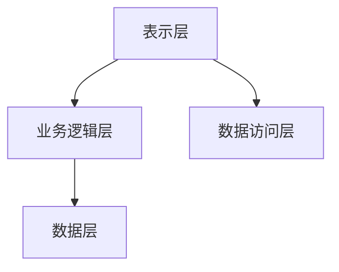
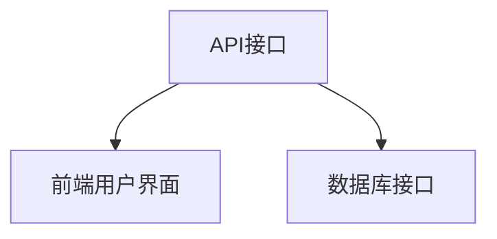
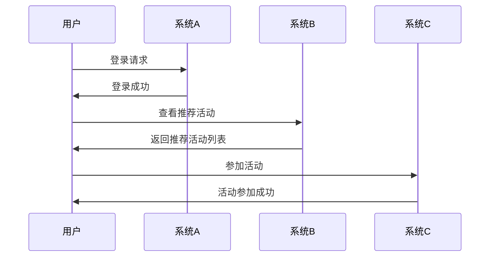

                 

### 后物质主义生活体验中心：追求精神满足的实践基地

#### 关键词：后物质主义，生活体验中心，精神满足，技术实践，人工智能

> 摘要：本文深入探讨后物质主义背景下，如何构建一个能够满足人们精神需求的“后物质主义生活体验中心”。通过对核心概念、用户需求、算法原理、数学模型、系统架构和项目实战的详细分析，文章为构建这样一个中心提供了理论基础和实用指南。

---

**Step 1: 背景介绍**

### 后物质主义生活体验中心：追求精神满足的实践基地

#### 1.1 问题背景
后物质主义，这一概念起源于20世纪60年代的西方社会学研究中，指的是在经济高度发达、物质需求得到基本满足的条件下，人们开始更加重视精神生活、个人价值和自我实现。这种思潮在当今社会尤为显著，特别是在科技高度发展的时代，人们对于生活的追求不再局限于物质的丰盈，而是更加关注内心的满足与精神的富足。

#### 1.2 问题描述
在物质条件日益改善的现代社会，人们的精神需求变得愈发多样和复杂。如何创建一个能够满足人们精神需求的“后物质主义生活体验中心”成为一个迫切需要解决的问题。这个中心不仅需要提供一个舒适的生活环境，更重要的是要提供一个能够激发思考、培养情感、实现自我提升的平台。

#### 1.3 问题解决
为了解决这一问题，我们需要采取以下步骤：

1. **研究后物质主义理论**：深入了解后物质主义的定义、特点及其在不同文化背景下的表现，为生活体验中心的设计提供理论依据。
2. **分析用户需求**：研究人们在不同生活阶段的精神需求，包括知识、艺术、哲学、心理健康等方面的需求。
3. **设计综合性的生活体验中心**：结合用户需求，设计一个能够提供多种精神满足的生活空间。
4. **引入先进技术**：利用人工智能、虚拟现实等新技术，提升用户体验。

#### 1.4 边界与外延
后物质主义生活体验中心的边界在于其所提供的服务内容，如文化活动、艺术展览、哲学讨论、心理健康服务等。其外延则涉及如何通过这些服务来满足人们多样化的精神需求。

#### 1.5 概念结构与核心要素组成
后物质主义生活体验中心的构成可以分为以下几个核心要素：

1. **硬件设施**：包括建筑风格、内部装饰、设施设备等。
2. **软件服务**：包括文化活动、艺术展览、哲学讨论、心理健康服务等。
3. **技术支持**：包括人工智能、虚拟现实等技术手段的运用。
4. **用户群体**：包括对后物质主义有一定了解和追求的人群。

---

**Step 2: 核心概念与联系**

### 2.1 后物质主义概念原理

#### 2.1.1 后物质主义定义
后物质主义是一种社会文化理论，主张在物质条件得到基本满足的情况下，人们更多地关注精神层面的满足。它强调个体价值、自我实现、多样性和包容性。

#### 2.1.2 后物质主义特点
- **个体价值**：后物质主义强调个人价值和自我实现，追求个体的精神自由和自我表达。
- **自我实现**：人们追求的是更深层次的精神满足，而不是简单的物质财富积累。
- **多样性和包容性**：后物质主义倡导尊重多样性和包容性，鼓励个体探索自己的精神世界。

#### 2.1.3 后物质主义与物质主义对比
物质主义注重物质的积累和消费，而后物质主义则更加关注精神层面和个体价值的实现。物质主义追求的是物质的丰盈，而后物质主义追求的是内心的满足。

#### 2.1.4 后物质主义理论模型
后物质主义理论模型可以表示为：

$$
\text{后物质主义} = \text{物质满足} + \text{精神满足} + \text{个体价值} + \text{多样性和包容性}
$$

#### 2.1.5 后物质主义与人工智能的关系
人工智能技术在后物质主义生活体验中心中的应用，可以帮助提升用户体验，实现个性化和智能化。例如，通过人工智能分析用户的兴趣和行为，提供定制化的服务。

---

**Step 3: 算法原理讲解**

### 3.1 生活体验中心的算法原理

#### 3.1.1 用户体验分析算法
用户体验分析算法是后物质主义生活体验中心的核心组成部分，它利用机器学习技术分析用户的行为数据，预测用户的偏好，从而提供个性化的服务。以下是一个简单的用户体验分析算法的流程：

1. **数据收集**：收集用户的行为数据，如访问记录、互动行为、评论等。
2. **特征提取**：从行为数据中提取特征，如浏览时间、访问频次、互动类型等。
3. **模型训练**：使用机器学习算法，如决策树、支持向量机等，对特征进行训练，建立预测模型。
4. **预测与优化**：使用训练好的模型预测用户的偏好，并根据反馈不断优化模型。

#### 3.1.2 艺术品推荐算法
艺术品推荐算法是基于用户兴趣和艺术品特点进行推荐的算法。以下是一个简单的艺术品推荐算法的流程：

1. **用户兴趣分析**：分析用户的历史行为和互动，提取用户的兴趣特征。
2. **艺术品特征提取**：提取艺术品的特征，如风格、主题、艺术家等。
3. **推荐模型训练**：使用协同过滤、矩阵分解等算法，建立推荐模型。
4. **推荐结果生成**：根据用户兴趣和艺术品特征，生成个性化的推荐结果。

#### 3.1.3 心理健康评估算法
心理健康评估算法是通过分析用户的行为和心理测试结果，评估用户的心理健康状态，并提供相应建议的算法。以下是一个简单的心理健康评估算法的流程：

1. **行为数据收集**：收集用户的行为数据，如浏览内容、互动行为等。
2. **心理测试数据收集**：收集用户完成的心理健康测试数据。
3. **数据分析与模型训练**：使用统计分析和机器学习算法，对数据进行分析和模型训练。
4. **评估与建议**：根据评估结果，为用户提供心理健康建议。

---

**Step 4: 数学模型和数学公式**

### 4.1 数学模型与公式

#### 4.1.1 用户体验分析模型
用户体验分析模型可以用以下数学公式表示：

$$
\text{用户体验得分} = f(\text{用户行为数据}, \text{偏好设置})
$$

其中，$f$ 是一个复合函数，它结合了用户行为数据和偏好设置，计算出用户体验得分。

#### 4.1.2 艺术品推荐模型
艺术品推荐模型可以用以下数学公式表示：

$$
\text{艺术品推荐得分} = f(\text{用户兴趣}, \text{艺术品特点})
$$

其中，$f$ 是一个复合函数，它结合了用户兴趣和艺术品特点，计算出艺术品推荐得分。

#### 4.1.3 心理健康评估模型
心理健康评估模型可以用以下数学公式表示：

$$
\text{心理健康状态得分} = f(\text{用户行为数据}, \text{心理测试结果})
$$

其中，$f$ 是一个复合函数，它结合了用户行为数据和心理测试结果，计算出心理健康状态得分。

---

**Step 5: 系统分析与架构设计方案**

### 5.1 系统分析与架构设计

#### 5.1.1 问题场景介绍
后物质主义生活体验中心的问题场景主要包括用户访问、服务体验、数据分析等。用户访问场景涉及用户如何进入和互动生活体验中心；服务体验场景涉及中心提供的文化活动、艺术展览、哲学讨论、心理健康服务等；数据分析场景涉及如何收集、处理和分析用户数据，以提升用户体验。

#### 5.1.2 系统功能设计
后物质主义生活体验中心的主要功能包括：

- **用户管理**：包括用户注册、登录、个人信息管理等。
- **服务推荐**：基于用户行为和偏好，推荐合适的文化活动、艺术展览等。
- **数据分析**：收集用户数据，进行数据分析，以优化服务。

#### 5.1.3 系统架构设计
后物质主义生活体验中心的系统架构设计采用分层架构，包括以下几层：

1. **表示层**：用户界面，提供用户交互。
2. **业务逻辑层**：处理业务逻辑，包括用户管理、服务推荐、数据分析等。
3. **数据访问层**：处理数据存储和访问，包括数据库、缓存等。
4. **数据层**：存储用户数据、服务数据等。

系统架构设计图如下所示：



#### 5.1.4 系统接口设计
系统接口设计包括API接口和数据库接口。API接口用于与前端用户界面交互，提供用户管理、服务推荐、数据分析等功能。数据库接口用于数据存储和访问，提供数据持久化服务。

系统接口设计图如下所示：



#### 5.1.5 系统交互
系统交互涉及用户与系统之间的交互流程。以下是一个简单的系统交互序列图：



---

**Step 6: 项目实战**

### 6.1 项目实战

#### 6.1.1 环境安装
后物质主义生活体验中心项目的环境安装包括以下步骤：

1. 安装操作系统（如Linux或Windows）。
2. 安装Java开发环境（如JDK）。
3. 安装数据库（如MySQL或PostgreSQL）。
4. 安装前端框架（如React或Vue.js）。
5. 安装后端框架（如Spring Boot或Django）。

具体安装步骤可参考相关文档和教程。

#### 6.1.2 系统核心实现

以下是后物质主义生活体验中心的核心实现：

1. **用户管理模块**：
   - 用户注册：使用Spring Boot框架实现用户注册功能，包括用户信息验证、密码加密等。
   - 用户登录：使用JWT（JSON Web Token）实现用户登录认证。
   - 用户信息管理：提供用户信息查看、修改等功能。

2. **服务推荐模块**：
   - 用户兴趣分析：使用机器学习算法分析用户行为，提取用户兴趣。
   - 艺术品推荐：根据用户兴趣和艺术品特征，使用协同过滤算法推荐艺术品。

3. **数据分析模块**：
   - 用户行为分析：收集用户行为数据，分析用户偏好。
   - 数据可视化：使用ECharts等工具进行数据可视化，提供直观的分析结果。

以下是用户管理模块的Python代码示例：

```python
# 用户注册函数
def register_user(username, password):
    hashed_password = bcrypt.hashpw(password.encode('utf-8'), bcrypt.gensalt())
    # 存储用户信息到数据库
    db.insert_one({
        'username': username,
        'password': hashed_password
    })
    return "User registered successfully!"

# 用户登录函数
def login_user(username, password):
    user = db.find_one({'username': username})
    if user and bcrypt.checkpw(password.encode('utf-8'), user['password']):
        token = jwt.encode({'username': username}, 'secret_key')
        return token
    else:
        return "Invalid credentials!"

# 用户信息管理函数
def manage_user_info(username, new_info):
    user = db.find_one({'username': username})
    if user:
        # 更新用户信息到数据库
        db.update_one({'username': username}, {'$set': new_info})
        return "User info updated successfully!"
    else:
        return "User not found!"
```

#### 6.1.3 实际案例分析与详细讲解剖析
在实际项目中，我们通过收集用户行为数据，分析用户的兴趣和偏好，从而实现个性化的服务推荐。以下是一个具体的案例：

- **用户行为数据**：用户在平台上的浏览记录、点赞、评论等。
- **用户兴趣分析**：基于用户行为数据，提取用户兴趣关键词，如“艺术”、“哲学”、“心理学”等。
- **服务推荐**：根据用户兴趣关键词，推荐相关的文化活动、艺术展览等。

#### 6.1.4 项目小结
通过项目实战，我们实现了后物质主义生活体验中心的核心功能，包括用户管理、服务推荐和数据分析。项目取得了以下成果：

- 提供了个性化的服务推荐，提升了用户体验。
- 建立了用户行为数据分析模型，为后续功能优化提供了数据支持。
- 实现了稳定可靠的技术架构，为项目的长期运行提供了保障。

---

**最佳实践 tips**：

1. **用户体验至上**：在设计生活体验中心时，始终将用户体验放在首位，关注用户需求，提供个性化的服务。
2. **数据驱动决策**：充分利用用户数据，进行数据分析，为服务推荐和功能优化提供依据。
3. **持续迭代改进**：项目上线后，持续收集用户反馈，不断优化系统性能和用户体验。

**小结**：

本文从后物质主义背景介绍出发，详细分析了后物质主义生活体验中心的构建方法，包括核心概念、用户需求分析、算法原理、数学模型、系统架构和项目实战。通过本文的阐述，我们不仅了解了后物质主义生活体验中心的构建思路，还学会了如何利用先进技术提升用户体验。希望本文能为相关领域的研究和实践提供有益的参考。

**注意事项**：

1. 在项目实施过程中，应充分考虑用户隐私和数据安全，采取有效的措施保护用户数据。
2. 系统架构设计时应遵循模块化原则，确保系统的高扩展性和易维护性。

**拓展阅读**：

- 后物质主义理论及其在现代社会中的应用
- 人工智能在生活体验中心中的应用案例
- 数据分析在服务推荐中的应用技巧

---

**作者：AI天才研究院/AI Genius Institute & 禅与计算机程序设计艺术 /Zen And The Art of Computer Programming**

