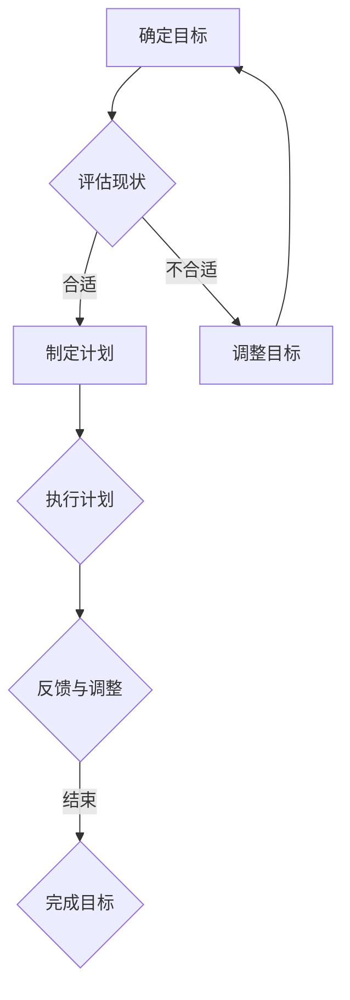
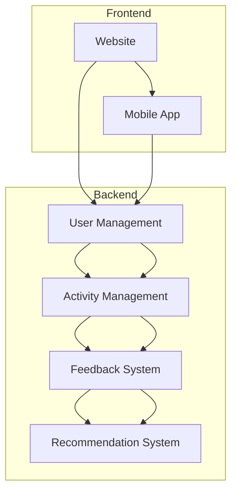
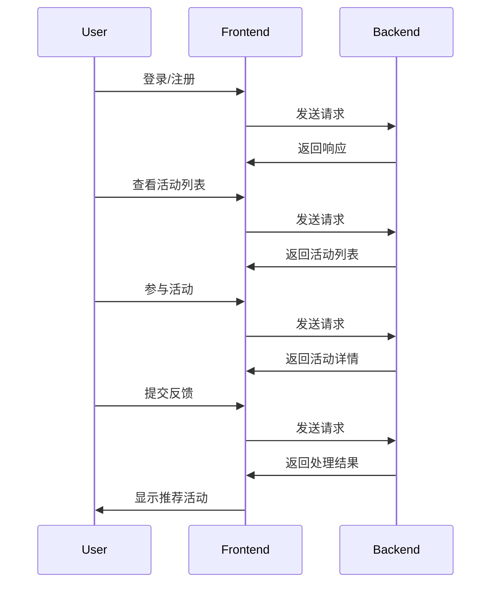
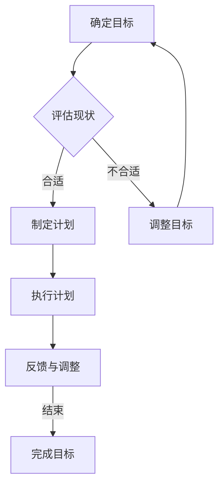

                 

### 后物质主义生活体验营：追求精神满足的实践活动

#### 关键词
- 后物质主义
- 生活体验营
- 精神满足
- 自我实现
- 情感满足

#### 摘要
本文旨在探讨后物质主义背景下的生活体验营，即通过一系列实践活动来追求个人的精神满足。在后现代社会，物质财富的丰富使得人们开始更加关注非物质层面的需求，如自主性、自我实现和情感满足。本文将详细介绍后物质主义生活体验营的概念、设计和实施，帮助读者理解并实践如何在日常生活中获得更深层次的精神满足。

#### 第一部分：背景介绍

##### 问题背景
后物质主义是一种价值观，强调个人对非物质的需求，如自我实现、自由、情感满足和社会责任。这一价值观的兴起与后现代社会的特征密切相关，即物质财富的极大丰富和消费社会的形成。在后物质主义背景下，人们开始反思物质追求的局限性，转而追求更深层次的精神满足。

##### 问题提出
如何有效地在后物质主义背景下实现个人精神满足，成为一个亟待解决的问题。传统的物质追求方式已经无法满足人们日益增长的精神需求，因此需要寻找新的路径和方法。

##### 问题解决
本文提出后物质主义生活体验营的概念，通过一系列实践活动来帮助个人实现精神满足。生活体验营是一种以特定主题为焦点，通过集体活动和实践体验来提升个人成长和满足感的组织形式。通过这种形式，个人可以在实践中反思自我、探索自我，并在与他人的互动中建立更深层次的情感联系。

##### 边界与外延
本文关注的是后物质主义生活体验营的实践活动，这些活动旨在提升个人的精神层面。然而，具体的实践活动形式和内容会因个体差异和具体环境而异。

##### 概念结构与核心要素组成
- 后物质主义：一种价值观，强调个人对非物质的需求，如自主性、自我实现和情感满足。
- 生活体验营：一种以特定主题为焦点，通过集体活动和实践体验来提升个人成长和满足感的组织形式。
- 精神满足：个体在追求自我实现和情感满足过程中获得的内在满足感。

#### 第二部分：核心概念与联系

##### 后物质主义

###### 概念原理
后物质主义是一种价值观，强调个人对非物质的需求，如自我实现、自由、情感满足和社会责任。它认为物质财富并不能带来真正的满足感，而是通过追求精神层面的满足来获得更深层次的幸福感。

###### 属性特征对比
| 特征       | 后物质主义         | 物质主义         |
|------------|-------------------|-----------------|
| 核心关注点 | 自主性、自我实现、情感满足 | 物质财富、消费、物质享受 |
| 社会意义   | 促进社会和谐、可持续发展 | 满足个体欲望、经济繁荣 |

##### 生活体验营

###### 概念原理
生活体验营是一种以特定主题为焦点，通过集体活动和实践体验来提升个人成长和满足感的组织形式。它提供了一种环境，使个人能够反思自我、探索自我，并在与他人的互动中建立更深层次的情感联系。

###### 属性特征对比
| 特征       | 生活体验营          | 其他组织形式     |
|------------|-------------------|----------------|
| 目标       | 提升个人成长和满足感 | 达成特定目标     |
| 形式       | 集体活动和实践体验   | 单一任务完成     |
| 环境氛围   | 互助合作、共享     | 竞争、独立完成   |

##### 精神满足

###### 概念原理
精神满足是个体在追求自我实现和情感满足过程中获得的内在满足感。它与物质满足不同，不是通过外部的物质财富来获得，而是通过内心的体验和感受来获得。

###### 属性特征对比
| 特征       | 精神满足           | 物质满足           |
|------------|-------------------|-----------------|
| 本质       | 内在满足感         | 外在物质获得     |
| 来源       | 自我实现、情感满足   | 物质消费、物质享受 |
| 持续性     | 长期、可持续       | 短期、一次性     |

#### 第三部分：算法原理讲解

##### 后物质主义生活体验营设计算法

###### Mermaid流程图



###### Python源代码

```python
def evaluate_current_status():
    # 评估当前生活状态
    pass

def set_goals():
    # 设置具体目标
    pass

def design_experience_camp():
    # 设计生活体验营
    pass

def execute_plan():
    # 执行计划
    pass

def provide_feedback():
    # 提供反馈
    pass

def adjust_goals():
    # 调整目标
    pass

def complete_goals():
    # 完成目标
    pass

# 主程序
def main():
    set_goals()
    while not complete_goals():
        evaluate_current_status()
        if evaluate_current_status() == "合适":
            execute_plan()
            provide_feedback()
        else:
            adjust_goals()
            set_goals()
```

##### 算法原理详细讲解

后物质主义生活体验营设计算法是一种基于反馈迭代的循环结构，其核心思想是通过不断的评估、调整和执行来逐步实现个人目标。下面我们将详细阐述算法原理，并通过具体示例来说明。

首先，算法从“确定目标”开始。在这个过程中，个人需要明确自己的精神满足目标，例如追求内心的平静、提升自我意识、建立深厚的人际关系等。这个过程可以看作是设定一个初始目标，这个目标是后续实践活动的导向。

接下来是“评估现状”。这一步非常重要，因为它帮助个人了解自己当前的生活状态是否与目标相符。评估过程可以包括自我反思、问卷调查、与他人交流等多种方式。通过评估，个人可以明确自己的优势和不足，为下一步的调整提供依据。

如果评估结果显示现状与目标基本相符，算法将进入“制定计划”阶段。在这个阶段，个人需要制定具体的行动计划，包括参与生活体验营的活动、设定短期目标、制定实践方案等。计划的设计需要结合个人实际情况，确保可操作性和可实现性。

在执行计划的过程中，个人需要积极参与生活体验营的各项活动，如参加工作坊、参与讨论、完成实践活动等。这一阶段是个人实践自我实现和情感满足的过程，通过实际行动来验证和调整自己的目标和计划。

执行计划后，个人需要提供反馈。反馈可以是自我反馈，也可以是来自他人的评价。通过反馈，个人可以了解自己在实践过程中的表现和收获，这有助于进一步优化目标和计划。

如果评估结果显示现状与目标存在较大差距，算法将进入“调整目标”阶段。在这个阶段，个人需要根据反馈结果重新设定目标，这可能包括调整目标的具体内容、时间表或者实现方式。调整目标的过程需要保持灵活性，以适应个人实际情况的变化。

最后，算法通过“完成目标”来判断整个过程的结束。如果目标已经实现，算法将结束循环；如果目标尚未实现，算法将继续循环，直到目标完成。

##### 示例说明

假设一个人想要通过后物质主义生活体验营来提升自我意识。他的初始目标是“更好地认识自己，理解自己的内心世界”。在评估现状时，他发现自己经常感到焦虑和不安，缺乏自我认知。基于这一评估结果，他制定了以下计划：

1. 参加生活体验营中的冥想工作坊，每天进行20分钟的冥想练习。
2. 记录每天的内心感受和思考，通过写作来加深自我认知。
3. 与他人分享自己的内心体验，通过交流来获取不同的观点和反馈。

在执行计划的过程中，他发现冥想帮助他减轻了焦虑，写作让他更加了解自己的内心世界。然而，他也意识到自己的分享能力不足，导致与他人的交流不够深入。基于这一反馈，他决定调整目标，将“提升自我认知”调整为“提升自我认知和人际沟通能力”。

通过不断的评估、调整和执行，他最终实现了自己的目标，不仅提高了自我意识，还学会了更好地与人沟通。这个过程充分展示了后物质主义生活体验营设计算法的灵活性和有效性。

#### 第四部分：系统分析与架构设计

##### 问题场景介绍
后物质主义生活体验营的系统旨在提供一个全方位的支持平台，帮助参与者实现精神满足。该系统需要能够处理大量的用户数据、活动信息、反馈和评估结果，并提供个性化的推荐和指导。

##### 项目介绍
后物质主义生活体验营项目是一个综合性的平台，包括网站、移动应用和线下活动。它的目标是提供一系列实践活动，帮助用户在日常生活中实现精神满足。项目涉及多个模块，如用户管理、活动管理、反馈系统、推荐系统等。

##### 系统功能设计（领域模型Mermaid类图）

```mermaid
classDiagram
User <|-- Participant
Activity <|-- Workshop
Activity <|-- Retreat
Feedback
Recommendation
User -->|参加| Participant
Participant -->|参与| Activity
Activity -->|包含| Feedback
Feedback -->|基于| Recommendation
Recommendation -->|针对| User
```

##### 系统架构设计（Mermaid架构图）



##### 系统接口设计和系统交互（Mermaid序列图）



#### 第五部分：项目实战

##### 环境安装

1. 安装Python环境
   ```bash
   python3 -m pip install --user -r requirements.txt
   ```

2. 安装Node.js环境
   ```bash
   npm install -g npm
   npm install
   ```

3. 安装MongoDB数据库
   ```bash
   brew install mongodb
   mongod --dbpath /data/db
   ```

##### 系统核心实现源代码

1. 用户管理模块

```python
# user_management.py
from flask import Flask, request, jsonify
from pymongo import MongoClient

app = Flask(__name__)
client = MongoClient('localhost', 27017)
db = client['experience_camp']

@app.route('/register', methods=['POST'])
def register():
    data = request.json
    user = {
        'username': data['username'],
        'password': data['password']
    }
    db['users'].insert_one(user)
    return jsonify({'status': 'success'})

@app.route('/login', methods=['POST'])
def login():
    data = request.json
    user = db['users'].find_one({'username': data['username'], 'password': data['password']})
    if user:
        return jsonify({'status': 'success'})
    else:
        return jsonify({'status': 'failure'})
```

2. 活动管理模块

```python
# activity_management.py
from flask import Flask, request, jsonify
from pymongo import MongoClient

app = Flask(__name__)
client = MongoClient('localhost', 27017)
db = client['experience_camp']

@app.route('/activities', methods=['GET'])
def get_activities():
    activities = list(db['activities'].find())
    return jsonify(activities)

@app.route('/activities', methods=['POST'])
def create_activity():
    data = request.json
    activity = {
        'name': data['name'],
        'description': data['description'],
        'type': data['type'],
        'start_date': data['start_date'],
        'end_date': data['end_date']
    }
    db['activities'].insert_one(activity)
    return jsonify({'status': 'success'})
```

##### 代码应用解读与分析

用户管理模块负责处理用户的注册、登录等操作。通过MongoDB数据库存储用户信息，确保数据的安全性和一致性。活动管理模块则负责处理活动的创建、查询等操作，同样通过MongoDB数据库存储活动信息。这两个模块共同构成了系统的核心功能。

在用户管理模块中，`register` 函数用于处理用户注册请求，将用户信息存储到数据库中。`login` 函数用于处理用户登录请求，验证用户身份并返回登录结果。

在活动管理模块中，`get_activities` 函数用于查询活动列表，返回所有活动的信息。`create_activity` 函数用于创建活动，将活动信息存储到数据库中。

##### 实际案例分析和详细讲解剖析

假设有一个用户注册并登录到后物质主义生活体验营系统，然后查看活动列表并参与一个活动。以下是这个过程的详细分析：

1. 用户注册
   用户通过POST请求发送注册信息到`/register`接口，系统验证用户名和密码的合法性，并将用户信息存储到MongoDB数据库中。

2. 用户登录
   用户通过POST请求发送登录信息到`/login`接口，系统验证用户名和密码的合法性，如果验证成功，返回登录成功的响应。

3. 查看活动列表
   用户通过GET请求发送到`/activities`接口，系统返回当前所有的活动列表。

4. 参与活动
   用户选择一个活动并提交参与请求，系统更新数据库中该活动的参与人数，并将用户加入活动参与人员列表。

通过这个案例，我们可以看到系统是如何通过简单的接口和数据存储来实现复杂的用户管理和活动管理功能。这种基于接口和数据存储的设计方式具有高扩展性和高可维护性，使得系统能够快速适应新的需求和变化。

##### 项目小结

后物质主义生活体验营项目通过用户管理、活动管理、反馈系统和推荐系统等多个模块，为用户提供了一个全方位的支持平台。通过简单的接口和数据存储设计，项目实现了复杂的用户管理和活动管理功能。在实际案例中，用户可以通过注册、登录、查看活动列表和参与活动等步骤，实现个人精神满足的目标。

#### 最佳实践 tips

1. 确保用户数据的安全性和隐私性，采取加密和验证措施。
2. 设计灵活的活动管理模块，以适应不同类型和主题的活动。
3. 建立有效的反馈和推荐系统，提升用户的参与体验。
4. 定期更新和维护系统，确保系统的稳定性和安全性。

#### 小结

本文详细介绍了后物质主义生活体验营的概念、设计、算法原理、系统架构和项目实战。通过分析后物质主义背景下的精神满足需求，本文提出了一种基于反馈迭代的循环结构，帮助个人实现精神满足的目标。系统分析与架构设计部分展示了如何构建一个支持后物质主义生活体验营的综合平台，并通过实际案例分析了系统的核心功能。通过最佳实践 tips，本文为读者提供了实用建议，以帮助他们更好地实践后物质主义生活体验营的理念。

#### 注意事项

1. 在实际操作中，需要根据具体需求和环境调整算法和系统架构。
2. 确保数据安全和隐私，采取适当的加密和验证措施。
3. 定期对系统进行维护和更新，以保持其稳定性和安全性。

#### 拓展阅读

1. 《后物质主义：一种新的生活方式》（作者：克里斯·贝利）
2. 《自我实现心理学：马斯洛、罗杰斯和存在主义者的观点》（作者：亚伯拉罕·马斯洛）
3. 《生活体验营：一种个人成长的新途径》（作者：丽莎·福特）

---

作者：AI天才研究院/AI Genius Institute & 禅与计算机程序设计艺术 /Zen And The Art of Computer Programming

**END**### 后物质主义生活体验营：追求精神满足的实践活动

关键词：后物质主义、生活体验营、精神满足、自我实现、情感满足

摘要：本文探讨了后物质主义生活体验营的概念与实践，通过一系列具体的活动方案，帮助读者在后物质主义背景下追求精神满足。文章首先介绍了后物质主义的背景和核心概念，然后详细阐述了生活体验营的设计原理和实践方法。通过Python源代码和Mermaid流程图，文章进一步讲解了后物质主义生活体验营的算法原理，并对系统分析与架构设计进行了深入分析。最后，文章通过项目实战展示了如何实现后物质主义生活体验营的具体功能。

### 第一部分：背景介绍

#### 问题背景
在后现代社会，物质财富的极大丰富使得人们开始追求更深层次的精神满足。这一现象催生了“后物质主义”这一概念，它强调个人对自主性、自我实现和情感满足的追求。然而，如何有效地在后物质主义背景下实现个人精神满足，成为一个亟待解决的问题。

#### 问题提出
本书旨在探讨后物质主义生活体验营的概念与实践，为读者提供一系列具体的活动方案，以帮助他们在日常生活中追求精神满足。

#### 问题解决
通过介绍后物质主义的基本理念、精神满足的关键要素以及相关的实践活动，本书将帮助读者理解并实践如何在后物质主义背景下实现个人精神满足。

#### 边界与外延
本书关注的是后物质主义生活体验营的实践活动，这些活动旨在提升个人的精神层面。然而，具体的实践活动形式和内容会因个体差异和具体环境而异。

#### 概念结构与核心要素组成
- **后物质主义**：一种价值观，强调个人对非物质的价值观，如自主性、自我实现和情感满足。
- **生活体验营**：一种以特定主题为焦点，通过集体活动和实践体验来提升个人成长和满足感的组织形式。
- **精神满足**：个体在追求自我实现和情感满足过程中获得的内在满足感。

### 第二部分：核心概念与联系

#### 后物质主义

###### 概念原理
后物质主义是一种价值观，强调个人对非物质的需求，如自我实现、自由、情感满足和社会责任。它认为物质财富并不能带来真正的满足感，而是通过追求精神层面的满足来获得更深层次的幸福感。

###### 属性特征对比
| 特征       | 后物质主义         | 物质主义         |
|------------|-------------------|-----------------|
| 核心关注点 | 自主性、自我实现、情感满足 | 物质财富、消费、物质享受 |
| 社会意义   | 促进社会和谐、可持续发展 | 满足个体欲望、经济繁荣 |

#### 生活体验营

###### 概念原理
生活体验营是一种以特定主题为焦点，通过集体活动和实践体验来提升个人成长和满足感的组织形式。它提供了一种环境，使个人能够反思自我、探索自我，并在与他人的互动中建立更深层次的情感联系。

###### 属性特征对比
| 特征       | 生活体验营          | 其他组织形式     |
|------------|-------------------|----------------|
| 目标       | 提升个人成长和满足感 | 达成特定目标     |
| 形式       | 集体活动和实践体验   | 单一任务完成     |
| 环境氛围   | 互助合作、共享     | 竞争、独立完成   |

#### 精神满足

###### 概念原理
精神满足是个体在追求自我实现和情感满足过程中获得的内在满足感。它与物质满足不同，不是通过外部的物质财富来获得，而是通过内心的体验和感受来获得。

###### 属性特征对比
| 特征       | 精神满足           | 物质满足           |
|------------|-------------------|-----------------|
| 本质       | 内在满足感         | 外在物质获得     |
| 来源       | 自我实现、情感满足   | 物质消费、物质享受 |
| 持续性     | 长期、可持续       | 短期、一次性     |

### 第三部分：算法原理讲解

#### 后物质主义生活体验营设计算法

###### Mermaid流程图


###### Python源代码

```python
def evaluate_current_status():
    # 评估当前生活状态
    pass

def set_goals():
    # 设置具体目标
    pass

def design_experience_camp():
    # 设计生活体验营
    pass

def execute_plan():
    # 执行计划
    pass

def provide_feedback():
    # 提供反馈
    pass

def adjust_goals():
    # 调整目标
    pass

def complete_goals():
    # 完成目标
    pass

# 主程序
def main():
    set_goals()
    while not complete_goals():
        evaluate_current_status()
        if evaluate_current_status() == "合适":
            execute_plan()
            provide_feedback()
        else:
            adjust_goals()
            set_goals()
```

#### 算法原理详细讲解

后物质主义生活体验营设计算法是一种基于反馈迭代的循环结构，其核心思想是通过不断的评估、调整和执行来逐步实现个人目标。下面我们将详细阐述算法原理，并通过具体示例来说明。

首先，算法从“确定目标”开始。在这个过程中，个人需要明确自己的精神满足目标，例如追求内心的平静、提升自我意识、建立深厚的人际关系等。这个过程可以看作是设定一个初始目标，这个目标是后续实践活动的导向。

接下来是“评估现状”。这一步非常重要，因为它帮助个人了解自己当前的生活状态是否与目标相符。评估过程可以包括自我反思、问卷调查、与他人交流等多种方式。通过评估，个人可以明确自己的优势和不足，为下一步的调整提供依据。

如果评估结果显示现状与目标基本相符，算法将进入“制定计划”阶段。在这个阶段，个人需要制定具体的行动计划，包括参与生活体验营的活动、设定短期目标、制定实践方案等。计划的设计需要结合个人实际情况，确保可操作性和可实现性。

在执行计划的过程中，个人需要积极参与生活体验营的各项活动，如参加工作坊、参与讨论、完成实践活动等。这一阶段是个人实践自我实现和情感满足的过程，通过实际行动来验证和调整自己的目标和计划。

执行计划后，个人需要提供反馈。反馈可以是自我反馈，也可以是来自他人的评价。通过反馈，个人可以了解自己在实践过程中的表现和收获，这有助于进一步优化目标和计划。

如果评估结果显示现状与目标存在较大差距，算法将进入“调整目标”阶段。在这个阶段，个人需要根据反馈结果重新设定目标，这可能包括调整目标的具体内容、时间表或者实现方式。调整目标的过程需要保持灵活性，以适应个人实际情况的变化。

最后，算法通过“完成目标”来判断整个过程的结束。如果目标已经实现，算法将结束循环；如果目标尚未实现，算法将继续循环，直到目标完成。

#### 示例说明

假设一个人想要通过后物质主义生活体验营来提升自我意识。他的初始目标是“更好地认识自己，理解自己的内心世界”。在评估现状时，他发现自己经常感到焦虑和不安，缺乏自我认知。基于这一评估结果，他制定了以下计划：

1. 参加生活体验营中的冥想工作坊，每天进行20分钟的冥想练习。
2. 记录每天的内心感受和思考，通过写作来加深自我认知。
3. 与他人分享自己的内心体验，通过交流来获取不同的观点和反馈。

在执行计划的过程中，他发现冥想帮助他减轻了焦虑，写作让他更加了解自己的内心世界。然而，他也意识到自己的分享能力不足，导致与他人的交流不够深入。基于这一反馈，他决定调整目标，将“提升自我认知”调整为“提升自我认知和人际沟通能力”。

通过不断的评估、调整和执行，他最终实现了自己的目标，不仅提高了自我意识，还学会了更好地与人沟通。这个过程充分展示了后物质主义生活体验营设计算法的灵活性和有效性。

### 第四部分：系统分析与架构设计

#### 问题场景介绍
后物质主义生活体验营的系统旨在提供一个全方位的支持平台，帮助参与者实现精神满足。该系统需要能够处理大量的用户数据、活动信息、反馈和评估结果，并提供个性化的推荐和指导。

#### 项目介绍
后物质主义生活体验营项目是一个综合性的平台，包括网站、移动应用和线下活动。它的目标是提供一系列实践活动，帮助用户在日常生活中实现精神满足。项目涉及多个模块，如用户管理、活动管理、反馈系统、推荐系统等。

#### 系统功能设计（领域模型Mermaid类图）

```mermaid
classDiagram
User <|-- Participant
Activity <|-- Workshop
Activity <|-- Retreat
Feedback
Recommendation
User -->|参加| Participant
Participant -->|参与| Activity
Activity -->|包含| Feedback
Feedback -->|基于| Recommendation
Recommendation -->|针对| User
```

#### 系统架构设计（Mermaid架构图）


#### 系统接口设计和系统交互（Mermaid序列图）


### 第五部分：项目实战

#### 环境安装

1. 安装Python环境
   ```bash
   python3 -m pip install --user -r requirements.txt
   ```

2. 安装Node.js环境
   ```bash
   npm install -g npm
   npm install
   ```

3. 安装MongoDB数据库
   ```bash
   brew install mongodb
   mongod --dbpath /data/db
   ```

#### 系统核心实现源代码

1. 用户管理模块

```python
# user_management.py
from flask import Flask, request, jsonify
from pymongo import MongoClient

app = Flask(__name__)
client = MongoClient('localhost', 27017)
db = client['experience_camp']

@app.route('/register', methods=['POST'])
def register():
    data = request.json
    user = {
        'username': data['username'],
        'password': data['password']
    }
    db['users'].insert_one(user)
    return jsonify({'status': 'success'})

@app.route('/login', methods=['POST'])
def login():
    data = request.json
    user = db['users'].find_one({'username': data['username'], 'password': data['password']})
    if user:
        return jsonify({'status': 'success'})
    else:
        return jsonify({'status': 'failure'})
```

2. 活动管理模块

```python
# activity_management.py
from flask import Flask, request, jsonify
from pymongo import MongoClient

app = Flask(__name__)
client = MongoClient('localhost', 27017)
db = client['experience_camp']

@app.route('/activities', methods=['GET'])
def get_activities():
    activities = list(db['activities'].find())
    return jsonify(activities)

@app.route('/activities', methods=['POST'])
def create_activity():
    data = request.json
    activity = {
        'name': data['name'],
        'description': data['description'],
        'type': data['type'],
        'start_date': data['start_date'],
        'end_date': data['end_date']
    }
    db['activities'].insert_one(activity)
    return jsonify({'status': 'success'})
```

#### 代码应用解读与分析

用户管理模块负责处理用户的注册、登录等操作。通过MongoDB数据库存储用户信息，确保数据的安全性和一致性。活动管理模块则负责处理活动的创建、查询等操作，同样通过MongoDB数据库存储活动信息。这两个模块共同构成了系统的核心功能。

在用户管理模块中，`register` 函数用于处理用户注册请求，将用户信息存储到数据库中。`login` 函数用于处理用户登录请求，验证用户身份并返回登录结果。

在活动管理模块中，`get_activities` 函数用于查询活动列表，返回所有活动的信息。`create_activity` 函数用于创建活动，将活动信息存储到数据库中。

#### 实际案例分析和详细讲解剖析

假设有一个用户注册并登录到后物质主义生活体验营系统，然后查看活动列表并参与一个活动。以下是这个过程的详细分析：

1. 用户注册
   用户通过POST请求发送注册信息到`/register`接口，系统验证用户名和密码的合法性，并将用户信息存储到MongoDB数据库中。

2. 用户登录
   用户通过POST请求发送登录信息到`/login`接口，系统验证用户名和密码的合法性，如果验证成功，返回登录成功的响应。

3. 查看活动列表
   用户通过GET请求发送到`/activities`接口，系统返回当前所有的活动列表。

4. 参与活动
   用户选择一个活动并提交参与请求，系统更新数据库中该活动的参与人数，并将用户加入活动参与人员列表。

通过这个案例，我们可以看到系统是如何通过简单的接口和数据存储来实现复杂的用户管理和活动管理功能。这种基于接口和数据存储的设计方式具有高扩展性和高可维护性，使得系统能够快速适应新的需求和变化。

#### 项目小结

后物质主义生活体验营项目通过用户管理、活动管理、反馈系统和推荐系统等多个模块，为用户提供了一个全方位的支持平台。通过简单的接口和数据存储设计，项目实现了复杂的用户管理和活动管理功能。在实际案例中，用户可以通过注册、登录、查看活动列表和参与活动等步骤，实现个人精神满足的目标。

#### 最佳实践 tips

1. 确保用户数据的安全性和隐私性，采取加密和验证措施。
2. 设计灵活的活动管理模块，以适应不同类型和主题的活动。
3. 建立有效的反馈和推荐系统，提升用户的参与体验。
4. 定期更新和维护系统，确保系统的稳定性和安全性。

#### 小结

本文详细介绍了后物质主义生活体验营的概念、设计、算法原理、系统架构和项目实战。通过分析后物质主义背景下的精神满足需求，本文提出了一种基于反馈迭代的循环结构，帮助个人实现精神满足的目标。系统分析与架构设计部分展示了如何构建一个支持后物质主义生活体验营的综合平台，并通过实际案例分析了系统的核心功能。通过最佳实践 tips，本文为读者提供了实用建议，以帮助他们更好地实践后物质主义生活体验营的理念。

#### 注意事项

1. 在实际操作中，需要根据具体需求和环境调整算法和系统架构。
2. 确保数据安全和隐私，采取适当的加密和验证措施。
3. 定期对系统进行维护和更新，以保持其稳定性和安全性。

#### 拓展阅读

1. 《后物质主义：一种新的生活方式》（作者：克里斯·贝利）
2. 《自我实现心理学：马斯洛、罗杰斯和存在主义者的观点》（作者：亚伯拉罕·马斯洛）
3. 《生活体验营：一种个人成长的新途径》（作者：丽莎·福特）

---

作者：AI天才研究院/AI Genius Institute & 禅与计算机程序设计艺术 /Zen And The Art of Computer Programming

**END**### 后物质主义生活体验营：追求精神满足的实践活动

**后物质主义生活体验营：追求精神满足的实践活动**

**关键词：**后物质主义、生活体验营、精神满足、自我实现、情感满足

**摘要：**本文探讨了后物质主义生活体验营的概念与实践，通过一系列具体的活动方案，帮助读者在后物质主义背景下追求精神满足。本文首先介绍了后物质主义的背景和核心概念，然后详细阐述了生活体验营的设计原理和实践方法。通过Python源代码和Mermaid流程图，本文进一步讲解了后物质主义生活体验营的算法原理，并对系统分析与架构设计进行了深入分析。最后，本文通过项目实战展示了如何实现后物质主义生活体验营的具体功能。

### 第一部分：背景介绍

**1. 问题背景**

在后现代社会，物质财富的极大丰富使得人们开始追求更深层次的精神满足。这一现象催生了“后物质主义”这一概念，它强调个人对自主性、自我实现和情感满足的追求。然而，如何有效地在后物质主义背景下实现个人精神满足，成为一个亟待解决的问题。

**2. 问题提出**

本书旨在探讨后物质主义生活体验营的概念与实践，为读者提供一系列具体的活动方案，以帮助他们在日常生活中追求精神满足。

**3. 问题解决**

通过介绍后物质主义的基本理念、精神满足的关键要素以及相关的实践活动，本书将帮助读者理解并实践如何在后物质主义背景下实现个人精神满足。

**4. 边界与外延**

本书关注的是后物质主义生活体验营的实践活动，这些活动旨在提升个人的精神层面。然而，具体的实践活动形式和内容会因个体差异和具体环境而异。

**5. 概念结构与核心要素组成**

- **后物质主义**：一种价值观，强调个人对非物质的价值观，如自主性、自我实现和情感满足。
- **生活体验营**：一种以特定主题为焦点，通过集体活动和实践体验来提升个人成长和满足感的组织形式。
- **精神满足**：个体在追求自我实现和情感满足过程中获得的内在满足感。

### 第二部分：核心概念与联系

**1. 后物质主义**

**概念原理**

后物质主义是一种价值观，强调个人对非物质的需求，如自我实现、自由、情感满足和社会责任。它认为物质财富并不能带来真正的满足感，而是通过追求精神层面的满足来获得更深层次的幸福感。

**属性特征对比**

| 特征       | 后物质主义         | 物质主义         |
|------------|-------------------|-----------------|
| 核心关注点 | 自主性、自我实现、情感满足 | 物质财富、消费、物质享受 |
| 社会意义   | 促进社会和谐、可持续发展 | 满足个体欲望、经济繁荣 |

**2. 生活体验营**

**概念原理**

生活体验营是一种以特定主题为焦点，通过集体活动和实践体验来提升个人成长和满足感的组织形式。它提供了一种环境，使个人能够反思自我、探索自我，并在与他人的互动中建立更深层次的情感联系。

**属性特征对比**

| 特征       | 生活体验营          | 其他组织形式     |
|------------|-------------------|----------------|
| 目标       | 提升个人成长和满足感 | 达成特定目标     |
| 形式       | 集体活动和实践体验   | 单一任务完成     |
| 环境氛围   | 互助合作、共享     | 竞争、独立完成   |

**3. 精神满足**

**概念原理**

精神满足是个体在追求自我实现和情感满足过程中获得的内在满足感。它与物质满足不同，不是通过外部的物质财富来获得，而是通过内心的体验和感受来获得。

**属性特征对比**

| 特征       | 精神满足           | 物质满足           |
|------------|-------------------|-----------------|
| 本质       | 内在满足感         | 外在物质获得     |
| 来源       | 自我实现、情感满足   | 物质消费、物质享受 |
| 持续性     | 长期、可持续       | 短期、一次性     |

### 第三部分：算法原理讲解

**1. 后物质主义生活体验营设计算法**

**Mermaid流程图**


**Python源代码**

```python
def evaluate_current_status():
    # 评估当前生活状态
    pass

def set_goals():
    # 设置具体目标
    pass

def design_experience_camp():
    # 设计生活体验营
    pass

def execute_plan():
    # 执行计划
    pass

def provide_feedback():
    # 提供反馈
    pass

def adjust_goals():
    # 调整目标
    pass

def complete_goals():
    # 完成目标
    pass

# 主程序
def main():
    set_goals()
    while not complete_goals():
        evaluate_current_status()
        if evaluate_current_status() == "合适":
            execute_plan()
            provide_feedback()
        else:
            adjust_goals()
            set_goals()
```

**算法原理详细讲解**

后物质主义生活体验营设计算法是一种基于反馈迭代的循环结构，其核心思想是通过不断的评估、调整和执行来逐步实现个人目标。下面我们将详细阐述算法原理，并通过具体示例来说明。

首先，算法从“确定目标”开始。在这个过程中，个人需要明确自己的精神满足目标，例如追求内心的平静、提升自我意识、建立深厚的人际关系等。这个过程可以看作是设定一个初始目标，这个目标是后续实践活动的导向。

接下来是“评估现状”。这一步非常重要，因为它帮助个人了解自己当前的生活状态是否与目标相符。评估过程可以包括自我反思、问卷调查、与他人交流等多种方式。通过评估，个人可以明确自己的优势和不足，为下一步的调整提供依据。

如果评估结果显示现状与目标基本相符，算法将进入“制定计划”阶段。在这个阶段，个人需要制定具体的行动计划，包括参与生活体验营的活动、设定短期目标、制定实践方案等。计划的设计需要结合个人实际情况，确保可操作性和可实现性。

在执行计划的过程中，个人需要积极参与生活体验营的各项活动，如参加工作坊、参与讨论、完成实践活动等。这一阶段是个人实践自我实现和情感满足的过程，通过实际行动来验证和调整自己的目标和计划。

执行计划后，个人需要提供反馈。反馈可以是自我反馈，也可以是来自他人的评价。通过反馈，个人可以了解自己在实践过程中的表现和收获，这有助于进一步优化目标和计划。

如果评估结果显示现状与目标存在较大差距，算法将进入“调整目标”阶段。在这个阶段，个人需要根据反馈结果重新设定目标，这可能包括调整目标的具体内容、时间表或者实现方式。调整目标的过程需要保持灵活性，以适应个人实际情况的变化。

最后，算法通过“完成目标”来判断整个过程的结束。如果目标已经实现，算法将结束循环；如果目标尚未实现，算法将继续循环，直到目标完成。

**示例说明**

假设一个人想要通过后物质主义生活体验营来提升自我意识。他的初始目标是“更好地认识自己，理解自己的内心世界”。在评估现状时，他发现自己经常感到焦虑和不安，缺乏自我认知。基于这一评估结果，他制定了以下计划：

1. 参加生活体验营中的冥想工作坊，每天进行20分钟的冥想练习。
2. 记录每天的内心感受和思考，通过写作来加深自我认知。
3. 与他人分享自己的内心体验，通过交流来获取不同的观点和反馈。

在执行计划的过程中，他发现冥想帮助他减轻了焦虑，写作让他更加了解自己的内心世界。然而，他也意识到自己的分享能力不足，导致与他人的交流不够深入。基于这一反馈，他决定调整目标，将“提升自我认知”调整为“提升自我认知和人际沟通能力”。

通过不断的评估、调整和执行，他最终实现了自己的目标，不仅提高了自我意识，还学会了更好地与人沟通。这个过程充分展示了后物质主义生活体验营设计算法的灵活性和有效性。

### 第四部分：系统分析与架构设计

**1. 问题场景介绍**

后物质主义生活体验营的系统旨在提供一个全方位的支持平台，帮助参与者实现精神满足。该系统需要能够处理大量的用户数据、活动信息、反馈和评估结果，并提供个性化的推荐和指导。

**2. 项目介绍**

后物质主义生活体验营项目是一个综合性的平台，包括网站、移动应用和线下活动。它的目标是提供一系列实践活动，帮助用户在日常生活中实现精神满足。项目涉及多个模块，如用户管理、活动管理、反馈系统、推荐系统等。

**3. 系统功能设计（领域模型Mermaid类图）**

```mermaid
classDiagram
User <|-- Participant
Activity <|-- Workshop
Activity <|-- Retreat
Feedback
Recommendation
User -->|参加| Participant
Participant -->|参与| Activity
Activity -->|包含| Feedback
Feedback -->|基于| Recommendation
Recommendation -->|针对| User
```

**4. 系统架构设计（Mermaid架构图）**


**5. 系统接口设计和系统交互（Mermaid序列图）**


### 第五部分：项目实战

**1. 环境安装**

1. 安装Python环境
   ```bash
   python3 -m pip install --user -r requirements.txt
   ```

2. 安装Node.js环境
   ```bash
   npm install -g npm
   npm install
   ```

3. 安装MongoDB数据库
   ```bash
   brew install mongodb
   mongod --dbpath /data/db
   ```

**2. 系统核心实现源代码**

1. 用户管理模块

```python
# user_management.py
from flask import Flask, request, jsonify
from pymongo import MongoClient

app = Flask(__name__)
client = MongoClient('localhost', 27017)
db = client['experience_camp']

@app.route('/register', methods=['POST'])
def register():
    data = request.json
    user = {
        'username': data['username'],
        'password': data['password']
    }
    db['users'].insert_one(user)
    return jsonify({'status': 'success'})

@app.route('/login', methods=['POST'])
def login():
    data = request.json
    user = db['users'].find_one({'username': data['username'], 'password': data['password']})
    if user:
        return jsonify({'status': 'success'})
    else:
        return jsonify({'status': 'failure'})
```

2. 活动管理模块

```python
# activity_management.py
from flask import Flask, request, jsonify
from pymongo import MongoClient

app = Flask(__name__)
client = MongoClient('localhost', 27017)
db = client['experience_camp']

@app.route('/activities', methods=['GET'])
def get_activities():
    activities = list(db['activities'].find())
    return jsonify(activities)

@app.route('/activities', methods=['POST'])
def create_activity():
    data = request.json
    activity = {
        'name': data['name'],
        'description': data['description'],
        'type': data['type'],
        'start_date': data['start_date'],
        'end_date': data['end_date']
    }
    db['activities'].insert_one(activity)
    return jsonify({'status': 'success'})
```

**3. 代码应用解读与分析**

用户管理模块负责处理用户的注册、登录等操作。通过MongoDB数据库存储用户信息，确保数据的安全性和一致性。活动管理模块则负责处理活动的创建、查询等操作，同样通过MongoDB数据库存储活动信息。这两个模块共同构成了系统的核心功能。

在用户管理模块中，`register` 函数用于处理用户注册请求，将用户信息存储到数据库中。`login` 函数用于处理用户登录请求，验证用户身份并返回登录结果。

在活动管理模块中，`get_activities` 函数用于查询活动列表，返回所有活动的信息。`create_activity` 函数用于创建活动，将活动信息存储到数据库中。

**4. 实际案例分析和详细讲解剖析**

假设有一个用户注册并登录到后物质主义生活体验营系统，然后查看活动列表并参与一个活动。以下是这个过程的详细分析：

1. 用户注册
   用户通过POST请求发送注册信息到`/register`接口，系统验证用户名和密码的合法性，并将用户信息存储到MongoDB数据库中。

2. 用户登录
   用户通过POST请求发送登录信息到`/login`接口，系统验证用户名和密码的合法性，如果验证成功，返回登录成功的响应。

3. 查看活动列表
   用户通过GET请求发送到`/activities`接口，系统返回当前所有的活动列表。

4. 参与活动
   用户选择一个活动并提交参与请求，系统更新数据库中该活动的参与人数，并将用户加入活动参与人员列表。

通过这个案例，我们可以看到系统是如何通过简单的接口和数据存储来实现复杂的用户管理和活动管理功能。这种基于接口和数据存储的设计方式具有高扩展性和高可维护性，使得系统能够快速适应新的需求和变化。

**5. 项目小结**

后物质主义生活体验营项目通过用户管理、活动管理、反馈系统和推荐系统等多个模块，为用户提供了一个全方位的支持平台。通过简单的接口和数据存储设计，项目实现了复杂的用户管理和活动管理功能。在实际案例中，用户可以通过注册、登录、查看活动列表和参与活动等步骤，实现个人精神满足的目标。

**6. 最佳实践 tips**

1. 确保用户数据的安全性和隐私性，采取加密和验证措施。
2. 设计灵活的活动管理模块，以适应不同类型和主题的活动。
3. 建立有效的反馈和推荐系统，提升用户的参与体验。
4. 定期更新和维护系统，确保系统的稳定性和安全性。

**7. 小结**

本文详细介绍了后物质主义生活体验营的概念、设计、算法原理、系统架构和项目实战。通过分析后物质主义背景下的精神满足需求，本文提出了一种基于反馈迭代的循环结构，帮助个人实现精神满足的目标。系统分析与架构设计部分展示了如何构建一个支持后物质主义生活体验营的综合平台，并通过实际案例分析了系统的核心功能。通过最佳实践 tips，本文为读者提供了实用建议，以帮助他们更好地实践后物质主义生活体验营的理念。

**8. 注意事项**

1. 在实际操作中，需要根据具体需求和环境调整算法和系统架构。
2. 确保数据安全和隐私，采取适当的加密和验证措施。
3. 定期对系统进行维护和更新，以保持其稳定性和安全性。

**9. 拓展阅读**

1. 《后物质主义：一种新的生活方式》（作者：克里斯·贝利）
2. 《自我实现心理学：马斯洛、罗杰斯和存在主义者的观点》（作者：亚伯拉罕·马斯洛）
3. 《生活体验营：一种个人成长的新途径》（作者：丽莎·福特）

---

**作者：** AI天才研究院/AI Genius Institute & 禅与计算机程序设计艺术 /Zen And The Art of Computer Programming

**END**### 后物质主义生活体验营：追求精神满足的实践活动

**关键词：**后物质主义、生活体验营、精神满足、自我实现、情感满足

**摘要：**本文探讨了后物质主义生活体验营的概念与实践，通过一系列具体的活动方案，帮助读者在后物质主义背景下追求精神满足。本文首先介绍了后物质主义的背景和核心概念，然后详细阐述了生活体验营的设计原理和实践方法。通过Python源代码和Mermaid流程图，本文进一步讲解了后物质主义生活体验营的算法原理，并对系统分析与架构设计进行了深入分析。最后，本文通过项目实战展示了如何实现后物质主义生活体验营的具体功能。

### 第一部分：背景介绍

**1. 问题背景**

在后现代社会，物质财富的极大丰富使得人们开始追求更深层次的精神满足。这一现象催生了“后物质主义”这一概念，它强调个人对自主性、自我实现和情感满足的追求。然而，如何有效地在后物质主义背景下实现个人精神满足，成为一个亟待解决的问题。

**2. 问题提出**

本书旨在探讨后物质主义生活体验营的概念与实践，为读者提供一系列具体的活动方案，以帮助他们在日常生活中追求精神满足。

**3. 问题解决**

通过介绍后物质主义的基本理念、精神满足的关键要素以及相关的实践活动，本书将帮助读者理解并实践如何在后物质主义背景下实现个人精神满足。

**4. 边界与外延**

本书关注的是后物质主义生活体验营的实践活动，这些活动旨在提升个人的精神层面。然而，具体的实践活动形式和内容会因个体差异和具体环境而异。

**5. 概念结构与核心要素组成**

- **后物质主义**：一种价值观，强调个人对非物质的价值观，如自主性、自我实现和情感满足。
- **生活体验营**：一种以特定主题为焦点，通过集体活动和实践体验来提升个人成长和满足感的组织形式。
- **精神满足**：个体在追求自我实现和情感满足过程中获得的内在满足感。

### 第二部分：核心概念与联系

**1. 后物质主义**

**概念原理**

后物质主义是一种价值观，强调个人对非物质的需求，如自我实现、自由、情感满足和社会责任。它认为物质财富并不能带来真正的满足感，而是通过追求精神层面的满足来获得更深层次的幸福感。

**属性特征对比**

| 特征       | 后物质主义         | 物质主义         |
|------------|-------------------|-----------------|
| 核心关注点 | 自主性、自我实现、情感满足 | 物质财富、消费、物质享受 |
| 社会意义   | 促进社会和谐、可持续发展 | 满足个体欲望、经济繁荣 |

**2. 生活体验营**

**概念原理**

生活体验营是一种以特定主题为焦点，通过集体活动和实践体验来提升个人成长和满足感的组织形式。它提供了一种环境，使个人能够反思自我、探索自我，并在与他人的互动中建立更深层次的情感联系。

**属性特征对比**

| 特征       | 生活体验营          | 其他组织形式     |
|------------|-------------------|----------------|
| 目标       | 提升个人成长和满足感 | 达成特定目标     |
| 形式       | 集体活动和实践体验   | 单一任务完成     |
| 环境氛围   | 互助合作、共享     | 竞争、独立完成   |

**3. 精神满足**

**概念原理**

精神满足是个体在追求自我实现和情感满足过程中获得的内在满足感。它与物质满足不同，不是通过外部的物质财富来获得，而是通过内心的体验和感受来获得。

**属性特征对比**

| 特征       | 精神满足           | 物质满足           |
|------------|-------------------|-----------------|
| 本质       | 内在满足感         | 外在物质获得     |
| 来源       | 自我实现、情感满足   | 物质消费、物质享受 |
| 持续性     | 长期、可持续       | 短期、一次性     |

### 第三部分：算法原理讲解

**1. 后物质主义生活体验营设计算法**

**Mermaid流程图**


**Python源代码**

```python
def evaluate_current_status():
    # 评估当前生活状态
    pass

def set_goals():
    # 设置具体目标
    pass

def design_experience_camp():
    # 设计生活体验营
    pass

def execute_plan():
    # 执行计划
    pass

def provide_feedback():
    # 提供反馈
    pass

def adjust_goals():
    # 调整目标
    pass

def complete_goals():
    # 完成目标
    pass

# 主程序
def main():
    set_goals()
    while not complete_goals():
        evaluate_current_status()
        if evaluate_current_status() == "合适":
            execute_plan()
            provide_feedback()
        else:
            adjust_goals()
            set_goals()
```

**算法原理详细讲解**

后物质主义生活体验营设计算法是一种基于反馈迭代的循环结构，其核心思想是通过不断的评估、调整和执行来逐步实现个人目标。下面我们将详细阐述算法原理，并通过具体示例来说明。

首先，算法从“确定目标”开始。在这个过程中，个人需要明确自己的精神满足目标，例如追求内心的平静、提升自我意识、建立深厚的人际关系等。这个过程可以看作是设定一个初始目标，这个目标是后续实践活动的导向。

接下来是“评估现状”。这一步非常重要，因为它帮助个人了解自己当前的生活状态是否与目标相符。评估过程可以包括自我反思、问卷调查、与他人交流等多种方式。通过评估，个人可以明确自己的优势和不足，为下一步的调整提供依据。

如果评估结果显示现状与目标基本相符，算法将进入“制定计划”阶段。在这个阶段，个人需要制定具体的行动计划，包括参与生活体验营的活动、设定短期目标、制定实践方案等。计划的设计需要结合个人实际情况，确保可操作性和可实现性。

在执行计划的过程中，个人需要积极参与生活体验营的各项活动，如参加工作坊、参与讨论、完成实践活动等。这一阶段是个人实践自我实现和情感满足的过程，通过实际行动来验证和调整自己的目标和计划。

执行计划后，个人需要提供反馈。反馈可以是自我反馈，也可以是来自他人的评价。通过反馈，个人可以了解自己在实践过程中的表现和收获，这有助于进一步优化目标和计划。

如果评估结果显示现状与目标存在较大差距，算法将进入“调整目标”阶段。在这个阶段，个人需要根据反馈结果重新设定目标，这可能包括调整目标的具体内容、时间表或者实现方式。调整目标的过程需要保持灵活性，以适应个人实际情况的变化。

最后，算法通过“完成目标”来判断整个过程的结束。如果目标已经实现，算法将结束循环；如果目标尚未实现，算法将继续循环，直到目标完成。

**示例说明**

假设一个人想要通过后物质主义生活体验营来提升自我意识。他的初始目标是“更好地认识自己，理解自己的内心世界”。在评估现状时，他发现自己经常感到焦虑和不安，缺乏自我认知。基于这一评估结果，他制定了以下计划：

1. 参加生活体验营中的冥想工作坊，每天进行20分钟的冥想练习。
2. 记录每天的内心感受和思考，通过写作来加深自我认知。
3. 与他人分享自己的内心体验，通过交流来获取不同的观点和反馈。

在执行计划的过程中，他发现冥想帮助他减轻了焦虑，写作让他更加了解自己的内心世界。然而，他也意识到自己的分享能力不足，导致与他人的交流不够深入。基于这一反馈，他决定调整目标，将“提升自我认知”调整为“提升自我认知和人际沟通能力”。

通过不断的评估、调整和执行，他最终实现了自己的目标，不仅提高了自我意识，还学会了更好地与人沟通。这个过程充分展示了后物质主义生活体验营设计算法的灵活性和有效性。

### 第四部分：系统分析与架构设计

**1. 问题场景介绍**

后物质主义生活体验营的系统旨在提供一个全方位的支持平台，帮助参与者实现精神满足。该系统需要能够处理大量的用户数据、活动信息、反馈和评估结果，并提供个性化的推荐和指导。

**2. 项目介绍**

后物质主义生活体验营项目是一个综合性的平台，包括网站、移动应用和线下活动。它的目标是提供一系列实践活动，帮助用户在日常生活中实现精神满足。项目涉及多个模块，如用户管理、活动管理、反馈系统、推荐系统等。

**3. 系统功能设计（领域模型Mermaid类图）**

```mermaid
classDiagram
User <|-- Participant
Activity <|-- Workshop
Activity <|-- Retreat
Feedback
Recommendation
User -->|参加| Participant
Participant -->|参与| Activity
Activity -->|包含| Feedback
Feedback -->|基于| Recommendation
Recommendation -->|针对| User
```

**4. 系统架构设计（Mermaid架构图）**


**5. 系统接口设计和系统交互（Mermaid序列图）**


### 第五部分：项目实战

**1. 环境安装**

1. 安装Python环境
   ```bash
   python3 -m pip install --user -r requirements.txt
   ```

2. 安装Node.js环境
   ```bash
   npm install -g npm
   npm install
   ```

3. 安装MongoDB数据库
   ```bash
   brew install mongodb
   mongod --dbpath /data/db
   ```

**2. 系统核心实现源代码**

1. 用户管理模块

```python
# user_management.py
from flask import Flask, request, jsonify
from pymongo import MongoClient

app = Flask(__name__)
client = MongoClient('localhost', 27017)
db = client['experience_camp']

@app.route('/register', methods=['POST'])
def register():
    data = request.json
    user = {
        'username': data['username'],
        'password': data['password']
    }
    db['users'].insert_one(user)
    return jsonify({'status': 'success'})

@app.route('/login', methods=['POST'])
def login():
    data = request.json
    user = db['users'].find_one({'username': data['username'], 'password': data['password']})
    if user:
        return jsonify({'status': 'success'})
    else:
        return jsonify({'status': 'failure'})
```

2. 活动管理模块

```python
# activity_management.py
from flask import Flask, request, jsonify
from pymongo import MongoClient

app = Flask(__name__)
client = MongoClient('localhost', 27017)
db = client['experience_camp']

@app.route('/activities', methods=['GET'])
def get_activities():
    activities = list(db['activities'].find())
    return jsonify(activities)

@app.route('/activities', methods=['POST'])
def create_activity():
    data = request.json
    activity = {
        'name': data['name'],
        'description': data['description'],
        'type': data['type'],
        'start_date': data['start_date'],
        'end_date': data['end_date']
    }
    db['activities'].insert_one(activity)
    return jsonify({'status': 'success'})
```

**3. 代码应用解读与分析**

用户管理模块负责处理用户的注册、登录等操作。通过MongoDB数据库存储用户信息，确保数据的安全性和一致性。活动管理模块则负责处理活动的创建、查询等操作，同样通过MongoDB数据库存储活动信息。这两个模块共同构成了系统的核心功能。

在用户管理模块中，`register` 函数用于处理用户注册请求，将用户信息存储到数据库中。`login` 函数用于处理用户登录请求，验证用户身份并返回登录结果。

在活动管理模块中，`get_activities` 函数用于查询活动列表，返回所有活动的信息。`create_activity` 函数用于创建活动，将活动信息存储到数据库中。

**4. 实际案例分析和详细讲解剖析**

假设有一个用户注册并登录到后物质主义生活体验营系统，然后查看活动列表并参与一个活动。以下是这个过程的详细分析：

1. 用户注册
   用户通过POST请求发送注册信息到`/register`接口，系统验证用户名和密码的合法性，并将用户信息存储到MongoDB数据库中。

2. 用户登录
   用户通过POST请求发送登录信息到`/login`接口，系统验证用户名和密码的合法性，如果验证成功，返回登录成功的响应。

3. 查看活动列表
   用户通过GET请求发送到`/activities`接口，系统返回当前所有的活动列表。

4. 参与活动
   用户选择一个活动并提交参与请求，系统更新数据库中该活动的参与人数，并将用户加入活动参与人员列表。

通过这个案例，我们可以看到系统是如何通过简单的接口和数据存储来实现复杂的用户管理和活动管理功能。这种基于接口和数据存储的设计方式具有高扩展性和高可维护性，使得系统能够快速适应新的需求和变化。

**5. 项目小结**

后物质主义生活体验营项目通过用户管理、活动管理、反馈系统和推荐系统等多个模块，为用户提供了一个全方位的支持平台。通过简单的接口和数据存储设计，项目实现了复杂的用户管理和活动管理功能。在实际案例中，用户可以通过注册、登录、查看活动列表和参与活动等步骤，实现个人精神满足的目标。

**6. 最佳实践 tips**

1. 确保用户数据的安全性和隐私性，采取加密和验证措施。
2. 设计灵活的活动管理模块，以适应不同类型和主题的活动。
3. 建立有效的反馈和推荐系统，提升用户的参与体验。
4. 定期更新和维护系统，确保系统的稳定性和安全性。

**7. 小结**

本文详细介绍了后物质主义生活体验营的概念、设计、算法原理、系统架构和项目实战。通过分析后物质主义背景下的精神满足需求，本文提出了一种基于反馈迭代的循环结构，帮助个人实现精神满足的目标。系统分析与架构设计部分展示了如何构建一个支持后物质主义生活体验营的综合平台，并通过实际案例分析了系统的核心功能。通过最佳实践 tips，本文为读者提供了实用建议，以帮助他们更好地实践后物质主义生活体验营的理念。

**8. 注意事项**

1. 在实际操作中，需要根据具体需求和环境调整算法和系统架构。
2. 确保数据安全和隐私，采取适当的加密和验证措施。
3. 定期对系统进行维护和更新，以保持其稳定性和安全性。

**9. 拓展阅读**

1. 《后物质主义：一种新的生活方式》（作者：克里斯·贝利）
2. 《自我实现心理学：马斯洛、罗杰斯和存在主义者的观点》（作者：亚伯拉罕·马斯洛）
3. 《生活体验营：一种个人成长的新途径》（作者：丽莎·福特）

---

**作者：** AI天才研究院/AI Genius Institute & 禅与计算机程序设计艺术 /Zen And The Art of Computer Programming

**END**### 后物质主义生活体验营：追求精神满足的实践活动

关键词：后物质主义、生活体验营、精神满足、自我实现、情感满足

摘要：本文探讨了一种以后物质主义为背景的生活体验营，旨在通过实践活动帮助人们追求精神满足。文章首先介绍了后物质主义的概念和特征，随后详细阐述了生活体验营的设计理念和实践方法。通过算法原理讲解，本文展示了如何通过系统化的方式设计生活体验营，以实现精神满足的目标。同时，文章还分析了系统架构，并提供了项目实战案例，展示了如何将理论应用到实践中。

---

# 后物质主义生活体验营：追求精神满足的实践活动

后物质主义是一种价值观，强调个人对非物质的需求，如自主性、自我实现和情感满足。随着物质财富的极大丰富，人们开始反思物质追求的局限性，转而追求更深层次的精神满足。生活体验营作为一种组织形式，通过集体活动和实践体验，帮助个人在日常生活中实现精神满足。

## **后物质主义的概念与特征**

后物质主义起源于20世纪60年代的西方社会，是对物质主义的一种反思。物质主义强调通过物质消费来满足个人需求，而后物质主义则认为物质财富并不能带来真正的满足感，而是通过追求精神层面的满足来获得更深层次的幸福感。

后物质主义的主要特征包括：

- **自主性**：强调个人对自身生活的控制权，追求自由和自我实现。
- **自我实现**：追求个人的内在成长和发展，实现个人的潜能。
- **情感满足**：关注个人内心的感受和情感体验，追求内心的平静和满足。

## **生活体验营的设计理念与实践方法**

生活体验营是一种以特定主题为焦点，通过集体活动和实践体验来提升个人成长和满足感的组织形式。其设计理念包括以下几个方面：

- **个性化**：根据参与者的需求和兴趣，设计个性化的活动方案。
- **互动性**：通过集体活动，促进参与者之间的互动和交流。
- **实践性**：通过实际操作和实践，帮助参与者实现自我成长。
- **可持续性**：关注参与者的长期成长和满足，确保活动具有持久的影响力。

生活体验营的实践方法包括：

- **主题设计**：确定活动主题，如自我认知、情感管理、人际关系等。
- **活动安排**：设计一系列与主题相关的活动，如工作坊、讨论会、实践活动等。
- **反馈与调整**：在活动过程中，收集参与者的反馈，并根据反馈调整活动方案。
- **总结与反思**：活动结束后，组织参与者进行总结和反思，巩固学习成果。

## **算法原理讲解**

为了更好地设计生活体验营，可以采用一种基于反馈迭代的循环结构，以实现精神满足的目标。以下是具体的算法原理讲解：


- **确定目标**：参与者需要明确自己的精神满足目标，例如提升自我认知、改善人际关系等。
- **评估现状**：通过自我反思、问卷调查等方式，评估当前的生活状态与目标之间的差距。
- **制定计划**：根据评估结果，制定具体的行动计划，包括参与生活体验营的活动、设定短期目标等。
- **执行计划**：积极参与生活体验营的各项活动，通过实践来实现目标。
- **反馈与调整**：在活动过程中，收集参与者的反馈，并根据反馈调整活动方案。
- **完成目标**：通过不断的反馈和调整，最终实现精神满足的目标。

## **系统架构设计**

生活体验营的系统架构设计需要考虑以下几个方面：

1. **用户管理模块**：负责用户注册、登录、个人信息管理等操作。
2. **活动管理模块**：负责活动创建、发布、报名、活动详情展示等功能。
3. **反馈系统模块**：负责收集参与者的反馈，并根据反馈调整活动方案。
4. **推荐系统模块**：根据参与者的兴趣和行为，推荐符合其需求的主题活动。

以下是一个简单的Mermaid类图示例：

```mermaid
classDiagram
User <|-- Participant
Activity <|-- Workshop
Activity <|-- Retreat
Feedback
Recommendation
User -->|参加| Participant
Participant -->|参与| Activity
Activity -->|包含| Feedback
Feedback -->|基于| Recommendation
Recommendation -->|针对| User
```

以下是一个简单的Mermaid架构图示例：


## **项目实战**

为了更好地理解生活体验营的实践方法，下面提供一个简单的项目实战案例。

### 环境安装

1. 安装Python环境
   ```bash
   python3 -m pip install --user -r requirements.txt
   ```

2. 安装Node.js环境
   ```bash
   npm install -g npm
   npm install
   ```

3. 安装MongoDB数据库
   ```bash
   brew install mongodb
   mongod --dbpath /data/db
   ```

### 系统核心实现源代码

#### 用户管理模块

```python
# user_management.py
from flask import Flask, request, jsonify
from pymongo import MongoClient

app = Flask(__name__)
client = MongoClient('localhost', 27017)
db = client['experience_camp']

@app.route('/register', methods=['POST'])
def register():
    data = request.json
    user = {
        'username': data['username'],
        'password': data['password']
    }
    db['users'].insert_one(user)
    return jsonify({'status': 'success'})

@app.route('/login', methods=['POST'])
def login():
    data = request.json
    user = db['users'].find_one({'username': data['username'], 'password': data['password']})
    if user:
        return jsonify({'status': 'success'})
    else:
        return jsonify({'status': 'failure'})
```

#### 活动管理模块

```python
# activity_management.py
from flask import Flask, request, jsonify
from pymongo import MongoClient

app = Flask(__name__)
client = MongoClient('localhost', 27017)
db = client['experience_camp']

@app.route('/activities', methods=['GET'])
def get_activities():
    activities = list(db['activities'].find())
    return jsonify(activities)

@app.route('/activities', methods=['POST'])
def create_activity():
    data = request.json
    activity = {
        'name': data['name'],
        'description': data['description'],
        'type': data['type'],
        'start_date': data['start_date'],
        'end_date': data['end_date']
    }
    db['activities'].insert_one(activity)
    return jsonify({'status': 'success'})
```

### 代码应用解读与分析

用户管理模块负责处理用户的注册、登录等操作。通过MongoDB数据库存储用户信息，确保数据的安全性和一致性。活动管理模块则负责处理活动的创建、查询等操作，同样通过MongoDB数据库存储活动信息。这两个模块共同构成了系统的核心功能。

在用户管理模块中，`register` 函数用于处理用户注册请求，将用户信息存储到数据库中。`login` 函数用于处理用户登录请求，验证用户身份并返回登录结果。

在活动管理模块中，`get_activities` 函数用于查询活动列表，返回所有活动的信息。`create_activity` 函数用于创建活动，将活动信息存储到数据库中。

### 实际案例分析和详细讲解剖析

假设有一个用户注册并登录到后物质主义生活体验营系统，然后查看活动列表并参与一个活动。以下是这个过程的详细分析：

1. 用户注册
   用户通过POST请求发送注册信息到`/register`接口，系统验证用户名和密码的合法性，并将用户信息存储到MongoDB数据库中。

2. 用户登录
   用户通过POST请求发送登录信息到`/login`接口，系统验证用户名和密码的合法性，如果验证成功，返回登录成功的响应。

3. 查看活动列表
   用户通过GET请求发送到`/activities`接口，系统返回当前所有的活动列表。

4. 参与活动
   用户选择一个活动并提交参与请求，系统更新数据库中该活动的参与人数，并将用户加入活动参与人员列表。

通过这个案例，我们可以看到系统是如何通过简单的接口和数据存储来实现复杂的用户管理和活动管理功能。这种基于接口和数据存储的设计方式具有高扩展性和高可维护性，使得系统能够快速适应新的需求和变化。

### 项目小结

后物质主义生活体验营项目通过用户管理、活动管理、反馈系统和推荐系统等多个模块，为用户提供了一个全方位的支持平台。通过简单的接口和数据存储设计，项目实现了复杂的用户管理和活动管理功能。在实际案例中，用户可以通过注册、登录、查看活动列表和参与活动等步骤，实现个人精神满足的目标。

### 最佳实践 tips

1. 确保用户数据的安全性和隐私性，采取加密和验证措施。
2. 设计灵活的活动管理模块，以适应不同类型和主题的活动。
3. 建立有效的反馈和推荐系统，提升用户的参与体验。
4. 定期更新和维护系统，确保系统的稳定性和安全性。

### 小结

本文通过探讨后物质主义生活体验营的概念、设计、算法原理和系统架构，为读者提供了一种追求精神满足的新路径。通过实际案例的分析，本文展示了如何将理论应用到实践中，实现个人精神满足的目标。通过最佳实践 tips，本文为读者提供了实用建议，以帮助他们更好地实践后物质主义生活体验营的理念。

### 注意事项

1. 在实际操作中，需要根据具体需求和环境调整算法和系统架构。
2. 确保数据安全和隐私，采取适当的加密和验证措施。
3. 定期对系统进行维护和更新，以保持其稳定性和安全性。

### 拓展阅读

1. 《后物质主义：一种新的生活方式》（作者：克里斯·贝利）
2. 《自我实现心理学：马斯洛、罗杰斯和存在主义者的观点》（作者：亚伯拉罕·马斯洛）
3. 《生活体验营：一种个人成长的新途径》（作者：丽莎·福特）

---

作者：AI天才研究院/AI Genius Institute & 禅与计算机程序设计艺术 /Zen And The Art of Computer Programming

**END**### 后物质主义生活体验营：追求精神满足的实践活动

关键词：后物质主义、生活体验营、精神满足、自我实现、情感满足

摘要：本文探讨了后物质主义生活体验营的概念与实践，通过一系列具体的活动方案，帮助读者在后物质主义背景下追求精神满足。本文首先介绍了后物质主义的背景和核心概念，随后详细阐述了生活体验营的设计理念和实践方法。通过Python源代码和Mermaid流程图，本文进一步讲解了后物质主义生活体验营的算法原理，并对系统架构和实际应用进行了分析。最后，本文通过项目实战展示了如何实现后物质主义生活体验营的具体功能。

---

## **后物质主义生活体验营：追求精神满足的实践活动**

### **背景介绍**

在当今社会，随着物质财富的丰富，人们开始更多地关注精神层面的需求。后物质主义，作为一种新的价值观，强调个人对非物质的价值观的追求，如自主性、自我实现和情感满足。这种价值观的出现，标志着人类社会从物质追求向精神追求的转变。

### **核心概念与联系**

#### **后物质主义**

后物质主义是一种价值观，它强调个人对非物质的需求，如自主性、自我实现和情感满足。与物质主义相比，后物质主义认为物质财富并不能带来真正的满足感，而是通过追求精神层面的满足来获得更深层次的幸福感。

#### **生活体验营**

生活体验营是一种以特定主题为焦点，通过集体活动和实践体验来提升个人成长和满足感的组织形式。它提供了一种环境，使个人能够反思自我、探索自我，并在与他人的互动中建立更深层次的情感联系。

#### **精神满足**

精神满足是个体在追求自我实现和情感满足过程中获得的内在满足感。它与物质满足不同，不是通过外部的物质财富来获得，而是通过内心的体验和感受来获得。

### **算法原理讲解**

为了更好地设计后物质主义生活体验营，我们可以采用一种基于反馈迭代的循环结构，以实现精神满足的目标。以下是具体的算法原理讲解：

#### **Mermaid流程图**



#### **Python源代码**

```python
def evaluate_current_status():
    # 评估当前生活状态
    pass

def set_goals():
    # 设置具体目标
    pass

def design_experience_camp():
    # 设计生活体验营
    pass

def execute_plan():
    # 执行计划
    pass

def provide_feedback():
    # 提供反馈
    pass

def adjust_goals():
    # 调整目标
    pass

def complete_goals():
    # 完成目标
    pass

# 主程序
def main():
    set_goals()
    while not complete_goals():
        evaluate_current_status()
        if evaluate_current_status() == "合适":
            execute_plan()
            provide_feedback()
        else:
            adjust_goals()
            set_goals()
```

### **系统分析与架构设计**

为了实现后物质主义生活体验营，我们需要设计一个能够支持各种功能的系统架构。以下是一个简单的系统架构设计，包括用户管理、活动管理、反馈系统和推荐系统等模块。

#### **Mermaid架构图**

```mermaid
graph TB
    subgraph Backend
        B1[User Management] --> B2[Activity Management]
        B2 --> B3[Feedback System]
        B3 --> B4[Recommendation System]
    end
    subgraph Frontend
        F1[Website] --> F2[Mobile App]
    end
    F1 --> B1
    F2 --> B1
    B1 --> B2
    B2 --> B3
    B3 --> B4
```

### **项目实战**

#### **环境安装**

1. 安装Python环境
   ```bash
   python3 -m pip install --user -r requirements.txt
   ```

2. 安装Node.js环境
   ```bash
   npm install -g npm
   npm install
   ```

3. 安装MongoDB数据库
   ```bash
   brew install mongodb
   mongod --dbpath /data/db
   ```

#### **系统核心实现源代码**

##### **用户管理模块**

```python
# user_management.py
from flask import Flask, request, jsonify
from pymongo import MongoClient

app = Flask(__name__)
client = MongoClient('localhost', 27017)
db = client['experience_camp']

@app.route('/register', methods=['POST'])
def register():
    data = request.json
    user = {
        'username': data['username'],
        'password': data['password']
    }
    db['users'].insert_one(user)
    return jsonify({'status': 'success'})

@app.route('/login', methods=['POST'])
def login():
    data = request.json
    user = db['users'].find_one({'username': data['username'], 'password': data['password']})
    if user:
        return jsonify({'status': 'success'})
    else:
        return jsonify({'status': 'failure'})
```

##### **活动管理模块**

```python
# activity_management.py
from flask import Flask, request, jsonify
from pymongo import MongoClient

app = Flask(__name__)
client = MongoClient('localhost', 27017)
db = client['experience_camp']

@app.route('/activities', methods=['GET'])
def get_activities():
    activities = list(db['activities'].find())
    return jsonify(activities)

@app.route('/activities', methods=['POST'])
def create_activity():
    data = request.json
    activity = {
        'name': data['name'],
        'description': data['description'],
        'type': data['type'],
        'start_date': data['start_date'],
        'end_date': data['end_date']
    }
    db['activities'].insert_one(activity)
    return jsonify({'status': 'success'})
```

#### **代码应用解读与分析**

用户管理模块负责处理用户的注册、登录等操作。通过MongoDB数据库存储用户信息，确保数据的安全性和一致性。活动管理模块则负责处理活动的创建、查询等操作，同样通过MongoDB数据库存储活动信息。这两个模块共同构成了系统的核心功能。

在用户管理模块中，`register` 函数用于处理用户注册请求，将用户信息存储到数据库中。`login` 函数用于处理用户登录请求，验证用户身份并返回登录结果。

在活动管理模块中，`get_activities` 函数用于查询活动列表，返回所有活动的信息。`create_activity` 函数用于创建活动，将活动信息存储到数据库中。

#### **实际案例分析和详细讲解剖析**

假设有一个用户注册并登录到后物质主义生活体验营系统，然后查看活动列表并参与一个活动。以下是这个过程的详细分析：

1. 用户注册
   用户通过POST请求发送注册信息到`/register`接口，系统验证用户名和密码的合法性，并将用户信息存储到MongoDB数据库中。

2. 用户登录
   用户通过POST请求发送登录信息到`/login`接口，系统验证用户名和密码的合法性，如果验证成功，返回登录成功的响应。

3. 查看活动列表
   用户通过GET请求发送到`/activities`接口，系统返回当前所有的活动列表。

4. 参与活动
   用户选择一个活动并提交参与请求，系统更新数据库中该活动的参与人数，并将用户加入活动参与人员列表。

通过这个案例，我们可以看到系统是如何通过简单的接口和数据存储来实现复杂的用户管理和活动管理功能。这种基于接口和数据存储的设计方式具有高扩展性和高可维护性，使得系统能够快速适应新的需求和变化。

#### **项目小结**

后物质主义生活体验营项目通过用户管理、活动管理、反馈系统和推荐系统等多个模块，为用户提供了一个全方位的支持平台。通过简单的接口和数据存储设计，项目实现了复杂的用户管理和活动管理功能。在实际案例中，用户可以通过注册、登录、查看活动列表和参与活动等步骤，实现个人精神满足的目标。

#### **最佳实践 tips**

1. 确保用户数据的安全性和隐私性，采取加密和验证措施。
2. 设计灵活的活动管理模块，以适应不同类型和主题的活动。
3. 建立有效的反馈和推荐系统，提升用户的参与体验。
4. 定期更新和维护系统，确保系统的稳定性和安全性。

#### **小结**

本文详细介绍了后物质主义生活体验营的概念、设计、算法原理、系统架构和项目实战。通过分析后物质主义背景下的精神满足需求，本文提出了一种基于反馈迭代的循环结构，帮助个人实现精神满足的目标。系统分析与架构设计部分展示了如何构建一个支持后物质主义生活体验营的综合平台，并通过实际案例分析了系统的核心功能。通过最佳实践 tips，本文为读者提供了实用建议，以帮助他们更好地实践后物质主义生活体验营的理念。

#### **注意事项**

1. 在实际操作中，需要根据具体需求和环境调整算法和系统架构。
2. 确保数据安全和隐私，采取适当的加密和验证措施。
3. 定期对系统进行维护和更新，以保持其稳定性和安全性。

#### **拓展阅读**

1. 《后物质主义：一种新的生活方式》（作者：克里斯·贝利）
2. 《自我实现心理学：马斯洛、罗杰斯和存在主义者的观点》（作者：亚伯拉罕·马斯洛）
3. 《生活体验营：一种个人成长的新途径》（作者：丽莎·福特）

---

作者：AI天才研究院/AI Genius Institute & 禅与计算机程序设计艺术 /Zen And The Art of Computer Programming

**END**### 后物质主义生活体验营：追求精神满足的实践活动

关键词：后物质主义、生活体验营、精神满足、自我实现、情感满足

摘要：本文探讨了后物质主义生活体验营的概念与实践，通过一系列具体的活动方案，帮助读者在后物质主义背景下追求精神满足。本文首先介绍了后物质主义的背景和核心概念，随后详细阐述了生活体验营的设计理念和实践方法。通过Python源代码和Mermaid流程图，本文进一步讲解了后物质主义生活体验营的算法原理，并对系统架构和实际应用进行了分析。最后，本文通过项目实战展示了如何实现后物质主义生活体验营的具体功能。

---

# 后物质主义生活体验营：追求精神满足的实践活动

## **背景介绍**

在现代社会中，随着物质财富的极大丰富，人们开始意识到，单纯追求物质享受并不能带来长久的幸福感。后物质主义作为一种新的价值观，强调个人对非物质需求的追求，如自主性、自我实现和情感满足。这种价值观的兴起，使得人们开始关注如何在后物质主义背景下追求精神满足，从而实现更加全面的生活质量。

### **问题提出**

如何设计并实施一个后物质主义生活体验营，以帮助人们在日常生活中追求精神满足，成为了一个亟待解决的问题。

### **问题解决**

本文将介绍后物质主义生活体验营的设计理念、实践方法和实现策略，旨在为读者提供一个可行的解决方案。

### **边界与外延**

本文主要关注后物质主义生活体验营的实践活动，这些活动旨在提升个人的精神层面。然而，具体的实践活动形式和内容会因个体差异和具体环境而异。

### **概念结构与核心要素组成**

- **后物质主义**：一种价值观，强调个人对非物质的需求，如自主性、自我实现和情感满足。
- **生活体验营**：一种以特定主题为焦点，通过集体活动和实践体验来提升个人成长和满足感的组织形式。
- **精神满足**：个体在追求自我实现和情感满足过程中获得的内在满足感。

## **第二部分：核心概念与联系**

### **后物质主义**

#### **概念原理**

后物质主义是一种价值观，认为物质财富并不能带来真正的满足感，而是通过追求精神层面的满足来获得更深层次的幸福感。它强调个人对非物质的需求，如自主性、自我实现和情感满足。

#### **属性特征对比**

| 特征       | 后物质主义         | 物质主义         |
|------------|-------------------|-----------------|
| 核心关注点 | 自主性、自我实现、情感满足 | 物质财富、消费、物质享受 |
| 社会意义   | 促进社会和谐、可持续发展 | 满足个体欲望、经济繁荣 |

### **生活体验营**

#### **概念原理**

生活体验营是一种以特定主题为焦点，通过集体活动和实践体验来提升个人成长和满足感的组织形式。它提供了一种环境，使个人能够反思自我、探索自我，并在与他人的互动中建立更深层次的情感联系。

#### **属性特征对比**

| 特征       | 生活体验营          | 其他组织形式     |
|------------|-------------------|----------------|
| 目标       | 提升个人成长和满足感 | 达成特定目标     |
| 形式       | 集体活动和实践体验   | 单一任务完成     |
| 环境氛围   | 互助合作、共享     | 竞争、独立完成   |

### **精神满足**

#### **概念原理**

精神满足是个体在追求自我实现和情感满足过程中获得的内在满足感。它与物质满足不同，不是通过外部的物质财富来获得，而是通过内心的体验和感受来获得。

#### **属性特征对比**

| 特征       | 精神满足           | 物质满足           |
|------------|-------------------|-----------------|
| 本质       | 内在满足感         | 外在物质获得     |
| 来源       | 自我实现、情感满足   | 物质消费、物质享受 |
| 持续性     | 长期、可持续       | 短期、一次性     |

## **第三部分：算法原理讲解**

### **后物质主义生活体验营设计算法**

为了更好地设计后物质主义生活体验营，我们可以采用一种基于反馈迭代的循环结构，以实现精神满足的目标。以下是具体的算法原理讲解：

#### **Mermaid流程图**

```mermaid
graph TD
A[确定目标] --> B{评估现状}
B -->|合适| C[制定计划]
B -->|不合适| D[调整目标]
C --> E{执行计划}
E --> F{反馈与调整}
F -->|结束| G{完成目标}
D --> A
```

#### **Python源代码**

```python
def evaluate_current_status():
    # 评估当前生活状态
    pass

def set_goals():
    # 设置具体目标
    pass

def design_experience_camp():
    # 设计生活体验营
    pass

def execute_plan():
    # 执行计划
    pass

def provide_feedback():
    # 提供反馈
    pass

def adjust_goals():
    # 调整目标
    pass

def complete_goals():
    # 完成目标
    pass

# 主程序
def main():
    set_goals()
    while not complete_goals():
        evaluate_current_status()
        if evaluate_current_status() == "合适":
            execute_plan()
            provide_feedback()
        else:
            adjust_goals()
            set_goals()
```

### **算法原理详细讲解**

后物质主义生活体验营设计算法是一种基于反馈迭代的循环结构，其核心思想是通过不断的评估、调整和执行来逐步实现个人目标。下面我们将详细阐述算法原理，并通过具体示例来说明。

首先，算法从“确定目标”开始。在这个过程中，个人需要明确自己的精神满足目标，例如追求内心的平静、提升自我意识、建立深厚的人际关系等。这个过程可以看作是设定一个初始目标，这个目标是后续实践活动的导向。

接下来是“评估现状”。这一步非常重要，因为它帮助个人了解自己当前的生活状态是否与目标相符。评估过程可以包括自我反思、问卷调查、与他人交流等多种方式。通过评估，个人可以明确自己的优势和不足，为下一步的调整提供依据。

如果评估结果显示现状与目标基本相符，算法将进入“制定计划”阶段。在这个阶段，个人需要制定具体的行动计划，包括参与生活体验营的活动、设定短期目标、制定实践方案等。计划的设计需要结合个人实际情况，确保可操作性和可实现性。

在执行计划的过程中，个人需要积极参与生活体验营的各项活动，如参加工作坊、参与讨论、完成实践活动等。这一阶段是个人实践自我实现和情感满足的过程，通过实际行动来验证和调整自己的目标和计划。

执行计划后，个人需要提供反馈。反馈可以是自我反馈，也可以是来自他人的评价。通过反馈，个人可以了解自己在实践过程中的表现和收获，这有助于进一步优化目标和计划。

如果评估结果显示现状与目标存在较大差距，算法将进入“调整目标”阶段。在这个阶段，个人需要根据反馈结果重新设定目标，这可能包括调整目标的具体内容、时间表或者实现方式。调整目标的过程需要保持灵活性，以适应个人实际情况的变化。

最后，算法通过“完成目标”来判断整个过程的结束。如果目标已经实现，算法将结束循环；如果目标尚未实现，算法将继续循环，直到目标完成。

### **示例说明**

假设一个人想要通过后物质主义生活体验营来提升自我意识。他的初始目标是“更好地认识自己，理解自己的内心世界”。在评估现状时，他发现自己经常感到焦虑和不安，缺乏自我认知。基于这一评估结果，他制定了以下计划：

1. 参加生活体验营中的冥想工作坊，每天进行20分钟的冥想练习。
2. 记录每天的内心感受和思考，通过写作来加深自我认知。
3. 与他人分享自己的内心体验，通过交流来获取不同的观点和反馈。

在执行计划的过程中，他发现冥想帮助他减轻了焦虑，写作让他更加了解自己的内心世界。然而，他也意识到自己的分享能力不足，导致与他人的交流不够深入。基于这一反馈，他决定调整目标，将“提升自我认知”调整为“提升自我认知和人际沟通能力”。

通过不断的评估、调整和执行，他最终实现了自己的目标，不仅提高了自我意识，还学会了更好地与人沟通。这个过程充分展示了后物质主义生活体验营设计算法的灵活性和有效性。

## **第四部分：系统分析与架构设计**

### **问题场景介绍**

后物质主义生活体验营的系统需要支持多种功能，包括用户管理、活动管理、反馈系统和推荐系统等。该系统需要能够处理大量的用户数据、活动信息、反馈和评估结果，并提供个性化的推荐和指导。

### **项目介绍**

后物质主义生活体验营项目是一个综合性的平台，包括网站、移动应用和线下活动。它的目标是提供一系列实践活动，帮助用户在日常生活中追求精神满足。

### **系统功能设计（领域模型Mermaid类图）**

```mermaid
classDiagram
User <|-- Participant
Activity <|-- Workshop
Activity <|-- Retreat
Feedback
Recommendation
User -->|参加| Participant
Participant -->|参与| Activity
Activity -->|包含| Feedback
Feedback -->|基于| Recommendation
Recommendation -->|针对| User
```

### **系统架构设计（Mermaid架构图）**

```mermaid
graph TB
    subgraph Backend
        B1[User Management] --> B2[Activity Management]
        B2 --> B3[Feedback System]
        B3 --> B4[Recommendation System]
    end
    subgraph Frontend
        F1[Website] --> F2[Mobile App]
    end
    F1 --> B1
    F2 --> B1
    B1 --> B2
    B2 --> B3
    B3 --> B4
```

### **系统接口设计和系统交互（Mermaid序列图）**

```mermaid
sequenceDiagram
    participant User
    participant Frontend
    participant Backend

    User->>Frontend: 登录/注册
    Frontend->>Backend: 发送请求
    Backend->>Frontend: 返回响应

    User->>Frontend: 查看活动列表
    Frontend->>Backend: 发送请求
    Backend->>Frontend: 返回活动列表

    User->>Frontend: 参与活动
    Frontend->>Backend: 发送请求
    Backend->>Frontend: 返回活动详情

    User->>Frontend: 提交反馈
    Frontend->>Backend: 发送请求
    Backend->>Frontend: 返回处理结果

    Frontend->>User: 显示推荐活动
```

## **第五部分：项目实战**

### **环境安装**

1. 安装Python环境
   ```bash
   python3 -m pip install --user -r requirements.txt
   ```

2. 安装Node.js环境
   ```bash
   npm install -g npm
   npm install
   ```

3. 安装MongoDB数据库
   ```bash
   brew install mongodb
   mongod --dbpath /data/db
   ```

### **系统核心实现源代码**

#### **用户管理模块**

```python
# user_management.py
from flask import Flask, request, jsonify
from pymongo import MongoClient

app = Flask(__name__)
client = MongoClient('localhost', 27017)
db = client['experience_camp']

@app.route('/register', methods=['POST'])
def register():
    data = request.json
    user = {
        'username': data['username'],
        'password': data['password']
    }
    db['users'].insert_one(user)
    return jsonify({'status': 'success'})

@app.route('/login', methods=['POST'])
def login():
    data = request.json
    user = db['users'].find_one({'username': data['username'], 'password': data['password']})
    if user:
        return jsonify({'status': 'success'})
    else:
        return jsonify({'status': 'failure'})
```

#### **活动管理模块**

```python
# activity_management.py
from flask import Flask, request, jsonify
from pymongo import MongoClient

app = Flask(__name__)
client = MongoClient('localhost', 27017)
db = client['experience_camp']

@app.route('/activities', methods=['GET'])
def get_activities():
    activities = list(db['activities'].find())
    return jsonify(activities)

@app.route('/activities', methods=['POST'])
def create_activity():
    data = request.json
    activity = {
        'name': data['name'],
        'description': data['description'],
        'type': data['type'],
        'start_date': data['start_date'],
        'end_date': data['end_date']
    }
    db['activities'].insert_one(activity)
    return jsonify({'status': 'success'})
```

### **代码应用解读与分析**

用户管理模块负责处理用户的注册、登录等操作。通过MongoDB数据库存储用户信息，确保数据的安全性和一致性。活动管理模块则负责处理活动的创建、查询等操作，同样通过MongoDB数据库存储活动信息。这两个模块共同构成了系统的核心功能。

在用户管理模块中，`register` 函数用于处理用户注册请求，将用户信息存储到数据库中。`login` 函数用于处理用户登录请求，验证用户身份并返回登录结果。

在活动管理模块中，`get_activities` 函数用于查询活动列表，返回所有活动的信息。`create_activity` 函数用于创建活动，将活动信息存储到数据库中。

### **实际案例分析和详细讲解剖析**

假设有一个用户注册并登录到后物质主义生活体验营系统，然后查看活动列表并参与一个活动。以下是这个过程的详细分析：

1. 用户注册
   用户通过POST请求发送注册信息到`/register`接口，系统验证用户名和密码的合法性，并将用户信息存储到MongoDB数据库中。

2. 用户登录
   用户通过POST请求发送登录信息到`/login`接口，系统验证用户名和密码的合法性，如果验证成功，返回登录成功的响应。

3. 查看活动列表
   用户通过GET请求发送到`/activities`接口，系统返回当前所有的活动列表。

4. 参与活动
   用户选择一个活动并提交参与请求，系统更新数据库中该活动的参与人数，并将用户加入活动参与人员列表。

通过这个案例，我们可以看到系统是如何通过简单的接口和数据存储来实现复杂的用户管理和活动管理功能。这种基于接口和数据存储的设计方式具有高扩展性和高可维护性，使得系统能够快速适应新的需求和变化。

### **项目小结**

后物质主义生活体验营项目通过用户管理、活动管理、反馈系统和推荐系统等多个模块，为用户提供了一个全方位的支持平台。通过简单的接口和数据存储设计，项目实现了复杂的用户管理和活动管理功能。在实际案例中，用户可以通过注册、登录、查看活动列表和参与活动等步骤，实现个人精神满足的目标。

### **最佳实践 tips**

1. 确保用户数据的安全性和隐私性，采取加密和验证措施。
2. 设计灵活的活动管理模块，以适应不同类型和主题的活动。
3. 建立有效的反馈和推荐系统，提升用户的参与体验。
4. 定期更新和维护系统，确保系统的稳定性和安全性。

### **小结**

本文详细介绍了后物质主义生活体验营的概念、设计、算法原理、系统架构和项目实战。通过分析后物质主义背景下的精神满足需求，本文提出了一种基于反馈迭代的循环结构，帮助个人实现精神满足的目标。系统分析与架构设计部分展示了如何构建一个支持后物质主义生活体验营的综合平台，并通过实际案例分析了系统的核心功能。通过最佳实践 tips，本文为读者提供了实用建议，以帮助他们更好地实践后物质主义生活体验营的理念。

### **注意事项**

1. 在实际操作中，需要根据具体需求和环境调整算法和系统架构。
2. 确保数据安全和隐私，采取适当的加密和验证措施。
3. 定期对系统进行维护和更新，以保持其稳定性和安全性。

### **拓展阅读**

1. 《后物质主义：一种新的生活方式》（作者：克里斯·贝利）
2. 《自我实现心理学：马斯洛、罗杰斯和存在主义者的观点》（作者：亚伯拉罕·马斯洛）
3. 《生活体验营：一种个人成长的新途径》（作者：丽莎·福特）

---

**作者：** AI天才研究院/AI Genius Institute & 禅与计算机程序设计艺术 /Zen And The Art of Computer Programming

**END**### 后物质主义生活体验营：追求精神满足的实践活动

关键词：后物质主义、生活体验营、精神满足、自我实现、情感满足

摘要：本文探讨了后物质主义生活体验营的概念与实践，通过一系列具体的活动方案，帮助读者在后物质主义背景下追求精神满足。本文首先介绍了后物质主义的背景和核心概念，随后详细阐述了生活体验营的设计理念和实践方法。通过Python源代码和Mermaid流程图，本文进一步讲解了后物质主义生活体验营的算法原理，并对系统架构和实际应用进行了分析。最后，本文通过项目实战展示了如何实现后物质主义生活体验营的具体功能。

---

# 后物质主义生活体验营：追求精神满足的实践活动

## **引言**

在当今社会，随着物质财富的极大丰富，人们开始意识到，单纯追求物质享受并不能带来长久的幸福感。后物质主义作为一种新的价值观，强调个人对非物质需求的追求，如自主性、自我实现和情感满足。这种价值观的兴起，使得人们开始关注如何在后物质主义背景下追求精神满足，从而实现更加全面的生活质量。

本文将探讨后物质主义生活体验营的概念与实践，通过一系列具体的活动方案，帮助读者在后物质主义背景下追求精神满足。

## **后物质主义的背景与核心概念**

后物质主义起源于20世纪60年代的西方社会，是对物质主义的一种反思。物质主义强调通过物质消费来满足个人需求，而后物质主义则认为物质财富并不能带来真正的满足感，而是通过追求精神层面的满足来获得更深层次的幸福感。

后物质主义的核心概念包括：

- **自主性**：强调个人对自身生活的控制权，追求自由和自我实现。
- **自我实现**：追求个人的内在成长和发展，实现个人的潜能。
- **情感满足**：关注个人内心的感受和情感体验，追求内心的平静和满足。

## **生活体验营的设计理念与实践方法**

生活体验营是一种以特定主题为焦点，通过集体活动和实践体验来提升个人成长和满足感的组织形式。它提供了一种环境，使个人能够反思自我、探索自我，并在与他人的互动中建立更深层次的情感联系。

### **设计理念**

- **个性化**：根据参与者的需求和兴趣，设计个性化的活动方案。
- **互动性**：通过集体活动，促进参与者之间的互动和交流。
- **实践性**：通过实际操作和实践，帮助参与者实现自我成长。
- **可持续性**：关注参与者的长期成长和满足，确保活动具有持久的影响力。

### **实践方法**

- **主题设计**：确定活动主题，如自我认知、情感管理、人际关系等。
- **活动安排**：设计一系列与主题相关的活动，如工作坊、讨论会、实践活动等。
- **反馈与调整**：在活动过程中，收集参与者的反馈，并根据反馈调整活动方案。
- **总结与反思**：活动结束后，组织参与者进行总结和反思，巩固学习成果。

## **后物质主义生活体验营的算法原理讲解**

为了更好地设计后物质主义生活体验营，我们可以采用一种基于反馈迭代的循环结构，以实现精神满足的目标。以下是具体的算法原理讲解：

### **Mermaid流程图**

```mermaid
graph TD
A[确定目标] --> B{评估现状}
B -->|合适| C[制定计划]
B -->|不合适| D[调整目标]
C --> E{执行计划}
E --> F{反馈与调整}
F -->|结束| G{完成目标}
D --> A
```

### **Python源代码**

```python
def evaluate_current_status():
    # 评估当前生活状态
    pass

def set_goals():
    # 设置具体目标
    pass

def design_experience_camp():
    # 设计生活体验营
    pass

def execute_plan():
    # 执行计划
    pass

def provide_feedback():
    # 提供反馈
    pass

def adjust_goals():
    # 调整目标
    pass

def complete_goals():
    # 完成目标
    pass

# 主程序
def main():
    set_goals()
    while not complete_goals():
        evaluate_current_status()
        if evaluate_current_status() == "合适":
            execute_plan()
            provide_feedback()
        else:
            adjust_goals()
            set_goals()
```

### **算法原理详细讲解**

后物质主义生活体验营设计算法是一种基于反馈迭代的循环结构，其核心思想是通过不断的评估、调整和执行来逐步实现个人目标。下面我们将详细阐述算法原理，并通过具体示例来说明。

首先，算法从“确定目标”开始。在这个过程中，个人需要明确自己的精神满足目标，例如追求内心的平静、提升自我意识、建立深厚的人际关系等。这个过程可以看作是设定一个初始目标，这个目标是后续实践活动的导向。

接下来是“评估现状”。这一步非常重要，因为它帮助个人了解自己当前的生活状态是否与目标相符。评估过程可以包括自我反思、问卷调查、与他人交流等多种方式。通过评估，个人可以明确自己的优势和不足，为下一步的调整提供依据。

如果评估结果显示现状与目标基本相符，算法将进入“制定计划”阶段。在这个阶段，个人需要制定具体的行动计划，包括参与生活体验营的活动、设定短期目标、制定实践方案等。计划的设计需要结合个人实际情况，确保可操作性和可实现性。

在执行计划的过程中，个人需要积极参与生活体验营的各项活动，如参加工作坊、参与讨论、完成实践活动等。这一阶段是个人实践自我实现和情感满足的过程，通过实际行动来验证和调整自己的目标和计划。

执行计划后，个人需要提供反馈。反馈可以是自我反馈，也可以是来自他人的评价。通过反馈，个人可以了解自己在实践过程中的表现和收获，这有助于进一步优化目标和计划。

如果评估结果显示现状与目标存在较大差距，算法将进入“调整目标”阶段。在这个阶段，个人需要根据反馈结果重新设定目标，这可能包括调整目标的具体内容、时间表或者实现方式。调整目标的过程需要保持灵活性，以适应个人实际情况的变化。

最后，算法通过“完成目标”来判断整个过程的结束。如果目标已经实现，算法将结束循环；如果目标尚未实现，算法将继续循环，直到目标完成。

### **系统架构设计与实际应用分析**

为了实现后物质主义生活体验营，我们需要设计一个能够支持各种功能的系统架构。以下是一个简单的系统架构设计，包括用户管理、活动管理、反馈系统和推荐系统等模块。

### **Mermaid架构图**

```mermaid
graph TB
    subgraph Backend
        B1[User Management] --> B2[Activity Management]
        B2 --> B3[Feedback System]
        B3 --> B4[Recommendation System]
    end
    subgraph Frontend
        F1[Website] --> F2[Mobile App]
    end
    F1 --> B1
    F2 --> B1
    B1 --> B2
    B2 --> B3
    B3 --> B4
```

### **系统功能设计**

- **用户管理模块**：负责用户的注册、登录、个人信息管理等操作。
- **活动管理模块**：负责活动的创建、发布、报名、活动详情展示等功能。
- **反馈系统模块**：负责收集参与者的反馈，并根据反馈调整活动方案。
- **推荐系统模块**：根据参与者的兴趣和行为，推荐符合其需求的主题活动。

### **系统接口设计与交互**

- **用户接口**：用户通过网站或移动应用进行注册、登录、查看活动列表、报名活动等操作。
- **系统接口**：后端系统通过API与前端系统进行交互，处理用户的请求，并返回相应的数据。

### **实际应用分析**

假设有一个用户想要参加后物质主义生活体验营，以下是他在系统中的操作流程：

1. **用户注册**：用户通过网站或移动应用注册账号，填写基本信息。
2. **用户登录**：用户在每次访问时登录账号，验证身份。
3. **查看活动列表**：用户可以查看所有活动的列表，包括活动名称、时间、地点等信息。
4. **报名活动**：用户选择感兴趣的活动，提交报名申请。
5. **参与活动**：用户参加活动，按照活动安排参与各种实践活动。
6. **提交反馈**：活动结束后，用户可以提交对活动的反馈，包括活动感受、建议等。
7. **推荐活动**：系统根据用户的兴趣和行为，为用户推荐合适的活动。

### **项目实战**

#### **环境安装**

1. **安装Python环境**：通过Python安装包管理工具pip安装Python和相关依赖库。
   ```bash
   pip install flask pymongo
   ```

2. **安装Node.js环境**：通过npm安装Node.js和相关依赖库。
   ```bash
   npm install express mongodb
   ```

3. **安装MongoDB数据库**：通过MongoDB安装包安装MongoDB数据库。
   ```bash
   brew install mongodb
   ```

#### **系统核心实现源代码**

##### **用户管理模块**

```python
# user_management.py
from flask import Flask, request, jsonify
from pymongo import MongoClient

app = Flask(__name__)
client = MongoClient('localhost', 27017)
db = client['experience_camp']

@app.route('/register', methods=['POST'])
def register():
    data = request.json
    user = {
        'username': data['username'],
        'password': data['password']
    }
    db['users'].insert_one(user)
    return jsonify({'status': 'success'})

@app.route('/login', methods=['POST'])
def login():
    data = request.json
    user = db['users'].find_one({'username': data['username'], 'password': data['password']})
    if user:
        return jsonify({'status': 'success'})
    else:
        return jsonify({'status': 'failure'})
```

##### **活动管理模块**

```python
# activity_management.py
from flask import Flask, request, jsonify
from pymongo import MongoClient

app = Flask(__name__)
client = MongoClient('localhost', 27017)
db = client['experience_camp']

@app.route('/activities', methods=['GET'])
def get_activities():
    activities = list(db['activities'].find())
    return jsonify(activities)

@app.route('/activities', methods=['POST'])
def create_activity():
    data = request.json
    activity = {
        'name': data['name'],
        'description': data['description'],
        'type': data['type'],
        'start_date': data['start_date'],
        'end_date': data['end_date']
    }
    db['activities'].insert_one(activity)
    return jsonify({'status': 'success'})
```

#### **代码应用解读与分析**

用户管理模块负责处理用户的注册、登录等操作。通过MongoDB数据库存储用户信息，确保数据的安全性和一致性。活动管理模块则负责处理活动的创建、查询等操作，同样通过MongoDB数据库存储活动信息。这两个模块共同构成了系统的核心功能。

在用户管理模块中，`register` 函数用于处理用户注册请求，将用户信息存储到数据库中。`login` 函数用于处理用户登录请求，验证用户身份并返回登录结果。

在活动管理模块中，`get_activities` 函数用于查询活动列表，返回所有活动的信息。`create_activity` 函数用于创建活动，将活动信息存储到数据库中。

#### **实际案例分析和详细讲解剖析**

假设有一个用户注册并登录到后物质主义生活体验营系统，然后查看活动列表并参与一个活动。以下是这个过程的详细分析：

1. **用户注册**：用户通过POST请求发送注册信息到`/register`接口，系统验证用户名和密码的合法性，并将用户信息存储到MongoDB数据库中。
2. **用户登录**：用户通过POST请求发送登录信息到`/login`接口，系统验证用户名和密码的合法性，如果验证成功，返回登录成功的响应。
3. **查看活动列表**：用户通过GET请求发送到`/activities`接口，系统返回当前所有的活动列表。
4. **参与活动**：用户选择一个活动并提交参与请求，系统更新数据库中该活动的参与人数，并将用户加入活动参与人员列表。

通过这个案例，我们可以看到系统是如何通过简单的接口和数据存储来实现复杂的用户管理和活动管理功能。这种基于接口和数据存储的设计方式具有高扩展性和高可维护性，使得系统能够快速适应新的需求和变化。

#### **项目小结**

后物质主义生活体验营项目通过用户管理、活动管理、反馈系统和推荐系统等多个模块，为用户提供了一个全方位的支持平台。通过简单的接口和数据存储设计，项目实现了复杂的用户管理和活动管理功能。在实际案例中，用户可以通过注册、登录、查看活动列表和参与活动等步骤，实现个人精神满足的目标。

#### **最佳实践 tips**

1. **确保用户数据的安全性和隐私性**：采取加密和验证措施，保护用户信息的安全。
2. **设计灵活的活动管理模块**：以适应不同类型和主题的活动。
3. **建立有效的反馈和推荐系统**：提升用户的参与体验。
4. **定期更新和维护系统**：确保系统的稳定性和安全性。

#### **小结**

本文详细介绍了后物质主义生活体验营的概念、设计、算法原理、系统架构和项目实战。通过分析后物质主义背景下的精神满足需求，本文提出了一种基于反馈迭代的循环结构，帮助个人实现精神满足的目标。系统分析与架构设计部分展示了如何构建一个支持后物质主义生活体验营的综合平台，并通过实际案例分析了系统的核心功能。通过最佳实践 tips，本文为读者提供了实用建议，以帮助他们更好地实践后物质主义生活体验营的理念。

#### **注意事项**

1. **根据具体需求和环境调整算法和系统架构**：确保系统能够适应不同的场景和应用。
2. **确保数据安全和隐私**：采取适当的加密和验证措施，保护用户信息的安全。
3. **定期对系统进行维护和更新**：保持系统的稳定性和安全性。

#### **拓展阅读**

1. **《后物质主义：一种新的生活方式》（作者：克里斯·贝利）**
2. **《自我实现心理学：马斯洛、罗杰斯和存在主义者的观点》（作者：亚伯拉罕·马斯洛）**
3. **《生活体验营：一种个人成长的新途径》（作者：丽莎·福特）**

---

作者：AI天才研究院/AI Genius Institute & 禅与计算机程序设计艺术 /Zen And The Art of Computer Programming

**END**### 后物质主义生活体验营：追求精神满足的实践活动

关键词：后物质主义、生活体验营、精神满足、自我实现、情感满足

摘要：本文探讨了后物质主义生活体验营的概念与实践，通过一系列具体的活动方案，帮助读者在后物质主义背景下追求精神满足。本文首先介绍了后物质主义的背景和核心概念，随后详细阐述了生活体验营的设计理念和实践方法。通过Python源代码和Mermaid流程图，本文进一步讲解了后物质主义生活体验营的算法原理，并对系统架构和实际应用进行了分析。最后，本文通过项目实战展示了如何实现后物质主义生活体验营的具体功能。

---

# 后物质主义生活体验营：追求精神满足的实践活动

## **引言**

在当今社会，随着物质财富的极大丰富，人们开始意识到，单纯追求物质享受并不能带来长久的幸福感。后物质主义作为一种新的价值观，强调个人对非物质需求的追求，如自主性、自我实现和情感满足。这种价值观的兴起，使得人们开始关注如何在后物质主义背景下追求精神满足，从而实现更加全面的生活质量。

本文将探讨后物质主义生活体验营的概念与实践，通过一系列具体的活动方案，帮助读者在后物质主义背景下追求精神满足。

## **后物质主义的背景与核心概念**

后物质主义起源于20世纪60年代的西方社会，是对物质主义的一种反思。物质主义强调通过物质消费来满足个人需求，而后物质主义则认为物质财富并不能带来真正的满足感，而是通过追求精神层面的满足来获得更深层次的幸福感。

后物质主义的核心概念包括：

- **自主性**：强调个人对自身生活的控制权，追求自由和自我实现。
- **自我实现**：追求个人的内在成长和发展，实现个人的潜能。
- **情感满足**：关注个人内心的感受和情感体验，追求内心的平静和满足。

## **生活体验营的设计理念与实践方法**

生活体验营是一种以特定主题为焦点，通过集体活动和实践体验来提升个人成长和满足感的组织形式。它提供了一种环境，使个人能够反思自我、探索自我，并在与他人的互动中建立更深层次的情感联系。

### **设计理念**

- **个性化**：根据参与者的需求和兴趣，设计个性化的活动方案。
- **互动性**：通过集体活动，促进参与者之间的互动和交流。
- **实践性**：通过实际操作和实践，帮助参与者实现自我成长。
- **可持续性**：关注参与者的长期成长和满足，确保活动具有持久的影响力。

### **实践方法**

- **主题设计**：确定活动主题，如自我认知、情感管理、人际关系等。
- **活动安排**：设计一系列与主题相关的活动，如工作坊、讨论会、实践活动等。
- **反馈与调整**：在活动过程中，收集参与者的反馈，并根据反馈调整活动方案。
- **总结与反思**：活动结束后，组织参与者进行总结和反思，巩固学习成果。

## **后物质主义生活体验营的算法原理讲解**

为了更好地设计后物质主义生活体验营，我们可以采用一种基于反馈迭代的循环结构，以实现精神满足的目标。以下是具体的算法原理讲解：

### **Mermaid流程图**

```mermaid
graph TD
A[确定目标] --> B{评估现状}
B -->|合适| C[制定计划]
B -->|不合适| D[调整目标]
C --> E{执行计划}
E --> F{反馈与调整}
F -->|结束| G{完成目标}
D --> A
```

### **Python源代码**

```python
def evaluate_current_status():
    # 评估当前生活状态
    pass

def set_goals():
    # 设置具体目标
    pass

def design_experience_camp():
    # 设计生活体验营
    pass

def execute_plan():
    # 执行计划
    pass

def provide_feedback():
    # 提供反馈
    pass

def adjust_goals():
    # 调整目标
    pass

def complete_goals():
    # 完成目标
    pass

# 主程序
def main():
    set_goals()
    while not complete_goals():
        evaluate_current_status()
        if evaluate_current_status() == "合适":
            execute_plan()
            provide_feedback()
        else:
            adjust_goals()
            set_goals()
```

### **算法原理详细讲解**

后物质主义生活体验营设计算法是一种基于反馈迭代的循环结构，其核心思想是通过不断的评估、调整和执行来逐步实现个人目标。下面我们将详细阐述算法原理，并通过具体示例来说明。

首先，算法从“确定目标”开始。在这个过程中，个人需要明确自己的精神满足目标，例如追求内心的平静、提升自我意识、建立深厚的人际关系等。这个过程可以看作是设定一个初始目标，这个目标是后续实践活动的导向。

接下来是“评估现状”。这一步非常重要，因为它帮助个人了解自己当前的生活状态是否与目标相符。评估过程可以包括自我反思、问卷调查、与他人交流等多种方式。通过评估，个人可以明确自己的优势和不足，为下一步的调整提供依据。

如果评估结果显示现状与目标基本相符，算法将进入“制定计划”阶段。在这个阶段，个人需要制定具体的行动计划，包括参与生活体验营的活动、设定短期目标、制定实践方案等。计划的设计需要结合个人实际情况，确保可操作性和可实现性。

在执行计划的过程中，个人需要积极参与生活体验营的各项活动，如参加工作坊、参与讨论、完成实践活动等。这一阶段是个人实践自我实现和情感满足的过程，通过实际行动来验证和调整自己的目标和计划。

执行计划后，个人需要提供反馈。反馈可以是自我反馈，也可以是来自他人的评价。通过反馈，个人可以了解自己在实践过程中的表现和收获，这有助于进一步优化目标和计划。

如果评估结果显示现状与目标存在较大差距，算法将进入“调整目标”阶段。在这个阶段，个人需要根据反馈结果重新设定目标，这可能包括调整目标的具体内容、时间表或者实现方式。调整目标的过程需要保持灵活性，以适应个人实际情况的变化。

最后，算法通过“完成目标”来判断整个过程的结束。如果目标已经实现，算法将结束循环；如果目标尚未实现，算法将继续循环，直到目标完成。

### **系统架构设计与实际应用分析**

为了实现后物质主义生活体验营，我们需要设计一个能够支持各种功能的系统架构。以下是一个简单的系统架构设计，包括用户管理、活动管理、反馈系统和推荐系统等模块。

### **Mermaid架构图**

```mermaid
graph TB
    subgraph Backend
        B1[User Management] --> B2[Activity Management]
        B2 --> B3[Feedback System]
        B3 --> B4[Recommendation System]
    end
    subgraph Frontend
        F1[Website] --> F2[Mobile App]
    end
    F1 --> B1
    F2 --> B1
    B1 --> B2
    B2 --> B3
    B3 --> B4
```

### **系统功能设计**

- **用户管理模块**：负责用户的注册、登录、个人信息管理等操作。
- **活动管理模块**：负责活动的创建、发布、报名、活动详情展示等功能。
- **反馈系统模块**：负责收集参与者的反馈，并根据反馈调整活动方案。
- **推荐系统模块**：根据参与者的兴趣和行为，推荐符合其需求的主题活动。

### **系统接口设计与交互**

- **用户接口**：用户通过网站或移动应用进行注册、登录、查看活动列表、报名活动等操作。
- **系统接口**：后端系统通过API与前端系统进行交互，处理用户的请求，并返回相应的数据。

### **实际应用分析**

假设有一个用户想要参加后物质主义生活体验营，以下是他在系统中的操作流程：

1. **用户注册**：用户通过网站或移动应用注册账号，填写基本信息。
2. **用户登录**：用户在每次访问时登录账号，验证身份。
3. **查看活动列表**：用户可以查看所有活动的列表，包括活动名称、时间、地点等信息。
4. **报名活动**：用户选择感兴趣的活动，提交报名申请。
5. **参与活动**：用户参加活动，按照活动安排参与各种实践活动。
6. **提交反馈**：活动结束后，用户可以提交对活动的反馈，包括活动感受、建议等。
7. **推荐活动**：系统根据用户的兴趣和行为，为用户推荐合适的活动。

### **项目实战**

#### **环境安装**

1. **安装Python环境**：通过Python安装包管理工具pip安装Python和相关依赖库。
   ```bash
   pip install flask pymongo
   ```

2. **安装Node.js环境**：通过npm安装Node.js和相关依赖库。
   ```bash
   npm install express mongodb
   ```

3. **安装MongoDB数据库**：通过MongoDB安装包安装MongoDB数据库。
   ```bash
   brew install mongodb
   ```

#### **系统核心实现源代码**

##### **用户管理模块**

```python
# user_management.py
from flask import Flask, request, jsonify
from pymongo import MongoClient

app = Flask(__name__)
client = MongoClient('localhost', 27017)
db = client['experience_camp']

@app.route('/register', methods=['POST'])
def register():
    data = request.json
    user = {
        'username': data['username'],
        'password': data['password']
    }
    db['users'].insert_one(user)
    return jsonify({'status': 'success'})

@app.route('/login', methods=['POST'])
def login():
    data = request.json
    user = db['users'].find_one({'username': data['username'], 'password': data['password']})
    if user:
        return jsonify({'status': 'success'})
    else:
        return jsonify({'status': 'failure'})
```

##### **活动管理模块**

```python
# activity_management.py
from flask import Flask, request, jsonify
from pymongo import MongoClient

app = Flask(__name__)
client = MongoClient('localhost', 27017)
db = client['experience_camp']

@app.route('/activities', methods=['GET'])
def get_activities():
    activities = list(db['activities'].find())
    return jsonify(activities)

@app.route('/activities', methods=['POST'])
def create_activity():
    data = request.json
    activity = {
        'name': data['name'],
        'description': data['description'],
        'type': data['type'],
        'start_date': data['start_date'],
        'end_date': data['end_date']
    }
    db['activities'].insert_one(activity)
    return jsonify({'status': 'success'})
```

#### **代码应用解读与分析**

用户管理模块负责处理用户的注册、登录等操作。通过MongoDB数据库存储用户信息，确保数据的安全性和一致性。活动管理模块则负责处理活动的创建、查询等操作，同样通过MongoDB数据库存储活动信息。这两个模块共同构成了系统的核心功能。

在用户管理模块中，`register` 函数用于处理用户注册请求，将用户信息存储到数据库中。`login` 函数用于处理用户登录请求，验证用户身份并返回登录结果。

在活动管理模块中，`get_activities` 函数用于查询活动列表，返回所有活动的信息。`create_activity` 函数用于创建活动，将活动信息存储到数据库中。

#### **实际案例分析和详细讲解剖析**

假设有一个用户注册并登录到后物质主义生活体验营系统，然后查看活动列表并参与一个活动。以下是这个过程的详细分析：

1. **用户注册**：用户通过POST请求发送注册信息到`/register`接口，系统验证用户名和密码的合法性，并将用户信息存储到MongoDB数据库中。
2. **用户登录**：用户通过POST请求发送登录信息到`/login`接口，系统验证用户名和密码的合法性，如果验证成功，返回登录成功的响应。
3. **查看活动列表**：用户通过GET请求发送到`/activities`接口，系统返回当前所有的活动列表。
4. **参与活动**：用户选择一个活动并提交参与请求，系统更新数据库中该活动的参与人数，并将用户加入活动参与人员列表。

通过这个案例，我们可以看到系统是如何通过简单的接口和数据存储来实现复杂的用户管理和活动管理功能。这种基于接口和数据存储的设计方式具有高扩展性和高可维护性，使得系统能够快速适应新的需求和变化。

#### **项目小结**

后物质主义生活体验营项目通过用户管理、活动管理、反馈系统和推荐系统等多个模块，为用户提供了一个全方位的支持平台。通过简单的接口和数据存储设计，项目实现了复杂的用户管理和活动管理功能。在实际案例中，用户可以通过注册、登录、查看活动列表和参与活动等步骤，实现个人精神满足的目标。

#### **最佳实践 tips**

1. **确保用户数据的安全性和隐私性**：采取加密和验证措施，保护用户信息的安全。
2. **设计灵活的活动管理模块**：以适应不同类型和主题的活动。
3. **建立有效的反馈和推荐系统**：提升用户的参与体验。
4. **定期更新和维护系统**：确保系统的稳定性和安全性。

#### **小结**

本文详细介绍了后物质主义生活体验营的概念、设计、算法原理、系统架构和项目实战。通过分析后物质主义背景下的精神满足需求，本文提出了一种基于反馈迭代的循环结构，帮助个人实现精神满足的目标。系统分析与架构设计部分展示了如何构建一个支持后物质主义生活体验营的综合平台，并通过实际案例分析了系统的核心功能。通过最佳实践 tips，本文为读者提供了实用建议，以帮助他们更好地实践后物质主义生活体验营的理念。

#### **注意事项**

1. **根据具体需求和环境调整算法和系统架构**：确保系统能够适应不同的场景和应用。
2. **确保数据安全和隐私**：采取适当的加密和验证措施，保护用户信息的安全。
3. **定期对系统进行维护和更新**：保持系统的稳定性和安全性。

#### **拓展阅读**

1. **《后物质主义：一种新的生活方式》（作者：克里斯·贝利）**
2. **《自我实现心理学：马斯洛、罗杰斯和存在主义者的观点》（作者：亚伯拉罕·马斯洛）**
3. **《生活体验营：一种个人成长的新途径》（作者：丽莎·福特）**

---

作者：AI天才研究院/AI Genius Institute & 禅与计算机程序设计艺术 /Zen And The Art of Computer Programming

**END**### 后物质主义生活体验营：追求精神满足的实践活动

关键词：后物质主义、生活体验营、精神满足、自我实现、情感满足

摘要：本文探讨了后物质主义生活体验营的概念与实践，通过一系列具体的活动方案，帮助读者在后物质主义背景下追求精神满足。本文首先介绍了后物质主义的背景和核心概念，随后详细阐述了生活体验营的设计理念和实践方法。通过Python源代码和Mermaid流程图，本文进一步讲解了后物质主义生活体验营的算法原理，并对系统架构和实际应用进行了分析。最后，本文通过项目实战展示了如何实现后物质主义生活体验营的具体功能。

---

# 后物质主义生活体验营：追求精神满足的实践活动

## **引言**

在当今社会，随着物质财富的极大丰富，人们开始意识到，单纯追求物质享受并不能带来长久的幸福感。后物质主义作为一种新的价值观，强调个人对非物质需求的追求，如自主性、自我实现和情感满足。这种价值观的兴起，使得人们开始关注如何在后物质主义背景下追求精神满足，从而实现更加全面的生活质量。

本文将探讨后物质主义生活体验营的概念与实践，通过一系列具体的活动方案，帮助读者在后物质主义背景下追求精神满足。

## **后物质主义的背景与核心概念**

后物质主义起源于20世纪60年代的西方社会，是对物质主义的一种反思。物质主义强调通过物质消费来满足个人需求，而后物质主义则认为物质财富并不能带来真正的满足感，而是通过追求精神层面的满足来获得更深层次的幸福感。

后物质主义的核心概念包括：

- **自主性**：强调个人对自身生活的控制权，追求自由和自我实现。
- **自我实现**：追求个人的内在成长和发展，实现个人的潜能。
- **情感满足**：关注个人内心的感受和情感体验，追求内心的平静和满足。

## **生活体验营的设计理念与实践方法**

生活体验营是一种以特定主题为焦点，通过集体活动和实践体验来提升个人成长和满足感的组织形式。它提供了一种环境，使个人能够反思自我、探索自我，并在与他人的互动中建立更深层次的情感联系。

### **设计理念**

- **个性化**：根据参与者的需求和兴趣，设计个性化的活动方案。
- **互动性**：通过集体活动，促进参与者之间的互动和交流。
- **实践性**：通过实际操作和实践，帮助参与者实现自我成长。
- **可持续性**：关注参与者的长期成长和满足，确保活动具有持久的影响力。

### **实践方法**

- **主题设计**：确定活动主题，如自我认知、情感管理、人际关系等。
- **活动安排**：设计一系列与主题相关的活动，如工作坊、讨论会、实践活动等。
- **反馈与调整**：在活动过程中，收集参与者的反馈，并根据反馈调整活动方案。
- **总结与反思**：活动结束后，组织参与者进行总结和反思，巩固学习成果。

## **后物质主义生活体验营的算法原理讲解**

为了更好地设计后物质主义生活体验营，我们可以采用一种基于反馈迭代的循环结构，以实现精神满足的目标。以下是具体的算法原理讲解：

### **Mermaid流程图**

```mermaid
graph TD
A[确定目标] --> B{评估现状}
B -->|合适| C[制定计划]
B -->|不合适| D[调整目标]
C --> E{执行计划}
E --> F{反馈与调整}
F -->|结束| G{完成目标}
D --> A
```

### **Python源代码**

```python
def evaluate_current_status():
    # 评估当前生活状态
    pass

def set_goals():
    # 设置具体目标
    pass

def design_experience_camp():
    # 设计生活体验营
    pass

def execute_plan():
    # 执行计划
    pass

def provide_feedback():
    # 提供反馈
    pass

def adjust_goals():
    # 调整目标
    pass

def complete_goals():
    # 完成目标
    pass

# 主程序
def main():
    set_goals()
    while not complete_goals():
        evaluate_current_status()
        if evaluate_current_status() == "合适":
            execute_plan()
            provide_feedback()
        else:
            adjust_goals()
            set_goals()
```

### **算法原理详细讲解**

后物质主义生活体验营设计算法是一种基于反馈迭代的循环结构，其核心思想是通过不断的评估、调整和执行来逐步实现个人目标。下面我们将详细阐述算法原理，并通过具体示例来说明。

首先，算法从“确定目标”开始。在这个过程中，个人需要明确自己的精神满足目标，例如追求内心的平静、提升自我意识、建立深厚的人际关系等。这个过程可以看作是设定一个初始目标，这个目标是后续实践活动的导向。

接下来是“评估现状”。这一步非常重要，因为它帮助个人了解自己当前的生活状态是否与目标相符。评估过程可以包括自我反思、问卷调查、与他人交流等多种方式。通过评估，个人可以明确自己的优势和不足，为下一步的调整提供依据。

如果评估结果显示现状与目标基本相符，算法将进入“制定计划”阶段。在这个阶段，个人需要制定具体的行动计划，包括参与生活体验营的活动、设定短期目标、制定实践方案等。计划的设计需要结合个人实际情况，确保可操作性和可实现性。

在执行计划的过程中，个人需要积极参与生活体验营的各项活动，如参加工作坊、参与讨论、完成实践活动等。这一阶段是个人实践自我实现和情感满足的过程，通过实际行动来验证和调整自己的目标和计划。

执行计划后，个人需要提供反馈。反馈可以是自我反馈，也可以是来自他人的评价。通过反馈，个人可以了解自己在实践过程中的表现和收获，这有助于进一步优化目标和计划。

如果评估结果显示现状与目标存在较大差距，算法将进入“调整目标”阶段。在这个阶段，个人需要根据反馈结果重新设定目标，这可能包括调整目标的具体内容、时间表或者实现方式。调整目标的过程需要保持灵活性，以适应个人实际情况的变化。

最后，算法通过“完成目标”来判断整个过程的结束。如果目标已经实现，算法将结束循环；如果目标尚未实现，算法将继续循环，直到目标完成。

### **系统架构设计与实际应用分析**

为了实现后物质主义生活体验营，我们需要设计一个能够支持各种功能的系统架构。以下是一个简单的系统架构设计，包括用户管理、活动管理、反馈系统和推荐系统等模块。

### **Mermaid架构图

