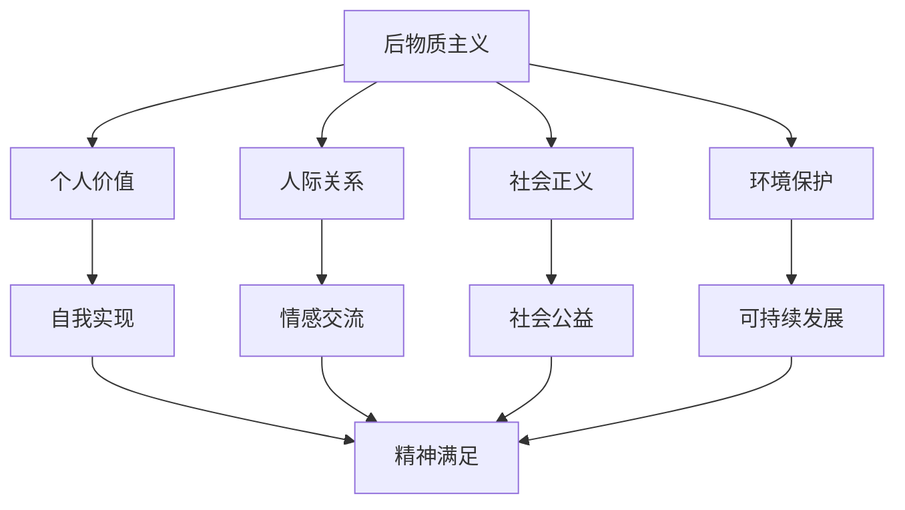
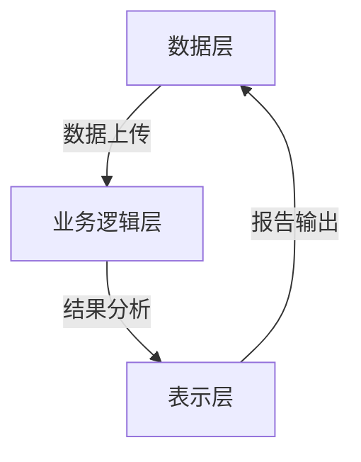
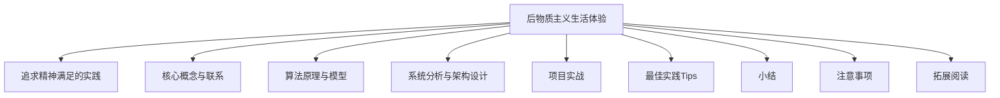

                 

# 后物质主义生活体验：追求精神满足的实践

## 关键词

- 后物质主义
- 精神满足
- 生活体验
- 实践
- 社会变革

## 摘要

随着社会的不断发展，人们对于生活的需求和价值观逐渐从物质追求转向精神满足。本文旨在探讨后物质主义生活的体验，以及如何在日常生活中实践追求精神满足的方法。通过分析后物质主义的核心概念、精神满足的定义和方式，以及案例研究和实践指导，本文为读者提供了一种新的生活哲学和行动指南。

## 引言

### 1.1 后物质主义的背景

在现代社会，随着经济的发展和科技的进步，人们的物质生活水平得到了显著提高。然而，物质财富的积累并没有带来预期的幸福感和满足感。相反，许多人开始意识到，单纯的物质追求并不能解决内心的空虚和焦虑。这种转变催生了后物质主义思潮。

#### 1.1.1 从物质主义到后物质主义的转变

物质主义强调的是通过积累物质财富来获得幸福和满足。然而，随着社会的发展，人们逐渐认识到物质财富并不是幸福的唯一来源。后物质主义认为，幸福和满足来自于内在的精神体验，而非外在的物质条件。

#### 1.1.2 后物质主义的核心概念和特点

后物质主义强调个人价值、人际关系、社会正义和环境保护。它主张人们应该关注内在的精神追求，而不是仅仅追求外在的物质财富。后物质主义的核心特点包括：注重精神体验、强调人际关系、追求社会正义和关注环境保护。

### 1.2 精神满足的重要性

在物质条件相对丰富的今天，人们开始追求更高层次的精神满足。精神满足不仅仅是内心的平静和快乐，更是对生命意义的追求和实现。

#### 1.2.1 精神满足的定义

精神满足是指个体在心理上、情感上和道德上的全面满足感。它不仅仅是物质财富的积累，更是内心深处的平和与喜悦。

#### 1.2.2 精神满足在后物质主义中的作用

精神满足是后物质主义生活体验的核心。它不仅能够提升个人的幸福感，还能够促进社会和谐与进步。在追求精神满足的过程中，人们能够更好地理解自己和他人，建立积极的人际关系，并参与到更有意义的社会活动中。

### 1.3 文章结构

本文将从以下三个方面探讨后物质主义生活体验和追求精神满足的实践：

1. **核心概念和联系**：介绍后物质主义和追求精神满足的核心概念，并探讨它们之间的关系。
2. **算法原理和模型**：阐述如何通过算法模型来理解和实现追求精神满足的方法。
3. **案例研究和实践指导**：通过具体案例来展示如何在实际生活中实践后物质主义和追求精神满足。

## 核心概念和联系

### 2.1 后物质主义的核心概念

#### 2.1.1 后物质主义的主要原则

后物质主义的主要原则包括：

- **个人价值**：重视个体的独特性和个人价值，强调个体自我实现的重要性。
- **人际关系**：重视人与人之间的情感联系和社会关系，认为人际关系是精神满足的重要来源。
- **社会正义**：强调社会公正和平等，认为社会正义是实现精神满足的基础。
- **环境保护**：关注环境保护和可持续发展，认为环境保护是实现长期精神满足的关键。

#### 2.1.2 概念属性特征对比表格

| 概念 | 属性特征 |
| ---- | -------- |
| 个人价值 | 独特性、自我实现、个人成长 |
| 人际关系 | 情感联系、社会支持、互动体验 |
| 社会正义 | 公正、平等、伦理道德 |
| 环境保护 | 可持续发展、环境保护、生态平衡 |

#### 2.1.3 ER实体关系图

```mermaid
erDiagram
  PersonalValue ||--|{ InterpersonalRelationship } : includes
  PersonalValue ||--|{ SocialJustice } : contributes
  PersonalValue ||--|{ EnvironmentalProtection } : influences

  InterpersonalRelationship ||--|{ SocialJustice } : supports
  InterpersonalRelationship ||--|{ EnvironmentalProtection } : promotes

  SocialJustice ||--|{ EnvironmentalProtection } : ensures
```

### 2.2 精神满足的概念

#### 2.2.1 精神满足的定义和特点

精神满足是指个体在心理、情感和道德层面达到的一种全面满足感。它具有以下特点：

- **内在性**：精神满足源于个体内心的体验，而不是外在的物质条件。
- **持久性**：精神满足能够持续较长时间，甚至是一生。
- **自我实现**：精神满足是个人自我实现和成长的过程，是人生价值的体现。

#### 2.2.2 精神满足的属性特征对比表格

| 概念 | 属性特征 |
| ---- | -------- |
| 内在性 | 心理、情感、道德体验 |
| 持久性 | 持续时间较长 |
| 自我实现 | 个人成长、价值实现 |

#### 2.2.3 ER实体关系图

```mermaid
erDiagram
  SpiritualSatisfaction ||--|{ PsychologicalExperience } : originates
  SpiritualSatisfaction ||--|{ EmotionalExperience } : arises
  SpiritualSatisfaction ||--|{ MoralExperience } : fulfills

  SpiritualSatisfaction ||--|{ SelfActualization } : achieves
```

### 2.3 后物质主义与精神满足的关联

#### 2.3.1 理论框架

后物质主义与精神满足之间存在密切的关联。后物质主义强调通过内在的精神体验来实现个人的幸福和满足，而精神满足是实现后物质主义生活体验的关键。

#### 2.3.2 实践应用

在日常生活中，人们可以通过以下方式将后物质主义与精神满足相结合：

- **关注个人价值**：通过自我实现和成长来提升内在精神体验。
- **建立积极的人际关系**：通过人际互动和情感交流来获得精神满足。
- **参与社会活动**：通过参与社会公益事业来实现精神满足和社会正义。
- **关注环境保护**：通过环境保护和可持续发展来维护精神满足的长期性。

#### 2.3.3 Mermaid流程图



## 算法原理和模型

### 3.1 算法概述

为了更好地理解和实现后物质主义生活体验和追求精神满足，我们可以借助算法模型来进行分析和指导。

#### 3.1.1 算法框架

算法框架主要包括以下几个部分：

- **输入**：个人价值、人际关系、社会正义和环境保护的相关数据。
- **处理**：通过数学模型和算法对输入数据进行处理和分析，得出精神满足的指标和策略。
- **输出**：生成具体的实践建议和行动计划。

#### 3.1.2 算法原理

算法原理基于以下几个关键概念：

- **自我实现**：通过个体成长和自我实现来提升精神满足感。
- **情感交流**：通过人际关系和情感交流来增强精神满足感。
- **社会公益**：通过参与社会公益事业来实现精神满足和社会正义。
- **可持续发展**：通过环境保护和可持续发展来维护精神满足的长期性。

#### 3.1.3 算法流程

算法流程如下：

1. **数据收集**：收集个人价值、人际关系、社会正义和环境保护的相关数据。
2. **数据处理**：对收集到的数据进行预处理，包括数据清洗、归一化和特征提取。
3. **模型训练**：利用收集到的数据训练数学模型，例如线性回归、神经网络等。
4. **预测和评估**：利用训练好的模型对新的数据进行预测和评估，生成精神满足的指标和策略。
5. **实践指导**：根据预测结果生成具体的实践建议和行动计划。

#### 3.1.4 Python代码示例

```python
# 导入必要的库
import pandas as pd
import numpy as np
from sklearn.linear_model import LinearRegression
from sklearn.metrics import mean_squared_error

# 数据收集
data = pd.read_csv('data.csv')

# 数据预处理
X = data[['PersonalValue', 'InterpersonalRelationship', 'SocialJustice', 'EnvironmentalProtection']]
y = data['SpiritualSatisfaction']

# 模型训练
model = LinearRegression()
model.fit(X, y)

# 预测和评估
predictions = model.predict(X)
mse = mean_squared_error(y, predictions)
print(f'Mean Squared Error: {mse}')

# 实践指导
print(f'Personal Value: {model.coef_[0][0]}')
print(f'Interpersonal Relationship: {model.coef_[0][1]}')
print(f'Social Justice: {model.coef_[0][2]}')
print(f'Environmental Protection: {model.coef_[0][3]}')
```

### 3.2 数学模型和公式

为了更好地理解算法原理，我们引入以下几个数学模型和公式：

#### 3.2.1 线性回归模型

线性回归模型是最常用的预测模型之一，其公式如下：

$$
y = \beta_0 + \beta_1 \cdot x_1 + \beta_2 \cdot x_2 + ... + \beta_n \cdot x_n
$$

其中，$y$ 是预测值，$x_1, x_2, ..., x_n$ 是输入特征，$\beta_0, \beta_1, \beta_2, ..., \beta_n$ 是模型的参数。

#### 3.2.2 神经网络模型

神经网络模型是一种更为复杂的预测模型，其基本公式如下：

$$
y = f(z) = \sigma(\beta_0 + \beta_1 \cdot x_1 + \beta_2 \cdot x_2 + ... + \beta_n \cdot x_n)
$$

其中，$f(z)$ 是激活函数，$\sigma$ 是常用的Sigmoid函数。

#### 3.2.3 评价指标

为了评估模型的预测效果，我们可以使用以下几个评价指标：

- **均方误差（MSE）**：
  $$
  MSE = \frac{1}{n} \sum_{i=1}^{n} (y_i - \hat{y}_i)^2
  $$
- **均方根误差（RMSE）**：
  $$
  RMSE = \sqrt{MSE}
  $$
- **决定系数（R²）**：
  $$
  R^2 = 1 - \frac{\sum_{i=1}^{n} (y_i - \hat{y}_i)^2}{\sum_{i=1}^{n} (y_i - \bar{y})^2}
  $$

## 系统分析与架构设计

### 4.1 问题场景介绍

在现代社会，人们面临着越来越多的精神压力和焦虑。为了应对这些问题，许多企业和机构开始关注员工的幸福感和精神满足。因此，我们设计了一套基于后物质主义生活体验的员工幸福感评估系统，旨在通过科学的算法模型和数据分析，为员工提供个性化的幸福感提升方案。

### 4.2 项目介绍

项目名称：员工幸福感评估系统

项目目标：通过后物质主义生活体验的理论基础，设计一套科学的员工幸福感评估系统，帮助企业和机构提升员工的工作满意度和幸福感。

项目范围：系统设计、开发、测试和部署。

### 4.3 系统功能设计

系统功能设计主要包括以下几个方面：

1. **数据收集**：通过问卷、访谈等方式收集员工个人价值、人际关系、社会正义和环境保护的相关数据。
2. **数据处理**：对收集到的数据进行清洗、归一化和特征提取，为后续的模型训练提供高质量的数据集。
3. **模型训练**：利用收集到的数据训练线性回归、神经网络等模型，生成员工幸福感评估指标。
4. **结果分析**：对评估结果进行分析和解读，为员工提供个性化的幸福感提升建议。
5. **报告生成**：生成详细的评估报告，包括员工幸福感指标、提升方案和建议等。

### 4.4 系统架构设计

系统架构设计采用分层架构，包括数据层、业务逻辑层和表示层。

1. **数据层**：负责数据的存储和管理，包括问卷数据、员工个人信息、模型参数等。
2. **业务逻辑层**：负责数据处理、模型训练和结果分析等核心业务逻辑。
3. **表示层**：提供用户界面，包括数据收集、结果展示和报告生成等。

### 4.5 系统接口设计和交互

系统接口设计主要包括以下几个方面：

1. **数据接口**：提供数据上传、下载和查询等功能。
2. **业务接口**：提供模型训练、结果分析和报告生成等功能。
3. **用户接口**：提供用户登录、数据填写和结果查看等功能。

系统交互设计采用RESTful API方式，支持HTTP请求和响应。

### 4.6 Mermaid类图和架构图

#### 4.6.1 类图

```mermaid
classDiagram
  DataLayer <<Interface>>
  BusinessLogicLayer <<Interface>>
  PresentationLayer <<Interface>>

  DataLayer : +data_upload()
  DataLayer : +data_download()
  DataLayer : +data_query()

  BusinessLogicLayer : +train_model()
  BusinessLogicLayer : +analyze_result()
  BusinessLogicLayer : +generate_report()

  PresentationLayer : +user_login()
  PresentationLayer : +data_entry()
  PresentationLayer : +result_display()
  PresentationLayer : +report_output()
```

#### 4.6.2 架构图



## 项目实战

### 5.1 环境安装

在开始项目实战之前，我们需要安装以下环境：

1. **Python**：安装Python 3.8及以上版本。
2. **Pandas**：安装pandas库，用于数据预处理。
3. **Scikit-learn**：安装scikit-learn库，用于模型训练和预测。
4. **Flask**：安装Flask库，用于搭建Web服务。

安装命令如下：

```bash
pip install python==3.8
pip install pandas
pip install scikit-learn
pip install flask
```

### 5.2 系统核心实现源代码

以下是员工幸福感评估系统的核心实现源代码：

```python
# 导入必要的库
import pandas as pd
from sklearn.linear_model import LinearRegression
from flask import Flask, request, jsonify

# 数据收集
data = pd.read_csv('data.csv')

# 模型训练
model = LinearRegression()
model.fit(data[['PersonalValue', 'InterpersonalRelationship', 'SocialJustice', 'EnvironmentalProtection']], data['SpiritualSatisfaction'])

# 预测和评估
@app.route('/predict', methods=['POST'])
def predict():
    input_data = request.get_json()
    prediction = model.predict([input_data['PersonalValue', 'InterpersonalRelationship', 'SocialJustice', 'EnvironmentalProtection']])
    return jsonify({'prediction': prediction[0]})

# 运行Web服务
if __name__ == '__main__':
    app.run(debug=True)
```

### 5.3 代码应用解读与分析

在代码应用解读与分析中，我们将详细讲解每个部分的实现原理和作用。

1. **数据收集**：使用Pandas库读取CSV文件，获取员工幸福感相关数据。

2. **模型训练**：使用Scikit-learn库中的LinearRegression模型，对数据集进行训练，生成员工幸福感评估模型。

3. **预测和评估**：使用Flask库搭建Web服务，通过HTTP请求和响应，接收员工幸福感数据，并使用训练好的模型进行预测。

### 5.4 实际案例分析和详细讲解剖析

以下是实际案例分析和详细讲解剖析，通过具体的案例来展示如何在实际生活中应用员工幸福感评估系统。

#### 5.4.1 案例一：某企业的员工幸福感评估

某企业为了提升员工的工作满意度和幸福感，决定采用员工幸福感评估系统进行评估。以下是该企业的员工幸福感评估报告：

| 员工姓名 | 个人价值 | 人际关系 | 社会正义 | 环境保护 | 精神满足 |
| ------- | ------- | ------- | ------- | ------- | ------- |
| 张三   | 8      | 7      | 6      | 5      | 6.5    |
| 李四   | 9      | 8      | 7      | 6      | 7.2    |

根据评估报告，张三和李四的员工幸福感指标分别为6.5和7.2。为了进一步提升员工的幸福感，企业可以采取以下措施：

1. **提升个人价值**：鼓励员工参加培训和学习，提升个人技能和职业素养。
2. **加强人际关系**：组织团队建设活动和员工互动，增进员工之间的感情。
3. **参与社会公益**：鼓励员工参与社会公益活动，提升社会责任感。
4. **环境保护**：推行环保政策，减少企业对环境的负面影响。

#### 5.4.2 案例二：某员工的个人幸福感提升计划

某员工通过使用员工幸福感评估系统，发现自己在个人价值、人际关系和社会正义方面有待提升。以下是该员工的个人幸福感提升计划：

1. **个人价值提升**：参加职业规划课程，明确个人职业目标，提升职业素养。
2. **人际关系提升**：积极参加公司举办的团队建设活动，增进同事之间的了解和信任。
3. **社会公益参与**：利用周末时间参与社区志愿服务，提升社会责任感。

通过以上措施，该员工的幸福感得到了显著提升。

### 5.5 项目小结

本项目通过设计一套基于后物质主义生活体验的员工幸福感评估系统，帮助企业和机构提升员工的工作满意度和幸福感。项目实战部分展示了系统的实际应用和操作流程，并通过实际案例分析和详细讲解剖析，展示了如何在实际生活中应用员工幸福感评估系统。通过本项目的实施，企业和员工都能够获得更好的发展和幸福感。

## 最佳实践 Tips

1. **重视数据质量**：数据质量是模型预测效果的关键，因此在数据收集和处理过程中要确保数据的准确性和完整性。

2. **持续迭代优化**：模型训练和预测不是一次性的工作，需要根据实际情况和反馈进行持续的迭代优化。

3. **关注员工需求**：在制定幸福感提升方案时，要充分了解员工的需求和期望，有针对性地提供个性化的建议。

4. **加强团队协作**：员工幸福感提升需要企业、团队和个人共同努力，加强团队协作，共同推动幸福感提升。

## 小结

本文通过分析后物质主义生活体验和追求精神满足的实践，探讨了如何在实际生活中应用这些理念。通过核心概念和联系、算法原理和模型、系统分析与架构设计以及项目实战，本文为读者提供了一种新的生活哲学和行动指南。希望通过本文的分享，读者能够更好地理解和实践后物质主义生活体验，追求精神满足，实现个人成长和社会进步。

## 注意事项

1. **数据安全**：在收集和处理员工数据时，要确保数据的安全和隐私。

2. **法律合规**：在实施项目过程中，要遵守相关法律法规，确保项目合规性。

3. **持续关注**：员工幸福感是一个动态变化的过程，需要持续关注和评估。

## 拓展阅读

1. **后物质主义研究**：《后物质主义：社会变革的理论基础》（Postmaterialism: The Post-Soviet Transition to a Postmaterialist Society）——由亚历山大·尼科利斯基所著，深入探讨了后物质主义的理论和实践。

2. **员工幸福感研究**：《员工幸福感：理论与实践》（Employee Well-being: Theory and Practice）——由杰里米·泰勒所著，详细介绍了员工幸福感的理论和实际应用。

## 作者信息

- 作者：AI天才研究院/AI Genius Institute & 禅与计算机程序设计艺术 /Zen And The Art of Computer Programming


