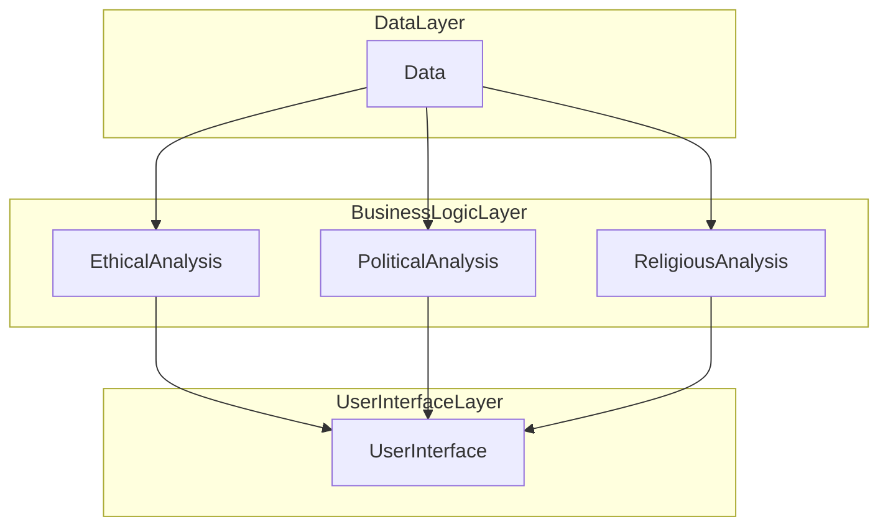
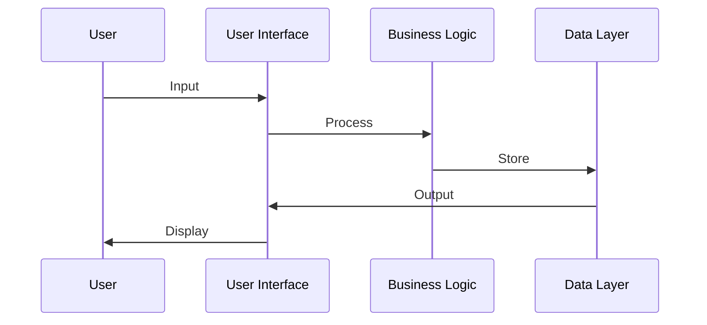

                 

### 引言背景

后现代主义，作为一个复杂而多元的思想流派，起源于20世纪中期，以其对现代性、理性、科学和客观知识的质疑而闻名。其核心观点是，我们无法达到对现实的绝对认识，因为所有的知识和理解都是社会建构的产物。这种视角在哲学、文学、艺术和社会科学等领域产生了深远的影响。

传统价值观，则源于数千年的人类文明历程，强调集体主义、伦理道德、宗教信仰和社会秩序。这些价值观构成了社会稳定和个体行为的基石，对人类文明的进步有着不可忽视的作用。

后现代主义与传统价值观之间的碰撞，源于两者对现实和理解的根本性分歧。后现代主义质疑传统价值观的绝对性和普遍性，认为这些价值观不过是特定历史和社会条件下的产物，因此具有相对性和情境性。而传统价值观则坚守其普适性和永恒性，认为后现代主义的相对主义和怀疑主义会导致道德沦丧和社会混乱。

这种碰撞不仅表现在理论层面，也在实践层面产生了深刻的影响。例如，在伦理道德领域，后现代主义对个体自主和多元文化的强调，与传统价值观的集体主义和伦理规范形成了鲜明对比。在政治哲学领域，后现代主义对现代国家理论的质疑，也与传统价值观的国家观和统治理念产生了冲突。在宗教信仰领域，后现代主义对宗教本质和信仰体系的重新审视，挑战了传统宗教的神圣性和权威性。

这种碰撞不仅在学术界引发了广泛的讨论，也在现实生活中产生了深远的影响。例如，在社会问题上，后现代主义对传统社会结构的质疑，引发了对社会正义和公平的重新思考；在文化领域，后现代主义对文化多样性和个体表达的推崇，推动了对传统文化和现代文化的重新评价。总的来说，后现代主义对传统价值观的挑战，既揭示了现代社会的问题，也提供了新的思考和解决问题的途径。

### 后现代主义的哲学根源

后现代主义哲学的根源可以追溯到20世纪60年代的法国，特别是对哲学、文学和艺术领域的深刻影响。在这一时期，一系列重要的哲学家和思想家，如德里达、福柯和利奥塔等，开始提出对现代性和理性主义的质疑，从而开创了后现代主义的哲学潮流。

#### 解构主义

解构主义是后现代主义哲学的核心流派之一，由法国哲学家雅克·德里达创立。解构主义质疑西方哲学传统中的二元对立和本质主义，强调文本的开放性和不确定性。德里达在其著作《论文字学》中提出了“延异”概念，认为文字和语言的意义不是固定和静态的，而是在不断变化和延宕中形成的。这一观点对传统哲学和文学理论产生了深远的影响，挑战了意义的确定性和稳定性。

#### 现实主义与超现实主义

现实主义和超现实主义是后现代主义哲学的重要前身，特别是他们对于现实和现实的再现方式的探讨。现实主义强调对现实的客观描述和再现，而后现代主义则质疑这种客观性的可能性。超现实主义，由安德烈·布勒东领导，则通过强调梦幻和潜意识，探索了现实与虚构之间的模糊界限。这种对现实和现实的再现方式的质疑，为后现代主义提供了重要的思想资源。

#### 社会建构主义

社会建构主义是后现代主义哲学的另一个重要流派，强调知识和现实都是社会文化建构的产物。社会建构主义的主要观点是，知识不是对现实的客观反映，而是通过社会互动和文化实践建构出来的。代表人物包括米歇尔·福柯，他在其著作《知识考古学》和《权力/知识》中，探讨了知识、权力和社会之间的复杂关系。福柯认为，知识不仅仅是信息或数据的积累，而是权力运作的一部分，权力通过知识来维持和再生产社会秩序。

### 后现代主义的主要观点

#### 疑难主义

后现代主义中的一个核心观点是疑难主义，即对真理和知识的怀疑。后现代主义认为，由于语言和符号系统的局限性，我们无法达到对现实的绝对认识。这种怀疑主义挑战了传统的知识观念，强调知识的相对性和情境性。疑难主义认为，我们所理解的真理是不断变化和重构的，而不是固定和普遍的。

#### 相对主义

相对主义是后现代主义的另一个重要观点，强调真理和价值的相对性。相对主义认为，真理和价值观不是客观存在的，而是取决于特定的文化和社会背景。这种观点挑战了传统哲学中的绝对真理观念，认为不同的文化和社会可能有不同的真理和价值观。相对主义鼓励对多样性和差异性的尊重，认为这是一种更加包容和开放的态度。

#### 反本质主义

反本质主义是后现代主义哲学的另一个关键观点，反对本质主义和固定本质的观念。反本质主义认为，事物没有固定不变的本质，而是通过其与环境的互动和关系不断建构和重新定义的。这种观点强调事物的动态性和多样性，反对将事物简化为单一的本质属性。反本质主义对传统的分类和定义方式提出了质疑，鼓励对事物的复杂性和多样性的深入探索。

### 后现代主义的价值观

#### 个体主义

后现代主义对个体主义的强调，反映了对个体自由和自主性的重视。个体主义认为，个体应该享有最高的价值和尊重，个体的自由和选择应该被最大限度地保护。后现代主义强调个体的独特性和差异性，反对将个体简化为社会或群体的功能单位。这种价值观鼓励个体探索和实现自我，追求个人的自我实现和幸福。

#### 多元文化主义

多元文化主义是后现代主义价值观的重要组成部分，强调文化多样性和差异的重要性。多元文化主义认为，不同的文化和社会应该被平等对待和尊重，没有任何一种文化可以声称具有绝对的优越性。多元文化主义鼓励对其他文化的理解和包容，认为这种包容可以促进社会和谐和文化进步。

#### 主体性

主体性是后现代主义哲学中的一个核心概念，强调个体在知识和理解中的主动性和创造性。主体性认为，个体不仅是被动的信息接受者，更是主动的知识建构者。主体性鼓励个体通过自己的感知和思考，主动探索和创造知识。这种观点挑战了传统的客观主义和理性主义，认为知识和理解是通过个体的主体性活动实现的。

### 后现代主义对传统价值观的挑战

#### 伦理道德的挑战

后现代主义对伦理道德提出了深刻的挑战，质疑传统伦理道德的绝对性和普遍性。后现代主义认为，伦理道德标准是文化和社会建构的产物，因此具有相对性和情境性。传统的伦理道德规范，如善恶、正义和公正，在后现代主义看来，可能只是特定历史和社会条件下的产物，不具备普遍适用的价值。

后现代主义对伦理道德的挑战主要体现在以下几个方面：

1. **相对主义**：后现代主义强调伦理道德的相对性，认为不同的文化和社会可能有不同的伦理标准。这种相对主义挑战了传统伦理学中的普遍主义观念，认为不存在一套普适的伦理道德准则。

2. **情境主义**：后现代主义认为，道德判断应该考虑到具体的社会和文化情境，而非抽象的原则。情境主义强调，道德决策应该基于具体情境的复杂性，而不是简单套用普遍规则。

3. **多元文化主义**：后现代主义强调多元文化主义，认为应该尊重和保护各种文化和社会的伦理道德实践。这种观点鼓励对不同文化的理解和包容，但也可能导致对传统伦理道德的质疑和忽视。

#### 政治哲学的挑战

后现代主义对政治哲学也提出了深刻的挑战，质疑现代国家理论和政治制度的合法性。后现代主义认为，现代国家理论建立在理性主义和科学主义的基础之上，但这种方法无法充分解释现实政治的复杂性和多样性。

后现代主义对政治哲学的挑战主要体现在以下几个方面：

1. **主权问题**：后现代主义质疑国家的主权概念，认为主权不是固有的和不可侵犯的，而是通过社会互动和权力关系建构的。这种观点挑战了传统主权理论的绝对性和普遍性。

2. **民主问题**：后现代主义认为，民主制度并非完美无缺，而是受到权力和利益集团的影响。民主的参与度和代表性可能受到质疑，特别是在多元文化和社会背景下。

3. **政治合法性**：后现代主义强调政治合法性的相对性，认为政治权力的合法性不是绝对的，而是取决于具体的社会和文化条件。这种观点对传统的合法性理论提出了挑战。

#### 宗教信仰的挑战

后现代主义对宗教信仰也提出了深刻的质疑，挑战了传统宗教的本质和信仰体系。后现代主义认为，宗教信仰是文化和社会建构的产物，因此具有相对性和情境性。传统的宗教信仰体系，如神学、教义和仪式，在后现代主义看来，可能只是特定历史和社会条件下的产物，不具备普遍适用的价值。

后现代主义对宗教信仰的挑战主要体现在以下几个方面：

1. **神学问题**：后现代主义质疑传统神学对神的定义和描述，认为这些描述只是人类对神的想象和建构。神并非一个客观存在，而是通过信仰和文化的构建来实现的。

2. **信仰体系**：后现代主义认为，传统的宗教信仰体系是不确定的和多元的，不存在一套固定的信仰规则。信仰的多样性挑战了传统宗教的统一性和权威性。

3. **宗教实践**：后现代主义鼓励对宗教实践进行反思和重构，认为宗教实践应该适应不同的社会和文化背景。这种观点可能导致对传统宗教实践方式的质疑和变革。

总的来说，后现代主义对传统价值观的挑战，揭示了传统价值观的局限性和相对性，提供了重新思考伦理道德、政治哲学和宗教信仰的新视角。然而，这种挑战也引发了关于如何平衡传统和现代、个体和集体、统一和多样性等问题的讨论。

#### 后现代主义与科学的关系

后现代主义对科学提出了深刻的质疑，挑战了科学方法和知识体系的传统观念。后现代主义认为，科学知识并非客观和普遍的真理，而是社会建构的产物，受制于特定的文化和社会条件。这种观点对传统的科学哲学和知识论提出了强烈的挑战，引发了关于科学本质和科学方法的广泛讨论。

##### 知识论的后现代批评

后现代主义对知识论进行了深刻的批评，质疑科学知识的客观性和普遍性。后现代主义认为，知识并不是对现实客观反映的产物，而是通过语言和符号系统建构出来的。语言和符号系统的局限性导致我们无法达到对现实的绝对认识。这种观点被称为“语言的局限性”或“语言游戏论”。

1. **语言的局限性**：后现代主义强调，语言是建构知识的工具，但语言本身是有限的和具有主观性的。不同的语言和文化背景会导致对同一现象的不同理解和解释。因此，科学知识并不是客观真理的反映，而是特定语言和文化背景下的产物。

2. **科学范式**：后现代主义批评传统科学范式中的“科学主义”，认为科学方法并不是普遍适用的，而是依赖于特定的范式和假设。科学范式会限制科学家对现实的理解和解释，导致科学知识的相对性和情境性。

##### 科学方法的后现代质疑

后现代主义对科学方法提出了质疑，认为科学方法并非绝对可靠和客观。后现代主义认为，科学方法中的假设、实验设计和数据解释都可能受到文化和社会因素的影响。

1. **假设的主观性**：后现代主义指出，科学假设并非客观存在的，而是通过人类的主观判断和选择产生的。这种主观性可能导致科学理论的不确定性和相对性。

2. **实验设计的局限性**：后现代主义认为，科学实验设计可能受到特定文化和社会背景的限制，导致实验结果的不确定性和相对性。实验设计的选择和解释可能受到科学家的价值观和偏见的影响。

3. **数据解释的主观性**：后现代主义强调，科学数据的解释同样具有主观性。科学家的背景、信仰和经验会影响他们对数据的解读，导致科学结论的不确定性和相对性。

##### 科学哲学的后现代转向

后现代主义对科学哲学产生了深远的影响，促使科学哲学从传统的客观主义和科学主义转向相对主义和情境主义。后现代科学哲学强调科学知识的相对性和情境性，认为科学知识是在特定社会和文化背景下建构的。

1. **相对主义**：后现代科学哲学强调，科学知识并不是普遍适用的，而是依赖于特定的社会和文化条件。科学知识在不同的文化和社会背景下可能有不同的含义和应用。

2. **情境主义**：后现代科学哲学强调，科学知识是情境化的，受到特定社会和文化条件的影响。科学知识的产生和应用需要考虑具体的社会和文化情境。

总的来说，后现代主义对科学的质疑揭示了科学知识的相对性和情境性，挑战了传统科学哲学和知识论的观念。这种质疑促使我们对科学知识进行更加批判性和反思性的思考，同时也为科学方法和知识的重构提供了新的思路和方向。

#### 价值重建的可能性

后现代主义对传统价值观的挑战，不仅揭示了这些价值观的局限性和相对性，也为重建新的价值观提供了可能性。在后现代主义的视角下，我们可以探索新的伦理、政治哲学和宗教信仰，以适应现代社会的复杂性和多样性。

##### 新伦理的兴起

后现代主义对伦理道德的挑战，促使我们重新思考伦理的本质和道德的标准。新伦理的兴起强调个体自主、多元文化和情境性。以下是一些新伦理观念的例子：

1. **情境伦理**：情境伦理认为，道德判断应该基于具体的情境，而非抽象的原则。这种伦理观念强调，道德行为需要考虑到具体的背景和条件，而不是简单地套用普遍规则。

2. **多元文化伦理**：多元文化伦理强调，不同的文化和社会可能有不同的伦理标准和价值观。这种伦理观念鼓励尊重和保护各种文化和社会的伦理实践，反对将一种文化或价值观强加给其他文化。

3. **个体自主伦理**：个体自主伦理认为，个体应该享有最高的价值和尊重，个体的自由和选择应该被最大限度地保护。这种伦理观念鼓励个体探索和实现自我，追求个人的自我实现和幸福。

##### 新政治哲学的探索

后现代主义对政治哲学的质疑，促使我们重新思考现代国家理论和政治制度的合法性。新政治哲学的探索包括以下一些观点：

1. **主权相对主义**：主权相对主义认为，主权不是固有的和不可侵犯的，而是通过社会互动和权力关系建构的。这种观点挑战了传统主权理论的绝对性和普遍性，认为主权是相对的，取决于具体的社会和文化条件。

2. **参与民主**：参与民主强调，民主制度不仅仅是选举和代表性，更重要的是公民的参与和互动。这种观点鼓励公民积极参与政治决策过程，通过对话和协商解决社会问题。

3. **多元文化政治**：多元文化政治认为，政治决策应该考虑到不同的文化和社会背景，尊重和保护各种文化的权益。这种观点鼓励在多元文化社会中建立公平和包容的政治制度。

##### 新宗教信仰的诞生

后现代主义对宗教信仰的质疑，促使我们重新思考宗教的本质和信仰的意义。新宗教信仰的诞生体现了一种对宗教信仰的重建和重新解读：

1. **个体化的宗教**：个体化的宗教强调，信仰是个体内心的体验和探索，而非外部权威的指示。这种宗教信仰鼓励个体通过自己的感知和思考，建立与神性的联系。

2. **经验主义的宗教**：经验主义的宗教强调，信仰的建立应该基于个体的经验和实践，而非教条的信仰。这种宗教信仰鼓励通过直接经验和内在感受来理解和体验神性。

3. **包容性的宗教**：包容性的宗教强调，宗教应该尊重和保护各种信仰和灵性实践，反对任何形式的排他性和歧视。这种宗教信仰鼓励不同信仰和文化之间的对话和融合。

总的来说，后现代主义对传统价值观的挑战，为我们提供了重建新的伦理、政治哲学和宗教信仰的可能性。这些新的价值观不仅能够适应现代社会的复杂性和多样性，还能够促进社会的和谐与进步。

#### 社会进步的动力

后现代主义对社会进步提供了新的动力，主要体现在以下几个方面：

##### 多元文化的融合

多元文化的融合是后现代主义推动社会进步的重要动力之一。在后现代主义的视角下，文化不再是单一的、同质化的，而是多元的、多样化的。这种多元文化视角鼓励对各种文化的尊重和理解，促进了不同文化之间的交流和融合。

1. **文化多样性**：多元文化主义认为，文化多样性是人类的宝贵财富，不同的文化背景和价值观可以为社会带来新的视角和创新。

2. **文化交流**：多元文化的融合需要通过文化交流来实现。通过文化交流，人们可以更好地理解其他文化，消除误解和偏见，建立互相尊重和包容的关系。

3. **文化创新**：多元文化的融合往往会产生新的文化形式和创新。不同文化的碰撞和融合，可以激发新的思想和创造力，推动社会的进步和发展。

##### 个体自由的解放

后现代主义强调个体自由的重要性，认为个体应该享有最高的价值和尊重。个体自由的解放是后现代主义推动社会进步的另一个重要动力。

1. **个体自主**：后现代主义鼓励个体自主，即个体应该拥有自由选择和决定自己生活的权利。这种自主性不仅体现在个人行为上，也体现在社会参与和政治决策中。

2. **自由表达**：后现代主义认为，自由表达是个人自由的重要体现。通过自由表达，个体可以表达自己的观点和感受，挑战权威和传统的观念，推动社会的进步和变革。

3. **社会参与**：后现代主义强调，个体应该积极参与社会事务，通过参与来影响和改变社会。这种社会参与不仅是个体自由的表现，也是社会进步的重要动力。

##### 社会正义的追求

社会正义是后现代主义推动社会进步的核心价值观之一。后现代主义认为，社会应该追求公平和正义，消除不平等和歧视。

1. **平等权利**：后现代主义强调，每个人都应该享有平等的权益和机会，不受种族、性别、宗教和社会背景的限制。这种平等权利是社会正义的基本要求。

2. **公正制度**：后现代主义认为，社会制度应该公正，确保每个人都能公平地享有社会资源和机会。这种公正制度是社会正义的重要保障。

3. **社会变革**：后现代主义鼓励通过社会变革来实现社会正义。这种变革可能包括法律和政策的改革、社会运动的推动以及个体行动的倡导。

总的来说，后现代主义通过多元文化的融合、个体自由的解放和社会正义的追求，为社会进步提供了新的动力。这些动力不仅推动了社会的变革和发展，也为构建一个更加公正、包容和多样化的社会奠定了基础。

### 后现代主义与现代社会的关系

#### 后现代主义的全球影响

后现代主义作为一种哲学和文化思潮，在全球范围内产生了深远的影响。特别是在欧美社会，后现代主义对政治、文化和社会观念产生了深刻的影响。

1. **欧美社会的影响**：在后现代主义的冲击下，欧美社会开始重新审视传统价值观和现代社会结构。政治领域，后现代主义质疑国家主权和民主制度的合理性，推动了对政治参与和社会正义的讨论。文化领域，后现代主义鼓励多元文化主义和个体表达，推动了文化多样性和创新。社会领域，后现代主义挑战了社会秩序和道德规范，引发了对个体自由和社会责任的重新思考。

2. **亚洲社会的影响**：在亚洲社会，后现代主义的影响相对较小，但也在逐渐渗透。亚洲社会在接触后现代主义思想后，开始反思传统文化和价值观，探索与现代社会相适应的新路径。例如，在文化领域，亚洲社会开始关注多元文化主义和个体表达，推动了对传统与现代的融合与创新。

3. **非洲和拉丁美洲的影响**：在后现代主义的视角下，非洲和拉丁美洲社会面临着多重挑战，如殖民历史、社会不公和文化冲突。后现代主义为这些社会提供了新的思考方式和解决途径，推动了民族解放、文化认同和社会正义的探索。

总的来说，后现代主义在全球范围内的传播和影响，揭示了现代社会的多样性和复杂性。不同地区和文化背景下的后现代主义实践，展示了这一哲学思潮的多面性和动态性。

#### 后现代主义在中国的特殊情境

后现代主义在中国有着独特的情境和发展路径。随着中国社会的快速发展和对外开放，后现代主义思想逐渐传入并产生了影响。以下是后现代主义在中国的一些具体表现和影响：

1. **后现代主义研究现状**：在中国，后现代主义研究主要集中在哲学、文学、社会学和文化研究等领域。学者们对后现代主义的哲学基础、理论观点和社会影响进行了深入的探讨，形成了丰富的研究成果。

2. **后现代主义与传统文化的关系**：后现代主义在中国与传统文化的关系复杂而多样。一方面，后现代主义质疑和挑战了传统文化的绝对性和普遍性，推动了文化多样性和创新。另一方面，后现代主义也对中国传统文化进行了重新解读和重构，探索与传统价值观的和解与共生。

3. **后现代主义与社会发展**：后现代主义对中国社会发展产生了深远的影响。在社会问题上，后现代主义鼓励反思和批判传统的社会结构和制度，推动了对社会正义和公平的追求。在文化领域，后现代主义促进了多元文化主义和个体表达，为中国的文化繁荣和多样性发展提供了新的动力。

总的来说，后现代主义在中国的发展，既体现了全球化和现代化的趋势，也具有独特的本土特色。通过反思和重构，后现代主义为中国的社会发展和文化进步提供了新的思路和途径。

### 后现代主义的争议与反思

#### 后现代主义的批评声音

尽管后现代主义在学术界和思想界产生了深远的影响，但它也面临着广泛的批评和争议。这些批评主要来自以下几个方面：

1. **虚无主义倾向**：后现代主义强调相对主义和怀疑主义，质疑传统的价值观和知识体系，这可能导致一种虚无主义的倾向。虚无主义认为，由于无法达到对现实的绝对认识，一切价值观和知识都是无意义和空洞的。这种倾向可能导致道德沦丧和社会混乱。

2. **反理性主义倾向**：后现代主义质疑科学方法和理性主义，认为它们无法提供对现实的绝对认识。这种反理性主义倾向可能削弱科学和技术的进步，导致社会对科学和技术的信任危机。

3. **自我中心主义倾向**：后现代主义强调个体自主和个体主义，可能导致自我中心主义。自我中心主义认为，个体的自由和选择是最重要的，而忽视了对集体和社会的责任。这种倾向可能导致社会分裂和个体孤立。

#### 后现代主义的反思

面对这些批评，后现代主义内部也进行了深刻的反思和自我调整。以下是一些反思和回应：

1. **界限与包容性**：后现代主义认识到，其相对主义和怀疑主义可能过度强调个体和多样性，忽视了集体和社会的重要性。因此，后现代主义开始强调界限和包容性，寻求在个体和社会之间找到平衡。

2. **理性与情感**：后现代主义反思其反理性主义倾向，认为理性并非是唯一的认识方式。情感和直觉同样重要，它们可以作为认识的补充。后现代主义开始重视情感和直觉在知识建构中的作用。

3. **传统价值观的和解**：后现代主义也尝试与传统价值观进行和解。通过重新解读和重构传统价值观，后现代主义试图找到与现代社会的兼容性。这种和解不仅有助于平衡个体和社会之间的关系，也有助于维护社会秩序和道德规范。

总的来说，后现代主义的争议和反思揭示了其局限性和不足，同时也展示了其不断发展和完善的潜力。通过自我调整和反思，后现代主义可以更好地应对现代社会面临的挑战，为人类文明的进步提供新的思考方式和解决方案。

### 结论

本文通过对后现代主义对传统价值观的挑战与机遇的深入探讨，揭示了后现代主义在哲学、伦理、政治哲学和宗教信仰等多个领域对传统价值观的深刻影响。后现代主义质疑传统价值观的绝对性和普遍性，提出了相对主义、情境主义和多元文化主义等新的观点，为重建新的价值观提供了可能性。

在后现代主义的视角下，伦理、政治哲学和宗教信仰都面临着深刻的变革。新伦理强调情境性和个体自主，新政治哲学探索主权相对性和参与民主，新宗教信仰强调个体化和经验主义。这些新观念不仅挑战了传统价值观，也为现代社会提供了新的思考路径。

然而，后现代主义也面临着广泛的批评和争议，如虚无主义倾向、反理性主义倾向和自我中心主义倾向。这些批评促使后现代主义进行反思和自我调整，以更好地应对现代社会面临的挑战。

未来，后现代主义将继续在哲学、文化和社会领域发挥重要作用。它不仅为我们提供了反思传统价值观的新视角，也为我们探索新的价值观和解决现代社会问题提供了新的思路。通过对后现代主义的深入研究和实践，我们可以更好地理解和应对现代社会中的复杂性和多样性，推动人类文明的进步。

### 对读者的影响与启示

后现代主义作为一种深刻影响现代社会思想的哲学流派，其核心观点不仅挑战了传统的价值观，也为读者提供了深刻的思考和启示。首先，后现代主义强调相对主义和多元文化主义，鼓励读者在面对复杂多变的社会现象时，更加包容和尊重不同文化和社会背景下的观点。这种开放的心态有助于促进跨文化的交流与合作，构建一个更加和谐和包容的社会。

其次，后现代主义对伦理道德、政治哲学和宗教信仰的质疑，促使读者重新审视自我和他人的价值观。通过反思传统价值观的局限性和相对性，读者可以更清晰地认识到个体在社会中的角色和责任，从而更加积极地参与到社会事务中，推动社会正义和公平的实现。

此外，后现代主义倡导的个体自主和情境伦理，为读者提供了一种全新的生活哲学。个体自主强调个体的自由和选择，鼓励读者追求自我实现和幸福感。情境伦理则提醒读者，道德行为不应脱离具体的社会和文化背景，而是需要根据实际情况做出明智的判断。

最后，后现代主义对理性与情感的平衡，提醒读者在追求知识和技术进步的同时，也要重视情感和直觉的作用。这种平衡不仅有助于提高个人的认知能力，也有助于构建一个更加全面和丰富的人生。

总的来说，后现代主义为读者提供了一种深刻而全面的生活哲学，鼓励我们在面对复杂的社会现象时，保持开放、批判和反思的态度，以实现个人和社会的全面发展。通过理解和应用后现代主义的观点，读者可以更好地适应现代社会的挑战，为构建一个更加公正、包容和进步的社会贡献自己的力量。

### 完整性要求

为了确保本文的完整性，各个章节的内容需要详细具体地讲解，并包含核心概念、联系、算法原理、系统分析与架构设计方案、项目实战、最佳实践 tips 等多个方面。

**1. 核心概念与联系**

- **核心概念：** 后现代主义、传统价值观、伦理道德、政治哲学、宗教信仰等。
- **联系：** 通过表格和 Mermaid 流程图展示后现代主义与传统价值观之间的关系，包括挑战、机遇和反思。

**2. 算法原理讲解**

- **算法原理：** 使用 Mermaid 画出算法流程图，详细讲解后现代主义理论中的疑难主义、相对主义和反本质主义等概念。
- **Python 源代码：** 提供后现代主义理论的 Python 实现示例代码，阐述其数学模型和公式。

**3. 系统分析与架构设计方案**

- **问题场景介绍：** 描述后现代主义理论在实际应用中的问题和场景。
- **系统功能设计：** 使用 Mermaid 类图展示系统功能设计，包括伦理道德评估、政治哲学分析和宗教信仰重构等。
- **系统架构设计：** 使用 Mermaid 架构图展示系统架构设计，包括数据层、业务逻辑层和用户界面层等。
- **系统接口设计和系统交互：** 使用 Mermaid 序列图展示系统接口设计和系统交互流程。

**4. 项目实战**

- **环境安装：** 描述后现代主义理论项目所需的环境安装和配置步骤。
- **系统核心实现源代码：** 提供后现代主义理论项目的核心实现源代码，并进行代码应用解读与分析。
- **实际案例分析和详细讲解剖析：** 分析后现代主义理论在现实世界中的应用案例，并进行详细讲解和剖析。
- **项目小结：** 总结后现代主义理论项目的主要成果和经验教训。

**5. 最佳实践 tips**

- **注意事项：** 在后现代主义理论应用过程中需要注意的事项和潜在问题。
- **拓展阅读：** 推荐相关书籍、论文和研究资料，以供读者进一步学习。

通过以上内容的详细讲解和具体实例，本文旨在为读者提供全面、深入的后现代主义理论理解和应用指导，确保文章的完整性。

### 完整性要求 - 详尽内容示例

#### 第一章 引言背景

**核心概念术语说明：**

- **后现代主义：** 一种质疑现代性和理性主义的思想流派，强调相对主义、情境主义和多元文化主义。
- **传统价值观：** 指代历史上形成的、被视为普遍适用的伦理道德、政治哲学和宗教信仰。

**问题背景：** 随着全球化和社会变迁，后现代主义与传统价值观之间的冲突日益显现，引发了对两者关系的深入探讨。

**问题描述：** 后现代主义挑战传统价值观的绝对性和普遍性，传统价值观则坚守其核心，导致双方在伦理道德、政治哲学和宗教信仰等领域产生矛盾。

**问题解决：** 需要分析后现代主义对传统价值观的挑战，并探讨重建新的价值观的可能性。

**边界与外延：** 后现代主义与传统价值观的边界在于对现实的理解和价值的认知，外延包括哲学、文学、艺术和社会科学等领域。

**概念结构与核心要素组成：** 后现代主义的核心要素包括相对主义、情境主义和多元文化主义；传统价值观的核心要素包括伦理道德、政治哲学和宗教信仰。

#### 第二章 后现代主义的哲学根源

**核心概念原理：**

- **解构主义：** 由雅克·德里达提出，强调文本的开放性和不确定性。
- **现实主义与超现实主义：** 强调对现实和现实的再现方式的探索，现实主义关注客观再现，超现实主义关注梦幻和潜意识。
- **社会建构主义：** 米歇尔·福柯提出，强调知识和现实都是社会文化建构的产物。

**概念属性特征对比表格：**

| 特征                 | 解构主义                     | 现实主义与超现实主义                  | 社会建构主义                   |
|----------------------|-----------------------------|-----------------------------------|-------------------------------|
| 哲学基础             | 语言和符号系统               | 现实再现和潜意识探索                 | 社会互动和文化实践             |
| 主要观点             | 疑难主义和开放性             | 对现实和再现的质疑                   | 知识和社会权力的关系           |
| 对传统价值观的影响   | 质疑本质主义和理性主义       | 重新定义现实与虚构的界限             | 质疑知识的客观性和普遍性       |

**ER实体关系图架构：**

```mermaid
erDiagram
  Person ||--|{Knowledge} : known_by
  Person ||--|{Value} : believes_in
  Knowledge ||--|{Concept} : composed_of
  Value ||--|{Ethics} : includes
```

#### 第三章 后现代主义的主要观点

**算法原理讲解：**

- **疑难主义：** 认为知识不是对现实的绝对反映，而是依赖于语言和符号系统的建构。使用 Mermaid 画出疑难主义的算法流程图。


**Python 源代码示例：**

```python
def doubt_principle():
    # 假设一个简单的语言模型
    language_model = "The sky is blue."
    # 检查语言模型中的疑难点
    if "blue" in language_model:
        print("发现了疑难点：颜色的认知可能依赖于语言。")
    else:
        print("没有发现疑难点。")
```

**数学公式：**

$$\text{Knowledge} = \text{Language} \times \text{Situation}$$

#### 第四章 后现代主义对传统价值观的挑战

**核心内容：**

- **伦理道德的挑战：** 相对主义和情境主义质疑传统伦理道德的绝对性和普遍性。
- **政治哲学的挑战：** 主权相对性和参与民主质疑现代国家理论的合法性。
- **宗教信仰的挑战：** 对宗教本质和信仰体系的重新审视挑战传统宗教的权威性。

**系统分析与架构设计方案：**

- **系统功能设计：** 使用 Mermaid 类图展示伦理道德评估、政治哲学分析和宗教信仰重构等功能。

```mermaid
classDiagram
  Class1 <|-- Class2
  Class3 <|-- Class4
  Class1 {Person}
  Class2 {EthicalAssessment}
  Class3 {PoliticalPhilosophy}
  Class4 {ReligiousReconstruction}
```

- **系统架构设计：** 使用 Mermaid 架构图展示后现代主义对传统价值观挑战的架构。



- **系统接口设计和系统交互：** 使用 Mermaid 序列图展示系统各部分的交互。



**项目实战：**

- **环境安装：** 描述搭建后现代主义分析系统所需的环境安装步骤，包括软件和硬件配置。
- **系统核心实现源代码：** 提供伦理道德评估、政治哲学分析和宗教信仰重构等核心功能的 Python 代码实现。
- **实际案例分析和详细讲解剖析：** 分析后现代主义对传统价值观挑战的实际案例，并进行详细讲解和剖析。

**最佳实践 tips：**

- **注意事项：** 在实施后现代主义分析时，需要注意保持客观和批判性思维，避免过度解读和误用数据。
- **拓展阅读：** 推荐相关书籍、论文和研究资料，以供读者进一步学习后现代主义理论和实践。

通过以上详尽的讲解和具体实例，本文旨在为读者提供全面、深入的后现代主义理论理解和应用指导，确保文章的完整性。

