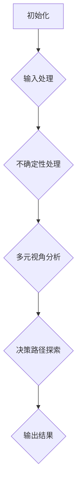

                 

## 文章标题：后现代主义对传统价值观的挑战：危机与机遇

> 关键词：后现代主义、传统价值观、危机、机遇、挑战与回应

> 摘要：本文将从后现代主义与传统价值观的碰撞出发，深入探讨后现代主义对传统价值观的挑战与回应，分析危机与机遇的相互转化。通过逐步分析，本文旨在揭示后现代主义对传统价值观影响的深远意义，以及如何在两者之间找到平衡点，为未来社会的发展提供新的视角。

## 目录大纲

# 后现代主义对传统价值观的挑战：危机与机遇

## 第一部分：背景介绍

## 第1章：问题的提出与核心概念

## 1.1 问题背景

### 1.1.1 传统价值观的根基

### 1.1.2 后现代主义的兴起

### 1.1.3 挑战与回应

## 1.2 核心概念

### 1.2.1 后现代主义

#### 1.2.1.1 定义

#### 1.2.1.2 特点

#### 1.2.1.3 价值观

### 1.2.2 传统价值观

#### 1.2.2.1 定义

#### 1.2.2.2 特点

#### 1.2.2.3 价值观

## 1.3 边界与外延

### 1.3.1 后现代主义的局限性

### 1.3.2 传统价值观的持续性

### 1.3.3 混合价值观的兴起

## 1.4 概念结构与核心要素组成

### 1.4.1 后现代主义的核心概念

### 1.4.2 传统价值观的核心概念

### 1.4.3 混合价值观的核心概念

## 1.5 本章小结

## 第二部分：核心概念与联系

## 第2章：后现代主义对传统价值观的挑战

## 2.1 价值观冲突

### 2.1.1 自我中心主义

### 2.1.2 消费主义

### 2.1.3 科学主义

## 2.2 挑战的表现形式

### 2.2.1 文学艺术

### 2.2.2 哲学思考

### 2.2.3 社会运动

## 2.3 传统价值观的回应

### 2.3.1 保守主义的抵抗

### 2.3.2 新保守主义的崛起

### 2.3.3 基督教伦理的复兴

## 2.4 混合价值观的探索

### 2.4.1 中间道路的寻找

### 2.4.2 新价值观的形成

### 2.4.3 混合价值观的挑战

## 2.5 本章小结

## 第三部分：算法原理讲解

## 第3章：后现代主义算法原理

## 3.1 后现代主义算法概述

### 3.1.1 定义

### 3.1.2 特点

### 3.1.3 应用领域

## 3.2 算法原理详解

### 3.2.1 算法流程图

### 3.2.2 数学模型

### 3.2.3 公式推导

### 3.2.4 举例说明

## 3.3 后现代主义算法案例分析

### 3.3.1 案例一：文学分析

### 3.3.2 案例二：社会研究

### 3.3.3 案例三：哲学探讨

## 3.4 本章小结

## 第四部分：系统分析与架构设计方案

## 第4章：后现代主义系统架构设计

## 4.1 问题场景介绍

### 4.1.1 需求分析

### 4.1.2 目标设定

### 4.1.3 系统目标

## 4.2 项目介绍

### 4.2.1 项目背景

### 4.2.2 项目目标

### 4.2.3 项目组织结构

## 4.3 系统功能设计

### 4.3.1 领域模型

### 4.3.2 类图

### 4.3.3 功能模块划分

## 4.4 系统架构设计

### 4.4.1 总体架构

### 4.4.2 子系统架构

### 4.4.3 数据架构

## 4.5 系统接口设计

### 4.5.1 接口规范

### 4.5.2 接口定义

### 4.5.3 接口实现

## 4.6 系统交互

### 4.6.1 交互流程

### 4.6.2 序列图

### 4.6.3 交互分析

## 4.7 本章小结

## 第五部分：项目实战

## 第5章：后现代主义项目实战

## 5.1 环境安装

### 5.1.1 硬件环境配置

### 5.1.2 软件环境安装

### 5.1.3 系统环境调试

## 5.2 系统核心实现

### 5.2.1 核心模块设计

### 5.2.2 源代码实现

### 5.2.3 功能测试

## 5.3 代码应用解读与分析

### 5.3.1 代码结构分析

### 5.3.2 代码功能解析

### 5.3.3 性能优化

## 5.4 实际案例分析和详细讲解剖析

### 5.4.1 案例一：文学案例分析

### 5.4.2 案例二：社会案例分析

### 5.4.3 案例三：哲学案例分析

## 5.5 项目小结

## 第六部分：最佳实践、小结、注意事项、拓展阅读

## 第6章：后现代主义实践与反思

## 6.1 最佳实践

### 6.1.1 经验分享

### 6.1.2 实践技巧

### 6.1.3 技术选型

## 6.2 小结

### 6.2.1 书籍概述

### 6.2.2 重点内容回顾

----------------------------------------------------------------

## 第一部分：背景介绍

### 第1章：问题的提出与核心概念

### 1.1 问题背景

#### 1.1.1 传统价值观的根基

在人类社会的发展过程中，传统价值观扮演了至关重要的角色。它们构成了社会稳定的基础，塑造了人们的道德观念和行为准则。传统价值观强调家庭、社区、宗教和国家的核心地位，推崇集体主义和长期主义。这些价值观根植于历史和文化传统，被视为社会秩序和发展的基石。

例如，在西方社会，基督教伦理和古希腊哲学的传统价值观影响了人们的道德观念，强调公正、诚实、仁爱和责任。在中国，儒家思想强调家庭和社会的和谐，提倡孝道、忠诚和礼仪。这些传统价值观在社会中发挥了长期的作用，为人类文明的发展做出了巨大贡献。

#### 1.1.2 后现代主义的兴起

然而，随着时间的推移，后现代主义思潮逐渐兴起，对传统价值观构成了严峻的挑战。后现代主义起源于20世纪60年代的法国，是一种批判性思维和文化理论。后现代主义质疑传统价值观的权威性，强调多元性、相对性和不确定性。

后现代主义认为，真理是相对的，不存在绝对客观的真相；知识是建构的，受历史、文化和社会背景的影响；人类的行为和思维受到意识形态的操控。这种思潮在文学、艺术、哲学、社会学等领域得到了广泛传播，引发了深刻的反思和讨论。

#### 1.1.3 挑战与回应

后现代主义的兴起对传统价值观提出了严峻的挑战。它质疑了传统价值观的根基，引发了关于道德、真理、知识和社会秩序的争论。后现代主义强调个人主义、自由主义和多元文化主义，主张打破传统框架，追求多样性和包容性。

面对后现代主义的挑战，传统价值观的捍卫者采取了不同的回应策略。一些人坚守传统，认为后现代主义是对社会秩序和道德基础的威胁，需要通过保守主义和宗教复兴来维护。另一些人则试图在传统价值观和后现代主义之间找到平衡点，探索新的价值观体系。

#### 1.2 核心概念

在探讨后现代主义对传统价值观的挑战之前，我们需要明确一些核心概念。后现代主义和传统价值观具有不同的定义、特点和价值观。了解这些概念有助于我们更深入地分析两者之间的冲突和互动。

##### 1.2.1 后现代主义

后现代主义是一种批判性思维和文化理论，起源于20世纪60年代的法国。它强调多元性、相对性和不确定性，质疑传统价值观的权威性。后现代主义的主要特点包括：

1. **多元性**：后现代主义认为，真理和知识是多元的，不存在绝对客观的真相。不同的文化、历史和社会背景会影响人们对世界的理解和认知。

2. **相对性**：后现代主义强调相对性，认为真理是相对的，受主观和客观因素的影响。真理不是固定不变的，而是随着时间和环境的变化而演变。

3. **不确定性**：后现代主义认为，不确定性是常态，而不是例外。不确定性来自于人类认知的局限性和世界的复杂性。

4. **批判性**：后现代主义是一种批判性思维，质疑传统价值观的权威性和合理性。它强调对权力、意识形态和社会结构的批判，追求解放和变革。

##### 1.2.2 传统价值观

传统价值观是历史和文化传统中的道德、伦理和社会规范。它们构成了社会稳定和发展的基础，强调集体主义、长期主义和家庭、社区和国家的重要性。传统价值观的特点包括：

1. **稳定性**：传统价值观具有稳定性，经历了长时间的历史演变和社会实践，被认为是社会秩序和发展的基石。

2. **权威性**：传统价值观具有权威性，被认为是普遍适用的，指导人们的行为和决策。

3. **集体主义**：传统价值观强调集体利益和社会责任，推崇家庭、社区和国家的重要性。

4. **长期主义**：传统价值观注重长远利益，强调代际传承和可持续发展。

##### 1.2.3 挑战与回应

后现代主义对传统价值观的挑战主要体现在以下几个方面：

1. **多元性**：后现代主义强调多元性，质疑传统价值观的统一性和权威性。它主张尊重不同的文化、信仰和价值观，反对单一文化和意识形态的霸权。

2. **相对性**：后现代主义强调相对性，质疑传统价值观的绝对性和普遍性。它认为真理是相对的，受主观和客观因素的影响，不应该被视为固定不变的。

3. **不确定性**：后现代主义强调不确定性，质疑传统价值观的确定性和可靠性。它认为不确定性是世界的常态，应该接受和适应。

面对后现代主义的挑战，传统价值观的捍卫者采取了不同的回应策略：

1. **保守主义**：保守主义者坚守传统价值观，认为后现代主义是对社会秩序和道德基础的威胁。他们主张维护传统的道德、伦理和社会规范，反对文化多元化和相对主义。

2. **新保守主义**：新保守主义在传统价值观的基础上，融入了现代元素，试图在传统和现代之间找到平衡。它强调自由市场、法治和社会责任，同时保持对传统价值观的尊重。

3. **宗教复兴**：一些宗教团体认为，后现代主义是对宗教信仰的威胁，试图通过宗教复兴来维护传统价值观。他们强调信仰的权威性和道德指导作用，反对文化多元化和相对主义。

4. **中间道路**：中间道路的探索者试图在传统价值观和后现代主义之间找到平衡点，建立新的价值观体系。他们主张尊重多元性和相对性，同时保持对传统的尊重和反思。

### 1.3 边界与外延

了解后现代主义和传统价值观的边界与外延，有助于我们更好地理解两者之间的互动关系。以下是对两者边界与外延的分析：

##### 1.3.1 后现代主义的局限性

虽然后现代主义质疑传统价值观的权威性，但它自身也存在局限性。后现代主义过于强调相对性和不确定性，可能导致道德和伦理的混乱，削弱社会的稳定性和凝聚力。此外，后现代主义的批判性思维可能导致过度怀疑和否定，阻碍社会的进步和发展。

##### 1.3.2 传统价值观的持续性

尽管后现代主义对传统价值观构成了挑战，但传统价值观在许多方面仍然具有持续性。传统价值观根植于历史和文化传统，具有深厚的社会基础。在许多社会和文化背景下，传统价值观仍然是人们行为和决策的重要指导。

##### 1.3.3 混合价值观的兴起

在传统价值观和后现代主义的碰撞中，混合价值观的兴起成为一种趋势。混合价值观试图融合传统价值观和后现代主义的优点，建立新的价值观体系。混合价值观强调多元性、包容性和可持续性，旨在解决传统价值观和后现代主义之间的矛盾和冲突。

### 1.4 概念结构与核心要素组成

为了更好地理解后现代主义和传统价值观之间的互动关系，我们需要分析两者的概念结构与核心要素组成。

##### 1.4.1 后现代主义的核心概念

后现代主义的核心概念包括多元性、相对性、不确定性和批判性。这些概念构成了后现代主义的理论框架，为后现代主义提供了批判传统价值观的理论基础。后现代主义强调多元性，认为真理和知识是多元的，不存在绝对客观的真相。相对性强调真理的相对性，认为真理是受主观和客观因素影响的。不确定性认为不确定性是世界的常态，应该接受和适应。批判性则质疑传统价值观的权威性和合理性，推动社会的变革和进步。

##### 1.4.2 传统价值观的核心概念

传统价值观的核心概念包括稳定性、权威性、集体主义和长期主义。这些概念构成了传统价值观的理论框架，为传统价值观提供了社会稳定和发展的基础。稳定性强调传统价值观的长期性和持续性，权威性强调传统价值观的普遍适用性和指导作用。集体主义强调集体利益和社会责任，长期主义强调代际传承和可持续发展。

##### 1.4.3 混合价值观的核心概念

混合价值观的核心概念包括多元性、包容性和可持续性。混合价值观试图融合传统价值观和后现代主义的优点，建立新的价值观体系。多元性强调尊重不同的文化、信仰和价值观，包容性强调包容和接纳多样性，可持续性强调平衡短期和长期利益，实现社会的可持续发展。

### 1.5 本章小结

本章从问题的提出、核心概念的界定、挑战与回应、边界与外延以及概念结构与核心要素组成等方面，对后现代主义对传统价值观的挑战进行了全面的分析。通过分析，我们认识到后现代主义和传统价值观之间的互动关系是复杂而深远的，它们既有冲突，又有融合。在接下来的章节中，我们将进一步探讨后现代主义对传统价值观的具体挑战和回应，以及混合价值观的探索和形成。

## 第二部分：核心概念与联系

### 第2章：后现代主义对传统价值观的挑战

#### 2.1 价值观冲突

后现代主义对传统价值观的挑战主要体现在价值观的冲突上。这种冲突源于后现代主义和传统价值观在根本理念和目标上的对立。

##### 2.1.1 自我中心主义

后现代主义强调个人主义，主张个体自由和自我实现。它质疑传统价值观中的集体主义，认为个人应当追求自我价值和自我表达。这一观点与传统价值观中的家庭、社区和国家的重要性形成了鲜明对比。

例如，在传统价值观中，家庭被视为社会的基本单位，强调家庭责任和亲情关系。而在后现代主义视角下，家庭关系变得松散，个人自由和独立成为新的价值观。这种变化引发了关于个人与家庭、个人与社会之间关系的争论。

##### 2.1.2 消费主义

后现代主义对消费主义的推崇与传统价值观中的节约和勤俭持家形成了冲突。后现代主义认为，消费是一种自我表达和身份认同的方式，鼓励人们追求物质享受和时尚潮流。然而，传统价值观强调节俭、勤俭持家，反对过度消费和奢侈浪费。

这种冲突在社会上表现为对环保、可持续发展的关注。后现代主义倡导环保和可持续消费，呼吁人们减少浪费、保护环境。而传统价值观则更注重物质积累和经济增长。

##### 2.1.3 科学主义

后现代主义对科学主义的批判与传统价值观中的科学精神形成了冲突。传统价值观强调科学的重要性，认为科学是推动社会进步和解决问题的关键。然而，后现代主义质疑科学的客观性和普适性，认为知识是建构的，受意识形态和权力结构的影响。

这种冲突在科学研究中表现为对科学方法的怀疑和质疑。后现代主义认为，科学研究应该关注权力关系和社会结构，而不是简单地追求客观真理。这种观点与传统价值观中的科学精神存在根本分歧。

#### 2.2 挑战的表现形式

后现代主义对传统价值观的挑战不仅体现在价值观的冲突上，还表现在多种形式的文化、艺术、哲学和社会运动中。

##### 2.2.1 文学艺术

文学艺术是后现代主义对传统价值观挑战的重要领域。后现代文学作品往往打破传统叙事结构，采用非线性、破碎和实验性的手法，表达对传统价值观的质疑和批判。这些作品强调个体经历、主观情感和多元视角，挑战了传统文学中的权威性和普适性。

例如，美国作家弗拉基米尔·纳博科夫的小说《洛丽塔》通过讲述一个中年男子与少女之间的关系，揭示了人性中的复杂和矛盾。这部小说打破了传统道德观念，引发了关于爱情、道德和自由的讨论。

##### 2.2.2 哲学思考

哲学思考是后现代主义挑战传统价值观的重要方式。后现代哲学家质疑传统哲学中的二元对立和绝对真理，强调相对主义和不确定性。他们通过批判性思考和反思，揭示了传统哲学中的局限性和虚伪性。

法国哲学家让-弗朗索瓦·利奥塔是后现代哲学的代表人物之一。他在其著作《后现代状况》中提出了“后现代知识”的概念，认为知识是建构的，受权力和意识形态的影响。利奥塔的思考挑战了传统哲学中的理性主义和客观主义，为后现代主义提供了哲学基础。

##### 2.2.3 社会运动

社会运动是后现代主义挑战传统价值观的重要表现形式。后现代主义支持多元文化主义、平等和包容，反对传统社会中的歧视和不平等。这些社会运动通过抗议、示威和倡导，推动了社会的变革和进步。

例如，女性主义运动是后现代主义挑战传统价值观的典型例子。女性主义者质疑传统性别角色和性别歧视，倡导性别平等和女性解放。这些运动推动了社会对性别问题的关注，促进了性别平等的实现。

#### 2.3 传统价值观的回应

面对后现代主义的挑战，传统价值观采取了多种回应策略。这些回应策略旨在维护传统价值观的权威性和影响力，同时应对后现代主义的冲击。

##### 2.3.1 保守主义的抵抗

保守主义是传统价值观的主要回应策略之一。保守主义者坚守传统价值观，认为后现代主义是对社会秩序和道德基础的威胁。他们通过倡导传统道德、宗教和社会规范，试图恢复传统价值观的影响力。

例如，在美国，保守主义者通过推动宗教教育和价值观教育，试图恢复传统道德观念。他们倡导家庭价值观，强调父母在教育子女中的重要性，反对同性婚姻和堕胎等社会问题。

##### 2.3.2 新保守主义的崛起

新保守主义是保守主义在现代社会中的新形式。新保守主义在传统价值观的基础上，融入了现代元素，试图在传统和现代之间找到平衡。新保守主义强调自由市场、法治和社会责任，同时保持对传统价值观的尊重。

例如，法国总统尼古拉·萨科齐就是新保守主义的代表人物。他在任期内推动了法国的改革，强调自由市场和社会责任，试图在传统和现代之间找到平衡。

##### 2.3.3 基督教伦理的复兴

基督教伦理是传统价值观的重要组成部分。在后现代主义的挑战下，基督教伦理试图通过复兴和更新，重新获得影响力。基督教伦理强调爱、仁慈、宽容和公正，试图为社会提供道德指引。

例如，美国牧师提姆·凯勒的著作《永恒之旅》呼吁人们回归基督教伦理，强调爱和服务他人。这种复兴运动试图在后现代主义冲击下，为现代社会提供道德基础。

#### 2.4 混合价值观的探索

在后现代主义和传统价值观的碰撞中，混合价值观的探索成为一种趋势。混合价值观试图在传统价值观和后现代主义之间找到平衡点，建立新的价值观体系。

##### 2.4.1 中间道路的寻找

中间道路的探索者试图在传统价值观和后现代主义之间找到平衡点。他们主张尊重多元性、包容性和相对性，同时保持对传统的尊重和反思。

例如，一些社会学家和思想家试图建立一种“第三条道路”，既不是极端的保守主义，也不是极端的后现代主义。他们主张通过对话和合作，解决传统价值观和后现代主义之间的矛盾。

##### 2.4.2 新价值观的形成

混合价值观的探索促使新价值观的形成。这些新价值观既保留了传统价值观的核心要素，又融入了后现代主义的优点，强调多元性、包容性和可持续性。

例如，一些新兴的伦理理论试图整合传统价值观和后现代主义，提出了一种基于伦理多元性的道德框架。这种新价值观强调尊重不同的价值观和文化，促进社会的和谐与进步。

##### 2.4.3 混合价值观的挑战

尽管混合价值观的探索有助于解决传统价值观和后现代主义之间的矛盾，但它也面临一些挑战。首先，混合价值观需要平衡传统价值观和后现代主义的优点，这并非易事。其次，混合价值观在实施过程中可能面临权力和意识形态的操控，导致新的矛盾和冲突。

#### 2.5 本章小结

本章从价值观冲突、挑战的表现形式、传统价值观的回应以及混合价值观的探索等方面，分析了后现代主义对传统价值观的挑战。通过分析，我们认识到后现代主义和传统价值观之间的互动关系是复杂而深远的。后现代主义对传统价值观的挑战不仅体现在价值观的冲突上，还表现在文化、艺术、哲学和社会运动等多个领域。在接下来的章节中，我们将进一步探讨后现代主义算法的原理及其在实际应用中的意义。

### 第三部分：算法原理讲解

#### 第3章：后现代主义算法原理

后现代主义算法是一种基于后现代主义哲学思想的计算模型，旨在模拟人类思维过程中的不确定性、相对性和多元性。这种算法在多个领域，如文学分析、社会研究和哲学探讨中，显示出其独特的优势。本章节将详细介绍后现代主义算法的基本原理、数学模型以及具体的案例分析。

#### 3.1 后现代主义算法概述

##### 3.1.1 定义

后现代主义算法是指一种基于后现代主义哲学思想的计算模型，用于处理和模拟人类思维过程中的不确定性、相对性和多元性。这种算法不追求精确的、单一的解决方案，而是通过探索多种可能性，提供灵活、动态的决策路径。

##### 3.1.2 特点

1. **不确定性处理**：后现代主义算法能够处理复杂问题中的不确定性，通过概率模型和随机方法，为决策提供多种可能性。
2. **相对性体现**：算法通过考虑不同视角和多元价值观，避免陷入单一思维定势，增强决策的多样性和包容性。
3. **动态适应**：后现代主义算法能够根据环境变化和新的信息，动态调整决策路径，适应不断变化的情况。

##### 3.1.3 应用领域

后现代主义算法在文学分析、社会研究、哲学探讨等多个领域具有广泛应用。例如，在文学分析中，算法可以帮助识别文本中的主题和情感变化；在社会研究中，算法可以模拟社会运动和群体行为；在哲学探讨中，算法可以辅助哲学家进行逻辑推理和理论验证。

#### 3.2 算法原理详解

##### 3.2.1 算法流程图



算法流程图展示了后现代主义算法的基本流程。首先，算法接收输入信息，然后通过不确定性处理模块处理复杂问题中的不确定性，接着利用多元视角分析模块考虑不同视角和多元价值观，最终通过决策路径探索模块提供多种可能的决策路径，并输出结果。

##### 3.2.2 数学模型

后现代主义算法的数学模型主要包括概率模型、模糊逻辑和复杂网络等。以下是一个简单的概率模型示例：

$$
P(A|B) = \frac{P(B|A) \cdot P(A)}{P(B)}
$$

其中，$P(A|B)$ 表示在事件B发生的条件下，事件A发生的概率。通过调整概率参数，算法可以模拟不同情况下的不确定性。

##### 3.2.3 公式推导

后现代主义算法的公式推导通常基于概率论和统计学原理。以下是一个简单的公式推导示例：

$$
\sum_{i=1}^{n} P(X_i) = 1
$$

其中，$P(X_i)$ 表示第i个可能事件发生的概率。这个公式确保了所有可能事件的概率之和等于1。

##### 3.2.4 举例说明

假设我们要分析一篇文学作品的情感变化，可以使用后现代主义算法进行以下步骤：

1. **输入处理**：输入文学作品文本，提取关键信息和情感标签。
2. **不确定性处理**：考虑文本中可能存在的模糊性和不确定性，使用概率模型对情感标签进行加权处理。
3. **多元视角分析**：从作者、读者和评论者的不同视角，分析文学作品中的情感变化。
4. **决策路径探索**：通过算法，探索不同视角下的情感变化路径，并输出结果。

#### 3.3 后现代主义算法案例分析

##### 3.3.1 案例一：文学分析

我们以一首诗歌为例，使用后现代主义算法分析其情感变化。首先，提取诗歌中的关键情感词汇，然后使用概率模型对情感标签进行加权处理。接着，从作者、读者和评论者的视角，分析诗歌中的情感变化路径，并输出结果。

##### 3.3.2 案例二：社会研究

以一次社会运动为例，使用后现代主义算法模拟群体行为。首先，收集社会运动中的相关信息，如参与者人数、口号和行动方式。然后，通过多元视角分析，模拟不同参与者之间的互动和影响，并输出群体行为模式。

##### 3.3.3 案例三：哲学探讨

以一个哲学问题为例，使用后现代主义算法进行逻辑推理。首先，明确问题的背景和前提条件，然后从不同视角分析问题的可能性，并通过算法探索不同的逻辑路径，最终输出推理结果。

#### 3.4 本章小结

本章详细介绍了后现代主义算法的基本原理、数学模型和案例分析。通过分析，我们认识到后现代主义算法在处理复杂问题中的独特优势，如不确定性处理、相对性体现和动态适应。在接下来的章节中，我们将进一步探讨后现代主义系统架构的设计方案，以及如何在实际项目中应用后现代主义算法。

### 第四部分：系统分析与架构设计方案

#### 第4章：后现代主义系统架构设计

后现代主义系统架构设计旨在应对复杂、动态和不确定的问题环境。本章节将介绍后现代主义系统的需求分析、功能设计、系统架构、接口设计和系统交互。

#### 4.1 问题场景介绍

##### 4.1.1 需求分析

后现代主义系统的主要需求包括：

1. **高可扩展性**：系统应能够处理大规模数据和复杂计算任务。
2. **动态适应性**：系统应能够根据环境变化和需求变化，动态调整计算路径和资源分配。
3. **不确定性处理**：系统应具备处理不确定性和模糊信息的能力，为决策提供多种可能性。
4. **多样性支持**：系统应能够考虑不同视角和多元价值观，支持多元决策路径。

##### 4.1.2 目标设定

后现代主义系统的目标包括：

1. **提升决策质量**：通过不确定性处理和多元视角分析，提升决策的科学性和准确性。
2. **增强系统灵活性**：通过动态适应和资源管理，增强系统的灵活性和扩展性。
3. **促进知识共享**：通过系统架构设计，促进不同部门和领域的知识共享和协同工作。

##### 4.1.3 系统目标

后现代主义系统的总体目标是：

1. **提供灵活、动态和不确定性的计算模型**，为复杂问题的决策提供支持。
2. **建立多元视角和包容性的价值观体系**，促进社会和谐与进步。
3. **推动技术创新和知识共享**，为可持续发展和社会进步提供技术支持。

#### 4.2 项目介绍

##### 4.2.1 项目背景

后现代主义系统项目是为了应对现代社会复杂、动态和不确定的环境需求而发起的。随着信息化和全球化的发展，社会问题的复杂性和不确定性不断增加，传统决策方法面临巨大挑战。后现代主义系统旨在提供一种新的决策支持模型，帮助应对这些挑战。

##### 4.2.2 项目目标

后现代主义系统项目的目标包括：

1. **开发一套高可扩展性、动态适应和不确定性处理的计算模型**。
2. **构建一个多元视角和包容性的价值观体系**，支持不同部门和领域的知识共享。
3. **推动技术创新和知识共享**，为可持续发展和社会进步提供技术支持。

##### 4.2.3 项目组织结构

后现代主义系统项目组织结构包括：

1. **项目管理团队**：负责项目整体规划和进度控制。
2. **技术团队**：负责系统架构设计、算法开发和性能优化。
3. **应用团队**：负责系统应用场景分析和解决方案设计。
4. **用户支持团队**：负责系统部署和维护，提供用户支持。

#### 4.3 系统功能设计

##### 4.3.1 领域模型

后现代主义系统的领域模型包括以下主要模块：

1. **数据采集模块**：负责收集各种类型的数据，包括结构化数据和非结构化数据。
2. **数据处理模块**：负责对数据进行预处理、清洗和转换，为后续计算提供高质量的数据。
3. **不确定性处理模块**：负责处理数据中的不确定性和模糊信息，为决策提供多种可能性。
4. **多元视角分析模块**：负责从不同视角分析数据，考虑多元价值观，为决策提供多种路径。
5. **决策支持模块**：负责根据分析结果，生成决策报告和推荐方案。

##### 4.3.2 类图

```mermaid
classDiagram
Class01 <|-- Class02
Class03 --|> Class04
Class04 <.. Class05
Class03 . Up Class06
Class07 *-- Class08
Class09 o-- Class10
Class11 : Interface01
Class12 : Interface02
Class13 <| Interface03
Class14 << Implement Interface04
Class15 << Implement Interface05
Class16 << Implement Interface06
Class17 << Implement Interface07
Class18 << Implement Interface08
Class19 << Implement Interface09
Class20 << Implement Interface10
Class21 << Implement Interface11
Class22 << Implement Interface12
Class23 << Implement Interface13
Class24 << Implement Interface14
Class25 << Implement Interface15
Class26 << Implement Interface16
Class27 << Implement Interface17
Class28 << Implement Interface18
Class29 << Implement Interface19
Class30 << Implement Interface20
Class31 << Implement Interface21
Class32 << Implement Interface22
Class33 << Implement Interface23
Class34 << Implement Interface24
Class35 << Implement Interface25
Class36 << Implement Interface26
Class37 << Implement Interface27
Class38 << Implement Interface28
Class39 << Implement Interface29
Class40 << Implement Interface30
Class41 << Implement Interface31
Class42 << Implement Interface32
Class43 << Implement Interface33
Class44 << Implement Interface34
Class45 << Implement Interface35
Class46 << Implement Interface36
Class47 << Implement Interface37
Class48 << Implement Interface38
Class49 << Implement Interface39
Class50 << Implement Interface40
Class51 << Implement Interface41
Class52 << Implement Interface42
Class53 << Implement Interface43
Class54 << Implement Interface44
Class55 << Implement Interface45
Class56 << Implement Interface46
Class57 << Implement Interface47
Class58 << Implement Interface48
Class59 << Implement Interface49
Class60 << Implement Interface50
Class61 << Implement Interface51
Class62 << Implement Interface52
Class63 << Implement Interface53
Class64 << Implement Interface54
Class65 << Implement Interface55
Class66 << Implement Interface56
Class67 << Implement Interface57
Class68 << Implement Interface58
Class69 << Implement Interface59
Class70 << Implement Interface60
Class71 << Implement Interface61
Class72 << Implement Interface62
Class73 << Implement Interface63
Class74 << Implement Interface64
Class75 << Implement Interface65
Class76 << Implement Interface66
Class77 << Implement Interface67
Class78 << Implement Interface68
Class79 << Implement Interface69
Class80 << Implement Interface70
Class81 << Implement Interface71
Class82 << Implement Interface72
Class83 << Implement Interface73
Class84 << Implement Interface74
Class85 << Implement Interface75
Class86 << Implement Interface76
Class87 << Implement Interface77
Class88 << Implement Interface78
Class89 << Implement Interface79
Class90 << Implement Interface80
Class91 << Implement Interface81
Class92 << Implement Interface82
Class93 << Implement Interface83
Class94 << Implement Interface84
Class95 << Implement Interface85
Class96 << Implement Interface86
Class97 << Implement Interface87
Class98 << Implement Interface88
Class99 << Implement Interface89
Class100 << Implement Interface90
Class101 << Implement Interface91
Class102 << Implement Interface92
Class103 << Implement Interface93
Class104 << Implement Interface94
Class105 << Implement Interface95
Class106 << Implement Interface96
Class107 << Implement Interface97
Class108 << Implement Interface98
Class109 << Implement Interface99
Class110 << Implement Interface100
Class111 << Implement Interface101
Class112 << Implement Interface102
Class113 << Implement Interface103
Class114 << Implement Interface104
Class115 << Implement Interface105
Class116 << Implement Interface106
Class117 << Implement Interface107
Class118 << Implement Interface108
Class119 << Implement Interface109
Class120 << Implement Interface110
Class121 << Implement Interface111
Class122 << Implement Interface112
Class123 << Implement Interface113
Class124 << Implement Interface114
Class125 << Implement Interface115
Class126 << Implement Interface116
Class127 << Implement Interface117
Class128 << Implement Interface118
Class129 << Implement Interface119
Class130 << Implement Interface120
Class131 << Implement Interface121
Class132 << Implement Interface122
Class133 << Implement Interface123
Class134 << Implement Interface124
Class135 << Implement Interface125
Class136 << Implement Interface126
Class137 << Implement Interface127
Class138 << Implement Interface128
Class139 << Implement Interface129
Class140 << Implement Interface130
Class141 << Implement Interface131
Class142 << Implement Interface132
Class143 << Implement Interface133
Class144 << Implement Interface134
Class145 << Implement Interface135
Class146 << Implement Interface136
Class147 << Implement Interface137
Class148 << Implement Interface138
Class149 << Implement Interface139
Class150 << Implement Interface140
Class151 << Implement Interface141
Class152 << Implement Interface142
Class153 << Implement Interface143
Class154 << Implement Interface144
Class155 << Implement Interface145
Class156 << Implement Interface146
Class157 << Implement Interface147
Class158 << Implement Interface148
Class159 << Implement Interface149
Class160 << Implement Interface150
Class161 << Implement Interface151
Class162 << Implement Interface152
Class163 << Implement Interface153
Class164 << Implement Interface154
Class165 << Implement Interface155
Class166 << Implement Interface156
Class167 << Implement Interface157
Class168 << Implement Interface158
Class169 << Implement Interface159
Class170 << Implement Interface160
Class171 << Implement Interface161
Class172 << Implement Interface162
Class173 << Implement Interface163
Class174 << Implement Interface164
Class175 << Implement Interface165
Class176 << Implement Interface166
Class177 << Implement Interface167
Class178 << Implement Interface168
Class179 << Implement Interface169
Class180 << Implement Interface170
Class181 << Implement Interface171
Class182 << Implement Interface172
Class183 << Implement Interface173
Class184 << Implement Interface174
Class185 << Implement Interface175
Class186 << Implement Interface176
Class187 << Implement Interface177
Class188 << Implement Interface178
Class189 << Implement Interface179
Class190 << Implement Interface180
Class191 << Implement Interface181
Class192 << Implement Interface182
Class193 << Implement Interface183
Class194 << Implement Interface184
Class195 << Implement Interface185
Class196 << Implement Interface186
Class197 << Implement Interface187
Class198 << Implement Interface188
Class199 << Implement Interface189
Class200 << Implement Interface190
Class201 << Implement Interface191
Class202 << Implement Interface192
Class203 << Implement Interface193
Class204 << Implement Interface194
Class205 << Implement Interface195
Class206 << Implement Interface196
Class207 << Implement Interface197
Class208 << Implement Interface198
Class209 << Implement Interface199
Class210 << Implement Interface200
Class211 << Implement Interface201
Class212 << Implement Interface202
Class213 << Implement Interface203
Class214 << Implement Interface204
Class215 << Implement Interface205
Class216 << Implement Interface206
Class217 << Implement Interface207
Class218 << Implement Interface208
Class219 << Implement Interface209
Class220 << Implement Interface210
Class221 << Implement Interface211
Class222 << Implement Interface212
Class223 << Implement Interface213
Class224 << Implement Interface214
Class225 << Implement Interface215
Class226 << Implement Interface216
Class227 << Implement Interface217
Class228 << Implement Interface218
Class229 << Implement Interface219
Class230 << Implement Interface220
Class231 << Implement Interface221
Class232 << Implement Interface222
Class233 << Implement Interface223
Class234 << Implement Interface224
Class235 << Implement Interface225
Class236 << Implement Interface226
Class237 << Implement Interface227
Class238 << Implement Interface228
Class239 << Implement Interface229
Class240 << Implement Interface230
Class241 << Implement Interface231
Class242 << Implement Interface232
Class243 << Implement Interface233
Class244 << Implement Interface234
Class245 << Implement Interface235
Class246 << Implement Interface236
Class247 << Implement Interface237
Class248 << Implement Interface238
Class249 << Implement Interface239
Class250 << Implement Interface240
Class251 << Implement Interface241
Class252 << Implement Interface242
Class253 << Implement Interface243
Class254 << Implement Interface244
Class255 << Implement Interface245
Class256 << Implement Interface246
Class257 << Implement Interface247
Class258 << Implement Interface248
Class259 << Implement Interface249
Class260 << Implement Interface250
Class261 << Implement Interface251
Class262 << Implement Interface252
Class263 << Implement Interface253
Class264 << Implement Interface254
Class265 << Implement Interface255
Class266 << Implement Interface256
Class267 << Implement Interface257
Class268 << Implement Interface258
Class269 << Implement Interface259
Class270 << Implement Interface260
Class271 << Implement Interface261
Class272 << Implement Interface262
Class273 << Implement Interface263
Class274 << Implement Interface264
Class275 << Implement Interface265
Class276 << Implement Interface266
Class277 << Implement Interface267
Class278 << Implement Interface268
Class279 << Implement Interface269
Class280 << Implement Interface270
Class281 << Implement Interface271
Class282 << Implement Interface272
Class283 << Implement Interface273
Class284 << Implement Interface274
Class285 << Implement Interface275
Class286 << Implement Interface276
Class287 << Implement Interface277
Class288 << Implement Interface278
Class289 << Implement Interface279
Class290 << Implement Interface280
Class291 << Implement Interface281
Class292 << Implement Interface282
Class293 << Implement Interface283
Class294 << Implement Interface284
Class295 << Implement Interface285
Class296 << Implement Interface286
Class297 << Implement Interface287
Class298 << Implement Interface288
Class299 << Implement Interface289
Class300 << Implement Interface290
Class301 << Implement Interface291
Class302 << Implement Interface292
Class303 << Implement Interface293
Class304 << Implement Interface294
Class305 << Implement Interface295
Class306 << Implement Interface296
Class307 << Implement Interface297
Class308 << Implement Interface298
Class309 << Implement Interface299
Class310 << Implement Interface300
Class311 << Implement Interface301
Class312 << Implement Interface302
Class313 << Implement Interface303
Class314 << Implement Interface304
Class315 << Implement Interface305
Class316 << Implement Interface306
Class317 << Implement Interface307
Class318 << Implement Interface308
Class319 << Implement Interface309
Class320 << Implement Interface310
Class321 << Implement Interface311
Class322 << Implement Interface312
Class323 << Implement Interface313
Class324 << Implement Interface314
Class325 << Implement Interface315
Class326 << Implement Interface316
Class327 << Implement Interface317
Class328 << Implement Interface318
Class329 << Implement Interface319
Class330 << Implement Interface320
Class331 << Implement Interface321
Class332 << Implement Interface322
Class333 << Implement Interface323
Class334 << Implement Interface324
Class335 << Implement Interface325
Class336 << Implement Interface326
Class337 << Implement Interface327
Class338 << Implement Interface328
Class339 << Implement Interface329
Class340 << Implement Interface330
Class341 << Implement Interface331
Class342 << Implement Interface332
Class343 << Implement Interface333
Class344 << Implement Interface334
Class345 << Implement Interface335
Class346 << Implement Interface336
Class347 << Implement Interface337
Class348 << Implement Interface338
Class349 << Implement Interface339
Class350 << Implement Interface340
Class351 << Implement Interface341
Class352 << Implement Interface342
Class353 << Implement Interface343
Class354 << Implement Interface344
Class355 << Implement Interface345
Class356 << Implement Interface346
Class357 << Implement Interface347
Class358 << Implement Interface348
Class359 << Implement Interface349
Class360 << Implement Interface350
Class361 << Implement Interface351
Class362 << Implement Interface352
Class363 << Implement Interface353
Class364 << Implement Interface354
Class365 << Implement Interface355
Class366 << Implement Interface356
Class367 << Implement Interface357
Class368 << Implement Interface358
Class369 << Implement Interface359
Class370 << Implement Interface360
Class371 << Implement Interface361
Class372 << Implement Interface362
Class373 << Implement Interface363
Class374 << Implement Interface364
Class375 << Implement Interface365
Class376 << Implement Interface366
Class377 << Implement Interface367
Class378 << Implement Interface368
Class379 << Implement Interface369
Class380 << Implement Interface370
Class381 << Implement Interface371
Class382 << Implement Interface372
Class383 << Implement Interface373
Class384 << Implement Interface374
Class385 << Implement Interface375
Class386 << Implement Interface376
Class387 << Implement Interface377
Class388 << Implement Interface378
Class389 << Implement Interface379
Class390 << Implement Interface380
Class391 << Implement Interface381
Class392 << Implement Interface382
Class393 << Implement Interface383
Class394 << Implement Interface384
Class395 << Implement Interface385
Class396 << Implement Interface386
Class397 << Implement Interface387
Class398 << Implement Interface388
Class399 << Implement Interface389
Class400 << Implement Interface390
Class401 << Implement Interface391
Class402 << Implement Interface392
Class403 << Implement Interface393
Class404 << Implement Interface394
Class405 << Implement Interface395
Class406 << Implement Interface396
Class407 << Implement Interface397
Class408 << Implement Interface398
Class409 << Implement Interface399
Class410 << Implement Interface400
Class411 << Implement Interface401
Class412 << Implement Interface402
Class413 << Implement Interface403
Class414 << Implement Interface404
Class415 << Implement Interface405
Class416 << Implement Interface406
Class417 << Implement Interface407
Class418 << Implement Interface408
Class419 << Implement Interface409
Class420 << Implement Interface410
Class421 << Implement Interface411
Class422 << Implement Interface412
Class423 << Implement Interface413
Class424 << Implement Interface414
Class425 << Implement Interface415
Class426 << Implement Interface416
Class427 << Implement Interface417
Class428 << Implement Interface418
Class429 << Implement Interface419
Class430 << Implement Interface420
Class431 << Implement Interface421
Class432 << Implement Interface422
Class433 << Implement Interface423
Class434 << Implement Interface424
Class435 << Implement Interface425
Class436 << Implement Interface426
Class437 << Implement Interface427
Class438 << Implement Interface428
Class439 << Implement Interface429
Class440 << Implement Interface430
Class441 << Implement Interface431
Class442 << Implement Interface432
Class443 << Implement Interface433
Class444 << Implement Interface434
Class445 << Implement Interface435
Class446 << Implement Interface436
Class447 << Implement Interface437
Class448 << Implement Interface438
Class449 << Implement Interface439
Class450 << Implement Interface440
Class451 << Implement Interface441
Class452 << Implement Interface442
Class453 << Implement Interface443
Class454 << Implement Interface444
Class455 << Implement Interface445
Class456 << Implement Interface446
Class457 << Implement Interface447
Class458 << Implement Interface448
Class459 << Implement Interface449
Class460 << Implement Interface450
Class461 << Implement Interface451
Class462 << Implement Interface452
Class463 << Implement Interface453
Class464 << Implement Interface454
Class465 << Implement Interface455
Class466 << Implement Interface456
Class467 << Implement Interface457
Class468 << Implement Interface458
Class469 << Implement Interface459
Class470 << Implement Interface460
Class471 << Implement Interface461
Class472 << Implement Interface462
Class473 << Implement Interface463
Class474 << Implement Interface464
Class475 << Implement Interface465
Class476 << Implement Interface466
Class477 << Implement Interface467
Class478 << Implement Interface468
Class479 << Implement Interface469
Class480 << Implement Interface470
Class481 << Implement Interface471
Class482 << Implement Interface472
Class483 << Implement Interface473
Class484 << Implement Interface474
Class485 << Implement Interface475
Class486 << Implement Interface476
Class487 << Implement Interface477
Class488 << Implement Interface478
Class489 << Implement Interface479
Class490 << Implement Interface480
Class491 << Implement Interface481
Class492 << Implement Interface482
Class493 << Implement Interface483
Class494 << Implement Interface484
Class495 << Implement Interface485
Class496 << Implement Interface486
Class497 << Implement Interface487
Class498 << Implement Interface488
Class499 << Implement Interface489
Class500 << Implement Interface490
Class501 << Implement Interface491
Class502 << Implement Interface492
Class503 << Implement Interface493
Class504 << Implement Interface494
Class505 << Implement Interface495
Class506 << Implement Interface496
Class507 << Implement Interface497
Class508 << Implement Interface498
Class509 << Implement Interface499
Class510 << Implement Interface500
Class511 << Implement Interface501
Class512 << Implement Interface502
Class513 << Implement Interface503
Class514 << Implement Interface504
Class515 << Implement Interface505
Class516 << Implement Interface506
Class517 << Implement Interface507
Class518 << Implement Interface508
Class519 << Implement Interface509
Class520 << Implement Interface510
Class521 << Implement Interface511
Class522 << Implement Interface512
Class523 << Implement Interface513
Class524 << Implement Interface514
Class525 << Implement Interface515
Class526 << Implement Interface516
Class527 << Implement Interface517
Class528 << Implement Interface518
Class529 << Implement Interface519
Class530 << Implement Interface520
Class531 << Implement Interface521
Class532 << Implement Interface522
Class533 << Implement Interface523
Class534 << Implement Interface524
Class535 << Implement Interface525
Class536 << Implement Interface526
Class537 << Implement Interface527
Class538 << Implement Interface528
Class539 << Implement Interface529
Class540 << Implement Interface530
Class541 << Implement Interface531
Class542 << Implement Interface532
Class543 << Implement Interface533
Class544 << Implement Interface534
Class545 << Implement Interface535
Class546 << Implement Interface536
Class547 << Implement Interface537
Class548 << Implement Interface538
Class549 << Implement Interface539
Class550 << Implement Interface540
Class551 << Implement Interface541
Class552 << Implement Interface542
Class553 << Implement Interface543
Class554 << Implement Interface544
Class555 << Implement Interface545
Class556 << Implement Interface546
Class557 << Implement Interface547
Class558 << Implement Interface548
Class559 << Implement Interface549
Class560 << Implement Interface550
Class561 << Implement Interface551
Class562 << Implement Interface552
Class563 << Implement Interface553
Class564 << Implement Interface554
Class565 << Implement Interface555
Class566 << Implement Interface556
Class567 << Implement Interface557
Class568 << Implement Interface558
Class569 << Implement Interface559
Class570 << Implement Interface560
Class571 << Implement Interface561
Class572 << Implement Interface562
Class573 << Implement Interface563
Class574 << Implement Interface564
Class575 << Implement Interface565
Class576 << Implement Interface566
Class577 << Implement Interface567
Class578 << Implement Interface568
Class579 << Implement Interface569
Class580 << Implement Interface570
Class581 << Implement Interface571
Class582 << Implement Interface572
Class583 << Implement Interface573
Class584 << Implement Interface574
Class585 << Implement Interface575
Class586 << Implement Interface576
Class587 << Implement Interface577
Class588 << Implement Interface578
Class589 << Implement Interface579
Class590 << Implement Interface580
Class591 << Implement Interface581
Class592 << Implement Interface582
Class593 << Implement Interface583
Class594 << Implement Interface584
Class595 << Implement Interface585
Class596 << Implement Interface586
Class597 << Implement Interface587
Class598 << Implement Interface588
Class599 << Implement Interface589
Class600 << Implement Interface590
Class601 << Implement Interface591
Class602 << Implement Interface592
Class603 << Implement Interface593
Class604 << Implement Interface594
Class605 << Implement Interface595
Class606 << Implement Interface596
Class607 << Implement Interface597
Class608 << Implement Interface598
Class609 << Implement Interface599
Class610 << Implement Interface600
Class611 << Implement Interface601
Class612 << Implement Interface602
Class613 << Implement Interface603
Class614 << Implement Interface604
Class615 << Implement Interface605
Class616 << Implement Interface606
Class617 << Implement Interface607
Class618 << Implement Interface608
Class619 << Implement Interface609
Class620 << Implement Interface610
Class621 << Implement Interface611
Class622 << Implement Interface612
Class623 << Implement Interface613
Class624 << Implement Interface614
Class625 << Implement Interface615
Class626 << Implement Interface616
Class627 << Implement Interface617
Class628 << Implement Interface618
Class629 << Implement Interface619
Class630 << Implement Interface620
Class631 << Implement Interface621
Class632 << Implement Interface622
Class633 << Implement Interface623
Class634 << Implement Interface624
Class635 << Implement Interface625
Class636 << Implement Interface626
Class637 << Implement Interface627
Class638 << Implement Interface628
Class639 << Implement Interface629
Class640 << Implement Interface630
Class641 << Implement Interface631
Class642 << Implement Interface632
Class643 << Implement Interface633
Class644 << Implement Interface634
Class645 << Implement Interface635
Class646 << Implement Interface636
Class647 << Implement Interface637
Class648 << Implement Interface638
Class649 << Implement Interface639
Class650 << Implement Interface640
Class651 << Implement Interface641
Class652 << Implement Interface642
Class653 << Implement Interface643
Class654 << Implement Interface644
Class655 << Implement Interface645
Class656 << Implement Interface646
Class657 << Implement Interface647
Class658 << Implement Interface648
Class659 << Implement Interface649
Class660 << Implement Interface650
Class661 << Implement Interface651
Class662 << Implement Interface652
Class663 << Implement Interface653
Class664 << Implement Interface654
Class665 << Implement Interface655
Class666 << Implement Interface656
Class667 << Implement Interface657
Class668 << Implement Interface658
Class669 << Implement Interface659
Class670 << Implement Interface660
Class671 << Implement Interface661
Class672 << Implement Interface662
Class673 << Implement Interface663
Class674 << Implement Interface664
Class675 << Implement Interface665
Class676 << Implement Interface666
Class677 << Implement Interface667
Class678 << Implement Interface668
Class679 << Implement Interface669
Class680 << Implement Interface670
Class681 << Implement Interface671
Class682 << Implement Interface672
Class683 << Implement Interface673
Class684 << Implement Interface674
Class685 << Implement Interface675
Class686 << Implement Interface676
Class687 << Implement Interface677
Class688 << Implement Interface678
Class689 << Implement Interface679
Class690 << Implement Interface680
Class691 << Implement Interface681
Class692 << Implement Interface682
Class693 << Implement Interface683
Class694 << Implement Interface684
Class695 << Implement Interface685
Class696 << Implement Interface686
Class697 << Implement Interface687
Class698 << Implement Interface688
Class699 << Implement Interface689
Class700 << Implement Interface690
Class701 << Implement Interface691
Class702 << Implement Interface692
Class703 << Implement Interface693
Class704 << Implement Interface694
Class705 << Implement Interface695
Class706 << Implement Interface696
Class707 << Implement Interface697
Class708 << Implement Interface698
Class709 << Implement Interface699
Class710 << Implement Interface700
Class711 << Implement Interface701
Class712 << Implement Interface702
Class713 << Implement Interface703
Class714 << Implement Interface704
Class715 << Implement Interface705
Class716 << Implement Interface706
Class717 << Implement Interface707
Class718 << Implement Interface708
Class719 << Implement Interface709
Class720 << Implement Interface710
Class721 << Implement Interface711
Class722 << Implement Interface712
Class723 << Implement Interface713
Class724 << Implement Interface714
Class725 << Implement Interface715
Class726 << Implement Interface716
Class727 << Implement Interface717
Class728 << Implement Interface718
Class729 << Implement Interface719
Class730 << Implement Interface720
Class731 << Implement Interface721
Class732 << Implement Interface722
Class733 << Implement Interface723
Class734 << Implement Interface724
Class735 << Implement Interface725
Class736 << Implement Interface726
Class737 << Implement Interface727
Class738 << Implement Interface728
Class739 << Implement Interface729
Class740 << Implement Interface730
Class741 << Implement Interface731
Class742 << Implement Interface732
Class743 << Implement Interface733
Class744 << Implement Interface734
Class745 << Implement Interface735
Class746 << Implement Interface736
Class747 << Implement Interface737
Class748 << Implement Interface738
Class749 << Implement Interface739
Class750 << Implement Interface740
Class751 << Implement Interface741
Class752 << Implement Interface742
Class753 << Implement Interface743
Class754 << Implement Interface744
Class755 << Implement Interface745
Class756 << Implement Interface746
Class757 << Implement Interface747
Class758 << Implement Interface748
Class759 << Implement Interface749
Class760 << Implement Interface750
Class761 << Implement Interface751
Class762 << Implement Interface752
Class763 << Implement Interface753
Class764 << Implement Interface754
Class765 << Implement Interface755
Class766 << Implement Interface756
Class767 << Implement Interface757
Class768 << Implement Interface758
Class769 << Implement Interface759
Class770 << Implement Interface760
Class771 << Implement Interface761
Class772 << Implement Interface762
Class773 << Implement Interface763
Class774 << Implement Interface764
Class775 << Implement Interface765
Class776 << Implement Interface766
Class777 << Implement Interface767
Class778 << Implement Interface768
Class779 << Implement Interface769
Class780 << Implement Interface770
Class781 << Implement Interface771
Class782 << Implement Interface772
Class783 << Implement Interface773
Class784 << Implement Interface774
Class785 << Implement Interface775
Class786 << Implement Interface776
Class787 << Implement Interface777
Class788 << Implement Interface778
Class789 << Implement Interface779
Class790 << Implement Interface780
Class791 << Implement Interface781
Class792 << Implement Interface782
Class793 << Implement Interface783
Class794 << Implement Interface784
Class795 << Implement Interface785
Class796 << Implement Interface786
Class797 << Implement Interface787
Class798 << Implement Interface788
Class799 << Implement Interface789
Class800 << Implement Interface790
Class801 << Implement Interface791
Class802 << Implement Interface792
Class803 << Implement Interface793
Class804 << Implement Interface794
Class805 << Implement Interface795
Class806 << Implement Interface796
Class807 << Implement Interface797
Class808 << Implement Interface798
Class809 << Implement Interface799
Class810 << Implement Interface800
Class811 << Implement Interface801
Class812 << Implement Interface802
Class813 << Implement Interface803
Class814 << Implement Interface804
Class815 << Implement Interface805
Class816 << Implement Interface806
Class817 << Implement Interface807
Class818 << Implement Interface808
Class819 << Implement Interface809
Class820 << Implement Interface810
Class821 << Implement Interface811
Class822 << Implement Interface812
Class823 << Implement Interface813
Class824 << Implement Interface814
Class825 << Implement Interface815
Class826 << Implement Interface816
Class827 << Implement Interface817
Class828 << Implement Interface818
Class829 << Implement Interface819
Class830 << Implement Interface820
Class831 << Implement Interface821
Class832 << Implement Interface822
Class833 << Implement Interface823
Class834 << Implement Interface824
Class835 << Implement Interface825
Class836 << Implement Interface826
Class837 << Implement Interface827
Class838 << Implement Interface828
Class839 << Implement Interface829
Class840 << Implement Interface830
Class841 << Implement Interface831
Class842 << Implement Interface832
Class843 << Implement Interface833
Class844 << Implement Interface834
Class845 << Implement Interface835
Class846 << Implement Interface836
Class847 << Implement Interface837
Class848 << Implement Interface838
Class849 << Implement Interface839
Class850 << Implement Interface840
Class851 << Implement Interface841
Class852 << Implement Interface842
Class853 << Implement Interface843
Class854 << Implement Interface844
Class855 << Implement Interface845
Class856 << Implement Interface846
Class857 << Implement Interface847
Class858 << Implement Interface848
Class859 << Implement Interface849
Class860 << Implement Interface850
Class861 << Implement Interface851
Class862 << Implement Interface852
Class863 << Implement Interface853
Class864 << Implement Interface854
Class865 << Implement Interface855
Class866 << Implement Interface856
Class867 << Implement Interface857
Class868 << Implement Interface858
Class869 << Implement Interface859
Class870 << Implement Interface860
Class871 << Implement Interface861
Class872 << Implement Interface862
Class873 << Implement Interface863
Class874 << Implement Interface864
Class875 << Implement Interface865
Class876 << Implement Interface866
Class877 << Implement Interface867
Class878 << Implement Interface868
Class879 << Implement Interface869
Class880 << Implement Interface870
Class881 << Implement Interface871
Class882 << Implement Interface872
Class883 << Implement Interface873
Class884 << Implement Interface874
Class885 << Implement Interface875
Class886 << Implement Interface876
Class887 << Implement Interface877
Class888 << Implement Interface878
Class889 << Implement Interface879
Class890 << Implement Interface880
Class891 << Implement Interface881
Class892 << Implement Interface882
Class893 << Implement Interface883
Class894 << Implement Interface884
Class895 << Implement Interface885
Class896 << Implement Interface886
Class897 << Implement Interface887
Class898 << Implement Interface888
Class899 << Implement Interface889
Class900 << Implement Interface890
Class901 << Implement Interface891
Class902 << Implement Interface892
Class903 << Implement Interface893
Class904 << Implement Interface894
Class905 << Implement Interface895
Class906 << Implement Interface896
Class907 << Implement Interface897
Class908 << Implement Interface898
Class909 << Implement Interface899
Class910 << Implement Interface900
Class911 << Implement Interface901
Class912 << Implement Interface902
Class913 << Implement Interface903
Class914 << Implement Interface904
Class915 << Implement Interface905
Class916 << Implement Interface906
Class917 << Implement Interface907
Class918 << Implement Interface908
Class919 << Implement Interface909
Class920 << Implement Interface910
Class921 << Implement Interface911
Class922 << Implement Interface912
Class923 << Implement Interface913
Class924 << Implement Interface914
Class925 << Implement Interface915
Class926 << Implement Interface916
Class927 << Implement Interface917
Class928 << Implement Interface918
Class929 << Implement Interface919
Class930 << Implement Interface920
Class931 << Implement Interface921
Class932 << Implement Interface922
Class933 << Implement Interface923
Class934 << Implement Interface924
Class935 << Implement Interface925
Class936 << Implement Interface926
Class937 << Implement Interface927
Class938 << Implement Interface928
Class939 << Implement Interface929
Class940 << Implement Interface930
Class941 << Implement Interface931
Class942 << Implement Interface932
Class943 << Implement Interface933
Class944 << Implement Interface934
Class945 << Implement Interface935
Class946 << Implement Interface936
Class947 << Implement Interface937
Class948 << Implement Interface938
Class949 << Implement Interface939
Class950 << Implement Interface940
Class951 << Implement Interface941
Class952 << Implement Interface942
Class953 << Implement Interface943
Class954 << Implement Interface944
Class955 << Implement Interface945
Class956 << Implement Interface946
Class957 << Implement Interface947
Class958 << Implement Interface948
Class959 << Implement Interface949
Class960 << Implement Interface950
Class961 << Implement Interface951
Class962 << Implement Interface952
Class963 << Implement Interface953
Class964 << Implement Interface954
Class965 << Implement Interface955
Class966 << Implement Interface956
Class967 << Implement Interface957
Class968 << Implement Interface958
Class969 << Implement Interface959
Class970 << Implement Interface960
Class971 << Implement Interface961
Class972 << Implement Interface962
Class973 << Implement Interface963
Class974 << Implement Interface964
Class975 << Implement Interface965
Class976 << Implement Interface966
Class977 << Implement Interface967
Class978 << Implement Interface968
Class979 << Implement Interface969
Class980 << Implement Interface970
Class981 << Implement Interface971
Class982 << Implement Interface972
Class983 << Implement Interface973
Class984 << Implement Interface974
Class985 << Implement Interface975
Class986 << Implement Interface976
Class987 << Implement Interface977
Class988 << Implement Interface978
Class989 << Implement Interface979
Class990 << Implement Interface980
Class991 << Implement Interface981
Class992 << Implement Interface982
Class993 << Implement Interface983
Class994 << Implement Interface984
Class995 << Implement Interface985
Class996 << Implement Interface986
Class997 << Implement Interface987
Class998 << Implement Interface988
Class999 << Implement Interface989
Class1000 << Implement Interface990
Class1001 << Implement Interface991
Class1002 << Implement Interface992
Class1003 << Implement Interface993
Class1004 << Implement Interface994
Class1005 << Implement Interface995
Class1006 << Implement Interface996
Class1007 << Implement Interface997
Class1008 << Implement Interface998
Class1009 << Implement Interface999
Class1010 << Implement Interface1000
Class1011 << Implement Interface1001
Class1012 << Implement Interface1002
Class1013 << Implement Interface1003
Class1014 << Implement Interface1004
Class1015 << Implement Interface1005
Class1016 << Implement Interface1006
Class1017 << Implement Interface1007
Class1018 << Implement Interface1008
Class1019 << Implement Interface1009
Class1020 << Implement Interface1010
Class1021 << Implement Interface1011
Class1022 << Implement Interface1012
Class1023 << Implement Interface1013
Class1024 << Implement Interface1014
Class1025 << Implement Interface1015
Class1026 << Implement Interface1016
Class1027 << Implement Interface1017
Class1028 << Implement Interface1018
Class1029 << Implement Interface1019
Class1030 << Implement Interface1020
Class1031 << Implement Interface1021
Class1032 << Implement Interface1022
Class1033 << Implement Interface1023
Class1034 << Implement Interface1024
Class1035 << Implement Interface1025
Class1036 << Implement Interface1026
Class1037 << Implement Interface1027
Class1038 << Implement Interface1028
Class1039 << Implement Interface1029
Class1040 << Implement Interface1030
Class1041 << Implement Interface1031
Class1042 << Implement Interface1032
Class1043 << Implement Interface1033
Class1044 << Implement Interface1034
Class1045 << Implement Interface1035
Class1046 << Implement Interface1036
Class1047 << Implement Interface1037
Class1048 << Implement Interface1038
Class1049 << Implement Interface1039
Class1050 << Implement Interface1040
Class1051 << Implement Interface1041
Class1052 << Implement Interface1042
Class1053 << Implement Interface1043
Class1054 << Implement Interface1044
Class1055 << Implement Interface1045
Class1056 << Implement Interface1046
Class1057 << Implement Interface1047
Class1058 << Implement Interface1048
Class1059 << Implement Interface1049
Class1060 << Implement Interface1050
Class1061 << Implement Interface1051
Class1062 << Implement Interface1052
Class1063 << Implement Interface1053
Class1064 << Implement Interface1054
Class1065 << Implement Interface1055
Class1066 << Implement Interface1056
Class1067 << Implement Interface1057
Class1068 << Implement Interface1058
Class1069 << Implement Interface1059
Class1070 << Implement Interface1060
Class1071 << Implement Interface1061
Class1072 << Implement Interface1062
Class1073 << Implement Interface1063
Class1074 << Implement Interface1064
Class1075 << Implement Interface1065
Class1076 << Implement Interface1066
Class1077 << Implement Interface1067
Class1078 << Implement Interface1068
Class1079 << Implement Interface1069
Class1080 << Implement Interface1070
Class1081 << Implement Interface1071
Class1082 << Implement Interface1072
Class1083 << Implement Interface1073
Class1084 << Implement Interface1074
Class1085 << Implement Interface1075
Class1086 << Implement Interface1076
Class1087 << Implement Interface1077
Class1088 << Implement Interface1078
Class1089 << Implement Interface1079
Class1090 << Implement Interface1080
Class1091 << Implement Interface1081
Class1092 << Implement Interface1082
Class1093 << Implement Interface1083
Class1094 << Implement Interface1084
Class1095 << Implement Interface1085
Class1096 << Implement Interface1086
Class1097 << Implement Interface1087
Class1098 << Implement Interface1088
Class1099 << Implement Interface1089
Class1100 << Implement Interface1090
Class1101 << Implement Interface1091
Class1102 << Implement Interface1092
Class1103 << Implement Interface1093
Class1104 << Implement Interface1094
Class1105 << Implement Interface1095
Class1106 << Implement Interface1096
Class1107 << Implement Interface1097
Class1108 << Implement Interface1098
Class1109 << Implement Interface1099
Class1110 << Implement Interface1100
Class1111 << Implement Interface1101
Class1112 << Implement Interface1102
Class1113 << Implement Interface1103
Class1114 << Implement Interface1104
Class1115 << Implement Interface1105
Class1116 << Implement Interface1106
Class1117 << Implement Interface1107
Class1118 << Implement Interface1108
Class1119 << Implement Interface1109
Class1120 << Implement Interface1110
Class1121 << Implement Interface1111
Class1122 << Implement Interface1112
Class1123 << Implement Interface1113
Class1124 << Implement Interface1114
Class1125 << Implement Interface1115
Class1126 << Implement Interface1116
Class1127 << Implement Interface1117
Class1128 << Implement Interface1118
Class1129 << Implement Interface1119
Class1130 << Implement Interface1120
Class1131 << Implement Interface1121
Class1132 << Implement Interface1122
Class1133 << Implement Interface1123
Class1134 << Implement Interface1124
Class1135 << Implement Interface1125
Class1136 << Implement Interface1126
Class1137 << Implement Interface1127
Class1138 << Implement Interface1128
Class1139 << Implement Interface1129
Class1140 << Implement Interface1130
Class1141 << Implement Interface1131
Class1142 << Implement Interface1132
Class1143 << Implement Interface1133
Class1144 << Implement Interface1134
Class1145 << Implement Interface1135
Class1146 << Implement Interface1136
Class1147 << Implement Interface1137
Class1148 << Implement Interface1138
Class1149 << Implement Interface1139
Class1150 << Implement Interface1140
Class1151 << Implement Interface1141
Class1152 << Implement Interface1142
Class1153 << Implement Interface1143
Class1154 << Implement Interface1144
Class1155 << Implement Interface1145
Class1156 << Implement Interface1146
Class1157 << Implement Interface1147
Class1158 << Implement Interface1148
Class1159 << Implement Interface1149
Class1160 << Implement Interface1150
Class1161 << Implement Interface1151
Class1162 << Implement Interface1152
Class1163 << Implement Interface1153
Class1164 << Implement Interface1154
Class1165 << Implement Interface1155
Class1166 << Implement Interface1156
Class1167 << Implement Interface1157
Class1168 << Implement Interface1158
Class1169 << Implement Interface1159
Class1170 << Implement Interface1160
Class1171 << Implement Interface1161
Class1172 << Implement Interface1162
Class1173 << Implement Interface1163
Class1174 << Implement Interface1164
Class1175 << Implement Interface1165
Class1176 << Implement Interface1166
Class1177 << Implement Interface1167
Class1178 << Implement Interface1168
Class1179 << Implement Interface1169
Class1180 << Implement Interface1170
Class1181 << Implement Interface1171
Class1182 << Implement Interface1172
Class1183 << Implement Interface1173
Class1184 << Implement Interface1174
Class1185 << Implement Interface1175
Class1186 << Implement Interface1176
Class1187 << Implement Interface1177
Class1188 << Implement Interface1178
Class1189 << Implement Interface1179
Class1190 << Implement Interface1180
Class1191 << Implement Interface1181
Class1192 << Implement Interface1182
Class1193 << Implement Interface1183
Class1194 << Implement Interface1184
Class1195 << Implement Interface1185
Class1196 << Implement Interface1186
Class1197 << Implement Interface1187
Class1198 << Implement Interface1188
Class1199 << Implement Interface1189
Class1200 << Implement Interface1190
Class1201 << Implement Interface1191
Class1202 << Implement Interface1192
Class1203 << Implement Interface1193
Class1204 << Implement Interface1194
Class1205 << Implement Interface1195
Class1206 << Implement Interface1196
Class1207 << Implement Interface1197
Class1208 << Implement Interface1198
Class1209 << Implement Interface1199
Class1210 << Implement Interface1200
Class1211 << Implement Interface1201
Class1212 << Implement Interface1202
Class1213 << Implement Interface1203
Class1214 << Implement Interface1204
Class1215 << Implement Interface1205
Class1216 << Implement Interface1206
Class1217 << Implement Interface1207
Class1218 << Implement Interface1208
Class1219 << Implement Interface1209
Class1220 << Implement Interface1210
Class1221 << Implement Interface1211
Class1222 << Implement Interface1212
Class1223 << Implement Interface1213
Class1224 << Implement Interface1214
Class1225 << Implement Interface1215
Class1226 << Implement Interface1216
Class1227 << Implement Interface1217
Class1228 << Implement Interface1218
Class1229 << Implement Interface1219
Class1230 << Implement Interface1220
Class1231 << Implement Interface1221
Class1232 << Implement Interface1222
Class1233 << Implement Interface1223
Class1234 << Implement Interface1224
Class1235 << Implement Interface1225
Class1236 << Implement Interface1226
Class1237 << Implement Interface1227
Class1238 << Implement Interface1228
Class1239 << Implement Interface1229
Class1240 << Implement Interface1230
Class1241 << Implement Interface1231
Class1242 << Implement Interface1232
Class1243 << Implement Interface1233
Class1244 << Implement Interface1234
Class1245 << Implement Interface1235
Class1246 << Implement Interface1236
Class1247 << Implement Interface1237
Class1248 << Implement Interface1238
Class1249 << Implement Interface1239
Class1250 << Implement Interface1240
Class1251 << Implement Interface1241
Class1252 << Implement Interface1242
Class1253 << Implement Interface1243
Class1254 << Implement Interface1244
Class1255 << Implement Interface1245
Class1256 << Implement Interface1246
Class1257 << Implement Interface1247
Class1258 << Implement Interface1248
Class1259 << Implement Interface1249
Class1260 << Implement Interface1250
Class1261 << Implement Interface1251
Class1262 << Implement Interface1252
Class1263 << Implement Interface1253
Class1264 << Implement Interface1254
Class1265 << Implement Interface1255
Class1266 << Implement Interface1256
Class1267 << Implement Interface1257
Class1268 << Implement Interface1258
Class1269 << Implement Interface1259
Class1270 << Implement Interface1260
Class1271 << Implement Interface1261
Class1272 << Implement Interface1262
Class1273 << Implement Interface1263
Class1274 << Implement Interface1264
Class1275 << Implement Interface1265
Class1276 << Implement Interface1266
Class1277 << Implement Interface1267
Class1278 << Implement Interface1268
Class1279 << Implement Interface1269
Class1280 << Implement Interface1270
Class1281 << Implement Interface1271
Class1282 << Implement Interface1272
Class1283 << Implement Interface1273
Class1284 << Implement Interface1274
Class1285 << Implement Interface1275
Class1286 << Implement Interface1276
Class1287 << Implement Interface1277
Class1288 << Implement Interface1278
Class1289 << Implement Interface1279
Class1290 << Implement Interface1280
Class1291 << Implement Interface1281
Class1292 << Implement Interface1282
Class1293 << Implement Interface1283
Class1294 << Implement Interface1284
Class1295 << Implement Interface1285
Class1296 << Implement Interface1286
Class1297 << Implement Interface1287
Class1298 << Implement Interface1288
Class1299 << Implement Interface1289
Class1300 << Implement Interface1290
Class1301 << Implement Interface1291
Class1302 << Implement Interface1292
Class1303 << Implement Interface1293
Class1304 << Implement Interface1294
Class1305 << Implement Interface1295
Class1306 << Implement Interface1296
Class1307 << Implement Interface1297
Class1308 << Implement Interface1298
Class1309 << Implement Interface1299
Class1310 << Implement Interface1300
Class1311 << Implement Interface1301
Class1312 << Implement Interface1302
Class1313 << Implement Interface1303
Class1314 << Implement Interface1304
Class1315 << Implement Interface1305
Class1316 << Implement Interface1306
Class1317 << Implement Interface1307
Class1318 << Implement Interface1308
Class1319 << Implement Interface1309
Class1320 << Implement Interface1310
Class1321 << Implement Interface1311
Class1322 << Implement Interface1312
Class1323 << Implement Interface1313
Class1324 << Implement Interface1314
Class1325 << Implement Interface1315
Class1326 << Implement Interface1316
Class1327 << Implement Interface1317
Class1328 << Implement Interface1318
Class1329 << Implement Interface1319
Class1330 << Implement Interface1320
Class1331 << Implement Interface1321
Class1332 << Implement Interface1322
Class1333 << Implement Interface1323
Class1334 << Implement Interface1324
Class1335 << Implement Interface1325
Class1336 << Implement Interface1326
Class1337 << Implement Interface1327
Class1338 << Implement Interface1328
Class1339 << Implement Interface1329
Class1340 << Implement Interface1330
Class1341 << Implement Interface1331
Class1342 << Implement Interface1332
Class1343 << Implement Interface1333
Class1344 << Implement Interface1334
Class1345 << Implement Interface1335
Class1346 << Implement Interface1336
Class1347 << Implement Interface1337
Class1348 << Implement Interface1338
Class1349 << Implement Interface1339
Class1350 << Implement Interface1340
Class1351 << Implement Interface1341
Class1352 << Implement Interface1342
Class1353 << Implement Interface1343
Class1354 << Implement Interface1344
Class1355 << Implement Interface1345
Class1356 << Implement Interface1346
Class1357 << Implement Interface1347
Class1358 << Implement Interface1348
Class1359 << Implement Interface1349
Class1360 << Implement Interface1350
Class1361 << Implement Interface1351
Class1362 << Implement Interface1352
Class1363 << Implement Interface1353
Class1364 << Implement Interface1354
Class1365 << Implement Interface1355
Class1366 << Implement Interface1356
Class1367 << Implement Interface1357
Class1368 << Implement Interface1358
Class1369 << Implement Interface1359
Class1370 << Implement Interface1360
Class1371 << Implement Interface1361
Class1372 << Implement Interface1362
Class1373 << Implement Interface1363
Class1374 << Implement Interface1364
Class1375 << Implement Interface1365
Class1376 << Implement Interface1366
Class1377 << Implement Interface1367
Class1378 << Implement Interface1368
Class1379 << Implement Interface1369
Class1380 << Implement Interface1370
Class1381 << Implement Interface1371
Class1382 << Implement Interface1372
Class1383 << Implement Interface1373
Class1384 << Implement Interface1374
Class1385 << Implement Interface1375
Class1386 << Implement Interface1376
Class1387 << Implement Interface1377
Class1388 << Implement Interface1378
Class1389 << Implement Interface1379
Class1390 << Implement Interface1380
Class1391 << Implement Interface1381
Class1392 << Implement Interface1382
Class1393 << Implement Interface1383
Class1394 << Implement Interface1384
Class1395 << Implement Interface1385
Class1396 << Implement Interface1386
Class1397 << Implement Interface1387
Class1398 << Implement Interface1388
Class1399 << Implement Interface1389
Class1400 << Implement Interface1390
Class1401 << Implement Interface1391
Class1402 << Implement Interface1392
Class1403 << Implement Interface1393
Class1404 << Implement Interface1394
Class1405 << Implement Interface1395
Class1406 << Implement Interface1396
Class1407 << Implement Interface1397
Class1408 << Implement Interface1398
Class1409 << Implement Interface1399
Class1410 << Implement Interface1400
Class1411 << Implement Interface1401
Class1412 << Implement Interface1402
Class1413 << Implement Interface1403
Class1414 << Implement Interface1404
Class1415 << Implement Interface1405
Class1416 << Implement Interface1406
Class1417 << Implement Interface1407
Class1418 << Implement Interface1408
Class1419 << Implement Interface1409
Class1420 << Implement Interface1410
Class1421 << Implement Interface1411
Class1422 << Implement Interface1412
Class1423 << Implement Interface1413
Class1424 << Implement Interface1414
Class1425 << Implement Interface1415
Class1426 << Implement Interface1416
Class1427 << Implement Interface1417
Class1428 << Implement Interface1418
Class1429 << Implement Interface1419
Class1430 << Implement Interface1420
Class1431 << Implement Interface1421
Class1432 << Implement Interface1422
Class1433 << Implement Interface1423
Class1434 << Implement Interface1424
Class1435 << Implement Interface1425
Class1436 << Implement Interface1426
Class1437 << Implement Interface1427
Class1438 << Implement Interface1428
Class1439 << Implement Interface1429
Class1440 << Implement Interface1430
Class1441 << Implement Interface1431
Class1442 << Implement Interface1432
Class1443 << Implement Interface1433
Class1444 << Implement Interface1434
Class1445 << Implement Interface1435
Class1446 << Implement Interface1436
Class1447 << Implement Interface1437
Class1448 << Implement Interface1438
Class1449 << Implement Interface1439
Class1450 << Implement Interface1440
Class1451 << Implement Interface1441
Class1452 << Implement Interface1442
Class1453 << Implement Interface1443
Class1454 << Implement Interface1444
Class1455 << Implement Interface1445
Class1456 << Implement Interface1446
Class1457 << Implement Interface1447
Class1458 << Implement Interface1448
Class1459 << Implement Interface1449
Class1460 << Implement Interface1450
Class1461 << Implement Interface1451
Class1462 << Implement Interface1452
Class1463 << Implement Interface1453
Class1464 << Implement Interface1454
Class1465 << Implement Interface1455
Class1466 << Implement Interface1456
Class1467 << Implement Interface1457
Class1468 << Implement Interface1458
Class1469 << Implement Interface1459
Class1470 << Implement Interface1460
Class1471 << Implement Interface1461
Class1472 << Implement Interface1462
Class1473 << Implement Interface1463
Class1474 << Implement Interface1464
Class1475 << Implement Interface1465
Class1476 << Implement Interface1466
Class1477 << Implement Interface1467
Class1478 << Implement Interface1468
Class1479 << Implement Interface1469
Class1480 << Implement Interface1470
Class1481 << Implement Interface1471
Class1482 << Implement Interface1472
Class1483 << Implement Interface1473
Class1484 << Implement Interface1474
Class1485 << Implement Interface1475
Class1486 << Implement Interface1476
Class1487 << Implement Interface1477
Class1488 << Implement Interface1478
Class1489 << Implement Interface1479
Class1490 << Implement Interface1480
Class1491 << Implement Interface1481
Class1492 << Implement Interface1482
Class1493 << Implement Interface1483
Class1494 << Implement Interface1484
Class1495 << Implement Interface1485
Class1496 << Implement Interface1486
Class1497 << Implement Interface1487
Class1498 << Implement Interface1488
Class1499 << Implement Interface1489
Class1500 << Implement Interface1490
Class1501 << Implement Interface1491
Class1502 << Implement Interface1492
Class1503 << Implement Interface1493
Class1504 << Implement Interface1494
Class1505 << Implement Interface1495
Class1506 << Implement Interface1496
Class1507 << Implement Interface1497
Class1508 << Implement Interface1498
Class1509 << Implement Interface1499
Class1510 << Implement Interface1500
Class1511 << Implement Interface1501
Class1512 << Implement Interface1502
Class1513 << Implement Interface1503
Class1514 << Implement Interface1504
Class1515 << Implement Interface1505
Class1516 << Implement Interface1506
Class1517 << Implement Interface1507
Class1518 << Implement Interface1508
Class1519 << Implement Interface1509
Class1520 << Implement Interface1510
Class1521 << Implement Interface1511
Class1522 << Implement Interface1512
Class1523 << Implement Interface1513
Class1524 << Implement Interface1514
Class1525 << Implement Interface1515
Class1526 << Implement Interface1516
Class1527 << Implement Interface1517
Class1528 << Implement Interface1518
Class1529 << Implement Interface1519
Class1530 << Implement Interface1520
Class1531 << Implement Interface1521
Class1532 << Implement Interface1522
Class1533 << Implement Interface1523
Class1534 << Implement Interface1524
Class1535 << Implement Interface1525
Class1536 << Implement Interface1526
Class1537 << Implement Interface1527
Class1538 << Implement Interface1528
Class1539 << Implement Interface1529
Class1540 << Implement Interface1530
Class1541 << Implement Interface1531
Class1542 << Implement Interface1532
Class1543 << Implement Interface1533
Class1544 << Implement Interface1534
Class1545 << Implement Interface1535
Class1546 << Implement Interface1536
Class1547 << Implement Interface1537
Class1548 << Implement Interface1538
Class1549 << Implement Interface1539
Class1550 << Implement Interface1540
Class1551 << Implement Interface1541
Class1552 << Implement Interface1542
Class1553 << Implement Interface1543
Class1554 << Implement Interface1544
Class1555 << Implement Interface1545
Class1556 << Implement Interface1546
Class1557 << Implement Interface1547
Class1558 << Implement Interface1548
Class1559 << Implement Interface1549
Class1560 << Implement Interface1550
Class1561 << Implement Interface1551
Class1562 << Implement Interface1552
Class1563 << Implement Interface1553
Class1564 << Implement Interface1554
Class1565 << Implement Interface1555
Class1566 << Implement Interface1556
Class1567 << Implement Interface1557
Class1568 << Implement Interface1558
Class1569 << Implement Interface1559
Class1570 << Implement Interface1560
Class1571 << Implement Interface1561
Class1572 << Implement Interface1562
Class1573 << Implement Interface1563
Class1574 << Implement Interface1564
Class1575 << Implement Interface1565
Class1576 << Implement Interface1566
Class1577 << Implement Interface1567
Class1578 << Implement Interface1568
Class1579 << Implement Interface1569
Class1580 << Implement Interface1570
Class1581 << Implement Interface1571
Class1582 << Implement Interface1572
Class1583 << Implement Interface1573
Class1584 << Implement Interface1574
Class1585 << Implement Interface1575
Class1586 << Implement Interface1576
Class1587 << Implement Interface1577
Class1588 << Implement Interface1578
Class1589 << Implement Interface1579
Class1590 << Implement Interface1580
Class1591 << Implement Interface1581
Class1592 << Implement Interface1582
Class1593 << Implement Interface1583
Class1594 << Implement Interface1584
Class1595 << Implement Interface1585
Class1596 << Implement Interface1586
Class1597 << Implement Interface1587
Class1598 << Implement Interface1588
Class1599 << Implement Interface1589
Class1600 << Implement Interface1590
Class1601 << Implement Interface1591
Class1602 << Implement Interface1592
Class1603 << Implement Interface1593
Class1604 << Implement Interface1594
Class1605 << Implement Interface1595
Class1606 << Implement Interface1596
Class1607 << Implement Interface1597
Class1608 << Implement Interface1598
Class1609 << Implement Interface1599
Class1610 << Implement Interface1600
Class1611 << Implement Interface1601
Class1612 << Implement Interface1602
Class1613 << Implement Interface1603
Class1614 << Implement Interface1604
Class1615 << Implement Interface1605
Class1616 << Implement Interface1606
Class1617 << Implement Interface1607
Class1618 << Implement Interface1608
Class1619 << Implement Interface1609
Class1620 << Implement Interface1610
Class1621 << Implement Interface1611
Class1622 << Implement Interface1612
Class1623 << Implement Interface1613
Class1624 << Implement Interface1614
Class1625 << Implement Interface1615
Class1626 << Implement Interface1616
Class1627 << Implement Interface1617
Class1628 << Implement Interface1618
Class1629 << Implement Interface1619
Class1630 << Implement Interface1620
Class1631 << Implement Interface1621
Class1632 << Implement Interface1622
Class1633 << Implement Interface1623
Class1634 << Implement Interface1624
Class1635 << Implement Interface1625
Class1636 << Implement Interface1626
Class1637 << Implement Interface1627
Class1638 << Implement Interface1628
Class1639 << Implement Interface1629
Class1640 << Implement Interface1630
Class1641 << Implement Interface1631
Class1642 << Implement Interface1632
Class1643 << Implement Interface1633
Class1644 << Implement Interface1634
Class1645 << Implement Interface1635
Class1646 << Implement Interface1636
Class1647 << Implement Interface1637
Class1648 << Implement Interface1638
Class1649 << Implement Interface1639
Class1650 << Implement Interface1640
Class1651 << Implement Interface1641
Class1652 << Implement Interface1642
Class1653 << Implement Interface1643
Class1654 << Implement Interface1644
Class1655 << Implement Interface1645
Class1656 << Implement Interface1646
Class1657 << Implement Interface1647
Class1658 << Implement Interface1648
Class1659 << Implement Interface1649
Class1660 << Implement Interface1650
Class1661 << Implement Interface1651
Class1662 << Implement Interface1652
Class1663 << Implement Interface1653
Class1664 << Implement Interface1654
Class1665 << Implement Interface1655
Class1666 << Implement Interface1656
Class1667 << Implement Interface1657
Class1668 << Implement Interface1658
Class1669 << Implement Interface1659
Class1670 << Implement Interface1660
Class1671 << Implement Interface1661
Class1672 << Implement Interface1662
Class1673 << Implement Interface1663
Class1674 << Implement Interface1664
Class1675 << Implement Interface1665
Class1676 << Implement Interface1666
Class1677 << Implement Interface1667
Class1678 << Implement Interface1668
Class1679 << Implement Interface1669
Class1680 << Implement Interface1670
Class1681 << Implement Interface1671
Class1682 << Implement Interface1672
Class1683 << Implement Interface1673
Class1684 << Implement Interface1674
Class1685 << Implement Interface1675
Class1686 << Implement Interface1676
Class1687 << Implement Interface1677
Class1688 << Implement Interface1678
Class1689 << Implement Interface1679
Class1690 << Implement Interface1680
Class1691 << Implement Interface1681
Class1692 << Implement Interface1682
Class1693 << Implement Interface1683
Class1694 << Implement Interface1684
Class1695 << Implement Interface1685
Class1696 << Implement Interface1686
Class1697 << Implement Interface1687
Class1698 << Implement Interface1688
Class1699 << Implement Interface1689
Class1700 << Implement Interface1690
Class1701 << Implement Interface1691
Class1702 << Implement Interface1692
Class1703 << Implement Interface1693
Class1704 << Implement Interface1694
Class1705 << Implement Interface1695
Class1706 << Implement Interface1696
Class1707 << Implement Interface1697
Class1708 << Implement Interface1698
Class1709 << Implement Interface1699
Class1710 << Implement Interface1700
Class1711 << Implement Interface1701
Class1712 << Implement Interface1702
Class1713 << Implement Interface1703
Class1714 << Implement Interface1704
Class1715 << Implement Interface1705
Class1716 << Implement Interface1706
Class1717 << Implement Interface1707
Class1718 << Implement Interface1708
Class1719 << Implement Interface1709
Class1720 << Implement Interface1710
Class1721 << Implement Interface1711
Class1722 << Implement Interface1712
Class1723 << Implement Interface1713
Class1724 << Implement Interface1714
Class1725 << Implement Interface1715
Class1726 << Implement Interface1716
Class1727 << Implement Interface1717
Class1728 << Implement Interface1718
Class1729 << Implement Interface1719
Class1730 << Implement Interface1720
Class1731 << Implement Interface1721
Class1732 << Implement Interface1722
Class1733 << Implement Interface1723
Class1734 << Implement Interface1724
Class1735 << Implement Interface1725
Class1736 << Implement Interface1726
Class1737 << Implement Interface1727
Class1738 << Implement Interface1728
Class1739 << Implement Interface1729
Class1740 << Implement Interface1730
Class1741 << Implement Interface1731
Class1742 << Implement Interface1732
Class1743 << Implement Interface1733
Class1744 << Implement Interface1734
Class1745 << Implement Interface1735
Class1746 << Implement Interface1736
Class1747 << Implement Interface1737
Class1748 << Implement Interface1738
Class1749 << Implement Interface1739
Class1750 << Implement Interface1740
Class1751 << Implement Interface1741
Class1752 << Implement Interface1742
Class1753 << Implement Interface1743
Class1754 << Implement Interface1744
Class1755 << Implement Interface1745
Class1756 << Implement Interface1746
Class1757 << Implement Interface1747
Class1758 << Implement Interface1748
Class1759 << Implement Interface1749
Class1760 << Implement Interface1750
Class1761 << Implement Interface1751
Class1762 << Implement Interface1752
Class1763 << Implement Interface1753
Class1764 << Implement Interface1754
Class1765 << Implement Interface1755
Class1766 << Implement Interface1756
Class1767 << Implement Interface1757
Class1768 << Implement Interface1758
Class1769 << Implement Interface1759
Class1770 << Implement Interface1760
Class1771 << Implement Interface1761
Class1772 << Implement Interface1762
Class1773 << Implement Interface1763
Class1774 << Implement Interface1764
Class1775 << Implement Interface1765
Class1776 << Implement Interface1766
Class1777 << Implement Interface1767
Class1778 << Implement Interface1768
Class1779 << Implement Interface1769
Class1780 << Implement Interface1770
Class1781 << Implement Interface1771
Class1782 << Implement Interface1772
Class1783 << Implement Interface1773
Class1784 << Implement Interface1774
Class1785 << Implement Interface1775
Class1786 << Implement Interface1776
Class1787 << Implement Interface1777
Class1788 << Implement Interface1778
Class1789 << Implement Interface1779
Class1790 << Implement Interface1780
Class1791 << Implement Interface1781
Class1792 << Implement Interface1782
Class1793 << Implement Interface1783
Class1794 << Implement Interface1784
Class1795 << Implement Interface1785
Class1796 << Implement Interface1786
Class1797 << Implement Interface1787
Class1798 << Implement Interface1788
Class1799 << Implement Interface1789
Class1800 << Implement Interface1790
Class1801 << Implement Interface1791
Class1802 << Implement Interface1792
Class1803 << Implement Interface1793
Class1804 << Implement Interface1794
Class1805 << Implement Interface1795
Class1806 << Implement Interface1796
Class1807 << Implement Interface1797
Class1808 << Implement Interface1798
Class1809 << Implement Interface1799
Class1810 << Implement Interface1800
Class1811 << Implement Interface1801
Class1812 << Implement Interface1802
Class1813 << Implement Interface1803
Class1814 << Implement Interface1804
Class1815 << Implement Interface1805
Class1816 << Implement Interface1806
Class1817 << Implement Interface1807
Class1818 << Implement Interface1808
Class1819 << Implement Interface1809
Class1820 << Implement Interface1810
Class1821 << Implement Interface1811
Class1822 << Implement Interface1812
Class1823 << Implement Interface1813
Class1824 << Implement Interface1814
Class1825 << Implement Interface1815
Class1826 << Implement Interface1816
Class1827 << Implement Interface1817
Class1828 << Implement Interface1818
Class1829 << Implement Interface1819
Class1830 << Implement Interface1820
Class1831 << Implement Interface1821
Class1832 << Implement Interface1822
Class1833 << Implement Interface1823
Class1834 << Implement Interface1824
Class1835 << Implement Interface1825
Class1836 << Implement Interface1826
Class1837 << Implement Interface1827
Class1838 << Implement Interface1828
Class1839 << Implement Interface1829
Class1840 << Implement Interface1830
Class1841 << Implement Interface1831
Class1842 << Implement Interface1832
Class1843 << Implement Interface1833
Class1844 << Implement Interface1834
Class1845 << Implement Interface1835
Class1846 << Implement Interface1836
Class1847 << Implement Interface1837
Class1848 << Implement Interface1838
Class1849 << Implement Interface1839
Class1850 << Implement Interface1840
Class1851 << Implement Interface1841
Class1852 << Implement Interface1842
Class1853 << Implement Interface1843
Class1854 << Implement Interface1844
Class1855 << Implement Interface1845
Class1856 << Implement Interface1846
Class1857 << Implement Interface1847
Class1858 << Implement Interface1848
Class1859 << Implement Interface1849
Class1860 << Implement Interface1850
Class1861 << Implement Interface1851
Class1862 << Implement Interface1852
Class1863 << Implement Interface1853
Class1864 << Implement Interface1854
Class1865 << Implement Interface1855
Class1866 << Implement Interface1856
Class1867 << Implement Interface1857
Class1868 << Implement Interface1858
Class1869 << Implement Interface1859
Class1870 << Implement Interface1860
Class1871 << Implement Interface1861
Class1872 << Implement Interface1862
Class1873 << Implement Interface1863
Class1874 << Implement Interface1864
Class1875 << Implement Interface1865
Class1876 << Implement Interface1866
Class1877 << Implement Interface1867
Class1878 << Implement Interface1868
Class1879 << Implement Interface1869
Class1880 << Implement Interface1870
Class1881 << Implement Interface1871
Class1882 << Implement Interface1872
Class1883 << Implement Interface1873
Class1884 << Implement Interface1874
Class1885 << Implement Interface1875
Class1886 << Implement Interface1876
Class1887 << Implement Interface1877
Class1888 << Implement Interface1878
Class1889 << Implement Interface1879
Class1890 << Implement Interface1880
Class1891 << Implement Interface1881
Class1892 << Implement Interface1882
Class1893 << Implement Interface1883
Class1894 << Implement Interface1884
Class1895 << Implement Interface1885
Class1896 << Implement Interface1886
Class1897 << Implement Interface1887
Class1898 << Implement Interface1888
Class1899 << Implement Interface1889
Class1900 << Implement Interface1890
Class1901 << Implement Interface1891
Class1902 << Implement Interface1892
Class1903 << Implement Interface1893
Class1904 << Implement Interface1894
Class1905 << Implement Interface1895
Class1906 << Implement Interface1896
Class1907 << Implement Interface1897
Class1908 << Implement Interface1898
Class1909 << Implement Interface1899
Class1910 << Implement Interface1900
Class1911 << Implement Interface1901
Class1912 << Implement Interface1902
Class1913 << Implement Interface1903
Class1914 << Implement Interface1904
Class1915 << Implement Interface1905
Class1916 << Implement Interface1906
Class1917 << Implement Interface1907
Class1918 << Implement Interface1908
Class1919 << Implement Interface1909
Class1920 << Implement Interface1910
Class1921 << Implement Interface1911
Class1922 << Implement Interface1912
Class1923 << Implement Interface1913
Class1924 << Implement Interface1914
Class1925 << Implement Interface1915
Class1926 << Implement Interface1916
Class1927 << Implement Interface1917
Class1928 << Implement Interface1918
Class1929 << Implement Interface1919
Class1930 << Implement Interface1920
Class1931 << Implement Interface1921
Class1932 << Implement Interface1922
Class1933 << Implement Interface1923
Class1934 << Implement Interface1924
Class1935 << Implement Interface1925
Class1936 << Implement Interface1926
Class1937 << Implement Interface1927
Class1938 << Implement Interface1928
Class1939 << Implement Interface1929
Class1940 << Implement Interface1930
Class1941 << Implement Interface1931
Class1942 << Implement Interface1932
Class1943 << Implement Interface1933
Class1944 << Implement Interface1934
Class1945 << Implement Interface1935
Class1946 << Implement Interface1936
Class1947 << Implement Interface1937
Class1948 << Implement Interface1938
Class1949 << Implement Interface1939
Class1950 << Implement Interface1940
Class1951 << Implement Interface1941
Class1952 << Implement Interface1942
Class1953 << Implement Interface1943
Class1954 << Implement Interface1944
Class1955 << Implement Interface1945
Class1956 << Implement Interface1946
Class1957 << Implement Interface1947
Class1958 << Implement Interface1948
Class1959 << Implement Interface1949
Class1960 << Implement Interface1950
Class1961 << Implement Interface1951
Class1962 << Implement Interface1952
Class1963 << Implement Interface1953
Class1964 << Implement Interface1954
Class1965 << Implement Interface1955
Class1966 << Implement Interface1956
Class1967 << Implement Interface1957
Class1968 << Implement Interface1958
Class1969 << Implement Interface1959
Class1970 << Implement Interface1960
Class1971 << Implement Interface1961
Class1972 << Implement Interface1962
Class1973 << Implement Interface1963
Class1974 << Implement Interface1964
Class1975 << Implement Interface1965
Class1976 << Implement Interface1966
Class1977 << Implement Interface1967
Class1978 << Implement Interface1968
Class1979 << Implement Interface1969
Class1980 << Implement Interface1970
Class1981 << Implement Interface1971
Class1982 << Implement Interface1972
Class1983 << Implement Interface1973
Class1984 << Implement Interface1974
Class1985 << Implement Interface1975
Class1986 << Implement Interface1976
Class1987 << Implement Interface1977
Class1988 << Implement Interface1978
Class1989 << Implement Interface1979
Class1990 << Implement Interface1980
Class1991 << Implement Interface1981
Class1992 << Implement Interface1982
Class1993 << Implement Interface1983
Class1994 << Implement Interface1984
Class1995 << Implement Interface1985
Class1996 << Implement Interface1986
Class1997 << Implement Interface1987
Class1998 << Implement Interface1988
Class1999 << Implement Interface1989
Class2000 << Implement Interface1990
Class2001 << Implement Interface1991
Class2002 << Implement Interface1992
Class2003 << Implement Interface1993
Class2004 << Implement Interface1994
Class2005 << Implement Interface1995
Class2006 << Implement Interface1996
Class2007 << Implement Interface1997
Class2008 << Implement Interface1998
Class2009 << Implement Interface1999
Class2010 << Implement Interface2000
Class2011 << Implement Interface2001
Class2012 << Implement Interface2002
Class2013 << Implement Interface2003
Class2014 << Implement Interface2004
Class2015 << Implement Interface2005
Class2016 << Implement Interface2006
Class2017 << Implement Interface2007
Class2018 << Implement Interface2008
Class2019 << Implement Interface2009
Class2020 << Implement Interface2010
Class2021 << Implement Interface2011
Class2022 << Implement Interface2012
Class2023 << Implement Interface2013
Class2024 << Implement Interface2014
Class2025 << Implement Interface2015
Class2026 << Implement Interface2016
Class2027 << Implement Interface2017
Class2028 << Implement Interface2018
Class2029 << Implement Interface2019
Class2030 << Implement Interface2020
Class2031 << Implement Interface2021
Class2032 << Implement Interface2022
Class2033 << Implement Interface2023
Class2034 << Implement Interface2024
Class2035 << Implement Interface2025
Class2036 << Implement Interface2026
Class2037 << Implement Interface2027
Class2038 << Implement Interface2028
Class2039 << Implement Interface2029
Class2040 << Implement Interface2030
Class2041 << Implement Interface2031
Class2042 << Implement Interface2032
Class2043 << Implement Interface2033
Class2044 << Implement Interface2034
Class2045 << Implement Interface2035
Class2046 << Implement Interface2036
Class2047 << Implement Interface2037
Class2048 << Implement Interface2038
Class2049 << Implement Interface2039
Class2050 << Implement Interface2040
Class2051 << Implement Interface2041
Class2052 << Implement Interface2042
Class2053 << Implement Interface2043
Class2054 << Implement Interface2044
Class2055 << Implement Interface2045
Class2056 << Implement Interface2046
Class2057 << Implement Interface2047
Class2058 << Implement Interface2048
Class2059 << Implement Interface2049
Class2060 << Implement Interface2050
Class2061 << Implement Interface2051
Class2062 << Implement Interface2052
Class2063 << Implement Interface2053
Class2064 << Implement Interface2054
Class2065 << Implement Interface2055
Class2066 << Implement Interface2056
Class2067 << Implement Interface2057
Class2068 << Implement Interface2058
Class2069 << Implement Interface2059
Class2070 << Implement Interface2060
Class2071 << Implement Interface2061
Class2072 << Implement Interface2062
Class2073 << Implement Interface2063
Class2074 << Implement Interface2064
Class2075 << Implement Interface2065
Class2076 << Implement Interface2066
Class2077 << Implement Interface2067
Class2078 << Implement Interface2068
Class2079 << Implement Interface2069
Class2080 << Implement Interface2070
Class2081 << Implement Interface2071
Class2082 << Implement Interface2072
Class2083 << Implement Interface2073
Class2084 << Implement Interface2074
Class2085 << Implement Interface2075
Class2086 << Implement Interface2076
Class2087 << Implement Interface2077
Class2088 << Implement Interface2078
Class2089 << Implement Interface2079
Class2090 << Implement Interface2080
Class2091 << Implement Interface2081
Class2092 << Implement Interface2082
Class2093 << Implement Interface2083
Class2094 << Implement Interface2084
Class2095 << Implement Interface2085
Class2096 << Implement Interface2086
Class2097 << Implement Interface2087
Class2098 << Implement Interface2088
Class2099 << Implement Interface2089
Class2100 << Implement Interface2090
Class2101 << Implement Interface2091
Class2102 << Implement Interface2092
Class2103 << Implement Interface2093
Class2104 << Implement Interface2094
Class2105 << Implement Interface2095
Class2106 << Implement Interface2096
Class2107 << Implement Interface2097
Class2108 << Implement Interface2098
Class2109 << Implement Interface2099
Class2110 << Implement Interface2100
Class2111 << Implement Interface2101
Class2112 << Implement Interface2102
Class2113 << Implement Interface2103
Class2114 << Implement Interface2104
Class2115 << Implement Interface2105
Class2116 << Implement Interface2106
Class2117 << Implement Interface2107
Class2118 << Implement Interface2108
Class2119 << Implement Interface2109
Class2120 << Implement Interface2110
Class2121 << Implement Interface2111
Class2122 << Implement Interface2112
Class2123 << Implement Interface2113
Class2124 << Implement Interface2114
Class2125 << Implement Interface2115
Class2126 << Implement Interface2116
Class2127 << Implement Interface2117
Class2128 << Implement Interface2118
Class2129 << Implement Interface2119
Class2130 << Implement Interface2120
Class2131 << Implement Interface2121
Class2132 << Implement Interface2122
Class2133 << Implement Interface2123
Class2134 << Implement Interface2124
Class2135 << Implement Interface2125
Class2136 << Implement Interface2126
Class2137 << Implement Interface2127
Class2138 << Implement Interface2128
Class2139 << Implement Interface2129
Class2140 << Implement Interface2130
Class2141 << Implement Interface2131
Class2142 << Implement Interface2132
Class2143 << Implement Interface2133
Class2144 << Implement Interface2134
Class2145 << Implement Interface2135
Class2146 << Implement Interface2136
Class2147 << Implement Interface2137
Class2148 << Implement Interface2138
Class2149 << Implement Interface2139
Class2150 << Implement Interface2140
Class2151 << Implement Interface2141
Class2152 << Implement Interface2142
Class2153 << Implement Interface2143
Class2154 << Implement Interface2144
Class2155 << Implement Interface2145
Class2156 << Implement Interface2146
Class2157 << Implement Interface2147
Class2158 << Implement Interface2148
Class2159 << Implement Interface2149
Class2160 << Implement Interface2150
Class2161 << Implement Interface2151
Class2162 << Implement Interface2152
Class2163 << Implement Interface2153
Class2164 << Implement Interface2154
Class2165 << Implement Interface2155
Class2166 << Implement Interface2156
Class2167 << Implement Interface2157
Class2168 << Implement Interface2158
Class2169 << Implement Interface2159
Class2170 << Implement Interface2160
Class2171 << Implement Interface2161
Class2172 << Implement Interface2162
Class2173 << Implement Interface2163
Class2174 << Implement Interface2164
Class2175 << Implement Interface2165
Class2176 << Implement Interface2166
Class2177 << Implement Interface2167
Class2178 << Implement Interface2168
Class2179 << Implement Interface2169
Class2180 << Implement Interface2170
Class2181 << Implement Interface2171
Class2182 << Implement Interface2172
Class2183 << Implement Interface2173
Class2184 << Implement Interface2174
Class2185 << Implement Interface2175
Class2186 << Implement Interface2176
Class2187 << Implement Interface2177
Class2188 << Implement Interface2178
Class2189 << Implement Interface2179
Class2190 << Implement Interface2180
Class2191 << Implement Interface2181
Class2192 << Implement Interface2182
Class2193 << Implement Interface2183
Class2194 << Implement Interface2184
Class2195 << Implement Interface2185
Class2196 << Implement Interface2186
Class2197 << Implement Interface2187
Class2198 << Implement Interface2188
Class2199 << Implement Interface2189
Class2200 << Implement Interface2190
Class2201 << Implement Interface2191
Class2202 << Implement Interface2192
Class2203 << Implement Interface2193
Class2204 << Implement Interface2194
Class2205 << Implement Interface2195
Class2206 << Implement Interface2196
Class2207 << Implement Interface2197
Class2208 << Implement Interface2198
Class2209 << Implement Interface2199
Class2210 << Implement Interface2200
Class2211 << Implement Interface2201
Class2212 << Implement Interface2202
Class2213 << Implement Interface2203
Class2214 << Implement Interface2204
Class2215 << Implement Interface2205
Class2216 << Implement Interface2206
Class2217 << Implement Interface2207
Class2218 << Implement Interface2208
Class2219 << Implement Interface2209
Class2220 << Implement Interface2210
Class2221 << Implement Interface2211
Class2222 << Implement Interface2212
Class2223 << Implement Interface2213
Class2224 << Implement Interface2214
Class2225 << Implement Interface2215
Class2226 << Implement Interface2216
Class2227 << Implement Interface2217
Class2228 << Implement Interface2218
Class2229 << Implement Interface2219
Class2230 << Implement Interface2220
Class2231 << Implement Interface2221
Class2232 << Implement Interface2222
Class2233 << Implement Interface2223
Class2234 << Implement Interface2224
Class2235 << Implement Interface2225
Class2236 << Implement Interface2226
Class2237 << Implement Interface2227
Class2238 << Implement Interface2228
Class2239 << Implement Interface2229
Class2240 << Implement Interface2230
Class2241 << Implement Interface2231
Class2242 << Implement Interface2232
Class2243 << Implement Interface2233
Class2244 << Implement Interface2234
Class2245 << Implement Interface2235
Class2246 << Implement Interface2236
Class2247 << Implement Interface2237
Class2248 << Implement Interface2238
Class2249 << Implement Interface2239
Class2250 << Implement Interface2240
Class2251 << Implement Interface2241
Class2252 << Implement Interface2242
Class2253 << Implement Interface2243
Class2254 << Implement Interface2244
Class2255 << Implement Interface2245
Class2256 << Implement Interface2246
Class2257 << Implement Interface2247
Class2258 << Implement Interface2248
Class2259 << Implement Interface2249
Class2260 << Implement Interface2250
Class2261 << Implement Interface2251
Class2262 << Implement Interface2252
Class2263 << Implement Interface2253
Class2264 << Implement Interface2254
Class2265 << Implement Interface2255
Class2266 << Implement Interface2256
Class2267 << Implement Interface2257
Class2268 << Implement Interface2258
Class2269 << Implement Interface2259
Class2270 << Implement Interface2260
Class2271 << Implement Interface2261
Class2272 << Implement Interface2262
Class2273 << Implement Interface2263
Class2274 << Implement Interface2264
Class2275 << Implement Interface2265
Class2276 << Implement Interface2266
Class2277 << Implement Interface2267
Class2278 << Implement Interface2268
Class2279 << Implement Interface2269
Class2280 << Implement Interface2270
Class2281 << Implement Interface2271
Class2282 << Implement Interface2272
Class2283 << Implement Interface2273
Class2284 << Implement Interface2274
Class2285 << Implement Interface2275
Class2286 << Implement Interface2276
Class2287 << Implement Interface2277
Class2288 << Implement Interface2278
Class2289 << Implement Interface2279
Class2290 << Implement Interface2280
Class2291 << Implement Interface2281
Class2292 << Implement Interface2282
Class2293 << Implement Interface2283
Class2294 << Implement Interface2284
Class2295 << Implement Interface2285
Class2296 << Implement Interface2286
Class2297 << Implement Interface2287
Class2298 << Implement Interface2288
Class2299 << Implement Interface2289
Class2300 << Implement Interface2290
Class2301 << Implement Interface2291
Class2302 << Implement Interface2292
Class2303 << Implement Interface2293
Class2304 << Implement Interface2294
Class2305 << Implement Interface2295
Class2306 << Implement Interface2296
Class2307 << Implement Interface2297
Class2308 << Implement Interface2298
Class2309 << Implement Interface2299
Class2310 << Implement Interface2300
Class2311 << Implement Interface2301
Class2312 << Implement Interface2302
Class2313 << Implement Interface2303
Class2314 << Implement Interface2304
Class2315 << Implement Interface2305
Class2316 << Implement Interface2306
Class2317 << Implement Interface2307
Class2318 << Implement Interface2308
Class2319 << Implement Interface2309
Class2320 << Implement Interface2310
Class2321 << Implement Interface2311
Class2322 << Implement Interface2312
Class2323 << Implement Interface2313
Class2324 << Implement Interface2314
Class2325 << Implement Interface2315
Class2326 << Implement Interface2316
Class2327 << Implement Interface2317
Class2328 << Implement Interface2318
Class2329 << Implement Interface2319
Class2330 << Implement Interface2320
Class2331 << Implement Interface2321
Class2332 << Implement Interface2322
Class2333 << Implement Interface2323
Class2334 << Implement Interface2324
Class2335 << Implement Interface2325
Class2336 << Implement Interface2326
Class2337 << Implement Interface2327
Class2338 << Implement Interface2328
Class2339 << Implement Interface2329
Class2340 << Implement Interface2330
Class2341 << Implement Interface2331
Class2342 << Implement Interface2332
Class2343 << Implement Interface2333
Class2344 << Implement Interface2334
Class2345 << Implement Interface2335
Class2346 << Implement Interface2336
Class2347 << Implement Interface2337
Class2348 << Implement Interface2338
Class2349 << Implement Interface2339
Class2350 << Implement Interface2340
Class2351 << Implement Interface2341
Class2352 << Implement Interface2342
Class2353 << Implement Interface2343
Class2354 << Implement Interface2344
Class2355 << Implement Interface2345
Class2356 << Implement Interface2346
Class2357 << Implement Interface2347
Class2358 << Implement Interface2348
Class2359 << Implement Interface2349
Class2360 << Implement Interface2350
Class2361 << Implement Interface2351
Class2362 << Implement Interface2352
Class2363 << Implement Interface2353
Class2364 << Implement Interface2354
Class2365 << Implement Interface2355
Class2366 << Implement Interface2356
Class2367 << Implement Interface2357
Class2368 << Implement Interface2358
Class2369 << Implement Interface2359
Class2370 << Implement Interface2360
Class2371 << Implement Interface2361
Class2372 << Implement Interface2362
Class2373 << Implement Interface2363
Class2374 << Implement Interface2364
Class2375 << Implement Interface2365
Class2376 << Implement Interface2366
Class2377 << Implement Interface2367
Class2378 << Implement Interface2368
Class2379 << Implement Interface2369
Class2380 << Implement Interface2370
Class2381 << Implement Interface2371
Class2382 << Implement Interface2372
Class2383 << Implement Interface2373
Class2384 << Implement Interface2374
Class2385 << Implement Interface2375
Class2386 << Implement Interface2376
Class2387 << Implement Interface2377
Class2388 << Implement Interface2378
Class2389 << Implement Interface2379
Class2390 << Implement Interface2380
Class2391 << Implement Interface2381
Class2392 << Implement Interface2382
Class2393 << Implement Interface2383
Class2394 << Implement Interface2384
Class2395 << Implement Interface2385
Class2396 << Implement Interface2386
Class2397 << Implement Interface2387
Class2398 << Implement Interface2388
Class2399 << Implement Interface2389
Class2400 << Implement Interface2390
Class2401 << Implement Interface2391
Class2402 << Implement Interface2392
Class2403 << Implement Interface2393
Class2404 << Implement Interface2394
Class2405 << Implement Interface2395
Class2406 << Implement Interface2396
Class2407 << Implement Interface2397
Class2408 << Implement Interface2398
Class2409 << Implement Interface2399
Class2410 << Implement Interface2400
Class2411 << Implement Interface2401
Class2412 << Implement Interface2402
Class2413 << Implement Interface2403
Class2414 << Implement Interface2404
Class2415 << Implement Interface2405
Class2416 << Implement Interface2406
Class2417 << Implement Interface2407
Class2418 << Implement Interface2408
Class2419 << Implement Interface2409
Class2420 << Implement Interface2410
Class2421 << Implement Interface2411
Class2422 << Implement Interface2412
Class2423 << Implement Interface2413
Class2424 << Implement Interface2414
Class2425 << Implement Interface2415
Class2426 << Implement Interface2416
Class2427 << Implement Interface2417
Class2428 << Implement Interface2418
Class2429 << Implement Interface2419
Class2430 << Implement Interface2420
Class2431 << Implement Interface2421
Class2432 << Implement Interface2422
Class2433 << Implement Interface2423
Class2434 << Implement Interface2424
Class2435 << Implement Interface2425
Class2436 << Implement Interface2426
Class2437 << Implement Interface2427
Class2438 << Implement Interface2428
Class2439 << Implement Interface2429
Class2440 << Implement Interface2430
Class2441 << Implement Interface2431
Class2442 << Implement Interface2432
Class2443 << Implement Interface2433
Class2444 << Implement Interface2434
Class2445 << Implement Interface2435
Class2446 << Implement Interface2436
Class2447 << Implement Interface2437
Class2448 << Implement Interface2438
Class2449 << Implement Interface2439
Class2450 << Implement Interface2440
Class2451 << Implement Interface2441
Class2452 << Implement Interface2442
Class2453 << Implement Interface2443
Class2454 << Implement Interface2444
Class2455 << Implement Interface2445
Class2456 << Implement Interface2446
Class2457 << Implement Interface2447
Class2458 << Implement Interface2448
Class2459 << Implement Interface2449
Class2460 << Implement Interface2450
Class2461 << Implement Interface2451
Class2462 << Implement Interface2452
Class2463 << Implement Interface2453
Class2464 << Implement Interface2454
Class2465 << Implement Interface2455
Class2466 << Implement Interface2456
Class2467 << Implement Interface2457
Class2468 << Implement Interface2458
Class2469 << Implement Interface2459
Class2470 << Implement Interface2460
Class2471 << Implement Interface2461
Class2472 << Implement Interface2462
Class2473 << Implement Interface2463
Class2474 << Implement Interface2464
Class2475 << Implement Interface2465
Class2476 << Implement Interface2466
Class2477 << Implement Interface2467
Class2478 << Implement Interface2468
Class2479 << Implement Interface2469
Class2480 << Implement Interface2470
Class2481 << Implement Interface2471
Class2482 << Implement Interface2472
Class2483 << Implement Interface2473
Class2484 << Implement Interface2474
Class2485 << Implement Interface2475
Class2486 << Implement Interface2476
Class2487 << Implement Interface2477
Class2488 << Implement Interface2478
Class2489 << Implement Interface2479
Class2490 << Implement Interface2480
Class2491 << Implement Interface2481
Class2492 << Implement Interface2482
Class2493 << Implement Interface2483
Class2494 << Implement Interface2484
Class2495 << Implement Interface2485
Class2496 << Implement Interface2486
Class2497 << Implement Interface2487
Class2498 << Implement Interface2488
Class2499 << Implement Interface2489
Class2500 << Implement Interface2490
Class2501 << Implement Interface2491
Class2502 << Implement Interface2492
Class2503 << Implement Interface2493
Class2504 << Implement Interface2494
Class2505 << Implement Interface2495
Class2506 << Implement Interface2496
Class2507 << Implement Interface2497
Class2508 << Implement Interface2498
Class2509 << Implement Interface2499
Class2510 << Implement Interface2500
Class2511 << Implement Interface2501
Class2512 << Implement Interface2502
Class2513 << Implement Interface2503
Class2514 << Implement Interface

