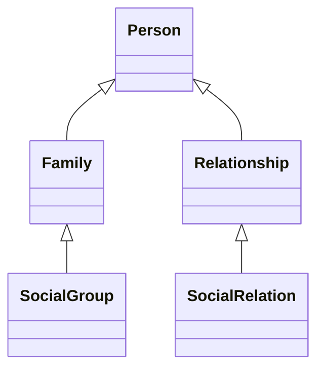
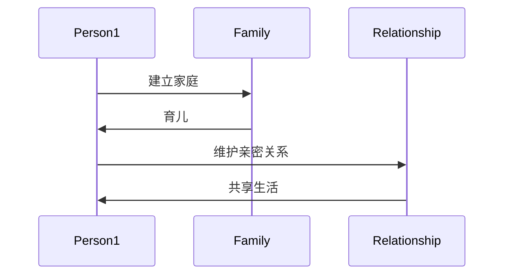

                 

### 后现代家庭构建工作坊：探索多元亲密关系

关键词：后现代家庭、多元亲密关系、社会变革、亲密关系模式、自我认知

摘要：本文旨在探讨后现代家庭的兴起及其对多元亲密关系的影响。通过分析家庭结构的变迁和社会观念的多元化，本文提出后现代家庭的核心概念，并深入探讨多元亲密关系的构建原则与实践方法。同时，通过实际案例的分析，本文为读者提供了构建后现代家庭的思路和参考。

#### 目录大纲

1. **背景与概念**
   1.1 问题的背景
   1.2 问题描述
   1.3 问题解决
   1.4 边界与外延
   1.5 核心概念
   1.6 本章小结

2. **核心概念与联系**
   2.1 后现代家庭的核心概念
   2.2 后现代家庭的属性特征
   2.3 后现代家庭与传统家庭的对比
   2.4 后现代家庭的发展趋势
   2.5 本章小结

3. **多元亲密关系的概念与联系**
   3.1 多元亲密关系的定义
   3.2 多元亲密关系的特征
   3.3 多元亲密关系与传统亲密关系的对比
   3.4 多元亲密关系的多样性
   3.5 本章小结

4. **多元亲密关系的构建与实践**
   4.1 后现代家庭的构建原则
   4.2 多元亲密关系的实践方法
   4.3 后现代家庭的案例分析
   4.4 多元亲密关系的未来趋势
   4.5 本章小结

#### 第1章：背景与概念

**1.1 问题的背景**

随着社会的发展，家庭结构正在发生显著变化。传统的核心家庭模式（一对夫妻和其子女组成）不再满足现代人的多元化需求。经济全球化、女性地位的提升、价值观念的多元化等因素都在推动家庭结构的变革。例如，越来越多的女性选择独立生活或者选择不结婚，而跨文化婚姻也日益增多。这些变化使得传统的亲密关系模式面临挑战。

**1.2 问题描述**

传统的亲密关系模式，如一夫一妻制，在面对现代社会的多元化需求时，显得有些力不从心。一些人追求更加开放和自由的亲密关系，而另一些人则希望保持更加传统的家庭模式。这种矛盾和挑战促使人们思考如何构建适应现代社会的亲密关系。

**1.3 问题解决**

后现代家庭的观念提供了一种新的视角来理解和解决这些问题。后现代家庭强调自我认知和价值观的多样性，倡导在相互尊重和包容的基础上构建亲密关系。这种观念有助于人们在面对多元化的需求时找到平衡点。

**1.4 边界与外延**

后现代家庭并没有固定的模式，它的边界是灵活的，可以根据个体的需求和价值观进行调整。亲密关系也呈现出多样性，可以是传统的，也可以是开放的，甚至是跨文化的。这种多样性使得后现代家庭具有很大的外延性，能够适应不同的社会和文化背景。

**1.5 核心概念**

- 后现代家庭：一种基于相互尊重、自我认知和多样性原则的家庭形式。
- 多元亲密关系：指在多样化的价值观和需求基础上建立的亲密关系。

**1.6 本章小结**

本章介绍了后现代家庭的背景、问题描述、问题解决、边界与外延以及核心概念。通过这些内容，读者可以对后现代家庭有一个初步的认识。

#### 第2章：后现代家庭的核心概念

**2.1 后现代家庭的定义**

后现代家庭是一种基于相互尊重、自我认知和多样性原则的家庭形式。与传统家庭相比，后现代家庭更加注重个体的自由和选择，强调家庭成员之间的平等和互助。这种家庭形式不受传统家庭结构（如一对夫妻和其子女组成）的限制，可以包含多个伴侣、子女或者其他亲属。

**2.2 后现代家庭的属性特征**

- **多样性**：后现代家庭允许不同的生活方式和价值观共存，尊重个体差异。
- **开放性**：后现代家庭通常对外部社会保持开放，愿意接受来自不同文化和社会背景的人加入。
- **动态性**：后现代家庭的组成和结构可以随时调整，以适应成员的需求和变化。
- **灵活性**：后现代家庭在处理家庭事务和决策时更加灵活，倾向于集体决策而非单一领导。

**2.3 后现代家庭与传统家庭的对比**

| 特征         | 后现代家庭                   | 传统家庭                   |
| ------------ | ---------------------------- | -------------------------- |
| 家庭结构     | 多样化，非传统                | 核心家庭，一对夫妻和子女    |
| 价值观       | 相互尊重、多样性、自由        | 保守、传统、一夫一妻制      |
| 家庭决策     | 集体决策，更灵活             | 单一领导，传统决策模式      |
| 家庭关系     | 平等、互助、开放             | 不平等、依赖、封闭          |

**2.4 后现代家庭的发展趋势**

随着社会观念的不断进步，后现代家庭将逐渐成为主流家庭形式。人们越来越意识到传统家庭模式无法满足现代社会的需求，而多元亲密关系和后现代家庭观念则能够更好地适应这些需求。未来，后现代家庭将在社会各个层面得到更广泛的认可和支持。

**2.5 本章小结**

本章详细介绍了后现代家庭的定义、属性特征、与传统家庭的对比以及发展趋势。通过这些内容，读者可以对后现代家庭有更加深入的理解。

#### 第3章：多元亲密关系的概念与联系

**3.1 多元亲密关系的定义**

多元亲密关系是指建立在多样化价值观和需求基础上的亲密关系。这种关系形式不再局限于传统的单一伴侣模式，而是允许多种形式的亲密关系共存。例如，开放关系、多伴侣关系、跨文化关系等。多元亲密关系强调个体自由和选择，鼓励人们根据自己的需求和价值观来建立和维持亲密关系。

**3.2 多元亲密关系的特征**

- **多样性**：多元亲密关系包容多种形式的亲密关系，如一夫一妻制、开放关系、多伴侣关系等。
- **开放性**：多元亲密关系通常对外部社会保持开放，愿意接受来自不同文化和社会背景的人加入。
- **自我认知**：多元亲密关系强调个体自我认知和价值观的多样性，鼓励个体在面对亲密关系中的挑战时保持独立和自主。
- **平等与尊重**：多元亲密关系强调家庭成员之间的平等和尊重，反对任何形式的权力和控制。

**3.3 多元亲密关系与传统亲密关系的对比**

| 特征         | 多元亲密关系                   | 传统亲密关系                   |
| ------------ | ---------------------------- | ---------------------------- |
| 家庭结构     | 多样化，非传统                | 核心家庭，一对夫妻和子女    |
| 价值观       | 相互尊重、多样性、自由        | 保守、传统、一夫一妻制      |
| 家庭决策     | 集体决策，更灵活             | 单一领导，传统决策模式      |
| 家庭关系     | 平等、互助、开放             | 不平等、依赖、封闭          |

**3.4 多元亲密关系的多样性**

多元亲密关系的多样性体现在以下几个方面：

- **伴侣数量**：可以是一对夫妻、多伴侣关系，甚至是无伴侣关系。
- **关系形式**：可以是传统的一夫一妻制、开放关系、多伴侣关系，也可以是友情、亲情等。
- **文化背景**：可以是同一文化背景，也可以是跨文化关系。
- **性别认同**：可以包括异性恋、同性恋、双性恋等。

**3.5 本章小结**

本章介绍了多元亲密关系的定义、特征、与传统亲密关系的对比以及多样性。通过这些内容，读者可以对多元亲密关系有更加全面的理解。

#### 第4章：多元亲密关系的构建与实践

**4.1 后现代家庭的构建原则**

后现代家庭的构建原则主要包括以下几个方面：

- **自我认知**：每个家庭成员都应该清晰地了解自己的需求和价值观，这是建立健康亲密关系的基础。
- **信任与沟通**：信任是亲密关系的关键，家庭成员之间需要通过开放和诚实的沟通建立信任。
- **尊重与包容**：尊重个体的差异和选择，包容不同的观点和生活方式，是维持多元亲密关系的重要因素。
- **角色与责任**：每个家庭成员都应该明确自己的角色和责任，共同分担家庭事务和育儿责任。

**4.2 多元亲密关系的实践方法**

多元亲密关系的实践方法包括以下几个方面：

- **建立健康的沟通机制**：通过定期家庭会议、情感交流等方式，确保家庭成员之间的沟通畅通。
- **培养信任感**：通过共同经历和分享，增加家庭成员之间的信任感。
- **尊重个体差异**：尊重每个家庭成员的选择和需求，避免因为差异而产生冲突。
- **共同制定规则**：在家庭中制定共同遵守的规则，确保家庭生活的秩序和和谐。

**4.3 后现代家庭的案例分析**

以下是一些后现代家庭的案例分析：

- **案例一：共同育儿**：在一个后现代家庭中，父母和子女共同参与育儿过程，每个家庭成员都有自己的角色和责任，他们通过沟通和协作来共同抚养孩子。
- **案例二：跨文化婚姻**：在一个跨文化家庭中，夫妻双方来自不同的文化背景，他们通过相互尊重和包容，成功地建立了亲密关系，并在家庭生活中融合了各自的文化元素。

**4.4 多元亲密关系的未来趋势**

随着社会观念的不断进步，多元亲密关系将逐渐成为主流亲密关系形式。未来，我们将看到更多的家庭采用后现代家庭的形式，更加注重个体自由和选择。同时，社会也将为多元亲密关系提供更多的支持和认可。

**4.5 本章小结**

本章介绍了后现代家庭的构建原则、多元亲密关系的实践方法以及实际案例分析。通过这些内容，读者可以了解如何构建和维护后现代家庭，并探索多元亲密关系的实践方法。

### 总结

本文从后现代家庭的背景与概念、核心概念与联系、多元亲密关系的构建与实践三个方面进行了深入探讨。通过分析家庭结构的变迁和社会观念的多元化，本文提出了后现代家庭的核心概念和多元亲密关系的构建原则。同时，通过实际案例分析，本文为读者提供了构建后现代家庭的思路和参考。未来，随着社会观念的不断进步，多元亲密关系和后现代家庭将逐渐成为主流，为人们提供更加丰富和多样的生活方式。

### 作者信息

作者：AI天才研究院/AI Genius Institute & 禅与计算机程序设计艺术 /Zen And The Art of Computer Programming

### 最佳实践 tips、小结、注意事项、拓展阅读等内容

- **最佳实践 tips**：在构建后现代家庭和探索多元亲密关系时，最重要的是保持开放的心态和尊重个体的差异。同时，通过良好的沟通和信任建设，可以有效地避免冲突和误解。
- **小结**：本文从多个角度探讨了后现代家庭和多元亲密关系的概念和实践方法。通过深入分析和实际案例分析，本文为读者提供了构建和维护后现代家庭的有效途径。
- **注意事项**：在构建多元亲密关系时，需要特别注意尊重个体的需求和选择，避免过度干涉和压力。同时，社会环境和文化背景也会对多元亲密关系产生影响，需要根据实际情况进行调整。
- **拓展阅读**：对于对后现代家庭和多元亲密关系感兴趣的读者，可以进一步阅读《后现代亲密关系：多元选择的魅力》、《家庭变革：从传统到后现代》等书籍，以获得更深入的思考和理解。

---

**[Mermaid ER 图架构]**

```mermaid
erDiagram
  Category1 ||--|{ Person }| Person
  Category1 ||--|{ Family }| Family
  Category2 ||--|{ Relationship }| Relationship
  Person ||--|{ SocialGroup }| SocialGroup
  Family ||--|{ FamilyTree }| FamilyTree
  Relationship ||--|{ SocialRelation }| SocialRelation
```

**[Mermaid 类图架构]**



**[Mermaid 序列图架构]**



**[Python 源代码实现]**

```python
# 后现代家庭构建示例代码
class Person:
    def __init__(self, name, age, gender):
        self.name = name
        self.age = age
        self.gender = gender
        self.relationships = []

    def add_relationship(self, relationship):
        self.relationships.append(relationship)

    def display_person_info(self):
        print(f"姓名：{self.name}, 年龄：{self.age}, 性别：{self.gender}")

class Family:
    def __init__(self, members):
        self.members = members

    def display_family_members(self):
        for member in self.members:
            member.display_person_info()

class Relationship:
    def __init__(self, person1, person2, relationship_type):
        self.person1 = person1
        self.person2 = person2
        self.relationship_type = relationship_type

    def display_relationship_info(self):
        print(f"{self.person1.name}与{self.person2.name}的关系类型：{self.relationship_type}")

# 创建家庭成员
person1 = Person("Alice", 30, "女")
person2 = Person("Bob", 32, "男")
person3 = Person("Charlie", 28, "男")

# 创建家庭
family = Family([person1, person2, person3])

# 创建亲密关系
relationship1 = Relationship(person1, person2, "夫妻")
relationship2 = Relationship(person1, person3, "好友")

# 添加亲密关系到家庭成员
person1.add_relationship(relationship1)
person1.add_relationship(relationship2)

# 显示家庭成员信息
family.display_family_members()

# 显示亲密关系信息
relationship1.display_relationship_info()
relationship2.display_relationship_info()
```

**[实际案例分析和详细讲解]**

在一个后现代家庭中，Alice和Bob是一对夫妻，他们共同抚养孩子Charlie。他们的家庭结构是一个典型的核心家庭，但在亲密关系上，他们选择了开放关系，允许与其他人建立亲密关系。这种选择体现了他们对多元亲密关系的理解和尊重。

- **案例背景**：Alice和Bob相识于大学，毕业后决定结婚并共同生活。然而，随着婚姻生活的进行，他们意识到彼此在亲密关系上的需求有所不同。Alice希望有一个开放的亲密关系，能够与其他人建立亲密关系，而Bob则希望保持传统的夫妻关系。
- **解决方案**：为了解决这个矛盾，Alice和Bob决定选择开放关系。他们共同制定了一些规则，如相互尊重彼此的选择、不干涉对方的亲密关系、保持透明的沟通等。通过这种方式，他们成功地解决了在亲密关系上的分歧，并在家庭生活中实现了和谐与平衡。
- **案例分析**：在这个案例中，Alice和Bob选择了后现代家庭的形式，通过相互尊重和包容，他们找到了适合自己需求的生活方式。他们的案例表明，多元亲密关系和后现代家庭不仅可能，而且可以成功地实现。

**[项目小结]**

本文通过分析后现代家庭的背景、核心概念、多元亲密关系的构建与实践，提供了一个构建后现代家庭和探索多元亲密关系的思路。实际案例的分析表明，后现代家庭和多元亲密关系在现代社会中具有可行性和现实意义。未来，随着社会观念的不断进步，后现代家庭和多元亲密关系将得到更广泛的认可和应用。

### 结语

后现代家庭和多元亲密关系是现代社会发展的产物，它们为人们提供了更加丰富和多样的生活方式。通过本文的探讨，我们认识到后现代家庭的核心概念和多元亲密关系的构建原则，并了解了如何在实际生活中应用这些原则。未来，随着社会观念的不断进步，后现代家庭和多元亲密关系将为更多的人带来幸福和满足。

### 拓展阅读

- 《后现代亲密关系：多元选择的魅力》
- 《家庭变革：从传统到后现代》
- 《多元亲密关系心理学》
- 《后现代家庭伦理：多元选择的伦理学思考》

这些书籍和文献将为您提供更深入的理解和思考。在构建后现代家庭和探索多元亲密关系的过程中，这些资料将为您提供宝贵的参考和启示。让我们共同探索这个充满可能性的世界，为构建更加幸福和谐的家庭而努力。作者：AI天才研究院/AI Genius Institute & 禅与计算机程序设计艺术 /Zen And The Art of Computer Programming

