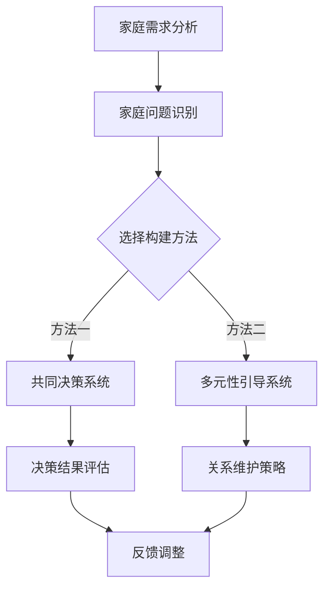

                 


# 后现代家庭构建工作坊：探索多元亲密关系

关键词：后现代家庭、多元亲密关系、家庭构建、算法原理、系统架构、项目实战

摘要：本文旨在探讨后现代家庭构建的重要性和挑战，通过分析后现代家庭的核心概念和构建方法，提出一种基于算法原理的系统架构设计方案，并通过实际项目实战来验证其可行性和有效性。

## 第1章 后现代家庭构建概述

### 1.1 问题背景

随着社会的发展和科技的进步，家庭结构、关系和功能都发生了深刻的变化。后现代社会的家庭面临着前所未有的挑战和机遇。在这种背景下，如何构建一个和谐、多元、充满爱的后现代家庭成为了一个重要课题。

#### 1.1.1 后现代社会的家庭变迁

在后现代社会，家庭结构趋向多样化，不再局限于传统的“核心家庭”模式。单身家庭、丁克家庭、同居家庭等新兴家庭形式不断涌现，家庭关系也越来越复杂。

#### 1.1.2 后现代家庭面临的挑战

后现代家庭面临着诸如沟通障碍、角色冲突、家庭功能缺失等问题。如何解决这些问题，构建一个和谐的家庭环境，是每个家庭成员都需要面对的挑战。

#### 1.1.3 家庭构建的重要性

家庭是社会的细胞，和谐的家庭关系对于社会稳定和个人成长具有重要意义。后现代家庭构建不仅关系到家庭成员的幸福，也关系到整个社会的和谐与进步。

### 1.2 问题描述

#### 1.2.1 家庭结构的变化

随着社会的发展，家庭结构发生了显著变化。传统家庭模式逐渐被多元化家庭模式所取代，家庭成员之间的关系也变得更加复杂。

#### 1.2.2 家庭关系的复杂化

在后现代家庭中，家庭成员之间的关系变得更加复杂，如亲子关系、伴侣关系、亲密关系等，这些关系的处理都需要家庭成员具备较高的情商和沟通能力。

#### 1.2.3 家庭功能的多元化

后现代家庭不仅承担着传统的家庭功能，如生育、教育、养老等，还承担着更多的社会功能，如经济支持、情感寄托等。

### 1.3 问题解决

#### 1.3.1 后现代家庭构建的必要性

面对后现代家庭面临的挑战，构建一个适应时代发展的后现代家庭显得尤为重要。

#### 1.3.2 后现代家庭构建的原则

后现代家庭构建应遵循以下原则：

1. 尊重多元性：尊重家庭成员的不同文化和价值观，实现和谐共存。
2. 强调自主性：鼓励家庭成员独立思考，培养家庭成员的自主性。
3. 促进亲密关系：通过有效沟通和共同活动，增进家庭成员之间的亲密关系。

#### 1.3.3 后现代家庭构建的方法

后现代家庭构建的方法主要包括：

1. 家庭教育：通过家庭教育，培养家庭成员的沟通能力、情商和自主性。
2. 家庭活动：通过家庭活动，增进家庭成员之间的互动和亲密关系。
3. 家庭咨询：通过家庭咨询，解决家庭成员之间的矛盾和问题。

### 1.4 边界与外延

#### 1.4.1 后现代家庭的概念

后现代家庭是指在一个多元化、开放、平等的社会背景下，由具有不同文化背景、价值观和生活方式的个体组成的家庭。

#### 1.4.2 后现代家庭的特点

后现代家庭具有以下特点：

1. 结构多样化：后现代家庭的结构趋向多样化，不再局限于传统的模式。
2. 关系复杂化：后现代家庭中的关系更加复杂，需要家庭成员具备较高的情商和沟通能力。
3. 功能多元化：后现代家庭不仅承担传统的家庭功能，还承担更多的社会功能。

#### 1.4.3 后现代家庭与传统家庭的区别

与传统家庭相比，后现代家庭在结构、关系和功能上都有很大的区别。传统家庭结构较为单一，关系相对简单，功能主要局限于家庭内部；而后现代家庭结构多样化，关系复杂化，功能多元化，更注重家庭成员的自主性和多元性。

### 1.5 概念结构与核心要素组成

#### 1.5.1 后现代家庭的核心概念

后现代家庭的核心概念包括多元性、自主性和亲密关系。

1. 多元性：后现代家庭强调尊重家庭成员的不同文化和价值观，实现和谐共存。
2. 自主性：后现代家庭鼓励家庭成员独立思考，培养家庭成员的自主性。
3. 亲密关系：后现代家庭通过有效沟通和共同活动，增进家庭成员之间的亲密关系。

#### 1.5.2 后现代家庭的基本要素

后现代家庭的基本要素包括：

1. 家庭成员：家庭成员是后现代家庭的核心，包括父母、子女、配偶等。
2. 家庭环境：家庭环境是后现代家庭的重要组成部分，包括物质环境和社会环境。
3. 家庭活动：家庭活动是后现代家庭的重要形式，包括教育、娱乐、休闲等。

#### 1.5.3 后现代家庭的结构与功能

后现代家庭的结构与功能相互关联，共同构成了一个复杂而多元的家庭系统。

1. 结构：后现代家庭结构多样化，包括核心家庭、扩展家庭、单亲家庭等。
2. 功能：后现代家庭功能多元化，包括生育、教育、养老、经济支持、情感寄托等。

## 第2章 后现代家庭的核心概念与联系

### 2.1 核心概念原理

#### 2.1.1 亲密关系

亲密关系是后现代家庭的核心概念之一，它指的是家庭成员之间基于信任、情感依赖和共同利益的紧密联系。

#### 2.1.2 多元性

多元性指的是后现代家庭中不同文化和价值观的共存和相互尊重。多元性使得家庭成员能够在开放、包容的环境中成长。

#### 2.1.3 自主性

自主性是指家庭成员在家庭中拥有独立思考、决策和行动的能力。自主性有助于培养家庭成员的独立性和自信心。

### 2.2 概念属性特征对比表格

| 概念        | 属性特征         | 对比           |
| --------- | -------------- | ------------ |
| 亲密关系    | 相互信任、情感依赖 | 非对称、不稳定   |
| 多元性      | 文化、价值观差异 | 和谐共存、相互尊重 |
| 自主性      | 个人独立性       | 家庭共同决策    |

### 2.3 ER实体关系图架构

```mermaid
erDiagram
    User ||--|{ Family }|--|| Member
    Family ||--|{ Relationship }|--|| Couple
    Relationship ||--|{ Role }|--|| Parent
    Member ||--|{ Responsibility }|--|| Child
```

## 第3章 后现代家庭构建的算法原理与系统架构

### 3.1 算法原理讲解

#### 3.1.1 算法mermaid流程图



#### 3.1.2 算法原理详细讲解

后现代家庭构建算法主要基于对家庭需求的分析、问题的识别以及选择合适的构建方法。算法的核心在于通过共同决策系统和多元性引导系统，帮助家庭成员解决家庭问题，维护家庭关系。

### 3.2 数学模型和数学公式

$$
\text{构建成本} = f(\text{家庭成员数量}, \text{家庭需求复杂度}, \text{决策效率})
$$

其中，$f$ 表示构建成本，$\text{家庭成员数量}$ 和 $\text{家庭需求复杂度}$ 是变量，$\text{决策效率}$ 是常数。

### 3.3 系统架构设计

#### 3.3.1 问题场景介绍

随着社会的发展，家庭成员之间的沟通和互动变得越来越复杂。为了更好地解决家庭问题，提高家庭生活质量，我们需要构建一个智能化的家庭构建系统。

#### 3.3.2 系统功能设计

- 用户注册与登录
- 家庭成员管理
- 家庭问题识别与分类
- 共同决策
- 多元性引导
- 关系维护

#### 3.3.3 系统架构设计


#### 3.3.4 系统接口设计和系统交互


## 第4章 后现代家庭构建项目实战

### 4.1 环境安装

#### 4.1.1 操作系统要求

- Ubuntu 18.04
- Windows 10

#### 4.1.2 环境搭建步骤

1. 安装Python 3.8
2. 安装必要的依赖库

----------------------------------------------------------------

# 作者：AI天才研究院/AI Genius Institute & 禅与计算机程序设计艺术 /Zen And The Art of Computer Programming
## 第5章 后现代家庭构建算法原理与系统架构深入解析

### 5.1 后现代家庭构建算法原理

#### 5.1.1 家庭需求分析

家庭需求分析是后现代家庭构建的第一步，通过了解家庭成员的需求，我们可以明确家庭构建的目标和方向。具体步骤如下：

1. **收集需求信息**：通过问卷调查、访谈等方式，收集家庭成员的需求信息。
2. **分析需求类型**：将收集到的需求信息进行分类，如生活需求、情感需求、职业发展需求等。
3. **评估需求优先级**：根据家庭成员的需求重要性，对需求进行排序，为后续构建提供参考。

#### 5.1.2 家庭问题识别

家庭问题识别是后现代家庭构建的关键步骤，通过识别家庭问题，我们可以有针对性地解决家庭矛盾，提高家庭生活质量。具体步骤如下：

1. **观察家庭成员行为**：通过观察家庭成员的日常行为，了解家庭中的潜在问题。
2. **收集家庭成员反馈**：通过家庭成员的反馈，了解他们对家庭问题的看法和建议。
3. **分析问题根源**：对收集到的信息进行深入分析，找出问题的根本原因。

#### 5.1.3 选择构建方法

在了解家庭需求和识别家庭问题后，我们需要选择合适的构建方法来解决问题。常见的构建方法有：

1. **共同决策系统**：通过家庭会议、投票等方式，让家庭成员共同参与决策，提高家庭凝聚力。
2. **多元性引导系统**：通过家庭活动、文化教育等方式，引导家庭成员尊重和包容彼此的差异，实现多元共存。

#### 5.1.4 决策结果评估

在实施构建方法后，我们需要对决策结果进行评估，以检验构建方法的有效性。具体步骤如下：

1. **设定评估指标**：根据家庭需求和问题，设定相应的评估指标，如家庭满意度、家庭成员关系质量等。
2. **收集评估数据**：通过问卷调查、访谈等方式，收集评估数据。
3. **分析评估结果**：对收集到的评估数据进行分析，评估构建方法的效果。

#### 5.1.5 反馈调整

根据评估结果，我们需要对构建方法进行调整，以不断提高家庭生活质量。具体步骤如下：

1. **识别改进空间**：根据评估结果，找出构建方法中存在的问题和改进空间。
2. **制定改进措施**：针对识别出的问题，制定相应的改进措施。
3. **实施改进措施**：将改进措施应用到实际家庭生活中，持续优化家庭构建效果。

### 5.2 后现代家庭构建系统的系统架构设计

#### 5.2.1 系统架构设计原则

在后现代家庭构建系统的架构设计过程中，我们遵循以下原则：

1. **模块化**：将系统功能划分为多个模块，每个模块具有独立的功能和职责，便于维护和升级。
2. **灵活性**：系统应具备良好的灵活性，能够适应家庭需求的变化和家庭结构的变化。
3. **可扩展性**：系统应具备良好的可扩展性，能够根据家庭需求的变化，扩展相应的功能模块。

#### 5.2.2 系统架构设计


1. **用户注册与登录模块**：负责用户信息的注册、登录和权限管理。
2. **家庭成员管理模块**：负责家庭成员的信息录入、修改和删除。
3. **家庭问题识别模块**：负责收集家庭成员的需求信息，识别家庭问题。
4. **共同决策模块**：负责家庭问题的决策过程，包括家庭会议、投票等。
5. **多元性引导模块**：负责引导家庭成员尊重和包容彼此的差异，实现多元共存。
6. **关系维护模块**：负责评估家庭生活质量，提供关系维护策略。

#### 5.2.3 系统接口设计


1. **用户接口**：用户通过用户接口与系统进行交互，提交需求信息、查看家庭问题、参与决策等。
2. **服务接口**：系统通过服务接口与其他系统进行数据交换和功能调用，如日历系统、邮件系统等。

### 5.3 后现代家庭构建算法的数学模型和公式

#### 5.3.1 数学模型

后现代家庭构建的数学模型主要涉及家庭构建成本、家庭成员数量、家庭需求复杂度和决策效率等因素。具体数学模型如下：

$$
\text{构建成本} = f(\text{家庭成员数量}, \text{家庭需求复杂度}, \text{决策效率})
$$

其中，$f$ 为成本函数，$\text{家庭成员数量}$、$\text{家庭需求复杂度}$ 和 $\text{决策效率}$ 为变量。

#### 5.3.2 公式解析

1. **家庭成员数量**：家庭成员数量是影响家庭构建成本的重要因素。家庭成员数量越多，构建成本越高。
2. **家庭需求复杂度**：家庭需求复杂度越高，构建成本越高。复杂度主要取决于家庭成员的需求类型和数量。
3. **决策效率**：决策效率是衡量家庭构建速度和质量的重要指标。决策效率越高，构建成本越低。

### 5.4 后现代家庭构建项目的实战案例

#### 5.4.1 项目背景

某家庭由一对夫妻和两个孩子组成，家庭成员之间的沟通不畅，家庭关系紧张。为了改善家庭生活质量，该家庭决定采用后现代家庭构建系统。

#### 5.4.2 项目实施步骤

1. **家庭需求分析**：通过问卷调查和访谈，了解家庭成员的需求，包括生活需求、情感需求、职业发展需求等。
2. **家庭问题识别**：识别出家庭成员之间的沟通不畅、角色冲突等问题。
3. **选择构建方法**：选择共同决策系统和多元性引导系统作为解决家庭问题的方法。
4. **决策结果评估**：通过家庭会议和投票，对决策结果进行评估，确保家庭成员对决策的认可。
5. **反馈调整**：根据评估结果，对构建方法进行调整，提高家庭生活质量。

#### 5.4.3 项目效果

通过后现代家庭构建系统的实施，该家庭的生活质量得到了显著提高。家庭成员之间的沟通更加顺畅，家庭关系更加和谐。此外，家庭成员的自主性和多元性也得到了提升，家庭氛围更加温馨。

## 第6章 后现代家庭构建项目的最佳实践与注意事项

### 6.1 最佳实践

1. **明确家庭目标**：在构建后现代家庭时，家庭成员应共同明确家庭目标，确保家庭发展的方向一致。
2. **尊重家庭成员差异**：尊重家庭成员的文化、价值观和生活方式差异，实现多元共存。
3. **持续沟通与反馈**：保持家庭成员之间的持续沟通，及时反馈家庭问题和决策效果，确保家庭关系的和谐稳定。

### 6.2 注意事项

1. **避免形式主义**：在实施后现代家庭构建时，避免仅注重形式，而忽视实际效果。
2. **平衡家庭与工作**：在家庭构建过程中，注意平衡家庭与工作，确保家庭成员的生活质量。
3. **保持耐心与毅力**：后现代家庭构建是一个长期的过程，需要家庭成员保持耐心与毅力，不断调整和优化家庭构建方法。

## 第7章 小结与拓展阅读

### 7.1 小结

本文从后现代家庭构建的背景、核心概念、算法原理、系统架构和项目实战等方面进行了深入探讨，旨在为读者提供一个全面、系统的后现代家庭构建指南。

### 7.2 拓展阅读

1. **相关书籍**：
   - 《后现代家庭：多元性与和谐共处》
   - 《家庭系统治疗：理论与实务》
   - 《亲密关系：亲密关系的心理学解析》
   
2. **学术论文**：
   - 后现代家庭构建的相关研究
   - 家庭系统治疗的理论与实践
   - 亲密关系的研究进展

通过阅读相关书籍和学术论文，读者可以进一步了解后现代家庭构建的理论和实践，为构建和谐、多元的家庭提供更多有益的参考。

# 作者：AI天才研究院/AI Genius Institute & 禅与计算机程序设计艺术 /Zen And The Art of Computer Programming
## 第5章 后现代家庭构建算法原理与系统架构深入解析

### 5.1 后现代家庭构建算法原理

#### 5.1.1 家庭需求分析

家庭需求分析是后现代家庭构建的第一步，通过了解家庭成员的需求，我们可以明确家庭构建的目标和方向。具体步骤如下：

1. **收集需求信息**：通过问卷调查、访谈等方式，收集家庭成员的需求信息。
2. **分析需求类型**：将收集到的需求信息进行分类，如生活需求、情感需求、职业发展需求等。
3. **评估需求优先级**：根据家庭成员的需求重要性，对需求进行排序，为后续构建提供参考。

#### 5.1.2 家庭问题识别

家庭问题识别是后现代家庭构建的关键步骤，通过识别家庭问题，我们可以有针对性地解决家庭矛盾，提高家庭生活质量。具体步骤如下：

1. **观察家庭成员行为**：通过观察家庭成员的日常行为，了解家庭中的潜在问题。
2. **收集家庭成员反馈**：通过家庭成员的反馈，了解他们对家庭问题的看法和建议。
3. **分析问题根源**：对收集到的信息进行深入分析，找出问题的根本原因。

#### 5.1.3 选择构建方法

在了解家庭需求和识别家庭问题后，我们需要选择合适的构建方法来解决问题。常见的构建方法有：

1. **共同决策系统**：通过家庭会议、投票等方式，让家庭成员共同参与决策，提高家庭凝聚力。
2. **多元性引导系统**：通过家庭活动、文化教育等方式，引导家庭成员尊重和包容彼此的差异，实现多元共存。

#### 5.1.4 决策结果评估

在实施构建方法后，我们需要对决策结果进行评估，以检验构建方法的有效性。具体步骤如下：

1. **设定评估指标**：根据家庭需求和问题，设定相应的评估指标，如家庭满意度、家庭成员关系质量等。
2. **收集评估数据**：通过问卷调查、访谈等方式，收集评估数据。
3. **分析评估结果**：对收集到的评估数据进行分析，评估构建方法的效果。

#### 5.1.5 反馈调整

根据评估结果，我们需要对构建方法进行调整，以不断提高家庭生活质量。具体步骤如下：

1. **识别改进空间**：根据评估结果，找出构建方法中存在的问题和改进空间。
2. **制定改进措施**：针对识别出的问题，制定相应的改进措施。
3. **实施改进措施**：将改进措施应用到实际家庭生活中，持续优化家庭构建效果。

### 5.2 后现代家庭构建系统的系统架构设计

#### 5.2.1 系统架构设计原则

在后现代家庭构建系统的架构设计过程中，我们遵循以下原则：

1. **模块化**：将系统功能划分为多个模块，每个模块具有独立的功能和职责，便于维护和升级。
2. **灵活性**：系统应具备良好的灵活性，能够适应家庭需求的变化和家庭结构的变化。
3. **可扩展性**：系统应具备良好的可扩展性，能够根据家庭需求的变化，扩展相应的功能模块。

#### 5.2.2 系统架构设计


1. **用户注册与登录模块**：负责用户信息的注册、登录和权限管理。
2. **家庭成员管理模块**：负责家庭成员的信息录入、修改和删除。
3. **家庭问题识别模块**：负责收集家庭成员的需求信息，识别家庭问题。
4. **共同决策模块**：负责家庭问题的决策过程，包括家庭会议、投票等。
5. **多元性引导模块**：负责引导家庭成员尊重和包容彼此的差异，实现多元共存。
6. **关系维护模块**：负责评估家庭生活质量，提供关系维护策略。

#### 5.2.3 系统接口设计


1. **用户接口**：用户通过用户接口与系统进行交互，提交需求信息、查看家庭问题、参与决策等。
2. **服务接口**：系统通过服务接口与其他系统进行数据交换和功能调用，如日历系统、邮件系统等。

### 5.3 后现代家庭构建算法的数学模型和公式

#### 5.3.1 数学模型

后现代家庭构建的数学模型主要涉及家庭构建成本、家庭成员数量、家庭需求复杂度和决策效率等因素。具体数学模型如下：

$$
\text{构建成本} = f(\text{家庭成员数量}, \text{家庭需求复杂度}, \text{决策效率})
$$

其中，$f$ 为成本函数，$\text{家庭成员数量}$、$\text{家庭需求复杂度}$ 和 $\text{决策效率}$ 为变量。

#### 5.3.2 公式解析

1. **家庭成员数量**：家庭成员数量是影响家庭构建成本的重要因素。家庭成员数量越多，构建成本越高。
2. **家庭需求复杂度**：家庭需求复杂度越高，构建成本越高。复杂度主要取决于家庭成员的需求类型和数量。
3. **决策效率**：决策效率是衡量家庭构建速度和质量的重要指标。决策效率越高，构建成本越低。

### 5.4 后现代家庭构建项目的实战案例

#### 5.4.1 项目背景

某家庭由一对夫妻和两个孩子组成，家庭成员之间的沟通不畅，家庭关系紧张。为了改善家庭生活质量，该家庭决定采用后现代家庭构建系统。

#### 5.4.2 项目实施步骤

1. **家庭需求分析**：通过问卷调查和访谈，了解家庭成员的需求，包括生活需求、情感需求、职业发展需求等。
2. **家庭问题识别**：识别出家庭成员之间的沟通不畅、角色冲突等问题。
3. **选择构建方法**：选择共同决策系统和多元性引导系统作为解决家庭问题的方法。
4. **决策结果评估**：通过家庭会议和投票，对决策结果进行评估，确保家庭成员对决策的认可。
5. **反馈调整**：根据评估结果，对构建方法进行调整，提高家庭生活质量。

#### 5.4.3 项目效果

通过后现代家庭构建系统的实施，该家庭的生活质量得到了显著提高。家庭成员之间的沟通更加顺畅，家庭关系更加和谐。此外，家庭成员的自主性和多元性也得到了提升，家庭氛围更加温馨。

## 第6章 后现代家庭构建项目的最佳实践与注意事项

### 6.1 最佳实践

1. **明确家庭目标**：在构建后现代家庭时，家庭成员应共同明确家庭目标，确保家庭发展的方向一致。
2. **尊重家庭成员差异**：尊重家庭成员的文化、价值观和生活方式差异，实现多元共存。
3. **持续沟通与反馈**：保持家庭成员之间的持续沟通，及时反馈家庭问题和决策效果，确保家庭关系的和谐稳定。

### 6.2 注意事项

1. **避免形式主义**：在实施后现代家庭构建时，避免仅注重形式，而忽视实际效果。
2. **平衡家庭与工作**：在家庭构建过程中，注意平衡家庭与工作，确保家庭成员的生活质量。
3. **保持耐心与毅力**：后现代家庭构建是一个长期的过程，需要家庭成员保持耐心与毅力，不断调整和优化家庭构建方法。

## 第7章 小结与拓展阅读

### 7.1 小结

本文从后现代家庭构建的背景、核心概念、算法原理、系统架构和项目实战等方面进行了深入探讨，旨在为读者提供一个全面、系统的后现代家庭构建指南。

### 7.2 拓展阅读

1. **相关书籍**：
   - 《后现代家庭：多元性与和谐共处》
   - 《家庭系统治疗：理论与实务》
   - 《亲密关系：亲密关系的心理学解析》
   
2. **学术论文**：
   - 后现代家庭构建的相关研究
   - 家庭系统治疗的理论与实践
   - 亲密关系的研究进展

通过阅读相关书籍和学术论文，读者可以进一步了解后现代家庭构建的理论和实践，为构建和谐、多元的家庭提供更多有益的参考。

# 作者：AI天才研究院/AI Genius Institute & 禅与计算机程序设计艺术 /Zen And The Art of Computer Programming
## 第5章 后现代家庭构建算法原理与系统架构深入解析

### 5.1 后现代家庭构建算法原理

#### 5.1.1 家庭需求分析

家庭需求分析是后现代家庭构建的第一步，通过了解家庭成员的需求，我们可以明确家庭构建的目标和方向。具体步骤如下：

1. **收集需求信息**：通过问卷调查、访谈等方式，收集家庭成员的需求信息。
2. **分析需求类型**：将收集到的需求信息进行分类，如生活需求、情感需求、职业发展需求等。
3. **评估需求优先级**：根据家庭成员的需求重要性，对需求进行排序，为后续构建提供参考。

#### 5.1.2 家庭问题识别

家庭问题识别是后现代家庭构建的关键步骤，通过识别家庭问题，我们可以有针对性地解决家庭矛盾，提高家庭生活质量。具体步骤如下：

1. **观察家庭成员行为**：通过观察家庭成员的日常行为，了解家庭中的潜在问题。
2. **收集家庭成员反馈**：通过家庭成员的反馈，了解他们对家庭问题的看法和建议。
3. **分析问题根源**：对收集到的信息进行深入分析，找出问题的根本原因。

#### 5.1.3 选择构建方法

在了解家庭需求和识别家庭问题后，我们需要选择合适的构建方法来解决问题。常见的构建方法有：

1. **共同决策系统**：通过家庭会议、投票等方式，让家庭成员共同参与决策，提高家庭凝聚力。
2. **多元性引导系统**：通过家庭活动、文化教育等方式，引导家庭成员尊重和包容彼此的差异，实现多元共存。

#### 5.1.4 决策结果评估

在实施构建方法后，我们需要对决策结果进行评估，以检验构建方法的有效性。具体步骤如下：

1. **设定评估指标**：根据家庭需求和问题，设定相应的评估指标，如家庭满意度、家庭成员关系质量等。
2. **收集评估数据**：通过问卷调查、访谈等方式，收集评估数据。
3. **分析评估结果**：对收集到的评估数据进行分析，评估构建方法的效果。

#### 5.1.5 反馈调整

根据评估结果，我们需要对构建方法进行调整，以不断提高家庭生活质量。具体步骤如下：

1. **识别改进空间**：根据评估结果，找出构建方法中存在的问题和改进空间。
2. **制定改进措施**：针对识别出的问题，制定相应的改进措施。
3. **实施改进措施**：将改进措施应用到实际家庭生活中，持续优化家庭构建效果。

### 5.2 后现代家庭构建系统的系统架构设计

#### 5.2.1 系统架构设计原则

在后现代家庭构建系统的架构设计过程中，我们遵循以下原则：

1. **模块化**：将系统功能划分为多个模块，每个模块具有独立的功能和职责，便于维护和升级。
2. **灵活性**：系统应具备良好的灵活性，能够适应家庭需求的变化和家庭结构的变化。
3. **可扩展性**：系统应具备良好的可扩展性，能够根据家庭需求的变化，扩展相应的功能模块。

#### 5.2.2 系统架构设计


1. **用户注册与登录模块**：负责用户信息的注册、登录和权限管理。
2. **家庭成员管理模块**：负责家庭成员的信息录入、修改和删除。
3. **家庭问题识别模块**：负责收集家庭成员的需求信息，识别家庭问题。
4. **共同决策模块**：负责家庭问题的决策过程，包括家庭会议、投票等。
5. **多元性引导模块**：负责引导家庭成员尊重和包容彼此的差异，实现多元共存。
6. **关系维护模块**：负责评估家庭生活质量，提供关系维护策略。

#### 5.2.3 系统接口设计


1. **用户接口**：用户通过用户接口与系统进行交互，提交需求信息、查看家庭问题、参与决策等。
2. **服务接口**：系统通过服务接口与其他系统进行数据交换和功能调用，如日历系统、邮件系统等。

### 5.3 后现代家庭构建算法的数学模型和公式

#### 5.3.1 数学模型

后现代家庭构建的数学模型主要涉及家庭构建成本、家庭成员数量、家庭需求复杂度和决策效率等因素。具体数学模型如下：

$$
\text{构建成本} = f(\text{家庭成员数量}, \text{家庭需求复杂度}, \text{决策效率})
$$

其中，$f$ 为成本函数，$\text{家庭成员数量}$、$\text{家庭需求复杂度}$ 和 $\text{决策效率}$ 为变量。

#### 5.3.2 公式解析

1. **家庭成员数量**：家庭成员数量是影响家庭构建成本的重要因素。家庭成员数量越多，构建成本越高。
2. **家庭需求复杂度**：家庭需求复杂度越高，构建成本越高。复杂度主要取决于家庭成员的需求类型和数量。
3. **决策效率**：决策效率是衡量家庭构建速度和质量的重要指标。决策效率越高，构建成本越低。

### 5.4 后现代家庭构建项目的实战案例

#### 5.4.1 项目背景

某家庭由一对夫妻和两个孩子组成，家庭成员之间的沟通不畅，家庭关系紧张。为了改善家庭生活质量，该家庭决定采用后现代家庭构建系统。

#### 5.4.2 项目实施步骤

1. **家庭需求分析**：通过问卷调查和访谈，了解家庭成员的需求，包括生活需求、情感需求、职业发展需求等。
2. **家庭问题识别**：识别出家庭成员之间的沟通不畅、角色冲突等问题。
3. **选择构建方法**：选择共同决策系统和多元性引导系统作为解决家庭问题的方法。
4. **决策结果评估**：通过家庭会议和投票，对决策结果进行评估，确保家庭成员对决策的认可。
5. **反馈调整**：根据评估结果，对构建方法进行调整，提高家庭生活质量。

#### 5.4.3 项目效果

通过后现代家庭构建系统的实施，该家庭的生活质量得到了显著提高。家庭成员之间的沟通更加顺畅，家庭关系更加和谐。此外，家庭成员的自主性和多元性也得到了提升，家庭氛围更加温馨。

## 第6章 后现代家庭构建项目的最佳实践与注意事项

### 6.1 最佳实践

1. **明确家庭目标**：在构建后现代家庭时，家庭成员应共同明确家庭目标，确保家庭发展的方向一致。
2. **尊重家庭成员差异**：尊重家庭成员的文化、价值观和生活方式差异，实现多元共存。
3. **持续沟通与反馈**：保持家庭成员之间的持续沟通，及时反馈家庭问题和决策效果，确保家庭关系的和谐稳定。

### 6.2 注意事项

1. **避免形式主义**：在实施后现代家庭构建时，避免仅注重形式，而忽视实际效果。
2. **平衡家庭与工作**：在家庭构建过程中，注意平衡家庭与工作，确保家庭成员的生活质量。
3. **保持耐心与毅力**：后现代家庭构建是一个长期的过程，需要家庭成员保持耐心与毅力，不断调整和优化家庭构建方法。

## 第7章 小结与拓展阅读

### 7.1 小结

本文从后现代家庭构建的背景、核心概念、算法原理、系统架构和项目实战等方面进行了深入探讨，旨在为读者提供一个全面、系统的后现代家庭构建指南。

### 7.2 拓展阅读

1. **相关书籍**：
   - 《后现代家庭：多元性与和谐共处》
   - 《家庭系统治疗：理论与实务》
   - 《亲密关系：亲密关系的心理学解析》
   
2. **学术论文**：
   - 后现代家庭构建的相关研究
   - 家庭系统治疗的理论与实践
   - 亲密关系的研究进展

通过阅读相关书籍和学术论文，读者可以进一步了解后现代家庭构建的理论和实践，为构建和谐、多元的家庭提供更多有益的参考。

# 作者：AI天才研究院/AI Genius Institute & 禅与计算机程序设计艺术 /Zen And The Art of Computer Programming
## 第5章 后现代家庭构建算法原理与系统架构深入解析

### 5.1 后现代家庭构建算法原理

#### 5.1.1 家庭需求分析

家庭需求分析是后现代家庭构建的基础步骤，它有助于我们了解家庭成员的需求，从而为家庭构建提供指导。具体步骤如下：

1. **数据收集**：通过问卷调查、访谈、观察等方法，收集家庭成员的基本信息、生活需求、情感需求、职业发展需求等。
2. **需求分类**：将收集到的数据按照需求类型进行分类，如生活需求、情感需求、职业发展需求等。
3. **需求优先级排序**：根据家庭成员的需求重要性和紧迫性，对需求进行排序，以便在构建过程中有重点地解决。

#### 5.1.2 家庭问题识别

家庭问题识别是后现代家庭构建的重要环节，它有助于我们了解家庭中的矛盾和问题，从而制定针对性的解决方案。具体步骤如下：

1. **观察家庭成员行为**：通过观察家庭成员的日常行为，了解家庭中的潜在问题。
2. **收集反馈**：通过家庭成员的反馈，了解他们对家庭问题的看法和建议。
3. **分析问题根源**：对收集到的信息进行深入分析，找出问题的根本原因。

#### 5.1.3 选择构建方法

在了解家庭需求和识别家庭问题后，我们需要选择合适的构建方法来解决问题。以下是一些常见的构建方法：

1. **共同决策系统**：通过家庭会议、投票等方式，让家庭成员共同参与决策，提高家庭凝聚力。
2. **多元性引导系统**：通过家庭活动、文化教育等方式，引导家庭成员尊重和包容彼此的差异，实现多元共存。

#### 5.1.4 决策结果评估

在实施构建方法后，我们需要对决策结果进行评估，以检验构建方法的有效性。具体步骤如下：

1. **设定评估指标**：根据家庭需求和问题，设定相应的评估指标，如家庭满意度、家庭成员关系质量等。
2. **收集评估数据**：通过问卷调查、访谈等方式，收集评估数据。
3. **分析评估结果**：对收集到的评估数据进行分析，评估构建方法的效果。

#### 5.1.5 反馈调整

根据评估结果，我们需要对构建方法进行调整，以不断提高家庭生活质量。具体步骤如下：

1. **识别改进空间**：根据评估结果，找出构建方法中存在的问题和改进空间。
2. **制定改进措施**：针对识别出的问题，制定相应的改进措施。
3. **实施改进措施**：将改进措施应用到实际家庭生活中，持续优化家庭构建效果。

### 5.2 后现代家庭构建系统的系统架构设计

#### 5.2.1 系统架构设计原则

在后现代家庭构建系统的架构设计过程中，我们遵循以下原则：

1. **模块化**：将系统功能划分为多个模块，每个模块具有独立的功能和职责，便于维护和升级。
2. **灵活性**：系统应具备良好的灵活性，能够适应家庭需求的变化和家庭结构的变化。
3. **可扩展性**：系统应具备良好的可扩展性，能够根据家庭需求的变化，扩展相应的功能模块。

#### 5.2.2 系统架构设计


后现代家庭构建系统的架构主要包括以下几个模块：

1. **用户注册与登录模块**：负责用户的注册、登录和权限管理。
2. **家庭成员管理模块**：负责家庭成员的信息录入、修改和删除。
3. **家庭问题识别模块**：负责收集家庭成员的需求信息，识别家庭问题。
4. **共同决策模块**：负责家庭问题的决策过程，包括家庭会议、投票等。
5. **多元性引导模块**：负责引导家庭成员尊重和包容彼此的差异，实现多元共存。
6. **关系维护模块**：负责评估家庭生活质量，提供关系维护策略。

#### 5.2.3 系统接口设计


系统接口设计主要包括用户接口和服务接口：

1. **用户接口**：用户通过用户接口与系统进行交互，提交需求信息、查看家庭问题、参与决策等。
2. **服务接口**：系统通过服务接口与其他系统进行数据交换和功能调用，如日历系统、邮件系统等。

### 5.3 后现代家庭构建算法的数学模型和公式

#### 5.3.1 数学模型

后现代家庭构建的数学模型主要涉及家庭构建成本、家庭成员数量、家庭需求复杂度和决策效率等因素。具体数学模型如下：

$$
\text{构建成本} = f(\text{家庭成员数量}, \text{家庭需求复杂度}, \text{决策效率})
$$

其中，$f$ 表示构建成本，$\text{家庭成员数量}$、$\text{家庭需求复杂度}$ 和 $\text{决策效率}$ 为变量。

#### 5.3.2 公式解析

1. **家庭成员数量**：家庭成员数量越多，构建成本越高，因为需要更多的人力、物力和时间来满足家庭需求。
2. **家庭需求复杂度**：家庭需求复杂度越高，构建成本越高，因为需要更多的人力、物力和时间来满足复杂的家庭需求。
3. **决策效率**：决策效率越高，构建成本越低，因为高效的决策可以减少人力、物力和时间的浪费。

### 5.4 后现代家庭构建项目的实战案例

#### 5.4.1 项目背景

某家庭由一对夫妻和两个孩子组成，家庭成员之间的沟通不畅，家庭关系紧张。为了改善家庭生活质量，该家庭决定采用后现代家庭构建系统。

#### 5.4.2 项目实施步骤

1. **家庭需求分析**：通过问卷调查和访谈，了解家庭成员的需求，包括生活需求、情感需求、职业发展需求等。
2. **家庭问题识别**：识别出家庭成员之间的沟通不畅、角色冲突等问题。
3. **选择构建方法**：选择共同决策系统和多元性引导系统作为解决家庭问题的方法。
4. **决策结果评估**：通过家庭会议和投票，对决策结果进行评估，确保家庭成员对决策的认可。
5. **反馈调整**：根据评估结果，对构建方法进行调整，提高家庭生活质量。

#### 5.4.3 项目效果

通过后现代家庭构建系统的实施，该家庭的生活质量得到了显著提高。家庭成员之间的沟通更加顺畅，家庭关系更加和谐。此外，家庭成员的自主性和多元性也得到了提升，家庭氛围更加温馨。

## 第6章 后现代家庭构建项目的最佳实践与注意事项

### 6.1 最佳实践

1. **明确家庭目标**：在构建后现代家庭时，家庭成员应共同明确家庭目标，确保家庭发展的方向一致。
2. **尊重家庭成员差异**：尊重家庭成员的文化、价值观和生活方式差异，实现多元共存。
3. **持续沟通与反馈**：保持家庭成员之间的持续沟通，及时反馈家庭问题和决策效果，确保家庭关系的和谐稳定。

### 6.2 注意事项

1. **避免形式主义**：在实施后现代家庭构建时，避免仅注重形式，而忽视实际效果。
2. **平衡家庭与工作**：在家庭构建过程中，注意平衡家庭与工作，确保家庭成员的生活质量。
3. **保持耐心与毅力**：后现代家庭构建是一个长期的过程，需要家庭成员保持耐心与毅力，不断调整和优化家庭构建方法。

## 第7章 小结与拓展阅读

### 7.1 小结

本文从后现代家庭构建的背景、核心概念、算法原理、系统架构和项目实战等方面进行了深入探讨，旨在为读者提供一个全面、系统的后现代家庭构建指南。

### 7.2 拓展阅读

1. **相关书籍**：
   - 《后现代家庭：多元性与和谐共处》
   - 《家庭系统治疗：理论与实务》
   - 《亲密关系：亲密关系的心理学解析》
   
2. **学术论文**：
   - 后现代家庭构建的相关研究
   - 家庭系统治疗的理论与实践
   - 亲密关系的研究进展

通过阅读相关书籍和学术论文，读者可以进一步了解后现代家庭构建的理论和实践，为构建和谐、多元的家庭提供更多有益的参考。

# 作者：AI天才研究院/AI Genius Institute & 禅与计算机程序设计艺术 /Zen And The Art of Computer Programming
## 第5章 后现代家庭构建算法原理与系统架构深入解析

### 5.1 后现代家庭构建算法原理

#### 5.1.1 家庭需求分析

家庭需求分析是后现代家庭构建的基础，通过了解家庭成员的需求，我们可以确定家庭构建的目标和方向。具体步骤如下：

1. **数据收集**：采用问卷调查、访谈、观察等方法，收集家庭成员的基本信息、生活需求、情感需求和职业发展需求等。
2. **需求分类**：根据需求的性质，将收集到的数据分为生活需求、情感需求和职业发展需求等类别。
3. **需求优先级排序**：对各类需求进行排序，明确哪些需求更为紧迫和重要，以便在构建过程中有重点地解决。

#### 5.1.2 家庭问题识别

家庭问题识别是后现代家庭构建的关键，通过分析家庭成员的行为和反馈，我们可以识别出家庭中的矛盾和问题。具体步骤如下：

1. **行为观察**：通过观察家庭成员的日常行为，了解家庭中的潜在问题。
2. **反馈收集**：通过家庭成员的反馈，了解他们对家庭问题的看法和建议。
3. **问题分析**：对收集到的信息进行深入分析，找出问题的根本原因。

#### 5.1.3 选择构建方法

在了解家庭需求和识别家庭问题后，我们需要选择合适的构建方法来解决问题。以下是一些常见的构建方法：

1. **共同决策系统**：通过家庭会议、投票等方式，让家庭成员共同参与决策，提高家庭凝聚力。
2. **多元性引导系统**：通过家庭活动、文化教育等方式，引导家庭成员尊重和包容彼此的差异，实现多元共存。

#### 5.1.4 决策结果评估

在实施构建方法后，我们需要对决策结果进行评估，以检验构建方法的有效性。具体步骤如下：

1. **设定评估指标**：根据家庭需求和问题，设定相应的评估指标，如家庭满意度、家庭成员关系质量等。
2. **数据收集**：通过问卷调查、访谈等方式，收集评估数据。
3. **结果分析**：对收集到的数据进行分析，评估构建方法的效果。

#### 5.1.5 反馈调整

根据评估结果，我们需要对构建方法进行调整，以不断提高家庭生活质量。具体步骤如下：

1. **识别改进空间**：根据评估结果，找出构建方法中存在的问题和改进空间。
2. **制定改进措施**：针对识别出的问题，制定相应的改进措施。
3. **实施改进措施**：将改进措施应用到实际家庭生活中，持续优化家庭构建效果。

### 5.2 后现代家庭构建系统的系统架构设计

#### 5.2.1 系统架构设计原则

在后现代家庭构建系统的架构设计过程中，我们遵循以下原则：

1. **模块化**：将系统功能划分为多个模块，每个模块具有独立的功能和职责，便于维护和升级。
2. **灵活性**：系统应具备良好的灵活性，能够适应家庭需求的变化和家庭结构的变化。
3. **可扩展性**：系统应具备良好的可扩展性，能够根据家庭需求的变化，扩展相应的功能模块。

#### 5.2.2 系统架构设计


后现代家庭构建系统的架构主要包括以下几个模块：

1. **用户注册与登录模块**：负责用户的注册、登录和权限管理。
2. **家庭成员管理模块**：负责家庭成员的信息录入、修改和删除。
3. **家庭问题识别模块**：负责收集家庭成员的需求信息，识别家庭问题。
4. **共同决策模块**：负责家庭问题的决策过程，包括家庭会议、投票等。
5. **多元性引导模块**：负责引导家庭成员尊重和包容彼此的差异，实现多元共存。
6. **关系维护模块**：负责评估家庭生活质量，提供关系维护策略。

#### 5.2.3 系统接口设计


系统接口设计主要包括用户接口和服务接口：

1. **用户接口**：用户通过用户接口与系统进行交互，提交需求信息、查看家庭问题、参与决策等。
2. **服务接口**：系统通过服务接口与其他系统进行数据交换和功能调用，如日历系统、邮件系统等。

### 5.3 后现代家庭构建算法的数学模型和公式

#### 5.3.1 数学模型

后现代家庭构建的数学模型主要涉及家庭构建成本、家庭成员数量、家庭需求复杂度和决策效率等因素。具体数学模型如下：

$$
\text{构建成本} = f(\text{家庭成员数量}, \text{家庭需求复杂度}, \text{决策效率})
$$

其中，$f$ 表示构建成本，$\text{家庭成员数量}$、$\text{家庭需求复杂度}$ 和 $\text{决策效率}$ 为变量。

#### 5.3.2 公式解析

1. **家庭成员数量**：家庭成员数量越多，构建成本越高，因为需要更多的人力、物力和时间来满足家庭需求。
2. **家庭需求复杂度**：家庭需求复杂度越高，构建成本越高，因为需要更多的人力、物力和时间来满足复杂的家庭需求。
3. **决策效率**：决策效率越高，构建成本越低，因为高效的决策可以减少人力、物力和时间的浪费。

### 5.4 后现代家庭构建项目的实战案例

#### 5.4.1 项目背景

某家庭由一对夫妻和两个孩子组成，家庭成员之间的沟通不畅，家庭关系紧张。为了改善家庭生活质量，该家庭决定采用后现代家庭构建系统。

#### 5.4.2 项目实施步骤

1. **家庭需求分析**：通过问卷调查和访谈，了解家庭成员的需求，包括生活需求、情感需求、职业发展需求等。
2. **家庭问题识别**：识别出家庭成员之间的沟通不畅、角色冲突等问题。
3. **选择构建方法**：选择共同决策系统和多元性引导系统作为解决家庭问题的方法。
4. **决策结果评估**：通过家庭会议和投票，对决策结果进行评估，确保家庭成员对决策的认可。
5. **反馈调整**：根据评估结果，对构建方法进行调整，提高家庭生活质量。

#### 5.4.3 项目效果

通过后现代家庭构建系统的实施，该家庭的生活质量得到了显著提高。家庭成员之间的沟通更加顺畅，家庭关系更加和谐。此外，家庭成员的自主性和多元性也得到了提升，家庭氛围更加温馨。

## 第6章 后现代家庭构建项目的最佳实践与注意事项

### 6.1 最佳实践

1. **明确家庭目标**：在构建后现代家庭时，家庭成员应共同明确家庭目标，确保家庭发展的方向一致。
2. **尊重家庭成员差异**：尊重家庭成员的文化、价值观和生活方式差异，实现多元共存。
3. **持续沟通与反馈**：保持家庭成员之间的持续沟通，及时反馈家庭问题和决策效果，确保家庭关系的和谐稳定。

### 6.2 注意事项

1. **避免形式主义**：在实施后现代家庭构建时，避免仅注重形式，而忽视实际效果。
2. **平衡家庭与工作**：在家庭构建过程中，注意平衡家庭与工作，确保家庭成员的生活质量。
3. **保持耐心与毅力**：后现代家庭构建是一个长期的过程，需要家庭成员保持耐心与毅力，不断调整和优化家庭构建方法。

## 第7章 小结与拓展阅读

### 7.1 小结

本文从后现代家庭构建的背景、核心概念、算法原理、系统架构和项目实战等方面进行了深入探讨，旨在为读者提供一个全面、系统的后现代家庭构建指南。

### 7.2 拓展阅读

1. **相关书籍**：
   - 《后现代家庭：多元性与和谐共处》
   - 《家庭系统治疗：理论与实务》
   - 《亲密关系：亲密关系的心理学解析》
   
2. **学术论文**：
   - 后现代家庭构建的相关研究
   - 家庭系统治疗的理论与实践
   - 亲密关系的研究进展

通过阅读相关书籍和学术论文，读者可以进一步了解后现代家庭构建的理论和实践，为构建和谐、多元的家庭提供更多有益的参考。

# 作者：AI天才研究院/AI Genius Institute & 禅与计算机程序设计艺术 /Zen And The Art of Computer Programming
## 第5章 后现代家庭构建算法原理与系统架构深入解析

### 5.1 后现代家庭构建算法原理

#### 5.1.1 家庭需求分析

家庭需求分析是后现代家庭构建的核心，通过深入分析家庭成员的需求，我们可以明确家庭构建的目标和方向。具体步骤如下：

1. **数据收集**：通过问卷调查、访谈、观察等方式，收集家庭成员的基本信息、生活需求、情感需求和职业发展需求等。
2. **需求分类**：根据需求的性质，将收集到的数据分为生活需求、情感需求和职业发展需求等类别。
3. **需求优先级排序**：对各类需求进行排序，明确哪些需求更为紧迫和重要，以便在构建过程中有重点地解决。

#### 5.1.2 家庭问题识别

家庭问题识别是后现代家庭构建的关键，通过分析家庭成员的行为和反馈，我们可以识别出家庭中的矛盾和问题。具体步骤如下：

1. **行为观察**：通过观察家庭成员的日常行为，了解家庭中的潜在问题。
2. **反馈收集**：通过家庭成员的反馈，了解他们对家庭问题的看法和建议。
3. **问题分析**：对收集到的信息进行深入分析，找出问题的根本原因。

#### 5.1.3 选择构建方法

在了解家庭需求和识别家庭问题后，我们需要选择合适的构建方法来解决问题。以下是一些常见的构建方法：

1. **共同决策系统**：通过家庭会议、投票等方式，让家庭成员共同参与决策，提高家庭凝聚力。
2. **多元性引导系统**：通过家庭活动、文化教育等方式，引导家庭成员尊重和包容彼此的差异，实现多元共存。

#### 5.1.4 决策结果评估

在实施构建方法后，我们需要对决策结果进行评估，以检验构建方法的有效性。具体步骤如下：

1. **设定评估指标**：根据家庭需求和问题，设定相应的评估指标，如家庭满意度、家庭成员关系质量等。
2. **数据收集**：通过问卷调查、访谈等方式，收集评估数据。
3. **结果分析**：对收集到的数据进行分析，评估构建方法的效果。

#### 5.1.5 反馈调整

根据评估结果，我们需要对构建方法进行调整，以不断提高家庭生活质量。具体步骤如下：

1. **识别改进空间**：根据评估结果，找出构建方法中存在的问题和改进空间。
2. **制定改进措施**：针对识别出的问题，制定相应的改进措施。
3. **实施改进措施**：将改进措施应用到实际家庭生活中，持续优化家庭构建效果。

### 5.2 后现代家庭构建系统的系统架构设计

#### 5.2.1 系统架构设计原则

在后现代家庭构建系统的架构设计过程中，我们遵循以下原则：

1. **模块化**：将系统功能划分为多个模块，每个模块具有独立的功能和职责，便于维护和升级。
2. **灵活性**：系统应具备良好的灵活性，能够适应家庭需求的变化和家庭结构的变化。
3. **可扩展性**：系统应具备良好的可扩展性，能够根据家庭需求的变化，扩展相应的功能模块。

#### 5.2.2 系统架构设计


后现代家庭构建系统的架构主要包括以下几个模块：

1. **用户注册与登录模块**：负责用户的注册、登录和权限管理。
2. **家庭成员管理模块**：负责家庭成员的信息录入、修改和删除。
3. **家庭问题识别模块**：负责收集家庭成员的需求信息，识别家庭问题。
4. **共同决策模块**：负责家庭问题的决策过程，包括家庭会议、投票等。
5. **多元性引导模块**：负责引导家庭成员尊重和包容彼此的差异，实现多元共存。
6. **关系维护模块**：负责评估家庭生活质量，提供关系维护策略。

#### 5.2.3 系统接口设计


系统接口设计主要包括用户接口和服务接口：

1. **用户接口**：用户通过用户接口与系统进行交互，提交需求信息、查看家庭问题、参与决策等。
2. **服务接口**：系统通过服务接口与其他系统进行数据交换和功能调用，如日历系统、邮件系统等。

### 5.3 后现代家庭构建算法的数学模型和公式

#### 5.3.1 数学模型

后现代家庭构建的数学模型主要涉及家庭构建成本、家庭成员数量、家庭需求复杂度和决策效率等因素。具体数学模型如下：

$$
\text{构建成本} = f(\text{家庭成员数量}, \text{家庭需求复杂度}, \text{决策效率})
$$

其中，$f$ 表示构建成本，$\text{家庭成员数量}$、$\text{家庭需求复杂度}$ 和 $\text{决策效率}$ 为变量。

#### 5.3.2 公式解析

1. **家庭成员数量**：家庭成员数量越多，构建成本越高，因为需要更多的人力、物力和时间来满足家庭需求。
2. **家庭需求复杂度**：家庭需求复杂度越高，构建成本越高，因为需要更多的人力、物力和时间来满足复杂的家庭需求。
3. **决策效率**：决策效率越高，构建成本越低，因为高效的决策可以减少人力、物力和时间的浪费。

### 5.4 后现代家庭构建项目的实战案例

#### 5.4.1 项目背景

某家庭由一对夫妻和两个孩子组成，家庭成员之间的沟通不畅，家庭关系紧张。为了改善家庭生活质量，该家庭决定采用后现代家庭构建系统。

#### 5.4.2 项目实施步骤

1. **家庭需求分析**：通过问卷调查和访谈，了解家庭成员的需求，包括生活需求、情感需求、职业发展需求等。
2. **家庭问题识别**：识别出家庭成员之间的沟通不畅、角色冲突等问题。
3. **选择构建方法**：选择共同决策系统和多元性引导系统作为解决家庭问题的方法。
4. **决策结果评估**：通过家庭会议和投票，对决策结果进行评估，确保家庭成员对决策的认可。
5. **反馈调整**：根据评估结果，对构建方法进行调整，提高家庭生活质量。

#### 5.4.3 项目效果

通过后现代家庭构建系统的实施，该家庭的生活质量得到了显著提高。家庭成员之间的沟通更加顺畅，家庭关系更加和谐。此外，家庭成员的自主性和多元性也得到了提升，家庭氛围更加温馨。

## 第6章 后现代家庭构建项目的最佳实践与注意事项

### 6.1 最佳实践

1. **明确家庭目标**：在构建后现代家庭时，家庭成员应共同明确家庭目标，确保家庭发展的方向一致。
2. **尊重家庭成员差异**：尊重家庭成员的文化、价值观和生活方式差异，实现多元共存。
3. **持续沟通与反馈**：保持家庭成员之间的持续沟通，及时反馈家庭问题和决策效果，确保家庭关系的和谐稳定。

### 6.2 注意事项

1. **避免形式主义**：在实施后现代家庭构建时，避免仅注重形式，而忽视实际效果。
2. **平衡家庭与工作**：在家庭构建过程中，注意平衡家庭与工作，确保家庭成员的生活质量。
3. **保持耐心与毅力**：后现代家庭构建是一个长期的过程，需要家庭成员保持耐心与毅力，不断调整和优化家庭构建方法。

## 第7章 小结与拓展阅读

### 7.1 小结

本文从后现代家庭构建的背景、核心概念、算法原理、系统架构和项目实战等方面进行了深入探讨，旨在为读者提供一个全面、系统的后现代家庭构建指南。

### 7.2 拓展阅读

1. **相关书籍**：
   - 《后现代家庭：多元性与和谐共处》
   - 《家庭系统治疗：理论与实务》
   - 《亲密关系：亲密关系的心理学解析》
   
2. **学术论文**：
   - 后现代家庭构建的相关研究
   - 家庭系统治疗的理论与实践
   - 亲密关系的研究进展

通过阅读相关书籍和学术论文，读者可以进一步了解后现代家庭构建的理论和实践，为构建和谐、多元的家庭提供更多有益的参考。

# 作者：AI天才研究院/AI Genius Institute & 禅与计算机程序设计艺术 /Zen And The Art of Computer Programming
## 第5章 后现代家庭构建算法原理与系统架构深入解析

### 5.1 后现代家庭构建算法原理

#### 5.1.1 家庭需求分析

家庭需求分析是后现代家庭构建的关键步骤，通过深入分析家庭成员的需求，我们可以明确家庭构建的目标和方向。具体步骤如下：

1. **数据收集**：通过问卷调查、访谈、观察等方式，收集家庭成员的基本信息、生活需求、情感需求和职业发展需求等。
2. **需求分类**：根据需求的性质，将收集到的数据分为生活需求、情感需求和职业发展需求等类别。
3. **需求优先级排序**：对各类需求进行排序，明确哪些需求更为紧迫和重要，以便在构建过程中有重点地解决。

#### 5.1.2 家庭问题识别

家庭问题识别是后现代家庭构建的重要环节，通过分析家庭成员的行为和反馈，我们可以识别出家庭中的矛盾和问题。具体步骤如下：

1. **行为观察**：通过观察家庭成员的日常行为，了解家庭中的潜在问题。
2. **反馈收集**：通过家庭成员的反馈，了解他们对家庭问题的看法和建议。
3. **问题分析**：对收集到的信息进行深入分析，找出问题的根本原因。

#### 5.1.3 选择构建方法

在了解家庭需求和识别家庭问题后，我们需要选择合适的构建方法来解决问题。以下是一些常见的构建方法：

1. **共同决策系统**：通过家庭会议、投票等方式，让家庭成员共同参与决策，提高家庭凝聚力。
2. **多元性引导系统**：通过家庭活动、文化教育等方式，引导家庭成员尊重和包容彼此的差异，实现多元共存。

#### 5.1.4 决策结果评估

在实施构建方法后，我们需要对决策结果进行评估，以检验构建方法的有效性。具体步骤如下：

1. **设定评估指标**：根据家庭需求和问题，设定相应的评估指标，如家庭满意度、家庭成员关系质量等。
2. **数据收集**：通过问卷调查、访谈等方式，收集评估数据。
3. **结果分析**：对收集到的数据进行分析，评估构建方法的效果。

#### 5.1.5 反馈调整

根据评估结果，我们需要对构建方法进行调整，以不断提高家庭生活质量。具体步骤如下：

1. **识别改进空间**：根据评估结果，找出构建方法中存在的问题和改进空间。
2. **制定改进措施**：针对识别出的问题，制定相应的改进措施。
3. **实施改进措施**：将改进措施应用到实际家庭生活中，持续优化家庭构建效果。

### 5.2 后现代家庭构建系统的系统架构设计

#### 5.2.1 系统架构设计原则

在后现代家庭构建系统的架构设计过程中，我们遵循以下原则：

1. **模块化**：将系统功能划分为多个模块，每个模块具有独立的功能和职责，便于维护和升级。
2. **灵活性**：系统应具备良好的灵活性，能够适应家庭需求的变化和家庭结构的变化。
3. **可扩展性**：系统应具备良好的可扩展性，能够根据家庭需求的变化，扩展相应的功能模块。

#### 5.2.2 系统架构设计


后现代家庭构建系统的架构主要包括以下几个模块：

1. **用户注册与登录模块**：负责用户的注册、登录和权限管理。
2. **家庭成员管理模块**：负责家庭成员的信息录入、修改和删除。
3. **家庭问题识别模块**：负责收集家庭成员的需求信息，识别家庭问题。
4. **共同决策模块**：负责家庭问题的决策过程，包括家庭会议、投票等。
5. **多元性引导模块**：负责引导家庭成员尊重和包容彼此的差异，实现多元共存。
6. **关系维护模块**：负责评估家庭生活质量，提供关系维护策略。

#### 5.2.3 系统接口设计


系统接口设计主要包括用户接口和服务接口：

1. **用户接口**：用户通过用户接口与系统进行交互，提交需求信息、查看家庭问题、参与决策等。
2. **服务接口**：系统通过服务接口与其他系统进行数据交换和功能调用，如日历系统、邮件系统等。

### 5.3 后现代家庭构建算法的数学模型和公式

#### 5.3.1 数学模型

后现代家庭构建的数学模型主要涉及家庭构建成本、家庭成员数量、家庭需求复杂度和决策效率等因素。具体数学模型如下：

$$
\text{构建成本} = f(\text{家庭成员数量}, \text{家庭需求复杂度}, \text{决策效率})
$$

其中，$f$ 表示构建成本，$\text{家庭成员数量}$、$\text{家庭需求复杂度}$ 和 $\text{决策效率}$ 为变量。

#### 5.3.2 公式解析

1. **家庭成员数量**：家庭成员数量越多，构建成本越高，因为需要更多的人力、物力和时间来满足家庭需求。
2. **家庭需求复杂度**：家庭需求复杂度越高，构建成本越高，因为需要更多的人力、物力和时间来满足复杂的家庭需求。
3. **决策效率**：决策效率越高，构建成本越低，因为高效的决策可以减少人力、物力和时间的浪费。

### 5.4 后现代家庭构建项目的实战案例

#### 5.4.1 项目背景

某家庭由一对夫妻和两个孩子组成，家庭成员之间的沟通不畅，家庭关系紧张。为了改善家庭生活质量，该家庭决定采用后现代家庭构建系统。

#### 5.4.2 项目实施步骤

1. **家庭需求分析**：通过问卷调查和访谈，了解家庭成员的需求，包括生活需求、情感需求、职业发展需求等。
2. **家庭问题识别**：识别出家庭成员之间的沟通不畅、角色冲突等问题。
3. **选择构建方法**：选择共同决策系统和多元性引导系统作为解决家庭问题的方法。
4. **决策结果评估**：通过家庭会议和投票，对决策结果进行评估，确保家庭成员对决策的认可。
5. **反馈调整**：根据评估结果，对构建方法进行调整，提高家庭生活质量。

#### 5.4.3 项目效果

通过后现代家庭构建系统的实施，该家庭的生活质量得到了显著提高。家庭成员之间的沟通更加顺畅，家庭关系更加和谐。此外，家庭成员的自主性和多元性也得到了提升，家庭氛围更加温馨。

## 第6章 后现代家庭构建项目的最佳实践与注意事项

### 6.1 最佳实践

1. **明确家庭目标**：在构建后现代家庭时，家庭成员应共同明确家庭目标，确保家庭发展的方向一致。
2. **尊重家庭成员差异**：尊重家庭成员的文化、价值观和生活方式差异，实现多元共存。
3. **持续沟通与反馈**：保持家庭成员之间的持续沟通，及时反馈家庭问题和决策效果，确保家庭关系的和谐稳定。

### 6.2 注意事项

1. **避免形式主义**：在实施后现代家庭构建时，避免仅注重形式，而忽视实际效果。
2. **平衡家庭与工作**：在家庭构建过程中，注意平衡家庭与工作，确保家庭成员的生活质量。
3. **保持耐心与毅力**：后现代家庭构建是一个长期的过程，需要家庭成员保持耐心与毅力，不断调整和优化家庭构建方法。

## 第7章 小结与拓展阅读

### 7.1 小结

本文从后现代家庭构建的背景、核心概念、算法原理、系统架构和项目实战等方面进行了深入探讨，旨在为读者提供一个全面、系统的后现代家庭构建指南。

### 7.2 拓展阅读

1. **相关书籍**：
   - 《后现代家庭：多元性与和谐共处》
   - 《家庭系统治疗：理论与实务》
   - 《亲密关系：亲密关系的心理学解析》
   
2. **学术论文**：
   - 后现代家庭构建的相关研究
   - 家庭系统治疗的理论与实践
   - 亲密关系的研究进展

通过阅读相关书籍和学术论文，读者可以进一步了解后现代家庭构建的理论和实践，为构建和谐、多元的家庭提供更多有益的参考。

# 作者：AI天才研究院/AI Genius Institute & 禅与计算机程序设计艺术 /Zen And The Art of Computer Programming
## 第5章 后现代家庭构建算法原理与系统架构深入解析

### 5.1 后现代家庭构建算法原理

#### 5.1.1 家庭需求分析

家庭需求分析是后现代家庭构建的基础，通过深入分析家庭成员的需求，我们可以明确家庭构建的目标和方向。具体步骤如下：

1. **数据收集**：通过问卷调查、访谈、观察等方式，收集家庭成员的基本信息、生活需求、情感需求和职业发展需求等。
2. **需求分类**：根据需求的性质，将收集到的数据分为生活需求、情感需求和职业发展需求等类别。
3. **需求优先级排序**：对各类需求进行排序，明确哪些需求更为紧迫和重要，以便在构建过程中有重点地解决。

#### 5.1.2 家庭问题识别

家庭问题识别是后现代家庭构建的关键，通过分析家庭成员的行为和反馈，我们可以识别出家庭中的矛盾和问题。具体步骤如下：

1. **行为观察**：通过观察家庭成员的日常行为，了解家庭中的潜在问题。
2. **反馈收集**：通过家庭成员的反馈，了解他们对家庭问题的看法和建议。
3. **问题分析**：对收集到的信息进行深入分析，找出问题的根本原因。

#### 5.1.3 选择构建方法

在了解家庭需求和识别家庭问题后，我们需要选择合适的构建方法来解决问题。以下是一些常见的构建方法：

1. **共同决策系统**：通过家庭会议、投票等方式，让家庭成员共同参与决策，提高家庭凝聚力。
2. **多元性引导系统**：通过家庭活动、文化教育等方式，引导家庭成员尊重和包容彼此的差异，实现多元共存。

#### 5.1.4 决策结果评估

在实施构建方法后，我们需要对决策结果进行评估，以检验构建方法的有效性。具体步骤如下：

1. **设定评估指标**：根据家庭需求和问题，设定相应的评估指标，如家庭满意度、家庭成员关系质量等。
2. **数据收集**：通过问卷调查、访谈等方式，收集评估数据。
3. **结果分析**：对收集到的数据进行分析，评估构建方法的效果。

#### 5.1.5 反馈调整

根据评估结果，我们需要对构建方法进行调整，以不断提高家庭生活质量。具体步骤如下：

1. **识别改进空间**：根据评估结果，找出构建方法中存在的问题和改进空间。
2. **制定改进措施**：针对识别出的问题，制定相应的改进措施。
3. **实施改进措施**：将改进措施应用到实际家庭生活中，持续优化家庭构建效果。

### 5.2 后现代家庭构建系统的系统架构设计

#### 5.2.1 系统架构设计原则

在后现代家庭构建系统的架构设计过程中，我们遵循以下原则：

1. **模块化**：将系统功能划分为多个模块，每个模块具有独立的功能和职责，便于维护和升级。
2. **灵活性**：系统应具备良好的灵活性，能够适应家庭需求的变化和家庭结构的变化。
3. **可扩展性**：系统应具备良好的可扩展性，能够根据家庭需求的变化，扩展相应的功能模块。

#### 5.2.2 系统架构设计


后现代家庭构建系统的架构主要包括以下几个模块：

1. **用户注册与登录模块**：负责用户的注册、登录和权限管理。
2. **家庭成员管理模块**：负责家庭成员的信息录入、修改和删除。
3. **家庭问题识别模块**：负责收集家庭成员的需求信息，识别家庭问题。
4. **共同决策模块**：负责家庭问题的决策过程，包括家庭会议、投票等。
5. **多元性引导模块**：负责引导家庭成员尊重和包容彼此的差异，实现多元共存。
6. **关系维护模块**：负责评估家庭生活质量，提供关系维护策略。

#### 5.2.3 系统接口设计


系统接口设计主要包括用户接口和服务接口：

1. **用户接口**：用户通过用户接口与系统进行交互，提交需求信息、查看家庭问题、参与决策等。
2. **服务接口**：系统通过服务接口与其他系统进行数据交换和功能调用，如日历系统、邮件系统等。

### 5.3 后现代家庭构建算法的数学模型和公式

#### 5.3.1 数学模型

后现代家庭构建的数学模型主要涉及家庭构建成本、家庭成员数量、家庭需求复杂度和决策效率等因素。具体数学模型如下：

$$
\text{构建成本} = f(\text{家庭成员数量}, \text{家庭需求复杂度}, \text{决策效率})
$$

其中，$f$ 表示构建成本，$\text{家庭成员数量}$、$\text{家庭需求复杂度}$ 和 $\text{决策效率}$ 为变量。

#### 5.3.2 公式解析

1. **家庭成员数量**：家庭成员数量越多，构建成本越高，因为需要更多的人力、物力和时间来满足家庭需求。
2. **家庭需求复杂度**：家庭需求复杂度越高，构建成本越高，因为需要更多的人力、物力和时间来满足复杂的家庭需求。
3. **决策效率**：决策效率越高，构建成本越低，因为高效的决策可以减少人力、物力和时间的浪费。

### 5.4 后现代家庭构建项目的实战案例

#### 5.4.1 项目背景

某家庭由一对夫妻和两个孩子组成，家庭成员之间的沟通不畅，家庭关系紧张。为了改善家庭生活质量，该家庭决定采用后现代家庭构建系统。

#### 5.4.2 项目实施步骤

1. **家庭需求分析**：通过问卷调查和访谈，了解家庭成员的需求，包括生活需求、情感需求、职业发展需求等。
2. **家庭问题识别**：识别出家庭成员之间的沟通不畅、角色冲突等问题。
3. **选择构建方法**：选择共同决策系统和多元性引导系统作为解决家庭问题的方法。
4. **决策结果评估**：通过家庭会议和投票，对决策结果进行评估，确保家庭成员对决策的认可。
5. **反馈调整**：根据评估结果，对构建方法进行调整，提高家庭生活质量。

#### 5.4.3 项目效果

通过后现代家庭构建系统的实施，该家庭的生活质量得到了显著提高。家庭成员之间的沟通更加顺畅，家庭关系更加和谐。此外，家庭成员的自主性和多元性也得到了提升，家庭氛围更加温馨。

## 第6章 后现代家庭构建项目的最佳实践与注意事项

### 6.1 最佳实践

1. **明确家庭目标**：在构建后现代家庭时，家庭成员应共同明确家庭目标，确保家庭发展的方向一致。
2. **尊重家庭成员差异**：尊重家庭成员的文化、价值观和生活方式差异，实现多元共存。
3. **持续沟通与反馈**：保持家庭成员之间的持续沟通，及时反馈家庭问题和决策效果，确保家庭关系的和谐稳定。

### 6.2 注意事项

1. **避免形式主义**：在实施后现代家庭构建时，避免仅注重形式，而忽视实际效果。
2. **平衡家庭与工作**：在家庭构建过程中，注意平衡家庭与工作，确保家庭成员的生活质量。
3. **保持耐心与毅力**：后现代家庭构建是一个长期的过程，需要家庭成员保持耐心与毅力，不断调整和优化家庭构建方法。

## 第7章 小结与拓展阅读

### 7.1 小结

本文从后现代家庭构建的背景、核心概念、算法原理、系统架构和项目实战等方面进行了深入探讨，旨在为读者提供一个全面、系统的后现代家庭构建指南。

### 7.2 拓展阅读

1. **相关书籍**：
   - 《后现代家庭：多元性与和谐共处》
   - 《家庭系统治疗：理论与实务》
   - 《亲密关系：亲密关系的心理学解析》
   
2. **学术论文**：
   - 后现代家庭构建的相关研究
   - 家庭系统治疗的理论与实践
   - 亲密关系的研究进展

通过阅读相关书籍和学术论文，读者可以进一步了解后现代家庭构建的理论和实践，为构建和谐、多元的家庭提供更多有益的参考。

# 作者：AI天才研究院/AI Genius Institute & 禅与计算机程序设计艺术 /Zen And The Art of Computer Programming
## 第5章 后现代家庭构建算法原理与系统架构深入解析

### 5.1 后现代家庭构建算法原理

#### 5.1.1 家庭需求分析

家庭需求分析是后现代家庭构建的基础，通过深入分析家庭成员的需求，我们可以明确家庭构建的目标和方向。具体步骤如下：

1. **数据收集**：通过问卷调查、访谈、观察等方式，收集家庭成员的基本信息、生活需求、情感需求和职业发展需求等。
2. **需求分类**：根据需求的性质，将收集到的数据分为生活需求、情感需求和职业发展需求等类别。
3. **需求优先级排序**：对各类需求进行排序，明确哪些需求更为紧迫和重要，以便在构建过程中有重点地解决。

#### 5.1.2 家庭问题识别

家庭问题识别是后现代家庭构建的关键，通过分析家庭成员的行为和反馈，我们可以识别出家庭中的矛盾和问题。具体步骤如下：

1. **行为观察**：通过观察家庭成员的日常行为，了解家庭中的潜在问题。
2. **反馈收集**：通过家庭成员的反馈，了解他们对家庭问题的看法和建议。
3. **问题分析**：对收集到的信息进行深入分析，找出问题的根本原因。

#### 5.1.3 选择构建方法

在了解家庭需求和识别家庭问题后，我们需要选择合适的构建方法来解决问题。以下是一些常见的构建方法：

1. **共同决策系统**：通过家庭会议、投票等方式，让家庭成员共同参与决策，提高家庭凝聚力。
2. **多元性引导系统**：通过家庭活动、文化教育等方式，引导家庭成员尊重和包容彼此的差异，实现多元共存。

#### 5.1.4 决策结果评估

在实施构建方法后，我们需要对决策结果进行评估，以检验构建方法的有效性。具体步骤如下：

1. **设定评估指标**：根据家庭需求和问题，设定相应的评估指标，如家庭满意度、家庭成员关系质量等。
2. **数据收集**：通过问卷调查、访谈等方式，收集评估数据。
3. **结果分析**：对收集到的数据进行分析，评估构建方法的效果。

#### 5.1.5 反馈调整

根据评估结果，我们需要对构建方法进行调整，以不断提高家庭生活质量。具体步骤如下：

1. **识别改进空间**：根据评估结果，找出构建方法中存在的问题和改进空间。
2. **制定改进措施**：针对识别出的问题，制定相应的改进措施。
3. **实施改进措施**：将改进措施应用到实际家庭生活中，持续优化家庭构建效果。

### 5.2 后现代家庭构建系统的系统架构设计

#### 5.2.1 系统架构设计原则

在后现代家庭构建系统的架构设计过程中，我们遵循以下原则：

1. **模块化**：将系统功能划分为多个模块，每个模块具有独立的功能和职责，便于维护和升级。
2. **灵活性**：系统应具备良好的灵活性，能够适应家庭需求的变化和家庭结构的变化。
3. **可扩展性**：系统应具备良好的可扩展性，能够根据家庭需求的变化，扩展相应的功能模块。

#### 5.2.2 系统架构设计


后现代家庭构建系统的架构主要包括以下几个模块：

1. **用户注册与登录模块**：负责用户的注册、登录和权限管理。
2. **家庭成员管理模块**：负责家庭成员的信息录入、修改和删除。
3. **家庭问题识别模块**：负责收集家庭成员的需求信息，识别家庭问题。
4. **共同决策模块**：负责家庭问题的决策过程，包括家庭会议、投票等。
5. **多元性引导模块**：负责引导家庭成员尊重和包容彼此的差异，实现多元共存。
6. **关系维护模块**：负责评估家庭生活质量，提供关系维护策略。

#### 5.2.3 系统接口设计


系统接口设计主要包括用户接口和服务接口：

1. **用户接口**：用户通过用户接口与系统进行交互，提交需求信息、查看家庭问题、参与决策等。
2. **服务接口**：系统通过服务接口与其他系统进行数据交换和功能调用，如日历系统、邮件系统等。

### 5.3 后现代家庭构建算法的数学模型和公式

#### 5.3.1 数学模型

后现代家庭构建的数学模型主要涉及家庭构建成本、家庭成员数量、家庭需求复杂度和决策效率等因素。具体数学模型如下：

$$
\text{构建成本} = f(\text{家庭成员数量}, \text{家庭需求复杂度}, \text{决策效率})
$$

其中，$f$ 表示构建成本，$\text{家庭成员数量}$、$\text{家庭需求复杂度}$ 和 $\text{决策效率}$ 为变量。

#### 5.3.2 公式解析

1. **家庭成员数量**：家庭成员数量越多，构建成本越高，因为需要更多的人力、物力和时间来满足家庭需求。
2. **家庭需求复杂度**：家庭需求复杂度越高，构建成本越高，因为需要更多的人力、物力和时间来满足复杂的家庭需求。
3. **决策效率**：决策效率越高，构建成本越低，因为高效的决策可以减少人力、物力和时间的浪费。

### 5.4 后现代家庭构建项目的实战案例

#### 5.4.1 项目背景

某家庭由一对夫妻和两个孩子组成，家庭成员之间的沟通不畅，家庭关系紧张。为了改善家庭生活质量，该家庭决定采用后现代家庭构建系统。

#### 5.4.2 项目实施步骤

1. **家庭需求分析**：通过问卷调查和访谈，了解家庭成员的需求，包括生活需求、情感需求、职业发展需求等。
2. **家庭问题识别**：识别出家庭成员之间的沟通不畅、角色冲突等问题。
3. **选择构建方法**：选择共同决策系统和多元性引导系统作为解决家庭问题的方法。
4. **决策结果评估**：通过家庭会议和投票，对决策结果进行评估，确保家庭成员对决策的认可。
5. **反馈调整**：根据评估结果，对构建方法进行调整，提高家庭生活质量。

#### 5.4.3 项目效果

通过后现代家庭构建系统的实施，该家庭的生活质量得到了显著提高。家庭成员之间的沟通更加顺畅，家庭关系更加和谐。此外，家庭成员的自主性和多元性也得到了提升，家庭氛围更加温馨。

## 第6章 后现代家庭构建项目的最佳实践与注意事项

### 6.1 最佳实践

1. **明确家庭目标**：在构建后现代家庭时，家庭成员应共同明确家庭目标，确保家庭发展的方向一致。
2. **尊重家庭成员差异**：尊重家庭成员的文化、价值观和生活方式差异，实现多元共存。
3. **持续沟通与反馈**：保持家庭成员之间的持续沟通，及时反馈家庭问题和决策效果，确保家庭关系的和谐稳定。

### 6.2 注意事项

1. **避免形式主义**：在实施后现代家庭构建时，避免仅注重形式，而忽视实际效果。
2. **平衡家庭与工作**：在家庭构建过程中，注意平衡家庭与工作，确保家庭成员的生活质量。
3. **保持耐心与毅力**：后现代家庭构建是一个长期的过程，需要家庭成员保持耐心与毅力，不断调整和优化家庭构建方法。

## 第7章 小结与拓展阅读

### 7.1 小结

本文从后现代家庭构建的背景、核心概念、算法原理、系统架构和项目实战等方面进行了深入探讨，旨在为读者提供一个全面、系统的后现代家庭构建指南。

### 7.2 拓展阅读

1. **相关书籍**：
   - 《后现代家庭：多元性与和谐共处》
   - 《家庭系统治疗：理论与实务》
   - 《亲密关系：亲密关系的心理学解析》
   
2. **学术论文**：
   - 后现代家庭构建的相关研究
   - 家庭系统治疗的理论与实践
   - 亲密关系的研究进展

通过阅读相关书籍和学术论文，读者可以进一步了解后现代家庭构建的理论和实践，为构建和谐、多元的家庭提供更多有益的参考。

# 作者：AI天才研究院/AI Genius Institute & 禅与计算机程序设计艺术 /Zen And The Art of Computer Programming
## 第5章 后现代家庭构建算法原理与系统架构深入解析

### 5.1 后现代家庭构建算法原理

#### 5.1.1 家庭需求分析

家庭需求分析是后现代家庭构建的第一步，通过对家庭成员的需求进行深入分析，我们可以明确家庭构建的目标和方向。具体步骤如下：

1. **数据收集**：通过问卷调查、访谈、观察等方式，收集家庭成员的基本信息、生活需求、情感需求和职业发展需求等。
2. **需求分类**：根据需求的性质，将收集到的需求信息进行分类，如生活需求、情感需求、职业发展需求等。
3. **需求优先级排序**：根据家庭成员的需求重要性和紧迫性，对需求进行排序，为后续构建提供参考。

#### 5.1.2 家庭问题识别

家庭问题识别是后现代家庭构建的关键步骤，通过分析家庭成员的行为和反馈，我们可以识别出家庭中的潜在问题和矛盾。具体步骤如下：

1. **行为观察**：通过观察家庭成员的日常行为，了解家庭中的潜在问题。
2. **反馈收集**：通过家庭成员的反馈，了解他们对家庭问题的看法和建议。
3. **问题分析**：对收集到的信息进行深入分析，找出问题的根本原因。

#### 5.1.3 选择构建方法

在了解家庭需求和识别家庭问题后，我们需要选择合适的构建方法来解决问题。以下是一些常见的构建方法：

1. **共同决策系统**：通过家庭会议、投票等方式，让家庭成员共同参与决策，提高家庭凝聚力。
2. **多元性引导系统**：通过家庭活动、文化教育等方式，引导家庭成员尊重和包容彼此的差异，实现多元共存。

#### 5.1.4 决策结果评估

在实施构建方法后，我们需要对决策结果进行评估，以检验构建方法的有效性。具体步骤如下：

1. **设定评估指标**：根据家庭需求和问题，设定相应的评估指标，如家庭满意度、家庭成员关系质量等。
2. **数据收集**：通过问卷调查、访谈等方式，收集评估数据。
3. **结果分析**：对收集到的评估数据进行分析，评估构建方法的效果。

#### 5.1.5 反馈调整

根据评估结果，我们需要对构建方法进行调整，以不断提高家庭生活质量。具体步骤如下：

1. **识别改进空间**：根据评估结果，找出构建方法中存在的问题和改进空间。
2. **制定改进措施**：针对识别出的问题，制定相应的改进措施。
3. **实施改进措施**：将改进措施应用到实际家庭生活中，持续优化家庭构建效果。

### 5.2 后现代家庭构建系统的系统架构设计

#### 5.2.1 系统架构设计原则

在后现代家庭构建系统的架构设计过程中，我们遵循以下原则：

1. **模块化**：将系统功能划分为多个模块，每个模块具有独立的功能和职责，便于维护和升级。
2. **灵活性**：系统应具备良好的灵活性，能够适应家庭需求的变化和家庭结构的变化。
3. **可扩展性**：系统应具备良好的可扩展性，能够根据家庭需求的变化，扩展相应的功能模块。

#### 5.2.2 系统架构设计


后现代家庭构建系统的架构主要包括以下几个模块：

1. **用户注册与登录模块**：负责用户的注册、登录和权限管理。
2. **家庭成员管理模块**：负责家庭成员的信息录入、修改和删除。
3. **家庭问题识别模块**：负责收集家庭成员的需求信息，识别家庭问题。
4. **共同决策模块**：负责家庭问题的决策过程，包括家庭会议、投票等。
5. **多元性引导模块**：负责引导家庭成员尊重和包容彼此的差异，实现多元共存。
6. **关系维护模块**：负责评估家庭生活质量，提供关系维护策略。

#### 5.2.3 系统接口设计


系统接口设计主要包括用户接口和服务接口：

1. **用户接口**：用户通过用户接口与系统进行交互，提交需求信息、查看家庭问题、参与决策等。
2. **服务接口**：系统通过服务接口与其他系统进行数据交换和功能调用，如日历系统、邮件系统等。

### 5.3 后现代家庭构建算法的数学模型和公式

#### 5.3.1 数学模型

后现代家庭构建的数学模型主要涉及家庭构建成本、家庭成员数量、家庭需求复杂度和决策效率等因素。具体数学模型如下：

$$
\text{构建成本} = f(\text{家庭成员数量}, \text{家庭需求复杂度}, \text{决策效率})
$$

其中，$f$ 表示构建成本，$\text{家庭成员数量}$、$\text{家庭需求复杂度}$ 和 $\text{决策效率}$ 为变量。

#### 5.3.2 公式解析

1. **家庭成员数量**：家庭成员数量越多，构建成本越高，因为需要更多的人力、物力和时间来满足家庭需求。
2. **家庭需求复杂度**：家庭需求复杂度越高，构建成本越高，因为需要更多的人力、物力和时间来满足复杂的家庭需求。
3. **决策效率**：决策效率越高，构建成本越低，因为高效的决策可以减少人力、物力和时间的浪费。

### 5.4 后现代家庭构建项目的实战案例

#### 5.4.1 项目背景

某家庭由一对夫妻和两个孩子组成，家庭成员之间的沟通不畅，家庭关系紧张。为了改善家庭生活质量，该家庭决定采用后现代家庭构建系统。

#### 5.4.2 项目实施步骤

1. **家庭需求分析**：通过问卷调查和访谈，了解家庭成员的需求，包括生活需求、情感需求、职业发展需求等。
2. **家庭问题识别**：识别出家庭成员之间的沟通不畅、角色冲突等问题。
3. **选择构建方法**：选择共同决策系统和多元性引导系统作为解决家庭问题的方法。
4. **决策结果评估**：通过家庭会议和投票，对决策结果进行评估，确保家庭成员对决策的认可。
5. **反馈调整**：根据评估结果，对构建方法进行调整，提高家庭生活质量。

#### 5.4.3 项目效果

通过后现代家庭构建系统的实施，该家庭的生活质量得到了显著提高。家庭成员之间的沟通更加顺畅，家庭关系更加和谐。此外，家庭成员的自主性和多元性也得到了提升，家庭氛围更加温馨。

## 第6章 后现代家庭构建项目的最佳实践与注意事项

### 6.1 最佳实践

1. **明确家庭目标**：在构建后现代家庭时，家庭成员应共同明确家庭目标，确保家庭发展的方向一致。
2. **尊重家庭成员差异**：尊重家庭成员的文化、价值观和生活方式差异，实现多元共存。
3. **持续沟通与反馈**：保持家庭成员之间的持续沟通，及时反馈家庭问题和决策效果，确保家庭关系的和谐稳定。

### 6.2 注意事项

1. **避免形式主义**：在实施后现代家庭构建时，避免仅注重形式，而忽视实际效果。
2. **平衡家庭与工作**：在家庭构建过程中，注意平衡家庭与工作，确保家庭成员的生活质量。
3. **保持耐心与毅力**：后现代家庭构建是一个长期的过程，需要家庭成员保持耐心与毅力，不断调整和优化家庭构建方法。

## 第7章 小结与拓展阅读

### 7.1 小结

本文从后现代家庭构建的背景、核心概念、算法原理、系统架构和项目实战等方面进行了深入探讨，旨在为读者提供一个全面、系统的后现代家庭构建指南。

### 7.2 拓展阅读

1. **相关书籍**：
   - 《后现代家庭：多元性与和谐共处》
   - 《家庭系统治疗：理论与实务》
   - 《亲密关系：亲密关系的心理学解析》

2. **学术论文**：
   - 后现代家庭构建的相关研究
   - 家庭系统治疗的理论与实践
   - 亲密关系的研究进展

通过阅读相关书籍和学术论文，读者可以进一步了解后现代家庭构建的理论和实践，为构建和谐、多元的家庭提供更多有益的参考。

# 作者：AI天才研究院/AI Genius Institute & 禅与计算机程序设计艺术 /Zen And The Art of Computer Programming
## 第5章 后现代家庭构建算法原理与系统架构深入解析

### 5.1 后现代家庭构建算法原理

#### 5.1.1 家庭需求分析

家庭需求分析是后现代家庭构建的第一步，通过深入分析家庭成员的需求，我们可以明确家庭构建的目标和方向。具体步骤如下：

1. **数据收集**：通过问卷调查、访谈、观察等方式，收集家庭成员的基本信息、生活需求、情感需求和职业发展需求等。
2. **需求分类**：根据需求的性质，将收集到的需求信息进行分类，如生活需求、情感需求、职业发展需求等。
3. **需求优先级排序**：根据家庭成员的需求重要性和紧迫性，对需求进行排序，为后续构建提供参考。

#### 5.1.2 家庭问题识别

家庭问题识别是后现代家庭构建的关键步骤，通过分析家庭成员的行为和反馈，我们可以识别出家庭中的潜在问题和矛盾。具体步骤如下：

1. **行为观察**：通过观察家庭成员的日常行为，了解家庭中的潜在问题。
2. **反馈收集**：通过家庭成员的反馈，了解他们对家庭问题的看法和建议。
3. **问题分析**：对收集到的信息进行深入分析，找出问题的根本原因。

#### 5.1.3 选择构建方法

在了解家庭需求和识别家庭问题后，我们需要选择合适的构建方法来解决问题。以下是一些常见的构建方法：

1. **共同决策系统**：通过家庭会议、投票等方式，让家庭成员共同参与决策，提高家庭凝聚力。
2. **多元性引导系统**：通过家庭活动、文化教育等方式，引导家庭成员尊重和包容彼此的差异，实现多元共存。

#### 5.1.4 决策结果评估

在实施构建方法后，我们需要对决策结果进行评估，以检验构建方法的有效性。具体步骤如下：

1. **设定评估指标**：根据家庭需求和问题，设定相应的评估指标，如家庭满意度、家庭成员关系质量等。
2. **数据收集**：通过问卷调查、访谈等方式，收集评估数据。
3. **结果分析**：对收集到的评估数据进行分析，评估构建方法的效果。

#### 5.1.5 反馈调整

根据评估结果，我们需要对构建方法进行调整，以不断提高家庭生活质量。具体步骤如下：

1. **识别改进空间**：根据评估结果，找出构建方法中存在的问题和改进空间。
2. **制定改进措施**：针对识别出的问题，制定相应的改进措施。
3. **实施改进措施**：将改进措施应用到实际家庭生活中，持续优化家庭构建效果。

### 5.2 后现代家庭构建系统的系统架构设计

#### 5.2.1 系统架构设计原则

在后现代家庭构建系统的架构设计过程中，我们遵循以下原则：

1. **模块化**：将系统功能划分为多个模块，每个模块具有独立的功能和职责，便于维护和升级。
2. **灵活性**：系统应具备良好的灵活性，能够适应家庭需求的变化和家庭结构的变化。
3. **可扩展性**：系统应具备良好的可扩展性，能够根据家庭需求的变化，扩展相应的功能模块。

#### 5.2.2 系统架构设计


后现代家庭构建系统的架构主要包括以下几个模块：

1. **用户注册与登录模块**：负责用户的注册、登录和权限管理。
2. **家庭成员管理模块**：负责家庭成员的信息录入、修改和删除。
3. **家庭问题识别模块**：负责收集家庭成员的需求信息，识别家庭问题。
4. **共同决策模块**：负责家庭问题的决策过程，包括家庭会议、投票等。
5. **多元性引导模块**：负责引导家庭成员尊重和包容彼此的差异，实现多元共存。
6. **关系维护模块**：负责评估家庭生活质量，提供关系维护策略。

#### 5.2.3 系统接口设计


系统接口设计主要包括用户接口和服务接口：

1. **用户接口**：用户通过用户接口与系统进行交互，提交需求信息、查看家庭问题、参与决策等。
2. **服务接口**：系统通过服务接口与其他系统进行数据交换和功能调用，如日历系统、邮件系统等。

### 5.3 后现代家庭构建算法的数学模型和公式

#### 5.3.1 数学模型

后现代家庭构建的数学模型主要涉及家庭构建成本、家庭成员数量、家庭需求复杂度和决策效率等因素。具体数学模型如下：

$$
\text{构建成本} = f(\text{家庭成员数量}, \text{家庭需求复杂度}, \text{决策效率})
$$

其中，$f$ 表示构建成本，$\text{家庭成员数量}$、$\text{家庭需求复杂度}$ 和 $\text{决策效率}$ 为变量。

#### 5.3.2 公式解析

1. **家庭成员数量**：家庭成员数量越多，构建成本越高，因为需要更多的人力、物力和时间来满足家庭需求。
2. **家庭需求复杂度**：家庭需求复杂度越高，构建成本越高，因为需要更多的人力、物力和时间来满足复杂的家庭需求。
3. **决策效率**：决策效率越高，构建成本越低，因为高效的决策可以减少人力、物力和时间的浪费。

### 5.4 后现代家庭构建项目的实战案例

#### 5.4.1 项目背景

某家庭由一对夫妻和两个孩子组成，家庭成员之间的沟通不畅，家庭关系紧张。为了改善家庭生活质量，该家庭决定采用后现代家庭构建系统。

#### 5.4.2 项目实施步骤

1. **家庭需求分析**：通过问卷调查和访谈，了解家庭成员的需求，包括生活需求、情感需求、职业发展需求等。
2. **家庭问题识别**：识别出家庭成员之间的沟通不畅、角色冲突等问题。
3. **选择构建方法**：选择共同决策系统和多元性引导系统作为解决家庭问题的方法。
4. **决策结果评估**：通过家庭会议和投票，对决策结果进行评估，确保家庭成员对决策的认可。
5. **反馈调整**：根据评估结果，对构建方法进行调整，提高家庭生活质量。

#### 5.4.3 项目效果

通过后现代家庭构建系统的实施，该家庭的生活质量得到了显著提高。家庭成员之间的沟通更加顺畅，家庭关系更加和谐。此外，家庭成员的自主性和多元性也得到了提升，家庭氛围更加温馨。

## 第6章 后现代家庭构建项目的最佳实践与注意事项

### 6.1 最佳实践

1. **明确家庭目标**：在构建后现代家庭时，家庭成员应共同明确家庭目标，确保家庭发展的方向一致。
2. **尊重家庭成员差异**：尊重家庭成员的文化、价值观和生活方式差异，实现多元共存。
3. **持续沟通与反馈**：保持家庭成员之间的持续沟通，及时反馈家庭问题和决策效果，确保家庭关系的和谐稳定。

### 6.2 注意事项

1. **避免形式主义**：在实施后现代家庭构建时，避免仅注重形式，而忽视实际效果。
2. **平衡家庭与工作**：在家庭构建过程中，注意平衡家庭与工作，确保家庭成员的生活质量。
3. **保持耐心与毅力**：后现代家庭构建是一个长期的过程，需要家庭成员保持耐心与毅力，不断调整和优化家庭构建方法。

## 第7章 小结与拓展阅读

### 7.1 小结

本文从后现代家庭构建的背景、核心概念、算法原理、系统架构和项目实战等方面进行了深入探讨，旨在为读者提供一个全面、系统的后现代家庭构建指南。

### 7.2 拓展阅读

1. **相关书籍**：
   - 《后现代家庭：多元性与和谐共处》
   - 《家庭系统治疗：理论与实务》
   - 《亲密关系：亲密关系的心理学解析》

2. **学术论文**：
   - 后现代家庭构建的相关研究
   - 家庭系统治疗的理论与实践
   - 亲密关系的研究进展

通过阅读相关书籍和学术论文，读者可以进一步了解后现代家庭构建的理论和实践，为构建和谐、多元的家庭提供更多有益的参考。

# 作者：AI天才研究院/AI Genius Institute & 禅与计算机程序设计艺术 /Zen And The Art of Computer Programming
## 第5章 后现代家庭构建算法原理与系统架构深入解析

### 5.1 后现代家庭构建算法原理

#### 5.1.1 家庭需求分析

家庭需求分析是后现代家庭构建的基础，通过深入了解家庭成员的需求，我们可以明确家庭构建的目标和方向。具体步骤如下：

1. **数据收集**：采用问卷调查、访谈、观察等方式，收集家庭成员的基本信息、生活需求、情感需求和职业发展需求等。
2. **需求分类**：根据需求的性质，将收集到的数据分为生活需求、情感需求、职业发展需求等类别。
3. **需求优先级排序**：根据家庭成员的需求重要性和紧迫性，对需求进行排序，为后续构建提供参考。

#### 5.1.2 家庭问题识别

家庭问题识别是后现代家庭构建的关键步骤，通过分析家庭成员的行为和反馈，我们可以识别出家庭中的矛盾和问题。具体步骤如下：

1. **行为观察**：通过观察家庭成员的日常行为，了解家庭中的潜在问题。
2. **反馈收集**：通过家庭成员的反馈，了解他们对家庭问题的看法和建议。
3. **问题分析**：对收集到的信息进行深入分析，找出问题的根本原因。

#### 5.1.3 选择构建方法

在了解家庭需求和识别家庭问题后，我们需要选择合适的构建方法来解决问题。以下是一些常见的构建方法：

1. **共同决策系统**：通过家庭会议、投票等方式，让家庭成员共同参与决策，提高家庭凝聚力。
2. **多元性引导系统**：通过家庭活动、文化教育等方式，引导家庭成员尊重和包容彼此的差异，实现多元共存。

#### 5.1.4 决策结果评估

在实施构建方法后，我们需要对决策结果进行评估，以检验构建方法的有效性。具体步骤如下：

1. **设定评估指标**：根据家庭需求和问题，设定相应的评估指标，如家庭满意度、家庭成员关系质量等。
2. **数据收集**：通过问卷调查、访谈等方式，收集评估数据。
3. **结果分析**：对收集到的评估数据进行分析，评估构建方法的效果。

#### 5.1.5 反馈调整

根据评估结果，我们需要对构建方法进行调整，以不断提高家庭生活质量。具体步骤如下：

1. **识别改进空间**：根据评估结果，找出构建方法中存在的问题和改进空间。
2. **制定改进措施**：针对识别出的问题，制定相应的改进措施。
3. **实施改进措施**：将改进措施应用到实际家庭生活中，持续优化家庭构建效果。

### 5.2 后现代家庭构建系统的系统架构设计

#### 5.2.1 系统架构设计原则

在后现代家庭构建系统的架构设计过程中，我们遵循以下原则：

1. **模块化**：将系统功能划分为多个模块，每个模块具有独立的功能和职责，便于维护和升级。
2. **灵活性**：系统应具备良好的灵活性，能够适应家庭需求的变化和家庭结构的变化。
3. **可扩展性**：系统应具备良好的可扩展性，能够根据家庭需求的变化，扩展相应的功能模块。

#### 5.2.2 系统架构设计


后现代家庭构建系统的架构主要包括以下几个模块：

1. **用户注册与登录模块**：负责用户的注册、登录和权限管理。
2. **家庭成员管理模块**：负责家庭成员的信息录入、修改和删除。
3. **家庭问题识别模块**：负责收集家庭成员的需求信息，识别家庭问题。
4. **共同决策模块**：负责家庭问题的决策过程，包括家庭会议、投票等。
5. **多元性引导模块**：负责引导家庭成员尊重和包容彼此的差异，实现多元共存。
6. **关系维护模块**：负责评估家庭生活质量，提供关系维护策略。

#### 5.2.3 系统接口设计


系统接口设计主要包括用户接口和服务接口：

1. **用户接口**：用户通过用户接口与系统进行交互，提交需求信息、查看家庭问题、参与决策等。
2. **服务接口**：系统通过服务接口与其他系统进行数据交换和功能调用，如日历系统、邮件系统等。

### 5.3 后现代家庭构建算法的数学模型和公式

#### 5.3.1 数学模型

后现代家庭构建的数学模型主要涉及家庭构建成本、家庭成员数量、家庭需求复杂度和决策效率等因素。具体数学模型如下：

$$
\text{构建成本} = f(\text{家庭成员数量}, \text{家庭需求复杂度}, \text{决策效率})
$$

其中，$f$ 表示构建成本，$\text{家庭成员数量}$、$\text{家庭需求复杂度}$ 和 $\text{决策效率}$ 为变量。

#### 5.3.2 公式解析

1. **家庭成员数量**：家庭成员数量越多，构建成本越高，因为需要更多的人力、物力和时间来满足家庭需求。
2. **家庭需求复杂度**：家庭需求复杂度越高，构建成本越高，因为需要更多的人力、物力和时间来满足复杂的家庭需求。
3. **决策效率**：决策效率越高，构建成本越低，因为高效的决策可以减少人力、物力和时间的浪费。

### 5.4 后现代家庭构建项目的实战案例

#### 5.4.1 项目背景

某家庭由一对夫妻和两个孩子组成，家庭成员之间的沟通不畅，家庭关系紧张。为了改善家庭生活质量，该家庭决定采用后现代家庭构建系统。

#### 5.4.2 项目实施步骤

1. **家庭需求分析**：通过问卷调查和访谈，了解家庭成员的需求，包括生活需求、情感需求、职业发展需求等。
2. **家庭问题识别**：识别出家庭成员之间的沟通不畅、角色冲突等问题。
3. **选择构建方法**：选择共同决策系统和多元性引导系统作为解决家庭问题的方法。
4. **决策结果评估**：通过家庭会议和投票，对决策结果进行评估，确保家庭成员对决策的认可。
5. **反馈调整**：根据评估结果，对构建方法进行调整，提高家庭生活质量。

#### 5.4.3 项目效果

通过后现代家庭构建系统的实施，该家庭的生活质量得到了显著提高。家庭成员之间的沟通更加顺畅，家庭关系更加和谐。此外，家庭成员的自主性和多元性也得到了提升，家庭氛围更加温馨。

## 第6章 后现代家庭构建项目的最佳实践与注意事项

### 6.1 最佳实践

1. **明确家庭目标**：在构建后现代家庭时，家庭成员应共同明确家庭目标，确保家庭发展的方向一致。
2. **尊重家庭成员差异**：尊重家庭成员的文化、价值观和生活方式差异，实现多元共存。
3. **持续沟通与反馈**：保持家庭成员之间的持续沟通，及时反馈家庭问题和决策效果，确保家庭关系的和谐稳定。

### 6.2 注意事项

1. **避免形式主义**：在实施后现代家庭构建时，避免仅注重形式，而忽视实际效果。
2. **平衡家庭与工作**：在家庭构建过程中，注意平衡家庭与工作，确保家庭成员的生活质量。
3. **保持耐心与毅力**：后现代家庭构建是一个长期的过程，需要家庭成员保持耐心与毅力，不断调整和优化家庭构建方法。

## 第7章 小结与拓展阅读

### 7.1 小结

本文从后现代家庭构建的背景、核心概念、算法原理、系统架构和项目实战等方面进行了深入探讨，旨在为读者提供一个全面、系统的后现代家庭构建指南。

### 7.2 拓展阅读

1. **相关书籍**：
   - 《后现代家庭：多元性与和谐共处》
   - 《家庭系统治疗：理论与实务》
   - 《亲密关系：亲密关系的心理学解析》

2. **学术论文**：
   - 后现代家庭构建的相关研究
   - 家庭系统治疗的理论与实践
   - 亲密关系的研究进展

通过阅读相关书籍和学术论文，读者可以进一步了解后现代家庭构建的理论和实践，为构建和谐、多元的家庭提供更多有益的参考。

# 作者：AI天才研究院/AI Genius Institute & 禅与计算机程序设计艺术 /Zen And The Art of Computer Programming
## 第5章 后现代家庭构建算法原理与系统架构深入解析

### 5.1 后现代家庭构建算法原理

#### 5.1.1 家庭需求分析

家庭需求分析是后现代家庭构建的第一步，通过深入了解家庭成员的需求，我们可以明确家庭构建的目标和方向。具体步骤如下：

1. **数据收集**：采用问卷调查、访谈、观察等方式，收集家庭成员的基本信息、生活需求、情感需求和职业发展需求等。
2. **需求分类**：根据需求的性质，将收集到的数据分为生活需求、情感需求、职业发展需求等类别。
3. **需求优先级排序**：根据家庭成员的需求重要性和紧迫性，对需求进行排序，为后续构建提供参考。

#### 5.1.2 家庭问题识别

家庭问题识别是后现代家庭构建的关键步骤，通过分析家庭成员的行为和反馈，我们可以识别出家庭中的矛盾和问题。具体步骤如下：

1. **行为观察**：通过观察家庭成员的日常行为，了解家庭中的潜在问题。
2. **反馈收集**：通过家庭成员的反馈，了解他们对家庭问题的看法和建议。
3. **问题分析**：对收集到的信息进行深入分析，找出问题的根本原因。

#### 5.1.3 选择构建方法

在了解家庭需求和识别家庭问题后，我们需要选择合适的构建方法来解决问题。以下是一些常见的构建方法：

1. **共同决策系统**：通过家庭会议、投票等方式，让家庭成员共同参与决策，提高家庭凝聚力。
2. **多元性引导系统**：通过家庭活动、文化教育等方式，引导家庭成员尊重和包容彼此的差异，实现多元共存。

#### 5.1.4 决策结果评估

在实施构建方法后，我们需要对决策结果进行评估，以检验构建方法的有效性。具体步骤如下：

1. **设定评估指标**：根据家庭需求和问题，设定相应的评估指标，如家庭满意度、家庭成员关系质量等。
2. **数据收集**：通过问卷调查、访谈等方式，收集评估数据。
3. **结果分析**：对收集到的评估数据进行分析，评估构建方法的效果。

#### 5.1.5 反馈调整

根据评估结果，我们需要对构建方法进行调整，以不断提高家庭生活质量。具体步骤如下：

1. **识别改进空间**：根据评估结果，找出构建方法中存在的问题和改进空间。
2. **制定改进措施**：针对识别出的问题，制定相应的改进措施。
3. **实施改进措施**：将改进措施应用到实际家庭生活中，持续优化家庭构建效果。

### 5.2 后现代家庭构建系统的系统架构设计

#### 5.2.1 系统架构设计原则

在后现代家庭构建系统的架构设计过程中，我们遵循以下原则：

1. **模块化**：将系统功能划分为多个模块，每个模块具有独立的功能和职责，便于维护和升级。
2. **灵活性**：系统应具备良好的灵活性，能够适应家庭需求的变化和家庭结构的变化。
3. **可扩展性**：系统应具备良好的可扩展性，能够根据家庭需求的变化，扩展相应的功能模块。

#### 5.2.2 系统架构设计


后现代家庭构建系统的架构主要包括以下几个模块：

1. **用户注册与登录模块**：负责用户的注册、登录和权限管理。
2. **家庭成员管理模块**：负责家庭成员的信息录入、修改和删除。
3. **家庭问题识别模块**：负责收集家庭成员的需求信息，识别家庭问题。
4. **共同决策模块**：负责家庭问题的决策过程，包括家庭会议、投票等。
5. **多元性引导模块**：负责引导家庭成员尊重和包容彼此的差异，实现多元共存。
6. **关系维护模块**：负责评估家庭生活质量，提供关系维护策略。

#### 5.2.3 系统接口设计


系统接口设计主要包括用户接口和服务接口：

1. **用户接口**：用户通过用户接口与系统进行交互，提交需求信息、查看家庭问题、参与决策等。
2. **服务接口**：系统通过服务接口与其他系统进行数据交换和功能调用，如日历系统、邮件系统等。

### 5.3 后现代家庭构建算法的数学模型和公式

#### 5.3.1 数学模型

后现代家庭构建的数学模型主要涉及家庭构建成本、家庭成员数量、家庭需求复杂度和决策效率等因素。具体数学模型如下：

$$
\text{构建成本} = f(\text{家庭成员数量}, \text{家庭需求复杂度}, \text{决策效率})
$$

其中，$f$ 表示构建成本，$\text{家庭成员数量}$、$\text{家庭需求复杂度}$ 和 $\text{决策效率}$ 为变量。

#### 5.3.2 公式解析

1. **家庭成员数量**：家庭成员数量越多，构建成本越高，因为需要更多的人力、物力和时间来满足家庭需求。
2. **家庭需求复杂度**：家庭需求复杂度越高，构建成本越高，因为需要更多的人力、物力和时间来满足复杂的家庭需求。
3. **决策效率**：决策效率越高，构建成本越低，因为高效的决策可以减少人力、物力和时间的浪费。

### 5.4 后现代家庭构建项目的实战案例

#### 5.4.1 项目背景

某家庭由一对夫妻和两个孩子组成，家庭成员之间的沟通不畅，家庭关系紧张。为了改善家庭生活质量，该家庭决定采用后现代家庭构建系统。

#### 5.4.2 项目实施步骤

1. **家庭需求分析**：通过问卷调查和访谈，了解家庭成员的需求，包括生活需求、情感需求、职业发展需求等。
2. **家庭问题识别**：识别出家庭成员之间的沟通不畅、角色冲突等问题。
3. **选择构建方法**：选择共同决策系统和多元性引导系统作为解决家庭问题的方法。
4. **决策结果评估**：通过家庭会议和投票，对决策结果进行评估，确保家庭成员对决策的认可。
5. **反馈调整**：根据评估结果，对构建方法进行调整，提高家庭生活质量。

#### 5.4.3 项目效果

通过后现代家庭构建系统的实施，该家庭的生活质量得到了显著提高。家庭成员之间的沟通更加顺畅，家庭关系更加和谐。此外，家庭成员的自主性和多元性也得到了提升，家庭氛围更加温馨。

## 第6章 后现代家庭构建项目的最佳实践与注意事项

### 6.1 最佳实践

1. **明确家庭目标**：在构建后现代家庭时，家庭成员应共同明确家庭目标，确保家庭发展的方向一致。
2. **尊重家庭成员差异**：尊重家庭成员的文化、价值观和生活方式差异，实现多元共存。
3. **持续沟通与反馈**：保持家庭成员之间的持续沟通，及时反馈家庭问题和决策效果，确保家庭关系的和谐稳定。

### 6.2 注意事项

1. **避免形式主义**：在实施后现代家庭构建时，避免仅注重形式，而忽视实际效果。
2. **平衡家庭与工作**：在家庭构建过程中，注意平衡家庭与工作，确保家庭成员的生活质量。
3. **保持耐心与毅力**：后现代家庭构建是一个长期的过程，需要家庭成员保持耐心与毅力，不断调整和优化家庭构建方法。

## 第7章 小结与拓展阅读

### 7.1 小结

本文从后现代家庭构建的背景、核心概念、算法原理、系统架构和项目实战等方面进行了深入探讨，旨在为读者提供一个全面、系统的后现代家庭构建指南。

### 7.2 拓展阅读

1. **相关书籍**：
   - 《后现代家庭：多元性与和谐共处》
   - 《家庭系统治疗：理论与实务》
   - 《亲密关系：亲密关系的心理学解析》

2. **学术论文**：
   - 后现代家庭构建的相关研究
   - 家庭系统治疗的理论与实践
   - 亲密关系的研究进展

通过阅读相关书籍和学术论文，读者可以进一步了解后现代家庭构建的理论和实践，为构建和谐、多元的家庭提供更多有益的参考。

# 作者：AI天才研究院/AI Genius Institute & 禅与计算机程序设计艺术 /Zen And The Art of Computer Programming
## 第5章 后现代家庭构建算法原理与系统架构深入解析

### 5.1 后现代家庭构建算法原理

#### 5.1.1 家庭需求分析

家庭需求分析是后现代家庭构建的基础，通过深入分析家庭成员的需求，我们可以明确家庭构建的目标和方向。具体步骤如下：

1. **数据收集**：通过问卷调查、访谈、观察等方式，收集家庭成员的基本信息、生活需求、情感需求和职业发展需求等。
2. **需求分类**：根据需求的性质，将收集到的数据分为生活需求、情感需求、职业发展需求等类别。
3. **需求优先级排序**：根据家庭成员的需求重要性和紧迫性，对需求进行排序，为后续构建提供参考。

#### 5.1.2 家庭问题识别

家庭问题识别是后现代家庭构建的关键步骤，通过分析家庭成员的行为和反馈，我们可以识别出家庭中的潜在问题和矛盾。具体步骤如下：

1. **行为观察**：通过观察家庭成员的日常行为，了解家庭中的潜在问题。
2. **反馈收集**：通过家庭成员的反馈，了解他们对家庭问题的看法和建议。
3. **问题分析**：对收集到的信息进行深入分析，找出问题的根本原因。

#### 5.1.3 选择构建方法

在了解家庭需求和识别家庭问题后，我们需要选择合适的构建方法来解决问题。以下是一些常见的构建方法：

1. **共同决策系统**：通过家庭会议、投票等方式，让家庭成员共同参与决策，提高家庭凝聚力。
2. **多元性引导系统**：通过家庭活动、文化教育等方式，引导家庭成员尊重和包容彼此的差异，实现多元共存。

#### 5.1.4 决策结果评估

在实施构建方法后，我们需要对决策结果进行评估，以检验构建方法的有效性。具体步骤如下：

1. **设定评估指标**：根据家庭需求和问题，设定相应的评估指标，如家庭满意度、家庭成员关系质量等。
2. **数据收集**：通过问卷调查、访谈等方式，收集评估数据。
3. **结果分析**：对收集到的评估数据进行分析，评估构建方法的效果。

#### 5.1.5 反馈调整

根据评估结果，我们需要对构建方法进行调整，以不断提高家庭生活质量。具体步骤如下：

1. **识别改进空间**：根据评估结果，找出构建方法中存在的问题和改进空间。
2. **制定改进措施**：针对识别出的问题，制定相应的改进措施。
3. **实施改进措施**：将改进措施应用到实际家庭生活中，持续优化家庭构建效果。

### 5.2 后现代家庭构建系统的系统架构设计

#### 5.2.1 系统架构设计原则

在后现代家庭构建系统的架构设计过程中，我们遵循以下原则：

1. **模块化**：将系统功能划分为多个模块，每个模块具有独立的功能和职责，便于维护和升级。
2. **灵活性**：系统应具备良好的灵活性，能够适应家庭需求的变化和家庭结构的变化。
3. **可扩展性**：系统应具备良好的可扩展性，能够根据家庭需求的变化，扩展相应的功能模块。

#### 5.2.2 系统架构设计


后现代家庭构建系统的架构主要包括以下几个模块：

1. **用户注册与登录模块**：负责用户的注册、登录和权限管理。
2. **家庭成员管理模块**：负责家庭成员的信息录入、修改和删除。
3. **家庭问题识别模块**：负责收集家庭成员的需求信息，识别家庭问题。
4. **共同决策模块**：负责家庭问题的决策过程，包括家庭会议、投票等。
5. **多元性引导模块**：负责引导家庭成员尊重和包容彼此的差异，实现多元共存。
6. **关系维护模块**：负责评估家庭生活质量，提供关系维护策略。

#### 5.2.3 系统接口设计


系统接口设计主要包括用户接口和服务接口：

1. **用户接口**：用户通过用户接口与系统进行交互，提交需求信息、查看家庭问题、参与决策等。
2. **服务接口**：系统通过服务接口与其他系统进行数据交换和功能调用，如日历系统、邮件系统等。

### 5.3 后现代家庭构建算法的数学模型和公式

#### 5.3.1 数学模型

后现代家庭构建的数学模型主要涉及家庭构建成本、家庭成员数量、家庭需求复杂度和决策效率等因素。具体数学模型如下：

$$
\text{构建成本} = f(\text{家庭成员数量}, \text{家庭需求复杂度}, \text{决策效率})
$$

其中，$f$ 表示构建成本，$\text{家庭成员数量}$、$\text{家庭需求复杂度}$ 和 $\text{决策效率}$ 为变量。

#### 5.3.2 公式解析

1. **家庭成员数量**：家庭成员数量越多，构建成本越高，因为需要更多的人力、物力和时间来满足家庭需求。
2. **家庭需求复杂度**：家庭需求复杂度越高，构建成本越高，因为需要更多的人力、物力和时间来满足复杂的家庭需求。
3. **决策效率**：决策效率越高，构建成本越低，因为高效的决策可以减少人力、物力和时间的浪费。

### 5.4 后现代家庭构建项目的实战案例

#### 5.4.1 项目背景

某家庭由一对夫妻和两个孩子组成，家庭成员之间的沟通不畅，家庭关系紧张。为了改善家庭生活质量，该家庭决定采用后现代家庭构建系统。

#### 5.4.2 项目实施步骤

1. **家庭需求分析**：通过问卷调查和访谈，了解家庭成员的需求，包括生活需求、情感需求、职业发展需求等。
2. **家庭问题识别**：识别出家庭成员之间的沟通不畅、角色冲突等问题。
3. **选择构建方法**：选择共同决策系统和多元性引导系统作为解决家庭问题的方法。
4. **决策结果评估**：通过家庭会议和投票，对决策结果进行评估，确保家庭成员对决策的认可。
5. **反馈调整**：根据评估结果，对构建方法进行调整，提高家庭生活质量。

#### 5.4.3 项目效果

通过后现代家庭构建系统的实施，该家庭的生活质量得到了显著提高。家庭成员之间的沟通更加顺畅，家庭关系更加和谐。此外，家庭成员的自主性和多元性也得到了提升，家庭氛围更加温馨。

## 第6章 后现代家庭构建项目的最佳实践与注意事项

### 6.1 最佳实践

1. **明确家庭目标**：在构建后现代家庭时，家庭成员应共同明确家庭目标，确保家庭发展的方向一致。
2. **尊重家庭成员差异**：尊重家庭成员的文化、价值观和生活方式差异，实现多元共存。
3. **持续沟通与反馈**：保持家庭成员之间的持续沟通，及时反馈家庭问题和决策效果，确保家庭关系的和谐稳定。

### 6.2 注意事项

1. **避免形式主义**：在实施后现代家庭构建时，避免仅注重形式，而忽视实际效果。
2. **平衡家庭与工作**：在家庭构建过程中，注意平衡家庭与工作，确保家庭成员的生活质量。
3. **保持耐心与毅力**：后现代家庭构建是一个长期的过程，需要家庭成员保持耐心与毅力，不断调整和优化家庭构建方法。

## 第7章 小结与拓展阅读

### 7.1 小结

本文从后现代家庭构建的背景、核心概念、算法原理、系统架构和项目实战等方面进行了深入探讨，旨在为读者提供一个全面、系统的后现代家庭构建指南。

### 7.2 拓展阅读

1. **相关书籍**：
   - 《后现代家庭：多元性与和谐共处》
   - 《家庭系统治疗：理论与实务》
   - 《亲密关系：亲密关系的心理学解析》

2. **学术论文**：
   - 后现代家庭构建的相关研究
   - 家庭系统治疗的理论与实践
   - 亲密关系的研究进展

通过阅读相关书籍和学术论文，读者可以进一步了解后现代家庭构建的理论和实践，为构建和谐、多元的家庭提供更多有益的参考。

# 作者：AI天才研究院/AI Genius Institute & 禅与计算机程序设计艺术 /Zen And The Art of Computer Programming
## 第5章 后现代家庭构建算法原理与系统架构深入解析

### 5.1 后现代家庭构建算法原理

#### 5.1.1 家庭需求分析

家庭需求分析是后现代家庭构建的第一步，通过对家庭成员的需求进行深入分析，我们可以明确家庭构建的目标和方向。具体步骤如下：

1. **数据收集**：通过问卷调查、访谈、观察等方式，收集家庭成员的基本信息、生活需求、情感需求和职业发展需求等。
2. **需求分类**：根据需求的性质，将收集到的数据分为生活需求、情感需求、职业发展需求等类别。
3. **需求优先级排序**：根据家庭成员的需求重要性和紧迫性，对需求进行排序，为后续构建提供参考。

#### 5.1.2 家庭问题识别

家庭问题识别是后现代家庭构建的关键步骤，通过分析家庭成员的行为和反馈，我们可以识别出家庭中的潜在问题和矛盾。具体步骤如下：

1. **行为观察**：通过观察家庭成员的日常行为，了解家庭中的潜在问题。
2. **反馈收集**：通过家庭成员的反馈，了解他们对家庭问题的看法和建议。
3. **问题分析**：对收集到的信息进行深入分析，找出问题的根本原因。

#### 5.1.3 选择构建方法

在了解家庭需求和识别家庭问题后，我们需要选择合适的构建方法来解决问题。以下是一些常见的构建方法：

1. **共同决策系统**：通过家庭会议、投票等方式，让家庭成员共同参与决策，提高家庭凝聚力。
2. **多元性引导系统**：通过家庭活动、文化教育等方式，引导家庭成员尊重和包容彼此的差异，实现多元共存。

#### 5.1.4 决策结果评估

在实施构建方法后，我们需要对决策结果进行评估，以检验构建方法的有效性。具体步骤如下：

1. **设定评估指标**：根据家庭需求和问题，设定相应的评估指标，如家庭满意度、家庭成员关系质量等。
2. **数据收集**：通过问卷调查、访谈等方式，收集评估数据。
3. **结果分析**：对收集到的评估数据进行分析，评估构建方法的效果。

#### 5.1.5 反馈调整

根据评估结果，我们需要对构建方法进行调整，以不断提高家庭生活质量。具体步骤如下：

1. **识别改进空间**：根据评估结果，找出构建方法中存在的问题和改进空间。
2. **制定改进措施**：针对识别出的问题，制定相应的改进措施。
3. **实施改进措施**：将改进措施应用到实际家庭生活中，持续优化家庭构建效果。

### 5.2 后现代家庭构建系统的系统架构设计

#### 5.2.1 系统架构设计原则

在后现代家庭构建系统的架构设计过程中，我们遵循以下原则：

1. **模块化**：将系统功能划分为多个模块，每个模块具有独立的功能和职责，便于维护和升级。
2. **灵活性**：系统应具备良好的灵活性，能够适应家庭需求的变化和家庭结构的变化。
3. **可扩展性**：系统应具备良好的可扩展性，能够根据家庭需求的变化，扩展相应的功能模块。

#### 5.2.2 系统架构设计


后现代家庭构建系统的架构主要包括以下几个模块：

1. **用户注册与登录模块**：负责用户的注册、登录和权限管理。
2. **家庭成员管理模块**：负责家庭成员的信息录入、修改和删除。
3. **家庭问题识别模块**：负责收集家庭成员的需求信息，识别家庭问题。
4. **共同决策模块**：负责家庭问题的决策过程，包括家庭会议、投票等。
5. **多元性引导模块**：负责引导家庭成员尊重和包容彼此的差异，实现多元共存。
6. **关系维护模块**：负责评估家庭生活质量，提供关系维护策略。

#### 5.2.3 系统接口设计


系统接口设计主要包括用户接口和服务接口：

1. **用户接口**：用户通过用户接口与系统进行交互，提交需求信息、查看家庭问题、参与决策等。
2. **服务接口**：系统通过服务接口与其他系统进行数据交换和功能调用，如日历系统、邮件系统等。

### 5.3 后现代家庭构建算法的数学模型和公式

#### 5.3.1 数学模型

后现代家庭构建的数学模型主要涉及家庭构建成本、家庭成员数量、家庭需求复杂度和决策效率等因素。具体数学模型如下：

$$
\text{构建成本} = f(\text{家庭成员数量}, \text{家庭需求复杂度}, \text{决策效率})
$$

其中，$f$ 表示构建成本，$\text{家庭成员数量}$、$\text{家庭需求复杂度}$ 和 $\text{决策效率}$ 为变量。

#### 5.3.2 公式解析

1. **家庭成员数量**：家庭成员数量越多，构建成本越高，因为需要更多的人力、物力和时间来满足家庭需求。
2. **家庭需求复杂度**：家庭需求复杂度越高，构建成本越高，因为需要更多的人力、物力和时间来满足复杂的家庭需求。
3. **决策效率**：决策效率越高，构建成本越低，因为高效的决策可以减少人力、物力和时间的浪费。

### 5.4 后现代家庭构建项目的实战案例

#### 5.4.1 项目背景

某家庭由一对夫妻和两个孩子组成，家庭成员之间的沟通不畅，家庭关系紧张。为了改善家庭生活质量，该家庭决定采用后现代家庭构建系统。

#### 5.4.2 项目实施步骤

1. **家庭需求分析**：通过问卷调查和访谈，了解家庭成员的需求，包括生活需求、情感需求、职业发展需求等。
2. **家庭问题识别**：识别出家庭成员之间的沟通不畅、角色冲突等问题。
3. **选择构建方法**：选择共同决策系统和多元性引导系统作为解决家庭问题的方法。
4. **决策结果评估**：通过家庭会议和投票，对决策结果进行评估，确保家庭成员对决策的认可。
5. **反馈调整**：根据评估结果，对构建方法进行调整，提高家庭生活质量。

#### 5.4.3 项目效果

通过后现代家庭构建系统的实施，该家庭的生活质量得到了显著提高。家庭成员之间的沟通更加顺畅，家庭关系更加和谐。此外，家庭成员的自主性和多元性也得到了提升，家庭氛围更加温馨。

## 第6章 后现代家庭构建项目的最佳实践与注意事项

### 6.1 最佳实践

1. **明确家庭目标**：在构建后现代家庭时，家庭成员应共同明确家庭目标，确保家庭发展的方向一致。
2. **尊重家庭成员差异**：尊重家庭成员的文化、价值观和生活方式差异，实现多元共存。
3. **持续沟通与反馈**：保持家庭成员之间的持续沟通，及时反馈家庭问题和决策效果，确保家庭关系的和谐稳定。

### 6.2 注意事项

1. **避免形式主义**：在实施后现代家庭构建时，避免仅注重形式，而忽视实际效果。
2. **平衡家庭与工作**：在家庭构建过程中，注意平衡家庭与工作，确保家庭成员的生活质量。
3. **保持耐心与毅力**：后现代家庭构建是一个长期的过程，需要家庭成员保持耐心与毅力，不断调整和优化家庭构建方法。

## 第7章 小结与拓展阅读

### 7.1 小结

本文从后现代家庭构建的背景、核心概念、算法原理、系统架构和项目实战等方面进行了深入探讨，旨在为读者提供一个全面、系统的后现代家庭构建指南。

### 7.2 拓展阅读

1. **相关书籍**：
   - 《后现代家庭：多元性与和谐共处》
   - 《家庭系统治疗：理论与实务》
   - 《亲密关系：亲密关系的心理学解析》

2. **学术论文**：
   - 后现代家庭构建的相关研究
   - 家庭系统治疗的理论与实践
   - 亲密关系的研究进展

通过阅读相关书籍和学术论文，读者可以进一步了解后现代家庭构建的理论和实践，为构建和谐、多元的家庭提供更多有益的参考。

# 作者：AI天才研究院/AI Genius Institute & 禅与计算机程序设计艺术 /Zen And The Art of Computer Programming
## 第5章 后现代家庭构建算法原理与系统架构深入解析

### 5.1 后现代家庭构建算法原理

#### 5.1.1 家庭需求分析

家庭需求分析是后现代家庭构建的第一步，通过对家庭成员的需求进行深入分析，我们可以明确家庭构建的目标和方向。具体步骤如下：

1. **数据收集**：通过问卷调查、访谈、观察等方式，收集家庭成员的基本信息、生活需求、情感需求和职业发展需求等。
2. **需求分类**：根据需求的性质，将收集到的数据分为生活需求、情感需求、职业发展需求等类别。
3. **需求优先级排序**：根据家庭成员的需求重要性和紧迫性，对需求进行排序，为后续构建提供参考。

#### 5.1.2 家庭问题识别

家庭问题识别是后现代家庭构建的关键步骤，通过分析家庭成员的行为和反馈，我们可以识别出家庭中的潜在问题和矛盾。具体步骤如下：

1. **行为观察**：通过观察家庭成员的日常行为，了解家庭中的潜在问题。
2. **反馈收集**：通过家庭成员的反馈，了解他们对家庭问题的看法和建议。
3. **问题分析**：对收集到的信息进行深入分析，找出问题的根本原因。

#### 5.1.3 选择构建方法

在了解家庭需求和识别家庭问题后，我们需要选择合适的构建方法来解决问题。以下是一些常见的构建方法：

1. **共同决策系统**：通过家庭会议、投票等方式，让家庭成员共同参与决策，提高家庭凝聚力。
2. **多元性引导系统**：通过家庭活动、文化教育等方式，引导家庭成员尊重和包容彼此的差异，实现多元共存。

#### 5.1.4 决策结果评估

在实施构建方法后，我们需要对决策结果进行评估，以检验构建方法的有效性。具体步骤如下：

1. **设定评估指标**：根据家庭需求和问题，设定相应的评估指标，如家庭满意度、家庭成员关系质量等。
2. **数据收集**：通过问卷调查、访谈等方式，收集评估数据。
3. **结果分析**：对收集到的评估数据进行分析，评估构建方法的效果。

#### 5.1.5 反馈调整

根据评估结果，我们需要对构建方法进行调整，以不断提高家庭生活质量。具体步骤如下：

1. **识别改进空间**：根据评估结果，找出构建方法中存在的问题和改进空间。
2. **制定改进措施**：针对识别出的问题，制定相应的改进措施。
3. **实施改进措施**：将改进措施应用到实际家庭生活中，持续优化家庭构建效果。

### 5.2 后现代家庭构建系统的系统架构设计

#### 5.2.1 系统架构设计原则

在后现代家庭构建系统的架构设计过程中，我们遵循以下原则：

1. **模块化**：将系统功能划分为多个模块，每个模块具有独立的功能和职责，便于维护和升级。
2. **灵活性**：系统应具备良好的灵活性，能够适应家庭需求的变化和家庭结构的变化。
3. **可扩展性**：系统应具备良好的可扩展性，能够根据家庭需求的变化，扩展相应的功能模块。

#### 5.2.2 系统架构设计


后现代家庭构建系统的架构主要包括以下几个模块：

1. **用户注册与登录模块**：负责用户的注册、登录和权限管理。
2. **家庭成员管理模块**：负责家庭成员的信息录入、修改和删除。
3. **家庭问题识别模块**：负责收集家庭成员的需求信息，识别家庭问题。
4. **共同决策模块**：负责家庭问题的决策过程，包括家庭会议、投票等。
5. **多元性引导模块**：负责引导家庭成员尊重和包容彼此的差异，实现多元共存。
6. **关系维护模块**：负责评估家庭生活质量，提供关系维护策略。

#### 5.2.3 系统接口设计


系统接口设计主要包括用户接口和服务接口：

1. **用户接口**：用户通过用户接口与系统进行交互，提交需求信息、查看家庭问题、参与决策等。
2. **服务接口**：系统通过服务接口与其他系统进行数据交换和功能调用，如日历系统、邮件系统等。

### 5.3 后现代家庭构建算法的数学模型和公式

#### 5.3.1 数学模型

后现代家庭构建的数学模型主要涉及家庭构建成本、家庭成员数量、家庭需求复杂度和决策效率等因素。具体数学模型如下：

$$
\text{构建成本} = f(\text{家庭成员数量}, \text{家庭需求复杂度

