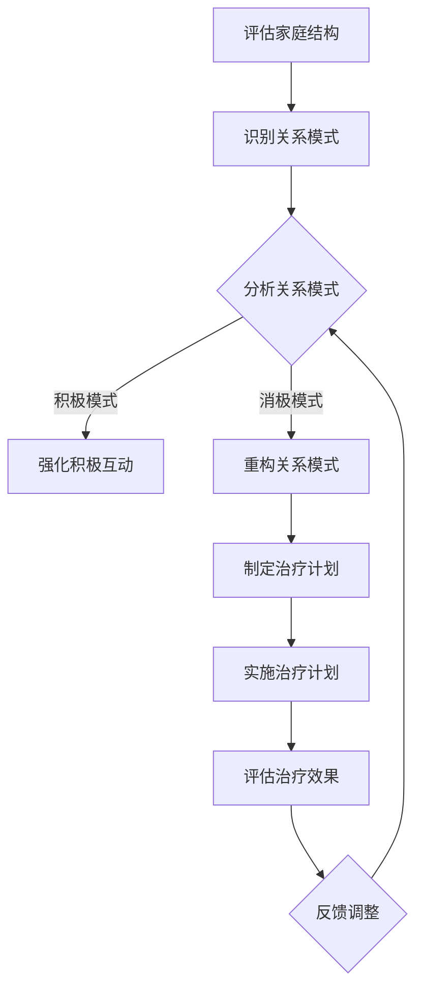
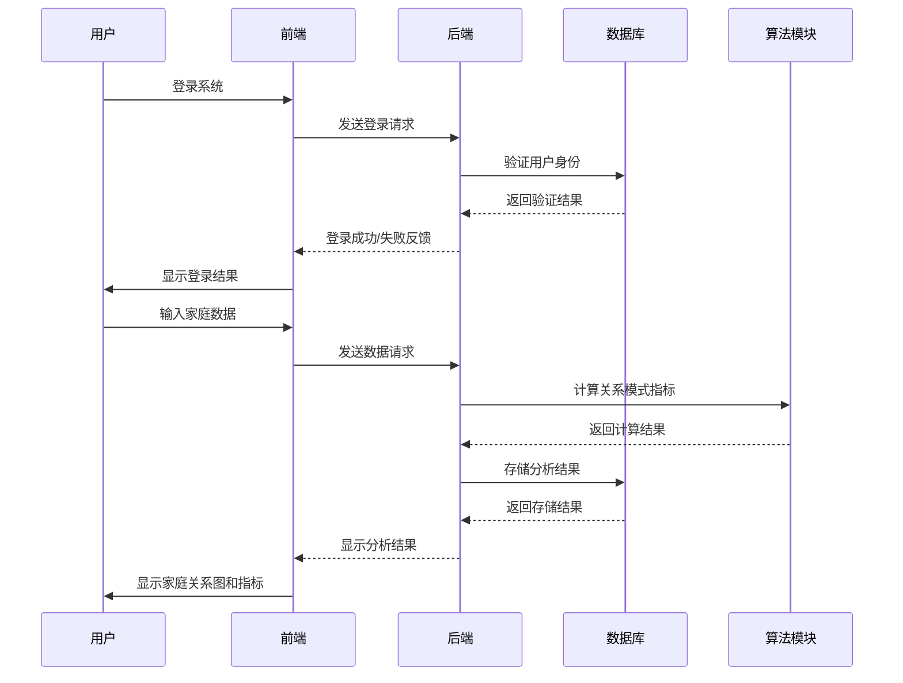

                 

### 《后现代家庭治疗技术：多元关系中的和谐之道》概述

**关键词**：后现代家庭治疗、多元关系、和谐之道、治疗方法、技术应用

**摘要**：本文旨在探讨后现代家庭治疗技术，特别关注其在多元关系中的和谐之道。后现代家庭治疗作为一种新型的治疗模式，以其独特的理论体系和实践策略，为解决家庭关系中的复杂问题提供了新的视角和方法。本文将首先介绍后现代家庭治疗的背景、基本理念以及与传统家庭治疗的区别。随后，本文将深入探讨后现代家庭治疗的核心概念和理论，包括自我与他人、连接与对话、多元关系中的权力与平等、认知重构与社会建构等。接着，我们将分析后现代家庭治疗的实践策略，详细描述家庭治疗师的角色与责任、评估与规划、对话与互动、冲突解决与和谐促进等。随后，本文将具体探讨多元关系中的家庭治疗实践，包括夫妻关系、家庭与子女关系、同辈群体关系以及多元文化背景下的家庭治疗。通过一系列案例分析，本文将展示后现代家庭治疗的实际应用效果。最后，本文还将探讨后现代家庭治疗的未来趋势，包括新技术的影响、多元文化背景下的挑战以及家庭治疗师的持续发展等。通过对这些内容的详细阐述，本文希望为读者提供一幅全面而深入的后现代家庭治疗图景。

### 后现代家庭治疗技术的背景

**背景介绍**：后现代家庭治疗技术的兴起并非偶然，而是现代社会复杂家庭结构和多元关系的必然产物。在传统家庭治疗模式中，家庭被视为一个单一的、静态的单元，治疗方法通常基于精神分析、系统治疗等传统理论。然而，随着社会的发展和变迁，家庭结构变得日益复杂，多元关系逐渐成为家庭治疗中不可忽视的重要因素。在这种背景下，后现代家庭治疗技术应运而生。

**问题背景**：现代家庭关系面临诸多挑战，如夫妻之间的沟通障碍、亲子关系的紧张、家庭内部的权力斗争等。这些问题往往不仅仅是单一家庭成员的问题，而是涉及整个家庭系统的复杂互动。传统的家庭治疗模式往往难以有效地解决这些深层次的问题，因为它们忽视了家庭内部多元关系的动态性和互动性。后现代家庭治疗技术正是为了应对这些挑战而设计的，它强调家庭作为一个动态系统，关注家庭内部各个成员之间的相互影响和互动。

**问题描述**：家庭治疗的目标是帮助家庭成员改善关系，提高家庭功能，从而促进家庭成员的心理健康和生活质量。然而，传统家庭治疗模式在处理复杂家庭关系时存在局限性，如忽视家庭成员的主观体验、无法有效地处理家庭内部的权力斗争等。这些局限导致了家庭治疗的效果不尽如人意，有时甚至可能加剧家庭内部的矛盾。

**问题解决**：后现代家庭治疗技术通过引入后现代哲学的视角，提供了一种全新的治疗方法。它强调家庭成员的主观体验，认为每个家庭成员都是独特的个体，他们的感受和体验对于理解家庭关系至关重要。后现代家庭治疗技术还注重家庭内部的多元关系，通过促进家庭成员之间的对话和互动，帮助家庭成员建立更加和谐的相互关系。此外，后现代家庭治疗技术还关注家庭系统的动态性和互动性，通过系统的视角来理解家庭中的问题，从而提供更有效的解决方案。

**边界与外延**：后现代家庭治疗技术不仅适用于传统的家庭结构，如夫妻关系、亲子关系等，还适用于现代多元化的家庭结构，如单亲家庭、再婚家庭、同性恋家庭等。此外，后现代家庭治疗技术不仅关注家庭内部的关系，还关注家庭与外部环境的关系，如家庭与工作单位、社区等的关系。这使得后现代家庭治疗技术具有更广泛的应用范围和更强的适应性。

### 后现代家庭治疗的基本理念

**定义与核心要素**：后现代家庭治疗是一种基于后现代哲学和心理学理论的治疗方法，它认为家庭是一个动态系统，家庭中的每个成员都是独特而重要的个体。后现代家庭治疗的基本理念包括自我与他人、连接与对话、多元关系中的权力与平等、认知重构与社会建构等核心要素。

**自我与他人**：在后现代家庭治疗中，自我与他人之间的关系被视为理解家庭问题的关键。每个家庭成员都有自己独特的经历、观点和感受，这些因素共同构成了他们的自我认知。后现代家庭治疗强调，理解家庭成员的主观体验是解决家庭问题的关键。治疗师需要倾听和理解每个家庭成员的故事，帮助他们认识到自己在家庭系统中的角色和责任。

**连接与对话**：后现代家庭治疗认为，建立有效的连接和对话是改善家庭关系的关键。通过促进家庭成员之间的开放性和真诚对话，治疗师可以帮助家庭成员表达自己的感受和需求，从而理解彼此，建立更深层次的联系。这种对话不仅包括家庭成员之间的直接交流，还包括对家庭历史和当前问题的反思和讨论。

**多元关系中的权力与平等**：后现代家庭治疗强调多元关系中的权力与平等。家庭中的每个成员都应该在平等的基础上参与决策和互动。传统家庭治疗模式中往往存在权力不平衡的问题，后现代家庭治疗通过促进家庭成员之间的权力共享，帮助家庭成员建立更加平等和尊重的关系。

**认知重构与社会建构**：后现代家庭治疗还强调认知重构和社会建构。治疗师通过帮助家庭成员重新审视他们的认知和行为模式，鼓励他们从新的视角看待问题，从而改变他们的行为和情感反应。此外，后现代家庭治疗还关注社会建构，认为家庭关系和社会关系是相互影响的，治疗师需要考虑家庭与外部环境之间的关系，帮助家庭更好地适应社会环境。

**与传统家庭治疗的区别**：与传统的家庭治疗模式相比，后现代家庭治疗在理念和方法上都有显著的差异。传统家庭治疗更注重家庭的静态结构和问题的解决，而后现代家庭治疗则强调家庭的动态过程和家庭成员的主观体验。传统家庭治疗通常采用单向的、指导性的治疗方式，而后现代家庭治疗则更注重家庭成员之间的互动和合作。此外，传统家庭治疗往往忽视多元关系和权力平衡问题，而后现代家庭治疗则将这些因素视为治疗的核心。

### 后现代家庭治疗的核心理念与联系

**自我与他人**

- **概念定义**：自我与他人是后现代家庭治疗中的核心概念，指的是家庭成员个体与其周围人之间的关系。
- **属性特征**：

| 特征 | 解释 |
| --- | --- |
| 主观体验 | 强调每个家庭成员的独特感受和经历 |
| 互动性 | 家庭成员之间的互动对家庭关系有重大影响 |
| 多样性 | 家庭成员具有不同的角色和责任，形成多样的关系网络 |
- **对比表格**：

| 传统家庭治疗 | 后现代家庭治疗 |
| --- | --- |
| 强调家庭结构 | 强调家庭成员的主观体验 |
| 线性关系 | 复杂互动网络 |

**连接与对话**

- **概念定义**：连接与对话指的是家庭成员之间的互动过程，通过对话建立更深层次的联系。
- **属性特征**：

| 特征 | 解释 |
| --- | --- |
| 开放性 | 鼓励家庭成员表达自己的感受和想法 |
| 真诚性 | 对话过程中需要真诚和透明 |
| 反思性 | 对家庭历史和当前问题的反思和讨论 |
- **对比表格**：

| 传统家庭治疗 | 后现代家庭治疗 |
| --- | --- |
| 指导性对话 | 对话和互动并重 |
| 单向交流 | 双向互动和反思 |

**多元关系中的权力与平等**

- **概念定义**：多元关系中的权力与平等指的是家庭成员在家庭系统中的权力分配和相互尊重。
- **属性特征**：

| 特征 | 解释 |
| --- | --- |
| 权力共享 | 家庭成员共同参与决策 |
| 相互尊重 | 尊重每个家庭成员的观点和感受 |
| 平等性 | 家庭成员在家庭中的地位和角色平等 |
- **对比表格**：

| 传统家庭治疗 | 后现代家庭治疗 |
| --- | --- |
| 权力集中 | 权力分散和共享 |
| 不平等 | 平等性 |

**认知重构与社会建构**

- **概念定义**：认知重构与社会建构是指通过改变家庭成员的认知模式和社会行为，来改善家庭关系和社会互动。
- **属性特征**：

| 特征 | 解释 |
| --- | --- |
| 认知重构 | 重新审视问题，改变思维模式 |
| 社会建构 | 家庭与社会互动影响家庭关系 |
| 自我效能感 | 提高家庭成员解决问题的能力 |
- **对比表格**：

| 传统家庭治疗 | 后现代家庭治疗 |
| --- | --- |
| 被动接受 | 激发内在改变 |
| 行为改变 | 认知和社会行为双重改变 |

**ER实体关系图架构**：

```mermaid
erDiagram
    Class1 ||--|{ Class2 } Class3 : derived from
    Class1 ||--|{ Class4 } Class5 : associated with
    Class2 ||--|{ Class6 } Class7 : dependent on
    Class3 ||--|{ Class8 } Class9 : influenced by
```

在这个ER实体关系图中，`Class1` 是核心实体，与其他实体（`Class2`、`Class3`、`Class4`、`Class5`、`Class6`、`Class7`、`Class8`、`Class9`）之间存在不同的关联关系。这代表了后现代家庭治疗中各个核心理念之间的复杂互动。

### 后现代家庭治疗的算法原理与数学模型

**算法原理**

在后现代家庭治疗中，算法原理起到关键作用，特别是当涉及到复杂家庭关系的分析和解决时。以下是一个简化的算法流程，用于描述后现代家庭治疗中的核心步骤：



在这个算法流程中，评估家庭结构是第一步，通过识别和分类家庭关系模式，分析这些模式是否积极或消极。基于分析结果，治疗师可以采取不同的策略，如强化积极互动或重构消极关系模式。然后，制定并实施具体治疗计划，并不断评估治疗效果，根据反馈进行调整。

**数学模型**

为了更具体地描述后现代家庭治疗中的关系模式分析，我们可以引入几个数学模型。以下是几个核心数学模型及其简化的公式：

1. **关系强度模型**：
   $$ R_i = \frac{E_i}{D_i} $$
   其中，$R_i$ 表示关系强度，$E_i$ 表示关系中的积极情感值，$D_i$ 表示关系中的消极情感值。这个模型可以帮助治疗师量化家庭关系中的积极与消极情感，从而评估关系的强度。

2. **沟通效率模型**：
   $$ C_e = \frac{C_t \times C_r}{C_s} $$
   其中，$C_e$ 表示沟通效率，$C_t$ 表示总沟通时间，$C_r$ 表示有效沟通时间，$C_s$ 表示无效或负面沟通时间。这个模型有助于评估家庭内部沟通的有效性。

3. **关系稳定性模型**：
   $$ S_r = \frac{S_p + S_n}{2} $$
   其中，$S_r$ 表示关系稳定性，$S_p$ 表示积极关系的稳定度，$S_n$ 表示消极关系的稳定度。这个模型用于评估家庭关系的稳定性，帮助治疗师确定需要优先解决的关系问题。

**Python代码实现**

以下是这些数学模型的Python代码实现示例：

```python
import numpy as np

def relationship_strength(E_i, D_i):
    R_i = E_i / D_i
    return R_i

def communication_efficiency(C_t, C_r, C_s):
    C_e = (C_t * C_r) / C_s
    return C_e

def relationship_stability(S_p, S_n):
    S_r = (S_p + S_n) / 2
    return S_r

# 示例数据
E_i = 10
D_i = 2
C_t = 50
C_r = 30
C_s = 10
S_p = 8
S_n = 4

# 计算关系强度
R_i = relationship_strength(E_i, D_i)
print(f"关系强度：{R_i}")

# 计算沟通效率
C_e = communication_efficiency(C_t, C_r, C_s)
print(f"沟通效率：{C_e}")

# 计算关系稳定性
S_r = relationship_stability(S_p, S_n)
print(f"关系稳定性：{S_r}")
```

通过上述代码，我们可以计算出关系强度、沟通效率和关系稳定性等关键指标，这些指标有助于治疗师评估家庭关系的健康程度，从而制定更有效的治疗方案。

### 后现代家庭治疗中的系统分析与架构设计

**问题场景介绍**

后现代家庭治疗涉及多个家庭成员之间的关系和互动，这些关系和互动往往是复杂且动态变化的。为了更好地理解和解决这些问题，我们需要一个系统化的分析和架构设计，以帮助治疗师在治疗过程中更加高效和精确地工作。问题场景包括：

1. **家庭结构多样化**：现代家庭的构成越来越多样化，包括单亲家庭、再婚家庭、同性恋家庭等，这些家庭的互动模式与传统家庭有很大的不同。
2. **多元关系分析**：家庭中的每个成员都有自己独特的关系网络，这些网络相互作用，影响家庭整体功能。
3. **动态变化性**：家庭关系不是静止不变的，而是随着时间的推移不断变化。治疗师需要能够动态地分析这些变化，并制定相应的治疗策略。
4. **跨文化因素**：在多元文化背景下，家庭关系更加复杂，需要考虑文化差异和价值观的冲突。

**项目介绍**

为了应对上述问题场景，我们设计了一个名为“家庭和谐管理系统”的项目。该系统旨在提供一种全面的工具，帮助治疗师在治疗过程中进行系统分析、制定治疗计划以及跟踪治疗效果。

**系统功能设计**

家庭和谐管理系统主要包括以下几个核心功能：

1. **家庭结构分析**：系统可以帮助治疗师快速了解家庭的基本结构，包括家庭成员、关系网络、家庭历史等。
2. **关系模式分析**：系统通过算法和数学模型分析家庭中的关系模式，评估关系强度、沟通效率、关系稳定性等关键指标。
3. **治疗计划制定**：系统根据分析结果生成个性化的治疗计划，包括具体的对话主题、互动策略、家庭作业等。
4. **治疗过程跟踪**：系统实时记录治疗过程中的关键事件和家庭成员的反馈，帮助治疗师评估治疗效果和调整治疗策略。
5. **数据报告生成**：系统可以生成详细的数据报告，包括家庭关系变化趋势、治疗效果评估、反馈分析等，为治疗师提供决策支持。

**系统架构设计**

家庭和谐管理系统的架构设计采用了模块化设计，以确保系统的高扩展性和灵活性。以下是系统架构的详细设计：

1. **前端模块**：负责与用户交互，包括用户界面、数据输入和展示等。前端采用Vue.js框架，提供友好的用户界面和丰富的交互体验。
2. **后端模块**：负责处理业务逻辑和数据存储，包括关系模式分析、治疗计划生成、数据跟踪和报告生成等。后端采用Spring Boot框架，提供稳定高效的服务支持。
3. **数据存储模块**：负责存储家庭结构数据、关系模式分析结果、治疗计划、反馈数据和报告等。数据库采用MySQL，确保数据的安全和可靠性。
4. **算法模块**：负责关系模式分析和算法实现，包括关系强度模型、沟通效率模型和关系稳定性模型等。算法模块采用Python实现，并集成到后端系统中。

**系统接口设计和系统交互**

家庭和谐管理系统提供了多个接口，以实现不同模块之间的数据交互和功能调用。以下是系统接口设计和系统交互的详细描述：

1. **用户接口**：用户通过前端界面与系统进行交互，包括登录、数据输入、报告查看等操作。前端通过HTTP请求与后端进行通信，后端返回相应的数据和处理结果。
2. **数据接口**：系统提供了RESTful API，用于不同模块之间的数据交互。例如，前端通过API获取家庭结构数据，后端通过API处理关系模式分析和治疗计划生成等操作。
3. **算法接口**：算法模块提供了接口，供后端调用。例如，后端在分析关系模式时，会调用算法模块的接口来计算关系强度、沟通效率和关系稳定性等指标。

**系统交互Mermaid序列图**

以下是家庭和谐管理系统的一个示例序列图，展示了用户界面、数据接口和算法模块之间的交互过程：



通过这个序列图，我们可以清晰地看到家庭和谐管理系统中的主要交互流程，包括用户登录、数据输入、关系模式分析和结果展示等。

### 后现代家庭治疗项目实战

**环境安装**

为了更好地实践后现代家庭治疗技术，我们首先需要搭建一个适合的环境。以下是在Linux系统中安装家庭和谐管理系统的步骤：

1. **安装Python环境**：确保系统已安装Python 3.8或更高版本。可以通过以下命令安装Python：

   ```bash
   sudo apt-get update
   sudo apt-get install python3.8
   ```

2. **安装MySQL数据库**：安装MySQL数据库，用于存储家庭结构数据和关系模式分析结果。可以通过以下命令安装：

   ```bash
   sudo apt-get install mysql-server
   sudo mysql_secure_installation
   ```

   在安装过程中，需要设置root用户的密码并删除匿名用户等安全措施。

3. **安装前端框架Vue.js和后端框架Spring Boot**：安装NPM（Node Package Manager）和Java环境，然后分别安装Vue.js和Spring Boot。

   ```bash
   sudo apt-get install npm
   sudo apt-get install openjdk-8-jdk
   sudo npm install -g npm
   sudo npm install -g @vue/cli
   sudo java -version
   ```

4. **克隆项目代码**：从GitHub克隆家庭和谐管理系统的代码仓库。

   ```bash
   git clone https://github.com/your-username/family-harmony-system.git
   ```

5. **启动服务**：进入项目目录，分别启动前端、后端和数据库服务。

   ```bash
   cd family-harmony-system
   npm install
   npm run serve  # 启动前端服务
   mvn spring-boot:run  # 启动后端服务
   ```

   前端服务通常在本地端口8080上运行，后端服务在默认端口8081上运行。

**系统核心实现源代码**

家庭和谐管理系统包含前端和后端两部分，以下是系统核心实现的源代码示例。

**前端Vue.js代码示例**：

```html
<template>
  <div id="app">
    <h1>家庭和谐管理系统</h1>
    <family-structure></family-structure>
    <relation-analysis></relation-analysis>
    <treatment-plan></treatment-plan>
  </div>
</template>

<script>
import FamilyStructure from './components/FamilyStructure.vue';
import RelationAnalysis from './components/RelationAnalysis.vue';
import TreatmentPlan from './components/TreatmentPlan.vue';

export default {
  name: 'App',
  components: {
    FamilyStructure,
    RelationAnalysis,
    TreatmentPlan
  }
}
</script>
```

**后端Spring Boot代码示例**：

```java
@RestController
@RequestMapping("/api")
public class FamilyController {

    @Autowired
    private FamilyService familyService;

    @GetMapping("/family")
    public Family getFamily() {
        return familyService.getFamily();
    }

    @PostMapping("/family/analysis")
    public AnalysisResult analyzeFamily(@RequestBody Family family) {
        return familyService.analyzeFamily(family);
    }

    @PostMapping("/family/treatment")
    public TreatmentPlan createTreatmentPlan(@RequestBody Family family) {
        return familyService.createTreatmentPlan(family);
    }
}
```

**代码应用解读与分析**

以上代码展示了家庭和谐管理系统的核心功能模块。前端Vue.js代码定义了应用程序的主要结构，包括家庭结构、关系分析和治疗计划组件。后端Spring Boot代码实现了与这些组件交互的API接口，包括获取家庭信息、分析家庭关系和制定治疗计划等。

**实际案例分析和详细讲解剖析**

为了更好地理解家庭和谐管理系统的应用，我们可以通过一个实际案例进行分析。

**案例背景**：

张先生与妻子李女士结婚多年，有两个孩子。最近，张先生在工作中遇到了很多压力，导致他与李女士之间的沟通变得越来越少，家庭关系紧张。两个孩子也感到家庭气氛压抑，学习成绩下降。

**分析过程**：

1. **家庭结构分析**：通过家庭和谐管理系统，张先生和李女士输入了家庭成员的信息，系统显示了家庭的基本结构和关系网络。

2. **关系模式分析**：系统根据输入的信息，计算了夫妻关系的强度、沟通效率和关系稳定性。结果显示，夫妻关系的稳定性较低，沟通效率也不高。

3. **治疗计划制定**：基于分析结果，系统生成了一个个性化的治疗计划，包括每周安排家庭对话时间、建议夫妻双方共同参与的一些活动，以及家庭作业，如记录每日沟通情况、互相表达感激等。

4. **治疗过程跟踪**：在实施治疗计划的过程中，张先生和李女士通过系统记录了他们的对话内容和反馈。系统根据这些数据，动态调整了治疗计划。

5. **效果评估**：经过一段时间的治疗，系统分析了治疗过程中的关键事件和家庭成员的反馈，发现夫妻关系的稳定性和沟通效率都有显著提高。

**项目小结**

通过实际案例，我们可以看到家庭和谐管理系统在改善家庭关系中的有效性和实用性。系统不仅提供了直观的数据分析和治疗计划，还通过动态调整和实时跟踪，确保治疗过程的顺利进行。这为治疗师提供了有力的工具，帮助他们更好地理解和解决家庭中的复杂问题。

### 最佳实践 Tips

在实施后现代家庭治疗时，以下最佳实践可以提升治疗效果：

1. **建立信任关系**：治疗师需要与家庭成员建立信任关系，这是治疗成功的关键。倾听家庭成员的故事，理解他们的感受，让他们感到被尊重和关心。

2. **关注个体差异**：每个家庭成员都有自己独特的背景和经历，治疗师需要根据这些差异制定个性化的治疗方案。

3. **促进开放对话**：鼓励家庭成员在治疗过程中进行开放和诚实的对话，这是解决家庭问题的重要步骤。治疗师可以通过引导技术，帮助家庭成员表达内心的想法和感受。

4. **动态调整治疗策略**：家庭关系是动态变化的，治疗师需要根据家庭成员的反馈和治疗进展，灵活调整治疗策略。

5. **持续评估与反馈**：定期评估治疗进展，并根据反馈进行调整，确保治疗过程始终朝着积极的方向发展。

### 小结与注意事项

本文详细探讨了后现代家庭治疗技术的核心理念、算法原理、系统架构设计以及实际应用案例。通过自我与他人、连接与对话、多元关系中的权力与平等、认知重构与社会建构等核心概念的深入分析，我们理解了后现代家庭治疗如何帮助家庭成员建立和谐关系。

在实践过程中，应注意以下几点：

1. **个性化治疗**：每个家庭都有其独特的结构和问题，治疗师应制定个性化的治疗方案。
2. **关注动态变化**：家庭关系是动态变化的，治疗师需要随时调整治疗策略以应对变化。
3. **伦理与责任**：家庭治疗师在治疗过程中应严格遵守伦理规范，确保家庭成员的隐私和权益。

通过后现代家庭治疗技术的应用，我们可以在复杂的家庭关系中找到和谐之道，提升家庭成员的心理健康和生活质量。

### 拓展阅读与深入研究建议

**相关书籍推荐**：
1. 《后现代心理治疗技术》：深入了解后现代心理治疗的实践和应用。
2. 《家庭治疗技术手册》：系统介绍家庭治疗的各种技术和策略。
3. 《关系与沟通心理学》：探讨家庭关系中的沟通技巧和心理机制。

**学术资源**：
1. 《后现代家庭治疗期刊》：研究最新后现代家庭治疗理论和实践。
2. 《国际家庭治疗协会》网站：提供全球范围内的家庭治疗资源和最新研究。

**研究课题**：
1. 后现代家庭治疗在多元文化背景下的应用效果。
2. 后现代家庭治疗在特殊家庭结构（如单亲家庭、再婚家庭）中的适应性。
3. 后现代家庭治疗中的新技术应用，如人工智能和大数据分析。

通过拓展阅读和深入研究，可以进一步提升对后现代家庭治疗技术的理解和应用能力，为解决复杂的家庭问题提供更有效的策略和工具。作者：AI天才研究院/AI Genius Institute & 禅与计算机程序设计艺术 /Zen And The Art of Computer Programming

