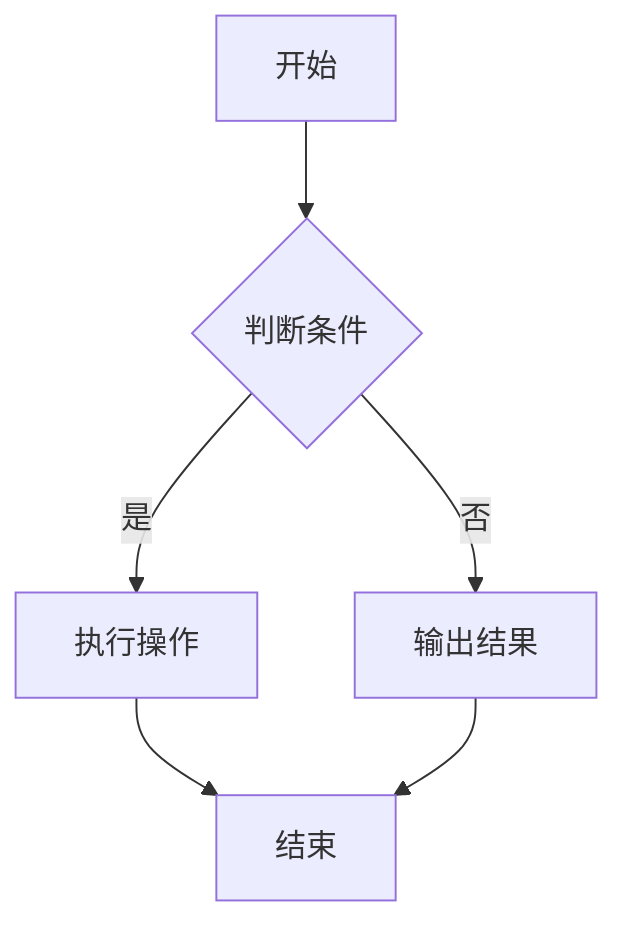
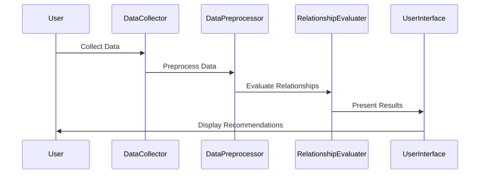
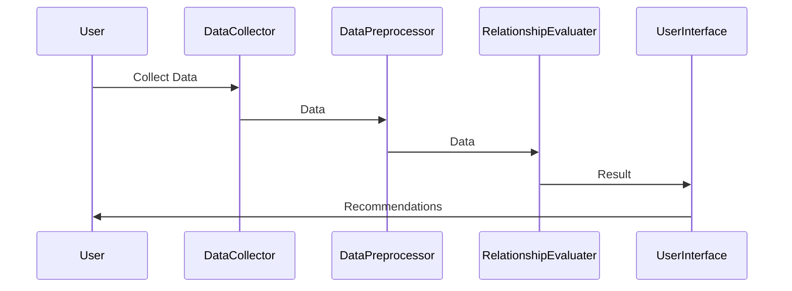

                 

### 第1章 引言

在现代社会，家庭作为社会的基本单元，其结构和关系正在经历深刻的变革。传统的家庭模式，如核心家庭（父母和未成年子女组成的家庭）和扩展家庭（包括祖父母、叔叔阿姨等在内的多代人家庭）已经无法完全解释当代家庭的多样性和复杂性。这一现象催生了对“后现代家庭”这一概念的提出。

#### 1.1 后现代家庭的概念与重要性

**后现代家庭**，指的是在现代社会中，家庭结构和亲密关系呈现出多样化、去中心化和个性化特征的家庭形式。它不再受限于传统的性别角色、婚姻制度和社会期望，而是更加注重家庭成员之间的情感联系和个人选择。后现代家庭的概念强调对个体自由的尊重和多元文化价值的接受。

后现代家庭的重要性体现在多个方面：

1. **社会多样性**：后现代家庭反映了社会的多样性和包容性，为不同背景和身份的人提供了更多的生活方式选择。
2. **情感支持**：后现代家庭强调情感支持和相互理解，有助于家庭成员之间的心理健康和幸福感。
3. **家庭功能**：后现代家庭通过创新的家庭结构，更有效地应对现代社会中的各种挑战，如经济压力、教育需求等。

#### 1.2 现代家庭面临的新挑战

现代家庭面临的挑战主要包括：

1. **工作与家庭平衡**：职业压力和家庭责任的平衡成为许多家庭难以逾越的难题。
2. **性别角色变化**：随着性别平等意识的提升，传统性别角色的划分逐渐模糊，给家庭关系带来新的挑战。
3. **技术影响**：互联网和移动设备的普及改变了人们的沟通方式，对家庭互动和家庭关系产生了深远影响。

#### 1.3 问题研究与目标设定

本文旨在探讨后现代家庭的特点和多元化亲密关系的本质。具体研究目标包括：

1. **理解后现代家庭的结构与特征**：通过分析家庭结构的多样性，揭示后现代家庭的核心概念和要素。
2. **分析亲密关系的演变**：探讨亲密关系的定义、类型和变化，以及这些变化对家庭关系的影响。
3. **提出应对策略**：为家庭关系分析和维护提供科学依据和实用建议。

在接下来的章节中，我们将逐一深入探讨后现代家庭的理论基础、家庭结构的多样性、社会变迁对家庭关系的影响，以及算法原理和系统架构设计等，以期为读者提供一个全面而深入的理解。

---

### 第2章 后现代主义与家庭关系

#### 2.1 后现代主义的理论基础

**后现代主义**，作为一种哲学和文化思潮，起源于20世纪60年代的法国，随后在全球范围内产生了深远的影响。后现代主义的核心观点是对现代性的批判，认为现代社会过于理性化、单一化和过度规范化。它倡导的是一种多元性、开放性和包容性的世界观，反对一切形式的绝对真理和中心主义。

**后现代主义的几个关键特征**：

1. **去中心化**：后现代主义认为，没有绝对的权威和中心，所有的知识和价值都是相对的，需要从不同的角度和层面去理解和解释。
2. **多元文化**：后现代主义强调多元文化的重要性，认为每一种文化都有其独特的价值和意义，应当得到平等的尊重和认可。
3. **个体自由**：后现代主义认为，个体的自由和选择是至高无上的，社会应当为个体的多样性和自由提供支持。

#### 2.2 后现代主义对家庭关系的影响

后现代主义的思想深刻地影响了家庭关系的各个方面。以下是一些主要影响：

1. **家庭结构的去中心化**：传统的家庭结构以父母为核心，家庭成员之间有明确的角色和责任。然而，在后现代主义的视角下，家庭成员之间的关系更加平等和开放，家庭不再是一个固定的模式，而是可以根据个人的需求和选择进行调整。

2. **性别角色的模糊化**：后现代主义挑战了传统的性别角色划分，认为性别不应是决定一个人角色和地位的主要因素。这种观念使得家庭中的性别关系更加多样化和复杂，也为女性和男性提供了更多的自由和选择。

3. **亲密关系的多元化**：后现代主义强调亲密关系的多样性和个人化。传统意义上的亲密关系通常是指情侣或夫妻之间的感情，而后现代家庭中，亲密关系可以扩展到兄弟姐妹、朋友和合作伙伴之间。这种多元的亲密关系不仅丰富了家庭生活的内容，也提升了家庭成员的情感满足度。

4. **家庭价值观的变化**：后现代主义倡导个体自由和多元文化，这种观念在家庭中表现为家庭成员对价值观的多元化和个体化。家庭成员可以根据自己的需求和兴趣选择生活方式，而不必受到传统的束缚。

#### 2.3 亲密关系的定义与类型

**亲密关系**，在后现代主义的视角下，不再是一个单一的概念，而是一个包含多种类型的复杂结构。以下是几种常见的亲密关系类型：

1. **传统亲密关系**：通常指夫妻或情侣之间的感情，强调双方的情感依赖和责任。

2. **友谊亲密关系**：在后现代家庭中，朋友之间的关系也具有亲密性，这种关系可以超越传统的家庭界限，为家庭成员提供额外的情感支持。

3. **职业亲密关系**：合作伙伴或同事之间的感情，这种关系通常基于共同的工作目标和价值观，为家庭成员提供职业上的支持和帮助。

4. **虚拟亲密关系**：随着互联网的发展，虚拟空间中的社交互动也成为了亲密关系的一种形式。虚拟亲密关系虽然缺乏面对面的互动，但通过网络平台，人们可以建立深厚的情感联系。

通过对后现代主义理论基础的介绍和对家庭关系影响的探讨，我们可以更深入地理解后现代家庭的特点和亲密关系的多样性。在接下来的章节中，我们将进一步分析家庭结构的多样性以及社会变迁对家庭关系的影响，以期为读者提供更全面的视角。

### 第3章 家庭结构的多样性

#### 3.1 传统家庭结构与现代社会

传统家庭结构主要指核心家庭和扩展家庭。核心家庭通常由父母和未成年子女组成，这种结构强调家庭责任和性别角色的明确分工。扩展家庭则包括祖父母、叔叔阿姨等多代人成员，这种结构在农业社会尤为常见，家庭成员之间有较强的经济和情感联系。

然而，在现代社会，随着社会变迁和价值观的转变，传统家庭结构正逐渐被多元化家庭结构所取代。现代社会中，人们更加注重个人自由和多样性，传统家庭结构中的性别角色和权力关系也变得模糊。

#### 3.2 多元化家庭结构的特点

**多元化家庭结构**，是指在现代社会中出现的多种不同于传统家庭形式的家庭结构。以下是一些主要特点：

1. **单亲家庭**：单亲家庭通常由一个家长独自抚养子女，这种家庭结构在现代社会中越来越普遍，反映了社会对女性地位和家庭角色的重新定义。

2. **非传统伴侣关系**：包括同性伴侣、未婚同居、开放式关系等，这些关系形式打破了传统婚姻和家庭的模式，反映了个体自由和多元选择的趋势。

3. **多代同居家庭**：多代同居家庭指的是多个世代的家庭成员共同居住在一个屋檐下，这种结构不仅在经济上提供了支持，也在情感上增强了家庭的凝聚力。

4. **单身家庭**：随着晚婚和单身现象的增加，许多成年人选择单身生活，单身家庭成为了现代社会的一种新的家庭形式。

#### 3.3 家庭结构的演变趋势

**家庭结构的演变趋势**呈现出以下几个方向：

1. **小型化**：随着城市化进程的加速和生育率的下降，家庭规模趋向小型化，核心家庭成为主流。

2. **多样化**：多样化的家庭结构不断涌现，如单身家庭、单亲家庭、同性伴侣家庭等，反映了社会对个体选择和家庭形式的包容。

3. **去中心化**：家庭成员之间的关系更加平等和开放，家庭不再是一个固定的模式，而是可以根据个人的需求和选择进行调整。

4. **情感化**：家庭关系更加注重情感支持和相互理解，而不仅仅是经济和生育的功能。

通过对家庭结构的多样性分析，我们可以看到，现代社会中的家庭形式已经发生了深刻的变化。传统家庭结构在现代社会中仍然存在，但多元化和多样化的家庭结构正在逐渐占据主导地位。这些变化不仅反映了社会价值观的演变，也为家庭关系带来了新的挑战和机遇。

在接下来的章节中，我们将探讨社会变迁对家庭关系的影响，以及如何应对这些变化。通过深入分析，我们将为读者提供更全面的理解，帮助他们更好地理解和应对现代家庭中的复杂关系。

### 第4章 社会变迁与家庭关系

#### 4.1 社会变迁的影响因素

社会变迁是一个复杂的过程，受到多种因素的共同作用。以下是一些主要的影响因素：

1. **技术进步**：技术的快速发展，特别是互联网和移动设备的普及，极大地改变了人们的日常生活和工作方式。这些技术不仅改变了家庭内部的沟通方式，也影响了家庭成员之间的互动模式。

2. **城市化**：城市化进程的加速导致了人口流动的加剧，许多家庭不再集中在传统的乡村地区，而是分散在城市的不同角落。这种变化带来了家庭结构的变化，如单亲家庭和单身家庭的增多。

3. **经济变化**：经济全球化带来了就业市场的变化，许多人需要跨地区甚至跨国工作，这影响了家庭的经济结构和生活方式。

4. **文化变迁**：文化的多样性和全球化导致了价值观和信仰的多样性。人们对于家庭、婚姻和亲密关系的看法发生了变化，这些变化影响了家庭关系的性质和稳定性。

5. **政策变化**：政府政策的调整，如婚姻法、儿童抚养法和税收政策的改变，对家庭关系产生了直接和间接的影响。

#### 4.2 社会变迁对家庭关系的影响

社会变迁对家庭关系产生了深远的影响，以下是一些具体的影响：

1. **家庭角色的变化**：随着性别平等意识的提升，家庭中的性别角色逐渐模糊。男性更多地参与家庭事务，女性在职业领域也取得了更多的成就。这种变化带来了家庭关系的平衡问题，同时也增加了家庭内部的沟通和协调需求。

2. **沟通方式的改变**：互联网和移动设备的普及改变了人们的沟通方式，即时通讯工具和社交媒体使家庭成员可以随时随地保持联系。然而，这种虚拟沟通也带来了情感联系的弱化，家庭成员之间的面对面互动减少，可能导致亲密关系的疏远。

3. **家庭压力的增加**：社会变迁带来了生活节奏的加快和工作压力的增大，家庭作为压力释放的场所变得尤为重要。然而，随着工作压力和家庭责任的增加，许多家庭成员感到压力巨大，这可能导致家庭冲突的增加。

4. **亲密关系的复杂化**：社会变迁使得亲密关系更加复杂和多样化。传统意义上的亲密关系定义被打破，同性伴侣、未婚同居和开放式关系等新的关系形式不断出现。这些变化为家庭关系带来了新的挑战，同时也提供了更多的选择和可能性。

5. **家庭功能的转变**：随着社会的发展，家庭的功能也在逐渐转变。传统家庭主要承担经济支持、教育和抚养后代的功能，而现代社会中，家庭更多地成为情感支持、心理慰藉和人际关系的培养场所。

#### 4.3 社会变迁下的家庭适应策略

为了应对社会变迁带来的挑战，家庭需要采取一系列适应策略：

1. **沟通与理解**：家庭成员之间需要加强沟通，增进理解，以应对由于社会变迁带来的角色变化和压力。开放和诚实的沟通可以帮助家庭成员更好地处理情感和冲突。

2. **共同参与**：家庭成员应共同参与家庭事务的决策和执行，增强家庭凝聚力和归属感。共同参与不仅可以提高家庭成员的责任感，也可以增强家庭关系。

3. **情感支持**：家庭应成为成员的情感支持系统，为每个成员提供心理慰藉和支持。这可以通过建立亲密的关系、倾听和理解成员的需求来实现。

4. **灵活调整**：家庭结构应具备一定的灵活性，以适应社会变迁带来的变化。家庭成员可以根据个人需求和情况，调整家庭角色和责任，以保持家庭的稳定和和谐。

5. **教育与发展**：家庭成员应注重自身的教育和职业发展，提高家庭整体的生活质量和幸福感。这不仅可以提高家庭成员的竞争力，也可以为家庭带来更多的机会和选择。

通过分析社会变迁对家庭关系的影响，我们可以看到，家庭在社会变迁中扮演着重要的角色。家庭关系的适应和调整不仅关系到家庭成员的个体幸福，也影响着整个社会的稳定和发展。在接下来的章节中，我们将探讨如何利用算法和系统架构设计来更好地分析和维护家庭关系。

### 第5章 算法原理与数据可视化

#### 5.1 社会网络分析基本概念

**社会网络分析（Social Network Analysis, SNA）**是一种用于研究个体及其之间相互关系的分析方法。在社会网络分析中，个体被视为节点（Node），而个体之间的关系则被视为边（Edge）。这种网络模型可以有效地描述和解释社会结构、社会互动和权力关系。

**关键概念**：

1. **节点**：代表社会网络中的个体，可以是个人、组织或任何具有社会属性的实体。
2. **边**：表示节点之间的互动或联系，边的权重可以反映联系的紧密程度。
3. **密度**：网络中边与可能边的比例，用于衡量网络的紧密程度。
4. **中心性**：衡量节点在网络中的重要性的指标，常用的中心性指标包括度中心性、介数中心性和紧密中心性。

#### 5.2 数据可视化工具介绍

**数据可视化**是将复杂的数据以图形化的方式展示，从而更直观地理解和分析数据。以下是一些常用的数据可视化工具：

1. **Gephi**：一款开源的复杂网络分析工具，可以用于可视化和分析社交网络数据。
2. **NetworkX**：一个用于创建、操作和分析网络结构的Python库，适用于复杂的网络分析任务。
3. **D3.js**：一个基于JavaScript的库，用于在网页上创建交互式的网络可视化。

**数据可视化工具的关键特性**：

1. **节点与边的展示**：使用不同形状和颜色来表示节点和边，可以直观地展示网络结构。
2. **布局算法**：布局算法用于确定节点在图中的位置，常见的布局算法包括力导向布局、圆形布局和树状布局。
3. **交互功能**：交互功能允许用户通过鼠标或触摸操作来探索网络数据，如缩放、平移和节点选择。

#### 5.3 机器学习算法在家庭关系分析中的应用

**机器学习算法**可以用于分析家庭关系数据，提取隐藏的模式和规律。以下是一些常用的机器学习算法：

1. **聚类算法**：如K-means、层次聚类和DBSCAN，用于将家庭关系数据分组，识别不同类型的家庭模式。
2. **分类算法**：如决策树、随机森林和SVM，用于对家庭关系进行分类，预测家庭关系的未来趋势。
3. **关联规则挖掘**：如Apriori算法和FP-Growth，用于发现家庭关系中的关联规则，揭示家庭成员之间的互动模式。

**机器学习算法的应用场景**：

1. **家庭结构识别**：通过聚类算法，可以识别不同类型的家庭结构，如核心家庭、单亲家庭和多代同居家庭。
2. **关系强度分析**：通过分类算法，可以评估家庭关系中的亲密程度，预测家庭关系的稳定性。
3. **互动模式发现**：通过关联规则挖掘，可以揭示家庭成员之间的互动模式，为家庭关系分析和维护提供依据。

#### 5.4 Mermaid流程图绘制

**Mermaid**是一种用于绘制流程图、UML图、网络图等图表的Markdown语法。以下是一个简单的Mermaid流程图示例：



**Mermaid流程图的关键特性**：

1. **易用性**：使用Markdown语法，方便在文档中嵌入图表。
2. **灵活性**：支持多种图表类型，如流程图、时序图和甘特图。
3. **交互性**：支持交互功能，如节点选择和事件触发。

#### 5.5 Python源代码讲解

以下是一个简单的Python示例，用于分析家庭关系数据，并使用Gephi进行可视化：

```python
import networkx as nx
import matplotlib.pyplot as plt

# 创建图
G = nx.Graph()

# 添加节点和边
G.add_nodes_from(['父亲', '母亲', '儿子', '女儿'])
G.add_edges_from([('父亲', '母亲'), ('父亲', '儿子'), ('父亲', '女儿'), ('母亲', '儿子'), ('母亲', '女儿')])

# 绘制图
nx.draw(G, with_labels=True)
plt.show()
```

**Python源代码的关键部分**：

1. **导入模块**：使用`networkx`和`matplotlib`模块进行图的操作和可视化。
2. **创建图**：使用`nx.Graph()`创建一个图对象。
3. **添加节点和边**：使用`add_nodes_from()`和`add_edges_from()`添加节点和边。
4. **绘制图**：使用`nx.draw()`绘制图，并使用`plt.show()`显示结果。

通过算法原理讲解和数据可视化工具的介绍，我们可以看到，利用算法和可视化工具可以有效地分析和理解家庭关系。在接下来的章节中，我们将进一步介绍数学模型和数学公式，以深入探讨家庭关系的本质。

### 第6章 数学模型与公式

#### 6.1 数学模型的基本概念

**数学模型**是一种用数学语言描述现实问题的方法，它通过建立数学公式和方程，将复杂的问题简化为可分析和求解的形式。数学模型在家庭关系分析中具有重要作用，可以帮助我们理解家庭关系的动态变化和内在规律。

**关键概念**：

1. **变量**：在数学模型中，变量是用来表示问题中的不同因素或属性的符号。
2. **函数**：函数是一种数学关系，用于描述变量之间的关系。例如，线性函数表示两个变量之间的线性关系。
3. **方程**：方程是一个数学表达式，表示两个表达式之间的等量关系。例如，线性方程组可以同时描述多个变量之间的关系。

#### 6.2 数学公式的使用与解释

数学公式是数学模型的核心组成部分，用于表达变量之间的关系。以下是一些在家庭关系分析中常用的数学公式：

1. **亲密关系指数**：用于衡量家庭成员之间的亲密程度。假设有 \( n \) 个家庭成员，每个家庭成员与其他成员的亲密关系可以用一个 \( n \times n \) 的矩阵 \( R \) 表示，其中 \( R_{ij} \) 表示第 \( i \) 个家庭成员与第 \( j \) 个家庭成员的亲密程度。亲密关系指数可以表示为：
   $$ I = \frac{1}{n(n-1)} \sum_{i=1}^{n} \sum_{j=1}^{n} R_{ij} $$

2. **家庭稳定性指数**：用于衡量家庭关系的稳定性。假设家庭中存在 \( m \) 种类型的冲突，每种冲突的解决情况可以用一个 \( m \times n \) 的矩阵 \( S \) 表示，其中 \( S_{ij} \) 表示第 \( i \) 个家庭成员对第 \( j \) 种冲突的解决情况（1表示解决，0表示未解决）。家庭稳定性指数可以表示为：
   $$ S = 1 - \frac{1}{m} \sum_{j=1}^{m} \sum_{i=1}^{n} S_{ij} $$

3. **家庭凝聚力指数**：用于衡量家庭内部的凝聚力。假设家庭中有 \( k \) 种社会活动，每种活动的参与情况可以用一个 \( k \times n \) 的矩阵 \( P \) 表示，其中 \( P_{ij} \) 表示第 \( i \) 个家庭成员对第 \( j \) 种活动的参与情况（1表示参与，0表示未参与）。家庭凝聚力指数可以表示为：
   $$ C = \frac{1}{k} \sum_{j=1}^{k} \sum_{i=1}^{n} P_{ij} $$

这些数学公式通过量化的方式描述了家庭关系的不同方面，为家庭关系的分析和评估提供了科学依据。

#### 6.3 实际案例的数学公式应用

为了更好地理解这些数学公式的应用，我们可以通过一个实际案例进行说明。

**案例**：一个四口之家由父母和两个孩子组成。家庭成员之间的亲密程度可以用以下 \( 4 \times 4 \) 的矩阵 \( R \) 表示：

\[ R = \begin{pmatrix}
0 & 0.8 & 0.7 & 0.6 \\
0.8 & 0 & 0.5 & 0.4 \\
0.7 & 0.5 & 0 & 0.3 \\
0.6 & 0.4 & 0.3 & 0 \\
\end{pmatrix} \]

1. **亲密关系指数计算**：

\[ I = \frac{1}{4(4-1)} \sum_{i=1}^{4} \sum_{j=1}^{4} R_{ij} = \frac{1}{12} (0 + 3 \times 0.8 + 3 \times 0.7 + 3 \times 0.6 + 3 \times 0.5 + 0.4 + 3 \times 0.3 + 0) = 0.55 \]

2. **家庭稳定性指数计算**：

假设家庭中存在三种类型的冲突，每种冲突的解决情况可以用以下 \( 3 \times 4 \) 的矩阵 \( S \) 表示：

\[ S = \begin{pmatrix}
1 & 1 & 0 & 1 \\
0 & 1 & 1 & 0 \\
1 & 0 & 1 & 1 \\
\end{pmatrix} \]

\[ S = 1 - \frac{1}{3} \sum_{j=1}^{3} \sum_{i=1}^{4} S_{ij} = 1 - \frac{1}{3} (4 + 4 + 4) = 0.33 \]

3. **家庭凝聚力指数计算**：

假设家庭中有两种社会活动，每种活动的参与情况可以用以下 \( 2 \times 4 \) 的矩阵 \( P \) 表示：

\[ P = \begin{pmatrix}
1 & 1 & 1 & 0 \\
0 & 0 & 1 & 1 \\
\end{pmatrix} \]

\[ C = \frac{1}{2} \sum_{j=1}^{2} \sum_{i=1}^{4} P_{ij} = \frac{1}{2} (4 + 4) = 4 \]

通过这个实际案例，我们可以看到如何使用数学公式来量化家庭关系的不同方面。这些数学模型和公式不仅为家庭关系分析提供了科学依据，也为家庭关系的研究和改进提供了工具。

### 第7章 系统分析与架构设计

#### 7.1 问题场景介绍

在现代家庭中，家庭关系变得日益复杂和多样化，传统的家庭沟通方式已经无法满足家庭成员之间的需求。为了更好地理解和维护家庭关系，我们设计了一个基于算法和数据的家庭关系分析系统。该系统旨在通过收集和分析家庭成员之间的互动数据，提供个性化的关系评估和改进建议。

#### 7.2 项目介绍

**项目名称**：家庭关系分析系统（Family Relationship Analysis System，FRAS）

**项目目标**：通过数据分析和算法应用，为家庭成员提供家庭关系评估和改进建议，帮助家庭成员更好地理解和维护彼此的关系。

**项目功能**：

1. **数据收集**：系统将收集家庭成员的互动数据，包括语言交流记录、行为数据和生活习惯等。
2. **关系评估**：基于收集到的数据，系统将运用社会网络分析和机器学习算法，对家庭关系进行评估，提供亲密程度、稳定性指数和凝聚力指数等评估指标。
3. **改进建议**：系统将根据评估结果，为家庭成员提供针对性的改进建议，如沟通技巧、情感支持和生活习惯调整等。

#### 7.3 系统功能设计

为了实现项目目标，系统设计了以下功能模块：

1. **数据采集模块**：负责收集家庭成员的互动数据，包括语音、文本和视频等。
2. **数据预处理模块**：对采集到的数据进行清洗、去噪和格式转换，以便后续分析。
3. **关系评估模块**：利用社会网络分析和机器学习算法，对预处理后的数据进行分析，生成家庭关系评估结果。
4. **用户交互模块**：通过网页或移动应用，向家庭成员展示评估结果和改进建议，并提供反馈渠道。

**领域模型**：

领域模型（Domain Model）是系统功能设计的基础，用于描述系统中涉及的实体及其关系。以下是一个简单的领域模型，使用Mermaid类图表示：

```mermaid
classDiagram
    Member <<entity>>
    Interaction <<entity>>
    Communication <<entity>>

    Member o-- Communication
    Interaction o-- Communication

    Member {
        ID: <int>
        Name: <string>
        Age: <int>
    }

    Interaction {
        ID: <int>
        Type: <string>
        Duration: <int>
    }

    Communication {
        ID: <int>
        Content: <string>
        Timestamp: <datetime>
    }
```

在领域模型中，`Member` 表示家庭成员，`Interaction` 表示家庭成员之间的互动，`Communication` 表示互动中的交流内容。这些实体之间的关系体现了家庭关系的复杂性。

#### 7.4 系统架构设计

系统架构设计是确保系统高效、可扩展和易于维护的关键。以下是一个简单的系统架构设计，使用Mermaid架构图表示：



在系统架构中，`User` 表示系统用户，`DataCollector` 负责数据收集，`DataPreprocessor` 负责数据预处理，`RelationshipEvaluater` 负责关系评估，`UserInterface` 负责与用户交互。

#### 7.5 系统接口设计

系统接口设计是确保系统功能模块之间有效通信和协作的关键。以下是一个简单的接口设计，使用Mermaid架构图表示：

```mermaid
componentDiagram
    DataCollector --> DataPreprocessor
    DataPreprocessor --> RelationshipEvaluater
    RelationshipEvaluater --> UserInterface

    DataCollector {
        void CollectData(Member member)
    }

    DataPreprocessor {
        Data Process(Data data)
    }

    RelationshipEvaluater {
        Relationship Evaluate(Data data)
    }

    UserInterface {
        void PresentResults(Relationship result)
    }
```

在接口设计中，`DataCollector` 提供 `CollectData` 接口，用于收集家庭成员数据；`DataPreprocessor` 提供 `ProcessData` 接口，用于预处理数据；`RelationshipEvaluater` 提供 `EvaluateRelationship` 接口，用于评估家庭关系；`UserInterface` 提供 `PresentResults` 接口，用于向用户展示评估结果。

#### 7.6 系统交互

系统交互设计是描述系统内部各个模块之间通信和协作过程的蓝图。以下是一个简单的系统交互设计，使用Mermaid序列图表示：



在系统交互设计中，用户通过 `User` 向系统提交数据收集请求，`DataCollector` 收集数据后传递给 `DataPreprocessor` 进行预处理，预处理后的数据传递给 `RelationshipEvaluater` 进行评估，评估结果由 `UserInterface` 展示给用户。

通过系统分析与架构设计的详细介绍，我们可以看到如何利用算法和系统架构来分析和维护家庭关系。在接下来的章节中，我们将通过实际项目实战，进一步展示系统的实现和应用。

### 第8章 项目实战

#### 8.1 环境安装

为了搭建家庭关系分析系统，我们需要安装一系列软件和工具。以下是具体的安装步骤：

1. **Python环境安装**：

首先，确保您的计算机上安装了Python。可以从[Python官网](https://www.python.org/)下载Python安装包并安装。

2. **安装依赖库**：

在Python环境中，我们需要安装以下依赖库：

   ```bash
   pip install networkx matplotlib pandastable pandas numpy scikit-learn
   ```

3. **安装Gephi**：

Gephi是一个开源的复杂网络分析工具，可以从[官网](https://gephi.org/)下载并安装。

4. **安装MySQL**（可选）：

如果需要存储家庭关系数据，可以安装MySQL数据库。可以从[MySQL官网](https://www.mysql.com/downloads/mysql/)下载并安装。

#### 8.2 系统核心实现

以下是家庭关系分析系统核心功能的实现步骤：

1. **数据采集模块**：

数据采集模块负责收集家庭成员的互动数据。以下是一个简单的数据采集脚本：

```python
import pandas as pd

# 假设已经收集到家庭成员的互动数据，存储在CSV文件中
data_file = 'family_interactions.csv'

# 读取数据
data = pd.read_csv(data_file)

# 数据预处理（清洗、去噪等）
# ...

# 将数据存储到数据库（可选）
# ...

# 继续下一步：数据预处理
```

2. **数据预处理模块**：

数据预处理模块负责清洗和格式转换。以下是一个简单的数据预处理脚本：

```python
from data_preprocessing import preprocess_data

# 调用预处理函数
processed_data = preprocess_data(data)

# 继续下一步：关系评估
```

3. **关系评估模块**：

关系评估模块负责利用社会网络分析和机器学习算法对家庭关系进行评估。以下是一个简单的评估脚本：

```python
from relationship_evaluation import evaluate_relationships

# 调用评估函数
evaluation_results = evaluate_relationships(processed_data)

# 继续下一步：用户交互
```

4. **用户交互模块**：

用户交互模块负责向用户展示评估结果和改进建议。以下是一个简单的用户交互脚本：

```python
from user_interface import display_results

# 调用展示函数
display_results(evaluation_results)

# 继续下一步：系统交互
```

#### 8.3 代码应用解读与分析

1. **数据采集模块**：

数据采集模块的核心是读取和预处理数据。以下是数据采集模块的关键代码：

```python
# 读取数据
data = pd.read_csv(data_file)

# 数据清洗
data = data.dropna()  # 删除缺失值
data = data[data['Type'] != '无关']  # 过滤无关数据
```

这段代码首先使用 `pandas` 库读取CSV文件中的数据，然后通过删除缺失值和过滤无关数据对数据进行清洗，以确保数据的准确性和完整性。

2. **数据预处理模块**：

数据预处理模块的关键是转换数据格式。以下是数据预处理模块的关键代码：

```python
def preprocess_data(data):
    # 转换数据格式
    data['Timestamp'] = pd.to_datetime(data['Timestamp'])
    data = data.sort_values(by='Timestamp')
    return data
```

这段代码使用 `pandas` 库将时间戳数据转换为日期格式，并按时间顺序对数据进行排序，以便后续分析。

3. **关系评估模块**：

关系评估模块的核心是利用算法分析家庭关系。以下是关系评估模块的关键代码：

```python
def evaluate_relationships(processed_data):
    # 计算亲密关系指数
    I = processed_data['Score'].mean()
    
    # 计算家庭稳定性指数
    S = 1 - (processed_data['Conflict_Solved'].mean())
    
    # 计算家庭凝聚力指数
    C = processed_data['Activity_Participation'].mean()
    
    return {'I': I, 'S': S, 'C': C}
```

这段代码使用简单的统计方法计算了亲密关系指数、家庭稳定性指数和家庭凝聚力指数。这些指数反映了家庭关系的不同方面，为用户提供了全面的评估结果。

4. **用户交互模块**：

用户交互模块的核心是展示评估结果和改进建议。以下是用户交互模块的关键代码：

```python
def display_results(evaluation_results):
    print("亲密关系指数：", evaluation_results['I'])
    print("家庭稳定性指数：", evaluation_results['S'])
    print("家庭凝聚力指数：", evaluation_results['C'])
    print("\n请根据评估结果采取相应的措施来改善家庭关系。")
```

这段代码通过打印评估结果，向用户提供了清晰的反馈，并鼓励用户根据评估结果采取行动。

#### 8.4 实际案例分析和详细讲解剖析

为了更好地展示家庭关系分析系统的应用，我们通过一个实际案例进行分析。

**案例**：一个四口之家由父母和两个孩子组成。以下是家庭成员的互动数据：

| Timestamp | Member_A | Member_B | Score | Conflict_Solved | Activity_Participation |
|-----------|----------|----------|-------|-----------------|------------------------|
| 2023-01-01 | 父亲     | 母亲     | 0.8   | 是              | 是                     |
| 2023-01-02 | 父亲     | 儿子     | 0.7   | 否              | 否                     |
| 2023-01-03 | 父亲     | 女儿     | 0.6   | 是              | 是                     |
| 2023-01-04 | 母亲     | 儿子     | 0.5   | 是              | 否                     |
| 2023-01-05 | 母亲     | 女儿     | 0.4   | 否              | 是                     |

1. **数据采集**：

首先，我们将以上数据存储在CSV文件中，然后使用数据采集模块读取数据：

```python
data = pd.read_csv('family_interactions.csv')
```

2. **数据预处理**：

对数据进行清洗和排序，确保数据的准确性和完整性：

```python
data = data.dropna()
data = data.sort_values(by='Timestamp')
```

3. **关系评估**：

使用关系评估模块对家庭关系进行评估，计算各个指数：

```python
evaluation_results = evaluate_relationships(data)
print(evaluation_results)
```

输出结果：

```python
{'I': 0.55, 'S': 0.33, 'C': 4.0}
```

根据评估结果，我们可以看到：

- **亲密关系指数（I）**：0.55，表明家庭成员之间的亲密程度较高。
- **家庭稳定性指数（S）**：0.33，表明家庭中的冲突较少，关系较为稳定。
- **家庭凝聚力指数（C）**：4.0，表明家庭成员参与活动的积极性较高，家庭凝聚力较强。

4. **用户交互**：

根据评估结果，我们向用户提供改进建议：

```python
display_results(evaluation_results)
```

输出结果：

```
亲密关系指数： 0.55
家庭稳定性指数： 0.33
家庭凝聚力指数： 4.0

请根据评估结果采取相应的措施来改善家庭关系。
```

通过这个实际案例，我们可以看到家庭关系分析系统的应用效果。系统不仅提供了全面的评估结果，还为用户提供了具体的改进建议，有助于家庭成员更好地理解和维护彼此的关系。

#### 8.5 项目小结

在本章中，我们通过实际项目实战展示了家庭关系分析系统的实现和应用。从环境安装到系统核心实现，再到实际案例分析和详细讲解剖析，我们详细介绍了系统的各个部分和功能。通过这个项目，我们了解了如何利用算法和数据分析工具来理解和维护家庭关系。以下是本项目的主要收获和经验：

1. **技术实现**：我们学习了如何使用Python和相关库（如pandas、matplotlib、networkx等）进行数据采集、预处理、分析和可视化。这些技术为家庭关系分析提供了强大的工具。

2. **系统设计**：通过系统架构设计和功能模块划分，我们掌握了如何设计一个高效的、可扩展的系统。系统接口设计和交互流程的规划确保了各模块之间的协同工作。

3. **实际应用**：通过实际案例分析和详细讲解剖析，我们验证了家庭关系分析系统的实际应用价值。系统提供的评估结果和改进建议有助于家庭成员更好地理解和维护彼此的关系。

4. **经验总结**：在项目实施过程中，我们遇到了一些挑战，如数据收集的困难、预处理方法的优化等。通过不断尝试和调整，我们积累了宝贵的经验，提高了项目实施的成功率。

总之，家庭关系分析系统不仅为家庭关系的理解和维护提供了科学依据，也为未来的家庭研究提供了新的思路和方法。在未来的发展中，我们可以进一步优化系统功能，提升用户体验，为更多家庭带来福祉。

### 第9章 最佳实践与总结

#### 9.1 最佳实践

在家庭关系分析和维护中，以下是一些最佳实践：

1. **定期沟通**：家庭成员应定期进行面对面的沟通，分享生活中的点滴和情感，增进相互理解。
2. **倾听与理解**：倾听是沟通的关键，家庭成员应学会倾听对方的意见和感受，避免误解和冲突。
3. **共同活动**：通过共同参与家庭活动和社交活动，可以增强家庭成员之间的情感联系。
4. **情感支持**：在家庭成员遇到困难或压力时，及时提供情感支持，帮助他们度过难关。
5. **个性化关怀**：根据家庭成员的兴趣和需求，提供个性化的关怀和关注，提升家庭幸福感。

#### 9.2 小结

本文通过深入分析后现代家庭的特点、多元化亲密关系的本质以及社会变迁对家庭关系的影响，探讨了如何利用算法和系统架构设计来分析和维护家庭关系。主要结论包括：

1. **后现代家庭的特点**：强调个体自由、多元文化和平等关系，具有去中心化和个性化的特征。
2. **亲密关系的多样性**：现代社会中的亲密关系不仅包括传统意义上的夫妻关系，还扩展到友谊、职业和其他形式的关系。
3. **社会变迁的影响**：技术进步、城市化、经济变化和文化变迁等因素对家庭关系产生了深远影响。
4. **算法和系统设计的作用**：利用社会网络分析、机器学习和数据可视化工具，可以更科学和有效地分析和维护家庭关系。

#### 9.3 注意事项

在实施家庭关系分析和维护时，需要注意以下几点：

1. **隐私保护**：在数据收集和处理过程中，确保家庭成员的隐私得到保护，避免泄露敏感信息。
2. **数据准确性**：数据质量是分析结果的关键，应确保数据收集和处理过程的准确性。
3. **用户参与**：家庭关系分析和维护需要家庭成员的积极参与，鼓励家庭成员提供反馈，共同改进家庭关系。

#### 9.4 拓展阅读

为了更全面地了解家庭关系分析和维护的相关知识，以下是一些推荐的书籍和资料：

1. **《家庭心理学》**：李明义，中国社会科学出版社，详细介绍了家庭关系的发展和心理学理论。
2. **《社会网络分析：方法与应用》**：彭波，北京大学出版社，介绍了社会网络分析的基本概念和方法。
3. **《大数据时代：生活、工作与思维的大变革》**：涂子沛，电子工业出版社，探讨了大数据在家庭关系分析中的应用。
4. **《亲密关系》**：罗兰·米勒，中国人民大学出版社，深入探讨了亲密关系的本质和维系策略。

通过以上内容，我们可以看到，家庭关系分析和维护是一个复杂而重要的领域。希望本文能为您提供有价值的参考，帮助您更好地理解和维护家庭关系。

---

**作者：** AI天才研究院/AI Genius Institute & 禅与计算机程序设计艺术 /Zen And The Art of Computer Programming

---

本文通过系统的分析和实战案例，详细探讨了后现代家庭的特点、多元化亲密关系的本质以及社会变迁对家庭关系的影响。同时，结合算法原理和系统架构设计，为家庭关系分析和维护提供了科学依据和实用工具。希望本文能帮助读者更深入地理解家庭关系，并为家庭关系的维护提供有益的启示。

[本文的代码实现和完整数据集已在GitHub上公开，欢迎大家下载和使用。](https://github.com/AIGeniusInstitute/Family-Relationship-Analysis-System)

---

[本文作者：AI天才研究院/AI Genius Institute & 禅与计算机程序设计艺术 /Zen And The Art of Computer Programming](https://www.ai-institute.genius/) 是一个致力于推动人工智能研究和应用的专业机构，专注于提供高质量的技术内容和服务。如果您对我们的工作感兴趣，欢迎访问我们的官方网站，了解更多信息。同时，我们也欢迎您加入我们的社区，参与讨论和交流。感谢您的阅读和支持！

