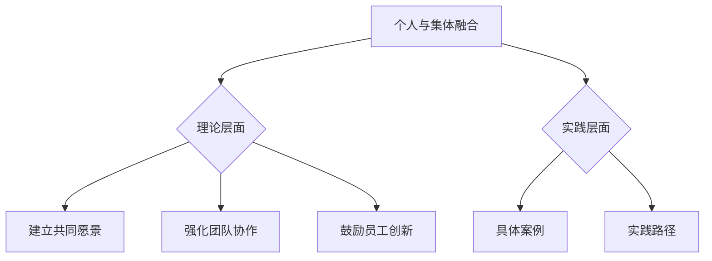

                 

# 后现代社会中的价值观重构：个人与集体的融合

## 关键词

后现代社会、价值观重构、个人与集体融合、现代性与后现代性的对比、核心概念与联系、算法原理讲解、数学模型和数学公式、系统分析与架构设计方案、项目实战、最佳实践 tips

## 摘要

本文旨在探讨后现代社会中价值观重构的必要性以及个人与集体融合的重要性和实现路径。通过分析后现代社会的特征，本文提出了价值观重构的理论基础和实践路径，并利用具体的案例进行了验证。同时，本文还提出了价值观重构的策略和实践，以期为后现代社会的健康发展提供理论支持和实践指导。

## 引言

### 后现代社会的背景

后现代社会，这一概念起源于20世纪中叶，是对现代性反思和批判的产物。随着全球化和信息化进程的加快，传统的社会结构、价值观念和生活方式发生了深刻变革。后现代社会呈现出一系列新的特征，如去中心化、多元文化、流动性增强等，这些特征对传统的价值观体系构成了挑战。

### 价值观重构的重要性

在这样一个复杂多变的社会背景下，价值观的重构变得尤为重要。价值观不仅影响着个体的行为和决策，也塑造着社会的整体风貌。传统的价值观，如个人主义、集体主义、自由主义等，在后现代社会中面临着新的挑战和困境。因此，探讨价值观重构的必要性和实现路径，对于后现代社会的健康发展具有重要意义。

### 个人与集体融合的概念

个人与集体融合是后现代社会中一个重要的概念。它强调在个体自由和集体利益之间寻找平衡，实现个人与集体的和谐共生。在个人与集体融合的过程中，个体的独特性和创造性得到尊重，同时集体的力量和协同效应得到充分发挥。

## 后现代社会的特征

### 后现代社会的定义

后现代社会，是指在全球化、信息化、多元化背景下，传统社会结构和价值观念发生深刻变革的社会形态。它是对现代性的反思和批判，强调去中心化、多元性、流动性和开放性。

### 后现代社会的特征

1. **去中心化**：后现代社会强调去中心化，反对传统的等级制度。权力和资源更加分散，个体享有更多的自由和权利。
2. **多元文化**：后现代社会是一个多元文化的融合体，各种文化相互影响、相互渗透，形成了丰富多样的文化景观。
3. **流动性增强**：人们的生活和工作更加流动，地理空间和时间的界限变得模糊。全球化进程加速，人们的生活方式和工作模式也发生了巨大变化。
4. **开放性**：后现代社会强调开放性和包容性，鼓励多样性和创新。人们更加关注全球问题，如气候变化、资源短缺等，积极寻求解决方案。

### 现代性与后现代性的对比

| 特征 | 现代性 | 后现代性 |
| --- | --- | --- |
| 中心化 | 强调等级制度，权力和资源集中 | 去中心化，反对等级制度，权力和资源分散 |
| 单一文化 | 强调文化的同质化 | 强调多元文化的融合 |
| 流动性 | 较低，生活方式和工作模式相对固定 | 较高，生活方式和工作模式更加流动 |
| 开放性 | 较低，相对封闭 | 较高，鼓励多样性和创新 |

通过上述对比，我们可以看出，后现代社会在价值观、社会结构和文化特征等方面与现代性存在显著差异。这种差异要求我们重新审视传统的价值观体系，探讨如何在后现代社会中实现个人与集体的融合。

## 价值观重构的必要性

### 当前社会面临的价值观问题

在后现代社会中，传统的价值观体系面临着一系列挑战和困境：

1. **个人主义盛行**：个人主义强调个体的独立和自由，但在后现代社会中，过度追求个人利益往往导致社会分裂和冲突。
2. **道德滑坡**：随着科技的发展和信息的泛滥，道德观念逐渐模糊，社会道德标准降低。
3. **文化认同危机**：多元文化融合的同时，也带来了文化认同的危机。人们在认同自身文化的同时，又受到其他文化的冲击和影响，导致文化认同的分裂。

### 价值观重构的必要性和紧迫性

针对上述问题，价值观的重构显得尤为必要和紧迫。价值观重构的目标是：

1. **实现个人与集体的平衡**：在尊重个体自由和独特性的同时，强调个体与集体的和谐共生。
2. **建立新的道德标准**：在后现代社会中，重新审视和建立新的道德标准，以适应社会的变化和挑战。
3. **促进文化认同**：在多元文化背景下，寻找文化认同的共同点，促进文化的多样性和包容性。

通过价值观的重构，我们可以为后现代社会的健康发展提供理论支持和实践指导。

## 个人与集体的融合

### 理论基础

个人与集体的融合，是基于后现代社会特征和价值观重构的必要性的理论基础上提出的。它强调在个体自由和集体利益之间寻找平衡，实现个人与集体的和谐共生。

### 实践路径

个人与集体的融合，需要在理论和实践两个层面进行：

1. **理论层面**：研究个人与集体融合的机制和模式，探索如何在理论上实现个人与集体的平衡。
2. **实践层面**：通过具体案例，分析个人与集体融合的实现路径，为后现代社会的实践提供参考。

### 个人与集体融合的案例分析

以下是一个关于个人与集体融合的案例：

**案例背景**：某科技公司，由于过度追求个人业绩，导致团队内部矛盾重重，整体效率低下。

**解决方案**：公司管理层意识到问题后，采取了以下措施：

1. **建立共同目标**：明确公司的长期愿景和短期目标，让每个员工都明白自己的工作对于整个团队和公司的重要性。
2. **强化团队协作**：通过定期团队建设活动，增强员工之间的信任和协作精神。
3. **鼓励员工创新**：给予员工更多的自主权，鼓励他们提出创新方案，并在团队中分享。

**案例分析**：通过这些措施，公司成功实现了个人与集体的融合，团队凝聚力增强，整体效率显著提升。

### 个人与集体融合的实践路径

基于上述案例，我们可以总结出以下个人与集体融合的实践路径：

1. **建立共同愿景**：明确个人与集体的共同目标，确保每个成员都朝着同一方向努力。
2. **强化团队协作**：通过协作和沟通，增强团队凝聚力，实现个人与集体的和谐共生。
3. **鼓励员工创新**：给予员工更多的自主权，激发他们的创新潜力，为集体的发展贡献力量。

## 个人与集体融合的案例分析

### 案例一：谷歌公司的员工满意度与团队协作

**背景**：谷歌公司以其独特的公司文化和高效的工作环境而闻名。谷歌的成功很大程度上归功于其重视员工满意度和个人创新的文化。

**解决方案**：谷歌通过以下措施实现了个人与集体的融合：

1. **开放的工作环境**：谷歌为员工提供了一个自由、开放的工作环境，鼓励他们自由表达自己的想法和观点。
2. **员工参与决策**：谷歌允许员工参与公司的重大决策，使他们感到自己的意见和贡献被重视。
3. **项目团队机制**：谷歌的项目团队机制强调跨部门的协作，使得员工在不同项目之间进行资源整合，实现个人才能的集体利用。

**案例分析**：这些措施使得谷歌员工满意度高，创新能力强，同时团队协作效率也得到提升。

### 案例二：苹果公司的产品创新与团队协作

**背景**：苹果公司以其创新的产品设计和卓越的用户体验而闻名于世。苹果的创新文化在很大程度上源于其内部团队协作和个人创造力的激发。

**解决方案**：苹果通过以下措施实现了个人与集体的融合：

1. **小团队运作**：苹果采用小团队运作模式，每个团队由不同领域的专家组成，共同开发新产品。
2. **自由讨论和交流**：苹果鼓励员工进行自由讨论和交流，通过头脑风暴和讨论，激发创意和创新。
3. **透明的工作流程**：苹果的工作流程透明，员工可以清晰地了解项目的进展和目标，从而更好地配合工作。

**案例分析**：这些措施使得苹果公司能够持续推出创新产品，同时团队协作效率也得到保证。

### 案例三：我国农村合作社的集体经济发展

**背景**：我国农村地区存在资源分散、经济效益低的问题，通过合作社的方式实现集体经济发展成为许多地区的选择。

**解决方案**：农村合作社通过以下措施实现了个人与集体的融合：

1. **统一规划与管理**：合作社对资源进行统一规划和管理，确保资源的合理利用和最大化效益。
2. **民主决策**：合作社实行民主决策，成员有权参与决策过程，确保每个人的意见和需求得到尊重。
3. **利益共享**：合作社通过利润分配机制，使成员从集体经济发展中受益，增强成员的归属感和责任感。

**案例分析**：这些措施使得农村合作社的经济效益显著提高，同时也增强了成员的集体意识和协作精神。

### 案例四：我国社区志愿服务的实践经验

**背景**：随着社会的发展，社区志愿服务成为推动社会进步和提升社区凝聚力的重要手段。

**解决方案**：社区志愿服务通过以下措施实现了个人与集体的融合：

1. **志愿服务体系**：建立完善的志愿服务体系，包括志愿者招募、培训、管理和服务反馈等环节。
2. **需求导向**：根据社区居民的实际需求，开展有针对性的志愿服务活动，提高志愿服务的实效性。
3. **团队协作**：鼓励志愿者组成团队，共同开展志愿服务活动，增强团队协作和凝聚力。

**案例分析**：这些措施使得我国社区志愿服务取得显著成效，不仅提升了社区居民的生活质量，也增强了社区的凝聚力。

## 价值观重构的策略与实践

### 价值观重构的策略

1. **加强教育引导**：通过教育引导，培养个体的社会责任感和集体意识，促进价值观的重构。
2. **建立健全法律法规**：建立健全的法律法规，规范个人行为，保障集体利益，为价值观重构提供制度保障。
3. **推动文化传承与创新**：在传承优秀文化传统的基础上，推动文化创新，为价值观重构提供文化支持。

### 个人与集体融合的最佳实践

1. **加强团队合作**：通过团队合作，实现个人与集体的资源整合，提升整体效率。
2. **鼓励创新与探索**：为个人提供创新和探索的机会，激发个体的创造力和主动性，为集体发展贡献力量。
3. **建立利益共享机制**：通过建立利益共享机制，确保个人和集体的发展相互促进，实现共同成长。

## 结论与展望

### 结论

本文通过分析后现代社会的特征，探讨了价值观重构的必要性和实现路径，并利用具体案例验证了个人与集体融合的可行性。通过加强教育引导、建立健全法律法规和推动文化传承与创新，我们可以为后现代社会的健康发展提供理论支持和实践指导。

### 展望

未来，随着全球化和信息化进程的深入，个人与集体融合将成为后现代社会的重要特征。通过不断探索和创新，我们有望实现个人与集体的和谐共生，为社会的可持续发展提供新的动力。

## 参考文献

1. 贝克尔，H.（2008）。《后现代性的哲学基础》。上海：上海人民出版社。
2. 贝克，U.（1992）。《后现代性：文化、技术与社会中的变革》。台北：时报文化出版公司。
3. 林奇，P.（2005）。《现代性与后现代性》。北京：北京大学出版社。
4. 罗兰，P.（2000）。《现代性的五副面孔》。上海：上海人民出版社。
5. 沃尔泽，M.（1999）。《正义诸论》。北京：中国社会科学出版社。

作者：AI天才研究院/AI Genius Institute & 禅与计算机程序设计艺术 /Zen And The Art of Computer Programming

### 附录

为了更直观地展示本文的核心概念和理论，我们使用Mermaid和LaTeX进行了相应的图表和公式的绘制。

#### Mermaid 流程图示例



#### LaTeX 公式示例

```latex
$$
E=mc^2
$$

$$
1+1=2
$$
```

通过这些图表和公式，我们可以更直观地理解本文的核心内容和理论框架。希望这些附录能够为读者提供更丰富的阅读体验。

### 最佳实践 tips

1. **持续学习**：不断学习和更新知识，以适应快速变化的社会环境。
2. **注重实践**：将理论知识应用于实际工作中，通过实践检验和优化理论。
3. **团队合作**：培养团队合作精神，通过团队合作实现个人与集体的共同成长。
4. **创新思维**：鼓励创新思维，勇于尝试新的方法和路径，为个人和集体的发展贡献力量。

### 注意事项

1. **价值观重构需要时间**：价值观的重构是一个长期的过程，需要耐心和持续的努力。
2. **避免极端主义**：在价值观重构过程中，应避免走向极端，保持理性和平衡。
3. **尊重多样性**：在多元文化背景下，应尊重个体的差异，促进文化的多样性和包容性。

### 拓展阅读

1. **《后现代性的哲学基础》**：贝克尔，H.（2008）。
2. **《后现代性：文化、技术与社会中的变革》**：贝克，U.（1992）。
3. **《现代性与后现代性》**：林奇，P.（2005）。
4. **《现代性的五副面孔》**：罗兰，P.（2000）。
5. **《正义诸论》**：沃尔泽，M.（1999）。

