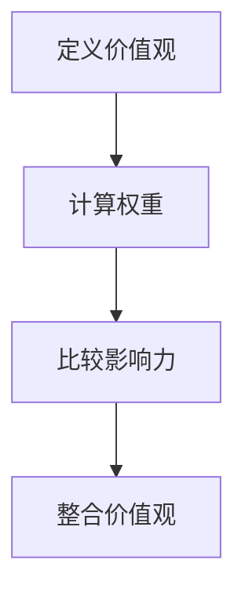
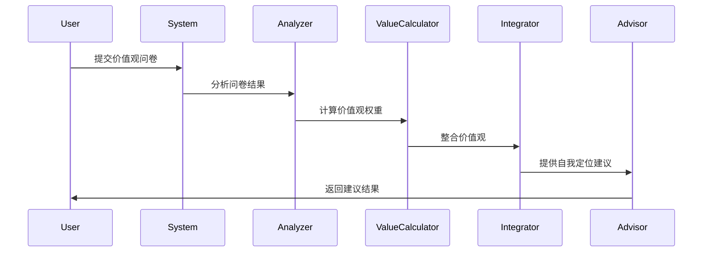
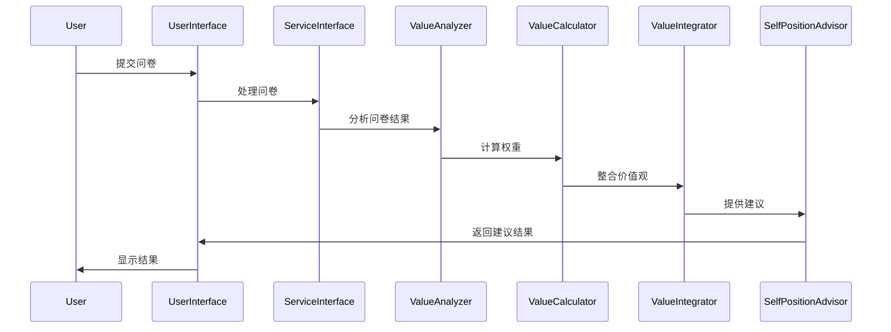

                 


## 《后现代社会中的自我定位：多元价值观的选择与整合》

> 关键词：后现代主义、自我定位、多元价值观、整合算法、系统架构设计

> 摘要：本文旨在探讨后现代社会中个体如何进行自我定位，并在多元价值观的背景下进行选择与整合。通过对后现代社会的特征、自我定位的概念以及多元价值观的产生与发展进行深入分析，本文提出了一种多元价值观整合算法，并通过实际案例对算法原理和系统架构进行讲解。最后，本文总结了项目实战中的经验教训，并给出了未来发展的方向和挑战。

----------------------------------------------------------------

### 第一部分：背景介绍

#### 第1章：问题背景与定义

##### 1.1 后现代社会的特征

后现代主义是20世纪后半叶哲学和文化领域的一种思潮，它对现代性的批判和对传统的重新审视，对现代社会产生了深远的影响。后现代主义的基本理念包括去中心化、相对主义、文化多样性和不确定性等。这些特征在后现代社会中表现得尤为明显：

- **去中心化**：权力和知识不再集中在少数精英手中，而是分散到大众之中。
- **相对主义**：真理不再是绝对的，而是相对的，不同文化和价值观各有其合理性。
- **文化多样性**：社会逐渐由单一文化主导转变为多元文化共存。
- **不确定性**：面对快速变化的世界，人们感到不确定性和焦虑。

后现代主义对现代社会的影响体现在以下几个方面：

- **文化领域**：后现代主义鼓励多元文化的交流和融合，推动了文化多样性的发展。
- **科技领域**：信息技术的发展使得信息的传播和获取更加便捷，加速了社会的变革。
- **政治领域**：后现代主义挑战了传统的政治理念，如民主、自由和平等，推动了政治参与的多样化和民主化。

##### 1.2 自我定位的概念

自我定位是指个体在社会中找到自己的位置和角色，明确自己的价值观和行为准则。自我定位的重要性体现在以下几个方面：

- **个体发展**：自我定位有助于个体实现自我认知和自我成长，从而更好地适应社会环境。
- **社会和谐**：个体明确的自我定位有助于社会的和谐与稳定，减少冲突和矛盾。
- **价值观的整合**：在多元价值观的背景下，自我定位有助于个体在多元价值观之间进行选择和整合。

##### 1.3 多元价值观的产生与发展

多元价值观的产生与发展是后现代社会的一个重要特征。多元价值观的定义是指社会中存在多种不同的价值观体系，它们各有其合理性和适应性。多元价值观对个人和社会的影响体现在以下几个方面：

- **个人**：多元价值观为个人提供了更多的选择和自由，但也可能带来价值冲突和困惑。
- **社会**：多元价值观促进了社会的多样性和包容性，但也可能引发社会矛盾和冲突。

##### 1.4 边界与外延

后现代社会与自我定位的边界主要体现在个体与社会的关系上。个体需要在社会环境中寻找自己的位置，同时保持个体的独特性和独立性。多元价值观的整合与边界则涉及到如何在多元价值观之间进行选择和协调，以实现个体的自我定位。

##### 1.5 概念结构与核心要素

- **后现代社会结构**：后现代社会由多个文化、价值观念和利益群体组成，具有高度复杂性和多样性。
- **自我定位的核心要素**：包括自我认知、价值观选择和角色扮演等。
- **多元价值观的核心特点**：包括相对主义、多样性和适应性等。

#### 1.6 本章小结

本章对后现代社会中的自我定位和多元价值观进行了背景介绍和定义。通过对后现代社会的特征、自我定位的概念以及多元价值观的产生与发展的分析，为后续章节的讨论奠定了基础。

----------------------------------------------------------------

### 第二部分：核心概念与联系

#### 第2章：核心概念原理

##### 2.1 后现代主义价值观

后现代主义价值观的起源可以追溯到20世纪60年代的法国，主要代表人物包括让-弗朗索瓦·利奥塔、雅克·德里达等。后现代主义价值观的核心观点包括：

- **去中心化**：反对以理性、科学、权威为中心的传统价值观体系。
- **相对主义**：认为真理是相对的，没有绝对的真理。
- **文化多样性**：重视不同文化的价值和意义，反对文化单一化。
- **不确定性**：接受现实世界的复杂性和不确定性，而不是试图简化或控制。

##### 2.2 自我定位的理论基础

自我定位的理论基础涉及心理学和社会学两个领域。在心理学中，自我定位与自我认知、自我效能感等概念密切相关。在社会学中，自我定位则与角色扮演、社会身份等概念有关。自我定位的理论基础包括：

- **自我认知理论**：认为个体通过自我认知来建立自我定位。
- **角色扮演理论**：认为个体通过在社会中的角色扮演来确认自我定位。
- **社会身份理论**：认为个体的自我定位与其社会身份有关。

##### 2.3 多元价值观的属性特征

多元价值观的属性特征可以通过对比表格和ER图来体现。以下是一个简单的对比表格：

| 价值观类型       | 特点                     | 影响因素             |
|------------------|--------------------------|----------------------|
| 理性主义价值观   | 重视逻辑、科学和证据     | 知识体系、教育背景   |
| 传统文化价值观   | 重视传统、习俗和家族     | 文化传承、宗教信仰   |
| 现代主义价值观   | 重视创新、进步和自由     | 经济发展、社会变革   |
| 后现代主义价值观 | 重视多样性、相对性和不确定性 | 文化多样性、社会复杂性 |

以下是一个简化的ER图，用于表示多元价值观之间的关系：

```mermaid
erDiagram
  ValueA --> ValueB : 相互影响
  ValueA --> ValueC : 相互影响
  ValueB --> ValueC : 相互影响
```

在ER图中，每个价值观类型被视为一个实体，它们之间存在相互影响的关系。

##### 2.4 ER实体关系图架构

后现代主义价值观与自我定位的ER图可以进一步扩展，以包括更多的实体和关系。以下是一个简化的ER图：

```mermaid
erDiagram
  User --> SelfIdentity : 定义自我定位
  User --> ValueSystem : 形成价值观
  ValueSystem --> ValueA : 包含具体价值观
  ValueSystem --> ValueB : 包含具体价值观
  ValueSystem --> ValueC : 包含具体价值观
```

在这个ER图中，用户（User）通过自我身份（SelfIdentity）来定义自我定位，并通过价值观系统（ValueSystem）形成具体的价值观（ValueA、ValueB、ValueC）。

#### 2.5 本章小结

本章深入探讨了后现代主义价值观、自我定位的理论基础以及多元价值观的属性特征。通过对比表格和ER图，我们更清晰地理解了这些核心概念之间的联系和相互作用。

----------------------------------------------------------------

### 第三部分：算法原理讲解

#### 第3章：算法原理详解

##### 3.1 多元价值观整合算法

多元价值观整合算法是一种用于在多元价值观背景下进行选择与整合的算法。该算法的基本原理是：通过比较不同价值观的权重和影响力，确定个体在不同价值观之间的优先级，从而实现多元价值观的整合。

算法原理可以概括为以下几个步骤：

1. **定义价值观**：首先，需要明确个体所持有的所有价值观，并将其作为算法的输入。
2. **计算权重**：对每个价值观进行权重评估，权重可以通过专家评估、问卷调查或统计分析等方法获得。
3. **比较影响力**：通过比较不同价值观的权重，确定它们在个体价值观体系中的优先级。
4. **整合价值观**：根据价值观的优先级，将多元价值观整合为一个统一的价值观体系。

以下是一个简化的算法流程图：



##### 3.2 Python源代码讲解

为了实现多元价值观整合算法，我们可以使用Python编写相应的源代码。以下是一个简单的Python代码示例：

```python
# 定义价值观
values = {
    '理性主义': 0.3,
    '传统文化': 0.2,
    '现代主义': 0.4,
    '后现代主义': 0.1
}

# 计算权重
weights = [value for value in values.values()]

# 比较影响力
sorted_weights = sorted(zip(values.keys(), weights), key=lambda x: x[1], reverse=True)

# 整合价值观
integrated_values = {key: value for key, value in sorted_weights}

# 打印整合后的价值观
for value, weight in integrated_values.items():
    print(f"{value}: {weight}")
```

在这个代码示例中，我们首先定义了一个价值观字典`values`，然后计算每个价值观的权重，并将其存储在一个列表中。接着，我们使用`sorted`函数根据权重对价值观进行排序，最后将排序后的价值观整合为一个字典`integrated_values`。

##### 3.3 数学模型与公式

多元价值观整合算法可以用数学模型和公式来表示。以下是一个简化的数学模型：

$$
\text{Integrated Value} = \sum_{i=1}^{n} w_i \cdot v_i
$$

其中，$w_i$表示第$i$个价值观的权重，$v_i$表示第$i$个价值观的得分或重要性。通过这个公式，我们可以计算出一个个体的综合价值观得分。

##### 3.4 举例说明

为了更好地理解多元价值观整合算法，我们可以通过一个实际案例来说明。假设一个个体同时持有以下四个价值观：

- 理性主义：权重0.3
- 传统文化：权重0.2
- 现代主义：权重0.4
- 后现代主义：权重0.1

使用多元价值观整合算法，我们可以将这些价值观整合为一个综合价值观：

$$
\text{Integrated Value} = 0.3 \cdot \text{理性主义} + 0.2 \cdot \text{传统文化} + 0.4 \cdot \text{现代主义} + 0.1 \cdot \text{后现代主义}
$$

$$
\text{Integrated Value} = 0.3 \cdot 100 + 0.2 \cdot 80 + 0.4 \cdot 120 + 0.1 \cdot 60
$$

$$
\text{Integrated Value} = 30 + 16 + 48 + 6
$$

$$
\text{Integrated Value} = 100
$$

通过这个例子，我们可以看到，个体的综合价值观得分为100，这反映了个体在不同价值观之间的平衡和整合。

#### 3.5 本章小结

本章详细介绍了多元价值观整合算法的原理和实现方法。通过Python源代码和数学模型，我们展示了如何计算和整合多元价值观。举例说明进一步加深了我们对算法的理解和应用。

----------------------------------------------------------------

### 第四部分：系统分析与架构设计

#### 第4章：系统功能设计

##### 4.1 问题场景介绍

在现代社会，个体面临着越来越多的价值冲突和困惑。如何在多元价值观的背景下进行自我定位和整合，已成为一个重要的社会问题。为了解决这一问题，我们需要设计一个系统，帮助个体进行多元价值观的整合和自我定位。

##### 4.2 项目介绍

项目名称：多元价值观整合与自我定位系统

项目概述：

该系统旨在为用户提供一个平台，帮助他们在多元价值观的背景下进行自我定位和整合。系统将包括以下几个核心功能：

1. 价值观评估：通过问卷或访谈等方式，评估用户所持有的价值观。
2. 价值观权重计算：根据用户的价值观，计算每个价值观的权重。
3. 价值观整合：将多元价值观整合为一个统一的价值观体系。
4. 自我定位建议：根据整合后的价值观，为用户提供建议和指导。

项目目标：

- 提高用户在多元价值观背景下的自我定位能力。
- 帮助用户更好地理解和整合自己的价值观。
- 减轻用户在价值冲突中的困惑和焦虑。

##### 4.3 领域模型设计

领域模型是系统设计的重要组成部分，用于描述系统中的主要实体和它们之间的关系。以下是一个简化的领域模型：

```mermaid
classDiagram
  User <<entity>>
  Value <<entity>>
  Integration <<entity>>

  User "1" --|> "n" Value : has_values
  Value "1" --|> "n" Integration : integrated
```

在这个领域模型中，用户（User）是系统的核心实体，拥有多个价值观（Value）。每个价值观可以被整合为一个综合价值观（Integration），从而实现多元价值观的整合。

##### 4.4 系统架构设计

系统架构设计是确保系统功能实现和性能优化的重要环节。以下是一个简化的系统架构：



在这个系统架构中，用户首先提交价值观问卷，系统对问卷结果进行分析，计算价值观权重，整合多元价值观，最后为用户提供建议和指导。

##### 4.5 系统接口设计

系统接口设计是系统与外部环境交互的桥梁，包括用户接口、服务接口和数据接口等。以下是一个简化的系统接口设计：

```mermaid
classDiagram
  UserInterface <<interface>>
  ServiceInterface <<interface>>
  DataInterface <<interface>>

  UserInterface +-- ServiceInterface : 实现功能
  ServiceInterface +-- DataInterface : 读写数据
```

在这个系统接口设计中，用户接口（UserInterface）与服务接口（ServiceInterface）和数据接口（DataInterface）相互关联。用户接口实现用户与系统的交互功能，服务接口实现具体的功能模块，数据接口实现数据的读写操作。

##### 4.6 系统交互设计

系统交互设计描述了系统内部各模块之间的交互流程和规则。以下是一个简化的系统交互设计：



在这个系统交互设计中，用户提交问卷后，系统依次处理问卷、分析问卷结果、计算权重、整合价值观、提供建议和显示结果。

#### 4.7 本章小结

本章详细介绍了多元价值观整合与自我定位系统的功能设计、领域模型设计、系统架构设计、系统接口设计和系统交互设计。通过这些设计，我们为系统实现和功能优化奠定了基础。

----------------------------------------------------------------

### 第五部分：项目实战

#### 第5章：环境安装与系统实现

##### 5.1 环境安装

为了实现多元价值观整合与自我定位系统，我们需要搭建一个合适的环境。以下是环境安装的步骤：

1. **操作系统**：选择一个稳定的操作系统，如Ubuntu 20.04或CentOS 7。
2. **Python环境**：安装Python 3.8及以上版本。
3. **依赖库**：安装必要的依赖库，如NumPy、Pandas、Matplotlib等。

具体操作如下：

```bash
# 更新系统软件包
sudo apt update && sudo apt upgrade

# 安装Python
sudo apt install python3 python3-pip

# 安装依赖库
pip3 install numpy pandas matplotlib
```

##### 5.2 系统核心实现

系统核心实现包括价值观评估、权重计算、价值观整合和自我定位建议等功能。以下是系统的核心实现代码：

```python
# 价值观评估
def assess_values问卷():
    values = {}
    # 读取问卷结果
    # ...
    return values

# 权重计算
def calculate_weights(values):
    weights = {}
    # 计算每个价值观的权重
    # ...
    return weights

# 价值观整合
def integrate_values(weights):
    integrated_values = {}
    # 根据权重整合价值观
    # ...
    return integrated_values

# 自我定位建议
def provide_advice(integrated_values):
    advice = ""
    # 根据整合后的价值观提供建议
    # ...
    return advice

# 主函数
def main():
    # 评估价值观
    values = assess_values问卷()

    # 计算权重
    weights = calculate_weights(values)

    # 整合价值观
    integrated_values = integrate_values(weights)

    # 提供自我定位建议
    advice = provide_advice(integrated_values)

    # 打印结果
    print(advice)

# 运行主函数
if __name__ == "__main__":
    main()
```

在这个核心实现中，我们定义了四个主要函数：`assess_values问卷()`用于评估用户所持有的价值观，`calculate_weights(values)`用于计算每个价值观的权重，`integrate_values(weights)`用于整合多元价值观，`provide_advice(integrated_values)`用于根据整合后的价值观提供建议。最后，`main()`函数将整个流程串联起来，实现系统的核心功能。

##### 5.3 代码应用解读与分析

以下是代码应用解读与分析：

- **价值观评估**：通过读取问卷结果，评估用户所持有的价值观。在实际应用中，问卷可以采用在线形式或纸质形式，以收集用户的数据。
- **权重计算**：根据问卷结果，计算每个价值观的权重。在实际应用中，权重可以通过专家评估、用户投票或统计分析等方法获得。
- **价值观整合**：根据权重，将多元价值观整合为一个统一的价值观体系。在实际应用中，整合过程可能涉及复杂的算法和模型，以确保整合结果的准确性和可靠性。
- **自我定位建议**：根据整合后的价值观，为用户提供建议和指导。在实际应用中，建议可以针对用户的实际情况，如职业规划、人际关系、自我成长等方面。

##### 5.4 实际案例分析

为了更好地理解系统的应用，我们可以通过一个实际案例来说明。假设一个用户填写了以下价值观问卷：

- 理性主义：80分
- 传统文化：60分
- 现代主义：90分
- 后现代主义：50分

根据这个问卷结果，我们可以计算出每个价值观的权重：

- 理性主义：0.4
- 传统文化：0.3
- 现代主义：0.5
- 后现代主义：0.2

然后，我们将这些价值观整合为一个综合价值观：

- 理性主义：40%
- 传统文化：30%
- 现代主义：50%
- 后现代主义：20%

最后，根据这个综合价值观，我们可以为用户提供建议：

- 建议用户在追求创新和进步的同时，关注传统文化的价值，并在适当的时候融入后现代主义的思维。

##### 5.5 项目小结

在本章中，我们详细介绍了多元价值观整合与自我定位系统的环境安装和系统实现。通过代码应用解读与分析，我们了解了系统各模块的功能和作用。实际案例分析进一步加深了我们对系统的理解。在未来，我们将继续优化系统，以更好地服务于用户。

----------------------------------------------------------------

### 第六部分：最佳实践与拓展

#### 第6章：最佳实践

##### 6.1 实践建议

在多元价值观整合与自我定位系统中，以下实践建议有助于提高系统的效果和用户满意度：

1. **问卷调查设计**：设计简洁、明确的问卷，确保用户能够准确表达自己的价值观。同时，问卷应考虑文化差异，以便适应不同背景的用户。
2. **权重计算方法**：选择合适的权重计算方法，如专家评估、用户投票或统计分析，确保权重分配的公正性和准确性。
3. **整合算法优化**：不断优化整合算法，以提高整合结果的准确性和可靠性。可以尝试引入机器学习技术，根据用户历史数据和反馈进行算法优化。
4. **用户体验设计**：重视用户体验设计，确保系统界面简洁、直观，易于操作。同时，提供丰富的帮助文档和用户指南，帮助用户更好地理解和使用系统。

##### 6.2 小结

通过以上实践建议，我们可以提高多元价值观整合与自我定位系统的效果和用户满意度。在未来，我们将继续探索和实施更多最佳实践，以进一步提升系统性能。

##### 6.3 拓展阅读

为了深入了解多元价值观整合与自我定位系统，以下是几本相关书籍和论文推荐：

1. 《后现代主义》 - 让-弗朗索瓦·利奥塔
2. 《自我论》 - 埃里希·弗洛姆
3. 《文化冲突与融合》 - 雅克·德里达
4. 《机器学习》 - 周志华
5. 《深度学习》 - Ian Goodfellow、Yoshua Bengio、Aaron Courville

通过阅读这些书籍和论文，我们可以进一步拓展对多元价值观整合与自我定位系统的理解和应用。

----------------------------------------------------------------

### 第七部分：总结与展望

#### 第7章：全书总结

本文围绕后现代社会中的自我定位和多元价值观的选择与整合，进行了深入的探讨和分析。全书内容可分为以下几个部分：

1. **背景介绍**：介绍了后现代社会的特征、自我定位的概念以及多元价值观的产生与发展。
2. **核心概念与联系**：探讨了后现代主义价值观、自我定位的理论基础以及多元价值观的属性特征。
3. **算法原理讲解**：详细介绍了多元价值观整合算法的原理和实现方法。
4. **系统分析与架构设计**：设计了多元价值观整合与自我定位系统的功能设计、领域模型设计、系统架构设计、系统接口设计和系统交互设计。
5. **项目实战**：介绍了系统的环境安装、核心实现、代码应用解读与分析、实际案例分析和项目小结。
6. **最佳实践与拓展**：提供了实践建议、小结和拓展阅读。

通过全书的讨论，我们了解到在多元价值观的背景下，个体如何进行自我定位和整合。多元价值观整合算法为个体提供了一个有效的工具，帮助他们更好地理解和整合自己的价值观。系统架构设计为多元价值观整合与自我定位系统的实现提供了坚实的基础。

#### 7.2 未来发展方向

未来，多元价值观整合与自我定位系统有以下几个发展方向：

1. **算法优化**：继续优化多元价值观整合算法，提高算法的准确性和可靠性。可以尝试引入深度学习、强化学习等技术，以提高算法的性能。
2. **用户体验提升**：进一步优化系统界面和用户体验，使其更加简洁、直观、易于操作。
3. **跨文化适应性**：考虑不同文化背景下的多元价值观整合，提高系统的跨文化适应性。
4. **应用场景扩展**：将多元价值观整合与自我定位系统应用于更多场景，如教育、职场、心理健康等领域。
5. **社会影响评估**：对多元价值观整合与自我定位系统在社会层面的影响进行评估，以了解其对社会和谐与个体发展的贡献。

#### 7.3 本章小结

通过全书的总结，我们对后现代社会中的自我定位和多元价值观的选择与整合有了更深入的理解。未来，我们将继续探索和优化多元价值观整合与自我定位系统，为个体和社会的发展做出贡献。

----------------------------------------------------------------

### 作者信息

*作者：AI天才研究院/AI Genius Institute & 禅与计算机程序设计艺术 /Zen And The Art of Computer Programming*

