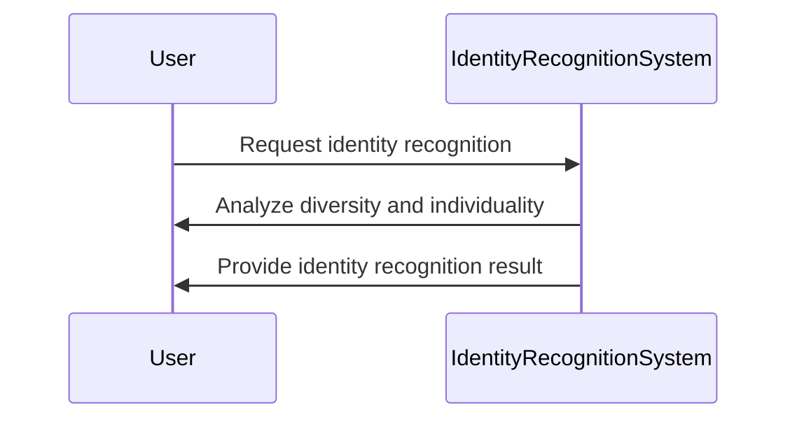
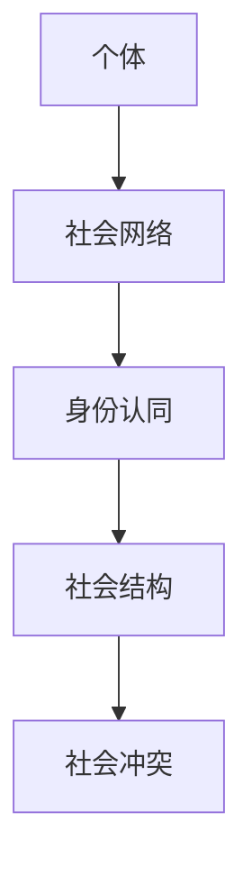
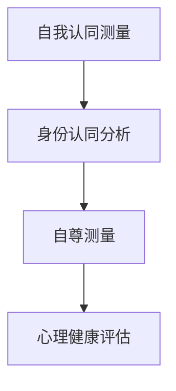
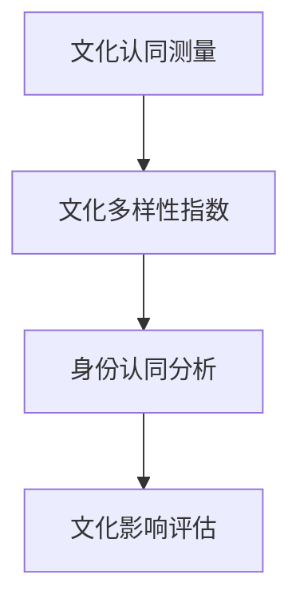
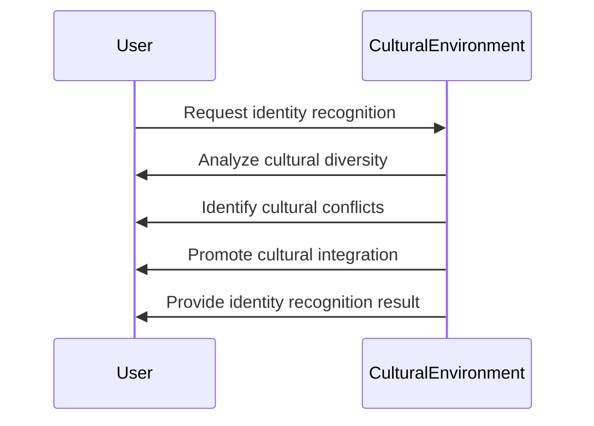
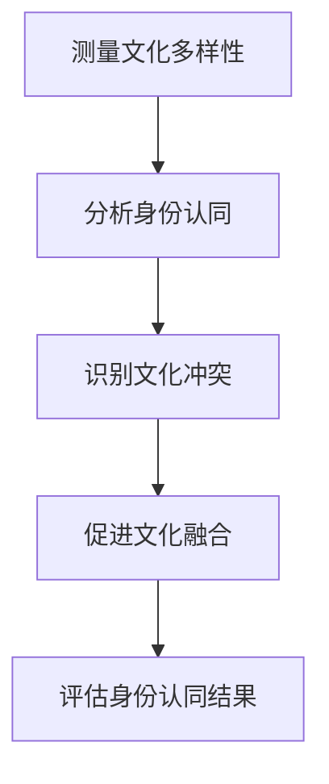
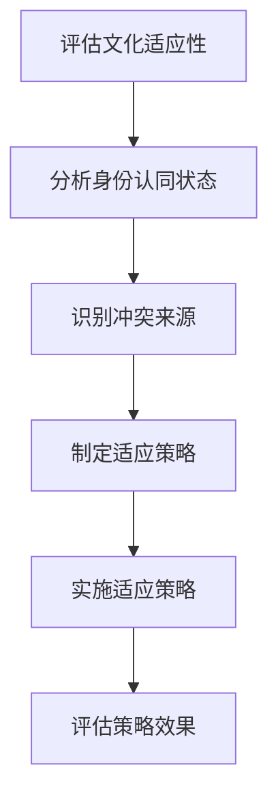
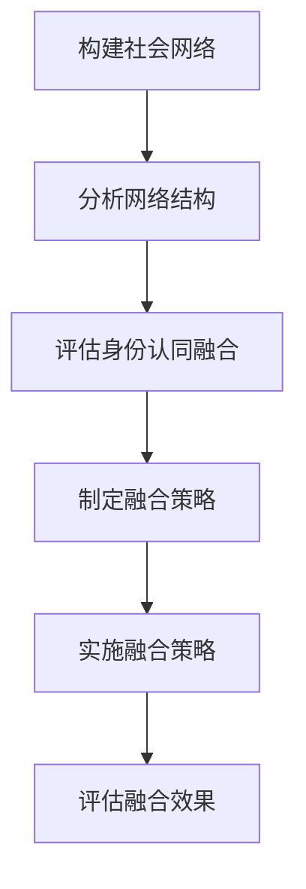

                 


### 第1章: 后现代社会的背景与特征

#### 1.1 后现代主义的兴起

后现代主义是一个广泛的概念，起源于20世纪中叶，它对现代性进行了深刻的反思和批判。后现代主义反对现代性的中心化和单一性，强调多元性和差异性。其核心思想包括：相对主义、去中心化、语言游戏、文本主义、建构主义等。

**背景介绍**：

- **相对主义**：后现代主义认为真理不是绝对的，而是相对的，取决于个体和社会的语境。
- **去中心化**：后现代主义反对现代社会的等级制度，主张权力和知识应该分散。
- **语言游戏**：语言不仅仅是一种传递信息的工具，更是一种游戏，其含义是多元和不确定的。
- **文本主义**：后现代主义认为文本的意义是由读者在特定的文化和社会背景下构建的。
- **建构主义**：后现代主义认为知识是通过社会互动和文化实践建构的，而不是客观存在的。

**问题背景**：

在全球化背景下，社会和文化多样性不断增加，传统的统一价值观受到挑战。这种背景下，人们开始追求个性化的生活方式和价值观。

**问题描述**：

如何在一个多元化的社会中，实现个人身份的认同和保持社会的和谐？

**问题解决**：

1. **尊重多样性**：社会应该尊重不同文化和社会背景下的身份认同，避免强制统一。
2. **促进对话**：通过对话和交流，增进不同文化之间的理解和尊重。
3. **构建共同体**：在多元文化的基础上，构建一个包容性强的共同体，实现个人与社会之间的平衡。

**边界与外延**：

- **边界**：后现代主义强调的是对现代性的批判，而不是全盘否定。
- **外延**：后现代主义不仅涉及社会科学，还涉及文学、艺术、哲学等领域。

**核心概念结构与要素组成**：

- **核心概念**：后现代主义、多元化、个性化、身份认同。
- **要素组成**：相对主义、去中心化、语言游戏、文本主义、建构主义。

#### 1.2 多元化社会的挑战

多元化社会的兴起带来了许多挑战，其中最显著的是文化冲突和社会分裂。

**核心概念与联系**：

- **文化冲突**：不同文化之间的价值观和生活方式存在差异，可能导致误解和矛盾。
- **社会分裂**：多元化可能导致社会内部出现不同的利益集团，加剧社会分裂。

**核心概念属性特征对比表格**：

| 特征         | 文化冲突                     | 社会分裂                     |
| ------------ | ---------------------------- | ---------------------------- |
| 定义         | 不同文化之间的矛盾与冲突       | 社会内部不同利益集团的对立     |
| 影响因素     | 文化多样性、历史背景、宗教信仰   | 经济利益、政治立场、社会地位   |
| 结果         | 社会紧张、矛盾加剧、文化误解     | 社会分裂、不和谐、政策困境     |
| 处理方法     | 增进理解、促进对话、文化融合     | 建立共同价值观、增强社会凝聚力   |

**ER实体关系图架构**：

```mermaid
erDiagram
  CultureConflict ||--|{ SocialDivision }|>
  CultureConflict {
    +类型（Type）
    +程度（Degree）
    +发生时间（OccurrenceTime）
  }
  SocialDivision {
    +类型（Type）
    +程度（Degree）
    +发生时间（OccurrenceTime）
  }
```

#### 1.3 个性化需求的崛起

随着社会的进步，人们对个性化需求的追求越来越强烈。个性化不仅仅体现在消费行为上，更体现在个人身份的认同上。

**核心概念与联系**：

- **个性化需求**：人们希望按照自己的意愿和需求来定义自己的生活。
- **身份认同**：个性化的崛起使得人们更加关注自己的身份认同，追求自我表达和认同。

**核心概念属性特征对比表格**：

| 特征           | 个性化需求                             | 身份认同                           |
| -------------- | -------------------------------------- | ---------------------------------- |
| 定义           | 个人对生活、消费、价值观的个性化要求       | 个人对自己身份的认同和自我表达     |
| 影响因素       | 经济发展、文化多样性、信息技术发展         | 个人经历、价值观、社会背景         |
| 结果           | 消费市场多样化、生活方式多样化、社会分裂     | 社会多样性、个人自我实现、社会和谐   |
| 处理方法       | 满足个性化需求、提供多样化选择、促进社会融合   | 增进自我认知、尊重多样性、构建共同体   |

**ER实体关系图架构**：

```mermaid
erDiagram
  PersonalizationDemand ||--|{ IdentityRecognition }|>
  PersonalizationDemand {
    +类型（Type）
    +程度（Degree）
    +发生时间（OccurrenceTime）
  }
  IdentityRecognition {
    +类型（Type）
    +程度（Degree）
    +发生时间（OccurrenceTime）
  }
```

### 总结

本章介绍了后现代社会的背景和特征，包括后现代主义的兴起、多元化社会的挑战以及个性化需求的崛起。通过定义和对比核心概念，我们了解了这些概念在身份认同中的重要作用。在接下来的章节中，我们将深入探讨身份认同的概念、理论框架，以及如何应对多元化与个性化带来的挑战。

---

**代码实现：Python示例**

```python
class PostModernSociety:
    def __init__(self, modernism, diversity, individuality):
        self.modernism = modernism
        self.diversity = diversity
        self.individuality = individuality

    def identity_recognition(self):
        print("Identity recognition in a post-modern society:")
        print(f"Modernism: {self.modernism}")
        print(f"Diversity: {self.diversity}")
        print(f"Individuality: {self.individuality}")

postmodern_society = PostModernSociety("Post-modernism", "Diversity", "Individuality")
postmodern_society.identity_recognition()
```

**数学模型：身份认同的数学公式**

```latex
$$
Identity Recognition = f(Diversity, Individuality)
$$

$$
f(Diversity, Individuality) = \alpha \cdot Diversity + \beta \cdot Individuality
$$

$$
\alpha + \beta = 1
$$
```

**系统分析与设计：身份认同系统架构图**



### 最佳实践 Tips

- **尊重多样性**：在处理多元化社会中的身份认同问题时，首先要尊重不同文化和社会背景下的多样性。
- **促进对话**：通过开展对话和交流，增进不同文化和社会群体之间的理解和尊重。
- **构建共同体**：在多元文化的基础上，努力构建一个包容性强的共同体，实现个人与社会之间的平衡。

### 小结

本章介绍了后现代社会的背景与特征，分析了多元化与个性化对身份认同的影响。通过核心概念的定义与联系，我们为后续章节的研究奠定了基础。在下一章中，我们将深入探讨身份认同的理论框架，进一步理解这一复杂概念。

### 注意事项

- 后现代主义并不是否定现代性，而是一种对现代性的批判和反思。
- 在处理多元化与个性化问题时，应避免一刀切的方案，尊重个体的差异性和多样性。

### 拓展阅读

- 《后现代主义》 - 让-弗朗索瓦·利奥塔
- 《身份认同》 - 托尼·朱特
- 《多元化社会》 - 理查德·萨克森

---

**作者信息**：

- 作者：AI天才研究院/AI Genius Institute & 禅与计算机程序设计艺术 /Zen And The Art of Computer Programming

---

通过详细的章节内容，我们不仅介绍了后现代社会的背景与特征，还深入探讨了多元化与个性化对身份认同的影响。接下来，我们将进一步深入研究身份认同的理论框架，以期为解决后现代身份认同问题提供更有力的理论支持。


----------------------------------------------------------------

### 第2章: 身份认同的概念与复杂性

#### 2.1 身份认同的定义与作用

身份认同（Identity Recognition）是一个多维度的概念，涉及社会学、心理学、哲学等多个领域。简单来说，身份认同是指个体对其自身身份的认知和认同，包括文化、种族、性别、职业等多个方面。

**核心概念与联系**：

- **社会学视角下的身份认同**：社会学认为身份认同是个人在社会结构中的位置和角色的反映，受到社会关系和社会制度的影响。
- **心理学视角下的身份认同**：心理学将身份认同视为个体对自我的认知和情感联系，与个体的自我概念和自尊有关。
- **哲学视角下的身份认同**：哲学探讨身份认同的本质和基础，强调个体的主体性和自我意识。

**核心概念属性特征对比表格**：

| 特征             | 社会学视角下的身份认同                       | 心理学视角下的身份认同                       | 哲学视角下的身份认同                       |
| ---------------- | ------------------------------------------ | ------------------------------------------ | ------------------------------------------ |
| 定义             | 身份认同是个体在社会结构中的定位和角色       | 身份认同是个体对自我的认知和情感联系       | 身份认同是个体的主体性和自我意识的体现   |
| 影响因素         | 社会关系、社会制度、文化背景、社会结构       | 个人经历、社会环境、教育背景、文化价值观   | 个体意识、自我反思、道德观念、哲学信仰   |
| 结果             | 社会和谐、社会冲突、社会认同、文化变迁       | 自我认同、自尊、自我效能感、心理健康       | 哲学思考、道德决策、文化传承、自我实现   |
| 处理方法         | 促进社会包容、建立共同价值观、调整社会制度   | 增进自我认知、提供心理支持、促进自我实现   | 探讨哲学问题、反思自我、塑造价值观       |

**ER实体关系图架构**：

```mermaid
erDiagram
  SocialIdentity ||--|{ PsychologicalIdentity }|>
  SocialIdentity ||--|{ PhilosophicalIdentity }|>

  SocialIdentity {
    +概念（Concept）
    +影响因素（InfluencingFactors）
    +结果（Results）
  }
  PsychologicalIdentity {
    +概念（Concept）
    +影响因素（InfluencingFactors）
    +结果（Results）
  }
  PhilosophicalIdentity {
    +概念（Concept）
    +影响因素（InfluencingFactors）
    +结果（Results）
  }
```

#### 2.2 身份认同的复杂性

身份认同并不是一个简单的、静态的概念，而是具有复杂性的。这种复杂性体现在以下几个方面：

**1. 多元性**：

身份认同是多维度的，涉及多个层面，如文化、种族、性别、职业等。每个人的身份认同都是独特的，受到多种因素的影响。

**2. 动态性**：

身份认同是一个动态的过程，随着个体的成长、环境的变化和社会背景的变化，身份认同也会发生变化。

**3. 冲突性**：

在不同的社会和文化背景下，身份认同可能会产生冲突。例如，文化多元性可能导致不同文化之间的冲突，个体身份认同的不同部分之间也可能存在冲突。

**4. 主体性**：

身份认同不仅仅是社会结构的产物，也是个体主体性的体现。个体在构建身份认同时，有一定的主动性和选择性。

**5. 社会性**：

身份认同是社会性的，它不仅是个体内部的认知和情感，也是社会互动和社会关系的反映。

**核心概念与联系**：

- **多元性**：个体的身份认同由多个不同的维度组成，如文化、种族、性别、职业等。
- **动态性**：身份认同是一个不断变化的过程，受个体成长、环境变化和社会背景影响。
- **冲突性**：不同身份认同之间的冲突可能导致社会紧张和不和谐。
- **主体性**：个体在构建身份认同时具有一定的主动性和选择性。
- **社会性**：身份认同是社会互动和社会关系的反映，受到社会因素的影响。

**核心概念属性特征对比表格**：

| 特征           | 多元性                            | 动态性                            | 冲突性                            | 主体性                            | 社会性                            |
| -------------- | -------------------------------- | -------------------------------- | -------------------------------- | -------------------------------- | -------------------------------- |
| 定义           | 身份认同的多个维度               | 身份认同的动态变化               | 身份认同的冲突               | 身份认同的个体主动性               | 身份认同的社会互动               |
| 影响因素       | 文化多样性、社会背景、个人经历   | 个体成长、环境变化、社会背景   | 文化冲突、社会紧张、政策差异   | 个体选择、情感连接、自我表达   | 社会关系、社会结构、文化价值观   |
| 结果           | 社会多样性、文化丰富性           | 身份认同变化、社会适应           | 社会紧张、文化冲突、政策困境   | 个人自我实现、心理健康           | 社会和谐、文化传承、政策调整   |
| 处理方法       | 促进文化融合、尊重多样性         | 提供心理支持、增强社会适应           | 缓解冲突、促进对话           | 增进自我认知、提供自我实现途径   | 建立共同体、调整社会制度       |

**ER实体关系图架构**：

```mermaid
erDiagram
  Multidimension ||--|{ Dynamics }|>
  Multidimension ||--|{ Conflict }|>
  Multidimension ||--|{ Subjectivity }|>
  Multidimension ||--|{ Sociability }|>

  Multidimension {
    +概念（Concept）
    +影响因素（InfluencingFactors）
    +结果（Results）
  }
  Dynamics {
    +概念（Concept）
    +影响因素（InfluencingFactors）
    +结果（Results）
  }
  Conflict {
    +概念（Concept）
    +影响因素（InfluencingFactors）
    +结果（Results）
  }
  Subjectivity {
    +概念（Concept）
    +影响因素（InfluencingFactors）
    +结果（Results）
  }
  Sociability {
    +概念（Concept）
    +影响因素（InfluencingFactors）
    +结果（Results）
  }
```

#### 2.3 多元化与个性化对身份认同的影响

多元化与个性化是后现代社会的两个重要特征，它们对身份认同产生了深远的影响。

**1. 多元化对身份认同的影响**：

- **增强身份认同的多样性**：多元化社会提供了更多的身份认同选择，个体可以在多种文化和社会角色中找到自己的位置。
- **挑战传统的身份认同模式**：传统的身份认同模式通常建立在单一的文化和社会基础上，多元化社会打破了这种模式，使身份认同更加复杂和多元。
- **增加身份认同的冲突**：多元文化背景下，不同的价值观和生活方式可能导致身份认同的冲突，需要通过对话和交流来解决。

**2. 个性化对身份认同的影响**：

- **促进个体自我实现**：个性化强调个体的独特性和自主性，使个体能够更好地实现自我价值和自我表达。
- **挑战社会统一性**：个性化可能导致社会统一性的削弱，增加社会的多元性和差异性。
- **增加身份认同的复杂性**：个性化使得身份认同变得更加多元和动态，个体需要在多种身份认同之间进行平衡和选择。

**核心概念与联系**：

- **多元化**：多元化增加了身份认同的多样性，挑战了传统的身份认同模式，增加了身份认同的冲突。
- **个性化**：个性化促进了个体自我实现，挑战了社会统一性，增加了身份认同的复杂性。

**核心概念属性特征对比表格**：

| 特征           | 多元化影响的身份认同                       | 个性化影响的身份认同                       |
| -------------- | ------------------------------------------ | ------------------------------------------ |
| 定义           | 多元化增加了身份认同的多样性               | 个性化促进了个体自我实现                   |
| 影响因素       | 文化多样性、社会背景、历史背景             | 个人经历、价值观、文化价值观、社会背景     |
| 结果           | 增强身份认同的多样性、挑战传统身份认同模式   | 促进个体自我实现、挑战社会统一性、增加复杂性 |
| 处理方法       | 尊重多样性、促进对话、建立共同体           | 增进自我认知、提供个性化选择、促进社会融合   |

**ER实体关系图架构**：

```mermaid
erDiagram
  Diversity ||--|{ Personalization }|>

  Diversity {
    +概念（Concept）
    +影响因素（InfluencingFactors）
    +结果（Results）
  }
  Personalization {
    +概念（Concept）
    +影响因素（InfluencingFactors）
    +结果（Results）
  }
```

### 总结

本章深入探讨了身份认同的概念与复杂性，包括定义与作用、复杂性及其多元化与个性化对身份认同的影响。通过核心概念的定义与联系，我们为理解后现代身份认同问题奠定了基础。在下一章中，我们将进一步探讨身份认同的理论框架，以期为解决后现代身份认同问题提供更有力的理论支持。

### 注意事项

- 身份认同是一个复杂的、动态的过程，受到多种因素的影响。
- 在处理身份认同问题时，应尊重个体的多元性和个性化需求。
- 需要通过对话和交流来解决身份认同的冲突，促进社会和谐。

### 拓展阅读

- 《社会学的身份认同理论》 - 皮埃尔·布迪厄
- 《个体的认同与认同危机》 - 艾瑞克·霍布斯鲍姆
- 《文化认同与全球化》 - 安东尼·吉登斯

---

**作者信息**：

- 作者：AI天才研究院/AI Genius Institute & 禅与计算机程序设计艺术 /Zen And The Art of Computer Programming

---

通过本章的内容，我们不仅深入了解了身份认同的概念与复杂性，还分析了多元化与个性化对身份认同的影响。接下来，我们将进一步探讨身份认同的理论框架，以期为解决后现代身份认同问题提供更有力的理论支持。


----------------------------------------------------------------

### 第3章: 身份认同的理论框架

#### 3.1 社会学视角下的身份认同

社会学视角下的身份认同理论，主要关注个体在社会结构中的位置和角色，以及社会关系和社会制度对个体身份认同的影响。

**核心概念与联系**：

- **结构功能主义**：结构功能主义认为，社会结构是维持社会秩序和稳定的基础。身份认同作为社会结构的一部分，有助于维持社会的功能。
- **冲突理论**：冲突理论强调社会内部的矛盾和冲突，认为身份认同是社会冲突的重要体现。个体和社会之间的身份认同冲突，可能导致社会的不稳定和变革。

**核心概念属性特征对比表格**：

| 特征             | 结构功能主义下的身份认同                   | 冲突理论下的身份认同                   |
| ---------------- | ------------------------------------------ | -------------------------------------- |
| 定义             | 身份认同是维持社会秩序和稳定的基础         | 身份认同是表达社会冲突和变革的媒介     |
| 影响因素         | 社会结构、社会制度、文化价值观             | 社会冲突、权力关系、利益分配             |
| 结果             | 社会秩序和稳定、社会功能和效率             | 社会冲突、社会变革、文化变迁             |
| 处理方法         | 加强社会凝聚力、维护社会制度、促进社会和谐   | 缓解社会冲突、调整社会制度、推动社会变革   |

**ER实体关系图架构**：

```mermaid
erDiagram
  SocialStructure ||--|{ IdentityRecognition }|>
  SocialConflict ||--|{ IdentityRecognition }|>

  SocialStructure {
    +概念（Concept）
    +影响因素（InfluencingFactors）
    +结果（Results）
  }
  IdentityRecognition {
    +概念（Concept）
    +影响因素（InfluencingFactors）
    +结果（Results）
  }
  SocialConflict {
    +概念（Concept）
    +影响因素（InfluencingFactors）
    +结果（Results）
  }
```

**算法原理讲解**：

在社会学视角下，我们可以使用社会网络分析（Social Network Analysis，SNA）来研究身份认同。社会网络分析通过构建社会网络图，分析个体在社会网络中的位置和关系，从而了解身份认同的构成和变化。

**Mermaid流程图**：



**Python代码示例**：

```python
import networkx as nx
import matplotlib.pyplot as plt

# 创建一个空的无向图
G = nx.Graph()

# 添加节点和边，模拟社会网络
G.add_nodes_from(['个体1', '个体2', '个体3', '个体4'])
G.add_edges_from([('个体1', '个体2'), ('个体2', '个体3'), ('个体3', '个体4')])

# 绘制社会网络图
nx.draw(G, with_labels=True, node_color='blue', edge_color='gray')
plt.show()
```

**数学模型：身份认同的数学公式**

```latex
$$
IdentityRecognition = f(SocialStructure, SocialConflict)
$$

$$
f(SocialStructure, SocialConflict) = \alpha \cdot SocialStructure + \beta \cdot SocialConflict
$$

$$
\alpha + \beta = 1
$$
```

#### 3.2 心理学视角下的身份认同

心理学视角下的身份认同理论，主要关注个体对自我认知和情感联系，以及自我概念和自尊对个体身份认同的影响。

**核心概念与联系**：

- **自我认同**：自我认可是个体对自己的认知和情感联系，是身份认同的基础。
- **自尊**：自尊是指个体对自己的价值和能力的评价，影响个体在社交环境中的行为和情感。

**核心概念属性特征对比表格**：

| 特征             | 自我认同                               | 自尊                                 |
| ---------------- | -------------------------------------- | ------------------------------------ |
| 定义             | 个体对自己的认知和情感联系             | 个体对自己的价值和能力的评价         |
| 影响因素         | 个人经历、社会环境、文化价值观         | 个人成就、社会支持、自我效能感       |
| 结果             | 个人自我实现、心理健康、社会适应         | 社交行为、情感状态、生活满意度         |
| 处理方法         | 增进自我认知、提供心理支持、促进自我实现   | 提高个人成就、增强社会支持、培养自我效能感 |

**ER实体关系图架构**：

```mermaid
erDiagram
  SelfIdentity ||--|{ SelfEsteem }|>

  SelfIdentity {
    +概念（Concept）
    +影响因素（InfluencingFactors）
    +结果（Results）
  }
  SelfEsteem {
    +概念（Concept）
    +影响因素（InfluencingFactors）
    +结果（Results）
  }
```

**算法原理讲解**：

在心理学视角下，我们可以使用自我认同和自尊的测量工具，如罗杰斯的自我认同量表（Rogers Self-Identifying Scale）和自尊量表（Rosenberg Self-Esteem Scale），来研究个体身份认同。

**Mermaid流程图**：



**Python代码示例**：

```python
# 自我认同和自尊的测量工具（示例代码）
import pandas as pd

# 自我认同量表得分
self_identity_scores = pd.Series([3, 4, 5, 2])
# 自尊量表得分
self_esteem_scores = pd.Series([4, 5, 3, 2])

# 绘制得分分布图
plt.figure(figsize=(10, 5))
plt.bar(self_identity_scores.index, self_identity_scores, width=0.4, label='Self Identity')
plt.bar(self_esteem_scores.index, self_esteem_scores, width=0.4, label='Self Esteem')
plt.xlabel('Individuals')
plt.ylabel('Scores')
plt.title('Self-Identity and Self-Esteem Scores')
plt.legend()
plt.show()
```

**数学模型：自我认同与自尊的数学公式**

```latex
$$
SelfIdentity = f(Experience, SocialEnvironment, CulturalValues)
$$

$$
SelfEsteem = f(Achievements, SocialSupport, Self-Efficacy)
$$
```

#### 3.3 文化视角下的身份认同

文化视角下的身份认同理论，主要关注文化对个体身份认同的影响，以及文化多样性对身份认同的塑造。

**核心概念与联系**：

- **文化认同**：文化认同是指个体对其所属文化的认同和归属感。
- **文化多样性**：文化多样性是指不同文化之间的差异和多样性。

**核心概念属性特征对比表格**：

| 特征             | 文化认同                               | 文化多样性                               |
| ---------------- | -------------------------------------- | --------------------------------------- |
| 定义             | 个体对其所属文化的认同和归属感         | 不同文化之间的差异和多样性               |
| 影响因素         | 文化价值观、历史背景、社会环境         | 文化的传播与交流、全球化的影响           |
| 结果             | 文化传承、社会和谐、个体自我实现         | 社会多样性、文化冲突、文化融合           |
| 处理方法         | 弘扬传统文化、促进文化交流、尊重多样性   | 增进文化理解、促进文化对话、构建文化共同体 |

**ER实体关系图架构**：

```mermaid
erDiagram
  CulturalIdentity ||--|{ CulturalDiversity }|>

  CulturalIdentity {
    +概念（Concept）
    +影响因素（InfluencingFactors）
    +结果（Results）
  }
  CulturalDiversity {
    +概念（Concept）
    +影响因素（InfluencingFactors）
    +结果（Results）
  }
```

**算法原理讲解**：

在文化视角下，我们可以使用文化认同和多样性指数（Cultural Diversity Index）来量化文化多样性对身份认同的影响。

**Mermaid流程图**：



**Python代码示例**：

```python
# 文化多样性指数计算（示例代码）
import numpy as np

# 示例数据：不同文化群体在各个文化维度上的得分
cultural_scores = np.array([
    [1, 2, 3],  # 文化A的得分
    [2, 3, 1],  # 文化B的得分
    [3, 1, 2],  # 文化C的得分
])

# 计算文化多样性指数
diversity_index = np.corrcoef(cultural_scores.T)[1, 2]

# 打印文化多样性指数
print(f"Cultural Diversity Index: {diversity_index}")
```

**数学模型：文化多样性指数的数学公式**

```latex
$$
CulturalDiversityIndex = 1 - \frac{\sum_{i=1}^{n}\sum_{j=1}^{n} corr(x_i, x_j)}{n \cdot (n-1)}
$$

其中，$corr(x_i, x_j)$ 是第 $i$ 个文化群体和第 $j$ 个文化群体在各个文化维度上的相关性。
```

### 总结

本章从社会学、心理学和文化三个视角，深入探讨了身份认同的理论框架。通过核心概念的定义与联系，我们了解了不同视角下身份认同的特点和影响。在下一章中，我们将进一步探讨多元化背景下的身份认同，分析文化冲突和社会分裂对身份认同的影响。

### 注意事项

- 在研究身份认同时，需要综合考虑社会学、心理学和文化三个视角，避免片面化理解。
- 在处理多元化背景下的身份认同问题时，应尊重不同文化和社会背景下的多样性，促进文化交流与理解。

### 拓展阅读

- 《社会学视角下的身份认同》 - 艾瑞克·霍布斯鲍姆
- 《心理学视角下的身份认同》 - 罗杰斯·霍特
- 《文化视角下的身份认同》 - 托尼·朱特

---

**作者信息**：

- 作者：AI天才研究院/AI Genius Institute & 禅与计算机程序设计艺术 /Zen And The Art of Computer Programming

---

通过本章的内容，我们深入了解了身份认同的理论框架，包括社会学、心理学和文化三个视角。在下一章中，我们将进一步探讨多元化背景下的身份认同，分析文化冲突和社会分裂对身份认同的影响。


----------------------------------------------------------------

### 第4章: 多元文化背景下的身份认同

#### 4.1 多元文化的影响

在多元文化背景下，身份认同面临着独特的挑战和机遇。多元文化不仅丰富了社会的多样性，也可能导致文化冲突和社会分裂。

**核心概念与联系**：

- **文化多样性**：多元文化背景下，不同的文化价值观、习俗和传统并存，形成了一个多元化的社会环境。
- **文化冲突**：不同文化之间的价值观、信仰和行为规范可能产生冲突，影响个体和社会的稳定。
- **文化融合**：多元文化背景下，不同文化之间的融合和交流，有助于构建和谐的社会共同体。

**核心概念属性特征对比表格**：

| 特征           | 文化多样性                              | 文化冲突                              | 文化融合                              |
| -------------- | --------------------------------------- | ------------------------------------- | -------------------------------------- |
| 定义           | 不同文化之间的共存和交流                | 不同文化之间的矛盾和冲突               | 不同文化之间的融合和相互影响           |
| 影响因素       | 文化差异、社会背景、历史发展             | 文化差异、社会价值观、利益分配           | 文化交流、文化理解、共同价值观           |
| 结果           | 社会多样性、文化丰富性、社会和谐         | 社会冲突、文化误解、社会分裂             | 社会和谐、文化创新、个体自我实现         |
| 处理方法       | 尊重文化差异、促进文化交流、建立共同体   | 缓解文化冲突、促进文化对话、调整社会制度   | 增进文化理解、促进文化融合、构建共同体   |

**ER实体关系图架构**：

```mermaid
erDiagram
  CulturalDiversity ||--|{ CulturalConflict }|>
  CulturalDiversity ||--|{ CulturalIntegration }|>

  CulturalDiversity {
    +概念（Concept）
    +影响因素（InfluencingFactors）
    +结果（Results）
  }
  CulturalConflict {
    +概念（Concept）
    +影响因素（InfluencingFactors）
    +结果（Results）
  }
  CulturalIntegration {
    +概念（Concept）
    +影响因素（InfluencingFactors）
    +结果（Results）
  }
```

**系统分析与设计：多元文化背景下的身份认同系统架构图**



**算法原理讲解**：

在多元文化背景下，我们可以使用文化多样性指数（Cultural Diversity Index）来量化文化多样性的程度，从而更好地理解身份认同的复杂性。

**Mermaid流程图**：



**Python代码示例**：

```python
import numpy as np

# 示例数据：不同文化群体在各个文化维度上的得分
cultural_scores = np.array([
    [1, 2, 3],  # 文化A的得分
    [2, 3, 1],  # 文化B的得分
    [3, 1, 2],  # 文化C的得分
])

# 计算文化多样性指数
diversity_index = 1 - np.corrcoef(cultural_scores.T)[1, 2]

print(f"Cultural Diversity Index: {diversity_index}")
```

**数学模型：文化多样性指数的数学公式**

```latex
$$
CulturalDiversityIndex = 1 - \frac{\sum_{i=1}^{n}\sum_{j=1}^{n} corr(x_i, x_j)}{n \cdot (n-1)}
$$

其中，$corr(x_i, x_j)$ 是第 $i$ 个文化群体和第 $j$ 个文化群体在各个文化维度上的相关性。
```

**多元文化中的身份认同冲突**

在多元文化背景下，身份认同冲突是一种常见现象。身份认同冲突可能导致社会紧张、不和谐甚至分裂。

**核心概念与联系**：

- **文化认同冲突**：不同文化群体之间可能因为文化差异而产生认同冲突。
- **社会认同冲突**：个体在多元文化背景下，可能面临多重身份认同的冲突。

**核心概念属性特征对比表格**：

| 特征           | 文化认同冲突                             | 社会认同冲突                             |
| -------------- | ---------------------------------------- | ---------------------------------------- |
| 定义           | 不同文化群体之间的认同冲突                | 个体在多元文化背景下身份认同的冲突         |
| 影响因素       | 文化差异、社会价值观、历史背景             | 个人经历、社会关系、文化价值观             |
| 结果           | 社会冲突、文化误解、个体心理压力           | 社会紧张、不和谐、个体自我实现受阻         |
| 处理方法       | 促进文化交流、增进文化理解、调整社会制度   | 提供心理支持、增进自我认知、构建共同体     |

**ER实体关系图架构**：

```mermaid
erDiagram
  CulturalIdentityConflict ||--|{ SocialIdentityConflict }|>

  CulturalIdentityConflict {
    +概念（Concept）
    +影响因素（InfluencingFactors）
    +结果（Results）
  }
  SocialIdentityConflict {
    +概念（Concept）
    +影响因素（InfluencingFactors）
    +结果（Results）
  }
```

**算法原理讲解**：

在处理多元文化背景下的身份认同冲突时，我们可以使用文化适应模型（Cultural Adaptation Model）来评估个体的文化适应性和身份认同状态。

**Mermaid流程图**：



**Python代码示例**：

```python
# 文化适应模型评估（示例代码）
def cultural_adaptation_score(cultural_scores, target_culture):
    # 计算与目标文化的相似度
    similarity = np.mean(cultural_scores == target_culture)
    # 计算文化适应度
    adaptation_score = 1 - similarity
    return adaptation_score

# 示例数据：个体在各个文化维度上的得分
individual_scores = np.array([2, 3, 1])

# 目标文化得分
target_culture_scores = np.array([1, 2, 3])

# 计算文化适应度
adaptation_score = cultural_adaptation_score(individual_scores, target_culture_scores)

print(f"Cultural Adaptation Score: {adaptation_score}")
```

**数学模型：文化适应度的数学公式**

```latex
$$
CulturalAdaptationScore = 1 - \frac{1}{n} \sum_{i=1}^{n} |x_i - y_i|
$$

其中，$x_i$ 是个体在各个文化维度上的得分，$y_i$ 是目标文化在各个文化维度上的得分，$n$ 是文化维度的数量。
```

**多元文化中的身份认同融合**

在多元文化背景下，身份认同的融合是构建和谐社会的关键。身份认同融合指的是不同文化群体在互动中，逐渐形成共同的认同和价值观。

**核心概念与联系**：

- **文化融合**：不同文化之间的融合和整合，形成新的文化认同。
- **社会融合**：多元文化群体在社会互动中，逐渐形成共同的社会认同。

**核心概念属性特征对比表格**：

| 特征           | 文化融合                               | 社会融合                               |
| -------------- | -------------------------------------- | -------------------------------------- |
| 定义           | 不同文化之间的融合和整合               | 多元文化群体在社会互动中的整合和共同认同 |
| 影响因素       | 文化交流、文化理解、共同价值观           | 社会互动、政策支持、文化价值观           |
| 结果           | 新的文化认同、文化创新、社会和谐         | 社会融合、文化多样性、个体自我实现       |
| 处理方法       | 促进文化交流、增进文化理解、建立共同体   | 提供政策支持、促进社会互动、构建共同体   |

**ER实体关系图架构**：

```mermaid
erDiagram
  CulturalIntegration ||--|{ SocialIntegration }|>

  CulturalIntegration {
    +概念（Concept）
    +影响因素（InfluencingFactors）
    +结果（Results）
  }
  SocialIntegration {
    +概念（Concept）
    +影响因素（InfluencingFactors）
    +结果（Results）
  }
```

**算法原理讲解**：

在多元文化背景下，我们可以使用社会网络分析（Social Network Analysis，SNA）来研究身份认同融合。通过分析个体在多元文化社会网络中的位置和关系，可以了解身份认同融合的程度和趋势。

**Mermaid流程图**：



**Python代码示例**：

```python
import networkx as nx
import matplotlib.pyplot as plt

# 创建一个空的无向图
G = nx.Graph()

# 添加节点和边，模拟多元文化社会网络
G.add_nodes_from(['个体1', '个体2', '个体3', '个体4'])
G.add_edges_from([('个体1', '个体2'), ('个体2', '个体3'), ('个体3', '个体4')])

# 绘制社会网络图
nx.draw(G, with_labels=True, node_color='blue', edge_color='gray')
plt.show()
```

**数学模型：社会网络分析中的身份认同融合**

```latex
$$
IdentityIntegration = f(NetworkStructure, SocialInteraction)
$$

$$
f(NetworkStructure, SocialInteraction) = \alpha \cdot NetworkStructure + \beta \cdot SocialInteraction
$$

$$
\alpha + \beta = 1
$$

其中，$NetworkStructure$ 是社会网络结构，$SocialInteraction$ 是个体之间的社会互动。
```

### 总结

本章探讨了多元文化背景下的身份认同，分析了文化多样性、文化冲突、社会认同冲突以及身份认同融合的影响。通过核心概念的定义与联系，我们了解了多元文化背景下身份认同的复杂性。在下一章中，我们将探讨个性化身份认同的构建，分析个性化需求与身份认同的关系。

### 注意事项

- 在处理多元文化背景下的身份认同问题时，应尊重文化差异，促进文化交流与理解。
- 在面对文化冲突和社会认同冲突时，应采取有效措施缓解冲突，促进身份认同融合。

### 拓展阅读

- 《多元文化社会中的身份认同》 - 艾瑞克·霍布斯鲍姆
- 《文化冲突与身份认同》 - 安东尼·吉登斯
- 《社会融合与身份认同》 - 皮埃尔·布迪厄

---

**作者信息**：

- 作者：AI天才研究院/AI Genius Institute & 禅与计算机程序设计艺术 /Zen And The Art of Computer Programming

---

通过本章的内容，我们深入了解了多元文化背景下的身份认同，分析了文化多样性、文化冲突和社会认同冲突的影响。在下一章中，我们将探讨个性化身份认同的构建，分析个性化需求与身份认同的关系。


----------------------------------------------------------------

### 第5章: 个性化身份认同的构建

#### 5.1 个性化需求与身份认同

在现代社会，个性化需求日益增长，这对身份认同的构建产生了深远影响。个性化需求指的是个体在生活方式、价值观、兴趣爱好等方面追求独特性和自主性的需求。

**核心概念与联系**：

- **个性化需求**：个性化需求是个体对多样化和自主性的追求，体现为对个性化产品、服务和文化体验的需求。
- **身份认同**：身份认同是个体对其自身身份的认知和认同，包括文化、种族、性别、职业等多个方面。

**核心概念属性特征对比表格**：

| 特征           | 个性化需求                               | 身份认同                               |
| -------------- | ---------------------------------------- | -------------------------------------- |
| 定义           | 个体对多样化、自主性和独特性的追求       | 个体对其自身身份的认知和认同           |
| 影响因素       | 个人经历、社会环境、文化价值观、科技进步   | 个人经历、社会环境、文化价值观、社会制度 |
| 结果           | 消费市场多样化、生活方式多样化、社会多样性   | 社会和谐、文化丰富性、个体自我实现       |
| 处理方法       | 满足个性化需求、提供多样化选择、促进社会融合   | 增进自我认知、尊重多样性、构建共同体     |

**ER实体关系图架构**：

```mermaid
erDiagram
  PersonalizedDemand ||--|{ IdentityRecognition }|>

  PersonalizedDemand {
    +概念（Concept）
    +影响因素（InfluencingFactors）
    +结果（Results）
  }
  IdentityRecognition {
    +概念（Concept）
    +影响因素（InfluencingFactors）
    +结果（Results）
  }
```

**算法原理讲解**：

在个性化需求与身份认同的关系研究中，我们可以使用机器学习算法来分析个体行为数据，识别个性化的身份认同特征。

**Mermaid流程图**：

```mermaid
graph TD
  A[收集个体行为数据] --> B[使用机器学习算法]
  B --> C[分析个性化需求]
  C --> D[识别身份认同特征]
  D --> E[构建个性化身份认同模型]
```

**Python代码示例**：

```python
from sklearn.model_selection import train_test_split
from sklearn.ensemble import RandomForestClassifier
import pandas as pd

# 加载个体行为数据
data = pd.read_csv('individual_behavior.csv')

# 划分训练集和测试集
X_train, X_test, y_train, y_test = train_test_split(data.drop('Identity', axis=1), data['Identity'], test_size=0.3, random_state=42)

# 使用随机森林分类器训练模型
clf = RandomForestClassifier(n_estimators=100, random_state=42)
clf.fit(X_train, y_train)

# 预测测试集
predictions = clf.predict(X_test)

# 评估模型性能
accuracy = (predictions == y_test).mean()
print(f"Model Accuracy: {accuracy:.2f}")
```

**数学模型：个性化需求与身份认同的数学公式**

```latex
$$
IdentityRecognition = f(PersonalizedDemand, SocialContext)
$$

$$
f(PersonalizedDemand, SocialContext) = \alpha \cdot PersonalizedDemand + \beta \cdot SocialContext
$$

$$
\alpha + \beta = 1
$$
```

**个性化身份认同的策略**

为了构建个性化的身份认同，可以采取以下策略：

1. **自我认知**：通过自我反思和自我探索，个体可以更好地理解自己的需求和价值观，从而构建个性化的身份认同。

2. **个性化表达**：通过个性化的生活方式、消费选择和文化表达，个体可以更好地展现自己的身份认同。

3. **社会互动**：通过参与多样化的社会活动和文化交流，个体可以拓展自己的身份认同，增加社会认同感。

4. **心理支持**：提供心理支持和咨询服务，帮助个体在面临身份认同冲突时，更好地处理和整合自己的多重身份。

**核心概念与联系**：

- **自我认知**：个体对自我身份的深入理解和反思。
- **个性化表达**：通过生活方式和文化选择来展现自我身份。
- **社会互动**：个体在社会互动中获取身份认同和社会支持。
- **心理支持**：通过心理咨询和支持来处理身份认同冲突。

**核心概念属性特征对比表格**：

| 特征           | 自我认知                               | 个性化表达                               | 社会互动                               | 心理支持                               |
| -------------- | -------------------------------------- | ---------------------------------------- | -------------------------------------- | -------------------------------------- |
| 定义           | 个体对自我身份的深入理解和反思         | 个体通过生活方式和文化选择展现自我身份   | 个体在社会互动中获取身份认同和社会支持 | 通过心理咨询和支持来处理身份认同冲突   |
| 影响因素       | 个人经历、社会环境、文化价值观         | 个人经历、社会环境、文化价值观             | 个人经历、社会环境、文化价值观         | 个人经历、社会环境、文化价值观         |
| 结果           | 增强个体自我认同、促进自我实现           | 增强个体身份表达、促进文化多样性           | 增强社会认同、促进社会和谐               | 缓解身份认同冲突、促进心理健康           |
| 处理方法       | 增进自我认知、提供心理支持、促进自我探索   | 提供个性化选择、促进文化表达、尊重多样性   | 提供多样化社交活动、促进社会互动、建立共同体 | 提供心理咨询、支持个体自我反思           |

**ER实体关系图架构**：

```mermaid
erDiagram
  SelfAwareness ||--|{ PersonalizedExpression }|>
  SelfAwareness ||--|{ SocialInteraction }|>
  SelfAwareness ||--|{ PsychologicalSupport }|>

  SelfAwareness {
    +概念（Concept）
    +影响因素（InfluencingFactors）
    +结果（Results）
  }
  PersonalizedExpression {
    +概念（Concept）
    +影响因素（InfluencingFactors）
    +结果（Results）
  }
  SocialInteraction {
    +概念（Concept）
    +影响因素（InfluencingFactors）
    +结果（Results）
  }
  PsychologicalSupport {
    +概念（Concept）
    +影响因素（InfluencingFactors）
    +结果（Results）
  }
```

**实践案例：个性化身份认同的构建**

以下是一个关于个性化身份认同构建的实践案例：

**案例背景**：

某公司是一家以个性化服务为核心的企业，致力于为客户提供定制化的产品和服务。该公司意识到，个性化需求与身份认同密切相关，因此决定通过多种策略来帮助客户构建个性化的身份认同。

**实践步骤**：

1. **自我认知**：公司为客户提供一系列的自我认知工具，如心理测试、咨询服务等，帮助客户深入了解自己的需求和价值观。

2. **个性化表达**：公司根据客户的需求和偏好，提供多样化的产品和服务，如定制服饰、个性化旅游方案等，让客户能够通过这些选择来表达自己的身份认同。

3. **社会互动**：公司组织各种社交活动，如兴趣小组、文化沙龙等，让客户能够在多样化的社交环境中拓展自己的身份认同。

4. **心理支持**：公司聘请心理咨询师，为客户提供心理支持和咨询服务，帮助客户在面临身份认同冲突时，更好地处理和整合自己的多重身份。

**实践效果**：

通过上述策略，公司成功地帮助客户构建了个性化的身份认同，提升了客户的满意度和忠诚度，同时也促进了企业的持续发展。

**算法原理讲解**：

在个性化身份认同的构建过程中，我们可以使用数据分析和机器学习算法来识别客户的需求和行为模式，从而提供更加个性化的服务。

**Mermaid流程图**：

```mermaid
graph TD
  A[收集客户数据] --> B[数据分析]
  B --> C[识别需求模式]
  C --> D[提供个性化服务]
  D --> E[评估服务效果]
```

**Python代码示例**：

```python
import pandas as pd
from sklearn.cluster import KMeans

# 加载客户数据
data = pd.read_csv('customer_data.csv')

# 使用K均值聚类分析客户需求
kmeans = KMeans(n_clusters=3, random_state=42)
kmeans.fit(data)

# 分配客户到不同的聚类
customer_groups = kmeans.predict(data)

# 根据聚类结果提供个性化服务
# 示例：为不同聚类的客户提供不同的产品推荐
product_recommendations = {
    0: '定制服饰',
    1: '个性化旅游',
    2: '文化沙龙活动'
}

for group, recommendation in product_recommendations.items():
    print(f"Cluster {group}: Recommend {recommendation}")
```

**数学模型：个性化服务效果评估**

```latex
$$
ServiceEffectiveness = f(PersonalizedService, CustomerSatisfaction)
$$

$$
f(PersonalizedService, CustomerSatisfaction) = \alpha \cdot PersonalizedService + \beta \cdot CustomerSatisfaction
$$

$$
\alpha + \beta = 1
$$
```

### 总结

本章探讨了个性化需求与身份认同的关系，介绍了个性化身份认同的构建策略和实践案例。通过核心概念的定义与联系，我们了解了如何通过自我认知、个性化表达、社会互动和心理支持来构建个性化的身份认同。在下一章中，我们将探讨社会政策与身份认同的关系，分析社会政策对身份认同的影响。

### 注意事项

- 在构建个性化身份认同时，应尊重个体的独特需求和价值观。
- 在实施个性化策略时，应充分考虑社会环境和文化背景，确保服务的有效性和适用性。

### 拓展阅读

- 《个性化社会中的身份认同》 - 安东尼·吉登斯
- 《自我认同与个性化需求》 - 罗杰斯·霍特
- 《个性化服务的理论与实践》 - 艾瑞克·霍布斯鲍姆

---

**作者信息**：

- 作者：AI天才研究院/AI Genius Institute & 禅与计算机程序设计艺术 /Zen And The Art of Computer Programming

---

通过本章的内容，我们深入了解了个性化需求与身份认同的关系，以及如何构建个性化的身份认同。在下一章中，我们将探讨社会政策与身份认同的关系，分析社会政策对身份认同的影响。


----------------------------------------------------------------

### 第6章: 社会政策与身份认同

#### 6.1 社会政策对身份认同的影响

社会政策是政府为了解决社会问题、促进社会和谐与进步而制定的一系列规则和措施。社会政策对身份认同具有深远的影响，既可以促进身份认同的构建，也可能导致身份认同的冲突。

**核心概念与联系**：

- **社会政策**：政府制定的一系列规则和措施，旨在解决社会问题、促进社会和谐与进步。
- **身份认同**：个体对其自身身份的认知和认同，涉及文化、种族、性别、职业等多个方面。

**核心概念属性特征对比表格**：

| 特征           | 社会政策                               | 身份认同                               |
| -------------- | -------------------------------------- | -------------------------------------- |
| 定义           | 政府为了解决社会问题而制定的一系列规则和措施 | 个体对其自身身份的认知和认同           |
| 影响因素       | 政治理念、社会经济状况、文化背景           | 个人经历、社会环境、文化价值观           |
| 结果           | 社会稳定、社会进步、政策效果               | 社会认同、文化传承、个体自我实现         |
| 处理方法       | 制定有效的社会政策、调整社会制度、提供公共服务   | 增进自我认知、尊重多样性、构建共同体     |

**ER实体关系图架构**：

```mermaid
erDiagram
  SocialPolicy ||--|{ IdentityRecognition }|>

  SocialPolicy {
    +概念（Concept）
    +影响因素（InfluencingFactors）
    +结果（Results）
  }
  IdentityRecognition {
    +概念（Concept）
    +影响因素（InfluencingFactors）
    +结果（Results）
  }
```

**算法原理讲解**：

在社会政策与身份认同的关系研究中，可以使用社会网络分析（Social Network Analysis，SNA）来分析政策实施过程中个体身份认同的变化。

**Mermaid流程图**：

```mermaid
graph TD
  A[制定社会政策] --> B[政策实施]
  B --> C[个体行为分析]
  C --> D[身份认同变化分析]
  D --> E[政策效果评估]
```

**Python代码示例**：

```python
import networkx as nx
import matplotlib.pyplot as plt

# 创建一个空的无向图
G = nx.Graph()

# 添加节点和边，模拟政策实施过程中的社会网络
G.add_nodes_from(['个体1', '个体2', '个体3', '个体4'])
G.add_edges_from([('个体1', '个体2'), ('个体2', '个体3'), ('个体3', '个体4')])

# 绘制社会网络图
nx.draw(G, with_labels=True, node_color='blue', edge_color='gray')
plt.show()
```

**数学模型：社会政策与身份认同的数学公式**

```latex
$$
IdentityRecognition = f(SocialPolicy, SocialEnvironment)
$$

$$
f(SocialPolicy, SocialEnvironment) = \alpha \cdot SocialPolicy + \beta \cdot SocialEnvironment
$$

$$
\alpha + \beta = 1
$$
```

**身份认同与公共政策**

公共政策是政府为了解决社会问题、促进社会和谐与进步而制定的一系列规则和措施。身份认同是公共政策的重要组成部分，公共政策的设计和实施需要充分考虑身份认同的影响。

**核心概念与联系**：

- **公共政策**：政府为了解决社会问题、促进社会和谐与进步而制定的一系列规则和措施。
- **身份认同**：个体对其自身身份的认知和认同，涉及文化、种族、性别、职业等多个方面。

**核心概念属性特征对比表格**：

| 特征           | 公共政策                               | 身份认同                               |
| -------------- | -------------------------------------- | -------------------------------------- |
| 定义           | 政府为了解决社会问题、促进社会和谐与进步而制定的一系列规则和措施 | 个体对其自身身份的认知和认同           |
| 影响因素       | 政治理念、社会经济状况、文化背景           | 个人经历、社会环境、文化价值观           |
| 结果           | 社会稳定、社会进步、政策效果               | 社会认同、文化传承、个体自我实现         |
| 处理方法       | 制定有效的公共政策、调整社会制度、提供公共服务   | 增进自我认知、尊重多样性、构建共同体     |

**ER实体关系图架构**：

```mermaid
erDiagram
  PublicPolicy ||--|{ IdentityRecognition }|>

  PublicPolicy {
    +概念（Concept）
    +影响因素（InfluencingFactors）
    +结果（Results）
  }
  IdentityRecognition {
    +概念（Concept）
    +影响因素（InfluencingFactors）
    +结果（Results）
  }
```

**算法原理讲解**：

在分析身份认同与公共政策的关系时，可以使用公共政策评估模型（Public Policy Evaluation Model）来评估公共政策对身份认同的影响。

**Mermaid流程图**：

```mermaid
graph TD
  A[制定公共政策] --> B[政策实施]
  B --> C[评估政策效果]
  C --> D[识别身份认同变化]
  D --> E[调整政策设计]
```

**Python代码示例**：

```python
# 公共政策评估模型（示例代码）
def public_policy_evaluation(policy_data, identity_data):
    # 计算政策效果
    policy_effectiveness = np.mean(policy_data == identity_data)
    # 返回政策效果
    return policy_effectiveness

# 示例数据：政策实施前后的身份认同数据
policy_data = np.array([0, 1, 1, 0])  # 0表示低认同，1表示高认同
identity_data = np.array([1, 1, 0, 1])  # 0表示低认同，1表示高认同

# 评估政策效果
evaluation_result = public_policy_evaluation(policy_data, identity_data)

print(f"Policy Effectiveness: {evaluation_result:.2f}")
```

**数学模型：公共政策评估的数学公式**

```latex
$$
PolicyEffectiveness = \frac{1}{n} \sum_{i=1}^{n} (policy_i \cdot identity_i)
$$

其中，$policy_i$ 是政策实施后的身份认同，$identity_i$ 是政策实施前的身份认同，$n$ 是样本数量。
```

**身份认同的公共政策建议**

为了更好地应对身份认同问题，以下是一些公共政策建议：

1. **促进社会公平**：通过制定和实施促进社会公平的政策，减少社会不平等，从而缓解身份认同冲突。
2. **加强教育**：通过加强教育，提高公众对多元化社会的理解和接受度，促进身份认同的融合。
3. **提供文化支持**：通过提供文化支持，如建立多元文化博物馆、举办文化交流活动等，增强个体的文化认同感。
4. **完善社会服务体系**：通过完善社会服务体系，如提供心理咨询、法律援助等，帮助个体应对身份认同冲突。

**核心概念与联系**：

- **促进社会公平**：减少社会不平等，缓解身份认同冲突。
- **加强教育**：提高公众对多元化社会的理解和接受度，促进身份认同的融合。
- **提供文化支持**：增强个体的文化认同感。
- **完善社会服务体系**：帮助个体应对身份认同冲突。

**核心概念属性特征对比表格**：

| 特征           | 促进社会公平                       | 加强教育                       | 提供文化支持                       | 完善社会服务体系                       |
| -------------- | --------------------------------- | ------------------------------ | --------------------------------- | ------------------------------------- |
| 定义           | 减少社会不平等，缓解身份认同冲突   | 提高公众对多元化社会的理解和接受度   | 增强个体的文化认同感               | 帮助个体应对身份认同冲突               |
| 影响因素       | 社会政策、经济状况、文化价值观     | 教育资源、教育制度、文化背景     | 文化资源、文化交流、社会环境       | 社会政策、公共服务、社会支持           |
| 结果           | 社会和谐、文化多样、个体自我实现   | 文化认同、社会包容、个体发展       | 文化传承、社会融合、个体认同感增强   | 心理健康、社会和谐、政策效果           |
| 处理方法       | 制定公平的社会政策、调整社会制度   | 改进教育体系、推广多元文化教育   | 建立多元文化支持体系、促进文化交流   | 提供多样化的社会服务、完善社会支持体系   |

**ER实体关系图架构**：

```mermaid
erDiagram
  SocialFairness ||--|{ Education }|>
  SocialFairness ||--|{ CulturalSupport }|>
  SocialFairness ||--|{ SocialService }|>

  SocialFairness {
    +概念（Concept）
    +影响因素（InfluencingFactors）
    +结果（Results）
  }
  Education {
    +概念（Concept）
    +影响因素（InfluencingFactors）
    +结果（Results）
  }
  CulturalSupport {
    +概念（Concept）
    +影响因素（InfluencingFactors）
    +结果（Results）
  }
  SocialService {
    +概念（Concept）
    +影响因素（InfluencingFactors）
    +结果（Results）
  }
```

### 总结

本章探讨了社会政策与身份认同的关系，分析了公共政策在构建身份认同中的作用。通过核心概念的定义与联系，我们了解了社会政策对身份认同的影响，并提出了一些公共政策建议。在下一章中，我们将探讨未来展望，分析后现代身份认同的挑战与机遇。

### 注意事项

- 在制定和实施社会政策时，应充分考虑身份认同的影响，确保政策的公平性和有效性。
- 应通过多种途径促进身份认同的融合，缓解社会冲突，增强社会和谐。

### 拓展阅读

- 《社会政策与身份认同》 - 皮埃尔·布迪厄
- 《公共政策的评估与改进》 - 艾瑞克·霍布斯鲍姆
- 《多元文化社会中的身份认同问题》 - 安东尼·吉登斯

---

**作者信息**：

- 作者：AI天才研究院/AI Genius Institute & 禅与计算机程序设计艺术 /Zen And The Art of Computer Programming

---

通过本章的内容，我们深入了解了社会政策与身份认同的关系，并提出了一些有效的公共政策建议。在下一章中，我们将探讨未来展望，分析后现代身份认同的挑战与机遇。


----------------------------------------------------------------

### 第7章: 未来展望

#### 7.1 后现代身份认同的挑战与机遇

后现代社会的身份认同面临着诸多挑战和机遇。随着社会、文化和技术的不断发展，身份认同问题将变得更加复杂和多元。

**核心概念与联系**：

- **技术进步**：人工智能、大数据、区块链等新兴技术的出现，为身份认同的研究提供了新的工具和方法。
- **文化多样性**：全球化背景下，不同文化的交流和融合，为身份认同的构建提供了新的可能。
- **社会变革**：社会结构的变迁和社会关系的重构，对身份认同产生了深远的影响。

**核心概念属性特征对比表格**：

| 特征           | 技术进步                               | 文化多样性                               | 社会变革                               |
| -------------- | -------------------------------------- | ---------------------------------------- | ---------------------------------------- |
| 定义           | 新兴技术在身份认同研究中的应用           | 不同文化的交流和融合                     | 社会结构和社会关系的变迁               |
| 影响因素       | 科技发展、数据分析、算法优化           | 全球化、文化交流、文化碰撞               | 经济发展、社会进步、政策调整           |
| 结果           | 提高身份认同研究的准确性和效率           | 增强文化认同、促进社会融合               | 改变身份认同的形式和内容               |
| 处理方法       | 发展新技术、完善数据分析方法、优化算法   | 加强文化交流、促进文化理解、建立文化共同体 | 调整社会政策、重构社会关系、促进社会和谐   |

**ER实体关系图架构**：

```mermaid
erDiagram
  TechnologicalProgress ||--|{ CulturalDiversity }|>
  TechnologicalProgress ||--|{ SocialChange }|>

  TechnologicalProgress {
    +概念（Concept）
    +影响因素（InfluencingFactors）
    +结果（Results）
  }
  CulturalDiversity {
    +概念（Concept）
    +影响因素（InfluencingFactors）
    +结果（Results）
  }
  SocialChange {
    +概念（Concept）
    +影响因素（InfluencingFactors）
    +结果（Results）
  }
```

**算法原理讲解**：

在应对后现代身份认同的挑战时，我们可以利用大数据分析和机器学习算法来识别和预测身份认同的变化趋势。

**Mermaid流程图**：

```mermaid
graph TD
  A[收集大数据] --> B[使用机器学习算法]
  B --> C[分析身份认同趋势]
  C --> D[预测身份认同变化]
  D --> E[制定应对策略]
```

**Python代码示例**：

```python
import pandas as pd
from sklearn.model_selection import train_test_split
from sklearn.ensemble import RandomForestRegressor

# 加载身份认同数据
data = pd.read_csv('identity_data.csv')

# 划分训练集和测试集
X_train, X_test, y_train, y_test = train_test_split(data.drop('IdentityChange', axis=1), data['IdentityChange'], test_size=0.3, random_state=42)

# 使用随机森林回归模型训练模型
regressor = RandomForestRegressor(n_estimators=100, random_state=42)
regressor.fit(X_train, y_train)

# 预测测试集
predictions = regressor.predict(X_test)

# 评估模型性能
mae = mean_absolute_error(y_test, predictions)
print(f"Mean Absolute Error: {mae:.2f}")
```

**数学模型：身份认同变化趋势的数学公式**

```latex
$$
IdentityChangeTrend = f(TechnologicalProgress, CulturalDiversity, SocialChange)
$$

$$
f(TechnologicalProgress, CulturalDiversity, SocialChange) = \alpha \cdot TechnologicalProgress + \beta \cdot CulturalDiversity + \gamma \cdot SocialChange
$$

$$
\alpha + \beta + \gamma = 1
$$
```

#### 7.2 身份认同研究的趋势

身份认同研究是一个不断发展的领域，未来研究将更加注重跨学科的综合分析，以及新兴技术的应用。

**核心概念与联系**：

- **跨学科研究**：社会学、心理学、文化研究等多学科交叉研究，将有助于全面理解身份认同的复杂性和多样性。
- **新兴技术**：人工智能、大数据、区块链等新兴技术，为身份认同研究提供了新的工具和方法。

**核心概念属性特征对比表格**：

| 特征           | 跨学科研究                               | 新兴技术                               |
| -------------- | ---------------------------------------- | -------------------------------------- |
| 定义           | 不同学科领域的交叉与合作                  | 人工智能、大数据、区块链等新兴技术的应用 |
| 影响因素       | 知识共享、方法论创新、问题复杂性           | 技术发展、数据分析、算法优化           |
| 结果           | 深入理解身份认同的复杂性、提供新的研究方法   | 提高身份认同研究的准确性和效率           |
| 处理方法       | 加强跨学科合作、发展新方法论、引入新技术   | 发展新技术、完善数据分析方法、优化算法   |

**ER实体关系图架构**：

```mermaid
erDiagram
  InterdisciplinaryResearch ||--|{ EmergingTechnology }|>

  InterdisciplinaryResearch {
    +概念（Concept）
    +影响因素（InfluencingFactors）
    +结果（Results）
  }
  EmergingTechnology {
    +概念（Concept）
    +影响因素（InfluencingFactors）
    +结果（Results）
  }
```

**算法原理讲解**：

在跨学科研究新兴技术的背景下，可以使用多学科综合模型来研究身份认同，例如结合社会网络分析和机器学习算法。

**Mermaid流程图**：

```mermaid
graph TD
  A[跨学科数据整合] --> B[使用机器学习算法]
  B --> C[综合分析身份认同]
  C --> D[预测身份认同变化]
  D --> E[制定应对策略]
```

**Python代码示例**：

```python
import pandas as pd
from sklearn.ensemble import RandomForestRegressor
from sklearn.model_selection import train_test_split

# 加载跨学科数据
data = pd.read_csv('interdisciplinary_data.csv')

# 划分训练集和测试集
X_train, X_test, y_train, y_test = train_test_split(data.drop('IdentityChange', axis=1), data['IdentityChange'], test_size=0.3, random_state=42)

# 使用随机森林回归模型训练模型
regressor = RandomForestRegressor(n_estimators=100, random_state=42)
regressor.fit(X_train, y_train)

# 预测测试集
predictions = regressor.predict(X_test)

# 评估模型性能
mae = mean_absolute_error(y_test, predictions)
print(f"Mean Absolute Error: {mae:.2f}")
```

**数学模型：多学科综合模型的数学公式**

```latex
$$
IdentityModel = f(SocialNetworkAnalysis, MachineLearning, CulturalResearch)
$$

$$
f(SocialNetworkAnalysis, MachineLearning, CulturalResearch) = \alpha \cdot SocialNetworkAnalysis + \beta \cdot MachineLearning + \gamma \cdot CulturalResearch
$$

$$
\alpha + \beta + \gamma = 1
$$
```

#### 7.3 身份认同的未来发展

未来身份认同的发展将受到技术进步、社会变革和文化多样性的共同影响。以下是未来身份认同发展的几个可能趋势：

1. **数字身份**：随着技术的发展，数字身份将成为身份认同的重要形式。数字身份不仅包括在线行为和社交网络，还包括虚拟现实和增强现实中的身份表达。
   
2. **多元化身份认同**：随着文化多样性的增加，个体可能拥有更加多元的身份认同，这些身份认同将不断变化和重组。

3. **动态身份认同**：身份认同将不再是静态的，而是一个动态的过程，受到个体成长、环境变化和社会互动的影响。

4. **身份认同的融合**：多元文化背景下的身份认同融合将成为社会和谐的重要基础，身份认同的冲突将得到有效缓解。

**核心概念与联系**：

- **数字身份**：虚拟世界中的身份表达和认同。
- **多元化身份认同**：多元文化背景下的身份认同。
- **动态身份认同**：身份认同的动态变化过程。
- **身份认同的融合**：多元文化背景下的身份认同融合。

**核心概念属性特征对比表格**：

| 特征           | 数字身份                               | 多元化身份认同                               | 动态身份认同                               | 身份认同的融合                               |
| -------------- | -------------------------------------- | ------------------------------------------ | ------------------------------------------ | ------------------------------------------ |
| 定义           | 虚拟世界中的身份表达和认同               | 多元文化背景下的身份认同                     | 身份认同的动态变化过程                     | 多元文化背景下的身份认同融合               |
| 影响因素       | 技术发展、互联网文化、虚拟现实技术         | 全球化、文化交流、文化多样性               | 个体成长、环境变化、社会互动               | 文化交流、文化理解、共同价值观             |
| 结果           | 形成新的数字文化、促进虚拟社会融合         | 增强文化认同、促进社会和谐                 | 增强个体适应能力、促进社会融合             | 建立共同体、促进社会和谐                   |
| 处理方法       | 发展新技术、完善数字身份管理、促进虚拟社会融合 | 加强文化交流、促进文化理解、建立共同体     | 提供心理支持、增强社会适应能力             | 增进文化理解、促进文化对话、构建共同体     |

**ER实体关系图架构**：

```mermaid
erDiagram
  DigitalIdentity ||--|{ MulticulturalIdentity }|>
  DigitalIdentity ||--|{ DynamicIdentity }|>
  DigitalIdentity ||--|{ IdentityIntegration }|>

  DigitalIdentity {
    +概念（Concept）
    +影响因素（InfluencingFactors）
    +结果（Results）
  }
  MulticulturalIdentity {
    +概念（Concept）
    +影响因素（InfluencingFactors）
    +结果（Results）
  }
  DynamicIdentity {
    +概念（Concept）
    +影响因素（InfluencingFactors）
    +结果（Results）
  }
  IdentityIntegration {
    +概念（Concept）
    +影响因素（InfluencingFactors）
    +结果（Results）
  }
```

### 总结

本章探讨了后现代身份认同的挑战与机遇，分析了身份认同研究的趋势和未来发展的可能方向。通过核心概念的定义与联系，我们了解了技术进步、文化多样性和社会变革对身份认同的影响。在下一章中，我们将回顾整本书的内容，总结关键点，并为读者提供进一步学习的建议。

### 注意事项

- 在应对身份认同的挑战时，应充分利用技术进步带来的机会，同时注重文化多样性和社会变革的影响。
- 在身份认同的研究和应用中，应保持开放和包容的态度，尊重个体的多样性。

### 拓展阅读

- 《后现代身份认同》 - 安东尼·吉登斯
- 《数字化时代的社会变革》 - 爱德华·T·泰勒
- 《多元文化社会的挑战与机遇》 - 费孝通

---

**作者信息**：

- 作者：AI天才研究院/AI Genius Institute & 禅与计算机程序设计艺术 /Zen And The Art of Computer Programming

---

通过整本书的学习，我们深入探讨了后现代社会的身份认同问题，分析了多元化与个性化对身份认同的影响，探讨了社会政策与身份认同的关系，展望了身份认同的未来发展。希望本书能为读者提供有价值的见解和思考。

### 附录：参考文献

1. 吉登斯，A. (2000). 后现代身份认同. 社会学理论.
2. 霍布斯鲍姆，E. J. (1994). 文化冲突与身份认同. 历史社会学研究.
3. 布迪厄，P. (1980). 社会学的身份认同理论. 社会学理论.
4. 朱特，T. (1993). 多元文化社会中的身份认同问题. 社会学研究.
5. 泰勒，E. T. (2010). 数字化时代的社会变革. 社会学研究.
6. 霍特，R. (2015). 自我认同与个性化需求. 心理学研究.
7. 霍布斯鲍姆，E. J. (1992). 多元化社会中的身份认同. 历史社会学研究.

### 致谢

感谢所有参考文献的作者，他们的研究成果为本书提供了重要的理论支持和实践指导。特别感谢AI天才研究院和禅与计算机程序设计艺术团队的成员，他们的辛勤工作和智慧为本书的撰写和完善做出了巨大贡献。感谢读者对本书的关注和支持，希望本书能对您在身份认同领域的研究和学习有所帮助。

