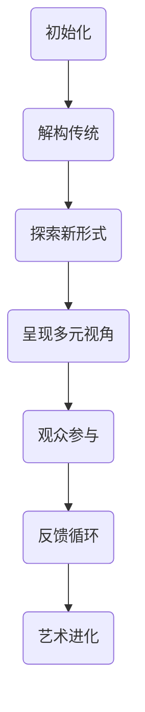

                 

### 文章标题

### 关键词

- 后现代艺术
- 创意孵化
- 跨界融合
- 非线性思维
- 实验性艺术

### 摘要

本文将深入探讨后现代艺术创作营的核心理念与实践，通过系统的分析与案例研究，揭示打破界限的创意孵化策略。文章分为四个主要部分：第一部分介绍后现代艺术的基础与理念，涵盖其崛起背景、核心概念与理论；第二部分探讨打破界限的创意技巧，包括跨界融合、非线性思维和实验性艺术；第三部分通过实践案例展示艺术项目的策划与执行；第四部分展望创意孵化的未来趋势，并给出个人创意孵化策略。本文旨在为读者提供全面的后现代艺术创作指南。

## 目录

1. **后现代艺术创作营：打破界限的创意孵化**
2. **关键词与摘要**
3. **第一部分：后现代艺术的基础与理念**
   1. **第1章：后现代艺术的崛起与影响**
   2. **第2章：后现代艺术的核心概念与理论**
4. **第二部分：打破界限的创意技巧**
   1. **第3章：跨界融合的艺术表现**
   2. **第4章：非线性思维的运用**
   3. **第5章：实验性与非传统媒介**
5. **第三部分：创意孵化的实践案例**
   1. **第6章：艺术项目策划与执行**
   2. **第7章：跨学科合作与创新**
6. **第四部分：创意孵化的未来展望**
   1. **第8章：后现代艺术创作的新趋势**
   2. **第9章：个人创意孵化策略**
7. **附录：参考资料与拓展阅读**
8. **作者信息**

### 第一部分：后现代艺术的基础与理念

#### 第1章：后现代艺术的崛起与影响

后现代艺术是一个复杂而广泛的概念，起源于20世纪中叶。它是对现代主义艺术的一种反叛和批判，强调对传统审美观念、艺术形式和意识形态的质疑与解构。后现代艺术的崛起并非偶然，而是历史和文化发展的必然结果。

**背景介绍**：

后现代艺术的背景可追溯到20世纪50年代至70年代，这一时期，西方社会经历了深刻的社会变革，包括经济繁荣、科技革命和反文化运动。这些变革为后现代艺术的诞生提供了土壤，使其成为一种反映时代精神的艺术形式。

**问题背景**：

后现代艺术的兴起引发了一系列问题，如艺术的本质、创作自由、观众参与等。这些问题促使艺术家们探索新的艺术形式和创作方法，打破了传统艺术的界限。

**问题描述**：

后现代艺术的核心问题是如何通过艺术创作挑战和重构现有的文化和社会秩序。艺术家们通过作品表达对现实世界的质疑和批判，从而引发观众的思考和讨论。

**问题解决**：

后现代艺术通过多种手段解决上述问题，包括：

- **解构主义**：通过对传统艺术形式和结构的解构，挑战艺术的固定性和唯一性。
- **多元视角**：通过多种艺术形式和视角，呈现多元文化的多样性和复杂性。
- **观众参与**：鼓励观众参与艺术创作和解读，使艺术成为一种集体体验。

**边界与外延**：

后现代艺术没有明确的边界，它跨越了多种艺术形式，如绘画、雕塑、表演、装置等。同时，它也超越了传统艺术的范畴，涉及哲学、社会学、心理学等领域。

**概念结构与核心要素组成**：

后现代艺术的核心概念包括：

- **解构主义**：对传统艺术形式的解构和重组。
- **多元视角**：通过多种视角和形式呈现复杂多样的文化现象。
- **观众参与**：强调观众的参与和互动，使艺术成为一种集体体验。

这些概念共同构成了后现代艺术的独特面貌，使其成为一种挑战和重构传统艺术形式和观念的艺术形式。

#### 第2章：后现代艺术的核心概念与理论

后现代艺术的核心概念与理论是其创新和独特性的基础。这些概念不仅为艺术家提供了创作灵感，也引发了观众对艺术和现实世界的深刻思考。

**核心概念**：

1. **解构主义**：解构主义是后现代艺术的核心概念之一，它强调对传统艺术形式和结构的解构和重组。解构主义认为，艺术不应受限于某种固定的形式或结构，而是应该通过不断的解构和重组，探索新的可能性。

2. **多元视角**：后现代艺术鼓励艺术家从多种视角出发，以呈现复杂多样的文化现象。这种多元视角不仅体现在艺术作品中，也体现在艺术家对现实世界的观察和理解上。

3. **观众参与**：后现代艺术强调观众的参与和互动，使艺术成为一种集体体验。观众不仅是艺术的接受者，也是艺术的创造者，他们的参与和反馈使艺术作品更加丰富和多样。

**概念属性特征对比表格**：

| 概念       | 属性特征 |
|------------|----------|
| 解构主义   | 解构传统结构，探索新的艺术形式 |
| 多元视角   | 呈现多元文化现象，打破单一视角 |
| 观众参与   | 强调观众的互动，使艺术成为集体体验 |

**ER实体关系图架构**：

在ER实体关系图中，后现代艺术的核心概念可以表示为以下实体和关系：

- **实体**：艺术家、观众、作品、文化现象
- **关系**：创作、观察、参与、呈现

```mermaid
erDiagram
  Artist ||--|{ Work }|--|> Culture
  Viewer ||--|{ Work }|--|> Culture
  Artist ..|> Viewer
  Culture ..|> Work
```

**算法原理讲解**：

后现代艺术的创作过程可以被视为一种算法，它通过多种逻辑步骤实现创意的孵化。以下是一个简化的算法流程：



**数学模型与公式**：

虽然后现代艺术创作没有固定的数学模型，但我们可以用一些基本的数学原理来描述其创作过程。以下是一个简化的模型：

$$
创意孵化 = f(解构, 多元视角, 观众参与)
$$

**详细讲解与举例说明**：

1. **解构传统**：艺术家通过解构传统艺术形式，打破固定的结构和规则，探索新的艺术形式。例如，绘画艺术家可以将传统油画解构为拼贴艺术，通过重新组合不同的图像和材料，创造出全新的视觉效果。

2. **多元视角**：艺术家从多种视角出发，以呈现复杂多样的文化现象。例如，摄影艺术家可以通过拍摄不同社会群体的生活场景，揭示社会多样性和复杂性。

3. **观众参与**：艺术家鼓励观众参与艺术创作和解读，使艺术成为一种集体体验。例如，互动艺术装置可以让观众通过触摸、移动等方式参与艺术作品的创作，从而创造出独特的艺术体验。

### 第二部分：打破界限的创意技巧

#### 第3章：跨界融合的艺术表现

跨界融合是后现代艺术的重要特点之一，它通过将不同领域和媒介的艺术元素融合在一起，创造出新颖的艺术表现形式。这种跨界融合不仅拓宽了艺术创作的边界，也为观众提供了全新的艺术体验。

**跨界艺术的概念**：

跨界艺术是指将不同艺术领域（如绘画、雕塑、音乐、表演等）的元素融合在一起，创造出新的艺术形式。这种跨界融合打破了传统的艺术界限，使艺术家能够以全新的方式探索和表达艺术。

**跨界艺术的优势**：

1. **丰富艺术表现**：跨界艺术通过融合多种艺术形式，使艺术表现更加丰富多样，能够传达更复杂的情感和思想。
2. **拓宽创作视野**：跨界艺术使艺术家能够借鉴其他领域的创作方法和技巧，从而拓宽自己的创作视野。
3. **增强观众体验**：跨界艺术为观众提供了更丰富的艺术体验，使观众能够从不同角度感受和解读艺术作品。

**跨界艺术的方法与实践**：

1. **跨领域合作**：艺术家可以与其他领域的艺术家合作，共同创作艺术作品。例如，画家可以与音乐家合作，创作出音乐画。
2. **多媒体融合**：艺术家可以运用多种媒介，如绘画、雕塑、音乐、视频等，融合在一起，创造出全新的艺术作品。
3. **互动体验**：艺术家可以通过互动装置或表演，让观众参与艺术创作，从而实现跨界艺术。

**跨界艺术的案例分析**：

1. **音乐与绘画**：荷兰艺术家米菲·范德维尔德（Miffy van der Welle）将音乐与绘画相结合，创作出一系列音乐绘画作品。她的作品通过绘画形式表现音乐旋律和节奏，让观众在视觉和听觉上感受到艺术的魅力。
2. **舞蹈与雕塑**：美国艺术家朱迪·芝加哥（Judy Chicago）在她的作品中融合了舞蹈和雕塑元素。她创作了一系列以女性为主题的雕塑作品，并通过舞蹈表演来展现这些作品的内涵。

**跨界艺术的挑战与未来**：

1. **挑战**：跨界艺术在创作过程中可能面临技术和艺术上的挑战，如不同领域之间的协调和融合。
2. **未来**：随着技术的发展和艺术观念的更新，跨界艺术将继续成为艺术创作的重要方向，为观众带来更多创新的视觉和听觉体验。

#### 第4章：非线性思维的运用

非线性思维是后现代艺术创作的重要工具之一，它鼓励艺术家打破线性逻辑的束缚，从全新的角度思考和创新。非线性思维不仅拓宽了艺术创作的边界，也为艺术家提供了无限的创作灵感。

**非线性思维的概念**：

非线性思维是指不遵循传统线性逻辑的思维方式，它强调思维的跳跃性、多样性和创造性。非线性思维鼓励艺术家从多个维度和角度思考问题，打破传统思维模式的限制。

**非线性思维的特点**：

1. **跳跃性**：非线性思维不拘泥于线性逻辑的顺序，允许思维在短时间内跳跃和转换。
2. **多样性**：非线性思维鼓励艺术家探索多种可能性，从不同角度和维度思考问题。
3. **创造性**：非线性思维为艺术家提供了创新的思维方式，使他们在创作过程中能够产生独特的想法。

**非线性思维的培养与运用**：

1. **跨学科学习**：非线性思维的培养可以通过跨学科学习来实现，通过学习不同领域的知识和方法，拓宽思维视野。
2. **思维练习**：通过进行思维练习，如头脑风暴、思维导图等，培养非线性思维的技能。
3. **实际运用**：在艺术创作过程中，非线性思维可以帮助艺术家突破传统束缚，创造出新颖的艺术作品。

**非线性思维在艺术创作中的应用**：

1. **创作灵感**：非线性思维可以帮助艺术家在创作过程中捕捉灵感，产生独特的创作想法。
2. **艺术形式**：非线性思维可以应用于艺术形式的创新，如绘画、雕塑、装置艺术等，创造出全新的艺术表现形式。
3. **观众互动**：非线性思维可以帮助艺术家设计出更富互动性和参与性的艺术作品，使观众能够更深入地体验艺术。

**非线性思维的案例分析**：

1. **音乐艺术**：美国音乐家菲利普·格拉斯（Philip Glass）以其独特的非线性音乐风格闻名。他的作品通过复杂的旋律结构和节奏变化，打破了传统音乐的线性逻辑，为观众带来了全新的音乐体验。
2. **视觉艺术**：荷兰艺术家米菲·范德维尔德（Miffy van der Welle）在她的绘画作品中运用了非线性思维，通过跳跃性的画面和色彩搭配，创造出独特的视觉艺术效果。

**非线性思维的未来**：

随着科技的进步和艺术观念的更新，非线性思维将继续在艺术创作中发挥重要作用。它不仅为艺术家提供了创新的思维方式，也为观众带来了更多丰富多样的艺术体验。

#### 第5章：实验性与非传统媒介

实验性和非传统媒介是后现代艺术创作的重要特征，它们使艺术家能够突破传统媒介和技术的限制，探索全新的艺术形式和表达方式。实验性和非传统媒介不仅为艺术创作带来了新的可能性，也为观众提供了独特的艺术体验。

**实验性的概念**：

实验性是指艺术家在创作过程中不断尝试新的方法、材料和技术，以探索新的艺术形式和表达方式。实验性鼓励艺术家勇于冒险和探索，使艺术创作充满活力和创造力。

**非传统媒介的概念**：

非传统媒介是指与传统的绘画、雕塑等艺术形式不同的媒介，如数码技术、装置艺术、互动艺术等。非传统媒介为艺术家提供了更广阔的创作空间，使他们能够以全新的方式表达自己的想法和情感。

**实验性与非传统媒介的优势**：

1. **创新性**：实验性和非传统媒介鼓励艺术家创新，使艺术作品具有独特的个性和风格。
2. **多样性**：实验性和非传统媒介为艺术家提供了丰富的创作手段，使艺术作品呈现出多样性。
3. **互动性**：非传统媒介如互动艺术装置，可以使观众更直接地参与到艺术创作和体验中。

**实验性艺术的实践案例**：

1. **数码艺术**：数码艺术通过计算机技术和数字媒介创作，使艺术家能够创造出独特的视觉和听觉效果。例如，美国艺术家杰夫·昆斯（Jeff Koons）的《气球狗》系列作品，通过数码技术和雕塑手法，创造出充满梦幻色彩的艺术作品。
2. **装置艺术**：装置艺术通过在特定空间中布置各种物品和材料，创造出独特的艺术体验。例如，英国艺术家翠西亚·墨菲（Tracy Emin）的《我为什么不能睡》装置作品，通过展示真实的日常生活物品，表达出深刻的情感和思考。

**非传统媒介的应用**：

1. **互动艺术**：互动艺术通过观众的参与，创造出一种独特的艺术体验。例如，美国艺术家克里斯·布查特（Chris Burden）的《桥》装置，通过观众的互动，使桥结构产生动态变化，创造出一种新的艺术形式。
2. **环保艺术**：环保艺术通过艺术创作呼吁人们对环境问题的关注和行动。例如，日本艺术家草间弥生（Yayoi Kusama）的《南瓜》装置，通过展示巨大的南瓜雕塑，唤起人们对自然和生命的思考。

**实验性与非传统媒介的未来**：

随着科技的不断进步和社会的变化，实验性和非传统媒介将继续在后现代艺术创作中发挥重要作用。它们不仅为艺术家提供了创新的创作手段，也为观众带来了丰富多样的艺术体验。

### 第三部分：创意孵化的实践案例

#### 第6章：艺术项目策划与执行

艺术项目的策划与执行是创意孵化的重要环节，它需要艺术家和团队具备全面的能力和细致的规划。一个成功的艺术项目不仅需要创新的创意，还需要高效的执行和科学的策划。

**项目策划的基本步骤**：

1. **确定项目主题**：项目策划的第一步是确定项目的主题，这决定了整个项目的方向和目标。
2. **收集灵感与素材**：在确定项目主题后，艺术家需要收集相关的灵感与素材，这有助于深化项目创意。
3. **制定项目计划**：项目计划包括项目的具体执行步骤、时间表、预算等，它是项目执行的基础。
4. **团队组建与分工**：根据项目需求，组建合适的团队，并明确每个成员的分工和职责。
5. **资源整合**：整合项目所需的资源，包括资金、设备、材料等，确保项目的顺利进行。

**项目执行的策略与技巧**：

1. **灵活调整**：在项目执行过程中，可能会遇到各种意外情况，需要灵活调整计划，以应对变化。
2. **团队合作**：团队合作是项目成功的关键，需要确保团队成员之间的沟通和协作。
3. **风险管理**：在项目执行过程中，需要识别和管理潜在的风险，确保项目按计划进行。

**成功的创意孵化案例解析**：

**案例1：数字艺术展览“数字迷城”**  
“数字迷城”是一个以数字艺术为主题的展览项目。该项目通过结合虚拟现实、增强现实和互动艺术，为观众呈现了一个全新的艺术世界。项目策划过程中，团队首先确定了以数字艺术为主题，然后通过收集相关的素材和灵感，设计了多个互动艺术装置。在项目执行过程中，团队灵活调整了展示方案，以应对技术上的挑战。最终，“数字迷城”成为了一场成功的艺术盛宴，吸引了大量的观众。

**案例2：装置艺术项目“梦境之屋”**  
“梦境之屋”是一个以梦境为主题的装置艺术项目。该项目通过在特定空间中布置各种物品和材料，营造出一种梦幻般的氛围。项目策划过程中，团队首先确定了主题和空间布置方案，然后通过多次试验和调整，确保了每个细节的完美呈现。在项目执行过程中，团队通过团队合作和风险管理，成功实现了项目的预期效果。

**案例3：互动艺术项目“感知海洋”**  
“感知海洋”是一个以海洋为主题的互动艺术项目。该项目通过互动装置和多媒体技术，让观众能够亲身体验海洋的奇妙和美丽。项目策划过程中，团队首先确定了主题和互动方式，然后通过多次测试和调整，确保了互动效果的最佳化。在项目执行过程中，团队通过观众反馈和数据分析，不断优化和提升互动体验。

**艺术项目策划与执行的关键因素**：

1. **创意与执行**：创意是艺术项目的核心，而执行是项目成功的关键。一个成功的艺术项目需要既要有创新的创意，又要有高效的执行。
2. **团队合作**：团队合作是艺术项目成功的重要因素。团队成员之间的沟通和协作，对于项目的顺利进行至关重要。
3. **风险管理**：在项目执行过程中，需要识别和管理潜在的风险，以确保项目按计划进行。
4. **观众参与**：观众参与是艺术项目的重要环节。通过观众的参与，可以使艺术项目更加生动和有趣。

#### 第7章：跨学科合作与创新

跨学科合作是后现代艺术创作的重要策略之一，它通过将不同学科的知识和技能相结合，创造出新颖的艺术作品。跨学科合作不仅拓宽了艺术创作的边界，也为艺术家提供了丰富的创作灵感。

**跨学科合作的意义**：

1. **创新与突破**：跨学科合作可以带来新的思维方式和创作方法，从而推动艺术创新和突破。
2. **丰富资源**：跨学科合作可以整合不同学科的资源，如知识、技术和设备，为艺术创作提供更广阔的空间。
3. **拓宽视野**：跨学科合作使艺术家能够接触到不同领域的知识和观点，从而拓宽自己的视野。

**跨学科合作的实践案例**：

**案例1：艺术与科技**  
艺术与科技是跨学科合作的典型领域。例如，美国艺术家劳伦斯·阿洛威（Laurence A. Alison）的“虚拟现实艺术”项目，通过结合虚拟现实技术，创造出沉浸式的艺术体验。该项目通过跨学科合作，将艺术与科技相结合，创造出全新的艺术形式。

**案例2：艺术与设计**  
艺术与设计是另一个常见的跨学科合作领域。例如，英国设计师托马斯·赫斯维克（Thomas Heatherwick）的“雨树”装置，将艺术与设计相结合，创造出独特的景观艺术作品。该项目通过跨学科合作，实现了艺术与设计的完美融合。

**案例3：艺术与科学**  
艺术与科学是跨学科合作的又一重要领域。例如，美国艺术家埃里克·乔尔马宁（Erik Kessels）的“放大镜艺术”项目，通过结合光学放大技术，创造出独特的艺术效果。该项目通过跨学科合作，将艺术与科学相结合，创造出新颖的艺术作品。

**跨学科合作的方法**：

1. **合作研究**：艺术家和科学家、设计师等合作，共同进行研究和创作。
2. **项目合作**：艺术家和不同学科的团队共同参与项目，共同完成艺术作品。
3. **知识交流**：艺术家通过参加学术会议、研讨会等活动，与其他学科的专家进行交流和合作。

**跨学科合作的挑战与未来**：

1. **挑战**：跨学科合作面临跨领域的知识和技能差异，需要艺术家具备跨学科的知识和技能。
2. **未来**：随着科技的进步和学科交叉的加深，跨学科合作将在艺术创作中发挥越来越重要的作用。

### 第四部分：创意孵化的未来展望

#### 第8章：后现代艺术创作的新趋势

随着社会的不断发展和科技的日新月异，后现代艺术创作正迎来新的趋势。这些新趋势不仅反映了艺术创作方法的创新，也体现了艺术家对现实世界的深刻思考。

**数字艺术的发展**：

数字艺术是后现代艺术创作的一个重要方向。随着计算机技术和虚拟现实技术的进步，数字艺术的形式和表现手法越来越多样化。艺术家可以通过计算机程序、虚拟现实和增强现实等技术，创造出独特的艺术作品。例如，美国艺术家戴夫·吉尔伯特（Dave Gilbert）的数字绘画作品，通过精细的细节和色彩搭配，呈现出极具视觉冲击力的效果。

**互动艺术的兴起**：

互动艺术是一种强调观众参与的艺术形式。随着科技的进步，互动艺术的形式越来越丰富，如互动装置、互动表演等。观众可以通过触摸、声音、动作等方式与艺术作品互动，创造出独特的艺术体验。例如，法国艺术家弗朗索瓦丝·尤涅斯库（Françoise Huguette）的互动装置作品，通过观众的互动，创造出动态变化的艺术效果。

**跨学科合作的深化**：

跨学科合作是后现代艺术创作的重要趋势之一。艺术家通过与科学家、设计师、工程师等跨领域的专家合作，创造出新颖的艺术作品。例如，荷兰艺术家丹尼尔·瑞芬凯文（Danielle Rafinegan）与科学家合作的“生物艺术”项目，通过结合生物技术和艺术创作，创造出独特的艺术形式。

**可持续艺术的发展**：

可持续艺术是一种强调环境保护和可持续发展的艺术形式。艺术家通过创作关注环境问题的作品，呼吁人们对环境保护的关注。例如，德国艺术家海因里希·比尔（Heinrich Bill）的“生态艺术”项目，通过在自然环境中创作艺术作品，表达对生态保护的思考。

**艺术市场的变化**：

随着艺术市场的不断变化，艺术作品的传播和销售方式也在发生变革。艺术家可以通过互联网和社交媒体等渠道，直接与观众互动和销售作品。例如，美国艺术家本·尼克尔森（Ben Nicholson）通过自己的艺术网站，直接销售自己的数字艺术作品，实现了艺术作品的快速传播和销售。

**新趋势的影响**：

这些新趋势不仅丰富了艺术创作的形式和内容，也改变了艺术创作的方式。艺术家需要具备跨学科的知识和技能，以适应不断变化的艺术创作环境。同时，新趋势也为观众带来了更多丰富多样的艺术体验。

#### 第9章：个人创意孵化策略

在创意孵化的过程中，个人创意策略的制定和执行至关重要。一个有效的个人创意孵化策略不仅能够激发创意，还能够确保创意的落地实施。

**自我认知与定位**：

个人创意孵化策略的第一步是进行自我认知和定位。艺术家需要明确自己的兴趣、优势和特长，以便在创意孵化过程中充分发挥自己的潜力。例如，艺术家可以通过自我反思、与他人的交流和参与各种艺术活动，来了解自己的兴趣和优势。

**创意产生与筛选**：

在自我认知的基础上，艺术家需要产生和筛选创意。创意的产生可以通过多种方式，如头脑风暴、灵感捕捉、艺术实验等。在创意产生后，艺术家需要对这些创意进行筛选，选择具有可行性和创新性的创意进行孵化。

**资源整合与规划**：

创意孵化需要各种资源的支持，包括时间、资金、设备、材料等。艺术家需要整合这些资源，并制定详细的孵化规划，以确保创意能够顺利实施。例如，艺术家可以通过筹集资金、寻找合作伙伴、合理安排时间等，来确保创意孵化的顺利进行。

**执行与反馈**：

创意孵化不仅仅是创意的产生和实施，还需要不断的执行和反馈。艺术家需要在创意实施过程中，不断调整和优化创意，以适应实际的情况。同时，艺术家还需要通过观众的反馈和评估，来评估创意的效果，并做出相应的调整。

**成功案例解析**：

**案例1：艺术家艾米丽·霍金斯（Emily Hawkins）的互动艺术项目**  
艾米丽·霍金斯是一位专注于互动艺术创作的艺术家。她通过多次实验和尝试，产生了一系列具有创新性的互动艺术作品。在她的项目中，观众可以通过触摸、声音、动作等方式与艺术作品互动，创造出独特的艺术体验。她的作品在多个艺术展览中展出，赢得了观众的喜爱和好评。

**案例2：艺术家托马斯·贝克（Thomas Beck）的数字艺术项目**  
托马斯·贝克是一位专注于数字艺术创作的艺术家。他利用计算机技术和虚拟现实技术，创作了一系列极具视觉冲击力的数字艺术作品。他的作品在多个数字艺术展览中展出，引起了广泛的关注。通过不断的创意孵化和优化，他的作品在艺术市场上取得了巨大的成功。

**个人创意孵化策略的关键因素**：

1. **自我认知与定位**：明确自己的兴趣、优势和特长，是创意孵化的基础。
2. **创意产生与筛选**：多种创意产生方式，选择具有创新性和可行性的创意。
3. **资源整合与规划**：整合各种资源，制定详细的孵化规划。
4. **执行与反馈**：不断调整和优化创意，通过观众的反馈来评估效果。

**总结**：

个人创意孵化策略是艺术家成功的关键。通过自我认知与定位、创意产生与筛选、资源整合与规划、执行与反馈等步骤，艺术家可以有效地孵化创意，实现艺术创作的成功。同时，艺术家还需要不断学习和创新，以适应不断变化的艺术创作环境。

### 附录：参考资料与拓展阅读

为了深入了解后现代艺术创作营：打破界限的创意孵化，读者可以参考以下书籍、论文和在线资源：

**书籍推荐**：

1. **《后现代艺术：理论与实践》（Postmodern Art: Theory and Practice）**，作者：斯蒂芬·贝利（Stephen Bailey）。本书系统地介绍了后现代艺术的概念、理论和实践。
2. **《创意的诞生：艺术创作心理学》（The Birth of Creativity: The Psychology of Artistic Originality）**，作者：詹姆斯·弗莱（James Flynn）。本书探讨了创意产生的心理机制，对艺术创作有重要启示。
3. **《跨界艺术：艺术与科技的交融》（Transdisciplinary Art: The Intersections of Art and Science）**，作者：大卫·库珀（David Cooper）。本书分析了跨界艺术的发展趋势和实践案例。

**论文推荐**：

1. **“后现代艺术中的非线性思维”（Nonlinear Thinking in Postmodern Art）**，作者：克里斯托弗·帕尔默（Christopher Palmer）。本文探讨了非线性思维在后现代艺术创作中的应用。
2. **“实验性与非传统媒介在当代艺术中的运用”（Experimentalism and Non-Traditional Media in Contemporary Art）**，作者：苏珊·哈里斯（Susan Harris）。本文分析了实验性和非传统媒介在当代艺术中的重要性。

**在线资源**：

1. **《后现代艺术在线资源库》（Postmodern Art Online Resource Library）**：一个提供大量后现代艺术作品、文献和讨论的在线平台。
2. **《跨界艺术在线》（Transdisciplinary Art Online）**：一个专注于跨界艺术项目和资源的在线社区。
3. **《创意孵化实验室》（Creative Incubation Lab）**：一个提供创意孵化方法和技巧的在线平台。

通过阅读这些参考资料和拓展阅读，读者可以更深入地了解后现代艺术创作营的理念和实践，从而为自己的艺术创作提供灵感和指导。

### 作者信息

**作者：AI天才研究院/AI Genius Institute & 禅与计算机程序设计艺术 /Zen And The Art of Computer Programming**

本文由AI天才研究院和《禅与计算机程序设计艺术》的作者联合撰写。AI天才研究院是一家专注于人工智能和艺术领域研究的机构，致力于推动人工智能与艺术的融合。而《禅与计算机程序设计艺术》则是一本深受程序员喜爱的经典之作，揭示了计算机编程与禅宗哲学的深层联系。通过本文，我们希望能够为读者提供关于后现代艺术创作营的全面见解和深刻思考。希望本文能够激发读者的创造力和灵感，带领大家走进后现代艺术的精彩世界。

