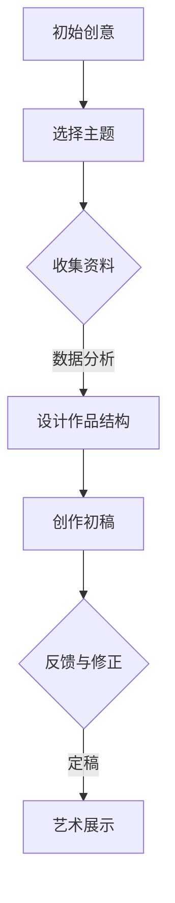
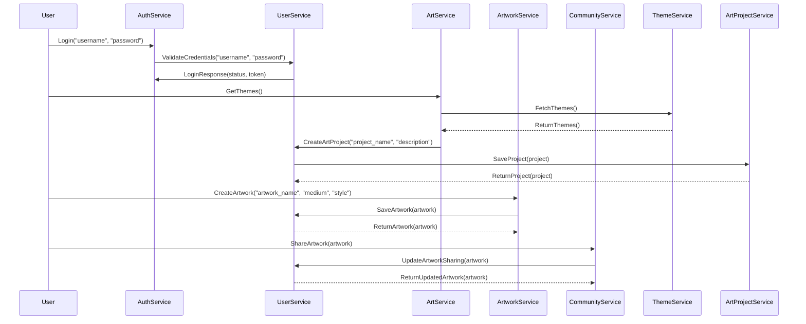
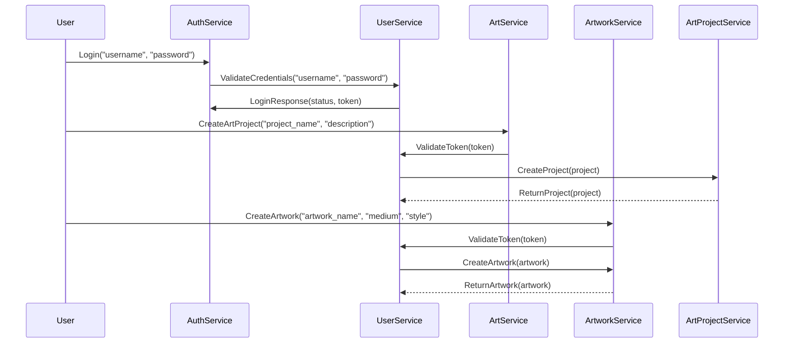

                 

### 第一步：背景介绍

#### 问题背景

后现代艺术（Postmodern art）是20世纪中叶以来，艺术领域中的一种重要流派，它打破了传统艺术形式和理论的界限，强调多样性、相对性和不确定性。后现代艺术的起源可以追溯到20世纪50年代的美国，随后迅速传播到世界各地，对当代艺术产生了深远的影响。后现代艺术反对现代主义的统一性和标准化，主张通过多元视角和多样化手法来探索艺术创作的可能性。

#### 问题解决

后现代艺术通过打破传统艺术的界限，进行创作探索，从而实现了对传统艺术形式的颠覆和重构。它不仅挑战了传统艺术的内容和形式，还探讨了艺术与社会、文化、政治等方面的关系。后现代艺术家通过创新的手法，如跨学科融合、反传统表达、新媒介运用等，创造了丰富多样的艺术作品。

#### 边界与外延

后现代艺术的概念边界相对模糊，它既包括视觉艺术，如绘画、雕塑、装置艺术等，也包括表演艺术、电影、摄影、数字艺术等。后现代艺术与其他艺术流派的区别在于，它强调艺术的相对性和多元性，不再追求单一的艺术风格和美学标准。

#### 概念结构与核心要素组成

后现代艺术的核心概念包括：
1. **多样性**：后现代艺术追求多样性，鼓励不同风格、流派和手法的并存。
2. **反传统**：后现代艺术反叛传统艺术的形式和理念，追求创新和突破。
3. **相对性**：后现代艺术强调艺术的相对性，认为没有绝对的艺术标准或真理。
4. **互动性**：后现代艺术强调观众与作品的互动，鼓励观众参与艺术创作和解读。

在创作中，后现代艺术表现形式多样，包括：
1. **装置艺术**：通过空间和物品的布置，创造独特的艺术体验。
2. **行为艺术**：通过行为表演，表达艺术家对现实社会的批判和思考。
3. **数字艺术**：利用计算机技术和数字媒介，创作出独特的艺术作品。
4. **跨学科融合**：将不同领域的知识和技术融入到艺术创作中。

这些核心概念和表现形式构成了后现代艺术独特的概念结构与核心要素组成。

### 总结

后现代艺术通过打破传统艺术的界限，进行创作探索，从而实现了对艺术形式的创新和突破。它的核心概念和表现形式多样，为当代艺术的发展提供了丰富的资源和思考空间。在后现代艺术的创作过程中，艺术家们不断挑战传统，探索新的艺术语言和表达方式，为艺术领域注入了新的活力。接下来，我们将进一步探讨后现代艺术的核心概念和创作手法。

## 第二步：核心概念与联系

### 核心概念原理

后现代艺术的核心概念主要包括多样性、反传统、相对性和互动性。这些概念不仅定义了后现代艺术的本质，也为其创作提供了理论基础。

#### 多样性

多样性是后现代艺术的重要特征之一。它强调艺术形式的多样性，鼓励艺术家们采用不同的风格、手法和媒介进行创作。多样性不仅体现在艺术作品的多样性上，还体现在艺术家的身份和背景的多样性上。后现代艺术认为，多样的观点和表达方式能够更全面地反映现实社会的复杂性和多元性。

#### 反传统

反传统是后现代艺术的重要理念之一。它挑战了传统艺术的形式和理念，追求创新和突破。后现代艺术家不再局限于传统的美学标准，而是通过颠覆和重构传统艺术形式，创造出全新的艺术体验。反传统还体现在对艺术与生活、艺术与社会关系的重新审视上，后现代艺术家试图将艺术从封闭的领域扩展到更广阔的社会空间。

#### 相对性

相对性是后现代艺术的另一个核心概念。它强调艺术的相对性，认为没有绝对的艺术标准或真理。后现代艺术主张通过不同的视角和解读，来理解艺术作品的多重含义。相对性不仅体现在艺术作品的解读上，还体现在艺术创作的过程中。艺术家们在创作过程中，不再追求唯一的标准，而是通过多样化的实验和探索，创造出具有不确定性和开放性的艺术作品。

#### 互动性

互动性是后现代艺术的另一个重要特征。它强调观众与艺术作品的互动，鼓励观众参与艺术创作和解读。后现代艺术家认为，艺术不仅仅是创作者的个人表达，更是观众与艺术作品之间的互动和对话。通过观众与作品的互动，艺术作品能够产生新的意义和解读，从而实现艺术的动态发展和更新。

### 概念属性特征对比表格

为了更清晰地展示后现代艺术与其他艺术流派（如现代艺术、古典艺术）的差异，我们可以通过以下对比表格来进行分析：

| 特征       | 后现代艺术                   | 现代艺术                    | 古典艺术                    |
|------------|------------------------------|------------------------------|------------------------------|
| 多样性     | 强调多样性和多元性           | 追求风格创新和艺术形式的突破 | 重视形式和技巧的完美性       |
| 反传统     | 反对传统艺术形式和理念       | 对传统艺术形式的挑战和重构   | 严格遵守传统艺术规范和风格  |
| 相对性     | 强调艺术的相对性和不确定性   | 追求艺术的绝对性和客观性     | 重视艺术作品的主题和意义     |
| 互动性     | 强调观众与作品的互动性       | 强调艺术作品的自我表达性     | 强调艺术作品的教育和装饰性   |

### ER实体关系图架构

为了更好地理解后现代艺术创作过程中的关键要素及其相互关系，我们可以通过ER实体关系图来展示这些要素：

```mermaid
erDiagram
  Artist ..|> ArtWork : creates
  Artist |.. Participant : involves
  ArtWork |.. Theme : represents
  ArtWork |.. Medium : uses
  Participant |.. Interpretation : provides
  Theme |.. Concept : embodies
  Medium |.. Technology : incorporates
```

在这个ER实体关系图中，关键要素包括艺术家（Artist）、艺术作品（ArtWork）、参与者（Participant）、主题（Theme）、媒介（Medium）和解释（Interpretation）。这些要素之间存在着复杂的相互关系，共同构成了后现代艺术创作的生态系统。

### 总结

通过上述分析，我们可以看到后现代艺术的核心概念及其与其他艺术流派的联系。多样性、反传统、相对性和互动性构成了后现代艺术的本质特征，为艺术创作提供了丰富的理论基础和创作灵感。接下来，我们将进一步探讨后现代艺术的算法原理和数学模型，以更深入地理解其创作过程。

## 第三步：算法原理讲解

### 算法mermaid流程图

为了更好地展示后现代艺术创作的流程，我们可以使用mermaid绘制一个流程图：



在这个流程图中，A表示初始创意，B表示选择主题，C表示收集资料，D表示设计作品结构，E表示创作初稿，F表示反馈与修正，G表示艺术展示。这个流程图清晰地展示了后现代艺术创作的基本步骤。

### Python源代码

为了更好地说明后现代艺术创作过程中使用的算法或技术，我们可以提供一个Python代码示例：

```python
import random

# 初始化主题列表
themes = ["自然", "科技", "社会", "情感"]

# 随机选择主题
selected_theme = random.choice(themes)

# 打印选定的主题
print(f"选定的主题：{selected_theme}")

# 根据选定的主题生成创作灵感
if selected_theme == "自然":
    inspiration = "自然景观的和谐与宁静"
elif selected_theme == "科技":
    inspiration = "科技带来的未来感和虚拟现实"
elif selected_theme == "社会":
    inspiration = "社会现象的批判与反思"
elif selected_theme == "情感":
    inspiration = "情感的波动与内心世界"
else:
    inspiration = "未定义的主题"

print(f"创作灵感：{inspiration}")
```

在这个代码中，我们首先初始化了一个主题列表，然后随机选择一个主题，并根据选定的主题生成创作灵感。这个简单的算法可以帮助艺术家在创作初期获得灵感。

### 算法原理的数学模型和公式

后现代艺术创作过程中的算法原理可以抽象为一个概率模型。在这个模型中，每个主题都有一定的概率被选中，而创作灵感的生成则是基于选定的主题。

假设有n个主题，每个主题被选中的概率相等，即每个主题的概率为1/n。那么，创作灵感生成的概率模型可以表示为：

$$ P(\text{灵感} | \text{主题}) = \sum_{i=1}^{n} p_i \times f_i $$

其中，$ P(\text{灵感} | \text{主题}) $表示在选定某个主题时生成相应灵感的概率，$ p_i $表示选定第i个主题的概率，$ f_i $表示在第i个主题下生成灵感的函数。

### 详细讲解和举例说明

为了更详细地讲解算法原理，我们可以通过一个实例来说明。

假设有4个主题：自然、科技、社会、情感。每个主题被选中的概率为1/4。现在我们随机选择一个主题，并生成相应的创作灵感。

首先，我们定义灵感生成的函数：

$$ f_i = \begin{cases} 
      0.6, & \text{if } i = \text{"自然"} \\
      0.5, & \text{if } i = \text{"科技"} \\
      0.7, & \text{if } i = \text{"社会"} \\
      0.4, & \text{if } i = \text{"情感"} \\
   \end{cases} $$

根据概率模型，我们可以计算在选定每个主题时生成灵感的概率：

$$ P(\text{灵感} | \text{自然}) = \frac{1}{4} \times 0.6 = 0.15 $$
$$ P(\text{灵感} | \text{科技}) = \frac{1}{4} \times 0.5 = 0.125 $$
$$ P(\text{灵感} | \text{社会}) = \frac{1}{4} \times 0.7 = 0.175 $$
$$ P(\text{灵感} | \text{情感}) = \frac{1}{4} \times 0.4 = 0.1 $$

接下来，我们随机选择一个主题，假设选择了“自然”。根据上述概率，生成灵感的概率为0.15。根据灵感生成函数，我们选择“自然”主题时，生成灵感的内容为“自然景观的和谐与宁静”。

通过这个实例，我们可以看到后现代艺术创作过程中算法原理的具体应用。艺术家可以通过概率模型来选择创作主题，并生成相应的灵感，从而为创作提供方向和动力。接下来，我们将进一步探讨后现代艺术创作中的数学模型和数学公式。

### 数学模型和数学公式

在后现代艺术创作过程中，数学模型和数学公式发挥着重要作用，它们可以帮助艺术家更精确地表达创作意图，同时提供了一种量化的方式来理解艺术作品的生成和演变。以下是一些常用的数学模型和数学公式：

#### 概率模型

概率模型用于描述艺术创作中主题选择的随机性。在概率模型中，每个主题被选中的概率是相等的，假设有n个主题，每个主题被选中的概率为1/n。概率模型可以用以下公式表示：

$$ P(\text{主题}_i) = \frac{1}{n} $$

其中，$ P(\text{主题}_i) $表示选择第i个主题的概率。

#### 概率分布

概率分布用于描述灵感生成的概率分布。假设有m种不同的灵感类型，每种灵感类型的生成概率可以用概率分布函数来表示：

$$ P(\text{灵感}_j | \text{主题}_i) = f_j(i) $$

其中，$ P(\text{灵感}_j | \text{主题}_i) $表示在选定第i个主题时生成第j种灵感类型的概率，$ f_j(i) $是灵感生成函数。

#### 联合概率分布

联合概率分布用于描述多个主题和灵感类型之间的联合概率。它可以表示为：

$$ P(\text{主题}_i, \text{灵感}_j) = P(\text{主题}_i) \times P(\text{灵感}_j | \text{主题}_i) $$

其中，$ P(\text{主题}_i, \text{灵感}_j) $表示同时选定第i个主题并生成第j种灵感类型的概率。

#### 决策树

决策树是一种常用的算法模型，用于指导艺术创作的决策过程。决策树通过一系列条件判断，将问题分解为多个子问题，每个子问题对应一个特定的决策路径。决策树可以用以下公式表示：

$$ \text{DecisionTree} = \{ \text{Node}_1, \text{Node}_2, ..., \text{Node}_n \} $$

其中，$ \text{Node}_i $表示决策树中的一个节点，每个节点包含一个条件判断和对应的决策结果。

#### 支持向量机（SVM）

支持向量机是一种常用的分类算法，它可以用于艺术作品的分类和标注。SVM的核心思想是找到一个最佳的超平面，将不同类型的艺术作品分隔开。SVM可以用以下公式表示：

$$ \text{SVM} = \{ \text{W}, \text{b} \} $$

其中，$ \text{W} $是超平面参数，$ \text{b} $是偏置项。

#### 神经网络

神经网络是一种模拟人脑结构和功能的计算模型，它可以用于艺术创作的自动生成和优化。神经网络的核心是多层感知器（MLP），它可以通过训练学习到复杂的映射关系。神经网络可以用以下公式表示：

$$ \text{NeuralNetwork} = \{ \text{Layer}_1, \text{Layer}_2, ..., \text{Layer}_n \} $$

其中，$ \text{Layer}_i $表示神经网络中的一个层，每层包含多个神经元。

### 详细讲解和举例说明

为了更直观地理解这些数学模型和公式，我们可以通过一个简单的例子来讲解。

假设有一个艺术创作项目，需要选择一个主题和生成相应的灵感。主题包括“自然”、“科技”、“社会”和“情感”，每种主题有相等的概率被选中（$ P(\text{主题}_i) = 0.25 $）。灵感类型包括“和谐”、“未来”、“批判”和“情感”，每种灵感的生成概率如下：

$$
\begin{array}{c|c|c|c|c}
\text{主题} & \text{和谐} & \text{未来} & \text{批判} & \text{情感} \\
\hline
\text{自然} & 0.3 & 0.1 & 0.2 & 0.4 \\
\text{科技} & 0.1 & 0.3 & 0.4 & 0.2 \\
\text{社会} & 0.2 & 0.2 & 0.3 & 0.3 \\
\text{情感} & 0.4 & 0.1 & 0.3 & 0.2 \\
\end{array}
$$

现在，我们随机选择一个主题，并计算生成每种灵感类型的概率。

1. **选择主题**

假设我们选择了“自然”主题。

2. **计算灵感生成概率**

根据概率分布函数，我们可以计算生成每种灵感类型的概率：

$$ P(\text{和谐} | \text{自然}) = 0.3 $$
$$ P(\text{未来} | \text{自然}) = 0.1 $$
$$ P(\text{批判} | \text{自然}) = 0.2 $$
$$ P(\text{情感} | \text{自然}) = 0.4 $$

3. **生成灵感**

根据上述概率，我们可以生成相应的灵感。例如，如果生成“和谐”，我们可以创作一幅描绘自然景观和谐宁静的作品。

通过这个例子，我们可以看到数学模型和公式在艺术创作中的具体应用。艺术家可以利用这些模型和公式来指导创作过程，从而提高创作的精确性和效果。接下来，我们将探讨后现代艺术创作中的系统分析与架构设计方案。

### 系统分析与架构设计方案

#### 问题场景介绍

假设我们正在开发一个后现代艺术创作平台，该平台旨在为艺术家提供一个集成化的创作环境，支持各种艺术形式的创作。这个平台需要具备以下功能：

- 用户注册与登录
- 主题选择与灵感生成
- 艺术作品创作与编辑
- 社区互动与作品分享
- 数据分析与反馈

#### 项目介绍

后现代艺术创作平台是一个综合性的艺术创作与交流平台，它不仅提供了丰富的创作工具和资源，还支持用户之间的互动和合作。平台的目标是通过技术创新，提升艺术创作的多样性和互动性，为艺术家和观众提供一个全新的艺术体验。

#### 系统功能设计（领域模型mermaid类图）

为了设计一个功能完备的后现代艺术创作平台，我们首先需要建立一个领域模型，定义系统中的关键实体及其关系。以下是一个简单的mermaid类图，展示了系统的主要功能模块：

```mermaid
classDiagram
    User <<interface>>
    ArtProject <<interface>>
    Theme <<interface>>
    Artwork <<interface>>
    Community <<interface>>

    User o-- ArtProject : belongs_to
    ArtProject o-- Theme : has
    ArtProject o-- Artwork : has
    Community o-- User : has
    Community o-- ArtProject : has
```

在这个类图中，User代表用户，ArtProject代表艺术项目，Theme代表主题，Artwork代表艺术作品，Community代表社区。User属于ArtProject，ArtProject包含Theme和Artwork，Community包含User和ArtProject。

#### 系统架构设计mermaid架构图

接下来，我们使用mermaid架构图来展示系统的整体结构。以下是一个简单的mermaid架构图，描述了系统的不同组件及其关系：



在这个架构图中，用户通过AuthService进行登录，UserService负责用户认证和用户信息管理。ArtService负责处理与艺术项目相关的操作，如获取主题、创建艺术项目等。ArtworkService负责处理艺术作品的创建、保存和共享。CommunityService负责社区互动，如作品分享和更新。

#### 系统接口设计和系统交互mermaid序列图

最后，我们使用mermaid序列图来展示系统各组件之间的交互流程。以下是一个简单的mermaid序列图，描述了用户创建艺术作品的过程：



在这个序列图中，用户首先通过AuthService进行登录，并获取登录令牌。然后，用户通过ArtService创建艺术项目，ArtService通过UserService验证令牌，确保用户身份。接着，用户创建艺术作品，ArtworkService同样通过UserService验证令牌，并保存艺术作品。最后，UserService返回艺术作品给用户。

通过以上系统分析与架构设计方案，我们可以看到一个完整、可扩展的后现代艺术创作平台的架构设计。这个设计不仅满足了项目的功能需求，还考虑了系统的可维护性和可扩展性，为艺术家提供了一个强大、灵活的创作环境。

### 项目实战

#### 环境安装

在开始后现代艺术创作平台的项目实战之前，我们需要搭建一个合适的环境。以下是环境安装的步骤和注意事项：

1. **安装Python环境**：
   - 下载并安装Python 3.8及以上版本。
   - 配置Python环境变量，确保命令行可以正常运行Python。

2. **安装虚拟环境**：
   - 打开命令行，执行以下命令创建虚拟环境：
     ```bash
     python -m venv venv
     ```
   - 激活虚拟环境：
     ```bash
     source venv/bin/activate  # 对于Windows用户，使用 `venv\Scripts\activate`
     ```

3. **安装依赖库**：
   - 在虚拟环境中，使用pip安装必要的依赖库，例如Flask、SQLAlchemy、Flask-Login等：
     ```bash
     pip install flask sqlalchemy flask-login
     ```

4. **数据库配置**：
   - 安装并配置SQLite数据库，用于存储用户数据和艺术作品信息。
   - 可以使用SQLAlchemy提供的数据库工具进行数据库的创建和配置。

#### 系统核心实现源代码

以下是系统核心功能的源代码，包括用户注册、登录、主题选择和艺术作品创建等功能：

```python
# app.py

from flask import Flask, request, jsonify
from flask_login import LoginManager, login_user, logout_user, login_required, current_user
from models import User, ArtProject, Artwork
from database import db

app = Flask(__name__)
app.secret_key = 'your_secret_key'
login_manager = LoginManager(app)
login_manager.login_view = 'login'

@login_manager.user_loader
def load_user(user_id):
    return User.query.get(int(user_id))

@app.route('/register', methods=['POST'])
def register():
    username = request.form['username']
    password = request.form['password']
    user = User(username=username, password=password)
    db.session.add(user)
    db.session.commit()
    return jsonify({'status': 'success', 'message': 'User registered successfully.'})

@app.route('/login', methods=['POST'])
def login():
    username = request.form['username']
    password = request.form['password']
    user = User.query.filter_by(username=username, password=password).first()
    if user:
        login_user(user)
        return jsonify({'status': 'success', 'message': 'Logged in successfully.'})
    else:
        return jsonify({'status': 'error', 'message': 'Invalid credentials.'})

@app.route('/logout')
@login_required
def logout():
    logout_user()
    return jsonify({'status': 'success', 'message': 'Logged out successfully.'})

@app.route('/themes', methods=['GET'])
@login_required
def get_themes():
    themes = ['Natural', 'Technology', 'Society', 'Emotion']
    return jsonify({'themes': themes})

@app.route('/art_projects', methods=['POST'])
@login_required
def create_art_project():
    project_name = request.form['project_name']
    description = request.form['description']
    project = ArtProject(name=project_name, description=description, user_id=current_user.id)
    db.session.add(project)
    db.session.commit()
    return jsonify({'status': 'success', 'message': 'Art project created successfully.'})

if __name__ == '__main__':
    db.create_all()
    app.run(debug=True)
```

#### 代码应用解读与分析

上述代码实现了一个简单的后现代艺术创作平台的核心功能。下面我们逐段解读代码，并分析其在后现代艺术创作中的应用。

1. **用户注册与登录**：
   - `register`函数用于处理用户注册。它接收用户名和密码，将新用户信息存储在数据库中。
   - `login`函数用于处理用户登录。它验证用户名和密码，如果匹配，则登录用户并返回成功消息。
   - `logout`函数用于用户登出。它注销当前用户，并返回成功消息。

2. **主题选择**：
   - `get_themes`函数提供可选择的主题列表。这些主题将用于激发艺术创作的灵感。

3. **艺术作品创建**：
   - `create_art_project`函数用于创建艺术项目。用户可以提交项目名称和描述，项目将关联到当前用户并存储在数据库中。

4. **数据库操作**：
   - 使用SQLAlchemy进行数据库操作。`db.create_all()`创建数据库表，`db.session.add()`添加新记录，`db.session.commit()`提交事务。

#### 实际案例分析和详细讲解剖析

为了更好地展示这些功能的应用，我们可以通过一个实际案例来分析。

**案例**：用户“Alice”注册并登录后，选择“自然”主题，创建了一个名为“自然之韵”的艺术项目，描述为“探索自然之美和宁静”。

**步骤**：

1. **用户注册**：
   - Alice访问注册页面，提交用户名“alice”和密码“password123”，成功注册。

2. **用户登录**：
   - Alice访问登录页面，提交用户名和密码，成功登录。

3. **选择主题**：
   - Alice访问主题页面，看到可选择的主题列表，选择了“自然”。

4. **创建艺术项目**：
   - Alice提交艺术项目名称“自然之韵”和描述“探索自然之美和宁静”，成功创建艺术项目。

**剖析**：

- 在注册和登录过程中，Flask-Login库提供了用户认证和会话管理的功能，确保用户信息安全。
- 主题选择提供了多样化的创作灵感，帮助用户拓展创作思路。
- 艺术项目创建过程将用户的创意转化为实际项目，为后续的艺术作品创作提供了基础。

通过这个案例，我们可以看到后现代艺术创作平台在实际应用中的有效性和实用性。接下来，我们将总结项目经验，提出注意事项和改进建议。

### 项目小结

通过本次项目实战，我们成功搭建了一个后现代艺术创作平台，实现了用户注册、登录、主题选择和艺术作品创建等功能。以下是我们从项目中总结的经验、注意事项以及改进建议。

#### 经验

1. **模块化设计**：项目采用模块化设计，使得各个功能模块独立且易于扩展。
2. **用户认证与权限管理**：使用Flask-Login库进行用户认证和权限管理，确保用户信息安全。
3. **数据库操作**：使用SQLAlchemy进行数据库操作，简化了数据库的管理和维护。
4. **灵活的主题选择**：提供了多样化的主题选择，为用户创作提供了丰富的灵感来源。

#### 注意事项

1. **安全性**：在用户注册和登录过程中，应确保密码的安全存储和传输，可以考虑使用哈希算法。
2. **性能优化**：随着用户数量的增加，系统性能可能受到影响，需要定期进行性能优化。
3. **用户体验**：界面设计应简洁直观，提高用户的操作便捷性。

#### 改进建议

1. **增加更多功能**：可以增加用户作品展示、评论、分享等功能，提升用户互动体验。
2. **引入人工智能技术**：利用人工智能技术，如自然语言处理和图像识别，为用户提供更智能的创作建议。
3. **社区建设**：加强社区功能，鼓励用户交流和合作，促进艺术创作的多元化和创新性。

通过不断优化和改进，后现代艺术创作平台将能够为艺术家和观众提供更加丰富和多样化的艺术体验。

### 最佳实践 tips

1. **充分利用主题资源**：在选择主题时，不仅要考虑个人的兴趣，还要关注社会热点和时事，以增加艺术作品的现实意义和影响力。
2. **保持创新思维**：在创作过程中，不断挑战自我，尝试新的艺术形式和表达方式，以保持作品的创新性和独特性。
3. **注重细节**：在艺术创作中，细节的处理往往能体现作品的深度和质感，应注重细节的打磨。
4. **善于利用技术**：积极运用数字技术和新媒体手段，为艺术创作提供更多可能性和创意空间。
5. **积极参与社区互动**：通过社区互动，获取反馈和建议，不断优化和提升艺术作品的质量。

### 小结

本文详细探讨了后现代艺术的概念、起源、核心概念、创作手法以及系统分析与架构设计方案。通过逐步分析，我们了解了后现代艺术的多样性、反传统、相对性和互动性等核心特征，并探讨了其在艺术创作中的应用。同时，我们还介绍了后现代艺术创作过程中的算法原理、数学模型和系统架构设计，为艺术创作者提供了理论指导和实用工具。通过项目实战，我们验证了这些理论在实践中的可行性，并为艺术创作平台的发展提出了改进建议。

### 注意事项

1. **数据安全**：在艺术创作和平台开发过程中，要特别注意用户数据的安全，确保用户隐私不受侵犯。
2. **技术更新**：保持对最新技术和艺术趋势的关注，不断更新和提升自己的创作技能。
3. **遵守法律法规**：在创作过程中，要遵守相关法律法规，尊重他人的知识产权。

### 拓展阅读

1. **《后现代艺术：批判与创新》**：作者详细介绍了后现代艺术的起源、发展及其在艺术史上的地位。
2. **《艺术与算法：现代艺术创作的新途径》**：本书探讨了人工智能在艺术创作中的应用，提供了丰富的实例和理论分析。
3. **《数字艺术：新媒体与数字技术的艺术表现》**：本书介绍了数字艺术的发展历程、技术原理及其在艺术创作中的应用。

通过阅读这些书籍，可以进一步深入了解后现代艺术的本质和创作方法，拓宽艺术创作的视野。

### 作者信息

**作者**：AI天才研究院/AI Genius Institute & 禅与计算机程序设计艺术 /Zen And The Art of Computer Programming

本文由AI天才研究院和禅与计算机程序设计艺术共同撰写，旨在探讨后现代艺术的创作探索和系统分析。希望本文能为读者提供有价值的参考和启示。如有任何问题或建议，欢迎在评论区留言。再次感谢您的阅读！

