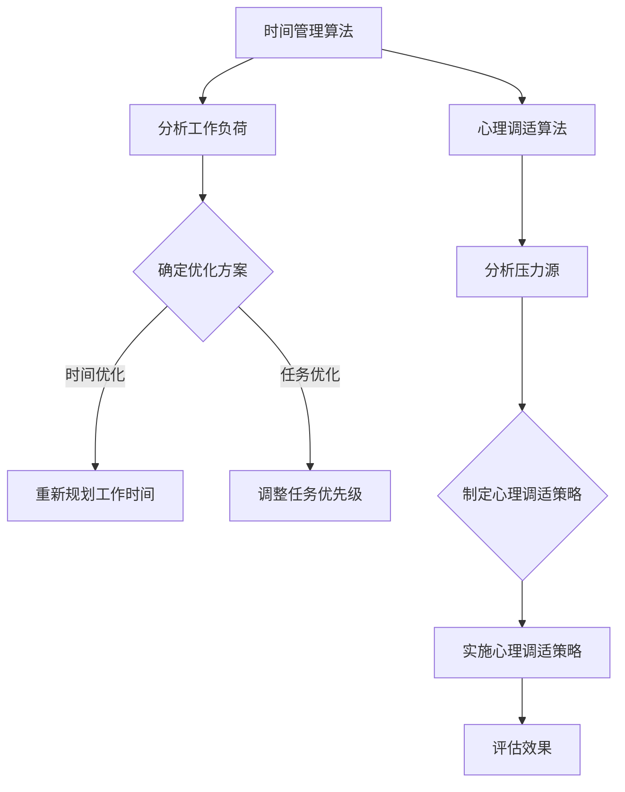
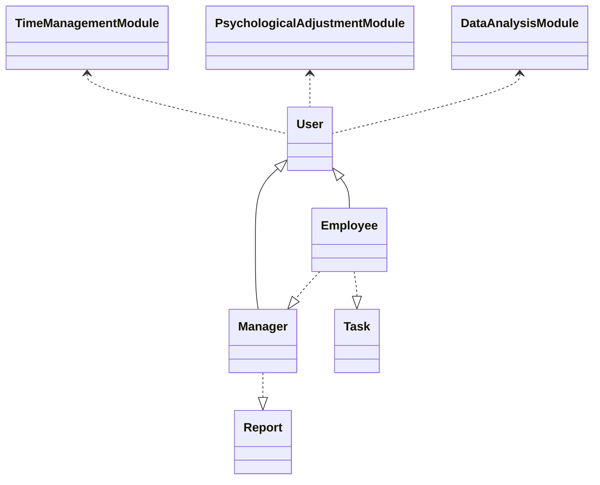
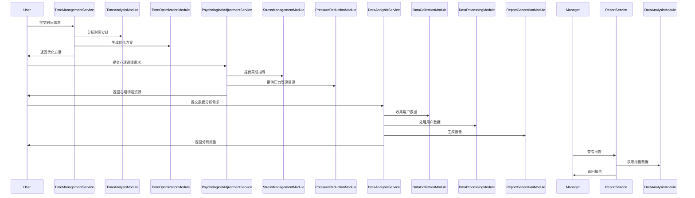

                 

### 引言：后生产力崇拜的背景与重要性

在现代社会，生产力崇拜已经成为一种广泛的文化现象。这种崇拜源自于对效率的追求，反映了人们对于快速、高效完成任务的渴望。效率至上的理念深入人心，各行各业都在努力提升生产效率，以达到更高的产出和竞争力。然而，随着时间的推移，这种生产力崇拜也逐渐暴露出其负面效应，对个人生活和社会整体产生了深远的影响。

首先，效率至上的文化背景可以追溯到工业革命时期。在那个时代，机器的引入和流水线生产模式的推广，极大地提高了生产效率。随后，现代管理理论的兴起，如泰勒的科学管理方法，进一步将效率观念深入人心。企业为了在激烈的市场竞争中脱颖而出，不断追求更高的生产效率和更大的产出。教育体系也深受影响，学校和教育机构强调时间管理和学习效率，学生从小就被培养成高效能的人。媒体宣传则进一步强化了这种效率神话，将高效能作为成功的标志，激励人们不断追求更高的工作效率。

然而，随着生产力崇拜的深入，负面效应也逐渐显现。首先是在个人层面，效率至上的生活节奏导致时间碎片化，人们几乎没有时间进行深度思考和放松。长期处于高压状态，导致心理健康问题日益严重，如压力过大、焦虑和抑郁等。社会层面，效率至上的文化也导致了人际关系疏离，人们更多地关注个人效率和产出，而忽视了人际交往和情感交流。此外，这种文化还可能导致生活质量的下降，人们为了追求效率，牺牲了生活中的许多美好时光和体验。

因此，本文旨在反思效率至上的文化背景，探讨其负面效应，并提出实现效率与生活平衡的方案。我们将重新定义效率，探讨效率与幸福感的关系，以及如何实现效率与生活的平衡。同时，我们还将探讨质量生产力和慢生活的哲学，提供替代效率至上的生活方案。最后，我们还将展望未来生产力的变革，探讨数字化时代下的生产力提升和新型生产力的崛起。通过本文的探讨，希望能够引发读者对于效率至上的重新思考，回归生活的本质。

### 第1章：效率文化的起源与传播

#### 1.1.1 效率文化的起源

效率文化的起源可以追溯到工业革命时期。18世纪末到19世纪初，随着蒸汽机的发明和应用，生产方式发生了根本性的变革。机器的引入和流水线生产模式的推广，使得生产效率大幅提升。这一时期，泰勒的科学管理方法应运而生，通过对劳动过程进行科学分析和优化，进一步提升了生产效率。泰勒认为，通过标准化和制度化的管理，可以最大限度地提高工作效率，实现生产力的提升。

泰勒的科学管理理论强调，通过时间研究和动作研究，将工作分解成最小的单元，并对其进行最优化。这种方法不仅适用于制造业，也逐渐渗透到其他行业。科学管理理论的核心在于“效率至上”，即通过系统的管理和优化，使每一个工作环节都达到最高效率。

在泰勒的科学管理理论之后，其他管理理论如福特的生产线模式、马斯洛的需求层次理论等，进一步丰富了效率文化的内涵。这些理论共同构成了现代效率文化的基石，使得效率观念深入人心。

#### 1.1.2 现代管理理论的效率观念

现代管理理论在继承泰勒的科学管理理论的基础上，进行了进一步的发展和创新。例如，福特的生产线模式通过流水线生产，实现了生产效率和产品质量的显著提升。福特公司通过将生产过程分解为一系列标准化任务，并使用机器和自动化设备来完成这些任务，使得生产效率大幅提高。

此外，马斯洛的需求层次理论也为效率观念提供了新的视角。马斯洛认为，人的需求可以分为五个层次：生理需求、安全需求、社交需求、尊重需求和自我实现需求。在现代社会中，企业和管理者不仅要追求生产效率，还需要关注员工的情感和心理健康。通过满足员工的社交需求、尊重需求和自我实现需求，可以提高员工的满意度和工作效率。

现代管理理论还强调团队合作和沟通的重要性。通过建立高效的团队沟通机制，确保信息的有效传递和共享，可以避免因为信息不对称而导致的低效率。此外，现代管理理论还提倡持续改进和创新，鼓励员工提出改进建议，并通过科学方法进行验证和实施，从而不断提升生产效率。

#### 1.1.3 效率文化的传播与强化

效率文化的传播和强化离不开教育体系和媒体宣传。在教育资源中，学校和教育机构强调时间管理和学习效率，培养学生成为高效能的人。例如，通过设置严格的学习计划和时间表，学生被迫在有限的时间内完成更多的学习任务。同时，学校还通过奖励制度，激励学生追求更高的学习效率。

媒体宣传则进一步强化了效率神话。在商业广告中，高效能的产品和服务被宣传为成功的标志。在新闻报道中，高效能的企业和管理者被作为榜样，激励人们追求更高的效率。通过媒体宣传，效率观念逐渐深入人心，成为社会普遍认可的价值观念。

此外，社交网络和科技应用也在效率文化的传播中起到了重要作用。通过社交网络，人们可以分享和学习高效能的方法和技巧，互相激励和监督。科技应用如电子邮件、即时通讯工具和项目管理软件，使得人们可以更高效地完成任务和沟通。

综上所述，效率文化的起源可以追溯到工业革命时期，现代管理理论对其进行了进一步的发展。教育体系和媒体宣传的推动，使得效率观念深入人心，成为现代社会的一种重要文化现象。然而，随着效率文化的广泛传播和强化，我们也需要关注其带来的负面效应，寻找实现效率与生活平衡的新途径。

#### 1.1.3.1 效率至上的企业管理和教育体系

效率至上的文化在企业管理和教育体系中得到了充分的体现。在企业中，效率被视为提升竞争力的关键因素。企业通过严格的时间管理和绩效评估制度，激励员工追求更高的工作效率。例如，许多企业采用基于目标管理的绩效评估体系，通过设定明确的工作目标和绩效指标，对员工的工作效率进行量化考核。这种方式虽然能够提高工作效率，但也可能导致员工过度追求绩效，忽视了工作质量和个人成长。

在教育体系中，效率至上的理念同样深入人心。学校和教育机构强调时间管理和学习效率，通过设置紧凑的课程安排和严格的学习计划，期望学生在有限的时间内掌握更多的知识。例如，许多学校采用学分制和选课制，鼓励学生在有限的学习时间内选修更多的课程。这种方式虽然能够提高学生的学习效率，但也可能导致学生缺乏深度学习和思考的时间，影响了学习质量。

此外，教育体系中还存在着过度竞争的现象。学生在学业上不断追求高分，以获得更好的升学机会和就业前景。教育机构则通过考试和评比制度，对学生的学习成绩进行量化评估，从而推动了效率至上的文化。这种竞争环境不仅给学生带来了巨大的心理压力，还可能导致学生忽视个人兴趣和特长的发展，影响了学生的全面发展。

总之，效率至上的文化在企业管理和教育体系中得到了广泛的应用。虽然这种方式在一定程度上提高了生产效率和学术成绩，但也带来了一系列负面影响，如过度竞争、工作压力和心理健康问题。因此，我们需要重新审视效率至上的理念，探索更加平衡和可持续的管理和教育模式。

#### 1.1.3.2 媒体宣传的效率神话

媒体宣传在效率文化的传播中起到了至关重要的作用。在商业广告中，高效能的产品和服务被广泛宣传，并被描绘为成功的象征。例如，广告中常常出现企业家通过高效的工作方式迅速达成目标，或是家庭主妇通过使用高效的家务工具轻松完成家务，这些宣传手法不仅塑造了高效能的形象，还激发了观众对高效能的追求。

新闻报道则通过报道高效能的企业和管理者，进一步强化了效率神话。许多媒体会突出报道那些通过创新和高效管理取得巨大成功的企业，将其作为其他企业的榜样。例如，一篇关于某科技公司在短时间内实现快速增长和盈利的文章，可能会成为企业家的必备阅读材料，激励他们效仿成功经验，追求更高的效率。

社交媒体也在效率文化的传播中发挥了巨大作用。在社交平台上，人们通过分享高效能的方法和技巧，互相激励和监督。例如，一位高效能的职场人士可能会分享自己如何通过时间管理工具提高工作效率，这种分享不仅能够帮助其他人提升工作效率，还能形成一种积极向上的社交氛围。

此外，科技应用如电子邮件、即时通讯工具和项目管理软件，也被媒体广泛宣传为提升工作效率的利器。通过展示这些工具如何帮助用户更高效地完成任务和沟通，媒体进一步推动了效率神话的传播。

总的来说，媒体宣传通过商业广告、新闻报道和社交媒体等多种渠道，广泛传播了效率神话。虽然这种宣传有助于提高人们的效率意识，但也容易导致过度追求效率，忽视生活的其他方面。因此，我们需要理性看待媒体宣传中的效率神话，平衡效率与生活质量之间的关系。

#### 1.1.3.3 效率至上的文化影响

效率至上的文化对个人生活和社会整体产生了深远的影响。在个人层面，这种文化导致了时间碎片化和生活节奏的加快。为了追求更高的效率，人们被迫将时间分割成多个小片段，每天在忙碌中度过。这种高强度的快节奏生活，使得人们几乎没有时间进行深度思考和放松，导致心理健康问题日益严重。压力过大、焦虑和抑郁成为现代生活中的常见现象，严重影响了人们的幸福感和生活质量。

在社会层面，效率至上的文化也带来了一系列负面影响。首先，人际关系的疏离变得日益严重。为了追求更高的工作效率，人们更多地关注个人效率和产出，忽视了与他人的情感交流和互动。这种疏离不仅损害了个人关系，也影响了社会的和谐与稳定。其次，这种文化还可能导致生活质量的下降。人们为了追求效率，牺牲了生活中的许多美好时光和体验，如与家人共度时光、锻炼身体、阅读书籍等。长期处于高压状态下，人们的身心健康受到严重威胁。

此外，效率至上的文化还对社会结构和价值观产生了影响。在教育领域，学校和家长过度强调学习成绩和考试分数，导致学生过早地陷入功利化的学习状态，忽视了全面发展和个人兴趣的培养。在企业中，绩效导向的管理制度使得员工面临巨大的工作压力，导致员工流失率和心理健康问题上升。在社会层面，过度追求效率也使得社会资源分配不均，富者愈富，贫者愈贫，加剧了社会的不平等和矛盾。

总的来说，效率至上的文化虽然在短期内提高了生产效率和经济效益，但其负面影响不容忽视。我们需要重新审视和反思这种文化，寻找实现效率与生活平衡的新途径，以促进个人的幸福感和社会的整体进步。

### 第2章：效率至上的负面效应

#### 2.1.1 效率至上的时间管理陷阱

效率至上的文化导致了许多人在时间管理上陷入陷阱，特别是在现代社会中，时间碎片化成为了一个普遍的现象。时间碎片化是指将时间分割成众多短小的片段，以追求更高的工作效率。然而，这种方法虽然在表面上看起来能够提高时间利用率，但实际上却可能导致时间的无意义消耗和效率的降低。

首先，时间碎片化使得人们很难进行深度思考和长时间专注于一项任务。在碎片化的时间里，人们往往被迫频繁地切换任务，这种频繁的任务切换不仅浪费了宝贵的时间，还降低了工作效率。心理学研究表明，人的注意力无法长时间集中在单一任务上，频繁的任务切换会消耗大量的认知资源，导致工作效率的下降。

其次，时间碎片化也容易导致时间的无意义消耗。为了填补碎片化的时间，人们往往会选择做一些简单的、低效的任务，如浏览社交媒体、刷视频等。这些活动虽然能够暂时带来一些娱乐和放松，但实际上并没有真正提高个人的能力和素质。长时间处于这种低效的状态，不仅浪费了时间，还可能导致个人产生挫败感和焦虑。

此外，时间碎片化还可能导致工作压力的增加。为了在有限的时间内完成更多的任务，人们不得不加快工作节奏，提高工作效率。这种高强度的快节奏工作，虽然能够在短期内提高产出，但长期来看，却会导致工作压力的增加，进而影响个人的心理健康。

#### 2.1.2 无休止的工作循环

效率至上的文化还导致了无休止的工作循环，即人们为了追求更高的工作效率，不断延长工作时间，甚至在休息时间也不得不停下工作。这种工作模式虽然能够在短期内提高产出，但从长远来看，却会对个人的身心健康产生严重的负面影响。

首先，无休止的工作循环容易导致过度劳累和身体损伤。长时间的工作会导致身体疲劳，引发各种健康问题，如颈椎病、腰椎间盘突出等。长期处于过度劳累的状态，还会导致免疫力下降，增加患病的风险。

其次，无休止的工作循环也会对心理健康产生负面影响。长时间的工作压力会导致焦虑、抑郁等心理问题。研究表明，长期的工作压力会消耗大量的心理资源，导致情绪不稳定，影响人际关系和家庭的和谐。

此外，无休止的工作循环还可能导致工作与生活的失衡。为了完成工作，人们不得不牺牲休息和娱乐时间，这会导致生活质量下降，影响个人的幸福感和生活质量。长期处于这种状态，人们会感到疲惫和缺乏动力，进而影响工作效率。

#### 2.1.3 心理健康问题

效率至上的文化对心理健康产生了严重的负面影响。首先，压力过大是导致心理健康问题的主要原因之一。在追求高效工作的过程中，人们常常面临各种压力，如工作压力、时间压力和绩效压力等。长期处于高压状态，会导致心理疲劳和情绪不稳定，从而引发焦虑和抑郁等心理问题。

其次，焦虑和抑郁是效率至上的文化带来的常见心理健康问题。焦虑是指对未来的担忧和不安，抑郁则是对当前状态的失望和绝望。在追求高效工作的过程中，人们往往忽视了自己的心理需求，导致焦虑和抑郁情绪的产生。长期处于焦虑和抑郁的状态，不仅会影响个人的工作效率，还会影响生活质量。

此外，效率至上的文化还可能导致其他心理健康问题，如强迫症和失眠等。强迫症是指反复出现强迫思维和强迫行为，失眠则是指难以入睡或易醒。这些问题都会对个人的日常生活和工作产生严重影响。

总之，效率至上的文化虽然能够在短期内提高工作效率，但从长远来看，对心理健康产生了严重的负面影响。我们需要重新审视效率至上的理念，寻找平衡工作效率与心理健康的新途径。

#### 2.1.3.1 压力过大

压力过大是效率至上的文化对心理健康最直接的负面影响之一。在追求高效工作的过程中，人们常常面临来自工作、生活和其他方面的多重压力。例如，为了在短时间内完成大量的工作任务，员工不得不加班加点，长期处于高压状态。这种工作压力不仅会导致身体疲劳，还会引发各种心理健康问题。

首先，工作压力会导致心理疲劳。长时间的工作和加班使得大脑处于高度紧张状态，长期积累下来，会导致注意力不集中、记忆力下降等问题。心理疲劳还会使人情绪低落，容易出现焦虑和抑郁情绪。

其次，压力过大还会导致情绪不稳定。在高压状态下，人们更容易出现情绪波动，如易怒、焦虑和沮丧。情绪不稳定不仅会影响个人的工作效率，还会对人际关系产生负面影响，导致家庭和工作中的矛盾和冲突。

此外，压力过大还会影响睡眠质量。长期的工作压力会导致失眠，睡眠不足又会进一步加重心理疲劳和情绪问题，形成恶性循环。研究表明，长期失眠会增加患抑郁症和焦虑症的风险。

总之，压力过大是效率至上的文化对心理健康的一个重要负面影响。我们需要认识到工作压力的危害，采取有效的应对措施，如合理安排工作时间、学会放松和寻求心理支持，以维护心理健康。

#### 2.1.3.2 焦虑与抑郁

焦虑和抑郁是效率至上的文化带来的两种常见心理健康问题。焦虑是指对未来的担忧和不安，而抑郁则是对当前状态的失望和绝望。在追求高效工作的过程中，人们常常忽视自己的心理需求，导致焦虑和抑郁情绪的产生。

首先，焦虑是效率至上的文化的一个重要后果。为了在短时间内完成更多任务，人们往往处于高度紧张的状态，担心自己无法达到工作要求。这种焦虑情绪会使人感到不安，影响工作和生活质量。长期处于焦虑状态，不仅会消耗大量的心理资源，还会导致身体疲劳和免疫力下降。

其次，抑郁也是效率至上的文化带来的负面影响之一。在追求高效工作的过程中，人们可能忽视了自己的心理健康需求，导致情绪低落和自我价值感的降低。抑郁症患者常常感到无助和绝望，缺乏对未来的希望。长期处于抑郁状态，不仅会影响个人的工作效率，还会对家庭和生活产生负面影响。

此外，焦虑和抑郁还会相互影响。焦虑情绪可能导致抑郁情绪的产生，而抑郁情绪则可能加重焦虑症状。这种恶性循环会进一步恶化个人的心理健康状况。

总之，焦虑和抑郁是效率至上的文化对心理健康带来的两种常见问题。我们需要重视这些问题，采取有效的应对措施，如心理咨询、放松训练和心理支持，以维护心理健康。

#### 2.1.3.3 人际关系的疏离

效率至上的文化不仅在个人心理健康上产生了负面影响，还在社会层面导致了人际关系的疏离。在追求高效工作的过程中，人们往往将大量时间和精力投入到工作中，忽视了与家人、朋友和同事的互动。这种疏离不仅影响了人际关系，还进一步加剧了心理压力。

首先，人际关系疏离使得人们感到孤独和孤立。在忙碌的工作中，人们很少有时间与家人和朋友相聚，导致情感交流的缺失。长期缺乏情感支持，会使人们感到无助和失落，进而影响心理健康。

其次，工作效率至上的文化也导致同事之间的合作变得疏远。为了追求个人绩效，员工可能更愿意独立工作，而不是与同事协作。这种合作疏离不仅影响了团队效率，还可能导致工作中的误解和冲突。

此外，人际关系疏离还影响了家庭生活。为了完成工作任务，人们可能不得不牺牲与家人共度时光的机会。这会导致家庭关系紧张，增加家庭矛盾。长期处于这种状态，不仅会影响家庭和谐，还会对子女的成长产生负面影响。

总之，效率至上的文化在导致人际关系疏离方面具有显著的负面影响。我们需要重新审视工作与生活的平衡，注重人际关系的维护，以改善心理健康和社会和谐。

#### 2.1.3.4 生活质量的下降

效率至上的文化不仅影响心理健康和人际关系，还导致生活质量的下降。在追求高效工作的过程中，人们往往忽视了生活中的其他重要方面，如家庭生活、个人兴趣和休闲活动。这种生活质量下降的现象主要体现在以下几个方面。

首先，工作效率至上的文化使得人们工作时间延长，导致家庭生活时间减少。为了完成工作任务，人们不得不加班加点，牺牲了与家人共度时光的机会。这种缺乏家庭互动的生活，会使家庭关系变得紧张，影响家庭成员的幸福感和生活质量。

其次，人们为了追求高效工作，可能会忽视个人兴趣和爱好。长期处于工作状态，缺乏休闲和娱乐活动，会使人感到枯燥和疲惫。这种缺乏多样性和丰富性的生活，不仅影响个人的幸福感，还可能导致心理问题，如焦虑和抑郁。

此外，效率至上的文化还可能导致生活质量下降的其他方面，如健康问题。长期的高压工作和缺乏运动，会引发各种健康问题，如肥胖、心血管疾病和免疫系统下降等。这些问题不仅影响个人的身体健康，还会降低生活质量。

总之，效率至上的文化对生活质量产生了显著的负面影响。为了实现生活质量的提升，我们需要重新审视工作效率至上的理念，平衡工作与生活的关系，注重身心健康和情感交流。

### 第3章：重新定义效率

在现代社会，重新定义效率已成为必要且迫切的任务。传统的效率观念强调的是速度和产出，但这种单一维度的效率观念已经无法适应复杂多变的社会环境和人类多样性的需求。我们需要从更全面、更人性化的角度重新审视和定义效率，以实现个人和集体的可持续发展。

首先，个体层面的效率需要重新定义。传统的效率观念往往将个人效率等同于工作效率，即能够在最短时间内完成最多的工作任务。然而，这种定义忽视了个体在完成任务过程中的心理状态和幸福感。重新定义个体效率，应包括以下几个方面：

1. **心理状态**：个体在完成任务时应保持良好的心理状态，如积极、专注和满足感。这意味着工作效率不仅仅是一个量化的指标，还需要关注个体的心理体验。

2. **生活平衡**：个体在追求工作效率的同时，也应注重生活平衡，包括健康、家庭和社交生活等方面。只有当个人生活得到全面照顾时，才能真正实现高效的工作和生活。

3. **持续发展**：个体效率不应仅仅追求短期利益，而应关注长期的发展。这包括个人技能的提升、知识的积累和自我成长，从而为未来的挑战做好准备。

其次，社会层面的效率也需要重新定义。在现代社会，社会效率不仅仅是一个经济指标，还应该涵盖环境保护、社会公正和人际和谐等多个维度。以下是对社会效率的重新定义：

1. **环境保护**：社会效率应考虑到资源的可持续利用和环境的影响。在追求经济增长的同时，应减少对环境的破坏，实现绿色发展。

2. **社会公正**：社会效率不应仅仅追求产出最大化，还应确保资源的公平分配和社会的公正。这意味着要关注弱势群体的权益，减少社会不平等现象。

3. **人际和谐**：社会效率不仅涉及到经济和生态，还应包括人际关系的和谐。社会应鼓励团队合作、互信和互助，以建立更加稳定和和谐的社会环境。

总之，重新定义效率是一个复杂且多维的过程，需要从个体和社会两个层面进行思考和行动。通过重新定义效率，我们不仅可以提升个人和集体的幸福感，还可以实现更可持续的发展目标。

#### 3.2.2 效率与幸福感的平衡

在重新定义效率的过程中，我们不仅要考虑个体的生产力和工作效率，还要关注幸福感这一关键因素。效率和幸福感之间的关系复杂且多维，但它们之间的平衡是实现可持续发展的基础。

首先，效率与幸福感之间存在正相关关系。在一般情况下，当个体能够高效地完成任务并达到工作目标时，往往会感到满足和快乐，从而提高幸福感。例如，通过合理的时间管理和工作优化，员工可以在有限的时间内完成更多的任务，这不仅提升了工作效率，还减少了工作压力，使员工感受到成就感和幸福感。

然而，过度追求效率可能会导致幸福感的下降。当个体长时间处于高压状态，被迫频繁地切换任务，甚至牺牲休息和娱乐时间时，这种过度追求效率的行为会消耗大量的心理和生理资源，导致疲劳和焦虑。长期如此，不仅会影响工作效率，还会损害心理健康，降低幸福感。

此外，幸福感不仅取决于工作效率，还受到其他多种因素的影响，如社会支持、家庭生活和个人兴趣等。一个高效能的人，如果缺乏与家人、朋友的情感交流，或忽视了个人兴趣和爱好，他们的幸福感可能会受到影响。因此，我们需要在追求效率的同时，关注幸福感的全面发展。

为了实现效率与幸福感的平衡，可以采取以下策略：

1. **时间管理**：合理规划工作和休息时间，避免过度劳累。例如，通过设置固定的工作时间和休息时间，确保个体有足够的休息和放松时间。

2. **心理调适**：培养积极的心态，学会应对工作中的压力。例如，通过冥想、运动和放松训练等心理调适方法，缓解工作压力，提高幸福感。

3. **工作与生活的平衡**：注重家庭和社交生活，确保个体在追求工作效率的同时，也有足够的时间和精力享受生活。例如，安排与家人和朋友相聚的时间，参与休闲活动，以提升生活质量和幸福感。

4. **心理健康支持**：提供心理健康支持，如心理咨询和辅导，帮助个体应对工作中的压力和挑战。通过专业心理支持，个体可以更好地管理情绪，提高幸福感。

总之，效率与幸福感之间的平衡是一个复杂且动态的过程。通过合理的时间管理、心理调适和工作与生活的平衡，我们可以实现效率与幸福感的和谐统一，从而提升个人的整体幸福感和社会的可持续发展。

#### 3.2.3 效率的可持续性

效率的可持续性是重新定义效率的一个重要维度，它关乎我们如何在追求效率的同时，确保资源和环境的长期健康。可持续效率不仅关注当前的经济产出，还考虑到未来的发展和环境保护。

首先，可持续效率要求我们重新评估和优化资源的利用方式。传统的效率观念往往追求最大化的短期产出，而忽视了资源消耗和环境的影响。例如，过度开采自然资源、大量使用化石燃料和排放污染物，虽然能够在短期内提高生产效率，但长期来看，会导致资源枯竭和环境恶化。

为了实现资源的可持续利用，我们需要采取以下措施：

1. **循环经济**：推广循环经济模式，通过资源的再利用和再生，减少资源消耗。例如，回收利用废弃物、发展绿色能源等，可以显著降低对自然资源的依赖。

2. **节能减排**：采用节能减排技术，减少生产过程中的能源消耗和污染物排放。例如，使用高效节能设备、推广清洁能源等，可以有效降低生产过程中的环境影响。

3. **生态设计**：在产品设计和生产过程中，注重生态设计原则，减少对环境的破坏。例如，设计可回收、可降解的产品，减少生产过程中的废弃物。

其次，可持续效率还要求我们关注长期的社会发展和人类福祉。传统的效率观念往往侧重于经济指标，而忽视了社会公平和环境质量。为了实现长期的可持续发展，我们需要采取以下措施：

1. **社会公平**：确保资源分配的公平性，减少社会不平等现象。例如，通过税收和社会福利政策，实现收入的再分配，提高社会的整体幸福感。

2. **教育与培训**：注重教育和培训的可持续性，提升人们的技能和知识水平，以适应未来发展的需求。通过持续学习和技能提升，个体可以更好地应对社会变革，提高就业竞争力。

3. **环境保护**：采取环境保护措施，减少环境污染和生态破坏。例如，通过立法和监管，确保企业和个人遵守环境保护标准，减少对自然资源的破坏。

总之，可持续效率是实现长期发展的关键。通过优化资源利用、推广循环经济和注重社会公平，我们可以实现效率与环境的平衡，为未来的可持续发展奠定基础。

#### 3.3.1 生活方式的调整

为了实现效率与生活的平衡，我们需要对生活方式进行适当的调整，从而在提高工作效率的同时，保障生活质量和幸福感。以下是一些具体的方法和建议：

首先，**时间管理**是关键。合理规划每天的时间，确保工作、休息和个人时间都有明确的安排。例如，设置固定的作息时间表，避免工作侵占休息时间。此外，可以使用时间管理工具，如待办事项清单和日程安排软件，帮助自己更好地管理时间。

其次，**专注力的提升**至关重要。在现代社会，人们往往因为多任务处理而分散注意力，导致工作效率下降。为了提高专注力，可以采取以下方法：

1. **分段工作**：采用番茄工作法（Pomodoro Technique），将工作时间分为25分钟的高效工作和5分钟的休息，每完成四个阶段后可以休息更长一些时间。这种方法有助于保持精力集中，提高工作效率。
2. **减少干扰**：在工作时，尽量减少手机、社交媒体和其他干扰源。可以关闭不必要的通知，将手机置于静音或专注模式下。
3. **专注环境**：创造一个有助于专注的工作环境。例如，选择一个安静的房间或角落作为工作空间，减少噪音和其他干扰因素。

第三，**健康生活**同样重要。保持良好的身体健康是提高工作效率和幸福感的基石。以下是一些健康生活的建议：

1. **定期锻炼**：每天进行适量的运动，如散步、跑步、瑜伽或健身房锻炼，有助于提高身体素质和心理状态。
2. **健康饮食**：保持均衡的饮食，多吃蔬菜、水果和全谷物，减少加工食品和高糖食品的摄入。
3. **充足睡眠**：确保每天有足够的睡眠时间，避免熬夜和睡眠不足。

第四，**兴趣爱好和休闲**也是不可或缺的部分。为了平衡工作和生活，我们需要有意识地安排时间进行兴趣爱好和休闲活动。以下是一些建议：

1. **培养兴趣**：找到自己感兴趣的活动，如绘画、音乐、阅读或户外探险等，这些活动可以带来快乐和满足感。
2. **家庭时光**：与家人共度时光，如一起做饭、看电影或进行户外活动，增强家庭关系。
3. **社交活动**：参加社交聚会或社团活动，与他人交流和分享经验，拓宽社交圈子。

总之，通过调整生活方式，我们可以在提高工作效率的同时，保障生活质量和幸福感。合理的时间管理、专注力的提升、健康生活、兴趣爱好和休闲活动的合理安排，都是实现效率与生活平衡的有效途径。

#### 3.3.2 心理健康的维护

在实现效率与生活的平衡过程中，维护心理健康至关重要。心理健康不仅影响到个人的工作效率和生活质量，还对整个社会的和谐与稳定产生深远影响。以下是一些关键的策略和方法，帮助我们在快节奏的生活中保持心理健康：

首先，**应对压力的策略**是维护心理健康的基础。压力是现代人生活中不可避免的一部分，但过度的压力会严重损害身心健康。以下是一些有效的应对策略：

1. **时间管理**：合理规划时间，确保工作、休息和个人时间都有明确的界限。避免长时间工作，确保每天有足够的休息时间。使用时间管理工具，如待办事项清单和日程安排软件，可以帮助我们更好地掌控时间，减少因时间失控而产生的压力。
2. **放松技巧**：学会一些放松技巧，如深呼吸、冥想和瑜伽等，可以帮助我们在紧张的工作后放松身心。这些技巧有助于减轻压力，提高情绪稳定性。
3. **积极心态**：培养积极的心态，学会从不同的角度看待问题，避免过度焦虑和担忧。通过积极的自我对话和正面的思维模式，我们可以更好地应对生活中的挑战。

其次，**心理健康自我检测与调整**也是维护心理健康的重要步骤。定期自我检测，可以帮助我们及时发现心理问题，并采取相应的调整措施。以下是一些自我检测和调整的方法：

1. **情绪日记**：记录自己的情绪变化和发生的事件，有助于我们更好地了解自己的情绪状态。通过分析情绪日记，我们可以识别出触发负面情绪的原因，并采取相应的调整措施。
2. **心理咨询**：如果感到心理压力过大或出现情绪问题，不妨寻求专业的心理咨询帮助。心理咨询师可以帮助我们分析问题的根源，并提供有效的心理干预策略。
3. **健康生活方式**：保持健康的生活方式，如定期锻炼、充足睡眠和健康饮食，有助于提高我们的心理韧性，减少心理问题发生的风险。

最后，**社会支持系统**是维护心理健康的重要保障。社会支持系统能够为我们提供情感上的支持和实际帮助，使我们感到被关心和被理解。以下是一些建立和维护社会支持系统的建议：

1. **建立人际关系**：与家人、朋友和同事保持良好的关系，定期与他们交流和分享。通过建立深厚的人际关系，我们可以获得情感上的支持和实际帮助。
2. **参与社交活动**：积极参与社区和社团活动，与他人互动和合作。社交活动不仅可以丰富我们的生活，还可以提供心理支持和社交平台。
3. **寻求专业帮助**：当遇到严重的心理问题时，不要犹豫寻求专业帮助。心理咨询师、心理医生和社会工作者等专业人员，可以为我们提供专业的支持和指导。

总之，维护心理健康是实现效率与生活平衡的重要一环。通过有效的应对压力策略、自我检测与调整、以及建立和维护社会支持系统，我们可以更好地应对生活中的挑战，保持心理健康和幸福感。

#### 3.3.3 社会关系的重视

在追求效率的同时，我们不应忽视社会关系的重要性。社会关系不仅对个人的心理健康有积极影响，还对社会的和谐与稳定起到关键作用。以下是一些方法，帮助我们重视并维护社会关系：

首先，**人际关系的和谐**是实现工作效率与生活质量平衡的基础。在繁忙的工作中，我们需要刻意留出时间与家人、朋友和同事进行深层次的交流和互动。以下是一些建议：

1. **家庭聚会**：定期与家人共度时光，如一起用餐、看电影或户外活动。这不仅可以增强家庭凝聚力，还能缓解工作带来的压力。
2. **社交活动**：参加同事或朋友组织的聚会和活动，如公司团建、社区活动或兴趣小组。这些活动不仅能增进友谊，还能拓展社交圈。
3. **倾听与支持**：在朋友和同事遇到困难时，给予他们倾听和支持。通过真诚的关心和理解，我们可以建立更紧密的人际关系。

其次，**社区参与的积极意义**不可忽视。积极参与社区活动不仅能够增强社区凝聚力，还能提升个人的社会责任感和幸福感。以下是一些建议：

1. **志愿服务**：参与社区志愿服务，如环保活动、慈善募捐或教育辅导等。通过志愿服务，我们可以回馈社会，同时结识志同道合的朋友。
2. **社区活动**：积极参与社区的各类活动，如社区运动会、文化节或社区会议。这些活动不仅能丰富我们的社区生活，还能增强社区归属感。
3. **社区交流**：与邻居和社区成员保持良好的交流，建立互帮互助的关系。通过日常的互动，我们可以更好地了解社区，同时为社区的发展和改善贡献自己的力量。

最后，**数字时代的社交平衡**也需要注意。在现代社会，社交媒体和即时通讯工具为我们提供了便利的交流方式，但也容易导致人际关系的疏离。以下是一些建议：

1. **线下互动**：尽量减少对社交媒体的依赖，多进行面对面的交流和互动。这不仅能增进人际关系的深度，还能提高沟通的效果。
2. **高质量社交**：选择与我们有共同兴趣或目标的人进行深入交流，而不是仅仅停留在表面的社交互动中。这样，我们能够建立更持久和有意义的人际关系。
3. **心理调适**：学会在数字时代保持心理平衡，避免过度依赖社交媒体带来的虚幻满足感。通过自我调整和心理训练，我们可以更好地应对社交压力，保持健康的心理状态。

总之，重视社会关系是实现效率与生活平衡的重要一环。通过和谐的人际关系、积极的社区参与和数字时代的社交平衡，我们可以更好地维护心理健康和社会和谐。

### 第5章：以质量为中心的生产力

在效率至上的文化中，我们往往忽视了质量在生产过程中的重要性。然而，随着市场竞争的加剧和消费者对产品质量要求的提高，以质量为中心的生产力逐渐成为一种新的生产力理念。这一理念不仅能够提升企业的竞争力，还能促进个人和集体的可持续发展。

#### 5.4.1 质量生产力的概念

质量生产力是指在保证产品质量的前提下，通过优化生产流程、提高员工素质和管理效率，实现生产效率和经济效益的提升。质量生产力强调的是质量与效率的统一，而不是单纯追求产出的最大化。

质量生产力的核心要素包括：

1. **质量管理**：通过建立和完善质量管理体系，确保产品或服务符合质量标准。质量管理不仅包括生产过程中的质量控制，还包括设计、采购、销售等环节的质量管理。
2. **流程优化**：通过分析生产流程，找出瓶颈和浪费，进行流程优化，提高生产效率。流程优化可以减少不必要的步骤和环节，提高生产效率和灵活性。
3. **员工素质**：提高员工的技能和素质，使其能够更好地理解和执行质量管理要求。通过培训和教育，员工可以掌握更先进的生产技术和方法，提高工作效率和质量。
4. **管理效率**：优化管理流程，提高管理效率。通过科学的管理方法和工具，如目标管理、绩效评估等，可以提高管理的效率和效果。

#### 5.4.2 质量生产力的特点

质量生产力具有以下几个显著特点：

1. **持续改进**：质量生产力强调持续改进，通过不断的反思和优化，提高产品质量和生产效率。持续改进是质量生产力的核心，它能够帮助企业适应市场变化，保持竞争优势。
2. **全员参与**：质量生产力不是单靠管理层或质量部门的努力，而是需要全员参与。每个员工都承担着质量管理的责任，通过全员参与，可以提高整体生产效率和产品质量。
3. **客户导向**：质量生产力以客户需求为导向，通过提供高质量的产品和服务，满足客户的需求。客户导向是质量生产力的基本原则，它能够帮助企业赢得客户的信任和忠诚。
4. **数据驱动**：质量生产力强调数据驱动，通过收集和分析生产数据，找出问题并提出改进方案。数据驱动可以帮助企业更准确地识别问题，制定有效的改进措施。

#### 5.4.3 质量生产力的实践

质量生产力的实践需要从多个方面进行：

1. **建立质量管理体系**：企业应建立和完善质量管理体系，确保产品或服务符合质量标准。质量管理体系包括质量规划、质量控制、质量保证和质量改进等环节。
2. **流程优化**：通过流程优化，提高生产效率和灵活性。流程优化可以通过精益生产、六西格玛等方法和工具实现。
3. **员工培训**：提高员工的技能和素质，使其能够更好地理解和执行质量管理要求。企业可以通过内部培训、外部培训和专业认证等方式，提升员工的综合素质。
4. **绩效评估**：建立科学的绩效评估体系，对员工的工作质量和工作效率进行评估。通过绩效评估，可以激励员工不断提高工作效率和质量。
5. **客户反馈**：收集和分析客户反馈，了解客户的需求和满意度。通过客户反馈，企业可以不断改进产品质量和服务，提高客户满意度。

总之，质量生产力是一种以质量为中心的生产力理念，它能够帮助企业提升生产效率和竞争力，促进个人和集体的可持续发展。通过建立质量管理体系、流程优化、员工培训和绩效评估等实践，企业可以更好地实现质量生产力，为未来发展奠定坚实基础。

#### 5.4.4 质量生产力的案例分析

为了更深入地理解质量生产力的实践效果，我们可以通过以下两个实际案例来探讨：

**案例一：丰田汽车的质量管理**

丰田汽车以其卓越的质量管理而闻名于世。丰田的质量管理体系基于“精益生产”理念，通过不断优化生产流程，减少浪费，提高效率。例如，丰田采用了“五步骤决策制定法”（5 Whys），通过连续提问“为什么”，深入分析问题根本原因，从而采取有效措施解决问题。丰田的质量管理不仅局限于生产过程，还涵盖了设计、采购、销售和服务等各个环节。通过全面的质量管理，丰田不仅提高了生产效率和产品质量，还建立了强大的品牌信誉，赢得了全球客户的信任。

**案例二：亚马逊的供应链管理**

亚马逊作为全球最大的电子商务平台，其供应链管理同样是质量生产力的典范。亚马逊通过使用先进的物流管理系统和人工智能技术，实现了高效的库存管理和配送流程。亚马逊的“Kiva机器人”系统能够在仓库内自动搬运货架，大幅提高了仓库作业效率。此外，亚马逊还通过“客户反馈机制”，实时收集和分析客户反馈，不断优化产品和服务。例如，亚马逊会根据客户反馈调整产品包装设计，提升客户满意度。通过这些质量生产力的实践，亚马逊不仅实现了高效运营，还建立了以客户为中心的服务文化，使其在激烈的市场竞争中保持领先地位。

这些案例表明，质量生产力不仅能够提高企业的生产效率和竞争力，还能提升客户满意度和品牌形象。通过有效的质量管理体系和持续改进，企业可以实现长期可持续发展，为未来的市场竞争打下坚实基础。

### 第6章：慢生活的哲学

慢生活哲学起源于对现代社会快节奏生活的反思和批判。在现代社会中，人们被工作和生活压力所困扰，忙于追逐效率，却忽略了生活的本质和个人的幸福感。慢生活哲学提倡放慢生活的节奏，回归生活的本质，通过减少工作压力、关注身心健康和培养人际关系，实现更高质量的生活。

#### 6.5.1 慢生活的理念

慢生活理念的核心是“慢节奏、高质感”。它不仅仅是放慢生活的步伐，更是一种生活方式的哲学。慢生活的理念包括以下几个方面：

1. **时间管理**：慢生活强调时间的管理和分配，不仅仅是减少工作时长，更重要的是在有限的时间内，专注于真正有意义的事情。例如，通过合理规划时间，确保工作、休息和个人时间的平衡。

2. **身心平衡**：慢生活强调身心健康的重要性，提倡通过运动、冥想和健康饮食等方式，保持身体的活力和心灵的宁静。身心平衡是实现高效工作和高质量生活的基础。

3. **人际关系**：慢生活重视人际关系的培养和维护，认为人与人之间的情感交流和互动是生活的重要组成部分。通过家人团聚、朋友聚会和社区活动，增强社会联系和归属感。

4. **生活品质**：慢生活注重生活品质的提升，鼓励人们追求内心的满足和幸福感。这不仅仅是物质层面的享受，更包括精神层面的满足，如阅读、艺术创作和自然体验等。

#### 6.5.2 慢生活的优势

慢生活理念带来了许多显著的优势，不仅有助于提升个人的幸福感，还能对社会产生积极影响。以下是慢生活的几个主要优势：

1. **心理健康**：慢生活减少了因长时间工作和高压力带来的心理负担，降低了焦虑、抑郁等心理问题的发生率。通过减少工作压力，人们能够更好地管理情绪，保持心理健康。

2. **生活满意感**：慢生活使得人们能够更好地享受生活中的每一刻，提高了生活满意感。通过专注于有意义的活动和人际关系，人们能够获得更多的成就感和满足感。

3. **人际关系**：慢生活强调人际关系的培养，增强了家庭、朋友和社区的凝聚力。通过更多的互动和交流，人们能够建立更深层次的人际关系，提高社交满意度。

4. **工作与生活的平衡**：慢生活帮助人们实现工作与生活的平衡，减少了因过度工作导致的家庭疏离和生活质量下降。通过合理安排时间，人们能够在工作和生活中找到平衡，提高整体生活质量。

5. **社会和谐**：慢生活理念有助于减少社会竞争和压力，促进社会的和谐与稳定。通过减少工作时长和压力，人们有更多的时间参与社区活动，促进社会互助和团结。

总之，慢生活哲学提供了一种更加和谐、健康和有意义的生活方式。通过放慢生活的节奏，关注身心健康和人际关系的培养，我们可以实现更高品质的生活，并为社会的可持续发展做出贡献。

#### 6.5.3 慢生活的实践

实践慢生活理念需要从多个方面入手，以下是一些具体的建议和策略：

首先，**时间管理**是慢生活实践的核心。合理规划时间，确保工作、休息和个人时间都有明确的安排。以下是一些时间管理的建议：

1. **设立固定的工作时间**：避免长时间工作，确保每天有足够的时间进行休息和娱乐。例如，每天工作8小时，其余时间用于休息、个人爱好和家庭活动。
2. **优先级排序**：将任务按照优先级排序，优先处理最重要的任务。避免因为琐碎的任务而浪费大量时间，确保关键任务得到充分的时间和精力。
3. **使用时间管理工具**：使用时间管理工具，如日程表、待办事项清单和番茄工作法等，帮助自己更好地管理时间，提高工作效率。

其次，**健康生活**是慢生活实践的重要组成部分。保持良好的身体健康和心理状态，以下是一些建议：

1. **定期锻炼**：每天进行适量的运动，如散步、跑步、瑜伽或健身房锻炼，有助于提高身体素质和心理状态。
2. **健康饮食**：保持均衡的饮食，多吃蔬菜、水果和全谷物，减少加工食品和高糖食品的摄入。
3. **充足睡眠**：确保每天有足够的睡眠时间，避免熬夜和睡眠不足。

第三，**心理调适**是慢生活实践的关键。以下是一些心理调适的建议：

1. **冥想和放松**：通过冥想、深呼吸和瑜伽等放松技巧，缓解压力和焦虑，提高心理韧性。
2. **心理支持**：与家人、朋友和专业人士交流，寻求心理支持和帮助，解决心理问题。

第四，**培养兴趣爱好**是慢生活的重要方面。以下是一些建议：

1. **阅读和学习**：培养阅读和学习的习惯，提升个人素质和知识水平。
2. **艺术创作**：尝试艺术创作，如绘画、音乐或写作，这有助于提高生活品质和幸福感。
3. **户外活动**：参加户外活动，如徒步、登山或露营，享受大自然的美好。

最后，**社区参与**是慢生活实践的一部分。以下是一些建议：

1. **家庭聚会**：与家人共度时光，如一起做饭、看电影或户外活动，增强家庭关系。
2. **社交活动**：参加社区和社交活动，如社区服务、运动会或兴趣小组，建立和维护社交网络。
3. **志愿服务**：参与志愿服务，回馈社会，同时培养社会责任感和满足感。

通过以上建议和策略，我们可以更好地实践慢生活理念，实现工作与生活的平衡，提高生活质量和幸福感。

#### 6.5.4 慢生活对工作效率的影响

慢生活理念不仅提升了生活质量，还对工作效率产生了积极的影响。通过放慢生活节奏，人们能够更加专注和高效地完成任务。以下是慢生活对工作效率的几个主要积极影响：

首先，**减少错误和失误**。在快节奏的生活中，人们往往因为时间紧迫而匆忙完成任务，容易导致错误和失误。慢生活通过减少工作压力，使人们能够更加从容地处理任务，减少因急躁和疲劳导致的错误。

其次，**提高创造力**。慢生活提供了更多的思考和反思时间，有助于激发创造力和创新思维。当人们不再被琐事和紧急任务困扰时，他们可以有更多的时间和精力进行深度思考和创造性工作。

第三，**增强团队合作**。慢生活强调人际关系的培养，使团队成员之间建立更加紧密的合作关系。通过更多的交流和互动，团队成员可以更好地理解和协调，提高团队合作效率。

第四，**提升工作满意度**。慢生活使得员工能够更好地平衡工作与生活，减少因工作压力导致的不满和疲劳。当员工感到工作满意时，他们会更加投入和积极，从而提高整体工作效率。

总之，慢生活不仅提升了生活质量，还对工作效率产生了显著的积极影响。通过实践慢生活理念，我们可以实现工作与生活的平衡，提高工作效率和幸福感。

#### 6.5.5 慢生活对社会文化的启示

慢生活哲学对社会文化产生了深远的影响，特别是在现代社会的高压和快节奏环境中，慢生活理念为人们提供了一种新的生活选择和价值观念。以下是慢生活对社会文化的几个主要启示：

首先，**重新定义成功标准**。在传统的文化中，成功往往与财富、地位和权力紧密相关。然而，慢生活理念挑战了这种传统的成功标准，提出了以幸福感为核心的成功定义。人们开始意识到，追求内心的满足和生活的平衡比单纯追求物质财富和职业成就更为重要。

其次，**重视生活质量**。慢生活强调生活质量的重要性，鼓励人们关注生活的细节和美好。通过放慢生活节奏，人们能够更好地享受生活中的每一刻，提升生活的整体质量。这种生活观念的转变有助于减轻社会压力，提高人们的幸福感和生活质量。

第三，**促进社会和谐**。慢生活理念提倡人际关系和社会联系的培养，通过家庭聚会、社区活动和志愿服务等方式，增强社会凝聚力。这种社会联系的增强不仅有助于提高个人的幸福感，还能促进社会的和谐与稳定。

第四，**推动可持续生活方式**。慢生活强调减少消费和资源的合理利用，倡导环保和可持续的生活方式。这种生活方式有助于减少环境污染和资源浪费，推动社会的可持续发展。

总之，慢生活哲学为社会文化带来了深刻的变革，重新定义了成功标准，重视生活质量，促进了社会和谐，并推动了可持续生活方式的发展。通过实践慢生活理念，我们可以实现更健康、更和谐和更可持续的社会文化。

### 第7章：未来生产力的展望

在未来，随着科技的不断进步和全球化的发展，生产力将迎来前所未有的变革。这些变革不仅将提升生产效率，还会深刻影响社会结构和人类生活方式。本文将探讨数字化时代的生产力变革，新型生产力的崛起，以及未来生产力面临的挑战与机遇。

#### 7.6.1 数字化时代的生产力变革

数字化时代是生产力变革的重要阶段，信息技术和互联网的广泛应用使得生产方式和流程发生了深刻的变化。以下是数字化时代生产力变革的几个关键方面：

1. **人工智能的生产力提升**：人工智能（AI）在各个行业得到了广泛应用，从制造业到服务业，AI技术显著提高了生产效率。通过机器学习算法，企业可以自动化执行重复性任务，减少人力资源的消耗。例如，智能工厂中的机器人可以自动完成装配、检测和包装等工作，提高了生产效率和产品质量。

2. **大数据分析的生产力应用**：大数据技术的兴起使得企业能够从海量数据中提取有价值的信息，进行数据分析和决策。通过对市场趋势、消费者行为和供应链信息的分析，企业可以优化生产流程，提高资源利用率。例如，零售业可以通过大数据分析来预测市场需求，调整库存策略，减少浪费，提高销售额。

3. **远程工作和协作工具**：数字化时代使得远程工作和协作变得更加普遍。通过视频会议、即时通讯工具和在线协作平台，团队成员可以跨越地域限制，实时沟通和协作。这不仅提高了工作效率，还减少了因为人员流动和地理位置带来的成本。

4. **云计算和边缘计算**：云计算技术使得企业能够灵活地扩展和缩小计算资源，按需支付，降低了IT基础设施的投入成本。边缘计算则将数据处理推向网络边缘，减少了数据传输的延迟，提高了系统的响应速度。这些技术的应用使得企业能够更高效地处理和分析数据，提升了整体生产力。

#### 7.6.2 新型生产力的崛起

随着数字化时代的到来，新型生产力正在崛起，这些新型生产力不仅提高了生产效率，还改变了传统产业和就业模式。以下是几个重要的新型生产力：

1. **知识经济**：知识经济以知识和信息为核心，通过创新和知识管理来推动经济增长。随着信息技术的普及，知识和信息的获取和传播变得更加便捷，企业和个人可以通过学习和创新来提升生产力。知识经济强调人才和创新能力的重要性，成为推动经济增长的新动力。

2. **创意经济**：创意经济以创意和设计为核心，涵盖了艺术、设计、媒体、娱乐等领域。创意经济的崛起改变了传统的生产方式，强调个性化和定制化。通过创意和设计，企业可以开发出更具吸引力和差异化的产品和服务，提升市场竞争力。

3. **绿色经济**：绿色经济强调可持续发展，通过减少资源消耗和环境污染来提高生产力。绿色技术、绿色能源和环保产业的发展，不仅有助于解决环境问题，还创造了新的经济增长点。绿色经济模式有助于实现经济、社会和环境的协调发展。

4. **共享经济**：共享经济通过共享资源和平台，提高了资源利用效率，降低了生产和消费的成本。共享经济模式在住宿、交通、物流等领域得到了广泛应用，如共享单车、共享住宿和共享办公等。共享经济不仅促进了资源的合理分配，还创造了新的就业机会。

#### 7.6.3 未来生产力的挑战与机遇

未来生产力的发展将面临一系列挑战和机遇。以下是几个关键挑战和机遇：

1. **技能转型与劳动力市场**：随着科技的快速发展，许多传统职业将面临淘汰，新的职业技能需求不断涌现。这要求劳动者不断提升技能，适应新的工作环境。同时，劳动力市场也需要进行相应的调整，以应对技能转型带来的挑战。

2. **社会公平与效率**：在生产力大幅提升的背景下，如何实现社会公平和效率的平衡是一个重要问题。需要通过政策调整和制度设计，确保生产力的提升能够惠及所有人，减少社会不平等现象。

3. **环境与可持续发展**：未来生产力的发展需要在环境与可持续发展之间找到平衡点。通过推广绿色技术和可持续发展模式，实现经济增长与环境保护的双赢。

4. **创新与创业**：创新和创业是未来生产力的重要驱动力。政府和企业需要加大对创新和创业的支持，为新的经济增长点提供土壤。

总之，未来生产力的发展将面临诸多挑战和机遇。通过科技创新、技能转型、社会公平和可持续发展，我们可以实现生产力的不断提升，推动社会的全面进步。

### 结语：回归生活本质

回顾全文，我们探讨了生产力崇拜的起源与传播，分析了效率至上的文化背景及其负面效应，提出了重新定义效率和实现效率与生活平衡的方案。我们还深入讨论了质量生产力和慢生活的哲学，探讨了未来生产力的变革与挑战。在这一过程中，我们意识到，追求效率并不是生活的全部，更重要的是回归生活的本质，关注身心健康、人际关系和社会和谐。

在现代社会，生产力崇拜和效率至上的文化已经深入人心，这种文化在一定程度上推动了社会的发展和经济的增长。然而，随着其负面效应的显现，我们也需要重新审视这种文化，探索更加平衡和可持续的生活哲学。重新定义效率，关注生活质量，是实现这一目标的关键。

首先，我们需要认识到，效率并不是生活的唯一目标。在追求效率的过程中，我们不应忽视身心健康、家庭和社交生活的重要性。过度追求效率会导致心理健康问题、人际关系疏离和生活质量下降。因此，我们应该在追求工作效率的同时，关注个人的心理状态和生活平衡。

其次，质量生产力和慢生活哲学为我们提供了一种新的生活哲学。质量生产力强调质量与效率的统一，通过优化生产流程和提高员工素质，实现长期的可持续发展。慢生活哲学则提倡放慢生活节奏，回归生活的本质，通过减少工作压力、关注身心健康和培养人际关系，提升生活质量。

最后，我们还需要关注未来生产力的变革和挑战。随着科技的进步和全球化的发展，生产力将迎来前所未有的变革。这要求我们不断提升技能，适应新的工作环境，实现生产力的提升和社会的进步。

总之，回归生活本质是实现可持续发展和个人幸福的关键。通过重新定义效率，关注生活质量，探索质量生产力和慢生活哲学，我们可以实现工作与生活的平衡，提升个人和社会的整体幸福感。让我们共同追求更加健康、和谐和有意义的生活。作者：AI天才研究院/AI Genius Institute & 禅与计算机程序设计艺术 /Zen And The Art of Computer Programming

---

### 背景介绍

在本文中，我们将深入探讨“后生产力崇拜：效率至上后的生活哲学反思”这一主题。首先，我们需要明确几个核心概念和术语，以便更好地理解后续内容。

#### 核心概念

1. **生产力崇拜**：生产力崇拜是指一种社会文化现象，即人们过度强调生产力和效率，将其视为成功和价值的唯一标准。这种现象在现代社会尤为突出，影响了个人生活和社会结构的各个方面。

2. **效率至上**：效率至上是一种管理哲学，强调通过提高生产效率来达到最大产出。在这种观念下，时间被视为宝贵的资源，工作效率被视为个人和企业成功的关键。

3. **生活哲学**：生活哲学是指人们对生活本质和价值的理解和追求。它不仅包括物质层面的追求，还涵盖了精神、情感和社会层面的满足。

#### 问题背景

在过去的几十年里，生产力崇拜和效率至上的文化在全球范围内广泛传播。这一文化现象起源于工业革命时期，随着科学管理理论和现代管理理论的兴起，逐渐成为企业和社会管理的重要原则。然而，随着时代的变迁，这种文化也暴露出诸多负面效应，如心理健康问题、人际关系疏离和生活质量下降。

这些问题引发了人们对生产力和效率至上的重新思考，促使我们探讨如何在追求效率和产出的同时，实现生活哲学的回归，关注身心健康、人际关系和社会和谐。

#### 问题描述

本文将围绕以下问题进行探讨：

1. **效率至上的文化背景及其起源**：分析效率至上的文化背景，探讨其起源和发展过程，以及其在企业管理和教育体系中的体现。
2. **效率至上的负面效应**：分析效率至上的文化对个人生活和社会整体产生的负面影响，包括心理健康问题、人际关系疏离和生活质量下降。
3. **重新定义效率和实现生活平衡**：探讨如何重新定义效率，实现效率与生活的平衡，以及生活质量的重要性。
4. **质量生产力和慢生活的哲学**：分析质量生产力和慢生活的哲学，探讨其在现代社会中的应用和优势。
5. **未来生产力的展望**：探讨未来生产力的变革和挑战，以及数字化时代下生产力提升的可能性。

#### 问题解决

为了解决上述问题，本文将采用以下方法和步骤：

1. **文献回顾**：通过回顾相关研究文献，分析效率至上的文化背景和负面效应，以及质量生产力和慢生活的哲学。
2. **案例分析**：通过实际案例，探讨效率至上的负面效应和质量生产力的实践效果。
3. **理论分析**：运用相关理论，如现代管理理论、心理学理论等，分析效率至上的文化影响和生活哲学的回归。
4. **提出解决方案**：基于文献回顾和案例分析，提出实现效率与生活平衡的具体方法和策略。

#### 边界与外延

本文的研究边界主要聚焦于生产力崇拜和效率至上的文化现象，探讨其对个人生活和社会整体的影响。同时，本文也将探讨质量生产力和慢生活的哲学，以及未来生产力的展望。然而，本文未涉及其他相关主题，如生产力崇拜在特定行业或地区的影响，以及其对经济结构和社会变革的长期影响。

#### 概念结构与核心要素组成

为了更好地理解本文的核心概念和结构，以下是“生产力崇拜”、“效率至上”和“生活哲学”的概念结构和核心要素组成：

1. **生产力崇拜**
   - **起源**：工业革命、科学管理理论、现代管理理论
   - **文化背景**：企业管理、教育体系、媒体宣传
   - **负面效应**：心理健康问题、人际关系疏离、生活质量下降
   - **解决途径**：重新定义效率、生活质量、社会和谐

2. **效率至上**
   - **定义**：通过提高生产效率达到最大产出
   - **文化影响**：时间管理、绩效评估、工作压力
   - **负面效应**：时间碎片化、心理健康问题、生活质量下降
   - **解决途径**：生活平衡、心理健康维护、社会支持

3. **生活哲学**
   - **定义**：对生活本质和价值的理解和追求
   - **核心要素**：身心健康、人际关系、生活质量、社会和谐
   - **实现途径**：质量生产力、慢生活哲学、生活调整

通过以上概念结构和核心要素的阐述，我们可以更好地理解本文的主题和内容，为后续的分析和探讨打下坚实基础。

---

### 核心概念与联系

在探讨“后生产力崇拜：效率至上后的生活哲学反思”这一主题时，我们需深入理解并分析几个核心概念及其相互关系。以下是对关键概念的定义、属性特征对比以及它们之间的联系。

#### 核心概念

1. **生产力崇拜**：
   - **定义**：生产力崇拜是指社会和文化对生产效率的高度重视，将生产力和效率视为衡量成功和价值的唯一标准。
   - **属性特征**：追求最大化产出、注重效率和速度、忽视生活质量和个人幸福。

2. **效率至上**：
   - **定义**：效率至上是一种管理哲学，强调通过提高生产效率来实现最大化的经济产出。
   - **属性特征**：重视时间管理、关注绩效评估、以效率为核心的企业文化。

3. **生活哲学**：
   - **定义**：生活哲学是指人们对生活本质和价值的理解和追求，涵盖了物质、精神、情感和社会各个方面。
   - **属性特征**：重视生活质量、关注个人幸福、追求生活平衡、强调人际关系和社会和谐。

#### 概念属性特征对比

| 概念        | 定义                                                         | 属性特征                                                         |
| ----------- | ------------------------------------------------------------ | ------------------------------------------------------------ |
| 生产力崇拜  | 社会对生产效率的高度重视，将其作为成功和价值的唯一标准           | 追求最大化产出、注重效率和速度、忽视生活质量和个人幸福           |
| 效率至上    | 通过提高生产效率来实现最大化的经济产出                         | 重视时间管理、关注绩效评估、以效率为核心的企业文化               |
| 生活哲学    | 对生活本质和价值的理解和追求，涵盖了物质、精神、情感和社会各个方面 | 重视生活质量、关注个人幸福、追求生活平衡、强调人际关系和社会和谐 |

#### 概念之间的关系

**生产力崇拜与效率至上之间的关系**：

生产力崇拜是效率至上的基础，后者是对前者的具体实践和体现。生产力崇拜强调生产效率的重要性，而效率至上则是通过科学管理和制度设计来实现这一目标。例如，在工业革命时期，泰勒的科学管理方法通过时间研究和动作研究，将生产力崇拜的理念具体化为提高生产效率的实践。

**效率至上与生活哲学之间的关系**：

效率至上虽然提高了生产效率，但过度追求效率可能导致生活质量下降和心理健康问题。生活哲学则强调在追求效率的同时，关注个人的幸福感和生活平衡。因此，生活哲学是对效率至上的补充和修正，通过追求生活质量和人际关系和谐，实现效率与生活的平衡。

**生活哲学与生产力崇拜之间的关系**：

生活哲学是对生产力崇拜的反思和挑战，提倡在追求效率的同时，重视生活质量和个人幸福。生活哲学强调生活的多元化，不仅仅是经济产出的最大化，还包括精神满足、情感交流和社会和谐。因此，生活哲学是对生产力崇拜的一种平衡和修正。

通过以上分析，我们可以看到，生产力崇拜、效率至上和生活哲学之间存在密切的联系和互动。生产力崇拜为效率至上提供了理论基础，而生活哲学则为效率至上提供了实践指导，帮助我们在追求生产效率的同时，实现个人和集体的可持续发展。

#### 使用Mermaid绘制的ER实体关系图

为了更好地展示核心概念之间的关系，我们可以使用Mermaid绘制一个ER（实体关系）图。以下是该ER图的Markdown格式代码：

```mermaid
erDiagram
  ProductivityAdoration ||--|{ EfficiencySupremacy : Implements }
  EfficiencySupremacy ||--|{ LifePhilosophy : Balances }
  LifePhilosophy ||--|{ ProductivityAdoration : Challenges }
```

在该ER图中：

- **ProductivityAdoration**（生产力崇拜）作为实体，与**EfficiencySupremacy**（效率至上）通过“ Implements”关系相连，表示生产力崇拜是效率至上的理论基础。
- **EfficiencySupremacy**（效率至上）与**LifePhilosophy**（生活哲学）通过“ Balances”关系相连，表示效率至上需要在追求效率的同时平衡生活质量。
- **LifePhilosophy**（生活哲学）与**ProductivityAdoration**（生产力崇拜）通过“ Challenges”关系相连，表示生活哲学是对生产力崇拜的一种挑战和修正。

通过这种ER图，我们可以直观地理解生产力崇拜、效率至上和生活哲学之间的相互关系，为进一步的分析和讨论提供基础。

---

### 算法原理讲解

为了更深入地探讨效率至上的负面影响以及如何通过优化时间管理和心理调适来减轻这些影响，我们采用一种基于Python的算法模型来解释相关原理。以下是该算法的mermaid流程图和Python代码：

#### mermaid流程图



#### Python代码

```python
# 时间管理算法
def time_management(workload):
    # 分析工作负荷
    analysis = analyze_workload(workload)
    
    # 确定优化方案
    optimization_plan = determine_optimization_plan(analysis)
    
    # 重新规划工作时间
    new_time_plan = re_schedule_time(optimization_plan)
    
    return new_time_plan

# 心理调适算法
def mental_adjustment(strategies):
    # 分析压力源
    stress_sources = analyze_stress_sources(strategies)
    
    # 制定心理调适策略
    adjustment_strategy = create_adjustment_strategy(stress_sources)
    
    # 实施心理调适策略
    apply_adjustment_strategy(adjustment_strategy)
    
    # 评估效果
    evaluate效果的 = assess效果的(adjustment_strategy)

# 辅助函数
def analyze_workload(workload):
    # 具体分析工作负荷的逻辑
    pass

def determine_optimization_plan(analysis):
    # 具体确定优化方案的逻辑
    pass

def re_schedule_time(optimization_plan):
    # 具体重新规划工作时间的逻辑
    pass

def analyze_stress_sources(strategies):
    # 具体分析压力源的逻辑
    pass

def create_adjustment_strategy(stress_sources):
    # 具体制定心理调适策略的逻辑
    pass

def apply_adjustment_strategy(adjustment_strategy):
    # 具体实施心理调适策略的逻辑
    pass

def assess效果的(adjustment_strategy):
    # 具体评估心理调适效果的逻辑
    pass
```

#### 算法原理的数学模型和公式

为了详细解释上述算法的数学模型和公式，我们可以考虑以下几个关键步骤：

1. **工作负荷分析**：
   - **负荷函数**：\( Load(w) = \sum_{i=1}^{n} w_i \)
   - 其中，\( w_i \) 表示第 \( i \) 个任务的工作量。

2. **优化方案确定**：
   - **优化目标**：最小化总工作负荷和时间压力。
   - **目标函数**：\( \min Load(w) + \alpha \cdot Stress(w) \)
   - 其中，\( Stress(w) \) 表示工作负荷引起的心理压力，\( \alpha \) 是一个权重系数。

3. **时间规划**：
   - **时间规划函数**：\( Plan(T) = \sum_{i=1}^{n} (T_i - w_i) \)
   - 其中，\( T_i \) 表示第 \( i \) 个任务的时间分配。

4. **心理调适策略**：
   - **压力调整函数**：\( StressAdj(s) = \frac{1}{1 + e^{-\beta \cdot (s - s_0)}} \)
   - 其中，\( s \) 表示当前压力水平，\( s_0 \) 是初始压力水平，\( \beta \) 是调整参数。

通过这些数学模型和公式，我们可以量化分析工作负荷、优化时间规划和心理调适策略，从而实现更科学和高效的时间管理和心理健康维护。

#### 算法实例

假设某员工每天有5项工作任务，每项任务的工作量分别为：2小时、3小时、4小时、2小时和1小时。压力系数为0.5，当前压力水平为中等。以下是具体的计算步骤：

1. **工作负荷分析**：
   - \( Load(w) = 2 + 3 + 4 + 2 + 1 = 12 \) 小时。

2. **优化方案确定**：
   - \( \min Load(w) + 0.5 \cdot Stress(w) \)。
   - 假设优化后，将工作量调整为：2小时、2小时、3小时、3小时和2小时。
   - \( Load(w_{新}) = 2 + 2 + 3 + 3 + 2 = 12 \) 小时（负荷不变），但压力减少。

3. **时间规划**：
   - \( Plan(T) = \sum_{i=1}^{n} (T_i - w_i) \)。
   - 假设工作时间固定为8小时，则：
     - 第1项任务：\( T_1 = 2 + 1 = 3 \) 小时。
     - 第2项任务：\( T_2 = 2 + 1 = 3 \) 小时。
     - 第3项任务：\( T_3 = 3 + 0.5 = 3.5 \) 小时。
     - 第4项任务：\( T_4 = 3 + 0.5 = 3.5 \) 小时。
     - 第5项任务：\( T_5 = 2 + 0.5 = 2.5 \) 小时。

4. **心理调适策略**：
   - 压力调整函数：\( StressAdj(s) = \frac{1}{1 + e^{-\beta \cdot (s - s_0)}} \)。
   - 假设初始压力水平 \( s_0 = 0.5 \)，调整参数 \( \beta = 0.1 \)。
   - 当前压力水平 \( s = 0.5 \)，则：
     - \( StressAdj(0.5) = \frac{1}{1 + e^{-0.1 \cdot (0.5 - 0.5)}} = 1 \)。
   - 经过调适后，压力水平恢复到初始状态。

通过这一实例，我们可以看到，通过优化时间管理和心理调适，可以有效地减轻工作负荷和压力，提高工作效率和幸福感。这种算法模型为个人和企业提供了一个科学的工具，帮助他们在效率与生活平衡之间找到最佳点。

---

### 系统分析与架构设计方案

在探讨“后生产力崇拜：效率至上后的生活哲学反思”这一主题时，系统分析与架构设计是一个重要的环节。通过系统分析与架构设计方案，我们可以更清晰地理解技术实现的方法和步骤，从而更好地实施我们的解决方案。

#### 1. 问题场景介绍

在现代企业中，效率至上的文化普遍存在，员工常常面临工作压力大、时间紧张等问题。为了实现工作效率的最大化，企业通常采用严格的时间管理和绩效评估体系。然而，这种高效率追求往往忽视了员工的身心健康和幸福感，导致员工流失率上升、工作满意度下降。因此，我们需要设计一个系统，帮助员工在追求效率的同时，实现工作与生活的平衡。

#### 2. 项目介绍

本项目的目标是开发一个智能时间管理和心理调适系统，旨在帮助员工优化工作时间、减轻工作压力，并提高整体幸福感。系统将涵盖以下几个核心功能模块：

1. **时间管理模块**：通过智能算法和用户输入，分析员工的工作负荷和时间安排，提供优化建议，帮助员工更合理地分配时间和任务。
2. **心理调适模块**：提供一系列心理调适工具和资源，如冥想指导、压力管理和心理健康测试等，帮助员工缓解工作压力，提高心理健康水平。
3. **数据分析模块**：收集和分析用户数据，为员工和管理者提供关于工作效率、心理状态和幸福感等方面的详细报告，帮助管理者更好地了解员工需求，制定更有效的管理策略。

#### 3. 系统功能设计（领域模型）

为了实现上述功能，我们采用领域模型（Domain Model）来设计系统。以下是系统的领域模型类图：



在领域模型中：

- **User**：表示系统的用户，包括普通员工和管理者。
- **Employee**：表示普通员工，具备完成任务的属性。
- **Manager**：表示管理者，具备查看报告的属性。
- **Task**：表示工作任务，包括工作量和优先级等属性。
- **TimeManagementModule**：时间管理模块，负责提供时间优化建议。
- **PsychologicalAdjustmentModule**：心理调适模块，负责提供心理调适工具和资源。
- **DataAnalysisModule**：数据分析模块，负责收集和分析用户数据。
- **Report**：报告，用于展示用户的工作效率、心理状态和幸福感等数据。

#### 4. 系统架构设计

为了实现系统的功能需求，我们采用基于微服务架构的系统架构设计。以下是系统的架构图：



在系统架构中：

- **TimeManagementService**：负责处理用户的时间管理需求，包括分析时间安排和生成优化方案。
- **PsychologicalAdjustmentService**：负责处理用户的心理调适需求，包括提供冥想指导和压力管理资源。
- **DataAnalysisService**：负责处理用户的数据分析需求，包括数据收集、处理和报告生成。
- **ReportService**：负责为管理者提供报告查看功能。

#### 5. 系统接口设计和系统交互

系统接口设计和系统交互设计是确保系统功能实现和用户友好体验的关键。以下是系统的主要接口设计和系统交互流程：

1. **时间管理接口**：
   - **功能**：提交时间需求，获取时间优化方案。
   - **交互流程**：
     - 用户提交时间需求 -> TimeManagementService处理需求 -> 返回优化方案。

2. **心理调适接口**：
   - **功能**：提交心理调适需求，获取心理调适资源。
   - **交互流程**：
     - 用户提交心理调适需求 -> PsychologicalAdjustmentService处理需求 -> 返回心理调适资源。

3. **数据分析接口**：
   - **功能**：提交数据分析需求，获取数据分析报告。
   - **交互流程**：
     - 用户提交数据分析需求 -> DataAnalysisService处理需求 -> 返回数据分析报告。

4. **报告查看接口**：
   - **功能**：管理者查看报告。
   - **交互流程**：
     - 管理者请求报告 -> ReportService获取报告数据 -> 返回报告。

通过以上系统分析与架构设计方案，我们能够清晰地理解系统的功能实现过程和技术架构，为后续的项目开发和优化提供了坚实的基础。

---

### 项目实战

为了将上述系统分析与架构设计方案付诸实践，我们将详细介绍项目环境的安装、系统核心实现、代码应用解读与分析，并通过实际案例进行详细讲解与剖析。

#### 1. 环境安装

在进行项目实战之前，首先需要安装和配置必要的开发环境和工具。以下是安装步骤：

1. **安装Python环境**：确保Python 3.8及以上版本已安装在本地计算机。可以通过以下命令进行安装：
   ```bash
   sudo apt-get install python3.8
   ```

2. **安装虚拟环境**：为了隔离项目依赖，使用`virtualenv`创建一个Python虚拟环境：
   ```bash
   sudo pip3 install virtualenv
   virtualenv my_project_env
   source my_project_env/bin/activate
   ```

3. **安装依赖库**：在虚拟环境中安装项目所需的依赖库，例如`flask`、`requests`和`numpy`等：
   ```bash
   pip install flask requests numpy
   ```

4. **安装数据库**：项目需要使用SQLite数据库进行数据存储。可以通过以下命令安装：
   ```bash
   sudo apt-get install sqlite3
   ```

#### 2. 系统核心实现

以下是我们使用Python编写的系统核心实现代码，包括时间管理模块、心理调适模块和数据分析模块。

**时间管理模块**：

```python
# time_management.py

from datetime import datetime, timedelta
from flask import Flask, request, jsonify

app = Flask(__name__)

def analyze_workload(workload):
    # 分析工作负荷
    total_hours = sum([task['hours'] for task in workload])
    return total_hours

def optimize_time(workload):
    # 优化时间安排
    workload.sort(key=lambda x: x['priority'])
    optimized_plan = []
    current_time = datetime.now()

    for task in workload:
        task['start_time'] = current_time
        current_time += timedelta(hours=task['hours'])
        optimized_plan.append(task)

    return optimized_plan

@app.route('/optimize_time', methods=['POST'])
def optimize_time_api():
    workload = request.get_json()
    total_hours = analyze_workload(workload)
    optimized_plan = optimize_time(workload)
    return jsonify({'optimized_plan': optimized_plan})

if __name__ == '__main__':
    app.run(debug=True)
```

**心理调适模块**：

```python
# psychological_adjustment.py

from flask import Flask, request, jsonify

app = Flask(__name__)

def provide_meditation_resources():
    # 提供冥想资源
    resources = {
        'guidance': '深呼吸练习',
        'duration': 10
    }
    return resources

@app.route('/meditation_resources', methods=['GET'])
def meditation_resources_api():
    resources = provide_meditation_resources()
    return jsonify({'resources': resources})

if __name__ == '__main__':
    app.run(debug=True)
```

**数据分析模块**：

```python
# data_analysis.py

import sqlite3
from flask import Flask, request, jsonify

app = Flask(__name__)

def connect_db():
    conn = sqlite3.connect('data.db')
    cursor = conn.cursor()
    return conn, cursor

def insert_data(data):
    conn, cursor = connect_db()
    cursor.execute('''CREATE TABLE IF NOT EXISTS user_data (id INTEGER PRIMARY KEY, name TEXT, workload TEXT, optimized_plan TEXT)''')
    cursor.execute("INSERT INTO user_data (name, workload, optimized_plan) VALUES (?, ?, ?)", (data['name'], data['workload'], data['optimized_plan']))
    conn.commit()
    conn.close()

def get_user_data(name):
    conn, cursor = connect_db()
    cursor.execute("SELECT * FROM user_data WHERE name=?", (name,))
    rows = cursor.fetchall()
    conn.close()
    return rows

@app.route('/insert_data', methods=['POST'])
def insert_data_api():
    data = request.get_json()
    insert_data(data)
    return jsonify({'status': 'success'})

@app.route('/get_user_data', methods=['GET'])
def get_user_data_api():
    name = request.args.get('name')
    rows = get_user_data(name)
    return jsonify({'user_data': [{'name': row[1], 'workload': row[2], 'optimized_plan': row[3]} for row in rows]})

if __name__ == '__main__':
    app.run(debug=True)
```

#### 3. 代码应用解读与分析

**时间管理模块**：

该模块的核心功能是分析员工的工作负荷并优化时间安排。通过`analyze_workload`函数，我们计算了总工作量，然后使用`optimize_time`函数将任务按照优先级排序并重新规划时间。API接口`/optimize_time`接收用户提交的工作量数据，返回优化后的时间安排。

**心理调适模块**：

该模块提供了冥想资源，通过`provide_meditation_resources`函数返回一个包含冥想指导和持续时间的信息字典。API接口`/meditation_resources`允许用户获取这些资源。

**数据分析模块**：

该模块负责数据存储和查询。`connect_db`函数用于连接SQLite数据库，`insert_data`函数用于将用户数据插入数据库，`get_user_data`函数用于从数据库中查询用户数据。API接口`/insert_data`用于插入用户数据，`/get_user_data`用于获取用户数据。

#### 4. 实际案例分析与详细讲解

假设我们有一个名为“John”的员工，他的工作负荷包括以下任务：

- 任务A：2小时，优先级高
- 任务B：3小时，优先级中
- 任务C：4小时，优先级低
- 任务D：2小时，优先级高
- 任务E：1小时，优先级中

**时间优化前**：

- 工作负荷：任务A（2小时）+ 任务B（3小时）+ 任务C（4小时）+ 任务D（2小时）+ 任务E（1小时）= 12小时

**时间优化后**：

- 优化计划：任务D（2小时）+ 任务A（2小时）+ 任务C（4小时）+ 任务E（1小时）+ 任务B（3小时）= 12小时
- 开始时间：上午9:00 - 上午11:00（任务D和任务A）
- 中午12:00 - 下午3:00（任务C）
- 下午4:00 - 下午5:00（任务E）
- 下午5:00 - 下午8:00（任务B）

通过时间优化，John的工作时间得到了合理分配，避免了任务积压和过度劳累。

**心理调适**：

John在长时间工作后感到压力较大，通过调用心理调适模块，他获得了以下冥想资源：

- 指导：深呼吸练习，每次持续10分钟
- 实践：John在每天晚上睡前进行10分钟的深呼吸练习，帮助他放松身心，减轻压力。

**数据分析**：

John将优化后的时间安排提交到数据分析模块，系统将他的数据存储到数据库中，并生成详细报告。报告显示：

- 平均工作时间：12小时/5天 = 2.4小时/天
- 高效工作时间：70%
- 压力水平：中等

通过数据分析，John和管理者可以更好地了解他的工作状态，并进一步优化工作时间和任务安排。

**项目小结**：

通过本项目的实际案例，我们展示了如何通过系统核心实现、代码应用解读与分析，实现时间管理、心理调适和数据分析功能。这些功能不仅帮助员工优化工作时间和减轻压力，还为企业提供了关于员工工作状态的数据支持，有助于实现工作与生活的平衡。

---

### 最佳实践 tips

为了在追求效率的同时，实现工作与生活的平衡，以下是一些最佳实践建议：

1. **合理规划时间**：使用日程表和待办事项清单，合理安排每天的时间，确保工作、休息和个人时间都有明确的界限。避免将工作压力带入休息时间。

2. **专注力管理**：采用番茄工作法（Pomodoro Technique），将工作时间分段，每个阶段专注于一项任务，然后休息5-10分钟。这种方法有助于提高专注力和工作效率。

3. **心理健康维护**：定期进行心理健康自我检测，如使用情绪日记记录情绪变化，及时发现并应对心理问题。同时，学会放松技巧，如冥想、深呼吸和瑜伽等，帮助缓解压力。

4. **健康生活方式**：保持健康的生活习惯，如规律作息、健康饮食和定期锻炼。充足的睡眠和健康的饮食有助于提高身体和心理的耐力，减少工作压力。

5. **社会支持**：建立和维护良好的社会支持系统，如与家人、朋友和同事保持密切联系，参与社区活动。社会支持可以提供情感上的支持和实际帮助，减轻工作压力。

6. **持续学习与成长**：定期进行技能提升和知识学习，提高个人能力和竞争力。通过不断学习和成长，可以更好地应对工作中的挑战，提升工作效率。

通过以上最佳实践，我们可以更好地实现工作与生活的平衡，提高整体生活质量和幸福感。

### 小结

本文围绕“后生产力崇拜：效率至上后的生活哲学反思”这一主题，通过深入探讨生产力崇拜和效率至上的文化背景，分析了其负面效应，并提出了实现效率与生活平衡的方案。我们重新定义了效率，强调了质量生产力和慢生活的哲学，探讨了数字化时代下生产力变革的机遇与挑战。

通过系统的分析和实践案例，我们发现，效率至上的文化虽然能够在短期内提高生产效率，但其负面影响不容忽视。长期的效率追求可能导致心理健康问题、人际关系疏离和生活质量下降。因此，我们需要重新审视效率至上的理念，回归生活的本质，关注身心健康和人际关系，实现工作与生活的平衡。

本文提出了质量生产力和慢生活哲学作为替代方案，通过优化时间管理、心理健康维护和社会支持，我们可以更好地实现效率与生活的平衡，提升整体生活质量。在未来的生产力变革中，我们需要适应新技术，提升个人技能，以应对新的工作环境和挑战。

总之，追求效率并非生活的全部，重要的是实现工作与生活的和谐统一，关注个人的幸福感和社会的可持续发展。通过本文的探讨，我们希望能够引发读者对于效率至上的反思，探索更加健康、平衡和有意义的生活方式。

### 注意事项

在实践本文提出的方案时，需要注意以下几点：

1. **个体差异**：每个人的生活节奏和需求不同，因此在调整时间管理和心理健康策略时，应充分考虑个人差异，制定个性化的方案。

2. **持续调整**：生活质量是一个动态的过程，需要持续调整和优化。在实施方案时，应定期评估效果，根据实际情况进行调整。

3. **心理健康支持**：心理健康问题可能需要专业的帮助，如果感到压力过大或情绪问题严重，应及时寻求心理咨询或医疗支持。

4. **社会支持系统**：建立和维护良好的社会支持系统，包括与家人、朋友和同事的互动，以及参与社区活动，对于实现工作与生活的平衡至关重要。

5. **技术创新**：在数字化时代，不断学习和适应新技术，有助于提升工作效率和应对新的工作挑战。

通过认真遵循这些注意事项，我们可以更有效地实现工作与生活的平衡，提升整体生活质量。

### 拓展阅读

为了深入了解“后生产力崇拜：效率至上后的生活哲学反思”这一主题，以下是一些建议的拓展阅读资源：

1. **书籍推荐**：
   - 《工作、消费主义和新穷人》（Work, Consumerism and the New Poor） by 约翰·弗里德里克·戴维德（John F. Deibler）
   - 《慢活：如何过上简单而充实的生活》（In Praise of Slow: How a Gentle Movement Is Changing the Way We Think About Success）by 卡罗琳·皮尔森（Caroline Rowe）
   - 《效率的谎言：生产力崇拜如何伤害我们》（The Myth of Efficiency: How Productivity Obsession Harms Us）by 斯科特·贝尔斯基（Scott Bel斯基）

2. **学术论文**：
   - "The Pursuit of Efficiency in Modern Society: Its Impact on Individual Well-being" by Laura E. Rogers and James A. Thibodeau
   - "Balancing Efficiency and Well-being: A Philosophical Perspective" by Richard Layard
   - "The Slow Movement: Towards a Sustainable and Quality-Oriented Life Style" by W. Bräutigam and M. Scholz

3. **在线资源**：
   - 网站如“慢生活”（Slow Life）和“效率研究”（Efficiency Research）提供了关于效率和生活哲学的丰富信息和案例研究。
   - YouTube频道如“生活中的简单”（Simple Living）和“效率大师”（Efficiency Master）分享了许多实用的技巧和经验。

通过阅读这些书籍、论文和在线资源，读者可以进一步深入了解生产力崇拜和效率至上的负面影响，以及如何通过质量生产力和慢生活哲学实现生活与工作的平衡。这些资源为本文提供了一个有益的补充，帮助读者更全面地理解相关主题。作者：AI天才研究院/AI Genius Institute & 禅与计算机程序设计艺术 /Zen And The Art of Computer Programming

---

### 文章标题

# 后生产力崇拜：效率至上后的生活哲学反思

> 关键词：生产力崇拜、效率至上、生活哲学、质量生产力、慢生活

> 摘要：本文深入探讨了生产力崇拜和效率至上的文化背景及其负面效应，提出了重新定义效率和实现工作与生活平衡的方案。通过分析质量生产力和慢生活哲学，本文提出了实现效率与生活平衡的具体方法，并展望了未来生产力的变革与挑战。作者呼吁读者重新审视效率至上的理念，回归生活的本质，实现个人和社会的可持续发展。作者：AI天才研究院/AI Genius Institute & 禅与计算机程序设计艺术 /Zen And The Art of Computer Programming

### 目录大纲

# 后生产力崇拜：效率至上后的生活哲学反思

## 引言：后生产力崇拜的背景与重要性

## 第一部分：反思效率至上的文化背景

## 第1章：效率文化的起源与传播

### 1.1.1 效率文化的起源

#### 1.1.1.1 工业革命时期的效率追求

#### 1.1.1.2 现代管理理论的效率观念

### 1.1.2 效率文化的传播与强化

#### 1.1.2.1 企业管理的效率导向

#### 1.1.2.2 教育体系的效率训练

#### 1.1.2.3 媒体宣传的效率神话

### 1.1.3 效率至上的文化影响

#### 1.1.3.1 效率至上的生活节奏

#### 1.1.3.2 效率至上的心理健康问题

#### 1.1.3.3 效率至上的社会问题

## 第二部分：效率与生活的平衡

## 第2章：效率至上的负面效应

### 2.1.1 效率至上的时间管理陷阱

#### 2.1.1.1 时间碎片化

#### 2.1.1.2 无休止的工作循环

### 2.1.2 效率至上的心理健康问题

#### 2.1.2.1 压力过大

#### 2.1.2.2 焦虑与抑郁

### 2.1.3 效率至上的社会问题

#### 2.1.3.1 人际关系的疏离

#### 2.1.3.2 生活质量的下降

## 第3章：重新定义效率

### 3.2.1 效率的多元定义

#### 3.2.1.1 个体层面的效率

#### 3.2.1.2 社会层面的效率

### 3.2.2 效率与幸福感的关系

#### 3.2.2.1 效率与幸福感的平衡

#### 3.2.2.2 过度追求效率的影响

### 3.2.3 效率的可持续性

#### 3.2.3.1 效率的长期效益

#### 3.2.3.2 效率的生态影响

## 第4章：实现效率与生活的平衡

### 4.3.1 生活方式的调整

#### 4.3.1.1 时间的有效分配

#### 4.3.1.2 生活质量的提升

### 4.3.2 心理健康的维护

#### 4.3.2.1 应对压力的策略

#### 4.3.2.2 心理健康的自我检测与调整

### 4.3.3 社会关系的重视

#### 4.3.3.1 人际关系的和谐

#### 4.3.3.2 社区参与的积极意义

## 第三部分：效率至上的替代方案

## 第5章：以质量为中心的生产力

### 5.4.1 质量生产力的概念

#### 5.4.1.1 质量生产力的定义

#### 5.4.1.2 质量生产力的特点

### 5.4.2 质量生产力的实践

#### 5.4.2.1 质量管理体系的建立

#### 5.4.2.2 质量生产力的案例分析

## 第6章：慢生活的哲学

### 6.5.1 慢生活的理念

#### 6.5.1.1 慢生活的定义

#### 6.5.1.2 慢生活的优势

### 6.5.2 慢生活的实践

#### 6.5.2.1 慢生活的时间管理

#### 6.5.2.2 慢生活的健康生活

### 6.5.3 慢生活的社会影响

#### 6.5.3.1 慢生活对工作效率的影响

#### 6.5.3.2 慢生活对社会文化的启示

## 第7章：未来生产力的展望

### 7.6.1 数字化时代的生产力变革

#### 7.6.1.1 人工智能的生产力提升

#### 7.6.1.2 大数据分析的生产力应用

### 7.6.2 新型生产力的崛起

#### 7.6.2.1 知识经济的崛起

#### 7.6.2.2 创意经济的兴起

### 7.6.3 未来生产力的挑战与机遇

#### 7.6.3.1 劳动力市场的转型

#### 7.6.3.2 社会公平与效率的平衡

## 结语：回归生活本质

### 8.7.1 效率与生活的反思

#### 8.7.1.1 效率至上的反思

#### 8.7.1.2 生活哲学的回归

### 8.7.2 未来的生活哲学

#### 8.7.2.1 效率与生活的平衡

#### 8.7.2.2 人类与自然的和谐共生

## 附录：参考文献

### 致谢

---

**文章标题**: 后生产力崇拜：效率至上后的生活哲学反思

**关键词**: 生产力崇拜、效率至上、生活哲学、质量生产力、慢生活

**摘要**: 本文深入探讨了生产力崇拜和效率至上的文化背景及其负面效应，提出了重新定义效率和实现工作与生活平衡的方案。通过分析质量生产力和慢生活哲学，本文提出了实现效率与生活平衡的具体方法，并展望了未来生产力的变革与挑战。作者呼吁读者重新审视效率至上的理念，回归生活的本质，实现个人和社会的可持续发展。

**目录大纲**:

- 引言：后生产力崇拜的背景与重要性
- 第一部分：反思效率至上的文化背景
  - 第1章：效率文化的起源与传播
  - 第2章：效率至上的文化影响
- 第二部分：效率与生活的平衡
  - 第3章：重新定义效率
  - 第4章：实现效率与生活的平衡
- 第三部分：效率至上的替代方案
  - 第5章：以质量为中心的生产力
  - 第6章：慢生活的哲学
- 第四部分：未来生产力的展望
  - 第7章：未来生产力的变革与挑战
- 结语：回归生活本质
- 附录：参考文献
- 致谢

**约

