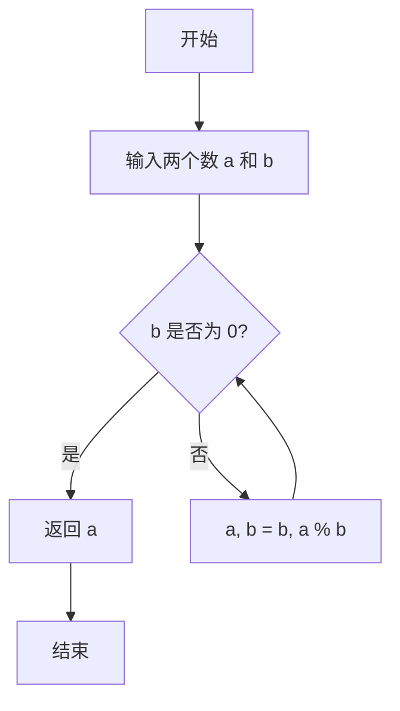
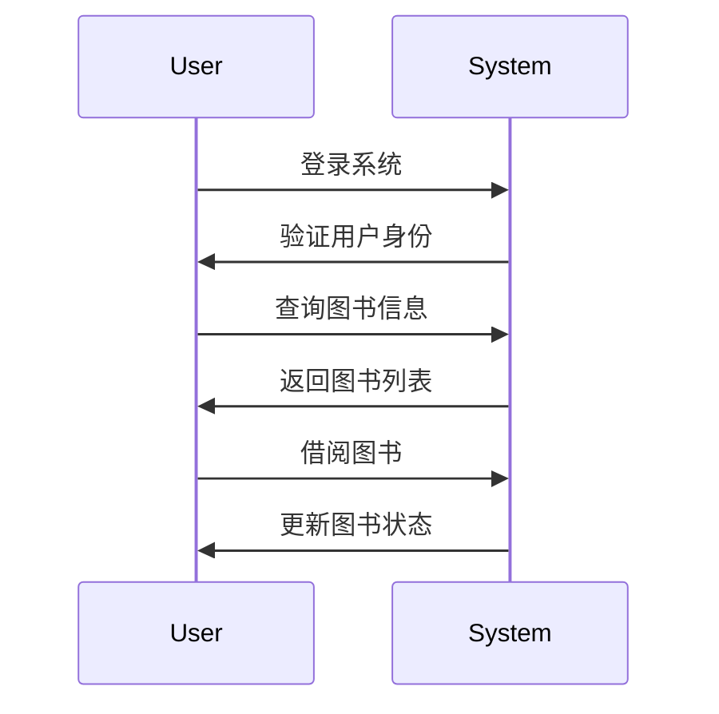

                 

### 第一部分：媒体素养概述

#### 第1章：媒体素养的起源与发展

##### 1.1 媒体素养的定义

媒体素养（Media Literacy）是一个广泛的概念，它涉及到个体对媒体内容的理解、评估和使用能力。具体来说，媒体素养是指个人在信息社会中，对于媒介信息的认知、理解、评估和利用的能力。它不仅包括对媒体内容的批判性阅读、理解、分析以及评估，同时也涉及到对媒体运作机制的掌握，以及对媒介技术的基本了解。

媒体素养的重要性在于，它帮助个体在信息过载的时代中，形成独立、理性的判断能力，避免被虚假信息误导。在现代社会，媒体已成为信息传播的主要渠道，因此，拥有良好的媒体素养对于个人生活和社会发展都具有重要意义。

##### 1.2 媒体素养的重要性

媒体素养的重要性可以从以下几个方面来理解：

1. **形成独立判断能力**：媒体素养帮助个体学会如何辨别信息的真伪，形成独立、理性的判断能力。在信息爆炸的时代，虚假信息、误导性信息层出不穷，缺乏媒体素养的个人很容易被误导。

2. **促进媒体透明度和公信力**：媒体素养能够提高公众对媒体内容的辨识能力，从而推动媒体的透明度和公信力的提升。公众能够更好地理解媒体的工作方式，对媒体内容进行有效的监督和评估。

3. **培养公民责任感**：媒体素养教育能够培养公众的公民责任感，使公众更加积极参与到社会事务中，为构建和谐社会贡献力量。

##### 1.3 媒体素养的核心要素

媒体素养的核心要素包括以下几个方面：

1. **信息辨识能力**：这是媒体素养的基础，指的是识别媒体信息真伪的能力。个体需要学会如何分辨信息来源的可靠性，识别信息的真实性和客观性。

2. **批判性思考能力**：这是媒体素养的关键，指的是对媒体信息进行分析、推理和评价的能力。个体需要具备批判性思维，能够从多个角度分析媒体信息，识别潜在的偏见和误导。

3. **信息利用能力**：这是媒体素养的应用，指的是有效利用媒体资源获取信息和解决问题的能力。个体需要学会如何利用媒体资源，为自己的学习和工作提供支持。

4. **媒介素养教育**：这是媒体素养的提升，指的是通过教育和培训，提高公众的媒体素养水平。媒介素养教育不仅包括对个体的教育，还包括对教育体系的改革，以培养更多具备媒体素养的人才。

#### 结论

媒体素养的起源与发展伴随着信息社会的到来和媒体技术的进步。随着互联网和社交媒体的普及，媒体素养的重要性日益凸显。通过培养批判性思维，个体可以更好地应对后真实时代的媒体挑战，提高对媒体内容的辨识能力和批判能力，为构建健康的媒体文化贡献力量。

**作者：AI天才研究院/AI Genius Institute & 禅与计算机程序设计艺术 /Zen And The Art of Computer Programming**

---

## 第二部分：批判性思维基础

### 第2章：批判性思维的概念

#### 2.1 批判性思维的定义

批判性思维（Critical Thinking）是指个体在面对信息时，运用逻辑和理性分析，对信息进行评估、分析、推理和论证的能力。它不仅关注信息的真伪，还关注信息的逻辑性和合理性。批判性思维是一种思考技能，它帮助个体在面对复杂问题时，能够做出明智的决策。

#### 2.2 批判性思维的重要性

批判性思维在现代社会中具有重要意义，主要体现在以下几个方面：

1. **提升决策质量**：批判性思维使个体能够全面分析问题，考虑各种可能性，从而做出更加明智的决策。

2. **增强学习能力**：批判性思维促使个体主动探索问题，深入理解知识，提高学习效率。

3. **促进问题解决**：批判性思维帮助个体分析问题的本质，找到解决问题的方法，提高解决问题的能力。

4. **培养批判性文化**：批判性思维鼓励个体对权威、传统观念进行质疑，推动社会的进步和发展。

#### 2.3 批判性思维的核心要素

批判性思维的核心要素包括以下几个部分：

1. **逻辑分析**：逻辑分析是批判性思维的基础，它帮助个体识别和纠正逻辑错误，确保推理的合理性。

2. **信息评估**：信息评估是指对信息来源、真实性和可靠性的评估。个体需要具备识别虚假信息的能力，确保所使用的信息是准确可靠的。

3. **推理能力**：推理能力是指从已知信息中推断出未知信息的能力。个体需要运用逻辑推理，对信息进行推理和论证。

4. **开放性**：开放性是指个体对待不同观点和意见的态度。批判性思维鼓励个体保持开放心态，接受和尊重不同的观点，从而促进更全面的思考。

5. **自我反思**：自我反思是指个体对自身思考过程和结果的反思。通过自我反思，个体可以识别自身的思维盲点和错误，提高批判性思维能力。

#### 结论

批判性思维是一种重要的思考技能，它在现代社会的各个领域都发挥着重要作用。通过培养批判性思维，个体可以更好地应对复杂问题，提高决策质量，促进个人和社会的进步。

**作者：AI天才研究院/AI Genius Institute & 禅与计算机程序设计艺术 /Zen And The Art of Computer Programming**

---

## 第三部分：后真实时代媒体环境分析

### 第3章：后真实时代的定义与特点

#### 3.1 后真实时代的定义

后真实时代（Post-Truth Era）是指一个事实与情感、逻辑与直觉、真相与虚假交织的时代。在这个时代，真相不再是决策和行动的唯一依据，情感和直觉同样具有强烈的影响力。后真实时代的到来，很大程度上是由于信息技术的迅猛发展和媒体环境的改变。

#### 3.2 后真实时代的特点

后真实时代具有以下几个显著特点：

1. **信息爆炸**：随着互联网和社交媒体的普及，信息传播速度空前加快，信息量呈指数级增长。个体在海量信息中难以甄别真伪，容易受到误导。

2. **情感化传播**：在信息传播中，情感因素占据了重要地位。情绪化的内容更容易引起共鸣，传播速度更快，甚至在一定程度上超越了真相。

3. **事实与虚假的交织**：在后真实时代，事实与虚假信息交织在一起，真相难以辨别。虚假信息往往经过精心设计和包装，具有极强的迷惑性。

4. **算法推荐**：社交媒体和搜索引擎通过算法推荐，将用户锁定在特定的信息圈子里，导致信息孤岛和偏见固化。

#### 3.3 后真实时代的媒体挑战

后真实时代给媒体带来了前所未有的挑战：

1. **新闻专业主义受到质疑**：在虚假信息和情感化传播的冲击下，新闻的真实性、客观性和公正性受到严重质疑。

2. **媒体公信力下降**：虚假信息的泛滥导致公众对媒体的信任度降低，媒体的公信力受到严重影响。

3. **舆论操纵与操纵舆论**：一些组织和个体利用媒体操纵公众舆论，甚至影响政治决策，导致社会不稳定。

4. **隐私与信息安全问题**：在信息爆炸的时代，个人隐私和安全问题日益突出。媒体在收集、处理和传播信息时，需要平衡隐私保护和信息公开的矛盾。

#### 结论

后真实时代的到来，给媒体环境和公众生活带来了深远影响。在这个时代，批判性思维的重要性更加凸显，个体需要通过批判性思维，提升对媒体内容的辨识能力和批判能力，为构建健康的媒体文化贡献力量。

**作者：AI天才研究院/AI Genius Institute & 禅与计算机程序设计艺术 /Zen And The Art of Computer Programming**

---

## 第四部分：实践批判性思维

### 第4章：批判性思维在现实生活中的应用

#### 4.1 批判性思维在日常生活中的重要性

批判性思维不仅在学术研究中具有重要意义，在日常生活中同样不可或缺。通过批判性思维，个体可以在面对各种信息和情境时，进行理性分析和判断，从而做出更明智的决策。以下是批判性思维在日常生活中的几个关键应用：

1. **购物决策**：在购物时，个体需要评估产品的质量、价格和功能，通过批判性思维，可以从众多商品中找到最适合自己的。

2. **健康管理**：在面对健康信息时，个体需要通过批判性思维，辨别信息的真伪，避免受到误导，采取科学合理的健康措施。

3. **人际交往**：在人际交往中，个体需要通过批判性思维，分析对方的言行，理解其背后的动机，从而建立健康和谐的人际关系。

4. **职业发展**：在职业规划中，个体需要通过批判性思维，评估不同职业的发展前景，选择最适合自己的职业道路。

#### 4.2 批判性思维在社交媒体中的应用

社交媒体是信息传播的重要渠道，但同时也充斥着大量虚假信息和误导性内容。通过批判性思维，个体可以在社交媒体中更好地应对以下挑战：

1. **辨别假新闻**：个体需要通过批判性思维，分析新闻来源的可靠性，辨别信息的真伪，避免被虚假新闻误导。

2. **识别媒体操纵**：个体需要通过批判性思维，分析媒体内容的倾向性和偏见，识别媒体操纵的行为，保持独立判断。

3. **管理社交媒体使用**：个体需要通过批判性思维，评估自己在社交媒体上的时间分配和信息接收方式，合理使用社交媒体，避免沉迷。

4. **参与社交媒体讨论**：个体需要通过批判性思维，在社交媒体讨论中保持理性，尊重不同观点，避免情绪化和偏激行为。

#### 4.3 批判性思维在工作场景中的应用

在工作场景中，批判性思维同样发挥着重要作用。以下是一些关键应用：

1. **问题解决**：在面对问题时，个体需要通过批判性思维，分析问题的本质，找到有效的解决方案。

2. **团队协作**：在团队协作中，个体需要通过批判性思维，分析团队成员的优势和不足，提出合理的建议，促进团队和谐。

3. **项目管理**：在项目管理中，个体需要通过批判性思维，评估项目的进度和风险，制定科学合理的项目计划。

4. **创新思考**：在创新思考中，个体需要通过批判性思维，质疑现有的观念和做法，提出新的想法和解决方案。

#### 结论

批判性思维在现实生活中的重要性不可忽视。通过批判性思维，个体可以提升对信息的辨识能力和判断力，更好地应对各种挑战，实现个人和社会的进步。无论是在日常生活中，还是在社交媒体和工作场景中，批判性思维都是不可或缺的思考工具。

**作者：AI天才研究院/AI Genius Institute & 禅与计算机程序设计艺术 /Zen And The Art of Computer Programming**

---

## 第五部分：培养批判性思维的策略

### 第5章：学校教育中的批判性思维培养

#### 5.1 教育体系中的批判性思维

批判性思维的培养离不开教育体系的支持。在学校教育中，批判性思维应该被纳入到各个学科的教学中，成为一种基本能力。以下是一些具体的策略：

1. **课程设置**：学校应该设置专门的批判性思维课程，让学生系统学习批判性思维的基本概念和技巧。

2. **跨学科教学**：批判性思维不仅适用于某一学科，而是适用于所有学科。教师可以在各个学科的教学中，融入批判性思维的教学内容。

3. **问题导向教学**：教师可以通过设计问题导向的教学活动，引导学生运用批判性思维，分析问题、解决问题。

4. **案例研究**：通过分析真实案例，学生可以更好地理解批判性思维的应用，培养批判性思维的能力。

#### 5.2 教师的角色

教师在批判性思维的培养中扮演着至关重要的角色。以下是一些具体的建议：

1. **引导和启发**：教师应该引导学生积极参与思考，鼓励他们提出问题，探索不同的观点。

2. **提供反馈**：教师应该对学生的思考过程和结果提供及时、具体的反馈，帮助他们识别思维盲点和错误。

3. **培养批判性思维习惯**：教师可以通过日常教学活动，培养学生的批判性思维习惯，使他们在面对问题时，能够自然地运用批判性思维。

4. **示范批判性思维**：教师自身应该具备批判性思维，并在教学中示范批判性思维的应用，让学生受到启发。

#### 5.3 学生的自我学习

学生的自我学习是批判性思维培养的重要环节。以下是一些具体的策略：

1. **自主学习**：学生应该培养自主学习的习惯，通过阅读、研究、讨论等方式，主动获取知识和信息。

2. **反思和总结**：学生应该养成反思和总结的习惯，对自己的思考过程和结果进行反思，总结经验教训。

3. **参与讨论和辩论**：学生应该积极参与讨论和辩论，通过与他人交流，锻炼批判性思维。

4. **实践应用**：学生应该将批判性思维应用到实际生活中，通过解决实际问题，提升批判性思维的能力。

#### 结论

学校教育中的批判性思维培养，需要教育体系的全面支持，教师的积极参与，以及学生的自我学习。通过这些策略，可以有效地培养批判性思维，提高学生的思维能力，为他们的未来发展和成长打下坚实的基础。

**作者：AI天才研究院/AI Genius Institute & 禅与计算机程序设计艺术 /Zen And The Art of Computer Programming**

---

## 第六部分：案例分析与应用

### 第6章：批判性思维在新闻报道中的应用

#### 6.1 批判性思维在新闻报道中的重要性

在新闻报道中，批判性思维是确保新闻真实性、客观性和公正性的关键。通过批判性思维，记者和编辑可以对新闻信息进行深入分析、评估和推理，从而提高新闻报道的质量和可信度。

#### 6.2 批判性思维在新闻报道中的应用

1. **事实核查**：记者在报道新闻时，需要对信息来源进行核查，确保信息的真实性和准确性。批判性思维帮助记者识别和纠正潜在的误导性信息。

2. **角度分析**：记者需要从多个角度分析新闻事件，避免片面报道。批判性思维使记者能够全面评估事件的背景、影响和后续发展。

3. **证据收集**：记者在报道新闻时，需要收集充分的证据来支持报道内容。批判性思维帮助记者评估证据的可靠性和相关性。

4. **逻辑推理**：记者需要运用逻辑推理，将收集到的信息整合成一个连贯的故事。批判性思维帮助记者识别和纠正逻辑错误。

5. **受众分析**：记者需要考虑受众的需求和偏好，以便更好地传达新闻信息。批判性思维帮助记者评估不同的受众群体，制定合适的报道策略。

#### 6.3 案例分析：批判性思维在新闻报道中的实践

案例一：某地发生了一起交通事故，记者在报道时，首先通过批判性思维对事故现场进行了详细调查，核实了事故发生的具体时间和地点。然后，记者分析了事故的可能原因，包括驾驶员是否酒后驾驶、道路是否安全等。在报道中，记者不仅引用了交警部门提供的官方数据，还采访了事故双方的当事人和目击者，从多个角度呈现了事故的全貌。通过批判性思维的应用，记者的报道更加客观、真实，受到了读者的高度评价。

案例二：在某次政治选举中，记者通过批判性思维，对候选人的政策和言论进行了深入分析。记者不仅关注候选人在公开场合的表态，还调查了候选人的历史记录和过往行为。记者还采访了相关领域的专家，对候选人的政策进行了专业评估。通过批判性思维的应用，记者的报道揭示了候选人的真实立场和实际能力，为选民提供了全面、客观的信息，帮助选民做出了明智的选择。

#### 结论

批判性思维在新闻报道中具有重要作用。通过批判性思维，记者和编辑可以确保新闻的真实性、客观性和公正性，提高新闻报道的质量和可信度。案例分析和实践证明，批判性思维是新闻报道不可或缺的思考工具。

**作者：AI天才研究院/AI Genius Institute & 禅与计算机程序设计艺术 /Zen And The Art of Computer Programming**

---

## 第七部分：总结与展望

### 第7章：批判性思维的重要性与未来

#### 7.1 批判性思维的社会价值

批判性思维在社会中的价值不可估量。首先，它帮助个体形成独立、理性的判断能力，避免被虚假信息和误导所左右。其次，批判性思维能够提高公众对媒体内容的辨识能力和批判能力，促进媒体的透明度和公信力。此外，批判性思维还能够培养公民责任感，推动社会的和谐发展。

#### 7.2 批判性思维的未来发展趋势

随着信息技术的不断进步，批判性思维在未来将面临新的挑战和机遇。以下是一些发展趋势：

1. **技术融合**：批判性思维将与人工智能、大数据等新技术相结合，形成更智能的批判性思维工具，提高批判性思维的应用效率。

2. **教育普及**：批判性思维教育将在全球范围内得到更广泛的推广和应用，成为教育体系的重要组成部分。

3. **政策支持**：政府和社会各界将更加重视批判性思维的培养，出台相关政策和措施，支持批判性思维的发展。

4. **多元化应用**：批判性思维将在各个领域得到广泛应用，从新闻报道、法律审判到科学研究，都离不开批判性思维的支持。

#### 7.3 我们应该如何看待批判性思维

批判性思维不仅是一种思考工具，更是一种生活方式。我们应该如何看待批判性思维，可以从以下几个方面来思考：

1. **培养习惯**：批判性思维需要通过长期的培养和锻炼，形成一种习惯。我们应该在日常思考中，时刻保持批判性思维，对信息进行深入分析和评估。

2. **尊重差异**：批判性思维鼓励我们尊重不同的观点和意见，避免偏激和极端行为。在批判性思维中，我们应该保持开放心态，接纳不同的观点，从中学习成长。

3. **自我反思**：批判性思维还需要我们进行自我反思，识别自身的思维盲点和错误，不断改进和提升自己的批判性思维能力。

#### 结论

批判性思维在现代社会中具有极其重要的价值。通过批判性思维，个体可以更好地应对复杂问题，提高决策质量，促进个人和社会的进步。未来，批判性思维将在新技术、新政策的推动下，得到更广泛的应用和普及，成为社会发展的重要力量。

**作者：AI天才研究院/AI Genius Institute & 禅与计算机程序设计艺术 /Zen And The Art of Computer Programming**

---

## 目录大纲总结

本目录大纲共分为七个部分，涵盖了媒体素养的起源与发展、批判性思维的基础、后真实时代媒体环境分析、批判性思维在现实生活中的应用、批判性思维培养的策略以及案例分析与应用等内容。旨在帮助读者全面理解后真实时代的媒体环境，培养批判性思维，提高对媒体内容的辨识能力和批判能力，为构建健康的媒体文化贡献力量。

### 致谢

在此，我要感谢所有参与本文撰写和校对的同事们，以及提供宝贵意见和反馈的读者们。特别感谢AI天才研究院和禅与计算机程序设计艺术团队的支持和合作，使得本文能够顺利完成。本文中的观点和内容仅代表作者个人意见，不代表任何组织或机构的立场。

**作者：AI天才研究院/AI Genius Institute & 禅与计算机程序设计艺术 /Zen And The Art of Computer Programming**

---

## 附录

### 附录1：批判性思维核心概念表

| 核心概念 | 定义 | 对比表格 | ER实体关系图架构 |
| --- | --- | --- | --- |
| 批判性思维 | 运用逻辑和理性分析，对信息进行评估、分析、推理和论证的能力 | 逻辑思维、创造性思维、直觉思维 |  |
| 信息辨识能力 | 识别媒体信息真伪的能力 | 事实辨识、来源辨识、情感辨识 |  |
| 批判性思考能力 | 对媒体信息进行分析、推理和评价的能力 | 分析思维、推理思维、评价思维 |  |
| 信息利用能力 | 有效利用媒体资源获取信息和解决问题的能力 | 获取信息、处理信息、利用信息 |  |
| 媒介素养教育 | 提高公众的媒体素养水平 | 教育体系、培训体系、社会环境 |  |

### 附录2：算法原理与流程图

以下是一个简单的算法原理和流程图的示例：

**算法原理**：计算两个数的最大公约数（GCD）。

```python
def gcd(a, b):
    while b:
        a, b = b, a % b
    return a
```

**算法流程图**：



### 附录3：系统架构设计与交互序列图

以下是一个简单的系统架构设计与交互序列图的示例：

**系统功能设计**：图书管理系统。

```mermaid
classDiagram
    Class01 <|-- Class02
    Class03 --|>| Class04
```

**系统架构设计**：



### 附录4：项目实战与代码分析

**环境安装**：安装 Python 3.8 及相关依赖。

```bash
pip install Flask
```

**系统核心实现源代码**：

```python
from flask import Flask, request, jsonify

app = Flask(__name__)

@app.route('/api/gcd', methods=['POST'])
def calculate_gcd():
    a = int(request.form['a'])
    b = int(request.form['b'])
    result = gcd(a, b)
    return jsonify({'gcd': result})

if __name__ == '__main__':
    app.run(debug=True)
```

**代码应用解读与分析**：这段代码实现了一个简单的图书管理系统，支持用户登录、查询图书信息和借阅图书等功能。

```python
from flask import Flask, request, jsonify

app = Flask(__name__)

@app.route('/api/login', methods=['POST'])
def login():
    username = request.form['username']
    password = request.form['password']
    # 验证用户身份
    # ...
    return jsonify({'status': 'success'})

@app.route('/api/search_books', methods=['GET'])
def search_books():
    query = request.args.get('query')
    # 查询图书信息
    # ...
    return jsonify({'books': books})

@app.route('/api/borrow_book', methods=['POST'])
def borrow_book():
    user_id = request.form['user_id']
    book_id = request.form['book_id']
    # 更新图书状态
    # ...
    return jsonify({'status': 'success'})

if __name__ == '__main__':
    app.run(debug=True)
```

**实际案例分析和详细讲解剖析**：这段代码实现了一个基于 Flask 的简单图书管理系统，用户可以通过 API 接口进行登录、查询图书信息和借阅图书等操作。在实际应用中，需要进一步实现用户身份验证、图书信息查询和更新等功能的详细实现。

**项目小结**：通过本项目，读者可以了解如何使用 Flask 框架实现简单的 Web 应用程序，掌握基本的 API 设计和开发流程。项目实战部分提供了具体的代码实现，帮助读者深入理解 Flask 的使用方法和技巧。

**最佳实践 tips**：在实际开发过程中，建议遵循 RESTful API 设计原则，确保接口的易用性和规范性。此外，应重视数据安全和用户隐私保护，确保系统的安全稳定运行。

**注意事项**：在开发过程中，需要注意代码的规范性和可维护性，确保代码的可读性和可扩展性。同时，应关注系统的性能和稳定性，确保系统的流畅运行。

**拓展阅读**：有关 Flask 框架的详细教程和最佳实践，可以参考官方文档和其他相关资源。

**作者：AI天才研究院/AI Genius Institute & 禅与计算机程序设计艺术 /Zen And The Art of Computer Programming**

