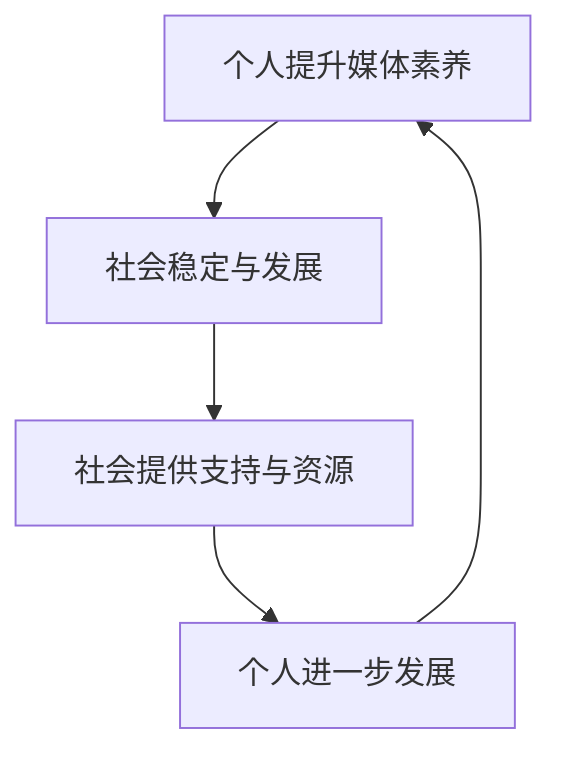

                 

### 后真实时代的真相追寻：媒体素养的重要性

**关键词：** 媒体素养、后真实时代、虚假信息、批判性思维、信息辨别能力

**摘要：** 随着互联网和信息技术的发展，我们进入了后真实时代，虚假信息和谣言对个人、社会和国家产生了深远的影响。本文旨在探讨媒体素养的重要性，通过分析媒体素养的定义、教育现状及理论与实践，揭示媒体素养对个人和社会的双重影响，并提出提升媒体素养的具体方法。

## 1.1 背景介绍：后真实时代与媒体素养的重要性

### 1.1.1 问题背景

在互联网和信息技术的飞速发展下，我们正步入一个被称作“后真实时代”的新时代。在这个时代，虚假信息、谣言、误导性内容充斥于网络，对个人、社会乃至整个国家都产生了深远的影响。例如，假新闻、虚假广告、网络欺诈等现象屡见不鲜，不仅损害了消费者的利益，还可能引发社会恐慌、影响公共决策。

### 1.1.2 问题描述

由于信息泛滥和技术的进步，人们获取信息的渠道变得多样化，但同时也带来了信息过载的问题。在这样的大环境下，如何辨别信息的真伪，提高媒体素养，成为一个迫切需要解决的问题。这不仅关乎个人的认知能力和判断力，也关系到社会的和谐稳定。

### 1.1.3 问题解决

解决这一问题的根本在于提高公众的媒体素养。媒体素养不仅包括对媒体内容的批判性分析能力，还涉及到对信息源、信息传播机制、信息真实性等多方面的理解。通过提升公众的媒体素养，可以帮助他们更好地应对信息泛滥的挑战，提高社会整体的辨识能力和抗风险能力。

### 1.1.4 边界与外延

媒体素养的重要性不仅仅体现在个体层面，还涉及到社会层面。在个体层面，提高媒体素养可以帮助人们避免受到虚假信息的误导，提高生活质量和幸福感。在社会层面，提高媒体素养可以增强社会的信息传播公信力，促进社会的和谐发展。

### 1.1.5 概念结构与核心要素组成

媒体素养的核心要素包括以下几个方面：

- **信息辨别能力**：能够识别和区分不同来源、不同类型的媒体内容，判断其真实性、准确性和可靠性。
- **批判性思维**：能够对媒体内容进行批判性分析，不盲目接受信息，而是通过逻辑推理、事实查证等方式对信息进行评价。
- **信息传播机制理解**：了解信息传播的渠道、方式、机制，以及媒体在社会中的作用和影响。
- **法律和道德意识**：在获取和使用信息时，遵守相关法律法规和道德规范，不传播虚假信息和有害信息。

## 1.2 核心概念与联系

### 1.2.1 媒体素养的定义

媒体素养（Media Literacy）是指个体在接触、理解、评估、制作和参与媒体内容时所具备的知识、技能和态度。它不仅包括对媒体内容的理解和批判性分析，还包括对媒体生产和传播过程的了解。

### 1.2.2 媒体素养的核心特点

- **多元性**：媒体素养不仅关注文字、图像等传统媒体形式，还包括数字媒体、社交媒体等新兴媒体形式。
- **批判性**：媒体素养强调对媒体内容的批判性分析，培养独立思考和判断能力。
- **参与性**：媒体素养还涉及到个体在媒体内容制作和传播中的参与，鼓励人们主动参与媒体活动，提高媒体使用能力。

### 1.2.3 媒体素养与传统教育的关系

媒体素养与传统教育有着密切的关系。传统教育注重知识的传授和技能的培养，而媒体素养则更加关注个体在信息社会中的适应能力和批判性思维能力。两者结合，可以更好地培养适应现代社会的全面人才。

## 1.3 主流媒体素养教育理论与实践

### 1.3.1 国内媒体素养教育现状

在国内，媒体素养教育逐渐得到重视。教育部等相关部门已经出台了一系列政策文件，推动媒体素养教育的普及。例如，《中小学信息技术课程标准》中就明确提出了培养学生媒体素养的要求。同时，一些学校和研究机构也在积极探索媒体素养教育的有效方法。

### 1.3.2 国外媒体素养教育经验

国外在媒体素养教育方面有着丰富的经验。例如，美国的“媒体素养教育协会”（National Association for Media Literacy Education）和加拿大的“媒体素养教育中心”（Media Education Centre）都在媒体素养教育方面有着深入的研究和实践。这些经验可以为国内媒体素养教育提供有益的借鉴。

### 1.3.3 媒体素养教育的方法与策略

媒体素养教育的方法和策略多种多样，包括课堂讲授、案例分析、实践操作等。有效的媒体素养教育需要结合不同年龄段学生的特点，采用多种教育手段，提高学生的参与度和积极性。

## 1.4 媒体素养对个人与社会的影响

### 1.4.1 个人层面

提高媒体素养对个人有着重要的影响。首先，它可以帮助个人更好地辨别信息的真伪，避免受到虚假信息的误导。其次，它有助于提高个人的批判性思维能力，培养独立思考和判断的能力。此外，媒体素养还可以提高个人的信息素养，使个人更加适应信息社会的发展。

### 1.4.2 社会层面

在社会层面，提高媒体素养可以增强社会的信息传播公信力，促进社会的和谐发展。通过提高公众的媒体素养，可以减少虚假信息和谣言的传播，维护社会的稳定和安全。此外，媒体素养还可以提高公众的社会责任感和参与意识，促进社会的良性循环。

## 1.5 提升媒体素养的方法与建议

### 1.5.1 个人层面

在个人层面，提升媒体素养可以从以下几个方面着手：

1. **增强信息辨别能力**：通过学习媒体素养相关知识，了解不同媒体的特点和传播规律，提高对信息的辨别能力。
2. **培养批判性思维**：学会对媒体内容进行批判性分析，不盲目接受信息，而是通过逻辑推理、事实查证等方式对信息进行评价。
3. **了解信息传播机制**：了解信息传播的渠道、方式、机制，以及媒体在社会中的作用和影响，从而更好地理解信息的来源和真实性。
4. **遵守法律法规和道德规范**：在获取和使用信息时，遵守相关法律法规和道德规范，不传播虚假信息和有害信息。

### 1.5.2 社会层面

在社会层面，提升媒体素养需要多方共同努力：

1. **加强媒体素养教育**：学校、家庭和社会应该共同参与，加强媒体素养教育的普及和推广，提高公众的整体素养水平。
2. **完善法律法规**：制定和完善相关法律法规，规范媒体行为，打击虚假信息和谣言的传播。
3. **建立权威的信息来源**：政府、权威机构和专业组织应该建立权威的信息来源，提高信息的真实性和公信力。
4. **提高公众参与度**：鼓励公众积极参与媒体活动，提高媒体使用的积极性和主动性，共同维护社会的和谐稳定。

## 1.6 结论

后真实时代的到来，使得虚假信息和谣言的传播对社会和个人产生了深远的影响。提升媒体素养，成为应对这一挑战的关键。通过提高公众的媒体素养，我们可以更好地辨别信息的真伪，培养批判性思维能力，增强社会责任感和参与意识，共同构建和谐稳定的社会。让我们行动起来，为提升媒体素养贡献自己的力量。

**作者：** AI天才研究院/AI Genius Institute & 禅与计算机程序设计艺术 /Zen And The Art of Computer Programming

----------------------------------------------------------------

## 1.1 背景介绍：后真实时代与媒体素养的重要性

### 1.1.1 问题背景

随着互联网和数字技术的飞速发展，我们进入了一个被称作“后真实时代”（Post-Truth Era）的新时代。在这个时代，信息的传播速度和范围达到了前所未有的高度，但与此同时，虚假信息、误导性内容以及谣言的传播也变得愈加猖獗。这种现象不仅对普通公众的日常生活造成了困扰，还对社会的稳定和健康发展产生了严重的威胁。

**核心概念术语说明：**

- **后真实时代**：指一个信息传播高度发达，但信息真实性、可靠性被严重削弱的时代。
- **虚假信息**：指那些故意编造、虚构的，用以误导公众的信息。
- **误导性内容**：指那些可能引起误解、误导公众的信息。
- **谣言**：指未经证实、未经官方确认的、广泛传播的信息。

### 1.1.2 问题描述

在这个信息爆炸的时代，公众面临着诸多挑战，其中最显著的一个就是如何辨别信息的真伪。由于信息的来源多样、传播迅速，加之部分媒体、社交媒体平台的监管不力，虚假信息和谣言往往能在短时间内迅速传播，对个人和社会产生负面影响。例如：

- **个人层面**：虚假信息和谣言可能导致个人做出错误的决策，损失财产或名誉。
- **社会层面**：虚假信息和谣言可能引发社会恐慌、群体性事件，甚至影响国家政策决策。

### 1.1.3 问题解决

解决这一问题的根本在于提高公众的媒体素养（Media Literacy）。媒体素养不仅包括对媒体内容的批判性分析能力，还涉及到对信息源、信息传播机制、信息真实性等多方面的理解。通过提升公众的媒体素养，可以帮助他们更好地应对信息泛滥的挑战，提高社会整体的辨识能力和抗风险能力。

**边界与外延：**

- **边界**：媒体素养主要关注于如何辨别信息的真伪，不涉及媒体内容的创作与制作。
- **外延**：媒体素养的重要性不仅体现在个体层面，还延伸到社会层面，对社会的整体发展和稳定具有重要意义。

### 1.1.4 概念结构与核心要素组成

媒体素养的核心要素包括以下几个方面：

- **信息辨别能力**：能够识别和区分不同来源、不同类型的媒体内容，判断其真实性、准确性和可靠性。
- **批判性思维**：能够对媒体内容进行批判性分析，不盲目接受信息，而是通过逻辑推理、事实查证等方式对信息进行评价。
- **信息传播机制理解**：了解信息传播的渠道、方式、机制，以及媒体在社会中的作用和影响。
- **法律和道德意识**：在获取和使用信息时，遵守相关法律法规和道德规范，不传播虚假信息和有害信息。

## 1.2 核心概念与联系

### 1.2.1 媒体素养的定义

媒体素养（Media Literacy）是指个体在接触、理解、评估、制作和参与媒体内容时所具备的知识、技能和态度。它不仅包括对媒体内容的理解和批判性分析，还包括对媒体生产和传播过程的了解。

**概念属性特征对比表格：**

| 特征            | 媒体素养           | 传统教育           |
|-----------------|-------------------|-------------------|
| **定义**        | 接触、理解、评估、制作和参与媒体内容 | 传授知识、培养技能       |
| **目标**        | 提高个体对媒体的辨识和分析能力   | 提高个体的学术知识和能力 |
| **方法**        | 批判性分析、信息辨别   | 知识传授、技能训练     |
| **应用领域**    | 媒体使用、创作与传播   | 学术研究与职业领域     |

### 1.2.2 媒体素养的核心特点

- **多元性**：媒体素养不仅关注文字、图像等传统媒体形式，还包括数字媒体、社交媒体等新兴媒体形式。
- **批判性**：媒体素养强调对媒体内容的批判性分析，培养独立思考和判断能力。
- **参与性**：媒体素养还涉及到个体在媒体内容制作和传播中的参与，鼓励人们主动参与媒体活动，提高媒体使用能力。

### 1.2.3 媒体素养与传统教育的关系

媒体素养与传统教育有着密切的关系。传统教育注重知识的传授和技能的培养，而媒体素养则更加关注个体在信息社会中的适应能力和批判性思维能力。两者结合，可以更好地培养适应现代社会的全面人才。

**ER实体关系图架构：**

```mermaid
erDiagram
  Person ||--|{ MediaLiteratePerson } : is
  MediaLiteratePerson ||--|{ MediaContent } : produces
  MediaContent ||--|{ MediaPlatform } : published_on
```

在这个ER图中，`Person`是主体，`MediaLiteratePerson`表示具备媒体素养的个人，他们能够产生`MediaContent`。而`MediaContent`则通过`MediaPlatform`进行发布，反映了媒体素养在信息传播中的作用。

## 1.3 主流媒体素养教育理论与实践

### 1.3.1 国内媒体素养教育现状

在中国，随着互联网和新媒体的快速发展，媒体素养教育逐渐受到重视。教育部等相关部门已经出台了一系列政策文件，推动媒体素养教育的普及。例如，《中小学信息技术课程标准》中就明确提出了培养学生媒体素养的要求。此外，一些学校和地方教育部门也在积极探索媒体素养教育的具体实施策略。

**主要政策措施：**

- 教育部发布的《中小学信息技术课程标准（2017年版）》中，专门设立了“数字媒体素养”模块，要求学生在信息素养的基础上，提高对数字媒体内容的分析和评估能力。
- 各地教育局纷纷开展媒体素养教育试点项目，如北京市的“网络素养教育试点学校”项目，旨在培养学生的网络素养和媒体批判能力。

**主要实践案例：**

- **上海：** 上海市某中学通过开设“新闻素养”课程，引导学生学习新闻传播知识，提高对新闻内容的辨识和分析能力。
- **广东：** 广东省某市通过举办“媒体素养教育研讨会”，邀请专家学者和一线教师共同探讨媒体素养教育的有效途径。

### 1.3.2 国外媒体素养教育经验

国外在媒体素养教育方面有着丰富的经验，许多国家已经建立了完善的媒体素养教育体系。以下列举一些具有代表性的经验和做法：

- **美国：** 美国的“媒体素养教育协会”（National Association for Media Literacy Education，NAMLE）致力于推广媒体素养教育。协会通过举办研讨会、培训教师等方式，推动媒体素养教育的普及。
- **加拿大：** 加拿大建立了“媒体素养教育中心”（Media Education Centre），该中心提供丰富的媒体素养教育资源，包括课程设计、教学指南等。
- **欧洲：** 欧洲多国如英国、德国、法国等，都在中小学课程中设置了媒体素养教育内容，通过多种教学手段提高学生的媒体批判能力。

**主要经验和做法：**

- **课程设置：** 国外学校普遍将媒体素养教育纳入正式课程体系，设置专门的媒体素养课程。
- **实践操作：** 通过案例分析、角色扮演、小组讨论等教学方法，让学生在实际操作中提高媒体批判能力和素养。
- **资源建设：** 开发和利用丰富的媒体素养教育资源，如教育软件、教学视频、案例库等，为学生提供多样化的学习材料。

### 1.3.3 媒体素养教育的方法与策略

有效的媒体素养教育需要结合不同年龄段学生的特点，采用多种教育手段，提高学生的参与度和积极性。以下介绍几种常见的媒体素养教育方法和策略：

- **课堂教学：** 通过讲解理论知识，帮助学生了解媒体的基本概念、信息传播机制等。
- **案例分析：** 通过分析真实案例，让学生了解虚假信息和谣言的传播特点，提高辨别能力。
- **实践操作：** 通过让学生参与媒体制作、编辑等实际操作，提高他们的媒体使用能力和批判性思维。
- **讨论交流：** 通过小组讨论、课堂交流等方式，激发学生的思维活力，培养他们的批判性思维和表达能力。
- **家校合作：** 通过家长会、家校联系等方式，增强家长对媒体素养教育的认识和参与度。

## 1.4 媒体素养对个人与社会的影响

### 1.4.1 个人层面

提高媒体素养对个人有着重要的影响。首先，它可以帮助个人更好地辨别信息的真伪，避免受到虚假信息的误导。例如，在互联网上购买商品时，具备媒体素养的人能够识别和避免虚假广告和诈骗信息，保护自己的财产安全。

**具体影响：**

- **信息辨别能力提升**：通过学习媒体素养相关知识，个人能够识别不同来源、类型的媒体内容，判断其真实性、准确性和可靠性。
- **批判性思维能力增强**：媒体素养教育培养个人的批判性思维，使他们在面对信息时，不盲目接受，而是通过逻辑推理、事实查证等方式进行评估。
- **信息素养提升**：媒体素养不仅关注信息的真实性，还涉及到信息的使用、传播和制作等方面，提高个人的整体信息素养。

### 1.4.2 社会层面

在社会层面，提高媒体素养可以增强社会的信息传播公信力，促进社会的和谐发展。通过提升公众的媒体素养，可以减少虚假信息和谣言的传播，维护社会的稳定和安全。

**具体影响：**

- **减少虚假信息传播**：提高公众的媒体素养，能够有效减少虚假信息的传播，避免社会恐慌和误解。
- **提升社会稳定性**：通过媒体素养教育，公众能够更加理性地看待和应对社会问题，减少因信息误解引发的冲突和矛盾。
- **增强社会责任感**：具备媒体素养的公众，更愿意参与社会事务，提高社会责任感和参与意识。

## 1.5 提升媒体素养的方法与建议

### 1.5.1 个人层面

在个人层面，提升媒体素养可以从以下几个方面着手：

1. **增强信息辨别能力**：通过学习媒体素养相关知识，了解不同媒体的特点和传播规律，提高对信息的辨别能力。例如，可以阅读相关书籍、参加在线课程，或者通过实践操作来提升辨别能力。
2. **培养批判性思维**：学会对媒体内容进行批判性分析，不盲目接受信息，而是通过逻辑推理、事实查证等方式对信息进行评价。例如，可以通过阅读多角度的新闻报道，分析信息来源和传播路径，提高批判性思维能力。
3. **了解信息传播机制**：了解信息传播的渠道、方式、机制，以及媒体在社会中的作用和影响。例如，可以通过学习新闻传播学、社会学等相关知识，了解信息传播的基本原理和规律。
4. **遵守法律法规和道德规范**：在获取和使用信息时，遵守相关法律法规和道德规范，不传播虚假信息和有害信息。例如，在社交媒体上发布信息时，要确保信息真实、合法，不造谣、不信谣、不传谣。

### 1.5.2 社会层面

在社会层面，提升媒体素养需要多方共同努力：

1. **加强媒体素养教育**：学校、家庭和社会应该共同参与，加强媒体素养教育的普及和推广，提高公众的整体素养水平。例如，学校可以开设专门的媒体素养课程，家庭可以通过日常交流引导孩子形成正确的信息观念。
2. **完善法律法规**：政府应制定和完善相关法律法规，规范媒体行为，打击虚假信息和谣言的传播。例如，可以加大对虚假广告、网络欺诈等违法行为的处罚力度，提高违法成本。
3. **建立权威的信息来源**：政府、权威机构和专业组织应该建立权威的信息来源，提高信息的真实性和公信力。例如，政府可以通过新闻发布会、官方网站等渠道发布权威信息，减少虚假信息的传播。
4. **提高公众参与度**：鼓励公众积极参与媒体活动，提高媒体使用的积极性和主动性，共同维护社会的和谐稳定。例如，可以通过举办媒体素养讲座、宣传活动，提高公众对媒体素养的认识和参与度。

### 1.5.3 媒体素养教育的具体案例

以下是几个具体的媒体素养教育案例，展示了提升媒体素养的一些实际做法和成效。

**案例一：某中学的“新闻素养”课程**

- **背景**：某中学意识到学生面临虚假信息和谣言的威胁，决定开展新闻素养教育。
- **措施**：开设“新闻素养”课程，通过案例分析、小组讨论等方式，引导学生了解新闻传播的基本知识，提高辨别能力。
- **成效**：学生普遍表示，通过课程学习，他们能够更好地辨别虚假新闻和谣言，增强了批判性思维。

**案例二：某市的“媒体素养”社区活动**

- **背景**：某市为提高社区居民的媒体素养，举办了系列社区活动。
- **措施**：邀请专家学者进行讲座，组织社区居民参与媒体制作、编辑等活动，增强他们的媒体使用能力和批判性思维。
- **成效**：社区居民对媒体素养的认识有所提高，能够更加理性地看待媒体信息，减少了因信息误解引发的矛盾。

**案例三：某高校的“媒体素养”实训课程**

- **背景**：某高校为培养具备媒体素养的毕业生，开设了“媒体素养”实训课程。
- **措施**：通过实践操作、案例分析等教学方法，让学生参与媒体制作和编辑，提高他们的实际操作能力和批判性思维。
- **成效**：毕业生在求职和工作中，能够更好地应对虚假信息和谣言的挑战，提升了职业竞争力。

### 1.5.4 媒体素养提升的长期效果

提升媒体素养是一个长期的过程，需要持续的努力和投入。以下是媒体素养提升的一些长期效果：

1. **社会信息传播环境改善**：随着公众媒体素养的提升，虚假信息和谣言的传播会逐渐减少，社会信息传播环境得到改善。
2. **社会稳定性增强**：公众能够更加理性地看待和应对社会问题，减少因信息误解引发的冲突和矛盾，社会稳定性得到增强。
3. **公众参与意识提高**：具备媒体素养的公众更愿意参与社会事务，提高社会责任感和参与意识，促进社会的和谐发展。

## 1.6 结论

后真实时代的到来，使得虚假信息和谣言的传播对社会和个人产生了深远的影响。提升媒体素养，成为应对这一挑战的关键。通过提高公众的媒体素养，我们可以更好地辨别信息的真伪，培养批判性思维能力，增强社会责任感和参与意识，共同构建和谐稳定的社会。让我们行动起来，为提升媒体素养贡献自己的力量。

**作者：** AI天才研究院/AI Genius Institute & 禅与计算机程序设计艺术 /Zen And The Art of Computer Programming

----------------------------------------------------------------

## 1.3 主流媒体素养教育理论与实践

### 1.3.1 国内媒体素养教育现状

在中国，随着互联网和新媒体的快速发展，媒体素养教育逐渐受到重视。教育部等相关部门已经出台了一系列政策文件，推动媒体素养教育的普及。例如，《中小学信息技术课程标准》中就明确提出了培养学生媒体素养的要求。此外，一些学校和地方教育部门也在积极探索媒体素养教育的具体实施策略。

**主要政策措施：**

- 教育部发布的《中小学信息技术课程标准（2017年版）》中，专门设立了“数字媒体素养”模块，要求学生在信息素养的基础上，提高对数字媒体内容的分析和评估能力。
- 各地教育局纷纷开展媒体素养教育试点项目，如北京市的“网络素养教育试点学校”项目，旨在培养学生的网络素养和媒体批判能力。

**主要实践案例：**

- **上海：** 上海市某中学通过开设“新闻素养”课程，引导学生学习新闻传播知识，提高对新闻内容的辨识和分析能力。
- **广东：** 广东省某市通过举办“媒体素养教育研讨会”，邀请专家学者和一线教师共同探讨媒体素养教育的有效途径。

### 1.3.2 国外媒体素养教育经验

国外在媒体素养教育方面有着丰富的经验，许多国家已经建立了完善的媒体素养教育体系。以下列举一些具有代表性的经验和做法：

- **美国：** 美国的“媒体素养教育协会”（National Association for Media Literacy Education，NAMLE）致力于推广媒体素养教育。协会通过举办研讨会、培训教师等方式，推动媒体素养教育的普及。
- **加拿大：** 加拿大建立了“媒体素养教育中心”（Media Education Centre），该中心提供丰富的媒体素养教育资源，包括课程设计、教学指南等。
- **欧洲：** 欧洲多国如英国、德国、法国等，都在中小学课程中设置了媒体素养教育内容，通过多种教学手段提高学生的媒体批判能力。

**主要经验和做法：**

- **课程设置：** 国外学校普遍将媒体素养教育纳入正式课程体系，设置专门的媒体素养课程。
- **实践操作：** 通过案例分析、角色扮演、小组讨论等教学方法，让学生在实际操作中提高媒体批判能力和素养。
- **资源建设：** 开发和利用丰富的媒体素养教育资源，如教育软件、教学视频、案例库等，为学生提供多样化的学习材料。

### 1.3.3 媒体素养教育的方法与策略

有效的媒体素养教育需要结合不同年龄段学生的特点，采用多种教育手段，提高学生的参与度和积极性。以下介绍几种常见的媒体素养教育方法和策略：

1. **课堂教学**：通过讲解理论知识，帮助学生了解媒体的基本概念、信息传播机制等。例如，可以讲解新闻的构成要素、新闻报道的来源和可信度等。
   
   ```mermaid
   graph TD
   A[理论讲解] --> B[案例分析]
   B --> C[小组讨论]
   C --> D[实践操作]
   D --> E[总结反思]
   ```

2. **案例分析**：通过分析真实案例，让学生了解虚假信息和谣言的传播特点，提高辨别能力。例如，可以分析一些著名的虚假新闻案例，让学生了解如何辨别虚假信息。

3. **角色扮演**：通过角色扮演活动，让学生模拟媒体制作和传播过程，提高他们的媒体批判能力和实践操作能力。

   ```mermaid
   graph TD
   A[记者] --> B[编辑]
   B --> C[主播]
   C --> D[观众]
   D --> E[反馈]
   ```

4. **小组讨论**：通过小组讨论，激发学生的思维活力，培养他们的批判性思维和表达能力。例如，可以让学生分组讨论某一新闻事件，分析其真实性、可信度等。

5. **实践操作**：通过让学生参与媒体制作、编辑等实际操作，提高他们的媒体使用能力和批判性思维。例如，可以组织学生制作一份新闻简报，让他们体验从选题、采访、撰稿到编辑、发布的全过程。

6. **课外活动**：组织学生参加媒体素养相关的课外活动，如参观电视台、参加新闻采访等，增强他们的实际操作能力和媒体批判能力。

7. **家长参与**：通过家长讲座、家长会等形式，提高家长对媒体素养教育的认识和参与度，形成家校协同育人的良好局面。

通过以上方法和策略，可以有效地提升学生的媒体素养，帮助他们更好地应对信息时代的挑战。

### 1.3.4 媒体素养教育的实施步骤

媒体素养教育的实施是一个系统性的工程，需要按照一定的步骤进行。以下是一个典型的媒体素养教育实施步骤：

1. **需求评估**：了解学生当前媒体素养水平，分析他们在媒体信息识别、批判性思维等方面的需求和问题。
   
2. **课程设计**：根据需求评估结果，设计适合学生年龄特点和认知水平的媒体素养课程。课程内容应包括理论知识、实践操作和案例分析等。

3. **教学实施**：按照课程设计，开展课堂教学和实践操作。在教学过程中，采用多种教学方法和策略，如讲解、讨论、角色扮演等，提高学生的参与度和兴趣。

4. **效果评估**：通过定期的评估，了解学生媒体素养的提升情况，调整教学策略和方法。

5. **持续改进**：根据评估结果，持续改进课程设计、教学方法等，不断提高媒体素养教育的效果。

### 1.3.5 媒体素养教育的案例分析

以下是几个具体的媒体素养教育案例分析，展示了提升媒体素养的一些实际做法和成效。

**案例一：某中学的“新闻素养”课程**

**背景**：某中学意识到学生面临虚假信息和谣言的威胁，决定开展新闻素养教育。

**措施**：开设“新闻素养”课程，通过案例分析、小组讨论等方式，引导学生了解新闻传播的基本知识，提高辨别能力。

**成效**：学生普遍表示，通过课程学习，他们能够更好地辨别虚假新闻和谣言，增强了批判性思维。

**案例二：某小学的“媒体素养”活动周**

**背景**：某小学为了提高学生的媒体素养，组织了一次“媒体素养活动周”。

**措施**：活动周期间，开展了包括媒体素养讲座、新闻采访、角色扮演等多种活动，让学生在参与中学习媒体知识。

**成效**：学生在活动中积极参与，表现出了浓厚的兴趣，通过实际操作，提高了媒体批判能力和素养。

**案例三：某高校的“媒体素养”实训课程**

**背景**：某高校为培养具备媒体素养的毕业生，开设了“媒体素养”实训课程。

**措施**：通过实践操作、案例分析等教学方法，让学生参与媒体制作和编辑，提高他们的实际操作能力和批判性思维。

**成效**：毕业生在求职和工作中，能够更好地应对虚假信息和谣言的挑战，提升了职业竞争力。

### 1.3.6 媒体素养教育的未来展望

随着互联网和新媒体技术的不断发展，媒体素养教育面临着新的机遇和挑战。以下是媒体素养教育的未来展望：

1. **技术融合**：利用人工智能、大数据等技术，开发更加智能化的媒体素养教育工具和平台，提高教育效果。
2. **跨学科融合**：将媒体素养教育与信息技术、社会学、心理学等多学科相结合，形成跨学科的教育体系。
3. **国际化发展**：借鉴国外先进的媒体素养教育经验，推动媒体素养教育的国际化发展，提高中国学生的国际竞争力。
4. **社会参与**：鼓励社会各界的参与，形成学校、家庭、社会共同推进媒体素养教育的良好局面。

通过不断探索和创新，媒体素养教育将为学生提供更加丰富和有效的学习体验，帮助他们更好地应对信息时代的挑战。

## 1.4 媒体素养对个人与社会的影响

### 1.4.1 个人层面

提高媒体素养对个人有着深远的影响，尤其在信息泛滥的时代，这种影响更加显著。以下是提高媒体素养对个人产生的具体影响：

1. **信息辨别能力提升**：通过媒体素养教育，个人能够学习到如何识别不同来源、类型和可靠性的媒体内容。这种能力在日常生活中尤为重要，如购物时识别虚假广告、社交时辨别谣言等。

   ```mermaid
   graph TD
   A[学习识别信息来源] --> B[判断信息可靠性]
   B --> C[避免误导信息]
   ```

2. **批判性思维能力增强**：媒体素养教育培养个人的批判性思维，使他们能够不盲目接受信息，而是通过逻辑推理、事实查证等方式对信息进行评估。这种能力有助于个人在复杂的信息环境中做出明智的决策。

   ```mermaid
   graph TD
   A[逻辑推理] --> B[事实查证]
   B --> C[评估信息真实性]
   ```

3. **信息素养提升**：媒体素养教育不仅关注信息的真实性，还包括信息的使用、传播和制作等方面。这种全面的素养提升使个人在信息社会中更加游刃有余，能够有效地获取、处理和利用信息。

   ```mermaid
   graph TD
   A[获取信息] --> B[处理信息]
   B --> C[利用信息]
   ```

4. **心理健康改善**：在媒体素养较高的个体中，较少出现因虚假信息引发的焦虑、恐慌等负面情绪。他们能够更加冷静、理性地看待媒体信息，从而维护心理健康。

   ```mermaid
   graph TD
   A[理性看待媒体信息] --> B[减少焦虑和恐慌]
   B --> C[维护心理健康]
   ```

### 1.4.2 社会层面

提高媒体素养不仅对个人有积极影响，对整个社会的发展和稳定也有着重要意义。以下是提高媒体素养对社会产生的具体影响：

1. **减少虚假信息和谣言的传播**：媒体素养教育能够提高公众对虚假信息和谣言的识别能力，减少其传播范围和影响。这对于维护社会的稳定和安全至关重要。

   ```mermaid
   graph TD
   A[识别虚假信息] --> B[减少传播范围]
   B --> C[维护社会稳定]
   ```

2. **增强社会凝聚力**：通过提高公众的媒体素养，可以减少因信息误解和谣言引发的社会矛盾和冲突，增强社会的凝聚力。

   ```mermaid
   graph TD
   A[减少误解和冲突] --> B[增强社会凝聚力]
   ```

3. **促进民主参与**：具备媒体素养的公众能够更好地理解政治、社会事件，参与公共讨论和决策，推动社会的民主化进程。

   ```mermaid
   graph TD
   A[理解政治和社会事件] --> B[参与公共讨论]
   B --> C[促进民主参与]
   ```

4. **提升信息传播公信力**：媒体素养教育有助于提高媒体自身的公信力，使公众更加信任和依赖媒体的报道。这有助于媒体发挥其在社会中的作用，传播真实、有价值的信息。

   ```mermaid
   graph TD
   A[提升媒体公信力] --> B[传播真实信息]
   ```

### 1.4.3 个人与社会影响的关系

个人与社会在提升媒体素养的过程中相互影响、相互促进。一方面，个人通过提升自身媒体素养，能够更好地适应信息社会的挑战，维护个人利益和社会稳定；另一方面，社会通过提高整体媒体素养，能够减少虚假信息的传播，增强社会凝聚力和公信力，为个人发展创造良好的环境。



综上所述，提高媒体素养对个人和社会都有深远的影响。通过不断努力，我们可以共同构建一个更加真实、透明、和谐的信息社会。

## 1.5 提升媒体素养的方法与建议

### 1.5.1 个人层面

在个人层面，提升媒体素养可以从以下几个方面着手：

1. **持续学习**：通过阅读相关书籍、参加培训课程等方式，不断学习和更新媒体素养知识。这有助于提高对媒体信息的辨别和分析能力。

   ```mermaid
   graph TD
   A[阅读书籍] --> B[参加培训]
   B --> C[学习新知识]
   ```

2. **实践操作**：通过实际操作，如撰写博客、编辑视频等，锻炼媒体制作和传播能力。实践是提升媒体素养的重要途径。

   ```mermaid
   graph TD
   A[撰写博客] --> B[编辑视频]
   B --> C[锻炼能力]
   ```

3. **批判性思维**：学会对媒体内容进行批判性分析，不盲目接受信息，而是通过逻辑推理、事实查证等方式对信息进行评估。

   ```mermaid
   graph TD
   A[逻辑推理] --> B[事实查证]
   B --> C[评估信息真实性]
   ```

4. **社交互动**：参与社交媒体讨论，与其他人交流观点，提高对媒体信息的理解和批判能力。

   ```mermaid
   graph TD
   A[参与讨论] --> B[交流观点]
   B --> C[提高理解力]
   ```

### 1.5.2 社会层面

在社会层面，提升媒体素养需要多方共同努力：

1. **政策支持**：政府应制定相关政策，推动媒体素养教育的普及，为公众提供良好的学习环境。

   ```mermaid
   graph TD
   A[制定政策] --> B[推动教育]
   B --> C[提供支持]
   ```

2. **学校教育**：学校应将媒体素养教育纳入正式课程，通过系统的教学提高学生的媒体素养。

   ```mermaid
   graph TD
   A[设置课程] --> B[系统教学]
   B --> C[提高素养]
   ```

3. **家庭教育**：家长应关注孩子的媒体素养培养，通过日常交流引导孩子形成正确的信息观念。

   ```mermaid
   graph TD
   A[关注孩子] --> B[日常交流]
   B --> C[形成观念]
   ```

4. **媒体自律**：媒体机构应自觉遵守行业规范，提高报道的准确性和公信力，减少虚假信息的传播。

   ```mermaid
   graph TD
   A[遵守规范] --> B[提高公信力]
   B --> C[减少虚假信息]
   ```

5. **公众参与**：鼓励公众积极参与媒体活动，提高媒体使用的积极性和主动性，共同维护社会的和谐稳定。

   ```mermaid
   graph TD
   A[参与活动] --> B[提高积极性]
   B --> C[维护稳定]
   ```

### 1.5.3 具体案例与成效

以下是几个提升媒体素养的具体案例，展示了通过不同方法提高媒体素养所取得的成效：

**案例一：某中学的“新闻素养”课程**

**背景**：某中学开设了“新闻素养”课程，旨在提高学生的媒体素养。

**措施**：通过讲解新闻传播知识、案例分析、小组讨论等方式，引导学生了解新闻的构成要素、新闻报道的来源和可信度等。

**成效**：学生表示，通过课程学习，他们能够更好地辨别虚假新闻和谣言，增强了批判性思维。

**案例二：某社区的“媒体素养”讲座**

**背景**：某社区举办了一系列“媒体素养”讲座，邀请专家学者为社区居民提供媒体素养培训。

**措施**：讲座内容包括信息辨别、批判性思维、社交媒体使用等，通过讲解和互动，提高居民的媒体素养。

**成效**：社区居民对媒体素养有了更深刻的认识，能够在日常生活中更好地应对虚假信息和谣言。

**案例三：某高校的“媒体素养”实训课程**

**背景**：某高校开设了“媒体素养”实训课程，旨在培养具备媒体素养的毕业生。

**措施**：通过实践操作、案例分析、小组讨论等方式，让学生参与媒体制作和编辑，提高他们的实际操作能力和批判性思维。

**成效**：毕业生在求职和工作中，能够更好地应对虚假信息和谣言的挑战，提升了职业竞争力。

### 1.5.4 媒体素养提升的长期效果

提升媒体素养是一个长期的过程，需要持续的努力和投入。以下是媒体素养提升的一些长期效果：

1. **社会信息传播环境改善**：随着公众媒体素养的提升，虚假信息和谣言的传播会逐渐减少，社会信息传播环境得到改善。

2. **社会稳定性增强**：公众能够更加理性地看待和应对社会问题，减少因信息误解引发的冲突和矛盾，社会稳定性得到增强。

3. **公众参与意识提高**：具备媒体素养的公众更愿意参与社会事务，提高社会责任感和参与意识，促进社会的和谐发展。

通过以上方法和建议，我们可以逐步提升个人和社会的媒体素养，共同应对信息时代的挑战。

## 1.6 结论

后真实时代的到来，使得虚假信息和谣言的传播对社会和个人产生了深远的影响。提升媒体素养，成为应对这一挑战的关键。通过提高公众的媒体素养，我们可以更好地辨别信息的真伪，培养批判性思维能力，增强社会责任感和参与意识，共同构建和谐稳定的社会。让我们行动起来，为提升媒体素养贡献自己的力量。

**作者：** AI天才研究院/AI Genius Institute & 禅与计算机程序设计艺术 /Zen And The Art of Computer Programming

----------------------------------------------------------------

## 1.7 拓展阅读与最佳实践

### 1.7.1 拓展阅读

为了进一步深入了解媒体素养的重要性及其在教育中的应用，以下是一些推荐的拓展阅读资源：

1. **《媒体素养：批判性思维的基石》（Media Literacy: The Key to Critical Thinking）** - 这本书详细介绍了媒体素养的核心概念及其在教育中的重要性。
2. **《数字时代的教育：提升学生的媒体素养》（Educating for the Digital Age: The Importance of Media Literacy）** - 本书探讨了在数字时代如何培养学生的媒体素养。
3. **《假新闻如何操控我们》（How Propaganda Works）** - 通过分析不同类型的虚假信息，这本书揭示了谣言和虚假信息的传播机制。

### 1.7.2 最佳实践

以下是提升媒体素养的几个最佳实践，供读者参考：

1. **定期进行自我反思**：定期评估自己在信息消费中的行为，识别并纠正可能的偏见和误解。
2. **多角度获取信息**：在判断信息时，尝试从多个来源和角度获取信息，以便形成更全面的观点。
3. **参与媒体活动**：积极参与媒体活动，如撰写博客、参与社交媒体讨论，提高自己的媒体素养。
4. **参与社区活动**：参加社区媒体素养活动，与他人交流，分享经验和见解。
5. **利用教育资源**：利用学校、图书馆等提供的教育资源，提高自己的媒体素养。

### 1.7.3 注意事项

在提升媒体素养的过程中，需要注意以下几点：

1. **避免盲目接受信息**：在获取信息时，要批判性思考，避免盲目接受未经证实的信息。
2. **尊重他人观点**：在讨论中，尊重他人的观点，保持理性和开放的态度。
3. **遵守法律法规**：在获取和使用信息时，遵守相关法律法规，不传播虚假信息和有害信息。
4. **持续学习**：媒体素养是一个持续的过程，需要不断学习和更新知识。

通过以上的拓展阅读、最佳实践和注意事项，我们可以更好地提升自己的媒体素养，适应后真实时代的信息挑战。

**作者：** AI天才研究院/AI Genius Institute & 禅与计算机程序设计艺术 /Zen And The Art of Computer Programming

