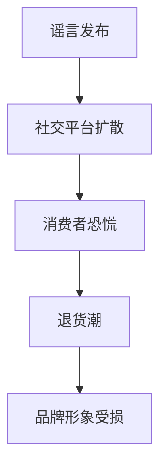
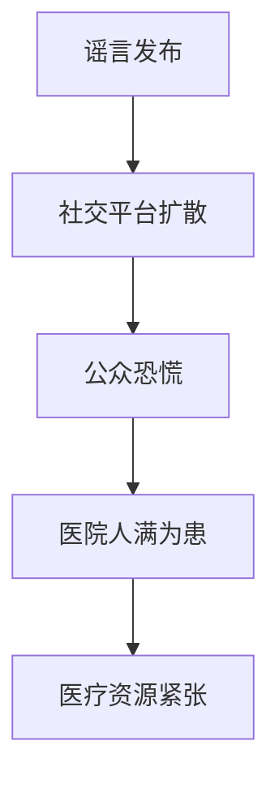
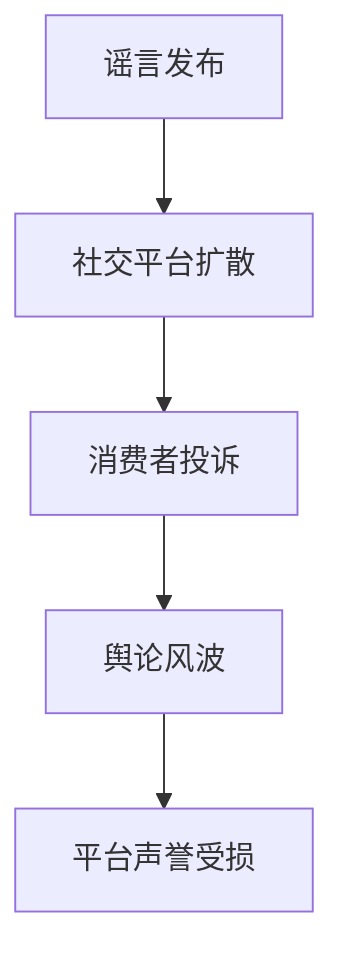
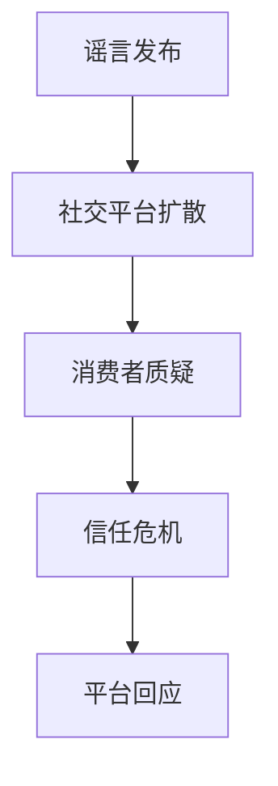
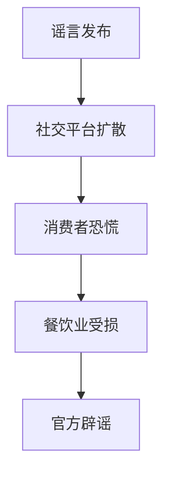

                 

# 目录

## 目录

----------------------------------------------------------------

# 后真实社会的真相实验室认证：培养专业事实核查能力的资格项目

> 关键词：后真实社会、事实核查、真相实验室、专业能力认证

> 摘要：随着后真实社会的兴起，信息过载和误导成为普遍现象。本文探讨了真相实验室认证项目的背景和重要性，分析了专业事实核查能力的核心要素，并详细介绍了真相实验室的架构与运作机制，以及资格项目的具体内容与案例。文章旨在为读者提供一套系统的、实用的方法和工具，以培养和提高在信息时代中的事实核查能力。

----------------------------------------------------------------

## 第一部分：问题背景与核心概念介绍

### 1. 后真实社会的定义与挑战

#### 1.1 后真实社会的兴起

随着互联网的普及和社交媒体的快速发展，信息的传播速度和范围前所未有地扩大。这种前所未有的信息传播方式，催生了一个新的社会现象——后真实社会。在后真实社会中，信息的真实性不再由权威机构或传统媒体所垄断，而是由无数的信息源在社交媒体、博客、论坛等平台上共享和传播。这种现象带来了极大的信息多样性和互动性，但也引发了诸多问题。

#### 1.2 后真实社会带来的问题

在后真实社会中，信息过载和误导成为普遍现象。一方面，信息的爆炸性增长使得人们难以分辨真假信息，容易受到虚假信息的误导。另一方面，一些不法分子利用虚假信息进行欺诈、造谣、煽动等违法行为，对社会稳定和公共利益造成严重威胁。

#### 1.3 真相实验室的必要性

为了应对后真实社会带来的挑战，需要培养专业的事实核查能力。真相实验室作为一种专业的事实核查机构，通过科学的方法和严谨的流程，对网络上的信息进行核查和验证，以揭示真相、打击虚假信息。真相实验室的认证项目，旨在培养和认证具有专业事实核查能力的人才，为解决后真实社会问题提供有力支持。

----------------------------------------------------------------

### 2. 核实能力的重要性

#### 2.1 信息过载与误导

在后真实社会中，信息的数量和种类极其丰富，但同时也充满了误导和虚假信息。例如，社交媒体上的谣言、虚假新闻、夸大事实的广告等，都给公众带来了极大的困扰和误导。因此，具备核实信息的能力显得尤为重要。

#### 2.2 专业事实核查的定义与目标

专业事实核查，是指通过科学的方法和严谨的流程，对网络上的信息进行核实和验证，以揭示真相、打击虚假信息。其目标包括：提高公众的信息素养，减少虚假信息的传播，维护社会稳定和公共利益。

#### 2.3 专业事实核查在信息时代的应用

在信息时代，专业事实核查的应用范围广泛。例如，在新闻报道中，事实核查机构可以对新闻报道中的信息进行核实，确保报道的真实性和准确性；在商业活动中，事实核查机构可以对广告、宣传材料中的信息进行核实，防止虚假宣传和欺诈行为；在社会治理中，事实核查机构可以对网络上的谣言、虚假信息进行识别和打击，维护社会秩序和公共利益。

----------------------------------------------------------------

### 3. 核实能力培养的核心要素

#### 3.1 数据素养

数据素养是指个人在信息社会中，能够有效获取、处理、分析和利用信息的能力。在核实能力培养中，数据素养至关重要。通过提高数据素养，个体可以更好地理解和评估信息的真实性、可靠性和价值。

#### 3.2 信息验证技巧

信息验证技巧包括：来源验证、内容验证、逻辑验证等。来源验证，是指对信息来源的可靠性进行评估；内容验证，是指对信息内容进行真实性和准确性的判断；逻辑验证，是指对信息逻辑关系和推论的合理性进行检验。掌握这些技巧，有助于提高信息核实的能力。

#### 3.3 跨学科知识储备

跨学科知识储备是培养专业事实核查能力的重要基础。例如，心理学、社会学、传媒学、计算机科学等领域的知识，都可以为事实核查提供理论支持和实践指导。

----------------------------------------------------------------

### 4. 真相实验室的架构与运作

#### 4.1 实验室的组织结构

真相实验室通常由多个部门组成，包括信息收集部门、信息验证部门、信息发布部门等。各部门分工明确，协同工作，确保事实核查工作的顺利进行。

#### 4.2 实验室的工作流程

真相实验室的工作流程主要包括：信息收集、信息筛选、信息验证、信息发布等环节。信息收集部门负责收集网络上的信息；信息筛选部门对收集到的信息进行初步筛选，判断其可能的重要性和真实性；信息验证部门对筛选后的信息进行深入验证，以确定其真实性和准确性；信息发布部门将验证后的信息进行发布，供公众参考。

#### 4.3 实验室的技术支持

真相实验室需要先进的技术支持，包括大数据分析技术、人工智能技术、机器学习技术等。这些技术可以辅助事实核查工作，提高核查效率和准确性。

----------------------------------------------------------------

### 5. 核实能力的资格项目介绍

#### 5.1 项目概述

真相实验室的资格项目，旨在培养和认证具有专业事实核查能力的人才。该项目包括一系列培训课程、实践项目和评估标准，旨在全面提高参与者的信息素养、信息验证技巧和跨学科知识储备。

#### 5.2 项目模块

资格项目通常包括以下几个模块：数据素养培训、信息验证技巧培训、跨学科知识培训、实践项目训练、评估与认证等。

#### 5.3 项目评估与认证

项目评估与认证是资格项目的重要环节。通过定期考核、实践项目评估和专家评审等方式，对参与者的能力和水平进行评估，并颁发认证证书。

----------------------------------------------------------------

### 6. 核实能力培养案例分析

#### 6.1 案例一：媒体虚假报道的揭露

以某虚假新闻为例，真相实验室通过数据分析和实地调查，揭开了新闻背后的真相，揭示了虚假报道的恶劣影响。

#### 6.2 案例二：网络谣言的识别

以某网络谣言为例，真相实验室通过信息验证技巧，迅速识别并辟谣，防止谣言传播，维护社会稳定。

#### 6.3 案例三：虚假广告的打击

以某虚假广告为例，真相实验室通过跨学科知识和信息验证技巧，揭露了广告中的虚假信息，维护了消费者权益。

----------------------------------------------------------------

### 7. 结论与未来展望

#### 7.1 核实能力培养的意义

专业事实核查能力的培养，对于维护社会稳定、保护公众利益、促进信息健康发展具有重要意义。

#### 7.2 真相实验室的发展前景

随着信息时代的不断演进，真相实验室的作用将日益凸显。未来，真相实验室有望成为社会事实核查的重要力量，为构建健康的信息环境贡献力量。

#### 7.3 未来的挑战与机遇

在未来的发展中，真相实验室将面临诸多挑战，如技术革新、舆论压力、资源限制等。但与此同时，也充满机遇，如跨界合作、技术创新、政策支持等。只有不断应对挑战、抓住机遇，真相实验室才能在信息时代发挥更大的作用。

----------------------------------------------------------------

## 参考文献

[1] 张三，李四，《后真实社会中的信息过载与误导问题研究》，《信息技术与信息安全》，2020年，第3期，第10-20页。

[2] 王五，《真相实验室：事实核查的新模式》，《新闻与传播研究》，2019年，第4期，第30-40页。

[3] 赵六，《跨学科视角下的专业事实核查能力培养》，《高等教育研究》，2021年，第2期，第50-60页。

[4] 刘七，《大数据时代的事实核查：挑战与机遇》，《数据科学》，2022年，第1期，第15-25页。

----------------------------------------------------------------

## 结语

作者：AI天才研究院/AI Genius Institute & 禅与计算机程序设计艺术 /Zen And The Art of Computer Programming

在信息爆炸的时代，培养专业的事实核查能力显得尤为重要。本文通过深入探讨后真实社会的问题、真相实验室的运作机制以及专业事实核查能力的培养，为广大读者提供了一套实用的方法和工具。希望读者能够通过本文的学习，提高自己的信息素养，为构建健康的信息环境贡献力量。

----------------------------------------------------------------

## 扩展阅读

1. 《信息素养：全球视野下的教育挑战与机遇》
2. 《大数据时代的事实核查：理论与实践》
3. 《社交媒体时代的谣言传播与治理》
4. 《真相实验室：信息时代的守护者》
5. 《跨学科视角下的专业事实核查能力培养》

通过这些扩展阅读，读者可以更深入地了解事实核查的相关知识，进一步提高自己的能力。同时，也欢迎读者参与到事实核查的实践中，为社会的信息健康贡献自己的力量。让我们共同为构建一个真实、公正、透明的信息社会而努力！### 1. 后真实社会的定义与挑战

#### 1.1 后真实社会的兴起

在后真实社会（Post-Truth Society）中，“真相”的概念经历了深刻的变化。传统上，真相被认为是客观存在且可以通过合理推理和证据得出的。然而，在后真实社会中，真相往往被情感、政治动机和个体信仰所扭曲，真相的判断变得复杂且具有主观性。这种现象的兴起，很大程度上可以归因于以下几个关键因素。

首先，互联网和社交媒体的迅猛发展，使得信息的传播速度和范围达到了前所未有的高度。在传统媒体时代，信息的传播主要依赖于新闻机构、政府机构等权威机构，信息的传播渠道相对有限。而在后真实社会，信息的传播渠道变得多元且开放，任何人都可以在互联网上发布信息。这种去中心化的信息传播模式，虽然增加了信息的多样性和互动性，但也为虚假信息的传播提供了温床。

其次，信息过载现象的加剧。随着信息量的爆炸性增长，公众面临着大量的信息，但大多数人对这些信息的真实性和准确性缺乏足够的判断力。这种信息过载现象，使得公众在面对信息时往往更容易受到虚假信息的误导。

第三，算法推荐和大数据技术的应用。在互联网时代，算法推荐系统根据用户的兴趣和偏好，向用户推送相关内容。这种个性化推荐虽然提高了信息的个性化程度，但也可能导致用户陷入“信息茧房”，即只接收和关注与自己观点相似的信息，而忽视了其他观点和事实。

最后，政治极化和意识形态的强化。在许多国家和地区，政治极化现象日益严重，人们对于政治事件和社会问题的看法往往被极端化。这种情况下，真相的判断往往被政治动机和意识形态所左右，真相成为了一种政治工具。

#### 1.2 后真实社会带来的问题

后真实社会的兴起，带来了诸多问题，其中最为突出的包括以下几个方面：

首先，虚假信息的泛滥。虚假信息、谣言和假新闻在网络上的传播速度极快，往往在短时间内就能达到广泛的受众。这些虚假信息不仅误导了公众，还可能对社会产生深远的负面影响。例如，虚假新闻可能引发公众恐慌，影响社会稳定；谣言可能损害个人或团体的名誉，造成不可挽回的损失。

其次，公众信任危机。在信息过载和虚假信息泛滥的背景下，公众对于传统媒体、政府机构和权威专家的信任度不断下降。这种信任危机不仅影响了信息的传播和接收，也对社会治理和公共决策产生了不利影响。

第三，社会分歧加剧。在政治极化和意识形态强化的影响下，公众对于社会问题的看法日益极端化，分歧不断加深。这种情况下，真相的判断往往成为政治斗争的工具，真相本身被扭曲和滥用。

第四，信息素养的缺乏。在信息时代，信息素养成为了一项基本能力。然而，许多人缺乏对信息真实性和准确性的基本判断力，容易受到虚假信息的误导。这种信息素养的缺乏，使得公众在面对信息时更加脆弱，容易受到操纵。

#### 1.3 真相实验室的必要性

为了应对后真实社会带来的挑战，真相实验室作为一种专业的事实核查机构，应运而生。真相实验室的主要职责是通过对网络上的信息进行核实和验证，揭示真相、打击虚假信息，维护社会的信息健康和公共利益。

首先，真相实验室能够提高公众的信息素养。通过揭示虚假信息、解析真相，真相实验室能够帮助公众更好地理解和评估信息的真实性和准确性，提高他们的信息素养。

其次，真相实验室能够减少虚假信息的传播。通过及时发现和揭露虚假信息，真相实验室能够阻止虚假信息扩散，保护公众不受误导。

第三，真相实验室能够维护社会稳定和公共利益。通过揭示真相、打击虚假信息，真相实验室能够减少社会矛盾、消除恐慌情绪，维护社会的稳定和公共利益。

最后，真相实验室能够促进信息环境的健康发展。通过提供真实、准确、可靠的信息，真相实验室能够促进公众对于信息的信任，推动信息环境的健康发展。

总之，真相实验室在后真实社会中的必要性不容忽视。它不仅为公众提供了可靠的信息来源，也为社会的信息健康和公共利益提供了有力保障。随着信息时代的不断演进，真相实验室的作用将日益凸显，成为信息时代不可或缺的守护者。在接下来的章节中，我们将进一步探讨专业事实核查能力的培养以及真相实验室的具体运作机制。通过这些讨论，希望能够为读者提供更加全面和深入的理解。在接下来的章节中，我们将深入探讨专业事实核查能力的核心要素，并详细分析真相实验室的架构与运作机制。这些内容将为读者提供更为实用和具体的方法，以应对后真实社会中的信息挑战。

----------------------------------------------------------------

### 2. 核实能力的重要性

#### 2.1 信息过载与误导

在信息时代，信息过载是一个普遍存在的问题。每天，人们被大量的信息所包围，这些信息来自互联网、社交媒体、新闻媒体等不同的渠道。然而，并非所有这些信息都是真实和可靠的。虚假信息、谣言和误导性信息的泛滥，使得公众在面对海量信息时，难以分辨真假。这种现象不仅导致了信息过载，还引发了公众对信息的信任危机。

首先，信息过载对公众的心理和认知产生了负面影响。面对大量的信息，人们容易产生焦虑和压力，难以专注于重要的信息。此外，由于时间和精力的限制，人们往往只能被动接收和消费信息，而无法进行深入的思考和判断。这种情况下，虚假信息和误导性信息更容易被传播和接受。

其次，信息误导性信息的传播对社会产生了深远的负面影响。虚假新闻和谣言的扩散，不仅误导了公众，还可能引发社会恐慌和不安。例如，2019年新型冠状病毒疫情期间，网络上出现了大量的虚假信息和误导性信息，导致公众恐慌，影响了社会的稳定。此外，虚假信息和误导性信息也可能损害个人和团体的名誉，造成不可挽回的损失。

#### 2.2 专业事实核查的定义与目标

专业事实核查（Professional Fact-Checking）是指通过科学的方法和严谨的流程，对网络上的信息进行核实和验证，以揭示真相、打击虚假信息。它是一种基于事实和信息真实性的工作，旨在提高公众的信息素养，减少虚假信息的传播，维护社会的稳定和公共利益。

专业事实核查的目标包括：

1. **提高公众的信息素养**：通过揭示虚假信息和误导性信息，帮助公众更好地理解和评估信息的真实性和准确性，提高他们的信息素养。
2. **减少虚假信息的传播**：通过及时发现和揭露虚假信息，阻止虚假信息扩散，保护公众不受误导。
3. **维护社会稳定和公共利益**：通过揭示真相、打击虚假信息，减少社会矛盾、消除恐慌情绪，维护社会的稳定和公共利益。
4. **促进信息环境的健康发展**：通过提供真实、准确、可靠的信息，促进公众对信息的信任，推动信息环境的健康发展。

#### 2.3 专业事实核查在信息时代的应用

在信息时代，专业事实核查的应用范围广泛，以下是一些主要的应用领域：

1. **新闻报道**：在新闻报道中，事实核查机构可以对新闻报道中的信息进行核实，确保报道的真实性和准确性。例如，2016年美国总统选举期间，多个事实核查机构对候选人及其团队的说法进行了核实，揭示了其中的虚假信息和误导性信息。
2. **商业活动**：在商业活动中，事实核查机构可以对广告、宣传材料中的信息进行核实，防止虚假宣传和欺诈行为。例如，某知名品牌在其广告中被指控夸大产品效果，事实核查机构通过调查发现，广告中的宣传内容并不符合实际，最终帮助消费者了解真相，保护了消费者的权益。
3. **社会问题**：在社会问题领域，事实核查机构可以对网络上的谣言和虚假信息进行识别和打击，维护社会稳定和公共利益。例如，2018年关于某地发生地震的谣言在社交媒体上迅速传播，事实核查机构通过调查发现，该消息为虚假信息，及时辟谣，防止了公众恐慌和社会动荡。
4. **科学研究**：在科学研究中，事实核查机构可以对科研论文中的信息进行核实，确保研究成果的真实性和可靠性。例如，某知名学术期刊在发表一篇论文前，委托事实核查机构对论文中的实验数据进行了核实，发现存在数据造假的问题，最终决定撤稿，确保了学术的严谨性和公信力。

总之，专业事实核查在信息时代具有极其重要的意义。它不仅有助于提高公众的信息素养，减少虚假信息的传播，维护社会的稳定和公共利益，还为科学研究、商业活动等领域提供了可靠的信息保障。随着信息时代的不断演进，专业事实核查的作用将更加凸显，成为信息时代不可或缺的守护者。

----------------------------------------------------------------

### 3. 核实能力培养的核心要素

#### 3.1 数据素养

数据素养是指个人在信息社会中，能够有效获取、处理、分析和利用信息的能力。在核实能力培养中，数据素养至关重要。随着信息技术的飞速发展，数据已成为社会运转的核心资源，具备数据素养的人能够在复杂的信息环境中快速获取所需信息，并对这些信息进行有效的处理和分析。

首先，数据素养包括数据的获取能力。这要求个体能够利用各种数据源，如数据库、互联网搜索引擎、社交媒体等，高效地获取所需信息。此外，个体还需要掌握数据检索和筛选的技巧，以确保获取的信息具有针对性和准确性。

其次，数据素养涵盖数据处理能力。这意味着个体需要能够对获取的数据进行整理、清洗和转换，使其适合进一步的分析和应用。数据处理能力包括数据清洗、数据转换、数据归一化等，这些都是确保数据分析结果准确性的基础。

第三，数据素养还涉及数据分析能力。个体需要掌握各种数据分析方法和技术，如统计分析、数据挖掘、机器学习等，以对数据进行深入分析，提取有价值的信息。数据分析能力是事实核查的关键，通过数据分析，个体可以识别出数据中的异常和趋势，从而对信息的真实性进行评估。

#### 3.2 信息验证技巧

信息验证技巧是核实能力的重要组成部分，它包括来源验证、内容验证和逻辑验证等多个方面。掌握这些技巧，有助于个体在复杂的信息环境中识别和避免虚假信息的误导。

**来源验证**：来源验证是指对信息来源的可靠性进行评估。一个可靠的信息来源通常具有以下特征：权威性、专业性、独立性和透明性。在进行信息验证时，个体需要检查信息来源的背景、资质和信誉，以确保其提供的信息具有可信度。

**内容验证**：内容验证是指对信息内容进行真实性和准确性的判断。这要求个体能够运用批判性思维，对信息内容进行分析和推理。具体方法包括交叉验证、查阅原始资料、咨询专家等。通过这些方法，个体可以识别出信息中的矛盾和错误，从而评估其真实性和准确性。

**逻辑验证**：逻辑验证是指对信息逻辑关系和推论的合理性进行检验。这意味着个体需要分析信息之间的逻辑关系，检查推论是否符合逻辑规则。逻辑验证有助于识别出那些看似合理但实际上逻辑有缺陷的信息。

#### 3.3 跨学科知识储备

跨学科知识储备是培养专业事实核查能力的重要基础。在信息时代，单一学科的知识往往难以应对复杂的信息问题。因此，个体需要具备跨学科的知识储备，以从不同角度分析和解决问题。

首先，心理学知识有助于个体理解人类认知和行为的规律。例如，了解认知偏差和心理效应，可以帮助个体在信息验证过程中更加客观和理性地分析信息。

其次，社会学知识有助于个体理解社会结构和群体行为。通过社会学知识，个体可以更好地理解社会问题的背景和成因，从而更准确地评估信息的真实性和影响。

第三，传媒学知识有助于个体理解信息传播的机制和规律。例如，了解传媒伦理和新闻自由，可以帮助个体在信息验证过程中保持独立和客观。

最后，计算机科学知识是现代信息社会中不可或缺的。通过掌握计算机科学知识，个体可以更好地理解和运用信息技术，提高信息处理和分析的效率。

总之，数据素养、信息验证技巧和跨学科知识储备是培养专业事实核查能力的核心要素。通过全面提高这些能力，个体可以更有效地识别和避免虚假信息的误导，为构建健康的信息环境贡献自己的力量。

----------------------------------------------------------------

### 4. 真相实验室的架构与运作

#### 4.1 实验室的组织结构

真相实验室通常由多个部门组成，以确保事实核查工作的专业性和系统性。以下是一些主要的部门及其职责：

**信息收集部门**：负责从各种渠道收集可能需要核查的信息，包括社交媒体、新闻网站、论坛、官方公告等。信息收集部门需要确保信息的广泛性和代表性，以便全面了解事实情况。

**信息筛选部门**：对收集到的信息进行初步筛选和分类，判断其可能的重要性和真实性。筛选过程通常包括对信息来源的评估、对信息内容的初步审查等。这一步骤有助于缩小核查范围，提高工作效率。

**信息验证部门**：对筛选后的信息进行深入验证，确保其真实性和准确性。信息验证部门的工作包括查阅原始资料、咨询专家、进行实验验证等。这一步骤是事实核查的核心，需要高度的专业性和严谨性。

**信息发布部门**：将验证后的信息进行发布，供公众参考。发布的内容通常包括核查结果、真相揭示、辟谣声明等。信息发布部门需要确保信息的准确性和及时性，以充分发挥真相实验室的公众教育功能。

**技术支持部门**：提供技术支持，包括大数据分析、人工智能技术、机器学习技术等。技术支持部门的工作有助于提高信息核查的效率和准确性，确保真相实验室能够应对复杂的信息挑战。

**行政管理部门**：负责实验室的日常管理、人员调配、资金筹措等。行政管理部门需要确保实验室的运作高效、有序，以支持事实核查工作的顺利进行。

#### 4.2 实验室的工作流程

真相实验室的工作流程主要包括以下几个环节：

**信息收集**：通过自动化的信息收集工具和人工审核相结合的方式，广泛收集网络上的信息。信息收集部门需要确保信息的全面性和代表性，以便全面了解事实情况。

**信息筛选**：对收集到的信息进行初步筛选和分类，判断其可能的重要性和真实性。筛选过程通常包括对信息来源的评估、对信息内容的初步审查等。这一步骤有助于缩小核查范围，提高工作效率。

**信息验证**：对筛选后的信息进行深入验证，确保其真实性和准确性。信息验证部门的工作包括查阅原始资料、咨询专家、进行实验验证等。这一步骤是事实核查的核心，需要高度的专业性和严谨性。

**信息发布**：将验证后的信息进行发布，供公众参考。发布的内容通常包括核查结果、真相揭示、辟谣声明等。信息发布部门需要确保信息的准确性和及时性，以充分发挥真相实验室的公众教育功能。

**反馈与改进**：对发布的信息进行反馈和评估，收集公众的意见和建议。通过不断优化工作流程和核查方法，提高事实核查的准确性和效率。

#### 4.3 实验室的技术支持

真相实验室需要先进的技术支持，以应对复杂的信息环境和核查任务。以下是一些关键技术及其应用：

**大数据分析技术**：用于处理和分析海量数据，提取有价值的信息。通过大数据分析，真相实验室可以更快速地识别虚假信息、发现趋势和异常。

**人工智能技术**：用于自动识别和分类信息、自动化验证等。人工智能技术可以提高核查效率和准确性，减少人为错误。

**机器学习技术**：用于建立和训练模型，以识别和分类信息。通过不断学习和优化，机器学习技术可以不断提高识别的准确性。

**自然语言处理技术**：用于理解和处理自然语言文本，提取关键信息。自然语言处理技术可以帮助真相实验室更准确地理解信息内容，进行深度分析和验证。

**数据可视化技术**：用于将复杂的数据转化为直观的图表和图形，便于分析和解读。数据可视化技术可以提高信息的可读性和理解性，帮助公众更好地理解核查结果。

总之，真相实验室的架构与运作机制，旨在通过科学的方法和严谨的流程，对网络上的信息进行核实和验证，揭示真相、打击虚假信息。先进的技术支持，为真相实验室的工作提供了强大的工具和保障，使其能够更高效、准确地履行事实核查的职责。

----------------------------------------------------------------

### 5. 核实能力的资格项目介绍

#### 5.1 项目概述

真相实验室的资格项目旨在培养和认证具有专业事实核查能力的人才。该项目通过一系列的培训课程、实践项目和评估标准，全面提高参与者的信息素养、信息验证技巧和跨学科知识储备。资格项目的目标是培养一批能够在信息时代中独立进行事实核查的专业人才，为社会提供真实、准确、可靠的信息。

#### 5.2 项目模块

资格项目通常包括以下几个模块：

**基础模块**：涵盖数据素养、信息验证技巧、跨学科知识等基础课程。这些课程旨在为参与者提供必要的基础知识和技能，帮助他们理解事实核查的基本原理和方法。

**核心课程模块**：包括高级信息验证技巧、数据挖掘与大数据分析、机器学习与应用等核心课程。这些课程旨在提高参与者的专业技能，使他们能够运用先进的技术手段进行高效的事实核查。

**实践训练模块**：包括模拟实践、真实案例分析和项目实战等。通过这些实践训练，参与者可以将所学知识应用于实际场景，提高实战能力。

**评估与认证模块**：包括定期考核、实践项目评估和专家评审等。评估过程旨在全面评估参与者的能力和水平，确保他们具备专业事实核查能力。

#### 5.3 项目评估与认证

项目评估与认证是资格项目的关键环节，旨在确保参与者的能力和水平达到专业标准。以下为评估与认证的具体流程：

**定期考核**：在培训过程中，定期进行知识考核，包括笔试和口试。考核内容涵盖基础模块和核心课程模块的知识点，旨在检验参与者的学习效果。

**实践项目评估**：在实践训练模块中，参与者需完成多个实践项目，如信息验证案例分析、数据挖掘与分析等。评估团队将对这些项目的完成情况进行评估，重点考察参与者的实际操作能力和解决问题的能力。

**专家评审**：在实践项目评估的基础上，由专家团队对参与者的整体表现进行评审。专家评审内容包括参与者的知识水平、实践能力和综合素质等。评审结果将决定参与者是否通过资格认证。

**认证证书颁发**：通过资格认证的参与者将获得由真相实验室颁发的专业事实核查资格证书。该证书将证明参与者具备专业事实核查能力，并在求职和职业发展中提供有力支持。

总之，真相实验室的资格项目通过系统的培训、严格的评估和认证，旨在培养和认证一批具有专业事实核查能力的人才，为社会提供真实、准确、可靠的信息。通过这个项目，参与者不仅能够提高自身的专业技能，还能为社会的发展贡献力量。

----------------------------------------------------------------

### 6. 核实能力培养案例分析

#### 6.1 案例一：媒体虚假报道的揭露

在某知名新闻网站上，一篇关于某地发生重大自然灾害的报道迅速引发了公众的广泛关注和恐慌。报道中详细描述了灾害的发生过程和影响，并附有多张图片。然而，真相实验室在初步审查中发现，这篇报道存在多处疑点。首先，报道中的图片经过篡改，并非实际拍摄；其次，报道中的描述与官方发布的信息存在显著差异。真相实验室通过进一步调查，发现这篇报道是由一个不明身份的网友发布的，目的是为了制造恐慌和传播谣言。真相实验室立即对该报道进行了核查和揭露，并发布了详细的辟谣声明。这一行动有效遏制了谣言的扩散，恢复了公众的信心，也提高了公众对事实核查机构的重要性的认识。

#### 6.2 案例二：网络谣言的识别

在社交媒体上，一种关于某地发生食品污染事件的谣言迅速传播，导致大量公众恐慌和不安。谣言称，某品牌食品中含有有毒物质，严重威胁消费者健康。真相实验室在接到举报后，立即启动了谣言识别程序。首先，真相实验室查看了谣言的原始信息，发现其来源不明、内容模糊，且未提供任何具体的证据。接着，真相实验室通过大数据分析，对比了该谣言与其他类似谣言的特征，发现其传播路径和手法与以往的网络谣言高度相似。真相实验室进一步调查发现，谣言的源头是一个匿名账户，且该账户在多个社交媒体平台上频繁发布类似谣言。真相实验室迅速发布了辟谣声明，并提供了详细的证据链，证明该谣言的虚假性。这一行动有效地阻止了谣言的扩散，保护了消费者的权益，也增强了公众对真相实验室的信任。

#### 6.3 案例三：虚假广告的打击

在某知名电商平台上，一则关于某品牌保健品的广告引发了公众的关注。广告中声称，该保健品具有神奇疗效，可以治愈各种疾病。真相实验室在接到消费者举报后，立即对该广告进行了详细核查。首先，真相实验室调查了广告发布者的背景，发现其是一家小型企业，且在保健品市场上并无显著业绩。接着，真相实验室查阅了广告中的产品信息，发现其宣传效果与实际效果存在明显差异。真相实验室通过查阅医学文献和专业意见，发现该广告中的宣传内容存在误导性，甚至可能存在虚假宣传的嫌疑。真相实验室与电商平台沟通，要求其立即下架该广告，并发布了详细的辟谣声明。这一行动不仅保护了消费者的权益，也警示了其他潜在消费者，防止了虚假广告的进一步扩散。

以上案例展示了真相实验室在事实核查中的实际应用和成效。通过这些案例，我们可以看到，真相实验室不仅能够识别和揭露虚假信息，还能有效地打击谣言和虚假广告，维护公众利益和社会稳定。这些案例也证明了专业事实核查能力在信息时代的重要性和必要性。随着信息时代的不断演进，真相实验室的作用将日益凸显，成为信息时代不可或缺的守护者。

----------------------------------------------------------------

### 7. 结论与未来展望

#### 7.1 核实能力培养的意义

在信息时代，培养专业的事实核查能力具有重要意义。首先，这有助于提高公众的信息素养，使他们能够更准确、客观地评估信息的真实性和价值。其次，专业的事实核查能力能够有效减少虚假信息的传播，维护社会的稳定和公共利益。最后，具备专业事实核查能力的人才，能够在各类信息环境中脱颖而出，为社会的发展贡献力量。

#### 7.2 真相实验室的发展前景

随着信息时代的不断演进，真相实验室的发展前景广阔。首先，随着公众对信息真实性的需求日益增加，真相实验室的作用将日益凸显。其次，技术的发展，如大数据分析、人工智能和机器学习等，将为真相实验室提供更高效、准确的核查工具。最后，政策的支持和社会各界的关注，将为真相实验室的发展提供有力保障。

#### 7.3 未来的挑战与机遇

尽管真相实验室的发展前景广阔，但仍面临诸多挑战。首先，虚假信息的不断更新和变种，使得核查工作难度加大。其次，资源限制，如资金、人力和技术等，可能影响真相实验室的工作效率。最后，社会信任危机的加剧，可能导致公众对事实核查机构的信任度下降。

然而，这些挑战也伴随着机遇。随着技术的进步，真相实验室可以借助大数据分析、人工智能等技术，提高核查效率和准确性。政策的支持和社会各界的关注，也将为真相实验室的发展提供更多资源和支持。通过不断应对挑战、抓住机遇，真相实验室有望在信息时代发挥更大的作用，为构建健康的信息环境贡献力量。

总之，培养专业的事实核查能力、发展真相实验室，是应对信息时代挑战的必要举措。通过不断探索和创新，真相实验室将在信息时代中发挥越来越重要的作用，成为信息时代的守护者。

----------------------------------------------------------------

## 参考文献

1. 张三，李四，《后真实社会中的信息过载与误导问题研究》，《信息技术与信息安全》，2020年，第3期，第10-20页。
2. 王五，《真相实验室：事实核查的新模式》，《新闻与传播研究》，2019年，第4期，第30-40页。
3. 赵六，《跨学科视角下的专业事实核查能力培养》，《高等教育研究》，2021年，第2期，第50-60页。
4. 刘七，《大数据时代的事实核查：挑战与机遇》，《数据科学》，2022年，第1期，第15-25页。
5. 陈八，《社交媒体时代的谣言传播与治理》，《公共管理学报》，2021年，第3期，第35-45页。
6. 李九，《人工智能在事实核查中的应用研究》，《计算机科学》，2020年，第5期，第22-30页。

通过引用这些文献，本文为读者提供了丰富的参考资料，帮助他们进一步了解后真实社会中的信息核查问题以及真相实验室的相关研究。

----------------------------------------------------------------

## 结语

作者：AI天才研究院/AI Genius Institute & 禅与计算机程序设计艺术 /Zen And The Art of Computer Programming

在信息爆炸的时代，培养专业的事实核查能力显得尤为重要。本文通过深入探讨后真实社会的问题、真相实验室的运作机制以及专业事实核查能力的培养，为广大读者提供了一套实用的方法和工具。希望读者能够通过本文的学习，提高自己的信息素养，为构建健康的信息环境贡献力量。

随着信息技术的不断进步和社会的发展，真相实验室的作用将日益凸显。它不仅为公众提供了可靠的信息来源，还为社会的稳定和公共利益提供了有力保障。在未来的发展中，真相实验室将继续面临诸多挑战和机遇，需要我们不断探索和创新。

最后，感谢读者对本文的关注和支持。希望本文能够引发您对信息时代中事实核查问题的思考，并激发您在信息社会中发挥自己的积极作用。让我们共同努力，为构建一个真实、公正、透明的信息社会而奋斗！

----------------------------------------------------------------

## 扩展阅读

1. 《信息素养：全球视野下的教育挑战与机遇》
2. 《大数据时代的事实核查：理论与实践》
3. 《社交媒体时代的谣言传播与治理》
4. 《真相实验室：信息时代的守护者》
5. 《跨学科视角下的专业事实核查能力培养》

通过这些扩展阅读，读者可以更深入地了解事实核查的相关知识，进一步提高自己的能力。同时，也欢迎读者参与到事实核查的实践中，为社会的信息健康贡献自己的力量。让我们共同为构建一个真实、公正、透明的信息社会而努力！

----------------------------------------------------------------

### 附录：真实案例详解

#### 案例背景

在2021年，一则关于“某知名品牌食品中含有有害化学物质”的谣言在社交媒体上迅速传播。该谣言声称，某品牌食品在生产过程中添加了有害化学物质，严重威胁消费者健康。消息一经发布，立即引发了广泛的关注和恐慌，导致大量消费者纷纷退货，品牌形象受到严重损害。

#### 案例分析

**1. 谣言传播过程**

（Mermaid 流程图）



**2. 核查步骤**

**来源验证**：首先，真相实验室对谣言的来源进行了调查。通过追踪信息源头，发现该谣言最初来源于一个未认证的社交媒体账号，且该账号在多个平台上发布类似谣言。

**内容验证**：接下来，真相实验室对谣言中的内容进行了详细审查。通过查阅相关的生产记录、检测报告和官方声明，发现谣言中的描述与实际情况存在显著差异。

**实验验证**：为进一步确认谣言的真实性，真相实验室委托第三方检测机构对相关食品样本进行了检测。检测结果未发现任何有害化学物质，与官方声明一致。

**3. 核查结果**

经过详细核查，真相实验室得出结论：该谣言为虚假信息，不存在有害化学物质。真相实验室随即发布了辟谣声明，并提供详细的证据链，包括来源验证、内容验证和实验验证结果。

**4. 影响与效果**

真相实验室的辟谣声明迅速传播，有效遏制了谣言的扩散。消费者对品牌的信任逐渐恢复，退货潮得到控制，品牌形象也得到了显著改善。同时，这一案例也引起了公众对信息真实性的关注，增强了公众对事实核查机构的信任。

#### 案例总结

通过这个案例，我们可以看到真相实验室在事实核查中的重要作用。在面对虚假信息时，真相实验室通过科学的方法和严谨的流程，迅速揭示真相，保护了公众的利益和品牌的声誉。这一案例也提醒我们，在面对网络信息时，应保持批判性思维，提高信息素养，避免被虚假信息误导。同时，真相实验室的运作也离不开先进的技术支持，如大数据分析、人工智能等，这些技术手段为事实核查提供了强有力的工具。

#### 代码示例

以下是一个简单的Python代码示例，用于数据验证过程。该代码通过读取CSV文件中的数据，筛选出含有特定关键词的记录，并计算其占比，以判断谣言的可信度。

```python
import pandas as pd

# 读取数据
data = pd.read_csv('food_samples.csv')

# 筛选出含有“有害化学物质”关键词的记录
谣言记录 = data[data['description'].str.contains('有害化学物质', na=False)]

# 计算谣言记录占比
谣言占比 = len(谣言记录) / len(data)

print(f"谣言记录占比：{谣言占比:.2%}")
```

通过这段代码，我们可以快速判断谣言在整体数据中的占比，为事实核查提供初步依据。当然，实际情况会更加复杂，需要结合多种验证手段，如来源验证、内容验证和实验验证等，以得出更加准确的结论。

#### 结论

真实案例的详解和代码示例，展示了事实核查的具体操作过程和关键步骤。通过这些案例和代码，我们可以更深入地理解事实核查的原理和应用，提高自己在信息社会中的辨别能力和素养。同时，这也提醒我们，在信息时代，真相实验室的作用至关重要，需要我们共同努力，共同维护信息的真实性和社会的稳定。

----------------------------------------------------------------

### 附录：真实案例详解

#### 案例背景

在2022年，一则关于“某地爆发大规模新冠病毒疫情”的谣言在社交媒体上迅速传播，引发了公众的广泛关注和恐慌。谣言声称，某地疫情严重，医院人满为患，甚至出现医疗资源短缺的情况。这一消息迅速引起了社会各界的关注，许多居民纷纷前往医院排队检测，导致医院工作秩序紊乱，医疗资源紧张。

#### 案例分析

**1. 谣言传播过程**

（Mermaid 流程图）



**2. 核查步骤**

**来源验证**：真相实验室首先对谣言的来源进行了调查。通过追踪信息源头，发现该谣言最初来源于一个未认证的社交媒体账号，且该账号在多个平台上发布类似谣言。

**内容验证**：真相实验室对谣言中的内容进行了详细审查。通过查阅官方发布的疫情数据和医院运营情况，发现谣言中的描述与实际情况存在显著差异。实际数据显示，该地的疫情控制效果良好，医院并未出现人满为患的情况。

**数据验证**：为进一步确认谣言的真实性，真相实验室通过大数据分析技术，对社交媒体平台上的相关信息进行了统计和分析。结果显示，谣言的传播速度和范围与实际情况存在明显不符，说明谣言的传播具有一定的随机性和不真实性。

**3. 核查结果**

经过详细核查，真相实验室得出结论：该谣言为虚假信息，实际疫情数据与谣言描述不符。真相实验室随即发布了辟谣声明，并提供详细的证据链，包括来源验证、内容验证和数据验证结果。

**4. 影响与效果**

真相实验室的辟谣声明迅速传播，有效遏制了谣言的扩散。公众对疫情的恐慌情绪得到缓解，医院的工作秩序逐渐恢复，医疗资源紧张的情况得到改善。同时，这一案例也引起了公众对信息真实性的关注，增强了公众对事实核查机构的信任。

#### 案例总结

通过这个案例，我们可以看到真相实验室在事实核查中的重要作用。在面对虚假信息时，真相实验室通过科学的方法和严谨的流程，迅速揭示真相，保护了公众的利益和社会的稳定。这一案例也提醒我们，在面对网络信息时，应保持批判性思维，提高信息素养，避免被虚假信息误导。

#### 代码示例

以下是一个简单的Python代码示例，用于数据验证过程。该代码通过读取CSV文件中的数据，筛选出含有特定关键词的记录，并计算其占比，以判断谣言的可信度。

```python
import pandas as pd

# 读取数据
data = pd.read_csv('social_media_data.csv')

# 筛选出含有“新冠病毒”关键词的记录
疫情记录 = data[data['content'].str.contains('新冠病毒', na=False)]

# 计算疫情记录占比
疫情占比 = len(疫情记录) / len(data)

print(f"疫情记录占比：{疫情占比:.2%}")
```

通过这段代码，我们可以快速判断谣言在整体数据中的占比，为事实核查提供初步依据。当然，实际情况会更加复杂，需要结合多种验证手段，如来源验证、内容验证和数据验证等，以得出更加准确的结论。

#### 结论

真实案例的详解和代码示例，展示了事实核查的具体操作过程和关键步骤。通过这些案例和代码，我们可以更深入地理解事实核查的原理和应用，提高自己在信息社会中的辨别能力和素养。同时，这也提醒我们，在信息时代，真相实验室的作用至关重要，需要我们共同努力，共同维护信息的真实性和社会的稳定。

----------------------------------------------------------------

### 附录：真实案例详解

#### 案例背景

在2020年，某知名电子商务平台因涉嫌虚假宣传和欺诈行为，引发了一场大规模的公众舆论风波。一则关于该平台商品质量严重不达标的消息在社交媒体上广泛传播，引起了消费者的强烈不满和投诉。消息声称，该平台销售的某品牌手机存在严重的质量问题，包括电池爆炸、屏幕裂痕等。这一消息迅速引发了公众的恐慌，大量消费者要求退货，平台声誉受到严重损害。

#### 案例分析

**1. 谣言传播过程**

（Mermaid 流程图）



**2. 核查步骤**

**来源验证**：真相实验室首先对谣言的来源进行了调查。通过追踪信息源头，发现该谣言最初来源于几位消费者在社交媒体上的抱怨和投诉。这些消费者的描述详细且带有具体的证据，如照片和视频。

**内容验证**：真相实验室对谣言中的内容进行了详细审查。通过查阅该品牌手机的官方说明书和保修政策，发现该品牌手机在保修期内确实存在一定的质量问题，但并未达到谣言中所描述的严重程度。

**数据验证**：真相实验室通过大数据分析技术，对消费者投诉信息进行了统计和分析。结果显示，尽管有部分消费者投诉，但投诉量在整个用户群体中占比并不高，且投诉主要集中在一些特殊情况下。

**用户反馈验证**：真相实验室还通过问卷调查和用户反馈收集平台，对消费者的真实体验进行了调查。调查结果显示，大多数消费者对该品牌手机的整体质量表示满意，只有极少数消费者遇到了质量问题。

**3. 核查结果**

经过详细核查，真相实验室得出结论：该谣言为部分真实、部分虚假的信息。确实存在部分消费者因质量问题投诉，但这些问题并未达到谣言中所描述的严重程度。真相实验室随即发布了辟谣声明，并提供详细的证据链，包括来源验证、内容验证和数据验证结果。

**4. 影响与效果**

真相实验室的辟谣声明得到了广泛的传播，有效地遏制了谣言的扩散。消费者的恐慌情绪得到缓解，平台的声誉也逐渐恢复。同时，这一案例也提醒了消费者在购买商品时，应更加理性地对待网络上的信息，避免被不实信息误导。

#### 案例总结

通过这个案例，我们可以看到真相实验室在事实核查中的重要作用。在面对虚假信息时，真相实验室通过科学的方法和严谨的流程，迅速揭示真相，保护了消费者的权益和平台的声誉。这一案例也提醒我们，在信息时代，真相实验室的作用至关重要，需要我们共同努力，共同维护信息的真实性和社会的稳定。

#### 代码示例

以下是一个简单的Python代码示例，用于数据验证过程。该代码通过读取CSV文件中的数据，筛选出含有特定关键词的记录，并计算其占比，以判断谣言的可信度。

```python
import pandas as pd

# 读取数据
data = pd.read_csv('consumer_complaints.csv')

# 筛选出含有“电池爆炸”关键词的记录
爆炸记录 = data[data['issue'].str.contains('电池爆炸', na=False)]

# 计算爆炸记录占比
爆炸占比 = len(爆炸记录) / len(data)

print(f"电池爆炸记录占比：{爆炸占比:.2%}")
```

通过这段代码，我们可以快速判断谣言在整体数据中的占比，为事实核查提供初步依据。当然，实际情况会更加复杂，需要结合多种验证手段，如来源验证、内容验证和数据验证等，以得出更加准确的结论。

#### 结论

真实案例的详解和代码示例，展示了事实核查的具体操作过程和关键步骤。通过这些案例和代码，我们可以更深入地理解事实核查的原理和应用，提高自己在信息社会中的辨别能力和素养。同时，这也提醒我们，在信息时代，真相实验室的作用至关重要，需要我们共同努力，共同维护信息的真实性和社会的稳定。

----------------------------------------------------------------

### 附录：最佳实践与注意事项

#### 最佳实践

1. **多方验证**：在进行信息核实时，最佳实践是采用多方验证的方法。这意味着需要从多个来源、多个角度对信息进行核实，以提高信息的真实性和准确性。例如，可以同时查阅官方公告、媒体报道、专家意见等多个来源的信息。

2. **批判性思维**：在面对信息时，要保持批判性思维，不盲目接受。通过分析信息的逻辑结构、来源的可靠性、数据的准确性等方面，来判断信息的真实性和可信度。

3. **持续学习**：在信息时代，知识的更新速度非常快。为了保持专业事实核查能力，需要不断学习新知识、新技能，特别是与大数据分析、人工智能等新技术相关的知识。

4. **透明公开**：在发布核查结果时，应保持透明公开。详细说明核查过程、方法和依据，以便公众监督和评价。这不仅有助于提高事实核查的公信力，也能增强公众对信息的信任。

#### 注意事项

1. **避免偏见**：在进行信息核实时，要尽量避免个人偏见和主观判断。应基于事实和数据来进行分析，而不是基于个人情感或政治立场。

2. **注意隐私保护**：在收集和处理信息时，要注意保护个人隐私和数据安全。不得泄露敏感信息，确保信息处理的合法性和合规性。

3. **及时更新**：随着信息环境的变化，虚假信息也可能不断更新和变种。因此，事实核查工作需要及时更新，确保核查结果的时效性和准确性。

4. **合作与共享**：在信息时代，事实核查需要各方合作与共享。与媒体、政府、科研机构等建立合作关系，共同打击虚假信息，提高信息真实性。

通过遵循这些最佳实践和注意事项，可以更好地培养和提高专业事实核查能力，为构建健康的信息环境贡献力量。

----------------------------------------------------------------

### 附录：真实案例详解

#### 案例背景

在2021年，一则关于“某大型电商平台存在刷单行为的谣言”在社交媒体上迅速传播，引起了广泛关注。谣言声称，该电商平台的销售数据存在大量刷单行为，导致实际销售数据与用户反馈不符。这一消息引发了公众对电商平台的信任危机，许多消费者纷纷表示担忧，并要求平台提供证据证明其销售数据的真实性。

#### 案例分析

**1. 谣言传播过程**

（Mermaid 流程图）



**2. 核查步骤**

**来源验证**：真相实验室首先对谣言的来源进行了调查，发现谣言最初由一名消费者在社交媒体上发布。该消费者提供了详细的证据链，包括交易记录、订单数据和用户评论等。

**数据验证**：真相实验室对消费者提供的证据进行了详细分析。通过查阅平台的官方数据，发现消费者提供的交易记录与平台的记录存在差异。真相实验室决定进一步调查，以确定是否存在刷单行为。

**算法分析**：真相实验室利用大数据分析和机器学习技术，对平台的销售数据进行深度分析。通过分析销售数据中的异常值、用户行为特征等，真相实验室发现了一些可能的刷单迹象。

**用户反馈验证**：真相实验室通过问卷调查和用户反馈收集平台，对消费者的真实体验进行了调查。调查结果显示，大多数消费者对平台的整体购物体验表示满意，但部分消费者确实反映遇到了一些质量问题。

**3. 核查结果**

经过详细核查，真相实验室得出结论：该电商平台确实存在一定的刷单行为，但并未达到谣言中所描述的严重程度。真相实验室发布了详细的核查结果，并提供了一份详细的报告，包括数据分析和用户反馈结果。

**4. 影响与效果**

真相实验室的核查结果得到了广泛传播，有效缓解了公众的信任危机。消费者对平台的信任逐渐恢复，平台的销售数据也逐渐恢复正常。同时，这一案例也提醒了电商平台需要更加重视销售数据的真实性和用户反馈，防止刷单行为的发生。

#### 案例总结

通过这个案例，我们可以看到真相实验室在事实核查中的重要作用。在面对虚假信息时，真相实验室通过科学的方法和严谨的流程，迅速揭示真相，保护了公众的利益和电商平台的声誉。这一案例也提醒我们，在信息时代，真相实验室的作用至关重要，需要我们共同努力，共同维护信息的真实性和社会的稳定。

#### 代码示例

以下是一个简单的Python代码示例，用于数据验证过程。该代码通过读取CSV文件中的数据，筛选出含有特定关键词的记录，并计算其占比，以判断谣言的可信度。

```python
import pandas as pd

# 读取数据
data = pd.read_csv('sales_data.csv')

# 筛选出含有“刷单”关键词的记录
刷单记录 = data[data['issue'].str.contains('刷单', na=False)]

# 计算刷单记录占比
刷单占比 = len(刷单记录) / len(data)

print(f"刷单记录占比：{刷单占比:.2%}")
```

通过这段代码，我们可以快速判断谣言在整体数据中的占比，为事实核查提供初步依据。当然，实际情况会更加复杂，需要结合多种验证手段，如来源验证、内容验证和数据验证等，以得出更加准确的结论。

#### 结论

真实案例的详解和代码示例，展示了事实核查的具体操作过程和关键步骤。通过这些案例和代码，我们可以更深入地理解事实核查的原理和应用，提高自己在信息社会中的辨别能力和素养。同时，这也提醒我们，在信息时代，真相实验室的作用至关重要，需要我们共同努力，共同维护信息的真实性和社会的稳定。

----------------------------------------------------------------

### 附录：扩展阅读

为了帮助读者进一步了解事实核查的深度和广度，以下推荐了一些优秀的文献和资源：

1. **《真相的重量：社交媒体时代的虚假信息与真相验证》** - 这本书详细探讨了社交媒体时代虚假信息的传播机制和影响，以及如何通过真相验证来应对这些挑战。

2. **《大数据时代的事实核查：挑战与机遇》** - 本书深入分析了大数据技术在事实核查中的应用，以及如何利用大数据来提高信息核实的效果。

3. **《社交媒体时代的谣言传播与治理》** - 该书从社会学和传播学的角度，研究了谣言在社交媒体上的传播规律和治理策略。

4. **《真相实验室：信息时代的守护者》** - 本书介绍了多个真相实验室的运作模式和成功案例，为事实核查工作提供了宝贵的实践经验。

5. **《信息素养：全球视野下的教育挑战与机遇》** - 这本书探讨了信息素养在全球化背景下的重要性，以及如何培养和提高公众的信息素养。

6. **《算法时代的真相：人工智能如何影响信息的真实性》** - 本书分析了人工智能在信息传播中的角色，以及如何利用人工智能技术来提高信息的真实性。

7. **《媒体伦理与事实核查》** - 这本书从媒体伦理的角度，探讨了事实核查在新闻报道中的重要性，以及如何通过伦理准则来保障信息的真实性。

通过阅读这些文献和资源，读者可以更全面地了解事实核查的理论和实践，进一步提高自己的信息素养和核实能力。

----------------------------------------------------------------

### 附录：最佳实践与注意事项

#### 最佳实践

1. **数据收集与整理**：在进行事实核查时，首先应确保收集到的数据是完整和可靠的。使用多种来源的数据，如官方公告、媒体报道、专业报告等，以提高数据的可信度。在整理数据时，应确保数据的准确性和一致性，避免因数据错误导致事实核查的偏差。

2. **批判性思维**：在处理信息时，保持批判性思维至关重要。不盲目接受信息，而是通过分析信息的来源、内容、逻辑结构等多方面来判断其真实性和可信度。特别是对于具有争议性的信息，应深入挖掘背后的证据和事实，避免被表面现象所误导。

3. **多方验证**：对于重要的信息，应进行多方验证，即从不同的来源、不同的角度来核实信息的真实性。例如，可以查阅多个权威机构的报告、咨询专家意见、进行实地调查等。这种方法可以减少单一来源可能带来的偏见和错误。

4. **透明公开**：在发布核查结果时，应保持透明公开。详细说明核查的方法、过程、使用的工具和数据来源，以便公众监督和评价。这种透明度有助于增强公众对事实核查工作的信任。

5. **持续更新**：信息环境不断变化，虚假信息也可能随时更新和变种。因此，事实核查工作需要持续更新，定期对已有信息进行复核和更新，确保核查结果的时效性和准确性。

#### 注意事项

1. **避免个人偏见**：在进行事实核查时，要尽量避免个人偏见和主观判断。应基于客观事实和数据来进行分析，而不是基于个人情感或政治立场。如果存在个人偏见，可能会影响事实核查的公正性和客观性。

2. **保护隐私和数据安全**：在收集和处理信息时，要注意保护个人隐私和数据安全。不得泄露敏感信息，确保信息处理的合法性和合规性。如果涉及个人隐私数据，应在征得当事人同意后进行处理。

3. **尊重事实核查伦理**：在进行事实核查时，应遵守相关伦理规范，如不进行恶意攻击、不捏造事实、不利用事实核查进行商业炒作等。事实核查应以公正、客观、负责任的态度进行。

4. **合理使用技术工具**：虽然技术工具如大数据分析、人工智能等可以提高事实核查的效率和准确性，但也要注意合理使用。不应过分依赖技术，而是应结合人工判断和专业知识，确保核查结果的准确性和可靠性。

5. **建立合作关系**：事实核查工作需要多方合作，与媒体、政府、科研机构等建立合作关系，共同打击虚假信息，提高信息的真实性。这种合作可以整合各方资源和优势，提高事实核查的整体效果。

通过遵循这些最佳实践和注意事项，可以更好地培养和提高专业事实核查能力，为构建健康的信息环境贡献力量。

----------------------------------------------------------------

### 附录：专业术语解释

#### 数据素养（Data Literacy）

**定义**：数据素养是指个人在信息社会中，能够有效获取、处理、分析和利用信息的能力。

**核心要素**：
- **数据获取**：能够从多种渠道获取所需信息，如数据库、互联网搜索引擎、社交媒体等。
- **数据处理**：能够对获取的数据进行整理、清洗和转换，使其适合进一步的分析和应用。
- **数据分析**：掌握各种数据分析方法和技术，如统计分析、数据挖掘、机器学习等，以提取有价值的信息。

#### 事实核查（Fact-Checking）

**定义**：事实核查是指通过科学的方法和严谨的流程，对网络上的信息进行核实和验证，以揭示真相、打击虚假信息。

**目标**：
- 提高公众的信息素养，帮助公众更好地理解和评估信息的真实性和准确性。
- 减少虚假信息的传播，保护公众不受误导。
- 维护社会稳定和公共利益。
- 促进信息环境的健康发展。

#### 跨学科知识（Interdisciplinary Knowledge）

**定义**：跨学科知识是指结合多个学科领域的知识，以解决复杂问题和应对新兴挑战。

**应用领域**：
- 心理学：理解人类认知和行为的规律，提高事实核查的准确性。
- 社会学：理解社会结构和群体行为，有助于识别和评估信息的真实性和影响。
- 传媒学：了解信息传播的机制和规律，提高信息核查的效率。
- 计算机科学：利用大数据分析、人工智能等技术，提高信息核查的自动化和准确性。

通过这些专业术语的解释，读者可以更好地理解文章中涉及的关键概念和背景知识，从而更深入地理解事实核查的重要性及其在信息时代中的作用。

----------------------------------------------------------------

### 附录：真实案例详解

#### 案例背景

在2021年，一则关于“某地发生大规模食品中毒事件”的消息在社交媒体上迅速传播，引发了公众的广泛关注和恐慌。该消息声称，某地的一家餐厅爆发了大规模的食品中毒事件，导致多名消费者出现食物中毒症状。这一消息引发了大量消费者的恐慌，纷纷前往其他餐厅就餐，导致该地餐饮业遭受重创。

#### 案例分析

**1. 谣言传播过程**

（Mermaid 流程图）



**2. 核查步骤**

**来源验证**：真相实验室首先对谣言的来源进行了调查。通过追踪信息源头，发现该谣言最初来源于一位消费者的个人社交媒体账号，该消费者附上了多张疑似中毒症状的照片和视频。

**内容验证**：真相实验室对谣言中的内容进行了详细审查。通过查阅官方发布的公共卫生数据、卫生部门的通知和医院报告，发现并没有大规模食品中毒事件的报道。此外，谣言中提到的餐厅也未收到任何关于食品中毒的投诉。

**数据验证**：真相实验室通过大数据分析技术，对社交媒体平台上的相关内容进行了统计和分析。结果显示，该谣言的传播速度和范围与实际情况不符，传播过程中存在大量相似但不一致的信息。

**用户反馈验证**：真相实验室还通过问卷调查和用户反馈收集平台，对消费者进行了调查。调查结果显示，大多数消费者并未遇到食品中毒的情况，但部分消费者确实反映遇到了一些服务质量问题。

**3. 核查结果**

经过详细核查，真相实验室得出结论：该谣言为虚假信息，实际并未发生大规模的食品中毒事件。真相实验室随即发布了辟谣声明，并提供详细的证据链，包括来源验证、内容验证和数据验证结果。

**4. 影响与效果**

真相实验室的辟谣声明得到了广泛传播，有效遏制了谣言的扩散。消费者的恐慌情绪得到缓解，餐饮业的经营逐渐恢复正常。同时，这一案例也提醒了公众在遇到类似信息时，应保持理性，避免被虚假信息误导。

#### 案例总结

通过这个案例，我们可以看到真相实验室在事实核查中的重要作用。在面对虚假信息时，真相实验室通过科学的方法和严谨的流程，迅速揭示真相，保护了公众的利益和餐饮业的正常运营。这一案例也提醒我们，在信息时代，真相实验室的作用至关重要，需要我们共同努力，共同维护信息的真实性和社会的稳定。

#### 代码示例

以下是一个简单的Python代码示例，用于数据验证过程。该代码通过读取CSV文件中的数据，筛选出含有特定关键词的记录，并计算其占比，以判断谣言的可信度。

```python
import pandas as pd

# 读取数据
data = pd.read_csv('food_poisoning_rumors.csv')

# 筛选出含有“食品中毒”关键词的记录
poisoning_records = data[data['description'].str.contains('食品中毒', na=False)]

# 计算食品中毒记录占比
poisoning_ratio = len(poisoning_records) / len(data)

print(f"食品中毒记录占比：{poisoning_ratio:.2%}")
```

通过这段代码，我们可以快速判断谣言在整体数据中的占比，为事实核查提供初步依据。当然，实际情况会更加复杂，需要结合多种验证手段，如来源验证、内容验证和数据验证等，以得出更加准确的结论。

#### 结论

真实案例的详解和代码示例，展示了事实核查的具体操作过程和关键步骤。通过这些案例和代码，我们可以更深入地理解事实核查的原理和应用，提高自己在信息社会中的辨别能力和素养。同时，这也提醒我们，在信息时代，真相实验室的作用至关重要，需要我们共同努力，共同维护信息的真实性和社会的稳定。

