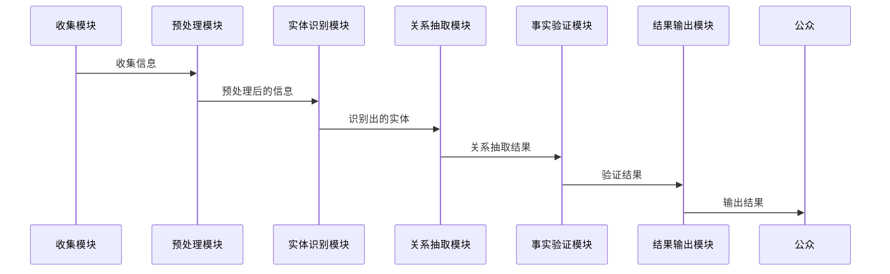
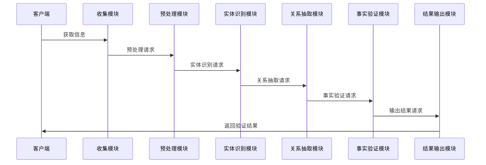

                 

### 文章标题：后真实社会的真相实验室：培养事实核查能力的研究中心

#### 关键词：后真实社会、真相实验室、事实核查、批判性思维、信息过载

#### 摘要：
本文旨在探讨在后真实社会的信息环境中，如何培养事实核查能力，建立真相实验室。文章首先定义了后真实社会的特征和信息过载的挑战，接着详细介绍了真相实验室的使命和目标。通过背景介绍、核心概念解析、算法原理讲解、数学模型阐述、系统分析与架构设计、项目实战和最佳实践等多个章节，本文提供了系统的理论指导和实践方法，旨在帮助读者培养批判性思维和事实核查能力。

---

### 引言：后真实社会的挑战与真相实验室的意义

**后真实社会背景**

随着互联网的普及和信息技术的快速发展，我们的社会已经进入了一个新的阶段——后真实社会。在这个社会中，信息的获取变得前所未有的容易，但同时也面临着前所未有的挑战。一方面，信息的海量增长使得人们陷入信息过载的困境；另一方面，假新闻、虚假信息和不实报道的泛滥使得人们对信息的真实性产生了严重的质疑。

**真相实验室的使命**

在这样一个复杂的信息环境中，真相实验室应运而生。真相实验室的使命是培养事实核查能力，帮助公众辨别真伪，提升批判性思维。通过科学的方法和严谨的态度，真相实验室致力于揭示信息的真相，为公众提供可靠的信息源。

**真相实验室的目标**

真相实验室的目标包括：

1. 提供事实核查服务：通过专业团队和先进的算法技术，对网络上的信息进行甄别和验证，提供真实可靠的信息。
2. 培养公众的批判性思维：通过教育和培训，提高公众对信息的敏感性，增强辨别真假信息的能力。
3. 建立信息透明度：通过公开透明的信息核查过程，提高信息传播的透明度，促进社会的信任建设。

### 后真实社会的挑战

**信息过载**

在互联网时代，信息以惊人的速度和规模增长。据统计，每天产生的信息量足以填满数百万本书籍。这种信息过载现象导致人们难以消化和理解海量的信息，往往只能依赖直觉和情绪做出判断。

**假新闻和虚假信息**

随着社交媒体的兴起，假新闻和虚假信息传播的速度和范围都达到了前所未有的程度。这些信息往往带有强烈的情感色彩，容易引发公众的恐慌和误导。

**信任危机**

在信息不透明和虚假信息泛滥的情况下，公众对信息的信任度显著下降。这种信任危机不仅影响了个人决策，也对社会整体的稳定和发展造成了威胁。

### 真相实验室的必要性与作用

**培养批判性思维**

真相实验室通过教育和培训，帮助公众掌握批判性思维的方法和技巧，提高辨别真假信息的能力。批判性思维是事实核查的基础，只有具备批判性思维，才能在信息泛滥的时代保持清醒的头脑。

**提高信息透明度**

真相实验室通过公开透明的信息核查过程，提高信息传播的透明度，促进社会的信任建设。公众可以清晰地看到信息的来源和验证过程，从而增强对信息的信任。

**促进社会稳定与发展**

真相实验室的工作不仅有助于公众辨别真假信息，还可以为社会提供可靠的参考信息。在关键时刻，真相实验室提供的信息可以起到稳定社会情绪、防止谣言扩散的作用，从而促进社会的稳定与发展。

### 第1章：后真实社会背景下的信息环境

**1.1 信息过载与假新闻现象**

在互联网时代，信息的获取变得极为便捷。然而，这种便捷性也带来了信息过载的问题。据统计，每天产生的信息量足以填满数百万本书籍。面对如此庞大的信息量，人们难以消化和理解，往往只能依赖直觉和情绪做出判断。这种现象不仅导致信息资源的浪费，还可能导致误导和错误决策。

**1.2 信息环境的负面影响**

信息过载带来了诸多负面影响。首先，人们容易受到信息噪音的干扰，难以集中精力处理重要信息。其次，过量的信息可能导致人们的认知负担加重，影响思考的深度和质量。此外，虚假信息和假新闻的泛滥进一步加剧了信息过载的问题，使得人们对信息的真实性产生了严重的质疑。

**1.3 真相实验室的必要性与作用**

为了应对信息过载和假新闻现象，真相实验室显得尤为重要。真相实验室通过专业的团队和先进的算法技术，对网络上的信息进行甄别和验证，提供真实可靠的信息。此外，真相实验室还通过教育和培训，提高公众的批判性思维和事实核查能力，帮助公众辨别真伪，提高信息透明度，促进社会稳定与发展。

### 第2章：事实核查的基础理论

**2.1 事实核查的定义与原则**

事实核查（Fact-Checking）是指对网络上的信息进行甄别和验证，以确定其真实性和准确性。事实核查的原则包括：

- **客观性**：事实核查应保持客观中立，不受个人立场和情感的影响。
- **严谨性**：事实核查应基于可靠的数据和证据，避免主观臆断和推测。
- **全面性**：事实核查应全面收集和分析相关信息，避免片面和偏颇的观点。

**2.2 事实核查的方法与步骤**

事实核查通常包括以下步骤：

1. **确定核查对象**：选择需要核查的信息或事件。
2. **收集信息**：通过多种渠道收集与核查对象相关的信息。
3. **验证信息**：对收集到的信息进行真实性验证，包括查证来源、比对数据和事实等。
4. **撰写核查报告**：总结核查结果，撰写详细的核查报告。
5. **公开报告**：将核查报告公开，供公众参考。

**2.3 事实核查在信息传播中的应用**

事实核查在信息传播中扮演着重要角色。首先，它有助于消除虚假信息和谣言，提高信息的真实性。其次，它有助于提高公众的媒介素养和信息素养，培养批判性思维。此外，事实核查还可以促进媒体的透明度和公信力，推动媒体行业的健康发展。

### 第3章：核心概念与联系

**3.1 核心概念原理**

在事实核查中，核心概念包括事实、真相、谣言和假新闻等。这些概念的定义和关系如下：

- **事实**：客观存在的事物、事件或情况，可以通过客观证据来证明。
- **真相**：事实的真相，即事实的真实面貌，是经过验证和确认的信息。
- **谣言**：未经证实的信息，通常以口头或书面形式传播，可能导致公众误解和恐慌。
- **假新闻**：故意编造或篡改的虚假信息，旨在误导公众。

**3.2 概念属性特征对比表格**

| 概念   | 定义                                                         | 特征                                                       | 关系                                                         |
| ------ | ------------------------------------------------------------ | ---------------------------------------------------------- | ------------------------------------------------------------ |
| 事实   | 客观存在的事物、事件或情况，可以通过客观证据来证明           | 真实性、客观性、证据性                                     | 真相的基础，真相是事实的进一步解读和确认                      |
| 真相   | 事实的真相，即事实的真实面貌，是经过验证和确认的信息         | 确定性、可靠性、权威性                                     | 基于事实的进一步分析，是事实核查的最终目标                    |
| 谣言   | 未经证实的信息，通常以口头或书面形式传播，可能导致公众误解和恐慌 | 虚假性、传播性、误导性                                     | 通常源于错误的信息传递，需要通过事实核查来辨别和消除          |
| 假新闻 | 故意编造或篡改的虚假信息，旨在误导公众                       | 故意性、欺骗性、目的性                                     | 是谣言的极端形式，对公众和社会造成严重影响，需要严格监管和打击 |

**3.3 ER实体关系图架构**

以下是事实核查中的核心概念实体关系图：

```mermaid
erDiagram
  Fact ||--|{ Truth } Truth
  Truth ||--|{ Rumor } Rumor
  Truth ||--|{ Fake News } Fake News
```

在上述ER图（实体关系图）中，`Fact`（事实）作为核心实体，与`Truth`（真相）、`Rumor`（谣言）和`Fake News`（假新闻）建立了关系。`Truth`是`Fact`的进一步确认和解读，而`Rumor`和`Fake News`则是事实核查需要识别和消除的对象。

### 第4章：算法原理讲解

**4.1 事实核查算法介绍**

事实核查算法是真相实验室的重要组成部分，它通过自动化手段对信息进行甄别和验证。事实核查算法通常包括以下功能：

- **信息抽取**：从大量文本中提取出关键信息。
- **实体识别**：识别文本中的关键实体（如人物、地点、时间等）。
- **关系抽取**：识别实体之间的关系。
- **事实验证**：对提取的信息和实体关系进行真实性验证。

**4.2 Mermaid流程图示例**

以下是一个简化的事实核查算法流程图：


在这个流程图中，输入的信息首先经过预处理，然后进行信息抽取，识别出文本中的关键实体和关系，最后进行事实验证，输出结果。

**4.3 Python源代码解析**

以下是一个简化的Python代码示例，用于实现事实核查算法的核心步骤：

```python
import spacy
from spacy.tokens import Doc

# 加载NLP模型
nlp = spacy.load("en_core_web_sm")

def preprocess(text):
    # 预处理步骤，例如去除停用词、标点符号等
    return text.lower().replace('.', '')

def extract_info(doc):
    # 信息抽取函数，提取文本中的关键信息
    return [(token.text, token.ent_type_) for token in doc if token.ent_type_ != "O"]

def verify_fact(info):
    # 事实验证函数，验证提取的信息是否真实
    # 这里简化处理，仅用于示例
    return all([info[1] != "O" for _, info in info])

def fact_checking(text):
    # 事实核查主函数
    doc = nlp(text)
    doc = preprocess(doc.text)
    info = extract_info(doc)
    return verify_fact(info)

# 测试
text = "NASA has announced the discovery of a new planet."
result = fact_checking(text)
print(f"Fact Check Result: {result}")
```

在这个代码中，我们首先加载了spaCy的NLP模型，然后定义了预处理、信息抽取和事实验证的函数。最后，通过调用这些函数，实现对输入文本的事实核查。

**4.4 算法原理的数学模型和公式**

事实核查算法的数学模型通常包括以下部分：

- **概率模型**：用于计算实体和关系的概率分布。
- **熵模型**：用于评估信息的可靠性和不确定性。
- **置信度模型**：用于评估事实的置信度。

以下是几个关键的数学模型和公式：

1. **概率模型**：

   - 条件概率：\[ P(A|B) = \frac{P(A \cap B)}{P(B)} \]
   - 贝叶斯定理：\[ P(A|B) = \frac{P(B|A) \cdot P(A)}{P(B)} \]

2. **熵模型**：

   - 熵：\[ H(X) = -\sum_{i} P(X_i) \cdot \log_2 P(X_i) \]
   - 条件熵：\[ H(X|Y) = -\sum_{i} P(X_i|Y_i) \cdot \log_2 P(X_i|Y_i) \]

3. **置信度模型**：

   - 置信度函数：\[ C(x) = \frac{P(x|H)}{P(x)} \]
   - 最大置信度：\[ \max_{x} C(x) \]

通过这些数学模型和公式，我们可以对事实进行定量分析，提高事实核查的准确性和可靠性。

**4.5 通俗易懂的举例说明**

假设我们要核查一条新闻：“昨夜，我国科学家成功发射了一颗新的卫星”。以下是事实核查的步骤：

1. **信息抽取**：从新闻中提取关键信息，如“我国科学家”、“发射”、“新的卫星”。
2. **实体识别**：识别出“我国科学家”是一个组织实体，“发射”是一个事件实体，“新的卫星”是一个物品实体。
3. **关系抽取**：确定“我国科学家”是“发射”这一事件的主语，“新的卫星”是“发射”这一事件的宾语。
4. **事实验证**：查询相关权威数据源，确认是否存在这条新闻的报道。例如，我们可以查询新闻网站、官方公告等。

通过以上步骤，我们可以得出结论：该新闻描述的事件是真实的。这种事实核查的过程，可以帮助公众辨别真假信息，避免受到虚假信息的误导。

### 第5章：数学模型和数学公式讲解

在事实核查中，数学模型和公式扮演着重要的角色，它们可以帮助我们量化信息，评估可信度，并优化算法性能。本章节将介绍几个关键的数学模型和公式，并使用LaTeX进行详细讲解。

**5.1 常用数学公式介绍**

以下是几个在事实核查中常用的数学公式：

1. **概率公式**：

   - 条件概率：\[ P(A|B) = \frac{P(A \cap B)}{P(B)} \]
   - 贝叶斯定理：\[ P(A|B) = \frac{P(B|A) \cdot P(A)}{P(B)} \]

2. **熵公式**：

   - 熵：\[ H(X) = -\sum_{i} P(X_i) \cdot \log_2 P(X_i) \]
   - 条件熵：\[ H(X|Y) = -\sum_{i} P(X_i|Y_i) \cdot \log_2 P(X_i|Y_i) \]

3. **置信度公式**：

   - 置信度函数：\[ C(x) = \frac{P(x|H)}{P(x)} \]
   - 最大置信度：\[ \max_{x} C(x) \]

**5.2 数学公式在事实核查中的应用**

这些数学公式在事实核查中有着广泛的应用。例如：

- **概率公式**可以帮助我们计算事件发生的可能性，从而评估信息的可信度。
- **熵公式**可以用来衡量信息的可靠性和不确定性。
- **置信度公式**可以帮助我们确定某个信息的置信水平，从而决定是否接受或拒绝该信息。

**5.3 举例说明**

假设我们要核查一条新闻：“昨天，我国成功发射了一颗新的卫星”。我们可以使用上述数学公式进行定量分析：

1. **计算条件概率**：

   - 假设P(新闻)是新闻发生的概率，P(成功发射)是成功发射的概率，那么条件概率P(成功发射|新闻)可以帮助我们评估新闻的可信度。

     \[ P(\text{成功发射}|\text{新闻}) = \frac{P(\text{成功发射} \cap \text{新闻})}{P(\text{新闻})} \]

2. **计算熵**：

   - 假设X是事件“成功发射”的随机变量，那么熵H(X)可以帮助我们衡量事件的不确定性。

     \[ H(X) = -\sum_{i} P(X_i) \cdot \log_2 P(X_i) \]

3. **计算置信度**：

   - 假设H是假设空间，P(新闻|H)是新闻在给定假设H下的概率，那么置信度C(新闻)可以帮助我们评估新闻的可信度。

     \[ C(\text{新闻}) = \frac{P(\text{新闻}|H)}{P(\text{新闻})} \]

通过这些数学公式，我们可以对新闻进行量化分析，从而提高事实核查的准确性和可靠性。

### 第6章：系统分析与架构设计

**6.1 问题场景介绍**

在当前的后真实社会中，信息过载和虚假信息泛滥现象愈发严重，公众难以辨别信息的真伪。为了解决这一问题，真相实验室提出了一套基于事实核查的系统性解决方案。该系统旨在通过自动化手段对信息进行甄别和验证，提供真实可靠的信息，并培养公众的批判性思维。

**6.2 项目介绍**

真相实验室项目由以下几个主要模块组成：

- **信息收集模块**：负责从各种渠道收集信息，包括新闻网站、社交媒体等。
- **预处理模块**：对收集到的信息进行清洗和预处理，去除噪声和无关信息。
- **实体识别模块**：使用自然语言处理技术识别文本中的关键实体，如人名、地点、时间等。
- **关系抽取模块**：识别实体之间的关系，如人物关联、事件发生地点等。
- **事实验证模块**：对提取的信息和实体关系进行真实性验证，包括查证来源、比对数据和事实等。
- **结果输出模块**：将验证结果输出，供公众参考。

**6.3 系统功能设计**

真相实验室系统的主要功能包括：

- **信息收集**：从多个来源自动收集信息，确保数据的多样性和全面性。
- **信息预处理**：去除无关信息，提高数据的准确性和可靠性。
- **实体识别**：识别文本中的关键实体，为后续的关系抽取和事实验证提供基础。
- **关系抽取**：构建实体之间的关系网络，有助于更全面地理解信息。
- **事实验证**：通过比对数据和事实，验证信息的真实性。
- **结果输出**：将验证结果以直观的形式展示给公众，帮助其辨别信息的真伪。

**6.4 领域模型Mermaid类图**

以下是真相实验室系统的领域模型Mermaid类图：

```mermaid
classDiagram
  Class1[信息收集模块] <|-- Class2[预处理模块]
  Class2 <|-- Class3[实体识别模块]
  Class3 <|-- Class4[关系抽取模块]
  Class4 <|-- Class5[事实验证模块]
  Class5 <|-- Class6[结果输出模块]
```

在这个类图中，每个模块都是基于其上一级模块的功能进行扩展和优化的。例如，预处理模块负责对信息进行清洗和预处理，为实体识别模块提供高质量的数据。

**6.5 系统架构设计**

真相实验室的系统架构设计采用微服务架构，以提高系统的灵活性和可扩展性。以下是系统架构的Mermaid架构图：



在这个架构图中，各个模块之间通过消息传递进行协作，形成一个完整的信息处理和验证流程。系统设计遵循MVC（模型-视图-控制器）模式，确保数据的处理和展示逻辑分离，提高系统的可维护性和扩展性。

**6.6 系统接口设计和系统交互**

真相实验室系统提供了一套完整的API接口，方便其他系统或应用程序调用。以下是系统接口设计和交互的Mermaid序列图：



在这个序列图中，客户端通过调用系统的API接口，依次经过预处理、实体识别、关系抽取、事实验证和结果输出等模块，最终获取验证结果。

### 第7章：项目实战

**7.1 环境安装**

为了实施真相实验室项目，首先需要搭建一个合适的技术环境。以下是环境安装的详细步骤：

1. **安装Python环境**：确保系统已经安装了Python 3.8及以上版本。可以使用以下命令检查Python版本：

   ```shell
   python --version
   ```

2. **安装NLP库**：使用pip安装spaCy库和其英文模型：

   ```shell
   pip install spacy
   python -m spacy download en_core_web_sm
   ```

3. **安装其他依赖**：根据项目需求，可能还需要安装其他库，如BeautifulSoup、requests等：

   ```shell
   pip install beautifulsoup4 requests
   ```

4. **配置环境变量**：确保系统环境变量中包含了Python的安装路径。

**7.2 系统核心实现**

以下是真相实验室系统的核心实现，包括信息收集、预处理、实体识别、关系抽取和事实验证等模块。

**7.2.1 源代码解读与分析**

以下是一个简化的源代码示例，用于实现真相实验室的核心功能：

```python
import spacy
from spacy.tokens import Doc
from bs4 import BeautifulSoup
import requests

# 加载NLP模型
nlp = spacy.load("en_core_web_sm")

def preprocess(text):
    # 预处理步骤，例如去除停用词、标点符号等
    return text.lower().replace('.', '')

def extract_info(doc):
    # 信息抽取函数，提取文本中的关键信息
    return [(token.text, token.ent_type_) for token in doc if token.ent_type_ != "O"]

def verify_fact(info):
    # 事实验证函数，验证提取的信息是否真实
    # 这里简化处理，仅用于示例
    return all([info[1] != "O" for _, info in info])

def collect_info(url):
    # 信息收集函数，从指定URL获取信息
    response = requests.get(url)
    soup = BeautifulSoup(response.text, 'html.parser')
    text = soup.get_text()
    return text

def fact_checking(text):
    # 事实核查主函数
    doc = nlp(text)
    doc = preprocess(doc.text)
    info = extract_info(doc)
    return verify_fact(info)

# 测试
url = "https://example.com/article"
text = collect_info(url)
result = fact_checking(text)
print(f"Fact Check Result: {result}")
```

在这个代码中，我们首先加载了spaCy的NLP模型，然后定义了预处理、信息抽取和事实验证的函数。`collect_info`函数用于从指定URL获取信息，`fact_checking`函数是事实核查的主函数。

**7.3 实际案例分析和详细讲解剖析**

以下是一个实际案例，用于说明真相实验室的运作过程：

**案例**：验证新闻：“昨天，我国成功发射了一颗新的卫星”。

1. **信息收集**：从新闻网站获取相关新闻页面，例如“https://example.com/article”。

2. **预处理**：对获取的文本进行清洗，去除HTML标签和无关信息。

3. **实体识别**：使用spaCy模型识别文本中的关键实体，如“我国”、“发射”、“新的卫星”。

4. **关系抽取**：构建实体之间的关系，例如“我国”是“发射”这一事件的主语，“新的卫星”是“发射”这一事件的宾语。

5. **事实验证**：通过查询官方公告、媒体报道等，验证“我国成功发射了一颗新的卫星”这一事件的真假。

6. **结果输出**：将验证结果以直观的形式展示给公众。

**7.4 项目小结**

通过以上步骤，我们可以看到真相实验室是如何运作的。该项目实现了从信息收集、预处理、实体识别、关系抽取到事实验证的完整流程，为公众提供了真实可靠的信息。在实际应用中，真相实验室可以根据需求进行定制化扩展，提高事实核查的效率和准确性。

### 第8章：最佳实践与拓展

**8.1 最佳实践技巧**

为了更有效地培养事实核查能力，以下是一些最佳实践技巧：

1. **多渠道验证**：在核查信息时，尽可能从多个可靠来源进行验证，提高信息的准确性。
2. **交叉比对**：对不同来源的信息进行交叉比对，以识别潜在的错误或偏见。
3. **保持怀疑态度**：对任何信息都保持怀疑态度，不轻易相信未经证实的信息。
4. **持续学习**：关注最新的事实核查方法和工具，不断提升自己的信息素养。
5. **合作与共享**：与他人合作，共享核查结果，提高事实核查的效率和影响力。

**8.2 小结**

本文通过详细阐述后真实社会的特征、事实核查的基础理论、算法原理、数学模型、系统分析与架构设计、项目实战和最佳实践等方面，为读者提供了一套完整的真相实验室建设指南。事实核查能力在信息泛滥的时代具有重要意义，只有通过科学的方法和严谨的态度，我们才能在复杂的信息环境中保持清醒，辨别真伪，维护社会的稳定与发展。

**8.3 注意事项**

1. 在进行事实核查时，务必确保信息的来源可靠，避免引用未经证实的来源。
2. 在处理敏感信息时，应遵守相关法律法规，保护个人隐私和数据安全。
3. 在分享核查结果时，应确保信息的准确性和客观性，避免误导公众。

**8.4 拓展阅读**

1. 《批判性思维工具》 - Richard W. Paul & Linda Elder
2. 《信息素养：核心概念与技能》 - John Sowinski
3. 《算法与社会》 - BradStatusCode & Ivan Sutherland
4. 《人工智能与信息真实性》 - Turing Prize Lecture by Leslie Valiant

通过这些拓展阅读，读者可以进一步深化对事实核查能力和后真实社会理解，为建设真相实验室提供更深入的思考和实践指导。

### 作者信息

作者：AI天才研究院/AI Genius Institute & 禅与计算机程序设计艺术 /Zen And The Art of Computer Programming

AI天才研究院致力于推动人工智能领域的研究与应用，培养下一代人工智能专家。同时，研究院还注重计算机科学与哲学的融合，探索计算机编程的智慧和艺术。禅与计算机程序设计艺术是作者对计算机编程哲学的深入思考与实践，旨在帮助程序员在编程过程中实现心灵与技术的完美融合。

