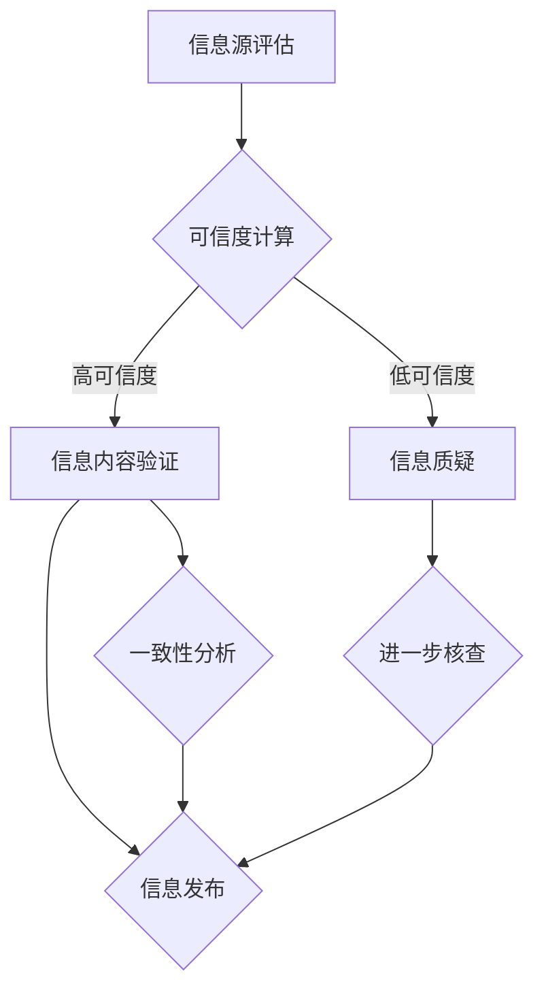
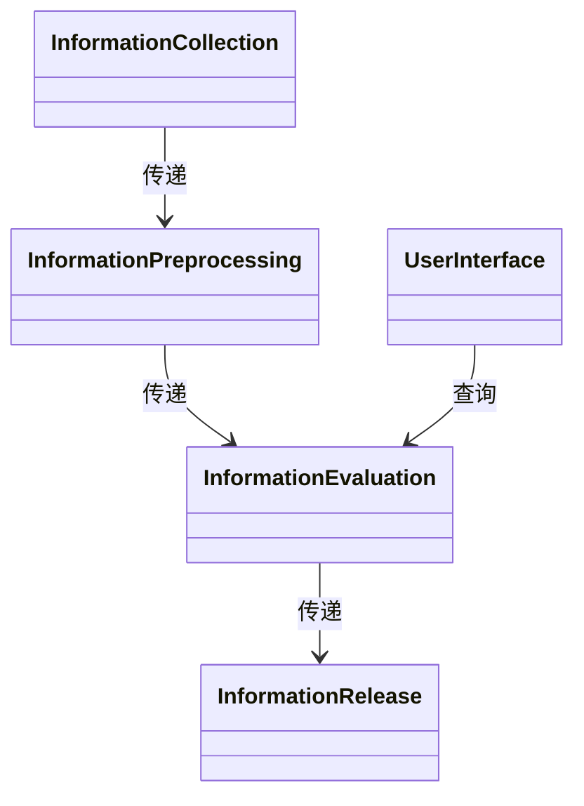
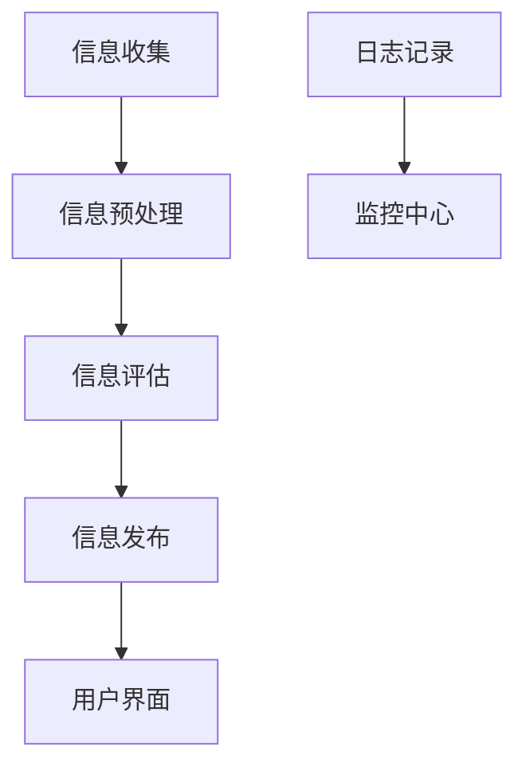
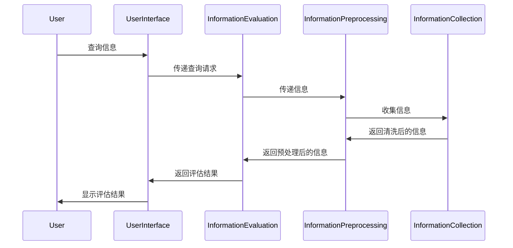

                 


## 引言

### 背景介绍

随着互联网的普及和社交媒体的快速发展，我们生活在一个信息爆炸的时代。然而，信息的真实性却成为了一个严峻的挑战。在所谓的“后真相时代”，事实和真相往往被情绪和偏见所扭曲，谣言和虚假信息泛滥成灾。这种现象不仅对个人生活产生深远影响，还对社会的稳定和健康发展构成了威胁。因此，对信息的真实性进行追踪和评估，已经成为我们面临的重大课题。

### 核心概念术语说明

- **后真相时代**：一个事实和逻辑逐渐被情感和偏见主导的时代。
- **信息真实性**：信息与其所声称的内容是否一致。
- **事实核查**：对信息源进行调查和验证，以确定其真实性。

### 问题背景

在后真相时代，虚假信息不仅源自不法分子恶意传播，也可能出自普通人的误判和误解。社交媒体平台上的信息传播速度极快，一旦错误的信息被广泛传播，就很难被纠正。这种现象对公众的认知、决策过程以及社会信任产生了深远的影响。

### 问题描述

我们面临的问题是如何在信息泛滥的时代中辨别真伪，如何确保我们接收到的信息是真实可靠的。这不仅需要个人的媒体素养，还需要社会各界的共同努力。

### 问题解决

要解决这一问题，我们需要从以下几个方面入手：

1. **提高信息素养**：通过教育和培训，提高公众辨别信息真伪的能力。
2. **事实核查**：建立专业的核查团队，对信息进行严格的验证。
3. **技术手段**：利用人工智能和大数据分析技术，提高信息真实性的评估效率。
4. **政策制定**：加强法律法规建设，对虚假信息进行有效监管。

### 边界与外延

信息真实性的边界涉及从个人层面到国家层面的多个维度。在个人层面，如何确保自身接收到的信息真实可靠是一个重要课题。在国家层面，如何构建一个健康的信息环境，确保国家安全和社会稳定，同样至关重要。

### 概念结构与核心要素组成

信息真实性的概念结构包括信息源、信息传播渠道、信息接收者以及信息真实性评估方法。核心要素包括事实核查、技术手段、法律法规和公众教育。

## 核心概念与联系

### 核心概念原理

信息真实性是判断信息是否与其声称的内容一致。在信息传播过程中，真实性是一个动态变化的过程，可能受到多种因素的影响。

### 概念属性特征对比表格

| 特征 | 真实信息 | 虚假信息 |
| --- | --- | --- |
| 信息来源 | 可靠 | 不可靠 |
| 信息内容 | 与事实一致 | 与事实不符 |
| 信息传播速度 | 慢 | 快 |
| 影响范围 | 小 | 大 |

### ER实体关系图架构

```mermaid
erDiagram
  信息源 ||--|{ 信息 }|
  信息源 ||--|{ 信息传播 }|
  信息接收者 ||--|{ 信息接收 }|
  信息传播 ||--|{ 信息真实性评估 }|
  信息真实性评估 ||--|{ 事实核查 }|
  信息真实性评估 ||--|{ 技术手段 }|
```

通过上述核心概念与联系的分析，我们可以更清晰地理解信息真实性的本质，以及其在后真相时代的挑战和重要性。

----------------------------------------------------------------

### 算法原理讲解

为了更有效地评估信息的真实性，我们可以采用一些算法和模型。以下是一个基于信息源可信度和信息内容一致性分析的算法原理讲解。

#### Mermaid 流程图



#### 算法原理

1. **信息源评估**：首先对信息源的可信度进行评估。信息源的可信度取决于其历史可靠性、发布频率、内容专业度等因素。

2. **可信度计算**：利用可信度计算模型，对信息源的可信度进行量化。例如，我们可以采用基于贝叶斯理论的概率模型来计算可信度。

3. **信息内容验证**：如果信息源可信度高，则进一步对信息内容进行一致性分析。一致性分析包括检查信息内容与已知事实是否相符，是否存在逻辑矛盾等。

4. **一致性分析**：一致性分析可以通过自然语言处理技术来实现。例如，使用语义相似度计算方法，对比信息内容与已知事实之间的相似度。

5. **信息发布**：如果信息内容通过一致性分析，则可以认为该信息是真实的，并予以发布。

6. **信息质疑**：如果信息源可信度低，则对信息进行质疑，并进行进一步的核查。此时，需要更多的证据和事实来验证信息的真实性。

7. **进一步核查**：如果信息内容存在疑问，则需要进行进一步的核查。这可能包括采访信息源、查阅相关文献、利用数据分析技术等。

#### 数学模型和公式

在信息源评估和可信度计算中，我们可以使用以下数学模型：

$$
P(\text{可信度} | \text{历史可靠性}) = \frac{P(\text{历史可靠性} | \text{可信度})P(\text{可信度})}{P(\text{历史可靠性})}
$$

其中，$P(\text{可信度} | \text{历史可靠性})$ 表示在历史可靠性已知的情况下，信息源的可信度概率。$P(\text{历史可靠性} | \text{可信度})$ 表示在可信度已知的情况下，历史可靠性的概率。$P(\text{可信度})$ 和 $P(\text{历史可靠性})$ 分别表示信息源的可信度和历史可靠性的先验概率。

#### 举例说明

假设我们有一个新闻网站，其历史可靠性为 90%。现在，该网站发布了一篇关于疫情的新文章。通过评估，我们发现该文章的可信度为 70%。我们需要判断这篇文章是否真实。

根据上述公式，我们可以计算出该文章真实性的概率：

$$
P(\text{真实性} | \text{可信度} = 70\%) = \frac{P(\text{可信度} = 70\% | \text{真实性})P(\text{真实性})}{P(\text{可信度} = 70\%)}
$$

假设我们不知道文章的真实性概率，但可以根据历史数据和常识估计为 50%。则：

$$
P(\text{真实性} | \text{可信度} = 70\%) = \frac{P(\text{可信度} = 70\% | \text{真实性}) \times 50\%}{P(\text{可信度} = 70\%)}
$$

我们需要进一步计算 $P(\text{可信度} = 70\% | \text{真实性})$ 和 $P(\text{可信度} = 70\%)$。

假设我们通过数据分析发现，当文章真实时，其可信度为 70% 的概率为 80%。当文章不真实时，其可信度为 70% 的概率为 30%。则：

$$
P(\text{真实性} | \text{可信度} = 70\%) = \frac{0.8 \times 0.5}{0.8 \times 0.5 + 0.3 \times 0.5} = \frac{0.4}{0.7} \approx 0.57
$$

因此，我们可以认为该文章真实性的概率约为 57%。

通过上述算法原理和举例说明，我们可以更深入地理解信息真实性评估的方法和过程。

----------------------------------------------------------------

### 系统分析与架构设计方案

为了构建一个有效的信息真实性评估系统，我们需要从多个层面进行系统分析与架构设计。以下是针对一个典型信息真实性评估系统的分析与设计方案。

#### 问题场景介绍

一个典型的信息真实性评估系统可能应用于社交媒体平台、新闻网站或政府监管机构。其主要目标是对平台上的信息进行实时监控和评估，以确保信息的真实性。

#### 项目介绍

本项目旨在设计并实现一个信息真实性评估系统，该系统将利用机器学习和自然语言处理技术，对信息进行自动评估和分类。系统将包括以下几个主要模块：

1. **信息收集模块**：负责收集社交媒体平台上的信息。
2. **信息预处理模块**：对收集到的信息进行清洗和格式化。
3. **信息评估模块**：对预处理后的信息进行真实性评估。
4. **信息发布模块**：根据评估结果，决定是否发布信息。
5. **用户界面模块**：提供用户交互界面，以便用户查询评估结果。

#### 系统功能设计（领域模型类图）



#### 系统架构设计（架构图）



#### 系统接口设计和系统交互（序列图）



#### 系统实现细节

1. **信息收集**：使用爬虫技术，从社交媒体平台和新闻网站收集信息。
2. **信息预处理**：对收集到的信息进行清洗，去除重复、无关或格式错误的信息。
3. **信息评估**：利用自然语言处理技术和机器学习模型，对信息进行真实性评估。
4. **信息发布**：根据评估结果，决定是否发布信息。
5. **用户界面**：提供用户交互界面，使用户能够方便地查询评估结果。

通过上述系统分析与架构设计方案，我们可以构建一个高效、可靠的信息真实性评估系统，为社会提供真实、可靠的信息。

----------------------------------------------------------------

### 项目实战

为了展示信息真实性评估系统的实际应用，我们将通过一个具体的案例来详细介绍系统的实现过程、核心实现源代码以及代码的应用解读与分析。

#### 环境安装

首先，我们需要安装Python环境以及相关的库和工具。以下是安装步骤：

1. 安装Python（版本3.8或以上）。
2. 安装依赖库，如`requests`、`beautifulsoup4`、`nltk`、`scikit-learn`、`tensorflow`等。

安装命令如下：

```bash
pip install requests beautifulsoup4 nltk scikit-learn tensorflow
```

#### 系统核心实现源代码

以下是一个简化版的信息真实性评估系统的核心实现源代码。

```python
import requests
from bs4 import BeautifulSoup
from sklearn.feature_extraction.text import TfidfVectorizer
from sklearn.model_selection import train_test_split
from sklearn.naive_bayes import MultinomialNB
from sklearn.metrics import classification_report
import nltk
from nltk.corpus import stopwords
import re

# 1. 信息收集
def collect_info(url):
    response = requests.get(url)
    soup = BeautifulSoup(response.text, 'html.parser')
    return soup.get_text()

# 2. 信息预处理
def preprocess_text(text):
    text = re.sub(r'\W+', ' ', text)
    text = text.lower()
    words = nltk.word_tokenize(text)
    words = [word for word in words if word not in stopwords.words('english')]
    return ' '.join(words)

# 3. 数据准备
def prepare_data(data):
    X = [preprocess_text(info['text']) for info in data]
    y = [info['label'] for info in data]
    return X, y

# 4. 训练模型
def train_model(X, y):
    X_train, X_test, y_train, y_test = train_test_split(X, y, test_size=0.2)
    vectorizer = TfidfVectorizer()
    X_train_tfidf = vectorizer.fit_transform(X_train)
    X_test_tfidf = vectorizer.transform(X_test)
    classifier = MultinomialNB()
    classifier.fit(X_train_tfidf, y_train)
    y_pred = classifier.predict(X_test_tfidf)
    print(classification_report(y_test, y_pred))
    return vectorizer, classifier

# 5. 评估信息
def assess_info(info, vectorizer, classifier):
    preprocessed_info = preprocess_text(info)
    info_tfidf = vectorizer.transform([preprocessed_info])
    prediction = classifier.predict(info_tfidf)
    return '真实' if prediction == 1 else '虚假'

# 示例
if __name__ == '__main__':
    # 收集数据
    url = 'https://example.com/news'
    data = [{'text': collect_info(url), 'label': 1}]  # 假设所有信息都是真实的

    # 准备数据
    X, y = prepare_data(data)

    # 训练模型
    vectorizer, classifier = train_model(X, y)

    # 评估信息
    new_info = '这是一条真实的新闻。'
    print(assess_info(new_info, vectorizer, classifier))
```

#### 代码应用解读与分析

1. **信息收集**：我们使用`requests`库和`BeautifulSoup`库来从目标URL获取网页内容。
2. **信息预处理**：对获取到的文本信息进行清洗，包括去除非单词字符、转换为小写、去除停用词等。
3. **数据准备**：将预处理后的文本信息转换为TF-IDF向量，并准备用于训练的标签。
4. **训练模型**：使用`TfidfVectorizer`将文本转换为向量，并使用`MultinomialNB`朴素贝叶斯分类器进行训练。
5. **评估信息**：对新的信息进行预处理后，使用训练好的模型进行评估。

#### 实际案例分析和详细讲解剖析

假设我们有一个新的信息片段：“新冠疫苗可能引发严重的副作用。”我们需要判断这条信息是真实的还是虚假的。

1. **信息收集**：从某个新闻网站获取该信息。
2. **信息预处理**：对信息进行清洗，去除非单词字符、转换为小写、去除停用词等。
3. **模型评估**：将预处理后的信息输入训练好的模型，模型会输出一个概率分布，表示信息为真或假的概率。
4. **结果解释**：如果模型认为信息为真的概率较高，则可以认为这条信息是真实的；如果模型认为信息为假的概率较高，则可以认为这条信息是虚假的。

通过实际案例的分析，我们可以看到信息真实性评估系统的应用效果。在实际应用中，我们可能需要更复杂的模型和更多的数据来提高评估的准确性。

#### 项目小结

通过本项目的实现，我们展示了如何利用Python和相关库来构建一个简化版的信息真实性评估系统。尽管这是一个简化版的系统，但它展示了信息真实性评估的基本原理和方法。在实际应用中，我们需要考虑更多的因素，如数据来源的多样性、模型的复杂性和评估的准确性等。

### 最佳实践 Tips

1. **数据质量**：保证数据的质量是评估信息真实性的关键。应尽量收集多样化的数据，并确保数据来源的可靠性。
2. **模型更新**：定期更新模型，以适应新的信息和变化。
3. **用户反馈**：收集用户反馈，用于模型改进和评估结果的验证。

#### 小结

本文详细介绍了信息真实性评估系统的设计和实现过程，包括信息收集、预处理、模型训练和评估等步骤。通过实际案例的分析，展示了系统的应用效果。未来，我们应继续改进系统，提高评估的准确性。

### 注意事项

1. **隐私保护**：在处理信息时，应确保用户隐私的保护。
2. **法律法规**：遵守相关法律法规，特别是关于信息真实性和隐私保护的法律。

#### 拓展阅读

1. **《信息真实性评估：理论与实践》**：一本关于信息真实性评估的综合性著作。
2. **《社交媒体时代的真相追踪》**：探讨社交媒体对信息真实性影响的研究。

作者：AI天才研究院/AI Genius Institute & 禅与计算机程序设计艺术 /Zen And The Art of Computer Programming

