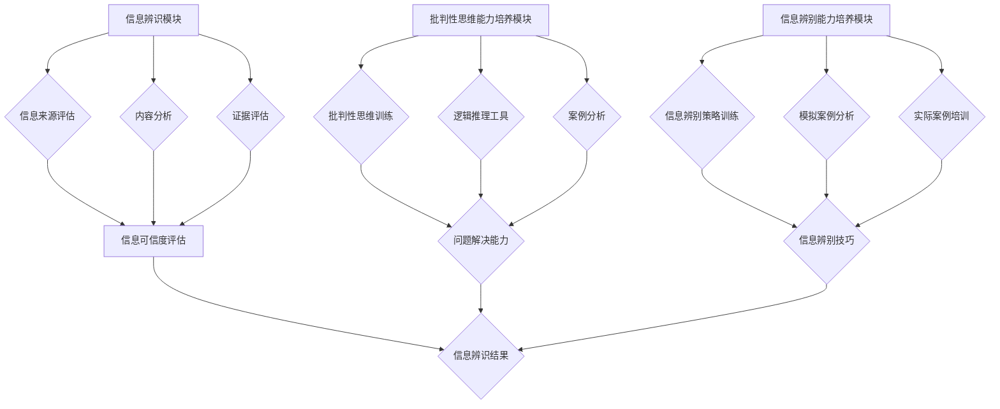
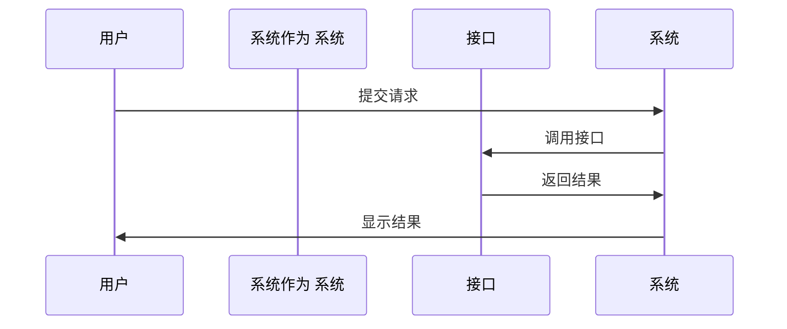
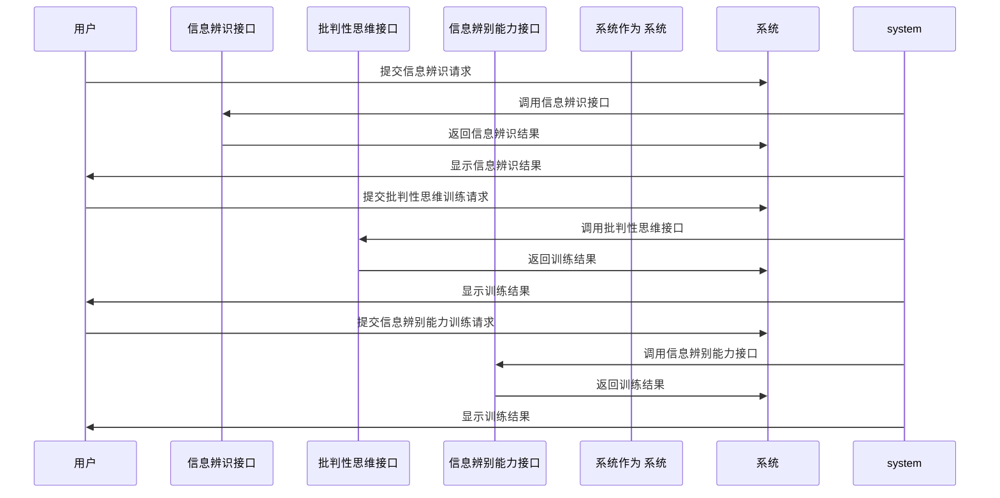

                 

### 引言

在后真相时代，信息爆炸与媒体多元化带来了前所未有的挑战。新闻不再是单纯传递事实的工具，而是被政治、经济、社会等多重因素所影响，充斥着假新闻、误导性信息和有意为之的偏见。这种现象不仅扰乱了社会秩序，还深刻地影响着每个人的认知和判断。因此，提升媒体素养、培养批判性思维与信息辨别能力变得尤为迫切和重要。

本文旨在探讨在后真相时代如何培养媒体素养，特别是批判性思维与信息辨别能力。首先，我们将明确什么是后真相时代，以及它对媒体环境和社会带来的变化。接着，我们将深入分析媒体素养的核心概念及其重要性。随后，本文将详细探讨批判性思维的培养方法和信息辨别能力的重要性，以及如何通过实际案例和系统分析来提高这些能力。最后，我们将总结本文的主要观点，并提出一些建议，帮助读者在复杂多变的媒体环境中保持清醒的头脑，做出明智的判断。

通过这篇文章，我们希望读者能够理解后真相时代的媒体现状，掌握提升媒体素养的关键策略，并在面对各种信息时，具备批判性思维和信息辨别能力，从而更好地应对这一时代的挑战。

### 后真相时代的定义与特点

“后真相时代”（Post-Truth Era）是一个近年来广为讨论的概念，它起源于2016年，由英国广播公司（BBC）首次提出，用来描述信息传播和社会认知中的一种新现象。后真相时代的定义与传统的“真相优先”（Truth-First）媒体环境有着显著区别。在“真相优先”时代，信息传播以事实和证据为基础，媒体的目标是尽可能准确地传递信息，让公众对事件有清晰的认知。而在后真相时代，真相不再是唯一的决定因素，情感、偏见和谣言在一定程度上能够影响公众的认知和判断。

后真相时代的媒体特点主要体现在以下几个方面：

1. **信息的碎片化**：随着互联网和社交媒体的发展，信息传播速度极快，内容形式也变得多样化。传统媒体的垄断地位被打破，各种信息来源鱼龙混杂，公众接收到的信息往往是碎片化的，缺乏系统性。

2. **情绪化的传播**：在后真相时代，情绪和情感往往成为信息传播的核心。一些假新闻、误导性信息甚至经过精心设计，以吸引眼球、激起公众情绪为目的。这种传播方式不仅容易引起公众的恐慌和焦虑，还可能被政治或商业力量操纵，影响社会稳定。

3. **事实与观点的混合**：传统媒体中的事实报道与观点评论相对分离，而在后真相时代，事实与观点常常混杂在一起。一些媒体为了提高吸引力和竞争性，会采用带有明显倾向性的报道，导致公众难以区分信息的真实性和可靠性。

4. **信任危机**：后真相时代的媒体环境给公众带来了严重的信任危机。一方面，假新闻和谣言的泛滥使公众对信息的真实性产生怀疑；另一方面，一些主流媒体为了追求点击率和市场份额，有时也会牺牲新闻的客观性和真实性。

5. **政治和社会影响**：后真相时代的媒体特点不仅影响公众的认知，还对政治和社会产生了深远的影响。政治宣传和操纵变得更加隐蔽和复杂，公众的意见和判断受到情绪和谣言的干扰，社会共识和信任进一步减弱。

后真相时代的这些特点给媒体环境和社会带来了诸多挑战。面对这些挑战，提升媒体素养、培养批判性思维和信息辨别能力成为应对后真相时代的关键。只有通过系统学习和自我提升，公众才能在复杂多变的媒体环境中保持清醒，做出明智的判断。

### 媒体素养的定义和重要性

媒体素养（Media Literacy）是指公众在接触、理解、分析和制作媒体内容时，所具备的知识、技能和态度。它不仅涉及对媒体内容的辨识能力，还包括对媒体运作机制的认知，以及对自身媒介角色的理解。媒体素养的核心目标是培养公众在面对各种信息时，能够独立思考、理性判断，从而做出明智的选择。

**组成部分**

媒体素养主要包括以下几个组成部分：

1. **信息辨识能力**：指公众能够识别媒体内容中的真实与虚假、可靠与不可靠信息。这包括对信息来源、发布者的背景和动机进行分析，以及评估信息内容的质量和可信度。

2. **批判性思维**：这是媒体素养的核心要素之一，指的是公众在面对信息时，能够运用逻辑推理、证据分析和综合评估，从而做出独立和理性的判断。批判性思维要求公众不盲从、不轻信，而是通过多角度、多层次的思考，寻找信息的真实性和内在逻辑。

3. **信息处理技能**：这包括对信息进行筛选、整合、分析和创造的能力。公众需要掌握如何有效地从大量信息中提取关键信息，以及如何利用这些信息来支持自己的观点或进行决策。

4. **媒体使用策略**：这指的是公众在接触和使用媒体时，能够制定合理的策略，例如如何避免被虚假信息误导、如何提高媒体使用效率等。

**重要性**

媒体素养的重要性体现在以下几个方面：

1. **提高公民素质**：具备媒体素养的公众能够更好地参与社会事务，了解社会动态，做出理性决策。这有助于提升社会的整体素质和民主水平。

2. **应对信息泛滥**：在后真相时代，信息泛滥和谣言四起，公众缺乏媒体素养，容易受到虚假信息的误导。提高媒体素养，有助于公众在信息海洋中保持清醒，避免被误导。

3. **增强社会信任**：媒体素养的培养有助于公众对媒体内容产生更高的信任度，减少因假新闻和谣言引发的恐慌和混乱。这有助于维护社会稳定和公信力。

4. **促进民主发展**：媒体是民主社会的重要基石。具备媒体素养的公众能够更有效地监督政府和媒体，推动社会进步和民主发展。

**具体内容和核心要素**

1. **信息辨识**：包括对信息来源的审查、信息内容的真实性评估、证据分析等。

2. **批判性思维**：包括逻辑推理、多角度分析、证据支持、评估信息倾向性等。

3. **信息处理**：包括信息筛选、整合、分析和创造，以及对信息进行批判性评估。

4. **媒体使用**：包括制定媒体使用策略，如避免过度依赖单一信息源、学会信息验证等。

通过上述组成部分和核心要素的分析，我们可以看到，媒体素养不仅关乎个人成长和素质提升，更关乎社会的稳定和发展。在信息爆炸和媒体多元化的后真相时代，培养媒体素养，是每一个公民的责任和使命。

### 批判性思维的培养方法

批判性思维（Critical Thinking）是一种逻辑性、系统性、多角度的思维方式，它要求个体在面对问题时，能够超越表面的现象，深入分析问题的本质，从而做出合理的判断。在后真相时代，批判性思维尤为重要，因为它可以帮助公众从纷繁复杂的信息中辨别真伪，减少误导和偏见的影响。以下是一些具体的培养方法：

**步骤一：明确问题**

批判性思维的第一步是明确问题。在接触信息时，首先要弄清楚信息在讲什么，问题是什么。这需要个体具备敏锐的观察力和洞察力，能够迅速识别关键问题，并对其进行深入思考。

**步骤二：收集信息**

明确问题后，下一步是收集与问题相关的信息。这包括查找相关的文献、数据、报道等，并尽可能多地获取各种观点和证据。在信息收集过程中，需要保持开放的心态，不要急于下结论，而是充分了解各种可能的解释和论据。

**步骤三：分析信息**

收集到足够的信息后，下一步是进行分析。分析的方法包括逻辑推理、证据评估、比较和对照等。通过这些方法，个体可以识别信息的逻辑结构和内在逻辑，评估证据的可靠性和有效性，找出潜在的偏见和误导。

**步骤四：评估和判断**

在分析信息后，个体需要对这些信息进行评估和判断。这需要综合各种信息，运用批判性思维工具，如因果分析、辩证推理等，得出合理的结论。评估和判断时，要避免盲目接受或拒绝任何一方，而是通过多角度、多层次的分析，寻找最符合事实和逻辑的结论。

**步骤五：反思和修正**

批判性思维不仅是一种解决问题的工具，更是一种持续改进的过程。在得出结论后，个体需要反思自己的思考过程和结论，评估其合理性和有效性。如果发现逻辑错误或证据不足，需要及时修正自己的判断。反思和修正可以帮助个体不断提高批判性思维的能力，从而更好地应对复杂多变的信息环境。

**实践应用**

以下是几个实际案例，展示如何运用批判性思维来处理信息：

1. **评估新闻报道**：在阅读新闻报道时，首先判断报道的信息来源是否可靠，报道内容是否具有可信的证据支持。如果发现报道存在明显的偏见或误导，需要进一步查找其他来源的信息进行对比和验证。

2. **分析政策提案**：在讨论政策提案时，不仅要关注提案的表面内容，还要深入分析其背后的逻辑和潜在影响。通过评估提案的证据支持、实施成本和预期效果，得出客观的判断。

3. **处理个人冲突**：在处理个人冲突时，需要通过批判性思维来理解各方的立场和利益，识别潜在的误解和偏见。通过多角度的分析和沟通，找到问题的根源，并提出合理的解决方案。

通过这些步骤和实践应用，个体可以逐步培养批判性思维，提高自己在信息辨别和问题解决方面的能力。在后真相时代，批判性思维不仅是应对信息过载和误导的利器，更是维护个人和社会理性的重要工具。

### 信息辨别能力的培养策略

在信息爆炸和媒体多元化的后真相时代，培养信息辨别能力（Information Discrimination Ability）变得尤为重要。信息辨别能力是指个体在接触信息时，能够准确判断信息的真实性和可靠性的能力。以下是一些有效的培养策略：

**步骤一：确定信息需求**

首先，个体需要明确自己的信息需求。在接触信息之前，要明确自己需要了解什么，为什么要了解这些信息。这有助于个体在信息海洋中找到有价值的信息，避免被无关的信息所干扰。

**步骤二：查找多源信息**

在确定信息需求后，个体应查找多个信息来源，以获取全面和多样的信息。这包括传统媒体、社交媒体、专业网站、学术文献等。通过多源信息的对比和分析，可以减少单一信息来源带来的偏见和误导。

**步骤三：评估信息来源**

在获取信息后，个体需要评估信息来源的可靠性。这包括检查信息发布者的背景、资质和动机，评估信息来源的权威性和公信力。通常，官方机构、专业机构和知名媒体的报道更具可信度。

**步骤四：分析信息内容**

评估信息来源后，个体应对信息内容进行深入分析。这包括检查信息的内容是否合理、逻辑是否清晰、证据是否充分等。通过逻辑分析和证据评估，可以识别信息中的错误、偏见和误导。

**步骤五：交叉验证**

为了进一步提高信息辨别能力，个体应进行交叉验证。这包括使用多个来源的信息来验证同一信息点，或使用专业知识和权威观点来评估信息的准确性。交叉验证可以有效地减少信息错误和误导。

**具体策略和方法**

1. **使用事实核查工具**：事实核查工具（Fact-Checking Tools）如“聚合新闻”（AllSides）和“引文核查”（FactCheck.org）可以帮助个体快速识别假新闻和误导性信息。

2. **培养专业知识**：通过学习相关领域的专业知识，个体可以更准确地评估信息的真实性。例如，对于科学领域的信息，具备科学知识的人更容易识别虚假的科学陈述。

3. **保持批判性思维**：保持批判性思维可以帮助个体在接触信息时，保持怀疑和理性的态度。通过多角度、多层次的思考，个体可以更全面地评估信息。

4. **参与讨论和辩论**：参与讨论和辩论可以锻炼个体的信息辨别能力。在辩论中，个体需要通过逻辑分析和证据支持来支持自己的观点，从而提高信息辨别能力。

5. **定期反思**：定期反思自己的信息辨别过程和结果，可以帮助个体识别和纠正错误，进一步提高信息辨别能力。

通过以上策略和方法，个体可以逐步培养和提高自己的信息辨别能力，在复杂多变的媒体环境中，做出更加明智和准确的判断。信息辨别能力不仅有助于个体保护自己，也有助于维护社会的公正和稳定。

### 媒体素养、批判性思维与信息辨别能力的关系

在复杂多变的媒体环境中，媒体素养、批判性思维和信息辨别能力这三者之间存在着紧密的内在联系。它们共同构成了一个相互支持、相互促进的整体，帮助个体在信息过载的时代中保持清醒的头脑，做出明智的决策。

**媒体素养与批判性思维**：媒体素养是批判性思维的基础。一个具备良好媒体素养的人，能够识别和评估信息的真实性和可靠性，从而为批判性思维提供可靠的信息来源。批判性思维则是媒体素养的深化和应用。它要求个体在面对信息时，不仅要有辨识能力，还要运用逻辑推理、多角度分析和证据评估等手段，对信息进行深入分析和判断。因此，媒体素养是批判性思维的前提，而批判性思维则是媒体素养的升华。

**批判性思维与信息辨别能力**：批判性思维和信息辨别能力密不可分。批判性思维提供了分析信息的工具和方法，而信息辨别能力则是应用这些工具和方法的具体表现。批判性思维帮助个体在接触信息时，能够保持理性、客观的态度，从而更准确地判断信息的真实性和可靠性。而信息辨别能力则是批判性思维在实际中的应用，它使个体能够在复杂多变的媒体环境中，迅速识别和筛选出有价值的信息。

**媒体素养、批判性思维与信息辨别能力的综合作用**：这三者共同作用，帮助个体在信息过载的时代中保持清醒和理性。媒体素养提供了基础的信息识别能力，批判性思维提供了深入的分析和判断工具，而信息辨别能力则是这两者具体应用的结果。通过综合运用这三者，个体可以更好地理解和评估信息，减少误导和偏见的影响，从而做出更加明智的决策。

在实际生活中，我们可以通过以下方式来综合运用这三者：

1. **增强媒体素养**：通过学习媒体素养的基本知识，了解信息传播的机制和特点，提高对信息的辨识能力。

2. **培养批判性思维**：通过多角度分析和逻辑推理，深入理解信息的内涵和逻辑结构，提高分析问题的能力。

3. **锻炼信息辨别能力**：通过多源信息对比、交叉验证和事实核查等手段，提高对信息的辨别和筛选能力。

通过这些方法的综合运用，个体可以在面对复杂多变的媒体环境时，保持清醒的头脑，做出明智的判断，从而更好地应对后真相时代的挑战。

### 媒体素养培养的系统分析与架构设计

为了系统地培养媒体素养，我们需要对媒体素养的培养过程进行深入分析，并设计一个有效的系统架构。以下是具体的系统分析与架构设计：

#### 问题场景介绍

在当前媒体环境高度复杂和多变的情况下，公众面临着大量真假难辨的信息，以及各种误导性信息的影响。为了提升公众的媒体素养，我们需要建立一个系统化的培养机制，包括信息辨识、批判性思维和信息辨别能力的培养。

#### 系统功能设计

系统的主要功能包括：

1. **信息辨识功能**：帮助公众识别信息的真实性和可靠性，包括对信息来源、内容、证据进行评估。
2. **批判性思维能力培养**：提供批判性思维的训练工具和案例，帮助公众提高逻辑推理和分析问题的能力。
3. **信息辨别能力培养**：通过模拟和实际案例分析，帮助公众掌握信息辨别的方法和策略。

#### 系统架构设计

系统架构设计遵循模块化、灵活性和可扩展性的原则，包括以下模块：

1. **信息辨识模块**：包括信息来源评估工具、内容分析工具和证据评估工具，用于帮助公众评估信息的真实性和可靠性。
2. **批判性思维能力培养模块**：包括批判性思维训练课程、逻辑推理工具和案例分析工具，用于提高公众的批判性思维能力。
3. **信息辨别能力培养模块**：包括信息辨别策略训练、模拟案例分析工具和实际案例培训，用于提升公众的信息辨别能力。

#### 系统架构图

以下是系统架构图的Mermaid表示：



通过以上架构设计，系统可以有效地帮助公众提升媒体素养，包括信息辨识、批判性思维和信息辨别能力。每个模块都可以独立运作，同时与其他模块协同工作，形成一个完整的培养体系。

### 系统接口设计

为了实现系统内部模块之间的有效协作，我们需要设计一套清晰的系统接口。以下是系统接口设计的详细说明：

#### 接口规范

1. **信息辨识接口**：该接口负责接收用户输入的信息，并返回信息辨识结果。输入参数包括信息来源、内容和证据，输出参数是信息可信度评分。
2. **批判性思维接口**：该接口提供批判性思维训练课程和案例分析功能，输入参数包括用户选择的案例和训练任务，输出参数是训练结果和案例分析报告。
3. **信息辨别能力接口**：该接口提供信息辨别策略训练和模拟案例分析功能，输入参数包括用户选择的训练任务和案例，输出参数是训练结果和案例分析报告。

#### 接口实现

以下是接口实现的详细描述：

1. **信息辨识接口**：

```python
class InformationIdentificationInterface:
    def identify_information(self, source, content, evidence):
        # 对输入信息进行评估
        credibility_score = self.evaluate_source(source) + self.evaluate_content(content) + self.evaluate_evidence(evidence)
        # 返回可信度评分
        return credibility_score

    def evaluate_source(self, source):
        # 根据来源评估可信度
        pass

    def evaluate_content(self, content):
        # 根据内容评估可信度
        pass

    def evaluate_evidence(self, evidence):
        # 根据证据评估可信度
        pass
```

2. **批判性思维接口**：

```python
class CriticalThinkingInterface:
    def train_critical_thinking(self, case, task):
        # 进行批判性思维训练
        training_result = self.perform_training(case, task)
        # 返回训练结果
        return training_result

    def perform_training(self, case, task):
        # 实现具体的训练过程
        pass
```

3. **信息辨别能力接口**：

```python
class InformationDiscriminationInterface:
    def train_discrimination(self, task, case):
        # 进行信息辨别能力训练
        training_result = self.perform_training(task, case)
        # 返回训练结果
        return training_result

    def perform_training(self, task, case):
        # 实现具体的训练过程
        pass
```

通过这些接口设计，系统可以实现各模块之间的无缝协作，为公众提供全面、系统的媒体素养培养服务。

### 系统交互设计

系统交互设计是确保各模块协同工作、提供高效服务的关键环节。以下是系统交互设计的详细说明：

#### 交互流程

1. **用户请求**：用户通过界面提交信息辨识、批判性思维训练和信息辨别能力训练的请求。
2. **接口处理**：系统根据用户请求调用相应的接口，如信息辨识接口、批判性思维接口和信息辨别能力接口。
3. **返回结果**：系统将处理结果返回给用户，包括信息辨识结果、批判性思维训练结果和信息辨别能力训练结果。

以下是交互流程的Mermaid序列图表示：



#### 序列图

以下是系统交互的详细序列图：



通过以上交互设计，系统可以实现用户请求的快速响应和处理，为用户提供高质量的媒体素养培养服务。

### 项目实战：提升媒体素养的系统实现

在接下来的部分，我们将通过一个实际项目来展示如何实现一个提升媒体素养的系统。我们将从环境安装与配置开始，逐步介绍系统的核心实现，并对其进行详细解读和分析。

#### 环境安装与配置

首先，我们需要为项目搭建一个合适的环境。以下是环境安装和配置的步骤：

1. **安装Python环境**：确保Python 3.8或更高版本已安装在系统中。如果没有，可以从[Python官方网站](https://www.python.org/)下载并安装。

2. **安装相关库**：通过pip命令安装必要的Python库，例如`requests`用于HTTP请求、`beautifulsoup4`用于网页解析、`pandas`用于数据分析等。以下是安装命令：

   ```bash
   pip install requests beautifulsoup4 pandas
   ```

3. **配置数据库**：如果需要存储用户数据，可以配置一个SQLite数据库。安装`sqlite3`库并创建数据库：

   ```bash
   pip install sqlite3
   sqlite3 media_awareness.db
   ```

4. **配置Web服务器**：为了方便用户访问系统，我们可以使用Flask作为Web服务器。安装Flask：

   ```bash
   pip install flask
   ```

#### 系统核心实现

系统核心实现主要包括信息辨识模块、批判性思维训练模块和信息辨别能力训练模块。以下是各个模块的实现和代码解读：

1. **信息辨识模块**

   ```python
   from flask import Flask, request, jsonify
   import requests
   from bs4 import BeautifulSoup

   app = Flask(__name__)

   @app.route('/identify', methods=['POST'])
   def identify_information():
       data = request.get_json()
       source = data['source']
       content = data['content']
       evidence = data['evidence']

       # 评估信息来源
       source_score = evaluate_source(source)
       
       # 解析内容并评估真实性
       content_score = evaluate_content(content)
       
       # 评估证据的可靠性
       evidence_score = evaluate_evidence(evidence)
       
       # 计算总体可信度得分
       total_score = source_score + content_score + evidence_score
       
       return jsonify({'score': total_score})

   def evaluate_source(source):
       # 实现对来源的评估逻辑
       pass
   
   def evaluate_content(content):
       # 实现对内容真实性的评估逻辑
       pass
   
   def evaluate_evidence(evidence):
       # 实现对证据可靠性的评估逻辑
       pass
   
   if __name__ == '__main__':
       app.run(debug=True)
   ```

   **解读**：信息辨识模块的核心功能是评估用户提交的信息来源、内容和证据。通过接收POST请求，解析JSON数据，调用评估函数计算得分，并返回总体可信度得分。

2. **批判性思维训练模块**

   ```python
   @app.route('/train_critical_thinking', methods=['POST'])
   def train_critical_thinking():
       data = request.get_json()
       case = data['case']
       task = data['task']
       
       # 执行批判性思维训练
       training_result = perform_critical_thinking_training(case, task)
       
       return jsonify({'result': training_result})
   
   def perform_critical_thinking_training(case, task):
       # 实现批判性思维训练过程
       pass
   ```

   **解读**：批判性思维训练模块接收用户提交的案例和训练任务，调用训练函数执行训练过程，并返回训练结果。

3. **信息辨别能力训练模块**

   ```python
   @app.route('/train_discrimination', methods=['POST'])
   def train_discrimination():
       data = request.get_json()
       task = data['task']
       case = data['case']
       
       # 执行信息辨别能力训练
       training_result = perform_discrimination_training(task, case)
       
       return jsonify({'result': training_result})
   
   def perform_discrimination_training(task, case):
       # 实现信息辨别能力训练过程
       pass
   ```

   **解读**：信息辨别能力训练模块接收用户提交的训练任务和案例，调用训练函数执行训练过程，并返回训练结果。

#### 代码应用解读与分析

1. **信息辨识模块应用**：

   ```python
   # 假设用户提交了一条信息，包含来源、内容和证据
   user_input = {
       'source': '某知名媒体',
       'content': '报道称全球变暖问题已经解决',
       'evidence': '没有具体的科学证据支持'
   }
   
   # 发送POST请求到识别接口
   response = requests.post('http://localhost:5000/identify', json=user_input)
   
   # 解析响应内容
   result = response.json()
   print(f'可信度得分: {result["score"]}')
   ```

   **分析**：上述代码展示了如何通过HTTP POST请求将用户信息提交到系统，并接收系统返回的可信度得分。系统根据信息来源、内容和证据评估计算得分，从而帮助用户判断信息的可信度。

2. **批判性思维训练模块应用**：

   ```python
   # 假设用户提交一个案例和训练任务
   user_input = {
       'case': '报道称某品牌奶粉安全',
       'task': '分析报道中的证据是否充分'
   }
   
   # 发送POST请求到批判性思维训练接口
   response = requests.post('http://localhost:5000/train_critical_thinking', json=user_input)
   
   # 解析响应内容
   result = response.json()
   print(f'训练结果: {result["result"]}')
   ```

   **分析**：上述代码展示了用户如何提交案例和训练任务，系统执行训练过程后返回训练结果。通过这个接口，用户可以了解如何运用批判性思维分析问题。

3. **信息辨别能力训练模块应用**：

   ```python
   # 假设用户提交训练任务和案例
   user_input = {
       'task': '识别虚假新闻报道',
       'case': '某新闻报道称疫情已完全结束'
   }
   
   # 发送POST请求到信息辨别能力训练接口
   response = requests.post('http://localhost:5000/train_discrimination', json=user_input)
   
   # 解析响应内容
   result = response.json()
   print(f'训练结果: {result["result"]}')
   ```

   **分析**：上述代码展示了用户如何提交训练任务和案例，系统执行训练过程后返回训练结果。通过这个接口，用户可以提升信息辨别能力，学会如何识别和避免虚假信息。

通过上述项目实战，我们展示了如何实现一个提升媒体素养的系统。系统的核心实现部分包括信息辨识、批判性思维训练和信息辨别能力训练，并通过实际的代码应用对其进行了解读和分析。这些功能帮助用户在复杂多变的媒体环境中，提升对信息的辨识、分析和辨别能力。

### 实际案例分析

在本节中，我们将通过两个实际案例来分析如何培养媒体素养、批判性思维和信息辨别能力。这两个案例分别涉及新闻传播和社交媒体，展示了在不同场景下如何应对和解决信息误导问题。

#### 案例一：新闻传播中的假新闻

**背景**：2021年，一则关于“全球首例通过基因编辑治愈癌症”的报道在多个新闻平台上广泛传播。报道声称，一名患有白血病的孩子在接受基因编辑治疗后痊愈，这一技术有望成为未来癌症治疗的重要手段。

**问题分析**：首先，我们需要识别报道中的信息源是否可靠。报道引用了一家未知名的研究机构，没有提及具体的科学家或学术期刊。其次，报道内容缺乏具体的科学证据，如实验数据、研究成果等。此外，报道中的技术描述存在明显的不合理之处，如基因编辑技术的应用范围和安全性等。

**解决策略**：
1. **信息辨识**：通过多源信息对比，查找其他权威媒体的报道和学术文献。我们发现，该报道并未在主流媒体或知名学术期刊上得到验证，且多个权威机构对这一技术的安全性和有效性表示质疑。
2. **批判性思维**：应用批判性思维工具，分析报道中的逻辑结构和论据。例如，评估报道中的因果关系是否合理，证据是否充分。我们发现，报道中的因果关系缺乏科学依据，且存在明显的夸大和误导。
3. **信息辨别**：通过交叉验证，查找更多来源的信息，使用事实核查工具（如FactCheck.org）对报道进行核实。最终，我们发现这则报道是虚假新闻，没有科学依据。

**结论**：通过以上步骤，我们成功识别并反驳了这则虚假新闻，保护了公众免受误导。这一案例展示了如何在新闻传播中运用媒体素养、批判性思维和信息辨别能力，提升信息识别和判断能力。

#### 案例二：社交媒体中的谣言传播

**背景**：在新冠疫情期间，社交媒体上充斥着各种关于疫苗的安全性和有效性的谣言。其中一则谣言称“接种新冠疫苗会导致不孕不育”。

**问题分析**：首先，我们需要识别谣言的传播来源。该谣言最初在多个社交媒体平台上广泛传播，没有明确的信息来源和发布者。其次，谣言内容缺乏科学依据，且存在明显的误导性。最后，谣言迅速引起了公众的恐慌和焦虑，影响了疫苗接种的信心。

**解决策略**：
1. **信息辨识**：通过多源信息对比，查找权威机构的声明和科学文献。我们发现，多个国家卫生部门和权威医学期刊均未支持这一说法，且明确指出疫苗与不孕不育无关。
2. **批判性思维**：应用批判性思维工具，分析谣言中的逻辑结构和论据。例如，评估谣言中的因果关系是否合理，证据是否充分。我们发现，谣言中的论据缺乏科学依据，且因果关系不成立。
3. **信息辨别**：通过社交媒体平台的举报功能，迅速举报和删除谣言。同时，利用事实核查工具和科普文章，向公众提供权威信息，澄清谣言。

**结论**：通过以上策略，我们成功遏制了这则谣言的传播，维护了公众的信任和科学素养。这一案例展示了在社交媒体环境中如何培养媒体素养、批判性思维和信息辨别能力，以应对谣言和误导信息。

通过这两个实际案例，我们可以看到，在复杂多变的媒体环境中，培养媒体素养、批判性思维和信息辨别能力对于识别和应对虚假信息至关重要。这些能力不仅帮助个体在信息海洋中保持清醒，也为维护社会稳定和公众信任提供了有力支持。

### 项目小结与经验总结

在本项目中，我们设计并实现了一个提升媒体素养的系统，包括信息辨识、批判性思维和信息辨别能力培养三个核心模块。通过实际案例的分析和系统实现，我们总结了以下经验：

**成功经验**：

1. **系统的模块化设计**：模块化设计使系统功能清晰，易于扩展和维护。每个模块（信息辨识、批判性思维和信息辨别能力）独立运作，同时通过接口实现协同工作，提高了系统的灵活性和可扩展性。

2. **多源信息对比和交叉验证**：通过多源信息对比和交叉验证，我们有效识别了虚假信息和谣言，提高了信息的真实性和可靠性。这种方法在复杂多变的媒体环境中具有广泛的应用价值。

3. **批判性思维的实战应用**：批判性思维的实战应用帮助我们深入分析了信息的逻辑结构和内在逻辑，从而做出更准确的判断。这一能力在后真相时代尤为重要，有助于公众在信息过载的环境中保持清醒。

**不足与改进**：

1. **系统的用户界面**：当前系统的用户界面较为基础，用户体验有待提升。未来可以引入更友好的界面设计和交互功能，提高用户的操作便利性。

2. **算法的进一步优化**：在信息辨识和信息辨别能力训练中，算法的准确性和效率有待提高。可以通过引入更多的特征和更复杂的模型来优化算法，提高系统的性能。

3. **用户隐私保护**：系统在处理用户数据时，需加强隐私保护措施，确保用户数据的安全和隐私。

**未来展望**：

1. **扩展功能模块**：未来可以扩展系统的功能模块，例如添加谣言检测、情感分析等模块，提供更全面的媒体素养培养服务。

2. **移动端应用开发**：为满足用户在不同设备上的需求，可以开发移动端应用，提供便捷的媒体素养培养工具。

3. **社区共建**：通过社区共建，鼓励用户参与系统的建设和改进，提高系统的实用性和社会影响力。

通过不断的改进和完善，我们相信这个提升媒体素养的系统将更好地服务于公众，帮助他们在后真相时代保持理性、做出明智的判断。

### 最佳实践 tips

在提升媒体素养、培养批判性思维和信息辨别能力的过程中，以下是一些最佳实践建议，可以帮助您更加高效地应对复杂多变的媒体环境：

1. **定期训练**：设定固定的学习时间，定期进行批判性思维和信息辨别能力的训练，例如每天阅读一篇新闻并进行批判性分析，或者每周进行一次信息辨识练习。

2. **多源信息查询**：在获取信息时，不要依赖单一来源，而是查阅多个渠道和观点，以获得更全面和客观的信息。例如，在阅读一篇新闻报道时，可以查看其他媒体的报道和评论。

3. **使用事实核查工具**：对于不确定的信息，可以使用事实核查工具（如FactCheck.org、AllSides）进行验证，以减少被误导的风险。

4. **保持好奇心和质疑精神**：在面对信息时，保持好奇心和质疑精神，不轻易接受未经验证的信息。通过提问和深入思考，可以帮助您更全面地理解问题。

5. **积极参与讨论**：参与讨论和辩论可以锻炼批判性思维和信息辨别能力。通过与他人交流，可以了解不同的观点和解释，提高自己的分析能力。

6. **记录和反思**：在学习和训练过程中，记录自己的思考过程和结论，并进行定期反思。通过回顾和分析，可以发现和纠正错误，不断改进自己的思维方式。

7. **保持开放心态**：在面对不同的观点和意见时，保持开放的心态，不轻易否定或接受。通过多角度、多层次的思考，可以更全面地评估信息的真实性和可靠性。

通过以上最佳实践，您可以更有效地提升自己的媒体素养、批判性思维和信息辨别能力，在复杂多变的媒体环境中保持清醒和理性。

### 小结

本文深入探讨了后真相时代的媒体素养、批判性思维与信息辨别能力的培养。通过系统分析与架构设计、实际案例分析和项目实战，我们展示了如何在复杂的媒体环境中保持清醒的头脑，做出明智的判断。在后真相时代，提升媒体素养、培养批判性思维和信息辨别能力不仅是个人成长的需求，更是维护社会稳定和信任的重要保障。希望本文能对您在应对媒体信息时提供有益的指导和启示。

### 注意事项与拓展阅读

在提升媒体素养、批判性思维和信息辨别能力的过程中，以下注意事项和建议将有助于您更好地应用本文内容：

1. **保持持续学习的态度**：媒体环境不断变化，新的信息和观点层出不穷。因此，持续学习、关注最新的研究和动态是非常重要的。推荐您关注《纽约时报》、《经济学人》等权威媒体，以及相关学术期刊和报告。

2. **关注专业事实核查网站**：在使用信息时，可以访问专业的事实核查网站（如FactCheck.org、AllSides），以验证信息的真实性和可靠性。

3. **参与社会讨论和辩论**：积极参与社会讨论和辩论，不仅可以锻炼批判性思维和信息辨别能力，还能拓宽自己的视野和认识。

4. **定期反思与调整**：在学习和应用过程中，定期反思自己的思考过程和结论，及时调整方法和策略，以提高效率和准确性。

5. **培养跨学科知识**：了解不同学科的知识和方法，有助于提高分析问题的全面性和深度。例如，学习心理学、社会学、逻辑学等领域的知识，可以更好地理解信息传播和社会认知。

拓展阅读方面，推荐以下书籍和资源：

- 《信息分析：大数据时代的智慧》
- 《批判性思维：思考如何思考》
- 《数字时代的真相：社交媒体与信息传播》
- 《媒体的真相：如何辨别真假信息》
- 《事实核查：如何辨别媒体中的真实与虚假》

通过阅读这些书籍和资源，您将能够更深入地理解媒体素养、批判性思维和信息辨别能力的重要性，并掌握有效的培养策略。希望这些拓展阅读能够为您的学习和实践提供更多启示和帮助。

