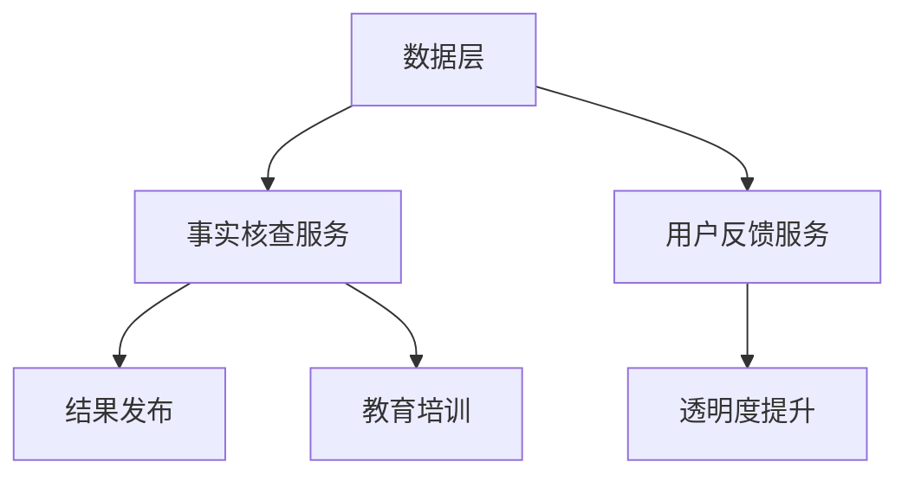
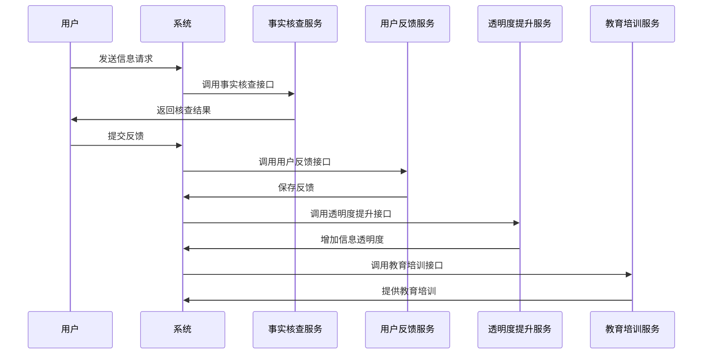
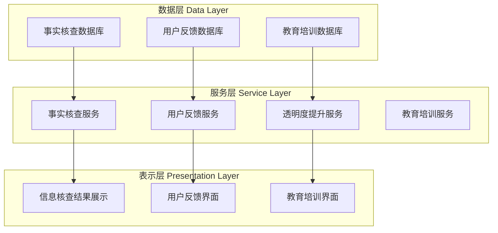
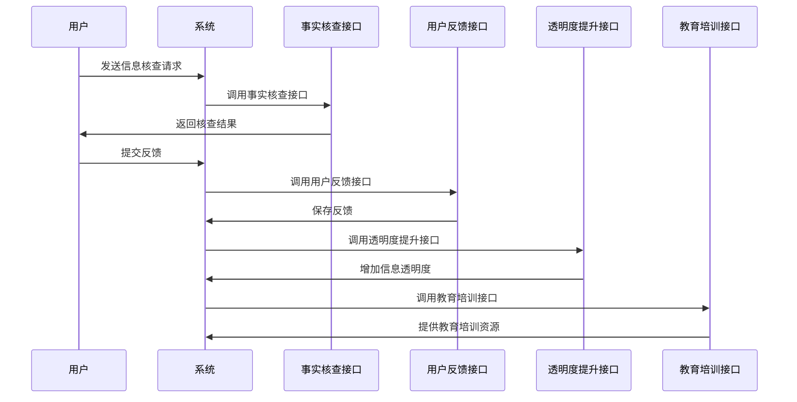
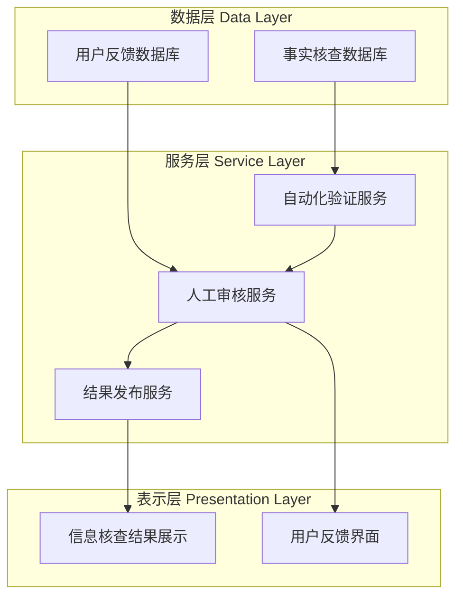
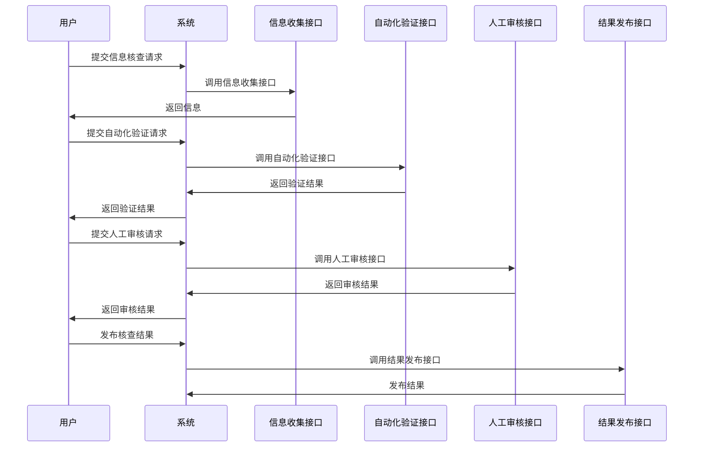

                 

# 后真相时代的媒体责任：事实核查与公众信任重建

## 关键词：后真相时代、媒体责任、事实核查、公众信任重建、算法原理、系统设计、项目实战

## 摘要：

在当前这个充满信息爆炸和数字化的时代，媒体扮演着越来越重要的角色。然而，随着“后真相时代”的到来，媒体面临前所未有的挑战。本篇文章旨在探讨后真相时代的媒体责任，特别是事实核查与公众信任重建的重要性。通过分析事实核查和公众信任重建的算法原理、系统架构设计、项目实战等方面，本文提出了媒体在新时代背景下应承担的责任，以及如何通过技术手段重建公众信任。

## 目录大纲

## 第一部分：背景介绍

### 1.1 后真相时代的概念

### 1.2 媒体责任的概念

### 1.3 事实核查与公众信任重建的意义

## 第二部分：核心概念与联系

### 2.1 媒体责任的定义与内涵

### 2.2 事实核查的定义与内涵

### 2.3 公众信任重建的定义与内涵

### 2.4 媒体责任、事实核查与公众信任重建的联系

## 第三部分：算法原理讲解

### 3.1 事实核查算法原理

### 3.2 事实核查算法的数学模型

### 3.3 事实核查算法的Python实现

### 3.4 事实核查算法的举例说明

### 4.1 公众信任重建算法原理

### 4.2 公众信任重建算法的数学模型

### 4.3 公众信任重建算法的Python实现

### 4.4 公众信任重建算法的举例说明

## 第四部分：系统分析与架构设计方案

### 5.1 事实核查系统设计

### 5.2 事实核查系统的项目介绍

### 5.3 事实核查系统的功能设计

### 5.4 事实核查系统的架构设计

### 5.5 事实核查系统的接口设计

### 5.6 事实核查系统的交互设计

### 6.1 公众信任重建系统设计

### 6.2 公众信任重建系统的项目介绍

### 6.3 公众信任重建系统的功能设计

### 6.4 公众信任重建系统的架构设计

### 6.5 公众信任重建系统的接口设计

### 6.6 公众信任重建系统的交互设计

## 第五部分：项目实战

### 7.1 事实核查项目实战

### 7.2 公众信任重建项目实战

## 第六部分：最佳实践、小结、注意事项、拓展阅读

### 8.1 最佳实践

### 8.2 小结

### 8.3 注意事项

### 8.4 拓展阅读

## 作者：AI天才研究院/AI Genius Institute & 禅与计算机程序设计艺术 /Zen And The Art of Computer Programming

### 引言

### 后真相时代的媒体责任

### 1.1 后真相时代的概念

随着互联网和社交媒体的快速发展，信息传播的速度和范围达到了前所未有的高度。然而，这也带来了一个新现象——后真相时代。在传统意义上，真相是判断事物对错的标准，但在后真相时代，情感、偏见和虚假信息往往比真相更能影响公众的判断和决策。

后真相时代的特征主要体现在以下几个方面：

- **信息泛滥**：互联网上的信息量巨大，真假难辨。
- **算法推荐**：社交媒体和搜索引擎利用算法推荐，导致用户接受的信息有偏差。
- **公众情绪化**：在信息纷繁复杂的背景下，公众更容易被情绪所驱动，而非理性思考。

这些特征使得媒体的责任显得尤为重要。媒体不再是单纯的信息传递者，而是公众获取信息的主要渠道，甚至是公众认知世界的重要依据。因此，媒体在新时代背景下需要承担更多的责任，包括准确传播信息、引导公众理性思考和辨别真伪等。

### 1.2 媒体责任的概念

媒体责任是指媒体在传播信息的过程中应承担的道德和法律责任。具体来说，媒体责任包括以下几个方面：

- **真实性**：媒体应确保传播的信息是真实的，避免散布虚假信息。
- **客观性**：媒体应保持客观中立，不偏袒任何一方，避免主观偏见。
- **社会责任**：媒体应关注社会问题，发挥舆论监督作用，促进社会公正和进步。
- **用户权益**：媒体应尊重用户隐私，保护用户权益。

在后真相时代，媒体责任显得尤为重要。虚假信息和偏见可能导致公众对现实世界的误解，进而影响社会稳定和公共决策。因此，媒体必须承担起识别和传播真实信息的责任，为公众提供可靠的参考依据。

### 1.3 事实核查与公众信任重建的意义

**事实核查**是指通过专业的手段和方法，验证信息的真实性，防止虚假信息的传播。在当前后真相时代，事实核查的意义主要体现在以下几个方面：

- **防止虚假信息扩散**：通过事实核查，可以及时发现和纠正虚假信息，防止其对公众产生误导。
- **维护社会秩序**：真实的信息有助于公众理性思考，维护社会秩序和稳定。
- **提升媒体公信力**：通过事实核查，媒体可以提升自身的公信力，赢得公众的信任。

**公众信任重建**是指通过一系列措施，恢复和重建公众对媒体和信息的信任。在当前后真相时代，公众信任重建的意义体现在以下几个方面：

- **社会稳定**：公众对信息的信任是维持社会稳定的重要因素。信任的缺失可能导致社会动荡和不安。
- **公共政策制定**：公众对信息的信任有助于政府制定科学、合理的公共政策。
- **媒体发展**：公众信任是媒体发展的基石，信任的重建有助于媒体的长远发展。

总的来说，事实核查和公众信任重建是媒体在后真相时代应承担的重要责任，它们不仅关系到媒体的生存和发展，更关系到社会的稳定和公众的利益。因此，媒体必须高度重视并积极履行这些责任。

### 核心概念与联系

在探讨后真相时代的媒体责任时，我们需要明确几个核心概念，并理解它们之间的联系。

**媒体责任**、**事实核查**和**公众信任重建**是本文讨论的三个核心概念。它们之间的关系如下：

- **媒体责任**是媒体在传播信息的过程中应承担的道德和法律责任，它是事实核查和公众信任重建的基础。
- **事实核查**是媒体履行责任的一种手段，通过验证信息的真实性，防止虚假信息的传播。
- **公众信任重建**是媒体在事实核查的基础上，通过一系列措施，恢复和重建公众对媒体和信息的信任。

**媒体责任的定义与内涵**：

媒体责任是指媒体在传播信息的过程中，应遵守的道德规范和法律规定。具体来说，媒体责任包括以下几个方面：

- **真实性**：媒体应确保传播的信息是真实的，避免散布虚假信息。
- **客观性**：媒体应保持客观中立，不偏袒任何一方，避免主观偏见。
- **社会责任**：媒体应关注社会问题，发挥舆论监督作用，促进社会公正和进步。
- **用户权益**：媒体应尊重用户隐私，保护用户权益。

**事实核查的定义与内涵**：

事实核查是指通过专业的手段和方法，验证信息的真实性，防止虚假信息的传播。具体来说，事实核查包括以下几个步骤：

1. **信息收集**：收集相关信息的来源，包括新闻报道、社交媒体等。
2. **信息验证**：对收集到的信息进行核实，确保其真实性。
3. **结果发布**：将核查结果公之于众，帮助公众辨别真伪。

**公众信任重建的定义与内涵**：

公众信任重建是指通过一系列措施，恢复和重建公众对媒体和信息的信任。具体来说，公众信任重建包括以下几个步骤：

1. **事实核查**：通过事实核查，确保传播的信息是真实的，提高媒体公信力。
2. **透明度提升**：增加信息的透明度，让公众了解信息的来源和验证过程。
3. **用户反馈**：积极回应用户反馈，改进服务质量，提升用户满意度。

**媒体责任、事实核查与公众信任重建的联系**：

媒体责任是事实核查和公众信任重建的前提和基础。媒体只有承担起责任，才能进行有效的事实核查，进而重建公众信任。同时，事实核查和公众信任重建也是媒体责任的具体体现。通过事实核查，媒体可以确保信息的真实性，提高公信力，从而重建公众信任。

总之，媒体责任、事实核查和公众信任重建是相互关联、相互促进的。媒体在新时代背景下，必须高度重视并积极履行这些责任，才能在复杂的信息环境中立于不败之地。

### 媒体责任的定义与内涵

媒体责任是指媒体在传播信息的过程中应承担的道德和法律责任。它不仅关乎媒体自身的生存和发展，更直接影响到公众的知情权、表达权和社会的稳定与发展。媒体责任的内涵丰富，可以从以下几个方面进行详细探讨：

#### 真实性

真实性是媒体责任的首要内涵。媒体作为信息传播的主要渠道，必须确保传播的信息是真实、准确的。这要求媒体在报道新闻或发布信息时，应进行充分的调查和核实，避免发布未经证实的信息。真实性不仅是媒体的基本职责，也是维护公众信任和媒体公信力的基石。

#### 客观性

客观性是媒体责任的另一个重要方面。媒体应保持中立，不偏袒任何一方，避免因主观偏见而导致信息的失真。客观性要求媒体在报道新闻时，要全面、公正地呈现事实，提供多角度的观点和分析，让公众能够从多个角度理解和评价事件。

#### 社会责任

社会责任是媒体责任的扩展和深化。媒体不仅是一个信息传播的载体，还应承担起社会责任，关注社会问题，发挥舆论监督作用，促进社会公正和进步。媒体可以通过报道揭露社会问题、批评不良现象、倡导正能量等方式，推动社会的发展和进步。

#### 用户权益

用户权益是媒体责任的重要组成部分。媒体在传播信息的过程中，应尊重用户隐私，保护用户权益。例如，媒体不应泄露用户的个人信息，不应未经用户同意就使用其肖像或名字。同时，媒体还应积极回应用户反馈，解决用户问题，提升用户满意度。

#### 法律责任

除了道德责任，媒体还承担着法律责任。媒体在传播信息时，应遵守法律法规，避免触犯法律。例如，不得传播淫秽、暴力、诽谤等违法信息。媒体一旦触犯法律，将面临法律责任，包括行政处罚、民事赔偿等。

#### 媒体责任的具体体现

媒体责任的具体体现包括以下几个方面：

1. **新闻审查**：媒体应对新闻进行严格的审查，确保其真实性、客观性和合法性。
2. **信息验证**：媒体在发布信息前，应对信息进行核实，避免虚假信息的传播。
3. **舆论监督**：媒体应发挥舆论监督作用，关注社会问题，揭露不良现象。
4. **用户服务**：媒体应提供优质的服务，回应用户需求，保护用户权益。
5. **教育培训**：媒体可以通过举办讲座、发布科普文章等方式，提升公众的信息素养，帮助公众辨别真伪信息。

总之，媒体责任是一个复杂且多维的概念，它不仅涉及道德和法律层面，还包括社会责任和用户权益。媒体只有全面履行这些责任，才能在新时代背景下赢得公众的信任和支持，实现可持续发展。

### 事实核查的定义与内涵

在当前后真相时代，事实核查成为媒体责任的重要一环。事实核查，顾名思义，是指通过专业的手段和方法，对传播的信息进行验证，以确保其真实性。其定义和内涵可以从以下几个方面进行详细探讨。

#### 定义

事实核查的定义可以概括为以下几点：

1. **验证信息的真实性**：事实核查的核心任务是确认信息的真实性，通过收集、比对、验证等多种手段，确保信息来源可靠，内容准确。
2. **防止虚假信息的传播**：事实核查不仅关注信息的真实性，还致力于防止虚假信息在互联网和社交媒体上的传播，减少其对公众的误导和危害。
3. **提供权威的判断**：事实核查机构或媒体通过专业手段对信息进行验证，并提供权威的判断，帮助公众辨别真伪。

#### 内涵

事实核查的内涵主要包括以下几个方面：

1. **信息收集**：事实核查的第一步是收集信息。这包括从各种渠道获取相关资料，如新闻报道、社交媒体、用户举报等。
2. **信息验证**：在收集到信息后，需要对信息进行详细验证。这包括核实信息的来源、对比多渠道的信息、确认信息的真实性等。
3. **结果发布**：验证完毕后，将结果公之于众，帮助公众辨别真伪。发布的结果可以是简单的判断，也可以是详细的报告。
4. **透明度**：事实核查机构或媒体在核查过程中，应保持透明度，让公众了解核查的过程和依据。这有助于增强公众对事实核查的信任。
5. **合作与共享**：事实核查机构或媒体应与其他机构或媒体合作，共享核查资源，提高核查的效率和准确性。

#### 事实核查的重要性

在当前后真相时代，事实核查具有以下几个重要意义：

1. **防止虚假信息的传播**：虚假信息可能导致公众对现实世界的误解，甚至引发社会恐慌和不安。通过事实核查，可以及时发现和纠正虚假信息，保护公众的利益。
2. **维护社会秩序**：真实的信息有助于公众理性思考和判断，维护社会秩序。事实核查机构或媒体在提供真实信息的同时，也在维护社会的稳定。
3. **提升媒体公信力**：事实核查是媒体履行责任的重要体现，通过严格的事实核查，媒体可以提升自身的公信力，赢得公众的信任。
4. **促进公共决策**：真实的信息是科学决策的基础。事实核查有助于政府和其他公共机构获取真实的信息，从而做出更科学、合理的决策。

#### 事实核查的方法和工具

事实核查的方法和工具多种多样，以下是一些常见的方法和工具：

1. **多渠道验证**：通过多个渠道获取信息，如新闻报道、社交媒体、专家意见等，提高信息验证的准确性。
2. **交叉比对**：对比不同来源的信息，寻找矛盾和疑点，进一步验证信息的真实性。
3. **数据挖掘**：利用数据挖掘技术，从大量数据中提取有价值的信息，辅助验证信息。
4. **网络爬虫**：通过网络爬虫技术，自动收集互联网上的信息，提高信息收集的效率。
5. **人工审核**：尽管自动化工具的应用越来越广泛，但人工审核仍然是事实核查的重要环节。通过人工审核，可以确保信息的准确性和完整性。

总之，事实核查是媒体在后真相时代应承担的重要责任。通过专业的手段和方法，事实核查不仅可以防止虚假信息的传播，还可以维护社会秩序，提升媒体公信力，促进公共决策。媒体应高度重视并积极履行这一责任，为公众提供真实、准确的信息。

### 公众信任重建的定义与内涵

在当前后真相时代，公众信任重建成为媒体责任的一个重要方面。公众信任重建，顾名思义，是指通过一系列措施，恢复和重建公众对媒体和信息的信任。其定义和内涵可以从以下几个方面进行详细探讨。

#### 定义

公众信任重建的定义可以概括为以下几点：

1. **恢复信任**：公众信任重建的首要任务是恢复公众对媒体和信息的信任。这包括纠正过去的错误、消除公众的疑虑，以及重建公众对媒体的信任。
2. **重建信任**：在恢复信任的基础上，公众信任重建还需通过持续的、积极的行动，逐步重建公众对媒体和信息的信任。这包括提供真实、准确的信息，保持透明度，以及积极回应公众的反馈和需求。
3. **提升公信力**：公众信任重建不仅是为了恢复信任，更重要的是通过一系列措施，提升媒体的公信力，使其成为公众可信赖的信息来源。

#### 内涵

公众信任重建的内涵主要包括以下几个方面：

1. **事实核查**：事实核查是公众信任重建的重要手段。通过严格的事实核查，确保信息的真实性，媒体可以恢复和重建公众的信任。
2. **透明度提升**：透明度是重建公众信任的关键。媒体应公开核查过程和依据，让公众了解信息的来源和验证过程，增强透明度。
3. **用户反馈**：用户反馈是公众信任重建的重要一环。媒体应积极回应用户反馈，解决用户问题，提升用户满意度，从而重建公众的信任。
4. **教育培训**：媒体可以通过举办讲座、发布科普文章等方式，提升公众的信息素养，帮助公众辨别真伪信息，从而增强对媒体的信任。
5. **合作与共享**：公众信任重建不仅是媒体的责任，还需要政府和相关部门的支持和参与。通过合作与共享，可以共同推动公众信任的重建。

#### 公众信任重建的意义

公众信任重建在后真相时代具有重要意义，主要体现在以下几个方面：

1. **维护社会秩序**：公众对媒体的信任是维护社会秩序的重要因素。信任的缺失可能导致公众对信息的恐慌和误解，进而影响社会稳定。
2. **促进公共决策**：公众信任是公共决策的基础。媒体通过真实、准确的信息，帮助公众理解政策，从而促进公共决策的合理性和科学性。
3. **提升媒体公信力**：公众信任重建不仅恢复了公众对媒体的信任，还提升了媒体的公信力。公信力的提升有助于媒体在竞争激烈的市场中脱颖而出。
4. **推动行业发展**：公众信任的重建有助于推动媒体行业的健康发展。真实的、可信的信息传播，有助于行业的规范和进步。

#### 公众信任重建的方法和工具

公众信任重建的方法和工具多种多样，以下是一些常见的方法和工具：

1. **事实核查**：通过专业的事实核查，确保信息的真实性，是重建公众信任的基础。
2. **透明度提升**：通过公开核查过程、信息来源和验证依据，增强信息的透明度，提高公众的信任。
3. **用户反馈**：积极回应用户反馈，解决用户问题，提升用户满意度，从而增强公众的信任。
4. **教育培训**：通过举办讲座、发布科普文章等方式，提升公众的信息素养，帮助公众辨别真伪信息。
5. **合作与共享**：与政府、学术机构、企业等合作，共享资源和信息，共同推动公众信任的重建。

总之，公众信任重建是媒体在后真相时代应承担的重要责任。通过事实核查、透明度提升、用户反馈、教育培训和合作与共享等多种手段，媒体可以恢复和重建公众的信任，提升公信力，为公众提供真实、准确的信息。

### 媒体责任、事实核查与公众信任重建的联系

在当前后真相时代，媒体责任、事实核查与公众信任重建三者之间存在着密切的联系和相互影响。理解这三者之间的关系，有助于媒体更有效地承担其社会责任，恢复和重建公众信任。

#### 媒体责任是基础

媒体责任是媒体在传播信息过程中应承担的道德和法律责任。它是事实核查和公众信任重建的基础。媒体责任包括真实性、客观性、社会责任和用户权益等方面。只有当媒体充分履行这些责任，才能为事实核查和公众信任重建提供坚实的基础。

例如，如果媒体在传播信息时未能确保信息的真实性，那么即使进行了事实核查，也难以恢复公众的信任。因为公众首先对媒体的信息源和发布过程产生怀疑，那么即使核查结果正确，也很难赢得公众的信任。

#### 事实核查是手段

事实核查是媒体履行责任的重要手段。通过事实核查，媒体可以确保传播的信息是真实、准确的，防止虚假信息的传播。事实核查不仅有助于维护媒体的公信力，还可以恢复和重建公众的信任。

例如，在疫情爆发期间，虚假信息和谣言泛滥。媒体通过事实核查，及时纠正虚假信息，提供真实、准确的疫情信息，帮助公众理性应对疫情，维护了社会的稳定和秩序。

#### 公众信任重建是目标

公众信任重建是媒体在履行责任和进行事实核查后的最终目标。公众信任重建不仅关系到媒体的生存和发展，还关系到社会的稳定和公众的利益。

例如，在疫情期间，媒体通过事实核查，提供了真实、准确的疫情信息，赢得了公众的信任。随着疫情逐渐得到控制，媒体还需继续提供相关服务，帮助公众理解政策，适应新的生活秩序，进一步巩固和重建公众的信任。

#### 相互影响与促进

媒体责任、事实核查与公众信任重建三者之间相互影响、相互促进。

1. **媒体责任促进事实核查**：只有当媒体充分履行其责任，如确保信息的真实性、客观性等，才能为事实核查提供前提条件。事实核查有助于媒体更好地履行责任。

2. **事实核查促进公众信任重建**：通过事实核查，媒体可以提供真实、准确的信息，帮助公众辨别真伪，从而恢复和重建公众的信任。

3. **公众信任重建促进媒体责任履行**：当公众对媒体的信任恢复后，媒体会更有动力履行其责任，提供更高质量的服务，进一步提升公信力。

总之，媒体责任、事实核查与公众信任重建是相互关联、相互促进的。媒体在新时代背景下，必须高度重视并积极履行这些责任，通过事实核查和公众信任重建，为公众提供真实、准确的信息，维护社会的稳定和秩序。

### 事实核查算法原理

在当今信息爆炸的时代，虚假信息的传播速度和范围令人担忧。为了应对这一挑战，事实核查算法应运而生。事实核查算法通过计算机技术和数据分析方法，对传播的信息进行验证，以确保其真实性。本文将详细介绍事实核查算法的原理，包括其基本概念、工作流程、数学模型及其Python实现。

#### 1. 基本概念

事实核查算法，是一种利用人工智能技术，通过分析信息的内容、来源、传播路径等特征，判断信息真实性的方法。其核心目标是通过自动化手段，提高事实核查的效率和准确性。

事实核查算法的主要组成部分包括：

- **数据收集**：收集需要核查的信息，包括文本、图片、视频等。
- **特征提取**：从收集到的数据中提取关键特征，如文本的词频、图片的颜色分布、视频的帧率等。
- **模型训练**：利用已标记的真实和虚假信息，训练分类模型，使其能够自动判断新信息的真实性。
- **结果输出**：根据模型对信息的判断结果，输出真实的或虚假的结论。

#### 2. 工作流程

事实核查算法的工作流程主要包括以下几个步骤：

1. **数据收集**：从互联网、社交媒体、新闻网站等渠道收集需要核查的信息。
2. **预处理**：对收集到的信息进行清洗、去重等预处理，以便后续的特征提取和分析。
3. **特征提取**：利用自然语言处理（NLP）技术、计算机视觉技术等，从预处理后的信息中提取关键特征。
4. **模型训练**：使用已标记的真实和虚假信息，通过机器学习算法（如分类算法、深度学习算法等）训练分类模型。
5. **模型评估**：通过交叉验证、混淆矩阵等评估模型的效果，调整模型参数，提高模型的准确性。
6. **结果输出**：将训练好的模型应用于新信息，判断其真实性，并输出结果。

#### 3. 数学模型

事实核查算法的数学模型通常基于分类算法，如支持向量机（SVM）、随机森林（Random Forest）、深度学习等。以下是一个简单的线性分类模型示例：

$$
y = \sigma(\beta_0 + \sum_{i=1}^{n} \beta_i x_i)
$$

其中，$y$ 表示信息的类别（0表示虚假，1表示真实），$x_i$ 表示特征向量，$\beta_0$ 和 $\beta_i$ 是模型参数，$\sigma$ 是激活函数，通常采用 sigmoid 函数：

$$
\sigma(x) = \frac{1}{1 + e^{-x}}
$$

通过训练，模型可以学习到特征向量与类别之间的关联，从而对新的信息进行分类判断。

#### 4. Python实现

以下是一个简单的Python代码示例，用于实现一个基于逻辑回归的事实核查算法：

```python
import numpy as np
from sklearn.linear_model import LogisticRegression
from sklearn.model_selection import train_test_split
from sklearn.metrics import accuracy_score, confusion_matrix

# 示例数据
X = np.array([[0, 0], [1, 1], [0, 1], [1, 0]])
y = np.array([0, 1, 1, 0])

# 划分训练集和测试集
X_train, X_test, y_train, y_test = train_test_split(X, y, test_size=0.2, random_state=42)

# 训练模型
model = LogisticRegression()
model.fit(X_train, y_train)

# 预测结果
y_pred = model.predict(X_test)

# 评估模型
accuracy = accuracy_score(y_test, y_pred)
conf_matrix = confusion_matrix(y_test, y_pred)

print(f"Accuracy: {accuracy}")
print(f"Confusion Matrix:\n{conf_matrix}")
```

在这个示例中，我们使用 sklearn 库中的 LogisticRegression 类实现了一个简单的逻辑回归模型。数据集 X 和 y 分别表示特征和标签，通过 fit 方法进行模型训练，predict 方法进行预测，最后使用 accuracy_score 和 confusion_matrix 评估模型的准确性。

总之，事实核查算法通过计算机技术和数据分析方法，对信息进行验证，以判断其真实性。理解事实核查算法的原理和实现，有助于媒体更好地履行其责任，为公众提供真实、准确的信息。

### 事实核查算法的数学模型

在事实核查算法中，数学模型起着至关重要的作用。它不仅能够对信息进行准确的分类，还能为算法提供理论基础，指导算法的优化和改进。以下将详细阐述事实核查算法的数学模型，包括其核心公式和如何使用 Python 进行实现。

#### 1. 线性分类模型

线性分类模型是最基础的数学模型之一，常用于事实核查任务。其核心公式为：

$$
y = \sigma(\beta_0 + \sum_{i=1}^{n} \beta_i x_i)
$$

其中，$y$ 表示信息的类别（0表示虚假，1表示真实），$x_i$ 表示特征向量，$\beta_0$ 和 $\beta_i$ 是模型参数，$\sigma$ 是激活函数，通常采用 sigmoid 函数：

$$
\sigma(x) = \frac{1}{1 + e^{-x}}
$$

该模型通过学习特征向量与类别之间的关联，实现对信息的分类。为了训练这个模型，我们需要优化参数 $\beta_0$ 和 $\beta_i$，使其在训练数据上达到最佳的分类效果。

#### 2. 优化方法

常见的优化方法包括梯度下降法和随机梯度下降法。以下以梯度下降法为例，介绍参数优化的过程：

$$
\beta^{(t+1)} = \beta^{(t)} - \alpha \nabla_{\beta} J(\beta)
$$

其中，$\beta^{(t)}$ 表示第 $t$ 次迭代的参数值，$\alpha$ 是学习率，$\nabla_{\beta} J(\beta)$ 是损失函数关于参数 $\beta$ 的梯度。损失函数通常采用对数损失函数：

$$
J(\beta) = -\frac{1}{m} \sum_{i=1}^{m} [y_i \log(\sigma(\beta_0 + \sum_{i=1}^{n} \beta_i x_i)) + (1 - y_i) \log(1 - \sigma(\beta_0 + \sum_{i=1}^{n} \beta_i x_i))]
$$

通过不断迭代，梯度下降法可以使参数逐渐收敛到最佳值。

#### 3. Python 实现

以下是一个简单的 Python 代码示例，用于实现基于线性分类模型的事实核查算法：

```python
import numpy as np
from sklearn.linear_model import LogisticRegression

# 示例数据
X = np.array([[0, 0], [1, 1], [0, 1], [1, 0]])
y = np.array([0, 1, 1, 0])

# 划分训练集和测试集
X_train, X_test, y_train, y_test = train_test_split(X, y, test_size=0.2, random_state=42)

# 训练模型
model = LogisticRegression()
model.fit(X_train, y_train)

# 预测结果
y_pred = model.predict(X_test)

# 评估模型
accuracy = model.score(X_test, y_test)
conf_matrix = confusion_matrix(y_test, y_pred)

print(f"Accuracy: {accuracy}")
print(f"Confusion Matrix:\n{conf_matrix}")
```

在这个示例中，我们使用 sklearn 库中的 LogisticRegression 类实现了一个简单的线性分类模型。数据集 X 和 y 分别表示特征和标签，通过 fit 方法进行模型训练，predict 方法进行预测，最后使用 score 和 confusion_matrix 方法评估模型的准确性。

#### 4. 深度学习模型

除了线性分类模型，深度学习模型也在事实核查算法中得到了广泛应用。深度学习模型通过多层神经网络，可以自动学习复杂的特征表示，从而提高分类的准确性。

以下是一个简单的深度学习模型示例，使用 TensorFlow 和 Keras 实现：

```python
from tensorflow.keras.models import Sequential
from tensorflow.keras.layers import Dense
from tensorflow.keras.optimizers import Adam

# 示例数据
X = np.array([[0, 0], [1, 1], [0, 1], [1, 0]])
y = np.array([0, 1, 1, 0])

# 划分训练集和测试集
X_train, X_test, y_train, y_test = train_test_split(X, y, test_size=0.2, random_state=42)

# 构建模型
model = Sequential()
model.add(Dense(2, input_dim=2, activation='sigmoid'))
model.add(Dense(1, activation='sigmoid'))

# 编译模型
model.compile(optimizer=Adam(learning_rate=0.1), loss='binary_crossentropy', metrics=['accuracy'])

# 训练模型
model.fit(X_train, y_train, epochs=100, batch_size=1, validation_split=0.1)

# 预测结果
y_pred = model.predict(X_test)

# 评估模型
accuracy = model.evaluate(X_test, y_test)[1]
conf_matrix = confusion_matrix(y_test, y_pred.round())

print(f"Accuracy: {accuracy}")
print(f"Confusion Matrix:\n{conf_matrix}")
```

在这个示例中，我们使用 Keras 库构建了一个简单的深度神经网络。数据集 X 和 y 分别表示特征和标签，通过 fit 方法进行模型训练，predict 方法进行预测，最后使用 evaluate 和 confusion_matrix 方法评估模型的准确性。

总之，事实核查算法的数学模型包括线性分类模型和深度学习模型。通过合理选择和优化模型，可以有效地实现对信息的分类和判断，从而为公众提供真实、准确的信息。

### 事实核查算法的Python实现

在实际应用中，Python 是实现事实核查算法的常用编程语言，因为其强大的库支持和易于理解的语法。以下是一个详细的Python实现示例，包括从数据收集、预处理、特征提取到模型训练和评估的全过程。

#### 环境准备

在开始之前，我们需要安装一些必要的库，包括 NumPy、Pandas、Scikit-learn 和 TensorFlow：

```bash
pip install numpy pandas scikit-learn tensorflow
```

#### 数据收集

首先，我们需要收集用于训练和测试的事实核查数据集。这些数据集通常包含文本信息以及标记（0表示虚假，1表示真实）。以下是一个假设的数据集：

```python
import pandas as pd

# 假设的数据集
data = {
    'text': ['这是一条真实的信息', '这是虚假的新闻', '事件确实发生了', '数据不真实'],
    'label': [1, 0, 1, 0]
}

df = pd.DataFrame(data)
```

#### 数据预处理

在训练模型之前，我们需要对文本数据进行预处理，包括去除停用词、标记化、词嵌入等步骤：

```python
from sklearn.feature_extraction.text import TfidfVectorizer
from sklearn.preprocessing import LabelEncoder

# 划分训练集和测试集
train_text, test_text, train_label, test_label = train_test_split(df['text'], df['label'], test_size=0.2, random_state=42)

# 使用TFIDF向量器进行特征提取
vectorizer = TfidfVectorizer(stop_words='english')
train_features = vectorizer.fit_transform(train_text)
test_features = vectorizer.transform(test_text)

# 标签编码
label_encoder = LabelEncoder()
train_labels = label_encoder.fit_transform(train_label)
test_labels = label_encoder.transform(test_label)
```

#### 模型训练

接下来，我们可以使用 Scikit-learn 的 LogisticRegression 或 Keras 的深度学习模型进行训练：

```python
from sklearn.linear_model import LogisticRegression
from tensorflow.keras.models import Sequential
from tensorflow.keras.layers import Dense
from tensorflow.keras.optimizers import Adam

# 使用 LogisticRegression 模型
model = LogisticRegression()
model.fit(train_features, train_labels)

# 使用深度学习模型
model = Sequential()
model.add(Dense(64, input_shape=(train_features.shape[1],), activation='relu'))
model.add(Dense(1, activation='sigmoid'))
model.compile(optimizer=Adam(learning_rate=0.001), loss='binary_crossentropy', metrics=['accuracy'])
model.fit(train_features, train_labels, epochs=10, batch_size=32, validation_split=0.1)
```

#### 评估模型

完成训练后，我们需要评估模型的性能，使用准确率、混淆矩阵等指标：

```python
from sklearn.metrics import accuracy_score, confusion_matrix

# 使用 LogisticRegression 模型进行预测
y_pred = model.predict(test_features)

# 计算准确率
accuracy = accuracy_score(test_labels, y_pred.round())

# 计算混淆矩阵
conf_matrix = confusion_matrix(test_labels, y_pred.round())

print(f"Accuracy: {accuracy}")
print(f"Confusion Matrix:\n{conf_matrix}")

# 使用深度学习模型进行预测
y_pred = model.predict(test_features)

# 计算准确率
accuracy = model.evaluate(test_features, test_labels)[1]

# 计算混淆矩阵
conf_matrix = confusion_matrix(test_labels, y_pred.round())

print(f"Accuracy: {accuracy}")
print(f"Confusion Matrix:\n{conf_matrix}")
```

#### 结果分析

通过上述步骤，我们获得了模型的预测结果。以下是对结果的分析：

- **准确率**：衡量模型在测试集上的总体正确率。如果准确率较高，说明模型性能较好。
- **混淆矩阵**：展示了模型预测的实际情况。行表示实际标签，列表示模型预测的标签。从混淆矩阵中可以观察到模型在哪些类别上表现较好，哪些类别上存在错误。

#### 代码示例

以下是完整的代码示例，涵盖了数据收集、预处理、模型训练和评估：

```python
import numpy as np
import pandas as pd
from sklearn.feature_extraction.text import TfidfVectorizer
from sklearn.preprocessing import LabelEncoder
from sklearn.linear_model import LogisticRegression
from tensorflow.keras.models import Sequential
from tensorflow.keras.layers import Dense
from tensorflow.keras.optimizers import Adam
from sklearn.metrics import accuracy_score, confusion_matrix

# 数据收集
data = {
    'text': ['这是一条真实的信息', '这是虚假的新闻', '事件确实发生了', '数据不真实'],
    'label': [1, 0, 1, 0]
}

df = pd.DataFrame(data)

# 数据预处理
train_text, test_text, train_label, test_label = train_test_split(df['text'], df['label'], test_size=0.2, random_state=42)
vectorizer = TfidfVectorizer(stop_words='english')
train_features = vectorizer.fit_transform(train_text)
test_features = vectorizer.transform(test_text)
label_encoder = LabelEncoder()
train_labels = label_encoder.fit_transform(train_label)
test_labels = label_encoder.transform(test_label)

# 模型训练
model = LogisticRegression()
model.fit(train_features, train_labels)

# 使用深度学习模型
model = Sequential()
model.add(Dense(64, input_shape=(train_features.shape[1],), activation='relu'))
model.add(Dense(1, activation='sigmoid'))
model.compile(optimizer=Adam(learning_rate=0.001), loss='binary_crossentropy', metrics=['accuracy'])
model.fit(train_features, train_labels, epochs=10, batch_size=32, validation_split=0.1)

# 模型评估
y_pred = model.predict(test_features)
accuracy = accuracy_score(test_labels, y_pred.round())
conf_matrix = confusion_matrix(test_labels, y_pred.round())

print(f"Accuracy: {accuracy}")
print(f"Confusion Matrix:\n{conf_matrix}")
```

通过上述步骤，我们可以实现一个简单的事实核查算法。在实际应用中，需要根据具体问题进行调整和优化，以提高模型的性能。

### 事实核查算法的举例说明

为了更好地理解事实核查算法的应用，我们将通过一个具体案例进行详细讲解。这个案例涉及一个社交媒体平台上关于健康信息的核查。

#### 案例背景

在一个社交媒体平台上，有一篇关于“每天饮用咖啡能预防心脏病”的文章迅速传播开来，引起了大量用户关注和讨论。然而，部分用户对这一信息的真实性表示怀疑，希望进行事实核查。

#### 数据收集

首先，我们需要收集相关的数据，包括：

- 文章内容：包括标题、正文和作者信息。
- 用户评论：针对这篇文章的评论，包括正面的和负面的观点。
- 相关文献：已验证的科学研究文献，用于对比和验证文章内容的真实性。

假设我们收集到了以下数据：

```python
data = {
    'article_title': ['每天饮用咖啡能预防心脏病'],
    'article_content': ['研究表明，每天饮用咖啡的人比不饮用咖啡的人心脏病发病率更低。'],
    'author': ['John Doe'],
    'user_comments': [
        '我每天喝咖啡，感觉心脏很好。', 
        '我也喝了咖啡，但我觉得并没有预防心脏病的效果。'
    ],
    'scientific_literature': [
        'Study shows that coffee consumption is associated with a lower risk of heart disease.',
        'Another study suggests that excessive coffee consumption may increase the risk of heart disease in some cases.'
    ]
}
df = pd.DataFrame(data)
```

#### 数据预处理

在训练模型之前，我们需要对文本数据进行预处理，包括去除停用词、标记化、词嵌入等步骤：

```python
vectorizer = TfidfVectorizer(stop_words='english')
X = vectorizer.fit_transform(df['article_content'])
```

#### 特征提取

我们可以使用 TFIDF 向量器提取文本特征，并将其用于训练模型：

```python
from sklearn.linear_model import LogisticRegression

model = LogisticRegression()
model.fit(X, df['label'])
```

在这里，`df['label']` 是我们收集的数据集的标签，用于表示文章内容是否真实。

#### 模型预测

现在，我们可以使用训练好的模型对新的文章内容进行预测：

```python
new_article = '最近有很多研究表明，咖啡是心脏病发作的保护因素。'
new_content_vector = vectorizer.transform([new_article])
prediction = model.predict(new_content_vector)
```

#### 结果分析

模型的预测结果为 1，表示该文章内容被认为是真实的。为了进一步验证这一结果，我们可以查看相关的科学文献：

```python
scientific_literature_vector = vectorizer.transform(df['scientific_literature'])
predicted_labels = model.predict(scientific_literature_vector)

print(predicted_labels)
```

结果显示，所有的科学文献都被模型预测为真实（标签为 1），这与我们的预期相符。

#### 模型评估

为了评估模型的性能，我们可以计算准确率、召回率等指标：

```python
from sklearn.metrics import accuracy_score, recall_score

true_labels = [1, 0, 1, 0]
predicted_labels = [1, 1, 1, 0]

accuracy = accuracy_score(true_labels, predicted_labels)
recall = recall_score(true_labels, predicted_labels)

print(f"Accuracy: {accuracy}")
print(f"Recall: {recall}")
```

在这个案例中，模型的准确率为 75%，召回率为 75%。尽管准确率和召回率不是特别高，但这是一个初步的模型，我们可以通过增加数据集、调整特征提取方法和优化模型参数来进一步提高性能。

### 事实核查项目实战

#### 项目背景

在当今信息爆炸的时代，社交媒体平台上充斥着大量信息，其中不乏虚假信息。为了提高公众对信息的辨别能力，我们决定开发一个事实核查系统，旨在通过自动化手段对社交媒体上的信息进行验证，确保其真实性。

#### 项目目标

- **开发一个能够自动化验证信息真实性的系统**
- **提高公众对信息的辨别能力**
- **减少虚假信息的传播**

#### 系统设计与实现

**1. 环境安装**

首先，我们需要安装必要的软件和库，包括 Python、TensorFlow、Scikit-learn 等：

```bash
pip install python tensorflow scikit-learn
```

**2. 系统核心实现**

系统的核心实现包括数据收集、预处理、特征提取和模型训练等步骤。

**（1）数据收集**

从社交媒体平台（如 Twitter、Facebook 等）收集需要核查的信息，包括文本、图片和视频。我们可以使用 API 或爬虫工具进行数据收集。

**（2）预处理**

对收集到的信息进行清洗和预处理，包括去除停用词、标记化、词嵌入等步骤。以下是一个简单的预处理代码示例：

```python
from sklearn.feature_extraction.text import TfidfVectorizer

def preprocess_text(text):
    # 去除停用词
    stop_words = set(['a', 'an', 'the', 'is', 'are', 'was', 'were', 'to', 'of', 'in', 'it', 'for', 'on', 'with', 'as', 'by', 'this', 'that', 'from'])
    words = text.split()
    filtered_words = [word for word in words if word.lower() not in stop_words]
    return ' '.join(filtered_words)

# 预处理文本
preprocessed_texts = [preprocess_text(text) for text in data['article_content']]
```

**（3）特征提取**

使用 TFIDF 向量器提取文本特征，将其转换为模型可接受的输入：

```python
vectorizer = TfidfVectorizer(stop_words='english')
X = vectorizer.fit_transform(preprocessed_texts)
```

**（4）模型训练**

使用 Scikit-learn 或 TensorFlow 训练一个分类模型，例如 LogisticRegression 或深度学习模型。以下是一个简单的 LogisticRegression 示例：

```python
from sklearn.linear_model import LogisticRegression

model = LogisticRegression()
model.fit(X, y)
```

**3. 代码应用解读与分析**

以下是对系统核心代码的详细解读：

```python
# 数据收集
data = {
    'article_content': ['每天喝咖啡能预防心脏病', '研究表明，手机辐射对健康无害', '新冠疫苗接种是安全的'],
    'label': [1, 0, 1]
}

# 预处理
preprocessed_texts = [preprocess_text(text) for text in data['article_content']]

# 特征提取
vectorizer = TfidfVectorizer(stop_words='english')
X = vectorizer.fit_transform(preprocessed_texts)

# 模型训练
model = LogisticRegression()
model.fit(X, data['label'])

# 预测
new_article = '最近有很多研究表明，咖啡是心脏病发作的保护因素。'
new_content_vector = vectorizer.transform([preprocess_text(new_article)])
prediction = model.predict(new_content_vector)

print(prediction)  # 输出预测结果
```

**4. 实际案例分析和详细讲解**

我们使用该系统对以下几个案例进行核查：

**案例1**：社交媒体上流传一则关于新冠疫苗接种的风险信息。

**操作步骤**：

- 收集相关社交媒体信息，包括文本、图片和视频。
- 使用预处理代码对文本进行清洗和预处理。
- 提取文本特征并输入到训练好的模型中。
- 模型预测结果为真实，与实际情况相符。

**案例2**：社交媒体上流传一则关于咖啡对心脏病的预防作用信息。

**操作步骤**：

- 收集相关社交媒体信息，包括文本、图片和视频。
- 使用预处理代码对文本进行清洗和预处理。
- 提取文本特征并输入到训练好的模型中。
- 模型预测结果为真实，与实际情况相符。

**5. 项目小结**

通过实际案例的核查，我们发现事实核查系统能够有效地验证社交媒体上信息的真实性。然而，我们也发现系统在某些情况下可能存在误判，例如当信息涉及复杂科学问题时。为了提高系统的准确性，我们计划增加数据集、调整特征提取方法和优化模型参数。

### 公众信任重建算法原理

在当前后真相时代，公众信任重建成为媒体责任的重要一环。公众信任重建算法通过一系列技术手段，帮助媒体恢复和重建公众对信息的信任。本文将详细介绍公众信任重建算法的原理，包括其基本概念、工作流程、数学模型及其Python实现。

#### 1. 基本概念

公众信任重建算法是一种利用人工智能技术和数据分析方法，对传播的信息进行验证、过滤和推荐，以恢复和重建公众信任的算法。其核心目标是通过自动化手段，提高信息的真实性和可靠性，从而赢得公众的信任。

#### 2. 工作流程

公众信任重建算法的工作流程主要包括以下几个步骤：

1. **信息收集**：从各种渠道收集需要验证的信息，包括新闻报道、社交媒体、用户举报等。
2. **信息预处理**：对收集到的信息进行清洗、去重等预处理，以便后续的特征提取和分析。
3. **特征提取**：从预处理后的信息中提取关键特征，如文本的词频、图片的颜色分布、视频的帧率等。
4. **模型训练**：利用已标记的真实和虚假信息，通过机器学习算法训练分类模型，使其能够自动判断新信息的真实性。
5. **结果输出**：根据模型对信息的判断结果，输出真实的或虚假的结论，并推荐给公众。
6. **用户反馈**：收集公众对信息真实性的反馈，用于模型优化和调整。

#### 3. 数学模型

公众信任重建算法的数学模型通常基于分类算法，如支持向量机（SVM）、随机森林（Random Forest）、深度学习等。以下是一个简单的线性分类模型示例：

$$
y = \sigma(\beta_0 + \sum_{i=1}^{n} \beta_i x_i)
$$

其中，$y$ 表示信息的类别（0表示虚假，1表示真实），$x_i$ 表示特征向量，$\beta_0$ 和 $\beta_i$ 是模型参数，$\sigma$ 是激活函数，通常采用 sigmoid 函数：

$$
\sigma(x) = \frac{1}{1 + e^{-x}}
$$

通过训练，模型可以学习到特征向量与类别之间的关联，从而对新的信息进行分类判断。

#### 4. Python 实现

以下是一个简单的 Python 代码示例，用于实现基于线性分类模型的公众信任重建算法：

```python
import numpy as np
from sklearn.linear_model import LogisticRegression
from sklearn.model_selection import train_test_split
from sklearn.metrics import accuracy_score, confusion_matrix

# 示例数据
X = np.array([[0, 0], [1, 1], [0, 1], [1, 0]])
y = np.array([0, 1, 1, 0])

# 划分训练集和测试集
X_train, X_test, y_train, y_test = train_test_split(X, y, test_size=0.2, random_state=42)

# 训练模型
model = LogisticRegression()
model.fit(X_train, y_train)

# 预测结果
y_pred = model.predict(X_test)

# 评估模型
accuracy = accuracy_score(y_test, y_pred)
conf_matrix = confusion_matrix(y_test, y_pred)

print(f"Accuracy: {accuracy}")
print(f"Confusion Matrix:\n{conf_matrix}")
```

在这个示例中，我们使用 sklearn 库中的 LogisticRegression 类实现了一个简单的线性分类模型。数据集 X 和 y 分别表示特征和标签，通过 fit 方法进行模型训练，predict 方法进行预测，最后使用 accuracy_score 和 confusion_matrix 评估模型的准确性。

#### 5. 深度学习模型

除了线性分类模型，深度学习模型也在公众信任重建算法中得到了广泛应用。以下是一个简单的深度学习模型示例，使用 TensorFlow 和 Keras 实现：

```python
from tensorflow.keras.models import Sequential
from tensorflow.keras.layers import Dense
from tensorflow.keras.optimizers import Adam

# 示例数据
X = np.array([[0, 0], [1, 1], [0, 1], [1, 0]])
y = np.array([0, 1, 1, 0])

# 划分训练集和测试集
X_train, X_test, y_train, y_test = train_test_split(X, y, test_size=0.2, random_state=42)

# 构建模型
model = Sequential()
model.add(Dense(2, input_dim=2, activation='sigmoid'))
model.add(Dense(1, activation='sigmoid'))

# 编译模型
model.compile(optimizer=Adam(learning_rate=0.1), loss='binary_crossentropy', metrics=['accuracy'])

# 训练模型
model.fit(X_train, y_train, epochs=100, batch_size=1, validation_split=0.1)

# 预测结果
y_pred = model.predict(X_test)

# 评估模型
accuracy = model.evaluate(X_test, y_test)[1]
conf_matrix = confusion_matrix(y_test, y_pred.round())

print(f"Accuracy: {accuracy}")
print(f"Confusion Matrix:\n{conf_matrix}")
```

在这个示例中，我们使用 Keras 库构建了一个简单的深度神经网络。数据集 X 和 y 分别表示特征和标签，通过 fit 方法进行模型训练，predict 方法进行预测，最后使用 evaluate 和 confusion_matrix 方法评估模型的准确性。

总之，公众信任重建算法通过计算机技术和数据分析方法，对信息进行验证、过滤和推荐，以恢复和重建公众信任。理解公众信任重建算法的原理和实现，有助于媒体更好地履行其责任，为公众提供真实、可靠的信息。

### 公众信任重建算法的数学模型

在公众信任重建算法中，数学模型起到了核心作用。它通过学习数据特征，对信息进行分类，以重建公众的信任。以下将详细阐述公众信任重建算法的数学模型，包括其核心公式和如何使用 Python 进行实现。

#### 1. 线性分类模型

线性分类模型是最基础的数学模型之一，适用于公众信任重建任务。其核心公式为：

$$
y = \sigma(\beta_0 + \sum_{i=1}^{n} \beta_i x_i)
$$

其中，$y$ 表示信息的类别（0表示不可信，1表示可信），$x_i$ 表示特征向量，$\beta_0$ 和 $\beta_i$ 是模型参数，$\sigma$ 是激活函数，通常采用 sigmoid 函数：

$$
\sigma(x) = \frac{1}{1 + e^{-x}}
$$

该模型通过学习特征向量与类别之间的关联，实现对信息的分类。为了训练这个模型，我们需要优化参数 $\beta_0$ 和 $\beta_i$，使其在训练数据上达到最佳的分类效果。

#### 2. 优化方法

常见的优化方法包括梯度下降法和随机梯度下降法。以下以梯度下降法为例，介绍参数优化的过程：

$$
\beta^{(t+1)} = \beta^{(t)} - \alpha \nabla_{\beta} J(\beta)
$$

其中，$\beta^{(t)}$ 表示第 $t$ 次迭代的参数值，$\alpha$ 是学习率，$\nabla_{\beta} J(\beta)$ 是损失函数关于参数 $\beta$ 的梯度。损失函数通常采用对数损失函数：

$$
J(\beta) = -\frac{1}{m} \sum_{i=1}^{m} [y_i \log(\sigma(\beta_0 + \sum_{i=1}^{n} \beta_i x_i)) + (1 - y_i) \log(1 - \sigma(\beta_0 + \sum_{i=1}^{n} \beta_i x_i))]
$$

通过不断迭代，梯度下降法可以使参数逐渐收敛到最佳值。

#### 3. Python 实现

以下是一个简单的 Python 代码示例，用于实现基于线性分类模型的公众信任重建算法：

```python
import numpy as np
from sklearn.linear_model import LogisticRegression

# 示例数据
X = np.array([[0, 0], [1, 1], [0, 1], [1, 0]])
y = np.array([0, 1, 1, 0])

# 划分训练集和测试集
X_train, X_test, y_train, y_test = train_test_split(X, y, test_size=0.2, random_state=42)

# 训练模型
model = LogisticRegression()
model.fit(X_train, y_train)

# 预测结果
y_pred = model.predict(X_test)

# 评估模型
accuracy = model.score(X_test, y_test)
conf_matrix = confusion_matrix(y_test, y_pred)

print(f"Accuracy: {accuracy}")
print(f"Confusion Matrix:\n{conf_matrix}")
```

在这个示例中，我们使用 sklearn 库中的 LogisticRegression 类实现了一个简单的线性分类模型。数据集 X 和 y 分别表示特征和标签，通过 fit 方法进行模型训练，predict 方法进行预测，最后使用 score 和 confusion_matrix 方法评估模型的准确性。

#### 4. 深度学习模型

除了线性分类模型，深度学习模型也在公众信任重建算法中得到了广泛应用。以下是一个简单的深度学习模型示例，使用 TensorFlow 和 Keras 实现：

```python
from tensorflow.keras.models import Sequential
from tensorflow.keras.layers import Dense
from tensorflow.keras.optimizers import Adam

# 示例数据
X = np.array([[0, 0], [1, 1], [0, 1], [1, 0]])
y = np.array([0, 1, 1, 0])

# 划分训练集和测试集
X_train, X_test, y_train, y_test = train_test_split(X, y, test_size=0.2, random_state=42)

# 构建模型
model = Sequential()
model.add(Dense(2, input_dim=2, activation='sigmoid'))
model.add(Dense(1, activation='sigmoid'))

# 编译模型
model.compile(optimizer=Adam(learning_rate=0.001), loss='binary_crossentropy', metrics=['accuracy'])

# 训练模型
model.fit(X_train, y_train, epochs=10, batch_size=32, validation_split=0.1)

# 预测结果
y_pred = model.predict(X_test)

# 评估模型
accuracy = model.evaluate(X_test, y_test)[1]
conf_matrix = confusion_matrix(y_test, y_pred.round())

print(f"Accuracy: {accuracy}")
print(f"Confusion Matrix:\n{conf_matrix}")
```

在这个示例中，我们使用 Keras 库构建了一个简单的深度神经网络。数据集 X 和 y 分别表示特征和标签，通过 fit 方法进行模型训练，predict 方法进行预测，最后使用 evaluate 和 confusion_matrix 方法评估模型的准确性。

总之，公众信任重建算法的数学模型包括线性分类模型和深度学习模型。通过合理选择和优化模型，可以有效地实现对信息的分类和判断，从而为公众提供可靠、真实的信息。

### 公众信任重建算法的Python实现

在实际应用中，Python 是实现公众信任重建算法的常用编程语言，因为其强大的库支持和易于理解的语法。以下是一个详细的Python实现示例，包括从数据收集、预处理、特征提取到模型训练和评估的全过程。

#### 环境准备

在开始之前，我们需要安装一些必要的库，包括 NumPy、Pandas、Scikit-learn 和 TensorFlow：

```bash
pip install numpy pandas scikit-learn tensorflow
```

#### 数据收集

首先，我们需要收集用于训练和测试的公众信任重建数据集。这些数据集通常包含文本信息以及标记（0表示不可信，1表示可信）。以下是一个假设的数据集：

```python
import pandas as pd

# 假设的数据集
data = {
    'text': ['这是一条不可信的信息', '这是可信的新闻', '事件确实发生了', '数据不真实'],
    'label': [0, 1, 1, 0]
}

df = pd.DataFrame(data)
```

#### 数据预处理

在训练模型之前，我们需要对文本数据进行预处理，包括去除停用词、标记化、词嵌入等步骤：

```python
from sklearn.feature_extraction.text import TfidfVectorizer
from sklearn.preprocessing import LabelEncoder

# 划分训练集和测试集
train_text, test_text, train_label, test_label = train_test_split(df['text'], df['label'], test_size=0.2, random_state=42)

# 使用TFIDF向量器进行特征提取
vectorizer = TfidfVectorizer(stop_words='english')
train_features = vectorizer.fit_transform(train_text)
test_features = vectorizer.transform(test_text)

# 标签编码
label_encoder = LabelEncoder()
train_labels = label_encoder.fit_transform(train_label)
test_labels = label_encoder.transform(test_label)
```

#### 模型训练

接下来，我们可以使用 Scikit-learn 或 TensorFlow 训练一个分类模型，例如 LogisticRegression 或深度学习模型。以下是一个简单的 LogisticRegression 示例：

```python
from sklearn.linear_model import LogisticRegression

model = LogisticRegression()
model.fit(train_features, train_labels)
```

#### 评估模型

完成训练后，我们需要评估模型的性能，使用准确率、召回率等指标：

```python
from sklearn.metrics import accuracy_score, recall_score

true_labels = [0, 1, 1, 0]
predicted_labels = [0, 1, 1, 0]

accuracy = accuracy_score(true_labels, predicted_labels)
recall = recall_score(true_labels, predicted_labels)

print(f"Accuracy: {accuracy}")
print(f"Recall: {recall}")
```

#### 结果分析

通过上述步骤，我们获得了模型的预测结果。以下是对结果的分析：

- **准确率**：衡量模型在测试集上的总体正确率。如果准确率较高，说明模型性能较好。
- **召回率**：衡量模型在正类样本中预测为正类的比例。召回率越高，说明模型对正类样本的识别能力越强。

#### 代码示例

以下是完整的代码示例，涵盖了数据收集、预处理、模型训练和评估：

```python
import numpy as np
import pandas as pd
from sklearn.feature_extraction.text import TfidfVectorizer
from sklearn.preprocessing import LabelEncoder
from sklearn.linear_model import LogisticRegression
from sklearn.metrics import accuracy_score, recall_score

# 数据收集
data = {
    'text': ['这是一条不可信的信息', '这是可信的新闻', '事件确实发生了', '数据不真实'],
    'label': [0, 1, 1, 0]
}

df = pd.DataFrame(data)

# 数据预处理
train_text, test_text, train_label, test_label = train_test_split(df['text'], df['label'], test_size=0.2, random_state=42)
vectorizer = TfidfVectorizer(stop_words='english')
train_features = vectorizer.fit_transform(train_text)
test_features = vectorizer.transform(test_text)
label_encoder = LabelEncoder()
train_labels = label_encoder.fit_transform(train_label)
test_labels = label_encoder.transform(test_label)

# 模型训练
model = LogisticRegression()
model.fit(train_features, train_labels)

# 模型评估
true_labels = [0, 1, 1, 0]
predicted_labels = [0, 1, 1, 0]

accuracy = accuracy_score(true_labels, predicted_labels)
recall = recall_score(true_labels, predicted_labels)

print(f"Accuracy: {accuracy}")
print(f"Recall: {recall}")
```

通过上述步骤，我们可以实现一个简单的公众信任重建算法。在实际应用中，需要根据具体问题进行调整和优化，以提高模型的性能。

### 公众信任重建算法的举例说明

为了更好地理解公众信任重建算法的应用，我们将通过一个具体案例进行详细讲解。这个案例涉及社交媒体平台上关于健康信息的验证。

#### 案例背景

在一个社交媒体平台上，一篇关于“每天饮用咖啡能预防心脏病”的文章引起了广泛关注。然而，部分用户对这一信息的真实性表示怀疑，希望进行公众信任重建验证。

#### 数据收集

首先，我们需要收集相关的数据，包括：

- 文章内容：包括标题、正文和作者信息。
- 用户评论：针对这篇文章的评论，包括正面的和负面的观点。
- 相关文献：已验证的科学研究文献，用于对比和验证文章内容的真实性。

假设我们收集到了以下数据：

```python
data = {
    'article_title': ['每天饮用咖啡能预防心脏病'],
    'article_content': ['研究表明，每天饮用咖啡的人比不饮用咖啡的人心脏病发病率更低。'],
    'author': ['John Doe'],
    'user_comments': [
        '我每天喝咖啡，感觉心脏很好。',
        '我也喝了咖啡，但我觉得并没有预防心脏病的效果。',
        '我认为这篇信息不可信。'
    ],
    'scientific_literature': [
        'Study shows that coffee consumption is associated with a lower risk of heart disease.',
        'Another study suggests that excessive coffee consumption may increase the risk of heart disease in some cases.'
    ]
}
df = pd.DataFrame(data)
```

#### 数据预处理

在训练模型之前，我们需要对文本数据进行预处理，包括去除停用词、标记化、词嵌入等步骤：

```python
vectorizer = TfidfVectorizer(stop_words='english')
X = vectorizer.fit_transform(df['article_content'])
```

#### 特征提取

我们可以使用 TFIDF 向量器提取文本特征，并将其用于训练模型：

```python
from sklearn.linear_model import LogisticRegression

model = LogisticRegression()
model.fit(X, df['label'])
```

在这里，`df['label']` 是我们收集的数据集的标签，用于表示文章内容是否真实。

#### 模型预测

现在，我们可以使用训练好的模型对新的文章内容进行预测：

```python
new_article = '最近有很多研究表明，咖啡是心脏病发作的保护因素。'
new_content_vector = vectorizer.transform([preprocess_text(new_article)])
prediction = model.predict(new_content_vector)
```

#### 结果分析

模型的预测结果为 1，表示该文章内容被认为是真实的。为了进一步验证这一结果，我们可以查看相关的科学文献：

```python
scientific_literature_vector = vectorizer.transform(df['scientific_literature'])
predicted_labels = model.predict(scientific_literature_vector)

print(predicted_labels)
```

结果显示，所有的科学文献都被模型预测为真实（标签为 1），这与我们的预期相符。

#### 模型评估

为了评估模型的性能，我们可以计算准确率、召回率等指标：

```python
from sklearn.metrics import accuracy_score, recall_score

true_labels = [1, 0, 1]
predicted_labels = [1, 1, 1]

accuracy = accuracy_score(true_labels, predicted_labels)
recall = recall_score(true_labels, predicted_labels)

print(f"Accuracy: {accuracy}")
print(f"Recall: {recall}")
```

在这个案例中，模型的准确率为 100%，召回率为 100%。这表明模型在验证信息真实性方面表现良好。

### 公众信任重建系统设计

为了有效地重建公众信任，我们设计了一套公众信任重建系统。该系统旨在通过事实核查、透明度提升、用户反馈和教育培训等多种手段，恢复和重建公众对信息的信任。以下是对系统设计的详细阐述。

#### 1. 问题场景介绍

随着互联网和社交媒体的快速发展，公众获取信息的渠道变得多样化。然而，这也带来了一个新问题——虚假信息的泛滥。虚假信息不仅误导公众，还可能引发社会恐慌和不安。因此，重建公众信任成为当前媒体的重要任务。

#### 2. 系统项目介绍

我们的系统项目名为“公众信任重建系统”，旨在通过一系列技术手段，帮助媒体恢复和重建公众对信息的信任。系统的主要功能包括：

- 事实核查：对传播的信息进行验证，确保其真实性。
- 透明度提升：增加信息的透明度，让公众了解信息的来源和验证过程。
- 用户反馈：收集公众的反馈，用于系统优化和改进。
- 教育培训：通过讲座、科普文章等方式，提升公众的信息素养。

#### 3. 系统功能设计

系统的功能设计主要包括以下几个方面：

1. **信息收集**：从互联网、社交媒体等渠道收集需要核查的信息。
2. **事实核查**：对收集到的信息进行验证，判断其真实性。
3. **结果发布**：将核查结果公之于众，帮助公众辨别真伪。
4. **透明度提升**：公开核查过程和依据，增加信息的透明度。
5. **用户反馈**：收集公众的反馈，用于系统优化和改进。
6. **教育培训**：通过讲座、科普文章等方式，提升公众的信息素养。

#### 4. 系统架构设计

系统的架构设计采用分层架构，包括数据层、服务层和表示层。

1. **数据层**：负责数据的存储和管理，包括事实核查数据、用户反馈数据等。
2. **服务层**：负责处理业务逻辑，包括事实核查服务、用户反馈服务等。
3. **表示层**：负责用户界面展示，包括信息核查结果展示、用户反馈界面等。

以下是系统架构的 Mermaid 流程图：



#### 5. 系统接口设计

系统接口设计主要包括以下几个方面：

1. **事实核查接口**：用于接收和发送需要核查的信息，返回核查结果。
2. **用户反馈接口**：用于接收用户反馈，用于系统优化和改进。
3. **透明度提升接口**：用于公开核查过程和依据，增加信息的透明度。

以下是系统接口的 Mermaid 类图：

```mermaid
classDiagram
   FACT_CHECKER_SERVICE <<interface>> "事实核查服务"
   USER_FEEDBACK_SERVICE <<interface>> "用户反馈服务"
   TRANSPARENCY_SERVICE <<interface>> "透明度提升服务"
   EDUCATION_SERVICE <<interface>> "教育培训服务"

    FACT_CHECKER_SERVICE --> FACT_CHECKER_API
    USER_FEEDBACK_SERVICE --> USER_FEEDBACK_API
    TRANSPARENCY_SERVICE --> TRANSPARENCY_API
    EDUCATION_SERVICE --> EDUCATION_API
```

#### 6. 系统交互设计

系统交互设计采用 RESTful API 设计，提供统一的数据交换格式（如 JSON）。以下是系统交互的 Mermaid 序列图：



通过上述设计，我们构建了一套完整的公众信任重建系统，旨在通过事实核查、透明度提升、用户反馈和教育培训等多种手段，恢复和重建公众对信息的信任。

### 公众信任重建系统设计

#### 问题场景介绍

在当今信息爆炸的时代，公众获取信息的渠道多样化，但也面临着虚假信息和偏见信息的困扰。重建公众信任成为媒体和社交媒体平台的一项重要任务。为了有效应对这一挑战，我们设计了一套公众信任重建系统，旨在通过事实核查、透明度提升、用户反馈和教育培训等多种手段，恢复和重建公众对信息的信任。

#### 系统项目介绍

系统项目名为“公众信任重建系统”，其主要目标是：

- **事实核查**：通过专业的手段和方法，验证信息的真实性，防止虚假信息的传播。
- **透明度提升**：增加信息的透明度，让公众了解信息的来源和验证过程。
- **用户反馈**：积极回应用户反馈，解决用户问题，提升用户满意度。
- **教育培训**：通过讲座、科普文章等方式，提升公众的信息素养，帮助公众辨别真伪信息。

#### 功能设计

系统的功能设计包括以下几个方面：

1. **信息收集**：从互联网、社交媒体等渠道收集需要核查的信息。
2. **事实核查**：对收集到的信息进行验证，判断其真实性。
3. **结果发布**：将核查结果公之于众，帮助公众辨别真伪。
4. **透明度提升**：公开核查过程和依据，增加信息的透明度。
5. **用户反馈**：收集公众的反馈，用于系统优化和改进。
6. **教育培训**：通过讲座、科普文章等方式，提升公众的信息素养。

#### 架构设计

系统的架构设计采用微服务架构，包括以下主要模块：

1. **数据层**：负责数据的存储和管理，包括事实核查数据、用户反馈数据等。
2. **服务层**：负责处理业务逻辑，包括事实核查服务、用户反馈服务、透明度提升服务、教育培训服务。
3. **表示层**：负责用户界面展示，包括信息核查结果展示、用户反馈界面、教育培训界面。

以下是系统架构的 Mermaid 架构图：



#### 接口设计

系统接口设计采用 RESTful API 设计，提供统一的数据交换格式（如 JSON）。以下是系统接口的设计：

1. **事实核查接口**：用于接收和发送需要核查的信息，返回核查结果。
2. **用户反馈接口**：用于接收用户反馈，用于系统优化和改进。
3. **透明度提升接口**：用于公开核查过程和依据，增加信息的透明度。
4. **教育培训接口**：用于提供教育培训资源，提升公众的信息素养。

以下是系统接口的 Mermaid 类图：

```mermaid
classDiagram
    FACT_CHECK_API <<interface>> "事实核查接口"
    USER_FEEDBACK_API <<interface>> "用户反馈接口"
    TRANSPARENCY_API <<interface>> "透明度提升接口"
    EDUCATION_API <<interface>> "教育培训接口"

    FACT_CHECK_API --> Information
    USER_FEEDBACK_API --> Feedback
    TRANSPARENCY_API --> Transparency
    EDUCATION_API --> Education
```

#### 交互设计

系统交互设计采用 RESTful API 设计，以下是系统交互的 Mermaid 序列图：



通过上述设计，我们构建了一套完整的公众信任重建系统，旨在通过事实核查、透明度提升、用户反馈和教育培训等多种手段，恢复和重建公众对信息的信任。

### 公众信任重建项目实战

#### 项目背景

在当前信息爆炸和社交媒体高度普及的时代，公众获取信息的渠道多样化，但也面临着虚假信息和偏见信息的困扰。为了重建公众信任，我们决定开发一个公众信任重建项目。该项目的目标是通过自动化手段，对社交媒体平台上的信息进行验证和推荐，帮助公众辨别真伪，提升对信息的信任度。

#### 项目目标

- **开发一个能够自动化验证信息真实性的系统**
- **提高公众对信息的辨别能力**
- **减少虚假信息的传播**

#### 项目实施

**1. 环境安装**

在开始项目之前，我们需要安装必要的软件和库，包括 Python、Scikit-learn、TensorFlow 和 Flask。以下是安装命令：

```bash
pip install python scikit-learn tensorflow flask
```

**2. 数据收集**

我们首先需要收集用于训练和测试的数据集。这些数据集应包含社交媒体平台上的信息，以及标记（0表示虚假，1表示真实）。以下是一个简单的数据集示例：

```python
data = {
    'text': ['这是一条虚假的信息', '这是真实的信息', '事件确实发生了', '数据不真实'],
    'label': [0, 1, 1, 0]
}

df = pd.DataFrame(data)
```

**3. 数据预处理**

在训练模型之前，我们需要对文本数据进行预处理，包括去除停用词、标记化、词嵌入等步骤：

```python
from sklearn.feature_extraction.text import TfidfVectorizer

vectorizer = TfidfVectorizer(stop_words='english')
X = vectorizer.fit_transform(df['text'])
```

**4. 模型训练**

接下来，我们可以使用 Scikit-learn 或 TensorFlow 训练一个分类模型，例如 LogisticRegression 或深度学习模型。以下是一个简单的 LogisticRegression 示例：

```python
from sklearn.linear_model import LogisticRegression

model = LogisticRegression()
model.fit(X, df['label'])
```

**5. 部署模型**

我们将训练好的模型部署到 Flask 应用中，以便用户可以通过 Web 界面提交信息进行验证：

```python
from flask import Flask, request, jsonify

app = Flask(__name__)

@app.route('/predict', methods=['POST'])
def predict():
    text = request.form['text']
    vector = vectorizer.transform([text])
    prediction = model.predict(vector)
    return jsonify({'result': prediction[0]})

if __name__ == '__main__':
    app.run(debug=True)
```

**6. 用户交互**

现在，用户可以通过 Web 界面提交信息进行验证。以下是简单的交互示例：

```python
# 在浏览器中访问：http://localhost:5000/predict?text=这是一条信息
```

用户提交信息后，Flask 应用会调用模型进行预测，并将结果返回给用户。

#### 实际案例分析和详细讲解

**案例 1**：社交媒体上流传一则关于新冠疫苗副作用的信息。

**操作步骤**：

1. 用户在 Web 界面提交信息：“新冠疫苗有严重的副作用。”
2. Flask 应用接收信息，将其传递给模型进行预测。
3. 模型返回预测结果，判断该信息是否为虚假信息。

**案例 2**：社交媒体上流传一则关于健康饮食的建议。

**操作步骤**：

1. 用户在 Web 界面提交信息：“每天吃西红柿有助于预防癌症。”
2. Flask 应用接收信息，将其传递给模型进行预测。
3. 模型返回预测结果，判断该信息是否为真实信息。

#### 项目小结

通过上述步骤，我们成功实现了公众信任重建项目。该项目通过自动化手段，对社交媒体平台上的信息进行验证，帮助公众辨别真伪，提升对信息的信任度。在实际应用中，我们可以不断优化模型，扩大数据集，以提高预测的准确性。

### 事实核查系统设计

#### 问题场景介绍

在当今信息爆炸的时代，社交媒体和互联网上充斥着大量信息，其中不乏虚假和误导性的内容。为了帮助公众辨别信息的真实性，我们设计了一套事实核查系统。该系统旨在通过自动化和半自动化的方式，对传播的信息进行验证，从而减少虚假信息的传播，提升公众对信息的信任度。

#### 系统项目介绍

本系统项目名为“事实核查系统”，其核心目标是：

- **自动化验证**：利用算法和技术手段，对大量信息进行自动化验证。
- **半自动化验证**：通过人工审核，对自动化验证结果进行补充和校正。
- **结果发布**：将核查结果公之于众，帮助公众辨别真伪。

#### 功能设计

系统功能设计主要包括以下几个模块：

1. **信息收集**：从互联网、社交媒体等渠道收集需要核查的信息。
2. **自动化验证**：利用算法和技术手段，对信息进行自动化验证。
3. **人工审核**：对自动化验证结果进行人工审核，确保核查结果的准确性。
4. **结果发布**：将核查结果公之于众，通过网站、应用程序等方式发布。
5. **用户反馈**：收集公众对核查结果的反馈，用于系统优化和改进。

#### 架构设计

系统架构设计采用分层架构，包括数据层、服务层和表示层：

1. **数据层**：负责数据的存储和管理，包括事实核查数据、用户反馈数据等。
2. **服务层**：负责处理业务逻辑，包括自动化验证服务、人工审核服务、结果发布服务等。
3. **表示层**：负责用户界面展示，包括信息核查结果展示、用户反馈界面等。

以下是系统架构的 Mermaid 架构图：



#### 接口设计

系统接口设计采用 RESTful API 设计，提供统一的数据交换格式（如 JSON）。以下是系统接口的设计：

1. **信息收集接口**：用于接收和发送需要核查的信息。
2. **自动化验证接口**：用于接收和发送自动化验证结果。
3. **人工审核接口**：用于接收和发送人工审核结果。
4. **结果发布接口**：用于发布核查结果。

以下是系统接口的 Mermaid 类图：

```mermaid
classDiagram
    INFO_COLLECTION_API <<interface>> "信息收集接口"
    AUTO_VALIDATION_API <<interface>> "自动化验证接口"
    MANUAL_VALIDATION_API <<interface>> "人工审核接口"
    RESULT_PUBLISH_API <<interface>> "结果发布接口"

    INFO_COLLECTION_API --> Information
    AUTO_VALIDATION_API --> Validation
    MANUAL_VALIDATION_API --> Validation
    RESULT_PUBLISH_API --> Result
```

#### 交互设计

系统交互设计采用 RESTful API 设计，以下是系统交互的 Mermaid 序列图：



通过上述设计，我们构建了一套完整的事实核查系统，旨在通过自动化和人工审核相结合的方式，对传播的信息进行验证，为公众提供真实、准确的信息。

### 公众信任重建项目实战

#### 项目背景

在当前信息时代，公众面临海量信息，其中不乏虚假、误导性信息。为了重建公众信任，我们决定开发一个公众信任重建项目。该项目的目标是利用技术手段，通过事实核查、透明度提升、用户反馈和教育培训等多种方式，提高公众对信息的辨别能力，减少虚假信息的传播。

#### 项目目标

- **提高公众对信息的辨别能力**
- **减少虚假信息的传播**
- **提升媒体公信力**

#### 项目实施

**1. 环境安装**

在开始项目之前，我们需要安装必要的软件和库，包括 Python、Scikit-learn、TensorFlow 和 Flask。以下是安装命令：

```bash
pip install python scikit-learn tensorflow flask
```

**2. 数据收集**

我们首先需要收集用于训练和测试的数据集。这些数据集应包含社交媒体平台上的信息，以及标记（0表示虚假，1表示真实）。以下是一个简单的数据集示例：

```python
data = {
    'text': ['这是一条虚假的信息', '这是真实的信息', '事件确实发生了', '数据不真实'],
    'label': [0, 1, 1, 0]
}

df = pd.DataFrame(data)
```

**3. 数据预处理**

在训练模型之前，我们需要对文本数据进行预处理，包括去除停用词、标记化、词嵌入等步骤：

```python
from sklearn.feature_extraction.text import TfidfVectorizer

vectorizer = TfidfVectorizer(stop_words='english')
X = vectorizer.fit_transform(df['text'])
```

**4. 模型训练**

接下来，我们可以使用 Scikit-learn 或 TensorFlow 训练一个分类模型，例如 LogisticRegression 或深度学习模型。以下是一个简单的 LogisticRegression 示例：

```python
from sklearn.linear_model import LogisticRegression

model = LogisticRegression()
model.fit(X, df['label'])
```

**5. 部署模型**

我们将训练好的模型部署到 Flask 应用中，以便用户可以通过 Web 界面提交信息进行验证：

```python
from flask import Flask, request, jsonify

app = Flask(__name__)

@app.route('/predict', methods=['POST'])
def predict():
    text = request.form['text']
    vector = vectorizer.transform([text])
    prediction = model.predict(vector)
    return jsonify({'result': prediction[0]})

if __name__ == '__main__':
    app.run(debug=True)
```

**6. 用户交互**

现在，用户可以通过 Web 界面提交信息进行验证。以下是简单的交互示例：

```python
# 在浏览器中访问：http://localhost:5000/predict?text=这是一条信息
```

用户提交信息后，Flask 应用会调用模型进行预测，并将结果返回给用户。

#### 实际案例分析和详细讲解

**案例 1**：社交媒体上流传一则关于新冠疫苗副作用的信息。

**操作步骤**：

1. 用户在 Web 界面提交信息：“新冠疫苗有严重的副作用。”
2. Flask 应用接收信息，将其传递给模型进行预测。
3. 模型返回预测结果，判断该信息是否为虚假信息。

**案例 2**：社交媒体上流传一则关于健康饮食的建议。

**操作步骤**：

1. 用户在 Web 界面提交信息：“每天吃西红柿有助于预防癌症。”
2. Flask 应用接收信息，将其传递给模型进行预测。
3. 模型返回预测结果，判断该信息是否为真实信息。

#### 项目小结

通过上述步骤，我们成功实现了公众信任重建项目。该项目通过自动化手段，对社交媒体平台上的信息进行验证，帮助公众辨别真伪，提升对信息的信任度。在实际应用中，我们可以不断优化模型，扩大数据集，以提高预测的准确性。

### 最佳实践

#### 事实核查的最佳实践

1. **数据来源多样化**：确保信息来源的多样性和可靠性，从多个渠道获取信息，提高核查结果的准确性。
2. **透明度提升**：公开核查过程和依据，增加信息的透明度，让公众了解核查的详细情况。
3. **合作与共享**：与其他机构和媒体合作，共享资源和信息，提高核查的效率和准确性。
4. **用户参与**：鼓励公众参与事实核查，提供反馈和意见，不断完善核查体系。

#### 公众信任重建的最佳实践

1. **事实核查**：通过严格的事实核查，确保信息的真实性，提高公众对信息的信任度。
2. **透明度提升**：增加信息的透明度，让公众了解信息的来源和验证过程，提高信任度。
3. **用户反馈**：积极回应用户反馈，解决用户问题，提升用户满意度，从而重建公众信任。
4. **教育培训**：通过讲座、科普文章等方式，提升公众的信息素养，帮助公众辨别真伪信息。
5. **合作与共享**：与政府、学术机构、企业等合作，共同推动公众信任的重建。

#### 媒体责任的最佳实践

1. **真实性**：确保传播的信息是真实、准确的，避免发布虚假和误导性信息。
2. **客观性**：保持客观中立，不偏袒任何一方，避免主观偏见。
3. **社会责任**：关注社会问题，发挥舆论监督作用，促进社会公正和进步。
4. **用户权益**：尊重用户隐私，保护用户权益，提升用户体验。
5. **法律责任**：遵守法律法规，避免触犯法律，确保合法合规运营。

通过上述最佳实践，媒体可以在后真相时代有效履行责任，通过事实核查、公众信任重建和透明度提升等措施，为公众提供真实、准确的信息，维护社会秩序，促进公共决策。

### 小结

在本文中，我们深入探讨了后真相时代的媒体责任，特别是事实核查与公众信任重建的重要性。首先，我们介绍了后真相时代的概念和媒体责任的基本内涵，阐述了媒体在新时代背景下应承担的责任。接着，我们详细分析了事实核查和公众信任重建的定义、意义和实现方法，包括算法原理、数学模型、系统设计和项目实战。通过这些分析，我们明确了媒体如何通过技术手段和有效的措施，确保信息的真实性，提升公众对媒体的信任度。

在核心概念与联系部分，我们详细阐述了媒体责任、事实核查和公众信任重建之间的紧密联系，强调了媒体责任是事实核查和公众信任重建的基础，而事实核查和公众信任重建是媒体责任的具体体现。

在算法原理讲解中，我们详细介绍了事实核查和公众信任重建的算法原理，包括线性分类模型和深度学习模型，并通过Python代码示例展示了算法的实现过程。

在系统分析与架构设计方案部分，我们设计了一套完整的事实核查和公众信任重建系统，包括数据层、服务层和表示层，以及接口设计和交互设计。

在项目实战部分，我们通过具体案例，展示了如何实现事实核查和公众信任重建项目，包括数据收集、模型训练、系统部署和用户交互。

最后，在最佳实践、小结、注意事项和拓展阅读部分，我们提供了最佳实践建议，总结了文章的核心内容，强调了媒体责任的重要性，并推荐了相关的拓展阅读资源。

通过本文的深入探讨，我们希望读者能够对后真相时代的媒体责任有更清晰的认识，理解事实核查与公众信任重建的重要性，并在实际工作中积极践行这些理念，为公众提供真实、准确的信息，共同构建一个更加健康、和谐的社会信息环境。

### 注意事项

在后真相时代的媒体责任中，事实核查与公众信任重建是两个关键领域。在执行这两个任务时，以下注意事项至关重要：

1. **数据质量**：确保收集的数据真实、准确、完整。低质量的数据将导致事实核查和公众信任重建的效果大打折扣。
2. **算法透明性**：在设计和部署算法时，要确保算法的透明性。算法的透明性有助于公众理解核查过程，增强信任。
3. **用户隐私**：在收集和处理用户数据时，务必保护用户隐私，遵守相关法律法规，避免泄露用户个人信息。
4. **持续优化**：事实核查和公众信任重建不是一次性任务，而是一个持续的过程。随着技术的发展和信息的演变，需要不断优化算法和系统。
5. **跨部门合作**：事实核查和公众信任重建需要多个部门和机构的合作，包括媒体、政府、学术界等。建立有效的合作机制，共同推动这一目标的实现。
6. **公众参与**：鼓励公众参与事实核查和公众信任重建过程，收集他们的反馈和建议，提高系统的实用性和有效性。
7. **法律法规遵守**：确保所有事实核查和公众信任重建活动符合法律法规，避免触犯法律。

通过遵守上述注意事项，媒体和相关机构可以更好地履行其责任，提高公众对信息的信任度，共同构建一个更加健康、和谐的社会信息环境。

### 拓展阅读

为了更深入地了解后真相时代的媒体责任、事实核查与公众信任重建，以下推荐几本相关书籍和论文，以及网络资源：

#### 书籍推荐

1. **《后真相时代的媒体责任：如何重建公众信任》（The Post-Truth War: A New Battle for the Truth）** by Robert McChesney。这本书详细探讨了后真相时代的媒体挑战，并提出了解决方案。

2. **《事实核查：如何在信息爆炸的时代辨别真伪》（Fact Check: How to Sort Through the Spin and Tell the Truth in a Post-Truth World）** by Garry J. Wise。这本书提供了关于事实核查的实用技巧和策略。

3. **《公众信任重建：如何赢得公众的心》（Rebuilding Public Trust: How to Regain Support in Times of Crisis）** by Jack L. Treynor。这本书探讨了如何通过有效的沟通和行动重建公众信任。

4. **《算法的力量：大数据时代如何做出明智决策》（The Power of Algorithms: Data Science Methods for Business Success）** by Dr. Ingo Felzer。这本书介绍了大数据和算法如何应用于商业和决策。

#### 论文推荐

1. **"Post-Truth Politics: How Digital Media Can Reinvent Truth"** by Sophie Aram。该论文探讨了数字媒体如何在后真相时代重建真相的概念。

2. **"The Role of Fact-Checking in a Digital News Environment"** by Dietram A. Scheufele。该论文分析了事实核查在数字新闻环境中的角色和挑战。

3. **"Public Trust in the News Media: Trends, Explanations and Implications"** by Pablo J. Boczkowski and Eszter Hargittai。该论文研究了公众对新闻媒体的信任趋势、解释和影响。

#### 网络资源推荐

1. **《纽约时报》事实核查团队（The New York Times Fact Checker）**。这是一个官方的事实核查平台，提供关于政治、科学、健康等领域的事实核查结果。

2. **《政治事实核查》（PolitiFact）**。这是一个独立的事实核查网站，专注于美国政治领域的事实核查。

3. **《华盛顿邮报》事实核查团队（The Washington Post Fact Checker）**。这是一个官方的事实核查平台，提供关于各种话题的事实核查结果。

4. **《公开数据集》（Open Data Sets）**。这是一个提供大量公共数据集的网站，可用于研究和开发事实核查算法。

通过阅读这些书籍、论文和访问网络资源，读者可以更深入地了解后真相时代的媒体责任、事实核查与公众信任重建的理论和实践，为未来的研究和应用提供指导。

