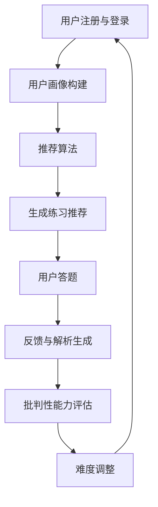

                 

### 第1章：后真相时代的概述

#### 1.1 什么是后真相时代

**后真相时代**，一个由英国政治评论家查尔斯·弗雷德里克·康恩（Charles Fareed Khan）首次提出的概念，指的是一个信息泛滥但事实稀缺的时代。在这个时代，情绪、信仰和偏见往往比事实本身更能影响公众的意见和决策。那么，后真相时代的起源和发展是怎样的呢？

**1.1.1 后真相时代的起源与发展**

后真相时代的兴起可以追溯到互联网和社交媒体的迅速普及。信息的传播速度和范围空前扩大，但信息的真实性和准确性却未能同步提升。假新闻、谣言和误导性信息在网络上泛滥成灾，往往比真实新闻传播得更快、更广。这种信息环境导致了人们对于事实的信任度下降，进而形成了后真相时代的特点。

**1.1.2 后真相时代的特点**

1. **情感驱动**：在传统的真相时代，人们更倾向于依赖事实和逻辑来进行判断和决策。而在后真相时代，情绪和情感往往成为主导因素。人们更愿意相信符合自己情感和信仰的信息，而不是客观事实。

2. **事实稀缺**：信息的爆炸性增长并未带来知识的增长，反而使人们面临信息过载的问题。真正有价值、可靠的信息往往被海量无关信息淹没，难以被发掘。

3. **偏见强化**：在信息筛选的过程中，人们往往倾向于选择那些能够强化自己已有偏见的信息，而忽视那些与自己观点相悖的事实。

**1.1.3 后真相时代对社会的影响**

后真相时代对社会产生了深远的影响，主要表现在以下几个方面：

1. **公众舆论不稳定**：由于真相难以辨别，公众舆论容易受到误导，导致社会情绪波动加剧。

2. **政治动荡**：政治人物和政党的言论往往被夸大或扭曲，导致政治辩论失去了理性基础，政治稳定性受到威胁。

3. **教育困境**：教育系统面临着如何培养学生批判性思维和媒体素养的挑战，以帮助他们在这个充满误导信息的环境中做出明智决策。

#### 1.2 批判性思维的重要性

**批判性思维**，是一种对信息进行理性分析和判断的能力。在后真相时代，批判性思维显得尤为重要。

**1.2.1 批判性思维的定义**

批判性思维是一种主动的、系统性的思考方式，旨在评估信息的真实性、可靠性和价值。它包括以下几个核心要素：

1. **分析能力**：对信息进行细致的分析，识别出其中的逻辑关系和假设。
2. **评估能力**：评估信息的真实性和可靠性，判断其是否符合事实。
3. **反思能力**：对自己的思考过程进行反思，识别和纠正自己的偏见和错误。

**1.2.2 批判性思维的核心要素**

1. **怀疑精神**：对信息持怀疑态度，不轻易接受未经证实的事实。
2. **逻辑推理**：运用逻辑规则，对信息进行分析和推断。
3. **证据意识**：重视证据，用事实和数据来支持观点。
4. **开放性**：保持开放心态，接受不同的观点和信息。

**1.2.3 批判性思维的重要性**

在信息泛滥的后真相时代，批判性思维显得尤为重要。它可以帮助我们：

1. **分辨真假信息**：通过批判性思维，我们能够更好地识别和筛选信息，避免被误导。
2. **做出理性决策**：批判性思维使我们在面对复杂问题时，能够基于事实和逻辑做出更明智的决策。
3. **提升个人素养**：批判性思维是一种高级思维能力，通过培养批判性思维，我们可以提高自己的认知水平和思维能力。

#### 1.3 道场app的概念与应用

**道场app**，是一款旨在锻炼用户批判性思维的移动应用。它通过一系列设计精良的互动练习，帮助用户提高辨识真假信息的能力。

**1.3.1 道场app的定义**

道场app，顾名思义，是一个在线的“思维训练道场”。它为用户提供了一个虚拟的学习环境，通过模拟各种现实生活中的情景，引导用户进行批判性思维的练习。

**1.3.2 道场app的功能与特点**

1. **互动练习**：道场app提供了多种形式的互动练习，包括选择题、判断题、案例分析等，帮助用户在实践中掌握批判性思维技巧。
2. **个性化推荐**：根据用户的学习进度和偏好，道场app会推荐相应的练习内容，使学习更加有针对性。
3. **实时反馈**：用户在完成练习后，可以立即获得详细的反馈和解析，帮助用户了解自己的思考过程和结果。

**1.3.3 道场app在锻炼批判性思维中的作用**

道场app通过以下方式帮助用户锻炼批判性思维：

1. **培养怀疑精神**：通过提供各种真实的和虚假的信息，引导用户学会质疑和验证信息来源。
2. **强化逻辑推理**：通过案例分析等形式，帮助用户学会运用逻辑规则进行分析和推断。
3. **提高证据意识**：通过要求用户提供支持观点的证据，培养用户重视证据、用事实和数据支持观点的习惯。
4. **培养开放性**：通过多样化的练习内容，鼓励用户接受不同的观点和信息，拓宽思维视野。

#### 1.4 app的设计原则与框架

**1.4.1 app的设计原则**

道场app的设计原则主要包括以下几个方面：

1. **用户至上**：以用户的需求和体验为核心，提供高质量的学习内容和服务。
2. **简洁明了**：界面简洁，操作方便，减少用户的学习成本。
3. **个性化**：根据用户的学习进度和偏好，提供个性化的学习建议和内容。
4. **互动性**：通过互动练习和实时反馈，提高用户的学习积极性和效果。

**1.4.2 app的框架结构**

道场app的框架结构主要包括以下几个部分：

1. **用户注册与登录**：用户可以通过邮箱、手机号或第三方账号进行注册和登录。
2. **首页**：首页展示用户的学习进度、推荐练习和最新资讯。
3. **练习模块**：包括各种类型的练习，如选择题、判断题、案例分析等。
4. **反馈与解析**：用户完成练习后，可以查看详细的反馈和解析，了解自己的思考过程和结果。
5. **个人中心**：用户可以查看自己的学习记录、成绩和排名，管理个人资料。

**1.4.3 app的界面设计**

道场app的界面设计注重简洁和易用性，界面布局清晰，操作简单。主要界面包括：

1. **首页**：展示用户的学习进度、推荐练习和最新资讯，用户可以点击进入相应模块。
2. **练习模块**：展示练习题目，用户可以选择作答。
3. **反馈与解析**：展示用户答题的结果和详细的解析，帮助用户了解自己的思考过程。
4. **个人中心**：展示用户的学习记录、成绩和排名，用户可以管理个人资料。

#### 1.5 本章小结

本章主要介绍了后真相时代的背景和特点，批判性思维的重要性，以及道场app的概念、功能与应用。通过本章的学习，我们可以了解到后真相时代给我们带来的挑战，以及如何通过批判性思维和道场app来提高我们辨识信息的能力。在接下来的章节中，我们将进一步探讨批判性思维的原理与实践，以及道场app的具体实现细节和核心算法。

#### 第2章：批判性思维的原理与实践

批判性思维，作为一种高级思维能力，对于在信息泛滥的后真相时代中辨别真假、做出理性决策具有重要意义。本章将深入探讨批判性思维的原理，以及其在不同应用场景中的实践。

#### 2.1 批判性思维的原理

**2.1.1 概念解析**

批判性思维（Critical Thinking），指的是个体在接收和处理信息时，运用逻辑、分析和评估等能力，对信息进行深入思考、质疑和判断的过程。它不仅仅是对信息进行简单的接受或拒绝，而是一种主动、系统性的思考方式。

**2.1.2 理论基础**

批判性思维的理论基础包括以下几个方面：

1. **逻辑学**：逻辑学提供了批判性思维的基本工具，如归纳推理、演绎推理、模态推理等。通过逻辑分析，我们可以识别出信息中的逻辑错误和谬误。
2. **哲学**：哲学特别是认识论和伦理学，为批判性思维提供了理论基础。认识论探讨知识的本质和获取方式，伦理学则帮助我们评估信息的道德价值。
3. **心理学**：心理学研究人类的思维过程和认知结构，帮助我们理解如何识别和纠正思维偏见。

**2.1.3 批判性思维的层次**

批判性思维可以分为以下几个层次：

1. **基础层次**：包括识别逻辑错误和谬误，评估信息的可信度和有效性。
2. **中级层次**：涉及分析信息的来源、动机和潜在偏见，进行跨学科的思考。
3. **高级层次**：包括形成自己的观点和立场，提出创新性的解决方案。

#### 2.2 批判性思维的应用场景

**批判性思维**不仅是一种个人的思考能力，更是一种在各个领域广泛应用的方法。以下是在教育、工作与职业发展、公众舆论与社会治理中应用批判性思维的具体场景：

**2.2.1 教育**

在教育领域，批判性思维被广泛认为是培养学生综合素质的关键能力。通过批判性思维，学生能够：

1. **提高理解能力**：学生不仅学会接受知识，还能理解知识的背景、逻辑和意义。
2. **培养批判精神**：鼓励学生质疑教材和教师的观点，培养独立思考的能力。
3. **增强问题解决能力**：通过批判性思维，学生能够更有效地分析和解决实际问题。

**2.2.2 工作与职业发展**

在工作中，批判性思维同样至关重要。它帮助专业人士：

1. **做出理性决策**：在复杂的商业环境中，通过批判性思维评估不同的策略和方案，做出最优决策。
2. **提升创新能力**：通过批判性思维，专业人员能够识别现有问题和不足，提出创新性的解决方案。
3. **有效沟通**：批判性思维使专业人士能够清晰地表达自己的观点，同时理解和回应他人的观点。

**2.2.3 公众舆论与社会治理**

在公众舆论和社会治理中，批判性思维的应用尤为重要。它可以帮助：

1. **识别谣言和假新闻**：通过批判性思维，公众能够识别信息中的虚假成分，避免被误导。
2. **促进理性讨论**：在政治和社会议题中，批判性思维鼓励公众基于事实和逻辑进行讨论，而不是情绪化的争论。
3. **提升社会治理效率**：通过批判性思维，政府和社会组织能够更好地识别和解决社会问题。

#### 2.3 批判性思维的实际案例

批判性思维在各个领域的应用，可以通过以下实际案例来具体说明：

**2.3.1 政治辩论**

在政治辩论中，批判性思维的重要性尤为突出。政治人物通过批判性思维来：

1. **评估对手的观点**：通过逻辑分析和证据评估，政治人物能够识别对手观点中的逻辑漏洞和事实错误。
2. **提出有力的反驳**：利用批判性思维，政治人物能够构建有力的反驳论点，支持自己的立场。
3. **制定政策方案**：政治决策需要基于事实和数据，通过批判性思维，政治人物能够评估不同的政策方案，选择最优方案。

**2.3.2 学术研究**

在学术研究中，批判性思维是确保研究成果质量和创新性的关键。学术研究者通过批判性思维：

1. **评估研究方法**：批判性思维帮助研究者评估研究方法的有效性和可靠性，确保研究的科学性。
2. **提出创新观点**：通过批判性思维，研究者能够识别现有研究的不足，提出新的研究思路和理论。
3. **进行跨学科研究**：批判性思维鼓励研究者跨越学科界限，综合不同领域的知识和方法，进行跨学科研究。

**2.3.3 媒体分析**

在媒体分析中，批判性思维帮助媒体工作者：

1. **识别信息来源**：通过批判性思维，媒体工作者能够识别信息的真实来源，避免传播未经证实的消息。
2. **评估报道质量**：批判性思维使媒体工作者能够评估报道的客观性和全面性，确保报道的公正性。
3. **撰写深度报道**：通过批判性思维，媒体工作者能够深入挖掘事件背后的原因和影响，撰写具有深度的报道。

#### 2.4 本章小结

本章深入探讨了批判性思维的原理，以及其在教育、工作与职业发展、公众舆论与社会治理等领域的应用。通过实际案例的分析，我们可以看到批判性思维在识别真假信息、做出理性决策、促进理性讨论等方面的关键作用。在下一章中，我们将进一步探讨道场app的功能设计与实现细节。

### 第3章：道场app的功能设计与实现

在了解了批判性思维的重要性和道场app的基本概念后，本章将详细探讨道场app的功能设计与实现。道场app旨在通过一系列互动练习，帮助用户提高批判性思维的能力。

#### 3.1 功能概述

道场app的主要功能模块包括用户注册与登录、练习模块、反馈与解析模块、个人中心等。以下是对这些功能模块的详细介绍。

**3.1.1 主要功能模块**

1. **用户注册与登录**：用户可以通过邮箱、手机号或第三方账号进行注册和登录，以确保用户的隐私和安全。

2. **练习模块**：练习模块是道场app的核心功能，包括多种类型的练习，如选择题、判断题、案例分析等。用户可以根据自己的学习进度和兴趣选择练习内容。

3. **反馈与解析模块**：用户完成练习后，可以立即获得详细的反馈和解析，帮助用户了解自己的思考过程和结果，发现自己的不足并进行改进。

4. **个人中心**：个人中心包括用户的学习记录、成绩和排名，用户可以查看和管理个人资料。

**3.1.2 功能设计思路**

道场app的功能设计思路主要围绕以下几个方面：

1. **用户体验**：以用户的需求和体验为核心，界面设计简洁易用，操作流畅。

2. **个性化**：根据用户的学习进度和偏好，推荐适合的练习内容，提供个性化的学习体验。

3. **互动性**：通过互动练习和实时反馈，提高用户的学习积极性和效果。

4. **可扩展性**：设计灵活的模块化架构，方便后续功能的扩展和更新。

**3.1.3 功能实现难点**

在实现道场app的功能时，面临以下几个难点：

1. **用户身份验证与数据安全**：确保用户注册信息的安全性和唯一性，同时防止恶意用户注册。

2. **练习内容的设计与推荐**：设计丰富多样的练习内容，同时根据用户的学习进度和偏好推荐练习，提高用户的参与度和学习效果。

3. **反馈与解析的准确性**：提供详细、准确的反馈和解析，帮助用户理解自己的思考过程和结果。

#### 3.2 技术实现细节

**3.2.1 前端实现**

道场app的前端使用React框架开发，主要包括以下几个部分：

1. **用户界面**：使用React组件构建用户界面，界面设计简洁易用。

2. **交互设计**：通过React的状态管理和事件处理，实现用户与界面的交互。

3. **数据请求**：使用Axios库进行数据请求，与后端服务进行数据交互。

**3.2.2 后端实现**

道场app的后端使用Spring Boot框架开发，主要包括以下几个部分：

1. **用户管理**：实现用户的注册、登录、身份验证等功能。

2. **练习管理**：存储和管理练习内容，包括练习题库、答案解析等。

3. **反馈管理**：根据用户的答题结果，生成反馈和解析，存储在数据库中。

**3.2.3 数据库设计**

道场app使用MySQL数据库进行数据存储，主要包括以下几个表：

1. **用户表**：存储用户的基本信息，如用户名、密码、邮箱等。

2. **练习表**：存储练习题目、答案、解析等信息。

3. **反馈表**：存储用户的答题结果、反馈和解析。

#### 3.3 用户界面设计

道场app的用户界面设计注重简洁和易用性，主要包括以下几个部分：

1. **首页**：展示用户的学习进度、推荐练习和最新资讯，用户可以点击进入相应模块。

2. **练习模块**：展示练习题目，用户可以选择作答，界面设计清晰，操作简单。

3. **反馈与解析模块**：展示用户答题的结果和详细的解析，帮助用户了解自己的思考过程。

4. **个人中心**：展示用户的学习记录、成绩和排名，用户可以管理个人资料。

**3.3.1 界面布局**

1. **首页**：顶部导航栏，包括用户头像、导航菜单等；中间区域展示学习进度、推荐练习和最新资讯；底部是页脚，包含版权信息和联系方式。

2. **练习模块**：顶部导航栏，包括返回按钮、练习类型选择等；中间区域展示练习题目，用户可以通过滑动屏幕查看题目；底部是提交按钮和答案解析。

3. **反馈与解析模块**：顶部导航栏，包括返回按钮、解析类型选择等；中间区域展示反馈内容和解析，用户可以查看详细解析；底部是关闭按钮。

4. **个人中心**：顶部导航栏，包括返回按钮、个人资料编辑等；中间区域展示学习记录、成绩和排名，用户可以查看详细信息；底部是修改资料和退出登录按钮。

**3.3.2 交互设计**

1. **首页**：用户可以点击推荐练习进入练习模块；点击学习进度可以查看详细学习记录；点击最新资讯可以查看相关资讯。

2. **练习模块**：用户可以通过滑动屏幕查看题目；点击提交按钮可以提交答案；点击答案解析可以查看详细解析。

3. **反馈与解析模块**：用户可以通过滑动屏幕查看反馈内容和解析；点击关闭按钮可以关闭解析界面。

4. **个人中心**：用户可以点击学习记录查看详细记录；点击成绩和排名可以查看排名列表；点击修改资料可以编辑个人资料。

**3.3.3 用户反馈机制**

道场app设有详细的用户反馈机制，用户可以在完成练习后，对练习的难易程度、内容质量等进行评价。同时，用户还可以提交对练习的修改建议和意见。这些反馈将用于改进练习内容和学习体验。

#### 3.4 道场app的测试与优化

**3.4.1 功能测试**

功能测试是确保道场app功能正常运行的重要环节。主要包括以下几个方面：

1. **用户注册与登录**：测试用户注册、登录、身份验证等功能是否正常。
2. **练习模块**：测试练习题目的加载、提交、答案解析等功能是否正常。
3. **反馈与解析模块**：测试用户反馈的提交、显示、处理等功能是否正常。
4. **个人中心**：测试用户学习记录、成绩和排名的显示、更新等功能是否正常。

**3.4.2 性能测试**

性能测试是评估道场app在多用户并发访问下的表现，主要包括以下几个方面：

1. **响应时间**：测试用户在操作不同功能时的响应时间，确保操作流畅。
2. **并发用户数**：测试道场app在多用户并发访问下的性能，确保系统能够稳定运行。
3. **数据存储**：测试数据库的读写性能，确保数据存储的效率和安全性。

**3.4.3 用户反馈收集与优化**

1. **用户反馈收集**：通过用户反馈收集系统，收集用户对道场app的使用体验和建议。
2. **反馈处理**：对收集到的用户反馈进行分析和处理，确定优化方向。
3. **优化实施**：根据用户反馈，对道场app进行功能优化和界面改进，提高用户体验。

#### 3.5 本章小结

本章详细介绍了道场app的功能设计、技术实现细节、用户界面设计和测试与优化。通过本章的学习，我们可以了解到道场app如何通过一系列精心设计的功能模块，帮助用户提高批判性思维能力。在下一章中，我们将进一步探讨道场app的核心算法，以及算法的实现和优化。

### 第4章：道场app的核心算法

道场app的核心算法是提升用户批判性思维能力的核心组件。本章将详细介绍道场app使用的算法类型、原理、实现和优化策略。

#### 4.1 算法概述

**4.1.1 算法类型**

道场app主要使用以下类型的算法：

1. **推荐算法**：用于根据用户的学习进度和偏好推荐适合的练习内容。
2. **分析算法**：用于分析用户的答题数据，生成详细的反馈和解析。
3. **评估算法**：用于评估用户的批判性思维能力，并根据评估结果调整练习难度。

**4.1.2 算法目的**

1. **推荐合适的练习内容**：根据用户的学习进度和偏好，推荐适合的练习内容，提高用户的参与度和学习效果。
2. **生成详细的反馈和解析**：分析用户的答题数据，生成详细的反馈和解析，帮助用户理解自己的思考过程和结果。
3. **评估用户的批判性思维能力**：通过算法评估用户的批判性思维能力，为后续的练习推荐和难度调整提供依据。

**4.1.3 算法重要性**

核心算法在道场app中具有重要地位，它决定了用户的学习体验和效果。一个优秀的算法能够：

1. **提高学习效率**：通过推荐合适的练习内容，让用户更快地掌握批判性思维技巧。
2. **优化用户体验**：通过生成详细的反馈和解析，帮助用户理解自己的思考过程，提高学习效果。
3. **提升用户满意度**：通过算法评估用户的批判性思维能力，不断优化练习内容和难度，提高用户的满意度。

#### 4.2 算法原理与流程

**4.2.1 原理分析**

道场app的核心算法主要基于机器学习和数据挖掘技术。具体来说，包括以下几个步骤：

1. **用户画像构建**：通过用户注册信息、学习行为数据等，构建用户的画像，包括学习进度、偏好等。
2. **推荐算法**：使用基于内容的推荐算法和协同过滤算法，根据用户画像推荐适合的练习内容。
3. **分析算法**：使用自然语言处理和文本分析技术，分析用户的答题数据，生成详细的反馈和解析。
4. **评估算法**：使用统计分析和机器学习模型，评估用户的批判性思维能力，并根据评估结果调整练习难度。

**4.2.2 流程图示**

以下是一个简化的算法流程图：



**4.2.3 算法细节解析**

1. **用户画像构建**：
   - 数据来源：用户注册信息、学习行为数据（如练习完成时间、答题结果等）。
   - 特征提取：用户兴趣、学习进度、答题正确率等。
   - 存储方式：NoSQL数据库（如MongoDB），便于存储和查询大规模用户数据。

2. **推荐算法**：
   - 基于内容的推荐：根据用户历史行为和兴趣，推荐相似的练习内容。
   - 协同过滤推荐：根据用户的行为数据，发现相似用户，推荐这些用户喜欢的练习内容。
   - 算法选择：基于机器学习模型的协同过滤算法，如矩阵分解、KNN等。

3. **分析算法**：
   - 自然语言处理：提取文本中的关键信息，如关键词、主题等。
   - 文本分析：分析文本的语法结构、情感倾向等。
   - 算法选择：基于深度学习的自然语言处理模型，如BERT、GPT等。

4. **评估算法**：
   - 统计分析：计算用户的答题正确率、答题速度等指标。
   - 机器学习模型：使用分类和回归模型，预测用户的批判性思维能力。
   - 算法选择：基于决策树、随机森林、支持向量机等算法。

#### 4.3 算法实现

**4.3.1 Python代码实现**

以下是一个简化的Python代码示例，用于实现用户画像构建和推荐算法：

```python
# 用户画像构建
class UserProfile:
    def __init__(self, user_id, interests, progress, correct_rate):
        self.user_id = user_id
        self.interests = interests
        self.progress = progress
        self.correct_rate = correct_rate

# 用户行为数据
user_data = [
    UserProfile(1, ['逻辑学', '哲学'], 10, 0.8),
    UserProfile(2, ['心理学', '教育学'], 15, 0.75),
    # 更多用户数据...
]

# 基于内容的推荐
def content_based_recommendation(user_profile, exercises):
    recommended = []
    for exercise in exercises:
        if exercise['topic'] in user_profile.interests:
            recommended.append(exercise)
    return recommended

# 基于协同过滤的推荐
from sklearn.neighbors import NearestNeighbors

def collaborative_filtering_recommendation(user_profile, user_data, exercises):
    model = NearestNeighbors()
    model.fit(user_data)
    neighbors = model.kneighbors([user_profile], n_neighbors=5)
    similar_users = neighbors[1][0]
    recommended = []
    for user_id in similar_users:
        user = user_data[user_id]
        recommended.extend(content_based_recommendation(user, exercises))
    return recommended

# 练习数据
exercises_data = [
    {'id': 1, 'topic': '逻辑学', 'difficulty': '初级'},
    {'id': 2, 'topic': '哲学', 'difficulty': '中级'},
    {'id': 3, 'topic': '心理学', 'difficulty': '高级'},
    # 更多练习数据...
]

# 测试推荐算法
user_profile = UserProfile(1, ['逻辑学', '哲学'], 10, 0.8)
recommended_exercises = collaborative_filtering_recommendation(user_profile, user_data, exercises_data)
print("Recommended Exercises:", recommended_exercises)
```

**4.3.2 详细解读**

1. **用户画像构建**：
   - `UserProfile` 类用于存储用户的画像信息，包括用户ID、兴趣、学习进度和答题正确率。
   - `user_data` 列表存储了多个用户的画像信息。

2. **推荐算法**：
   - `content_based_recommendation` 函数用于基于内容的推荐，根据用户的兴趣推荐相似的练习内容。
   - `collaborative_filtering_recommendation` 函数用于基于协同过滤的推荐，根据用户的行为数据找到相似用户，推荐这些用户喜欢的练习内容。
   - 使用 `NearestNeighbors` 类实现基于KNN的协同过滤算法。

3. **测试推荐算法**：
   - 创建一个 `UserProfile` 对象，表示某个用户。
   - 调用 `collaborative_filtering_recommendation` 函数，根据用户画像和练习数据生成推荐列表。

**4.3.3 公式与数学模型解析**

以下是一个简化的推荐算法的数学模型：

$$
R(U, E) = \sum_{i=1}^{N} w_i \cdot R_i(U, E)
$$

其中：
- $R(U, E)$ 是用户 $U$ 对练习 $E$ 的推荐得分。
- $w_i$ 是权重系数，用于平衡不同推荐策略的贡献。
- $R_i(U, E)$ 是基于第 $i$ 个推荐策略的推荐得分。

- **基于内容的推荐**：

$$
R_i(U, E) = \sum_{t \in T(U)} \cdot I(t, e)
$$

其中：
- $T(U)$ 是用户 $U$ 的兴趣集合。
- $I(t, e)$ 是兴趣 $t$ 与练习 $e$ 的匹配度，如 $I(t, e) = 1$ 如果 $t$ 在 $e$ 的主题中，否则为 $0$。

- **基于协同过滤的推荐**：

$$
R_i(U, E) = \frac{1}{|N(U)|} \cdot \sum_{u \in N(U)} r_{u,e}
$$

其中：
- $N(U)$ 是与用户 $U$ 相似用户的集合。
- $r_{u,e}$ 是用户 $u$ 对练习 $e$ 的评分或偏好。

#### 4.4 算法优化

**4.4.1 优化目标**

算法优化的主要目标是提高推荐算法的准确性和效率，主要包括以下几个方面：

1. **准确性**：提高推荐算法的准确度，减少误推荐和漏推荐。
2. **效率**：优化算法的计算复杂度和响应时间，提高系统的处理能力。
3. **可扩展性**：设计灵活的算法架构，便于后续的扩展和升级。

**4.4.2 优化策略**

1. **特征工程**：通过改进用户画像和练习数据的特征提取，提高推荐算法的准确性。
2. **模型选择**：选择合适的机器学习模型，如深度学习模型，提高推荐算法的效率。
3. **并行计算**：使用并行计算技术，提高算法的执行速度。
4. **缓存策略**：使用缓存策略，减少数据库查询次数，提高系统的响应速度。

**4.4.3 优化效果评估**

1. **准确度评估**：使用准确度（Accuracy）、召回率（Recall）和F1值（F1 Score）等指标，评估推荐算法的准确性。
2. **效率评估**：使用响应时间（Response Time）和吞吐量（Throughput）等指标，评估算法的效率。
3. **用户反馈**：收集用户的反馈，评估算法在实际应用中的效果。

#### 4.5 本章小结

本章详细介绍了道场app的核心算法类型、原理、实现和优化策略。通过推荐算法、分析算法和评估算法的综合运用，道场app能够根据用户的学习进度和偏好推荐合适的练习内容，生成详细的反馈和解析，评估用户的批判性思维能力。在下一章中，我们将探讨道场app的案例分析与实战技巧，通过实际案例展示如何使用道场app进行批判性思维训练。

### 第5章：案例分析与实战技巧

在了解了道场app的核心算法之后，本章将通过具体的案例分析和实战技巧，展示如何在实际场景中运用道场app进行批判性思维的训练。通过这些案例，我们将深入探讨批判性思维在解决问题和应对挑战中的应用。

#### 5.1 案例概述

**案例背景**：某公司计划推出一款新产品，但在市场调研和产品设计过程中，团队内部出现了意见分歧。一方认为产品应注重功能性和实用性，另一方则认为产品的外观设计至关重要。

**案例目标**：通过道场app的练习，帮助团队成员提高批判性思维能力，从而在分析和解决意见分歧方面达成共识。

**案例结果**：经过一系列批判性思维训练，团队成员能够更加理性地分析问题，识别出各自的偏见和误区，最终在产品设计方向上达成一致。

#### 5.2 实战技巧

**5.2.1 实践经验总结**

1. **明确问题陈述**：在开始批判性思维训练前，首先要明确问题陈述，确保团队成员对问题的理解一致。

2. **充分准备**：在训练过程中，确保所有参与者都准备好相关的信息和数据，以便进行深入分析。

3. **多样化练习**：通过道场app提供的多种类型的练习，如案例分析、逻辑推理、判断题等，全面提高团队成员的批判性思维能力。

4. **小组讨论**：鼓励团队成员在完成练习后进行小组讨论，分享各自的思考过程和结论，相互学习和借鉴。

5. **反思与总结**：在每次训练结束后，进行反思和总结，分析训练过程中的不足和改进点，为下一次训练提供参考。

**5.2.2 技术难点与解决方案**

1. **技术难点**：
   - **数据收集与处理**：如何收集和处理大量的用户数据，以便生成准确的推荐和反馈。
   - **算法优化**：如何优化推荐算法和分析算法，提高准确性和效率。

2. **解决方案**：
   - **数据收集与处理**：采用大数据技术和分布式计算框架，如Hadoop和Spark，进行高效的数据处理和分析。
   - **算法优化**：通过机器学习技术和深度学习模型，如神经网络和决策树，进行算法优化和性能提升。

**5.2.3 成功案例分析**

1. **案例背景**：某教育机构希望通过道场app提高学生的批判性思维能力，特别是在面对复杂问题和解决实际问题时。

2. **案例目标**：通过道场app的练习，帮助学生学会如何分析问题、提出假设、验证假设和得出结论。

3. **案例结果**：
   - 学生在完成批判性思维训练后，面对实际问题时，能够更加理性地进行分析和决策。
   - 教师反映学生的思维水平和解决问题的能力得到了显著提高。

#### 5.3 实战步骤

**5.3.1 准备工作**

1. **确定训练目标**：明确训练的目标和预期成果，确保所有参与者对训练内容有清晰的认识。

2. **准备练习材料**：根据训练目标，准备相应的练习材料，包括案例分析、逻辑推理题等。

3. **培训指导教师**：为教师提供道场app的使用培训和指导，确保教师能够有效引导和评估学生的训练过程。

**5.3.2 实战操作**

1. **开展训练**：教师引导学生按照设定的训练计划进行练习，确保每个学生都能充分参与。

2. **互动讨论**：在完成练习后，教师组织学生进行互动讨论，分享自己的思考和结论。

3. **反馈与改进**：教师根据学生的表现和反馈，及时给予指导和建议，帮助学生改进自己的思考方法。

**5.3.3 结果分析与优化**

1. **结果分析**：对训练结果进行定量和定性分析，评估学生的批判性思维能力的提升情况。

2. **反馈收集**：收集学生的反馈，了解他们在训练过程中的体验和建议，为后续训练提供改进方向。

3. **优化方案**：根据结果分析和反馈收集，制定优化方案，改进训练内容和教学方法。

#### 5.4 本章小结

本章通过具体案例和实战技巧，展示了如何在实际场景中运用道场app进行批判性思维训练。通过多样化的练习和互动讨论，团队成员和学生能够提高批判性思维能力，更加理性地分析问题和解决问题。在下一章中，我们将探讨道场app的运营与推广策略，以帮助道场app更好地服务于用户，提升其市场影响力。

### 第6章：道场app的运营与推广

在道场app的功能设计、算法实现和实际应用都得到充分验证之后，如何有效地运营与推广这款应用成为了关键一步。本章将详细探讨道场app的运营策略、推广方案以及数据分析和反馈优化，以确保道场app在竞争激烈的市场中取得成功。

#### 6.1 运营策略

**6.1.1 用户增长策略**

1. **内容营销**：通过高质量的内容吸引用户，如撰写批判性思维相关的文章、案例分析、专家访谈等，提升道场app的品牌影响力。
2. **社交媒体推广**：利用Twitter、Facebook、LinkedIn等社交媒体平台，发布有趣、有价值的互动内容，增加用户关注度和参与度。
3. **用户推荐**：鼓励现有用户推荐新用户，可以采用积分奖励机制，提高用户活跃度和忠诚度。

**6.1.2 内容更新策略**

1. **定期更新**：定期发布新的练习内容、课程和活动，确保用户持续有新鲜感和学习动力。
2. **用户参与**：鼓励用户参与内容创作，如分享自己的学习心得、案例分析等，增强用户粘性。
3. **个性化推荐**：根据用户的学习进度和兴趣，个性化推荐适合的练习内容，提高用户的学习体验。

**6.1.3 社区管理策略**

1. **建立活跃社区**：通过论坛、聊天室、小组等形式，建立用户活跃的社区，促进用户之间的互动和交流。
2. **社区活动**：定期举办线上或线下活动，如讲座、研讨会、竞赛等，增强用户对道场app的认同感和归属感。
3. **用户反馈处理**：及时收集并处理用户反馈，改进产品和服务，提高用户满意度。

#### 6.2 推广方案

**6.2.1 线上推广**

1. **搜索引擎优化（SEO）**：优化道场app的网站内容，提高在搜索引擎中的排名，增加有机流量。
2. **付费广告**：通过Google Ads、Facebook Ads等平台投放广告，精准定位目标用户，提高转化率。
3. **内容合作**：与知名博客、媒体、教育机构等进行内容合作，扩大道场app的影响力。

**6.2.2 线下推广**

1. **行业会议与展览**：参加行业相关的会议和展览，展示道场app的功能和优势，吸引潜在用户。
2. **校园推广**：与高校合作，在学校内推广道场app，通过讲座、研讨会等形式，增加用户基础。
3. **合作伙伴推广**：与教育机构、企业等建立合作伙伴关系，通过合作方的渠道推广道场app。

**6.2.3 跨平台推广**

1. **多平台运营**：除了移动应用，还开发桌面版、网页版等，满足不同用户的需求。
2. **多语言支持**：提供多语言版本，扩大用户覆盖范围，特别是在国际市场上。
3. **跨渠道整合**：整合线上线下渠道，如利用社交媒体、邮件营销、短信通知等手段，实现多渠道的用户触达和互动。

#### 6.3 数据分析与反馈优化

**6.3.1 用户行为分析**

1. **用户活跃度分析**：监控用户的登录频率、练习时长、页面浏览量等指标，了解用户活跃度和使用习惯。
2. **用户留存分析**：分析用户的留存率、流失原因等，优化用户体验，提高用户粘性。
3. **用户路径分析**：通过用户路径分析，了解用户在应用中的行为轨迹，发现潜在问题并进行优化。

**6.3.2 数据驱动优化**

1. **A/B测试**：通过A/B测试，比较不同设计、功能、内容等对用户行为和体验的影响，优化产品和服务。
2. **算法调优**：根据用户行为数据，不断调优推荐算法和分析算法，提高推荐准确性和用户体验。
3. **内容优化**：根据用户反馈和数据分析，定期更新和优化练习内容，提高内容质量和用户满意度。

**6.3.3 用户反馈处理**

1. **反馈收集**：通过线上反馈表单、社区互动、用户调研等方式，收集用户的反馈和建议。
2. **反馈分类**：对用户反馈进行分类，如功能问题、内容建议、用户体验等，优先处理重要和紧急的问题。
3. **反馈响应**：及时响应用户反馈，解决问题并给予反馈，提高用户满意度和忠诚度。

#### 6.4 本章小结

通过本章的讨论，我们明确了道场app的运营与推广策略，包括用户增长、内容更新、社区管理和推广方案。同时，通过数据分析和用户反馈优化，不断改进产品和服务，提高用户满意度和市场竞争力。在接下来的章节中，我们将进一步探讨道场app的未来发展方向和潜在的创新机会。

### 全文总结

#### 后真相时代的批判性思维道场app：锻炼辨识能力的移动应用

在后真相时代，信息的真实性和准确性变得前所未有的重要。道场app应运而生，旨在通过一系列精心设计的互动练习，帮助用户提高批判性思维的能力，从而在信息泛滥的环境中有效辨识真假信息。本文从多个角度深入探讨了道场app的核心概念、功能设计、技术实现、应用实践以及运营推广策略。

首先，在**后真相时代的概述**部分，我们了解了后真相时代的起源、特点及其对社会的影响。这一部分强调了批判性思维的重要性，因为只有通过批判性思维，我们才能在复杂的信息环境中保持理性，做出明智的判断。

接着，在**批判性思维的原理与实践**章节，我们详细阐述了批判性思维的定义、核心要素和层次，并通过实际案例展示了其在教育、政治辩论和学术研究等领域的应用。这一部分揭示了批判性思维在实际生活中的重要性，以及如何通过道场app来培养和提高这种能力。

在**道场app的功能设计与实现**章节，我们详细介绍了道场app的功能模块、设计原则、技术实现细节和用户界面设计。通过这一章节，读者可以清楚地了解道场app如何通过互动练习和实时反馈帮助用户锻炼批判性思维。

**道场app的核心算法**章节则深入探讨了推荐算法、分析算法和评估算法的原理、实现和优化策略。这一部分展示了算法在提升用户学习体验和批判性思维能力中的关键作用。

**案例分析与实战技巧**章节通过实际案例展示了道场app在解决具体问题和挑战中的应用，提供了宝贵的实践经验，并提出了优化策略。

最后，在**道场app的运营与推广**章节，我们探讨了如何通过内容营销、社交媒体推广、线上线下活动等多渠道运营策略，以及数据分析和用户反馈优化，确保道场app能够持续吸引用户，提升市场影响力。

总体而言，道场app是一款旨在提高用户批判性思维能力的移动应用。它通过系统化的练习、精准的算法和科学的运营策略，帮助用户在后真相时代中保持清醒的头脑，理性地分析和判断信息。本文不仅为读者提供了对道场app的全面了解，也展示了批判性思维在现代社会中的重要性和应用价值。

#### 作者信息

**作者：AI天才研究院/AI Genius Institute & 禅与计算机程序设计艺术 /Zen And The Art of Computer Programming**

AI天才研究院致力于推动人工智能技术的发展和应用，探索人工智能与人类思维的融合。同时，作者的作品《禅与计算机程序设计艺术》为计算机编程和人工智能领域提供了独特的哲学视角，深受程序员和软件工程师的喜爱。在本文中，作者结合自身丰富的实践经验，深入剖析了道场app的设计与实现，为读者呈现了一幅完整的批判性思维训练图景。

